# Technical Specification

# 0. Agent Action Plan

## 0.1 Intent Clarification

### 0.1.1 Core Feature Objective

Based on the prompt, the Blitzy platform understands that the new feature requirement is to **complete Sprint 7–9: Warehouse Feature Enhancement** for the RudderStack `rudder-server` (v1.68.1) codebase, closing the remaining ~20% warehouse sync parity gap from ~80% to ~95% against Twilio Segment's warehouse offering. This sprint encompasses five discrete epics (E-031 through E-035) that collectively deliver idempotent sync validation, configurable backfill, enhanced health monitoring, selective sync, and warehouse replay capabilities.

The specific feature requirements are:

- **E-031 — Validate Idempotent Sync Across All 9 Connectors:** Implement comprehensive integration tests that verify replay/retry scenarios produce identical warehouse state for all nine warehouse connectors (Snowflake, BigQuery, Redshift, ClickHouse, Delta Lake, PostgreSQL, MSSQL, Azure Synapse, Datalake). Each connector's merge strategy must be tested: SQL MERGE (Snowflake, Delta Lake, PostgreSQL), DELETE+INSERT (Redshift), dedup views (BigQuery), engine-level dedup (ClickHouse), bulk CopyIn (MSSQL, Azure Synapse), and append-only (Datalake).

- **E-032 — Implement Backfill with Configurable Date Ranges:** Build a warehouse-level backfill API endpoint that triggers historical data sync for a specified date range, source, and warehouse destination. Support backfill from the archiver (within its retention window) and from staging files in object storage. Implement a backfill state that integrates with the existing 7-state upload state machine.

- **E-033 — Enhance Warehouse Health Monitoring:** Build a warehouse sync health monitoring system with per-upload metrics including sync status, duration, row counts, error classification, and schema changes. Expose metrics as Prometheus counters/gauges/histograms and via a dedicated HTTP API for dashboard integration. Add alerting thresholds for sync failures, latency spikes, and row count anomalies.

- **E-034 — Add Warehouse Selective Sync:** Implement per-table and per-column sync filtering, allowing users to include or exclude specific tables and columns from warehouse sync. Configuration is delivered via backend-config with runtime filtering applied at the load file generation stage.

- **E-035 — Implement Warehouse Replay from Archived Events:** Build an end-to-end replay pipeline (archiver → replay handler → Gateway → Processor → warehouse) that enables warehouse-targeted replay, re-processing archived events through the warehouse pipeline only while bypassing real-time destination routing.

Implicit requirements surfaced from the documentation and codebase analysis:

- The backfill API (E-032) must integrate with the archiver's 10-day retention window (`JobsDB.archivalTimeInDays: 10`) and support an alternative path via staging files for data beyond that window
- Selective sync (E-034) requires backend-config schema additions coordinated with the Control Plane service, as configuration is distributed via the `TopicBackendConfig` pub/sub mechanism
- Warehouse replay (E-035) requires a routing flag in event metadata to bypass Router/BatchRouter real-time delivery while still flowing through the Processor's 6-stage pipeline into the warehouse path
- The 7-state upload state machine (`warehouse/router/state.go`) must be extended with a backfill-specific state for E-032, introducing new state constants in `warehouse/internal/model/upload.go`
- All new Prometheus metrics (E-033) must follow the existing `stats.Tags` pattern established in `warehouse/router/upload_stats.go`, including `module`, `workspaceId`, `destID`, `destType`, `sourceID`, and `sourceType` tags

### 0.1.2 Special Instructions and Constraints

- **Implement ALL items listed in scope:** For every epic, all variants, endpoints, and sub-cases mentioned in the epic description must be implemented without skipping any
- **Design-only epics:** Epics marked "Design and prototype" require a design document and a minimal proof-of-concept only — no production-grade service code. None of the Sprint 7-9 epics carry this marker, so all five require full production implementation
- **Full pipeline tracing for routing changes:** For E-035 (warehouse replay), the full pipeline must be traced and all components involved must be modified — not just the component that initiates the routing change
- **Docker prerequisite:** If any step requires Docker, start it first — relevant for E-031 (integration testing with Dockerized warehouse connectors)
- **Run all tests after implementation:** All existing and new tests must pass after implementation
- **Fix all CI failures:** Fix all CI failures resolvable through code changes; skip failures caused by missing repository secrets (AWS ECR credentials)
- **Follow `jsonrs` convention:** Per `.golangci.yml` depguard rule, all JSON serialization must use `github.com/rudderlabs/rudder-go-kit/jsonrs` — never `encoding/json` directly
- **Table-driven test patterns:** All new tests must follow Ginkgo BDD (`Describe`/`Context`/`It`) or `t.Run()` subtests with `testify/require` assertions
- **Backward compatibility:** All modifications must maintain backward compatibility with existing warehouse configurations and API contracts

### 0.1.3 Technical Interpretation

These feature requirements translate to the following technical implementation strategy:

- To **validate idempotent sync** (E-031), we will create a comprehensive integration test suite in `integration_test/warehouse/idempotent_sync/` that exercises each connector's merge/dedup strategy by sending duplicate staging files and verifying warehouse state convergence. Tests will leverage `dockertest/v3` for PostgreSQL, ClickHouse, and MSSQL containers, plus mock interfaces for cloud warehouses (Snowflake, BigQuery, Redshift, Delta Lake, Azure Synapse, Datalake).

- To **implement configurable backfill** (E-032), we will extend the warehouse HTTP API (`warehouse/api/http.go`) with a `POST /v1/warehouse/backfill` endpoint, create a backfill orchestrator in `warehouse/router/` that integrates with the existing 7-state upload state machine, and implement backfill source resolution from both the archiver and staging file storage.

- To **enhance health monitoring** (E-033), we will create a `warehouse/healthmonitor/` package that aggregates per-upload metrics from the existing state machine, expose new Prometheus metrics via `stats.Stats` (using the established `statsFactory.NewTaggedStat` pattern), and add a dedicated HTTP health API endpoint at `GET /v1/warehouse/health` with JSON responses for dashboard consumption.

- To **add selective sync** (E-034), we will extend the backend-config schema in `warehouse/bcm/backend_config.go` to parse selective sync settings from destination configuration, implement table/column filtering logic in the load file generation stage (`warehouse/internal/loadfiles/loadfiles.go`), and apply filters during the `GeneratedLoadFiles` state of the upload state machine.

- To **implement warehouse replay** (E-035), we will extend the archiver output to feed a replay handler, add a warehouse-targeted routing flag to event metadata processed in `processor/processor.go`, and configure the Batch Router to route replay events exclusively to warehouse destinations, bypassing real-time Router delivery.

## 0.2 Repository Scope Discovery

### 0.2.1 Comprehensive File Analysis

The following sections enumerate every existing file and folder that requires modification, inspection, or serves as an integration point for the Sprint 7–9 Warehouse Feature Enhancement epics.

**Warehouse Core — Router and State Machine (`warehouse/router/`)**

| File | Relevance | Epics |
|------|-----------|-------|
| `warehouse/router/state.go` | 7-state upload state machine; must be extended with backfill state for E-032 | E-031, E-032 |
| `warehouse/router/upload.go` | `UploadJobFactory` and `UploadJob` lifecycle; core orchestration for all upload operations | E-031, E-032, E-033, E-034 |
| `warehouse/router/upload_stats.go` | `buildTags()`, `timerStat()`, `counterStat()`, `gaugeStat()`, `histogramStat()` helpers; extend for health monitoring | E-033 |
| `warehouse/router/router.go` | Router struct with backend-config subscription, worker queues, scheduler loops; routing changes for backfill and replay | E-032, E-034, E-035 |
| `warehouse/router/scheduling.go` | Upload-creation guards, sync frequency, exclude windows; extend for backfill scheduling | E-032 |
| `warehouse/router/tracker.go` | Background cron monitoring, `warehouse_track_upload_missing` gauge; extend for health alerting | E-033 |
| `warehouse/router/errors.go` | Error-to-`JobErrorType` regex mapping; extend error classification for health monitoring | E-033 |
| `warehouse/router/identities.go` | Historic identity loading; verify compatibility with backfill workflow | E-032 |
| `warehouse/router/state_generate_load_files.go` | Load file generation orchestration; selective sync filtering applied here | E-034 |
| `warehouse/router/state_export_data.go` | Export pipeline across user, identity, and regular tables; selective sync must respect table exclusions | E-034 |
| `warehouse/router/state_create_table_uploads.go` | Table upload list creation; selective sync must filter excluded tables | E-034 |
| `warehouse/router/state_create_schema.go` | Schema creation; selective sync may skip schema for excluded tables | E-034 |
| `warehouse/router/state_generate_upload_schema.go` | Upload schema merge from staging files; selective sync schema filtering | E-034 |
| `warehouse/router/state_update_table_uploads.go` | Table upload count propagation; include selective sync awareness | E-034 |

**Warehouse Core — Internal Model and Repository (`warehouse/internal/`)**

| File | Relevance | Epics |
|------|-----------|-------|
| `warehouse/internal/model/upload.go` | Upload status constants (`Waiting`, `GeneratedUploadSchema`, etc.), `Upload` struct; add backfill-related status constants | E-032, E-033 |
| `warehouse/internal/model/staging.go` | `StagingFile` model; used by backfill source resolution | E-032, E-035 |
| `warehouse/internal/model/load.go` | `LoadFile` model; selective sync filtering applies at this level | E-034 |
| `warehouse/internal/model/schema.go` | Schema model; selective sync schema projection | E-034 |
| `warehouse/internal/model/syncs.go` | Sync latency model; health monitoring metrics source | E-033 |
| `warehouse/internal/repo/upload.go` | Upload repository CRUD; add backfill-specific queries, health monitoring aggregations | E-032, E-033 |
| `warehouse/internal/repo/staging.go` | Staging file repository; backfill date-range queries | E-032, E-035 |
| `warehouse/internal/repo/load.go` | Load file repository; selective sync filtered queries | E-034 |
| `warehouse/internal/repo/table_upload.go` | Table upload repository; per-table health status queries | E-033, E-034 |
| `warehouse/internal/repo/schema.go` | Schema repository; schema-level selective sync filtering | E-034 |
| `warehouse/internal/loadfiles/loadfiles.go` | Load file generation pipeline; primary insertion point for selective sync table/column filtering | E-034 |
| `warehouse/internal/api/api.go` | `POST /v1/process` handler; verify compatibility with backfill-generated staging files | E-032 |

**Warehouse Core — API Layer (`warehouse/api/`)**

| File | Relevance | Epics |
|------|-----------|-------|
| `warehouse/api/http.go` | Chi router with `/v1/warehouse/*` endpoints; add backfill endpoint, health monitoring API, selective sync config endpoint | E-032, E-033, E-034 |
| `warehouse/api/grpc.go` | gRPC server with upload/trigger/retry RPCs; add backfill and health monitoring RPCs | E-032, E-033 |
| `warehouse/api/http_test.go` | Integration tests for HTTP endpoints; extend for new endpoints | E-032, E-033, E-034 |
| `warehouse/api/grpc_test.go` | Integration tests for gRPC endpoints; extend for new RPCs | E-032, E-033 |

**Warehouse Connectors (`warehouse/integrations/`)**

| Directory | Merge Strategy | Epic |
|-----------|---------------|------|
| `warehouse/integrations/snowflake/snowflake.go` | SQL MERGE with staging table, `ROW_NUMBER()` window function | E-031 |
| `warehouse/integrations/bigquery/bigquery.go` | Append with dedup views via `CREATE OR REPLACE VIEW` | E-031 |
| `warehouse/integrations/redshift/redshift.go` | Transactional DELETE+INSERT with dedup window | E-031 |
| `warehouse/integrations/clickhouse/clickhouse.go` | `AggregatingMergeTree`/`ReplacingMergeTree` engine-level dedup | E-031 |
| `warehouse/integrations/deltalake/deltalake.go` | SQL MERGE with partition pruning, `ShouldMerge()` | E-031 |
| `warehouse/integrations/postgres/postgres.go` | SQL MERGE with partition key dedup | E-031 |
| `warehouse/integrations/mssql/mssql.go` | Bulk CopyIn via `mssql.CopyIn` with staging | E-031 |
| `warehouse/integrations/azure-synapse/azure-synapse.go` | Bulk CopyIn with staging, delete-for-dedup | E-031 |
| `warehouse/integrations/datalake/datalake.go` | Append-only, no merge (Glue/local metadata) | E-031 |
| `warehouse/integrations/manager/manager.go` | `Manager`/`WarehouseOperations` interfaces; verify no changes needed for selective sync | E-034 |
| `warehouse/integrations/testhelper/` | Reusable test scaffolding: staging file renderers, event maps, service bootstrapper | E-031 |
| `warehouse/integrations/testdata/` | Docker Compose fixtures, templated JSON payloads for integration tests | E-031 |

**Warehouse Supporting Packages**

| File | Relevance | Epics |
|------|-----------|-------|
| `warehouse/schema/schema.go` | `Handler` interface: `ConsolidateStagingFilesSchema()`, `TableSchemaDiff()`; selective sync schema filtering | E-034 |
| `warehouse/encoding/encoding.go` | Encoding factory (Parquet/JSON/CSV); selective sync column filtering during load file encoding | E-034 |
| `warehouse/app.go` | Warehouse App orchestrator (`Setup`, `Run`); wire new health monitoring, backfill, and replay subsystems | E-032, E-033, E-035 |
| `warehouse/bcm/backend_config.go` | BackendConfigManager; parse selective sync configuration from destination config | E-034 |
| `warehouse/archive/archiver.go` | Warehouse staging/load file archival; integration point for replay pipeline | E-035 |
| `warehouse/archive/cron.go` | `CronArchiver` goroutine; replay trigger integration | E-035 |
| `warehouse/identity/identity.go` | Identity resolution (`Resolve`, `ResolveHistoricIdentities`); verify compatibility with backfill | E-032 |
| `warehouse/multitenant/` | Multi-tenant manager; all new features must be tenant-aware | E-032, E-033, E-034, E-035 |
| `warehouse/utils/` | Shared utilities, destination/object-storage helpers; extend for selective sync config helpers | E-034 |
| `warehouse/validations/` | Destination validation; add selective sync configuration validation | E-034 |

**Event Archival (`archiver/`)**

| File | Relevance | Epics |
|------|-----------|-------|
| `archiver/archiver.go` | Core archiver orchestrator; replay pipeline reads from archiver output | E-035 |
| `archiver/worker.go` | Per-source archival worker; provides gzipped JSONL files for replay | E-035 |
| `archiver/options.go` | `WithArchiveFrom`, `WithArchiveTrigger`; potential customization for replay-oriented archival | E-035 |

**Gateway and Pipeline (`gateway/`, `processor/`, `backend-config/`)**

| File | Relevance | Epics |
|------|-----------|-------|
| `gateway/handle_http_replay.go` | `webReplayHandler()` — existing replay endpoint; extend for warehouse-targeted replay | E-035 |
| `gateway/handle.go` | Core request handler; replay routing metadata injection point | E-035 |
| `backend-config/replay_types.go` | `EventReplayConfig`, `ApplyReplaySources()`; extend for warehouse-targeted replay configuration | E-035 |
| `processor/processor.go` | 6-stage pipeline; add warehouse-only routing flag detection for replay events | E-035 |
| `processor/pipeline_worker.go` | Pipeline channel orchestration; replay routing awareness | E-035 |

**Database Migrations (`sql/migrations/warehouse/`)**

| File | Relevance | Epics |
|------|-----------|-------|
| `sql/migrations/warehouse/000001_create_tables.up.sql` through `000041_*.sql` | Existing 41 migrations; new migrations needed for backfill tracking, selective sync config, and health monitoring tables | E-032, E-033, E-034 |

**Configuration**

| File | Relevance | Epics |
|------|-----------|-------|
| `config/config.yaml` | Master runtime configuration; add new config keys for backfill, health monitoring thresholds, selective sync defaults | E-032, E-033, E-034, E-035 |
| `build/docker.env` | Docker environment variables; document new warehouse config parameters | E-032, E-033 |
| `docker-compose.yml` | Docker Compose stack; verify warehouse integration test infrastructure | E-031 |

**Proto/gRPC**

| File | Relevance | Epics |
|------|-----------|-------|
| `proto/warehouse/warehouse.pb.go` | Generated protobuf Go code; regenerate after adding backfill and health RPCs | E-032, E-033 |
| `proto/warehouse/warehouse_grpc.pb.go` | Generated gRPC service code; regenerate after adding new RPCs | E-032, E-033 |

**Integration Tests**

| File | Relevance | Epics |
|------|-----------|-------|
| `integration_test/warehouse/warehouse_test.go` | Existing warehouse integration test; extend with idempotent sync and backfill scenarios | E-031, E-032 |

### 0.2.2 Web Search Research Conducted

No external web search was required for this sprint scope. All technical decisions are grounded in:
- The warehouse parity analysis (`docs/gap-report/warehouse-parity.md`) which comprehensively documents all gap areas, merge strategies, and remediation paths
- The sprint roadmap (`docs/gap-report/sprint-roadmap.md`) which provides epic-level requirements with source citations
- The existing codebase patterns observed through repository inspection (state machine, encoding factory, stats patterns, integration test scaffolding)

### 0.2.3 New File Requirements

**New source files to create:**

- `warehouse/backfill/backfill.go` — Backfill orchestrator: date-range resolution, source selection (archiver vs. staging files), backfill upload creation
- `warehouse/backfill/handler.go` — HTTP/gRPC handler for backfill API requests, input validation, backfill job submission
- `warehouse/backfill/options.go` — Backfill configuration options: date range, source ID, destination ID, concurrency limits
- `warehouse/healthmonitor/monitor.go` — Health monitoring aggregator: per-upload metrics collection, Prometheus metric emission, alerting threshold evaluation
- `warehouse/healthmonitor/api.go` — HTTP handler for `GET /v1/warehouse/health` endpoint, JSON response builder for dashboard consumption
- `warehouse/healthmonitor/alerts.go` — Alerting logic: sync failure thresholds, latency spike detection, row count anomaly detection
- `warehouse/selectivesync/config.go` — Selective sync configuration parser: per-table and per-column inclusion/exclusion rules from backend-config
- `warehouse/selectivesync/filter.go` — Runtime table/column filter: applied during load file generation and schema consolidation stages
- `warehouse/replay/handler.go` — Warehouse replay orchestrator: archiver-to-Gateway pipeline, warehouse-targeted routing flag injection
- `warehouse/replay/router.go` — Replay routing logic: bypass real-time Router delivery, target warehouse-only processing

**New test files:**

- `warehouse/backfill/backfill_test.go` — Unit tests for backfill orchestration, date-range validation, source resolution logic
- `warehouse/healthmonitor/monitor_test.go` — Unit tests for metric aggregation, alerting threshold evaluation
- `warehouse/healthmonitor/api_test.go` — Integration tests for health HTTP API endpoint
- `warehouse/selectivesync/config_test.go` — Unit tests for selective sync configuration parsing, edge cases
- `warehouse/selectivesync/filter_test.go` — Unit tests for table/column filtering logic
- `warehouse/replay/handler_test.go` — Unit tests for replay pipeline orchestration
- `warehouse/replay/router_test.go` — Unit tests for warehouse-targeted routing
- `integration_test/warehouse/idempotent_sync_test.go` — Comprehensive integration test suite for all 9 connectors' idempotent sync validation
- `integration_test/warehouse/backfill_test.go` — Integration tests for backfill API endpoint
- `integration_test/warehouse/selective_sync_test.go` — Integration tests for selective sync filtering
- `integration_test/warehouse/replay_test.go` — Integration tests for warehouse replay pipeline

**New configuration:**

- `sql/migrations/warehouse/000042_add_backfill_tracking.up.sql` — Migration: add backfill metadata columns to `wh_uploads`, add `wh_backfill_jobs` table
- `sql/migrations/warehouse/000042_add_backfill_tracking.down.sql` — Rollback migration
- `sql/migrations/warehouse/000043_add_selective_sync_config.up.sql` — Migration: add selective sync config columns to `wh_schemas` or create `wh_selective_sync` table
- `sql/migrations/warehouse/000043_add_selective_sync_config.down.sql` — Rollback migration
- `sql/migrations/warehouse/000044_add_health_monitoring_tables.up.sql` — Migration: add `wh_sync_health` table for historical health metrics
- `sql/migrations/warehouse/000044_add_health_monitoring_tables.down.sql` — Rollback migration

**New documentation:**

- `docs/warehouse/backfill.md` — Backfill API documentation, usage guide, retention constraints
- `docs/warehouse/health-monitoring.md` — Health monitoring feature documentation, Prometheus metrics reference, alerting configuration
- `docs/warehouse/selective-sync.md` — Selective sync configuration guide, per-table and per-column examples
- `docs/warehouse/replay.md` — Warehouse replay documentation, pipeline architecture, usage guide

## 0.3 Dependency Inventory

### 0.3.1 Private and Public Packages

The following table lists all key packages relevant to the Sprint 7–9 Warehouse Feature Enhancement, with exact versions drawn from `go.mod`:

| Registry | Package | Version | Purpose |
|----------|---------|---------|---------|
| Go stdlib | `go` | 1.26.0 | Runtime version from `go.mod` |
| GitHub | `github.com/rudderlabs/rudder-go-kit` | v0.72.3 | Core toolkit: config, logger, stats (Prometheus), httputil, jsonrs, filemanager |
| GitHub | `github.com/rudderlabs/rudder-observability-kit` | v0.0.6 | Observability instrumentation: obskit labels, structured logging |
| GitHub | `github.com/rudderlabs/rudder-schemas` | v0.9.1 | Shared schema definitions |
| GitHub | `github.com/go-chi/chi/v5` | v5.2.5 | HTTP router for warehouse API endpoints |
| GitHub | `github.com/lib/pq` | v1.11.2 | PostgreSQL driver: `pq.CopyIn`, `pq.Array` used in warehouse connectors |
| GitHub | `github.com/tidwall/gjson` | v1.18.0 | Fast JSON value extraction for metadata parsing |
| GitHub | `github.com/tidwall/sjson` | v1.2.5 | Fast JSON value mutation for metadata injection |
| GitHub | `github.com/samber/lo` | v1.52.0 | Go generics utility library (map, filter, chunk) |
| GitHub | `github.com/google/uuid` | v1.6.0 | UUID generation for backfill job IDs and upload tracking |
| GitHub | `github.com/cenkalti/backoff/v5` | v5 | Exponential backoff for retry logic in backfill operations |
| GitHub | `github.com/stretchr/testify` | v1.11.1 | Test assertion library (require, assert) |
| GitHub | `github.com/onsi/ginkgo/v2` | v2.24.0 | BDD test framework |
| GitHub | `github.com/onsi/gomega` | v1.38.0 | BDD matcher library |
| GitHub | `github.com/ory/dockertest/v3` | v3.12.0 | Docker container orchestration for idempotent sync integration tests |
| GitHub | `go.uber.org/mock` | v0.6.0 | Mock generation for interface testing |
| GitHub | `golang.org/x/sync` | (from go.mod) | `errgroup` for concurrent operations in backfill and health monitoring |
| GitHub | `github.com/golang-migrate/migrate/v4` | v4.18.3 | Database migration framework for new warehouse migrations |
| GitHub | `github.com/klauspost/compress` | v1.18.4 | Gzip compression for archived event handling in replay |
| GitHub | `github.com/grafana/jsonparser` | v0.0.0-20250908162026 | High-performance JSON parser for selective sync config parsing |
| GitHub | `github.com/jackc/pgx` | (indirect via pq) | PostgreSQL extensions used in identity resolution |
| GitHub | `cloud.google.com/go/bigquery` | v1.72.0 | BigQuery client for idempotent sync validation |
| GitHub | `github.com/ClickHouse/clickhouse-go` | v1.5.4 | ClickHouse driver for idempotent sync testing |
| GitHub | `github.com/allisson/go-pglock/v3` | v3.0.0 | Advisory locks for concurrent backfill operations |
| GitHub | `github.com/rudderlabs/rudder-go-kit/testhelper/docker/resource/postgres` | v0.72.3 | Docker PostgreSQL resource for integration tests |
| GitHub | `github.com/rudderlabs/rudder-go-kit/testhelper/docker/resource/minio` | v0.72.3 | Docker MinIO resource for staging file tests |

### 0.3.2 Dependency Updates

**No new external dependencies are required** for the Sprint 7–9 scope. All five epics leverage the existing dependency set. The warehouse service's existing integration with `rudder-go-kit/stats` provides the Prometheus metric emission infrastructure needed for E-033. The `dockertest/v3` library and existing warehouse integration test helpers already support the integration testing required for E-031.

**Import Updates (files requiring new internal import additions):**

- `warehouse/api/http.go` — Add imports for new backfill, health monitoring, and selective sync handler packages:
  - `github.com/rudderlabs/rudder-server/warehouse/backfill`
  - `github.com/rudderlabs/rudder-server/warehouse/healthmonitor`
  - `github.com/rudderlabs/rudder-server/warehouse/selectivesync`

- `warehouse/router/upload.go` — Add imports for selective sync filter:
  - `github.com/rudderlabs/rudder-server/warehouse/selectivesync`

- `warehouse/router/state_generate_load_files.go` — Add imports for selective sync:
  - `github.com/rudderlabs/rudder-server/warehouse/selectivesync`

- `warehouse/internal/loadfiles/loadfiles.go` — Add imports for selective sync column filtering:
  - `github.com/rudderlabs/rudder-server/warehouse/selectivesync`

- `warehouse/app.go` — Add imports for all new subsystems:
  - `github.com/rudderlabs/rudder-server/warehouse/backfill`
  - `github.com/rudderlabs/rudder-server/warehouse/healthmonitor`
  - `github.com/rudderlabs/rudder-server/warehouse/replay`

- `processor/processor.go` — Add import for warehouse replay routing flag:
  - `github.com/rudderlabs/rudder-server/warehouse/replay`

**External Reference Updates:**

| File | Update Type | Description |
|------|------------|-------------|
| `config/config.yaml` | Configuration | Add `Warehouse.backfill.*`, `Warehouse.healthMonitor.*`, `Warehouse.selectiveSync.*`, `Warehouse.replay.*` parameter sections |
| `docs/gap-report/warehouse-parity.md` | Documentation | Update gap status: WH-001, WH-002 (selective sync) resolved; WH-003 (backfill) resolved; WH-004 (health monitoring) resolved; WH-007 (replay) resolved |
| `docs/gap-report/sprint-roadmap.md` | Documentation | Mark E-031 through E-035 as completed in Sprint 7–9 section |
| `docs/gap-report/index.md` | Documentation | Update warehouse parity from ~80% to ~95% |
| `README.md` | Documentation | Update warehouse sync capabilities section |
| `proto/warehouse/*.proto` | Protobuf | Add backfill and health monitoring RPC definitions (if proto source files exist) |

## 0.4 Integration Analysis

### 0.4.1 Existing Code Touchpoints

**Direct Modifications Required:**

- **`warehouse/router/state.go`** (lines 19–82): The 7-state upload state machine defines `stateTransitions` as a linked list from `Waiting` through `ExportedData`. For E-032 (backfill), a new `BackfillPending` state must be inserted, or the existing `Waiting` state must accept a `backfill` metadata flag. The `init()` function (lines 20–82) must be extended to register the new state, and `inProgressState()`/`nextState()` must handle the new transition.

- **`warehouse/internal/model/upload.go`** (lines 13–25): Upload status constants (`Waiting`, `GeneratedUploadSchema`, `CreatedTableUploads`, etc.) must be extended with backfill-specific constants (e.g., `BackfillPending`, `BackfillInProgress`). The `Upload` struct must include a `BackfillConfig` field for date-range and source parameters.

- **`warehouse/api/http.go`** (lines 140–200): The `addMasterEndpoints()` method registers chi routes under `/v1/warehouse/*`. Three new endpoints must be added:
  - `POST /v1/warehouse/backfill` — Trigger backfill with date range, source ID, destination ID (E-032)
  - `GET /v1/warehouse/health` — Retrieve per-upload health metrics (E-033)
  - `PUT /v1/warehouse/selective-sync` — Update selective sync configuration (E-034)

- **`warehouse/app.go`** (lines 60–150): The `App` struct and `Setup()`/`Run()` methods wire all warehouse subsystems. New fields must be added for the health monitor, backfill service, and replay handler. The `Run()` method must start the health monitor's periodic collection goroutine and register the replay handler.

- **`warehouse/router/upload_stats.go`** (lines 1–100): The `buildTags()`, `timerStat()`, `counterStat()`, `gaugeStat()`, and `histogramStat()` helpers provide the instrumentation foundation. For E-033, new metric names must be defined: `warehouse_sync_duration` (histogram), `warehouse_sync_row_count` (gauge), `warehouse_sync_errors` (counter), `warehouse_sync_status` (gauge), and `warehouse_schema_changes` (counter).

- **`warehouse/router/state_generate_load_files.go`**: The load file generation orchestration must integrate selective sync filtering (E-034). Before generating load files, the table list must be filtered against the selective sync configuration, and column-level filters must be applied during encoding.

- **`warehouse/router/state_export_data.go`**: The export pipeline iterating over user, identity, and regular tables must respect selective sync exclusions. Tables marked as excluded in the selective sync config must be skipped during the export phase.

- **`warehouse/router/state_create_table_uploads.go`**: When creating per-table upload records, excluded tables must not generate `wh_table_uploads` rows.

- **`warehouse/internal/loadfiles/loadfiles.go`**: The `GroupStagingFiles` function and load file generation pipeline must support column-level filtering. When selective sync excludes specific columns, the encoding step must omit those columns from the generated load files.

- **`warehouse/schema/schema.go`** (lines 51–69): The `Handler` interface method `ConsolidateStagingFilesSchema()` must support schema projection — when selective sync excludes tables or columns, the consolidated schema must reflect only the included elements.

- **`warehouse/bcm/backend_config.go`**: The `BackendConfigManager` processes backend-config updates. Selective sync configuration is delivered as part of the destination configuration object. A new parser must extract `selectiveSync.tables` and `selectiveSync.columns` from the destination config map.

- **`warehouse/encoding/encoding.go`** (lines 21–92): The encoding `Factory` and its `NewEventLoader()` method must support column exclusion. When selective sync excludes columns, the event loader must skip those columns during serialization to Parquet/JSON/CSV format.

**Dependency Injections:**

- **`warehouse/app.go` Setup()**: Register health monitor, backfill service, and replay handler as new dependencies injected into the warehouse app lifecycle
- **`warehouse/api/http.go` NewApi()**: Inject health monitor, backfill service, and selective sync config into the API layer for endpoint handler wiring
- **`warehouse/router/router.go` Router struct**: Inject selective sync filter as a dependency used during upload job creation and scheduling

**Database/Schema Updates:**

- **`sql/migrations/warehouse/000042_add_backfill_tracking.up.sql`**: New migration adding `wh_backfill_jobs` table (`id BIGSERIAL PK`, `source_id VARCHAR(64)`, `destination_id VARCHAR(64)`, `workspace_id VARCHAR(64)`, `start_date TIMESTAMPTZ`, `end_date TIMESTAMPTZ`, `status VARCHAR(64)`, `metadata JSONB`, `created_at TIMESTAMPTZ DEFAULT NOW()`, `updated_at TIMESTAMPTZ`) and column `backfill_job_id BIGINT REFERENCES wh_backfill_jobs(id)` on `wh_uploads`

- **`sql/migrations/warehouse/000043_add_selective_sync_config.up.sql`**: New migration adding `wh_selective_sync` table (`id BIGSERIAL PK`, `source_id VARCHAR(64)`, `destination_id VARCHAR(64)`, `workspace_id VARCHAR(64)`, `excluded_tables JSONB`, `excluded_columns JSONB`, `created_at TIMESTAMPTZ DEFAULT NOW()`, `updated_at TIMESTAMPTZ`) with unique constraint on `(source_id, destination_id)`

- **`sql/migrations/warehouse/000044_add_health_monitoring_tables.up.sql`**: New migration adding `wh_sync_health` table (`id BIGSERIAL PK`, `upload_id BIGINT REFERENCES wh_uploads(id)`, `source_id VARCHAR(64)`, `destination_id VARCHAR(64)`, `status VARCHAR(64)`, `duration_ms BIGINT`, `rows_synced BIGINT`, `rows_failed BIGINT`, `error_category VARCHAR(64)`, `schema_changes JSONB`, `created_at TIMESTAMPTZ DEFAULT NOW()`) with indexes on `(source_id, destination_id, created_at)` and `(upload_id)`

### 0.4.2 Integration Architecture

The following diagram illustrates how the five Sprint 7–9 epics integrate with the existing warehouse core:

```mermaid
flowchart TD
    subgraph NewFeatures["Sprint 7-9 New Features"]
        BF["E-032: Backfill Service<br/>warehouse/backfill/"]
        HM["E-033: Health Monitor<br/>warehouse/healthmonitor/"]
        SS["E-034: Selective Sync<br/>warehouse/selectivesync/"]
        WR["E-035: Replay Handler<br/>warehouse/replay/"]
        IS["E-031: Idempotent Tests<br/>integration_test/warehouse/"]
    end

    subgraph ExistingCore["Existing Warehouse Core"]
        SM["State Machine<br/>warehouse/router/state.go"]
        UJ["Upload Job<br/>warehouse/router/upload.go"]
        LF["Load File Gen<br/>warehouse/internal/loadfiles/"]
        SCH["Schema Handler<br/>warehouse/schema/"]
        ENC["Encoding Factory<br/>warehouse/encoding/"]
    end

    subgraph ExistingAPI["Existing API Layer"]
        HTTP["HTTP API<br/>warehouse/api/http.go"]
        GRPC["gRPC Server<br/>warehouse/api/grpc.go"]
        BCM["Backend Config<br/>warehouse/bcm/"]
    end

    subgraph ExistingInfra["Existing Infrastructure"]
        ARCH["Archiver<br/>archiver/"]
        GW["Gateway Replay<br/>gateway/handle_http_replay.go"]
        PROC["Processor<br/>processor/processor.go"]
        CONN["9 Connectors<br/>warehouse/integrations/"]
    end

    BF --> SM
    BF --> HTTP
    BF --> ARCH
    HM --> UJ
    HM --> HTTP
    HM --> GRPC
    SS --> LF
    SS --> SCH
    SS --> ENC
    SS --> BCM
    WR --> ARCH
    WR --> GW
    WR --> PROC
    IS --> CONN
    IS --> SM
```

### 0.4.3 Cross-Epic Dependencies

| Dependency | From Epic | To Epic | Nature |
|-----------|-----------|---------|--------|
| Idempotent sync validation informs backfill reliability | E-031 | E-032 | E-031 must confirm that replaying events produces identical state before backfill can be trusted |
| Backfill state machine extension enables replay | E-032 | E-035 | Replay leverages the backfill infrastructure for warehouse-targeted re-processing |
| Health monitoring observes all upload operations | E-033 | E-031, E-032 | Health metrics capture backfill and replay upload operations alongside regular syncs |
| Selective sync must not interfere with backfill | E-034 | E-032 | Backfill must respect selective sync exclusions, filtering the same tables/columns |
| Replay routing bypasses real-time Router | E-035 | — | Requires Processor-level routing flag, not dependent on other Sprint 7-9 epics |

## 0.5 Technical Implementation

### 0.5.1 File-by-File Execution Plan

**Group 1 — E-031: Idempotent Sync Validation (Integration Tests)**

This epic produces integration tests that exercise every connector's merge strategy under replay scenarios. No production code is created — only test artifacts that validate deterministic sync behavior.

| Action | File Path | Purpose |
|--------|-----------|---------|
| CREATE | `integration_test/warehouse/idempotent_sync_test.go` | Master test suite orchestrating idempotent validation across all 9 connectors |
| CREATE | `integration_test/warehouse/idempotent_snowflake_test.go` | Snowflake SQL MERGE idempotency — replay identical staging files, assert row counts and checksums |
| CREATE | `integration_test/warehouse/idempotent_bigquery_test.go` | BigQuery dedup view idempotency — verify `ROW_NUMBER()` dedup produces stable results on replay |
| CREATE | `integration_test/warehouse/idempotent_redshift_test.go` | Redshift DELETE+INSERT idempotency — validate transactional dedup window (720h default) |
| CREATE | `integration_test/warehouse/idempotent_clickhouse_test.go` | ClickHouse engine-level dedup — test `ReplacingMergeTree` and `AggregatingMergeTree` produce identical state |
| CREATE | `integration_test/warehouse/idempotent_postgres_test.go` | PostgreSQL SQL MERGE idempotency — configurable `allowMerge` flag combinations |
| CREATE | `integration_test/warehouse/idempotent_mssql_test.go` | MSSQL bulk `CopyIn` idempotency — validate staging table cleanup and re-insert |
| CREATE | `integration_test/warehouse/idempotent_synapse_test.go` | Azure Synapse bulk `CopyIn` idempotency — same pattern as MSSQL with Synapse-specific query dialect |
| CREATE | `integration_test/warehouse/idempotent_deltalake_test.go` | Delta Lake MERGE idempotency — test Databricks SQL MERGE with `ShouldMerge()` flag |
| CREATE | `integration_test/warehouse/idempotent_datalake_test.go` | Datalake append-only verification — confirm append semantics produce expected duplicates, not silent drops |
| CREATE | `integration_test/warehouse/testdata/idempotent_events.json` | Canonical event fixtures with known checksums for deterministic replay |
| MODIFY | `warehouse/integrations/testhelper/staging.go` | Add `RenderIdempotentStagingFiles()` helper that generates staging files with configurable duplicate ratios |

**Group 2 — E-032: Backfill with Configurable Date Ranges**

This epic creates the backfill subsystem: a new `backfill/` package, API endpoints, archiver integration, and state machine extension.

| Action | File Path | Purpose |
|--------|-----------|---------|
| CREATE | `warehouse/backfill/service.go` | `BackfillService` orchestrator: validate request, create `wh_backfill_jobs` record, resolve archived staging files from archiver, inject into upload pipeline |
| CREATE | `warehouse/backfill/config.go` | Backfill configuration: `Warehouse.backfill.maxDateRangeDays` (default 90), `Warehouse.backfill.maxConcurrentJobs` (default 3), `Warehouse.backfill.enabled` (default false) |
| CREATE | `warehouse/backfill/handler.go` | HTTP handler for `POST /v1/warehouse/backfill` — parse `BackfillRequest` (sourceID, destinationID, startDate, endDate), delegate to `BackfillService.Trigger()` |
| CREATE | `warehouse/backfill/model.go` | `BackfillJob` struct, `BackfillRequest` / `BackfillResponse` DTOs, `BackfillStatus` constants (`Pending`, `InProgress`, `Completed`, `Failed`) |
| CREATE | `warehouse/backfill/repository.go` | CRUD repository for `wh_backfill_jobs` table: `Create()`, `Get()`, `UpdateStatus()`, `ListBySource()`, `GetActiveCount()` |
| CREATE | `sql/migrations/warehouse/000042_add_backfill_tracking.up.sql` | Create `wh_backfill_jobs` table, add `backfill_job_id` FK column to `wh_uploads` |
| CREATE | `sql/migrations/warehouse/000042_add_backfill_tracking.down.sql` | Drop `backfill_job_id` column from `wh_uploads`, drop `wh_backfill_jobs` table |
| MODIFY | `warehouse/internal/model/upload.go` | Add `BackfillJobID *int64` field to `Upload` struct, add `BackfillPending` and `BackfillInProgress` status constants |
| MODIFY | `warehouse/router/state.go` | Insert `backfillState` after `waitingState` — when `Upload.BackfillJobID` is set, the state machine enters the backfill resolution path before schema generation |
| MODIFY | `warehouse/api/http.go` | Register `POST /v1/warehouse/backfill` and `GET /v1/warehouse/backfill/{jobID}` endpoints in `addMasterEndpoints()` |
| MODIFY | `warehouse/app.go` | Instantiate `BackfillService` in `Setup()`, inject into API layer and router, start background backfill monitor in `Run()` |
| MODIFY | `warehouse/archive/archiver.go` | Add `ListArchivedStagingFiles(sourceID, destID, startDate, endDate)` method that queries archived staging file metadata for backfill retrieval |

**Group 3 — E-033: Warehouse Health Monitoring Enhancement**

This epic introduces per-upload health metrics, a Prometheus-compatible HTTP endpoint, and alerting thresholds.

| Action | File Path | Purpose |
|--------|-----------|---------|
| CREATE | `warehouse/healthmonitor/monitor.go` | `HealthMonitor` struct running periodic collection loop: query recent `wh_uploads` for completion rates, duration percentiles, error categorization |
| CREATE | `warehouse/healthmonitor/config.go` | Health monitoring configuration: `Warehouse.healthMonitor.enabled` (default true), `Warehouse.healthMonitor.collectionIntervalSeconds` (default 60), `Warehouse.healthMonitor.retentionDays` (default 30) |
| CREATE | `warehouse/healthmonitor/handler.go` | HTTP handler for `GET /v1/warehouse/health` returning per-source/destination health summary JSON |
| CREATE | `warehouse/healthmonitor/model.go` | `SyncHealth` struct (upload ID, source, destination, status, duration, rows synced/failed, error category, schema changes) and `HealthSummary` aggregate |
| CREATE | `warehouse/healthmonitor/repository.go` | Repository for `wh_sync_health` table: `RecordSyncHealth()`, `GetHealthSummary()`, `GetHealthByUpload()`, `PurgeOldRecords()` |
| CREATE | `warehouse/healthmonitor/metrics.go` | Prometheus metric definitions: `warehouse_sync_duration_seconds` (histogram), `warehouse_sync_rows_total` (counter), `warehouse_sync_errors_total` (counter with `error_category` label), `warehouse_sync_status` (gauge), `warehouse_schema_changes_total` (counter) |
| CREATE | `warehouse/healthmonitor/alerting.go` | Alerting evaluator: configurable thresholds for failure rate, duration spikes, schema drift detection — emits tagged stats for external alerting integration |
| CREATE | `sql/migrations/warehouse/000044_add_health_monitoring_tables.up.sql` | Create `wh_sync_health` table with indexes on `(source_id, destination_id, created_at)` and `(upload_id)` |
| CREATE | `sql/migrations/warehouse/000044_add_health_monitoring_tables.down.sql` | Drop `wh_sync_health` table |
| MODIFY | `warehouse/router/upload_stats.go` | Add `recordSyncHealth()` call at end of `generateUploadSuccessMetrics()` and in error paths, writing to `wh_sync_health` via the health monitor repository |
| MODIFY | `warehouse/api/http.go` | Register `GET /v1/warehouse/health` and `GET /v1/warehouse/health/{sourceID}/{destID}` endpoints |
| MODIFY | `warehouse/api/grpc.go` | Add `GetSyncHealth` and `GetHealthSummary` RPCs to the gRPC service definition |
| MODIFY | `warehouse/app.go` | Instantiate `HealthMonitor` in `Setup()`, inject into API, start collection loop in `Run()` |

**Group 4 — E-034: Warehouse Selective Sync**

This epic delivers per-table and per-column filtering, configured via backend-config and persisted in a dedicated table.

| Action | File Path | Purpose |
|--------|-----------|---------|
| CREATE | `warehouse/selectivesync/service.go` | `SelectiveSyncService` — evaluates table/column inclusion against the sync configuration, provides `IsTableExcluded(table)` and `IsColumnExcluded(table, column)` predicates |
| CREATE | `warehouse/selectivesync/config.go` | Selective sync configuration: `Warehouse.selectiveSync.enabled` (default false), `Warehouse.selectiveSync.cacheRefreshMinutes` (default 5) |
| CREATE | `warehouse/selectivesync/handler.go` | HTTP handlers for `PUT /v1/warehouse/selective-sync` (update config) and `GET /v1/warehouse/selective-sync/{sourceID}/{destID}` (retrieve config) |
| CREATE | `warehouse/selectivesync/model.go` | `SelectiveSyncConfig` struct (excluded tables list, excluded columns map keyed by table), `SelectiveSyncRequest` / `SelectiveSyncResponse` DTOs |
| CREATE | `warehouse/selectivesync/repository.go` | CRUD repository for `wh_selective_sync` table: `Upsert()`, `Get()`, `Delete()`, `ListByWorkspace()` |
| CREATE | `sql/migrations/warehouse/000043_add_selective_sync_config.up.sql` | Create `wh_selective_sync` table with unique constraint on `(source_id, destination_id)` |
| CREATE | `sql/migrations/warehouse/000043_add_selective_sync_config.down.sql` | Drop `wh_selective_sync` table |
| MODIFY | `warehouse/bcm/backend_config.go` | Parse `selectiveSync` block from destination config payload, populate `SelectiveSyncConfig` and distribute to subscribers |
| MODIFY | `warehouse/schema/schema.go` | Modify `ConsolidateStagingFilesSchema()` to accept a `SelectiveSyncConfig`, removing excluded tables from the consolidated schema map and excluded columns from table schemas |
| MODIFY | `warehouse/encoding/encoding.go` | Modify `NewEventLoader()` to accept an exclusion list, skipping excluded columns during event serialization |
| MODIFY | `warehouse/internal/loadfiles/loadfiles.go` | Modify `GroupStagingFiles()` to apply table-level exclusions, skipping staging files for excluded tables |
| MODIFY | `warehouse/router/state_generate_load_files.go` | Retrieve selective sync config before load file generation, pass exclusion predicates to loadfiles pipeline |
| MODIFY | `warehouse/router/state_export_data.go` | Filter table iteration to skip excluded tables during data export |
| MODIFY | `warehouse/router/state_create_table_uploads.go` | Skip creation of `wh_table_uploads` records for excluded tables |
| MODIFY | `warehouse/api/http.go` | Register selective sync endpoints in `addMasterEndpoints()` |
| MODIFY | `warehouse/app.go` | Instantiate `SelectiveSyncService`, inject into router, API, and bcm |

**Group 5 — E-035: Warehouse Replay from Archived Events**

This epic builds the replay pipeline: archiver-to-replay retrieval, Gateway routing, Processor warehouse-only flag, and upload tracking.

| Action | File Path | Purpose |
|--------|-----------|---------|
| CREATE | `warehouse/replay/handler.go` | `ReplayHandler` — coordinates the full pipeline: query archived events, construct replay payload, inject into Gateway replay endpoint, track replay upload jobs |
| CREATE | `warehouse/replay/config.go` | Replay configuration: `Warehouse.replay.enabled` (default false), `Warehouse.replay.maxConcurrentReplays` (default 2), `Warehouse.replay.batchSize` (default 1000), `Warehouse.replay.timeoutMinutes` (default 60) |
| CREATE | `warehouse/replay/model.go` | `ReplayRequest` (sourceID, destinationID, startTime, endTime, replayType), `ReplayJob` (job tracking with status), `ReplayStatus` constants |
| CREATE | `warehouse/replay/retriever.go` | `ArchivedEventRetriever` — queries the archiver for gateway events within the date range, deserializes from archived format, batches for replay injection |
| MODIFY | `gateway/handle_http_replay.go` | Extend `webReplayHandler()` to accept a `X-Warehouse-Replay: true` header that tags events for warehouse-only routing |
| MODIFY | `backend-config/replay_types.go` | Extend `EventReplayConfig` with `WarehouseOnly bool` field, modify `ApplyReplaySources()` to propagate the warehouse-only flag |
| MODIFY | `processor/processor.go` | In the main processing loop, detect `WarehouseOnly` flag on replay events and route exclusively to warehouse destination, bypassing Router-stage destinations |
| MODIFY | `warehouse/archive/archiver.go` | Add `QueryArchivedEvents(sourceID, startTime, endTime)` method returning an iterator over archived gateway event payloads |
| MODIFY | `warehouse/api/http.go` | Register `POST /v1/warehouse/replay` and `GET /v1/warehouse/replay/{jobID}` endpoints |
| MODIFY | `warehouse/app.go` | Instantiate `ReplayHandler`, wire archiver query interface, register in API layer |

**Group 6 — Cross-Cutting Modifications (Tests, Documentation, Configuration)**

| Action | File Path | Purpose |
|--------|-----------|---------|
| CREATE | `warehouse/backfill/service_test.go` | Unit tests for backfill service: valid/invalid date ranges, concurrent job limits, archiver integration |
| CREATE | `warehouse/backfill/handler_test.go` | HTTP handler tests: request parsing, validation errors, authorization |
| CREATE | `warehouse/backfill/repository_test.go` | Repository tests with test database: CRUD operations, status transitions |
| CREATE | `warehouse/healthmonitor/monitor_test.go` | Unit tests for health collection: metric aggregation, purge logic |
| CREATE | `warehouse/healthmonitor/handler_test.go` | HTTP handler tests: health summary response, per-source filtering |
| CREATE | `warehouse/healthmonitor/alerting_test.go` | Alerting evaluator tests: threshold crossing, cooldown, alert suppression |
| CREATE | `warehouse/selectivesync/service_test.go` | Unit tests: table/column exclusion predicates, config inheritance |
| CREATE | `warehouse/selectivesync/handler_test.go` | HTTP handler tests: config creation/update, validation |
| CREATE | `warehouse/selectivesync/repository_test.go` | Repository tests: upsert semantics, constraint enforcement |
| CREATE | `warehouse/replay/handler_test.go` | Unit tests: replay orchestration, error paths, timeout handling |
| CREATE | `warehouse/replay/retriever_test.go` | Unit tests: archived event deserialization, batching, date filtering |
| MODIFY | `warehouse/router/state_test.go` | Add test cases for backfill state transition and selective sync state filtering |
| MODIFY | `warehouse/api/http_test.go` | Add test cases for all new endpoints (backfill, health, selective sync, replay) |
| MODIFY | `warehouse/encoding/encoding_test.go` | Add test cases for column exclusion during event encoding |
| MODIFY | `warehouse/schema/schema_test.go` | Add test cases for schema consolidation with selective sync exclusions |

### 0.5.2 Implementation Approach per File

**Establish Feature Foundations (E-031 + E-032 first)**

- Begin with E-031 idempotent sync tests to validate existing merge strategies, building test infrastructure that confirms the current system produces deterministic output
- Create the `warehouse/backfill/` package with `model.go` and `config.go` to define the data structures before implementing business logic
- Add SQL migration `000042` for `wh_backfill_jobs` to establish the persistence layer
- Implement `repository.go` with standard CRUD operations using the existing `sqlquerywrapper` pattern (consistent with `warehouse/internal/repo/`)
- Build `service.go` as the orchestrator, delegating to the repository for persistence and the archiver for data retrieval
- Wire `handler.go` into the existing Chi router pattern via `warehouse/api/http.go`
- Extend the state machine in `warehouse/router/state.go` to accommodate backfill uploads

**Integrate Health Monitoring (E-033 parallel track)**

- Create `warehouse/healthmonitor/` package with the monitor loop pattern matching `warehouse/archive/cron.go` (context-cancellable ticker loop)
- Define Prometheus metrics using `statsFactory.NewTaggedStat()` consistent with `warehouse/router/upload_stats.go`
- Instrument the upload pipeline by adding `recordSyncHealth()` hooks at success and failure points in the existing stat emission code
- Expose health data via HTTP API and gRPC extensions

**Layer Selective Sync Filtering (E-034)**

- Create `warehouse/selectivesync/` package as a pure predicate service — stateless after configuration load
- Integrate with `warehouse/bcm/backend_config.go` to receive config updates via the existing subscription model
- Thread exclusion predicates through the load file generation pipeline: `state_generate_load_files.go` → `loadfiles.go` → `encoding.go`
- Apply table-level exclusion at `state_export_data.go` and `state_create_table_uploads.go`

**Construct Replay Pipeline (E-035 depends on E-032)**

- Create `warehouse/replay/` package with the retriever querying archived events through `warehouse/archive/archiver.go`
- Modify `gateway/handle_http_replay.go` to detect warehouse-only headers and tag events accordingly
- Modify `processor/processor.go` to detect the warehouse-only flag and skip Router-stage routing
- Wire the replay handler into the API layer with job tracking

### 0.5.3 User Interface Design

This sprint scope is entirely backend and API-driven. No frontend UI components are required. All interactions occur through:

- **REST API** (`/v1/warehouse/*` endpoints on port 8082) — consumed by control plane, CLI tools, and Grafana-based dashboards
- **gRPC API** (port 8082) — consumed by internal services and programmatic integrations
- **Prometheus metrics** (`/metrics` endpoint) — consumed by Prometheus scraper and Grafana dashboards
- **Backend-config** (selective sync configuration pushed from control plane) — consumed by the warehouse backend-config manager

Key API response contracts:

- `POST /v1/warehouse/backfill` → `{ "jobID": int64, "status": "Pending" }`
- `GET /v1/warehouse/health` → `{ "sources": [{ "sourceID": "...", "destinations": [{ "destID": "...", "syncDuration": {...}, "rowsSynced": int64, "errorRate": float64, "lastSync": "..." }] }] }`
- `PUT /v1/warehouse/selective-sync` → `{ "status": "updated", "sourceID": "...", "destID": "..." }`
- `POST /v1/warehouse/replay` → `{ "jobID": int64, "status": "Pending" }`

## 0.6 Scope Boundaries

### 0.6.1 Exhaustively In Scope

**E-031: Idempotent Sync Validation**

- Integration test files: `integration_test/warehouse/idempotent_*_test.go` (all 9 connectors)
- Test data fixtures: `integration_test/warehouse/testdata/idempotent_events.json`
- Test helper extensions: `warehouse/integrations/testhelper/staging.go`
- Connector-specific merge strategies under test:
  - `warehouse/integrations/snowflake/snowflake.go` (SQL MERGE)
  - `warehouse/integrations/bigquery/bigquery.go` (dedup views)
  - `warehouse/integrations/redshift/redshift.go` (DELETE+INSERT)
  - `warehouse/integrations/clickhouse/clickhouse.go` (engine-level dedup)
  - `warehouse/integrations/postgres/postgres.go` (SQL MERGE)
  - `warehouse/integrations/mssql/mssql.go` (bulk CopyIn)
  - `warehouse/integrations/azure-synapse/azure_synapse.go` (bulk CopyIn)
  - `warehouse/integrations/deltalake/deltalake.go` (MERGE)
  - `warehouse/integrations/datalake/datalake.go` (append-only)
- Middleware verification: `warehouse/integrations/middleware/*.go`

**E-032: Backfill with Configurable Date Ranges**

- New package: `warehouse/backfill/**/*.go` (service, config, handler, model, repository)
- New package tests: `warehouse/backfill/**/*_test.go`
- SQL migrations: `sql/migrations/warehouse/000042_add_backfill_tracking.{up,down}.sql`
- State machine extension: `warehouse/router/state.go`
- Upload model extension: `warehouse/internal/model/upload.go`
- API endpoint registration: `warehouse/api/http.go`
- Archiver query extension: `warehouse/archive/archiver.go`
- App wiring: `warehouse/app.go`
- Existing state tests: `warehouse/router/state_test.go`
- Existing API tests: `warehouse/api/http_test.go`

**E-033: Warehouse Health Monitoring Enhancement**

- New package: `warehouse/healthmonitor/**/*.go` (monitor, config, handler, model, repository, metrics, alerting)
- New package tests: `warehouse/healthmonitor/**/*_test.go`
- SQL migrations: `sql/migrations/warehouse/000044_add_health_monitoring_tables.{up,down}.sql`
- Stats instrumentation: `warehouse/router/upload_stats.go`
- API endpoint registration: `warehouse/api/http.go`
- gRPC service extension: `warehouse/api/grpc.go`
- App wiring: `warehouse/app.go`

**E-034: Warehouse Selective Sync**

- New package: `warehouse/selectivesync/**/*.go` (service, config, handler, model, repository)
- New package tests: `warehouse/selectivesync/**/*_test.go`
- SQL migrations: `sql/migrations/warehouse/000043_add_selective_sync_config.{up,down}.sql`
- Backend config parsing: `warehouse/bcm/backend_config.go`
- Schema consolidation: `warehouse/schema/schema.go`
- Encoding pipeline: `warehouse/encoding/encoding.go`
- Load file generation: `warehouse/internal/loadfiles/loadfiles.go`
- State handlers: `warehouse/router/state_generate_load_files.go`, `warehouse/router/state_export_data.go`, `warehouse/router/state_create_table_uploads.go`
- API endpoint registration: `warehouse/api/http.go`
- App wiring: `warehouse/app.go`
- Existing tests: `warehouse/encoding/encoding_test.go`, `warehouse/schema/schema_test.go`

**E-035: Warehouse Replay from Archived Events**

- New package: `warehouse/replay/**/*.go` (handler, config, model, retriever)
- New package tests: `warehouse/replay/**/*_test.go`
- Gateway replay handler: `gateway/handle_http_replay.go`
- Backend config replay types: `backend-config/replay_types.go`
- Processor routing logic: `processor/processor.go`
- Archiver query interface: `warehouse/archive/archiver.go`
- API endpoint registration: `warehouse/api/http.go`
- App wiring: `warehouse/app.go`

**Cross-Cutting: Configuration**

- Feature flags under `Warehouse.backfill.*`, `Warehouse.healthMonitor.*`, `Warehouse.selectiveSync.*`, `Warehouse.replay.*`
- Environment variable documentation: `.env.example`

**Cross-Cutting: Documentation**

- `docs/warehouse/backfill.md` — Backfill API reference and usage guide
- `docs/warehouse/health-monitoring.md` — Health monitoring configuration and metrics catalog
- `docs/warehouse/selective-sync.md` — Selective sync configuration and behavior
- `docs/warehouse/replay.md` — Replay pipeline architecture and usage

### 0.6.2 Explicitly Out of Scope

- **Sprint 1–6 and Sprint 10 scope**: No work on Event Spec Parity (Sprint 1–2), Gateway Hardening (Sprint 3–4), Processor Enrichment (Sprint 5–6), or Observability Platform (Sprint 10)
- **Frontend / control plane UI**: No dashboard or web UI for backfill, health, selective sync, or replay — only backend APIs
- **Connector feature additions**: No new warehouse connector implementations (the existing 9 connectors are exercised but not extended with new features)
- **Performance optimization of existing sync pipeline**: No refactoring of the existing state machine, load file generation, or export pipeline for speed — only functional extensions
- **Data retention policy changes**: No modifications to existing archival schedules or JobsDB retention beyond what backfill/replay require
- **Multi-tenancy isolation**: No changes to workspace isolation, tenant management, or quota enforcement
- **Authentication / authorization changes**: No new auth middleware — new endpoints inherit existing auth from the Chi router middleware chain
- **Schema migration tooling**: No changes to the Goose migration runner itself — only new migration files
- **Monitoring infrastructure**: No Prometheus server setup, Grafana dashboard provisioning, or AlertManager configuration — only metric emission from the warehouse process
- **Load testing**: No performance/load test suites — only functional correctness tests
- **Connector-level DDL changes**: No modifications to warehouse DDL generation (CREATE TABLE, ALTER TABLE) beyond what selective sync requires for column exclusion
- **Refactoring unrelated modules**: No changes to `regulation-worker/`, `services/`, `jobsdb/`, `config/`, `admin/`, or other packages unless directly required by an integration touchpoint

## 0.7 Rules for Feature Addition

### 0.7.1 User-Specified Rules

The following rules are explicitly stated in the user's instructions and must be enforced throughout implementation:

- **Implement ALL items in scope**: For every epic, implement ALL items listed in scope — do not skip any variant, endpoint, or sub-case mentioned in the epic description. Every connector must be tested (E-031), every API endpoint must be created (E-032 through E-035), and every configuration parameter must be implemented.

- **Design-only epics**: For epics marked "Design and prototype," deliver a design document and a minimal proof-of-concept only — do not implement production-grade service code. (Note: No Sprint 7–9 epic carries this designation; all five epics are full implementations.)

- **Full pipeline tracing for routing changes**: For epics that require bypassing or modifying routing behavior, trace the full pipeline and modify all components involved — not just the component that initiates the change. This directly applies to E-035 (Warehouse Replay), where the replay flag must be propagated from `gateway/handle_http_replay.go` through `backend-config/replay_types.go` and `processor/processor.go` to ensure warehouse-only routing.

- **Docker prerequisite**: If any step requires Docker, start it first. Integration tests in E-031 use `dockertest/v3` for spinning up connector containers — Docker must be running before test execution.

- **Run all tests after implementation**: Execute the full test suite after completing implementation changes. Use non-interactive, non-watch mode: `go test ./... -count=1 -timeout 600s`.

- **Fix all CI failures resolvable through code changes**: Any test failure or linting error that can be resolved by modifying source code must be fixed before marking completion.

- **Skip failures caused by missing repository secrets**: Failures due to missing AWS ECR credentials or other repository secrets that are unavailable in the development environment should be documented but not blocked on.

### 0.7.2 Architectural Conventions

The following conventions are derived from codebase analysis and must be followed for consistency:

- **Package structure**: Each new feature lives in its own sub-package under `warehouse/` (e.g., `warehouse/backfill/`, `warehouse/healthmonitor/`, `warehouse/selectivesync/`, `warehouse/replay/`). Each package contains `service.go`, `config.go`, `handler.go`, `model.go`, and `repository.go` following the pattern established by `warehouse/internal/` and `warehouse/archive/`.

- **Configuration pattern**: All configuration must use the `config.GetReloadableIntVar()` / `config.GetReloadableDurationVar()` / `config.GetReloadableBoolVar()` pattern, consistent with how `warehouse/archive/archiver.go` and `warehouse/app.go` register configuration keys. Keys must be nested under `Warehouse.<featureName>.<paramName>`.

- **Stats emission**: All metrics must use `statsFactory.NewTaggedStat()` with the standard tag set (`module`, `workspaceId`, `warehouseID`, `destID`, `destType`, `sourceID`, `sourceType`) as established in `warehouse/router/upload_stats.go`.

- **Repository pattern**: Database access must follow the repository pattern used in `warehouse/internal/repo/` — struct with `db *sqlquerywrapper.DB`, methods returning typed models, SQL queries as string constants.

- **Error handling**: Use categorized error types from `warehouse/internal/model/upload.go` (`UncategorizedError`, `PermissionError`, etc.) for warehouse-specific errors. New error categories may be added for backfill and replay failures.

- **HTTP handler pattern**: Use Chi router middleware chain as established in `warehouse/api/http.go` — `StatMiddleware`, JSON content type, structured error responses with `status` and `message` fields.

- **Context propagation**: All long-running operations must accept `context.Context` as the first parameter, supporting graceful shutdown through context cancellation (consistent with `warehouse/archive/cron.go`).

- **Test conventions**: Unit tests use `testify/require` assertions, table-driven `t.Run()` subtests, and `gomock` for interface mocking. Integration tests use `dockertest/v3` for container management and the existing helpers in `warehouse/integrations/testhelper/`.

### 0.7.3 Backward Compatibility Requirements

- **API backward compatibility**: All existing `/v1/warehouse/*` endpoints must continue to function without modification. New endpoints are additive only.
- **State machine backward compatibility**: Existing upload jobs (those without a `BackfillJobID`) must traverse the state machine exactly as before. The backfill state is only entered when `BackfillJobID` is non-nil.
- **Schema backward compatibility**: SQL migrations must be strictly additive — new tables and new nullable columns only. No existing column type changes, no column drops, no table renames.
- **Configuration backward compatibility**: All new configuration keys must have safe defaults that maintain current behavior when unset. Features default to disabled (`enabled: false` for backfill, selective sync, and replay).
- **Metric backward compatibility**: Existing metric names and tag keys must not change. New metrics are additive and use distinct names to avoid collision.
- **Backend-config backward compatibility**: The selective sync config parser must gracefully handle destination configurations that do not contain a `selectiveSync` block — defaulting to no exclusions (all tables and columns included).

## 0.8 References

### 0.8.1 Codebase Files and Folders Searched

The following files and folders were retrieved and analyzed to derive the conclusions in this Agent Action Plan:

**Reference Documentation (User-Specified)**

| File Path | Purpose |
|-----------|---------|
| `docs/gap-report/sprint-roadmap.md` | Sprint planning document defining Sprints 1–10, with Sprint 7–9 (Warehouse Feature Enhancement) as the assigned scope |
| `docs/gap-report/warehouse-parity.md` | Warehouse parity analysis detailing ~80% parity, 8 gap IDs (WH-001 through WH-008), competitive strengths and weaknesses |
| `blitzy/documentation/Technical Specifications.md` | Prior technical specification document with feature catalog, architecture, database design, and deployment infrastructure |
| `blitzy/documentation/Project Guide.md` | Previous sprint's Agent Action Plan for Event Spec Parity (Sprint 1–2), used as structural template |

**Warehouse Core (State Machine, Upload Pipeline)**

| File Path | Lines Inspected | Key Findings |
|-----------|----------------|--------------|
| `warehouse/router/state.go` | 1–120 | 7-state linked list state machine: Waiting → GenerateUploadSchema → CreateTableUploads → GenerateLoadFiles → UpdateTableUploadCounts → CreateRemoteSchema → ExportData, with Aborted terminal |
| `warehouse/router/upload.go` | 1–80 | UploadJob struct and execution methods for per-upload processing |
| `warehouse/internal/model/upload.go` | 1–80 | Upload status constants (12 states), error type constants (8 categories), Upload struct definition |
| `warehouse/router/upload_stats.go` | 1–100 | Stats helpers: buildTags(), timerStat(), counterStat(), gaugeStat(), metric emission for totalRowsSynced, uploadSuccess |
| `warehouse/router/state_generate_load_files.go` | Full | Load file generation orchestration state handler |
| `warehouse/router/state_export_data.go` | Full | Data export state handler iterating user, identity, and regular tables |
| `warehouse/router/state_create_table_uploads.go` | Full | Per-table upload record creation handler |
| `warehouse/app.go` | 1–150 | App struct wiring, New() config reads, Setup() initialization, Run() lifecycle |

**Warehouse API Layer**

| File Path | Lines Inspected | Key Findings |
|-----------|----------------|--------------|
| `warehouse/api/http.go` | 1–200 | Chi router, StatMiddleware, addMasterEndpoints() registering /v1/warehouse/* routes |
| `warehouse/api/grpc.go` | Summary | gRPC server with 15+ RPCs on port 8082 |

**Warehouse Sub-Packages**

| File Path | Lines Inspected | Key Findings |
|-----------|----------------|--------------|
| `warehouse/schema/schema.go` | 1–100 | Handler interface, TTL-cached schema with 720-minute default |
| `warehouse/encoding/encoding.go` | 1–92 | Encoding Factory, NewEventLoader() for Parquet/JSON/CSV serialization |
| `warehouse/internal/loadfiles/loadfiles.go` | Summary | Load file generation pipeline, GroupStagingFiles() function |
| `warehouse/bcm/backend_config.go` | Summary | BackendConfigManager processing config updates via subscription |
| `warehouse/archive/archiver.go` | 1–120 | Archiver struct with configurable archival (5-day default), retention (90-day), batch processing |
| `warehouse/archive/cron.go` | Full | CronArchiver ticker loop with context cancellation, Do()+Delete() operations |

**Connectors (Merge Strategy Verification for E-031)**

| File Path | Strategy Verified |
|-----------|------------------|
| `warehouse/integrations/snowflake/snowflake.go` | SQL MERGE with ShouldMerge() and allowMerge config |
| `warehouse/integrations/bigquery/bigquery.go` | Dedup views via CREATE OR REPLACE VIEW with ROW_NUMBER() |
| `warehouse/integrations/redshift/redshift.go` | Transactional DELETE+INSERT with dedup window (720h default) |
| `warehouse/integrations/clickhouse/clickhouse.go` | AggregatingMergeTree / ReplacingMergeTree engine-level dedup |
| `warehouse/integrations/postgres/postgres.go` | SQL MERGE with configurable allowMerge |
| `warehouse/integrations/mssql/mssql.go` | Bulk CopyIn via mssql.CopyIn with staging |
| `warehouse/integrations/azure-synapse/azure_synapse.go` | Bulk CopyIn via mssql.CopyIn with Synapse dialect |
| `warehouse/integrations/deltalake/deltalake.go` | MERGE via Databricks SQL with ShouldMerge() |
| `warehouse/integrations/datalake/datalake.go` | Append-only, no merge |

**Gateway and Processor (Replay Pipeline for E-035)**

| File Path | Lines Inspected | Key Findings |
|-----------|----------------|--------------|
| `gateway/handle_http_replay.go` | Full | webReplayHandler() wrapping callType("replay") with replaySourceIDAuth |
| `backend-config/replay_types.go` | Full | EventReplayConfig with ApplyReplaySources() source/destination cloning |
| `processor/processor.go` | Summary | 6-stage processing pipeline; must be modified for warehouse-only routing |

**Integration Test Infrastructure**

| File Path | Key Findings |
|-----------|--------------|
| `integration_test/warehouse/warehouse_test.go` | Existing integration test using dockertest/v3, PostgreSQL, MinIO, SSH, transformer containers |
| `warehouse/integrations/testhelper/staging.go` | Reusable staging file renderers, event maps, service bootstrapper |

**SQL Migrations**

| File Path | Key Findings |
|-----------|--------------|
| `sql/migrations/warehouse/` | 41 existing migrations (000001 through 000041); new migrations start at 000042 |

**Tech Spec Sections Retrieved**

| Section | Key Information Extracted |
|---------|-------------------------|
| 2.1 Feature Catalog | Feature index F-001 through F-015, F-005 Warehouse Loading (9 connectors, 7-state machine, gRPC on 8082) |
| 6.2 Database Design | JobsDB schema, warehouse metadata tables (wh_uploads, wh_staging_files, wh_load_files, wh_table_uploads, wh_schemas, wh_async_jobs), indexing, partitioning, migration framework |

### 0.8.2 Attachments and External Metadata

No external attachments (Figma URLs, design files, or uploaded documents) were provided for this task. All source material was derived from:

- In-repository documentation: `docs/gap-report/sprint-roadmap.md`, `docs/gap-report/warehouse-parity.md`
- In-repository specifications: `blitzy/documentation/Technical Specifications.md`, `blitzy/documentation/Project Guide.md`
- Direct codebase inspection of the `rudder-server` Go monorepo (v1.68.1, Go 1.26.0)