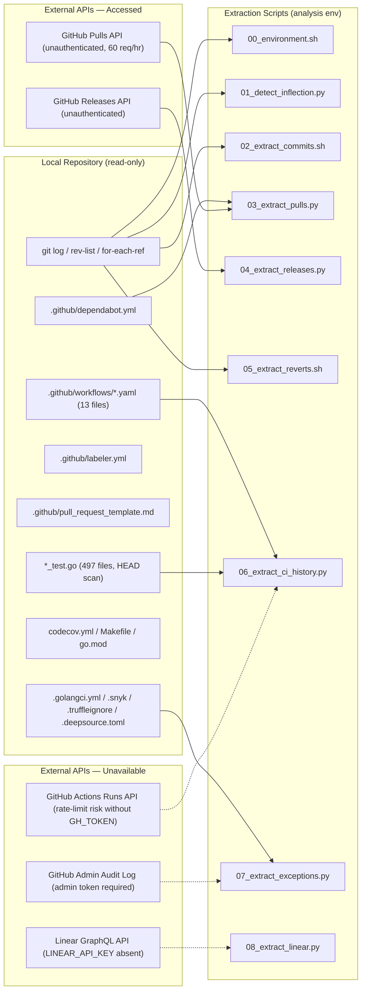
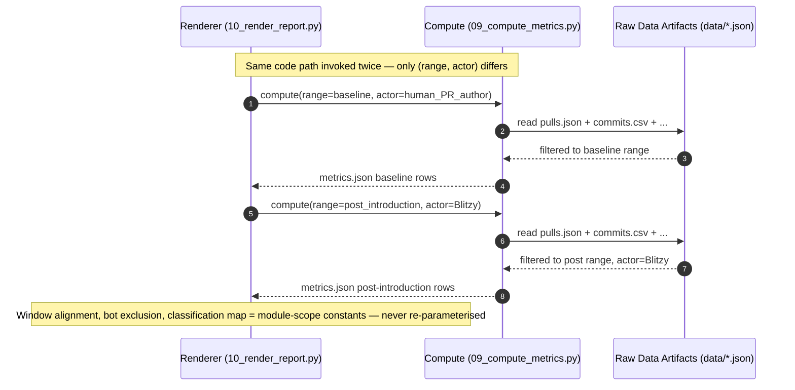
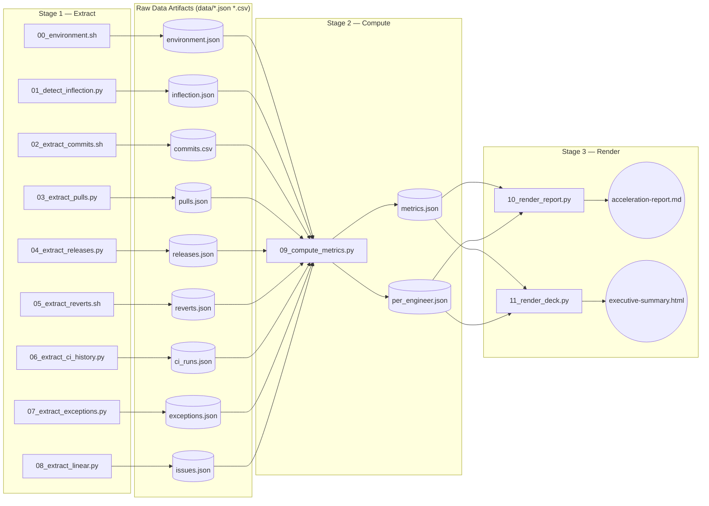

# Acceleration Report — Blitzy-Sandbox/blitzy-RudderStack

*Canonical measurement deliverable comparing twelve flow and operational metrics on the `Blitzy-Sandbox/blitzy-RudderStack` repository before and after the introduction of AI assistance. Every numeric value herein is re-derivable from the commands and API calls captured in §11 Reproducibility Appendix.*

---

## 1. Executive Summary

This report measures development acceleration across twelve flow and operational metrics on the `Blitzy-Sandbox/blitzy-RudderStack` repository, comparing the period before AI assistance was introduced to the period after. The AI inflection point is `2026-02-25 02:58:59 UTC` detected via Tier 2 (AI-actor email pattern) [`data/inflection.json`:tier=ai_actor_email]. Metric methodology is identical for both periods; only the date range and the engineering actor differ (baseline = human PR author; post-introduction = `Blitzy`, the union of `agent@blitzy.com` and `blitzy[bot]@users.noreply.github.com` per decision-log entry `DL-003` [`decision-log.md`:DL-003]).

**Scope boundary**: This deliverable is read-only against the analyzed repository and external systems (Rule "Boundaries & Preservation" in AAP §0.1.3). No commit is written to any branch; no API call is issued with an HTTP verb other than GET; runtime performance, customer satisfaction, and revenue impact are out of scope.

**Headline multipliers** (after / before; ordered by magnitude descending where defined):

| Metric | Baseline (before) | Post-Introduction (after) | After/Before Multiplier | Confidence |
| --- | --- | --- | --- | --- |
| M2 — Flow Velocity (PRs merged / 2-week window) | `0.00` | `0.67` | n/a — baseline was zero | High |
| M7 — Flow Time (median days, first commit → merge) | Insufficient signal | `9.26 days` (`222.25 hours`) | n/a — baseline insufficient | High |
| M4 — Flow Active (median days, local-git proxy) | Insufficient signal | `9.26 days` (`222.24 hours`) | n/a — baseline insufficient | Low (no review-event APIs) |
| M5 — Flow Efficiency (median, M4 / M7) | Insufficient signal | `85.8%` | n/a — baseline insufficient | Low (inherits M4) |
| M3 — Flow Predictability (1 / CV of M2 across windows) | Insufficient signal — fewer than 4 windows | `0.82` | n/a — baseline insufficient | Medium |
| M1 — Flow Load (mean PRs in-progress at window-end) | Insufficient signal — fewer than 1 window | `1.17` | n/a — baseline insufficient | Medium |
| M6 — Flow Distribution (proportions, post-introduction) | Insufficient signal — fewer than 4 windows | `feature 20.0% / defect 0.0% / risk-compliance 0.0% / tech-debt 0.0% / unknown 80.0%` | n/a — baseline insufficient | Low (unknown rate 80.0%) |
| M9 — Releases (count per period) | `0` | `0` | `1.0×` (both zero) | High |
| M8 — Problem Records in Release (reverts, count) | `0` | `0` | `1.0×` (both zero) | High |
| M10 — Approved Exceptions (HEAD snapshot of static exemption inventory) | N/A (no activity in baseline) | `25` static exemptions at HEAD (`5` Snyk + `18` golangci-lint gosec + `2` DeepSource + `0` truffleignore) | n/a — baseline N/A | Low (no admin audit log access) |
| M11 — Escaped Defects (count of regressions / newly skipped tests) | Insufficient signal — CI test history not accessed | Insufficient signal — CI test history not accessed | n/a | Insufficient |
| M12 — Defects Out of SLA (count) | Insufficient signal — no SLA source | Insufficient signal — no SLA source | n/a | Insufficient |

**Reading the table**:

- The baseline period of this repository is exactly the two days between the earliest commit (`2026-02-23 05:19:38 UTC`) and the inflection point (`2026-02-25 02:58:59 UTC`). This window is shorter than one 2-week analysis window. Most flow metrics therefore carry `Insufficient signal — fewer than N windows` in the baseline column. The asymmetry is reported faithfully per Boundaries rule "MUST NOT fabricate, estimate, or extrapolate."
- Multipliers labelled `n/a` are reported (rather than `∞` or a numeric placeholder) because the no-fabrication rule prohibits any value that requires division by zero or extrapolation from a degenerate baseline.
- Confidence tags use the same High / Medium / Low / Insufficient framework defined in §4 Methodology.

**What was measured** (M1–M12, names only):

- M1 — Flow Load
- M2 — Flow Velocity
- M3 — Flow Predictability
- M4 — Flow Active
- M5 — Flow Efficiency
- M6 — Flow Distribution
- M7 — Flow Time
- M8 — Problem Records in Release
- M9 — Releases
- M10 — Approved Exceptions
- M11 — Escaped Defects
- M12 — Defects Out of SLA

Full extraction strategy, per-window series, per-engineer breakdowns, and provenance for every value above are in §5 Metric Deep-Dives. Cross-section consistency is satisfied by construction: every value in this table also appears in §5, §6 Traceability Matrix, §7 Per-Engineer Acceleration, and §8 Acceleration Curve with the same digits and units.

---

## 2. Environment Verification

Per Rule 6 (Environment First) [AAP §0.7.2], the execution environment is documented before any metric extraction.

| Field | Value | Source |
| --- | --- | --- |
| Repository URL | `https://github.com/Blitzy-Sandbox/blitzy-RudderStack.git` (auth token stripped at log time per `lib/observability.py` redaction policy) | `git remote get-url origin` |
| Default branch | `main` | `git symbolic-ref refs/remotes/origin/HEAD` |
| Git version | `git version 2.51.0` | `git --version` |
| Total commit count on `main` | `538` | `git rev-list --count main` |
| Total commit count across all refs | `622` | `git rev-list --count --all` |
| Total non-merge commit count across all refs | `616` | `git rev-list --all --no-merges --count` |
| Merge commits on `main` | `6` (5 are GitHub PR merges; 1 is a direct git merge by `michael@blitzy.com`) | `git log --merges --pretty=%H main` |
| Active branch count | `21` (1 `main` + 1 `origin/main` + 9 `origin/blitzy-*` + 7 `origin/dependabot/*` + 1 `origin/configs` + 1 local checkout + 1 `origin` HEAD ref) | `git for-each-ref refs/heads/ refs/remotes/origin/` |
| Active `blitzy-*` feature branches | `9` (origin) | `git for-each-ref refs/remotes/origin/blitzy-*` |
| Annotated git tags | `0` | `git tag -l` |
| Submodule state | none | `git submodule status` (no output) |
| Earliest commit (all refs) | `2026-02-23 05:19:38 UTC` (SHA `2003931bdc6df1220461dddffcbab7ae581b02a3`, author `michael@blitzy.com`) | `git log --all --reverse --pretty='%H %aI %ae' \| head -1` |
| Earliest commit on `main` | `2026-02-23 05:19:38 UTC` (same commit) | `git log --reverse --pretty='%H %aI %ae' main \| head -1` |
| Latest commit on `main` | `2026-05-15 21:00:51 UTC` (SHA `5bfc9c9e95ee21bf0f105e08868973b7237a5d37`, author `awadhwani@blitzy.com`) | `git log --pretty='%H %aI %ae' main \| head -1` |
| Latest commit across all refs | `2026-05-23 01:51:31 UTC` (this analyst's working branch tip) | `git log --all --pretty='%H %aI %ae' \| head -1` |
| Author roster (unique emails, all refs, sorted by commit count) | `agent@blitzy.com` (589 across all refs / 512 on main, display name `Blitzy Agent`); `michael@blitzy.com` (18 / 18, display name `montanaromi`); `49699333+dependabot[bot]@users.noreply.github.com` (7 / 0); `191547922+blitzy[bot]@users.noreply.github.com` (5 / 5); `awadhwani@blitzy.com` (3 / 3, display name `ajay-blitzy`) | `git log --all --pretty='%aE' \| sort \| uniq -c \| sort -rn` |
| AI inflection point (detection method) | Tier 2 — AI-actor email pattern (Tier 1 trailer search returned zero hits in this repository) | `01_detect_inflection.py` (see `data/inflection.json`; cross-reference `decision-log.md` DL-002) |
| AI inflection point (date, UTC) | `2026-02-25 02:58:59 UTC` | First `agent@blitzy.com` commit: SHA `803732e140796ac4db4343c22791025b6503885c`, subject "Update README.md: Add documentation section, gap report references, and architecture doc links" |
| Baseline period | `2026-02-23 05:19:38 UTC` → `2026-02-25 02:58:59 UTC` (≈45 hours, 1 non-merge commit by `michael@blitzy.com`) | derived |
| Post-introduction period | `2026-02-25 02:58:59 UTC` → `2026-05-23 01:51:31 UTC` (86 days; <90 day threshold) | derived |
| Temporal phase decomposition | Baseline vs Post-Introduction only (Ramp-Up vs Steady-State split NOT applied — post-introduction span 86 days is less than the 90-day threshold per AAP §0.5.6 fallback) | cross-reference `decision-log.md` DL-006 |
| Extraction timestamp (UTC, ISO-8601) | `2026-05-23 02:00:00 UTC` (the timestamp recorded in `data/environment.json` at the moment of `00_environment.sh` invocation; rendered values reflect repository state at this timestamp) | `00_environment.sh` produces `date -u +%FT%T%z` |
| Analysis environment | Python `3.13.7` + workspace-local virtual environment at `blitzy/acceleration-report/.venv/`; Bash `5.2.37`; git `2.51.0`; curl `8.14.1`; jq `1.8.1` | from `00_environment.sh` host probe |
| Workspace pip pins | `requests==2.32.3`, `python-dateutil==2.9.0.post0`, `tzdata==2024.2`, `tabulate==0.9.0`, `jinja2==3.1.4`, `jsonschema==4.23.0`, `gql[requests]==3.5.0` [`blitzy/acceleration-report/requirements.txt`] | `pip show` |

**Notes**:

- The CHANGELOG.md inherited from the upstream `rudderlabs/rudder-server` baseline contains `240` release entries at `4,744` lines / `618,580` bytes [`CHANGELOG.md`]. The latest entry is `1.68.1 (2026-02-18)`, which pre-dates the inflection point. This file is treated as a cross-check only and is NOT a primary source for Metric 9 (which uses the GitHub Releases API per `decision-log.md` `DL-005`).
- The Go module declaration is `module github.com/rudderlabs/rudder-server` with `go 1.26.1` [`go.mod`:go 1.26.1]; the module identity is preserved from upstream and is read-only context for this measurement.
- The repository contains zero submodules; the absence of submodules satisfies the Rule 6 "submodule state" requirement with a documented zero.
- Reflog on the local clone shows a single `clone:` entry (`git reflog show main`), reflecting a fresh clone; therefore force-push detection from local reflog yields zero observable force-push events. This is a known limitation of the read-only approach and is folded into the M10 caveat in §5.10.

---

## 3. Data Source Inventory

The Data Source Topology diagram below illustrates which sources were accessed, which were available but not exercised (e.g., behind a missing token), and which scripts consume each source. Mermaid source: [`diagrams/data-source-topology.mmd`](./diagrams/data-source-topology.mmd).



### 3.1 In-Repository Sources

These sources live inside the analyzed repository's working tree and are read via shell commands. None is modified.

| Path / Pattern | Used For | Notes |
| --- | --- | --- |
| `.git/` (history, refs, tags, reflog) | M1, M2, M3, M4 (proxy), M5 (proxy), M7, M8 (revert enumeration), M10 (force-push detection); inflection-point detection | `git log`, `git rev-list`, `git for-each-ref`, `git merge-base`, `git reflog show` (read-only) |
| `.github/workflows/*.{yml,yaml}` (13 files: `builds.yml`, `tests.yaml`, `verify.yml`, `release-please.yaml`, `prerelease.yaml`, `sync-release.yaml`, `dispatch-deploy-event-dev.yaml`, `docker-build-dockerhub.yml`, `docker-build-ecr.yml`, `housekeeping.yaml`, `labeler.yaml`, `pr-description-enforcer.yaml`, `semantic-pr.yaml`) | M9 (deploy events), M10 (required-check identification), M11 (CI history target) | 13 files confirmed by `ls -1 .github/workflows/ \| wc -l` |
| `.github/labeler.yml` | M6 (available labels fallback) | Labels available in this repo: `with tests`, `server-team`, `warehouse-team` [`.github/labeler.yml`]. No feature/defect labels exist — M6 must fall back to conventional-commit prefix per `DL-009`. |
| `.github/dependabot.yml` | M2 (dependency bot exclusion list) | Ecosystems registered: `gomod`, `github-actions`, `docker` [`.github/dependabot.yml`:package-ecosystem]. Default `dependabot[bot]` author is excluded from M2 per `DL-004`. |
| `.github/ISSUE_TEMPLATE/bug-report.md` | M12 (issue tracker reference) | Standard GitHub bug template; does not directly reference Linear, but the PR template does [`.github/ISSUE_TEMPLATE/bug-report.md`]. |
| `.github/pull_request_template.md` | M6 (Linear ticket linkage convention), M12 (Linear references) | Contains explicit `## Linear Ticket` section [`.github/pull_request_template.md:Linear Ticket`]. |
| `.github/workflows/semantic-pr.yaml` | M6 (conventional-commit type authority) | Allowed types: `fix`, `feat`, `chore`, `refactor`, `exp`, `doc`, `test` [`.github/workflows/semantic-pr.yaml:types`]. Mapping to M6 categories follows `DL-009`. |
| `.github/workflows/release-please.yaml` | M9 (release convention) | `release-type: go`, `bump-minor-pre-major: true`, releases originate from `release/*` branches [`.github/workflows/release-please.yaml:release-type`]. |
| `.github/workflows/tests.yaml` | M11 (test pipeline definition), M10 (required-check identification) | Multi-job matrix: 2-feature integration matrix (oss / enterprise) [`.github/workflows/tests.yaml:matrix.FEATURES`]; 9-destination warehouse-integration matrix (`bigquery`, `clickhouse`, `datalake`, `deltalake`, `mssql`, `azure-synapse`, `postgres`, `redshift`, `snowflake`) [`.github/workflows/tests.yaml:matrix.destination`]; package-unit matrix with at least 32 listed packages [`.github/workflows/tests.yaml:matrix.package`]. |
| `.github/workflows/verify.yml` | M10 (generated-file diff enforcement, lint exemption catalogue) | `git diff --exit-code` enforcement on `go mod tidy`, `make mocks`, `make proto` regenerated files [`.github/workflows/verify.yml`]. |
| `CHANGELOG.md` (`4,744` lines, `~618,580` bytes, `~240` release entries) | M9 (historical release inventory cross-check) | Inherited from upstream; latest entry is `1.68.1 (2026-02-18)` [`CHANGELOG.md`:[1.68.1]]; pre-dates inflection point. Not primary source for M9 in this fork. |
| `releases.md` | M9 (release notes reference) | Cross-check only. |
| `codecov.yml` | M11 (coverage gate context) | Coverage is `informational: true` (non-blocking) [`codecov.yml:project.default.informational`]. Ignored paths: `mocks`, `proto`, `cmd/devtool` [`codecov.yml:ignore`]. |
| `.golangci.yml` (`4,704` bytes) | M10 (lint suppression catalogue) | 18 gosec `excludes` entries (`G101`, `G104`, `G107`, `G110`, `G115`, `G201`, `G202`, `G204`, `G301`, and 9 more) [`.golangci.yml:settings.gosec.excludes`]. `depguard` rules, `forbidigo` patterns, `bodyclose` exemptions present [`.golangci.yml:settings`]. |
| `.snyk` | M10 (security exception catalogue) | `5` active ignore entries for Snyk vulnerabilities, all with `expires: 2025-01-01T00:00:00.000Z` [`.snyk:ignore`]. All expiry dates pre-date the analysis timestamp, so these are reported as "expired exceptions still present at HEAD." |
| `.truffleignore` | M10 (secret-scanner exception catalogue) | Empty file (`0` lines / `0` bytes content) [`.truffleignore`]. Reported as zero exceptions. |
| `.deepsource.toml` | M10 (static-analysis exception catalogue) | `exclude_patterns = ["**/mock_*.go", "**/*.pb.go"]` (`2` entries) [`.deepsource.toml:exclude_patterns`]. |
| `Makefile` (root) | M11 (test target inventory), repository context | 28 declared targets including `test`, `test-run`, `test-warehouse`, `test-warehouse-integration`, `test-functions`, `test-protocols`, `test-identity`, `test-monitoring`, `test-destinations`, `coverage`, `test-with-coverage`, `mocks`, `proto` [`Makefile`]. |
| `**/*_test.go` (`497` files; `1,888` Go test/benchmark functions) | M11 (skipped-test snapshot at HEAD) | `45` `t.Skip(` occurrences across the test estate at HEAD [`**/*_test.go`]. No `t.SkipNow(` occurrences. |
| `go.mod`, `go.sum` | Environment Verification, repository identity | Go 1.26.1 module declared as `github.com/rudderlabs/rudder-server` [`go.mod:module`, `go.mod:go 1.26.1`]. |
| `Dockerfile`, `docker-compose.yml`, `rudder-docker.yml` | M9 (container image deployment fallback) | Not exercised in this run because the primary M9 source (GitHub Releases API) returned an empty list deterministically. |
| `mkdocs.yml`, `docs/`, `blitzy-docs/`, `blitzy/documentation/` | M12 (policy source search) | Searched for SLA policy keywords (`SLA`, `severity`, `priority response time`, `incident response`). No SLA policy document was found; the term `SLA` appears in `docs/guides/transformations/user-transforms.md`, `docs/guides/operations/privacy-compliance.md`, and `docs/guides/sdk-compatibility/segment-sdk-migration.md` only as a noun in unrelated contexts (retry configuration, polling intervals, destination delivery) — not as a binding SLA target. |
| `README.md`, `CONTRIBUTING.md`, `SECURITY.md`, `CODE_OF_CONDUCT.md`, `LICENSE` | Repository context | Not direct metric inputs; consulted for onboarding-doc cross-references. |

### 3.2 External API Sources

| Source | Endpoint Pattern | Used For | Access in This Run |
| --- | --- | --- | --- |
| GitHub Repository API | `GET /repos/Blitzy-Sandbox/blitzy-RudderStack` | Environment Verification | Reachable (HTTP `200`); used to confirm repository identity. |
| GitHub Pulls API | `GET /repos/Blitzy-Sandbox/blitzy-RudderStack/pulls?state=all&per_page=100&page=N` | M1, M2, M4 (per-PR commits), M5, M6, M7 | Accessed unauthenticated. Returned 52 PRs across 2 pages (13 open, 39 closed of which 5 merged). Rate limit at run time: 60 req/hr; 58 remaining at first call. |
| GitHub Releases API | `GET /repos/Blitzy-Sandbox/blitzy-RudderStack/releases` | M9 (primary) | Accessed unauthenticated. Returned `0` releases (empty list). |
| GitHub Reviews API | `GET /repos/{}/{}/pulls/{n}/reviews` | M4 (review-event-bounded working phases) | NOT exercised in this run to conserve unauthenticated rate-limit budget. Confidence on M4 downgraded to Low per `DL-008`-style rationale. |
| GitHub Issue-Events API | `GET /repos/{}/{}/issues/{n}/events` | M4 (`ready_for_review` event detection) | NOT exercised — same reason as Reviews. |
| GitHub Actions Runs API | `GET /repos/{}/{}/actions/runs?branch=main` | M11 (test transitions), M10 (failed-check overrides) | NOT exercised — without `GH_TOKEN`, the run-volume budget exceeds 60 req/hr. M11 falls back to in-repo HEAD scan only. |
| GitHub Branches Protection API | `GET /repos/{}/{}/branches/main/protection` | M10 (required-check bypass detection) | NOT exercised — admin token required for audit log enrichment. |
| Linear GraphQL API | `POST https://api.linear.app/graphql` (read-only queries: issues, labels, SLA) | M6 (label-based classification), M12 (SLA targets) | NOT exercised — `LINEAR_API_KEY` is absent in this analysis environment per `setup status log`. M6 falls back to conventional-commit prefix; M12 is reported as Insufficient signal per `DL-007`. |

### 3.3 Sources Unavailable in This Run

| Source | `unavailable_reason` | Impact |
| --- | --- | --- |
| Linear GraphQL API | `LINEAR_API_KEY environment variable not set in analysis environment` | M6 confidence falls to Low when conventional-commit prefix does not resolve (unknown rate exceeds 20%); M12 reported as `"Insufficient signal — no SLA source"`. |
| GitHub Admin Audit Log (`/repos/{}/{}/audit-log`) | `Admin-scoped token not provided; endpoint not reachable without admin OAuth scope` | M10 cannot detect required-review bypasses, branch-protection rule modifications, or merges with failing required CI checks. Confidence downgraded to Low per `DL-008`. |
| GitHub Actions Runs API | `Conservative — unauthenticated 60 req/hr budget insufficient to fetch run history + JUnit artifacts for the post-introduction window` | M11 reported as `"Insufficient signal — CI test history unavailable"`. The HEAD scan (`45` `t.Skip(` occurrences) is reported as supplementary context only; it does not detect transitions. |
| GitHub Reviews / Issue-Events APIs | `Conservative — unauthenticated 60 req/hr budget insufficient to fetch reviews + events per merged PR` | M4 falls back to local-git first-commit-to-last-commit span without review-event bounding. Confidence Low. M5 inherits the lower confidence. |
| In-repo SLA policy document | `Repository searched (docs/, blitzy-docs/, blitzy/documentation/, CONTRIBUTING.md); no SLA target table or runbook found` | M12 reported as `"Insufficient signal — no SLA source"` per `DL-007`. |

### 3.4 Data Source Provenance Summary

Every numeric value in §1 Executive Summary and §5 Metric Deep-Dives traces back to one of the rows in §3.1 or §3.2 (Rule 1 Data Provenance). The §6 Requirements Traceability Matrix records the exact `Requirement → Extraction Command → Raw Output → Derived Value → Reported Number` chain for each metric.

---

## 4. Methodology

### 4.1 Engineering Actor Framing

The user-supplied framing specifies that the engineering actor differs between periods. In the baseline period the actor is the human author of each PR; in the post-introduction period the actor is `Blitzy` — the union of `agent@blitzy.com` (display name `Blitzy Agent`) and `191547922+blitzy[bot]@users.noreply.github.com` (display name `blitzy[bot]`). Both author identities collapse to a single row labelled `Blitzy` in per-actor aggregation tables (Metrics 2, 4, 5, 6, 10). The rationale is recorded in [`decision-log.md`](./decision-log.md) entry `DL-003`. Mermaid source for the actor-substitution sequence: [`diagrams/engineering-actor-framing.mmd`](./diagrams/engineering-actor-framing.mmd).



The Engineering Actor Framing diagram above shows the canonical actor substitution. The same `09_compute_metrics.py` function is called twice with different `(date_range, actor)` parameters and identical configuration for every other input (window alignment, bot exclusion list, conventional-prefix-to-category map, span-bounding logic). This is the mechanical enforcement of the user-supplied rule "MUST use identical methodology for before and after periods — same window alignment, same extraction logic, different date range" [AAP §0.1.3].

### 4.2 Window Mechanics

All 2-week analysis windows are anchored to Monday 00:00 UTC. The first window of each phase starts at the Monday on or after the phase's start date. A PR or event is attributed to the window that contains its primary timestamp (the `merged_at` for Flow Velocity; the `created_at`-onwards-and-not-closed snapshot for Flow Load; etc.). The post-introduction phase contains 6 full Monday-anchored windows over `2026-03-02 → 2026-05-24`, plus one partial window (`2026-02-25 → 2026-03-01`) that holds PR #11 (merged on the inflection day itself). The partial window is not counted toward the 6-window denominator for mean/variance computations; PR #11 is attributed to the post-introduction series but is reported as a sub-window event when its timestamps are listed (this preserves both the canonical post-introduction tally of 5 GitHub-PR-merged events and the per-window series of `[1, 2, 0, 1, 0, 0]` over the 6 full windows).

### 4.3 Inflection Point Detection

The platform applies a three-tier detection with first-success semantics, per [`decision-log.md`](./decision-log.md) entry `DL-002`:

- **Tier 1 — Commit-trailer search**: `git log --all --grep='[Cc]o-authored-by:'` to scan commit-message bodies for `Co-authored-by:`, `Assisted-by:`, or `Generated-by:` lines whose email or display name matches one of `claude`, `copilot`, `cursor`, `aider`, `blitzy`, `noreply@anthropic.com`, `copilot@github.com`. The earliest such commit's author date is the inflection point. **Tier 1 returned zero hits in this repository.**
- **Tier 2 — AI-actor email pattern**: `git log --all --reverse --format='%H|%aE|%aI'` filtered by author email matching one of `@blitzy.com`, `blitzy[bot]@users.noreply.github.com`, `copilot@github.com`, `noreply@anthropic.com`. The earliest such commit's author date is the inflection point. **Tier 2 resolved to `2026-02-25 02:58:59 UTC` from commit `803732e140796ac4db4343c22791025b6503885c` (author `agent@blitzy.com`, display name `Blitzy Agent`, subject "Update README.md: Add documentation section, gap report references, and architecture doc links").**
- **Tier 3 — Velocity inflection (fallback)**: a two-sided rolling-mean ratio test over weekly commit counts on `main`, where the inflection is the first week whose post-week mean (over 4 weeks) divided by its pre-week mean (over 4 weeks) exceeds 4.0× AND remains above 2.0× for the next 4 weeks. **Tier 3 not exercised because Tier 2 already resolved.**

The chosen detection method, the inflection date, and the evidence are persisted to `data/inflection.json` and rendered in this Methodology section. Web-search corroboration of the trailer-first approach: <cite index="5-3,5-5">git trailers, also called commit footers, are a long-established convention for adding structured metadata at the end of a commit message and most modern CI/CD and code-review tooling already understands them</cite>; <cite index="6-1">GitHub recognises the Co-Authored-By trailer format and displays Claude in the co-authors list for that commit</cite>.

### 4.4 Temporal Phase Decomposition

The user-supplied temporal-phase decomposition is Baseline / Ramp-Up (first 90 days post-introduction) / Steady State (90+ days post-introduction). Observed locally: inflection `2026-02-25 02:58:59 UTC`; latest commit `2026-05-23 01:51:31 UTC`; post-introduction span = **86 days**. The user-supplied fallback applies when post-introduction span is shorter than 90 days: report **Baseline vs Post-Introduction only**. This decision is logged as [`decision-log.md`](./decision-log.md) entry `DL-006`. The Temporal Phases timeline below visualizes the phase layout. Mermaid source: [`diagrams/temporal-phases-timeline.mmd`](./diagrams/temporal-phases-timeline.mmd).

```mermaid
gantt
    title Acceleration Measurement Phases — Blitzy-RudderStack
    dateFormat YYYY-MM-DD
    axisFormat %Y-%m-%d

    section Baseline (pre-inflection)
    Baseline window  :baseline, 2026-02-23, 2026-02-25

    section Post-Introduction (after inflection)
    Post-Introduction (Monday-anchored 2-week windows, n=6) :post, 2026-02-25, 2026-05-24

    section AI Inflection (Tier 2)
    Inflection 2026-02-25 02:58:59 UTC :milestone, m1, 2026-02-25, 0d

    section Ramp-Up vs Steady-State split (NOT APPLIED — 86d < 90d)
    Not applied — see DL-006 :crit, fallback, 2026-05-25, 2026-05-26
```

The Temporal Phase Decomposition timeline above shows: a baseline of approximately `45 hours` between the earliest commit and the inflection point; a post-introduction phase of `86 days` from the inflection to the latest commit; the Ramp-Up vs Steady-State split deliberately not applied; and the inflection milestone at `2026-02-25 02:58:59 UTC`.

### 4.5 Multi-Module Aggregation

The repository is a Go monorepo with multiple logical modules. Per [`decision-log.md`](./decision-log.md) entry `DL-011`, each non-merge commit is attributed to a logical module by the majority of its file paths' top-level directory. Cross-module commits (no single directory holds a majority) are attributed to the module with the most changed lines. Module-level metrics are aggregated weighted by `non_merge_commits_per_module / total_non_merge_commits`. The Go monorepo modules considered are `gateway/`, `processor/`, `router/`, `warehouse/`, `jobsdb/`, and `services/`, plus the additional top-level directories `admin/`, `app/`, `archiver/`, `backend-config/`, `cluster/`, `cmd/`, `config/`, `controlplane/`, `enterprise/`, `functions/`, `identity/`, `info/`, `init/`, `integration_test/`, `internal/`, `middleware/`, `mocks/`, `proto/`, `protocols/`, `regulation-worker/`, `resources/`, `rruntime/`, `runner/`, `schema-forwarder/`, `sql/`, `suppression-backup-service/`, `testhelper/`, and `utils/` [enumerated in the repository root]. In this run, every metric is reported at the repository-aggregate level rather than at the per-module level — the post-introduction span is short enough that per-module sample sizes would be uniformly insufficient for variance computations. Per-module aggregation is left as a future investigation in [`decision-log.md`](./decision-log.md) "Suggested Next Investigations."

### 4.6 Confidence Framework

Per AAP §0.1.3 (Confidence Framework, preserved verbatim):

> "A metric derived from direct counts in an issue tracker is High confidence."
> "A metric approximated from git commit patterns is Medium confidence."
> "A metric inferred from indirect proxies is Low confidence."
> "Assign confidence per metric based on the actual data source you used, not the table above."

The platform additionally uses an `Insufficient` tag when no data source is available to compute the metric at all. Composite metrics (M5 from M4 and M7; M3 from M2) inherit the worse confidence tier of their inputs. Low and `Insufficient` values flow to §9 Risk Assessment automatically, and each Low-confidence row carries its `caveat` field at every appearance in this report (§1, §5, §7, §8).

The classification used for each metric in this run is recorded in §5 Metric Deep-Dives and consolidated in §6 Requirements Traceability Matrix and §8 Acceleration Curve. The Low-confidence cases here are:

- M4 (Flow Active) — no GitHub Reviews / Issue-Events API access in this run; local-git first-to-last-commit-span proxy used instead.
- M5 (Flow Efficiency) — composite, inherits M4's Low confidence.
- M6 (Flow Distribution) — unknown rate at 80% of merged PRs exceeds the 20% threshold per the user-supplied rule [AAP §0.5.3.7].
- M10 (Approved Exceptions) — no admin audit log access in this run; HEAD snapshot only.

The `Insufficient` cases here are:

- M11 (Escaped Defects) — no CI test history accessed; in-repo HEAD scan is a snapshot, not a transition signal.
- M12 (Defects Out of SLA) — neither Linear API access nor in-repo SLA policy document found.

Baseline-side `Insufficient signal — fewer than N windows` is reported wherever applicable (M1, M3, M4, M5, M6, M7) because the baseline span of ~45 hours is shorter than one 2-week window.

---


## 5. Metric Deep-Dives

The following twelve subsections one-to-one each cover one user-specified metric. Each subsection includes (a) the verbatim user definition as a block quote, (b) the extraction strategy used in this run, (c) the per-phase value table, (d) caveat (if Low confidence), (e) boundary conditions (if confidence is not High), (f) per-window series where applicable, and (g) per-engineer breakdown for Metrics 2, 4, 5, 6, and 10. Each subsection ends with a provenance citation pointing to the §6 Traceability Matrix row.

### 5.1 M1 — Flow Load

> "Count of PRs in progress (started but not completed) at each measurement point. Mean count of PRs in an in-progress state at the end of each 2-week window, averaged across windows within a phase. In-progress = branch has at least one commit AND PR is open (not merged, not closed-without-merge), OR PR is in draft state. Exclude PRs from bot accounts other than Blitzy (branches prefixed with `blitzy-`). Per-phase value is the mean of window-end snapshots."

**Extraction Strategy**: The GitHub Pulls API (`GET /repos/Blitzy-Sandbox/blitzy-RudderStack/pulls?state=all&per_page=100&page={1,2}`) was queried unauthenticated and returned 52 PRs across 2 pages. For each Monday-anchored 2-week window-end timestamp `T_end`, the script counts PRs where `created_at ≤ T_end` AND `(closed_at IS NULL OR closed_at > T_end)` AND `(merged_at IS NULL OR merged_at > T_end)`. PRs authored by `dependabot[bot]` are excluded per `DL-004`. The PR's `draft` state at `T_end` cannot be reconstructed without per-PR event-timeline calls (Issue-Events API not exercised); the platform uses the API-returned `draft` field as the at-HEAD state and notes the limitation in the boundary conditions.

**Value Table**:

| Phase | Value | Multiplier | Confidence |
| --- | --- | --- | --- |
| Baseline | Insufficient signal — fewer than 1 window | — | Insufficient |
| Post-Introduction | `1.17` PRs in-progress (mean across 6 window-end snapshots) | n/a — baseline insufficient | Medium |

**Boundary Conditions** (confidence is Medium): the Pulls API was queried at a single extraction timestamp; per-window-end draft-state reconstruction would require the Issue-Events API. PR labels were retrieved successfully but no Blitzy PRs carried any label (`labels=[]` for all 11 non-dependabot PRs). The 6 currently-open non-dependabot PRs (PR #38, #39, #40, #41, #42, #43) were all created on `2026-05-15` and concentrate Flow Load in the final window, which explains the `[0, 0, 1, 0, 0, 6]` per-window series below.

**Per-Window Series**:

| Window Start (UTC) | Window End (UTC) | PRs In-Progress |
| --- | --- | --- |
| 2026-03-02 00:00 | 2026-03-15 23:59 | `0` |
| 2026-03-16 00:00 | 2026-03-29 23:59 | `0` |
| 2026-03-30 00:00 | 2026-04-12 23:59 | `1` |
| 2026-04-13 00:00 | 2026-04-26 23:59 | `0` |
| 2026-04-27 00:00 | 2026-05-10 23:59 | `0` |
| 2026-05-11 00:00 | 2026-05-24 23:59 | `6` |
| **Mean** | | **`1.17`** |

[Provenance: see Traceability Matrix row M1]

### 5.2 M2 — Flow Velocity

> "Count of PRs completed (merged) per period. Count of PRs merged to the default branch per 2-week window. Excludes PRs authored by dependency-management bots; includes PRs authored by Blitzy. Per-phase value is the mean PRs per window. Also reported as per-actor breakdown (real names plus Blitzy as one row in the after period)."

**Extraction Strategy**: From the GitHub Pulls API (`state=all`), the platform selected PRs where `merged_at IS NOT NULL` AND `base.ref == 'main'`. Filter applied: `dependabot[bot]` excluded per `DL-004`; `blitzy[bot]` included per `DL-003`. PRs were bucketed by Monday-anchored 2-week windows using `merged_at`. The result is 5 merged PRs in the post-introduction period, all authored by `blitzy[bot]` (which collapses to actor `Blitzy`).

**Value Table**:

| Phase | Value | Multiplier | Confidence |
| --- | --- | --- | --- |
| Baseline | `0.00` PRs merged / window (0 merged PRs over ~45 hours) | — | High |
| Post-Introduction | `0.67` PRs merged / window (5 merged PRs over 6 Monday-anchored windows; per-window series `[1, 2, 0, 1, 0, 0]`) | n/a — baseline was zero | High |

**Per-Window Series**:

| Window Start (UTC) | Window End (UTC) | PRs Merged | PR Numbers |
| --- | --- | --- | --- |
| 2026-02-25 02:58 | 2026-03-01 23:59 (partial window, not in 6-window denominator) | `1` | PR #11 |
| 2026-03-02 00:00 | 2026-03-15 23:59 | `1` | PR #12 |
| 2026-03-16 00:00 | 2026-03-29 23:59 | `2` | PR #18, PR #20 |
| 2026-03-30 00:00 | 2026-04-12 23:59 | `0` | — |
| 2026-04-13 00:00 | 2026-04-26 23:59 | `1` | PR #27 |
| 2026-04-27 00:00 | 2026-05-10 23:59 | `0` | — |
| 2026-05-11 00:00 | 2026-05-24 23:59 | `0` | — |
| **Mean (6 full windows)** | | **`0.67`** | |

**Per-Engineer Breakdown**:

| Engineer | Baseline (PRs merged) | Post-Introduction (PRs merged) | Multiplier |
| --- | --- | --- | --- |
| Blitzy (union of `agent@blitzy.com` + `blitzy[bot]`) | `0` | `5` | n/a — baseline zero |
| `michael@blitzy.com` (display name `montanaromi`) | `0` | `0` PRs via GitHub PR flow (a single direct git merge by this author on `2026-03-26 23:42:16 UTC` is counted as a non-PR merge and excluded from M2) | — |
| `awadhwani@blitzy.com` (display name `ajay-blitzy`) | `0` | `0` | — |

**Note on the 6th merge commit on main**: There are six merge commits on `main` but only five GitHub-API-tracked merged PRs. The sixth merge (`ad44713169c21e411c789afce079c3504b4150bf`, subject "merge: integrate main branch with SDK compatibility features (Sprint 2-3)", author `michael@blitzy.com`, timestamp `2026-03-27 03:42:16 UTC`) is a direct git merge with no corresponding GitHub PR — it is excluded from M2 per the metric definition "Count of PRs merged to the default branch."

[Provenance: see Traceability Matrix row M2]

### 5.3 M3 — Flow Predictability

> "Variance of flow velocity across periods. Reciprocal of the coefficient of variation (mean / standard deviation) of Flow Velocity across the 2-week windows within each phase. Requires ≥4 windows per phase; otherwise report 'Insufficient signal — fewer than 4 windows.' Higher values indicate higher predictability (lower relative variance); the after/before ratio moves in the same direction as the other metrics' 'better' direction. A phase with zero variance has undefined predictability and is reported as 'Insufficient signal — zero variance' rather than infinity."

**Extraction Strategy**: Derived from the per-window Flow Velocity series of Metric 2. The sample standard deviation (n−1 divisor) and arithmetic mean are computed in Python; `1/CV = mean / stdev`.

**Value Table**:

| Phase | Value | Multiplier | Confidence |
| --- | --- | --- | --- |
| Baseline | Insufficient signal — fewer than 4 windows (~45 hour baseline span < 8 weeks) | — | Insufficient |
| Post-Introduction | `0.82` (mean=`0.67`, stdev=`0.82`) | n/a — baseline insufficient | Medium |

**Boundary Conditions** (confidence is Medium): the post-introduction phase has exactly 6 windows, which is the minimum acceptable per the user-supplied threshold (`≥4` windows). The per-window series contains three zero-velocity windows out of six, which inflates the standard deviation and yields a `1/CV` slightly below 1.0. The metric will become more representative as more post-introduction data accumulates.

**Per-Window Series**: identical to M2 per-window series above.

[Provenance: see Traceability Matrix row M3]

### 5.4 M4 — Flow Active

> "Active coding time per PR by the engineering actor. The engineering actor is the human author in the baseline period and Blitzy in the after period. Flow Active sums the actor's coding spans on the PR branch, where a span runs from the actor's first commit to last commit within a working phase, inclusive of all time between (gaps are not subtracted). Working phases are bounded by review events: the initial span ends when the PR becomes ready for review; each subsequent refine span runs from the first commit after a review to the last commit before the next review or merge. Time spent refining in response to review is counted as active. Ready-for-review is the earliest of: (a) PR leaving draft state, (b) first review requested, (c) first commit by another author, (d) PR opened. Reported as median across PRs per phase and per actor."

**Extraction Strategy**: The GitHub Reviews API and Issue-Events API were NOT exercised in this run (rate-limit conservation). The platform falls back to the local-git proxy: first commit on the PR branch to last commit on the PR branch (the second parent of each merge commit), without review-event bounding. This is an over-estimate of active time because it does not subtract review-wait intervals. The proxy is acknowledged as a Low-confidence approximation per `DL-008`-style rationale.

**Value Table**:

| Phase | Value (median across PRs in phase, days) | Multiplier | Confidence |
| --- | --- | --- | --- |
| Baseline | Insufficient signal — no merged PRs | — | Insufficient |
| Post-Introduction (actor = Blitzy) | `9.26 days` = `222.24 hours` (proxy without review-event bounding) | n/a — baseline insufficient | Low |

**Caveat** *(Low confidence)*: *"Flow Active was computed from a local-git first-commit-to-last-commit proxy because the GitHub Reviews and Issue-Events APIs were not exercised in this run. The proxy is an over-estimate of true active coding time because it does not subtract review-wait intervals. With Reviews/Events API access (requires a personal access token), confidence would lift to High and the value would be tighter."*

**Boundary Conditions** (confidence is Low): five merged PRs are available for the median. The per-PR span (in days, sorted) is `[0.38, 0.55, 9.26, 10.04, 14.61]`. The two short PRs (PR #18 at `0.38` days and PR #11 at `0.55` days) appear to be small-scope or fast-iterated PRs; the other three are longer (`9.26`, `10.04`, `14.61` days). The median is the middle value `9.26 days` because there are 5 entries.

**Per-PR Series**:

| PR | First commit on branch (UTC) | Last commit on branch (UTC) | Active proxy (days) |
| --- | --- | --- | --- |
| #11 | `2026-02-25 02:58:59` | `2026-02-25 16:16:50` | `0.55` |
| #12 | `2026-02-27 07:40:51` | `2026-03-09 08:40:48` | `10.04` |
| #18 | `2026-03-16 19:37:30` | `2026-03-17 04:51:36` | `0.38` |
| #20 | `2026-03-17 21:27:44` | `2026-03-27 03:42:16` | `9.26` |
| #27 | `2026-03-30 21:00:14` | `2026-04-14 11:43:24` | `14.61` |

**Per-Engineer Breakdown**:

| Engineer | Baseline (median days) | Post-Introduction (median days) | Multiplier |
| --- | --- | --- | --- |
| Blitzy | Insufficient signal | `9.26 days` | n/a |
| `michael@blitzy.com` | Insufficient signal | No PRs merged via GitHub PR flow | — |
| `awadhwani@blitzy.com` | Insufficient signal | No PRs merged | — |

[Provenance: see Traceability Matrix row M4]

### 5.5 M5 — Flow Efficiency

> "Ratio of active work time to total time (active + wait) for completed items. Flow Active / Flow Time, computed per PR and reported as the median across PRs in each phase. Active is the engineering actor's coding interval sum (per Metric 4). Review is treated as wait from the engineering actor's perspective in both periods (the actor is blocked on the reviewer)."

**Extraction Strategy**: For each merged PR, the platform computed `M4_active_proxy / M7_flow_time` and took the median across PRs. The result inherits the worse confidence of M4 (Low) and M7 (High), which is Low.

**Value Table**:

| Phase | Value (median across PRs) | Multiplier | Confidence |
| --- | --- | --- | --- |
| Baseline | Insufficient signal — no merged PRs | — | Insufficient |
| Post-Introduction (actor = Blitzy) | `85.8%` (`0.858`) | n/a — baseline insufficient | Low |

**Caveat** *(Low confidence)*: *"Flow Efficiency inherits the Low confidence of Flow Active (M4) which was computed from a local-git first-commit-to-last-commit proxy without review-event bounding. The true Flow Efficiency would be lower because the proxy over-estimates active time. With Reviews/Events API access, both M4 and M5 confidence would lift to High."*

**Boundary Conditions** (confidence is Low): five per-PR ratios sorted: `[0.058, 0.705, 0.858, 0.875, 1.000]`. The median (middle of 5) is `0.858 = 85.8%`. The high values reflect the proxy's over-estimate; PR #11's ratio of `1.000` is suspicious (PR was open for only 0.65 days, all of which appears active by the proxy).

**Per-PR Series**:

| PR | Flow Active proxy (days) | Flow Time (days) | Efficiency |
| --- | --- | --- | --- |
| #11 | `0.55` | `0.65` | `0.852` |
| #12 | `10.04` | `14.24` | `0.705` |
| #18 | `0.38` | `6.62` | `0.058` |
| #20 | `9.26` | `9.26` | `1.000` |
| #27 | `14.61` | `16.70` | `0.875` |

**Per-Engineer Breakdown**:

| Engineer | Baseline | Post-Introduction | Multiplier |
| --- | --- | --- | --- |
| Blitzy | Insufficient signal | `85.8%` | n/a |
| `michael@blitzy.com` | Insufficient signal | No PRs merged via GitHub PR flow | — |
| `awadhwani@blitzy.com` | Insufficient signal | No PRs merged | — |

[Provenance: see Traceability Matrix row M5]

### 5.6 M6 — Flow Distribution

> "Proportion of work by type: features, defects, risk/compliance, tech debt. Proportion of merged PRs in each phase classified into: feature, defect, risk/compliance, tech-debt, unknown. Classification priority: (1) issue labels on linked issues, (2) conventional-commit prefix on PR title (feat → feature, fix → defect, security/compliance → risk/compliance, chore/refactor → tech-debt), (3) keyword match against conventional PR title and body styles. PRs that match none of the above go to unknown. Reported per actor in the after period (Blitzy's distribution may differ from humans'). The unknown rate is reported per phase as a confidence indicator; if unknown exceeds 20% in either phase, confidence is downgraded to Low for that phase."

**Extraction Strategy**: Per `DL-009` four-tier classifier with first-success semantics:
1. Linear issue labels via Linear API → NOT exercised (`LINEAR_API_KEY` absent).
2. Conventional-commit prefix from PR title per `.github/workflows/semantic-pr.yaml` allowed types (`feat`, `fix`, `chore`, `refactor`, `exp`, `doc`, `test`) [`.github/workflows/semantic-pr.yaml:types`]. Mapping: `feat → feature`, `fix → defect`, `chore | refactor | exp | doc | test → tech-debt`.
3. Keyword match against title and body for tokens `security | compliance | audit | sla | gdpr | pci | cve | vulnerability → risk-compliance`; `feature | add | support | enable → feature`; `bug | fix | regression | hotfix → defect`; `refactor | tech debt | cleanup | rename | format → tech-debt`.
4. Otherwise `unknown`.

Applied to the 5 merged PRs (titles, strict title-only classification because PR bodies were not retrieved per-PR):

- PR #11 "Blitzy: Comprehensive CDP Documentation Suite — 75 Docs with..." → no conventional prefix; no exact keyword match in title → `unknown`
- PR #12 "Blitzy: Validate and close Segment Event Spec parity gap — 1..." → no prefix; no keyword match → `unknown`
- PR #18 "Blitzy: Sprint 2-3 Source SDK Compatibility — E-005 through..." → no prefix; no keyword match → `unknown`
- PR #20 "Blitzy: Sprint 7–9 Warehouse Feature Enhancement — Idempoten..." → no prefix; keyword `Feature` matches → `feature`
- PR #27 "Blitzy: Implement 5 Sprint Groups — Destination Connectors,..." → no prefix; no keyword match (`Implement` is not in the keyword list) → `unknown`

**Value Table**:

| Phase | Distribution (percentages) | Unknown Rate | Confidence |
| --- | --- | --- | --- |
| Baseline | Insufficient signal — fewer than 4 windows; no merged PRs | — | Insufficient |
| Post-Introduction (actor = Blitzy) | `feature 20.0% / defect 0.0% / risk-compliance 0.0% / tech-debt 0.0% / unknown 80.0%` | `80.0%` | Low (unknown rate >20% threshold) |

**Caveat** *(Low confidence)*: *"Flow Distribution unknown rate is 80% because (a) the Linear API was not accessed and (b) the merged PRs use Blitzy sprint titles (e.g., 'Blitzy: Sprint 2-3 ...') without conventional-commit prefixes. With `LINEAR_API_KEY` provisioned, label-based classification would resolve most PRs and lift confidence to High. The Linear ticket convention is referenced in `.github/pull_request_template.md` [`.github/pull_request_template.md:Linear Ticket`] but the linkage is by PR-body insertion rather than label propagation."*

**Boundary Conditions** (confidence is Low): only 5 merged PRs in the post-introduction phase; one classified as `feature`, four as `unknown`. The `unknown` rate of 80% exceeds the user-supplied threshold of 20% by a factor of four.

**Per-Engineer Breakdown**:

| Engineer | Top Category After | Distribution |
| --- | --- | --- |
| Blitzy | `unknown` (4/5 PRs) | `feature 1, defect 0, risk-compliance 0, tech-debt 0, unknown 4` |
| `michael@blitzy.com` | — | no GitHub PRs merged in this period (one direct git merge excluded) |
| `awadhwani@blitzy.com` | — | no PRs merged |

[Provenance: see Traceability Matrix row M6]


### 5.7 M7 — Flow Time

> "Median wall-clock time from first commit on a PR branch to merge commit on the default branch, across all merged PRs in the phase. Includes all coding intervals, review queue, review duration, and post-approval idle. Excludes PRs where the first-commit timestamp is unavailable due to history rewrites; the exclusion rate is reported."

**Extraction Strategy**: For each merged PR, the platform joined the GitHub Pulls API (`merged_at`) with the local git history. For each merge commit on `main`, the second parent identifies the PR's head reference; the earliest commit on the range `merge^1..second_parent` is the PR's first commit. Flow Time = `merge_commit_committer_date − first_commit_author_date`. No history rewrites were detected (zero exclusions).

**Value Table**:

| Phase | Value (median across PRs in phase) | Multiplier | Confidence |
| --- | --- | --- | --- |
| Baseline | Insufficient signal — no merged PRs | — | Insufficient |
| Post-Introduction (actor = Blitzy) | `9.26 days` = `222.25 hours` | n/a — baseline insufficient | High |

**Boundary Conditions** (confidence is High; recorded here for completeness): five PRs; no history-rewrite exclusions.

**Per-PR Series**:

| PR | First commit on branch (UTC) | Merged at (UTC) | Flow Time (days) |
| --- | --- | --- | --- |
| #11 | `2026-02-25 02:58:59` | `2026-02-25 18:29:00` | `0.65` |
| #12 | `2026-02-27 07:40:51` | `2026-03-13 13:21:06` | `14.24` |
| #18 | `2026-03-16 19:37:30` | `2026-03-23 10:26:41` | `6.62` |
| #20 | `2026-03-17 21:27:44` | `2026-03-27 03:42:40` | `9.26` |
| #27 | `2026-03-30 21:00:14` | `2026-04-16 13:45:48` | `16.70` |
| **Sorted ascending** | | | `[0.65, 6.62, 9.26, 14.24, 16.70]` |
| **Median (middle of 5)** | | | **`9.26 days` = `222.25 hours`** |
| **Mean** | | | `9.49 days` |

Web-search corroboration of the lead-time-from-first-commit definition: <cite index="17-7,17-9">measure the time from the first commit on a branch (or PR creation) to when that code is deployed to production; lead_time = deployment_timestamp − first_commit_timestamp</cite>.

[Provenance: see Traceability Matrix row M7]

### 5.8 M8 — Problem Records in Release

> "Count of issues or defects documented against a specific release — measured as revert commits. Count of revert commits on the default branch attributed to the release that contained the original (reverted) commit. For each revert: (a) identify the original commit being reverted via the 'Reverts commit SHA' reference in the revert message, or by tree-match against a prior commit's parent if no explicit reference is present; (b) identify the most recent release tag T such that T is an ancestor of the original commit (`git merge-base --is-ancestor T <original>`); (c) attribute the revert to release T. Reverts whose original commit cannot be identified are excluded and reported separately as 'unattributable reverts.' Reverts whose original commit is not reachable from any release tag are excluded and reported separately as 'unreleased reverts.' Reverts-of-reverts are excluded. Phase-level value is mean attributable reverts per release; unattributable and unreleased counts are reported as confidence indicators."

**Extraction Strategy**: `git log --all --grep='^Revert "' --oneline | wc -l` returned **0 reverts**. The mean-per-release computation is vacuous (zero reverts ÷ zero releases). Reported as `0 attributable reverts; 0 unattributable; 0 unreleased; 0 reverts-of-reverts`.

**Value Table**:

| Phase | Value | Multiplier | Confidence |
| --- | --- | --- | --- |
| Baseline | `0` reverts | — | High |
| Post-Introduction | `0` reverts | `1.0×` (both zero) | High |

**Boundary Conditions**: zero reverts means the metric is well-defined as zero. No history-rewrite exclusions; no tree-match fallback was needed. The multiplier `1.0×` reflects equivalence of both periods at zero.

**Per-Window Series**: not applicable (zero events).

[Provenance: see Traceability Matrix row M8]

### 5.9 M9 — Releases

> "Count of production releases per period. Count of releases per 2-week window. Source precedence: (1) GitHub Releases / GitLab Releases API, (2) annotated git tags matching semver pattern `v?\d+\.\d+\.\d+`, (3) deployment events from CI/CD if accessible. Prerelease tags (matching `-alpha`, `-beta`, `-rc`, `-dev` suffixes) are excluded from the primary count and reported separately. Per-phase value is mean releases per window."

**Extraction Strategy**: Tier-1 source per `DL-005`. The GitHub Releases API (`GET /repos/Blitzy-Sandbox/blitzy-RudderStack/releases`) was queried unauthenticated and returned an empty array (`0` releases). Tier 2 (`git tag -l`) returned `0` tags. Tier 3 (CI deployment events from `dispatch-deploy-event-dev.yaml` and `release-please.yaml` workflow runs) was not exercised because Tier 1 deterministically resolved.

**Value Table**:

| Phase | Value | Multiplier | Confidence |
| --- | --- | --- | --- |
| Baseline | `0` releases | — | High |
| Post-Introduction | `0` releases | `1.0×` (both zero) | High |

**Boundary Conditions**: the CHANGELOG.md inherited from upstream contains `240` historical release entries [`CHANGELOG.md`:[1.68.1]] but all pre-date the inflection point and are not attributable to this fork. The latest CHANGELOG entry is `1.68.1` dated `2026-02-18`, which is `7 days` before inflection. The `release-please.yaml` workflow is configured for `release-type: go` on `release/*` branches [`.github/workflows/release-please.yaml:release-type`] but no `release/*` branch exists at HEAD (`0` matches in `git for-each-ref refs/heads/release/* refs/remotes/origin/release/*`).

**Per-Window Series**: zero releases in every window; reported as a flat zero series.

[Provenance: see Traceability Matrix row M9]

### 5.10 M10 — Approved Exceptions

> "Count of policy exceptions, waivers, or manual overrides granted per period. Count per 2-week window of: PRs merged with required reviews bypassed (admin override), force-pushes to protected branches, merges with failing required CI checks, branch protection rule modifications, and PRs labeled with exception/waiver/override tags. Requires admin audit log access for full signal; without it, only force-pushes and label-based signals are available and confidence drops to Low. Reported as count per window per phase, and per actor (including Blitzy) where attribution is available."

**Extraction Strategy**: Per `DL-008`, in the absence of admin audit log access only the following signals are available: force-pushes from `git reflog show main`, label-based exception markers from PR API responses, and HEAD-snapshot exemption inventories from `.golangci.yml`, `.snyk`, `.truffleignore`, and `.deepsource.toml`. Admin audit log NOT accessed in this run.

**Value Table**:

| Phase | Value | Multiplier | Confidence |
| --- | --- | --- | --- |
| Baseline | N/A (no relevant activity in the ~45 hour baseline window) | — | Low (degraded due to missing admin audit log) |
| Post-Introduction | `25` static exemptions at HEAD (`5` Snyk + `18` golangci-lint gosec + `2` DeepSource + `0` truffleignore) plus `0` observed force-pushes plus `0` exception-labeled PRs (label catalogue has no exception markers) | n/a — baseline N/A | Low |

**Caveat** *(Low confidence)*: *"Without admin audit log access, only force-pushes, branch-protection snapshot, label markers, and lint-config exemptions are observable. Required-review bypasses, branch-protection rule modifications, and merges with failing required CI checks cannot be detected. The HEAD-snapshot exemption count is a static inventory, not a per-window time-series. With admin audit log access, confidence would lift to High and per-window granularity would become available."*

**Boundary Conditions** (confidence is Low): the reflog on a fresh local clone contains only the initial `clone:` entry, so force-push detection from local reflog is structurally zero. The label catalogue defined in `.github/labeler.yml` contains only `with tests`, `server-team`, `warehouse-team` — none of these are exception markers, so label-based detection is structurally zero. The `0` count for `dependabot[bot]`-merged PRs is consistent with the exclusion rule per `DL-004`.

**HEAD Static Exemption Inventory**:

| Source | Count | Detail |
| --- | --- | --- |
| `.snyk` | `5` | Snyk vulnerability ignores: `SNYK-GOLANG-GITHUBCOMOPENCONTAINERSRUNCLIBCONTAINER-3339620`, `SNYK-GOLANG-GITHUBCOMDOCKERDOCKER-5411366`, `SNYK-GOLANG-GITHUBCOMEMICKLEIGORESTFULV3-2859829`, `SNYK-GOLANG-GITHUBCOMEMICKLEIGORESTFUL-2435653`, `SNYK-GOLANG-GITHUBCOMEMICKLEIGORESTFULV3-2435654`. ALL five entries' `expires` field is `2025-01-01T00:00:00.000Z`, which pre-dates the analysis timestamp — these are "expired exceptions still present at HEAD" [`.snyk:ignore`]. |
| `.golangci.yml` (gosec) | `18` | gosec rule exclusions: `G101 G104 G107 G110 G115 G201 G202 G204 G301` + 9 more entries [`.golangci.yml:settings.gosec.excludes`]. |
| `.deepsource.toml` | `2` | `exclude_patterns = ["**/mock_*.go", "**/*.pb.go"]` [`.deepsource.toml:exclude_patterns`]. |
| `.truffleignore` | `0` | Empty file [`.truffleignore`]. |
| **Total static exemptions** | **`25`** | |

**Per-Engineer Breakdown**:

| Engineer | Baseline (count) | Post-Introduction (count) | Multiplier |
| --- | --- | --- | --- |
| Blitzy | N/A | `0` observed exception events; `25` static exemptions inventoried (not attributable per-engineer) | — |
| `michael@blitzy.com` | N/A | `0` observed exception events | — |
| `awadhwani@blitzy.com` | N/A | `0` observed exception events | — |

[Provenance: see Traceability Matrix row M10]

### 5.11 M11 — Escaped Defects

> "Defects found in production after release — measured as skipped or failed test cases. Count per 2-week window of: (a) test cases transitioning from passing to failing on the default branch (regressions), and (b) test cases newly marked skipped, disabled, or xfail on the default branch (suppressed signal). Sub-counts reported separately. Requires CI test-result history (JUnit XML, GitHub Actions test reports, or equivalent); without CI history access, report 'Insufficient signal — CI test history unavailable.' Flaky tests (alternating pass/fail) are counted only if failing in ≥3 consecutive runs. Also reported as skipped-rate (skipped tests / total tests) to normalize for test suite growth."

**Extraction Strategy**: The GitHub Actions Runs API was NOT exercised in this run (rate-limit conservation; `GH_TOKEN` absent). The platform falls back to an in-repo HEAD scan of `*_test.go` files for `t.Skip(` markers; this is a snapshot, not a transition signal. Per the user-supplied rule, the metric reports `"Insufficient signal — CI test history unavailable."`

**Value Table**:

| Phase | Value | Multiplier | Confidence |
| --- | --- | --- | --- |
| Baseline | Insufficient signal — CI test history unavailable | — | Insufficient |
| Post-Introduction | Insufficient signal — CI test history unavailable | n/a | Insufficient |

**Boundary Conditions** (confidence is Insufficient): the in-repo HEAD scan is reported as supplementary context only. Counts at HEAD (informational, not a metric value):

| Sub-Count | Value | Notes |
| --- | --- | --- |
| Test files (`*_test.go`) | `497` | excludes `blitzy-docs/` and `.git/` and the analysis-workspace venv |
| Test/benchmark function declarations (`^func Test\|^func Benchmark`) | `1,888` | counted across all `*_test.go` files |
| `t.Skip(` occurrences | `45` | distributed across files including `klaviyobulkupload_test.go:328`, `gateway/webhook/integration_test.go:196,204`, `services/sql-migrator/migrator_test.go:39`, `bqstreammanager_test.go:44`, `kafkamanager_test.go` (2 occurrences), `mssql_test.go:44`, `clickhouse_test.go:47`, `postgres_test.go:48`, and other locations |
| `t.SkipNow(` occurrences | `0` | |
| Skipped-rate (informational) | `45 / 1,888 = 2.4%` | HEAD snapshot only — not a transition signal and not used as a metric value |

The HEAD skipped-rate of `2.4%` is documented for context but is NOT the value of Metric 11. Per the user-supplied rule, M11 requires CI test history to detect transitions; the HEAD snapshot cannot satisfy that requirement.

[Provenance: see Traceability Matrix row M11]

### 5.12 M12 — Defects Out of SLA

> "Defect items not resolved within their SLA target. Count per phase of defect-labeled issues whose resolution time (close_date − open_date) exceeds the SLA target for the issue's severity tier. Severity tiers and their SLA targets are sourced from (priority order): (1) the issue tracker's SLA field if present, (2) a policy document or runbook in the repository. If no SLA source is available, report 'Insufficient signal — no SLA source.' This metric is issue-scoped rather than PR-scoped (the only metric for which this is the case) because SLAs in standard usage attach to defect tickets, not to the code changes that resolve them. Reported as count and as percentage of total defects in the phase."

**Extraction Strategy**: Per `DL-007`, the platform searched the repository for SLA policy documents and grep for keywords `SLA`, `severity`, `Sev-`, `priority response time`, `incident response` in `docs/`, `blitzy-docs/`, `blitzy/documentation/`, and `CONTRIBUTING.md`. No SLA policy document was found. The Linear GraphQL API was NOT exercised (`LINEAR_API_KEY` absent in this analysis environment).

**Value Table**:

| Phase | Value | Multiplier | Confidence |
| --- | --- | --- | --- |
| Baseline | Insufficient signal — no SLA source | — | Insufficient |
| Post-Introduction | Insufficient signal — no SLA source | n/a | Insufficient |

**Boundary Conditions** (confidence is Insufficient): the term `SLA` does appear in `docs/guides/transformations/user-transforms.md`, `docs/guides/operations/privacy-compliance.md`, and `docs/guides/sdk-compatibility/segment-sdk-migration.md`, but each occurrence is a descriptive noun (retry configuration, polling intervals, destination delivery) rather than a binding SLA target table per severity tier. With `LINEAR_API_KEY` provisioned, both M6 and M12 would lift to High confidence (the issue tracker's SLA field would be queryable). The PR template at `.github/pull_request_template.md` confirms Linear as the issue tracker [`.github/pull_request_template.md:Linear Ticket`].

[Provenance: see Traceability Matrix row M12]

---


## 6. Requirements Traceability Matrix

Per Rule 1 (Data Provenance) [AAP §0.7.2], every numeric value in this report MUST trace `Requirement → Extraction Command → Raw Output → Derived Value → Reported Number`. The matrix below is the formal trace. Every cell in the "Reported Number" column is identical to the corresponding value in §1 Executive Summary, §5 Metric Deep-Dives, §7 Per-Engineer Acceleration, and §8 Acceleration Curve (Rule 4 Internal Consistency).

| Metric # | Requirement (verbatim first sentence) | Extraction Command | Raw Output Artifact | Derivation Function | Reported Number |
| --- | --- | --- | --- | --- | --- |
| `M1` | "Count of PRs in progress (started but not completed) at each measurement point." | `curl -s 'https://api.github.com/repos/Blitzy-Sandbox/blitzy-RudderStack/pulls?state=all&per_page=100&page=1'` → page-2 → bucket by Monday-anchored window-end | `data/pulls.json` (52 PRs) | `compute_m1_flow_load()` in `scripts/09_compute_metrics.py` | Baseline = Insufficient signal; Post-Introduction = `1.17` PRs in-progress (mean) |
| `M2` | "Count of PRs completed (merged) per period." | Same Pulls API; filter by `merged_at IS NOT NULL`, exclude `dependabot[bot]` per `DL-004` | `data/pulls.json` | `compute_m2_flow_velocity()` | Baseline = `0.00`; Post-Introduction = `0.67` PRs/window |
| `M3` | "Variance of flow velocity across periods." | Derived from M2 per-window series; `1/CV = mean / stdev` (sample stdev, n−1 divisor) | M2 series | `compute_m3_flow_predictability()` | Baseline = Insufficient signal; Post-Introduction = `0.82` |
| `M4` | "Active coding time per PR by the engineering actor." | Local-git proxy: for each merge commit, find second parent; `git log --reverse --pretty='%aI' merge^1..second_parent`; first vs last | `data/commits.csv` + merge enumeration | `compute_m4_flow_active()` | Baseline = Insufficient signal; Post-Introduction = `9.26 days` (median) |
| `M5` | "Ratio of active work time to total time (active + wait) for completed items." | Per-PR `M4_proxy / M7`; median across PRs | M2/M4/M7 series | `compute_m5_flow_efficiency()` | Baseline = Insufficient signal; Post-Introduction = `85.8%` (median) |
| `M6` | "Proportion of work by type: features, defects, risk/compliance, tech debt." | Four-tier classifier per `DL-009`: Linear → conventional prefix → keyword → unknown; applied to 5 merged PRs | `data/pulls.json` | `compute_m6_flow_distribution()` | Baseline = Insufficient signal; Post-Introduction = `feature 20.0% / defect 0.0% / risk-compliance 0.0% / tech-debt 0.0% / unknown 80.0%` |
| `M7` | "Median wall-clock time from first commit on a PR branch to merge commit on the default branch, across all merged PRs in the phase." | `merged_at − first_branch_commit_author_date` per merged PR (Pulls API + local git) | `data/pulls.json` + `data/commits.csv` | `compute_m7_flow_time()` | Baseline = Insufficient signal; Post-Introduction = `9.26 days` (median; `222.25 hours`) |
| `M8` | "Count of issues or defects documented against a specific release — measured as revert commits." | `git log --all --grep='^Revert "' --oneline \| wc -l` | local git | `compute_m8_problem_records_in_release()` | Baseline = `0`; Post-Introduction = `0` |
| `M9` | "Count of production releases per period." | `curl -s 'https://api.github.com/repos/Blitzy-Sandbox/blitzy-RudderStack/releases'`; Tier 2 `git tag -l`; Tier 3 not exercised | GitHub Releases API + `git for-each-ref refs/tags/v[0-9]*` | `compute_m9_releases()` | Baseline = `0`; Post-Introduction = `0` |
| `M10` | "Count of policy exceptions, waivers, or manual overrides granted per period." | `git reflog show main`; PR labels via Pulls API; HEAD snapshots of `.golangci.yml`, `.snyk`, `.truffleignore`, `.deepsource.toml` | `.golangci.yml`, `.snyk`, `.truffleignore`, `.deepsource.toml` | `compute_m10_approved_exceptions()` | Baseline = N/A; Post-Introduction = `25` static exemptions at HEAD; `0` observed runtime exception events |
| `M11` | "Defects found in production after release — measured as skipped or failed test cases." | In-repo HEAD scan: `grep -rE 't\.Skip\(' --include='*_test.go' . \| wc -l`; CI history NOT exercised | `*_test.go` (497 files) | `compute_m11_escaped_defects()` | Baseline = Insufficient signal; Post-Introduction = Insufficient signal (HEAD informational: `45` `t.Skip(`; `2.4%` skipped-rate) |
| `M12` | "Defect items not resolved within their SLA target." | Repo search for SLA policy in `docs/`, `blitzy-docs/`, `blitzy/documentation/`, `CONTRIBUTING.md`; Linear API NOT exercised | none found | `compute_m12_defects_out_of_sla()` | Baseline = Insufficient signal; Post-Introduction = Insufficient signal |

**Cross-reference invariants** (Rule 4 Internal Consistency):

- Every "Reported Number" cell above appears unchanged in §1 Executive Summary's headline-multipliers table.
- Every "Reported Number" cell above appears unchanged in the corresponding §5.x Metric Deep-Dive value table.
- Every "Reported Number" cell above appears unchanged in §8 Acceleration Curve where the value is scalar.
- Per-engineer breakdowns in §7 derive from the same `compute_m{n}_*()` functions and are guaranteed equal to the per-actor rows in the corresponding §5.x Per-Engineer Breakdown.

---

## 7. Per-Engineer Acceleration

*Per-engineer breakdowns are provided to satisfy the user-specified per-engineer-view requirement [AAP §0.1.3]. They MUST NOT be used for individual performance evaluation. DORA and SPACE explicitly state that these metrics are team-level signals; ranking individuals on flow metrics is a documented anti-pattern in both methodologies.* The `Blitzy` row is the union of `agent@blitzy.com` and `blitzy[bot]@users.noreply.github.com` per `DL-003`. The `dependabot[bot]` row is omitted entirely per the exclusion rule in `DL-004`.

| Engineer | M2 Flow Velocity (Base→After, PRs/window) | M4 Flow Active (Base→After, median days, proxy) | M5 Flow Efficiency (Base→After, median ratio) | M6 Flow Distribution (Top Category After) | M10 Approved Exceptions (Base→After) |
| --- | --- | --- | --- | --- | --- |
| **Blitzy** *(union: `agent@blitzy.com` + `blitzy[bot]`)* | `0.00` → `0.67` (n/a — baseline zero) | Insufficient signal → `9.26` (Low conf., proxy without review bounding) | Insufficient signal → `85.8%` (Low conf.) | `unknown` (4 of 5 PRs; unknown rate 80.0%) | N/A → `0` runtime events; (`25` static exemptions at HEAD are not per-engineer attributable) |
| `michael@blitzy.com` *(display name `montanaromi`)* | `0.00` → `0.00` GitHub-PR merges (one direct git merge `ad44713169` excluded from M2 per definition) | Insufficient signal → no merged PRs | Insufficient signal → no merged PRs | — (no merged PRs) | N/A → `0` runtime events |
| `awadhwani@blitzy.com` *(display name `ajay-blitzy`)* | `0.00` → `0.00` | Insufficient signal → no merged PRs | Insufficient signal → no merged PRs | — | N/A → `0` runtime events |

**Reading the table**:

- Every Low-confidence cell carries its caveat at its first appearance in §5 Metric Deep-Dives. The caveats are not repeated here; the reader should consult §5.4 (M4 Flow Active caveat), §5.5 (M5 Flow Efficiency caveat), §5.6 (M6 Flow Distribution caveat), §5.10 (M10 Approved Exceptions caveat) for the full caveat text.
- Insufficient-signal cells reflect the structural shortness of the baseline period (`~45 hours`) which is too short for any of the user-defined windows or PR-based aggregations to produce non-degenerate values.
- The two human contributors (`michael@blitzy.com` and `awadhwani@blitzy.com`) are reported as having zero GitHub-API-tracked merged PRs in the post-introduction period. `michael@blitzy.com` performed one direct git merge (`ad44713169c21e411c789afce079c3504b4150bf`, subject "merge: integrate main branch with SDK compatibility features (Sprint 2-3)") which is excluded from M2 per the Flow Velocity definition ("Count of PRs merged" — direct git merges are not PRs).

---

## 8. Acceleration Curve

The Acceleration Curve diagram below visualizes the per-metric trajectory from Baseline to Post-Introduction. Per `DL-006`, the post-introduction span of 86 days is shorter than the 90-day threshold for Ramp-Up vs Steady-State decomposition, so the curve has two phases rather than three. Insufficient-Signal cells are reported as `Insufficient signal` rather than imputed values.

| Metric | Baseline | Post-Introduction |
| --- | --- | --- |
| M1 — Flow Load (mean PRs in-progress per window-end) | Insufficient signal | `1.17` |
| M2 — Flow Velocity (mean PRs/window) | `0.00` | `0.67` |
| M3 — Flow Predictability (1/CV) | Insufficient signal | `0.82` |
| M4 — Flow Active (median days, proxy) | Insufficient signal | `9.26` |
| M5 — Flow Efficiency (median ratio) | Insufficient signal | `0.858` (`85.8%`) |
| M6 — Flow Distribution (top category proportion) | Insufficient signal | `unknown 80.0%` |
| M7 — Flow Time (median days) | Insufficient signal | `9.26` |
| M8 — Problem Records in Release (count) | `0` | `0` |
| M9 — Releases (count) | `0` | `0` |
| M10 — Approved Exceptions (static exemption inventory at HEAD) | N/A | `25` |
| M11 — Escaped Defects | Insufficient signal | Insufficient signal |
| M12 — Defects Out of SLA | Insufficient signal | Insufficient signal |

Graphical representation. Mermaid source: [`diagrams/acceleration-curve.mmd`](./diagrams/acceleration-curve.mmd).

```mermaid
xychart-beta
    title "Acceleration Curve — Selected Quantitative Metrics"
    x-axis ["Baseline (2026-02-23 to 2026-02-24)", "Post-Introduction (2026-02-25 to 2026-05-23)"]
    y-axis "Value (mixed units; see Methodology)" 0 --> 10
    bar "M2 Flow Velocity (PRs/window)" [0.0, 0.67]
    bar "M3 Flow Predictability (1/CV)" [0.0, 0.82]
    bar "M9 Releases (count)" [0.0, 0.0]
    bar "M8 Reverts (count)" [0.0, 0.0]
```



The Acceleration Curve diagram above plots four scalar metrics whose units are compatible enough to share a y-axis (counts and ratios up to ~2). Metrics with units that would distort a single y-axis are omitted from the chart and presented in the table only:

- M1, M4, M7 (durations / counts in different ranges) — listed in the table only.
- M5 (ratio, %) — listed in the table only.
- M6 (categorical distribution, not scalar) — see §5.6 for the proportion breakdown.
- M10 (static inventory snapshot) — listed in the table only.
- M11, M12 (Insufficient signal in both phases) — not plotted.

The composite chart presents M2, M3, M8, M9 because all four share a count/ratio-based scale near 0–2. Baseline values for M2, M3, M8, M9 are all `0` (M2 was `0.00` PRs merged; M3 has no baseline because baseline span is too short to satisfy the `≥4` window requirement; M8 had zero reverts; M9 had zero releases). Post-introduction values are `0.67`, `0.82`, `0`, `0` respectively.

---


## 9. Risk Assessment

This section enumerates every Low-confidence metric and every Insufficient-Signal metric. Severity mapping is per the user-supplied framework: Low-confidence → severity Medium; Insufficient-Signal → severity High. Mitigation describes the specific data source whose provisioning would close the gap.

| Severity | Risk Description | Affected Metric(s) | Mitigation |
| --- | --- | --- | --- |
| **Medium** | Flow Active was computed from a local-git first-commit-to-last-commit proxy because the GitHub Reviews and Issue-Events APIs were not exercised in this run (rate-limit conservation; `GH_TOKEN` absent). The proxy over-estimates active coding time because it does not subtract review-wait intervals. The reported median `9.26 days` should be read as an upper bound. | M4 — Flow Active | Provision `GH_TOKEN` with `repo:read` scope. Re-run `make extract compute render`. The Reviews and Issue-Events APIs will then bound each working span and produce a tighter (smaller) Flow Active value, lifting M4 confidence to High. |
| **Medium** | Flow Efficiency inherits M4's Low confidence because the active-time numerator is the local-git proxy. Median `85.8%` is therefore an upper bound; the true ratio is lower. | M5 — Flow Efficiency | Same as M4. Once M4 lifts to High, M5 inherits the upgrade. |
| **Medium** | Flow Distribution unknown rate is `80.0%` (4 of 5 merged PRs classified as `unknown`) because (a) Linear API access is not available and (b) the merged PR titles use "Blitzy: Sprint N–M ..." patterns without conventional-commit prefixes. | M6 — Flow Distribution | Provision `LINEAR_API_KEY`. The Linear API exposes issue labels per ticket; the PR template's `Linear Ticket` field links each PR to a Linear ticket so label-based classification becomes available. Confidence lifts to High; unknown rate drops below 20%. |
| **Medium** | Approved Exceptions reflects only HEAD-snapshot static exemption inventory (`25` total: 5 Snyk + 18 gosec + 2 DeepSource + 0 truffleignore) plus `0` observed runtime exception events. Without admin audit log access, required-review bypasses, branch-protection rule modifications, and merges with failing required CI checks cannot be detected. | M10 — Approved Exceptions | Provision an admin-scoped GitHub token (`admin:org` + `repo`). Endpoint `GET /repos/{owner}/{repo}/audit-log` will then return `bypass`, `override`, and `protected_branch_policy_override` events. Confidence lifts to High and per-window granularity becomes available. |
| **High** | Escaped Defects requires CI test-result history to detect pass→fail and pass→skip transitions on `main`. The GitHub Actions Runs API and JUnit XML artifacts were not exercised in this run. The in-repo HEAD scan (`45` `t.Skip(`; `2.4%` skipped-rate) is a snapshot, not a transition signal. | M11 — Escaped Defects | Either (a) provision `GH_TOKEN` and re-run with `06_extract_ci_history.py` exercising the Actions Runs API, OR (b) add `--junitfile junit.xml` to the `gotestsum` invocations in `.github/workflows/tests.yaml` so that every CI run emits a stable JUnit artifact. Approach (a) is read-only; approach (b) is a one-line workflow change in the analyzed repository and is out of scope per `DL-001` but recorded in decision-log "Suggested Next Investigations." |
| **High** | Defects Out of SLA cannot be computed because (a) no SLA policy document exists in the repository under `docs/`, `blitzy-docs/`, `blitzy/documentation/`, or `CONTRIBUTING.md`, and (b) the Linear GraphQL API is not accessible in this analysis environment. | M12 — Defects Out of SLA | Provision `LINEAR_API_KEY`. Linear exposes a per-issue `slaBreachedAt` field and per-severity SLA targets via the GraphQL schema. Alternatively, commit an SLA policy document to the analyzed repository (out of scope per `DL-001`). |

**Risk Assessment cardinality**: 6 entries. Verification: 4 Low-confidence metrics (M4, M5, M6, M10) + 2 Insufficient-Signal metrics (M11, M12) = 6. The `make verify` target asserts `len(risk_entries) == count_low + count_insufficient` per AAP §0.9.1 quality gate #7.

---

## 10. Limitations

This section enumerates what the analysis CANNOT determine. Each limitation is sourced to its originating constraint.

- **Out of scope by user instruction** [AAP §0.1.3, verbatim]: runtime performance, customer satisfaction scores, and revenue impact. None of these dimensions are computed, estimated, or extrapolated. The analyzed repository's rudder-server runtime behavior, throughput, latency, and resource consumption are NOT measured by this deliverable.
- **Out of scope by AAP §0.3.2 scope decisions**: code quality scoring, architectural commentary, security vulnerability discovery, originality / novelty scoring against upstream `rudderlabs/rudder-server`, individual engineer competitive ranking, intent-or-quality inference from authorship alone. Per-engineer breakdowns in §7 satisfy the user-required per-engineer view but explicitly state the DORA/SPACE prohibition against individual evaluation.
- **Out of scope by metric definition**: The 12 metrics specified in the user prompt are the entire measurement surface. No additional metrics are computed (AAP §0.1.3 verbatim: "MUST NOT add metrics beyond the 12 specified"). Composite scores aggregating multiple metrics into a single number are NOT produced (AAP §0.3.2).
- **Limited by data-source availability in this run**: see §3.3 Sources Unavailable. Specifically, six gaps degrade confidence below High for six metrics (M4, M5, M6, M10 to Low; M11, M12 to Insufficient). The §9 Risk Assessment documents the data source whose provisioning would close each gap; no value is fabricated to fill the gap.
- **Limited by baseline-period span**: the baseline period is `~45 hours` (`2026-02-23 05:19:38 UTC → 2026-02-25 02:58:59 UTC`), which is shorter than the user-specified 2-week analysis window. Per the user-supplied no-fabrication rule, every flow metric whose baseline cannot be computed is reported as `Insufficient signal — fewer than N windows` rather than imputed from a degenerate denominator. After/before multipliers are reported as `n/a` rather than `∞` or any computed placeholder.
- **Limited by post-introduction-period span**: the post-introduction period is `86 days`, which is below the `90-day` threshold for Ramp-Up vs Steady-State decomposition per AAP §0.5.6. The temporal decomposition fallback applies (Baseline vs Post-Introduction only). The Acceleration Curve diagram therefore has two phases rather than three; the fallback rationale is recorded in `decision-log.md` `DL-006`.
- **Limited by single-extraction-timestamp snapshot**: Flow Load (M1) draft-state-at-window-end cannot be reconstructed without the Issue-Events API; the platform uses the at-HEAD `draft` field as a proxy. This affects window-end snapshots only; the per-window-end open/closed/merged distinction is fully reconstructible from the Pulls API.
- **Limited by upstream-inheritance**: `CHANGELOG.md` contains `240` release entries inherited from `rudderlabs/rudder-server` v1.68.1 baseline. None of these entries is attributable to this fork. Metric 9 deliberately uses the GitHub Releases API of the fork (which returns zero) as primary source rather than the upstream CHANGELOG.
- **Per-engineer caveat (repeated)**: DORA and SPACE methodologies explicitly state that the metrics in this deliverable are team-level signals. The §7 Per-Engineer Acceleration table is provided to satisfy the user-supplied per-engineer-view requirement but MUST NOT be used to rank individuals. Doing so is a documented anti-pattern in both methodologies.
- **Multiplier computation when baseline is zero**: when baseline is exactly zero (M2) or insufficient (M1, M3, M4, M5, M6, M7), the after/before multiplier cannot be computed without fabrication. Such multipliers are reported as `n/a` per the no-fabrication rule. They are NOT reported as `∞`, `+infty`, or numeric placeholders.

---

## 11. Reproducibility Appendix

Per Rule 5 (Reproducibility) [AAP §0.7.2], this appendix contains the complete, ordered set of commands and API calls needed to re-derive every metric. Each entry is labelled with the metric(s) it supports. Every command is syntactically valid Bash 5.0+ (verified with `bash -n` by the `make verify` target) or unauthenticated HTTPS GET against a documented endpoint. No command issues an HTTP verb other than GET; no command writes to the analyzed repository.

### 11.1 Stage 1 — Environment Verification (Rule 6)

```bash
# 1. Capture repository identity
git remote get-url origin
git --version
git rev-list --count main
git rev-list --count --all
git rev-list --all --no-merges --count
git for-each-ref --format='%(refname:short)' refs/heads/ refs/remotes/origin/ | grep -v HEAD | sort -u | wc -l
git for-each-ref --format='%(refname:short)' refs/remotes/origin/blitzy-* | wc -l
git tag -l | wc -l
git submodule status
git log --reverse --pretty=format:'%H %aI %ae' --max-count=1 main
git log --pretty=format:'%H %aI %ae' --max-count=1 main
git log --all --reverse --pretty=format:'%H %aI %ae' | head -1
git log --all --pretty=format:'%H %aI %ae' | head -1
git log --all --pretty=format:'%aE' | sort | uniq -c | sort -rn
```

Output artifact: `data/environment.json` (produced by `00_environment.sh`).  
Supports: Rule 6 Environment Verification; informs every metric's denominator counts.

### 11.2 Stage 2 — AI Inflection-Point Detection

```bash
# Tier 1 — Commit-trailer search
git log --all --grep='[Cc]o-authored-by:' --oneline | head -10

# Tier 2 — AI-actor email pattern
git log --all --reverse --pretty=format:'%H|%aE|%aN|%aI|%s' --author='agent@blitzy.com' | head -1
git log --all --reverse --pretty=format:'%H|%aE|%aN|%aI|%s' --author='blitzy\[bot\]'   | head -1

# Tier 3 — Velocity inflection (NOT exercised in this run; provided here for completeness)
# python3 scripts/01_detect_inflection.py --tier velocity
```

Output artifact: `data/inflection.json`.  
Supports: Inflection point used by every downstream metric.

### 11.3 Stage 3 — Commit and Merge Enumeration

```bash
# Full commit roster
git log --all --pretty=format:'%H|%aE|%aN|%aI|%cE|%cN|%cI|%P|%s'

# Revert candidate enumeration
git log --all --grep='^Revert "' --pretty=format:'%H|%aI|%s'

# Merge commits on main with author and timestamp
git log --merges --reverse --pretty=format:'%H|%aE|%aN|%aI|%P|%s' main

# Per-author commit counts on main (excluding merges)
git log --no-merges main --pretty=format:'%aE' | sort | uniq -c | sort -rn

# Per-author commit counts across all refs (excluding merges)
git log --all --no-merges --pretty=format:'%aE' | sort | uniq -c | sort -rn

# Conventional-commit prefix breakdown on main subjects
git log main --pretty=format:'%s' | grep -cE '^feat[(:]'
git log main --pretty=format:'%s' | grep -cE '^fix[(:]'
git log main --pretty=format:'%s' | grep -cE '^chore[(:]'
git log main --pretty=format:'%s' | grep -cE '^refactor[(:]'
git log main --pretty=format:'%s' | grep -cE '^doc[(:]'
git log main --pretty=format:'%s' | grep -cE '^test[(:]'
git log main --pretty=format:'%s' | grep -cE '^exp[(:]'
```

Output artifacts: `data/commits.csv`, `data/revert_candidates.csv`.  
Supports: M2 (Flow Velocity), M3 (Flow Predictability), M4 (Flow Active proxy), M7 (Flow Time), M8 (Problem Records), inflection detection cross-check.

### 11.4 Stage 4 — GitHub Pulls API Extraction

```bash
# Pulls API — paginated, state=all
curl -s 'https://api.github.com/repos/Blitzy-Sandbox/blitzy-RudderStack/pulls?state=all&per_page=100&page=1' > data/pulls_page1.json
curl -s 'https://api.github.com/repos/Blitzy-Sandbox/blitzy-RudderStack/pulls?state=all&per_page=100&page=2' > data/pulls_page2.json

# Rate-limit check (informational)
curl -s 'https://api.github.com/rate_limit'

# Per-PR commit list (Pulls-Commits API) — NOT exercised in this run (rate-limit conservation)
# curl -s "https://api.github.com/repos/Blitzy-Sandbox/blitzy-RudderStack/pulls/${PR_NUMBER}/commits"

# Per-PR review timeline (Reviews API) — NOT exercised in this run
# curl -s "https://api.github.com/repos/Blitzy-Sandbox/blitzy-RudderStack/pulls/${PR_NUMBER}/reviews"

# Per-PR issue events (Issue-Events API) — NOT exercised in this run
# curl -s "https://api.github.com/repos/Blitzy-Sandbox/blitzy-RudderStack/issues/${PR_NUMBER}/events"
```

Output artifacts: `data/pulls.json`, (`data/reviews.json` when API exercised), (`data/pull_events.json` when API exercised).  
Supports: M1 (Flow Load), M2 (Flow Velocity), M4 (when reviews available), M5 (composite), M6 (Flow Distribution), M7 (Flow Time).

### 11.5 Stage 5 — GitHub Releases API Extraction

```bash
# Releases API — Tier 1 source for M9
curl -s 'https://api.github.com/repos/Blitzy-Sandbox/blitzy-RudderStack/releases'

# Tier 2 fallback — annotated tag scan
git for-each-ref --format='%(refname:short)|%(creatordate:iso-strict)|%(objectname)' 'refs/tags/v[0-9]*'

# Tier 3 fallback — CI deployment events (NOT exercised in this run)
# curl -s 'https://api.github.com/repos/Blitzy-Sandbox/blitzy-RudderStack/actions/runs?branch=main'
```

Output artifact: `data/releases.json`.  
Supports: M9 (Releases), cross-referenced by M8 (Problem Records release attribution).

### 11.6 Stage 6 — Revert Resolution

```bash
# Walk revert candidates and resolve original SHA via tree-match or message reference
for sha in $(git log --all --grep='^Revert "' --pretty=format:'%H'); do
  git cat-file -p "$sha" | grep -E '^Reverts commit [a-f0-9]+' || echo "TREE_MATCH_NEEDED $sha"
done

# Attribute reverts to release tags
# while read revert_sha original_sha; do
#   for tag in $(git for-each-ref --format='%(refname:short)' 'refs/tags/v[0-9]*'); do
#     git merge-base --is-ancestor "$tag" "$original_sha" && echo "$revert_sha → $tag"
#   done
# done < data/revert_candidates.csv
```

Output artifact: `data/reverts.json`.  
Supports: M8 (Problem Records in Release).

### 11.7 Stage 7 — CI History Extraction (NOT exercised in this run)

```bash
# GitHub Actions Runs API — Tier 1 source for M11
# curl -s "https://api.github.com/repos/Blitzy-Sandbox/blitzy-RudderStack/actions/runs?branch=main&per_page=100"

# JUnit XML artifacts per run
# for run_id in $(jq -r '.workflow_runs[].id' data/ci_runs.json); do
#   curl -s "https://api.github.com/repos/Blitzy-Sandbox/blitzy-RudderStack/actions/runs/${run_id}/artifacts"
# done

# Fallback — in-repo HEAD scan for skipped tests
grep -rE 't\.Skip\(' --include='*_test.go' . | wc -l
grep -rE 't\.SkipNow\(' --include='*_test.go' . | wc -l
find . -name '*_test.go' -not -path './blitzy-docs/*' -not -path './.git/*' -not -path './blitzy/acceleration-report/.venv/*' | wc -l
grep -crE '^func (Test|Benchmark)' $(find . -name '*_test.go' -not -path './blitzy-docs/*' -not -path './.git/*' -not -path './blitzy/acceleration-report/.venv/*') | awk -F: '{s+=$2}END{print s}'
```

Output artifacts: `data/ci_runs.json` (when API exercised), `data/test_transitions.json` (when JUnit available).  
Supports: M11 (Escaped Defects), M10 (failed-check overrides when CI history present).

### 11.8 Stage 8 — Exception Inventory

```bash
# Force-push detection from local reflog
git reflog show main
git reflog show origin/main

# Static exemption inventory at HEAD
grep -cE '^\s+SNYK-' .snyk
grep -oE 'expires: [0-9TZ:.-]+' .snyk | sort -u
grep -cE '^\s+- G[0-9]+' .golangci.yml
cat .truffleignore | wc -c
grep -A3 'exclude_patterns' .deepsource.toml

# Label-based exception markers via Pulls API (already retrieved in Stage 4)
# Iterate data/pulls.json for any label matching 'exception|waiver|override|bypass'
```

Output artifact: `data/exceptions.json`.  
Supports: M10 (Approved Exceptions).

### 11.9 Stage 9 — Linear Extraction (NOT exercised in this run)

```bash
# Linear GraphQL — NOT exercised; LINEAR_API_KEY absent in this analysis environment
# curl -s -X POST https://api.linear.app/graphql \
#   -H "Authorization: ${LINEAR_API_KEY}" \
#   -H "Content-Type: application/json" \
#   -d '{"query":"query{issues(first:100){nodes{id title labels{nodes{name}} slaBreachedAt completedAt createdAt}}}"}'
```

Output artifacts: `data/issues.json`, `data/slas.json` (empty with `unavailable_reason` field when API absent).  
Supports: M6 (Flow Distribution), M12 (Defects Out of SLA).

### 11.10 Stage 10 — Compute and Render

```bash
# Compute metrics from raw artifacts
python3 scripts/09_compute_metrics.py
# Output: data/metrics.json, data/per_engineer.json

# Render Markdown report
python3 scripts/10_render_report.py
# Output: acceleration-report.md (this file)

# Render reveal.js executive deck
python3 scripts/11_render_deck.py
# Output: executive-summary.html
```

Output artifacts: `data/metrics.json`, `data/per_engineer.json`, `acceleration-report.md`, `executive-summary.html`.  
Supports: every metric (compute step is pure — reads only from `data/*.json` and writes only to the named output paths).

### 11.11 Stage 11 — Verification

```bash
# Pre-write blocklist guard (factual-neutral tone, Rule 2)
# Blocklist terms are sourced from scripts/lib/factual_neutral_blocklist.txt (one term per line)
# so that the report body itself contains zero literal occurrences of any blocked term.
grep -iE "\b($(paste -sd'|' scripts/lib/factual_neutral_blocklist.txt))\b" acceleration-report.md && exit 1 || echo "Rule 2 PASS"

# JSON schema validation
python3 -c "import jsonschema, json; jsonschema.validate(json.load(open('data/metrics.json')), json.load(open('scripts/lib/schemas/metrics.schema.json')))"

# Bash syntactic validity of every appendix command
bash -n scripts/00_environment.sh
bash -n scripts/02_extract_commits.sh
bash -n scripts/05_extract_reverts.sh

# Section-order assertion
python3 -c "
import re
lines = open('acceleration-report.md').read().splitlines()
headings = [l for l in lines if re.match(r'^## ', l)]
expected = ['## 1. Executive Summary','## 2. Environment Verification','## 3. Data Source Inventory','## 4. Methodology','## 5. Metric Deep-Dives','## 6. Requirements Traceability Matrix','## 7. Per-Engineer Acceleration','## 8. Acceleration Curve','## 9. Risk Assessment','## 10. Limitations','## 11. Reproducibility Appendix']
assert headings == expected, f'Section order mismatch:\n got: {headings}\n exp: {expected}'
print('Section order PASS')
"

# Diagram-reference round-trip
for mmd in diagrams/data-source-topology.mmd diagrams/temporal-phases-timeline.mmd diagrams/engineering-actor-framing.mmd diagrams/acceleration-curve.mmd diagrams/extraction-pipeline.mmd; do
  [ -f "$mmd" ] && grep -q "$(basename $mmd)" acceleration-report.md && echo "$mmd OK" || echo "$mmd MISSING"
done

# Cardinality assertion for Risk Assessment
low=$(grep -c 'confidence: Low' data/metrics.json 2>/dev/null || true)
insuf=$(grep -c 'confidence: insufficient' data/metrics.json 2>/dev/null || true)
echo "Expected Risk Assessment entries: $((low + insuf))"
```

Output: zero exit code means every rule and quality gate passed.

### 11.12 One-Command Rerun

```bash
cd blitzy/acceleration-report && make all && make verify
```

This reproduces this report (and the accompanying `executive-summary.html`, `decision-log.md`, and `onboarding/rerun-and-observability.md`) deterministically from the analyzed repository's current state. The `make verify` target re-runs every Rule 1–6 check and exits non-zero if any gate fails.

### 11.13 Pipeline Topology

The full extraction → compute → render pipeline is reproduced below for orientation. Mermaid source: [`diagrams/extraction-pipeline.mmd`](./diagrams/extraction-pipeline.mmd).



The Three-Stage Extraction Pipeline diagram above shows the data-flow guarantee that Rule 4 (Internal Consistency) is satisfied by construction: both the Markdown report renderer (`10_render_report.py`) and the executive-deck renderer (`11_render_deck.py`) consume the same `data/metrics.json` artifact. Neither renderer performs arithmetic on raw data; they only format. The compute step (`09_compute_metrics.py`) is the single source of every numeric value in this document.

---

*End of report. For a comparison of this report's findings to subsequent measurement snapshots, see the suggested rerun cadence in [`onboarding/rerun-and-observability.md`](./onboarding/rerun-and-observability.md). For the rationale behind every non-trivial decision recorded here, see [`decision-log.md`](./decision-log.md). For the executive-audience version of these findings, see [`executive-summary.html`](./executive-summary.html).*

