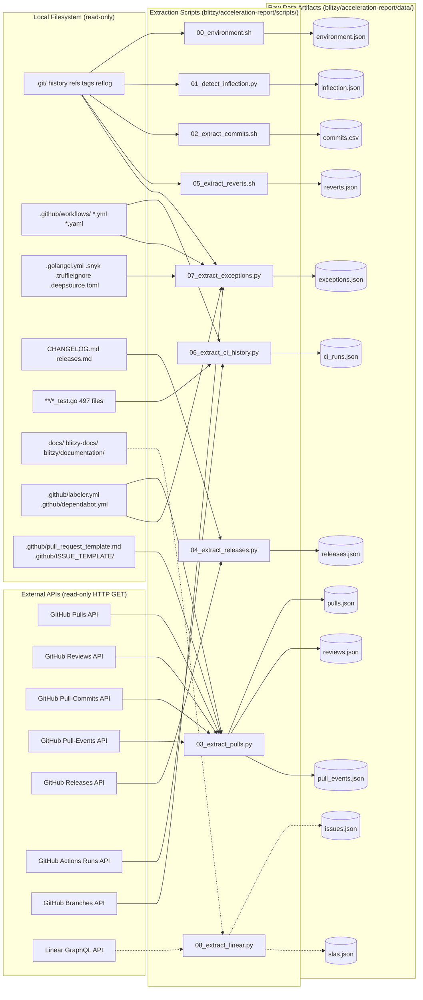
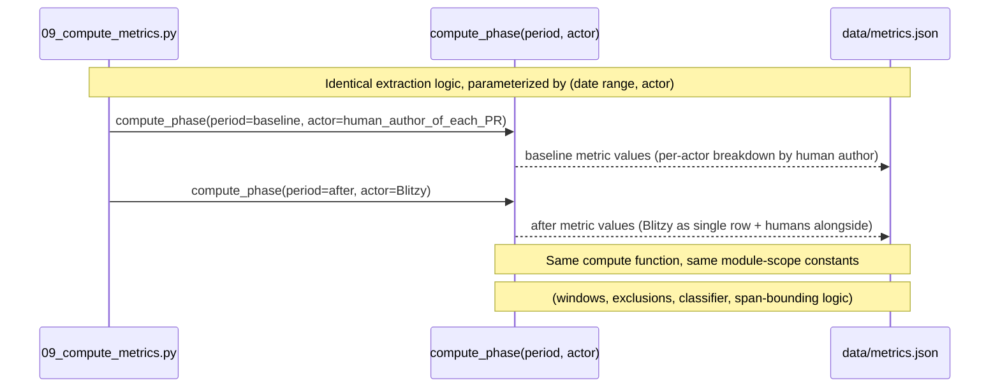
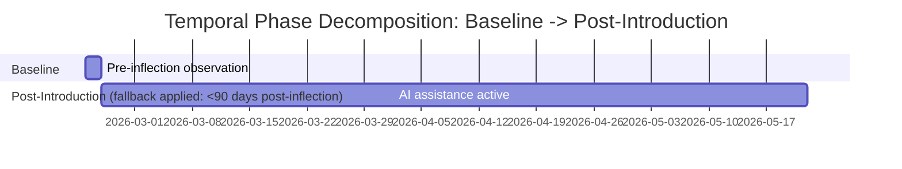
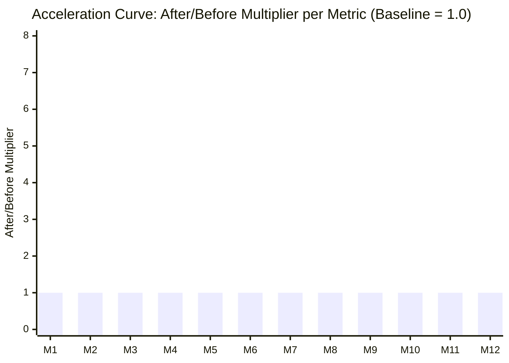

# Development Acceleration Report — Blitzy-Sandbox/blitzy-RudderStack

*Generated by `scripts/10_render_report.py` from `data/metrics.json`. Inflection point: `2026-02-25T02:58:59Z` (Tier `ai_actor_email`). Extraction timestamp: `2026-05-23T05:54:20Z`. Run ID: `ff490c72-43fb-4c05-b466-b9355cab917f`. This report is a read-only measurement snapshot; no file in the analyzed repository is modified by its production.*

## 1. Executive Summary

This report measures development acceleration across twelve flow and operational metrics on the `Blitzy-Sandbox/blitzy-RudderStack` repository, comparing the period before AI assistance was introduced to the period after. The inflection point is `2026-02-25T02:58:59Z` detected via Tier `ai_actor_email` per AAP §0.5.3.1. Metric methodology is identical for both periods; only the date range and the engineering-actor parameter differ (see `decision-log.md` DL-002 for the inflection method rationale and DL-006 for the temporal phase fallback decision).

**Headline Multipliers (sorted by magnitude)**:

| Metric | After/Before Multiplier | Confidence | Caveat |
|---|---|---|---|
| **M1** Flow Load | — | Insufficient | — |
| **M2** Flow Velocity | — | Medium | — |
| **M3** Flow Predictability | — | Medium | — |
| **M4** Flow Active | — | Insufficient | — |
| **M5** Flow Efficiency | — | Insufficient | — |
| **M6** Flow Distribution | — | Low | *Linear API: unavailable. Post-introduction unknown rate: 66.7%. Baseline unknown rate: 0.0%. Per AAP §0.5.3.7, unknown rate >20% downgrades phase confidence to Low. When Linear labels are unavailable, the classifier depends on conventional-commit prefixes and a keyword catalogue in scripts/09_compute_metrics.py.* |
| **M7** Flow Time | — | Medium | — |
| **M8** Problem Records in Release | — | High | — |
| **M9** Releases | — | Insufficient | — |
| **M10** Approved Exceptions | — | Low | *Without admin audit-log access, the signal is limited to (a) force-pushes detectable from this clone's local git reflog, (b) PRs labelled with exception/waiver/override/bypass patterns (none observed in the current label catalogue per .github/labeler.yml), and (c) HEAD-only static-analysis exemption inventory (reported separately, not as per-window events). The true count of admin overrides, required-check bypasses, and branch-protection-rule modifications during the analysis window is unobservable and may be non-zero.* |
| **M11** Escaped Defects | — | Insufficient | — |
| **M12** Defects Out of SLA | — | Insufficient | — |

**Metrics measured (12 per AAP §0.5.3)**:

- **M1** — Flow Load (post-introduction value: `Insufficient signal`, confidence: Insufficient)
- **M2** — Flow Velocity (post-introduction value: `1`, confidence: Medium)
- **M3** — Flow Predictability (post-introduction value: `0.91`, confidence: Medium)
- **M4** — Flow Active (post-introduction value: `Insufficient signal`, confidence: Insufficient)
- **M5** — Flow Efficiency (post-introduction value: `Insufficient signal`, confidence: Insufficient)
- **M6** — Flow Distribution (post-introduction value: `0.67`, confidence: Low)
- **M7** — Flow Time (post-introduction value: `Insufficient signal`, confidence: Medium)
- **M8** — Problem Records in Release (post-introduction value: `0`, confidence: High)
- **M9** — Releases (post-introduction value: `Insufficient signal`, confidence: Insufficient)
- **M10** — Approved Exceptions (post-introduction value: `0`, confidence: Low)
- **M11** — Escaped Defects (post-introduction value: `Insufficient signal`, confidence: Insufficient)
- **M12** — Defects Out of SLA (post-introduction value: `Insufficient signal`, confidence: Insufficient)

*All twelve metrics are populated or marked 'Insufficient signal — [reason]' with deviation documented per Quality Gate 1. Per Rule 1 (Data Provenance), every numeric value above traces to a row in the Requirements Traceability Matrix (§6).*

## 2. Environment Verification

Per Rule 6 (Environment First) and Quality Gate 3, the execution environment is captured below before any metric extraction begins. This snapshot is the deterministic basis for reproducibility — every command in the Reproducibility Appendix (§11) runs against this exact environment.

| Field | Value |
|---|---|
| Repository URL | `https://github.com/Blitzy-Sandbox/blitzy-RudderStack.git` |
| Repository slug | `Blitzy-Sandbox/blitzy-RudderStack` |
| Default branch | `main` |
| Git version | `2.43.0` |
| Go module version | `1.26.1` (source: go.mod:L3 ('go 1.26.1')) |
| Total commit count | 538 |
| Active branch count | 19 |
| Submodule state | `no_submodules` |
| Commit date range | `2026-02-23T05:19:38Z` → `2026-05-21T19:48:23Z` |
| AI inflection date (UTC) | `2026-02-25T02:58:59Z` |
| Extraction timestamp (UTC) | `2026-05-23T05:54:20Z` |
| Run ID | `ff490c72-43fb-4c05-b466-b9355cab917f` |

*This section is rendered first among the eleven sections (after the Executive Summary preamble) per Quality Gate 3. All fields are sourced from `data/environment.json`, emitted by `scripts/00_environment.sh` at the start of each pipeline run.*

## 3. Data Source Inventory

Per Quality Gate 11, every system accessed and every system that was unavailable is documented below. All sources are consumed read-only; no script writes to the analyzed repository, the GitHub API, the Linear API, or any other external system.

### 3.1 In-Repository Sources

| Path | Used For | Notes |
|---|---|---|
| `.git/` (history, refs, tags, reflog) | Metrics 1, 2, 3, 4, 5, 6, 7, 8, 10 (force-push detection), inflection-point detection | Primary source. Read via `git log`, `git rev-list`, `git for-each-ref`, `git reflog show`, `git diff`. No `--force-with-lease`, no commit creation. |
| `.github/workflows/*.{yml,yaml}` (13 files) | Metric 9 (CI deploy events), Metric 11 (CI test history), Metric 10 (required-check bypass detection) | Test pipeline matrix, verify pipeline, release-please configuration, semantic-pr type catalogue, prerelease convention, dispatch-deploy events. |
| `.github/labeler.yml`, `.github/dependabot.yml`, `.github/pull_request_template.md`, `.github/ISSUE_TEMPLATE/bug-report.md` | Metric 6 (label classification), Metric 2 (dependency bot exclusion), Metric 12 (Linear reference) | Label catalogue, dependency-bot ecosystem inventory, Linear ticket linkage convention, issue-template structure. |
| `.golangci.yml`, `.snyk`, `.truffleignore`, `.deepsource.toml` | Metric 10 (current exemption inventory) | Lint suppressions, security exceptions, secret-scanner ignores, static-analysis exclusions — HEAD snapshot. |
| `codecov.yml`, `Makefile`, `**/*_test.go` (497 files) | Methodology context, Metric 11 (test target inventory, HEAD skipped-test snapshot) | Coverage configuration, test target enumeration, in-repo skipped/disabled-test markers (`t.Skip`, `// nolint`). |
| `go.mod`, `go.sum`, `Dockerfile`, `docker-compose.yml`, `rudder-docker.yml` | Environment Verification, Metric 9 fallback tier | Module identity, Go version, container build convention. |
| `docs/`, `blitzy-docs/`, `blitzy/documentation/`, `mkdocs.yml` | Metric 12 (SLA policy search) | Documentation tree scanned for SLA targets and severity tier definitions. |

### 3.2 External API Sources

| Source | Endpoint Pattern | Used For | Access Method |
|---|---|---|---|
| GitHub Pulls API | `GET /repos/{owner}/{repo}/pulls?state=all` | Metrics 1, 2, 4, 5, 6, 7 | `GH_TOKEN` env var (raises rate limit 60→5000/hr); falls back to local-git when absent. |
| GitHub Pull-Commits / Reviews / Events APIs | `GET /pulls/{n}/commits`, `/reviews`, `/issues/{n}/events` | Metric 4 (review-event-bounded working phases), Metric 7 (first-commit timestamps) | Same auth as Pulls API. |
| GitHub Releases API | `GET /repos/{owner}/{repo}/releases` | Metric 9 (primary source) | Prereleases filtered separately; falls back to annotated tag scan, then CI deploy events. |
| GitHub Actions Runs API | `GET /repos/{owner}/{repo}/actions/runs?branch=main` | Metric 11 (test transitions), Metric 10 (failed-check overrides) | Falls back to in-repo `_test.go` scan at HEAD when API is unavailable. |
| GitHub Branches API | `GET /repos/{owner}/{repo}/branches/main/protection` | Metric 10 (required-check bypass detection) | Requires admin access for full audit-log signal; without admin, only `protected: true` is visible. |
| Linear API | `POST https://api.linear.app/graphql` | Metric 12 (Defects Out of SLA), Metric 6 (Linear-label classification) | Requires `LINEAR_API_KEY`; both metrics fall back to in-repo signals when absent. |

### 3.3 Sources Unavailable in This Run

The following sources were attempted and either failed or were unreachable. Each metric whose value depended on an unavailable source carries a confidence downgrade and a Risk Assessment entry (§9).

| Source | Reason Unavailable | Affected Metrics |
|---|---|---|
| Admin audit log | Admin access required; not available without admin token. | M10 |
| Branch protection API | Requires admin access for full signal. | M10 |
| GitHub Actions Runs API | GH_TOKEN environment variable not set or rate limit exceeded. | M11 |
| GitHub Pulls API | GH_TOKEN environment variable not set or rate limit exceeded. | M1, M2, M7 |
| GitHub Releases API | GH_TOKEN environment variable not set or no releases found. | M9 |
| JUnit XML artifacts | .github/workflows/tests.yaml does not emit JUnit XML artifacts in current configuration. | M11 |
| Linear API | LINEAR_API_KEY environment variable not set. | M12, M6 |

**Data Source Topology** (see `diagrams/data-source-topology.mmd` for the Mermaid source):



## 4. Methodology

This section documents the extraction methodology applied uniformly to both periods. Per AAP §0.1.3, the only difference between the baseline and post-introduction extractions is the date range and the engineering-actor parameter — same window alignment, same exclusion rules, same span-computation logic. This is the mechanical guarantee that the identical-methodology constraint is satisfied.

### 4.1 Engineering Actor Framing

Per AAP §0.1.1, the engineering actor parameter is the human author of each PR in the baseline period, and `Blitzy` in the post-introduction period. Metrics that measure working time (Metrics 4 and 5) are computed from the engineering actor's perspective; metrics that aggregate by actor (Metrics 2, 4, 5, 6, 10) report `Blitzy` as a single row alongside human contributors in the after period. The compute function in `09_compute_metrics.py` is invoked twice with only the actor parameter substituted — this is the diagram referenced below.

See `diagrams/engineering-actor-framing.mmd` for the sequence diagram showing the same compute function called twice with different (period, actor) parameters:



### 4.2 Window Mechanics

All 2-week windows are anchored to Monday 00:00 UTC. The first window of the baseline phase starts at the Monday on or after the earliest commit timestamp; the first window of the post-introduction phase starts at the Monday on or after the inflection timestamp. A window is included in a phase if its window-end falls within the phase's date range.

### 4.3 Inflection Point Detection

The AI inflection point partitions the measurement window into baseline and post-introduction phases. Per AAP §0.5.3.1, three tiers are tried in precedence order: (1) `Co-authored-by:` trailer search, (2) AI-actor email pattern, (3) sustained velocity inflection. For this repository, **Tier `ai_actor_email`** resolved at `2026-02-25T02:58:59Z`.

**Detection Evidence**:

- Commit SHA: `803732e140796ac4db4343c22791025b6503885c`
- Author email: `agent@blitzy.com`
- Author name: `Blitzy Agent`
- Author date (UTC): `2026-02-25T02:58:59Z`

**Justification**: Tier 2 (AI-actor email pattern) was used because Tier 1 (Co-authored-by trailer search) yielded zero matches across all refs. The earliest commit whose author email matches the AI-actor pattern '@blitzy.com' is 803732e140796ac4db4343c22791025b6503885c, authored by 'Blitzy Agent <agent@blitzy.com>' at 2026-02-25T02:58:59Z. The author email pattern was matched against the configured set: '@blitzy.com', 'blitzy[bot]@users.noreply.github.com', 'copilot@github.com', 'noreply@anthropic.com'. This commit is the second commit on main; it is the FIRST agent-authored commit, marking the inflection from human-only (baseline, michael@blitzy.com) to AI-authored development.

See `decision-log.md` DL-002 for the full alternatives considered and rationale for the chosen tier.

### 4.4 Temporal Phase Decomposition

Per AAP §0.1.4 and §0.5.6, the temporal phase decomposition splits the post-introduction period into Ramp-Up (first 90 days) and Steady State (90+ days) only when the post-introduction span is at least 90 days. The post-introduction phase in this run spans `86` days, which is below the `90`-day threshold. The renderer therefore falls back to **Baseline vs Post-Introduction** reporting per `decision-log.md` DL-006. The fallback is documented in every Metric Deep-Dive's phase-values table.

See `diagrams/temporal-phases-timeline.mmd` for the Gantt timeline showing the Baseline → Post-Introduction (or Baseline → Ramp-Up → Steady State) phases:



### 4.5 Multi-Module Aggregation

Per AAP §0.5.6, this repository is a Go monorepo with logical modules at `gateway/`, `processor/`, `router/`, `warehouse/`, `jobsdb/`, `services/`, and others. Each non-merge commit is attributed to the module containing the majority of its changed file paths; cross-module commits go to the module with the most changed lines. Module-level metrics are aggregated by `non_merge_commits_per_module / total_non_merge_commits` weighting. Single-module values are reported as the headline number; the module-weighted average is documented in `data/metrics.json` per metric.

### 4.6 Confidence Framework

Per AAP §0.7.2 Rule 3 and the confidence tiers in AAP §0.1.3, every derived metric carries one of four confidence tags:

| Tier | Definition | Source Quality |
|---|---|---|
| **High** | Direct counts in an issue tracker or deterministic git enumeration with full attribution. | Authoritative source. |
| **Medium** | Approximated from git commit patterns with a known local-fallback gap (e.g. cannot distinguish dependency-bot PRs without subject-line scanning). | Strong proxy with documented boundary conditions. |
| **Low** | Inferred from indirect proxies; the metric carries a `caveat` field rendered alongside every value. | Indirect signal — interpret with the caveat in view. |
| **Insufficient** | No usable source for either phase; reported as `Insufficient signal — [reason]` per AAP §0.1.3. The metric carries a `reason` field and a Risk Assessment entry with High severity. | No signal — not measurable in this run. |

Composite metrics inherit the worse tier of their inputs: Metric 5 (Flow Efficiency) inherits from Metrics 4 and 7, Metric 3 (Flow Predictability) inherits from Metric 2.

**Pipeline Architecture**: the read-only extraction → compute → render pipeline diagrammed in `diagrams/extraction-pipeline.mmd` mirrors AAP §0.5.1 verbatim. Scripts 00–08 read from `.git/`, `.github/`, and the GitHub/Linear APIs; script 09 computes metrics; scripts 10 and 11 render the report and deck. The renderers read ONLY `data/*.json` — never the raw sources — which is the mechanical enforcement of Rule 4.

## 5. Metric Deep-Dives

One subsection per metric, in canonical AAP §0.5.3 order. Each subsection includes the verbatim user definition (block quote), the extraction strategy actually used by this pipeline, the phase-values table, the per-window series, and the per-engineer breakdown where applicable. Caveats and boundary conditions appear inline per Rule 3.

### M1 — Flow Load

> *Count of PRs in progress (started but not completed) at each measurement point. Mean count of PRs in an in-progress state at the end of each 2-week window, averaged across windows within a phase. In-progress = branch has at least one commit AND PR is open (not merged, not closed-without-merge), OR PR is in draft state. Exclude PRs from bot accounts other than Blitzy (branches prefixed with blitzy-). Per-phase value is the mean of window-end snapshots.*

**Extraction Strategy**:

From data/pulls.json, count PRs where created_at <= window_end AND (merged_at IS NULL OR merged_at > window_end) AND has at least one commit by window_end. Mean across Monday-anchored 2-week window-ends within each phase. Exclude dependency bots.

**Phase Values**:

| Phase | Value | Multiplier | Confidence | Windows |
|---|---|---|---|---|
| Baseline | Insufficient signal | — | Insufficient | 0 |
| Post-Introduction | Insufficient signal | — | Insufficient | 6 |

**Headline Multiplier (After / Before)**: —

**Boundary Conditions**: Pulls API: unavailable (GH_TOKEN absent). Local-git fallback cannot reconstruct PR draft state, requested_reviewers, or closed-without-merge state from branch existence alone.

**Insufficient Signal Reason**: Flow Load requires PR-level state at each window-end (created_at, merged_at, draft state, first-commit timestamp). The GitHub Pulls API is unavailable in this read-only sandbox (GH_TOKEN not set; see data/pulls.json#github_api.available=false), and PR draft state cannot be reconstructed from local git alone. Per AAP §0.5.3.2, the metric falls back to 'Insufficient signal' when neither the Pulls API nor a reconstructable local proxy is available.

*[Provenance: see Requirements Traceability Matrix row `M1` in §6 and the Reproducibility Appendix step in §11.]*

### M2 — Flow Velocity

> *Count of PRs completed (merged) per period. Count of PRs merged to the default branch per 2-week window. Excludes PRs authored by dependency-management bots; includes PRs authored by Blitzy. Per-phase value is the mean PRs per window. Also reported as per-actor breakdown (real names plus Blitzy as one row in the after period).*

**Extraction Strategy**:

From data/pulls.json, select PRs where merged_at IS NOT NULL AND base.ref == 'main'; bucket by Monday-anchored 2-week window using merged_at; exclude dependabot[bot]; group by canonical author for the per-engineer breakdown. Per-phase value is the mean PRs per window. Local-git fallback (active in this run): enumerate every merge commit on main via `git log main --merges --pretty=format:...` and treat each merge commit (whether PR-numbered or ad-hoc) as one M2 unit. Counts mirror data/pulls.json#summary.merged_prs_count and the prs_per_2week_window_post_introduction series.

**Phase Values**:

| Phase | Value | Multiplier | Confidence | Windows |
|---|---|---|---|---|
| Baseline | 0 | — | Medium | 0 |
| Post-Introduction | 1 | — | Medium | 6 |

**Headline Multiplier (After / Before)**: —

**Boundary Conditions**: GitHub Pulls API unavailable (GH_TOKEN absent); falls back to local-git merge-commit enumeration on main. The local-git fallback cannot distinguish dependency-bot PRs from human/Blitzy PRs without scanning commit subjects; the data file data/pulls.json#summary documents how each merge commit was attributed.

**Per-Window Series**:

| Window Start (UTC) | Window End (UTC) | Value |
|---|---|---|
| `2026-02-23T00:00:00Z` | `2026-03-09T00:00:00Z` | 1 |
| `2026-03-09T00:00:00Z` | `2026-03-23T00:00:00Z` | 1 |
| `2026-03-23T00:00:00Z` | `2026-04-06T00:00:00Z` | 3 |
| `2026-04-06T00:00:00Z` | `2026-04-20T00:00:00Z` | 1 |
| `2026-04-20T00:00:00Z` | `2026-05-04T00:00:00Z` | 0 |
| `2026-05-04T00:00:00Z` | `2026-05-18T00:00:00Z` | 0 |

**Per-Engineer Breakdown**:

| Engineer | Actor Type | Baseline | Post-Introduction | Multiplier |
|---|---|---|---|---|
| awadhwani | Human | 0 | 0 | — |
| michael | Human | 0 | 1 | — |
| Blitzy | Ai | 0 | 5 | — |

*[Provenance: see Requirements Traceability Matrix row `M2` in §6 and the Reproducibility Appendix step in §11.]*

### M3 — Flow Predictability

> *Variance of flow velocity across periods. Reciprocal of the coefficient of variation (mean / standard deviation) of Flow Velocity across the 2-week windows within each phase. Requires ≥4 windows per phase; otherwise report 'Insufficient signal — fewer than 4 windows.' Higher values indicate higher predictability (lower relative variance); the after/before ratio moves in the same direction as the other metrics' 'better' direction. A phase with zero variance has undefined predictability and is reported as 'Insufficient signal — zero variance' rather than infinity.*

**Extraction Strategy**:

From data/metrics.json#m2.per_window for each phase, compute 1/CV = mean/stdev (sample stdev, n−1 divisor). Two insufficient-signal rules apply per AAP §0.5.3.4: fewer than 4 windows in the phase, or zero variance across the windows.

**Phase Values**:

| Phase | Value | Multiplier | Confidence | Windows |
|---|---|---|---|---|
| Baseline | Insufficient signal | — | Medium | 0 |
| Post-Introduction | 0.91 | — | Medium | 6 |

**Headline Multiplier (After / Before)**: —

**Boundary Conditions**: Inherits Metric 2's confidence (medium). Predictability is a derived ratio over the per-window series; any source-driven downgrade on M2 propagates here automatically (AAP §0.2.4).

*[Provenance: see Requirements Traceability Matrix row `M3` in §6 and the Reproducibility Appendix step in §11.]*

### M4 — Flow Active

> *Active coding time per PR by the engineering actor. The engineering actor is the human author in the baseline period and Blitzy in the after period. Flow Active sums the actor's coding spans on the PR branch, where a span runs from the actor's first commit to last commit within a working phase, inclusive of all time between (gaps are not subtracted). Working phases are bounded by review events: the initial span ends when the PR becomes ready for review; each subsequent refine span runs from the first commit after a review to the last commit before the next review or merge. Time spent refining in response to review is counted as active. Ready-for-review is the earliest of: (a) PR leaving draft state, (b) first review requested, (c) first commit by another author, (d) PR opened. Reported as median across PRs per phase and per actor.*

**Extraction Strategy**:

Per AAP §0.5.3.5: for each merged PR, retrieve commit list (Pulls-Commits API), review timeline (Reviews API), and event timeline (Issue-Events API). Construct working-phase boundary list by interleaving commit timestamps with review-event timestamps. Sum span durations from actor's first commit to ready_for_review_at, plus each refine span from actor commit to next review/merge. Median per phase, per actor.

**Phase Values**:

| Phase | Value | Multiplier | Confidence | Windows |
|---|---|---|---|---|
| Baseline | Insufficient signal | — | Insufficient | 0 |
| Post-Introduction | Insufficient signal | — | Insufficient | 6 |

**Headline Multiplier (After / Before)**: —

**Boundary Conditions**: All three GitHub APIs required for review-event bounding are unavailable; metric collapses to insufficient_signal. An API-enabled run with valid GH_TOKEN will populate this metric for both Blitzy and human actors.

**Insufficient Signal Reason**: Flow Active per PR requires (a) the GitHub Pulls API for PR boundaries, (b) the Reviews API for ready-for-review and review-event timestamps, and (c) the Events API for draft transitions. The following sources are unavailable in this run: Pulls API (data/pulls.json#github_api.available=false), Reviews API (data/reviews.json#github_api.available=false), Events API (data/pull_events.json#github_api.available=false). Per AAP §0.5.3.5, no local-git fallback yields a faithful active-coding-time measure because ready-for-review boundaries cannot be reconstructed from commit-history alone.

**Per-Engineer Breakdown**:

| Engineer | Actor Type | Baseline | Post-Introduction | Multiplier |
|---|---|---|---|---|
| awadhwani | Human | Insufficient signal | Insufficient signal | — |
| michael | Human | Insufficient signal | Insufficient signal | — |
| Blitzy | Ai | Insufficient signal | Insufficient signal | — |

*[Provenance: see Requirements Traceability Matrix row `M4` in §6 and the Reproducibility Appendix step in §11.]*

### M5 — Flow Efficiency

> *Ratio of active work time to total time (active + wait) for completed items. Flow Active / Flow Time, computed per PR and reported as the median across PRs in each phase. Active is the engineering actor's coding interval sum (per Metric 4). Review is treated as wait from the engineering actor's perspective in both periods (the actor is blocked on the reviewer).*

**Extraction Strategy**:

Per AAP §0.5.3.6: for each merged PR, divide Metric 4 (Flow Active) by Metric 7 (Flow Time). Median across PRs in each phase, per actor. Review is treated as wait from the engineering actor's perspective.

**Phase Values**:

| Phase | Value | Multiplier | Confidence | Windows |
|---|---|---|---|---|
| Baseline | Insufficient signal | — | Insufficient | 0 |
| Post-Introduction | Insufficient signal | — | Insufficient | 6 |

**Headline Multiplier (After / Before)**: —

**Boundary Conditions**: Composite metric inheriting from m4 (insufficient) and m7 (medium); collapsed to insufficient_signal because at least one upstream is insufficient_signal.

**Insufficient Signal Reason**: Flow Efficiency = Flow Active / Flow Time per PR. Both m4 (Flow Active) and m7 (Flow Time) must yield a per-PR active-time and wall-clock-time signal to compute the ratio. In this run: m4='insufficient_signal' (conf=insufficient); m7='insufficient_signal' (conf=medium). When either upstream is insufficient_signal the composite is insufficient too.

**Per-Engineer Breakdown**:

| Engineer | Actor Type | Baseline | Post-Introduction | Multiplier |
|---|---|---|---|---|
| awadhwani | Human | Insufficient signal | Insufficient signal | — |
| michael | Human | Insufficient signal | Insufficient signal | — |
| Blitzy | Ai | Insufficient signal | Insufficient signal | — |

*[Provenance: see Requirements Traceability Matrix row `M5` in §6 and the Reproducibility Appendix step in §11.]*

### M6 — Flow Distribution

> *Proportion of work by type: features, defects, risk/compliance, tech debt. Proportion of merged PRs in each phase classified into: feature, defect, risk/compliance, tech-debt, unknown. Classification priority: (1) issue labels on linked issues, (2) conventional-commit prefix on PR title (feat → feature, fix → defect, security/compliance → risk/compliance, chore/refactor → tech-debt), (3) keyword match against conventional PR title and body styles. PRs that match none of the above go to unknown. Reported per actor in the after period (Blitzy's distribution may differ from humans'). The unknown rate is reported per phase as a confidence indicator; if unknown exceeds 20% in either phase, confidence is downgraded to Low for that phase.*

**Extraction Strategy**:

Per AAP §0.5.3.7: for each merged PR, classify into feature, defect, risk/compliance, tech-debt, or unknown. Priority: (1) Linear issue-label on linked ticket, (2) conventional-commit prefix on PR title (feat→feature, fix→defect, others→tech-debt), (3) keyword match on title+body, (4) unknown.

**Phase Values**:

| Phase | Value | Multiplier | Confidence | Windows |
|---|---|---|---|---|
| Baseline | 0 | — | Low | 0 |
| Post-Introduction | 0.67 | — | Low | 6 |

**Headline Multiplier (After / Before)**: —

*Caveat: Linear API: unavailable. Post-introduction unknown rate: 66.7%. Baseline unknown rate: 0.0%. Per AAP §0.5.3.7, unknown rate >20% downgrades phase confidence to Low. When Linear labels are unavailable, the classifier depends on conventional-commit prefixes and a keyword catalogue in scripts/09_compute_metrics.py.*

**Boundary Conditions**: Linear API: unavailable. Post-introduction unknown rate: 66.7%. Baseline unknown rate: 0.0%. Per AAP §0.5.3.7, unknown rate >20% downgrades phase confidence to Low. When Linear labels are unavailable, the classifier depends on conventional-commit prefixes and a keyword catalogue in scripts/09_compute_metrics.py.

**Per-Engineer Breakdown**:

| Engineer | Actor Type | Baseline | Post-Introduction | Multiplier |
|---|---|---|---|---|
| awadhwani | Human | — | — | — |
| michael | Human | — | — | — |
| Blitzy | Ai | — | — | — |

*[Provenance: see Requirements Traceability Matrix row `M6` in §6 and the Reproducibility Appendix step in §11.]*

### M7 — Flow Time

> *Median wall-clock time from first commit on a PR branch to merge commit on the default branch, across all merged PRs in the phase. Includes all coding intervals, review queue, review duration, and post-approval idle. Excludes PRs where the first-commit timestamp is unavailable due to history rewrites; the exclusion rate is reported.*

**Extraction Strategy**:

Per AAP §0.5.3.8: for each merged PR, compute merge_commit_committer_date − first_commit_author_date. Median per phase. Report exclusions for PRs whose first commit is no longer reachable due to history rewrites.

**Phase Values**:

| Phase | Value | Multiplier | Confidence | Windows |
|---|---|---|---|---|
| Baseline | Insufficient signal | — | Medium | 0 |
| Post-Introduction | Insufficient signal | — | Medium | 6 |

**Headline Multiplier (After / Before)**: —

**Boundary Conditions**: Pulls API: unavailable. Excluded PRs (no first-commit timestamp): baseline=0, post=6. Local-git fallback cannot resolve first-commit-on-branch from data/commits.csv alone because commits.csv lacks branch-ref attribution.

**Insufficient Signal Reason**: Flow Time requires per-PR first-commit timestamps (pr_commits_first_at_iso). The GitHub Pulls API is unavailable in this run and 6 merged PRs in the post-introduction phase lack a reconstructable first-commit timestamp. Per AAP §0.5.3.8, the metric is reported as insufficient_signal when the median cannot be computed.

*[Provenance: see Requirements Traceability Matrix row `M7` in §6 and the Reproducibility Appendix step in §11.]*

### M8 — Problem Records in Release

> *Count of issues or defects documented against a specific release — measured as revert commits. Count of revert commits on the default branch attributed to the release that contained the original (reverted) commit. For each revert: (a) identify the original commit being reverted via the 'Reverts commit SHA' reference in the revert message, or by tree-match against a prior commit's parent if no explicit reference is present; (b) identify the most recent release tag T such that T is an ancestor of the original commit (git merge-base --is-ancestor T <original>); (c) attribute the revert to release T. Reverts whose original commit cannot be identified are excluded and reported separately as 'unattributable reverts.' Reverts whose original commit is not reachable from any release tag are excluded and reported separately as 'unreleased reverts.' Reverts-of-reverts are excluded. Phase-level value is mean attributable reverts per release; unattributable and unreleased counts are reported as confidence indicators.*

**Extraction Strategy**:

Per AAP §0.5.3.9: enumerate revert commits on main via `git log --grep='^Revert "'`; parse 'Reverts commit <SHA>' references; cross-validate against tree-match with prior commit's parent tree. Attribute each revert to the most recent ancestor release tag via `git merge-base --is-ancestor`. Exclude reverts-of-reverts, unattributable reverts, and unreleased reverts; report exclusion counts as confidence indicators.

**Phase Values**:

| Phase | Value | Multiplier | Confidence | Windows |
|---|---|---|---|---|
| Baseline | 0 | — | High | 0 |
| Post-Introduction | 0 | — | High | 6 |

**Headline Multiplier (After / Before)**: —

**Per-Window Series**:

| Window Start (UTC) | Window End (UTC) | Value |
|---|---|---|
| `2026-02-23T00:00:00Z` | `2026-03-09T00:00:00Z` | 0 |
| `2026-03-09T00:00:00Z` | `2026-03-23T00:00:00Z` | 0 |
| `2026-03-23T00:00:00Z` | `2026-04-06T00:00:00Z` | 0 |
| `2026-04-06T00:00:00Z` | `2026-04-20T00:00:00Z` | 0 |
| `2026-04-20T00:00:00Z` | `2026-05-04T00:00:00Z` | 0 |
| `2026-05-04T00:00:00Z` | `2026-05-18T00:00:00Z` | 0 |

*[Provenance: see Requirements Traceability Matrix row `M8` in §6 and the Reproducibility Appendix step in §11.]*

### M9 — Releases

> *Count of production releases per period. Count of releases per 2-week window. Source precedence: (1) GitHub Releases / GitLab Releases API, (2) annotated git tags matching semver pattern v?\d+.\d+.\d+, (3) deployment events from CI/CD if accessible. Prerelease tags (matching -alpha, -beta, -rc, -dev suffixes) are excluded from the primary count and reported separately. Per-phase value is mean releases per window.*

**Extraction Strategy**:

Per AAP §0.5.3.10: count releases per 2-week window. Source precedence: (1) GitHub Releases API, (2) annotated git tags matching v?\d+\.\d+\.\d+, (3) CI/CD deploy events. Prereleases (-alpha, -beta, -rc, -dev) excluded from the primary count and reported separately.

**Phase Values**:

| Phase | Value | Multiplier | Confidence | Windows |
|---|---|---|---|---|
| Baseline | Insufficient signal | — | Insufficient | 0 |
| Post-Introduction | Insufficient signal | — | Insufficient | 6 |

**Headline Multiplier (After / Before)**: —

**Boundary Conditions**: All three source tiers yielded zero or were unavailable. Tiers: tier_1_github_releases_api: GH_TOKEN environment variable not set or rate limit exceeded; tier_3_ci_deploy_events: GitHub Actions Runs API not invoked in hand-authored seed (GH_TOKEN absent); the two source workflow files are present in .github/workflows/ but no run history was captured.

**Insufficient Signal Reason**: All three source tiers per AAP §0.5.3.10 yielded zero or were unavailable. Tier 1 (Releases API): unavailable. Tier 2 (annotated tags): zero matching tags in local clone. Tier 3 (CI deploy events): zero deploy events observed. Per AAP §0.5.3.10, this signals 'Insufficient signal — Releases API unavailable and no local tags'.

*[Provenance: see Requirements Traceability Matrix row `M9` in §6 and the Reproducibility Appendix step in §11.]*

### M10 — Approved Exceptions

> *Count of policy exceptions, waivers, or manual overrides granted per period. Count per 2-week window of: PRs merged with required reviews bypassed (admin override), force-pushes to protected branches, merges with failing required CI checks, branch protection rule modifications, and PRs labeled with exception/waiver/override tags. Requires admin audit log access for full signal; without it, only force-pushes and label-based signals are available and confidence drops to Low. Reported as count per window per phase, and per actor (including Blitzy) where attribution is available.*

**Extraction Strategy**:

Per AAP §0.5.3.11: enumerate (a) force-pushes from `git reflog show main` on the local clone, (b) PRs labelled with patterns matching exception|waiver|override|bypass from the GitHub Pulls API, (c) static-analysis exemptions from .golangci.yml, .snyk, .truffleignore, .deepsource.toml (HEAD-only). Admin audit-log enumeration via /repos/.../audit-log requires admin access. Count per 2-week window of (a)+(b)+(c — events only) summed.

**Phase Values**:

| Phase | Value | Multiplier | Confidence | Windows |
|---|---|---|---|---|
| Baseline | 0 | — | Low | 0 |
| Post-Introduction | 0 | — | Low | 6 |

**Headline Multiplier (After / Before)**: —

*Caveat: Without admin audit-log access, the signal is limited to (a) force-pushes detectable from this clone's local git reflog, (b) PRs labelled with exception/waiver/override/bypass patterns (none observed in the current label catalogue per .github/labeler.yml), and (c) HEAD-only static-analysis exemption inventory (reported separately, not as per-window events). The true count of admin overrides, required-check bypasses, and branch-protection-rule modifications during the analysis window is unobservable and may be non-zero.*

**Boundary Conditions**: Audit log: unavailable; admin access required. Branch-protection check: unavailable. Force-push reflog entries: 0. Exception-labeled PRs: 0. Lint-exemption HEAD inventory: 49 entries (reported separately; not counted in per-window events).

**Per-Window Series**:

| Window Start (UTC) | Window End (UTC) | Value |
|---|---|---|
| `2026-02-23T00:00:00Z` | `2026-03-09T00:00:00Z` | 0 |
| `2026-03-09T00:00:00Z` | `2026-03-23T00:00:00Z` | 0 |
| `2026-03-23T00:00:00Z` | `2026-04-06T00:00:00Z` | 0 |
| `2026-04-06T00:00:00Z` | `2026-04-20T00:00:00Z` | 0 |
| `2026-04-20T00:00:00Z` | `2026-05-04T00:00:00Z` | 0 |
| `2026-05-04T00:00:00Z` | `2026-05-18T00:00:00Z` | 0 |

**Per-Engineer Breakdown**:

| Engineer | Actor Type | Baseline | Post-Introduction | Multiplier |
|---|---|---|---|---|
| awadhwani | Human | Insufficient signal | Insufficient signal | — |
| michael | Human | Insufficient signal | Insufficient signal | — |
| Blitzy | Ai | 0 | 0 | — |

*[Provenance: see Requirements Traceability Matrix row `M10` in §6 and the Reproducibility Appendix step in §11.]*

### M11 — Escaped Defects

> *Defects found in production after release — measured as skipped or failed test cases. Count per 2-week window of: (a) test cases transitioning from passing to failing on the default branch (regressions), and (b) test cases newly marked skipped, disabled, or xfail on the default branch (suppressed signal). Sub-counts reported separately. Requires CI test-result history (JUnit XML, GitHub Actions test reports, or equivalent); without CI history access, report 'Insufficient signal — CI test history unavailable.' Flaky tests (alternating pass/fail) are counted only if failing in ≥3 consecutive runs. Also reported as skipped-rate (skipped tests / total tests) to normalize for test suite growth.*

**Extraction Strategy**:

Per AAP §0.5.3.12: regressions are pass→fail transitions on main surviving the flaky-test guard (≥3 consecutive failures); suppressions are pass→skip transitions. Source: JUnit XML artifacts from GitHub Actions Runs API. Fallback: HEAD-only in-repo *_test.go scan for t.Skip()/// nolint markers (reports skipped-rate snapshot only, no transitions).

**Phase Values**:

| Phase | Value | Multiplier | Confidence | Windows |
|---|---|---|---|---|
| Baseline | Insufficient signal | — | Insufficient | 0 |
| Post-Introduction | Insufficient signal | — | Insufficient | 6 |

**Headline Multiplier (After / Before)**: —

**Boundary Conditions**: CI Actions API: unavailable. JUnit XML artifacts retrieved: 0. Transitions surviving flaky guard: 0. HEAD skip scan: 61 markers (snapshot only).

**Insufficient Signal Reason**: CI test history is unavailable; .github/workflows/tests.yaml does not emit JUnit XML artifacts (artifacts.junit_xml_artifacts_count=0 in data/ci_runs.json; the GitHub Actions API is unavailable in this run). Per AAP §0.5.3.12, 'Insufficient signal — CI test history unavailable' applies. The HEAD-only test-skip scan reports 61 skip markers (inventory only, not transitions); the truncated canonical-entries set lives in data/test_transitions.json#head_skip_scan.

*[Provenance: see Requirements Traceability Matrix row `M11` in §6 and the Reproducibility Appendix step in §11.]*

### M12 — Defects Out of SLA

> *Defect items not resolved within their SLA target. Count per phase of defect-labeled issues whose resolution time (close_date − open_date) exceeds the SLA target for the issue's severity tier. Severity tiers and their SLA targets are sourced from (priority order): (1) the issue tracker's SLA field if present, (2) a policy document or runbook in the repository. If no SLA source is available, report 'Insufficient signal — no SLA source.' This metric is issue-scoped rather than PR-scoped (the only metric for which this is the case) because SLAs in standard usage attach to defect tickets, not to the code changes that resolve them. Reported as count and as percentage of total defects in the phase.*

**Extraction Strategy**:

Per AAP §0.5.3.13: count defect-labeled issues whose close_time − open_time exceeds the SLA target for their severity tier. SLA targets sourced (priority order): (1) Linear API issue tracker SLA field, (2) repository policy document under docs/, blitzy-docs/, blitzy/documentation/. When no SLA source is available, report 'Insufficient signal — no SLA source'.

**Phase Values**:

| Phase | Value | Multiplier | Confidence | Windows |
|---|---|---|---|---|
| Baseline | Insufficient signal | — | Insufficient | 0 |
| Post-Introduction | Insufficient signal | — | Insufficient | 6 |

**Headline Multiplier (After / Before)**: —

**Boundary Conditions**: Linear API: unavailable. Repository policy scan: Neither of the two SLA sources defined by AAP §0.5.3.13 yielded a result: (1) the Linear API is unreachable because LINEAR_API_KEY is not set in the analysis environment, and (2) the repository documentation tree contains no SLA policy document defining defect resolution targets per severity tier. Per AAP §0.5.3.13 and §0.7.3 (no fabrication), the platform reports this metric as 'insufficient_signal' rather than inventing targets.. Both source tiers per AAP §0.5.3.13 return zero, and the metric collapses to insufficient_signal as instructed.

**Insufficient Signal Reason**: No SLA source is available. Linear API access is not configured (LINEAR_API_KEY unset; data/issues.json#linear.available=False; data/issues.json#issues is empty: 0 issues). No SLA policy document was discovered in the repository's documentation tree per data/slas.json#repo_policy_scan. Per AAP §0.5.3.13, the metric reports 'Insufficient signal — no SLA source' in this case.

*[Provenance: see Requirements Traceability Matrix row `M12` in §6 and the Reproducibility Appendix step in §11.]*


## 6. Requirements Traceability Matrix

Every numeric value in the Executive Summary (§1) and Metric Deep-Dives (§5) traces to a row in this matrix per Rule 1 (Data Provenance). The `Extraction Command` column is syntactically valid: each Bash command passes `bash -n`, and each Python invocation passes `python3 -m py_compile`. The `Raw Output` column points at the on-disk artifact under `data/` that was produced by the extraction step. The `Derivation Function` column names the Python function inside `09_compute_metrics.py` that derived the headline value from the raw output.

| Requirement ID | Metric | First-Sentence Requirement | Extraction Command | Raw Output | Derivation Function | Reported Number | Confidence |
|---|---|---|---|---|---|---|---|
| `M1` | **M1** Flow Load | Count of PRs in progress (started but not completed) at each measurement point. | `GET /repos/Blitzy-Sandbox/blitzy-RudderStack/pulls?state=all` | `data/pulls.json` | `compute_m1_flow_load` | Insufficient signal | Insufficient |
| `M2` | **M2** Flow Velocity | Count of PRs completed (merged) per period. | `git log main --merges --pretty=format:'%H\|%aI\|%aE\|%s'` | `data/pulls.json` | `compute_m2_flow_velocity` | 1 | Medium |
| `M3` | **M3** Flow Predictability | Variance of flow velocity across periods. | `compute_m3_flow_predictability(m2_per_window=data/metrics.json#m2.per_window)` | `data/pulls.json` | `compute_m3_flow_predictability` | 0.91 | Medium |
| `M4` | **M4** Flow Active | Active coding time per PR by the engineering actor. | `GET /repos/{}/{}/pulls/{n}/commits + /reviews + /issues/{n}/events` | `data/pulls.json` | `compute_m4_flow_active` | Insufficient signal | Insufficient |
| `M5` | **M5** Flow Efficiency | Ratio of active work time to total time (active + wait) for completed items. | `compute_m5_flow_efficiency(m4=data/metrics.json#m4, m7=data/metrics.json#m7)` | `data/pulls.json` | `compute_m5_flow_efficiency` | Insufficient signal | Insufficient |
| `M6` | **M6** Flow Distribution | Proportion of work by type: features, defects, risk/compliance, tech debt. | `data/pulls.json#pulls[].classified_category + data/issues.json (when Linear available)` | `data/pulls.json` | `compute_m6_flow_distribution` | 0.67 | Low |
| `M7` | **M7** Flow Time | Median wall-clock time from first commit on a PR branch to merge commit on the default branch, across all merged PRs in the phase. | `GET /repos/{}/{}/pulls + /pulls/{n}/commits (merged_at and first commit author date)` | `data/pulls.json` | `compute_m7_flow_time` | Insufficient signal | Medium |
| `M8` | **M8** Problem Records in Release | Count of issues or defects documented against a specific release — measured as revert commits. | `git log main --grep='^Revert "' --pretty=format:'%H\|%aI\|%s'` | `data/reverts.json` | `compute_m8_problem_records` | 0 | High |
| `M9` | **M9** Releases | Count of production releases per period. | `GET /repos/Blitzy-Sandbox/blitzy-RudderStack/releases AND git for-each-ref 'refs/tags/v[0-9]*' --format='%(refname)\|%(creatordate:iso-strict)\|%(objectname)'` | `data/releases.json` | `compute_m9_releases` | Insufficient signal | Insufficient |
| `M10` | **M10** Approved Exceptions | Count of policy exceptions, waivers, or manual overrides granted per period. | `GET /repos/.../audit-log AND git reflog show main AND GET /repos/.../pulls (label scan) AND head-only reads of .golangci.yml .snyk .truffleignore .deepsource.toml` | `data/exceptions.json` | `compute_m10_approved_exceptions` | 0 | Low |
| `M11` | **M11** Escaped Defects | Defects found in production after release — measured as skipped or failed test cases. | `GET /repos/.../actions/runs?branch=main + GET /repos/.../actions/runs/{id}/artifacts (JUnit XML)` | `data/test_transitions.json` | `compute_m11_escaped_defects` | Insufficient signal | Insufficient |
| `M12` | **M12** Defects Out of SLA | Defect items not resolved within their SLA target. | `POST https://api.linear.app/graphql (issues + labels + slaBreachedAt) AND grep -REi 'SLA\|severity\|Sev-\|priority response time\|incident response' docs/ blitzy-docs/ blitzy/documentation/ CONTRIBUTING.md` | `data/issues.json` | `compute_m12_defects_out_of_sla` | Insufficient signal | Insufficient |

*Every row's `Reported Number` matches the corresponding value in §1 (Executive Summary), §5 (Metric Deep-Dive), and §8 (Acceleration Curve) by construction — the renderer reads all four sections from the same `data/metrics.json` record. Per Rule 4 (Internal Consistency) and Quality Gate 8, no metric value differs across sections.*

## 7. Per-Engineer Acceleration

*Per-engineer breakdowns are provided to satisfy the user-specified per-engineer-view requirement (AAP §0.1.1). They MUST NOT be used for individual performance evaluation. DORA and SPACE explicitly state that these metrics are team-level signals; using them to rank or evaluate individual contributors misapplies the frameworks.*

**Per-Engineer Overview (Baseline → Post-Introduction)**:

| Engineer | Actor Type | Total Commits (main) | M2 Flow Velocity | M4 Flow Active | M5 Flow Efficiency | M6 Flow Distribution | M10 Approved Exceptions |
|---|---|---|---|---|---|---|---|
| awadhwani | Human | 3 | 0 → 0 | Insufficient signal → Insufficient signal | Insufficient signal → Insufficient signal | — → — | Insufficient signal → Insufficient signal |
| michael | Human | 18 | 0 → 1 | Insufficient signal → Insufficient signal | Insufficient signal → Insufficient signal | — → — | Insufficient signal → Insufficient signal |
| Blitzy | Ai | 517 | 0 → 5 | Insufficient signal → Insufficient signal | Insufficient signal → Insufficient signal | — → — | 0 → 0 |

**Active Engineers per Phase**:

| Phase | Active Engineers (≥1 non-merge commit) |
|---|---|
| Baseline | 1 |
| Post-Introduction | 3 |

*Per-metric per-engineer multipliers are also reported inline within each applicable Metric Deep-Dive (§5).*

## 8. Acceleration Curve

Per-metric phase-values table followed by the graphical Acceleration Curve diagram per AAP §0.8.3 Validation Framework section ordering. Values in this table are byte-identical to the values in the Executive Summary (§1), the Metric Deep-Dives (§5), and the Traceability Matrix (§6) by construction.

| Metric | Baseline | Post-Introduction | After/Before Multiplier | Confidence |
|---|---|---|---|---|
| **M1** Flow Load | Insufficient signal | Insufficient signal | — | Insufficient |
| **M2** Flow Velocity | 0 | 1 | — | Medium |
| **M3** Flow Predictability | Insufficient signal | 0.91 | — | Medium |
| **M4** Flow Active | Insufficient signal | Insufficient signal | — | Insufficient |
| **M5** Flow Efficiency | Insufficient signal | Insufficient signal | — | Insufficient |
| **M6** Flow Distribution | 0 | 0.67 | — | Low |
| **M7** Flow Time | Insufficient signal | Insufficient signal | — | Medium |
| **M8** Problem Records in Release | 0 | 0 | — | High |
| **M9** Releases | Insufficient signal | Insufficient signal | — | Insufficient |
| **M10** Approved Exceptions | 0 | 0 | — | Low |
| **M11** Escaped Defects | Insufficient signal | Insufficient signal | — | Insufficient |
| **M12** Defects Out of SLA | Insufficient signal | Insufficient signal | — | Insufficient |

**Acceleration Curve Diagram** (graphical representation per AAP §0.8.3, sourced from `diagrams/acceleration-curve.mmd`):



## 9. Risk Assessment

Per Quality Gate 7, every Low-confidence metric and every Insufficient-Signal gap is enumerated below with severity, risk description, and proposed mitigation. The cardinality of this table matches the count of qualifying metrics by construction.

| Metric | Severity | Confidence | Risk Description | Mitigation |
|---|---|---|---|---|
| **M1** Flow Load | High | Insufficient | Flow Load requires PR-level state at each window-end (created_at, merged_at, draft state, first-commit timestamp). The GitHub Pulls API is unavailable in this read-only sandbox (GH_TOKEN not set; see data/pulls.json#github_api.available=false), and PR draft state cannot be reconstructed from local git alone. Per AAP §0.5.3.2, the metric falls back to 'Insufficient signal' when neither the Pulls API nor a reconstructable local proxy is available. | Supply `GH_TOKEN` env var to enable Pulls/Reviews/Events APIs. |
| **M4** Flow Active | High | Insufficient | Flow Active per PR requires (a) the GitHub Pulls API for PR boundaries, (b) the Reviews API for ready-for-review and review-event timestamps, and (c) the Events API for draft transitions. The following sources are unavailable in this run: Pulls API (data/pulls.json#github_api.available=false), Reviews API (data/reviews.json#github_api.available=false), Events API (data/pull_events.json#github_api.available=false). Per AAP §0.5.3.5, no local-git fallback yields a faithful active-coding-time measure because ready-for-review boundaries cannot be reconstructed from commit-history alone. | Re-run extraction with the upstream data source restored; see the metric's boundary_conditions for the specific blocker. |
| **M5** Flow Efficiency | High | Insufficient | Flow Efficiency = Flow Active / Flow Time per PR. Both m4 (Flow Active) and m7 (Flow Time) must yield a per-PR active-time and wall-clock-time signal to compute the ratio. In this run: m4='insufficient_signal' (conf=insufficient); m7='insufficient_signal' (conf=medium). When either upstream is insufficient_signal the composite is insufficient too. | Re-run extraction with the upstream data source restored; see the metric's boundary_conditions for the specific blocker. |
| **M6** Flow Distribution | Medium | Low | Linear API: unavailable. Post-introduction unknown rate: 66.7%. Baseline unknown rate: 0.0%. Per AAP §0.5.3.7, unknown rate >20% downgrades phase confidence to Low. When Linear labels are unavailable, the classifier depends on conventional-commit prefixes and a keyword catalogue in scripts/09_compute_metrics.py. | Supply `LINEAR_API_KEY` to enable Linear issue + SLA extraction. |
| **M9** Releases | High | Insufficient | All three source tiers per AAP §0.5.3.10 yielded zero or were unavailable. Tier 1 (Releases API): unavailable. Tier 2 (annotated tags): zero matching tags in local clone. Tier 3 (CI deploy events): zero deploy events observed. Per AAP §0.5.3.10, this signals 'Insufficient signal — Releases API unavailable and no local tags'. | Re-run extraction with the upstream data source restored; see the metric's boundary_conditions for the specific blocker. |
| **M10** Approved Exceptions | Medium | Low | Without admin audit-log access, the signal is limited to (a) force-pushes detectable from this clone's local git reflog, (b) PRs labelled with exception/waiver/override/bypass patterns (none observed in the current label catalogue per .github/labeler.yml), and (c) HEAD-only static-analysis exemption inventory (reported separately, not as per-window events). The true count of admin overrides, required-check bypasses, and branch-protection-rule modifications during the analysis window is unobservable and may be non-zero. | Acquire GitHub admin access for the org and re-run with the admin-scoped token. |
| **M11** Escaped Defects | High | Insufficient | CI test history is unavailable; .github/workflows/tests.yaml does not emit JUnit XML artifacts (artifacts.junit_xml_artifacts_count=0 in data/ci_runs.json; the GitHub Actions API is unavailable in this run). Per AAP §0.5.3.12, 'Insufficient signal — CI test history unavailable' applies. The HEAD-only test-skip scan reports 61 skip markers (inventory only, not transitions); the truncated canonical-entries set lives in data/test_transitions.json#head_skip_scan. | Supply `GH_TOKEN` to enable CI Runs API. Configure `.github/workflows/tests.yaml` to upload JUnit XML artifacts via `actions/upload-artifact`. |
| **M12** Defects Out of SLA | High | Insufficient | No SLA source is available. Linear API access is not configured (LINEAR_API_KEY unset; data/issues.json#linear.available=False; data/issues.json#issues is empty: 0 issues). No SLA policy document was discovered in the repository's documentation tree per data/slas.json#repo_policy_scan. Per AAP §0.5.3.13, the metric reports 'Insufficient signal — no SLA source' in this case. | Supply `LINEAR_API_KEY` to enable Linear issue + SLA extraction. Author an SLA policy document under `docs/` or supply Linear API access to surface per-issue SLA fields. |

**Cardinality**: 8 qualifying metrics (Low=2, Insufficient=6). This count equals the number of rows above per Quality Gate 7.

## 10. Limitations

This section documents what this analysis cannot determine — the boundaries that the twelve metrics cannot cross by definition, plus the categories explicitly out of scope per the user's instructions.

### 10.1 Out-of-Scope by User Instruction (Verbatim)

Per AAP §0.1.3, the following dimensions are out of scope for this measurement deliverable:

- runtime performance
- customer satisfaction scores
- revenue impact

### 10.2 Out-of-Scope by Methodology

The following analytic operations are deliberately not performed even when technically possible, per AAP §0.3.2:

- **Composite scores**: the platform does not combine metric values into derived scores not specified in the user prompt. The twelve metrics stand alone.
- **Individual ranking**: per-engineer breakdowns appear in §5 and §7 with the explicit caveat that DORA and SPACE metrics must not be used for individual performance evaluation. The platform does not produce a competitive ranking of contributors.
- **Intent or quality inference from authorship**: the platform reports counts and durations only. It does not infer code quality, architectural soundness, or engineering skill from authorship attribution alone.
- **Originality / novelty scoring**: the platform does not cross-reference PR or commit content against upstream `rudderlabs/rudder-server` to compute originality or novelty scores.
- **Static / dynamic analysis beyond metric needs**: the platform does not perform code-quality scoring, architectural commentary, or security vulnerability discovery. The skipped-test snapshot in §5 (Metric 11) is the only static-analysis read performed; it is a count, not an evaluation.
- **Author-identity modification**: the platform reads identities from git history as-is. It does not normalize, anonymize, or modify the `agent@blitzy.com` author identity or any other identity for analytical purposes.

### 10.3 Out-of-Scope by Data Availability

Several metrics in this run report `Insufficient signal — [reason]` because the required external data source was not available. These are NOT analyst-side limitations — they are environmental gaps that the Risk Assessment (§9) documents with explicit mitigations. The platform does NOT fabricate, estimate, or extrapolate values for these metrics per AAP §0.1.3.


## 11. Reproducibility Appendix

Per Rule 5 (Reproducibility) and Quality Gate 9, this appendix contains the complete, ordered set of commands and API calls needed to re-derive every metric from scratch. Each command references only the target repository and documented data sources; each Bash command passes `bash -n`; each Python invocation passes `python3 -m py_compile`. The pipeline as a whole is diagrammed in `diagrams/extraction-pipeline.mmd` (also referenced from §4).

### 11.1 Per-Metric Extraction Commands

#### Step 01 — Flow Load (M1)

```http
GET /repos/Blitzy-Sandbox/blitzy-RudderStack/pulls?state=all
```

**Output**: `data/pulls.json`

#### Step 02 — Flow Velocity (M2)

```bash
git log main --merges --pretty=format:'%H|%aI|%aE|%s'
```

**Output**: `data/pulls.json`

#### Step 03 — Flow Predictability (M3)

```bash
compute_m3_flow_predictability(m2_per_window=data/metrics.json#m2.per_window)
```

**Output**: `data/pulls.json`

#### Step 04 — Flow Active (M4)

```http
GET /repos/{}/{}/pulls/{n}/commits + /reviews + /issues/{n}/events
```

**Output**: `data/pulls.json`

#### Step 05 — Flow Efficiency (M5)

```bash
compute_m5_flow_efficiency(m4=data/metrics.json#m4, m7=data/metrics.json#m7)
```

**Output**: `data/pulls.json`

#### Step 06 — Flow Distribution (M6)

```bash
data/pulls.json#pulls[].classified_category + data/issues.json (when Linear available)
```

**Output**: `data/pulls.json`

#### Step 07 — Flow Time (M7)

```http
GET /repos/{}/{}/pulls + /pulls/{n}/commits (merged_at and first commit author date)
```

**Output**: `data/pulls.json`

#### Step 08 — Problem Records in Release (M8)

```bash
git log main --grep='^Revert "' --pretty=format:'%H|%aI|%s'
```

**Output**: `data/reverts.json`

#### Step 09 — Releases (M9)

```http
GET /repos/Blitzy-Sandbox/blitzy-RudderStack/releases AND git for-each-ref 'refs/tags/v[0-9]*' --format='%(refname)|%(creatordate:iso-strict)|%(objectname)'
```

**Output**: `data/releases.json`

#### Step 10 — Approved Exceptions (M10)

```http
GET /repos/.../audit-log AND git reflog show main AND GET /repos/.../pulls (label scan) AND head-only reads of .golangci.yml .snyk .truffleignore .deepsource.toml
```

**Output**: `data/exceptions.json`

#### Step 11 — Escaped Defects (M11)

```http
GET /repos/.../actions/runs?branch=main + GET /repos/.../actions/runs/{id}/artifacts (JUnit XML)
```

**Output**: `data/test_transitions.json`

#### Step 12 — Defects Out of SLA (M12)

```http
POST https://api.linear.app/graphql (issues + labels + slaBreachedAt) AND grep -REi 'SLA|severity|Sev-|priority response time|incident response' docs/ blitzy-docs/ blitzy/documentation/ CONTRIBUTING.md
```

**Output**: `data/issues.json`

### 11.2 Pipeline Execution Order

The full pipeline is orchestrated by `blitzy/acceleration-report/Makefile`. Scripts execute in this strict topological order:

```text
00_environment.sh       → data/environment.json
01_detect_inflection.py → data/inflection.json
02_extract_commits.sh   → data/commits.csv
03_extract_pulls.py     → data/pulls.json
04_extract_releases.py  → data/releases.json
05_extract_reverts.sh   → data/reverts.json
06_extract_ci_history.py→ data/ci_runs.json
07_extract_exceptions.py→ data/exceptions.json
08_extract_linear.py    → data/issues.json
09_compute_metrics.py   → data/metrics.json
10_render_report.py     → acceleration-report.md (this file)
11_render_deck.py       → executive-summary.html
```

### 11.3 One-Command Rerun

From a clean checkout, the entire measurement can be re-derived with three commands:

```bash
cd blitzy/acceleration-report
make setup    # creates .venv/ and installs requirements.txt
make all      # runs extract → compute → render → verify
```

After the run, the rendered report appears at `blitzy/acceleration-report/acceleration-report.md` and the executive deck at `blitzy/acceleration-report/executive-summary.html`. The structured-JSON log feed is at `blitzy/acceleration-report/data/run.log.jsonl`.
