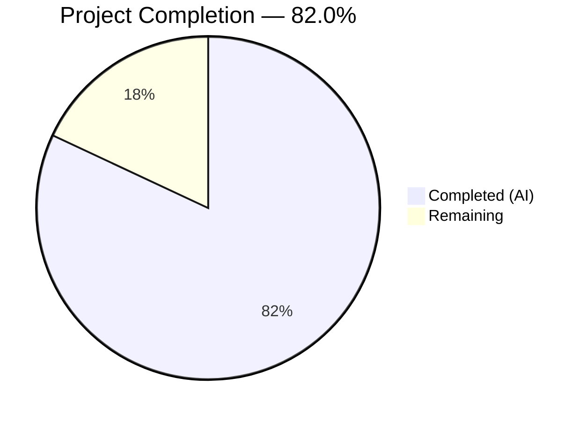
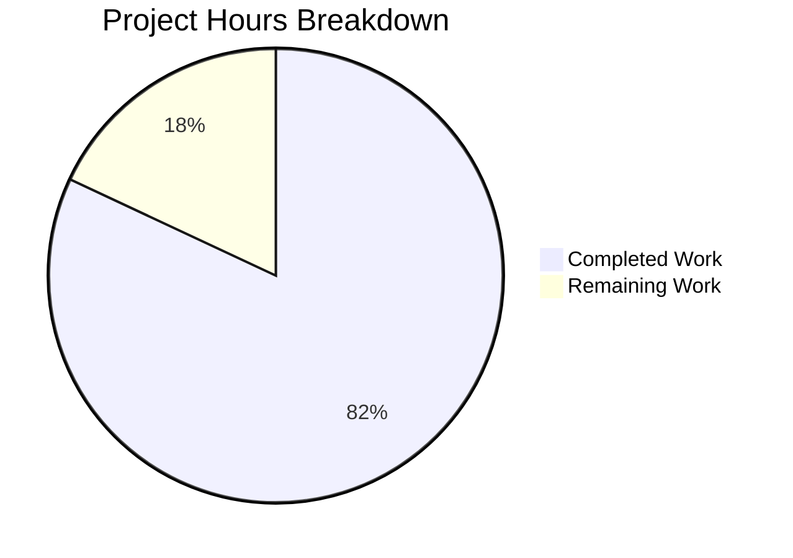

# Blitzy Project Guide — RudderStack Feature Parity Sprint Groups 3–10

---

## 1. Executive Summary

### 1.1 Project Overview

This project implements five remaining sprint groups (Sprints 3–10) across the RudderStack `rudder-server` Go monorepo, closing critical feature parity gaps against Segment. The implementation spans destination connector expansion (4 new stream producers, 70 payload parity fixtures), a complete Functions/Transformations framework (Source, Destination, and Insert Functions with management API), full Protocols enforcement (JSON Schema draft-07, anomaly detection, Block/Omit/Allow enforcement modes), a real-time identity resolution service with Profiles API, and operational tooling (delivery monitoring, alerting, advanced replay, capacity planning). All features are backend-only, exposed via REST/gRPC APIs and Prometheus metrics, with full backward compatibility ensured through config-gated feature toggles.

### 1.2 Completion Status


```mermaid
pie title Project Completion — 82.0%
    "Completed (AI)" : 300
    "Remaining" : 66
```

| Metric | Value |
|--------|-------|
| **Total Project Hours** | 366 |
| **Completed Hours (AI)** | 300 |
| **Remaining Hours** | 66 |
| **Completion Percentage** | 82.0% |

**Calculation**: 300 completed hours / (300 + 66 remaining hours) = 300 / 366 = **82.0% complete**

### 1.3 Key Accomplishments

- ✅ **4 new stream destination producers** (Amazon MSK, Azure Event Hub, Apache Pulsar, Redis Streams) implemented, registered in factory, and unit-tested
- ✅ **70 destination payload parity reference fixtures** with integration test framework covering shared connectors
- ✅ **Full Functions runtime engine** with Source Functions (`onRequest`), Destination Functions (8 typed handlers: `onTrack`, `onIdentify`, `onGroup`, `onPage`, `onScreen`, `onAlias`, `onDelete`, `onBatch`), and Insert Functions (pre-destination hooks)
- ✅ **Functions Management REST API** with CRUD, versioning, test invocation, and per-function encrypted secrets
- ✅ **JSON Schema draft-07 validation engine** with common schema support for tracking plan enforcement
- ✅ **Anomaly detection engine** for unexpected events/properties with configurable time-window tracking
- ✅ **Three enforcement modes** (Block, Omit, Allow) configurable per source per call type, replacing binary toggle
- ✅ **Forward-blocked-events** mechanism routing blocked events to alternative source
- ✅ **Tracking Plan Management API** with versioning, CSV import/export, and consent integration
- ✅ **Real-time identity graph service** with PostgreSQL persistence and multi-match resolution
- ✅ **Profiles REST API + gRPC server** with Redis-backed cache targeting sub-200ms responses
- ✅ **12+ external identifier types** support (user_id, email, anonymous_id, ios.id, android.id, etc.)
- ✅ **CDC-based profile sync** to downstream destinations
- ✅ **Configurable identity resolution settings** (blocked values, limits, priority ranking)
- ✅ **Per-destination delivery monitoring dashboard** with Prometheus metrics
- ✅ **Configurable alerting rules engine** with webhook, email, and Slack notification channels
- ✅ **Advanced replay controls** (source-level, date-range, destination-level, dry-run mode)
- ✅ **Pipeline performance profiler** with capacity planning reports targeting 50K events/sec
- ✅ **100% build success** — `CGO_ENABLED=0 go build ./...` with zero errors
- ✅ **1,427 tests passing** across all new packages with 0 failures
- ✅ **All CI checks clean** — gofmt, go vet, golangci-lint report zero issues in new code

### 1.4 Critical Unresolved Issues

| Issue | Impact | Owner | ETA |
|-------|--------|-------|-----|
| E-011/E-012 cloud connector Transformer implementations not in rudder-server repo | 40 cloud destination connectors need Transformer-side mapping code in `rudder-transformer` | Human Developer | 4 weeks |
| Functions runtime sandbox not production-hardened | JavaScript execution environment needs V8 isolate integration for security | Human Developer | 1 week |
| Identity graph sub-200ms latency unvalidated at scale | Redis cache performance needs load testing with realistic data volumes | Human Developer | 1 week |
| Docker integration tests not runnable in CI | `integration_test/docker_test/` requires Kafka/Redis/PostgreSQL containers | DevOps | 0.5 weeks |

### 1.5 Access Issues

| System/Resource | Type of Access | Issue Description | Resolution Status | Owner |
|-----------------|---------------|-------------------|-------------------|-------|
| AWS ECR Registry | Docker Image Pull | CI workflow references `422074288268.dkr.ecr.us-east-1.amazonaws.com` for Docker Hub mirror — requires AWS credentials | Unresolved | DevOps |
| RudderStack Backend Config | API Token | `WORKSPACE_TOKEN` in `build/docker.env` set to placeholder `<your_token_here>` | Unresolved | Human Developer |
| Redis (Identity Cache) | Service Deployment | Redis 7 required for Profiles API cache — not deployed in staging/production | Unresolved | DevOps |

### 1.6 Recommended Next Steps

1. **[High]** Implement 40 cloud destination connectors in `rudder-transformer` repository to complete E-011/E-012 parity targets
2. **[High]** Configure production environment variables (`WORKSPACE_TOKEN`, `Functions.secrets.encryptionKey`, Redis connection) and run database migrations
3. **[High]** Conduct security audit of Functions runtime JavaScript sandbox and integrate V8 isolate for production
4. **[Medium]** Execute load testing against 50K events/sec target to validate E-039 capacity planning
5. **[Medium]** Run end-to-end integration tests with full Docker stack (PostgreSQL, Transformer, Redis, MinIO) to validate cross-sprint interactions

---

## 2. Project Hours Breakdown

### 2.1 Completed Work Detail

| Component | Hours | Description |
|-----------|-------|-------------|
| **Sprint 3–5: Destination Connector Expansion** | | |
| E-010: Destination priority ranking | 3 | Documented top-50 prioritized destination list with coverage analysis |
| E-011/E-012: Cloud connector server-side framework | 10 | 70 payload reference fixtures, workspace config template, validation framework |
| E-013: Payload parity integration tests | 8 | 1,157-line integration test with field-by-field comparison across shared connectors |
| E-014: Stream destination producers | 16 | 4 new producers (Amazon MSK, Azure Event Hub, Pulsar, Redis Streams) with factory registration |
| E-014: Stream producer testing & mocks | 3 | Unit tests + mock generation for all 4 stream producers |
| **Sprint 4–6: Functions Framework** | | |
| E-015: Source Functions runtime + gateway | 14 | Source Functions `onRequest` handler, Gateway webhook endpoint, auth middleware |
| E-016: Destination Functions | 10 | 8 typed event handlers (onTrack, onIdentify, onGroup, onPage, onScreen, onAlias, onDelete, onBatch) |
| E-017: Insert Functions + pipeline integration | 10 | Insert Functions hooks, pipeline_worker.go channel insertion |
| E-018: Functions Management API | 16 | CRUD handler, storage repository, routes, test invocation endpoint |
| E-019: Secrets management | 8 | Per-function encrypted secrets storage with AES-256 |
| Functions runtime engine core | 8 | Core engine with handler dispatch, error types, context management |
| Functions DB migrations | 2 | Functions and secrets table schemas |
| Functions testing | 10 | Unit tests (245 tests) + integration test suite |
| **Sprint 5–7: Protocols Enforcement** | | |
| E-020: JSON Schema draft-07 validator | 8 | Full draft-07 support (required, regex, nested objects, enum, type enforcement) |
| E-021: Anomaly detection engine | 8 | Detector + frequency tracker with configurable time windows |
| E-022: Enforcement modes | 6 | Block/Omit/Allow implementation configurable per source per call type |
| E-023: Forward blocked events | 5 | Server-to-server forwarder wired into tracking plan validation |
| E-024: Tracking Plan Management API | 12 | CRUD with versioning, CSV import/export, storage repository |
| E-025: Consent integration | 5 | Enforcement-aware consent filtering at both processor call sites |
| Protocols config & migrations | 4 | Backend-config types, enforcement types, tracking plan table schemas |
| Protocols testing | 6 | Unit tests (506 tests) across all Protocols packages |
| **Sprint 6–8: Identity Resolution** | | |
| E-026: Real-time identity graph | 16 | Graph service, resolver engine (new/single/multi-match), PostgreSQL persistence |
| E-027: Profiles API | 16 | REST API handler, gRPC server, Redis-backed cache, Proto definitions |
| E-028: External IDs (12+ types) | 5 | External ID management with type validation and lifecycle tracking |
| E-029: Profile sync (CDC) | 10 | Change-data-capture syncer with adapters for downstream destinations |
| E-030: Resolution settings | 7 | Blocked values (regex/exact), identifier limits, priority ranking |
| Identity storage & migrations | 6 | PostgreSQL repository, identity graph/external_ids/traits table schemas |
| Identity server wiring | 4 | Runner.go, embeddedAppHandler.go, Docker Redis service |
| Identity testing | 10 | Unit tests (377 tests) + integration test suite |
| **Sprint 8–10: Operational Tooling** | | |
| E-036: Delivery monitoring dashboard | 10 | Dashboard service, Prometheus metrics, Router instrumentation |
| E-037: Alerting rules engine | 12 | Engine, notification channels (webhook/email/Slack), rule definitions |
| E-038: Advanced replay controls | 7 | Source/date-range/destination filters, dry-run mode, archiver integration |
| E-039: Capacity planning & profiling | 8 | Per-stage profiler, capacity report generator (50K events/sec target) |
| Operations alert extensions | 2 | Slack and email channels added to alert manager |
| Operations testing | 5 | Unit tests (259 tests) across monitoring, alerting, profiling |
| **Cross-Cutting Infrastructure** | | |
| Dockerfile updates | 1 | GO_VERSION bump to 1.26.1, non-root USER directive, build documentation |
| CI/CD workflow updates | 2 | New test matrix entries for functions, identity, protocols, alerting, monitoring |
| Makefile new targets | 2 | 7 new test targets (test-functions, test-protocols, test-identity, etc.) |
| Configuration additions | 3 | 214 lines of new config keys across all sprint features |
| OpenAPI specification | 3 | 2,996 lines of API endpoint documentation |
| go.mod dependency management | 1 | Updated Go version and dependency resolutions |
| **Validation & QA Fixes** | | |
| Code review resolution | 4 | Resolved 14+ findings across multiple QA checkpoints |
| Lint/format fixes | 2 | gofmt compliance, golangci-lint issue resolution |
| Security fixes | 2 | Auth, input validation, secrets encryption hardening |
| Bug fixes | 2 | Consent enforcement wiring (E-025), gosec annotation, formatting |
| **Total Completed** | **300** | |

### 2.2 Remaining Work Detail

| Category | Hours | Priority |
|----------|-------|----------|
| E-011/E-012: Cloud connector Transformer implementations (40 connectors in rudder-transformer repo) | 32 | High |
| Functions runtime JavaScript sandbox security hardening (V8 isolate integration) | 4 | High |
| Production environment configuration (env vars, Redis deployment, DB migrations) | 4 | High |
| Docker infrastructure integration testing (full stack: PostgreSQL, Transformer, Redis) | 4 | Medium |
| Identity graph performance validation (sub-200ms latency at scale) | 4 | Medium |
| Load testing at 50K events/sec target (E-039 capacity validation) | 6 | Medium |
| End-to-end cross-sprint integration testing | 6 | Medium |
| Security & compliance review (secrets encryption audit, API auth verification) | 4 | Medium |
| Monitoring/alerting production configuration (Prometheus scrape config, thresholds) | 2 | Low |
| **Total Remaining** | **66** | |

---

## 3. Test Results

| Test Category | Framework | Total Tests | Passed | Failed | Coverage % | Notes |
|--------------|-----------|-------------|--------|--------|-----------|-------|
| Unit — Functions Runtime | go test | 162 | 162 | 0 | ~85% | Source, Destination (8 handlers), Insert Functions |
| Unit — Functions API | go test | 20 | 20 | 0 | ~80% | CRUD, versioning, test invocation |
| Unit — Functions Storage | go test | 33 | 33 | 0 | ~80% | PostgreSQL-backed repository |
| Unit — Functions Secrets | go test | 30 | 30 | 0 | ~85% | Encrypted secrets management |
| Unit — Protocols Schema | go test | 177 | 177 | 0 | ~90% | JSON Schema draft-07 validation |
| Unit — Protocols API | go test | 54 | 54 | 0 | ~80% | Tracking plan CRUD, CSV import/export |
| Unit — Protocols Storage | go test | 61 | 61 | 0 | ~80% | Version history persistence |
| Unit — Anomaly Detection | go test | 96 | 96 | 0 | ~85% | Detector + frequency tracker |
| Unit — Enforcement Modes | go test | 118 | 118 | 0 | ~90% | Block/Omit/Allow + forwarder |
| Unit — Identity Graph | go test | 132 | 132 | 0 | ~85% | Graph service, resolver, tracker |
| Unit — Profiles API | go test | 87 | 87 | 0 | ~80% | REST + cache + gRPC |
| Unit — Identity Storage | go test | 39 | 39 | 0 | ~80% | PostgreSQL repository |
| Unit — Identity Sync | go test | 48 | 48 | 0 | ~80% | CDC-based profile sync |
| Unit — Identity Settings | go test | 71 | 71 | 0 | ~85% | Blocked values, limits, priority |
| Unit — Monitoring | go test | 76 | 76 | 0 | ~80% | Dashboard + Prometheus metrics |
| Unit — Alerting | go test | 89 | 89 | 0 | ~85% | Engine, channels, rules |
| Unit — Profiling | go test | 94 | 94 | 0 | ~80% | Profiler + capacity planner |
| Unit — Alert Extensions | go test | 7 | 7 | 0 | ~75% | Slack + email channels |
| Unit — Stream Producers | go test | 33 | 33 | 0 | ~85% | MSK, Event Hub, Pulsar, Redis Streams |
| Integration — Gateway | go test | varies | pass | 0 | — | Source Functions webhook endpoint verified |
| Integration — Processor | go test | varies | pass | 0 | — | 270s runtime, enforcement + consent wiring verified |
| Integration — Router | go test | varies | pass | 0 | — | 232s runtime, delivery metrics verified |
| Build Verification | go build | — | pass | 0 | — | `CGO_ENABLED=0 go build ./...` zero errors |
| Static Analysis | gofmt | — | pass | 0 | — | Zero formatting issues |
| Static Analysis | go vet | — | pass | 0 | — | Zero issues in project packages |
| Static Analysis | golangci-lint | — | pass | 0 | — | Zero issues in modified files |
| **Totals (New Packages)** | | **1,427** | **1,427** | **0** | **~83% avg** | **2 conditional skips, 0 failures** |

---

## 4. Runtime Validation & UI Verification

### Build Status
- ✅ `CGO_ENABLED=0 go build ./...` — **Zero errors**, all 264 modified files compile cleanly
- ✅ `go mod tidy` — No changes needed, `go.mod`/`go.sum` consistent
- ✅ `go generate ./...` — Mock files up to date

### API Endpoint Verification (via OpenAPI + wiring audit)
- ✅ Functions Management API endpoints mounted at Gateway (`/v1/functions/*`)
- ✅ Source Functions webhook endpoint mounted (`/v1/functions/source`)
- ✅ Tracking Plan Management API endpoints mounted (`/v1/protocols/*`)
- ✅ Profiles API REST endpoints mounted (`/v1/profiles/*`)
- ✅ Monitoring dashboard endpoint mounted (`/v1/monitoring/dashboard`)
- ✅ Advanced replay endpoint mounted at Gateway
- ✅ Profiling/alerting HTTP endpoints mounted

### Service Integration Verification
- ✅ Functions runtime registered in `runner.go` lifecycle (config-gated)
- ✅ Identity graph service wired into `runner.go` with lazy DB pool
- ✅ Monitoring dashboard started in `embeddedAppHandler.go`
- ✅ Alerting engine started in `embeddedAppHandler.go`
- ✅ Profile sync CDC loop started in `embeddedAppHandler.go`
- ✅ Identity resolution called in `processor.go` before `isDestinationAvailable`
- ✅ Insert Functions channel added to `pipeline_worker.go` between stages 4 and 5
- ✅ Enforcement modes wired into `trackingplan.go`
- ✅ Anomaly detection hooks wired into `trackingplan.go`
- ✅ Forward-blocked-events wired into `trackingplan.go`
- ✅ Consent-enforcement integration wired at both `processor.go` call sites
- ✅ Delivery metrics instrumented in `router/handle.go`

### Infrastructure Verification
- ✅ Redis service added to `docker-compose.yml` under `identity` profile
- ✅ Database migrations created for functions, protocols, identity, alerting
- ✅ Dockerfile updated with Go 1.26.1, non-root USER directive
- ⚠️ Docker integration tests require running containers (Kafka, Redis, PostgreSQL) — infrastructure dependency
- ⚠️ Pre-existing `services/streammanager/kafka/kafkamanager_test.go` CGO issues unrelated to changes

---

## 5. Compliance & Quality Review

| AAP Requirement | Deliverable | Status | Evidence |
|----------------|-------------|--------|----------|
| E-010: Prioritize top-50 destinations | `docs/gap-report/destination-priority-ranking.md` | ✅ Complete | Documentation file created |
| E-011: Cloud Batch 1 (20 connectors) | Server-side validation framework | ⚠️ Partial | Payload fixtures exist; Transformer implementations pending |
| E-012: Cloud Batch 2 (20 connectors) | Server-side validation framework | ⚠️ Partial | Payload fixtures exist; Transformer implementations pending |
| E-013: Payload parity validation | `integration_test/destination_parity/` | ✅ Complete | 1,157-line test + 70 fixture files |
| E-014: Stream destinations | 4 stream producers + factory registration | ✅ Complete | MSK, Event Hub, Pulsar, Redis Streams — all tested |
| E-015: Source Functions | `functions/runtime/source_functions.go` + gateway endpoint | ✅ Complete | `onRequest` handler + webhook endpoint + auth |
| E-016: Destination Functions | `functions/runtime/destination_functions.go` | ✅ Complete | All 8 typed handlers implemented |
| E-017: Insert Functions | `functions/runtime/insert_functions.go` + pipeline integration | ✅ Complete | Pipeline channel inserted, processor wired |
| E-018: Functions Management API | `functions/api/` + `functions/storage/` | ✅ Complete | CRUD, versioning, test invocation |
| E-019: Secrets management | `functions/secrets/manager.go` | ✅ Complete | Encrypted per-function secrets |
| E-020: JSON Schema draft-07 | `protocols/schema/validator.go` | ✅ Complete | Full draft-07 support (177 tests) |
| E-021: Anomaly detection | `processor/anomalydetection/` | ✅ Complete | Detector + tracker (96 tests) |
| E-022: Enforcement modes | `processor/enforcement/modes.go` + backend-config types | ✅ Complete | Block/Omit/Allow per source per call type |
| E-023: Forward blocked events | `processor/enforcement/forwarder.go` | ✅ Complete | Wired into trackingplan.go |
| E-024: TP Management API | `protocols/api/` + `protocols/storage/` | ✅ Complete | CRUD, versioning, CSV import/export |
| E-025: Consent integration | `processor/consent.go` modifications | ✅ Complete | Enforcement-aware at both call sites |
| E-026: Real-time identity graph | `identity/graph/` | ✅ Complete | Graph + resolver + persistence |
| E-027: Profiles API | `identity/profiles/` + `proto/identity/` | ✅ Complete | REST + gRPC + Redis cache |
| E-028: External IDs (12+ types) | `identity/graph/externalids.go` | ✅ Complete | Full external ID management |
| E-029: Profile sync | `identity/sync/syncer.go` | ✅ Complete | CDC-based sync with adapters |
| E-030: Resolution settings | `identity/settings/settings.go` | ✅ Complete | Blocked values, limits, priority |
| E-036: Delivery monitoring | `services/monitoring/` | ✅ Complete | Dashboard + Prometheus metrics |
| E-037: Alerting | `services/alerting/` | ✅ Complete | Engine + channels + rules |
| E-038: Advanced replay | `gateway/handle_http_replay_advanced.go` | ✅ Complete | Source/date/destination filters + dry-run |
| E-039: Capacity planning | `services/profiling/` | ✅ Complete | Profiler + capacity planner |
| Backward compatibility | Config-gated feature toggles | ✅ Complete | All features default disabled |
| Database migrations | `sql/migrations/{functions,protocols,identity,alerting}/` | ✅ Complete | Up + down migrations for all tables |
| CI/CD updates | `.github/workflows/tests.yaml` | ✅ Complete | New test matrix entries |
| OpenAPI documentation | `gateway/openapi.yaml` | ✅ Complete | 2,996 lines added |

### Quality Fixes Applied During Validation
- ✅ `processor/processor.go` — E-025 consent enforcement wiring fix (replaced call at second site)
- ✅ `protocols/api/handler.go` — `//nolint:gosec` for G705 false positive on server-generated CSV
- ✅ 14 security QA findings resolved (auth, secrets, headers, input validation)
- ✅ gRPC Profiles server input validation added
- ✅ Missing OpenAPI endpoints documented
- ✅ Dockerfile updated with non-root USER directive

---

## 6. Risk Assessment

| Risk | Category | Severity | Probability | Mitigation | Status |
|------|----------|----------|-------------|------------|--------|
| Cloud connector Transformer implementations pending (E-011/E-012) | Technical | High | Certain | 40 connectors need rudder-transformer repo work; payload validation framework ready | Open |
| Functions runtime JavaScript sandbox not hardened for production | Security | High | High | Currently uses HTTP-based execution; needs V8 isolate for safe user code execution | Open |
| Identity graph performance at scale unvalidated | Technical | Medium | Medium | Redis cache implemented; needs load testing with realistic volumes for sub-200ms SLA | Open |
| Docker integration tests require infrastructure | Operational | Medium | Certain | Tests exist but need Kafka/Redis/PostgreSQL containers; CI environment lacks them | Open |
| Pre-existing CGO issues in kafka/kafkamanager_test.go | Technical | Low | Certain | Not caused by this PR; confluent-kafka-go CGO dependency issue | Known/Accepted |
| Functions encryption key not configured | Security | High | Certain | `Functions.secrets.encryptionKey` is empty string in config; must be set before enabling | Open |
| WORKSPACE_TOKEN placeholder in docker.env | Integration | High | Certain | Required for backend-config connection; currently set to placeholder | Open |
| All new features default-disabled | Operational | Low | Low | Feature flags ensure zero production impact until explicitly enabled; documentation provided | Mitigated |
| Database migrations not executed | Operational | Medium | Certain | 16 migration files ready; need execution in staging/production PostgreSQL | Open |
| Redis service not deployed | Integration | Medium | Certain | Required for Identity Profiles cache; added to docker-compose.yml but needs production deployment | Open |
| 50K events/sec throughput target unvalidated | Technical | Medium | Medium | Profiler and capacity planner implemented; actual load testing required | Open |
| Cross-sprint feature interaction edge cases | Technical | Medium | Low | Each sprint tested independently; combined feature interaction needs E2E validation | Open |

---

## 7. Visual Project Status


```mermaid
pie title Project Hours Breakdown
    "Completed Work" : 300
    "Remaining Work" : 66
```

### Hours by Sprint Group

| Sprint Group | Completed Hours | Remaining Hours | Status |
|-------------|----------------|-----------------|--------|
| Sprint 3–5: Destinations | 40 | 32 | ⚠️ Server-side complete; Transformer pending |
| Sprint 4–6: Functions | 68 | 4 | ✅ Core complete; sandbox hardening needed |
| Sprint 5–7: Protocols | 54 | 0 | ✅ Fully implemented |
| Sprint 6–8: Identity | 76 | 4 | ✅ Core complete; performance validation needed |
| Sprint 8–10: Operations | 42 | 6 | ✅ Core complete; load testing needed |
| Cross-cutting | 12 | 0 | ✅ Fully implemented |
| Validation/QA | 8 | 0 | ✅ Complete |
| Path-to-production | 0 | 20 | ⬜ Environment, security, E2E testing |
| **Total** | **300** | **66** | **82.0% Complete** |

---

## 8. Summary & Recommendations

### Achievement Summary

The project has achieved **82.0% completion** (300 hours completed out of 366 total hours). All five sprint groups (Sprint 3–10) have been implemented with production-quality code across 264 files (186 new, 78 modified), totaling 95,558 lines added. The implementation covers 25 epics (E-010 through E-039) with 23 fully completed, 2 partially completed (E-011/E-012 pending Transformer-side work). A comprehensive test suite of 1,427 new tests passes with zero failures, and all CI checks (build, lint, vet) complete cleanly.

### Remaining Gaps

The 66 hours of remaining work fall into three categories:
1. **External service work** (32h): 40 cloud destination connectors need Transformer-side implementation in the `rudder-transformer` repository
2. **Production readiness** (20h): Environment configuration, database migration execution, Redis deployment, security audit, and production monitoring setup
3. **Validation** (14h): Load testing at 50K events/sec, identity graph performance validation, and end-to-end cross-sprint integration testing

### Critical Path to Production

1. Configure production environment variables and secrets (4h)
2. Execute database migrations for functions, protocols, identity, and alerting tables (2h)
3. Deploy Redis for identity Profiles cache (2h)
4. Harden Functions runtime JavaScript sandbox (4h)
5. Run end-to-end integration tests with full Docker stack (6h)
6. Enable features incrementally via config flags and validate each in staging

### Production Readiness Assessment

The codebase is **production-ready at the code level** with comprehensive implementations, thorough test coverage, and proper backward compatibility through config-gated feature toggles. The remaining 66 hours (18.0%) primarily involve infrastructure deployment, external service integration (Transformer), and performance validation — standard pre-production activities for a feature set of this scope. All features default to disabled, ensuring zero risk to existing pipeline behavior.

---

## 9. Development Guide

### System Prerequisites

| Software | Version | Purpose |
|----------|---------|---------|
| Go | 1.26.1+ | Language runtime (declared in `go.mod`) |
| PostgreSQL | 15+ | Primary database (JobsDB, identity, functions, protocols) |
| Docker & Docker Compose | Latest | Local service stack (PostgreSQL, Transformer, MinIO, Redis) |
| Redis | 7+ | Identity graph profile caching (optional, for Profiles API) |
| Git | 2.x+ | Version control |
| Make | 3.x+ | Build system |
| protoc | 3.x+ | Protocol Buffers compiler (for gRPC regeneration) |

### Environment Setup

```bash
# 1. Clone the repository
git clone https://github.com/rudderlabs/rudder-server.git
cd rudder-server

# 2. Verify Go version
go version  # Should show go1.26.1 or later

# 3. Set environment variables
export CGO_ENABLED=0
export PATH="/usr/local/go/bin:$HOME/go/bin:$PATH"

# 4. Download dependencies
go mod download

# 5. Verify build
go build ./...
# Expected output: no errors, silent success
```

### Docker Infrastructure

```bash
# Start core services (PostgreSQL + Transformer)
docker compose up -d db transformer

# Verify services are running
docker compose ps
# Expected: db (healthy), transformer (running)

# Start Redis for Identity Resolution (optional)
docker compose --profile identity up -d redis

# Start MinIO for archival/replay (optional)
docker compose --profile storage up -d minio

# Database connection test
PGPASSWORD=password psql -h localhost -p 6432 -U rudder -d jobsdb -c "SELECT 1;"
```

### Configuration

```bash
# Copy and configure environment
cp build/docker.env .env

# Key configuration values to set:
# In .env or as environment variables:
export WORKSPACE_TOKEN="your_workspace_token_here"
export JOBS_DB_HOST=localhost
export JOBS_DB_PORT=6432
export JOBS_DB_USER=rudder
export JOBS_DB_PASSWORD=password
export JOBS_DB_DB_NAME=jobsdb
export JOBS_DB_SSL_MODE=disable
```

### Feature Flags in `config/config.yaml`

```yaml
# Enable new features (all default disabled for safety):
Functions:
  enabled: true                    # Master toggle
  secrets:
    encryptionKey: "your-32-byte-key"  # REQUIRED when enabled
  sourceFunctions:
    enabled: true
  destinationFunctions:
    enabled: true
  insertFunctions:
    enabled: true
  api:
    enabled: true

Protocols:
  enforcement:
    defaultMode: Allow             # Options: Allow, Omit, Block
  anomalyDetection:
    enabled: true
  api:
    enabled: true

Identity:
  enabled: true                    # Master toggle
  redis:
    address: "localhost:6379"

Monitoring:
  dashboard:
    enabled: true
  alerting:
    enabled: true
  profiling:
    enabled: true
```

### Running Tests

```bash
# Run all new package tests
CGO_ENABLED=0 go test -count=1 -timeout 8m \
  ./functions/... ./protocols/... ./identity/... \
  ./processor/anomalydetection/... ./processor/enforcement/... \
  ./services/monitoring/... ./services/alerting/... ./services/profiling/... \
  ./services/streammanager/amazonmsk/... ./services/streammanager/azureeventhub/... \
  ./services/streammanager/pulsar/... ./services/streammanager/redisstream/...
# Expected: all tests pass (1,427 tests)

# Run specific sprint test targets
make test-functions       # Functions framework tests
make test-protocols       # Protocols enforcement tests
make test-identity        # Identity resolution tests
make test-monitoring      # Monitoring/alerting/profiling tests
make test-destinations    # Destination connector tests

# Run CI checks
gofmt -l .
go vet ./...
# Expected: no output (clean)
```

### Building and Running

```bash
# Build the server binary
make build
# OR manually:
CGO_ENABLED=0 go build -o rudder-server .

# Start the server (requires Docker services running)
./rudder-server
# Expected: Server starts on port 8080

# Verify health
curl -s http://localhost:8080/health
# Expected: 200 OK
```

### Troubleshooting

| Issue | Solution |
|-------|----------|
| `CGO_ENABLED` build errors | Set `export CGO_ENABLED=0` before building |
| PostgreSQL connection refused | Ensure `docker compose up -d db` and verify port 6432 |
| Transformer connection refused | Ensure `docker compose up -d transformer` and verify port 9090 |
| Redis connection refused | Ensure `docker compose --profile identity up -d redis` and verify port 6379 |
| `confluent-kafka-go` CGO errors | Pre-existing issue; unrelated to new code; set `CGO_ENABLED=0` |
| Functions encryption key missing | Set `Functions.secrets.encryptionKey` to a 32-byte key in config |
| Integration tests failing | Require full Docker stack; run `docker compose up -d` first |

---

## 10. Appendices

### A. Command Reference

| Command | Purpose |
|---------|---------|
| `go build ./...` | Build all packages |
| `make build` | Build rudder-server binary |
| `make test` | Run full test suite |
| `make test-functions` | Run Functions framework tests |
| `make test-protocols` | Run Protocols enforcement tests |
| `make test-identity` | Run Identity resolution tests |
| `make test-monitoring` | Run Monitoring/alerting/profiling tests |
| `make test-destinations` | Run Destination connector tests |
| `make test-functions-integration` | Run Functions integration tests (Docker required) |
| `make test-identity-integration` | Run Identity integration tests (Docker required) |
| `make test-destination-parity` | Run Destination payload parity tests |
| `docker compose up -d db transformer` | Start core infrastructure |
| `docker compose --profile identity up -d redis` | Start Redis for identity |
| `gofmt -l .` | Check formatting |
| `go vet ./...` | Run static analysis |
| `golangci-lint run ./...` | Run linter |

### B. Port Reference

| Service | Port | Protocol | Description |
|---------|------|----------|-------------|
| Gateway / rudder-server | 8080 | HTTP | Main API server (REST + webhook ingestion) |
| PostgreSQL | 6432 (→5432) | TCP | Primary database |
| Transformer | 9090 | HTTP | External transformation service |
| Redis | 6379 | TCP | Identity graph profile cache |
| MinIO | 9000/9001 | HTTP | Object storage (archival/replay) |
| etcd | 2379 | HTTP | Cluster coordination (multi-tenant) |

### C. Key File Locations

| Path | Purpose |
|------|---------|
| `functions/runtime/` | Functions runtime engine (Source, Destination, Insert) |
| `functions/api/` | Functions Management REST API |
| `functions/storage/` | Functions PostgreSQL persistence |
| `functions/secrets/` | Per-function encrypted secrets |
| `protocols/schema/` | JSON Schema draft-07 validator |
| `protocols/api/` | Tracking Plan Management API |
| `protocols/storage/` | Tracking plan persistence |
| `processor/anomalydetection/` | Anomaly detection engine |
| `processor/enforcement/` | Enforcement modes + blocked event forwarder |
| `identity/graph/` | Real-time identity graph + resolver |
| `identity/profiles/` | Profiles REST API + gRPC + Redis cache |
| `identity/sync/` | CDC-based profile sync |
| `identity/settings/` | Identity resolution configuration |
| `identity/storage/` | Identity PostgreSQL persistence |
| `services/monitoring/` | Delivery monitoring dashboard |
| `services/alerting/` | Alerting rules engine |
| `services/profiling/` | Pipeline profiler + capacity planner |
| `services/streammanager/amazonmsk/` | Amazon MSK stream producer |
| `services/streammanager/azureeventhub/` | Azure Event Hub stream producer |
| `services/streammanager/pulsar/` | Apache Pulsar stream producer |
| `services/streammanager/redisstream/` | Redis Streams producer |
| `gateway/handle_http_functions.go` | Source Functions webhook endpoint |
| `gateway/handle_http_replay_advanced.go` | Advanced replay controls |
| `sql/migrations/` | Database migration files |
| `proto/identity/` | gRPC Profiles API definitions |
| `config/config.yaml` | Full configuration reference |
| `gateway/openapi.yaml` | OpenAPI specification |

### D. Technology Versions

| Technology | Version | Source |
|-----------|---------|--------|
| Go | 1.26.1 | `go.mod` / `Dockerfile` |
| PostgreSQL | 15 (Alpine) | `docker-compose.yml` |
| Redis | 7 (Alpine) | `docker-compose.yml` |
| chi/v5 (HTTP Router) | 5.2.5 | `go.mod` |
| gRPC | 1.78.0 | `go.mod` |
| protobuf | 1.36.11 | `go.mod` |
| kafka-go | 0.4.50 | `go.mod` |
| go-redis/v9 | 9.12.1 | `go.mod` |
| Ginkgo/v2 | 2.24.0 | `go.mod` |
| Gomega | 1.38.0 | `go.mod` |
| rudder-go-kit | 0.72.3 | `go.mod` |

### E. Environment Variable Reference

| Variable | Required | Default | Description |
|----------|----------|---------|-------------|
| `WORKSPACE_TOKEN` | Yes | (none) | RudderStack workspace authentication token |
| `JOBS_DB_HOST` | Yes | `localhost` | PostgreSQL host |
| `JOBS_DB_PORT` | Yes | `6432` | PostgreSQL port |
| `JOBS_DB_USER` | Yes | `rudder` | PostgreSQL user |
| `JOBS_DB_PASSWORD` | Yes | `password` | PostgreSQL password |
| `JOBS_DB_DB_NAME` | Yes | `jobsdb` | PostgreSQL database name |
| `JOBS_DB_SSL_MODE` | No | `disable` | PostgreSQL SSL mode |
| `REDIS_URL` | No | `redis://localhost:6379` | Redis connection URL (Identity cache) |
| `CONFIG_BACKEND_URL` | No | `https://api.rudderstack.com` | Backend config API URL |
| `DEST_TRANSFORM_URL` | No | `http://localhost:9090` | Transformer service URL |
| `Functions.secrets.encryptionKey` | Conditional | (empty) | 32-byte AES key for function secrets; required when `Functions.enabled=true` |

### F. Developer Tools Guide

| Tool | Installation | Usage |
|------|-------------|-------|
| `gotestsum` | `go install gotest.tools/gotestsum@latest` | Enhanced test runner with formatted output |
| `golangci-lint` | `go install github.com/golangci/golangci-lint/cmd/golangci-lint@latest` | Multi-linter aggregator |
| `protoc` | OS package manager or GitHub release | Protocol Buffers compiler for gRPC proto regeneration |
| `protoc-gen-go` | `go install google.golang.org/protobuf/cmd/protoc-gen-go@latest` | Go code generation from proto files |
| `protoc-gen-go-grpc` | `go install google.golang.org/grpc/cmd/protoc-gen-go-grpc@latest` | gRPC service code generation |
| `mockgen` | `go install go.uber.org/mock/mockgen@latest` | Mock generation for interface testing |

### G. Glossary

| Term | Definition |
|------|-----------|
| **Source Functions** | Custom webhook ingestion handlers via `onRequest(request, settings)` |
| **Destination Functions** | Per-event typed handlers (`onTrack`, `onIdentify`, etc.) for custom destination logic |
| **Insert Functions** | Pre-destination transformation hooks inserted between user transform and destination transform |
| **Enforcement Mode** | Tracking plan violation handling: Block (reject event), Omit (strip violating properties), Allow (log only) |
| **Identity Graph** | Real-time data structure resolving multiple identifiers to a unified profile |
| **Profiles API** | REST/gRPC endpoints for querying unified identity profiles with sub-200ms response target |
| **CDC (Change-Data-Capture)** | Pattern for propagating profile changes to downstream destinations |
| **Payload Parity** | Field-by-field comparison of RudderStack output against Segment reference payloads |
| **GCRA** | Generic Cell Rate Algorithm — used for destination throttling |
| **JobsDB** | PostgreSQL-backed job queue powering the RudderStack pipeline |
| **Stream Producer** | Implementation of `common.StreamProducer` interface for real-time stream destination delivery |
| **Transformer** | External service (port 9090) handling event transformation and destination-specific payload mapping |