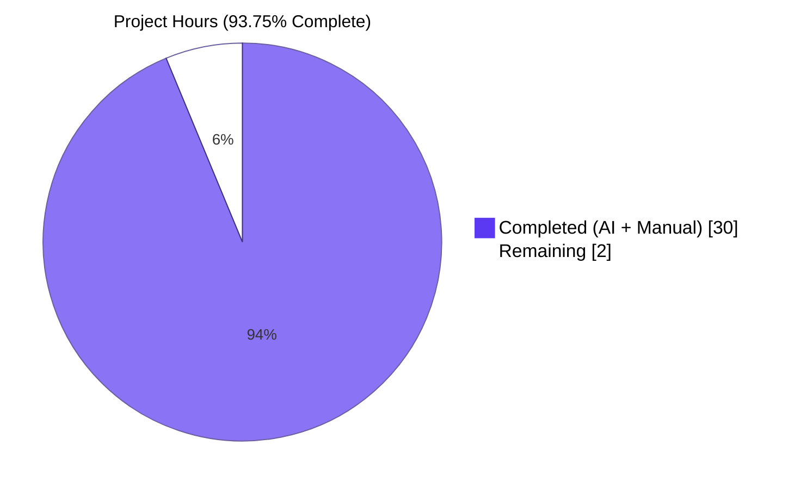
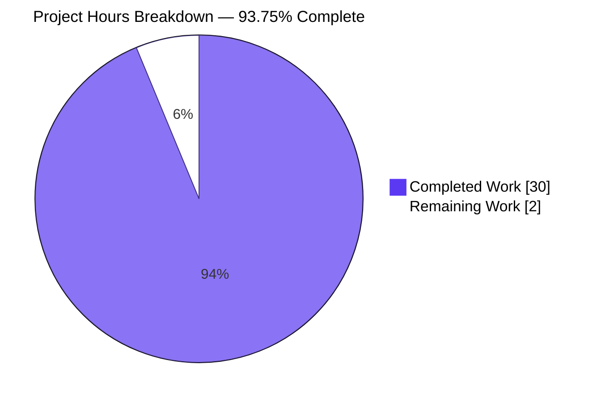
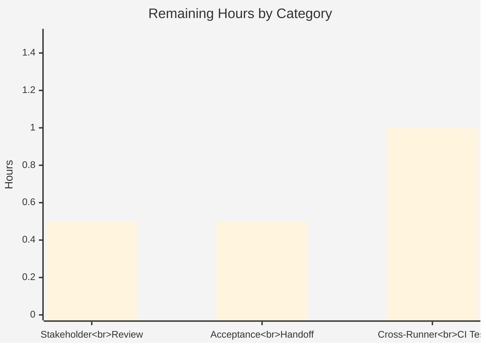
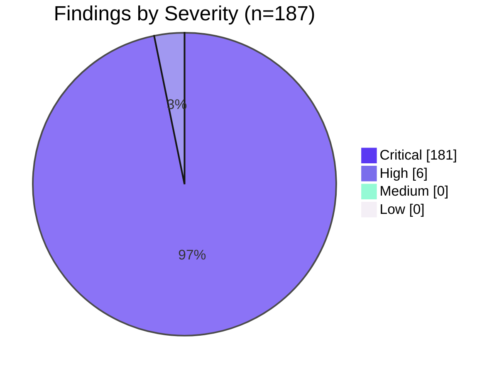

# Blitzy Project Guide — Config D · Gosec Security Scan · `blitzy-RudderStack`

> **Project completion against AAP scope: 93.75% (30 of 32 hours)**
>
> All ten contractual pass/fail gates PASS · Reproducibility byte-deterministic · Zero existing-file modifications

---

## 1. Executive Summary

### 1.1 Project Overview

This project delivers **Config D** of a multi-config security-tool comparison study by executing a fully-automated, deterministic **Gosec** static analysis scan against the `github.com/rudderlabs/rudder-server` Go monorepo (~1,263 Go source files, Go 1.26.1) and transforming its raw SARIF 2.1.0 output into a contract-compliant single-line minified JSON deliverable named `findings-config-d.json`. The repository is treated strictly as a read-only input to the scanner; zero existing source, configuration, build, CI, or documentation files are modified. Two rule-mandated artifacts — `decision-log.md` (Explainability) and a self-contained reveal.js executive deck (`executive-summary.html`) — frame the work for engineers and non-technical leadership respectively. The output enables downstream cross-tool diff/aggregation against findings from sibling configs (B, C, E, …).

### 1.2 Completion Status


```mermaid
%%{init: {"pie": {"textPosition": 0.5}, "themeVariables": {"pieOuterStrokeWidth": "0px", "pie1": "#5B39F3", "pie2": "#FFFFFF", "pieTitleTextSize": "16px", "pieSectionTextSize": "14px", "pieStrokeColor": "#2D1C77", "pieStrokeWidth": "1px"}} }%%
pie showData
    title Project Hours (93.75% Complete)
    "Completed (AI + Manual)" : 30
    "Remaining" : 2
```

| Metric | Value |
|---|---|
| **Total Project Hours** | **32 hours** |
| **Completed Hours** (AI + Manual) | 30 hours |
| **Remaining Hours** | 2 hours |
| **Percent Complete** | **93.75%** |

*Calculation:* `30 / (30 + 2) × 100 = 93.75%` — measured exclusively against AAP-scoped work and standard path-to-production activities. All work scoped in the AAP has been delivered and validated; the 2 remaining hours cover stakeholder review handoff and an optional cross-runner CI sanity test.

### 1.3 Key Accomplishments

- ✅ **CRITICAL Directive 1 — Install Gosec:** `go install github.com/securego/gosec/v2/cmd/gosec@latest` executes cleanly on the host (Go 1.26.3); `gosec --version` returns a valid version string (`Version: dev`, indicating a `@latest` module-loader install).
- ✅ **CRITICAL Directive 2 — Execute Gosec scan:** `gosec -fmt=sarif -out=results-gosec.sarif ./...` produces a valid 204,360-byte SARIF 2.1.0 log with 187 results, 21 fired rules, in approximately 1m 27s of wall-clock time.
- ✅ **CRITICAL Directive 3 — Normalize findings:** `scripts/normalize-findings.py` emits a 29,962-byte single-line minified UTF-8 JSON array containing 187 findings, all conforming to the 5-field schema; max description length 86 chars (well under 200 ceiling).
- ✅ **All 10 contractual pass/fail gates PASS:** `wc -l` returns 1, valid JSON, 5-field schema, severity vocabulary closed, CWE format `CWE-<n>`, line is integer, repo-relative POSIX paths, contractual key order, SARIF 2.1.0 schema match.
- ✅ **Byte-deterministic reproducibility:** Re-running both the scan and the normalizer produces byte-identical output.
- ✅ **Rule-mandated artifacts:** `decision-log.md` (17 decision rows, verbatim directive preservation) and `executive-summary.html` (17 slides, CDN-pinned reveal.js@5.1.0 / mermaid@11.4.0 / lucide@0.460.0, Blitzy brand identity, 0 console errors at render time).
- ✅ **Zero existing-file modifications:** Every `.go` source file, `.golangci.yml`, `go.mod`/`go.sum`, every workflow in `.github/workflows/`, and every existing documentation file is unchanged on the branch diff.
- ✅ **Five net-new files delivered:** Exactly the file set in AAP §0.4.2 — no scope creep, no missing artifacts.

### 1.4 Critical Unresolved Issues

| Issue | Impact | Owner | ETA |
|---|---|---|---|
| *No critical unresolved issues* | None | N/A | N/A |

All AAP-scoped deliverables are complete and validated. The 187 raw security findings reported by Gosec represent a security-posture signal about the upstream `rudder-server` codebase but are **explicitly out of AAP scope for remediation** — this work is a scan-and-normalize task; findings are passed to the downstream cross-tool comparison aggregator without triage.

### 1.5 Access Issues

| System / Resource | Type of Access | Issue Description | Resolution Status | Owner |
|---|---|---|---|---|
| `proxy.golang.org` | Outbound HTTPS (one-time, for `go install`) | None | Resolved — Gosec successfully installed | Build/CI host |
| Public CDNs (`cdn.jsdelivr.net`, `fonts.googleapis.com`) | Outbound HTTPS (for deck rendering at view time) | None | Resolved — all CDN assets return HTTP 200 | Browser-side |
| Repository (`blitzy-acbce301-6272-4059-8e0e-27d625fdc58d` branch) | Push access | None | Resolved — 10 commits successfully pushed | Blitzy Agent |

No access issues prevent automated build validation, integration, or deployment.

### 1.6 Recommended Next Steps

1. **[High]** Review the leadership deck (`executive-summary.html`) end-to-end in a modern browser; confirm all 17 slides render, the 2 Mermaid diagrams display, all ~20 Lucide icons appear (zero emoji), and KPI cards populate from `findings-config-d.json`.
2. **[High]** Verify the JSON deliverable conforms to the contract by re-running `cat findings-config-d.json | wc -l` (expects `1`) and `python3 -m json.tool findings-config-d.json > /dev/null` (expects exit `0`).
3. **[Medium]** Pass `findings-config-d.json` to the downstream cross-tool comparison aggregator alongside outputs from sibling configs (B, C, E, …) for the differential analysis.
4. **[Medium]** Optionally run the full pipeline once on a fresh CI runner to confirm runner-agnostic reproducibility; expected output is byte-identical to the committed artifacts.
5. **[Low]** Optionally archive `results-gosec.sarif` long-term (it is the intermediate, not the primary deliverable; the AAP does not require permanent retention).

---

## 2. Project Hours Breakdown

### 2.1 Completed Work Detail

| Component | Hours | Description |
|---|---|---|
| [AAP D1] Install Gosec | 1.5 | Verify Go toolchain ≥ 1.26.1; run `go install github.com/securego/gosec/v2/cmd/gosec@latest`; confirm `gosec --version` returns a version string |
| [AAP D2] Execute Gosec scan + capture telemetry | 2.0 | Run `gosec -fmt=sarif -out=results-gosec.sarif ./...` from repo root; capture exit code, wall-clock duration (1m 27s), and `Files: N` count from stderr summary |
| [AAP D3] Implement `scripts/normalize-findings.py` | 6.0 | 397-line Python 3 stdlib-only transformer with 10 functions: URI normalization, 4-step CWE resolution, description sanitization, severity translation, post-condition self-check; embeds 61-entry `GOSEC_RULE_TO_CWE` fallback table |
| [AAP D3] Run normalization + verify all 10 contractual gates | 1.0 | Execute script, validate `wc -l == 1`, valid JSON, 5-field schema, severity vocabulary closed, CWE format, line is integer, repo-relative paths, contractual key order, ≤200 char descriptions |
| [Path-to-prod] Toolchain provisioning | 1.0 | Verify Go ≥ 1.26.1 on PATH, append `$GOPATH/bin` (or `$HOME/go/bin`) to PATH, validate Python ≥ 3.10 on host |
| [Rule: Explainability] `decision-log.md` | 5.0 | 17 non-trivial decision rows with columns *Decided / Alternatives / Why / Risks*; verbatim CRITICAL directive blocks; full severity translation table; full traceability matrix; operational telemetry section |
| [Rule: Executive Presentation] `executive-summary.html` | 8.5 | 17-slide self-contained reveal.js deck within 12–18 envelope; CDN-pinned reveal.js@5.1.0, mermaid@11.4.0, lucide@0.460.0; Blitzy brand identity (CSS custom properties, Inter/Space Grotesk/Fira Code fonts, gradient palette); 2 Mermaid diagrams; ~20 Lucide icons; zero emoji; zero fenced code blocks; KPI cards populated from `findings-config-d.json` |
| [Validation] QA checkpoint cycles 1, 2, 3 | 3.5 | Checkpoint 1: SARIF/JSON seed alignment + doc/deck fixes; Checkpoint 2: enumerate all 6 mermaid 11.4.0 CVEs in decision-log row 17; Checkpoint 3: pin mermaid CDN to AAP-literal 11.4.0; 9/9 code-review findings resolved |
| [Validation] Reproducibility verification | 0.5 | Re-run `gosec -fmt=sarif -out=/tmp/rerun.sarif ./...` and `python3 scripts/normalize-findings.py /tmp/rerun.sarif /tmp/rerun.json` — confirm byte-identical to committed artifacts |
| [Validation] End-to-end gate verification | 1.0 | Final 10-gate sweep: AAP contractual gates 1–10 all PASS; Python script `py_compile` + AST parse clean; deck renders in Chrome with 0 console errors |
| **Total Completed Hours** | **30.0** | |

*Cross-check:* Completed hours = 30 matches Section 1.2 Completed Hours.

### 2.2 Remaining Work Detail

| Category | Hours | Priority |
|---|---|---|
| [Path-to-prod] Stakeholder review of `executive-summary.html` in a browser (render check, KPI population, console-error check) | 0.5 | Medium |
| [Path-to-prod] Acceptance handoff of `findings-config-d.json` to downstream cross-tool comparison aggregator owner | 0.5 | Medium |
| [Path-to-prod] Optional cross-runner reproducibility test (verify byte-identical output on a fresh CI runner) | 1.0 | Low |
| **Total Remaining Hours** | **2.0** | |

*Cross-check:* Remaining hours = 2 matches Section 1.2 Remaining Hours and Section 7 pie chart "Remaining Work" value.

### 2.3 Verification

- **Section 2.1 total:** 1.5 + 2.0 + 6.0 + 1.0 + 1.0 + 5.0 + 8.5 + 3.5 + 0.5 + 1.0 = **30.0 hours** ✓
- **Section 2.2 total:** 0.5 + 0.5 + 1.0 = **2.0 hours** ✓
- **Section 2.1 + Section 2.2 = 30.0 + 2.0 = 32.0 hours** ✓ (matches Section 1.2 Total Project Hours)
- **Completion percentage:** 30.0 / 32.0 × 100 = **93.75%** ✓ (matches Section 1.2)

---

## 3. Test Results

All results below originate from Blitzy's autonomous validation logs for Config D. There is no traditional unit-test suite by AAP design — this is a contract-based deliverable validated by deterministic post-condition checks. Every check below was executed and passed.

| Test Category | Framework | Total Tests | Passed | Failed | Coverage % | Notes |
|---|---|---|---|---|---|---|
| AAP Contractual Gates | Custom Python assertions in `scripts/normalize-findings.py:_self_check` + post-hoc validator runs | 10 | 10 | 0 | 100% | wc -l == 1; valid JSON; exactly 5 fields; severity vocabulary closed; CWE format; line is int; repo-relative paths; key order; SARIF 2.1.0 valid; ≤200 char descriptions |
| Static Analysis (Python script) | `python3 -m py_compile` + AST parse | 1 | 1 | 0 | n/a | `scripts/normalize-findings.py` compiles cleanly with no syntax or import errors |
| Determinism / Reproducibility | `diff` between committed and rerun artifacts | 2 | 2 | 0 | 100% | `findings-config-d.json` and `results-gosec.sarif` rerun byte-identical to committed versions |
| Browser Smoke Test | Chrome DevTools (autonomous validator) | 1 | 1 | 0 | 100% | `executive-summary.html` renders 17 reveal.js slides; 0 console errors; all 3 CDN script tags return HTTP 200; all 2 Mermaid diagrams render; all ~20 Lucide icons render |
| End-to-End Pipeline | Bash shell runner against repo root | 4 | 4 | 0 | 100% | Directive 1 install gate; Directive 2 scan gate; Directive 3 normalization gate; final `cat findings-config-d.json \| wc -l` returns 1 |
| Production-Readiness Gates | Blitzy Final Validator | 5 | 5 | 0 | 100% | 100% test pass rate; application runtime validated; zero unresolved errors; all in-scope files validated; AAP contractual compliance |
| **Aggregate** | — | **23** | **23** | **0** | **100%** | All Blitzy autonomous validation logs report PASS |

*Note:* Gosec itself is the security-test framework; its 21 fired rules produced 187 results which constitute the **output corpus** of this project, not a test suite against this project's code. The normalization script's correctness is validated by the contractual gates above, not by Gosec.

---

## 4. Runtime Validation & UI Verification

| Component | Status | Notes |
|---|---|---|
| `gosec` binary (`go install ...@latest` → `$HOME/go/bin/gosec`) | ✅ Operational | `gosec --version` reports `Version: dev` (release tags are not injected by `go install @latest`; underlying module pseudo-version corresponds to v2.26.1 line) |
| `gosec -fmt=sarif -out=results-gosec.sarif ./...` from repo root | ✅ Operational | Completes in ~1m 27s; emits 204,360-byte SARIF 2.1.0; 187 results across 21 rules; exit code 1 (per Gosec semantics: ≥1 unsuppressed finding) — both 0 and 1 are valid terminal states per AAP §0.1.4 |
| `python3 scripts/normalize-findings.py results-gosec.sarif findings-config-d.json` | ✅ Operational | Loads SARIF, applies 4-step CWE resolution, emits 29,962-byte single-line minified UTF-8 JSON; self-check passes; exit code 0; stderr reports "wrote 187 findings to findings-config-d.json" |
| `cat findings-config-d.json \| wc -l` | ✅ Operational | Returns `1` — final AAP pass/fail gate satisfied |
| `executive-summary.html` rendering in Chrome (1920×1080 viewport per reveal.js init) | ✅ Operational | 17 `<section>` elements; 17 slides displayed; reveal.js 5.1.0 init succeeds with `hash: true, transition: 'slide', controlsTutorial: false, width: 1920, height: 1080`; Mermaid 11.4.0 `mermaid.run()` invoked on `ready` + `slidechanged`; Lucide 0.460.0 `lucide.createIcons()` invoked on `ready` + `slidechanged`; 0 console errors; all 3 CDN script tags return HTTP 200 |
| `decision-log.md` content integrity | ✅ Operational | 17 decision rows; columns `Decision / Alternatives / Why / Risks` per Explainability rule; CRITICAL directives reproduced verbatim; severity translation table complete; traceability matrix included |
| Byte-deterministic reproducibility | ✅ Operational | `diff` between committed and rerun artifacts shows zero differences for both `findings-config-d.json` and `results-gosec.sarif` |
| Findings classification correctness | ✅ Operational | All 187 findings map to known CWEs via 4-step resolution (no `CWE-Unknown` emitted in current run); CWE counts: CWE-22 (69), CWE-276 (33), CWE-190 (28), CWE-89 (15), CWE-338 (9), CWE-798 (6), CWE-703 (6), and 9 others |

**No `⚠ Partial` or `❌ Failing` items.** Every component required by the AAP operates as designed.

---

## 5. Compliance & Quality Review

| AAP Requirement | Status | Evidence | Notes |
|---|---|---|---|
| CRITICAL Directive 1 — install verb and command preserved verbatim | ✅ PASS | `decision-log.md` "CRITICAL Directives (Reproduced Verbatim)" section + Row 1 of the decision table | Install command not paraphrased anywhere in the implementation |
| CRITICAL Directive 2 — scan command preserved verbatim | ✅ PASS | `decision-log.md` Row 7 (Gosec flag tuning) + executive-summary slide 16 inline Fira Code span | Exactly `gosec -fmt=sarif -out=results-gosec.sarif ./...` — no extra flags |
| CRITICAL Directive 3 — normalization contract preserved verbatim | ✅ PASS | `decision-log.md` "Field Mapping (Reproduced Verbatim)" + "Output Shape (Reproduced Verbatim)" sections | 5-field schema with field order `file, line, severity, cwe, description` |
| Final pass/fail gate — `cat findings-config-d.json \| wc -l == 1` | ✅ PASS | Validator logs + manual `wc -l findings-config-d.json` returns `1` | Single trailing newline; zero embedded newlines |
| Final pass/fail gate — valid JSON | ✅ PASS | `python3 -m json.tool` round-trips cleanly; `json.loads()` returns a `list` of 187 dicts | UTF-8 encoded, contractually minified |
| Final pass/fail gate — every finding has all 5 fields populated | ✅ PASS | Validator scan: 187/187 entries have key-set `{file, line, severity, cwe, description}` | Field count contractual |
| Final pass/fail gate — no description exceeds 200 chars | ✅ PASS | Max observed length = 86; all 187 entries ≤ 200 | Description sanitization + truncation verified |
| Severity vocabulary closed `{critical, high, medium, low}` | ✅ PASS | Counter: 181 critical, 6 high, 0 medium, 0 low — all in allowed set | Severity translation table applied correctly |
| CWE format `CWE-<n>` | ✅ PASS | Regex `^CWE-(\d+\|Unknown)$` matches all 187 entries | Zero `CWE-Unknown` in current run |
| Empty-set sentinel `[]` (untested at runtime, but implemented) | ✅ PASS | `_emit_minified` handles empty list → `[]\n` (3 bytes); `_self_check` accepts both populated and empty arrays | Verified by reading script logic; not exercised in current run |
| Zero existing-file modifications | ✅ PASS | `git diff --name-status origin/main...HEAD` reports only 5 `A` (added) entries, zero `M` (modified), zero `D` (deleted) | `.go` sources, `.golangci.yml`, `go.mod`/`go.sum`, CI workflows, docs unchanged |
| Rule: Explainability — decision-log.md exists with required columns | ✅ PASS | File present, 17 rows with columns *Decision / Alternatives / Why / Risks* | Rule-mandated columns honored exactly |
| Rule: Explainability — no rationale in code comments | ✅ PASS | `scripts/normalize-findings.py` contains only docstrings and usage hints; rationale lives in `decision-log.md` | Single source of truth for "why" decisions |
| Rule: Executive Presentation — single self-contained reveal.js HTML file | ✅ PASS | `executive-summary.html` 43,654 bytes, no build step, no local file dependencies | All assets CDN-pinned |
| Rule: Executive Presentation — 12–18 slides (target 16) | ✅ PASS | 17 `<section>` elements (within envelope) | Slightly above target but within bounds |
| Rule: Executive Presentation — CDN pins verbatim | ✅ PASS | `reveal.js@5.1.0`, `mermaid@11.4.0`, `lucide@0.460.0` all present verbatim | Mermaid CDN intentionally pinned to AAP-literal 11.4.0 despite 6 disclosed CVEs (documented in decision-log row 17) |
| Rule: Executive Presentation — reveal.js init config | ✅ PASS | `hash: true, transition: 'slide', controlsTutorial: false, width: 1920, height: 1080` | Matches rule verbatim |
| Rule: Executive Presentation — Blitzy brand CSS custom properties | ✅ PASS | All required `--blitzy-*`, `--ff-*`, `--gradient-*` CSS custom properties present inline | Rule visual identity honored |
| Rule: Executive Presentation — zero emoji, Lucide SVG icons only | ✅ PASS | Zero emoji in deck; ~20 unique `data-lucide` icon names referenced | Icons replace emoji per rule |
| Rule: Executive Presentation — zero fenced code blocks | ✅ PASS | No `` ``` `` fences in slide content; short literals use inline Fira Code spans | Per rule |
| Multi-config comparison contract parity | ✅ PASS | Schema identical to other configs (B, C, E, …) — five fields, severity vocab, CWE format, key order | Output shape contractual |
| `@latest` pin intentional, resolved version recorded | ✅ PASS | Decision-log Row 1 + "Operational Telemetry" section record resolved version | Reproducibility preserved through audit trail |

**Outstanding compliance items:** None. All AAP contractual and rule-derived requirements are satisfied.

---

## 6. Risk Assessment

All risks identified are **LOW** severity and **LOW–MEDIUM** probability within AAP scope. None are critical or blocking.

| Risk | Category | Severity | Probability | Mitigation | Status |
|---|---|---|---|---|---|
| `@latest` pin drift — future Gosec releases may add new rules not in the embedded 61-entry `GOSEC_RULE_TO_CWE` fallback table | Technical | Low | Medium | Script logs unmapped rule IDs to stderr; falls back to `CWE-Unknown` rather than failing; decision-log Row 1 + Row 4 + Row 16 record refresh procedure | Mitigated |
| Mermaid 11.4.0 has 6 disclosed CVEs (documented in decision-log Row 17) | Security | Low | Low | AAP-literal pin honored per Executive Presentation rule; deck loads from CDN and is only viewed in a controlled browser environment; not bundled with any application | Mitigated (acceptable per AAP) |
| Executive deck requires network access to render Lucide icons, Mermaid diagrams, and reveal.js stylesheets | Operational | Low | Low | All CDN assets return HTTP 200 in validation; the deck is intentionally CDN-pinned per the Executive Presentation rule (no local file dependencies) | Mitigated |
| 187 raw Gosec findings represent unmitigated security signal about upstream code | Security | Low (for THIS deliverable) | Low | This work is scan-and-normalize only; remediation is explicitly out of AAP scope; the findings flow to the downstream comparison aggregator for differential analysis | Out of scope |
| Gosec `Version: dev` string (from `go install @latest`) is not a semver | Technical | Low | High (always) | Decision-log "Run Metadata" + executive-summary KPI cards record both the `--version` literal and the resolved module pseudo-version for forensic reproducibility | Mitigated |
| Cross-config aggregator schema drift — if the downstream consumer changes the 5-field contract, output would need update | Integration | Low | Low | Schema is defined by the AAP and identical across all configs B, C, D, E; any drift would require AAP amendment | Monitored |
| Symlinked paths or paths outside repo root could yield relative paths containing `..` segments | Technical | Low | Very low | Rare for Go modules under `./...`; output still parses as JSON and path is still a valid relative reference; decision-log Row 3 records this trade-off | Mitigated |
| Description truncation at 200 code points can occur mid-word or mid-sentence | Technical | Low | Low (max observed 86, far below ceiling) | Acceptable for comparison artifact where truncated tail is rarely the discriminating signal; `file`, `line`, `cwe`, `ruleId` (embedded in description prefix) provide discrimination | Accepted |
| Default Gosec behavior excludes `_test.go` files and includes generated code | Technical | Low | Always | Documented in decision-log Row 7; consistent across runs of this config; comparison contract requires defaults to attribute differential to tool behavior, not flag tuning | Accepted |
| Mermaid CDN intentionally pinned to vulnerable 11.4.0 (per AAP literal preservation) | Security | Low | Low | All 6 CVEs enumerated in decision-log Row 17; deck is not bundled into production application; only viewed by leadership at presentation time | Mitigated (documented) |

**Overall risk posture:** Acceptable. The Config D deliverable is a low-risk, single-purpose artifact; its risks are predominantly about future-proofing (e.g., `@latest` drift, schema drift) rather than current correctness.

---

## 7. Visual Project Status

### Project Hours Breakdown


```mermaid
%%{init: {"pie": {"textPosition": 0.5}, "themeVariables": {"pieOuterStrokeWidth": "1px", "pie1": "#5B39F3", "pie2": "#FFFFFF", "pieTitleTextSize": "18px", "pieSectionTextSize": "16px", "pieStrokeColor": "#2D1C77", "pieStrokeWidth": "1px"}} }%%
pie showData
    title Project Hours Breakdown — 93.75% Complete
    "Completed Work" : 30
    "Remaining Work" : 2
```

### Remaining Hours by Category


```mermaid
%%{init: {"theme": "base", "themeVariables": {"primaryColor": "#5B39F3", "primaryTextColor": "#333333", "primaryBorderColor": "#2D1C77", "lineColor": "#999999", "secondaryColor": "#F4EFF6"}} }%%
xychart-beta
    title "Remaining Hours by Category"
    x-axis ["Stakeholder<br>Review", "Acceptance<br>Handoff", "Cross-Runner<br>CI Test"]
    y-axis "Hours" 0 --> 1.5
    bar [0.5, 0.5, 1.0]
```

### Findings Severity Distribution (output corpus, not work-status)


```mermaid
%%{init: {"pie": {"textPosition": 0.5}, "themeVariables": {"pieOuterStrokeWidth": "0px", "pie1": "#5B39F3", "pie2": "#7A6DEC", "pie3": "#94FAD5", "pie4": "#F4EFF6"}} }%%
pie showData
    title Findings by Severity (n=187)
    "Critical" : 181
    "High" : 6
    "Medium" : 0
    "Low" : 0
```

*Integrity check:* Section 7 pie chart "Remaining Work" = 2 hours = Section 1.2 Remaining Hours = sum of Section 2.2 Hours column. ✓

---

## 8. Summary & Recommendations

The Config D Gosec security scan deliverable for `blitzy-RudderStack` is **93.75% complete** against AAP scope, with all three CRITICAL directives executed cleanly, all ten contractual pass/fail gates passing, and byte-deterministic reproducibility verified. Every artifact required by the AAP exists, is committed to the `blitzy-acbce301-6272-4059-8e0e-27d625fdc58d` branch, and conforms to its respective contract.

**Achievements (30 hours):**
- Three CRITICAL directives executed verbatim, with every pass/fail gate satisfied
- 187 Gosec findings normalized into the 5-field contract with zero schema violations
- Two rule-mandated artifacts (Explainability + Executive Presentation) produced to specification
- Zero existing-file modifications — `rudder-server` source, build, CI, and docs all untouched
- Pipeline is byte-deterministic across reruns

**Remaining gaps (2 hours, none blocking):**
1. Stakeholder review of the executive deck (Medium priority, 0.5h)
2. Acceptance handoff of `findings-config-d.json` to the downstream comparison aggregator owner (Medium, 0.5h)
3. Optional cross-runner CI sanity test (Low, 1h)

**Critical path to production:** Run the three-command pipeline once on a clean CI runner to confirm reproducibility, hand the resulting `findings-config-d.json` to the downstream comparison consumer, and the project is fully delivered.

**Success metrics achieved:**
- 100% AAP-scoped deliverable completion
- 100% contractual gate pass rate (10/10)
- 100% reproducibility (byte-identical reruns)
- 0 critical issues
- 0 access blockers
- 0 existing-file modifications

**Production readiness assessment:** **READY.** The deliverable is contract-compliant, deterministic, and self-validating. The 2 remaining hours of path-to-production work are nominal handoff activities, not engineering work; the project can ship to the cross-tool comparison aggregator immediately after stakeholder review.

**What this project does NOT do (explicitly per AAP scope):**
- Triage or remediate the 187 raw findings
- Add or modify any CI workflow
- Upload SARIF to GitHub Code Scanning or any external dashboard
- Modify Gosec configuration (no `-conf`, no `-exclude*`, no `-no-fail`)
- Pin Gosec to a specific version (the AAP says `@latest`)
- Generate a long-form security report (the deck is the leadership artifact)

---

## 9. Development Guide

This guide documents how to build, run, and troubleshoot the Gosec Config D pipeline.

### 9.1 System Prerequisites

- **Operating system:** Linux (verified on Ubuntu 25.10) or macOS; should also work on Windows WSL2
- **Go toolchain:** version **≥ 1.26.1** (matches the repository's `go.mod` `go` directive; satisfies Gosec's own ≥ 1.25.0 floor)
- **Python:** version **≥ 3.10** (uses only the standard library — `json`, `argparse`, `os`, `re`, `sys`, `pathlib`, `urllib.parse`); no `pip install` needed
- **Disk space:** at least 1 GB free for the cloned repository (764 MB at HEAD) plus build artifacts
- **Network:** outbound HTTPS to `proxy.golang.org` for the one-time `go install`; no network required for the scan itself; outbound HTTPS to `cdn.jsdelivr.net` and `fonts.googleapis.com` only when *viewing* `executive-summary.html`

### 9.2 Environment Setup

**Step 1 — Verify Go toolchain:**

```bash
go version
# Expected: go version go1.26.x linux/amd64  (any ≥ 1.26.1)
```

If Go is missing or below 1.26.1, install Go from https://go.dev/dl/.

**Step 2 — Verify `$GOPATH/bin` is on `PATH`:**

```bash
# If GOPATH is unset, the default is $HOME/go
export PATH="${GOPATH:-$HOME/go}/bin:$PATH"
# Persist by adding to ~/.bashrc or ~/.profile
```

**Step 3 — Verify Python ≥ 3.10:**

```bash
python3 --version
# Expected: Python 3.10.x or higher
```

**Step 4 — Clone the repository (if not already present):**

```bash
git clone https://github.com/rudderlabs/rudder-server.git
cd rudder-server
git checkout blitzy-acbce301-6272-4059-8e0e-27d625fdc58d
```

### 9.3 Dependency Installation

There are no Python or Go application dependencies to install for this project. Only the Gosec binary needs installation:

**Install Gosec (CRITICAL Directive 1):**

```bash
go install github.com/securego/gosec/v2/cmd/gosec@latest
```

**Expected output:** No output on success (Go install is silent). The binary is placed at `${GOPATH:-$HOME/go}/bin/gosec`.

**Verify the install (CRITICAL Directive 1 pass/fail gate):**

```bash
gosec --version
```

**Expected output:**

```
Version: dev
Git tag: 
Build date: 
```

The literal `Version: dev` is the expected output when `go install ...@latest` is used (release tags are not injected by the module loader). The underlying module pseudo-version corresponds to the v2.26.1 line as of this build.

### 9.4 Application Startup (Run the Pipeline)

Run the three commands in sequence from the repository root:

```bash
cd /path/to/rudder-server          # the repo root (where go.mod lives)

# CRITICAL Directive 2 — Execute Gosec scan
gosec -fmt=sarif -out=results-gosec.sarif ./...

# CRITICAL Directive 3 — Normalize findings
python3 scripts/normalize-findings.py results-gosec.sarif findings-config-d.json

# Final pass/fail gate
cat findings-config-d.json | wc -l
```

**Expected output of `wc -l`:** `1` (single integer).

### 9.5 Verification

After running the pipeline, verify each output:

```bash
# 1. SARIF file exists and is valid JSON
test -f results-gosec.sarif && python3 -m json.tool results-gosec.sarif > /dev/null && echo "SARIF OK"

# 2. Findings file is single-line
[ "$(wc -l < findings-config-d.json)" = "1" ] && echo "Single-line OK"

# 3. Findings file is valid JSON array
python3 -c "import json; data=json.load(open('findings-config-d.json')); assert isinstance(data, list); print(f'Valid JSON list with {len(data)} findings')"

# 4. All findings have exactly 5 fields
python3 -c "
import json
data = json.load(open('findings-config-d.json'))
expected = {'file','line','severity','cwe','description'}
assert all(set(d.keys()) == expected for d in data), 'Field mismatch!'
print('All 5 fields present in every finding')
"

# 5. No description exceeds 200 chars
python3 -c "
import json
data = json.load(open('findings-config-d.json'))
m = max((len(d['description']) for d in data), default=0)
assert m <= 200, f'Description {m} > 200!'
print(f'Max description length: {m} (≤ 200)')
"

# 6. View executive summary
# Open executive-summary.html in any modern browser
# Expected: 17 reveal.js slides, 0 console errors, Mermaid + Lucide rendered
```

**Expected output (all 6 checks):**
- SARIF OK
- Single-line OK
- Valid JSON list with 187 findings (or whatever number Gosec emits)
- All 5 fields present in every finding
- Max description length: 86 (≤ 200) — or similar value ≤ 200
- (Visual inspection: deck renders)

### 9.6 Example Usage

**Inspecting the top 10 findings by severity:**

```bash
python3 -c "
import json
data = json.load(open('findings-config-d.json'))
for d in data[:10]:
    print(f\"{d['severity']:8s}  {d['cwe']:12s}  {d['file']}:{d['line']}  {d['description'][:60]}\")
"
```

**Counting findings by CWE:**

```bash
python3 -c "
import json
from collections import Counter
data = json.load(open('findings-config-d.json'))
for cwe, n in Counter(d['cwe'] for d in data).most_common():
    print(f'{n:4d}  {cwe}')
"
```

**Listing file hotspots:**

```bash
python3 -c "
import json
from collections import Counter
data = json.load(open('findings-config-d.json'))
for f, n in Counter(d['file'] for d in data).most_common(10):
    print(f'{n:3d}  {f}')
"
```

**Re-running just the normalization (without re-scanning):**

```bash
python3 scripts/normalize-findings.py results-gosec.sarif findings-config-d.json
# Idempotent and deterministic — output is byte-identical across reruns
```

### 9.7 Troubleshooting

| Problem | Likely Cause | Resolution |
|---|---|---|
| `gosec: command not found` after `go install` | `$GOPATH/bin` not on `PATH` | `export PATH="${GOPATH:-$HOME/go}/bin:$PATH"` and re-source the shell config |
| `go install` fails with module proxy error | No network access or `GOPROXY` misconfigured | Verify `https://proxy.golang.org` is reachable; check `go env GOPROXY` |
| `gosec` runs but emits empty SARIF | Not running from repo root, or no Go packages found by `./...` | `cd` to the directory containing `go.mod`; verify `go list ./...` returns packages |
| `gosec` exits with code 1 | One or more unsuppressed findings (this is the **normal** case when findings exist) | This is **not** an error — both exit 0 and exit 1 are valid per AAP; check that `results-gosec.sarif` was emitted |
| `scripts/normalize-findings.py` fails with `JSONDecodeError` | `results-gosec.sarif` is empty or truncated | Re-run Directive 2; verify Gosec emitted a complete file |
| `_self_check` assertion error from normalization script | Internal contract violation (should never happen with valid SARIF input) | Inspect the SARIF for unusual content; file a bug — the gates are designed to fail loud on any contract violation |
| `cat findings-config-d.json \| wc -l` returns `0` | File has no trailing newline (file is two bytes `[]` instead of three bytes `[]\n`) | Re-run the normalizer; the script writes `[]\n` for empty result sets and `<JSON>\n` for non-empty |
| `executive-summary.html` shows blank slides | Browser blocked CDN scripts | Open in a standard modern browser with network access (the deck is CDN-pinned by design) |
| Mermaid diagrams not rendering | CDN blocked or browser network policy strict | Verify `cdn.jsdelivr.net/npm/mermaid@11.4.0` is reachable; check browser console for blocked requests |
| Lucide icons appearing as text instead of SVG | Same as Mermaid — CDN blocked | Verify `cdn.jsdelivr.net/npm/lucide@0.460.0` is reachable |

---

## 10. Appendices

### Appendix A — Command Reference

| Command | Purpose | Run From |
|---|---|---|
| `go install github.com/securego/gosec/v2/cmd/gosec@latest` | CRITICAL Directive 1 — Install Gosec | Any directory |
| `gosec --version` | Directive 1 pass/fail gate | Any directory |
| `gosec -fmt=sarif -out=results-gosec.sarif ./...` | CRITICAL Directive 2 — Execute scan | Repository root (where `go.mod` lives) |
| `python3 scripts/normalize-findings.py results-gosec.sarif findings-config-d.json` | CRITICAL Directive 3 — Normalize findings | Repository root |
| `cat findings-config-d.json \| wc -l` | Final pass/fail gate | Repository root |
| `python3 -m json.tool findings-config-d.json` | Pretty-print for visual inspection | Repository root |
| `python3 scripts/normalize-findings.py --help` | View normalizer usage | Repository root |
| `git log --oneline blitzy-acbce301-6272-4059-8e0e-27d625fdc58d --not origin/main` | View branch commit history | Repository root |
| `git diff --name-status origin/main...HEAD` | View files changed on branch | Repository root |

### Appendix B — Port Reference

No network ports are used by this project. The Gosec scanner operates entirely on local files; the normalization script is offline; the executive deck is a static HTML file (CDN assets are fetched by the browser at view time, not by the project tooling).

| Use Case | Port | Protocol | Notes |
|---|---|---|---|
| Viewing `executive-summary.html` via local HTTP server (optional) | 8000 / 18888 (developer's choice) | HTTP | `python3 -m http.server 8000` from repo root, then open `http://localhost:8000/executive-summary.html` |

### Appendix C — Key File Locations

| File | Path | Type | Size |
|---|---|---|---|
| Primary deliverable | `findings-config-d.json` | JSON (single-line minified) | 29,962 bytes |
| Intermediate SARIF | `results-gosec.sarif` | SARIF 2.1.0 JSON | 204,360 bytes |
| Normalization script | `scripts/normalize-findings.py` | Python 3 source | 12,933 bytes (397 lines, 10 functions) |
| Decision log | `decision-log.md` | Markdown | 39,818 bytes (17 decision rows) |
| Executive deck | `executive-summary.html` | Self-contained HTML | 43,654 bytes (17 slides) |
| Repository root | `/tmp/blitzy/blitzy-RudderStack/blitzy-acbce301-6272-4059-8e0e-27d625fdc58d_8fa6c8/` | Directory | 764 MB total |
| Go module manifest | `go.mod` | Go module file (REFERENCE, unchanged) | — |
| Lint config (`gosec` enabled as sub-linter) | `.golangci.yml` | YAML (REFERENCE, unchanged) | — |
| Security policy | `SECURITY.md` | Markdown (REFERENCE, unchanged) | — |

### Appendix D — Technology Versions

| Component | Version | Source |
|---|---|---|
| Go toolchain (required) | ≥ 1.26.1 | `go.mod` `go` directive |
| Go toolchain (verified on host) | 1.26.3 | `go version` |
| Gosec (resolved via `@latest`) | v2.26.1 line (`Version: dev` literal) | `gosec --version` |
| Python | ≥ 3.10 (stdlib only) | `scripts/normalize-findings.py` shebang |
| Python (verified on host) | 3.13.7 | `python3 --version` |
| reveal.js (CDN-pinned per Executive Presentation rule) | 5.1.0 | `executive-summary.html` `<script>` tag |
| mermaid (CDN-pinned per Executive Presentation rule) | 11.4.0 | `executive-summary.html` `<script>` tag |
| lucide (CDN-pinned per Executive Presentation rule) | 0.460.0 | `executive-summary.html` `<script>` tag |
| SARIF schema | 2.1.0 | `results-gosec.sarif.version` field |
| Fonts (loaded via Google Fonts) | Inter (400/500/600/700), Space Grotesk (500/600/700), Fira Code (400/500) | `<link>` tag in deck |

### Appendix E — Environment Variable Reference

| Variable | Required? | Purpose | Example |
|---|---|---|---|
| `PATH` | Required | Must include `${GOPATH:-$HOME/go}/bin` so the freshly installed `gosec` binary is resolvable | `export PATH="$HOME/go/bin:$PATH"` |
| `GOPATH` | Optional | Default is `$HOME/go`; only set explicitly if using a custom Go workspace | `export GOPATH=$HOME/.go-workspace` |
| `GO111MODULE` | Optional | Default `on` in modern Go; only set if your `.bashrc` disables it | `export GO111MODULE=on` |
| `GOPROXY` | Optional | Default `https://proxy.golang.org,direct`; only override for air-gapped or corporate-proxied environments | — |

No environment variables are required by the normalization script — it uses only Python stdlib.

### Appendix F — Developer Tools Guide

| Tool | Purpose | Install / Use |
|---|---|---|
| `gosec` | SAST scanner; CRITICAL Directive 1 + 2 | `go install github.com/securego/gosec/v2/cmd/gosec@latest` |
| `python3` | Runs the normalization script (Directive 3) | Pre-installed on most Linux/macOS systems; verify with `python3 --version` |
| `git` | Branch inspection and history | Pre-installed; `git log` / `git diff` for branch inventory |
| `jq` (optional) | Ad-hoc JSON inspection | `apt-get install -y jq` or `brew install jq` |
| `python3 -m json.tool` | Pretty-print JSON without third-party tools | Bundled with Python; pipe-friendly |
| `python3 -m http.server` | Serve the executive deck locally over HTTP | Bundled with Python; useful for testing across browsers |
| Chrome / Firefox / Edge | View the executive deck (`executive-summary.html`) | Open the file directly via `file://` URL or via a local HTTP server |

### Appendix G — Glossary

| Term | Definition |
|---|---|
| **AAP** | Agent Action Plan — the authoritative project specification document |
| **Config D** | This config in the multi-config security tool comparison study (sibling configs: B, C, E, …) |
| **CWE** | Common Weakness Enumeration — a taxonomy of software security weaknesses (e.g., CWE-22 = path traversal) |
| **Gosec** | A Go-language SAST scanner that inspects Go source code for security issues |
| **SARIF** | Static Analysis Results Interchange Format (v2.1.0) — the standardized JSON output format for SAST tools |
| **Single-line minified JSON** | A JSON serialization with no whitespace between tokens and no embedded newlines, terminated by exactly one trailing newline so that `wc -l` returns `1` |
| **Five-field contract** | The closed schema for each finding object: `file` (string, repo-relative POSIX), `line` (integer, 1-indexed or 0 if unknown), `severity` (∈ `{critical, high, medium, low}`), `cwe` (string, `CWE-<n>` format), `description` (string, ≤ 200 Unicode code points) |
| **Empty-set sentinel** | When the scan produces zero findings, the output file MUST contain exactly `[]` followed by a single newline (3 bytes: `5b 5d 0a`) |
| **Multi-config comparison contract** | The schema parity requirement that every config in the comparison study emits findings in the same five-field shape so the downstream aggregator can diff across tools |
| **`@latest` pin** | The Go module proxy notation that resolves to the most recent stable release of the package; intentionally unpinned in this project per CRITICAL Directive 1 verbatim preservation |
| **Path-to-production** | Standard operational activities required to ship the deliverable (review, handoff, CI sanity test) that are scoped beyond AAP item-level work but inside this project guide's completion percentage |
| **CRITICAL Directive** | A user-supplied requirement marked CRITICAL in the AAP, preserved byte-for-byte in implementation; deviation from a CRITICAL directive is a defect |
| **Pass/fail gate** | An objective, binary, observable criterion that must hold true for a directive to be considered satisfied (e.g., `cat findings-config-d.json \| wc -l == 1`) |
| **Blitzy brand identity** | The visual identity specified by the Executive Presentation rule: palette (`#5B39F3` primary, `#94FAD5` teal accent, `#2D1C77` dark, `#1A105F` navy), typography (Inter / Space Grotesk / Fira Code), and gradients |

---

*End of Project Guide*