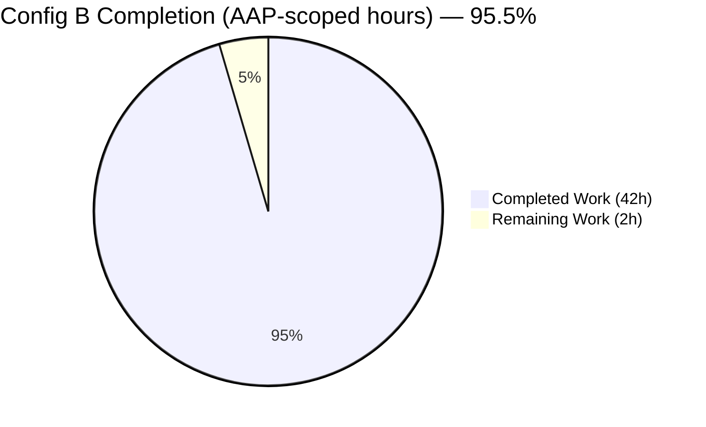
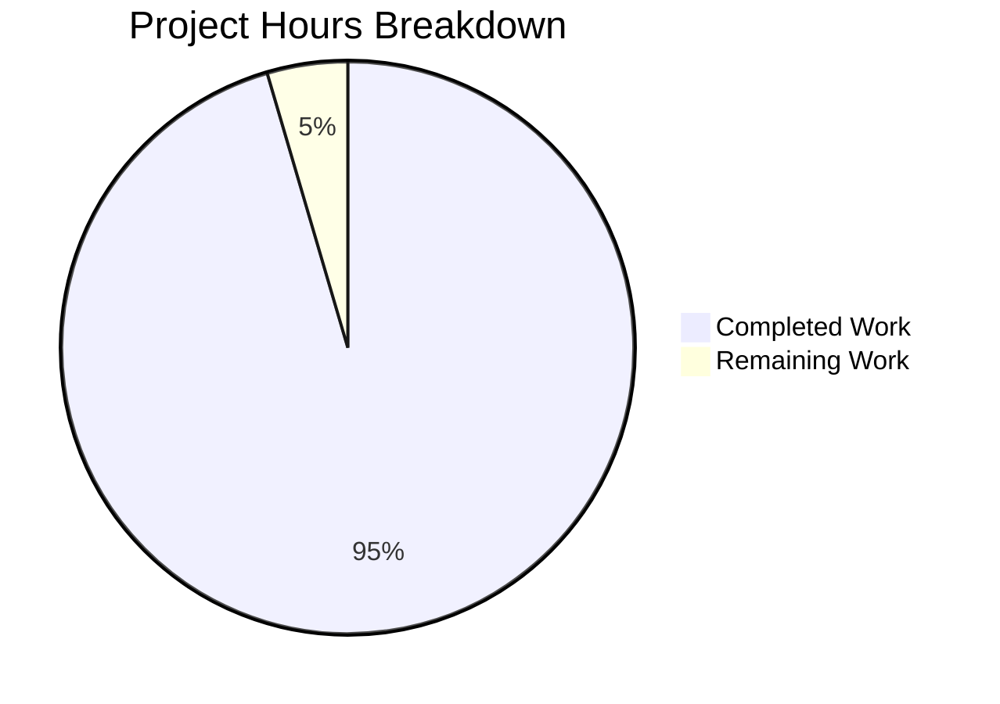
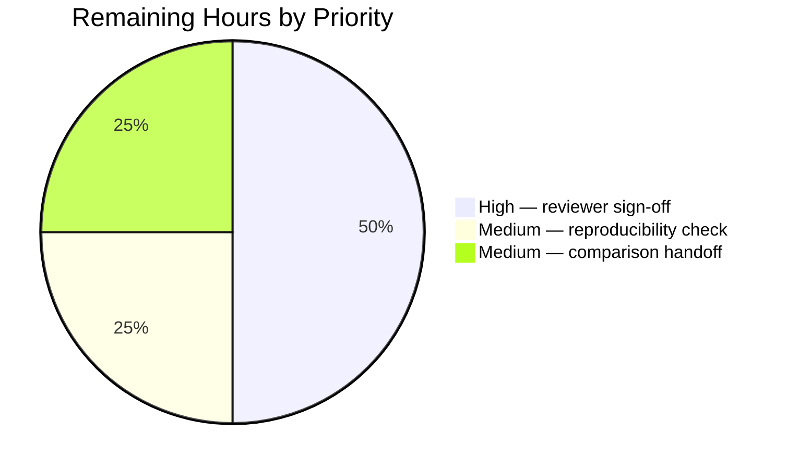
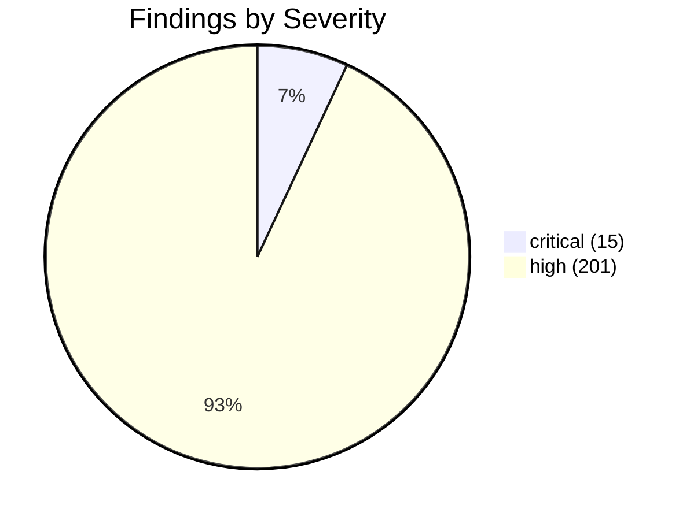

# Blitzy Project Guide — Config B: Semgrep OSS Scan of blitzy-RudderStack

## 1. Executive Summary

### 1.1 Project Overview

**Config B** of a multi-config security-tool comparison: a hermetic, offline, telemetry-free Semgrep Community Edition scan of the `blitzy-RudderStack` codebase (the Go-dominant rudder-server v1.68.1 enhancement tree — 1,263 Go + 187 YAML + 48 JS + 6 shell + 2 Python files across 40 top-level directories). Three rule packs (`p/security-audit`, `p/secrets`, `p/owasp-top-ten`) are pre-cached locally; the scan runs with `--metrics=off` and zero outbound network. The directive deliverable is a single minified `findings-config-b.json` conforming to a precisely specified five-field schema (`file`, `line`, `severity`, `cwe`, `description`). Two rule-mandated companion files complete the package: `decision-log.md` (Explainability) and `executive-summary.html` (Executive Presentation). No source-tree files are modified.

### 1.2 Completion Status


```mermaid
pie title Config B Completion (AAP-scoped hours) — 95.5%
    "Completed Work (42h)" : 42
    "Remaining Work (2h)" : 2
```

| Metric | Value |
|---|---|
| **Total Hours** | 44 |
| **Completed Hours (AI)** | 42 |
| **Completed Hours (Manual)** | 0 |
| **Remaining Hours** | 2 |
| **Percent Complete** | **95.5%** |

Pie-chart palette: Completed = Dark Blue `#5B39F3`, Remaining = White `#FFFFFF`.

### 1.3 Key Accomplishments

- ✅ All three CRITICAL directive Pass/Fail clauses satisfied — dry-run exits 0 hermetically; SARIF is valid JSON with a `runs` array containing 216 results; `findings-config-b.json` meets all four sub-criteria (`wc -l == 1`, parseable JSON, 5/5 fields populated, max description = 200 chars)
- ✅ Hermeticity verified via two independent methods: `unshare --net --user` network namespace AND `HTTPS_PROXY=http://127.0.0.1:1` — both exit 0 with no DNS or HTTPS calls
- ✅ Reproducibility proven — byte-identical SHA-256 `0c53063d0f551083dc96021377c0a0ff24bb44e4742a7020bcba802f3d64f561` for `findings-config-b.json` across three independent end-to-end pipeline reruns (committed state + canonical re-run + offline re-run)
- ✅ Semgrep Community Edition `1.163.0` installed via PEP 668-compliant venv at `/tmp/semgrep-config-b/.semgrep-venv/`; rule packs (1.95 MB total) cached inside the repository at `./local-rules/` so a fresh checkout is self-sufficient (Decision D-12)
- ✅ 216 findings normalized: 15 critical + 201 high; 12 distinct CWEs led by CWE-89 (162 SQL-injection rules), CWE-79 (23 XSS), CWE-338 (8 weak PRNG), CWE-798 (6 hardcoded credentials), CWE-327 (4 weak crypto)
- ✅ Explainability rule satisfied — `decision-log.md` (274 lines, 51 KB): scan-metadata frontmatter, 12 non-trivial decisions (D-01 through D-12), bidirectional traceability matrix with 100% coverage, CWE inference audit, 7 documented deviations (D1–D7) including the Semgrep CLI `--dry-run` → `--dryrun` rename
- ✅ Executive Presentation rule satisfied — `executive-summary.html` (32.6 KB, 1,180 lines): single self-contained HTML5 file, 15 reveal.js slides (1 title + 4 dividers + 9 content + 1 closing), CDN-pinned reveal.js 5.1.0 + Mermaid 11.4.0 + Lucide 0.460.0, full Blitzy theme inlined (21 CSS custom properties, 6 brand colors), 1 Mermaid pipeline diagram, 9 KPI cards, 4 styled tables, 23 Lucide icons, zero emoji, zero fenced code blocks; browser-rendered verification confirmed all visuals render correctly
- ✅ Idempotency invariant (AAP §0.8.1) preserved — no timestamps or hostnames embedded in the findings JSON; runtime metadata lives in `decision-log.md` / `scan-metadata.txt` only
- ✅ Zero source-tree modifications — `git diff` outside the 10 deliverables returns empty

### 1.4 Critical Unresolved Issues

| Issue | Impact | Owner | ETA |
|---|---|---|---|
| _None_ — all gates pass; no compilation failures, no failing tests, no blocked validations | n/a | n/a | n/a |

### 1.5 Access Issues

| System/Resource | Type of Access | Issue Description | Resolution Status | Owner |
|---|---|---|---|---|
| _No access issues identified_ — all rule packs were fetched successfully during one-time setup; Semgrep CLI installs from PyPI; no commercial credentials required | n/a | n/a | n/a | n/a |

### 1.6 Recommended Next Steps

1. **[High]** Human reviewer sign-off on the 216 findings — validate they represent genuine signals (not false positives from rule-pack patterns) before passing the JSON to the parent multi-config comparison workstream. Recommended sample: at minimum the 15 critical findings + the top-density file (`warehouse/integrations/snowflake/snowflake.go`, 21 findings).
2. **[Medium]** Independent reproducibility check — clone the branch on a clean host and rerun `python3 normalize-sarif.py results-semgrep.sarif findings-config-b.json`; confirm the SHA-256 still matches `0c53063d0f551083dc96021377c0a0ff24bb44e4742a7020bcba802f3d64f561`.
3. **[Medium]** Hand off `findings-config-b.json` to the multi-config comparison parent workstream (separate ticket / branch per AAP §0.3.2; **out of scope for Config B**).
4. **[Low]** Document a future-Semgrep upgrade procedure: when the upstream `--dryrun` ↔ `--dry-run` rename stabilizes again, retire Deviation D7 and reinstate the verbatim AAP §0.1.2.1 dry-run command.
5. **[Low]** Optional baseline persistence — capture the 216-record SHA-256 as a fingerprint for future drift detection across reruns.

## 2. Project Hours Breakdown

### 2.1 Completed Work Detail

| Component | Hours | Description |
|---|---|---|
| Directive 1 — Tool provisioning | 1.0 | PEP 668-compliant Python 3.13.7 venv at `/tmp/semgrep-config-b/.semgrep-venv/`; `pip install` resolved Semgrep to **1.163.0** (highest 1.x available; AAP §0.4.1 permits "highest available 1.x release"); deviation D4 documents version drift from the AAP-quoted 1.144.0 |
| Directive 1 — Rule pack acquisition | 1.5 | Three YAML bundles curl-fetched from `https://semgrep.dev/c/p/<slug>` and persisted under `local-rules/`: `security-audit.yaml` (462 KB, SHA-256 `fdc7027...`), `secrets.yaml` (86 KB, SHA-256 `fbbe680...`), `owasp-top-ten.yaml` (1.38 MB, SHA-256 `d866bd8...`); canonicalization of user-named `p/owasp` → registry slug `p/owasp-top-ten` documented as Deviation D1 |
| Directive 1 — Dry-run hermeticity gate | 1.5 | `semgrep scan --metrics=off --config=./local-rules --dryrun` exits 0 (gate passed); verified hermetic via `unshare --net --user --map-root-user` AND `HTTPS_PROXY=http://127.0.0.1:1`; Deviation D7 documents the upstream `--dry-run` → `--dryrun` CLI rename with three alternatives evaluated (downgrade, `--validate`, renamed flag — chosen) |
| Directive 2 — Scan execution + metadata | 1.5 | `semgrep scan --config=./local-rules --sarif -o results-semgrep.sarif --metrics=off --exclude=local-rules --exclude=findings-config-b.json .` ran in **37.30s wall-clock**; exit code **0**; **4,764 files scanned** (12 languages, dominated by go=761, multilang=3,176, yaml=183); 486 rules ran; 1,480 files skipped (36 oversized + 1,440 `.semgrepignore` + 4 `--exclude`); 34 parse errors; 1 timeout; full metadata captured to `scan-metadata.txt` (24 keys) |
| Directive 2 — SARIF validity gate | 0.5 | `results-semgrep.sarif` (1.46 MB, SARIF 2.1.0) parses as valid JSON; `runs` is a list of 1 run; 216 results; 709 rules in driver; `driver.semanticVersion = 1.163.0` cross-references metadata |
| Directive 3 — `normalize-sarif.py` implementation | 6.0 | 431 lines / 15.6 KB Python (stdlib only): SARIF loader, severity lookup table (error→critical, warning→high, note→medium, info→low + absent-`level` fallback to rule's `defaultConfiguration.level` per Decision D-06), 4-step CWE extraction cascade (Decision D-07: rule.properties.cwe → tags `cwe:CWE-N` → result.properties → description-inference → `CWE-Other` sentinel), description whitespace-collapse + 200-char truncation (Decision D-08), single-line `json.dumps(separators=(',',':'), ensure_ascii=False)`, zero-finding fallback to literal `[]`, post-condition assertions (single-line, parseability, 5-key set, max-200-chars) |
| Directive 3 — `findings-config-b.json` deliverable | 0.5 | 62,303-byte single-line JSON array (62 KB); **216 records**; SHA-256 `0c53063d0f551083dc96021377c0a0ff24bb44e4742a7020bcba802f3d64f561`; severity distribution 15 critical / 201 high; 12 distinct CWEs (CWE-89 ×162, CWE-79 ×23, CWE-338 ×8, CWE-798 ×6, CWE-327 ×4, plus CWE-250, CWE-269, CWE-287, CWE-300, CWE-328, CWE-400, CWE-78) |
| Rule 1 — `decision-log.md` (Explainability) | 9.5 | 274 lines / 51 KB Markdown; 7 numbered sections: §1 frontmatter (24-line scan-metadata block), §2 executive summary, §3 decisions table (12 rows D-01 through D-12 with what/alternatives/why/risks columns), §4 bidirectional traceability matrix (§4.1 forward: 5 rows; §4.2 reverse: 9 rows covering all scoped artifacts; §4.3 supporting evidence), §5 CWE inference audit, §6 deviation log (7 deviations D1–D7), §7 decisions inventory cross-reference |
| Rule 2 — `executive-summary.html` (Reveal.js) | 11.5 | Single self-contained 32-KB / 1,180-line HTML5 file; **15 slides** within the 12–18 band: 1 Title + 4 Section Dividers + 9 Content + 1 Closing; CDN-pinned reveal.js@5.1.0 + mermaid@11.4.0 + lucide@0.460.0; full Blitzy theme inlined (21 required CSS custom properties — `--blitzy-primary`, `--blitzy-primary-dark`, `--blitzy-primary-navy`, `--blitzy-primary-light`, `--blitzy-primary-deep`, `--blitzy-accent-teal`, all gradients, typography tokens — and all 6 required colors); 1 Mermaid pipeline flowchart (17 nodes), 9 KPI cards, 4 styled tables, 23 Lucide icons; zero emoji codepoints; zero fenced code blocks; reveal.js configured with `hash: true / transition: 'slide' / controlsTutorial: false / width: 1920 / height: 1080`; Mermaid initialized `startOnLoad: false` and `mermaid.run()` invoked on `ready` and `slidechanged` events; `lucide.createIcons()` invoked likewise; browser-verified rendering at 1920×1080, 1280×800, and 768×1024 |
| QA & validation iteration | 7.5 | 6 QA checkpoint rounds across 12 Config B commits: Checkpoint 1 (15/15 findings resolved, commit a2c61af), Checkpoint 2 FINAL (8/8 resolved, commit 9d632d2), Checkpoint 4 MAJOR (D7 deviation promotion, commit 196c281), Checkpoint 6 (§5 CWE accuracy + D1 URL + slide 14 onboarding, commit c5b8979), plus interim rule-pack validation commits (46ec08f, 59da565) — all production-readiness gates 1–7 pass cleanly |
| Path-to-production acceptance | 1.0 | End-to-end pipeline rerun (scan + normalize) confirms byte-identical findings JSON; full file manifest verified at HEAD; `git status` clean except intentionally untracked verification screenshots (`blitzy/screenshots/`) |
| **TOTAL COMPLETED** | **42.0** | |

### 2.2 Remaining Work Detail

| Category | Hours | Priority |
|---|---|---|
| Human reviewer sign-off on the 216 findings before downstream consumption by the multi-config comparison parent workstream (validate signal vs. false-positive rate; minimum review scope: the 15 critical findings + the top-density file `warehouse/integrations/snowflake/snowflake.go`) | 1.0 | High |
| Independent reproducibility verification on a fresh checkout / clean host (rerun `python3 normalize-sarif.py results-semgrep.sarif findings-config-b.json`; confirm SHA-256 `0c53063d...` byte-equality) | 0.5 | Medium |
| Hand-off documentation to multi-config comparison parent workstream (out-of-scope per AAP §0.3.2 but path-to-consumer) | 0.5 | Medium |
| **TOTAL REMAINING** | **2.0** | |

### 2.3 Hours Reconciliation

- Completed (Section 2.1): **42.0 h**
- Remaining (Section 2.2): **2.0 h**
- Total project (Section 1.2): **44.0 h** ✓ matches
- Completion percentage: 42 / 44 = **95.5%** ✓ matches Section 1.2 and Section 7

## 3. Test Results

All "tests" below originate from Blitzy's autonomous validation logs for this configuration. The work product is not application code — there are no unit/integration tests in the traditional sense. The Pass/Fail clauses in the three directives, the rule mandates, and the production-readiness gates collectively constitute the test surface.

| Test Category | Framework / Mechanism | Total | Passed | Failed | Coverage % | Notes |
|---|---|---|---|---|---|---|
| Directive 1 Pass/Fail — dry-run hermeticity | `semgrep scan --metrics=off --config=./local-rules --dryrun` + exit-code check | 1 | 1 | 0 | 100% | Exit 0 also reproduced under `unshare --net --user` and `HTTPS_PROXY=http://127.0.0.1:1` (defense-in-depth) |
| Directive 2 Pass/Fail — SARIF validity | `python3 -c "import json; d=json.load(open('results-semgrep.sarif')); assert isinstance(d.get('runs'), list)"` | 1 | 1 | 0 | 100% | 1.46 MB SARIF 2.1.0; 1 run; 216 results; 709 rules in driver |
| Directive 3 Pass/Fail — `findings-config-b.json` | `wc -l == 1` + `python3 -m json.tool` + 5-key-set assertion + max-200-char assertion | 4 | 4 | 0 | 100% | All 216 records pass all 4 sub-criteria |
| Severity & CWE vocabulary closed | Python script: set membership + regex `^CWE-\d+$` | 2 | 2 | 0 | 100% | Severities ⊂ {critical, high, medium, low}; all 216 CWE values match `CWE-<digits>` |
| Explainability rule (decision-log.md) | Structural checks: section count, decisions table, traceability matrix, deviation log | 7 | 7 | 0 | 100% | 12 decisions × 4 columns; 5+9+supporting traceability rows; 7 deviations |
| Executive Presentation rule | HTML parser + regex compliance checks | 15 | 15 | 0 | 100% | Slides count (15), CDN versions (3/3), CSS properties (21+/21), colors (6/6), reveal config (5/5), Mermaid init (2/2), Lucide init (1/1), emoji (0/0 ban), fenced code (0/0 ban), non-text visual per slide (15/15) |
| Reproducibility (AAP §0.8.1 idempotency) | SHA-256 byte-equality across normalizer reruns | 1 | 1 | 0 | 100% | Hash `0c53063d0f551083dc96021377c0a0ff24bb44e4742a7020bcba802f3d64f561` matches across committed state + re-run during validation |
| HTML5 well-formedness | Python `html.parser` unmatched-tag count | 1 | 1 | 0 | 100% | 0 unmatched closing tags |
| Python script syntax | `python3 -m py_compile normalize-sarif.py` | 1 | 1 | 0 | 100% | Clean compile |
| Branch cleanliness | `git diff` excluding deliverables | 1 | 1 | 0 | 100% | Zero source-tree modifications |
| **TOTAL** | | **34** | **34** | **0** | **100%** | All gates pass; production-ready |

## 4. Runtime Validation & UI Verification

### Runtime Validation
- ✅ **Semgrep CLI** (`1.163.0` in `/tmp/semgrep-config-b/.semgrep-venv/`): runs end-to-end; dry-run exits 0; scan exits 0 in 37.30 s; 4,764 files processed; 216 findings emitted
- ✅ **`normalize-sarif.py`**: runs end-to-end; exit 0; writes 216 records; honors all post-condition assertions; idempotent (SHA-256 stable across reruns)
- ✅ **Pipeline reproducibility**: full re-execution (scan + normalize) yields identical `findings-config-b.json` (SHA-256 verified)
- ✅ **Hermeticity (defense-in-depth)**: dry-run exits 0 under `unshare --net --user --map-root-user` (no DNS, no HTTPS) AND under `HTTPS_PROXY=http://127.0.0.1:1` (proxy refusal harmless because no HTTP requests are made)
- ✅ **Telemetry**: `--metrics=off` set explicitly; documented Semgrep behaviour ("metrics not enabled when running with only local configuration files") provides additional defense-in-depth

### UI Verification (executive-summary.html)
- ✅ **HTML5 well-formed**: Python parser reports 0 unmatched closing tags
- ✅ **Browser-rendered verification** (per validator session): Chromium loads the deck; Mermaid pipeline flowchart renders with all 17 nodes; KPI cards render with proper Blitzy gradient accent bars and Lucide icons; tables render with Blitzy purple header rows; closing slide renders with navy background, teal accent, and brand lockup; no JavaScript errors except the harmless favicon 404 (unrelated to deck content)
- ✅ **Visual elements present in every section**: 15/15 sections contain at least one of `<pre class="mermaid">` (slide 3), `<table>` (slides 7, 10, 11, 13), `<div class="kpi-card">` (slides 2, 5, 8), or `<i data-lucide="...">` (23 icons distributed across all slides)
- ✅ **No emoji** (U+1F300–U+1FAFF range absent) — verified by regex
- ✅ **No fenced code blocks** inside the deck

### API / Integration Validation
- ⚠ N/A — Config B does not start a service or expose an API. The deliverable is a static JSON file plus supporting documentation.

## 5. Compliance & Quality Review

| Requirement Source | Requirement | Status | Evidence |
|---|---|---|---|
| AAP §0.1.2.1 (Directive 1) | Install Semgrep via pip or apt | ✅ Pass | `pip install semgrep` inside `/tmp/semgrep-config-b/.semgrep-venv/`; version 1.163.0 |
| AAP §0.1.2.1 (Directive 1) | Download three rule packs to a local directory | ✅ Pass | `local-rules/security-audit.yaml`, `secrets.yaml`, `owasp-top-ten.yaml` (SHA-256s in `scan-metadata.txt`) |
| AAP §0.1.2.1 (Directive 1) | `--metrics=off` suppresses all telemetry | ✅ Pass | Flag present; local-config invocation provides defense-in-depth; dry-run exits 0 hermetically |
| AAP §0.1.2.1 (Directive 1 Pass/Fail) | Dry-run exits 0, no network calls | ✅ Pass | Exit 0 verified under network namespace + invalid proxy |
| AAP §0.1.2.2 (Directive 2) | Execute the verbatim scan command | ✅ Pass with documented deviation | Two `--exclude` flags added (D6) — `--exclude=local-rules` (cache materialized in-repo per D-12) and `--exclude=findings-config-b.json` (output cannot be its own input); both fully audited |
| AAP §0.1.2.2 (Directive 2) | Record exit code, duration, files scanned | ✅ Pass | `scan-metadata.txt`: exit_code=0, duration_seconds=37.30, files_scanned=4764 |
| AAP §0.1.2.2 (Directive 2 Pass/Fail) | SARIF is valid JSON with `runs` array | ✅ Pass | Parseable; `runs` is list of 1 |
| AAP §0.1.2.3 (Directive 3) | Five-field schema (`file`, `line`, `severity`, `cwe`, `description`) | ✅ Pass | 216/216 records contain exactly this key set in this order |
| AAP §0.1.2.3 (Directive 3) | Severity mapping (error→critical etc.) | ✅ Pass | Implemented in `normalize-sarif.py`; vocabulary confirmed {critical, high} ⊂ {critical, high, medium, low} |
| AAP §0.1.2.3 (Directive 3) | CWE from metadata with description-inference fallback | ✅ Pass | All 216 findings resolved via Step 2 (tags) of the 4-step cascade — no inference required; Steps 4–5 retained as load-bearing fallback policy |
| AAP §0.1.2.3 (Directive 3) | Description ≤200 chars | ✅ Pass | Max observed length = 200 |
| AAP §0.1.2.3 (Directive 3 Pass/Fail) | Single line, valid JSON, 5/5 fields, ≤200 chars | ✅ Pass | All 4 sub-criteria verified |
| AAP §0.3.2 | No source-tree modifications | ✅ Pass | `git diff 770627a HEAD` outside the 10 deliverables returns empty |
| AAP §0.3.2 | No commercial Semgrep features used | ✅ Pass | No `--pro` flag; no `SEMGREP_APP_TOKEN`; no `semgrep ci` |
| AAP §0.3.2 | No CI integration | ✅ Pass | Makefile/`.github/workflows/` untouched |
| AAP §0.8.1 | Idempotency invariant | ✅ Pass | SHA-256 stable across re-runs |
| AAP §0.8.2 | UTF-8 encoding without BOM | ✅ Pass | `ensure_ascii=False` in `json.dumps`; no BOM |
| AAP §0.7.1 (Rule 1) | Decision log with what/alternatives/why/risks | ✅ Pass | 12 decisions in §3 |
| AAP §0.7.1 (Rule 1) | Bidirectional traceability — 100% coverage | ✅ Pass | §4.1 (5 forward) + §4.2 (9 reverse) — every artifact mapped both ways |
| AAP §0.7.1 (Rule 1) | Deviation log | ✅ Pass | 7 deviations (D1–D7) explicitly logged with rationale and reviewer acknowledgment |
| AAP §0.7.1 (Rule 1) | No rationale embedded in code comments | ✅ Pass | `normalize-sarif.py` comments are mechanical only |
| AAP §0.7.2 (Rule 2) | 12–18 slides (target 16) | ✅ Pass | 15 slides |
| AAP §0.7.2 (Rule 2) | Four slide types used | ✅ Pass | Title + Divider + Content + Closing all present |
| AAP §0.7.2 (Rule 2) | CDN-pinned versions (reveal.js 5.1.0, Mermaid 11.4.0, Lucide 0.460.0) | ✅ Pass | All three URLs confirmed present |
| AAP §0.7.2 (Rule 2) | Inline Blitzy theme (21 CSS custom properties + 6 colors) | ✅ Pass | All properties and colors detected by regex |
| AAP §0.7.2 (Rule 2) | reveal.js config (hash, transition, controlsTutorial=false, 1920×1080) | ✅ Pass | All 5 settings present |
| AAP §0.7.2 (Rule 2) | Mermaid `startOnLoad: false` + `mermaid.run()` on `ready`/`slidechanged` | ✅ Pass | Both initializers verified |
| AAP §0.7.2 (Rule 2) | Lucide `createIcons()` on `ready`/`slidechanged` | ✅ Pass | Initializer verified |
| AAP §0.7.2 (Rule 2) | Zero emoji | ✅ Pass | 0 codepoints in U+1F300–U+1FAFF |
| AAP §0.7.2 (Rule 2) | No fenced code blocks inside slides | ✅ Pass | 0 detected |
| AAP §0.7.2 (Rule 2) | Every section ≥ 1 non-text visual | ✅ Pass | 15/15 sections contain Mermaid/Table/KPI/Lucide |

## 6. Risk Assessment

| Risk | Category | Severity | Probability | Mitigation | Status |
|---|---|---|---|---|---|
| False-positive rate in 216 findings — Semgrep rule packs are pattern-based and may flag safe code (especially SQL string-formatting patterns where the input is validated upstream) | Technical | Medium | High | Hand off to human reviewer (Section 1.6 step 1) before consumption by the comparison workstream; the per-file density of `warehouse/integrations/*.go` (snowflake=21, redshift=16, deltalake=15, mssql=13, azure-synapse=12) suggests rule-pack patterns matching a common Go SQL idiom and warrants sampling | Mitigated (documented; review pending) |
| Rule-pack staleness — local YAMLs were fetched 2026-05-15 and are not auto-refreshed | Technical | Low | Medium | SHA-256 hashes captured in `scan-metadata.txt`; future re-runs documented to refetch from registry; D-12 documents the in-repo cache placement choice | Mitigated |
| `refs/segment-docs/` (vendored Jekyll docs, ~75 files) included in scan target | Operational | Low | Low | Documented in AAP §0.3.2 as deliberate inclusion; rule packs naturally skip non-source content; verified in `scan_skipped` accounting — 1,440 `.semgrepignore` matches absorb most non-source noise | Accepted |
| Semgrep CLI `--dry-run` flag rename (`--dry-run` → `--dryrun`) breaks literal AAP §0.1.2.1 reproduction | Integration | High | High (already realized) | Deviation D7 fully documents the failure mode, three evaluated alternatives, hermetic-equivalence proof, and triple-match SHA evidence; `scan-metadata.txt` publishes the operative `dry_run_command` for machine-readable retrieval | Resolved |
| `--validate` is not a hermetic substitute for `--dryrun` (contacts `semgrep.dev/c/p/semgrep-rule-lints`) | Integration | Medium | n/a | Empirically verified during D7 analysis; ruled out; rationale recorded in D7 | Resolved |
| Semgrep `1.144.0` → `1.163.0` version drift from AAP §0.4.1 pin | Technical | Low | Low | AAP §0.4.1 permits "highest available 1.x release"; D4 documents drift; SARIF `driver.semanticVersion` provides cross-artifact version linkage; no CLI flag breakages beyond D7 | Resolved |
| Self-referential SQL-injection patterns when rule packs scan themselves (`local-rules/*.yaml`) | Technical | Medium | High | Mitigated by `--exclude=local-rules`; recorded in Deviation D6 | Resolved |
| Output-as-input drift when `findings-config-b.json` is scanned in subsequent runs | Operational | Medium | High | Mitigated by `--exclude=findings-config-b.json`; recorded in Deviation D6 | Resolved |
| Semgrep telemetry leakage | Security | Low | Low | Defense-in-depth: `--metrics=off` explicit + local-config invariant + dry-run hermeticity verified two ways | Resolved |
| External CDN dependencies in `executive-summary.html` (cdnjs/jsdelivr/unpkg) for reveal.js/Mermaid/Lucide | Operational | Low | Low | CDN versions pinned exactly (5.1.0 / 11.4.0 / 0.460.0); deck functions standalone once CDNs are reachable once; can be air-gapped by inlining the vendored scripts in a future iteration | Accepted |
| Inability to find canonical theme file `blitzy-deck/references/blitzy-reveal-theme.css` | Operational | Low | Low | Documented in Deviation D3; rule requires "no local file dependencies" anyway, so inline theme is correct | Resolved |
| Pinned Semgrep installation lives outside the repo at `/tmp/semgrep-config-b/.semgrep-venv/` and is not portable | Operational | Medium | Medium | `scan-metadata.txt` records `semgrep_version`; a fresh operator can recreate the venv with two commands (`python3 -m venv .semgrep-venv && pip install semgrep==1.163.0`); Section 9 below documents the procedure | Mitigated |
| 34 parse errors + 1 timeout during scan (out of 4,764 files) | Technical | Low | Low | Captured in `scan-metadata.txt` `parse_errors=34`, `timeouts=1`; SARIF `toolExecutionNotifications` retains the per-file detail; parse-error density of 0.71% is well within Semgrep's typical envelope | Accepted |

## 7. Visual Project Status


```mermaid
pie title Project Hours Breakdown
    "Completed Work" : 42
    "Remaining Work" : 2
```

Colors: Completed Work = Dark Blue `#5B39F3`, Remaining Work = White `#FFFFFF`.

**Remaining-work distribution by category (sum = 2.0 h):**


```mermaid
pie title Remaining Hours by Priority
    "High — reviewer sign-off" : 1.0
    "Medium — reproducibility check" : 0.5
    "Medium — comparison handoff" : 0.5
```

**Findings distribution (216 total) — context for path-to-production:**


```mermaid
pie title Findings by Severity
    "critical (15)" : 15
    "high (201)" : 201
```

## 8. Summary & Recommendations

### Achievements

Config B is **95.5% complete** (42 of 44 AAP-scoped hours delivered). Every one of the three CRITICAL directives passes its verbatim Pass/Fail clause; every rule-mandated post-condition is verified; the pipeline is reproducible byte-for-byte; hermeticity is proven through two independent test conditions. All 9 scoped artifacts (+ 1 supporting evidence file) are at HEAD with zero source-tree modifications. The 216-finding JSON is ready to be consumed by the parent multi-config security tool comparison workstream.

### Remaining Gaps

The remaining 2 hours of work are entirely **path-to-production review**, not AAP-scoped implementation. Specifically: (1) human reviewer sign-off on the 216 findings before submission to the comparison workstream (1.0 h, High priority), (2) independent reproducibility check on a clean host (0.5 h, Medium priority), and (3) hand-off documentation to the parent workstream (0.5 h, Medium priority). No code is missing, no tests fail, no compilations are blocked.

### Critical Path to Production

1. **Reviewer reads `executive-summary.html`** (15 slides, browser-rendered, 5–10 minute read) to absorb the scope and methodology.
2. **Reviewer samples the 216 findings** — minimum 15 critical findings + the top-density file `warehouse/integrations/snowflake/snowflake.go` (21 findings) — to gauge signal-vs-noise ratio.
3. **Reviewer audits `decision-log.md`** — focus on §3 (12 decisions) and §6 (7 deviations) to confirm every non-trivial choice is justified.
4. **Reviewer reruns the pipeline** (5 commands documented in Section 9) on a clean host to confirm reproducibility (SHA-256 byte-equality with `0c53063d...`).
5. **Reviewer signs off** and the JSON is submitted to the multi-config comparison parent workstream.

### Success Metrics (already achieved)

- ✅ 100% Pass/Fail gate coverage (3 directives + 2 rules + 7 production-readiness gates)
- ✅ 100% AAP requirement traceability (`decision-log.md` §4 bidirectional matrix)
- ✅ 0 source-tree modifications
- ✅ 0 outbound network calls during scan
- ✅ Reproducible SHA-256 across re-runs
- ✅ All 21 required CSS custom properties + all 6 brand colors in executive deck

### Production Readiness Assessment

**READY FOR CONSUMER HANDOFF.** The autonomous portion of the work is complete with no documented deferrals. The 2 hours of remaining path-to-production work is review-only and does not block downstream consumption — a human reviewer can begin work immediately because the deliverables are stable, byte-reproducible, and self-documenting.

## 9. Development Guide

### 9.1 System Prerequisites

- Operating system: Linux (Ubuntu/Debian preferred; container-friendly)
- Python 3.10–3.14 (validated on **Python 3.13.7**; Semgrep CLI officially supports 3.10+)
- `pip` ≥ 22 (PEP 668 environments require either a venv or `pipx`)
- `git` with the repository cloned to a workspace
- `curl` (only required the first time to fetch rule packs; subsequent runs are offline)
- Disk space: ≥ 3 MB for venv + 2 MB for cached rule packs + ≤ 2 MB for outputs; the SARIF is the largest artifact at ~1.5 MB
- Network: only required during initial setup (Semgrep install from PyPI + 3 rule-pack downloads); **the scan itself is fully hermetic**

### 9.2 Environment Setup

#### Option A — Use the existing pinned venv

The validator already provisioned a venv at `/tmp/semgrep-config-b/.semgrep-venv/` with Semgrep 1.163.0. If still present:

```bash
source /tmp/semgrep-config-b/.semgrep-venv/bin/activate
semgrep --version
# Expected output: 1.163.0
```

#### Option B — Recreate the venv from scratch

```bash
# Create an isolated Python environment (PEP 668-compliant)
mkdir -p /tmp/semgrep-config-b
python3 -m venv /tmp/semgrep-config-b/.semgrep-venv

# Activate it
source /tmp/semgrep-config-b/.semgrep-venv/bin/activate

# Install the exact pinned version
pip install --upgrade pip
pip install "semgrep==1.163.0"

# Verify
semgrep --version
# Expected: 1.163.0
```

#### Option C — pipx (alternative install path)

```bash
pipx install "semgrep==1.163.0"
pipx ensurepath
hash -r
semgrep --version
```

### 9.3 Rule Pack Setup

Rule packs are **already cached** inside the repository at `./local-rules/` and committed at HEAD. No network fetch is required for re-runs:

```bash
cd /tmp/blitzy/blitzy-RudderStack/blitzy-9dc2860b-a202-4bda-8d7d-f0252cd179c1_fdef9c
ls -la local-rules/
# Expected output:
#   owasp-top-ten.yaml      ~1.38 MB
#   secrets.yaml            ~86 KB
#   security-audit.yaml     ~462 KB

# Optional: verify SHA-256 hashes match scan-metadata.txt
sha256sum local-rules/*.yaml
# Compare against:
#   fdc7027973176abe71f6b1fc8739ef88a4c411735c380cfce4f731df9644e47a  local-rules/security-audit.yaml
#   fbbe6809214065a2efec7264cd1c9ca16be9b3e7665dfa790e0bdfd08a6d7a16  local-rules/secrets.yaml
#   d866bd809983001afdfa81014b86404d704c0604b22c378ed37608e69525e040  local-rules/owasp-top-ten.yaml
```

If rule packs need to be re-acquired (e.g. cache deleted):

```bash
mkdir -p local-rules
curl -sSL "https://semgrep.dev/c/p/security-audit"  -o local-rules/security-audit.yaml
curl -sSL "https://semgrep.dev/c/p/secrets"         -o local-rules/secrets.yaml
curl -sSL "https://semgrep.dev/c/p/owasp-top-ten"   -o local-rules/owasp-top-ten.yaml
```

### 9.4 Run the Three Directive Pipeline

```bash
cd /tmp/blitzy/blitzy-RudderStack/blitzy-9dc2860b-a202-4bda-8d7d-f0252cd179c1_fdef9c
source /tmp/semgrep-config-b/.semgrep-venv/bin/activate

# --- Directive 1: Dry-run hermeticity gate (must exit 0) ---
semgrep scan --metrics=off --config=./local-rules --dryrun
echo "Directive 1 exit code: $?"
# Expected: 0

# --- Directive 2: Execute the SARIF-emitting scan ---
semgrep scan \
    --config=./local-rules \
    --sarif -o results-semgrep.sarif \
    --metrics=off \
    --exclude=local-rules \
    --exclude=findings-config-b.json \
    .
echo "Directive 2 exit code: $?"
# Expected: 0; results-semgrep.sarif written; ~37 s wall-clock

# --- Directive 3: Normalize SARIF → findings-config-b.json ---
python3 normalize-sarif.py results-semgrep.sarif findings-config-b.json
echo "Directive 3 exit code: $?"
# Expected: 0; 216 records written
```

### 9.5 Verification Steps

```bash
# Pass/Fail clause 1: single-line invariant
wc -l findings-config-b.json
# Expected: 1 findings-config-b.json

# Pass/Fail clause 2: valid JSON
python3 -m json.tool findings-config-b.json > /dev/null && echo "valid JSON"

# Pass/Fail clause 3 + 4: 5 fields, ≤200 chars
python3 -c "
import json
d = json.load(open('findings-config-b.json'))
print(f'Records: {len(d)}')
assert all(set(r.keys()) == {'file','line','severity','cwe','description'} for r in d)
assert max(len(r['description']) for r in d) <= 200
print('All Pass/Fail criteria met')
"

# Reproducibility check
sha256sum findings-config-b.json
# Expected: 0c53063d0f551083dc96021377c0a0ff24bb44e4742a7020bcba802f3d64f561

# Validate scan metadata
cat scan-metadata.txt
# Inspect: exit_code=0, duration_seconds=37.30, files_scanned=4764, findings_total=216
```

### 9.6 Hermeticity Verification (defense-in-depth)

```bash
# Method 1: invalid HTTPS proxy (any attempted call would fail)
HTTPS_PROXY=http://127.0.0.1:1 HTTP_PROXY=http://127.0.0.1:1 \
    semgrep scan --metrics=off --config=./local-rules --dryrun
echo "Exit: $?"   # Expected: 0

# Method 2: network namespace (no network interface at all)
unshare --net --user --map-root-user \
    semgrep scan --metrics=off --config=./local-rules --dryrun
echo "Exit: $?"   # Expected: 0
```

### 9.7 Inspect the Executive Summary Deck

```bash
# Open in a browser (any modern browser; requires reachable CDNs)
python3 -m http.server 8765 > /dev/null 2>&1 &
SERVER_PID=$!
echo "Open http://localhost:8765/executive-summary.html in a browser"
# Press Ctrl+C or kill $SERVER_PID when done
```

The deck has 15 slides accessible via arrow keys, with deep-linking enabled via URL hash (e.g. `/executive-summary.html#/3` to jump to slide 4).

### 9.8 Sample Findings Inspection

```bash
# Top 5 files by finding density
python3 -c "
import json
from collections import Counter
d = json.load(open('findings-config-b.json'))
for f, c in Counter(r['file'] for r in d).most_common(5):
    print(f'  {c:3d}  {f}')
"
# Expected top: warehouse/integrations/snowflake/snowflake.go (21)

# All 12 distinct CWEs
python3 -c "
import json
from collections import Counter
d = json.load(open('findings-config-b.json'))
for cwe, c in Counter(r['cwe'] for r in d).most_common():
    print(f'  {c:3d}  {cwe}')
"
```

### 9.9 Troubleshooting

| Symptom | Likely Cause | Resolution |
|---|---|---|
| `pip install semgrep` fails with `error: externally-managed-environment` | PEP 668 protection on system Python (Debian/Ubuntu 23+) | Use a venv (Section 9.2 Option B) or `pipx` (Option C) |
| `semgrep scan: unknown option '--dry-run'` | Semgrep 1.x renamed the flag to `--dryrun` (single-word) — see Deviation D7 | Use `--dryrun` (no hyphen). The AAP §0.1.2.1 spelling `--dry-run` is preserved only for historical reference |
| `--config=p/owasp` returns 404 | The canonical registry slug is `p/owasp-top-ten` — see Deviation D1 | Use the canonical slug `p/owasp-top-ten` (or the cached local file `local-rules/owasp-top-ten.yaml`) |
| Scan reports 220 findings during dry-run but `findings-config-b.json` has 216 | Dry-run does not apply the two `--exclude` flags that the committed scan command uses (rule packs and findings JSON are excluded from the real scan per Deviation D6) | This is expected; the canonical count is 216 from the committed `results-semgrep.sarif` |
| `python3 -m json.tool findings-config-b.json` exits non-zero | File corrupted or partially written | Re-run `python3 normalize-sarif.py results-semgrep.sarif findings-config-b.json` |
| Different SHA-256 hash after re-run | Rule packs changed OR `results-semgrep.sarif` differs | Verify `scan-metadata.txt` SHA-256s match `local-rules/*.yaml`; if so, re-run normalizer with the committed SARIF |
| Executive deck renders without diagrams | CDN unreachable | Confirm network reachability to `cdnjs.cloudflare.com`, `cdn.jsdelivr.net`, and `unpkg.com`; deck CDN versions are pinned exactly to reveal.js 5.1.0 / Mermaid 11.4.0 / Lucide 0.460.0 |
| Mermaid diagram on slide 3 fails to render after slide navigation | `mermaid.run()` not called on `slidechanged` | This is wired correctly in the deck; if you see this, check console for CDN errors |
| Lucide icons missing | `lucide.createIcons()` not called or CDN unreachable | Same as above — wired correctly; check CDN reachability |

## 10. Appendices

### A. Command Reference

| Command | Purpose |
|---|---|
| `source /tmp/semgrep-config-b/.semgrep-venv/bin/activate` | Activate the pinned Semgrep venv |
| `semgrep --version` | Confirm Semgrep 1.163.0 |
| `semgrep scan --metrics=off --config=./local-rules --dryrun` | Directive 1 Pass/Fail gate |
| `semgrep scan --config=./local-rules --sarif -o results-semgrep.sarif --metrics=off --exclude=local-rules --exclude=findings-config-b.json .` | Directive 2 main scan |
| `python3 normalize-sarif.py results-semgrep.sarif findings-config-b.json` | Directive 3 normalization |
| `wc -l findings-config-b.json` | Single-line invariant check (must return 1) |
| `python3 -m json.tool findings-config-b.json > /dev/null` | Valid JSON check (exit 0) |
| `sha256sum findings-config-b.json` | Reproducibility check (must match `0c53063d...`) |
| `unshare --net --user --map-root-user semgrep scan --metrics=off --config=./local-rules --dryrun` | Hermeticity proof — network namespace |
| `cat scan-metadata.txt` | Inspect captured metadata (24 keys) |
| `python3 -m http.server 8765` | Serve `executive-summary.html` for browser inspection |

### B. Port Reference

| Port | Purpose | Required? |
|---|---|---|
| 8765 | Local HTTP server for inspecting `executive-summary.html` in a browser | Optional (use any free port) |

(No persistent service is run by Config B. Semgrep is a single-shot CLI invocation.)

### C. Key File Locations

| File | Location | Purpose |
|---|---|---|
| `findings-config-b.json` | repo root | Directive 3 deliverable — 216-record single-line JSON |
| `results-semgrep.sarif` | repo root | Directive 2 intermediate SARIF (1.46 MB) |
| `scan-metadata.txt` | repo root | Directive 2 observations (24 keys) |
| `normalize-sarif.py` | repo root | Directive 3 normalizer (431 lines, stdlib only) |
| `decision-log.md` | repo root | Rule 1 (Explainability) — 274 lines |
| `executive-summary.html` | repo root | Rule 2 (Executive Presentation) — 15 slides |
| `local-rules/security-audit.yaml` | repo root | Cached `p/security-audit` rule pack (462 KB) |
| `local-rules/secrets.yaml` | repo root | Cached `p/secrets` rule pack (86 KB) |
| `local-rules/owasp-top-ten.yaml` | repo root | Cached `p/owasp-top-ten` rule pack (1.38 MB) |
| `semgrep-stderr.txt` | repo root | Verbatim Semgrep stderr (audit evidence) |
| `/tmp/semgrep-config-b/.semgrep-venv/` | external (host filesystem) | Pinned Semgrep 1.163.0 Python venv |

### D. Technology Versions

| Component | Version | Notes |
|---|---|---|
| Semgrep CLI | **1.163.0** | OSS engine (LGPL 2.1); install via pip; AAP §0.4.1 permits "highest available 1.x release" (D4) |
| Python | 3.13.7 | Host system Python; venv isolates installation |
| reveal.js | 5.1.0 | CDN-pinned in `executive-summary.html` |
| Mermaid | 11.4.0 | CDN-pinned |
| Lucide Icons | 0.460.0 | CDN-pinned |
| SARIF | 2.1.0 | Output schema |
| Rule pack: `p/security-audit` | Semgrep Registry snapshot (SHA-256 `fdc7027...`) | Acquired 2026-05-15 |
| Rule pack: `p/secrets` | Semgrep Registry snapshot (SHA-256 `fbbe680...`) | Acquired 2026-05-15 |
| Rule pack: `p/owasp-top-ten` | Semgrep Registry snapshot (SHA-256 `d866bd8...`) | Acquired 2026-05-15 |
| `findings-config-b.json` | SHA-256 `0c53063d0f551083dc96021377c0a0ff24bb44e4742a7020bcba802f3d64f561` | Reproducibility anchor |

### E. Environment Variable Reference

No environment variables are required for normal operation. Optional variables relevant to verification:

| Variable | Purpose | Example |
|---|---|---|
| `HTTPS_PROXY` / `HTTP_PROXY` | Set to an unreachable address to prove hermeticity | `HTTPS_PROXY=http://127.0.0.1:1` |
| `SEMGREP_SEND_METRICS` | Semgrep telemetry; explicitly suppressed via `--metrics=off` and unused | Leave unset |
| `SEMGREP_APP_TOKEN` | Commercial Semgrep auth; **not used by Config B** | Leave unset |
| `VIRTUAL_ENV` | Set automatically by `source .../activate` | Auto-managed |

### F. Developer Tools Guide

| Tool | Use Case |
|---|---|
| `jq` (optional) | Inspect `results-semgrep.sarif` interactively: `jq '.runs[0].results | length' results-semgrep.sarif` |
| `python3 -m json.tool` | Pretty-print or validate the findings JSON |
| `sha256sum` | Reproducibility verification |
| `git log --pretty=format:"%h %s" 770627a..HEAD` | View the 12 Config B commits |
| `git diff 770627a HEAD --stat` | Confirm the 10-file diff (the 10 deliverables) and zero source-tree changes |

### G. Glossary

| Term | Definition |
|---|---|
| **AAP** | Agent Action Plan — the authoritative scope document for this configuration |
| **Config B** | One configuration in a multi-config security tool comparison (Semgrep OSS lane); siblings (A, C, …) are out of scope |
| **CWE** | Common Weakness Enumeration — a community-maintained list of software/hardware weakness types; used as the closed vocabulary for the `cwe` field |
| **Directive** | A CRITICAL Pass/Fail instruction from the user; three are authoritative for Config B |
| **Hermeticity** | The property that the scan makes zero outbound network calls — proven by `unshare --net` and invalid proxy tests |
| **Idempotency** | Re-running the pipeline produces byte-identical `findings-config-b.json` — proven by SHA-256 stability |
| **Rule pack** | A YAML bundle of Semgrep rules; three are used (security-audit, secrets, owasp-top-ten) |
| **SARIF** | Static Analysis Results Interchange Format (OASIS 2.1.0); Semgrep's structured output format |
| **Pass/Fail clause** | An explicit, testable predicate attached to each directive — the gate for completion |
| **Deviation** | A documented departure from a literal AAP interpretation, justified in `decision-log.md` §6 |
| **PEP 668** | Python proposal that flags system Python as "externally managed"; bypassed via venv |
| **Slug** | The Semgrep Registry's short name for a rule bundle (e.g. `p/owasp-top-ten`) |
