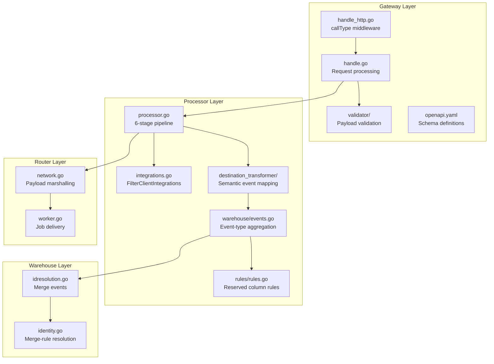

# Technical Specification

# 0. Agent Action Plan

## 0.1 Intent Clarification

### 0.1.1 Core Feature Objective

Based on the prompt, the Blitzy platform understands that the new feature requirement is to **validate and close the remaining ~5% gap in Segment Spec event parity**, bringing the RudderStack `rudder-server` (v1.68.1) from approximately 95% to 100% field-level parity with the Twilio Segment Event Specification. This is classified as **P0 — Critical** priority and targets a 4-week delivery window (2 sprints).

The feature requirements are:

- **Complete Payload Schema Validation (E-001, E-003):** All six core event types (`identify`, `track`, `page`, `screen`, `group`, `alias`) must be validated at the individual field level to confirm identical routing and transformation behavior compared to Segment. This includes verifying that the `IdentifyPayload`, `TrackPayload`, `PagePayload`, `ScreenPayload`, `GroupPayload`, and `AliasPayload` schemas in the Gateway OpenAPI specification (`gateway/openapi.yaml`) exactly match Segment Spec definitions in `refs/segment-docs/src/connections/spec/`.

- **Structured Client Hints Pass-Through Verification (ES-001):** The `context.userAgentData` field, which carries structured Client Hints API data (`brands[]`, `mobile`, `platform`, and optional `bitness`, `model`, `platformVersion`, `uaFullVersion`, `fullVersionList`, `wow64`), must be verified to pass through the full pipeline — from Gateway ingestion through Processor, Router, and into warehouse destinations — without data loss or structural alteration.

- **Semantic Event Category Routing Enforcement (ES-002):** Segment defines seven standardized semantic event categories (E-Commerce v2, Video, Mobile, B2B SaaS, Email, Live Chat, A/B Testing) with reserved event names and properties. RudderStack currently passes all event names as opaque strings. The implementation must validate that destination transforms correctly map semantic event names (e.g., `Order Completed` → Google Analytics Enhanced Ecommerce) and document the pass-through behavior.

- **Reserved Trait Validation (ES-003):** Segment standardizes 18 reserved identify traits and 12 reserved group traits with specific types. RudderStack currently accepts traits as open objects without type validation. The implementation must verify that destination connectors handle reserved traits correctly and document the trait pass-through behavior.

- **Channel Field Auto-Population (ES-007):** Segment auto-populates `context.channel` as `server`, `browser`, or `mobile`. RudderStack accepts this field but auto-population depends on SDK implementation. The implementation must verify SDK implementations auto-populate `channel` and document expected behavior per SDK.

- **Documentation of RudderStack Extensions (ES-004, ES-006):** Additional endpoints (`/v1/replay`, `/internal/v1/retl`, `/beacon/v1/*`, `/pixel/v1/*`, `/internal/v1/extract`, `merge` call type) and permissive batch size defaults (4000 KB vs. Segment's recommended 500 KB) must be documented as RudderStack extensions rather than parity gaps.

**Implicit requirements detected:**

- End-to-end integration tests must exercise all six event types across the full pipeline (Gateway → Processor → Router → Warehouse)
- The existing OpenAPI specification (`gateway/openapi.yaml`) must be updated if any schema gaps are discovered
- Clock skew correction formula (`timestamp = receivedAt - (sentAt - originalTimestamp)`) must be validated against Segment-identical inputs
- All 18 standard `context` fields must be confirmed to pass through without data loss
- The Segment documentation reference corpus in `refs/segment-docs/src/connections/spec/` serves as the authoritative baseline

### 0.1.2 Special Instructions and Constraints

- **Segment Behavioral Equivalence:** The acceptance criterion is that all six core event types route and transform identically to Segment behavior at the payload field level — not just structural compatibility but functional equivalence
- **Maintain Backward Compatibility:** All changes must preserve existing API behavior for current RudderStack users; no breaking changes to the Gateway HTTP API surface
- **Follow Repository Conventions:** The codebase is a Go 1.26.0 modular monolith with established patterns — table-driven tests, `testify`/`gomega` assertions, `dockertest/v3` for integration testing, `jsonrs` for JSON serialization (not `encoding/json`, which is banned by `depguard`)
- **Leverage Existing Test Infrastructure:** Integration tests should follow the established `integration_test/docker_test/` patterns with Docker-provisioned PostgreSQL, Transformer, and webhook services
- **External Transformer Dependency:** Semantic event category validation (ES-002) and reserved trait validation (ES-003) must account for the external Transformer service (`rudder-transformer`) that handles destination-specific transformations at port 9090

### 0.1.3 Technical Interpretation

These feature requirements translate to the following technical implementation strategy:

- To **validate payload schema parity** (E-001, E-003), we will create comprehensive field-level comparison tests in `gateway/` and `processor/` that send all six event types through the Gateway and assert each field is preserved through the pipeline stages, referencing the Segment Spec definitions in `refs/segment-docs/src/connections/spec/`
- To **verify Client Hints pass-through** (ES-001), we will create integration tests that submit payloads with `context.userAgentData` containing structured Client Hints data, then verify the data arrives intact at destination webhooks and warehouse tables by extending the existing `integration_test/docker_test/` test harness
- To **validate semantic event routing** (ES-002), we will create test fixtures for E-Commerce v2, Video, and Mobile semantic events and verify destination transforms correctly map standardized event names, extending tests in `processor/internal/transformer/`
- To **validate reserved trait handling** (ES-003), we will create test payloads with all 18 identify reserved traits and 12 group reserved traits and verify they pass through the pipeline without data loss or type coercion
- To **verify channel auto-population** (ES-007), we will audit Gateway handler code in `gateway/handle.go` and `gateway/handle_http.go` for channel field handling, and create tests that verify proper SDK-originated `context.channel` values propagate correctly
- To **document extensions** (ES-004, ES-006), we will update `docs/gap-report/event-spec-parity.md` and create new documentation in `docs/api-reference/` confirming RudderStack extensions and recommended batch sizing for SDK compatibility

## 0.2 Repository Scope Discovery

### 0.2.1 Comprehensive File Analysis

The following analysis maps every existing file and directory in the repository that requires modification, verification, or extension to achieve 100% Event Spec Parity.

**Gateway Layer — Event Ingestion and Validation**

| File/Pattern | Type | Relevance | Action |
|---|---|---|---|
| `gateway/handle_http.go` | Source | HTTP handler wiring for all 6 event types + batch + merge | VERIFY — Confirm all `callType()` middleware mappings match Segment endpoints |
| `gateway/handle.go` | Source | Core request handler with batching, validation, suppression, and queueing | MODIFY — Add `context.userAgentData` structured pass-through verification; audit `context.channel` handling |
| `gateway/handle_http_auth.go` | Source | Write Key / Source ID / Webhook authentication | VERIFY — Confirm Basic Auth scheme matches Segment exactly |
| `gateway/handle_http_beacon.go` | Source | Beacon-based tracking support | VERIFY — Confirm beacon payloads preserve all Segment Spec fields |
| `gateway/handle_http_pixel.go` | Source | Pixel tracking with GIF response | VERIFY — Document as RudderStack extension |
| `gateway/handle_http_import.go` | Source | Historical data import endpoint | VERIFY — Confirm `/v1/import` parity with Segment |
| `gateway/handle_http_replay.go` | Source | Event replay re-ingestion | DOCUMENT — RudderStack extension |
| `gateway/handle_http_retl.go` | Source | Reverse ETL event ingestion | DOCUMENT — RudderStack extension |
| `gateway/handle_lifecycle.go` | Source | Setup, dependency wiring, worker lifecycle | VERIFY — No changes expected |
| `gateway/handle_observability.go` | Source | Request/failure metrics | VERIFY — Ensure parity metrics are instrumented |
| `gateway/handle_diagnostics.go` | Source | Diagnostic hooks | VERIFY — No changes expected |
| `gateway/handle_webhook.go` | Source | Webhook pipeline glue | VERIFY — No changes expected |
| `gateway/types.go` | Source | Shared request types, batching envelopes | VERIFY — Confirm `webRequestT.reqType` includes all 6 Segment types |
| `gateway/gateway.go` | Source | Static constants, regex, sentinel errors | VERIFY — Constants and error messages match Segment |
| `gateway/openapi.yaml` | Config | OpenAPI 3.0.3 spec for all Gateway endpoints | MODIFY — Update schemas if any field gaps are discovered (e.g., `context.userAgentData` explicit definition) |
| `gateway/regular_handler.go` | Source | Regular web request handler | VERIFY — Payload grouping and queueing |
| `gateway/import_handler.go` | Source | Import request handler | VERIFY — Payload grouping for import |
| `gateway/validator/validator.go` | Source | Validation mediator orchestration | VERIFY — Confirm validator chain processes all Segment Spec fields |
| `gateway/validator/msg_id_validator.go` | Source | messageId presence validation | VERIFY — Confirm matches Segment messageId behavior |
| `gateway/validator/received_at_validator.go` | Source | receivedAt timestamp validation | VERIFY — Confirm receivedAt is set identically to Segment |
| `gateway/validator/req_type_validator.go` | Source | Request type correlation | VERIFY — Confirm all 6 event types + batch are accepted |
| `gateway/validator/request_ip_validator.go` | Source | request_ip presence check | VERIFY — Confirm IP handling matches Segment |
| `gateway/validator/rudder_id_validator.go` | Source | rudderId presence check | VERIFY — RudderStack-specific, document as extension |
| `gateway/validator/msg_properties_validator.go` | Source | Metadata-level validation wrapper | VERIFY — No changes expected |
| `gateway/validator/validator_test.go` | Test | Validator test suite | MODIFY — Add test cases for Client Hints pass-through and channel field |

**Gateway Internal Subsystems**

| File/Pattern | Type | Relevance | Action |
|---|---|---|---|
| `gateway/internal/bot/bot.go` | Source | Bot user agent detection | VERIFY — Ensure Client Hints-enriched payloads are not falsely flagged |
| `gateway/internal/bot/bot_test.go` | Test | Bot detection tests | MODIFY — Add Client Hints-aware test cases |
| `gateway/response/` | Directory | Canonical response strings and HTTP status codes | VERIFY — Confirm response codes match Segment (200, 400, 401, 404, 413, 429) |
| `gateway/throttler/` | Directory | Per-workspace rate limiting | VERIFY — No changes expected |
| `gateway/types/` | Directory | Context keys, AuthRequestContext | VERIFY — Ensure context types support all Segment Spec fields |
| `gateway/webhook/` | Directory | Webhook pipeline | VERIFY — No changes expected |

**Gateway Tests**

| File/Pattern | Type | Relevance | Action |
|---|---|---|---|
| `gateway/gateway_test.go` | Test | Comprehensive gateway unit tests | MODIFY — Add event spec parity test cases for all 6 event types |
| `gateway/gateway_integration_test.go` | Test | Gateway integration tests | MODIFY — Add end-to-end parity validation tests |
| `gateway/handle_test.go` | Test | Handle unit tests | MODIFY — Add `context.userAgentData` and `context.channel` test cases |
| `gateway/handle_http_auth_test.go` | Test | Auth handler tests | VERIFY — Confirm Basic Auth test coverage |
| `gateway/handle_http_beacon_test.go` | Test | Beacon handler tests | VERIFY — Confirm beacon preserves all Spec fields |
| `gateway/handle_http_pixel_test.go` | Test | Pixel handler tests | VERIFY — Document pixel as extension |
| `gateway/gateway_suite_test.go` | Test | Ginkgo suite bootstrap | VERIFY — No changes expected |

**Processor Layer — Event Pipeline and Transformation**

| File/Pattern | Type | Relevance | Action |
|---|---|---|---|
| `processor/processor.go` | Source | Core 6-stage pipeline handler | VERIFY — Confirm all Spec fields pass through pipeline stages without modification |
| `processor/pipeline_worker.go` | Source | Channel orchestration across stages | VERIFY — Ensure `context.userAgentData` is not stripped during processing |
| `processor/consent.go` | Source | Consent filtering logic | VERIFY — Confirm consent filtering does not strip Spec fields |
| `processor/trackingplan.go` | Source | Tracking plan validation | VERIFY — Confirm validation does not reject valid Segment Spec payloads |
| `processor/src_hydration_stage.go` | Source | Source hydration helpers | VERIFY — Confirm hydration preserves all Spec fields |
| `processor/integrations/integrations.go` | Source | Integration adapter for transformer responses | VERIFY — Confirm `FilterClientIntegrations` correctly handles `integrations` field per Segment Spec |
| `processor/processor_test.go` | Test | Processor unit/BDD test suite | MODIFY — Add event spec parity test scenarios |
| `processor/processor_bot_enricher_test.go` | Test | Bot enrichment tests | VERIFY — Ensure Client Hints payloads handled correctly |
| `processor/processor_event_dropping_test.go` | Test | Event dropping tests | VERIFY — Ensure Spec events are never incorrectly dropped |

**Processor Internal — Transformer Clients**

| File/Pattern | Type | Relevance | Action |
|---|---|---|---|
| `processor/transformer/clients.go` | Source | Transformer client factory | VERIFY — Ensure all transformer clients handle Spec events |
| `processor/internal/transformer/destination_transformer/` | Directory | Destination transformation orchestration | VERIFY — Confirm semantic event category handling in destination transforms |
| `processor/internal/transformer/destination_transformer/embedded/warehouse/events.go` | Source | Warehouse event-type aggregation logic | VERIFY — Confirm all 6 event types are processed correctly with proper rule application |
| `processor/internal/transformer/destination_transformer/embedded/warehouse/events_test.go` | Test | Warehouse events tests | MODIFY — Add reserved trait validation test cases |
| `processor/internal/transformer/destination_transformer/embedded/warehouse/idresolution.go` | Source | Identity resolution for warehouse | VERIFY — Confirm alias merge-rule resolution functions |
| `processor/internal/transformer/destination_transformer/embedded/warehouse/internal/rules/rules.go` | Source | Reserved column rules for all event types | VERIFY — Confirm rules cover all Segment Spec reserved fields per event type |
| `processor/internal/transformer/destination_transformer/embedded/warehouse/internal/rules/rules_test.go` | Test | Rules test suite | MODIFY — Add reserved trait and group trait test coverage |

**Router Layer — Event Delivery**

| File/Pattern | Type | Relevance | Action |
|---|---|---|---|
| `router/handle.go` | Source | Core routing loop with job pickup and delivery | VERIFY — Confirm routing does not modify Spec payload fields |
| `router/worker.go` | Source | Worker job intake, batching, transformation, delivery | VERIFY — Confirm transformation preserves Spec fields |
| `router/network.go` | Source | REST payload marshalling and delivery | VERIFY — Confirm payload serialization preserves all fields including `context.userAgentData` |
| `router/transformer/` | Directory | Transformer proxy adapters | VERIFY — Confirm semantic event names pass through to destination transforms |

**Warehouse Layer — Identity and Data Loading**

| File/Pattern | Type | Relevance | Action |
|---|---|---|---|
| `warehouse/identity/identity.go` | Source | Identity resolver (merge-rule model) | VERIFY — Document as partial parity for ES-005 (no real-time identity graph) |

**Integration Tests**

| File/Pattern | Type | Relevance | Action |
|---|---|---|---|
| `integration_test/docker_test/` | Directory | Full-stack Docker regression suite | MODIFY — Extend with event spec parity test scenarios |
| `integration_test/docker_test/testdata/workspaceConfigTemplate.json` | Config | Test workspace template | MODIFY — Add test fixtures for all 6 event types with reserved traits |
| `integration_test/transformer_contract/` | Directory | Transformer contract tests | VERIFY — Confirm transformer contract covers all Spec event types |

**Documentation**

| File/Pattern | Type | Relevance | Action |
|---|---|---|---|
| `docs/gap-report/event-spec-parity.md` | Documentation | Canonical gap report | MODIFY — Update parity assessment to 100% upon gap closure |
| `docs/gap-report/sprint-roadmap.md` | Documentation | Sprint roadmap | MODIFY — Mark Sprint 1-2 epics as complete |
| `docs/gap-report/index.md` | Documentation | Executive gap report index | MODIFY — Update overall parity percentages |
| `docs/api-reference/` | Directory | API reference documentation | MODIFY — Add event spec field-level documentation |
| `README.md` | Documentation | Project readme | MODIFY — Update parity status |

**Configuration**

| File/Pattern | Type | Relevance | Action |
|---|---|---|---|
| `config/config.yaml` | Config | Master runtime configuration | VERIFY — Confirm Gateway configuration supports all Spec fields |
| `config/sample.env` | Config | Environment variable reference | VERIFY — No changes expected |

**Segment Reference Corpus**

| File/Pattern | Type | Relevance | Action |
|---|---|---|---|
| `refs/segment-docs/src/connections/spec/identify.md` | Reference | Segment Identify spec | READ — Authoritative baseline for identify parity |
| `refs/segment-docs/src/connections/spec/track.md` | Reference | Segment Track spec | READ — Authoritative baseline for track parity |
| `refs/segment-docs/src/connections/spec/page.md` | Reference | Segment Page spec | READ — Authoritative baseline for page parity |
| `refs/segment-docs/src/connections/spec/screen.md` | Reference | Segment Screen spec | READ — Authoritative baseline for screen parity |
| `refs/segment-docs/src/connections/spec/group.md` | Reference | Segment Group spec | READ — Authoritative baseline for group parity |
| `refs/segment-docs/src/connections/spec/alias.md` | Reference | Segment Alias spec | READ — Authoritative baseline for alias parity |
| `refs/segment-docs/src/connections/spec/common.md` | Reference | Segment Common Fields spec | READ — Authoritative baseline for common fields and context object |
| `refs/segment-docs/src/connections/spec/ecommerce/v2.md` | Reference | Segment E-Commerce v2 spec | READ — Semantic event category definitions |
| `refs/segment-docs/src/connections/spec/video.md` | Reference | Segment Video spec | READ — Semantic video event definitions |
| `refs/segment-docs/src/connections/spec/mobile.md` | Reference | Segment Mobile spec | READ — Semantic mobile lifecycle definitions |

### 0.2.2 Web Search Research Conducted

- Best practices for implementing Client Hints API pass-through in HTTP proxy/gateway services
- Segment Spec E-Commerce v2 semantic event naming conventions and reserved property validation patterns
- Go testing patterns for field-level JSON payload comparison across pipeline stages
- Integration testing approaches for end-to-end event data flow verification in Go monolith architectures

### 0.2.3 New File Requirements

**New Test Files:**

| File Path | Purpose |
|---|---|
| `gateway/event_spec_parity_test.go` | Comprehensive field-level parity validation for all 6 event types against Segment Spec definitions |
| `gateway/client_hints_test.go` | Dedicated tests for `context.userAgentData` structured Client Hints pass-through |
| `processor/event_spec_parity_test.go` | Processor-level validation that all Spec fields survive the 6-stage pipeline |
| `processor/reserved_traits_test.go` | Validation of reserved trait handling for identify (18 traits) and group (12 traits) |
| `integration_test/event_spec_parity/` | New integration test subdirectory for end-to-end event spec parity validation |
| `integration_test/event_spec_parity/event_spec_parity_test.go` | Full-stack integration test exercising all 6 event types across Gateway → Processor → Router → Warehouse |
| `integration_test/event_spec_parity/testdata/` | Test fixtures with all 6 event types, reserved traits, Client Hints, and semantic events |

**New Documentation Files:**

| File Path | Purpose |
|---|---|
| `docs/api-reference/event-spec/` | Directory for detailed event spec field-level documentation |
| `docs/api-reference/event-spec/common-fields.md` | Common fields reference with parity confirmation |
| `docs/api-reference/event-spec/semantic-events.md` | Semantic event category documentation and routing behavior |
| `docs/api-reference/event-spec/extensions.md` | RudderStack extension endpoints documentation |

**New Configuration Files:**

| File Path | Purpose |
|---|---|
| `integration_test/event_spec_parity/testdata/workspaceConfigTemplate.json` | Workspace configuration template for parity tests |
| `integration_test/event_spec_parity/testdata/segment_spec_payloads.json` | Canonical Segment Spec payload fixtures for all 6 event types |

## 0.3 Dependency Inventory

### 0.3.1 Private and Public Packages

The following table lists all key packages relevant to the Event Spec Parity feature addition, with exact versions drawn from `go.mod`:

| Registry | Package | Version | Purpose |
|---|---|---|---|
| Go stdlib | `go` | 1.26.0 | Runtime version from `go.mod` |
| GitHub | `github.com/rudderlabs/rudder-go-kit` | v0.72.3 | Core toolkit (config, logger, stats, httputil, jsonrs) |
| GitHub | `github.com/rudderlabs/rudder-observability-kit` | v0.0.6 | Observability instrumentation (obskit) |
| GitHub | `github.com/rudderlabs/rudder-schemas` | v0.9.1 | Shared schema definitions (stream.MessageProperties) |
| GitHub | `github.com/rudderlabs/rudder-transformer/go` | v1.122.0 | Transformer Go client library |
| GitHub | `github.com/rudderlabs/analytics-go` | v3.3.3+incompatible | RudderStack analytics client |
| GitHub | `github.com/tidwall/gjson` | v1.18.0 | Fast JSON value extraction (used in validators) |
| GitHub | `github.com/tidwall/sjson` | v1.2.5 | Fast JSON value mutation |
| GitHub | `github.com/grafana/jsonparser` | v0.0.0-20250908162026-5c2524e07b4c | High-performance JSON parser |
| GitHub | `github.com/go-chi/chi/v5` | v5.2.5 | HTTP router for Gateway endpoints |
| GitHub | `github.com/stretchr/testify` | v1.11.1 | Test assertion library (assert, require) |
| GitHub | `github.com/onsi/ginkgo/v2` | v2.24.0 | BDD test framework |
| GitHub | `github.com/onsi/gomega` | v1.38.0 | BDD matcher library |
| GitHub | `github.com/ory/dockertest/v3` | v3.12.0 | Docker container orchestration for integration tests |
| GitHub | `go.uber.org/mock` | v0.6.0 | Interface mock generation |
| GitHub | `github.com/google/go-cmp` | v0.7.0 | Deep structural comparison for test assertions |
| GitHub | `github.com/google/uuid` | v1.6.0 | UUID generation (messageId) |
| GitHub | `github.com/samber/lo` | v1.52.0 | Go generics utility library (map, filter, chunk) |
| GitHub | `github.com/lib/pq` | v1.11.2 | PostgreSQL driver |
| GitHub | `github.com/golang-migrate/migrate/v4` | v4.18.3 | Database migration framework |
| GitHub | `github.com/golang/mock` | v1.6.0 | Legacy mock generation (some existing tests) |
| GitHub | `github.com/phayes/freeport` | v0.0.0-20220201140144-74d24b5ae9f5 | Dynamic port allocation for test isolation |
| GitHub | `github.com/rs/cors` | v1.11.1 | CORS middleware |
| GitHub | `github.com/klauspost/compress` | v1.18.4 | Compression (gzip support in Gateway and Router) |
| GitHub | `github.com/evanphx/json-patch/v5` | v5.9.11 | JSON patch operations |
| GitHub | `github.com/joho/godotenv` | v1.5.1 | Environment variable loading |

### 0.3.2 Dependency Updates

**No new dependencies are required** for this feature. All validation, testing, and documentation work leverages the existing dependency set. The feature focuses on verifying and extending the behavior of existing code rather than introducing new external libraries.

**Import Updates (If applicable):**

Files requiring import additions for new test utilities:

- `gateway/event_spec_parity_test.go` — New file requiring imports from:
  - `github.com/stretchr/testify/require`
  - `github.com/tidwall/gjson`
  - `github.com/rudderlabs/rudder-go-kit/httputil`
  - `net/http`, `net/http/httptest`

- `integration_test/event_spec_parity/event_spec_parity_test.go` — New file requiring imports from:
  - `github.com/ory/dockertest/v3`
  - `github.com/rudderlabs/rudder-server/testhelper/health`
  - `github.com/rudderlabs/rudder-server/testhelper/webhook`
  - `github.com/rudderlabs/rudder-server/testhelper/backendconfigtest`
  - `github.com/tidwall/gjson`

**External Reference Updates:**

| File | Update Type | Description |
|---|---|---|
| `gateway/openapi.yaml` | Schema | Add explicit `context.userAgentData` object schema if not present |
| `docs/gap-report/event-spec-parity.md` | Documentation | Update gap status from ~95% to 100% |
| `docs/gap-report/sprint-roadmap.md` | Documentation | Mark E-001 through E-004 epics as completed |
| `docs/gap-report/index.md` | Documentation | Update Event Spec parity percentage in executive summary |
| `README.md` | Documentation | Update Segment Spec parity claim |
| `.github/workflows/tests.yaml` | CI/CD | Add event spec parity integration test to CI matrix if separate suite created |

## 0.4 Integration Analysis

### 0.4.1 Existing Code Touchpoints

**Direct Modifications Required:**

- **`gateway/handle.go`** — The core request handler processes all incoming events. Lines around `406-410` handle `userAgent` extraction via `misc.MapLookup` for bot detection. Modification needed to add verification logic that `context.userAgentData` (the structured Client Hints object) is preserved alongside the string `userAgent` field through the batching, validation, and queueing stages. The `channel` field handling in the context object must be audited here.

- **`gateway/openapi.yaml`** — The OpenAPI 3.0.3 specification (lines `688-940`) defines all payload schemas. The `context` schema (around lines `699-717`) defines sub-properties for `ip`, `library`, and `traits` but may not explicitly define `userAgentData` as a structured object with its sub-fields (`brands[]`, `mobile`, `platform`). This schema must be extended to include the `userAgentData` field definition for documentation completeness.

- **`gateway/validator/validator.go`** — The validation mediator runs validators in sequence: `msgProperties`, `messageId`, `reqType`, `receivedAt`, `requestIP`, `rudderID`. No validator currently checks `context.userAgentData` structure. No new validator is needed (pass-through behavior is correct), but test coverage must verify validators do not strip or reject payloads containing Client Hints.

- **`gateway/gateway_test.go`** — The comprehensive test suite already includes userAgent-based test payloads (lines around 921, 931). This file must be extended with test cases that include `context.userAgentData` structured payloads to verify pass-through behavior.

- **`gateway/handle_test.go`** — Must be extended with test cases for `context.channel` field handling and `context.userAgentData` preservation through the Handle pipeline.

**Processor Touchpoints:**

- **`processor/processor.go`** — The six-stage pipeline (preprocess → source hydration → pre-transform → user transform → destination transform → store) processes every event. Each stage must be verified to preserve the `context.userAgentData` object and all 18 standard context fields without stripping or modifying them. The `singularEventMetadata` function used in benchmarks must be verified to handle Client Hints payloads.

- **`processor/integrations/integrations.go`** — The `FilterClientIntegrations` function extracts the `integrations` object from events using `types.GetRudderEventVal`. This function must be verified to correctly handle the Segment Spec `integrations` field semantics, including the `All: true` default behavior and per-destination boolean/object toggles.

- **`processor/internal/transformer/destination_transformer/embedded/warehouse/events.go`** — This file contains event-type-specific aggregation logic for all six event types (`trackEvents`, `identifyEvents`, `pageEvents`, `screenEvents`, `groupEvents`, `aliasEvents`). Each function must be verified to correctly process Segment Spec reserved fields and traits. The `identifyCommonProps` function (line 275) sources traits from multiple locations (userProperties, context traits, traits, context) and must be verified to handle all 18 reserved identify traits correctly.

- **`processor/internal/transformer/destination_transformer/embedded/warehouse/internal/rules/rules.go`** — Defines reserved column rules per event type (`DefaultRules`, `TrackRules`, `IdentifyRules`, `PageRules`, `ScreenRules`, `AliasRules`, `GroupRules`, `ExtractRules`). These rule sets determine which fields map to reserved warehouse columns. Verification needed to ensure all Segment Spec reserved fields for each event type are represented.

**Router Touchpoints:**

- **`router/network.go`** — The `netHandle.SendPost` method handles REST payload marshalling with gzip support. Must be verified to serialize `context.userAgentData` correctly without stripping nested objects. Response redaction based on MIME types must not affect outbound Spec payloads.

- **`router/worker.go`** — Job intake, batching, and transformation must be verified to preserve all Spec fields including nested context objects.

**Warehouse Identity Touchpoints:**

- **`warehouse/identity/identity.go`** — The Identity resolver handles merge-rule resolution for alias events in the warehouse context. This is the partial implementation that addresses ES-005 (Alias identity graph). The `applyRule` and `processMergeRules` methods drive the transactional merge flow. Verification needed to confirm alias events correctly trigger merge-rule processing.

- **`processor/internal/transformer/destination_transformer/embedded/warehouse/idresolution.go`** — The `mergeEvents` function handles identity resolution for warehouse destinations, gated by `enableIDResolution` config flag. Must be verified to correctly process alias event merge properties.

**Integration Test Touchpoints:**

- **`integration_test/docker_test/`** — The full-stack Docker regression suite in `docker_test.go` sends `identify`, `batch`, `track`, `page`, `screen`, `alias`, `group`, pixel, and RETL traffic through the system. The `sendEventsToGateway` helper must be extended to include payloads with all Segment Spec fields, Client Hints data, reserved traits, and semantic event names.

- **`integration_test/docker_test/testdata/workspaceConfigTemplate.json`** — The workspace configuration template defines webhook destinations with `supportedMessageTypes` that already include all six core types (`alias`, `group`, `identify`, `page`, `screen`, `track`). This template serves as the baseline for parity testing.

**Configuration Touchpoints:**

- **`config/config.yaml`** — The Gateway configuration section (port 8080, 64 web workers, 256 DB writers, 4MB request size) does not require changes for event spec parity. However, the request size limit must be documented in the context of Segment's recommended 500KB batch size (ES-006).

## 0.5 Technical Implementation

### 0.5.1 File-by-File Execution Plan

**Group 1 — Gateway Schema Validation and Client Hints (ES-001, E-001, E-003)**

- **MODIFY: `gateway/openapi.yaml`** — Add explicit `userAgentData` object schema definition under the `context` property for all payload schemas (`IdentifyPayload`, `TrackPayload`, `PagePayload`, `ScreenPayload`, `GroupPayload`, `AliasPayload`). Define sub-properties: `brands` (array of objects with `brand` and `version`), `mobile` (boolean), `platform` (string), and optional `bitness`, `model`, `platformVersion`, `uaFullVersion`, `fullVersionList`, `wow64`. This ensures OpenAPI documentation completeness.

- **MODIFY: `gateway/handle.go`** — Audit the event processing path to verify that `context.userAgentData` objects are not stripped during batching, validation, or queueing. The existing `userAgent` string extraction at lines ~406-410 for bot detection must be verified to not interfere with the structured `userAgentData` object. Add explicit handling to ensure both `context.userAgent` (string) and `context.userAgentData` (object) coexist correctly.

- **CREATE: `gateway/event_spec_parity_test.go`** — Comprehensive table-driven test suite that sends all 6 event types to the Gateway with full Segment Spec payloads and asserts field-level preservation. Each test case must cover: `anonymousId`, `userId`, `messageId`, `timestamp`, `sentAt`, `originalTimestamp`, `receivedAt`, `context` (all 18 fields including `userAgentData`), `integrations`, `type`, `version`, `channel`, and event-type-specific fields (`traits`, `event`, `properties`, `name`, `category`, `groupId`, `previousId`).

- **CREATE: `gateway/client_hints_test.go`** — Dedicated test file for Client Hints pass-through verification. Tests must submit payloads with structured `context.userAgentData` containing `brands`, `mobile`, `platform`, and optional high-entropy fields, then verify the data is preserved through the Gateway pipeline using `gjson` assertions.

- **MODIFY: `gateway/gateway_test.go`** — Add test cases with `context.userAgentData` payloads alongside existing `userAgent` string-based tests (around line 921). Add test cases verifying `context.channel` field preservation for `server`, `browser`, and `mobile` values.

- **MODIFY: `gateway/handle_test.go`** — Extend Handle tests with `context.userAgentData` and `context.channel` field validation scenarios.

- **MODIFY: `gateway/internal/bot/bot_test.go`** — Add test cases ensuring payloads with `context.userAgentData` (Client Hints) are not falsely flagged as bot traffic by the `IsBotUserAgent` function.

- **MODIFY: `gateway/validator/validator_test.go`** — Add test cases confirming that the validator mediator chain does not reject payloads containing `context.userAgentData` structured objects.

**Group 2 — Processor Parity Validation (E-002, ES-002, ES-003)**

- **CREATE: `processor/event_spec_parity_test.go`** — Test suite validating that all Segment Spec fields survive the 6-stage Processor pipeline. Use mock transformer clients from `processor/transformer/mocks_transformer_client.go` to verify field preservation through each stage.

- **CREATE: `processor/reserved_traits_test.go`** — Dedicated test file for reserved trait handling validation. Test all 18 identify reserved traits (`address`, `age`, `avatar`, `birthday`, `company`, `createdAt`, `description`, `email`, `firstName`, `gender`, `id`, `lastName`, `name`, `phone`, `title`, `username`, `website`) and all 12 group reserved traits (`address`, `avatar`, `createdAt`, `description`, `email`, `employees`, `id`, `industry`, `name`, `phone`, `website`, `plan`).

- **MODIFY: `processor/processor_test.go`** — Add semantic event category test scenarios that verify E-Commerce v2 events (`Order Completed`, `Product Viewed`, `Cart Viewed`), Video events (`Video Playback Started`), and Mobile lifecycle events (`Application Opened`) pass through the Processor without modification or rejection.

- **MODIFY: `processor/internal/transformer/destination_transformer/embedded/warehouse/events_test.go`** — Add test cases for each event type function (`trackEvents`, `identifyEvents`, `pageEvents`, `screenEvents`, `groupEvents`, `aliasEvents`) with full Segment Spec reserved field payloads.

- **MODIFY: `processor/internal/transformer/destination_transformer/embedded/warehouse/internal/rules/rules_test.go`** — Add test coverage verifying all Segment Spec reserved fields for each event type are correctly represented in rule maps.

**Group 3 — Integration Testing (E-001 through E-004)**

- **CREATE: `integration_test/event_spec_parity/event_spec_parity_test.go`** — Full-stack integration test using `dockertest/v3` to provision PostgreSQL, Transformer, and webhook services. Test flow: send all 6 event types with complete Segment Spec payloads → verify webhook delivery payloads contain all fields → verify warehouse table rows contain all expected columns. Include Client Hints, reserved traits, semantic events, and channel field payloads.

- **CREATE: `integration_test/event_spec_parity/testdata/workspaceConfigTemplate.json`** — Workspace configuration template with webhook destinations configured to accept all 6 event types.

- **CREATE: `integration_test/event_spec_parity/testdata/segment_spec_payloads.json`** — Canonical payload fixtures for all 6 event types with every Segment Spec field populated, drawn from `refs/segment-docs/src/connections/spec/` examples.

- **MODIFY: `integration_test/docker_test/docker_test.go`** — Extend the existing `testMainFlow` function to include Client Hints payloads and verify field preservation through to webhook destinations.

**Group 4 — Documentation and Gap Closure (ES-004, ES-006)**

- **MODIFY: `docs/gap-report/event-spec-parity.md`** — Update the Gap Summary table to mark ES-001, ES-002, ES-003, ES-006, and ES-007 as resolved. Update overall parity from ~95% to 100% (excluding ES-005 which is tracked in the Identity Parity dimension). Update per-event-type parity table.

- **MODIFY: `docs/gap-report/sprint-roadmap.md`** — Update Sprint 1-2 section to reflect completion of E-001 through E-004 epics.

- **MODIFY: `docs/gap-report/index.md`** — Update executive summary Event Spec parity percentage.

- **CREATE: `docs/api-reference/event-spec/common-fields.md`** — Detailed API reference for all 11 common fields with parity confirmation.

- **CREATE: `docs/api-reference/event-spec/semantic-events.md`** — Documentation of semantic event category pass-through behavior with destination-specific mapping notes.

- **CREATE: `docs/api-reference/event-spec/extensions.md`** — Documentation of RudderStack extension endpoints, merge call type, and batch size defaults.

- **MODIFY: `README.md`** — Update parity status from ~95% to 100% in the project documentation.

### 0.5.2 Implementation Approach per File

- **Establish parity verification foundation** by creating comprehensive test suites (`gateway/event_spec_parity_test.go`, `processor/event_spec_parity_test.go`) that validate field-level preservation for all 6 event types against Segment Spec definitions
- **Verify Client Hints pass-through** by tracing the `context.userAgentData` object through Gateway → Processor → Router → destination, ensuring the JSON object structure is preserved end-to-end
- **Validate semantic event routing** by creating test fixtures for E-Commerce v2, Video, and Mobile semantic event categories and verifying destination transforms handle them correctly
- **Validate reserved trait handling** by testing all 18 identify traits and 12 group traits through the pipeline and confirming no type coercion or data loss occurs
- **Close documentation gaps** by updating the gap report, creating API reference documentation, and documenting RudderStack extensions
- **Integrate into CI** by adding parity tests to the existing CI pipeline structure to prevent future regressions

### 0.5.3 User Interface Design

Not applicable. The `rudder-server` repository is a backend data plane with no frontend components. All system interactions occur through programmatic APIs (HTTP REST, gRPC, UNIX socket RPC). The Event Spec Parity feature targets the HTTP REST API surface at the Gateway level (port 8080).

## 0.6 Scope Boundaries

### 0.6.1 Exhaustively In Scope

**Gateway Source Files:**
- `gateway/handle.go` — Client Hints and channel field audit
- `gateway/handle_http.go` — callType middleware verification
- `gateway/handle_http_auth.go` — Basic Auth scheme confirmation
- `gateway/handle_http_beacon.go` — Beacon payload field preservation
- `gateway/handle_http_pixel.go` — Pixel endpoint documentation
- `gateway/handle_http_import.go` — Import endpoint parity verification
- `gateway/handle_http_replay.go` — Extension endpoint documentation
- `gateway/handle_http_retl.go` — Extension endpoint documentation
- `gateway/handle_lifecycle.go` — Lifecycle verification
- `gateway/gateway.go` — Constants and sentinel error verification
- `gateway/types.go` — Request type definitions verification
- `gateway/openapi.yaml` — Schema updates for `userAgentData`
- `gateway/regular_handler.go` — Request handler verification
- `gateway/import_handler.go` — Import handler verification
- `gateway/validator/**/*.go` — Validator chain verification
- `gateway/internal/bot/**/*.go` — Bot detection verification
- `gateway/response/**/*.go` — Response code verification
- `gateway/types/**/*.go` — Context type verification

**Gateway Test Files:**
- `gateway/gateway_test.go` — Add Client Hints and channel test cases
- `gateway/gateway_integration_test.go` — Add parity validation tests
- `gateway/handle_test.go` — Add context field test cases
- `gateway/handle_http_auth_test.go` — Verify Basic Auth coverage
- `gateway/handle_http_beacon_test.go` — Verify beacon field preservation
- `gateway/handle_http_pixel_test.go` — Verify pixel documentation
- `gateway/validator/validator_test.go` — Add Client Hints validation tests
- `gateway/internal/bot/bot_test.go` — Add Client Hints bot detection tests
- `gateway/event_spec_parity_test.go` — New: comprehensive parity test suite
- `gateway/client_hints_test.go` — New: Client Hints pass-through tests

**Processor Source Files:**
- `processor/processor.go` — Pipeline field preservation verification
- `processor/pipeline_worker.go` — Channel orchestration verification
- `processor/consent.go` — Consent filtering field preservation
- `processor/trackingplan.go` — Tracking plan compatibility
- `processor/src_hydration_stage.go` — Source hydration field preservation
- `processor/integrations/integrations.go` — Integration filtering verification
- `processor/internal/transformer/destination_transformer/embedded/warehouse/events.go` — Event-type aggregation verification
- `processor/internal/transformer/destination_transformer/embedded/warehouse/idresolution.go` — Alias merge resolution verification
- `processor/internal/transformer/destination_transformer/embedded/warehouse/internal/rules/rules.go` — Reserved column rule verification

**Processor Test Files:**
- `processor/processor_test.go` — Add semantic event test scenarios
- `processor/processor_bot_enricher_test.go` — Verify Client Hints handling
- `processor/processor_event_dropping_test.go` — Verify Spec events not dropped
- `processor/internal/transformer/destination_transformer/embedded/warehouse/events_test.go` — Add reserved trait tests
- `processor/internal/transformer/destination_transformer/embedded/warehouse/internal/rules/rules_test.go` — Add reserved field coverage
- `processor/event_spec_parity_test.go` — New: processor parity test suite
- `processor/reserved_traits_test.go` — New: reserved trait validation tests

**Router Source Files (Verification Only):**
- `router/network.go` — Payload serialization verification
- `router/worker.go` — Job delivery field preservation

**Warehouse Source Files (Verification Only):**
- `warehouse/identity/identity.go` — Alias merge-rule resolution documentation

**Integration Test Files:**
- `integration_test/docker_test/docker_test.go` — Extend with parity payloads
- `integration_test/docker_test/testdata/workspaceConfigTemplate.json` — Template verification
- `integration_test/event_spec_parity/**/*` — New: dedicated parity test suite
- `integration_test/transformer_contract/` — Contract verification

**Configuration Files:**
- `config/config.yaml` — Configuration verification and documentation
- `config/sample.env` — Environment variable verification

**Documentation Files:**
- `docs/gap-report/event-spec-parity.md` — Update to 100% parity
- `docs/gap-report/sprint-roadmap.md` — Mark Sprint 1-2 epics complete
- `docs/gap-report/index.md` — Update executive summary
- `docs/api-reference/event-spec/**/*.md` — New: event spec API reference
- `README.md` — Update parity status

**Segment Reference Corpus (Read-Only):**
- `refs/segment-docs/src/connections/spec/**/*.md` — Authoritative baseline

### 0.6.2 Explicitly Out of Scope

- **Identity Graph Implementation (ES-005):** Building a real-time identity resolution service equivalent to Segment Unify is tracked under the Identity Parity dimension (Sprint 6-8, P2) and is explicitly out of scope for this Sprint 1-2 effort. The warehouse-level merge-rule resolution in `warehouse/identity/` is documented as partial parity.

- **Destination Connector Expansion:** Adding new destination connectors or modifying existing destination-specific transformation logic is out of scope. This work is tracked under Sprint 3-5 (Destination Connector Expansion).

- **Source SDK Modifications:** Modifying RudderStack client SDKs (JavaScript, iOS, Android, server-side) to alter `context.channel` auto-population behavior is out of scope. This work is tracked under Sprint 2-3 (Source SDK Compatibility).

- **Functions and Transformation Framework:** Adding new transformation capabilities, custom function runtimes, or modifying the Transformer service is out of scope. This work is tracked under Sprint 4-6.

- **Protocols and Tracking Plan Enforcement:** Adding reserved trait type validation at the Gateway or Processor level (beyond documentation and pass-through verification) is out of scope. The Segment Spec approach of pass-through traits with destination-level enforcement is confirmed as correct behavior.

- **Performance Optimization:** No performance optimization work beyond what is required for feature correctness. Benchmarks must not regress, but no new performance targets are set.

- **Refactoring of Existing Code:** No refactoring of existing architecture, code patterns, or module boundaries beyond what is strictly needed for gap closure.

- **Warehouse Feature Enhancement:** Selective sync, replay, and advanced monitoring features are tracked under Sprint 7-9.

- **Operational Tooling:** Advanced monitoring, alerting, and replay controls are tracked under Sprint 8-10.

## 0.7 Rules for Feature Addition

### 0.7.1 Feature-Specific Rules

- **Segment Spec as Authoritative Baseline:** All field-level parity decisions must reference the Segment documentation corpus in `refs/segment-docs/src/connections/spec/`. When ambiguity exists between the OpenAPI spec and the Segment docs, the Segment docs take precedence for behavioral parity.

- **Pass-Through by Default:** RudderStack's Gateway treats all event payloads as pass-through — fields are accepted, stored, and forwarded without type enforcement or schema validation at the Gateway level. This behavior is correct per the Segment Spec approach and must be preserved. Trait validation and semantic enforcement happen at the destination connector level during transformation.

- **No Breaking Changes to Existing API:** All modifications must maintain backward compatibility with existing RudderStack users. The HTTP API surface (`/v1/identify`, `/v1/track`, `/v1/page`, `/v1/screen`, `/v1/group`, `/v1/alias`, `/v1/batch`) must continue to accept all currently valid payloads.

- **Use `jsonrs` Instead of `encoding/json`:** Per the repository's `depguard` linting rule in `.golangci.yml`, all JSON serialization/deserialization must use the `jsonrs` library from `github.com/rudderlabs/rudder-go-kit`. Using `encoding/json` directly is banned.

- **Table-Driven Test Patterns:** All new tests must follow the codebase's established table-driven test pattern with `t.Run()` subtests for each scenario, using `testify/require` for assertions. Integration tests must use `dockertest/v3` for container orchestration.

- **OpenAPI Specification Consistency:** Any changes to the OpenAPI spec (`gateway/openapi.yaml`) must pass the `swagger-cli validate` verification step in the CI pipeline (`.github/workflows/verify.yml`).

- **Benchmark Non-Regression:** The existing `processorBenchmark_test.go` benchmark for `singularEventMetadata` must not regress due to any changes. Run benchmarks before and after changes to verify.

### 0.7.2 Integration Requirements

- **Transformer Service Compatibility:** Event spec parity validation must account for the external Transformer service (`rudder-transformer` at port 9090). Semantic event category mapping (ES-002) is handled by destination-specific transforms in the Transformer, not by the Gateway or Processor.

- **Warehouse Compatibility:** All 6 event types must be correctly processed by the embedded warehouse transformer (`processor/internal/transformer/destination_transformer/embedded/warehouse/events.go`) and produce correct warehouse table rows with all Segment Spec reserved fields.

- **CI Pipeline Integration:** New integration tests must be compatible with the existing CI pipeline structure in `.github/workflows/tests.yaml` and must run within the 30-minute timeout for integration tests.

### 0.7.3 Security Considerations

- **No Sensitive Data in Test Fixtures:** Test payloads must use synthetic data (fake names, emails, IPs) and never include real user data or credentials.

- **SSRF Protection:** The Router's private IP blocking (`router/network.go`) must not be affected by any changes. All network-level security controls must remain intact.

- **Authentication Integrity:** Write Key Basic Auth (`gateway/handle_http_auth.go`) must remain identical to Segment's authentication scheme. No changes to the auth flow are permitted.

## 0.8 References

### 0.8.1 Files and Folders Searched

The following files and directories were comprehensively searched across the codebase to derive the conclusions in this Agent Action Plan:

**Root-Level Files:**
- `go.mod` — Go 1.26.0, complete dependency graph with 80+ direct dependencies
- `go.sum` — Checksum closure file
- `Dockerfile` — Multi-stage Go build definition (GO_VERSION=1.26.0, Alpine 3.23)
- `Makefile` — Build system, test commands, tool versions
- `config/config.yaml` — Master runtime configuration (Gateway port 8080, worker counts, batch sizes)
- `config/sample.env` — Environment variable documentation
- `README.md` — Project documentation
- `CONTRIBUTING.md` — Contributor guidelines
- `.golangci.yml` — Linter configuration (depguard, forbidigo rules)
- `.deepsource.toml` — Static analysis configuration
- `codecov.yml` — Coverage configuration
- `docker-compose.yml` — Docker Compose configuration
- `rudder-docker.yml` — Rudder stack runtime configuration
- `main.go` — Application entrypoint

**Gateway Directory (Exhaustive):**
- `gateway/handle_http.go` — HTTP handler wiring for all event types
- `gateway/handle.go` — Core request handler
- `gateway/handle_http_auth.go` — Authentication middleware
- `gateway/handle_http_beacon.go` — Beacon tracking support
- `gateway/handle_http_pixel.go` — Pixel tracking with GIF response
- `gateway/handle_http_import.go` — Historical data import
- `gateway/handle_http_replay.go` — Event replay re-ingestion
- `gateway/handle_http_retl.go` — Reverse ETL event ingestion
- `gateway/handle_lifecycle.go` — Lifecycle management
- `gateway/handle_observability.go` — Observability helpers
- `gateway/handle_diagnostics.go` — Diagnostic hooks
- `gateway/handle_webhook.go` — Webhook pipeline glue
- `gateway/types.go` — Shared request types
- `gateway/gateway.go` — Constants and sentinel errors
- `gateway/openapi.yaml` — OpenAPI 3.0.3 specification
- `gateway/regular_handler.go`, `gateway/import_handler.go` — Request handlers
- `gateway/gateway_test.go`, `gateway/handle_test.go` — Test files
- `gateway/gateway_integration_test.go`, `gateway/gateway_suite_test.go` — Integration/suite tests
- `gateway/handle_http_auth_test.go`, `gateway/handle_http_beacon_test.go`, `gateway/handle_http_pixel_test.go` — Handler tests
- `gateway/validator/` — Complete validator directory (7 validators + mediator + tests)
- `gateway/internal/bot/` — Bot detection (bot.go, bot_test.go)
- `gateway/response/` — Canonical response strings
- `gateway/throttler/` — Rate limiting
- `gateway/types/` — Context keys and types
- `gateway/webhook/` — Webhook pipeline
- `gateway/openapi/` — Generated API docs
- `gateway/mocks/` — Mock interfaces

**Processor Directory (Exhaustive):**
- `processor/processor.go` — Core pipeline handler
- `processor/pipeline_worker.go` — Channel orchestration
- `processor/partition_worker.go` — Partition-level worker
- `processor/manager.go` — Lifecycle orchestration
- `processor/consent.go` — Consent filtering
- `processor/trackingplan.go` — Tracking plan validation
- `processor/src_hydration_stage.go` — Source hydration
- `processor/events_response.go` — Transformer response handling
- `processor/integrations/integrations.go` — Integration adapter
- `processor/transformer/clients.go` — Transformer client factory
- `processor/transformer/mocks_transformer_client.go` — Test mocks
- `processor/internal/transformer/` — Internal transformer utilities
- `processor/internal/transformer/destination_transformer/embedded/warehouse/events.go` — Warehouse event aggregation
- `processor/internal/transformer/destination_transformer/embedded/warehouse/idresolution.go` — Identity resolution
- `processor/internal/transformer/destination_transformer/embedded/warehouse/internal/rules/rules.go` — Reserved column rules
- `processor/internal/transformer/destination_transformer/embedded/warehouse/internal/rules/rules_test.go` — Rules tests
- `processor/types/`, `processor/testdata/`, `processor/isolation/`, `processor/eventfilter/`, `processor/delayed/`, `processor/usertransformer/` — Supporting packages
- All `*_test.go` files in processor directory

**Router Directory:**
- `router/handle.go`, `router/worker.go`, `router/network.go` — Core routing
- `router/config.go`, `router/factory.go`, `router/types.go` — Configuration and types
- `router/transformer/`, `router/batchrouter/` — Transformer proxy and batch routing

**Warehouse Directory:**
- `warehouse/identity/identity.go` — Identity resolver

**Services Directory:**
- `services/dedup/` — Deduplication service
- `services/debugger/` — Debug pipeline
- `services/transformer/` — Transformer feature polling
- `services/streammanager/` — Streaming destination factory

**Integration Test Directory:**
- `integration_test/docker_test/` — Full-stack regression suite
- `integration_test/docker_test/testdata/workspaceConfigTemplate.json` — Test template
- `integration_test/transformer_contract/` — Transformer contract tests

**Documentation Directory:**
- `docs/gap-report/event-spec-parity.md` — Canonical gap report (961 lines)
- `docs/gap-report/sprint-roadmap.md` — Sprint roadmap
- `docs/gap-report/index.md` — Executive hub
- `docs/architecture/`, `docs/api-reference/`, `docs/contributing/`, `docs/guides/`, `docs/reference/` — Documentation subdirectories

**Segment Reference Corpus:**
- `refs/segment-docs/src/connections/spec/common.md` — Common fields and context object
- `refs/segment-docs/src/connections/spec/identify.md` — Identify spec
- `refs/segment-docs/src/connections/spec/track.md` — Track spec
- `refs/segment-docs/src/connections/spec/page.md` — Page spec
- `refs/segment-docs/src/connections/spec/screen.md` — Screen spec
- `refs/segment-docs/src/connections/spec/group.md` — Group spec
- `refs/segment-docs/src/connections/spec/alias.md` — Alias spec
- `refs/segment-docs/src/connections/spec/ecommerce/v2.md` — E-Commerce v2 semantic events
- `refs/segment-docs/src/connections/spec/video.md` — Video semantic events
- `refs/segment-docs/src/connections/spec/mobile.md` — Mobile semantic events
- `refs/segment-docs/src/connections/spec/index.md` — Spec overview

**CI/CD:**
- `.github/workflows/tests.yaml` — Test pipeline
- `.github/workflows/verify.yml` — Verification pipeline
- `.github/workflows/builds.yml` — Build pipeline

### 0.8.2 Attachments

No attachments were provided for this project.

### 0.8.3 External References

- **Event Spec Parity Analysis (User-Referenced):** `https://github.com/Blitzy-Sandbox/blitzy-RudderStack/blob/dd431ecc2ab74b830707b7723d31de1d69eaec82/docs/gap-report/event-spec-parity.md` — The canonical gap report referenced by the user as the baseline for this Sprint 1-2 effort
- **Segment Spec Documentation (Embedded Reference):** `refs/segment-docs/src/connections/spec/` — Complete Segment documentation mirror included in the repository as the authoritative baseline for parity assessment
- **Client Hints API (W3C):** Referenced in Segment Spec `common.md` as the source for `context.userAgentData` structured data
- **rudder-server v1.68.1:** Current codebase version, Go 1.26.0, Elastic License 2.0

