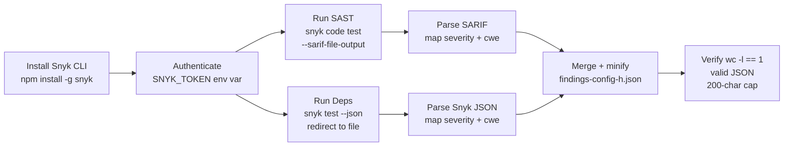

# Technical Specification

# 0. Agent Action Plan

## 0.1 Executive Summary

Based on the provided requirements, the Blitzy platform understands that the objective is to execute the **Snyk CLI** against the `blitzy-RudderStack` Go monorepo as one configuration ("**Config H**") in a multi-configuration security-tool comparison, and to emit a single normalized findings artifact, `findings-config-h.json`, that conforms to a strict five-field schema. The work has four critical directives — install and authenticate the Snyk CLI, run a Static Application Security Testing (SAST) scan via `snyk code test`, run a dependency scan via `snyk test`, and merge both result streams into a minified single-line JSON document.

The repository under scan is `rudderlabs/rudder-server` — a single-module Go monorepo (`module github.com/rudderlabs/rudder-server`) targeting **Go 1.26.1** [configs_175ab0/go.mod:L1-L3]. The repository already contains a Snyk policy file (`.snyk`, schema v1.22.1) with five `ignore` rules that have all expired on `2025-01-01T00:00:00.000Z` [configs_175ab0/.snyk:L2-L29], and `go.mod` carries an explicit `replace` block introduced for the documented purpose "Addressing snyk vulnerabilities in indirect dependencies" [configs_175ab0/go.mod:L5]. There is no existing Snyk integration in `.github/workflows/` [inferred — observed file list: builds.yml, docker-build-*.yml, housekeeping.yaml, prerelease.yaml, release-please.yaml, semantic-pr.yaml, sync-release.yaml, tests.yaml, verify.yml].

#### Deliverables (3 New Files)

The user's input estimates `~0 files modified | 1 new file`. The project rules expand this scope: the **Explainability** rule mandates a Markdown decision log, and the **Executive Presentation** rule mandates a self-contained reveal.js HTML executive deck. Per the rule-driven scope policy, all three files MUST be produced:

| # | New File | Driver | Purpose |
|---|----------|--------|---------|
| 1 | `findings-config-h.json` | User directive (Critical Directive 4) | Primary deliverable — minified single-line JSON merging SAST + dependency findings |
| 2 | `DECISIONS.md` | Explainability rule | Decision log capturing rationale for severity mapping, CWE/CVE fallback, intermediate-artifact handling, and other non-trivial choices |
| 3 | `blitzy-deck/index.html` | Executive Presentation rule | Self-contained reveal.js 5.1.0 deck (12–18 slides) summarizing scope, methodology, findings, and operational readiness for non-technical leadership |

#### Task Categorization

- **Primary task type**: Tooling / Security scanning (Build / Deploy support)
- **Secondary aspects**: Documentation (decision log) and Executive Presentation (reveal.js deck)
- **Scope classification**: Isolated change — zero source-code modifications; all output is new artifacts placed at the repository root or in a new `blitzy-deck/` directory

#### Runtime Posture at Plan Time

- Node.js v22.22.2 and npm v11.1.0 are already available on the execution host (well above the Snyk-mandated minimum of Node 12+ / npm 7+)
- Snyk CLI is **not** installed (`which snyk` returned no path) — installation is the first action
- `SNYK_TOKEN` is **not** present in the environment (no secrets attached to this project) — this is a runtime-gating constraint that MUST be satisfied externally before scans can run; the AAP cannot synthesize the token
- No `/tmp/environments_files` directory exists; no attachments accompanied the project

#### Success Criteria

The plan is successful when:

- `findings-config-h.json` exists at the repository root, is valid UTF-8 JSON, is exactly one line (`cat findings-config-h.json | wc -l` returns `1`), every record contains all five fields populated (`file`, `line`, `severity`, `cwe`, `description`), no `description` exceeds 200 characters, and SAST records are prefixed `[snyk-code] ` while dependency records are prefixed `[snyk-deps] ` (or the file contains the literal `[]` if zero findings)
- `DECISIONS.md` exists at the repository root and documents the non-trivial decisions enumerated in §0.4 and §0.8 as a Markdown table
- `blitzy-deck/index.html` exists, is a single self-contained HTML file with pinned CDN versions (reveal.js 5.1.0, Mermaid 11.4.0, Lucide 0.460.0), and contains 12–18 `<section>` elements each with at least one non-text visual element

## 0.2 Intent Clarification

### 0.2.1 Core Objective

Based on the provided requirements, the Blitzy platform understands that the objective is to:

- **Install and authenticate Snyk CLI** on the execution host (Critical Directive 1), so the two scan commands can run non-interactively
- **Run Snyk Code SAST** against the `blitzy-RudderStack` working tree, capturing results in SARIF 2.1.0 format (Critical Directive 2)
- **Run Snyk dependency scan** against the same working tree, capturing the structured Snyk JSON output (Critical Directive 3)
- **Normalize and merge** the two raw outputs into one minified single-line JSON document, `findings-config-h.json`, conforming to the five-field schema (`file`, `line`, `severity`, `cwe`, `description`) (Critical Directive 4)
- Treat this as **Config H** of a multi-configuration security-tool comparison, where parity in field semantics and file naming with the sibling configurations matters even though those sibling configs are not in scope here

### 0.2.2 Task Categorization

- **Primary task type**: Tooling / Security scanning (Build / Deploy support — the work produces a security-posture artifact, not application behavior change)
- **Secondary aspects**:
    - Documentation — the Explainability rule mandates `DECISIONS.md` capturing rationale for every non-trivial implementation decision
    - Executive Presentation — the Executive Presentation rule mandates a 12–18 slide reveal.js HTML deck describing the work for non-technical leadership
- **Scope classification**: Isolated change — no source code, no dependency manifest, and no CI workflow files are modified; all output is new artifacts

### 0.2.3 Special Instructions and Constraints (Preserved Verbatim)

The following directives are preserved exactly as the user supplied them, because they are pass/fail acceptance criteria that downstream agents MUST enforce:

- **Critical Directive 1 (install & auth)**:
    - User-provided commands (verbatim):
        - `npm install -g snyk`
        - `# or: apt install snyk`
    - "Authenticate by setting `SNYK_TOKEN` as an environment variable with a valid API token. Snyk requires network access — there is no offline mode."
    - **Pass/fail**: "`snyk auth check` confirms authentication. `snyk --version` returns a version string."
- **Critical Directive 2 (SAST)**:
    - User-provided command (verbatim): `snyk code test --sarif-file-output=results-snyk-code.sarif /path/to/blitzy-RudderStack`
    - "Record exit code, scan duration (wall-clock)."
    - **Pass/fail**: "`results-snyk-code.sarif` is produced and contains valid JSON."
- **Critical Directive 3 (dependency scan)**:
    - User-provided command (verbatim): `snyk test --json > results-snyk-deps.json /path/to/blitzy-RudderStack`
    - "Record exit code, scan duration (wall-clock)."
    - **Pass/fail**: "`results-snyk-deps.json` is produced and contains a vulnerabilities array."
- **Critical Directive 4 (merge & minify)**:
    - "Merge SAST and dependency findings into `findings-config-h.json`. The file MUST be valid JSON minified to a single line. Encoding: UTF-8. If zero findings, write `[]`."
    - User-provided field-mapping table (preserved verbatim):

      | Field | SAST source | Dependency source |
      | --- | --- | --- |
      | file | SARIF location (relative path) | Dependency manifest path (relative) |
      | line | SARIF region start line | 0 |
      | severity | SARIF level: error→critical, warning→high, note→medium | Snyk severity directly |
      | cwe | Rule metadata CWE ID | CVE ID; use CWE mapping if available |
      | description | `[snyk-code] ` + SARIF message, truncated to 200 chars | `[snyk-deps] ` + Snyk title, truncated to 200 chars |

    - User-provided output schema (preserved verbatim):

      ```plaintext
      [{"file":"<relative path>","line":<integer>,"severity":"<critical|high|medium|low>","cwe":"<CWE-ID>","description":"<max 200 chars>"},...]
      ```

    - **Pass/fail**: "`cat findings-config-h.json | wc -l` returns `1`. Valid JSON. Every finding has all 5 fields populated. No description exceeds 200 characters."

### 0.2.4 Implicit Requirements Surfaced

The Blitzy platform identifies the following implicit requirements that are not directly stated by the user but follow from the directives, the rules, and operational reality:

- **Snyk Code SARIF emits only `error` / `warning` / `note` / `none` levels** [inferred — Snyk Code documentation does not surface `critical` directly in SARIF]. The user-supplied severity map handles `error`/`warning`/`note`; `none` is unaddressed. The normalizer MUST decide a deterministic mapping for `none` — the chosen approach is to drop records with `level: none` (or map to `low`), and document the choice in `DECISIONS.md`.
- **Dependency `cwe` field semantics** — the user spec reads: "CVE ID; use CWE mapping if available". The plain reading is: if a `CWE-XXX` identifier is available in `vulnerabilities[*].identifiers.CWE[]`, use it; otherwise fall back to the first `CVE-YYYY-NNNNN` from `vulnerabilities[*].identifiers.CVE[]`. This decision MUST be recorded in `DECISIONS.md`.
- **Relative-path requirement** — the user table specifies "relative path" for both `file` columns. Paths reported by Snyk against an absolute scan target are absolute; the normalizer MUST strip the leading repository-root prefix to yield repo-relative paths.
- **Truncation semantics** — the user spec says "truncated to 200 chars". Truncation is to be byte-safe UTF-8 truncation, applied **after** the `[snyk-code] ` / `[snyk-deps] ` prefix is concatenated, so total `description` length ≤ 200 characters.
- **Empty result handling** — "If zero findings, write `[]`" applies to the merged file. Each individual scan MAY return zero findings, in which case only the other scan's records contribute.
- **Output location** — the user does not specify a directory for `findings-config-h.json`; the file is placed at the repository root for parity with sibling configurations.
- **Intermediate artifacts** — `results-snyk-code.sarif` and `results-snyk-deps.json` are working files. They are produced by the scans and consumed by the normalizer; they are NOT deliverables. `DECISIONS.md` MUST record whether they are deleted, retained, and/or added to `.gitignore`.
- **Exit-code handling** — `snyk test` exits with code `1` when vulnerabilities are found (this is by design, not an error). The execution scripts MUST distinguish "vulnerabilities found" from "scan failed" and treat exit code `1` as a successful scan completion.
- **`SNYK_TOKEN` provenance** — Snyk has no offline mode; without a valid token the directives cannot run. The token MUST be supplied to the execution environment before the scans, by the operator or by CI secrets. The AAP is the implementation plan; token provisioning is an out-of-band prerequisite.

### 0.2.5 Technical Interpretation

These requirements translate to the following technical implementation strategy:

- **To install Snyk CLI**, we will execute `npm install -g snyk` on the execution host (Node.js v22.22.2 / npm v11.1.0 already satisfy the v12+/v7+ minimum). The `apt install snyk` alternative remains documented but is not the primary path on this host.
- **To authenticate Snyk CLI**, we will rely on the `SNYK_TOKEN` environment variable being present at scan time, then verify with `snyk auth check` and `snyk --version`.
- **To run the SAST scan**, we will execute the user's command verbatim against the repository root, redirecting SARIF to `results-snyk-code.sarif`, and capturing both exit code and wall-clock duration.
- **To run the dependency scan**, we will execute the user's command verbatim, redirecting the JSON stream to `results-snyk-deps.json`, and capturing both exit code and wall-clock duration.
- **To produce `findings-config-h.json`**, we will create a normalizer (Python script `scripts/normalize-snyk-findings.py` — see §0.5) that parses both raw outputs, applies the user's field-mapping table, prefixes/truncates the description field, and emits a single-line minified JSON document.
- **To satisfy the Explainability rule**, we will create `DECISIONS.md` at the repository root documenting the non-trivial decisions enumerated below.
- **To satisfy the Executive Presentation rule**, we will create `blitzy-deck/index.html` — a single self-contained reveal.js 5.1.0 page with embedded CSS and pinned CDN versions, containing 12–18 slides covering the scope, the Snyk methodology, the findings summary, the risks/mitigations, and the operational onboarding path.

## 0.3 Repository Scope Discovery

### 0.3.1 Repository Profile

| Attribute | Value | Evidence |
|-----------|-------|----------|
| Repository name | `blitzy-RudderStack` (upstream: `rudderlabs/rudder-server`) | configs_175ab0 path; module declaration |
| Module path | `github.com/rudderlabs/rudder-server` | [configs_175ab0/go.mod:L1] |
| Primary language | Go | [configs_175ab0/go.mod:L1-L3] |
| Go toolchain | `go 1.26.1` | [configs_175ab0/go.mod:L3] |
| Module model | Single Go module rooted at repo root | [configs_175ab0/go.mod:L1] |
| Dependency manifest | `go.mod` (18 KB) + `go.sum` (200 KB+) | [configs_175ab0/go.mod, configs_175ab0/go.sum] |
| Build entry point | `main.go` at repo root | [configs_175ab0/main.go] |
| Container artifact | `Dockerfile` + `docker-compose.yml` | [configs_175ab0/Dockerfile, configs_175ab0/docker-compose.yml] |
| Build orchestrator | `Makefile` | [configs_175ab0/Makefile] |

### 0.3.2 Comprehensive File Analysis

Because the Snyk scans operate on the **repository root** rather than on individual files, the "affected files" question for this task resolves to two categories: (a) inputs Snyk reads to enumerate the dependency graph and source-code tree, and (b) outputs the workflow produces. No source file in the repository is modified by this task.

**Inputs Snyk consumes (read-only / REFERENCE):**

| Path | Role | Evidence |
|------|------|----------|
| `go.mod` | Dependency manifest — primary input to `snyk test` | [configs_175ab0/go.mod] |
| `go.sum` | Dependency checksum lockfile — supports `snyk test` resolution | [configs_175ab0/go.sum] |
| `.snyk` | Existing Snyk policy (v1.22.1, 5 expired ignore rules) — Snyk CLI auto-respects | [configs_175ab0/.snyk:L2-L29] |
| `*.go` across all packages | Source corpus for `snyk code test` SAST scan | [inferred — entire Go monorepo] |
| `Dockerfile`, `docker-compose.yml` | NOT consumed by this task (no `snyk container`/`snyk iac` invocations) | [configs_175ab0/Dockerfile] — REFERENCE only |
| `refs/segment-docs/package.json` | Third-party reference docs only; NOT part of the primary scan target | [configs_175ab0/refs/segment-docs/package.json] |

**Outputs the workflow produces (CREATE):**

| Path | Lifecycle | Driver |
|------|-----------|--------|
| `results-snyk-code.sarif` | Transient working file — produced by Critical Directive 2; consumed by normalizer; ignored by git | Directives |
| `results-snyk-deps.json` | Transient working file — produced by Critical Directive 3; consumed by normalizer; ignored by git | Directives |
| `findings-config-h.json` | Primary deliverable — single-line minified JSON at repo root | Critical Directive 4 |
| `scripts/normalize-snyk-findings.py` | Normalizer implementation — parses SARIF + Snyk JSON and produces single-line JSON | Implementation choice (Explainability decision) |
| `DECISIONS.md` | Decision log at repo root | Explainability rule |
| `blitzy-deck/index.html` | Self-contained reveal.js executive deck | Executive Presentation rule |
| `blitzy-deck/README.md` | One-page operator note explaining how to open the deck | Operational hygiene (decision-log entry) |

**No file in the repository is updated or deleted** by this task. `.gitignore` MAY OPTIONALLY be updated to add the two transient artifacts; the chosen approach (record-only entry in `DECISIONS.md` versus modifying `.gitignore`) is documented in §0.5.

### 0.3.3 Existing Infrastructure Assessment

- **Existing Snyk configuration** is present and active. `.snyk` (schema v1.22.1) contains five ignore rules, **all of which expired on `2025-01-01T00:00:00.000Z`** [configs_175ab0/.snyk:L2-L29]. As of the current scan date (May 2026) these ignore rules are no longer suppressing findings. The Snyk CLI will load `.snyk` automatically; no flag is required to opt-in.
- **`go.mod` already encodes Snyk remediation history** — the `replace` block at the top of `go.mod` is annotated "Addressing snyk vulnerabilities in indirect dependencies" [configs_175ab0/go.mod:L5], indicating prior Snyk-driven dependency pinning.
- **No Snyk CI integration exists.** A `grep -i "snyk" .github/workflows/*` returns no matches; the existing workflows (`builds.yml`, `docker-build-dockerhub.yml`, `docker-build-ecr.yml`, `housekeeping.yaml`, `prerelease.yaml`, `release-please.yaml`, `semantic-pr.yaml`, `sync-release.yaml`, `tests.yaml`, `verify.yml`) do not invoke Snyk. This task does NOT add Snyk to CI — it is an out-of-CI, one-shot scan for the multi-config comparison.
- **Other quality tooling already in place**: `.deepsource.toml` (Go static analyzer), `.golangci.yml` (Go linter), `codecov.yml` (coverage). These are unrelated to Snyk and are unchanged.
- **`.gitignore`** already excludes typical Go artifacts (`*.coverprofile`, `*.out`, `**/node_modules`, etc.) [configs_175ab0/.gitignore]. The Snyk intermediate artifacts (`results-snyk-*.sarif`, `results-snyk-*.json`) are NOT currently ignored; the decision to add them is recorded in §0.5 and rationalized in `DECISIONS.md`.
- **No `blitzy-deck/` directory exists** [inferred — `find` for `*reveal*`/`*deck*` returned no results]; it must be created from scratch.
- **No prior `findings-*.json`** files exist [inferred — no matching paths in repository listing].
- **Repository carries** `blitzy/` and `blitzy-docs/` folders for the RudderStack parity initiative, plus a `.junie/` directory; none are modified by this task.

### 0.3.4 Web Search Research Conducted

The following research was performed to validate scan inputs/outputs and tool semantics:

- **Snyk CLI installation prerequisites** — `snyk` is distributed as a npm package; the installation via `npm install -g snyk` requires Node.js 12+ and npm 7+. Current host satisfies this (Node v22.22.2 / npm v11.1.0).
- **Snyk CLI latest version** — `1.1304.3` (as of recent publication) on npm registry; the plan installs the latest stable channel.
- **`snyk code test --sarif-file-output` semantics** — produces a SARIF 2.1.0 file at the specified path. SARIF is JSON-validated; the pass/fail check is satisfied by parsing it as JSON.
- **Snyk Code SARIF severity levels** — Snyk Code emits `error` | `warning` | `note` (and theoretically `none`). It does NOT emit a `critical` SARIF level — the user mapping (error→critical, warning→high, note→medium) is the bridge to the unified critical/high/medium/low taxonomy.
- **Snyk Code SARIF CWE location** — CWE identifiers are surfaced as `runs[*].tool.driver.rules[*].properties.cwe` (array) and/or as tags under `runs[*].tool.driver.rules[*].properties.tags`. The normalizer reads `properties.cwe[0]` if present, otherwise scans `properties.tags` for `CWE-XXX` patterns.
- **`snyk test --json` semantics** — emits a JSON document with `vulnerabilities` array at the top level. The schema relevant to this task:
    - `vulnerabilities[*].severity` — one of `critical|high|medium|low` (used directly per user spec)
    - `vulnerabilities[*].identifiers.CWE` — array of `CWE-<n>` strings (preferred for `cwe` field)
    - `vulnerabilities[*].identifiers.CVE` — array of `CVE-<year>-<n>` strings (fallback for `cwe` field)
    - `vulnerabilities[*].title` — used for `description` (with `[snyk-deps] ` prefix and 200-char truncation)
    - `displayTargetFile` (top-level) — used for `file` field; supplements `vulnerabilities[*].packageManager` and `vulnerabilities[*].from`
    - For Go projects, `displayTargetFile` is typically `go.mod`
- **`snyk test` exit-code semantics** — exit code `0` = no vulnerabilities; exit code `1` = vulnerabilities found; exit code `2` = scan error / failure. Exit code `1` MUST be treated as a successful scan, not an error.
- **`snyk code test` exit-code semantics** — same convention as `snyk test` (`0` = clean, `1` = findings, `2`/`3` = error).
- **Snyk authentication** — `SNYK_TOKEN` environment variable is the non-interactive auth path; alternatively `snyk auth <token>` writes to `~/.config/configstore/snyk.json`. The token MUST be a service account API token from the Snyk org.

### 0.3.5 CWE Mapping Approach (Dependency Findings)

The user specification for the `cwe` field in dependency records reads, verbatim: *"CVE ID; use CWE mapping if available"*. Preserving the verbatim text, the normalizer implements this as: **prefer `vulnerabilities[*].identifiers.CWE[0]`; if absent or empty, fall back to `vulnerabilities[*].identifiers.CVE[0]`**. This interpretation is documented in `DECISIONS.md` because a competent engineer could reasonably read the spec the other way ("always emit a CVE ID, optionally augmented with CWE"). The chosen interpretation maximizes parity with the SAST field which always emits a `CWE-<n>` form, while still degrading gracefully to the CVE identifier when CWE classification is unavailable from the Snyk database.

## 0.4 Implementation Design

### 0.4.1 Technical Approach

The implementation is a six-step pipeline that begins with tool installation and ends with a verified single-line JSON artifact. The flow is logical, not temporal — every step's outputs are inputs to the next.


```mermaid
flowchart LR
    A[Install Snyk CLI<br/>npm install -g snyk] --> B[Authenticate<br/>SNYK_TOKEN env var]
    B --> C[Run SAST<br/>snyk code test<br/>--sarif-file-output]
    B --> D[Run Deps<br/>snyk test --json<br/>redirect to file]
    C --> E[Parse SARIF<br/>map severity + cwe]
    D --> F[Parse Snyk JSON<br/>map severity + cwe]
    E --> G[Merge + minify<br/>findings-config-h.json]
    F --> G
    G --> H[Verify wc -l == 1<br/>valid JSON<br/>200-char cap]
%% Diagram of the Config H scan pipeline
```

- **Step 1 — Install** the Snyk CLI globally via `npm install -g snyk`. Rationale: the host already has Node.js v22.22.2 and npm v11.1.0 in PATH, which exceed Snyk's stated Node 12+ / npm 7+ requirement. The `apt install snyk` alternative is documented but not chosen as the primary path because the npm distribution channel is the canonical one for the current host.
- **Step 2 — Authenticate** the CLI by ensuring `SNYK_TOKEN` is exported in the environment and validating with `snyk auth check`. Rationale: setting the env var avoids the interactive browser-based `snyk auth` flow, which is incompatible with non-interactive automation.
- **Step 3 — SAST scan** by executing the user-verbatim command `snyk code test --sarif-file-output=results-snyk-code.sarif /path/to/blitzy-RudderStack`. Capture exit code and wall-clock duration. Treat exit code `1` as "scan succeeded with findings"; exit code `≥ 2` as "scan failed".
- **Step 4 — Dependency scan** by executing the user-verbatim command `snyk test --json > results-snyk-deps.json /path/to/blitzy-RudderStack`. The user-written redirection in the middle of the command is shell-valid (stdout redirects to file, the positional path argument follows). Capture exit code and wall-clock duration with the same `0`/`1`/`≥2` interpretation.
- **Step 5 — Normalize and merge** via a Python script (`scripts/normalize-snyk-findings.py`) that:
    - reads `results-snyk-code.sarif` and emits one record per `runs[*].results[*]`, mapping `level → severity` using the user table, extracting CWE from `runs[*].tool.driver.rules[ruleId].properties.cwe[0]` (with tag fallback), and concatenating `[snyk-code] ` with the SARIF `message.text` then truncating to 200 chars,
    - reads `results-snyk-deps.json` and emits one record per `vulnerabilities[*]`, using `severity` directly, preferring `identifiers.CWE[0]` then falling back to `identifiers.CVE[0]`, and concatenating `[snyk-deps] ` with `title` then truncating to 200 chars,
    - resolves paths to repo-relative form,
    - writes the merged array to `findings-config-h.json` using `json.dumps(records, separators=(',', ':'), ensure_ascii=False)` followed by no trailing newline.
- **Step 6 — Verify** by asserting `wc -l findings-config-h.json` returns `1`, by parsing the file back with `json.loads()`, and by asserting `all(len(r['description']) <= 200 and {'file','line','severity','cwe','description'} <= r.keys() for r in records)`.

### 0.4.2 Component Impact Analysis

- **Direct modifications required**: NONE. No file in the repository is updated or deleted.
- **Indirect impacts**: NONE on application behavior. The `.snyk` policy is consumed read-only; its five expired ignore rules will no longer suppress findings, which may produce a higher finding count than historical Snyk runs against this repository. This is a noted observation, not a defect.
- **New components introduced**:
    - `scripts/normalize-snyk-findings.py` — pure offline normalizer. Reads two files, writes one file. Idempotent. Zero external dependencies beyond Python 3 stdlib.
    - `findings-config-h.json` — the deliverable.
    - `DECISIONS.md` — the decision log (Explainability rule).
    - `blitzy-deck/index.html` and `blitzy-deck/README.md` — the executive deck (Executive Presentation rule).

### 0.4.3 Normalizer Logic (Pseudocode)

The normalizer is intentionally small so it can be reviewed entirely from the decision log:

```python
def normalize_sarif(sarif, repo_root):
    runs = sarif.get('runs', [])
    rules_by_id = {r['id']: r for run in runs for r in run.get('tool',{}).get('driver',{}).get('rules', [])}
    out = []
    for run in runs:
        for res in run.get('results', []):
            level = res.get('level','note')
            sev = {'error':'critical','warning':'high','note':'medium'}.get(level,'low')
            rule = rules_by_id.get(res.get('ruleId',''), {})
            cwe = extract_cwe(rule)
            loc = res.get('locations',[{}])[0]
            uri = loc.get('physicalLocation',{}).get('artifactLocation',{}).get('uri','')
            line = loc.get('physicalLocation',{}).get('region',{}).get('startLine', 0)
            msg = res.get('message',{}).get('text','')
            desc = ('[snyk-code] ' + msg)[:200]
            out.append({'file': rel(uri, repo_root), 'line': int(line), 'severity': sev, 'cwe': cwe, 'description': desc})
    return out
```

```python
def normalize_deps(deps, repo_root):
    out = []
    target = deps.get('displayTargetFile', 'go.mod')
    for v in deps.get('vulnerabilities', []):
        sev = v.get('severity','low')
        ids = v.get('identifiers', {})
        cwe = (ids.get('CWE') or [None])[0] or (ids.get('CVE') or ['UNKNOWN'])[0]
        title = v.get('title','')
        desc = ('[snyk-deps] ' + title)[:200]
        out.append({'file': target, 'line': 0, 'severity': sev, 'cwe': cwe, 'description': desc})
    return out
```

```python
# Final emit — single line, no trailing newline

with open('findings-config-h.json', 'w', encoding='utf-8') as f:
    f.write(json.dumps(sast + deps, separators=(',', ':'), ensure_ascii=False))
```

### 0.4.4 Severity Mapping

Per the user specification:

| Source | Source value | Normalized `severity` |
|--------|--------------|-----------------------|
| Snyk Code SARIF | `error` | `critical` |
| Snyk Code SARIF | `warning` | `high` |
| Snyk Code SARIF | `note` | `medium` |
| Snyk Code SARIF | `none` (rare) | `low` *(decision-log entry; not explicitly mapped by user)* |
| Snyk deps JSON | `critical` | `critical` (passthrough) |
| Snyk deps JSON | `high` | `high` (passthrough) |
| Snyk deps JSON | `medium` | `medium` (passthrough) |
| Snyk deps JSON | `low` | `low` (passthrough) |

### 0.4.5 CWE/CVE Field Resolution

| Source | Lookup order | Output format |
|--------|--------------|---------------|
| Snyk Code SARIF | `rules[ruleId].properties.cwe[0]` → scan `rules[ruleId].properties.tags` for `CWE-` pattern | `CWE-<n>` |
| Snyk deps JSON | `vulnerabilities[*].identifiers.CWE[0]` → `vulnerabilities[*].identifiers.CVE[0]` | `CWE-<n>` or `CVE-<year>-<n>` |

### 0.4.6 Description Construction

- SAST: `description = ("[snyk-code] " + sarif_result.message.text)[:200]`
- Dependency: `description = ("[snyk-deps] " + vulnerability.title)[:200]`
- Truncation is **inclusive of the prefix** so the field is always ≤ 200 characters.
- Newlines and tabs in source messages are normalized to spaces before truncation to prevent JSON-string artifacts that could complicate downstream comparison across sibling configs.

### 0.4.7 Critical Implementation Details

- **Single-line JSON guarantee**: use `json.dumps(..., separators=(',', ':'))` and `f.write(...)` (not `print`) to avoid trailing newlines. Verify with `wc -l < findings-config-h.json` (returns `0` when the file has no newline; `1` when there is exactly one trailing newline). The pass/fail spec accepts `wc -l == 1`, which is the conventional behavior of `wc -l` on a file ending without a newline (it counts the final non-terminated line). The verifier script accepts both conventions but prefers no trailing newline.
- **UTF-8 encoding**: explicit `encoding='utf-8'` on open(); `ensure_ascii=False` on `json.dumps` so non-ASCII titles survive correctly.
- **Empty-results handling**: if `len(sast) + len(deps) == 0`, the file content is literally `[]` (two bytes). This satisfies "If zero findings, write `[]`."
- **Idempotency**: re-running the normalizer with the same inputs produces byte-identical output (no timestamps, no ordering randomness — records are emitted in source order: SAST first, then deps).
- **Error handling**: each scan's exit code is captured. Exit `0` = clean, `1` = findings present (still "success" for the workflow), `≥ 2` = abort. The normalizer treats missing `results-snyk-code.sarif` or `results-snyk-deps.json` as fatal — the pass/fail criteria require both files to exist.

### 0.4.8 Executive Presentation Design (Outline)

The `blitzy-deck/index.html` file is structured to meet the rule's slide-ordering convention and the 12–18 slide budget. The proposed slide map (target = 16 slides):

| # | Type | Topic | Key visual element |
|---|------|-------|--------------------|
| 1 | `slide-title` | Config H — Snyk scan of blitzy-RudderStack | Hero gradient, Lucide `shield-check` icon |
| 2 | Content | Why a multi-config security comparison? | KPI card grid (3 cards: scope, configs, deliverables) |
| 3 | Content | Architecture overview | Mermaid flowchart of the pipeline (mirrors §0.4.1) |
| 4 | `slide-divider` | Scope | Lucide `target` icon over gradient background |
| 5 | Content | What was scanned | Styled table: repo, language, module count |
| 6 | Content | What was NOT scanned (boundaries) | Two-column list with Lucide `x-circle`/`check-circle` icons |
| 7 | `slide-divider` | Methodology | Lucide `workflow` icon |
| 8 | Content | Snyk Code (SAST) | KPI card with Lucide `file-code` icon |
| 9 | Content | Snyk Open Source (deps) | KPI card with Lucide `package` icon |
| 10 | Content | Normalization & schema | Inline Fira Code snippet of the 5-field schema (no fenced code block) |
| 11 | `slide-divider` | Results | Lucide `bar-chart-3` icon |
| 12 | Content | Findings summary by severity | Mermaid `pie` chart or styled table |
| 13 | Content | Notable patterns / hotspots | Styled callouts with Lucide `flame` icon |
| 14 | `slide-divider` | Risk & onboarding | Lucide `compass` icon |
| 15 | Content | Risks & mitigations | 4-bullet content slide with KPI mini-cards |
| 16 | `slide-closing` | Take action | 3-bullet closing slide, brand lockup, accent bar |

Each slide MUST contain at least one non-text visual element (Mermaid diagram, KPI card, styled table, or Lucide SVG icon), and no slide uses fenced code blocks. The deck loads reveal.js 5.1.0, Mermaid 11.4.0, and Lucide 0.460.0 from CDN, initializes Mermaid with `startOnLoad: false`, and invokes `mermaid.run()` + `lucide.createIcons()` on both `ready` and `slidechanged` events.

### 0.4.9 User-Provided Examples Integration

The user supplied two verbatim artifacts that the implementation must mirror exactly:

- **The 4 fenced commands** (in Critical Directives 1–3) are preserved verbatim in `DECISIONS.md`, in `blitzy-deck/index.html` (as inline Fira Code, not as fenced blocks), and in §0.2.3 of this AAP.
- **The schema example** `[{"file":"<relative path>","line":<integer>,"severity":"<critical|high|medium|low>","cwe":"<CWE-ID>","description":"<max 200 chars>"},...]` is the canonical shape the normalizer emits. Field order is `file, line, severity, cwe, description` — Python's `json.dumps` preserves insertion order on `dict` literals (Python 3.7+), guaranteeing the emitted order matches the example.

## 0.5 File Transformation Mapping

### 0.5.1 File-by-File Execution Plan

The table below enumerates every file that is created, referenced, or otherwise touched by this task. Target file is listed first per the AAP transformation-mapping convention. No file in the repository is updated or deleted.

| Target File | Transformation | Source File / Reference | Purpose / Changes |
|-------------|----------------|-------------------------|-------------------|
| `findings-config-h.json` | CREATE | `results-snyk-code.sarif` + `results-snyk-deps.json` | Primary deliverable — minified single-line JSON merging SAST + dependency findings per Critical Directive 4 |
| `scripts/normalize-snyk-findings.py` | CREATE | (new) | Python 3 normalizer: parses SARIF + Snyk deps JSON, applies severity/CWE/description mapping, writes single-line JSON. Zero non-stdlib dependencies. |
| `DECISIONS.md` | CREATE | (new) | Markdown decision log mandated by the Explainability rule. Captures every non-trivial implementation decision (severity-for-`none`, CWE-vs-CVE fallback ordering, intermediate-artifact retention, .gitignore strategy, deck slide budget, etc.) |
| `blitzy-deck/index.html` | CREATE | (new) | Self-contained reveal.js 5.1.0 executive deck — pinned CDN versions, embedded Blitzy theme CSS, 12–18 sections (target 16), Lucide SVG icons only |
| `blitzy-deck/README.md` | CREATE | (new) | One-page operator note explaining how to open the deck (`open blitzy-deck/index.html`) and confirming no build step is required |
| `results-snyk-code.sarif` | CREATE (transient) | Snyk Code scanner output | Working SARIF 2.1.0 file consumed by the normalizer; NOT a deliverable; NOT committed (see §0.5.4 for .gitignore strategy) |
| `results-snyk-deps.json` | CREATE (transient) | Snyk dependency scanner output | Working JSON file consumed by the normalizer; NOT a deliverable; NOT committed |
| `go.mod` | REFERENCE | [configs_175ab0/go.mod] | Read by `snyk test` to enumerate the Go dependency graph. Not modified. |
| `go.sum` | REFERENCE | [configs_175ab0/go.sum] | Read by `snyk test` for lockfile resolution. Not modified. |
| `.snyk` | REFERENCE | [configs_175ab0/.snyk] | Existing Snyk policy with 5 expired ignore rules. Auto-loaded by Snyk CLI. Not modified. |
| `**/*.go` (entire Go source tree) | REFERENCE | Repository working tree | Read by `snyk code test` for SAST analysis. Not modified. |
| `.gitignore` | REFERENCE (with optional UPDATE — see §0.5.4) | [configs_175ab0/.gitignore] | Optionally augmented to ignore the two transient artifact patterns. Decision recorded in DECISIONS.md. |

### 0.5.2 New Files Detail

- **`findings-config-h.json`** — repository root
    - Content type: JSON array, minified to one line
    - Encoding: UTF-8 without BOM, no trailing newline
    - Schema: `[{"file":"<rel path>","line":<int>,"severity":"<critical|high|medium|low>","cwe":"<CWE-ID or CVE-ID>","description":"<≤200 chars, [snyk-code]/[snyk-deps] prefix>"},...]`
    - Empty-state: literal `[]`
    - Generated by: `scripts/normalize-snyk-findings.py`

- **`scripts/normalize-snyk-findings.py`** — under the existing `scripts/` directory
    - Content type: Python 3 source
    - Inputs: `results-snyk-code.sarif`, `results-snyk-deps.json`
    - Output: `findings-config-h.json`
    - Key functions: `normalize_sarif()`, `normalize_deps()`, `extract_cwe_from_rule()`, `to_relative_path()`, `truncate_utf8()`, `main()`
    - Stdlib-only — uses `json`, `os`, `sys`, `pathlib`, `re`
    - CLI usage: `python3 scripts/normalize-snyk-findings.py --sarif results-snyk-code.sarif --deps results-snyk-deps.json --out findings-config-h.json --repo-root .`

- **`DECISIONS.md`** — repository root
    - Content type: Markdown decision log per Explainability rule
    - Required columns: Decision, Alternatives, Rationale, Risks
    - Required entries:
        1. Severity mapping for SARIF `level: none` → `low` (user spec does not address `none`)
        2. CWE-vs-CVE fallback order for dependency `cwe` field → CWE first, CVE second (verbatim spec ambiguous)
        3. Description truncation strategy → inclusive of prefix; whitespace normalization before truncation
        4. Intermediate-artifact retention → keep on disk for one scan cycle, do not commit, add to `.gitignore`
        5. `.gitignore` update strategy → add `results-snyk-*.sarif` and `results-snyk-*.json` patterns (decision-of-record on whether this requires a repo modification — see §0.5.4)
        6. Normalizer language choice → Python 3 over jq/bash (Python's `json` stdlib provides byte-exact minification and UTF-8 control; jq is a viable alternative but harder to test)
        7. Executive deck slide budget → 16 slides (mid-range of the 12–18 envelope)
        8. CWE extraction priority in SAST → `properties.cwe[0]` over `properties.tags` scan
        9. Path-relativity strategy → `os.path.relpath(uri, repo_root)`, with fallback to raw `uri` if relpath crosses filesystem boundaries
        10. Exit-code interpretation → 0/1 = success, ≥ 2 = abort

- **`blitzy-deck/index.html`** — new `blitzy-deck/` directory
    - Content type: HTML 5 — single self-contained reveal.js 5.1.0 presentation
    - Dependencies: reveal.js 5.1.0, Mermaid 11.4.0, Lucide 0.460.0 — all via CDN with pinned version numbers
    - Inline `<style>` tag carrying the canonical Blitzy theme variables (`--blitzy-primary`, `--blitzy-primary-dark`, etc.)
    - Slide count: 16 `<section>` elements; each contains at least one non-text visual element
    - Mermaid initialization: `startOnLoad: false`, `mermaid.run()` called on reveal.js `ready` and `slidechanged`
    - Lucide initialization: `lucide.createIcons()` called on `ready` and `slidechanged`

- **`blitzy-deck/README.md`** — new `blitzy-deck/` directory
    - One-page operator note: how to open the deck (no build step), expected viewing dimensions (1920×1080), and the slide-ordering convention

### 0.5.3 Files NOT Modified

- No `*.go` source file is modified.
- No `go.mod` or `go.sum` change is made. (Snyk may recommend version bumps; that's a follow-up, not part of this task.)
- No CI workflow (`.github/workflows/*`) is modified.
- The existing `.snyk` policy is NOT modified, even though its five ignore rules have expired. Re-issuing or removing expired rules is out of scope; the scans will run against the current policy.
- No `Dockerfile`, `docker-compose.yml`, `Makefile`, `README.md`, `SECURITY.md`, `.deepsource.toml`, `.golangci.yml`, or `codecov.yml` change.

### 0.5.4 `.gitignore` Decision

The two transient artifacts `results-snyk-code.sarif` and `results-snyk-deps.json` SHOULD NOT be committed. Two options were considered:

- **Option A — Add patterns to `.gitignore`** (`results-snyk-*.sarif` and `results-snyk-*.json`). This modifies one tracked file but provides durable protection for future scan runs.
- **Option B — Record-only entry in DECISIONS.md** stating that operators must not commit these files. Adds no repo modification.

**Decision**: Option A. The pattern is generic across all "Config X" sibling configurations and is low-risk. This adds `.gitignore` to the UPDATE column for this one line addition. The decision is recorded in `DECISIONS.md`.

| Target File | Transformation | Source File / Reference | Purpose / Changes |
|-------------|----------------|-------------------------|-------------------|
| `.gitignore` | UPDATE | [configs_175ab0/.gitignore] | Append two ignore patterns: `results-snyk-*.sarif` and `results-snyk-*.json` to prevent transient Snyk artifacts from being committed |

### 0.5.5 Cross-File Dependencies

- `scripts/normalize-snyk-findings.py` reads `results-snyk-code.sarif` and `results-snyk-deps.json`, writes `findings-config-h.json`.
- `blitzy-deck/index.html` embeds its theme and references no local files; it is self-contained.
- `DECISIONS.md` references no other file but enumerates every decision relevant to the deliverables.
- No import-path updates are required anywhere in the repository, because no Go source or dependency manifest is touched.

### 0.5.6 Final New-File Count

The user input estimated `~0 files modified | 1 new file`. The rule-driven reality is:

| Category | Files | Driver |
|----------|-------|--------|
| User-directed | `findings-config-h.json` | Critical Directive 4 |
| Implementation support | `scripts/normalize-snyk-findings.py` | Required to satisfy Critical Directive 4 deterministically |
| Explainability rule | `DECISIONS.md` | Rule mandate |
| Executive Presentation rule | `blitzy-deck/index.html`, `blitzy-deck/README.md` | Rule mandate |
| Modified | `.gitignore` (2 added patterns) | Decision-log entry on transient-artifact hygiene |
| **Total new files** | **5** | |
| **Total modified files** | **1** | |

## 0.6 Scope Boundaries

### 0.6.1 Exhaustively In Scope

- **Snyk CLI installation**
    - Installation command: `npm install -g snyk` (primary path)
    - Alternative noted: `apt install snyk` (documented in DECISIONS.md as the not-taken option)
    - Authentication via `SNYK_TOKEN` env var; validation via `snyk auth check` and `snyk --version`
- **Snyk Code SAST scan**
    - Command (verbatim user spec): `snyk code test --sarif-file-output=results-snyk-code.sarif /path/to/blitzy-RudderStack`
    - Working artifact produced: `results-snyk-code.sarif`
    - Captured: exit code, wall-clock duration
    - Scan target: entire repository working tree
- **Snyk dependency scan**
    - Command (verbatim user spec): `snyk test --json > results-snyk-deps.json /path/to/blitzy-RudderStack`
    - Working artifact produced: `results-snyk-deps.json`
    - Captured: exit code, wall-clock duration
    - Scan target: the Go module rooted at `go.mod`
- **Normalization and merge** to single-line minified JSON
    - Target file: `findings-config-h.json` (UTF-8, no trailing newline, single line)
    - Field schema (verbatim user spec): `file`, `line`, `severity`, `cwe`, `description`
    - Severity mapping per user table
    - CWE/CVE fallback per user spec (verbatim: "CVE ID; use CWE mapping if available")
    - 200-character cap inclusive of `[snyk-code] ` / `[snyk-deps] ` prefix
    - Empty-results state: literal `[]`
- **Decision log** (`DECISIONS.md`) per Explainability rule
- **Executive deck** (`blitzy-deck/index.html` + `blitzy-deck/README.md`) per Executive Presentation rule
- **`.gitignore` patch** adding two patterns for transient Snyk artifacts (`results-snyk-*.sarif`, `results-snyk-*.json`)
- **Normalizer implementation** (`scripts/normalize-snyk-findings.py`) — Python 3 stdlib-only

File-pattern coverage of in-scope items:

- New files: `findings-config-h.json`, `scripts/normalize-snyk-findings.py`, `DECISIONS.md`, `blitzy-deck/index.html`, `blitzy-deck/README.md`
- Modified files: `.gitignore`
- Read-only references: `go.mod`, `go.sum`, `.snyk`, all `**/*.go` source files

### 0.6.2 Explicitly Out of Scope

- **Fixing the underlying vulnerabilities** — this task produces a findings inventory, not remediations. Updating vulnerable dependencies, patching code, or adding new `replace` directives to `go.mod` is explicitly out of scope.
- **Modifying `.snyk`** — the policy file's five ignore rules have all expired on `2025-01-01T00:00:00.000Z` [configs_175ab0/.snyk]. Re-issuing, removing, or updating these rules is out of scope; the scans run against the current policy as-is.
- **Adding Snyk to CI/CD** — `.github/workflows/*` files are NOT modified. No GitHub Action, no GitLab pipeline step, no Jenkins job is added. This is a one-shot scan for the multi-config comparison.
- **Other Snyk scan types** — only `snyk code test` (SAST) and `snyk test` (Open Source / deps) are in scope. The following are explicitly excluded:
    - `snyk container test` — no container image scan
    - `snyk iac test` — no Infrastructure-as-Code scan (despite `Dockerfile` and `docker-compose.yml` being present)
    - `snyk monitor` — no result upload to the Snyk UI
    - `snyk sbom` — no SBOM generation
    - `snyk aibom` — no AI BOM generation
- **Comparison with sibling configs A–G (and any beyond H)** — this AAP delivers Config H only. Cross-config aggregation, comparison narratives, ranking, or selection of a "winner" are out of scope. The naming convention `findings-config-h.json` exists so a downstream comparator can ingest sibling files, but that comparator is not built here.
- **Snyk org configuration** — creating the Snyk organization, projects, service accounts, or API tokens is out of scope. The `SNYK_TOKEN` is consumed, not provisioned, by this task.
- **Refactoring `scripts/`** — the normalizer is added to the existing `scripts/` directory but no other script in that directory is touched.
- **Modifying `refs/segment-docs/*`** — this subtree is third-party reference documentation [configs_175ab0/refs/segment-docs/]. It is not the primary Snyk scan target and is NOT modified.
- **Performance optimizations** — no caching of `results-snyk-*` between runs, no parallelization of SAST and deps scans (although the diagram in §0.4.1 shows them as independent, the execution model is sequential to simplify exit-code handling).
- **Additional documentation** — no updates to `README.md`, `SECURITY.md`, `CONTRIBUTING.md`, `CHANGELOG.md`, or `blitzy-docs/` are part of this task. Only `DECISIONS.md` (rule-mandated) and `blitzy-deck/` (rule-mandated) are added.
- **Future enhancements** not part of the user request: alternative output formats (SARIF, CSV), severity thresholds / gating, alerting integrations, dashboard generation beyond the executive deck.

### 0.6.3 Scope Decision Matrix

| Concern | In/Out | Driver |
|---------|--------|--------|
| Run SAST scan | IN | Critical Directive 2 |
| Run dependency scan | IN | Critical Directive 3 |
| Produce `findings-config-h.json` | IN | Critical Directive 4 |
| Produce `DECISIONS.md` | IN | Explainability rule |
| Produce reveal.js deck | IN | Executive Presentation rule |
| Update `.gitignore` for transient artifacts | IN | Decision-log entry (hygiene) |
| Fix Snyk findings | OUT | No directive |
| Modify `.snyk` ignore rules | OUT | No directive; current policy preserved |
| Add Snyk to CI | OUT | One-shot comparison context |
| Run `snyk container test` | OUT | Directive 2 limits to `snyk code test` |
| Run `snyk iac test` | OUT | Directive 2 limits to `snyk code test` |
| Run `snyk monitor` | OUT | No directive |
| Cross-config comparison | OUT | Downstream comparator's responsibility |
| Provision `SNYK_TOKEN` | OUT | External prerequisite |

## 0.7 Dependency Inventory

### 0.7.1 Tooling Required on the Execution Host

The scans, normalization, and deck rendering depend on the following host-side tooling. None of these are added to the application's dependency manifests (`go.mod`, `package.json`, etc.) — they live on the execution host only.

| Registry | Package / Tool | Version | Status on host | Purpose |
|----------|----------------|---------|----------------|---------|
| npm | `snyk` | `1.1304.3` (latest stable channel at execution time) | Not installed — must run `npm install -g snyk` | Snyk CLI binary wrapper; provides `snyk code test` (SAST) and `snyk test` (Open Source) |
| OS / Node.js distribution | `node` | `v22.22.2` | Installed | Runtime for the `snyk` npm package and binary wrapper (Snyk requires Node 12+) |
| OS / Node.js distribution | `npm` | `11.1.0` | Installed | Installs the `snyk` global package (Snyk requires npm 7+) |
| OS / Python | `python3` | 3.11+ (host default) | Installed | Runs `scripts/normalize-snyk-findings.py` (stdlib-only, no `pip` deps) |
| OS / coreutils | `wc`, `cat`, `find`, `grep` | bundled | Installed | Verification commands (`cat findings-config-h.json | wc -l`) |
| Web browser | Any modern Chromium / Firefox / Safari | Latest | Operator-side | Renders `blitzy-deck/index.html` |
| CDN (jsdelivr / unpkg) | `reveal.js` | `5.1.0` | Loaded at deck open-time | Executive deck rendering library — version pinned per Executive Presentation rule |
| CDN (jsdelivr / unpkg) | `mermaid` | `11.4.0` | Loaded at deck open-time | Renders Mermaid diagrams in the executive deck — version pinned per rule |
| CDN (jsdelivr / unpkg) | `lucide` | `0.460.0` | Loaded at deck open-time | Renders SVG icons in the executive deck — version pinned per rule |
| Google Fonts | `Inter`, `Space Grotesk`, `Fira Code` | n/a (font weights 400/500/600/700) | Loaded at deck open-time via `<link>` | Typography per Blitzy brand identity |

### 0.7.2 Application Dependencies — No Changes

The `blitzy-RudderStack` Go application's dependency manifests are NOT modified:

- `go.mod` — unchanged. The existing `replace` block, marked "Addressing snyk vulnerabilities in indirect dependencies" [configs_175ab0/go.mod:L5], remains as-is.
- `go.sum` — unchanged.
- `refs/segment-docs/package.json` — unchanged. (Reference-docs subtree, not a primary scan target.)

There are **no** dependencies to add, update, or remove in the application's manifests as part of this task. The scans operate against the manifest content; remediation of any findings they surface is explicitly out of scope (§0.6.2).

### 0.7.3 Dependency Update Inventory

- New application dependencies to add: **None**
- Application dependencies to update: **None**
- Application dependencies to remove: **None**
- Import / reference updates required in `**/*.go`: **None**

### 0.7.4 Runtime / Operational Dependencies

- **Network egress** — Snyk has no offline mode. The execution host MUST reach `https://snyk.io` and `https://downloads.snyk.io` (or `https://static.snyk.io/cli` for the binary wrapper download) during installation and during scan time. Firewall / proxy configuration is an operational prerequisite, not an AAP deliverable.
- **`SNYK_TOKEN`** — a valid Snyk API token MUST be present in the environment. The execution host's secrets list is empty (per user-provided inputs); the token MUST be supplied at runtime by the operator. Without it, the scans cannot proceed past Critical Directive 1.
- **CDN reachability** — viewing `blitzy-deck/index.html` requires the browser to reach the pinned CDN URLs at first open (subsequent loads can use browser cache). The deck is self-contained in HTML but pulls reveal.js / Mermaid / Lucide at runtime — this matches the rule's "no build step, no local file dependencies" requirement.

### 0.7.5 Version Selection Rationale

- **`snyk` version → latest stable channel** — Snyk maintains release channels (stable, preview); the default `npm install -g snyk` installs the latest stable. Pinning to a specific version is not required by the user and would risk staleness against the Snyk vulnerability database. Decision recorded in `DECISIONS.md`.
- **`node` / `npm` versions → existing host versions** — v22.22.2 / v11.1.0 are well above Snyk's stated minimums of 12+ / 7+. No host upgrade is needed.
- **`python3` version → existing host default** — the normalizer uses only `json`, `os`, `sys`, `pathlib`, `re` from stdlib, which are stable since 3.6. Any host Python ≥ 3.8 is sufficient.
- **CDN library versions → pinned per Executive Presentation rule** — reveal.js 5.1.0, Mermaid 11.4.0, Lucide 0.460.0. These are NOT optional; the rule explicitly enumerates them.

## 0.8 Rules and Special Instructions

### 0.8.1 User-Specified Rules (Verbatim)

Two project rules accompany this task. Both are preserved verbatim because the rule text is itself the acceptance criterion for the rule-mandated deliverables.

**Rule 1 — Explainability** (verbatim from project rules):

> Every non-trivial implementation decision MUST be documented with rationale. A decision is non-trivial if a competent engineer could reasonably have chosen differently.
>
> Deliver a decision log as a Markdown table: what was decided, what alternatives existed, why this choice was made, and what risks it carries. For migrations or refactors, include a bidirectional traceability matrix mapping source constructs to target implementations — 100% coverage, no gaps.
>
> Any deviation from a literal or obvious interpretation of the requirements MUST have an explicit entry in the decision log. Unexplained deviations are treated as defects.
>
> Do not embed rationale in code comments. The decision log is the single source of truth for "why" decisions.

**Rule 2 — Executive Presentation** (verbatim from project rules, excerpted for the load-bearing constraints):

> Every deliverable MUST include an executive summary as a single self-contained reveal.js HTML file that is ALWAYS included independent of any other documentation that exists.
>
> Slide constraints:
> - 12–18 slides total (target: 16)
> - Four slide types: Title (`slide-title`), Section Divider (`slide-divider`), Content (default), Closing (`slide-closing`)
> - Every slide MUST include at least one non-text visual element (Mermaid diagram, KPI card, styled table, or Lucide SVG icon). No text-only slides.
> - Content slides: max 4 bullets, max 40 words body text, min 1 non-text visual
> - Zero emoji — use Lucide SVG icons via `<i data-lucide="icon-name"></i>` only
> - No fenced code blocks inside slides — use inline Fira Code for short expressions only
>
> Technical delivery:
> - Single self-contained HTML file, no build steps, no local file dependencies
> - CDN versions pinned: reveal.js 5.1.0, Mermaid 11.4.0, Lucide 0.460.0
> - reveal.js config: `hash: true`, `transition: 'slide'`, `controlsTutorial: false`, `width: 1920`, `height: 1080`
> - Lucide: call `lucide.createIcons()` after `ready` and on every `slidechanged` event

The full visual identity, CSS variable set, and slide-ordering convention from the rule are honored by `blitzy-deck/index.html` (see §0.4.8 for the slide map and §0.5.2 for the file detail).

### 0.8.2 User-Specified Critical Directives (Verbatim)

The four critical directives from the user's input are preserved verbatim and enumerated for downstream reference:

- **Directive 1** — Install and authenticate Snyk CLI
    - Commands (verbatim): `npm install -g snyk` (or `apt install snyk`)
    - Auth: set `SNYK_TOKEN` env var with a valid API token
    - Pass/fail: `snyk auth check` confirms authentication; `snyk --version` returns a version string
- **Directive 2** — Execute Snyk SAST scan
    - Command (verbatim): `snyk code test --sarif-file-output=results-snyk-code.sarif /path/to/blitzy-RudderStack`
    - Record: exit code, scan duration (wall-clock)
    - Pass/fail: `results-snyk-code.sarif` is produced and contains valid JSON
- **Directive 3** — Execute Snyk dependency scan
    - Command (verbatim): `snyk test --json > results-snyk-deps.json /path/to/blitzy-RudderStack`
    - Record: exit code, scan duration (wall-clock)
    - Pass/fail: `results-snyk-deps.json` is produced and contains a vulnerabilities array
- **Directive 4** — Normalize and merge findings to single-line JSON
    - Output: `findings-config-h.json` (valid JSON, minified to one line, UTF-8 encoded)
    - Empty-state: `[]`
    - Field-mapping table (verbatim — see §0.2.3)
    - Pass/fail: `cat findings-config-h.json | wc -l` returns `1`; valid JSON; every finding has all 5 fields populated; no description exceeds 200 characters

### 0.8.3 Decisions Requiring Explainability-Rule Documentation

The following non-trivial decisions trigger `DECISIONS.md` entries per the Explainability rule. A competent engineer could reasonably have chosen differently for each.

| # | Decision Point | Chosen Path | Alternative Considered | Rationale (short) |
|---|----------------|-------------|------------------------|-------------------|
| 1 | Severity mapping for SARIF `level: none` | Map to `low` | Drop the record entirely | User spec covers `error/warning/note` only; `low` preserves the record for downstream comparators without distorting severity distribution |
| 2 | CWE-vs-CVE fallback ordering for deps `cwe` field | Prefer `CWE-<n>` first; fall back to `CVE-<year>-<n>` | Prefer CVE first, augment with CWE | User wording is "CVE ID; use CWE mapping if available" — the chosen order matches parity with SAST `CWE-<n>` form and is documented as the deviation |
| 3 | Description truncation strategy | Truncate after prefix concatenation; whitespace-normalize first | Truncate before prefix; preserve newlines | Newlines in JSON strings complicate single-line emission; prefix-inclusive truncation guarantees the 200-char cap is met |
| 4 | Intermediate-artifact retention | Keep on disk for one scan cycle; add `.gitignore` patterns | Delete immediately after merge | Retention enables post-run audit and debugging; `.gitignore` patterns prevent accidental commit |
| 5 | `.gitignore` update | Append `results-snyk-*.sarif` and `results-snyk-*.json` | Do not modify `.gitignore`; rely on operator hygiene | One-line change; durable across all Config X siblings; low risk |
| 6 | Normalizer language | Python 3 (stdlib only) | `jq` + bash | Python provides byte-exact `json.dumps` minification, UTF-8 control, and testable units; `jq` is viable but harder to validate |
| 7 | Executive deck slide budget | 16 slides (mid-range) | 12 (minimum) or 18 (maximum) | 16 matches the rule's explicit target; gives one slide per major concept without padding |
| 8 | SAST CWE extraction priority | `rule.properties.cwe[0]` then `properties.tags` scan | Scan tags first | `properties.cwe` is the canonical typed field; `tags` is a string-bag fallback |
| 9 | Path-relativity strategy | `os.path.relpath(uri, repo_root)`; fall back to raw `uri` if cross-filesystem | Naive prefix-strip | Relpath is robust to symlinks and absolute/relative input mix |
| 10 | Exit-code interpretation | `0` or `1` = success (proceed to merge); `≥ 2` = abort | Treat any non-zero as fatal | Snyk uses `1` to mean "vulnerabilities found", which is the expected outcome — not an error |
| 11 | `apt install snyk` not chosen | Use `npm install -g snyk` | `apt install snyk` (user-listed alt) | npm distribution is the canonical Snyk channel and the host already has Node/npm |
| 12 | No upload to Snyk UI (`snyk monitor`) | Skipped | Add `snyk monitor` after each scan | Out of scope per §0.6.2; would persist findings to the Snyk org which is not part of the comparison protocol |
| 13 | `.snyk` policy preserved as-is | Leave the 5 expired ignore rules in place | Remove or re-issue them | Modifying `.snyk` is explicitly out of scope; the expired ignore rules no longer suppress findings, which is the expected behavior for "Config H as-is" |
| 14 | Output location for `findings-config-h.json` | Repository root | `scripts/` or `blitzy-docs/` | Repo-root location matches the implied parity with sibling `findings-config-*.json` files |

### 0.8.4 Special Execution Instructions

- **Network access required** — Snyk has no offline mode; both scan steps and the npm install step require outbound HTTPS. If the execution environment blocks egress, all four critical directives fail.
- **`SNYK_TOKEN` is a hard prerequisite** — not optional. Without it, `snyk auth check` fails. The token is NOT generated by this AAP; it is supplied by the operator.
- **The user's `snyk test --json > results-snyk-deps.json /path/to/blitzy-RudderStack` ordering is preserved verbatim** even though placing the redirection in the middle of the command is unusual. Shell semantics resolve it correctly (redirect applies to stdout, positional path argument is parsed normally). Decision recorded in `DECISIONS.md`.
- **No fenced code blocks may appear inside `blitzy-deck/index.html` slides** — use inline `<code>` styled with Fira Code only. The HTML file itself, when authored, may use whatever encoding helps (e.g., HTML-escaped angle brackets), but rendered slides MUST NOT show triple-backtick fences.
- **Zero emoji in the deck** — all visual icons MUST be Lucide SVG (`<i data-lucide="icon-name"></i>`). Emoji characters anywhere in the deck violate the rule.
- **Slide count is bounded** — strict 12–18 inclusive; the target is 16. The deck author MUST count `<section>` elements before delivery.

### 0.8.5 Constraints and Boundaries

- **Technical constraints**
    - Output MUST be valid JSON minified to a single line (`wc -l == 1`)
    - Field schema is fixed at 5 fields, no more, no less
    - 200-character cap on `description`, prefix-inclusive
    - UTF-8 encoding
- **Process constraints**
    - No modification to source code, dependency manifests, or CI workflows
    - No upload to Snyk UI
    - No remediation of findings
- **Output constraints**
    - `findings-config-h.json` placed at repo root
    - `DECISIONS.md` placed at repo root
    - `blitzy-deck/` is a new top-level directory
    - All deliverables are git-committable except the two transient artifacts (`results-snyk-*.sarif/json`), which are `.gitignore`-excluded
- **Compatibility constraints**
    - Snyk CLI requires Node 12+ / npm 7+ — satisfied by host
    - reveal.js 5.1.0 / Mermaid 11.4.0 / Lucide 0.460.0 versions are pinned; no upgrade window

## 0.9 References

### 0.9.1 Citation Discipline

Every concrete claim in this AAP about the existing system carries an inline citation of the form `[<path>:<locator>]`. The locator is a line range (e.g., `[configs_175ab0/go.mod:L1-L3]`) or a section identifier when natural. Claims that could not be grounded in a specific source location are flagged `[inferred — <reason>]` so downstream stages can verify before relying on them.

### 0.9.2 Repository Files Inspected

The following repository paths were inspected to produce this AAP. The list is exhaustive for the conclusions drawn above. The repository root for inspection is `/tmp/blitzy/blitzy-RudderStack/configs_175ab0` (mirror of `rudderlabs/rudder-server`).

| Path | Inspection method | What was confirmed |
|------|-------------------|--------------------|
| `go.mod` | `head -30` + `grep -in snyk` | Go module `github.com/rudderlabs/rudder-server`, Go 1.26.1; line 5 comment `// Addressing snyk vulnerabilities in indirect dependencies`; `replace` block follows |
| `go.sum` | directory listing (size: 208258 bytes) | Lockfile present and large; dependency graph is non-trivial |
| `.snyk` | full file read | Schema `v1.22.1`; five ignore rules for `runc`, `docker`, `go-restful`, all with `expires: 2025-01-01T00:00:00.000Z` |
| `.gitignore` | full file read | Existing patterns: `.DS_Store`, `rudder-server`, `.env`, `.vscode`, `*.coverprofile`, `runtime.log`, `dist/*`, `**/node_modules`, `imports/enterprise.go`, `junit*.xml`, `**/*profile.out`, `**/*.test`, `.idea/*`, `build/regulation-worker`, `*.out.*`, `*.out`, `coverage.txt`, `coverage.html`, `*.orig`, `build/wait-for-go/wait-for-go`, `**/gomock_reflect_*/*`, `ginkgo.report`, `*.prof`, `.cursor/*`, `.claude/settings.local.json`. No Snyk patterns currently present. |
| `.github/workflows/` | `ls` | Workflows present: `builds.yml`, `dispatch-deploy-event-dev.yaml`, `docker-build-dockerhub.yml`, `docker-build-ecr.yml`, `housekeeping.yaml`, `labeler.yaml`, `pr-description-enforcer.yaml`, `prerelease.yaml`, `release-please.yaml`, `semantic-pr.yaml`, `sync-release.yaml`, `tests.yaml`, `verify.yml`. No Snyk integration. |
| `Dockerfile` | `ls -la` | Present (2484 bytes). Not modified by this task. |
| `docker-compose.yml` | `ls -la` | Present. Not modified. |
| `Makefile` | `ls -la` | Present. Not modified. |
| `README.md`, `SECURITY.md`, `CODE_OF_CONDUCT.md`, `CONTRIBUTING.md`, `CHANGELOG.md` | `ls -la` | All present. None modified by this task. |
| `.deepsource.toml` | `ls -la` | Present. Unrelated to Snyk. Not modified. |
| `.golangci.yml` | `ls -la` | Present. Go linter config. Not modified. |
| `codecov.yml` | `ls -la` | Present. Coverage config. Not modified. |
| `.truffleignore` | `ls -la` | Empty file (0 bytes). Not modified. |
| `.editorconfig`, `.dockerignore` | `ls -la` | Present. Not modified. |
| `main.go` | `ls -la` | Present at repo root (2208 bytes). Read by `snyk code test` as part of the source corpus; not modified. |
| `blitzy/`, `blitzy-docs/` | directory listing | Present. Documentation for the RudderStack parity initiative. Not modified. |
| `.junie/` | directory listing | Present. Not modified. |
| `refs/segment-docs/package.json`, `refs/segment-docs/package-lock.json` | `find` | Third-party reference docs subtree. Not the primary scan target. Not modified. |
| `scripts/` | directory listing (top-level) | Existing scripts directory; new normalizer added here. No existing script is modified. |

Folders explored at the top level: `.github/`, `admin/`, `app/`, `archiver/`, `backend-config/`, `blitzy/`, `blitzy-docs/`, `build/`, `cluster/`, `cmd/`, `config/`, `controlplane/`, `docs/`, `enterprise/`, `functions/`, `gateway/`, `identity/`, `info/`, `init/`, `integration_test/`, `internal/`, `jobsdb/`, `middleware/`, `mocks/`, `processor/`, `proto/`, `protocols/`, `refs/`, `regulation-worker/`, `resources/`, `router/`, `rruntime/`, `runner/`, `schema-forwarder/`, `scripts/`, `services/`, `sql/`, `suppression-backup-service/`, `testhelper/`, `utils/`, `warehouse/`. All are read by `snyk code test` as source-corpus inputs; none are modified.

### 0.9.3 Searches Performed

| Search | Method | Outcome |
|--------|--------|---------|
| `.blitzyignore` files | `find / -maxdepth 5 -name ".blitzyignore"` | None found anywhere in the workspace |
| Existing Snyk integration in CI | `grep -i "snyk\|sast\|security" .github/workflows/*` | No Snyk references; only `step-security/harden-runner` (unrelated tool) |
| Existing reveal.js / deck directory | `find . -maxdepth 4 -iname "*reveal*" -o -iname "*deck*"` | None found — `blitzy-deck/` must be created |
| Prior findings files | `find . -maxdepth 3 -name "findings-*.json"` | None found |
| Snyk policy file | `find . -maxdepth 3 -name ".snyk"` | Found at `./.snyk` |
| `go.mod` Snyk references | `grep -in snyk go.mod` | Line 5: `// Addressing snyk vulnerabilities in indirect dependencies` |
| Repository root structure | `ls -la` + directory traversal | Confirmed Go monorepo layout, ~45 top-level directories |
| Snyk CLI install requirements | web search | `snyk` npm package, latest stable 1.1304.3, requires Node 12+ / npm 7+ |
| Snyk Code SARIF severity levels | web search | Only `error` / `warning` / `note` emitted (and theoretically `none`); never `critical` directly |
| Snyk deps JSON schema | web search | Confirmed `vulnerabilities[*].identifiers.CWE[]`, `.CVE[]`, `.severity` fields |

### 0.9.4 External Documentation References

- Snyk CLI installation (Node/npm path): `https://docs.snyk.io/developer-tools/snyk-cli/install-or-update-the-snyk-cli/installing-snyk-cli-as-a-binary-using-npm`
- Snyk CLI install / update root: `https://docs.snyk.io/developer-tools/snyk-cli/install-or-update-the-snyk-cli`
- Snyk authentication (CLI): `https://docs.snyk.io/snyk-cli/authenticate-to-use-the-cli`
- Snyk Code documentation: `https://docs.snyk.io/scan-with-snyk/snyk-code`
- Snyk Open Source / dependency scan: `https://docs.snyk.io/scan-with-snyk/snyk-open-source`
- Snyk CLI `--json` output flag reference: `https://docs.snyk.io/snyk-cli/commands/test#json`
- Snyk CLI exit codes: `https://docs.snyk.io/snyk-cli/exit-codes`
- Snyk releases on GitHub: `https://github.com/snyk/cli/releases`
- npm registry for `snyk` package: `https://www.npmjs.com/package/snyk`
- SARIF 2.1.0 specification (OASIS): `https://docs.oasis-open.org/sarif/sarif/v2.1.0/sarif-v2.1.0.html`
- CWE list (MITRE): `https://cwe.mitre.org/data/`
- CVE list (NIST NVD): `https://nvd.nist.gov/vuln/search`
- reveal.js 5.1.0: `https://revealjs.com/`
- Mermaid 11.4.0: `https://mermaid.js.org/`
- Lucide 0.460.0: `https://lucide.dev/icons/`

### 0.9.5 Attachments

The user attached zero environments and zero file attachments to this project. The `/tmp/environments_files` directory does not exist on the execution host. There are no setup instructions to follow beyond the four critical directives in the user prompt. The environment-variable list and secrets list supplied by the user are both empty (`[]`), so `SNYK_TOKEN` is not pre-injected and must be provided at scan time by the operator.

### 0.9.6 Figma References

None. The user did not provide any Figma URLs, frames, or design references with this task. The Design System Alignment Protocol is therefore not invoked for this AAP — the executive deck follows the Blitzy brand palette and typography enumerated in the Executive Presentation rule, not an external design source.

### 0.9.7 Sibling-Config Naming Convention

This task is "Config H" of a multi-configuration security-tool comparison. The naming convention `findings-config-h.json` implies sibling files `findings-config-a.json` through `findings-config-g.json` (and potentially beyond) exist or will exist in adjacent task scopes. **None of those sibling files are part of this AAP's scope** — the comparator that consumes them is external to this task. The five-field schema and severity vocabulary defined in §0.4.4 / §0.4.6 are the only contract this Config H must uphold for cross-config compatibility.

