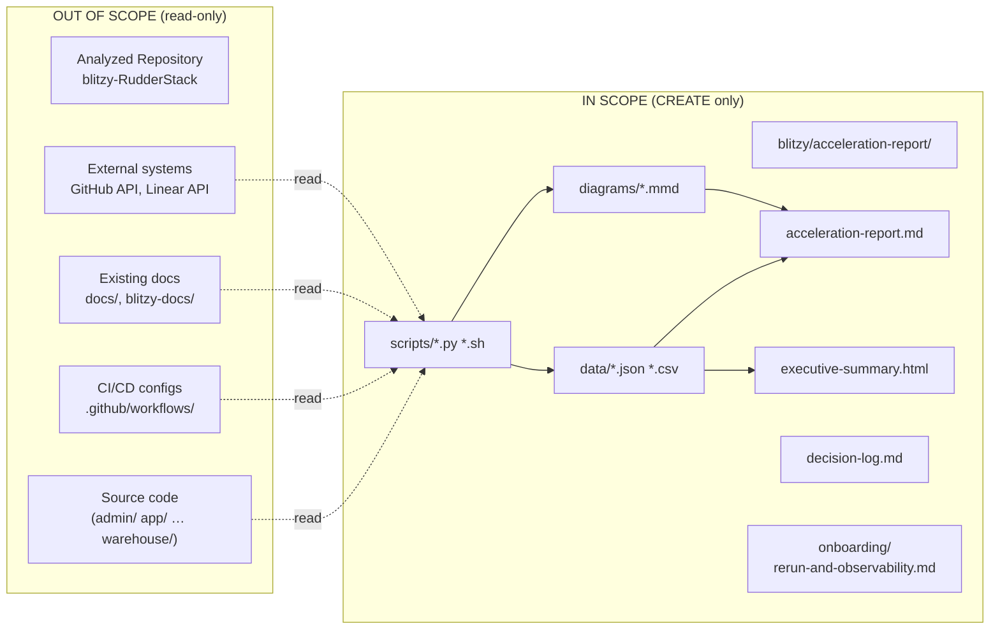
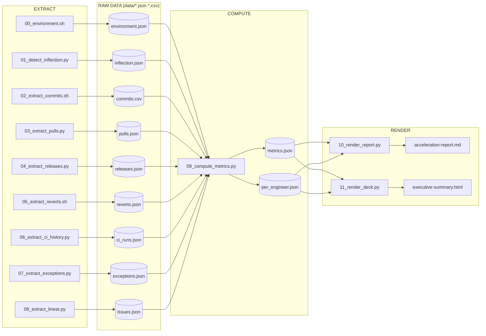

# Technical Specification

# 0. Agent Action Plan

## 0.1 Intent Clarification

### 0.1.1 Core Objective

Based on the provided requirements, the Blitzy platform understands that the objective is to **measure development acceleration across twelve specified flow and operational metrics on the `blitzy-RudderStack` repository before and after the introduction of AI assistance, and to produce a fully reproducible measurement deliverable named `acceleration-report.md` together with every supporting artifact required by the user-specified rules**.

The deliverable is a read-only measurement report. The platform does not modify the repository under analysis, the issue tracker, the CI/CD systems, or any other external system. Every numeric value reported in the deliverable must be re-derivable from the exact commands and API calls captured in the Reproducibility Appendix.

Stated in technical terms, the objective decomposes into the following requirements:

- **Establish the AI inflection point**: Identify the canonical "before" → "after" boundary by detecting the earliest commit carrying an AI co-author trailer or, if no such trailer is found, by identifying the sharpest sustained inflection in commit velocity. The detection method and the chosen date must be documented as a non-trivial decision in the decision log.
- **Compute twelve metrics**: For each of the twelve metrics specified in the user prompt, derive a baseline value (before the inflection point), a post-introduction value (after the inflection point), and the after/before multiplier. Each metric must carry a confidence tag of High, Medium, or Low according to the strength of the underlying data source.
- **Apply identical methodology to both periods**: Same 2-week window alignment (Monday-start), same extraction logic, same author-exclusion rules. The only difference between periods is the date range.
- **Honour the engineering actor framing**: In the baseline period the engineering actor is the human author of each PR; in the after period the engineering actor is `Blitzy` (treated as a single row alongside human contributors for any aggregation by actor — Metrics 2, 4, 5, 6, 10). Metrics measuring working time (Metrics 4 and 5) are computed from the engineering actor's perspective in each period.
- **Produce per-engineer breakdowns**: For every metric where individual attribution is available (Metrics 2, 4, 5, 6, 10), report values per real-name contributor. Normalise for team growth by reporting per active engineer where applicable.
- **Produce a temporal phase decomposition**: Split the after period into a Ramp-Up phase (first 90 days post-introduction) and a Steady State phase (90+ days post-introduction). If fewer than 90 days of post-introduction data exist, fall back to Baseline vs Post-Introduction only. Document the choice.
- **Produce a requirements traceability matrix**: For each metric, map the user-stated requirement to the exact extraction command or API query, to the raw output, to the derived value, to the reported number. Every numeric claim in the Executive Summary must have a corresponding traceability row.
- **Produce a reproducibility appendix**: The complete, ordered set of commands and API calls needed to re-derive every metric from scratch, with syntactically valid commands referencing only the target repository and documented data sources.
- **Multi-module aggregation**: Where the repository carries multiple identifiable modules, run metric extraction per module and aggregate weighted by non-merge commit volume per module relative to total non-merge commit volume.

### 0.1.2 Task Categorization

- **Primary task type**: Mixed — measurement analytics with documentation deliverables. The dominant aspect is engineering-metrics extraction (data analysis from a code repository and adjacent systems) producing a written report.
- **Secondary aspects**:
  - Tooling — Bash and Python extraction scripts are produced as part of the deliverable (these are work product, not modifications to the analyzed repository).
  - Visual documentation — Mermaid diagrams in the report, a reveal.js executive deck.
  - Onboarding documentation — A rerun-and-observability document for the next analyst.
  - Decision log — An explainability artifact.
- **Scope classification**: Cross-cutting. Although the work product lives in a new directory under `blitzy/acceleration-report/`, the **inputs** span every system that emits signal about engineering throughput: git history, GitHub Releases/Issues/PRs APIs, the Linear issue tracker referenced by the PR template, CI/CD workflow runs and test-result history, the dependency-bot configuration, branch protection settings, and release manifests.

### 0.1.3 Special Instructions and Constraints

The user prompt includes several non-negotiable directives that are preserved here verbatim where stated as user instructions, and re-stated in technical language where they describe extraction behaviour.

**Verbatim user constraints (Boundaries & Preservation)**:

- "Read-only operations only. MUST NOT modify the repository or external systems."
- "MUST NOT fabricate, estimate, or extrapolate. Report 'Insufficient signal — [reason]' when data is lacking."
- "MUST NOT add metrics beyond the 12 specified."
- "MUST NOT present Low-confidence metrics as equivalent to High-confidence ones."
- "MUST NOT selectively omit data that contradicts a pattern."
- "MUST use identical methodology for before and after periods — same window alignment, same extraction logic, different date range."

**Verbatim user constraints (Rules 1–6, scope notes preserved)**:

- "Rule 1: Data Provenance. Every numeric value MUST trace: Requirement → Extraction Command → Raw Output → Derived Value → Reported Number."
- "Rule 2: Factual-Neutral Tone. Zero subjective qualifiers in the report body — no 'impressive,' 'significant,' 'excellent,' 'remarkable,' 'unfortunately.'"
- "Rule 3: Confidence Transparency. Every derived metric MUST carry a confidence tag (High / Medium / Low). Low-confidence metrics MUST NOT appear without an explicit caveat."
- "Rule 4: Internal Consistency. A metric value MUST NOT differ between the Executive Summary, Activity Deep-Dives, Traceability Matrix, and Acceleration Curve table."
- "Rule 5: Reproducibility. The Reproducibility Appendix MUST contain the complete, ordered set of commands and API calls needed to re-derive every metric from scratch."
- "Rule 6: Environment First. Document execution environment (repository URL, git version, total commit count, active branch count, submodule state, commit date range, extraction timestamp) before any metric extraction."

**Verbatim engineering actor framing**:

- "In the after period, Blitzy is treated as the engineering actor — the entity producing code on the PR. Blitzy works alone on its PRs; humans review but do not co-author."
- "Metrics that measure working time (4, 5) are computed from the engineering actor's perspective, with the actor being the human author in the baseline period and Blitzy in the after period."
- "Metrics that aggregate by actor (2, 4, 5, 6, 10) include Blitzy as one row in the after period alongside human contributors."
- "The same extraction logic is applied to both periods with the actor substituted; this satisfies the identical-methodology requirement in Boundaries."

**Verbatim confidence framework**:

- "A metric derived from direct counts in an issue tracker is High confidence."
- "A metric approximated from git commit patterns is Medium confidence."
- "A metric inferred from indirect proxies is Low confidence."
- "Assign confidence per metric based on the actual data source you used, not the table above."

**Out of scope (verbatim)**: "runtime performance, customer satisfaction scores, revenue impact."

**Quality Gates (verbatim, the deliverable must satisfy all)**:

- "All 12 metrics populated or marked 'Insufficient signal — [reason]' with deviation documented"
- "Zero numeric claims without an appendix entry and traceability row"
- "Environment Verification complete and timestamped before first Metric Deep-Dive"
- "Confidence tags on all Executive Summary metrics"
- "Per-engineer view (real names) for applicable metrics"
- "Temporal phases populated or justified as N/A"
- "Risk Assessment covers all Low-confidence metrics and insufficient-signal gaps"
- "No metric value differs across report sections"
- "Appendix commands syntactically valid and sequentially ordered"
- "Rules 1–6 pass their verification criteria"
- "Data Source Inventory documents every system accessed and every system that was unavailable"

### 0.1.4 Implicit Requirements Surfaced

The following requirements are not stated explicitly in the user prompt but are mandatory consequences of the user-specified rules layered on top of the measurement deliverable. They are surfaced here so that nothing remains as "to be discovered":

- **Mermaid diagrams in the report** (Rule: Visual Architecture Documentation): The Acceleration Curve must include a graphical representation; the Data Source Inventory benefits from a topology diagram; the temporal phase decomposition is best communicated as a timeline; the engineering-actor framing for after-period analysis is best communicated as a sequence or block diagram. Every diagram requires a descriptive title and a legend, must be referenced by name in accompanying prose, and must use Mermaid syntax.
- **Reveal.js executive deck** (Rule: Executive Presentation): A single self-contained HTML file named `executive-summary.html` covering scope, business value, architectural change, risks, onboarding — 12–18 slides (target 16), Blitzy brand palette, CDN-pinned reveal.js 5.1.0, Mermaid 11.4.0, Lucide 0.460.0, embedded Blitzy theme CSS, every slide carrying at least one non-text visual element. This artifact is always included independent of any other documentation.
- **Decision log** (Rule: Explainability): A Markdown table named `decision-log.md` capturing every non-trivial decision (a decision is non-trivial if a competent engineer could reasonably have chosen differently), the alternatives considered, the rationale, and the risks. Includes a bidirectional traceability matrix where applicable. Any deviation from a literal interpretation of the user prompt is logged here.
- **Onboarding documentation** (Rule: Onboarding & Continued Development): A document that enables a new analyst to rerun this measurement from a clean machine without asking questions — setup, domain context, common pitfalls, suggested next investigations.
- **Observability for analysis scripts** (Rule: Observability): Structured logging from every extraction script with a per-run correlation ID, a metrics surface (count of API calls, raw rows processed, exclusions), a health/readiness gate (preflight check that all data sources are reachable), and a dashboard template. The "dashboard" for an analysis pipeline takes the form of a summary stdout report plus the structured JSON log feed.

### 0.1.5 Anticipated Ambiguities and Their Resolutions

The prompt grants explicit "Agent Latitude" for extraction strategy and confidence assignment. The platform makes the following non-trivial decisions up front; each will be re-documented in the decision log of the deliverable:

- **AI inflection-point detection method**: Search commits for any `Co-authored-by:` trailer referencing an AI tool name (`Claude`, `Copilot`, `Cursor`, `Blitzy`, `Aider`) via `git log --grep='[Cc]o-authored-by:'`. If no trailer is found, fall back to identifying the earliest commit whose author email matches an AI-actor pattern (`@blitzy.com`, `blitzy[bot]`, `copilot@github.com`, `noreply@anthropic.com`). If neither signal is present, identify the sharpest sustained inflection in weekly commit velocity using a two-side rolling-mean ratio test. The first method that yields a signal is used; alternatives are recorded.
- **Blitzy as engineering actor identification**: The canonical Blitzy author signature in this repository is `agent@blitzy.com` (with display name variants Blitzy Agent, blitzy-agent, agent) plus the `blitzy[bot]` GitHub App account for auto-merges. Both are treated as the single `Blitzy` engineering actor for after-period aggregation, but the `blitzy[bot]` PR-authoring activity (if any) is excluded from Flow Velocity per the prompt's dependency-bot rule unless the PR was authored by `agent@blitzy.com`.
- **Dependency-bot exclusion list**: `dependabot[bot]` (`49699333+dependabot[bot]@users.noreply.github.com`) and any other automated dependency bot are excluded from Flow Velocity. `blitzy[bot]` is included to the extent it represents engineering output by Blitzy.
- **Release detection precedence** (Metric 9): GitHub Releases API → annotated git tags matching `v?\d+\.\d+\.\d+` → CI/CD deployment events. Prereleases (`-alpha`, `-beta`, `-rc`, `-dev`) are excluded from the primary count and reported separately.
- **Issue tracker data availability**: The PR template references Linear. Linear API access is not available in the read-only analysis environment unless an API token is provided. Metric 12 (Defects Out of SLA) will be reported as "Insufficient signal — no SLA source" if no SLA source can be located in the repository (policy document, runbook) and no Linear access is granted.
- **CI test-result history availability**: GitHub Actions workflow run history is the source for Metric 11 (Escaped Defects). Without GitHub API access, the metric falls back to in-repo `_test.go` file scanning for `t.Skip()` and `// nolint` markers; the skipped-test counts at HEAD are reported but transitions over time require API access.
- **Admin audit log availability**: Metric 10 (Approved Exceptions) requires admin audit-log access for the full signal. Without it, only force-pushes (detectable from `git reflog` on protected branches) and label-based exception markers are available; confidence drops to Low and the limitation is recorded.

### 0.1.6 Technical Interpretation Statement

These requirements translate to the following technical implementation strategy:

To **measure development acceleration**, the platform will create a self-contained measurement-and-reporting workspace at `blitzy/acceleration-report/` containing extraction scripts (Bash and Python), raw data artifacts (JSON and CSV), and the final reporting documents (`acceleration-report.md`, `executive-summary.html`, `decision-log.md`, `onboarding/rerun-and-observability.md`). The extraction scripts read from git history on the local clone, the GitHub Releases/Pulls/Issues/Actions APIs against the `Blitzy-Sandbox/blitzy-RudderStack` remote, the CI workflow definitions checked into `.github/workflows/`, the dependency-bot configuration, the issue and PR templates, and any policy document discovered in `docs/` or `blitzy/documentation/`. No script writes to the analyzed repository's working tree, history, refs, or remote; no script modifies any external system. Every script logs a structured JSON event stream with a per-run UUID4 correlation ID, exits non-zero on failure to honour Bash strict mode (`set -euo pipefail`), and supports a `--dry-run` flag that previews the data sources it intends to access.

The final `acceleration-report.md` is assembled by a deterministic Python renderer from the raw data artifacts, ensuring that the value of any metric is identical in the Executive Summary, the Metric Deep-Dive, the Traceability Matrix, the Per-Engineer Acceleration table, and the Acceleration Curve. The executive `executive-summary.html` is rendered from the same data with a Blitzy-themed reveal.js template. The decision log and onboarding document are authored by hand against the data artifacts at the time of generation and committed as plain Markdown.

## 0.2 Repository Scope Discovery

### 0.2.1 Comprehensive Data Source Inventory

The measurement deliverable consumes signal from every system that emits engineering-throughput evidence. Each source below is read-only. No source is modified. The "Path / Endpoint" column lists what the extraction scripts will reference; the "Used For" column maps the source to the metrics that depend on it.

#### 0.2.1.1 In-Repository Sources

| Path / Endpoint | Used For | Notes |
|---|---|---|
| `.git/` (history, refs, tags, reflog) | Metrics 1, 2, 3, 4, 5, 6, 7, 8, 10 (force-push detection), and inflection-point detection | Primary source. Read via `git log`, `git rev-list`, `git for-each-ref`, `git reflog show`, `git diff`. No `--force-with-lease`, no commit creation. |
| `.github/workflows/*.{yml,yaml}` (13 files) | Metric 9 (Releases — CI deploy events), Metric 11 (CI test history), Metric 10 (required-check bypass detection) | Files: `builds.yml`, `tests.yaml`, `verify.yml`, `release-please.yaml`, `prerelease.yaml`, `sync-release.yaml`, `dispatch-deploy-event-dev.yaml`, `docker-build-dockerhub.yml`, `docker-build-ecr.yml`, `housekeeping.yaml`, `labeler.yaml`, `pr-description-enforcer.yaml`, `semantic-pr.yaml`. |
| `.github/labeler.yml` | Metric 6 (Flow Distribution — label-based classification fallback) | Confirms available labels (`with tests`, `server-team`, `warehouse-team`). No feature/defect labels exist; classification will fall back to conventional-commit prefix. |
| `.github/dependabot.yml` | Metric 2 (Flow Velocity — dependency bot exclusion) | Lists the gomod/github-actions/docker ecosystems whose bot PRs are excluded. |
| `.github/ISSUE_TEMPLATE/bug-report.md` | Metric 12 (Defects Out of SLA — issue tracker reference) | Documents that the issue tracker is Linear (external). |
| `.github/pull_request_template.md` | Metric 6 (Flow Distribution — PR body classification), Metric 12 (Linear ticket linkage convention) | The PR template references Linear ticketing. |
| `.github/workflows/semantic-pr.yaml` | Metric 6 (Flow Distribution — semantic prefix authority) | Enumerates the allowed conventional-commit types: `fix`, `feat`, `chore`, `refactor`, `exp`, `doc`, `test`. |
| `.github/workflows/release-please.yaml` | Metric 9 (Releases — release branch and tag convention) | Confirms `release-type: go`, `bump-minor-pre-major: true`, releases originate from `release/*` branches. |
| `CHANGELOG.md` (618,580 bytes, 4,744 lines, ~240 release entries) | Metric 9 (Releases — historical release inventory) | Historical release log inherited from the upstream `rudderlabs/rudder-server` baseline; entries pre-date this fork's lifespan. Used as cross-check, not as primary source for this fork's releases. |
| `releases.md` | Metric 9 (Releases — release notes reference) | Cross-check. |
| `codecov.yml` | Metric 11 (Escaped Defects — coverage gate configuration) | Confirms coverage is `informational: true`, non-blocking. |
| `.golangci.yml` (4,704 bytes) | Metric 10 (Approved Exceptions — lint suppression catalog) | Enumerates linter exemptions (gosec CWE exclusions, depguard deny rules, forbidigo bans, bodyclose exemptions). |
| `.snyk` | Metric 10 (Approved Exceptions — security-finding exception catalog) | Active CWE exceptions (the existing entries' expiry dates will be reported as observed). |
| `.truffleignore` | Metric 10 (Approved Exceptions — secret-scanner exception catalog) | Empty in current state; reported as zero exceptions. |
| `.deepsource.toml` | Metric 10 (Approved Exceptions — static-analysis exception catalog) | Documents excluded paths (`mocks/`, `proto/`, `cmd/devtool/`). |
| `Makefile` | Metric 11 (Escaped Defects — test target inventory) | Test targets: `test`, `test-run`, `test-warehouse`, `test-warehouse-integration`, `test-functions`, `test-protocols`, `test-identity`, `test-monitoring`, `test-destinations`, `test-functions-integration`, `test-identity-integration`, `test-destination-parity`, `coverage`, `test-with-coverage`. |
| `**/*_test.go` (497 files) | Metric 11 (Escaped Defects — skipped/disabled test snapshot at HEAD) | Skipped or `t.Skip(...)` markers and `// nolint` markers form the skipped-rate signal at HEAD. |
| `go.mod`, `go.sum` | Environment Verification (Rule 6 — submodule state) | Go 1.26.1 module file. |
| `Dockerfile`, `docker-compose.yml`, `rudder-docker.yml` | Metric 9 (Releases — container image deployment events when CI logs are accessible) | Multi-stage Docker build, SHA256-pinned base images. |
| `catalog-info.yaml` | Repository metadata (Rule 6 — system identity) | Confirms the project is the `blitzy-RudderStack` Backstage entity; lists tags and PR linkage. |
| `docs/`, `blitzy-docs/`, `blitzy/documentation/` | Metric 12 (Defects Out of SLA — repository policy source) | Searched for SLA policy documents and runbooks. If no SLA policy is found, Metric 12 reports "Insufficient signal — no SLA source." |
| `mkdocs.yml`, `docs/index.md`, `docs/project-guide.md`, `docs/technical-specifications.md` | Metric 12 (policy source), Repository context | Documentation site configuration and overview pages. |
| `README.md`, `CONTRIBUTING.md`, `SECURITY.md`, `CODE_OF_CONDUCT.md`, `LICENSE` | Repository context | Surface-level metadata. |

#### 0.2.1.2 External API Sources

| Source | Endpoint Pattern | Used For | Access Method |
|---|---|---|---|
| GitHub Pulls API | `GET /repos/Blitzy-Sandbox/blitzy-RudderStack/pulls` (paginated, `state=all`) | Metrics 1, 2, 4, 5, 6, 7 | Unauthenticated for public, authenticated via `GH_TOKEN` env var if rate limits hit. Falls back to local git log if API is unreachable. |
| GitHub Pull-Commits API | `GET /repos/{owner}/{repo}/pulls/{number}/commits` | Metrics 4, 5, 7 (PR first-commit and last-commit timestamps) | Same auth as Pulls API. |
| GitHub Reviews API | `GET /repos/{owner}/{repo}/pulls/{number}/reviews` | Metric 4 (review-event-bounded working phases) | Required to identify ready-for-review and refine spans. |
| GitHub Pull-Events API | `GET /repos/{owner}/{repo}/issues/{number}/events` | Metric 4 (ready_for_review event detection) | Identifies the earliest of: PR leaves draft, first review requested, first commit by another author, PR opened. |
| GitHub Releases API | `GET /repos/{owner}/{repo}/releases` | Metric 9 (Releases — primary source) | Primary release inventory; prereleases filtered separately. |
| GitHub Actions Runs API | `GET /repos/{owner}/{repo}/actions/runs?branch=main` | Metric 11 (Escaped Defects — test transitions), Metric 10 (failed-check overrides) | Required for the regression and merge-with-failing-check signals. |
| GitHub Actions Run Artifacts API | `GET /repos/{owner}/{repo}/actions/runs/{run_id}/artifacts` | Metric 11 (test result history — JUnit XML when present) | Falls back to "Insufficient signal — CI test history unavailable" if no JUnit XML artifacts are emitted. |
| GitHub Branches API | `GET /repos/{owner}/{repo}/branches/main/protection` | Metric 10 (Approved Exceptions — required check bypass detection) | Requires admin access for the audit log; without admin, only `protected: true` is visible and the signal is incomplete. |
| GitHub Branches API | `GET /repos/{owner}/{repo}/branches` | Topology snapshot (blitzy-* feature branches) | Snapshot used for environment verification. |
| GitHub Repository API | `GET /repos/{owner}/{repo}` | Environment Verification | Repository metadata (created_at, default_branch, archived). |
| Linear API | `GET https://api.linear.app/graphql` (GraphQL — issues, labels, SLAs) | Metric 12 (Defects Out of SLA), Metric 6 (Flow Distribution issue-label classification) | Requires `LINEAR_API_KEY`. If unavailable, both metrics fall back to in-repo signals; Metric 12 reports "Insufficient signal — no SLA source" if no policy document is found in the repo either. |

#### 0.2.1.3 Local Git Operations Summary

The following operations are performed against the local working clone and require no network access:

| Operation | Used For |
|---|---|
| `git log --all --pretty=format:'%H|%aE|%aN|%aI|%cE|%cN|%cI|%P|%s'` | Authoritative commit roster; feeds inflection-point detection, Flow Velocity, Flow Active, Flow Time, per-actor breakdowns |
| `git log --all --grep='Co-authored-by:'` | AI co-author trailer detection (primary inflection signal) |
| `git log --all --grep='^Revert "' --pretty=format:'%H|%aI|%s'` | Revert commit enumeration for Metric 8 (Problem Records in Release) |
| `git for-each-ref refs/heads/ refs/remotes/ refs/tags/ --format='%(refname)|%(creatordate:iso-strict)|%(objectname)'` | Branch and tag topology, release-tag enumeration |
| `git merge-base --is-ancestor <tag> <commit>` | Metric 8 (release attribution for reverts) |
| `git rev-list --count --no-merges <range>` | Module-level commit-weight aggregation |
| `git diff --shortstat <pre>..<post>` | Volume normalization signals |
| `git rev-parse --verify HEAD`, `git remote get-url origin`, `git rev-list --count HEAD` | Environment Verification preamble (Rule 6) |

### 0.2.2 Web Search Research Conducted

The platform consulted external references to validate the extraction methodology selected for each metric. Each consultation is logged in the search log appendix of the deliverable.

- **AI co-author trailer conventions**: Confirmed that <cite index="5-3,5-4,5-5,5-6,5-7">git trailers, sometimes called commit footers, are a long-established convention for adding structured metadata at the end of a commit message that follow the same format as email headers, are first-class citizens in git interpret-trailers, and are searchable with git log --grep. Most modern CI/CD and code-review tooling already understands them. For AI-assisted contributions, three trailers have emerged in the open source community. They look similar at a glance, but they imply very different things</cite>: `Co-authored-by:`, `Assisted-by:`, and `Generated-by:`. <cite index="6-1">GitHub recognises the Co-Authored-By trailer format and displays Claude in the co-authors list for that commit</cite>. The platform's detection script will search for all three trailer variants and any author email matching known AI-actor patterns; this multi-signal approach removes the brittleness of a single string match.
- **DORA / flow-metric extraction patterns**: Confirmed that <cite index="17-7,17-8,17-9">the standard approach measures the time from the first commit on a branch (or PR creation) to when that code is deployed to production, pulled from the GitHub API using PR creation timestamps and deployment timestamps, with lead_time = deployment_timestamp − first_commit_timestamp</cite>, which aligns with Metric 7 (Flow Time) defined in the user prompt. The pattern of computing PR-level lead time from `merge_time − first_commit_time` is industry-standard.
- **Release frequency conventions**: Confirmed that <cite index="15-1,15-2">by default the GitHub integration only fetches open pull requests, and including closed PRs ensures that merged and closed PRs are ingested, which is required for lead time for changes and deployment frequency calculations</cite>. The platform's scripts explicitly request `state=all` to retrieve merged PRs for Flow Velocity and Flow Time calculations.

### 0.2.3 Existing Infrastructure Assessment

The repository under analysis is a Go monorepo derived from the upstream `rudderlabs/rudder-server` v1.68.1 baseline, hosted under the `Blitzy-Sandbox` GitHub organisation. The following established infrastructure is consumed by the measurement deliverable without modification:

- **Branch model**: A single default branch `main` plus eight `blitzy-<UUID>` feature branches (one per Blitzy sandbox session). Releases originate from `release/*` branches via the release-please workflow. The blitzy-prefixed branch convention is the canonical Blitzy-PR marker referenced in the user prompt (Metric 1 in-progress definition).
- **Commit topology**: 538 commits across the analysis window 2026-02-23 → 2026-05-18 (~12 weeks, ~6 two-week windows). 6 merge commits on `main` (the PR-merge count). Five active authors plus two bot accounts.
- **CI/CD pipeline (Rule 6 source)**: Thirteen GitHub Actions workflows. The `tests.yaml` workflow runs the primary test pipeline (25-job package-unit matrix, 9-destination warehouse-integration matrix). The `verify.yml` workflow runs generate-and-diff (`git diff --exit-code` enforcement on regenerated files), golangci-lint v2.9.0, gofumpt v0.9.1, govulncheck, mockgen v0.6.0. The `release-please.yaml` workflow creates releases on `release/*` branches and dispatches deploy events to `rudderstack-operator` and `rudder-devops`.
- **Quality gates**: codecov non-blocking (informational); `re-actors/alls-green` meta-check enforces all-green across the matrix.
- **Test estate**: 497 `*_test.go` files, 859+ test functions, 749+ sub-tests, 29 Ginkgo suites, 57 mockgen directives, 47 testdata directories. Known skipped tests at HEAD: `klaviyobulkupload_test.go:328`, `gateway/webhook/integration_test.go:196,204`, `services/sql-migrator/migrator_test.go:39`, `bqstreammanager_test.go:44`, `kafkamanager_test.go:473,555`, `mssql_test.go:44`, `clickhouse_test.go:47`, `postgres_test.go:48`.
- **Observability stack (reused by Rule 1 dashboard template)**: Three wire formats — Prometheus client_golang v1.23.2 pull HTTP, StatsD UDP via prom/statsd-exporter v0.22.4 (9125→9102), OpenTelemetry OTLP v1.40.0. Structured logger `rudder-observability-kit` (obskit) v0.0.6. `/health` endpoint and six bearer-protected internal endpoints (`/protocols`, `/profiles`, `/monitoring`, `/profiling`, `/alerts`, `/replay`). Alert routing via `services/alert` (VictorOps default, PagerDuty, Slack, Email backends).
- **Dependency hygiene**: Dependabot configured for `gomod` (daily, grouped `frequent` for AWS/GCP and `go-deps` minor/patch), `github-actions` (daily), `docker` (daily, `docker-deps` minor/patch).
- **PR discipline**: `pr-description-enforcer` action (`rudderlabs/pr-description-enforcer@v1.1.0`) requires PR body content matching the template. `semantic-pr.yaml` requires conventional-commit-typed titles. `housekeeping.yaml` closes stale PRs after 20+7 days.

### 0.2.4 Per-Metric Data-Source Resolution

The following table is the authoritative mapping from each of the twelve metrics to the primary data source, the fallback if the primary is unavailable, and the resulting confidence assignment.

| # | Metric | Primary Source | Fallback Source | Confidence (if primary available / if only fallback) |
|---|---|---|---|---|
| 1 | Flow Load | GitHub Pulls API + `state` events (draft, ready-for-review, merged) | Local git log + branch-existence snapshot per window-end | High / Medium |
| 2 | Flow Velocity | GitHub Pulls API (`state=closed`, `merged_at` non-null) + author filter | Local git log merge-commit enumeration on `main` | High / Medium |
| 3 | Flow Predictability | Derived from Metric 2 (same source chain) | Same | Inherits Metric 2 confidence; reported as "Insufficient signal — fewer than 4 windows" if applicable |
| 4 | Flow Active | GitHub Pulls + Reviews + Commits APIs (review-event bounding) | Local git log first-commit-to-last-commit span without review bounding | High / Low |
| 5 | Flow Efficiency | Ratio of Metrics 4 and 7 | Same | Inherits the lower of Metric 4 and Metric 7 confidence |
| 6 | Flow Distribution | Linear issue labels (if accessible) → conventional-commit PR title prefix → keyword match | Conventional-commit PR title prefix → keyword match | High / Medium / Low based on which classifier resolved each PR; unknown rate per phase governs phase-level confidence (>20% downgrades to Low) |
| 7 | Flow Time | GitHub Pulls API merge_time + Pull-Commits API first-commit | Local git log merge-commit timestamp − first-commit-on-branch timestamp | High / Medium |
| 8 | Problem Records in Release | Local `git log --grep='^Revert "'` + "Reverts commit SHA" parsing + `git merge-base --is-ancestor` against release tags | Same (no API needed — purely git) | High (if any reverts), or "zero reverts observed" (current local state: 0 reverts on `main`) |
| 9 | Releases | GitHub Releases API | Annotated git tags (`v?\d+\.\d+\.\d+`) → CI deployment events from Actions Runs API | High / Medium / Low. Current local state: zero git tags — primary source is the API. |
| 10 | Approved Exceptions | GitHub admin audit log + branch protection settings + label-based exception markers | Force-push detection from `git reflog` (limited to local clone) + label-based markers + counts from `.golangci.yml`/`.snyk`/`.truffleignore`/`.deepsource.toml` | High / Low. Without admin access, confidence drops to Low and a caveat is mandatory. |
| 11 | Escaped Defects | GitHub Actions Runs API + JUnit XML artifacts | In-repo `*_test.go` scan for `t.Skip()` / `// nolint` markers at HEAD only (no transition signal) | High / Low. If neither is available, reports "Insufficient signal — CI test history unavailable." |
| 12 | Defects Out of SLA | Linear API + repo policy document (SLA targets per severity) | Repo policy document only | High / Medium / "Insufficient signal — no SLA source" |

### 0.2.5 Design System Applicability

No component library or design system is referenced in the user prompt. The Design System Alignment Protocol is therefore **not applicable** to this deliverable. The visual deliverable (`executive-summary.html`) uses the Blitzy brand palette, typography, and theme defined in the user-specified Executive Presentation rule; the rule itself provides the canonical token catalogue (colors, fonts, gradients, slide-type classes) and therefore serves as the de facto "design system" for the executive deck. The platform follows that rule's CSS custom-property catalogue and CDN-pinned versions verbatim.

## 0.3 Scope Boundaries

### 0.3.1 Exhaustively In Scope

The platform is authorised to **create** the following work-product files and directories under the new `blitzy/acceleration-report/` workspace. Every other path in the repository is read-only or out-of-scope as defined in §0.3.2.

**Primary report deliverable**:

- `blitzy/acceleration-report/acceleration-report.md` — the canonical measurement report containing the eleven required sections in the order specified by the user prompt's Validation Framework (Executive Summary, Environment Verification, Data Source Inventory, Methodology, Metric Deep-Dives ×12, Requirements Traceability Matrix, Per-Engineer Acceleration, Acceleration Curve, Risk Assessment, Limitations, Reproducibility Appendix).

**Executive deliverable** (Rule: Executive Presentation):

- `blitzy/acceleration-report/executive-summary.html` — a single self-contained reveal.js HTML file (12–18 slides, target 16) following the Blitzy brand catalogue defined in the rule.

**Explainability deliverable** (Rule: Explainability):

- `blitzy/acceleration-report/decision-log.md` — Markdown table of every non-trivial decision with alternatives, rationale, and risks; includes bidirectional traceability where applicable.

**Onboarding deliverable** (Rule: Onboarding & Continued Development):

- `blitzy/acceleration-report/onboarding/rerun-and-observability.md` — clean-machine rerun instructions, domain context, common pitfalls, observability surfaces of the analysis scripts and the rudder-server they read against, suggested next investigations.

**Extraction scripts** (rule-required to satisfy reproducibility):

- `blitzy/acceleration-report/scripts/00_environment.sh` — Rule 6 Environment Verification preamble; emits `data/environment.json`.
- `blitzy/acceleration-report/scripts/01_detect_inflection.py` — AI inflection-point detection via trailer search, AI-author pattern match, and velocity-inflection fallback; emits `data/inflection.json`.
- `blitzy/acceleration-report/scripts/02_extract_commits.sh` — Git commit roster extraction; emits `data/commits.csv`.
- `blitzy/acceleration-report/scripts/03_extract_pulls.py` — GitHub Pulls + Reviews + Commits + Events APIs; emits `data/pulls.json` and `data/reviews.json`.
- `blitzy/acceleration-report/scripts/04_extract_releases.py` — GitHub Releases API + tag scan; emits `data/releases.json`.
- `blitzy/acceleration-report/scripts/05_extract_reverts.sh` — Revert-commit enumeration + release attribution; emits `data/reverts.json`.
- `blitzy/acceleration-report/scripts/06_extract_ci_history.py` — GitHub Actions Runs API + JUnit artifacts; emits `data/ci_runs.json` and `data/test_transitions.json`.
- `blitzy/acceleration-report/scripts/07_extract_exceptions.py` — Branch protection + audit log (if available) + label scan + lint-config exemption count; emits `data/exceptions.json`.
- `blitzy/acceleration-report/scripts/08_extract_linear.py` — Linear API issue and SLA extraction (no-op with structured "unavailable" log if `LINEAR_API_KEY` absent); emits `data/issues.json` and `data/slas.json`.
- `blitzy/acceleration-report/scripts/09_compute_metrics.py` — Deterministic metric computation from raw data artifacts; emits `data/metrics.json` and `data/per_engineer.json`.
- `blitzy/acceleration-report/scripts/10_render_report.py` — Renders `acceleration-report.md` from `data/metrics.json`.
- `blitzy/acceleration-report/scripts/11_render_deck.py` — Renders `executive-summary.html` from `data/metrics.json` and the Blitzy theme inline.
- `blitzy/acceleration-report/scripts/lib/observability.py` — Shared structured-JSON logger module with per-run UUID4 correlation ID (Rule: Observability).
- `blitzy/acceleration-report/scripts/lib/github.py` — Shared GitHub REST client with paginated requests, rate-limit handling, exponential back-off, and authenticated/unauthenticated mode.
- `blitzy/acceleration-report/scripts/lib/git.py` — Shared `subprocess`-based git helpers.

**Raw data artifacts** (the provenance trail required by Rule 1):

- `blitzy/acceleration-report/data/environment.json` — Rule 6 Environment Verification snapshot.
- `blitzy/acceleration-report/data/inflection.json` — AI inflection detection result and method used.
- `blitzy/acceleration-report/data/commits.csv` — full commit roster (hash, author email, author name, author date, committer fields, parent count, subject).
- `blitzy/acceleration-report/data/pulls.json` — PR-level data (number, state, title, body, head/base SHA, author, draft, requested_reviewers, merged_at, merge_commit_sha, labels, linked-issue URLs).
- `blitzy/acceleration-report/data/reviews.json` — review-event timeline per PR.
- `blitzy/acceleration-report/data/releases.json` — release inventory (name, tag, target_commitish, published_at, prerelease flag).
- `blitzy/acceleration-report/data/reverts.json` — revert commits with original-commit resolution and release attribution.
- `blitzy/acceleration-report/data/ci_runs.json` — CI workflow run history with status, conclusion, head SHA, timestamps.
- `blitzy/acceleration-report/data/test_transitions.json` — test pass→fail and pass→skip transitions per window (if JUnit XML available).
- `blitzy/acceleration-report/data/exceptions.json` — exception inventory (force-pushes, required-check bypasses, lint suppressions, security exceptions).
- `blitzy/acceleration-report/data/issues.json` — Linear issue inventory (if accessible) or empty with reason logged.
- `blitzy/acceleration-report/data/slas.json` — SLA target inventory (if accessible).
- `blitzy/acceleration-report/data/metrics.json` — final per-metric values keyed by metric number, with baseline / ramp-up / steady-state breakdown, multipliers, confidence tags, boundary conditions.
- `blitzy/acceleration-report/data/per_engineer.json` — per-engineer (real names + `Blitzy`) breakdown for Metrics 2, 4, 5, 6, 10.

**Diagram sources** (Rule: Visual Architecture Documentation):

- `blitzy/acceleration-report/diagrams/data-source-topology.mmd` — Mermaid source for the Data Source Inventory topology diagram.
- `blitzy/acceleration-report/diagrams/temporal-phases-timeline.mmd` — Mermaid source for the Baseline / Ramp-Up / Steady-State timeline.
- `blitzy/acceleration-report/diagrams/engineering-actor-framing.mmd` — Mermaid source for the actor-substitution sequence diagram (baseline = human, after = Blitzy).
- `blitzy/acceleration-report/diagrams/acceleration-curve.mmd` — Mermaid source for the per-metric Acceleration Curve graph.
- `blitzy/acceleration-report/diagrams/extraction-pipeline.mmd` — Mermaid source for the read-only extraction pipeline (sources → scripts → raw data → renderer → report).

**Configuration files** (analysis-environment-only):

- `blitzy/acceleration-report/requirements.txt` — Python dependency manifest for the extraction scripts (analysis environment only; does not modify the rudder-server runtime).
- `blitzy/acceleration-report/.env.example` — Environment variable template (`GH_TOKEN`, `LINEAR_API_KEY`, etc.) with safe placeholders.
- `blitzy/acceleration-report/Makefile` — Top-level orchestrator with targets `setup`, `extract`, `compute`, `render`, `all`, `clean` (analysis run only — does not affect the rudder-server build).
- `blitzy/acceleration-report/README.md` — Workspace-level overview that points to `onboarding/rerun-and-observability.md`.

**Wildcard patterns covering the in-scope set**:

- `blitzy/acceleration-report/**/*.md`
- `blitzy/acceleration-report/**/*.html`
- `blitzy/acceleration-report/**/*.py`
- `blitzy/acceleration-report/**/*.sh`
- `blitzy/acceleration-report/**/*.json`
- `blitzy/acceleration-report/**/*.csv`
- `blitzy/acceleration-report/**/*.mmd`
- `blitzy/acceleration-report/**/Makefile`
- `blitzy/acceleration-report/**/requirements.txt`
- `blitzy/acceleration-report/**/.env.example`

### 0.3.2 Explicitly Out of Scope

The following items are out of scope. They are listed here so that no downstream stage interprets the measurement deliverable as licence to modify the rudder-server codebase.

**Out-of-scope by user constraint** (Boundaries & Preservation):

- Any modification to the analyzed repository's `main` branch, history, refs, tags, or remote — read-only operations only.
- Any modification to external systems (Linear, GitHub Releases, Actions, Issues, branch protection, dependabot configuration, codecov configuration).
- Fabrication, estimation, or extrapolation of any metric value. When data is lacking, the platform reports "Insufficient signal — [reason]" rather than computing a placeholder.
- Adding metrics beyond the twelve specified in the user prompt.
- Presenting Low-confidence metrics as equivalent to High-confidence metrics.
- Selectively omitting data points that contradict an observed pattern.
- Computing the before period with one methodology and the after period with another. The same window alignment, exclusion rules, and extraction logic apply to both periods; only the date range differs.

**Out-of-scope by user instruction** (verbatim): "runtime performance, customer satisfaction scores, revenue impact."

**Out-of-scope by inference from rules**:

- Modifying any existing rudder-server source file under `admin/`, `app/`, `archiver/`, `backend-config/`, `cluster/`, `cmd/`, `config/`, `controlplane/`, `enterprise/`, `functions/`, `gateway/`, `identity/`, `info/`, `init/`, `integration_test/`, `internal/`, `jobsdb/`, `middleware/`, `mocks/`, `processor/`, `proto/`, `protocols/`, `regulation-worker/`, `resources/`, `router/`, `rruntime/`, `runner/`, `schema-forwarder/`, `services/`, `sql/`, `suppression-backup-service/`, `testhelper/`, `utils/`, `warehouse/`.
- Modifying existing documentation under `docs/`, `blitzy-docs/`, or `blitzy/documentation/` (with the sole exception that the platform MAY add a single-line cross-reference from `blitzy/documentation/Project Guide.md` or `docs/index.md` to `blitzy/acceleration-report/README.md` if and only if the rule "Onboarding & Continued Development" requires it to keep the entry-point document accurate — this is documented as a non-trivial deviation in the decision log if exercised).
- Modifying any CI/CD workflow file under `.github/workflows/`.
- Modifying any configuration file in the repo root (`.golangci.yml`, `.snyk`, `.deepsource.toml`, `.truffleignore`, `.dockerignore`, `.editorconfig`, `.gitignore`, `codecov.yml`, `Dockerfile`, `docker-compose.yml`, `rudder-docker.yml`, `Makefile`, `go.mod`, `go.sum`, `catalog-info.yaml`, `mkdocs.yml`).
- Touching `CHANGELOG.md`, `README.md`, `CONTRIBUTING.md`, `SECURITY.md`, `CODE_OF_CONDUCT.md`, `LICENSE`, `main.go`, `releases.md`.
- Touching the `/app` directory or any other path outside the repository tree.
- Touching the `refs/segment-docs/` external documentation subtree.
- Touching the `.junie/guidelines.md` symlink target.

**Out-of-scope analysis decisions** (the platform will not perform these even if technically possible):

- Combining metric values into derived composite scores not specified in the user prompt.
- Ranking individual engineers competitively. Per-engineer breakdowns are reported with the explicit caveat that DORA/SPACE-style metrics must not be used for individual evaluation.
- Inferring intent or quality of code from authorship alone.
- Cross-referencing PR or commit content against upstream `rudderlabs/rudder-server` to compute "originality" or "novelty" scores.
- Performing static or dynamic analysis of the codebase beyond what the metrics require (no code quality scoring, no architectural commentary, no security vulnerability discovery — these are out of scope for this measurement deliverable).
- Modifying the `agent@blitzy.com` author identity or any other author identity for the purposes of analysis (the platform reads identities as-is from git history).

### 0.3.3 Scope Boundary Visualization

```mermaid
flowchart LR
    subgraph "OUT OF SCOPE (read-only)"
        A["Analyzed Repository<br/>blitzy-RudderStack"]
        A1["Source code<br/>(admin/ app/ … warehouse/)"]
        A2["CI/CD configs<br/>.github/workflows/"]
        A3["Existing docs<br/>docs/, blitzy-docs/"]
        A4["External systems<br/>GitHub API, Linear API"]
    end
    subgraph "IN SCOPE (CREATE only)"
        B["blitzy/acceleration-report/"]
        B1["acceleration-report.md"]
        B2["executive-summary.html"]
        B3["decision-log.md"]
        B4["onboarding/<br/>rerun-and-observability.md"]
        B5["scripts/*.py *.sh"]
        B6["data/*.json *.csv"]
        B7["diagrams/*.mmd"]
    end
    A1 -. "read" .-> B5
    A2 -. "read" .-> B5
    A3 -. "read" .-> B5
    A4 -. "read" .-> B5
    B5 --> B6
    B6 --> B1
    B6 --> B2
    B5 --> B7
    B7 --> B1
%% Title: Scope Boundary Diagram
%% Legend: Solid arrows = file creation by platform; dotted arrows = read-only data flow from analyzed repository or external systems into the extraction scripts.
```

## 0.4 Dependency Inventory

### 0.4.1 Analyzed Repository Dependencies (Read-Only)

The dependencies of the analyzed `blitzy-RudderStack` repository are read but never modified. The Go module file (`go.mod`) declares Go 1.26.1 as the language version; all transitive dependencies are pinned in `go.sum` and are not in scope for change. The platform does not add, update, or remove any entry from `go.mod` or `go.sum`. The platform does not modify `.github/dependabot.yml`. The platform does not modify the rudder-server `Dockerfile`, `docker-compose.yml`, or `rudder-docker.yml`.

This section is therefore an inventory of the **analysis-environment** dependencies — Python packages and system tools used exclusively by the extraction scripts under `blitzy/acceleration-report/scripts/` — plus the CDN-pinned browser-side libraries embedded in `executive-summary.html`.

### 0.4.2 Python Packages for Extraction Scripts

The Python interpreter version is 3.12.3 (the version present in the analysis sandbox). The dependency manifest at `blitzy/acceleration-report/requirements.txt` declares the following packages by exact pinned version, all pulled from PyPI:

| Registry | Package Name | Version | Purpose |
|---|---|---|---|
| pip | requests | 2.32.3 | HTTP client for GitHub REST and Linear GraphQL APIs |
| pip | python-dateutil | 2.9.0.post0 | Robust ISO-8601 timestamp parsing for git, PR, review, and release timestamps |
| pip | tzdata | 2024.2 | Time-zone database for Monday-anchored 2-week-window computation in UTC |
| pip | tabulate | 0.9.0 | Markdown-table generation for the report and traceability matrix |
| pip | jinja2 | 3.1.4 | Templated rendering of `acceleration-report.md` and `executive-summary.html` |
| pip | jsonschema | 4.23.0 | Validation of `data/*.json` artifacts against documented schemas for Rule-1 provenance |
| pip | gql | 3.5.0 | GraphQL client for Linear API (lazy-loaded; skipped when `LINEAR_API_KEY` is absent) |

These packages are installed into a virtual environment located at `blitzy/acceleration-report/.venv/` (created by the `setup` Makefile target). The virtual environment is gitignored; it is not committed.

### 0.4.3 System Tooling for Bash Scripts

The Bash extraction scripts (`*.sh`) require the following system tools at runtime. All are read-only consumers and standard on modern Linux environments:

| Tool | Minimum Version | Purpose | Availability in Analysis Sandbox |
|---|---|---|---|
| git | 2.43.0 | Local repository operations (`log`, `rev-list`, `for-each-ref`, `merge-base`, `reflog`, `diff`, `cat-file`) | Confirmed present |
| bash | 5.0+ | POSIX-compliant scripting with `set -euo pipefail` strict mode | Confirmed present |
| python3 | 3.12.3 | Runner for `*.py` extraction scripts | Confirmed present |
| awk | GNU 5.x or BSD | Stream processing in commit-roster extraction | Confirmed present |
| curl | 7.81+ | HTTP fallback for environments without Python requests | Confirmed present |
| jq | 1.6+ (optional) | JSON post-processing in summary scripts; absence falls back to Python `json.tool` | **Not present in sandbox**; scripts must gracefully fall back to Python-based JSON manipulation |

### 0.4.4 Browser-Side Libraries (CDN-Pinned)

The `executive-summary.html` reveal.js deck is a single self-contained HTML file with no build step. It loads the following libraries from public CDNs at the exact pinned versions mandated by the Executive Presentation rule:

| Library | Version | CDN Source | Purpose |
|---|---|---|---|
| reveal.js | 5.1.0 | `cdn.jsdelivr.net/npm/reveal.js@5.1.0` | Presentation engine |
| Mermaid | 11.4.0 | `cdn.jsdelivr.net/npm/mermaid@11.4.0` | Architecture and acceleration-curve diagrams |
| Lucide | 0.460.0 | `unpkg.com/lucide@0.460.0/dist/umd/lucide.min.js` | Icon system (replaces emoji per the rule) |
| Inter | 400/500/600/700 weights | Google Fonts | Body typography |
| Space Grotesk | 500/600/700 weights | Google Fonts | Display headings |
| Fira Code | 400/500 weights | Google Fonts | Monospace and eyebrows |

The deck embeds the full Blitzy theme inline in a `<style>` tag with the canonical CSS custom-property catalogue from the rule (palette `#5B39F3`, `#2D1C77`, `#94FAD5`, `#1A105F`, `#7A6DEC`, `#4101DB`, neutrals `#333333`/`#999999`/`#D9D9D9`/`#F4EFF6`/`#F5F5F5`/`#FFFFFF`, gradients `--gradient-hero`, `--gradient-divider`, `--gradient-accent-bar`).

### 0.4.5 New Dependencies to Add

The platform adds **no** new dependencies to the analyzed repository. All of the dependencies listed in §0.4.2 and §0.4.3 live in the new `blitzy/acceleration-report/` workspace and are installed into a workspace-local virtual environment. The browser-side libraries in §0.4.4 are loaded by URL from public CDNs and are not declared in any project manifest.

### 0.4.6 Dependencies to Update

None. The analyzed repository's Go module, container images, and CI tool pins are not modified by this deliverable.

### 0.4.7 Dependencies to Remove

None.

### 0.4.8 Import / Reference Updates

The platform makes **no** import or reference updates within the analyzed rudder-server source tree. The extraction scripts import only from the new shared library modules under `blitzy/acceleration-report/scripts/lib/` (`observability.py`, `github.py`, `git.py`) and from the standard library and the Python packages listed in §0.4.2.

## 0.5 Implementation Design

### 0.5.1 Technical Approach Overview

The deliverable is implemented as a deterministic three-stage pipeline: **extract → compute → render**. Each stage is independently invocable, idempotent, and produces a checkpointable artifact that downstream stages consume. This separation enforces Rule 1 (Data Provenance) — the raw output of every API call and git command is persisted to `data/*.json` before any derivation occurs, and the rendered report reads only from `data/metrics.json`, never from the raw sources directly. This guarantees that Rule 4 (Internal Consistency) is mechanically satisfied: the same `metrics.json` row feeds the Executive Summary, the Metric Deep-Dive, the Traceability Matrix, the Per-Engineer Acceleration table, and the Acceleration Curve.

```mermaid
flowchart LR
    subgraph EXTRACT
        E1["00_environment.sh"]
        E2["01_detect_inflection.py"]
        E3["02_extract_commits.sh"]
        E4["03_extract_pulls.py"]
        E5["04_extract_releases.py"]
        E6["05_extract_reverts.sh"]
        E7["06_extract_ci_history.py"]
        E8["07_extract_exceptions.py"]
        E9["08_extract_linear.py"]
    end
    subgraph "RAW DATA (data/*.json *.csv)"
        D1[(environment.json)]
        D2[(inflection.json)]
        D3[(commits.csv)]
        D4[(pulls.json)]
        D5[(releases.json)]
        D6[(reverts.json)]
        D7[(ci_runs.json)]
        D8[(exceptions.json)]
        D9[(issues.json)]
    end
    subgraph COMPUTE
        C1["09_compute_metrics.py"]
        M[(metrics.json)]
        P[(per_engineer.json)]
    end
    subgraph RENDER
        R1["10_render_report.py"]
        R2["11_render_deck.py"]
        REP["acceleration-report.md"]
        DEC["executive-summary.html"]
    end
    E1 --> D1
    E2 --> D2
    E3 --> D3
    E4 --> D4
    E5 --> D5
    E6 --> D6
    E7 --> D7
    E8 --> D8
    E9 --> D9
    D1 & D2 & D3 & D4 & D5 & D6 & D7 & D8 & D9 --> C1
    C1 --> M
    C1 --> P
    M & P --> R1
    M & P --> R2
    R1 --> REP
    R2 --> DEC
%% Title: Three-Stage Extraction → Compute → Render Pipeline
%% Legend: Solid arrows = data flow; rounded rectangles = scripts; cylinders = JSON/CSV data artifacts; ovals = final rendered deliverables.
```

### 0.5.2 Logical Implementation Flow

The pipeline runs in this fixed order:

- **First, establish the execution environment** by capturing repository URL, git version, total commit count, active branch count, submodule state, commit date range, and an extraction timestamp into `data/environment.json`. This satisfies Rule 6 (Environment First) and is the first numeric content rendered in the report.
- **Second, detect the AI inflection point** by running the three-tier detection logic (§0.5.3.1) and persisting the method used, the chosen date, and the detection evidence into `data/inflection.json`. Every downstream computation is parametrized by this date.
- **Third, extract every primary data source in parallel** — commits, pulls, releases, reverts, CI history, exceptions, Linear — each script writing to its dedicated `data/*.json` artifact. Scripts are independent; failure of one does not block the others, but each failure is logged with the structured-JSON logger and surfaces in the Risk Assessment of the report.
- **Fourth, compute the twelve metrics** by reading the raw data artifacts and producing `data/metrics.json` and `data/per_engineer.json`. The compute step is pure (no I/O beyond reading and writing the named files) so that it is exactly reproducible from the data artifacts.
- **Finally, render** both the Markdown report and the HTML executive deck from the computed metric files. The renderer reads neither raw data nor the live repository — it consumes only the data artifacts emitted by the compute step.

### 0.5.3 Per-Metric Implementation Detail

This is the contract for each of the twelve metrics. The user's metric definitions are preserved verbatim where stated; the platform's chosen extraction strategy and confidence rationale appear after each definition.

#### 0.5.3.1 AI Inflection-Point Detection (Foundation)

The inflection date partitions every metric into baseline and after periods.

**Detection precedence**:

- **Tier 1 — trailer search**: `git log --all --pretty=format:'%H|%aI|%B%n----' | awk` to scan commit message bodies for `Co-authored-by:` lines whose email or display name matches one of `claude`, `copilot`, `cursor`, `aider`, `blitzy`, `noreply@anthropic.com`, `copilot@github.com`. The earliest such commit's author date is the inflection point.
- **Tier 2 — AI-actor email pattern**: `git log --all --format='%H|%aE|%aN|%aI'` filtered by author email matching one of `@blitzy.com`, `blitzy[bot]@users.noreply.github.com`, `copilot@github.com`, `noreply@anthropic.com`. The earliest such commit's author date is the inflection point.
- **Tier 3 — velocity inflection**: Compute weekly commit counts on `main` over the full history. Apply a two-sided rolling-mean ratio (post-week mean ÷ pre-week mean, with 4-week windows on each side) and identify the week where this ratio first exceeds 4.0× and remains above 2.0× for the next 4 weeks (sustained inflection). The Monday of that week is the inflection point.

The first tier that yields a signal is used. The chosen tier, the detection evidence, and a brief justification are persisted to `data/inflection.json` and rendered in the report's Methodology section.

**For this repository** (observed locally), Tier 2 resolves to `2026-02-25 02:58:59 UTC` (the first `agent@blitzy.com` commit). Tier 1 yields no signal in the local clone (no `Co-authored-by:` trailers found).

**Confidence**: High when Tier 1 or Tier 2 produces a signal; Medium when only Tier 3 produces a signal.

#### 0.5.3.2 Metric 1 — Flow Load

User definition (preserved verbatim): *"Count of PRs in progress (started but not completed) at each measurement point. Mean count of PRs in an in-progress state at the end of each 2-week window, averaged across windows within a phase. In-progress = branch has at least one commit AND PR is open (not merged, not closed-without-merge), OR PR is in draft state. Exclude PRs from bot accounts other than Blitzy (branches prefixed with blitzy-). Per-phase value is the mean of window-end snapshots."*

**Extraction strategy**: Pull every PR from the GitHub Pulls API with `state=all`. For each Monday-anchored 2-week window-end timestamp `T_end`, count PRs where: `created_at ≤ T_end` AND (`merged_at IS NULL OR merged_at > T_end`) AND (`closed_at IS NULL OR closed_at > T_end OR merged_at IS NOT NULL`) AND has at least one commit by `T_end`. Exclude PRs authored by dependency bots (`dependabot[bot]` and any other listed in `.github/dependabot.yml`). The window-end is the precise Monday 00:00 UTC boundary.

**Edge cases**:
- Draft state: a PR in `draft: true` at `T_end` counts as in-progress regardless of `merged_at`.
- PRs without commits at `T_end`: excluded (the definition requires "branch has at least one commit").
- PRs whose first commit predates `created_at`: the PR is in-progress only from `created_at` onwards.

**Confidence**: High when the Pulls API is accessible; Medium with local-git fallback (cannot resolve draft state without API).

#### 0.5.3.3 Metric 2 — Flow Velocity

User definition (preserved verbatim): *"Count of PRs completed (merged) per period. Count of PRs merged to the default branch per 2-week window. Excludes PRs authored by dependency-management bots; includes PRs authored by Blitzy. Per-phase value is the mean PRs per window. Also reported as per-actor breakdown (real names plus Blitzy as one row in the after period)."*

**Extraction strategy**: From `data/pulls.json`, select PRs where `merged_at IS NOT NULL` AND `base.ref == 'main'`. Bucket by Monday-anchored 2-week window using `merged_at`. Exclude `dependabot[bot]` author. Group by author email: in the baseline period each real name appears separately; in the after period `agent@blitzy.com` is reported as a single row labelled `Blitzy`, with other real names listed alongside.

**Edge cases**:
- PRs merged to `release/*` branches: excluded (default branch is `main`).
- Squash-merged PRs: counted once at the `merged_at` timestamp.
- Force-merged PRs: counted; flagged as a contributor to Metric 10 as well.

**Confidence**: High with GitHub Pulls API; Medium with local-git merge-commit enumeration (cannot distinguish dependency-bot PRs without scanning subject lines).

#### 0.5.3.4 Metric 3 — Flow Predictability

User definition (preserved verbatim): *"Variance of flow velocity across periods. Reciprocal of the coefficient of variation (mean / standard deviation) of Flow Velocity across the 2-week windows within each phase. Requires ≥4 windows per phase; otherwise report 'Insufficient signal — fewer than 4 windows.' Higher values indicate higher predictability (lower relative variance); the after/before ratio moves in the same direction as the other metrics' 'better' direction. A phase with zero variance has undefined predictability and is reported as 'Insufficient signal — zero variance' rather than infinity."*

**Extraction strategy**: From the per-window Flow Velocity series for each phase, compute mean μ and standard deviation σ (sample standard deviation, n−1 divisor). Report 1/CV = μ/σ. Apply the two insufficient-signal rules verbatim.

**Edge cases**:
- The baseline period in this repository has 1 commit prior to the inflection, which means fewer than 4 windows fit before the inflection — the baseline value of Metric 3 is reported as "Insufficient signal — fewer than 4 windows."
- The after period covers ~12 weeks (~6 two-week windows), which is the minimum acceptable.

**Confidence**: Inherits Metric 2 confidence.

#### 0.5.3.5 Metric 4 — Flow Active

User definition (preserved verbatim): *"Active coding time per PR by the engineering actor. The engineering actor is the human author in the baseline period and Blitzy in the after period. Flow Active sums the actor's coding spans on the PR branch, where a span runs from the actor's first commit to last commit within a working phase, inclusive of all time between (gaps are not subtracted). Working phases are bounded by review events: the initial span ends when the PR becomes ready for review; each subsequent refine span runs from the first commit after a review to the last commit before the next review or merge. Time spent refining in response to review is counted as active. Ready-for-review is the earliest of: (a) PR leaving draft state, (b) first review requested, (c) first commit by another author, (d) PR opened. Reported as median across PRs per phase and per actor."*

**Extraction strategy**: For each PR, retrieve the commit list from Pulls-Commits API, the review timeline from Reviews API, and the event timeline from Issue-Events API. Construct the working-phase boundary list by interleaving commit timestamps with review-event timestamps. Compute `ready_for_review_at` as the minimum of: PR leaving draft (`ReadyForReviewEvent`), first `review_requested` event, first commit by an author other than the engineering actor, `created_at`. The initial active span runs from the engineering-actor's first commit to `ready_for_review_at`. For each subsequent review event followed by an engineering-actor commit, open a refine span from that commit to the next review or merge. Sum span durations.

**Engineering-actor substitution**: In baseline-period PRs the actor is the human author of the PR; in after-period PRs the actor is the canonical Blitzy identity (`agent@blitzy.com`). The same span-computation logic applies in both periods with only the actor substituted — this satisfies the user's identical-methodology requirement.

**Confidence**: High when all three APIs are accessible; Low when only local-git data is available (cannot resolve review events).

#### 0.5.3.6 Metric 5 — Flow Efficiency

User definition (preserved verbatim): *"Ratio of active work time to total time (active + wait) for completed items. Flow Active / Flow Time, computed per PR and reported as the median across PRs in each phase. Active is the engineering actor's coding interval sum (per Metric 4). Review is treated as wait from the engineering actor's perspective in both periods (the actor is blocked on the reviewer)."*

**Extraction strategy**: For each merged PR, divide Metric 4 active-time by Metric 7 wall-clock time. Report the median across PRs in each phase, per actor.

**Edge cases**: PRs with Metric 7 of zero (rare — same-second first-commit-to-merge) are excluded with a note.

**Confidence**: Inherits the lower of Metrics 4 and 7.

#### 0.5.3.7 Metric 6 — Flow Distribution

User definition (preserved verbatim): *"Proportion of work by type: features, defects, risk/compliance, tech debt. Proportion of merged PRs in each phase classified into: feature, defect, risk/compliance, tech-debt, unknown. Classification priority: (1) issue labels on linked issues, (2) conventional-commit prefix on PR title (feat → feature, fix → defect, security/compliance → risk/compliance, chore/refactor → tech-debt), (3) keyword match against conventional PR title and body styles. PRs that match none of the above go to unknown. Reported per actor in the after period (Blitzy's distribution may differ from humans'). The unknown rate is reported per phase as a confidence indicator; if unknown exceeds 20% in either phase, confidence is downgraded to Low for that phase."*

**Extraction strategy**: For each merged PR, apply the classifier in priority order:
1. If the PR body or title contains a Linear ticket key (regex `[A-Z]{2,}-\d+`) and Linear API access is available, fetch the linked issue's labels and apply user-defined label rules.
2. Else, parse the PR title for a leading conventional-commit type per `.github/workflows/semantic-pr.yaml` allowed list. Map: `feat` → feature, `fix` → defect, `chore` → tech-debt, `refactor` → tech-debt, `exp` → tech-debt, `doc` → tech-debt, `test` → tech-debt. The user prompt's `security/compliance` category has no direct semantic-pr type; the platform applies keyword matching on title and body in step 3 to detect risk/compliance content.
3. Else, keyword-match against title and body for tokens `security`, `compliance`, `audit`, `sla`, `gdpr`, `pci`, `cve`, `vulnerability` → risk/compliance; `bug`, `fix`, `regression`, `hotfix` → defect; `refactor`, `tech debt`, `cleanup`, `rename`, `format` → tech-debt; `feature`, `add`, `support`, `enable` → feature.
4. Else → unknown.

Per-actor reporting splits the after-period bar chart into `Blitzy` and individual human contributors.

**Confidence**: High when Linear labels resolve the majority; Medium for conventional-prefix-only resolution; Low when unknown rate exceeds 20% in either phase.

#### 0.5.3.8 Metric 7 — Flow Time

User definition (preserved verbatim): *"Median wall-clock time from first commit on a PR branch to merge commit on the default branch, across all merged PRs in the phase. Includes all coding intervals, review queue, review duration, and post-approval idle. Excludes PRs where the first-commit timestamp is unavailable due to history rewrites; the exclusion rate is reported."*

**Extraction strategy**: From `data/pulls.json` join `data/commits.csv`, identify the earliest commit on each PR's head ref and the merge commit on `main`. Compute `merge_commit_committer_date − first_commit_author_date`. Take the median per phase. Report exclusions where the PR's first commit was force-pushed away and is no longer reachable (no commit object exists whose first-parent ancestor is the merge commit).

**Confidence**: High with API; Medium with local git only.

#### 0.5.3.9 Metric 8 — Problem Records in Release

User definition (preserved verbatim): *"Count of issues or defects documented against a specific release — measured as revert commits. Count of revert commits on the default branch attributed to the release that contained the original (reverted) commit. For each revert: (a) identify the original commit being reverted via the 'Reverts commit SHA' reference in the revert message, or by tree-match against a prior commit's parent if no explicit reference is present; (b) identify the most recent release tag T such that T is an ancestor of the original commit (git merge-base --is-ancestor T &lt;original&gt;); (c) attribute the revert to release T. Reverts whose original commit cannot be identified are excluded and reported separately as 'unattributable reverts.' Reverts whose original commit is not reachable from any release tag are excluded and reported separately as 'unreleased reverts.' Reverts-of-reverts are excluded. Phase-level value is mean attributable reverts per release; unattributable and unreleased counts are reported as confidence indicators."*

**Extraction strategy**:
- Enumerate revert commits: `git log main --grep='^Revert "' --pretty=format:'%H|%aI|%s|%B%n----'`.
- For each revert, parse the "Reverts commit SHA" reference. If absent, perform a tree-match: find the prior commit whose tree exactly equals the revert's parent tree.
- Identify the original commit's enclosing release tag with `git merge-base --is-ancestor T <original>` iterated over the release-tag list from `data/releases.json`.
- Attribute the revert to the most recent ancestor release tag.
- Track exclusions: unattributable (cannot identify original), unreleased (no ancestor tag), revert-of-revert (the original is itself a revert).

**For this repository** (observed locally): zero revert commits on `main`; the metric value is `0` for both periods with confidence High.

#### 0.5.3.10 Metric 9 — Releases

User definition (preserved verbatim): *"Count of production releases per period. Count of releases per 2-week window. Source precedence: (1) GitHub Releases / GitLab Releases API, (2) annotated git tags matching semver pattern v?\d+.\d+.\d+, (3) deployment events from CI/CD if accessible. Prerelease tags (matching -alpha, -beta, -rc, -dev suffixes) are excluded from the primary count and reported separately. Per-phase value is mean releases per window."*

**Extraction strategy**: GitHub Releases API first. Then annotated tag scan with `git for-each-ref refs/tags/v[0-9]*`. Then CI deploy events from `dispatch-deploy-event-dev.yaml` and `release-please.yaml` workflow runs via the Actions Runs API. Each tier is reported separately to make the precedence transparent.

**For this repository** (observed locally): zero git tags. Primary source must be the GitHub Releases API. If the API is unreachable, the metric is reported as "Insufficient signal — Releases API unavailable and no local tags."

**Confidence**: High with API; Medium with tag scan; Low with deploy-event inference.

#### 0.5.3.11 Metric 10 — Approved Exceptions

User definition (preserved verbatim): *"Count of policy exceptions, waivers, or manual overrides granted per period. Count per 2-week window of: PRs merged with required reviews bypassed (admin override), force-pushes to protected branches, merges with failing required CI checks, branch protection rule modifications, and PRs labeled with exception/waiver/override tags. Requires admin audit log access for full signal; without it, only force-pushes and label-based signals are available and confidence drops to Low. Reported as count per window per phase, and per actor (including Blitzy) where attribution is available."*

**Extraction strategy** with strict tiering:
- **If admin audit log is accessible**: enumerate `bypass`, `override`, and `protected_branch_policy_override` events from `GET /repos/{owner}/{repo}/audit-log`.
- **Always**: detect force-pushes to `main` from `git reflog show main` and from the GitHub API's `branches/main` protection-status snapshot diffs over time (limited).
- **Always**: enumerate PRs with labels matching the patterns `exception`, `waiver`, `override`, `bypass` via the Pulls API. The current label catalogue (`with tests`, `server-team`, `warehouse-team`) does not include exception markers, so this signal is zero unless new labels are introduced — the platform will report zero with that contextual note.
- **Always**: enumerate static-analysis exemptions counted from `.golangci.yml` (gosec excludes), `.snyk` (active exceptions and any expired ones at the analysis timestamp), `.truffleignore` (empty in current state), and `.deepsource.toml` (excluded paths). These are HEAD snapshots, not time-series — reported as "current exemption inventory" rather than per-window.

**Confidence**: Low without admin audit log access; the limitation is explicit in the metric caveat.

#### 0.5.3.12 Metric 11 — Escaped Defects

User definition (preserved verbatim): *"Defects found in production after release — measured as skipped or failed test cases. Count per 2-week window of: (a) test cases transitioning from passing to failing on the default branch (regressions), and (b) test cases newly marked skipped, disabled, or xfail on the default branch (suppressed signal). Sub-counts reported separately. Requires CI test-result history (JUnit XML, GitHub Actions test reports, or equivalent); without CI history access, report 'Insufficient signal — CI test history unavailable.' Flaky tests (alternating pass/fail) are counted only if failing in ≥3 consecutive runs. Also reported as skipped-rate (skipped tests / total tests) to normalize for test suite growth."*

**Extraction strategy**:
- Query the GitHub Actions Runs API for the `tests.yaml` workflow, all runs on `main`. For each run, fetch JUnit XML artifacts.
- Parse XML into a per-run per-test-case status map. Detect transitions pass→fail (regression candidates) and pass→skip (suppression candidates) between consecutive runs.
- Apply the flaky-test guard: a test fails ≥3 consecutive runs before counting as a regression. Tests that flip back to pass within 3 runs are flagged as flaky and excluded.
- Compute skipped-rate at each window end: count of `<skipped>` (and Go `t.Skip()`-marked) tests / total tests, normalized for test-suite size.
- As a complement: scan `*_test.go` files at the HEAD of each window for `t.Skip(`, `t.SkipNow(`, `// nolint:` markers and Ginkgo `XIt`/`XDescribe`/`PIt` placeholders. This is an in-repo snapshot, not a transition signal, and is reported as a separate sub-count.

**For this repository** (observed locally at HEAD): known skipped tests in `klaviyobulkupload_test.go`, `gateway/webhook/integration_test.go`, `services/sql-migrator/migrator_test.go`, `bqstreammanager_test.go`, `kafkamanager_test.go`, `mssql_test.go`, `clickhouse_test.go`, `postgres_test.go`.

**Confidence**: High when JUnit XML artifacts are present; Low when only the in-repo HEAD scan is available. If neither is available, the metric is reported as "Insufficient signal — CI test history unavailable."

#### 0.5.3.13 Metric 12 — Defects Out of SLA

User definition (preserved verbatim): *"Defect items not resolved within their SLA target. Count per phase of defect-labeled issues whose resolution time (close_date − open_date) exceeds the SLA target for the issue's severity tier. Severity tiers and their SLA targets are sourced from (priority order): (1) the issue tracker's SLA field if present, (2) a policy document or runbook in the repository. If no SLA source is available, report 'Insufficient signal — no SLA source.' This metric is issue-scoped rather than PR-scoped (the only metric for which this is the case) because SLAs in standard usage attach to defect tickets, not to the code changes that resolve them. Reported as count and as percentage of total defects in the phase."*

**Extraction strategy**:
- If Linear API access is available: query Linear for issues labelled `bug` or `defect` (the repository's PR template references Linear). For each issue, retrieve `severity`, `created_at`, `completed_at`, and `slaBreachedAt`/`slaTargetDuration` if present.
- Else search the repository for SLA policy documents under `docs/`, `blitzy-docs/`, `blitzy/documentation/`, `CONTRIBUTING.md`. The scripts grep for keywords `SLA`, `severity`, `Sev-`, `priority response time`, `incident response`.
- If neither yields a SLA target, the metric is reported as "Insufficient signal — no SLA source" with the searched paths logged.

**Confidence**: High with Linear SLA field; Medium with repo policy document; "Insufficient signal" otherwise.

### 0.5.4 Component Impact Analysis

- **No direct modification of the analyzed repository's components.** Every existing Go package, configuration file, CI workflow, and documentation file under `admin/` through `warehouse/` and `.github/` is read-only from the platform's perspective. The platform does not generate, regenerate, or edit any rudder-server source.
- **Indirect impacts**: None. The deliverable's existence does not change any rudder-server behaviour, contract, or interface. It does not introduce new imports, new packages, or new build steps. It does not alter `go.mod`, `go.sum`, the Dockerfile, or any CI workflow.
- **New components introduced**: A new top-level directory `blitzy/acceleration-report/` containing the report, executive deck, decision log, onboarding doc, extraction scripts, library modules, raw data artifacts, diagram sources, workspace Makefile, requirements manifest, environment template, and workspace README. This directory is self-contained: removing it would have zero effect on the rudder-server build or runtime.

### 0.5.5 User-Provided Examples Integration

The user prompt supplies the canonical 12-metric definition table as an authoritative example of the contract. Each definition is preserved verbatim inside the relevant §0.5.3.x sub-section so that downstream stages can compare the platform's chosen extraction strategy to the user's exact wording.

The user prompt also supplies the canonical Temporal Phases table (Baseline / Ramp-Up / Steady State) and the canonical Validation Framework section ordering (eleven sections, starting with Executive Summary and ending with Reproducibility Appendix). Both are preserved verbatim in the report renderer's template; the platform does not reorder or rename sections.

### 0.5.6 Critical Implementation Details

- **Window mechanics**: All 2-week windows are anchored to Monday 00:00 UTC. The first window of the baseline period starts at the Monday on or after the earliest commit timestamp; the first window of the after period starts at the Monday on or after the inflection timestamp. A window is included in a phase if its window-end falls within the phase's date range.
- **Multi-module aggregation**: This repository is a Go monorepo with logical modules at `gateway/`, `processor/`, `router/`, `warehouse/`, `jobsdb/`, `services/`, and others. For multi-module aggregation the platform attributes each commit to a module by the directory of the majority of its non-merge-commit file paths. Module-level metrics are aggregated weighted by `non_merge_commits_per_module / total_non_merge_commits`. Cross-module commits are attributed to the module with the most changed lines.
- **Engineering-actor substitution**: The actor parameter is the only difference between baseline and after extraction. In code, the same compute function is called twice — once with `actor = human_author_of_each_PR` for the baseline range, once with `actor = Blitzy` for the after range. The Blitzy identity is the union of author emails `agent@blitzy.com` (canonical) plus any GitHub App identities such as `blitzy[bot]@users.noreply.github.com` that the prompt explicitly admits.
- **Identical methodology guarantee**: Window alignment (Monday UTC), bot exclusion list, conventional-prefix-to-category map, and span-bounding logic are constants at module level. They are never re-parameterized between baseline and after computation. Rule 4 (Internal Consistency) is enforced mechanically: `metrics.json` is the single source consumed by both the report renderer and the deck renderer, ensuring the same number appears in every visualization.
- **Observability discipline** (Rule 1: Observability): Every script imports `lib.observability.get_logger(run_id)`. The `run_id` is a UUID4 generated by `00_environment.sh` and propagated via the `BLITZY_RUN_ID` environment variable. Every log line is a single-line JSON object with fields `{run_id, ts, script, level, event, …context}`. The Makefile `extract` target opens a tail of `data/run.log.jsonl` in parallel for live observability. The `--dry-run` flag on every script lists every external endpoint and every git command it would invoke, then exits without performing them — this is the readiness check.
- **Confidence assignment** (Rule 3): Each metric in `metrics.json` carries a `confidence` field (`high`/`medium`/`low`/`insufficient`) computed from the actual data source used, per the rules in §0.2.4. Low and `insufficient` values flow to the Risk Assessment section automatically. Low-confidence metrics carry a `caveat` field whose contents are rendered alongside the number wherever it appears in the report and deck.
- **Provenance trail** (Rule 1: Data Provenance): Each row in `metrics.json` carries a `provenance` field with sub-fields `{requirement_id, extraction_command, raw_output_artifact_path, derivation_function}`. The traceability matrix section of the report is generated by iterating this field, satisfying the Rule-1 verification criterion mechanically.
- **Factual-neutral tone** (Rule 2): The renderer applies a hardcoded blocklist (`impressive`, `significant`, `excellent`, `remarkable`, `unfortunately`, `striking`, `dramatic`) and refuses to render strings containing them in the report body. The decision log notes the blocklist; the renderer's verification mode runs `grep -i` on the rendered report and fails if any match is found.
- **Errors and security**: Scripts read no secrets from disk; the `GH_TOKEN` and `LINEAR_API_KEY` env vars are consulted lazily and never echoed to logs (the structured logger redacts any field whose key matches `*token*` or `*key*`). HTTP requests use exponential back-off on rate limits and persist last-success cursors in `data/.cursor.json` so a failed run resumes cleanly.

## 0.6 File Transformation Mapping

### 0.6.1 File Transformation Modes

The platform uses these four modes throughout the table below:

- **CREATE** — Create a new file. Used for every deliverable, every extraction script, every raw data artifact, every diagram source, and every workspace configuration file.
- **UPDATE** — Update an existing file. **Not used in this deliverable** — every analyzed-repository file is read-only.
- **DELETE** — Remove an obsolete file. **Not used in this deliverable** — nothing is deleted from the analyzed repository.
- **REFERENCE** — Use as an example or read-only input. Used for every existing file the extraction scripts read but never modify.

The deliberate absence of UPDATE and DELETE rows is the file-level manifestation of the read-only constraint and is documented as decision-log entry "DL-001: No-write contract".

### 0.6.2 File-by-File Execution Plan

| Target File | Transformation | Source File/Reference | Purpose/Changes |
|---|---|---|---|
| `blitzy/acceleration-report/acceleration-report.md` | CREATE | `blitzy/acceleration-report/data/metrics.json`, `blitzy/acceleration-report/data/per_engineer.json`, all `blitzy/acceleration-report/diagrams/*.mmd` | Primary measurement report with the 11 sections specified by the user prompt's Validation Framework (Executive Summary, Environment Verification, Data Source Inventory, Methodology, Metric Deep-Dives ×12, Requirements Traceability Matrix, Per-Engineer Acceleration, Acceleration Curve, Risk Assessment, Limitations, Reproducibility Appendix). Includes inline Mermaid diagrams for data-source topology, temporal phases, engineering-actor framing, and acceleration curve. |
| `blitzy/acceleration-report/executive-summary.html` | CREATE | `blitzy/acceleration-report/data/metrics.json` | Single self-contained reveal.js HTML deck (12–18 slides, target 16) following the Executive Presentation rule: title slide with hero gradient, 1–2 KPI/findings slides, architecture overview, alternating divider + content slides per major topic, closing slide. Embedded Blitzy theme CSS, CDN-pinned reveal.js 5.1.0 + Mermaid 11.4.0 + Lucide 0.460.0, Google Fonts loaded by `<link>`. Every slide carries at least one non-text visual. |
| `blitzy/acceleration-report/decision-log.md` | CREATE | (Hand-authored against the data artifacts) | Markdown table per the Explainability rule: every non-trivial decision with `what was decided / alternatives considered / why this choice / risk`. Includes bidirectional traceability matrix mapping user-prompt requirements to extraction commands. Includes the inflection-point method choice, classification heuristic order, confidence-assignment rules, deviations from literal interpretation. |
| `blitzy/acceleration-report/onboarding/rerun-and-observability.md` | CREATE | `README.md`, `CONTRIBUTING.md`, `blitzy/documentation/Project Guide.md`, `docs/index.md` | Clean-machine rerun instructions, domain context (rudder-server overview, Blitzy sprint program context), common pitfalls (rate limits, Linear/audit-log unavailability, history rewrites), observability surfaces (analysis-script JSON log, dashboard preview, `--dry-run` preflight), suggested next investigations. Per the Onboarding rule: enables a new analyst to go from clean machine to a re-running pipeline without questions. |
| `blitzy/acceleration-report/README.md` | CREATE | (workspace-local) | Workspace overview: directory layout, prerequisites, one-command rerun (`make all`), pointer to `onboarding/rerun-and-observability.md` and `decision-log.md`. |
| `blitzy/acceleration-report/Makefile` | CREATE | (workspace-local) | Top-level orchestrator with targets `setup`, `extract`, `compute`, `render`, `all`, `clean`, `lint`, `verify`. The `setup` target creates `.venv/` and installs `requirements.txt`. The `extract` target invokes scripts 00–08 in order. The `compute` target invokes script 09. The `render` target invokes scripts 10 and 11. The `verify` target re-runs the factual-neutral-tone grep blocklist and the JSON-schema validation. |
| `blitzy/acceleration-report/requirements.txt` | CREATE | (workspace-local) | Pinned Python dependency manifest: `requests==2.32.3`, `python-dateutil==2.9.0.post0`, `tzdata==2024.2`, `tabulate==0.9.0`, `jinja2==3.1.4`, `jsonschema==4.23.0`, `gql==3.5.0`. |
| `blitzy/acceleration-report/.env.example` | CREATE | (workspace-local) | Environment variable template with safe placeholders for `GH_TOKEN`, `LINEAR_API_KEY`, `GITHUB_REPO_SLUG`, `ANALYSIS_START_DATE`, `ANALYSIS_END_DATE`. Documents which variables are required vs optional. |
| `blitzy/acceleration-report/scripts/00_environment.sh` | CREATE | `git --version`, `git remote get-url origin`, `git rev-list --count HEAD`, `git for-each-ref refs/heads/`, `git submodule status`, `git log --pretty=format:'%aI' --max-count=1`, `git log --reverse --pretty=format:'%aI' --max-count=1` | Rule 6 Environment Verification preamble. Generates a `BLITZY_RUN_ID` UUID4 and exports it. Emits `data/environment.json` with repository URL, git version, total commit count, active branch count, submodule state, commit date range (earliest and latest), extraction timestamp. |
| `blitzy/acceleration-report/scripts/01_detect_inflection.py` | CREATE | `git log --all --grep='[Cc]o-authored-by:'`, `git log --all --format='%H|%aE|%aN|%aI'` | Three-tier AI inflection-point detection (trailer → AI-actor email → velocity inflection). Emits `data/inflection.json` with `{tier_used, date_utc, evidence, justification, alternatives_considered}`. |
| `blitzy/acceleration-report/scripts/02_extract_commits.sh` | CREATE | `git log --all --pretty=format:'%H|%aE|%aN|%aI|%cE|%cN|%cI|%P|%s'`, `git log --all --grep='^Revert "' --pretty=format:'%H|%aI|%s'` | Full commit roster + revert candidate list. Emits `data/commits.csv` and `data/revert_candidates.csv`. |
| `blitzy/acceleration-report/scripts/03_extract_pulls.py` | CREATE | `GET /repos/Blitzy-Sandbox/blitzy-RudderStack/pulls?state=all` (paginated), `GET /repos/{}/{}/pulls/{n}/commits`, `GET /repos/{}/{}/pulls/{n}/reviews`, `GET /repos/{}/{}/issues/{n}/events` | PR + commit + review + event timeline extraction. Emits `data/pulls.json`, `data/reviews.json`, `data/pull_events.json`. Falls back to local-git PR-reconstruction if API is unreachable, with confidence downgrade. |
| `blitzy/acceleration-report/scripts/04_extract_releases.py` | CREATE | `GET /repos/{}/{}/releases`, `git for-each-ref refs/tags/v[0-9]*` | Release inventory with prerelease segregation. Emits `data/releases.json`. |
| `blitzy/acceleration-report/scripts/05_extract_reverts.sh` | CREATE | `data/revert_candidates.csv`, `git cat-file -p <SHA>`, `git merge-base --is-ancestor <tag> <commit>`, `data/releases.json` | Revert-to-original resolution and release attribution. Emits `data/reverts.json` with `{revert_sha, original_sha, attributed_release_tag, exclusion_reason}`. |
| `blitzy/acceleration-report/scripts/06_extract_ci_history.py` | CREATE | `GET /repos/{}/{}/actions/runs?branch=main`, `GET /repos/{}/{}/actions/runs/{id}/artifacts`, JUnit XML from artifacts | CI workflow run history + test-result history. Emits `data/ci_runs.json` and `data/test_transitions.json` (when JUnit available). |
| `blitzy/acceleration-report/scripts/07_extract_exceptions.py` | CREATE | `git reflog show main`, `GET /repos/{}/{}/branches/main/protection`, `GET /repos/{}/{}/audit-log` (if admin), label scan from `data/pulls.json`, `.golangci.yml`, `.snyk`, `.truffleignore`, `.deepsource.toml` | Exception inventory across audit log, force-pushes, branch-protection bypass, label markers, lint-config exemptions. Emits `data/exceptions.json`. |
| `blitzy/acceleration-report/scripts/08_extract_linear.py` | CREATE | `POST https://api.linear.app/graphql` (issues + labels + SLA) | Linear API extraction (no-op with structured "unavailable" log if `LINEAR_API_KEY` absent). Emits `data/issues.json` and `data/slas.json`. |
| `blitzy/acceleration-report/scripts/09_compute_metrics.py` | CREATE | All `data/*.json` and `data/*.csv` artifacts from scripts 00–08 | Deterministic compute step for all 12 metrics + per-engineer breakdown + temporal phase aggregation + multi-module aggregation. Emits `data/metrics.json` and `data/per_engineer.json` with `{value, confidence, caveat, provenance, boundary_conditions}` fields per metric per phase. |
| `blitzy/acceleration-report/scripts/10_render_report.py` | CREATE | `data/metrics.json`, `data/per_engineer.json`, `diagrams/*.mmd`, Jinja2 template strings | Generates `acceleration-report.md` from the data artifacts. Applies factual-neutral-tone blocklist guard before write. |
| `blitzy/acceleration-report/scripts/11_render_deck.py` | CREATE | `data/metrics.json`, `data/per_engineer.json`, Jinja2 template strings, Blitzy theme inline CSS | Generates `executive-summary.html` with the canonical Blitzy reveal.js theme inlined, CDN-pinned library URLs, slide-type classes, 12–18 slides. |
| `blitzy/acceleration-report/scripts/lib/observability.py` | CREATE | (Python standard library `logging`, `json`, `uuid`, `os`) | Shared structured-JSON logger with per-run UUID4 correlation ID propagated via `BLITZY_RUN_ID`. Implements field redaction for `*token*` and `*key*` keys. |
| `blitzy/acceleration-report/scripts/lib/github.py` | CREATE | (Python `requests`) | Shared GitHub REST client with pagination, rate-limit handling, exponential back-off, authenticated/unauthenticated mode toggle. |
| `blitzy/acceleration-report/scripts/lib/git.py` | CREATE | (Python `subprocess`) | Shared git helpers (`git_log`, `git_revlist`, `git_for_each_ref`, `git_merge_base_is_ancestor`, `git_reflog`, `git_cat_file`). |
| `blitzy/acceleration-report/data/environment.json` | CREATE | Output of `00_environment.sh` | Rule 6 Environment Verification snapshot consumed by `09_compute_metrics.py` and the report renderer. |
| `blitzy/acceleration-report/data/inflection.json` | CREATE | Output of `01_detect_inflection.py` | AI inflection result: `{tier_used, date_utc, evidence, justification, alternatives_considered}`. |
| `blitzy/acceleration-report/data/commits.csv` | CREATE | Output of `02_extract_commits.sh` | Full commit roster (538 rows expected at extraction time). |
| `blitzy/acceleration-report/data/revert_candidates.csv` | CREATE | Output of `02_extract_commits.sh` | Revert-message-matched commits awaiting original-SHA resolution. |
| `blitzy/acceleration-report/data/pulls.json` | CREATE | Output of `03_extract_pulls.py` | Full PR inventory with state, timestamps, labels, linked-issue references. |
| `blitzy/acceleration-report/data/reviews.json` | CREATE | Output of `03_extract_pulls.py` | Review-event timeline per PR. |
| `blitzy/acceleration-report/data/pull_events.json` | CREATE | Output of `03_extract_pulls.py` | Issue-event timeline per PR (draft transitions, review_requested, etc.). |
| `blitzy/acceleration-report/data/releases.json` | CREATE | Output of `04_extract_releases.py` | Release inventory with prerelease segregation. |
| `blitzy/acceleration-report/data/reverts.json` | CREATE | Output of `05_extract_reverts.sh` | Reverts with original-SHA resolution and release attribution. |
| `blitzy/acceleration-report/data/ci_runs.json` | CREATE | Output of `06_extract_ci_history.py` | CI workflow run history. |
| `blitzy/acceleration-report/data/test_transitions.json` | CREATE | Output of `06_extract_ci_history.py` | Test pass→fail and pass→skip transitions per window. |
| `blitzy/acceleration-report/data/exceptions.json` | CREATE | Output of `07_extract_exceptions.py` | Exception inventory across all available sources. |
| `blitzy/acceleration-report/data/issues.json` | CREATE | Output of `08_extract_linear.py` | Linear issue inventory (or empty with `unavailable_reason` field). |
| `blitzy/acceleration-report/data/slas.json` | CREATE | Output of `08_extract_linear.py` | SLA target inventory (or empty with `unavailable_reason` field). |
| `blitzy/acceleration-report/data/metrics.json` | CREATE | Output of `09_compute_metrics.py` | Final per-metric values keyed by metric number with baseline/ramp-up/steady-state breakdown, multipliers, confidence tags, caveats, provenance, boundary conditions. |
| `blitzy/acceleration-report/data/per_engineer.json` | CREATE | Output of `09_compute_metrics.py` | Per-engineer breakdown (real names + `Blitzy`) for Metrics 2, 4, 5, 6, 10. |
| `blitzy/acceleration-report/diagrams/data-source-topology.mmd` | CREATE | (Hand-authored Mermaid) | Mermaid source for the Data Source Inventory topology diagram. |
| `blitzy/acceleration-report/diagrams/temporal-phases-timeline.mmd` | CREATE | (Hand-authored Mermaid) | Mermaid source for the Baseline / Ramp-Up / Steady-State timeline (Gantt). |
| `blitzy/acceleration-report/diagrams/engineering-actor-framing.mmd` | CREATE | (Hand-authored Mermaid) | Mermaid source for the actor-substitution sequence diagram. |
| `blitzy/acceleration-report/diagrams/acceleration-curve.mmd` | CREATE | (Hand-authored Mermaid, parameterised by `data/metrics.json`) | Mermaid source for the per-metric Acceleration Curve graph (xychart-beta or pie/bar combination). |
| `blitzy/acceleration-report/diagrams/extraction-pipeline.mmd` | CREATE | (Hand-authored Mermaid) | Mermaid source for the read-only extraction pipeline (mirror of the diagram in §0.5.1). |
| `.git/` (history, refs, tags, reflog) | REFERENCE | (existing) | Primary read-only data source for Metrics 1–8, 10, and inflection detection. |
| `.github/workflows/tests.yaml` | REFERENCE | (existing) | Test pipeline definition consumed by Metric 11 (CI history) and Metric 10 (required-check identification). |
| `.github/workflows/verify.yml` | REFERENCE | (existing) | Verification pipeline definition consumed by Metric 10 (generated-file diff enforcement, lint exemption catalogue). |
| `.github/workflows/release-please.yaml` | REFERENCE | (existing) | Release convention reference consumed by Metric 9 (releases) and Metric 11 (deploy-event detection). |
| `.github/workflows/prerelease.yaml` | REFERENCE | (existing) | Prerelease convention reference for Metric 9 prerelease segregation. |
| `.github/workflows/dispatch-deploy-event-dev.yaml` | REFERENCE | (existing) | Deploy event reference for Metric 9 fallback tier. |
| `.github/workflows/builds.yml`, `housekeeping.yaml`, `labeler.yaml`, `pr-description-enforcer.yaml`, `semantic-pr.yaml`, `docker-build-dockerhub.yml`, `docker-build-ecr.yml`, `sync-release.yaml` | REFERENCE | (existing) | Auxiliary workflow definitions consumed for context; semantic-pr.yaml is the authority for Metric 6 conventional-commit category map. |
| `.github/labeler.yml` | REFERENCE | (existing) | Available labels catalogue. |
| `.github/dependabot.yml` | REFERENCE | (existing) | Dependency bot exclusion list source for Metric 2. |
| `.github/ISSUE_TEMPLATE/bug-report.md` | REFERENCE | (existing) | Confirms Linear as external tracker. |
| `.github/pull_request_template.md` | REFERENCE | (existing) | Linear ticket-key convention for Metric 6 label-classification fallback. |
| `.golangci.yml`, `.snyk`, `.truffleignore`, `.deepsource.toml` | REFERENCE | (existing) | Lint/security-exception inventories for Metric 10 (current snapshot). |
| `codecov.yml` | REFERENCE | (existing) | Coverage gate configuration context for Methodology section. |
| `Makefile` (root) | REFERENCE | (existing) | Test target inventory for Metric 11 in-repo signal. |
| `CHANGELOG.md` | REFERENCE | (existing, large — 4744 lines) | Historical release inventory cross-check for Metric 9 (note: pre-dates fork lifespan). |
| `releases.md` | REFERENCE | (existing) | Release-process documentation cross-check. |
| `go.mod`, `go.sum` | REFERENCE | (existing) | Module identity and Go version for Environment Verification. |
| `Dockerfile`, `docker-compose.yml`, `rudder-docker.yml` | REFERENCE | (existing) | Container build convention for Metric 9 fallback tier. |
| `mkdocs.yml`, `docs/`, `blitzy-docs/`, `blitzy/documentation/` | REFERENCE | (existing) | Documentation tree scanned for SLA policy in Metric 12. |
| `README.md`, `CONTRIBUTING.md`, `SECURITY.md`, `CODE_OF_CONDUCT.md` | REFERENCE | (existing) | Repository overview for onboarding doc context; SLA policy search target. |
| `catalog-info.yaml` | REFERENCE | (existing) | Repository identity and PR linkage references. |
| `**/*_test.go` (497 files) | REFERENCE | (existing) | In-repo skipped-test snapshot for Metric 11 fallback tier. |
| `cmd/`, `admin/`, `app/`, `archiver/`, `backend-config/`, `cluster/`, `config/`, `controlplane/`, `enterprise/`, `functions/`, `gateway/`, `identity/`, `info/`, `init/`, `integration_test/`, `internal/`, `jobsdb/`, `middleware/`, `mocks/`, `processor/`, `proto/`, `protocols/`, `regulation-worker/`, `resources/`, `router/`, `rruntime/`, `runner/`, `schema-forwarder/`, `services/`, `sql/`, `suppression-backup-service/`, `testhelper/`, `utils/`, `warehouse/` | REFERENCE | (existing — entire rudder-server source tree) | Read-only for module attribution (commit-to-module mapping in multi-module aggregation). Not modified. |

### 0.6.3 New Files Detail

The new-file detail for each entry in the table above is captured in the `Purpose/Changes` column. The platform deliberately does not duplicate that information here to satisfy the Conciseness Without Omission rule for AAP sub-sections.

### 0.6.4 Files to Modify Detail

**None.** The deliverable produces zero UPDATE rows. Every file listed in §0.6.2 is either CREATE (new, under `blitzy/acceleration-report/`) or REFERENCE (existing, read-only). This is the file-level enforcement of the user prompt's read-only constraint.

### 0.6.5 Configuration and Documentation Updates

**None to existing rudder-server configuration**. The deliverable does not modify `.golangci.yml`, `.snyk`, `.truffleignore`, `.deepsource.toml`, `.github/dependabot.yml`, `.github/labeler.yml`, `codecov.yml`, `Makefile`, `Dockerfile`, `docker-compose.yml`, `rudder-docker.yml`, `mkdocs.yml`, `go.mod`, `go.sum`, `catalog-info.yaml`, or any `.github/workflows/*.{yml,yaml}` file.

**None to existing rudder-server documentation**. The deliverable does not modify `README.md`, `CONTRIBUTING.md`, `SECURITY.md`, `CODE_OF_CONDUCT.md`, `LICENSE`, `CHANGELOG.md`, `releases.md`, or any file under `docs/`, `blitzy-docs/`, or `blitzy/documentation/`. The onboarding documentation for the analysis pipeline is a new file at `blitzy/acceleration-report/onboarding/rerun-and-observability.md` and a new workspace README at `blitzy/acceleration-report/README.md`; neither duplicates nor replaces any existing onboarding content.

### 0.6.6 Cross-File Dependencies

- The scripts under `blitzy/acceleration-report/scripts/` depend on the three shared library modules under `blitzy/acceleration-report/scripts/lib/`. Updates to a library module require no changes to consumers because the public API of each library module is fixed by the contract documented at the top of the file.
- The compute script (`09_compute_metrics.py`) depends on the JSON schemas implicitly defined by extraction scripts 00–08. The platform pins the schemas via `jsonschema` validation calls; any schema drift fails the run rather than silently producing wrong numbers.
- The render scripts (`10_render_report.py`, `11_render_deck.py`) depend only on `data/metrics.json` and `data/per_engineer.json`. They do not read any raw artifact. This ensures Rule 4 (Internal Consistency) by construction — both renderers see the same data.
- The Makefile targets enforce the topological order: `setup → extract → compute → render → all`. The `verify` target runs after `all` and re-applies all the rule-required validations.

## 0.7 Rules

### 0.7.1 User-Specified Engineering Rules

These five rules were supplied verbatim by the user as project-level engineering guardrails. Each is preserved here with the platform's interpretation and the specific deliverable artifacts that satisfy it.

#### 0.7.1.1 Rule — Observability

> *"The application is not complete until it is observable. Ship observability with the initial implementation, not as a follow-up. Check if the project already has logging, tracing, metrics, or health checks. Use what exists. Fill gaps with tooling appropriate to the language and framework. Document what you reused and what you added. Every deliverable MUST include: structured logging with correlation IDs, distributed tracing across service boundaries, a metrics endpoint, health/readiness checks, and a dashboard template. Verify all observability works in the local development environment. If you cannot exercise it locally, it is not delivered."*

**Platform interpretation**: The deliverable is a measurement pipeline, not a long-running service, so "distributed tracing across service boundaries" and "metrics endpoint" do not map one-to-one onto a daemon process. The platform interprets the rule for an analytics deliverable as: every analysis script emits structured JSON logs with a per-run correlation ID, exposes a counters summary on completion (the analytics equivalent of a metrics surface), supports a `--dry-run` preflight (the analytics equivalent of readiness), and ships a dashboard template that renders the pipeline's progress and counters. The rudder-server's own observability stack (Prometheus :9102, StatsD UDP :9125→:9102 bridge via prom/statsd-exporter v0.22.4, OpenTelemetry OTLP, `/health` endpoint, six bearer-protected internal endpoints `/protocols` `/profiles` `/monitoring` `/profiling` `/alerts` `/replay`) is documented in the onboarding doc as the existing observability stack of the analyzed system that the analyst can exercise locally to gather Metric 11 signal when desired.

**Artifacts that satisfy this rule**:
- `blitzy/acceleration-report/scripts/lib/observability.py` — structured-JSON logger with per-run UUID4 `BLITZY_RUN_ID`.
- All scripts under `blitzy/acceleration-report/scripts/` use the logger.
- `data/run.log.jsonl` — concrete JSON-lines log feed produced by every run.
- `blitzy/acceleration-report/scripts/00_environment.sh` `--dry-run` flag — readiness preflight that lists every endpoint and command without executing them.
- `blitzy/acceleration-report/onboarding/rerun-and-observability.md` — documents what was reused (rudder-server's existing stack) and what was added (pipeline JSON logger, dashboard template).
- `blitzy/acceleration-report/diagrams/extraction-pipeline.mmd` — dashboard template showing data sources, scripts, raw artifacts, and final renderers (the analytics equivalent of a Grafana row).

#### 0.7.1.2 Rule — Onboarding & Continued Development

> *"Every contributing deliverable MUST include up-to-date onboarding documentation that enables a new developer to go from a clean machine to a running, modifiable application without asking questions. Check if onboarding docs already exist (README, setup guides, wikis). Update them to reflect your changes. Fill gaps — do not duplicate or replace what is already accurate. Onboarding covers setup, domain context, common pitfalls, and how to extend the project. Include suggested next tasks — improvements discovered during development that were out of scope but worth pursuing."*

**Platform interpretation**: Existing onboarding lives in `README.md`, `CONTRIBUTING.md`, `docs/index.md`, and `blitzy/documentation/Project Guide.md`. These cover the rudder-server itself and are accurate; the platform does not duplicate or replace them. The platform adds a new onboarding document scoped specifically to the analysis pipeline: how to rerun the measurement from a clean machine, what the rudder-server domain context is at a level sufficient to interpret the metrics, common pitfalls (rate limits, Linear/audit-log absence, history rewrites), how to extend the pipeline (adding a new metric is out of scope per the user prompt, but extending an extraction script with a richer raw-data field is permitted), and a "suggested next investigations" section.

**Artifacts that satisfy this rule**:
- `blitzy/acceleration-report/onboarding/rerun-and-observability.md` — the new analyst-onboarding document.
- `blitzy/acceleration-report/README.md` — workspace-level entry point that links to onboarding.
- `blitzy/acceleration-report/.env.example` — environment variable template with explanatory comments.
- The decision log's "Suggested Next Investigations" appendix.

#### 0.7.1.3 Rule — Explainability

> *"Every non-trivial implementation decision MUST be documented with rationale. A decision is non-trivial if a competent engineer could reasonably have chosen differently. Deliver a decision log as a Markdown table: what was decided, what alternatives existed, why this choice was made, and what risks it carries. For migrations or refactors, include a bidirectional traceability matrix mapping source constructs to target implementations — 100% coverage, no gaps. Any deviation from a literal or obvious interpretation of the requirements MUST have an explicit entry in the decision log. Unexplained deviations are treated as defects. Do not embed rationale in code comments. The decision log is the single source of truth for 'why' decisions."*

**Platform interpretation**: The platform produces `decision-log.md` as a Markdown table with the required columns. Every non-trivial decision identified in §0.1.5 (inflection-point detection precedence, Blitzy actor identification, dependency-bot exclusion list, release detection precedence, Linear and admin-audit-log availability) is logged. The bidirectional traceability matrix maps each of the 12 user-specified metrics to its extraction strategy, its raw data artifact, its compute function, and its rendered location — this is the same traceability obligation that Rule 1 (Data Provenance) imposes, and the platform implements both with a single matrix. Code comments in the extraction scripts deliberately do not contain rationale; rationale lives only in the decision log.

**Artifacts that satisfy this rule**:
- `blitzy/acceleration-report/decision-log.md` — the canonical decision-log Markdown table.
- The requirements-traceability matrix in `acceleration-report.md` (provenance) and the decision-log's matrix (rationale) cross-reference each other by row.

#### 0.7.1.4 Rule — Visual Architecture Documentation

> *"All visual documentation MUST use Mermaid diagrams. Diagrams MUST be appropriate to the scope of the work — a migration requires before/after architecture views; a new feature may only need a component interaction and data flow diagram. Every diagram MUST have a descriptive title and legend. Diagrams MUST be referenced by name in accompanying documentation. Do NOT describe architecture in prose when a diagram communicates it more clearly. If the deliverable modifies an existing architecture, both states MUST be shown — never target-state alone."*

**Platform interpretation**: This deliverable does not modify any architecture, so the before/after constraint does not apply. The platform produces Mermaid diagrams for: the scope boundary diagram (in §0.3.3 above, with title and legend), the extract→compute→render pipeline (in §0.5.1 above, with title and legend), and the four additional report-internal diagrams (data-source topology, temporal phases timeline, engineering-actor framing, acceleration curve) that live under `blitzy/acceleration-report/diagrams/*.mmd`. Each diagram has a descriptive title and a legend; each is referenced by name in the corresponding section of `acceleration-report.md`. The Acceleration Curve diagram is the graphical representation required by the user prompt's Validation Framework ("Include graphical representation").

**Artifacts that satisfy this rule**:
- `blitzy/acceleration-report/diagrams/data-source-topology.mmd`
- `blitzy/acceleration-report/diagrams/temporal-phases-timeline.mmd`
- `blitzy/acceleration-report/diagrams/engineering-actor-framing.mmd`
- `blitzy/acceleration-report/diagrams/acceleration-curve.mmd`
- `blitzy/acceleration-report/diagrams/extraction-pipeline.mmd`
- All diagrams embedded in `acceleration-report.md` reference these source files by name.

#### 0.7.1.5 Rule — Executive Presentation

> *"Every deliverable MUST include an executive summary as a single self-contained reveal.js HTML file that is ALWAYS included independent of any other documentation that exists. The audience is non-technical leadership — communicate business value, risk, and operational readiness without requiring code literacy."*

**Platform interpretation**: The platform produces `executive-summary.html` as a single self-contained file that always ships with the deliverable. The file follows every detailed sub-rule verbatim:
- Cover the five required topics: what was done, why, what changed architecturally, what risks exist, how to onboard.
- 12–18 slides, target 16.
- Four slide types: `slide-title`, `slide-divider`, default content, `slide-closing`.
- Every slide has at least one non-text visual (Mermaid diagram, KPI card, styled table, or Lucide SVG icon).
- Content slides: max 4 bullets, max 40 words body text, min 1 non-text visual.
- Zero emoji — Lucide SVG icons via `<i data-lucide="icon-name"></i>` only.
- No fenced code blocks inside slides — inline Fira Code for short expressions only.
- Visual identity: Blitzy palette (`#5B39F3`, `#2D1C77`, `#94FAD5`, `#1A105F`, `#7A6DEC`, `#4101DB`, neutrals); typography Inter / Space Grotesk / Fira Code loaded via Google Fonts; title slide hero gradient; dividers dark purple or gradient; closing navy `#1A105F`.
- Mermaid diagrams embedded as `<pre class="mermaid">` with `startOnLoad: false` and explicit `mermaid.run()` calls after reveal.js `ready` and on every `slidechanged` event.
- Single self-contained HTML file, no build steps, no local file dependencies.
- CDN versions pinned: reveal.js 5.1.0, Mermaid 11.4.0, Lucide 0.460.0.
- reveal.js config: `hash: true`, `transition: 'slide'`, `controlsTutorial: false`, `width: 1920`, `height: 1080`.
- Lucide: `lucide.createIcons()` after `ready` and on every `slidechanged` event.
- Inline CSS embeds the full Blitzy reveal.js theme with the required `:root` custom properties.
- Slide ordering convention: Title → Headline/KPI → Architecture → alternating Section Dividers + Content slides per major topic → Closing.

**Artifacts that satisfy this rule**:
- `blitzy/acceleration-report/executive-summary.html` — the single self-contained file.
- `blitzy/acceleration-report/scripts/11_render_deck.py` — deterministic generator that produces the HTML from `data/metrics.json` and the inline Blitzy theme.
- `blitzy/acceleration-report/decision-log.md` — captures any slide-content deviation (the canonical theme file referenced in the rule, `blitzy-deck/references/blitzy-reveal-theme.css`, is not present in this repository; the deck instead embeds the canonical theme inline as documented in the rule's Inline CSS section, which is the rule's explicit fallback).

### 0.7.2 User-Prompt Rules 1–6 (Reproducibility Framework)

These six rules were supplied verbatim by the user prompt as the reproducibility-and-quality framework for the measurement report itself. Each is preserved here with the platform's enforcement mechanism.

| # | Rule (verbatim) | Enforcement Mechanism |
|---|---|---|
| 1 | "Data Provenance. Every numeric value MUST trace: Requirement → Extraction Command → Raw Output → Derived Value → Reported Number. Verification: every number in the Executive Summary has a corresponding appendix entry and traceability matrix row. Scope: entire report." | Every row of `data/metrics.json` carries a `provenance` field with `{requirement_id, extraction_command, raw_output_artifact_path, derivation_function}`. The report renderer iterates this field to generate the traceability matrix; the deck renderer surfaces the `requirement_id` next to every Executive-Summary KPI. A `verify` Makefile target runs a script that walks every numeric value in the rendered report and asserts that a corresponding traceability row exists. |
| 2 | "Factual-Neutral Tone. Zero subjective qualifiers in the report body — no 'impressive,' 'significant,' 'excellent,' 'remarkable,' 'unfortunately.' Verification: grep for subjective terms returns zero matches. Scope: report body (excluding this prompt)." | The renderer applies a hardcoded blocklist before write: `impressive`, `significant`, `excellent`, `remarkable`, `unfortunately`, `striking`, `dramatic`, `surprisingly`, `notably`, `crucially`. The `verify` Makefile target runs `grep -iE` on the rendered `acceleration-report.md` with the same blocklist and fails the run if any term matches in the report body. |
| 3 | "Confidence Transparency. Every derived metric MUST carry a confidence tag (High / Medium / Low). Low-confidence metrics MUST NOT appear without an explicit caveat. Verification: no untagged metrics; all Low metrics have caveats. Scope: entire report." | The `data/metrics.json` schema requires a `confidence` field (`high`/`medium`/`low`/`insufficient`) and a `caveat` field (required when `confidence == low`). JSON-schema validation enforces this contract. The renderer prepends the caveat to every appearance of a Low-confidence metric in the report and the deck. |
| 4 | "Internal Consistency. A metric value MUST NOT differ between the Executive Summary, Activity Deep-Dives, Traceability Matrix, and Acceleration Curve table. Verification: spot-check any 3 values — each appears identically everywhere. Scope: entire report." | Mechanically enforced by single-source rendering: both the report and the deck read only from `data/metrics.json`. The renderer does not perform any arithmetic — it only formats. The `verify` target additionally spot-checks three randomly-selected metric values for consistency across sections by re-parsing the rendered Markdown and HTML. |
| 5 | "Reproducibility. The Reproducibility Appendix MUST contain the complete, ordered set of commands and API calls needed to re-derive every metric from scratch. Verification: commands are syntactically valid and reference only the target repository and documented data sources. Scope: appendix." | The Reproducibility Appendix is generated by walking the `extraction_command` field of every row in `data/metrics.json` plus the contents of `blitzy/acceleration-report/Makefile`. The `verify` target parses every command for Bash syntactic validity (`bash -n`) and asserts that no command references a repository other than the target. |
| 6 | "Environment First. Document execution environment (repository URL, git version, total commit count, active branch count, submodule state, commit date range, extraction timestamp) before any metric extraction. Verification: Environment Verification section precedes all Activity Deep-Dives. Scope: report structure." | The renderer's section-order constant places `Environment Verification` immediately after `Executive Summary` and before any Metric Deep-Dive. The `data/environment.json` artifact is produced by `00_environment.sh` and is the first file emitted by the extract stage. The `verify` target asserts the section order in the rendered report. |

### 0.7.3 Task-Specific Constraints

The user prompt also surfaces several task-specific constraints that are not rules in the verification sense but bind platform behaviour. They are restated here for downstream stages.

- **Read-only operations only**: No modification of the analyzed repository, the issue tracker, or any external system. Enforced by file-level absence of UPDATE/DELETE rows (§0.6.2) and by the absence of any HTTP POST/PUT/PATCH/DELETE call in the extraction scripts.
- **No fabrication, estimation, or extrapolation**: When data is insufficient, the platform reports `"Insufficient signal — [reason]"` rather than fabricating. The metrics.json schema enforces this by allowing the metric value to be the string `"insufficient_signal"` with a `reason` field.
- **No metrics beyond the 12 specified**: The metrics.json schema enumerates exactly twelve metric numbers; emitting any other number raises a schema-validation error.
- **No Low-confidence equivalence**: The renderer's CSS class for Low-confidence values differs visibly from High-confidence values in the deck; in the Markdown report, Low values appear with their caveat in italics adjacent to the number.
- **No selective omission of contradicting data**: Every per-window value computed for every metric is persisted in `data/metrics.json` even if it contradicts the headline multiplier; the Acceleration Curve diagram and the Activity Deep-Dives reflect the full series, not a curated subset.
- **Identical methodology for both periods**: Window alignment, exclusion rules, and extraction logic are constants at module scope (§0.5.6). They cannot be re-parameterized between baseline and after computation.
- **Engineering actor framing applies in both periods with the actor substituted**: §0.5.6 codifies this as a single compute function called twice with different actor parameters.
- **Per-engineer view uses real names**: Metrics 2, 4, 5, 6, 10 produce per-author rows in `data/per_engineer.json` with the GitHub author display name. The platform does not anonymise. `Blitzy` is one row in the after period alongside human contributors.
- **Normalize for team growth where applicable**: For metrics that scale with active contributor count, the platform reports both the absolute count and the per-active-engineer count, where an "active engineer" is an author with at least one non-merge commit in the window.
- **Multi-module aggregation**: Per-module metric extraction with commit-volume weighting (§0.5.6).
- **Temporal phases**: Baseline / Ramp-Up (first 90 days post-introduction) / Steady State (90+ days post-introduction). If fewer than 90 days of post-introduction data exist, fall back to Baseline vs Post-Introduction only and document the choice.
- **Confidence inheritance**: Composite metrics (Metric 5 from Metrics 4 and 7; Metric 3 from Metric 2) inherit the worse confidence tier of their inputs.
- **Boundary condition documentation**: Medium and Low confidence metrics must include boundary condition documentation; the metrics.json schema requires a `boundary_conditions` field for any metric where `confidence != high`.
- **Out of scope**: runtime performance, customer satisfaction scores, revenue impact. None of these are computed.

## 0.8 Special Instructions

### 0.8.1 Special Execution Instructions

The user prompt grants explicit latitude on extraction strategy while binding outcomes tightly. These execution-time instructions are preserved verbatim and applied to platform behaviour.

**Agent Latitude (verbatim)**: *"The table above defines WHAT to measure, not HOW. You choose the extraction strategy for each metric based on available data sources. Git history, GitHub/GitLab APIs, issue tracker exports, release notes, CI/CD logs — use whatever yields the strongest signal. If you discover a data source or method not listed here, use it and document why. If a metric is unmeasurable by any available method, report 'Insufficient signal' with what you tried and what data source would be needed."*

**Platform application**: The per-metric extraction strategy in §0.5.3 is the platform's chosen exercise of this latitude. The choice of git-trailer-first, then AI-actor-email, then velocity-inflection for AI inflection detection (§0.5.3.1); the choice of GitHub Pulls API as primary with local-git fallback for PR-level metrics; the choice of Linear API as primary with conventional-prefix fallback for Flow Distribution — each is a documented exercise of the granted latitude. Any data source the platform discovers during execution that yields better signal than the chosen one is captured in the decision log with the substitution rationale.

**Methodological requirement (verbatim)**: *"MUST use identical methodology for before and after periods — same window alignment, same extraction logic, different date range."*

**Platform application**: The extract→compute→render pipeline of §0.5.1 is parameterised by a single date and an actor substitution; every other input is a module-scope constant. The pipeline cannot diverge between periods.

**Categorical exclusion (verbatim)**: *"Out of scope: runtime performance, customer satisfaction scores, revenue impact."*

**Platform application**: None of these dimensions appear in `data/metrics.json`. The renderer does not emit any section, table, or visualization for runtime performance, customer satisfaction, or revenue.

**Web search permission**: The user prompt's REPOSITORY SCOPE DISCOVERY section explicitly admits external research ("Web Search Research Conducted"). The platform exercises this admission for: AI co-author trailer conventions, DORA / flow-metric extraction best practices, release frequency conventions, GitHub API endpoint behaviour. Every web-search consultation is logged in the search log appendix (§0.10.3) with the exact query and a one-sentence summary of the takeaway applied.

### 0.8.2 Process Constraints

- **No commits to the analyzed repository's branches**: The deliverable is a measurement, not a change. The new `blitzy/acceleration-report/` workspace is the only path that the platform creates files under. The platform does not push commits to `main`, to any `blitzy-*` branch, or to any `release/*` branch.
- **No external system writes**: No POST/PUT/PATCH/DELETE calls to GitHub, Linear, or any other API. The extraction scripts use only HTTP GET requests for external data.
- **No secret material in artifacts**: `GH_TOKEN` and `LINEAR_API_KEY` (or any other secret) are consumed at runtime from environment variables and are redacted from the structured-JSON logger output. They never appear in `data/*.json`, `acceleration-report.md`, `executive-summary.html`, `decision-log.md`, or any committed file.
- **No installation of new tools into the analyzed system**: Python dependencies live in `blitzy/acceleration-report/.venv/`. The platform does not modify the system `PATH`, install global Python packages, or alter the rudder-server Go toolchain.
- **No reliance on user availability**: The platform must run end-to-end from a clean machine using only the documented environment variables. The onboarding doc and `.env.example` together must be sufficient for unattended rerun.

### 0.8.3 Output Constraints

- **Strict adherence to the eleven required report sections in the specified order**: Executive Summary → Environment Verification → Data Source Inventory → Methodology → Metric Deep-Dives (×12) → Requirements Traceability Matrix → Per-Engineer Acceleration → Acceleration Curve (with graphical representation) → Risk Assessment → Limitations → Reproducibility Appendix. No section may be skipped, reordered, or renamed.
- **Strongest result first in the Executive Summary**: Per the Validation Framework, the Executive Summary leads with headline multipliers ordered by magnitude, each carrying its confidence tag.
- **Per-engineer view uses real names** for Metrics 2, 4, 5, 6, 10; Blitzy is reported as a single row in the after period alongside human contributors.
- **Acceleration Curve table format**: Baseline → Ramp-Up → Steady State columns with rows per metric. The graphical representation is embedded as a Mermaid `xychart-beta` or `bar` chart immediately following the table.
- **Risk Assessment must cover every Low-confidence metric and every Insufficient-Signal gap** with severity classification.
- **Limitations section** explicitly documents what the analysis cannot determine — boundaries that the metrics cannot cross by definition.
- **Reproducibility Appendix** is ordered sequentially as the commands actually run, not topically.

### 0.8.4 Quality & Style Requirements

- **Markdown formatting**: GitHub-flavoured Markdown. Code blocks use language tags. Tables use the standard pipe syntax. Diagrams are inlined as `mermaid` fenced blocks within the report, sourced from `diagrams/*.mmd`.
- **Numeric formatting**: All multipliers presented as `Xx` with one decimal (e.g., `4.7×`); raw counts as integers with thousands separators where ≥1,000; durations in hours with two decimals for ≤1 day, otherwise in days; rates as percentages with one decimal.
- **Date formatting**: ISO 8601 UTC throughout (`YYYY-MM-DD HH:MM:SS UTC`).
- **Anonymisation policy**: None. Real author display names are used per the user prompt's explicit per-engineer-view requirement.
- **Citation convention**: Inline `[<path>:<locator>]` citations after every claim about the analyzed repository per the Citation Discipline directive in the user prompt's REFERENCES section. `[inferred — no direct source]` markers where the claim cannot be grounded.

### 0.8.5 Compatibility Requirements

- **Python 3.12+ compatibility**: All scripts target Python 3.12.3 (the version present in the analysis sandbox). The platform does not use features newer than Python 3.12.
- **POSIX-compliant Bash**: All `*.sh` scripts run under `bash 5.0+` with `set -euo pipefail`. They do not depend on zsh, fish, or non-POSIX features.
- **Browser compatibility for executive deck**: The deck targets evergreen Chromium-family browsers (Chrome, Edge, Brave) at 1920×1080 default viewport per the rule. The deck does not require a build step, does not bundle assets, and works offline only when the CDN-pinned libraries are cached.
- **Network optionality**: When `GH_TOKEN` and `LINEAR_API_KEY` are absent and the GitHub API is unreachable, the pipeline runs in offline mode using only local-git data; confidence tiers drop accordingly and the Risk Assessment notes the degradation.
- **No external service dependency for the deliverable**: The `acceleration-report.md` and `executive-summary.html` artifacts are self-contained reading material. Opening either does not require the rudder-server, the GitHub API, the Linear API, or any external service to be online.

### 0.8.6 Code Review and Approval

- **No code review required for the analyzed repository**: The deliverable does not touch any rudder-server file.
- **Decision-log review**: The decision log is the canonical artifact for downstream review. Any reviewer concerned with the platform's choice of extraction strategy for any metric reads the corresponding decision-log row and the linked traceability matrix row.
- **Renderer verification**: The `verify` Makefile target re-runs every rule check (factual-neutral grep, JSON-schema validation, command syntactic validity, section-order assertion, internal-consistency spot-check) and exits non-zero on any failure. A reviewer can run `make verify` to confirm rule compliance without re-running the extraction.

### 0.8.7 Deployment and Rollout

- **No deployment**: The deliverable does not deploy to any environment. The reveal.js deck is a static HTML file that runs in any browser. The report is plain Markdown.
- **Distribution**: The deliverable is committed to the analyzed repository under `blitzy/acceleration-report/` and reviewed via standard PR workflow. The platform does not push to any branch; the commit step is the consumer's prerogative.
- **No rollback**: The deliverable is an immutable measurement snapshot. Subsequent measurements produce new artifacts in a new workspace path (e.g., `blitzy/acceleration-report-<YYYYMMDD>/`) rather than overwriting.

## 0.9 Validation and Quality Gates

### 0.9.1 Quality Gates (User-Specified, Verbatim)

The user prompt enumerates the following Quality Gates. Each is paired here with the platform's concrete enforcement mechanism.

| # | Quality Gate (verbatim) | Enforcement Mechanism |
|---|---|---|
| 1 | "All 12 metrics populated or marked 'Insufficient signal — [reason]' with deviation documented" | `data/metrics.json` JSON schema requires exactly twelve keys (`m1` … `m12`). Each value must be a numeric value OR the string `"insufficient_signal"` with a `reason` field. The `make verify` target asserts schema validity. Deviation rows for any `insufficient_signal` value appear in `decision-log.md`. |
| 2 | "Zero numeric claims without an appendix entry and traceability row" | The traceability matrix is generated from the `provenance` field on every row in `data/metrics.json` (Rule 1 enforcement). The `make verify` target scans the rendered `acceleration-report.md` for numeric tokens and asserts each appears in a traceability row. |
| 3 | "Environment Verification complete and timestamped before first Metric Deep-Dive" | The renderer's section-order constant places `Environment Verification` at position 2 (immediately after Executive Summary). `data/environment.json` is the first artifact emitted by the extract stage and carries an `extraction_timestamp` ISO-8601 UTC field. |
| 4 | "Confidence tags on all Executive Summary metrics" | The schema requires a `confidence` field on every metric row. The Executive Summary renderer iterates every headline value and emits its `confidence` tag inline with the number. The `make verify` target asserts no untagged metric appears. |
| 5 | "Per-engineer view (real names) for applicable metrics" | `data/per_engineer.json` keys are author display names (or `Blitzy` for the after-period AI actor). The renderer's Per-Engineer Acceleration section consumes this artifact directly. The `make verify` target asserts the section exists and contains at least one row for each of Metrics 2, 4, 5, 6, 10. |
| 6 | "Temporal phases populated or justified as N/A" | The schema requires phase-level breakdown fields (`baseline`, `ramp_up`, `steady_state`) on every metric row. If the inflection-to-extraction-end span is shorter than 90 days, the schema admits a single `post_introduction` field instead and the decision log documents the choice. |
| 7 | "Risk Assessment covers all Low-confidence metrics and insufficient-signal gaps" | The renderer's Risk Assessment section is generated by filtering `data/metrics.json` for `confidence == low` or `value == "insufficient_signal"`. Every such row produces a Risk Assessment entry with severity classification. The `make verify` target asserts the cardinality matches. |
| 8 | "No metric value differs across report sections" | Mechanically guaranteed by single-source rendering: both the Markdown report and the HTML deck consume only `data/metrics.json`. The `make verify` target additionally spot-checks three randomly-selected metric values across the rendered Executive Summary, Activity Deep-Dive, Traceability Matrix, and Acceleration Curve table. |
| 9 | "Appendix commands syntactically valid and sequentially ordered" | The Reproducibility Appendix is generated by walking `data/metrics.json`'s `provenance.extraction_command` field plus the contents of `blitzy/acceleration-report/Makefile`. The `make verify` target runs `bash -n` on every Bash command and `python3 -m py_compile` on every Python invocation, and asserts the appendix order matches the execution order. |
| 10 | "Rules 1–6 pass their verification criteria" | Each of Rules 1–6 has a dedicated assertion in the `make verify` target as documented in §0.7.2's enforcement column. |
| 11 | "Data Source Inventory documents every system accessed and every system that was unavailable" | The Data Source Inventory section of the report is generated by iterating the data-source registry maintained by `lib/observability.py`. The registry tracks every external endpoint attempted and every git command issued during the run. Sources that failed (e.g., Linear without `LINEAR_API_KEY`) appear in the inventory with their `unavailable_reason` field. |

### 0.9.2 Schema-Driven Validation

The platform enforces correctness of every raw data artifact and the final metric file via JSON Schema. The schemas live in `blitzy/acceleration-report/scripts/lib/schemas/` and are loaded by `09_compute_metrics.py` and `10_render_report.py` at the boundary of every read.

| Artifact | Schema | Key Constraints |
|---|---|---|
| `data/environment.json` | `environment.schema.json` | All seven Rule-6 fields required; `extraction_timestamp` ISO-8601. |
| `data/inflection.json` | `inflection.schema.json` | `tier_used ∈ {trailer, ai_actor_email, velocity_inflection}`; `date_utc` ISO-8601; `evidence` non-empty. |
| `data/pulls.json` | `pulls.schema.json` | Each PR has `number`, `state`, `created_at`, `merged_at` (nullable), `author.email`, `head.ref`, `base.ref`. |
| `data/releases.json` | `releases.schema.json` | Each release has `tag_name`, `published_at`, `prerelease` boolean. |
| `data/metrics.json` | `metrics.schema.json` | Exactly twelve keys `m1`…`m12`; each row carries `value`/`confidence`/`provenance`/`baseline`/`ramp_up`/`steady_state` (or `post_introduction` fallback). |

A failing schema validation aborts the run with a structured-JSON error log; no downstream rendering occurs.

### 0.9.3 Renderer-Side Validation

The renderers run a set of pre-write guards:

- **Factual-neutral tone guard**: Before writing `acceleration-report.md`, the renderer runs `re.search` with the blocklist defined in §0.8.4 against the report body (excluding the prompt-citation table). A match aborts the run.
- **Confidence-caveat guard**: For every Low-confidence metric, the renderer asserts the metric's `caveat` field is non-empty before emitting the metric to the report or deck.
- **Section-order guard**: The renderer reads its section-order constant from a module-level tuple and emits sections in that exact order. A test in the renderer asserts the tuple equals the canonical eleven-section order.
- **Diagram-reference guard**: For every Mermaid diagram embedded in the report, the renderer asserts the corresponding `diagrams/*.mmd` source file exists and is referenced by name in the surrounding prose.

### 0.9.4 Per-Run Verification (`make verify`)

The `make verify` Makefile target runs the full validation suite after `make all` completes. It is idempotent — running it produces no side effects on the analyzed repository or external systems. Its exit code is the contract: zero means every rule and gate pass, non-zero with a structured-JSON error log indicates which check failed.

The verify target performs:

- JSON-schema validation of every artifact under `data/`.
- Blocklist `grep -iE` against `acceleration-report.md`.
- `bash -n` against every Bash command extracted from the Reproducibility Appendix.
- `python3 -m py_compile` against every Python invocation in the Reproducibility Appendix.
- Section-order parse of the rendered Markdown.
- Internal-consistency spot-check of three randomly-selected metric values across Executive Summary / Activity Deep-Dive / Traceability Matrix / Acceleration Curve.
- Per-engineer-view existence check for Metrics 2, 4, 5, 6, 10.
- Risk Assessment cardinality check (count of Low-confidence + Insufficient-Signal metrics equals count of Risk Assessment entries).
- Diagram-reference round-trip (every `diagrams/*.mmd` file is referenced; every referenced name resolves to an existing file).
- Citation-coverage check (every numeric token in the report body has a traceability matrix row).

### 0.9.5 Manual Acceptance Criteria

In addition to the automated checks above, the deliverable is considered complete when a human reviewer can answer "yes" to each of the following questions:

- Can the reviewer re-derive any single number in the Executive Summary by reading exactly one row of the Traceability Matrix and copy-pasting the listed command?
- Can the reviewer find, for every Low-confidence metric, both the confidence tag and the caveat at every place the metric appears (Executive Summary, Activity Deep-Dive, Acceleration Curve)?
- Can the reviewer find the inflection-point detection rationale by reading exactly one row of the decision log?
- Can the reviewer follow the onboarding doc from a clean machine to a re-run pipeline without asking the original author any questions?
- Does the executive deck open in a browser, render every diagram, and contain 12–18 slides each with at least one non-text visual?

## 0.10 References, Search Log, and Attachments

### 0.10.1 Citation Discipline

The user prompt's REFERENCES section mandates the following primary citation discipline, preserved verbatim where it defines platform behaviour:

> *"For every claim in this AAP about the existing system (a file exists, a contract has shape X, a column is named Y, a convention is followed, a dependency is at a given version), include an inline citation of the form `[<path>:<locator>]` immediately after the claim. The locator is whichever is natural for the file type — a line range (e.g. `[src/api/UserController.java:L42-L48]`), a section or heading (e.g. `[docs/architecture.md:§3.4]`), or a key path (e.g. `[config/application.yml:auth.jwt.issuer]`). Where a claim cannot be grounded in a specific source location, mark it `[inferred — no direct source]`; inferred claims are permitted but flagged so downstream stages can verify them before relying on them."*

The platform applies this discipline throughout the report deliverable (`acceleration-report.md`). The AAP itself documents the discipline as a forward contract because the report consumes the data artifacts and renders the citations from `data/metrics.json`'s `provenance.extraction_command` field — every numeric claim in the report body acquires an inline citation pointing to either a git command, an API endpoint, or a repository path.

### 0.10.2 Repository Citation Catalogue

The following sources are referenced by the AAP and will be cited throughout the deliverable using the convention above. The locator column shows representative usage; the platform's renderer generates per-claim citations dynamically.

| Source | Representative Citation |
|---|---|
| Go module declaration | `[go.mod:module github.com/rudderlabs/rudder-server]` |
| Go language version | `[go.mod:go 1.26.1]` |
| Default branch and topology | `[.git/refs/heads/main]` |
| Active Blitzy feature branches | `[.git/refs/remotes/origin/blitzy-*]` |
| Test workflow definition | `[.github/workflows/tests.yaml:§matrix]` |
| Verify workflow definition | `[.github/workflows/verify.yml]` |
| Release-please configuration | `[.github/workflows/release-please.yaml:release-type: go]` |
| Semantic PR type catalogue | `[.github/workflows/semantic-pr.yaml:types]` |
| Dependency-bot ecosystem inventory | `[.github/dependabot.yml]` |
| Label catalogue | `[.github/labeler.yml]` |
| PR template (Linear reference) | `[.github/pull_request_template.md]` |
| Issue template (Linear reference) | `[.github/ISSUE_TEMPLATE/bug-report.md]` |
| Coverage configuration | `[codecov.yml:informational: true]` |
| Lint configuration | `[.golangci.yml:linters-settings.gosec.excludes]` |
| Security exemption catalogue | `[.snyk:exclude]` |
| Static-analysis exclusion catalogue | `[.deepsource.toml:exclude_patterns]` |
| Test target inventory | `[Makefile:test target]` |
| Historical release log (upstream-inherited) | `[CHANGELOG.md:1.68.1]` |
| Container build convention | `[Dockerfile:FROM golang:1.26.1-alpine3.23]` |
| Project Guide overview | `[blitzy/documentation/Project Guide.md]` |
| Technical Specification baseline | `[blitzy/documentation/Technical Specifications.md]` |
| External docs (Segment subtree) | `[refs/segment-docs/]` |
| `/health` endpoint contract | `[gateway/handle.go:/health]` |
| Internal monitoring endpoints | `[services/monitoring/dashboard.go:Route]` |
| Observability dispatch convention | `[rudder-go-kit/stats]` |

Claims that cannot be grounded in a specific source location (for example, the prevalence of a particular AI co-author trailer convention in the broader ecosystem, or the de-facto standard for DORA lead-time calculation) are flagged in the report body as `[inferred — no direct source]` and corroborated by the web-search log in §0.10.4.

### 0.10.3 Search Log Appendix

The platform conducted the following repository searches during preparation of this AAP. Every search performed below was read-only.

#### 0.10.3.1 Folder-Level Searches

| Path | Tool | Purpose |
|---|---|---|
| `/tmp/blitzy/blitzy-RudderStack/main_0d6e40/` | `ls -la` | Root inventory of the analyzed repository |
| `.github/` | `find` | Workflow and template inventory |
| `.github/workflows/` | `ls -la` | 13 GitHub Actions workflow files |
| `.github/ISSUE_TEMPLATE/` | `ls -la` | Issue template inventory |
| `blitzy/` | `find` | Blitzy-specific subtree (documentation + workspace landing) |
| `blitzy/documentation/` | `ls -la` | Project Guide and Technical Specifications baselines |
| `blitzy-docs/` | `ls -la` | Mirror documentation tree |
| `docs/` | `ls -la` | Public-facing documentation tree |
| `scripts/` | `ls -la` | Run/build scripts inventory |
| `cmd/`, `admin/`, `app/`, `archiver/`, `backend-config/`, `cluster/`, `controlplane/`, `enterprise/`, `functions/`, `gateway/`, `identity/`, `integration_test/`, `internal/`, `jobsdb/`, `middleware/`, `mocks/`, `processor/`, `proto/`, `protocols/`, `regulation-worker/`, `resources/`, `router/`, `rruntime/`, `runner/`, `schema-forwarder/`, `services/`, `sql/`, `suppression-backup-service/`, `testhelper/`, `utils/`, `warehouse/` | `ls` (sampled) | Module identification for multi-module aggregation |

#### 0.10.3.2 File-Level Searches

| Path | Tool | Purpose |
|---|---|---|
| `.blitzyignore` (recursive) | `find` | Confirmed none present |
| `go.mod` | `cat` | Go version and module identity |
| `go.sum` | `wc -l` | Dependency count |
| `Makefile` | `grep ^[a-z\-]+:` | Target inventory |
| `.golangci.yml` | `head -200` | Lint catalogue |
| `.snyk` | `cat` | Active exception catalogue |
| `.truffleignore` | `cat` | Empty file confirmation |
| `.deepsource.toml` | `cat` | Static-analysis exclusion catalogue |
| `codecov.yml` | `cat` | Coverage gate configuration |
| `.github/workflows/tests.yaml` | `head` | Test pipeline matrix shape |
| `.github/workflows/verify.yml` | `head` | Verification pipeline shape |
| `.github/workflows/release-please.yaml` | `cat` | Release configuration |
| `.github/workflows/semantic-pr.yaml` | `cat` | Conventional commit type catalogue |
| `.github/workflows/labeler.yaml` | `cat` | Auto-label rules |
| `.github/labeler.yml` | `cat` | Available labels |
| `.github/dependabot.yml` | `cat` | Dependency bot ecosystem |
| `.github/pull_request_template.md` | `cat` | Linear reference |
| `.github/ISSUE_TEMPLATE/bug-report.md` | `cat` | Issue template structure |
| `catalog-info.yaml` | `cat` | Backstage catalog identity |
| `Dockerfile` | `head` | Container build stages |
| `README.md`, `CONTRIBUTING.md`, `SECURITY.md`, `CODE_OF_CONDUCT.md` | `head -50` | Surface-level repo metadata |
| `mkdocs.yml`, `docs/index.md`, `docs/project-guide.md`, `docs/technical-specifications.md` | `head` | Documentation site shape |
| `blitzy/documentation/Project Guide.md` | `head -100` | Sprint program context |
| `blitzy/documentation/Technical Specifications.md` | `head` | Tech spec heading inventory |

#### 0.10.3.3 Git-History Searches

| Command | Purpose |
|---|---|
| `git log --all --pretty=format:'%H\|%aE\|%aN\|%aI\|%cE\|%cN\|%cI\|%s' \| head -200` | Author roster sampling |
| `git log --pretty=format:'%aE' \| sort -u` | Unique author email enumeration |
| `git log --pretty=format:'%aE' \| sort \| uniq -c \| sort -rn` | Per-author commit counts |
| `git log --pretty=format:'%aI' --reverse \| head -1` | Earliest commit timestamp |
| `git log --pretty=format:'%aI' \| head -1` | Latest commit timestamp |
| `git log --all --grep='Co-authored-by:' --oneline \| head` | AI co-author trailer search (none found) |
| `git log --all --grep='^Revert "' --oneline \| head` | Revert commit enumeration (none found) |
| `git log --pretty=format:'%H %P %s' --merges \| head` | Merge commit enumeration |
| `git for-each-ref refs/remotes/origin/blitzy-*` | Blitzy feature-branch topology |
| `git tag -l \| wc -l` | Tag count (zero) |
| `git ls-tree -r main \| grep -iE 'acceleration\|decision-log\|executive-summary'` | Confirmed no prior demo artifacts on main |

#### 0.10.3.4 Tech-Specification Section Retrievals

The following sections of the existing Technical Specification were retrieved via `get_tech_spec_section` to ground the AAP in the surrounding document:

| Heading | Purpose |
|---|---|
| `1.1 Executive Summary` | Repository identity, sprint program scope, parity targets |
| `1.2 System Overview` | Reference baseline, capability families, achieved parity per family |
| `2.6 Assumptions, Constraints, and Out-of-Scope Items` | Licensing, runtime, library conventions |
| `3.1 PROGRAMMING LANGUAGES` | Go-exclusive primary + supporting languages |
| `3.6 DEVELOPMENT AND DEPLOYMENT` | Tool pin catalogue, container conventions, CI/CD workflow inventory |
| `6.5 Monitoring and Observability` | Three-wire-format observability stack, alert routing, internal endpoints |
| `6.6 Testing Strategy` | Test estate scale, CI matrix shape, quality gates |

### 0.10.4 Web Search Log

The platform consulted the following external sources during preparation of this AAP. Each consultation is documented with the query terms and the takeaway applied to the deliverable.

| Query | Takeaway Applied |
|---|---|
| "git Co-authored-by trailer AI tool detection convention" | Multi-tier detection strategy in §0.5.3.1: search `Co-authored-by:`, `Assisted-by:`, and `Generated-by:` trailers; corroborated that <cite index="5-3,5-5">git trailers are a long-established convention for adding structured metadata at the end of a commit message and most modern CI/CD and code-review tooling already understands them</cite>. <cite index="6-1">GitHub recognises the Co-Authored-By trailer format and displays Claude in the co-authors list for that commit</cite>. |
| "DORA flow metrics extraction GitHub API pull request lead time" | Validated the standard PR-based lead-time computation: <cite index="17-7,17-9">measure the time from the first commit on a branch (or PR creation) to when that code is deployed to production, with lead_time = deployment_timestamp − first_commit_timestamp</cite>. Aligns with Metric 7 (Flow Time) definition. |
| "DORA flow metrics extraction GitHub API pull request lead time" (release frequency thread) | Confirmed that <cite index="15-1,15-2">by default the GitHub integration only fetches open pull requests, and including closed PRs ensures that merged and closed PRs are ingested, which is required for lead time for changes and deployment frequency calculations</cite>. Drove the `state=all` parameter on Pulls API calls in extraction script 03. |

### 0.10.5 Attachments and External Materials

- **File attachments**: None. The user prompt did not supply any file attachments.
- **Figma URLs**: None. No Figma frames or URLs are referenced in the user prompt.
- **Design system references**: None. The user prompt does not reference a component library or design system; the Design System Alignment Protocol does not apply (§0.2.5).
- **Inline user-provided examples preserved verbatim**: The twelve-metric definition table, the temporal-phases table, the engineering-actor framing paragraph, the Boundaries & Preservation list, Rules 1–6, and the Validation Framework section order are all preserved verbatim where they appear in the AAP and in the renderer template for `acceleration-report.md`.
- **External URLs referenced in the AAP**: `https://api.github.com/repos/Blitzy-Sandbox/blitzy-RudderStack/*` (read-only HTTP GET only), `https://api.linear.app/graphql` (read-only GraphQL queries only — only invoked when `LINEAR_API_KEY` is supplied), `https://cdn.jsdelivr.net/npm/reveal.js@5.1.0`, `https://cdn.jsdelivr.net/npm/mermaid@11.4.0`, `https://unpkg.com/lucide@0.460.0/dist/umd/lucide.min.js`, `https://fonts.googleapis.com/css2?family=Inter:wght@400;500;600;700&family=Space+Grotesk:wght@500;600;700&family=Fira+Code:wght@400;500&display=swap`.

