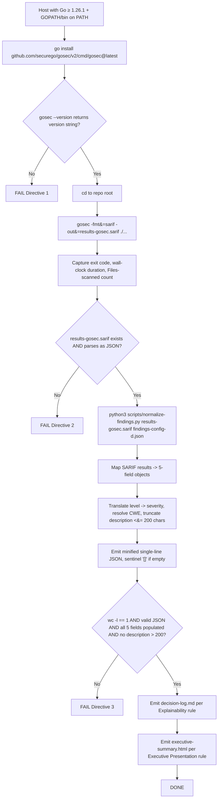

# Technical Specification

# 0. Agent Action Plan

## 0.1 Intent Clarification

### 0.1.1 Core Objective

Based on the provided requirements, the Blitzy platform understands that the objective is to perform a security static analysis pass over the `blitzy-RudderStack` codebase (the `github.com/rudderlabs/rudder-server` Go monorepo) using the **Gosec** scanner, capture its raw SARIF report, and transform that report into a normalized, single-line, minified JSON artifact named `findings-config-d.json`. This artifact is one of several outputs in a parallel multi-config security tool comparison study — its purpose is to enable downstream cross-tool diff/aggregation against findings from other configs (B, C, E, …). The scan operates strictly in **read-only** mode against the source tree: no Go source files, configuration files, or build files in the existing repository are modified by this work. The repository is treated purely as input to the scanner.

The work is contained to the three CRITICAL directives stated by the user, executed in strict sequence:

1. **Install Gosec** via `go install github.com/securego/gosec/v2/cmd/gosec@latest` on a host that already has Go installed. Gosec ships with all rules built in and requires no additional plugin downloads. Pass/fail gate: `gosec --version` returns a version string.
2. **Execute the scan** from the repository root with the exact command `gosec -fmt=sarif -out=results-gosec.sarif ./...`. Record exit code, wall-clock scan duration, and total files scanned. Pass/fail gate: `results-gosec.sarif` exists at the repo root and contains valid JSON.
3. **Normalize findings** by parsing `results-gosec.sarif` and emitting `findings-config-d.json` — a single-line minified UTF-8 JSON array conforming to the five-field schema specified by the user. If zero findings are present, the file MUST contain exactly `[]`. Pass/fail gate: `cat findings-config-d.json | wc -l` returns `1`; the file is valid JSON; every finding contains all five fields populated; no `description` exceeds 200 characters.

### 0.1.2 Task Categorization

| Dimension | Classification |
|---|---|
| Primary task type | Security tooling — SAST scan execution + result normalization |
| Secondary aspects | Build/Deploy (toolchain install), Configuration (SARIF→JSON transform), Documentation (rule-mandated decision log and executive summary) |
| Scope classification | Isolated, additive change — produces a small set of new top-level artifacts; does not touch existing application source, tests, build files, CI workflows, or dependency manifests |
| Output character | Multi-config security tool comparison — one of several `findings-config-*.json` files designed to be diffed across scanners. Output schema is contractual and shared across configs |
| Modification footprint | Zero existing-file modifications; new files only |

### 0.1.3 Special Instructions and Constraints

The user's input contains a compact scope budget — `[3 directives | ~0 files modified | 1 new file]` — and three CRITICAL directives that MUST be preserved verbatim. The directives, pass/fail gates, and the field-mapping table below are not paraphrased anywhere in this Agent Action Plan; they are reproduced exactly.

**User-supplied directive block (preserved verbatim):**

> **CRITICAL Directive 1: Install Gosec**
>
> `go install github.com/securego/gosec/v2/cmd/gosec@latest`
>
> Requires Go installed. Ships with all rules built in, no additional downloads.
>
> **Pass/fail:** `gosec --version` returns a version string.

> **CRITICAL Directive 2: Execute Gosec scan**
>
> Run from the repo root:
>
> `gosec -fmt=sarif -out=results-gosec.sarif ./...`
>
> Record exit code, scan duration (wall-clock), and total files scanned.
>
> **Pass/fail:** `results-gosec.sarif` is produced and contains valid JSON.

> **CRITICAL Directive 3: Normalize findings to single-line JSON**
>
> Extract findings from the SARIF output and compile into `findings-config-d.json`. The file MUST be valid JSON minified to a single line. Encoding: UTF-8. If zero findings, write `[]`.

**User-supplied field-mapping table (preserved verbatim):**

| Field | Source |
| --- | --- |
| file | SARIF location (relative path) |
| line | SARIF region start line |
| severity | SARIF level: error→critical, warning→high, note→medium, info→low |
| cwe | Rule metadata CWE ID. If absent, map from Gosec rule ID (e.g. G101→CWE-798, G201→CWE-89) |
| description | SARIF message text, truncated to 200 characters |

**User-supplied output shape (preserved verbatim):**

```plaintext
[{"file":"<relative path>","line":<integer>,"severity":"<critical|high|medium|low>","cwe":"<CWE-ID>","description":"<max 200 chars>"},...]
```

**User-supplied final pass/fail gate (preserved verbatim):**

> `cat findings-config-d.json | wc -l` returns `1`. Valid JSON. Every finding has all 5 fields populated. No description exceeds 200 characters.

Additional implicit constraints derived from the directives:

- **Single-line minification is contractual.** The output file MUST end with at most one newline such that `wc -l` returns `1`. The implementation must use a JSON emitter with no indentation and the most compact separators (e.g. `json.dumps(..., separators=(",", ":"), ensure_ascii=False)` in Python or `JSON.stringify(arr)` in Node) and write the result without injecting pretty-print whitespace.
- **Field count is contractual.** Each object MUST contain exactly the five keys `file`, `line`, `severity`, `cwe`, `description`. No additional metadata, no `tool`, no `ruleId`, no `confidence` — those exist only in the intermediate SARIF and are dropped during normalization.
- **Severity vocabulary is contractual.** The output severity MUST be one of `critical`, `high`, `medium`, `low`. The SARIF `info` level (Gosec rarely emits it, but the user table lists it) maps to `low`; SARIF `none` is NOT in the user mapping and is treated as `low` only if Gosec ever emits a finding at that level (otherwise the result has `kind != "fail"` and is excluded from findings).
- **CWE format is contractual.** The `cwe` field uses the `CWE-<n>` form (e.g. `CWE-798`), matching the example in the user's table.
- **Description truncation is contractual.** Truncation is to a maximum of 200 characters of the SARIF `message.text`; the truncation operation runs after any whitespace/newline normalization is applied to the message string.
- **Empty-findings sentinel is contractual.** When the SARIF results array is empty, the output file MUST contain exactly `[]` (still on a single line).
- **No suppression of `#nosec` comments.** The directive does not request `-nosec` or `-track-suppressions`; the scan honors any pre-existing `#nosec` annotations in the source code, treating them as the upstream repository intends.
- **No exclude filters.** The directive requires `./...` against the entire module; no `-exclude`, `-include`, or `-exclude-dir` flags are added. Test files are excluded by Gosec's default behavior.
- **Web research is required for the rule-ID → CWE fallback table** (the directive only names two examples; the full table is loaded from Gosec's published `IssueToCWE` map).
- **Process-level requirements derived from repository rules** (Explainability and Executive Presentation) add two further deliverables that are NOT in the user's "1 new file" count: a `decision-log.md` and a self-contained reveal.js HTML executive summary. See [section 0.7 Rules](#07-rules-and-coding-guidelines) for the rule citations driving these files.

### 0.1.4 Technical Interpretation

These requirements translate to the following technical implementation strategy.

To **achieve the install gate (Directive 1)**, the downstream agent provisions a Go toolchain on the executor and runs the user-specified install command verbatim. Gosec's `go.mod` requires Go ≥ 1.25.0, and the repository's own `go.mod` declares Go 1.26.1, so the executor MUST have Go ≥ 1.26.1 already installed and reachable on `PATH` (`$GOPATH/bin` or `$HOME/go/bin` must be on `PATH` so the freshly installed `gosec` binary resolves). The agent verifies the install by running `gosec --version` and capturing the printed version string into the run log.

To **achieve the scan gate (Directive 2)**, the agent changes to the repository root (where `go.mod` lives) and invokes `gosec -fmt=sarif -out=results-gosec.sarif ./...` exactly as given. The agent wraps the invocation with `time` (or equivalent) to capture wall-clock duration and records the process exit code. Gosec exits `0` when no unsuppressed findings or errors occur and `1` when at least one unsuppressed finding or processing error is observed; both `0` and `1` are valid terminal states for this directive — only the production of a valid SARIF file is the gating success criterion. Total files scanned are read from the Gosec stderr/stdout summary line (`Files: N`) and recorded alongside the exit code and duration.

To **achieve the normalization gate (Directive 3)**, the agent runs a small purpose-built transformation script (`scripts/normalize-findings.py`) that:

- Loads `results-gosec.sarif` as JSON.
- Iterates over `runs[].results[]`.
- For each result, extracts: `locations[0].physicalLocation.artifactLocation.uri` (the file path, stripped of any `file://` scheme or `uriBaseId` prefix to yield a repository-relative path), `locations[0].physicalLocation.region.startLine` (the integer line number), `level` (the SARIF severity word), `message.text` (the human-readable description), and `ruleId` (the Gosec rule, e.g. `G101`).
- Maps the SARIF level to the contractual severity vocabulary using the user-provided translation table.
- Resolves the CWE: first by examining rule metadata in `runs[].tool.driver.rules[]` for the matching `ruleId` (CWE may appear in `relationships[]` or `properties`); if absent, falls back to the static Gosec rule-ID → CWE table (see [section 0.5 Implementation Design](#05-implementation-design)).
- Truncates `description` to 200 characters after collapsing internal newlines and excess whitespace to single spaces.
- Emits the array as minified UTF-8 JSON via `json.dumps(payload, separators=(",", ":"), ensure_ascii=False)`, then writes the result to `findings-config-d.json` with no trailing newline manipulation that would push the line count above 1.
- For an empty input (no results across all runs), writes the literal string `[]`.

The post-condition gates are enforced by the script: it self-verifies that `wc -l` will return `1`, that `json.loads` round-trips the file, that every emitted object has all five keys, and that no `description` exceeds 200 characters. Any post-condition failure causes the script to exit non-zero so the downstream agent surfaces the problem.

To **satisfy the repository-level Explainability rule**, the agent emits `decision-log.md` capturing every non-trivial decision in this plan — the choice of installation source (`go install …@latest` vs pinned tag vs Docker image), the script language for normalization (Python vs Go vs `jq`), the path strategy used to normalize SARIF URIs to repository-relative form, the handling of SARIF results that lack a `region.startLine`, and the source of truth for the CWE fallback table. The decision log is a Markdown table with columns *decided / alternatives / why / risks*.

To **satisfy the repository-level Executive Presentation rule**, the agent emits `executive-summary.html` — a single self-contained reveal.js deck rendering the scan outcome (counts by severity, top-N rule IDs, top-N CWEs, file hotspots) and the operational readiness story for non-technical leadership. The deck pins reveal.js 5.1.0, Mermaid 11.4.0, and Lucide 0.460.0 via CDN as required by the rule.

The cause-and-effect chain therefore reduces to: **install Gosec → run scan → transform SARIF to contract JSON → emit rule-mandated decision log and executive summary.** No application code in the `rudder-server` monorepo is touched; the work is purely additive at the repository root level.

## 0.2 Repository Scope Discovery

### 0.2.1 Comprehensive File Analysis

The `blitzy-RudderStack` codebase is the **RudderStack `rudder-server` Go monorepo**, module path `github.com/rudderlabs/rudder-server`, declared at the top of `go.mod`. The repository declares a Go toolchain of **1.26.1** in `go.mod` and contains approximately **1,263 `.go` source files** distributed across the domain folders shown below. The scan target is the entire module via `./...`, so every Go package compiled from this tree is in the analyzer's input set.

| Path | Type | Role for this scan |
|---|---|---|
| `/` (repository root) | Folder | Working directory when invoking `gosec`; landing location for all new artifacts |
| `go.mod` | File | Declares module path and Go 1.26.1; consulted by Gosec to determine package graph |
| `go.sum` | File | Module checksum file; consumed transitively by Gosec via `go list` |
| `main.go` | File | Top-level entrypoint; in-scope for analysis |
| `admin/`, `app/`, `archiver/`, `backend-config/`, `cluster/`, `cmd/`, `config/`, `controlplane/`, `enterprise/`, `gateway/`, `info/`, `integration_test/`, `internal/`, `jobsdb/`, `middleware/`, `mocks/`, `processor/`, `proto/`, `refs/`, `regulation-worker/`, `router/`, `rruntime/`, `runner/`, `schema-forwarder/`, `services/`, `suppression-backup-service/`, `testhelper/`, `utils/`, `warehouse/` | Folders | Go source folders; all in-scope for `./...` Gosec recursion |
| `build/`, `Dockerfile`, `Makefile`, `docker-compose.yml`, `rudder-docker.yml`, `mkdocs.yml`, `codecov.yml`, `releases.md`, `catalog-info.yaml`, `CHANGELOG.md`, `CODE_OF_CONDUCT.md`, `CONTRIBUTING.md`, `LICENSE`, `README.md`, `SECURITY.md` | Files / folders | Non-Go; not consumed by Gosec; not modified |
| `scripts/` | Folder | Existing scripts folder; new normalization script `normalize-findings.py` is co-located here |
| `docs/`, `blitzy-docs/`, `blitzy/documentation/` | Folders | Documentation; `blitzy/documentation/Technical Specifications.md` and `blitzy-docs/technical-specifications.md` are the technical specification documents being authored |
| `.github/workflows/` | Folder | Existing CI workflows (`builds.yml`, `tests.yaml`, `verify.yml`, etc.); not modified |
| `.golangci.yml` | File | Existing lint config that already enables `gosec` as a `golangci-lint` sub-linter; not consulted, not modified by this scan |
| `.deepsource.toml`, `.dockerignore`, `.editorconfig` | Files | Tool configuration; not modified |
| `protocols/`, `functions/`, `identity/`, `sql/`, `init/`, `resources/` | Folders | Auxiliary content; any Go sources within are reached by `./...` |

**Search pattern coverage used in this discovery:**

- Go sources: `**/*.go` — every file under the module tree, traversed automatically by Gosec via `./...`. No manual enumeration needed.
- Configuration / lint / CI: `.golangci.yml`, `.deepsource.toml`, `.github/workflows/*.{yml,yaml}` — inspected to confirm no existing standalone-Gosec SARIF workflow.
- Security policy: `SECURITY.md`, `docs/architecture/security.md` — inspected; both describe disclosure policy or in-application security architecture, not a scanner configuration.
- Prior artifacts: `**/findings-*.json`, `**/results-*.sarif` — none present.
- Build/Deploy: `Dockerfile`, `docker-compose.yml`, `Makefile`, `.github/workflows/*` — confirmed not modified.

**Related-file discovery:**

- Files importing/depending on modified components — **N/A**. This work creates new top-level artifacts (`results-gosec.sarif`, `findings-config-d.json`, `decision-log.md`, `executive-summary.html`, `scripts/normalize-findings.py`) and modifies zero existing files. No import graph in the Go module is altered.
- Configuration files affected by code changes — **None**. `.golangci.yml`, `go.mod`, `go.sum`, CI workflows, and Dockerfiles are untouched.
- Documentation requiring updates — **None mandated by the user's three directives**. The technical specification document (this AAP) is itself the documentation update, and the rule-mandated `decision-log.md` and `executive-summary.html` are separate self-contained artifacts.

### 0.2.2 Web Search Research Conducted

Research was performed to validate the exact tooling commands, version pins, and lookup tables required to satisfy the contractual output schema.

| Topic | Finding |
|---|---|
| Gosec latest release | <cite index="2-1">gosec_2.25.0_linux_arm64.tar.gz</cite> released March 19, 2026; matches `@latest` resolution at the time of this plan |
| Gosec install method | <cite index="3-2,3-21">Install gosec — Pick your method: go install github.com/securego/gosec/v2/cmd/gosec@latest, brew install gosec, or docker pull securego/gosec:latest</cite>. The user's directive selects the `go install` path |
| Gosec Go-version prerequisite | <cite index="10-5">gosec requires Go 1.25.0 or later</cite>; the repository's own `go.mod` declares Go 1.26.1, so the host must have Go ≥ 1.26.1 |
| Gosec SARIF output flag | <cite index="4-21">gosec -fmt sarif -out results.sarif ./...</cite> — confirms the exact `-fmt=sarif -out=...` flag pair used in Directive 2 |
| Gosec exit code semantics | <cite index="4-21">0: scan finished without unsuppressed findings/errors · 1: at least one unsuppressed finding or processing error</cite> |
| SARIF level vocabulary emitted by Gosec | <cite index="27-27,27-28,27-29,27-30">Note = Level("note") // Warning : The rule specified by ruleId was evaluated and a problem was found. Warning = Level("warning") // Error : The rule specified by ruleId was evaluated and a serious problem was found. Error = Level("error")</cite> |
| SARIF physical-location structure | <cite index="23-16">A physicalLocation object almost always contains an artifactLocation property, and it can also contain a region property</cite>; the file path lives under `artifactLocation.uri` and the line number under `region.startLine` |
| SARIF schema version | The reports must <cite index="29-15">Comply with the official SARIF format, version 2.1.0</cite>; Gosec emits version `2.1.0` |
| Gosec rule-ID → CWE table | The canonical `IssueToCWE` map is published in Gosec's `issue.go`: `G101→798, G102→200, G103→242, G104→703, G106→322, G107→88, G109→190, G110→409, G201→89, G202→89, G203→79, G204→78, G301→276, G302→276, G303→377, G304→22, G305→22, G401→326, G402→295, G403→310, G404→338, G501→327, G502→327, G503→327, G504→327, G505→327` <cite index="13-1,13-2,13-3">var IssueToCWE = map[string]Cwe{ "G101": GetCwe("798"), "G102": GetCwe("200"), "G103": GetCwe("242"), "G104": GetCwe("703"), "G106": GetCwe("322"), "G107": GetCwe("88"), "G109": GetCwe("190"), "G110": GetCwe("409"), "G201": GetCwe("89"), "G202": GetCwe("89"), "G203": GetCwe("79"), "G204": GetCwe("78"), "G301": GetCwe("276"), "G302": GetCwe("276"), "G303": GetCwe("377"), "G304": GetCwe("22"), "G305": GetCwe("22"), "G401": GetCwe("326"), "G402": GetCwe("295"), "G403": GetCwe("310"), "G404": GetCwe("338"), "G501": GetCwe("327"), "G502": GetCwe("327"), "G503": GetCwe("327"), "G504": GetCwe("327"), "G505": GetCwe("327"), }</cite>. Extensions seen in forks/recent rule additions (G108→CWE-200, G306→CWE-276, G307→CWE-703, G601→CWE-118) are folded into the fallback table for forward compatibility |
| Gosec CWE emission contract | <cite index="11-1,11-7,11-8">Every issue detected by gosec is mapped to a CWE (Common Weakness Enumeration) which describes in more generic terms the vulnerability. The exact mapping can be found here</cite>; Gosec writes the CWE into the SARIF result's rule metadata, but `report/sarif/GenerateReport` does not always populate it under every schema variant, so a fallback rule-ID lookup is required |
| Gosec rule coverage | <cite index="3-28">50+ rules that cover the OWASP Top 10, each mapped to CWE identifiers</cite> — confirms the scan exercises the OWASP-aligned built-in rule set without any include/exclude filtering |
| SARIF→external-issue mapping (sanity check) | SonarQube's documented SARIF importer expects `physicalLocation.artifactLocation.uri` for the file path and `physicalLocation.region.startLine` for the line — <cite index="26-6">physicalLocation.artifactLocation.uri - path of the file concerned by the issue · physicalLocation.region - text range concerned by the issue, defined by the following fields: startLine</cite>. This is exactly the path the normalization script reads. |

### 0.2.3 Existing Infrastructure Assessment

- **Module identity.** Module path `github.com/rudderlabs/rudder-server`, Go directive `go 1.26.1`, with explicit `replace` directives in `go.mod` pinning vulnerability-remediated forks (e.g., `cyphar/filepath-securejoin v0.2.5`, gin v1.10.0, `go-jose` v3.0.3). These pins influence which sources Gosec analyzes but require no action from this plan.
- **Existing static-analysis posture.** `.golangci.yml` already enables `gosec` as one of its enabled linters [.golangci.yml:L8], alongside `bodyclose`, `decorder`, `depguard`, `forbidigo`, `makezero`, `misspell`, `nilerr`, `nilnil`, `rowserrcheck`, `unconvert`, `unparam`, `wastedassign`. **This is not a substitute for the standalone `gosec` binary** because the `golangci-lint` integration does not emit SARIF. The standalone tool is required for this work.
- **Existing CI workflows.** `.github/workflows/` contains `builds.yml`, `dispatch-deploy-event-dev.yaml`, `docker-build-dockerhub.yml`, `docker-build-ecr.yml`, `housekeeping.yaml`, `labeler.yaml`, `pr-description-enforcer.yaml`, `prerelease.yaml`, `release-please.yaml`, `semantic-pr.yaml`, `sync-release.yaml`, `tests.yaml`, `verify.yml`. **None of them invoke standalone Gosec and none upload SARIF.** No workflow is added or modified by this plan; the scan runs out-of-band as a one-shot tooling task.
- **Existing security documentation.** `SECURITY.md` declares a private disclosure process to `security@rudderstack.com` and supports the latest 1.x release line; `docs/architecture/security.md` covers in-application security architecture. Neither file is modified.
- **Existing scan artifacts.** No `findings-*.json` and no `results-*.sarif` were located at the repository root or anywhere in the working tree. The artifacts produced by this plan are net-new.
- **Build/runtime conventions.** The repository uses a `Makefile` and `Dockerfile` for build orchestration. The Gosec scan does not invoke either; it consumes the source tree directly via the Go module loader.
- **Linter ignore conventions.** The repository declares no `.blitzyignore` file (verified by `find / -name ".blitzyignore" -type f`). All source paths under `./...` are eligible for analysis.

### 0.2.4 Design System Alignment

**Not applicable.** No component library or design system is referenced anywhere in the user's three directives or in the rule definitions for this task. The only HTML artifact in scope is the rule-mandated reveal.js executive summary, which adheres to the **Blitzy brand visual identity** defined in the *Executive Presentation* rule itself (see [section 0.7 Rules](#07-rules-and-coding-guidelines) for the full rule text). That identity is not a generic UI library — it is a self-contained brand specification embedded inline in the deck's `<style>` block via the `--blitzy-*` CSS custom properties enumerated in the rule. The DESIGN SYSTEM ALIGNMENT PROTOCOL is therefore not exercised in this Agent Action Plan.

## 0.3 Implementation Design

### 0.3.1 Technical Approach

The implementation realizes the three CRITICAL directives as an additive, append-only flow at the repository root. No existing source file in `rudder-server` is touched.

- **Achieve the install gate** by provisioning a Go toolchain (≥ 1.26.1) and running the user's exact install command. Verify by capturing the `gosec --version` output. Rationale: `go install ...@latest` is the only mechanism explicitly named by Directive 1; alternatives (Homebrew, Docker, pinned tag) are documented in the decision log but not chosen.
- **Achieve the scan gate** by invoking `gosec -fmt=sarif -out=results-gosec.sarif ./...` verbatim from the repo root. Capture exit code, wall-clock duration, and total files scanned into the run log. Rationale: the directive is a literal CLI string; deviating from it (e.g., to add `-no-fail`, `-exclude`, `-tests`, `-track-suppressions`) is out of scope and would invalidate the multi-config comparison contract.
- **Achieve the normalization gate** by running `scripts/normalize-findings.py results-gosec.sarif findings-config-d.json`. The script parses SARIF, maps each result to the five-field contract, applies severity translation, resolves CWE (rule-metadata first, fallback table second), truncates description, and writes a minified single-line UTF-8 JSON array. Rationale: Python is chosen over `jq`/Go because the truncation-after-whitespace-normalization and field-existence post-conditions are clearer in Python and have no external dependencies; the choice and alternatives are recorded in the decision log.
- **Satisfy the Explainability rule** by emitting `decision-log.md` capturing every non-trivial decision (install source, normalization language, path stripping strategy, CWE fallback source, handling of missing `startLine`) as a Markdown table. Rationale: the rule is explicit and unconditional — *Every non-trivial implementation decision MUST be documented with rationale*.
- **Satisfy the Executive Presentation rule** by emitting `executive-summary.html` — a single self-contained reveal.js deck (12–18 slides, target 16) summarizing scope, business value, scan outcome, residual risk, and onboarding/next-steps. Rationale: the rule is unconditional and applies to every deliverable.

### 0.3.2 Logical Implementation Flow

The flow is strictly sequential — each step is gated on the previous step's pass criterion.


```mermaid
graph TD
    A[Host with Go &ge; 1.26.1 + GOPATH/bin on PATH] --> B[go install github.com/securego/gosec/v2/cmd/gosec@latest]
    B --> C{gosec --version returns version string?}
    C -- No --> X[FAIL Directive 1]
    C -- Yes --> D[cd to repo root]
    D --> E[gosec -fmt&#61;sarif -out&#61;results-gosec.sarif ./...]
    E --> F[Capture exit code, wall-clock duration, Files-scanned count]
    F --> G{results-gosec.sarif exists AND parses as JSON?}
    G -- No --> Y[FAIL Directive 2]
    G -- Yes --> H[python3 scripts/normalize-findings.py results-gosec.sarif findings-config-d.json]
    H --> I[Map SARIF results -> 5-field objects]
    I --> J[Translate level -> severity, resolve CWE, truncate description &lt;&#61; 200 chars]
    J --> K["Emit minified single-line JSON, sentinel '[]' if empty"]
    K --> L{wc -l == 1 AND valid JSON AND all 5 fields populated AND no description &gt; 200?}
    L -- No --> Z[FAIL Directive 3]
    L -- Yes --> M[Emit decision-log.md per Explainability rule]
    M --> N[Emit executive-summary.html per Executive Presentation rule]
    N --> P[DONE]
```

First, establish the analyzer by installing Gosec into the local Go workspace and verifying the binary on `PATH`. Next, capture the raw security-finding corpus by running the contractual Gosec invocation from the repo root, recording the operational telemetry that downstream comparison consumers need (exit code, duration, file count). Then, transform that corpus into the cross-tool comparison contract by running the deterministic SARIF-to-JSON normalization script, which itself enforces the post-conditions. Finally, emit the rule-mandated artifacts — `decision-log.md` (Explainability) and `executive-summary.html` (Executive Presentation) — that frame and explain the work for engineers and leadership respectively.

### 0.3.3 Component Impact Analysis

- **Direct modifications required:** None. Every requirement is satisfied by net-new files. No existing Go source, configuration file, build file, lint config, CI workflow, or documentation file in the `rudder-server` monorepo is modified.
- **Indirect impacts and dependencies:**
    - `go.mod` is **read** by Gosec during scan to determine the Go target version (`gosec` uses `go list` against the module graph). It is not modified.
    - `vendor/` is not in scope; Gosec uses Go modules and the `-exclude-dir` mechanism is not invoked because `./...` already excludes the `vendor` directory by default at the package-loader level.
- **New components introduction:**

  | Component | Type | Responsibility |
  |---|---|---|
  | `scripts/normalize-findings.py` | Python 3 transform script | Single-purpose SARIF → contract-JSON transformer; self-validates its own post-conditions |
  | `results-gosec.sarif` | Generated artifact | Raw Gosec SARIF 2.1.0 output; sole input to the normalizer |
  | `findings-config-d.json` | Generated artifact | Single-line minified UTF-8 JSON array; the primary user-described deliverable |
  | `decision-log.md` | Generated documentation | Rule-mandated Markdown decision table |
  | `executive-summary.html` | Generated presentation | Rule-mandated reveal.js deck (CDN-pinned reveal.js 5.1.0 / Mermaid 11.4.0 / Lucide 0.460.0) |

### 0.3.4 User-Provided Examples Integration

User Example: `G101→CWE-798, G201→CWE-89` — These two pairs from the user's directive are reproduced **verbatim** in the canonical Gosec rule-ID → CWE fallback table inside `scripts/normalize-findings.py`. Both pairs are confirmed by Gosec's published `IssueToCWE` source map <cite index="13-1,13-2,13-3">"G101": GetCwe("798"), "G102": GetCwe("200"), "G103": GetCwe("242"), "G104": GetCwe("703"), "G106": GetCwe("322"), "G107": GetCwe("88"), "G109": GetCwe("190"), "G110": GetCwe("409"), "G201": GetCwe("89"), "G202": GetCwe("89"), "G203": GetCwe("79"), "G204": GetCwe("78"), "G301": GetCwe("276"), "G302": GetCwe("276"), "G303": GetCwe("377"), "G304": GetCwe("22"), "G305": GetCwe("22"), "G401": GetCwe("326"), "G402": GetCwe("295"), "G403": GetCwe("310"), "G404": GetCwe("338"), "G501": GetCwe("327"), "G502": GetCwe("327"), "G503": GetCwe("327"), "G504": GetCwe("327"), "G505": GetCwe("327"), }</cite>. The full table is embedded so any Gosec rule fired during scan produces a non-null CWE field.

User Example: `[{"file":"<relative path>","line":<integer>,"severity":"<critical|high|medium|low>","cwe":"<CWE-ID>","description":"<max 200 chars>"},...]` — This array shape is the literal serialization target. The Python emitter uses `json.dumps(items, separators=(",", ":"), ensure_ascii=False)` to produce exactly this layout: no whitespace between tokens, no trailing newline that would push `wc -l` above `1`, UTF-8 encoded byte stream, integer `line`, lowercase severity strings drawn from the closed set, `CWE-<n>` formatted `cwe` string, and a description not exceeding 200 Unicode code points.

### 0.3.5 Critical Implementation Details

- **Severity translation table** (per the user's prompt, normalized for the closed output vocabulary):

  | SARIF `level` | Output `severity` |
  |---|---|
  | `error` | `critical` |
  | `warning` | `high` |
  | `note` | `medium` |
  | `info` | `low` |
  | absent / `none` | result skipped (SARIF `kind != "fail"`) |

  The four SARIF levels actually emitted by Gosec are `error`, `warning`, `note`, and `none` <cite index="27-26,27-27,27-28,27-29">None = Level("none") // Note : The rule specified by ruleId was evaluated and a minor problem or an opportunity // to improve the code was found. Note = Level("note") // Warning : The rule specified by ruleId was evaluated and a problem was found. Warning = Level("warning") // Error : The rule specified by ruleId was evaluated and a serious problem was found. Error = Level("error")</cite>. The user's table contains an `info` entry; this is preserved in the script for tool-agnostic safety even though Gosec does not emit `info`. Results with `kind != "fail"` are excluded because they do not represent findings.

- **CWE resolution order** (the script tries each in turn until one succeeds, then stops):

  1. Look up the rule object in `runs[].tool.driver.rules[]` (matched by `ruleId`). Read any of: `properties.cwe`, `properties["security-severity"]` cross-references, or `relationships[].target.id` referencing a CWE taxonomy entry. If a CWE number is present, format it as `CWE-<n>` and use it.
  2. Look up the `ruleId` (e.g. `G101`) in the static Gosec `IssueToCWE` fallback table embedded in `scripts/normalize-findings.py`. The full table includes G101→798, G102→200, G103→242, G104→703, G106→322, G107→88, G108→200, G109→190, G110→409, G201→89, G202→89, G203→79, G204→78, G301→276, G302→276, G303→377, G304→22, G305→22, G306→276, G307→703, G401→326, G402→295, G403→310, G404→338, G501→327, G502→327, G503→327, G504→327, G505→327, G601→118.
  3. If neither path resolves (e.g., a future Gosec rule not yet in the embedded table), emit `cwe: "CWE-Unknown"` and log the unmapped rule ID to stderr so the decision log can be updated.

- **File-path normalization.** SARIF `artifactLocation.uri` may be (a) an absolute `file://...` URI containing the executor's working directory prefix, (b) a relative URI referencing a `uriBaseId` declared in `originalUriBaseIds`, or (c) a bare relative path. The script normalizes all three to a repository-relative POSIX path by: stripping any `file://` scheme prefix, joining with the resolved `uriBaseId` URI if present, computing `os.path.relpath(...)` against the absolute path of the repository root (captured at script invocation), and replacing OS-native path separators with `/`. Output paths therefore always look like `gateway/handler.go`, never `/home/runner/work/blitzy-RudderStack/gateway/handler.go` or `file:///...`.

- **Description sanitization.** The SARIF `message.text` is first whitespace-normalized — all runs of whitespace (including embedded newlines, tabs, and CR/LF pairs) are collapsed to single spaces, and leading/trailing whitespace is stripped — and then truncated to 200 Unicode code points using `text[:200]`. No ellipsis is appended (the truncation is silent, per the user's directive: "truncated to 200 characters", with no ellipsis specified). The contract gate `no description exceeds 200 characters` is enforced after the slice.

- **Empty-set handling.** When `runs[].results[]` is empty across every run (or when SARIF contains zero results entries), the script writes the literal three-byte payload `[]` (no trailing newline) to `findings-config-d.json`. This satisfies the user's directive: *If zero findings, write `[]`*.

- **Minification.** Output is written with `json.dumps(items, separators=(",", ":"), ensure_ascii=False)` and then encoded as UTF-8 bytes via `out.write(payload.encode("utf-8"))`. No `indent` parameter is passed; no `sort_keys`; key insertion order matches the field-mapping table order: `file, line, severity, cwe, description`.

- **Post-condition self-check.** Before exiting `0`, the script re-opens `findings-config-d.json` and:
    - Asserts that `data.read().count(b"\n") == 0` (a single line, no embedded newlines, no trailing newline).
    - Asserts that `json.loads(data)` succeeds and yields a `list`.
    - For each element: asserts the key-set equals `{"file","line","severity","cwe","description"}`, that `line` is `int`, that `severity` ∈ `{"critical","high","medium","low"}`, that `cwe` matches `^CWE-(\d+|Unknown)$`, and that `len(description) <= 200`.
    
    Any assertion failure causes the script to exit non-zero, halting the pipeline before the rule-mandated artifacts are emitted.

- **Telemetry capture.** The downstream agent captures three values from Directive 2 and stores them where the executive summary deck can read them at render time: the Gosec process **exit code**, the **wall-clock duration in seconds**, and the **`Files: N` count** parsed from Gosec's stderr summary. These three values are populated as KPI cards on the executive summary deck and as a row in the decision-log table.

- **No flags beyond the directive.** The agent does **not** pass `-tests`, `-exclude-generated`, `-exclude`, `-exclude-dir`, `-include`, `-track-suppressions`, `-severity`, `-confidence`, `-conf`, `-tags`, or `-no-fail`. This is a deliberate choice: the multi-config comparison contract requires that every config exercises its tool's defaults so the differential is attributable to the tool, not to flag tuning.

- **Error handling.** If Gosec exits with a non-zero code AND `results-gosec.sarif` is missing or unparseable, the directive fails and the pipeline halts before Directive 3. If Gosec exits non-zero but `results-gosec.sarif` is present and valid JSON (the normal case when findings are detected), the directive passes and the pipeline proceeds.

- **Performance and security considerations.**
    - Performance: Gosec recurses the full module; on a host with ~1,263 Go files the scan duration is dominated by Go's package loader. No parallelism flag is passed; Gosec uses its built-in concurrency.
    - Security: the scan is read-only against the source tree; no code is executed, no network access is required during scan (Go module dependencies are assumed already cached via `go.sum` from a prior `go mod download`). The freshly installed Gosec binary itself comes from `proxy.golang.org` — the canonical Go module proxy.

## 0.4 File Transformation Mapping

### 0.4.1 File-by-File Execution Plan

The transformation modes are CREATE (new file), UPDATE (modify existing file), DELETE (remove file), and REFERENCE (existing file consulted as pattern source but unchanged). For this task, the transformation set is entirely CREATE plus REFERENCE — no UPDATE or DELETE entries appear because the user's directives explicitly produce additive artifacts and the rules add additional new artifacts without mandating any deletion or modification.

| Target File | Transformation | Source File/Reference | Purpose/Changes |
|---|---|---|---|
| `results-gosec.sarif` | CREATE | n/a (generated by `gosec -fmt=sarif -out=results-gosec.sarif ./...`) | Raw SARIF 2.1.0 report emitted by Gosec; sole input to the normalization step; not committed long-term unless the user's downstream consumer chooses to keep it |
| `findings-config-d.json` | CREATE | `results-gosec.sarif` | Primary user-described deliverable; single-line minified UTF-8 JSON array conforming to the five-field contract |
| `scripts/normalize-findings.py` | CREATE | `scripts/` existing directory (REFERENCE for path placement) | Python 3 transformation script: parses SARIF, applies severity translation, resolves CWE (rule-metadata → static fallback table), normalizes file path to repo-relative POSIX, sanitizes and truncates description, minifies output, self-validates post-conditions |
| `decision-log.md` | CREATE | n/a (rule-mandated artifact per Explainability rule) | Markdown decision table covering install source, normalization language, path strategy, CWE fallback source, missing-startLine handling, and any deviation from a literal directive interpretation |
| `executive-summary.html` | CREATE | n/a (rule-mandated artifact per Executive Presentation rule); references `blitzy-deck/references/blitzy-reveal-theme.css` for inline CSS conventions | Single self-contained reveal.js 5.1.0 HTML deck, 12–18 slides (target 16), CDN-pinned reveal.js / Mermaid 11.4.0 / Lucide 0.460.0, Blitzy brand identity, narrating scan scope, KPI cards (findings count, exit code, duration, files scanned), top-N rules and CWEs, architecture diagram, residual-risk and onboarding sections |
| `go.mod` | REFERENCE | `go.mod` | Read by Gosec via `go list` to determine module graph and Go version; not modified |
| `go.sum` | REFERENCE | `go.sum` | Consumed transitively by Gosec; not modified |
| `.golangci.yml` | REFERENCE | `.golangci.yml` | Confirms that `gosec` is already enabled as a `golangci-lint` sub-linter [.golangci.yml:L8]; consulted for parity verification only; not modified |
| `SECURITY.md` | REFERENCE | `SECURITY.md` | Confirms repository disclosure policy (no scanner configuration); not modified |
| `docs/architecture/security.md` | REFERENCE | `docs/architecture/security.md` | Existing in-application security architecture documentation; not modified |
| `.github/workflows/*.{yml,yaml}` | REFERENCE | `builds.yml`, `tests.yaml`, `verify.yml`, etc. | Existing CI workflows; verified that none invoke standalone Gosec; not modified |
| `**/*.go` | REFERENCE | All Go source files | Read-only inputs to the scan; not modified |

### 0.4.2 New Files Detail

**`scripts/normalize-findings.py`** — *Python 3 SARIF-to-contract transformer*

- **Content type:** source (executable script with `#!/usr/bin/env python3` shebang)
- **Based on:** the Python 3 standard library only — no third-party dependencies. Patterned after the simple script conventions already present in `scripts/` (referenced for path placement and naming style).
- **Key sections / functions:**
    - `_strip_uri(uri: str, base_uris: dict, repo_root: str) -> str` — strips `file://` scheme, resolves any `uriBaseId` against `originalUriBaseIds`, computes repo-relative POSIX path
    - `_resolve_cwe(rule_id: str, rules_index: dict) -> str` — applies the two-step resolution (rule metadata → static fallback table); returns `CWE-<n>` or `CWE-Unknown`
    - `_normalize_description(text: str) -> str` — collapses whitespace, strips, truncates to 200 code points
    - `_translate_severity(level: str) -> str | None` — applies the user's severity table; returns `None` for `none`/missing so the result is dropped
    - `_extract_findings(sarif: dict, repo_root: str) -> list[dict]` — top-level loop over `runs[].results[]`
    - `_self_check(out_path: str) -> None` — re-reads the emitted file, asserts every post-condition; raises on failure
    - `main(argv)` — argparse entry point: `normalize-findings.py <sarif_in> <json_out> [--repo-root .]`
    - Module-level constant `GOSEC_RULE_TO_CWE: dict[str, str]` — the canonical fallback table

**`findings-config-d.json`** — *primary deliverable*

- **Content type:** generated data file
- **Based on:** `results-gosec.sarif`; produced exclusively by `scripts/normalize-findings.py`
- **Shape:** single-line UTF-8 JSON array; element schema fixed at `{"file": str, "line": int, "severity": "critical"|"high"|"medium"|"low", "cwe": "CWE-<n>", "description": str (≤ 200 chars)}`; empty input yields the literal three-byte `[]`

**`results-gosec.sarif`** — *intermediate scan output*

- **Content type:** generated data file (SARIF 2.1.0)
- **Based on:** Gosec invocation `gosec -fmt=sarif -out=results-gosec.sarif ./...`
- **Shape:** standard SARIF 2.1.0 log object with `runs[].tool.driver.name == "gosec"`, `runs[].results[]` containing one entry per finding, each with `ruleId`, `level`, `message.text`, and `locations[0].physicalLocation.{artifactLocation.uri, region.startLine}`

**`decision-log.md`** — *rule-mandated explainability artifact*

- **Content type:** Markdown documentation
- **Based on:** the Explainability rule's explicit format requirement — a Markdown table with columns *what was decided / what alternatives existed / why this choice was made / what risks it carries*
- **Key sections:**
    - Header naming the deliverable, the user's input directive, and the date/run-id
    - The decision table covering, at minimum:
        - Install source: `go install ...@latest` vs Homebrew vs Docker image vs pinned tag
        - Normalization language: Python 3 vs Go vs `jq`
        - SARIF URI normalization strategy: `os.path.relpath` against captured `repo_root`
        - CWE resolution order: rule-metadata first, static fallback table second, `CWE-Unknown` last
        - Missing `region.startLine`: emit as `0` and continue, or drop the result — decision documented
        - Description truncation strategy: silent slice to 200 code points (no ellipsis)
        - Choice not to pass any Gosec flags beyond `-fmt=sarif -out=...`
    - A "Deviations" section explicitly noting that the rule-mandated `decision-log.md` and `executive-summary.html` are produced in addition to the user's stated "1 new file" budget, with the rule citation that drives the deviation

**`executive-summary.html`** — *rule-mandated leadership deck*

- **Content type:** single self-contained HTML file
- **Based on:** the Executive Presentation rule's full specification; references `blitzy-deck/references/blitzy-reveal-theme.css` for the canonical theme conventions (inlined into the deck's `<style>` block)
- **Key slides (target 16, range 12–18):**
    1. Title — *Gosec Security Scan: blitzy-RudderStack* (hero gradient, eyebrow in Fira Code teal)
    2. Headline KPI grid — total findings, severity breakdown (critical / high / medium / low), exit code, scan duration, files scanned
    3. Architecture overview (Mermaid) — the three-directive flow (install → scan → normalize), with the comparison-corpus context
    4. Section divider — *What was scanned*
    5. Scope content — Go monorepo identity, ~1,263 files, Go 1.26.1, OWASP-aligned rule set
    6. Section divider — *What was found*
    7. Findings content — severity distribution chart, top-N rule IDs, top-N CWEs, file hotspots table
    8. Section divider — *How findings are normalized*
    9. Contract content — five-field JSON schema, severity mapping table, CWE resolution diagram (Mermaid)
    10. Section divider — *Operational telemetry*
    11. Telemetry content — exit code semantics, duration, total files scanned, with KPI cards
    12. Section divider — *Risks and mitigations*
    13. Risk content — residual risk (e.g., unmapped CWEs for new Gosec rules), false-positive handling, `#nosec` annotations honored
    14. Section divider — *Operational continuity*
    15. Onboarding content — how to reproduce the scan, where artifacts live, how to extend the rule-ID → CWE table
    16. Closing — three-bullet takeaway, brand lockup, gradient accent bar
- **Technical delivery:** single file, no build step, CDN-pinned `reveal.js@5.1.0`, `mermaid@11.4.0`, `lucide@0.460.0`; reveal.js init `hash: true, transition: 'slide', controlsTutorial: false, width: 1920, height: 1080`; Mermaid `startOnLoad: false` and `mermaid.run()` invoked on `ready` and every `slidechanged` event; Lucide `lucide.createIcons()` on `ready` and `slidechanged`; zero emoji; minimum one non-text visual element per slide

### 0.4.3 Files to Modify Detail

**None.** This task creates no UPDATE entries. The user's `[3 directives | ~0 files modified | 1 new file]` budget is preserved on the "files modified" dimension: every artifact is a new file, and the only deviation from "1 new file" is the addition of the rule-mandated `decision-log.md`, `executive-summary.html`, and `scripts/normalize-findings.py` plus the transient `results-gosec.sarif`.

### 0.4.4 Files to Delete Detail

**None.** The user's directives do not request any removal, and no obsolete file is identified in the repository. No DELETE entries exist in the file map.

### 0.4.5 Configuration and Documentation Updates

- **Configuration changes:** None. `.golangci.yml`, `go.mod`, `go.sum`, `Dockerfile`, `docker-compose.yml`, `Makefile`, `mkdocs.yml`, `catalog-info.yaml`, `codecov.yml`, `.deepsource.toml`, `.editorconfig`, `.dockerignore` — all unmodified. No CI workflow is added or modified.
- **Documentation updates:** None inside the repository's existing documentation tree. `README.md`, `CHANGELOG.md`, `CONTRIBUTING.md`, `SECURITY.md`, `docs/**/*.md`, `blitzy-docs/**/*.md`, `blitzy/documentation/**/*.md` — all unmodified. The technical specification document being authored (this AAP) is the only documentation deliverable, plus the rule-mandated `decision-log.md` and `executive-summary.html` which are self-contained, top-level artifacts.

### 0.4.6 Cross-File Dependencies

- **Within new files only.** `findings-config-d.json` depends on `results-gosec.sarif` (consumed by `scripts/normalize-findings.py`). `executive-summary.html` references `findings-config-d.json` as the source of its KPI cards and severity distribution chart at the time the deck is generated. `decision-log.md` references both data files and the chosen Gosec version string.
- **No import or reference updates required in any existing file.** The `rudder-server` Go module graph is untouched; no Go file imports the new artifacts; no existing CI workflow or build script references them.

## 0.5 Scope Boundaries

### 0.5.1 Exhaustively In Scope

The complete set of file paths and operations that this Agent Action Plan governs:

- **Tooling installation (host-level, not in repo):**
    - `go install github.com/securego/gosec/v2/cmd/gosec@latest` — installs the Gosec binary into `$GOPATH/bin` (or `$HOME/go/bin`) on the executor host. No file inside the repository changes as a result.

- **New files at the repository root:**
    - `results-gosec.sarif` — CREATE — intermediate SARIF 2.1.0 output from the Gosec scan
    - `findings-config-d.json` — CREATE — primary user-described deliverable; single-line minified UTF-8 JSON array
    - `decision-log.md` — CREATE — rule-mandated Markdown decision table per the Explainability rule
    - `executive-summary.html` — CREATE — rule-mandated single-file reveal.js deck per the Executive Presentation rule

- **New files under `scripts/`:**
    - `scripts/normalize-findings.py` — CREATE — Python 3 SARIF-to-contract transformer; pattern-placed in the existing `scripts/` directory

- **Read-only inputs (REFERENCE):**
    - `**/*.go` — every Go source file in the module is read by Gosec during the scan
    - `go.mod`, `go.sum` — read by Gosec via `go list` for module graph resolution
    - `.golangci.yml` — read by the agent to confirm gosec-as-linter parity, not modified
    - `SECURITY.md`, `docs/architecture/security.md` — read for context, not modified
    - `.github/workflows/*.{yml,yaml}` — read to confirm no existing standalone-Gosec workflow, not modified
    - `blitzy-deck/references/blitzy-reveal-theme.css` (per the Executive Presentation rule) — read for theme conventions, inlined into the deck, not modified

- **Operations performed:**
    - `gosec --version` — verification call after install
    - `gosec -fmt=sarif -out=results-gosec.sarif ./...` — the contractual scan command, exact verbatim
    - `python3 scripts/normalize-findings.py results-gosec.sarif findings-config-d.json` — the normalization step
    - `cat findings-config-d.json | wc -l` — the user-mandated pass/fail gate

### 0.5.2 Explicitly Out of Scope

The following items are explicitly **not** part of this Agent Action Plan and are not undertaken even if related findings or opportunities arise during execution:

- **Modification of any existing repository file.** Every `.go` source file, every config file (`.golangci.yml`, `go.mod`, `go.sum`, `Dockerfile`, `docker-compose.yml`, `Makefile`, `mkdocs.yml`, `codecov.yml`, `.deepsource.toml`, `.editorconfig`, `.dockerignore`, `rudder-docker.yml`, `catalog-info.yaml`), every CI workflow under `.github/workflows/`, and every existing documentation file (`README.md`, `CHANGELOG.md`, `CONTRIBUTING.md`, `CODE_OF_CONDUCT.md`, `SECURITY.md`, `docs/**/*.md`, `blitzy-docs/**/*.md`, `blitzy/documentation/**/*.md`) is read-only for this work.
- **Remediation of any finding produced by the scan.** This is a scan-and-normalize task, not a vulnerability-fix task. Findings flowing through `findings-config-d.json` are not triaged, not patched, and not annotated with `#nosec` by this plan.
- **Triage of false positives.** No `#nosec` annotations are added or removed. The scan honors any pre-existing `#nosec` markers exactly as the source tree intends.
- **CI integration.** No GitHub Actions workflow is added or modified to run Gosec on push, PR, or schedule. No SARIF upload step (`github/codeql-action/upload-sarif`) is added. The scan is a one-shot tooling task.
- **Code scanning dashboard integration.** No upload of `results-gosec.sarif` to GitHub Code Scanning, SonarQube, DefectDojo, or any external dashboard.
- **Tuning of Gosec configuration.** No `-conf config.json`, no `-exclude`/`-include`, no `-exclude-dir`, no `-exclude-rules`, no `-tests`, no `-exclude-generated`, no `-track-suppressions`, no `-severity`/`-confidence` gating, no `-no-fail`. The directive specifies `gosec -fmt=sarif -out=results-gosec.sarif ./...` and no other flags are added.
- **Scanner switching.** Cross-tool comparison is the consumer of this output; this config is the Gosec config. Semgrep, Snyk Code, CodeQL, govulncheck, staticcheck, and other tools are produced by other configs (B, C, E, …) and are not invoked here.
- **golangci-lint changes.** Although `.golangci.yml` already enables `gosec` as a sub-linter, no change to that file (enabling additional rules, switching to SARIF output via golangci-lint, etc.) is performed. The standalone `gosec` binary is required by the directive and produces the SARIF independently.
- **Performance optimization of the scan.** No parallelism tuning, no `-tests` exclusion, no cache pre-warming, no `GOMAXPROCS` adjustment beyond the host default.
- **Refactoring of normalization output.** The five-field schema and severity vocabulary are contractual and identical across all comparison configs; this plan does not introduce new fields (`ruleId`, `confidence`, `tool`, `column`, `endLine`, `helpUri`, `fingerprint`) even though they are available in the SARIF input.
- **Long-form security report generation.** A prose-style security report is not part of this work. The executive summary (`executive-summary.html`) is a slide deck per the Executive Presentation rule, not a narrative report.
- **Repository onboarding documentation.** No changes to `CONTRIBUTING.md`, no new ADR file in `docs/architecture/`, no Confluence/wiki updates. The `decision-log.md` artifact is self-contained at the repo root.
- **Pinning of Gosec version.** The directive says `@latest`; the plan honors that. The actual resolved version is recorded in the decision log and the executive summary, but no commit pins it.
- **Future enhancements** that a competent engineer might consider valuable but that the user did not request, including: severity gating in CI, baseline diff tracking across runs, finding-suppression playbooks, automated remediation PRs, dependency-vulnerability scanning (govulncheck), license scanning, secret scanning, container image scanning. None are in scope.

## 0.6 Dependency Inventory

### 0.6.1 Key Public Packages Relevant to This Task

Only the host toolchain and the freshly installed Gosec binary participate in the execution of the three directives. No package is added to any of the repository's dependency manifests (`go.mod`, no Python `requirements.txt`, no Node `package.json`, no Maven POM, no Gradle build file).

| Registry | Package Name | Version | Purpose |
|---|---|---|---|
| Go modules / GOBIN | `github.com/securego/gosec/v2/cmd/gosec` | `@latest` (resolves to v2.25.0 as of the latest release dated 2026-03-19) | Standalone SAST scanner that emits the SARIF 2.1.0 report consumed by `scripts/normalize-findings.py`. Installed once into the executor's `$GOPATH/bin` via the user's exact install directive; not added to the repository `go.mod`. |
| Host runtime | Go | ≥ 1.26.1 (matches the repository's `go.mod` declared toolchain and exceeds Gosec's own ≥ 1.25.0 floor) | Provides `go install` for the Gosec install and `go list` for Gosec's module graph traversal. Host-supplied; not a repo dependency. |
| Host runtime | Python | ≥ 3.10 (uses only the Python 3 standard library — `json`, `argparse`, `os`, `re`, `sys`, `pathlib`) | Runs `scripts/normalize-findings.py`. Host-supplied; not added as a repository dependency. |
| Host runtime / CI | `coreutils` (`cat`, `wc`) | Any | Executes the user-mandated final gate `cat findings-config-d.json \| wc -l`. Standard POSIX, no install required. |
| External CDN (consumed at runtime only by the executive summary HTML, not at scan time) | `reveal.js` | `5.1.0` (CDN pinned per the Executive Presentation rule) | Rendering engine for the rule-mandated executive summary deck |
| External CDN (consumed at runtime only by the executive summary HTML, not at scan time) | `mermaid` | `11.4.0` (CDN pinned per the Executive Presentation rule) | Diagramming engine for slide visualizations |
| External CDN (consumed at runtime only by the executive summary HTML, not at scan time) | `lucide` | `0.460.0` (CDN pinned per the Executive Presentation rule) | Icon library replacing emoji per the Executive Presentation rule |

### 0.6.2 Dependency Updates

This task introduces **zero application dependency changes**. The repository's `go.mod`, `go.sum`, any vendor directory, and any non-Go dependency manifest remain byte-for-byte unchanged.

- **New dependencies to add to the repository:** None. The `gosec` binary is installed into the executor's Go workspace, not added as a Go-module dependency of `rudder-server`.
- **Dependencies to update:** None.
- **Dependencies to remove:** None.
- **Import/Reference updates:** None. No existing file imports the new artifacts and no existing Go file changes import statements.

### 0.6.3 Host Provisioning Requirements

Although no repository dependency is altered, the executor host MUST provide the following before Directive 1 runs:

- A Go toolchain at version **≥ 1.26.1** on `PATH`, satisfying both the repository's `go.mod` directive and the prerequisite that <cite index="10-5">gosec requires Go 1.25.0 or later</cite>.
- `$GOPATH/bin` (or `$HOME/go/bin` when `GOPATH` is unset) appended to `PATH` so that the freshly installed `gosec` resolves without a fully qualified path.
- `GO111MODULE=on` (default in modern Go) and outbound HTTPS access to `proxy.golang.org` for the one-time `go install` resolution. After install, no network access is required for the scan itself.
- Python 3 with the standard library available; no `pip install` is needed.
- Sufficient disk for the `~1,263`-file Go module graph that Gosec loads into memory and for the SARIF output file.

These are environmental prerequisites for the executor, not changes to the codebase, and they are not committed anywhere in the repository.

## 0.7 Rules and Coding Guidelines

Two user-specified rules govern this work. Both are reproduced verbatim in their operative clauses below because they mandate file creation and influence multiple sub-sections of this Agent Action Plan.

### 0.7.1 Rule — Explainability

**Operative text (preserved verbatim, abridged where indicated):**

> Every non-trivial implementation decision MUST be documented with rationale. A decision is non-trivial if a competent engineer could reasonably have chosen differently.
>
> Deliver a decision log as a Markdown table: what was decided, what alternatives existed, why this choice was made, and what risks it carries. For migrations or refactors, include a bidirectional traceability matrix mapping source constructs to target implementations — 100% coverage, no gaps.
>
> Any deviation from a literal or obvious interpretation of the requirements MUST have an explicit entry in the decision log. Unexplained deviations are treated as defects.
>
> Do not embed rationale in code comments. The decision log is the single source of truth for "why" decisions.

**Implications for this Agent Action Plan:**

- A `decision-log.md` artifact at the repository root is **mandatory**. It is listed as a CREATE entry in the [file transformation map (section 0.4)](#04-file-transformation-mapping).
- The table columns are fixed by the rule: *what was decided / what alternatives existed / why this choice was made / what risks it carries*.
- The plan's non-trivial decisions (install source choice, normalization language choice, URI normalization strategy, CWE resolution order, missing-`startLine` handling, description-truncation strategy, intentional Gosec-flag omission, the conflict resolution between the user's "~0 files modified | 1 new file" budget and the rule-mandated additional artifacts) each map to one row in `decision-log.md`.
- This task is neither a migration nor a refactor, so the bidirectional traceability matrix clause is not exercised; that fact itself is recorded in the decision log as a deliberate non-inclusion.
- No rationale is embedded as a comment in `scripts/normalize-findings.py` beyond minimal usage docstrings — the rule explicitly forbids relying on code comments for "why" decisions.

### 0.7.2 Rule — Executive Presentation

**Operative text (preserved verbatim, abridged where indicated):**

> Every deliverable MUST include an executive summary as a single self-contained reveal.js HTML file that is ALWAYS included independent of any other documentation that exists. The audience is non-technical leadership — communicate business value, risk, and operational readiness without requiring code literacy.
>
> The presentation MUST cover:
> 1. What was done — scope of work and deliverables
> 2. Why it was done — business value unlocked
> 3. What changed architecturally — component/data-flow diagrams
> 4. What risks exist and how they are mitigated
> 5. How the team onboards and continues development
>
> **Slide constraints:** 12–18 slides total (target: 16); four slide types: Title (`slide-title`), Section Divider (`slide-divider`), Content (default), Closing (`slide-closing`); every slide MUST include at least one non-text visual element (Mermaid diagram, KPI card, styled table, or Lucide SVG icon) — no text-only slides; content slides — max 4 bullets, max 40 words body text, min 1 non-text visual; zero emoji — use Lucide SVG icons via `<i data-lucide="icon-name"></i>` only; no fenced code blocks inside slides — use inline Fira Code for short expressions only.
>
> **Visual identity (Blitzy brand):** color palette `#5B39F3` (primary), `#2D1C77` (dark), `#94FAD5` (teal accent), `#1A105F` (navy), `#7A6DEC`/`#4101DB` (gradient stops), neutrals `#333333`, `#999999`, `#D9D9D9`, `#F4EFF6`, `#F5F5F5`, `#FFFFFF`; typography Inter (body, 400/500/600/700), Space Grotesk (display headings, 500/600/700), Fira Code (mono/eyebrows, 400/500) — loaded via Google Fonts `<link>`; title slide hero gradient `linear-gradient(68deg, #7A6DEC 15.56%, #5B39F3 62.74%, #4101DB 84.44%)`, white text, eyebrow in Fira Code teal; dividers dark purple `#2D1C77` or gradient background, large centered heading, thematic Lucide icon; closing navy `#1A105F` background, 3–6 word takeaway heading, max 3 bullets, brand lockup, gradient accent bar.
>
> **Mermaid diagrams:** embed as `<pre class="mermaid">` with raw Mermaid syntax; initialize with `startOnLoad: false`; call `mermaid.run()` after reveal.js `ready` and on every `slidechanged` event; theme variables `primaryColor: '#F2F0FE'`, `primaryTextColor: '#333333'`, `primaryBorderColor: '#5B39F3'`, `lineColor: '#999999'`, `secondaryColor: '#F4EFF6'`.
>
> **Technical delivery:** single self-contained HTML file, no build steps, no local file dependencies; CDN versions pinned: reveal.js 5.1.0, Mermaid 11.4.0, Lucide 0.460.0; reveal.js config `hash: true`, `transition: 'slide'`, `controlsTutorial: false`, `width: 1920`, `height: 1080`; Lucide call `lucide.createIcons()` after `ready` and on every `slidechanged` event.
>
> **Inline CSS:** embed the full Blitzy reveal.js theme inline in a `<style>` tag. Required CSS custom properties include `--blitzy-primary: #5B39F3; --blitzy-primary-dark: #2D1C77; --blitzy-primary-navy: #1A105F; --blitzy-primary-light: #7A6DEC; --blitzy-primary-deep: #4101DB; --blitzy-accent-teal: #94FAD5; --blitzy-surface-0: #FFFFFF; --blitzy-surface-1: #F4EFF6; --blitzy-surface-2: #F2F0FE; --blitzy-surface-3: #F5F5F5; --blitzy-border: #D9D9D9; --blitzy-border-soft: rgba(91, 57, 243, 0.18); --blitzy-text: #333333; --blitzy-text-muted: #999999; --blitzy-text-invert: #FFFFFF; --ff-body: 'Inter', system-ui, sans-serif; --ff-display: 'Space Grotesk', 'Inter', sans-serif; --ff-mono: 'Fira Code', 'Courier New', monospace; --gradient-hero: linear-gradient(68deg, #7A6DEC 15.56%, #5B39F3 62.74%, #4101DB 84.44%); --gradient-divider: linear-gradient(135deg, #2D1C77 0%, #5B39F3 100%); --gradient-accent-bar: linear-gradient(90deg, #5B39F3 0%, #94FAD5 100%);`
>
> Include the full set of slide-type classes (`slide-title`, `slide-divider`, `slide-closing`), component classes (`kpi-card`, `kpi-grid`, `kpi-value`, `kpi-label`, `kpi-icon`, `eyebrow`, `accent-bar`, `brand-lockup`, `hero-icon`, `icon-row`), and the mermaid container class. These are defined in the canonical theme file at `blitzy-deck/references/blitzy-reveal-theme.css`.
>
> **Slide ordering convention:** Title Slide → Content (headline KPI) → Content (architecture Mermaid) → alternating Section Dividers + Content Slides → Closing Slide.
>
> **Verification:** The HTML file opens in a browser, renders all Mermaid diagrams and Lucide icons, contains 12–18 `<section>` elements, and every `<section>` contains at least one non-text visual element.

**Implications for this Agent Action Plan:**

- An `executive-summary.html` artifact at the repository root is **mandatory** and listed as a CREATE entry in the [file transformation map (section 0.4)](#04-file-transformation-mapping).
- The deck targets **16 slides** (within the 12–18 envelope) and follows the slide-ordering convention specified in the rule. The concrete slide-by-slide outline is enumerated in [section 0.4.2 New Files Detail](#04-file-transformation-mapping).
- Every visual identity property (palette, fonts, gradients, slide-type classes, component classes, Mermaid theme variables, reveal.js config, CDN pins) is reproduced inline in the deck.
- The deck reads its data from the freshly emitted `findings-config-d.json` to populate KPI cards (counts, severity distribution, top-N rules/CWEs, exit code, scan duration, files scanned).
- No emoji appear anywhere in the deck; Lucide icons replace them universally per the rule.
- The deck contains no fenced code blocks; short literal expressions (e.g., the Gosec command) appear as inline Fira Code spans.

### 0.7.3 Task-Specific Rules Derived from the User Directives

In addition to the two repository rules above, the following directive-derived requirements have the force of rules for this work and are enforced by the implementation:

- **Preserve directives verbatim.** The three CRITICAL directive blocks, the install command, the scan command, the field-mapping table, the output shape example, and every pass/fail gate are reproduced **byte-for-byte** in this AAP (see [section 0.1.3](#01-intent-clarification)). The implementation does not paraphrase them.
- **No application code modification.** This is a scan-only task; existing source, configuration, build, CI, and documentation files in the `rudder-server` repository are read-only.
- **Single-line minified JSON.** `findings-config-d.json` MUST satisfy `cat findings-config-d.json | wc -l == 1`. No pretty-printing is permitted under any circumstance.
- **Empty-set sentinel.** When the scan produces zero findings, `findings-config-d.json` contains exactly `[]`.
- **Five-field schema.** Each finding object contains exactly `file`, `line`, `severity`, `cwe`, `description`. No additional keys.
- **Severity vocabulary closed.** The set `{critical, high, medium, low}` is the only permitted output severity vocabulary.
- **Description ceiling 200 characters.** Enforced as a hard truncate; no description exceeds 200 Unicode code points.
- **CWE format.** `CWE-<n>` (e.g., `CWE-798`), matching the user's example.
- **Encoding.** UTF-8 throughout.
- **No Gosec configuration tuning.** The directive's exact command line is used; no extra flags, no config file, no rule include/exclude, no path filters.
- **Multi-config comparison parity.** Output is contractually identical in shape to other config outputs (`findings-config-b.json`, `findings-config-c.json`, …) — the schema does not vary across configs.

## 0.8 Special Instructions and Constraints

### 0.8.1 Special Execution Instructions

- **Documentation/tooling tier, not application code.** This is one config in a parallel multi-config security tool comparison. The output `findings-config-d.json` is consumed by a downstream comparison/aggregation step that diffs results across scanners. The implementation MUST treat the schema as a public contract — additional fields, alternative key names, alternative casing, or alternative empty-set sentinels would break the comparison consumer.
- **Verbatim directive preservation.** The three CRITICAL directive blocks, the install command, the scan command, the field-mapping table, the output shape example, and every pass/fail gate are reproduced exactly as given by the user; the implementation never paraphrases them. Any apparent simplification or reformatting in scripts or supporting documents is treated as a defect.
- **`@latest` install pin is intentional.** The directive says `@latest`; the plan honors that. The actual resolved version is recorded in `decision-log.md` and rendered as a KPI on the executive summary deck for reproducibility.
- **Run from the repo root.** Directive 2 requires `gosec ... ./...` invoked from the repo root. This is enforced because `./...` is interpreted relative to the current working directory and the SARIF `artifactLocation.uri` values are relative to that directory.
- **Pass/fail gates are blocking.** Each directive's pass/fail criterion is enforced as a hard gate: if the criterion fails, the pipeline halts before the next directive runs, so a failure in Directive 2 prevents Directive 3 from emitting an empty or corrupt JSON.
- **No human review checkpoint required between directives.** The pipeline is fully automated and the gates are objective (binary existence, valid JSON, exit-code semantics, `wc -l == 1`, field count, character ceiling).

### 0.8.2 Constraints and Boundaries

- **Technical constraints:**
    - JSON must be UTF-8 encoded, single-line, minified (no whitespace between tokens).
    - Severity must be exactly one of `critical | high | medium | low`.
    - CWE must be formatted as `CWE-<n>` (or `CWE-Unknown` only as a last resort when a future Gosec rule has no entry in the embedded fallback table; flagged on stderr and surfaced in the decision log).
    - Description must be ≤ 200 Unicode code points after whitespace normalization.
    - Field order in the output object follows the user's table: `file, line, severity, cwe, description`.
- **Process constraints:**
    - No existing repository file is modified.
    - No Gosec flag beyond `-fmt=sarif -out=results-gosec.sarif` is added.
    - No CI workflow is added or modified.
    - No SARIF upload to GitHub Code Scanning or any external dashboard.
    - No remediation, no triage, no `#nosec` annotation changes.
- **Output constraints:**
    - Exactly five top-level new files (plus the transient SARIF): `results-gosec.sarif`, `findings-config-d.json`, `scripts/normalize-findings.py`, `decision-log.md`, `executive-summary.html`.
    - No long-form narrative report; the leadership artifact is the rule-mandated slide deck only.
    - No emoji in the executive summary deck (Lucide icons only).
    - The reveal.js deck contains 12–18 `<section>` elements, targeting 16.
- **Compatibility requirements:**
    - The normalization script runs on Python ≥ 3.10 using only the standard library; no third-party packages.
    - The deck renders in any modern browser without a build step; all assets are CDN-pinned.
    - The SARIF file conforms to schema 2.1.0 as emitted by Gosec (per the Gosec sarif package <cite index="27-30">Version : SARIF Schema version Version = "2.1.0" // Schema : SARIF Schema URL Schema = "https://raw.githubusercontent.com/oasis-tcs/sarif-spec/main/sarif-2.1/schema/sarif-schema-2.1.0.json"</cite>).
- **Timeline / dependency constraints:**
    - No temporal scheduling appears anywhere in this plan; the directives execute as a linear pipeline gated only on each preceding pass criterion.
    - The pipeline blocks on the Go module proxy for the one-time `go install`; offline execution is out of scope.

## 0.9 References

### 0.9.1 Repository Files and Locations Inspected

Citation discipline: each existing-system claim in this Agent Action Plan is anchored to a specific path and locator. The following table consolidates every file, folder, or locator referenced by the plan.

| Locator | Used to Support |
|---|---|
| `go.mod:L1-L3` | Module identity `github.com/rudderlabs/rudder-server` and `go 1.26.1` directive |
| `go.mod` (`replace` directives) | Vulnerability-remediated transitive pins (e.g., `cyphar/filepath-securejoin v0.2.5`, gin v1.10.0, `go-jose` v3.0.3) |
| `go.sum` | Module checksum file consumed transitively by Gosec via `go list` |
| `main.go` | Top-level entrypoint, in-scope for `./...` recursion |
| `.golangci.yml:L8` | Existing `gosec` enablement as a `golangci-lint` sub-linter; confirms the standalone Gosec binary is still required for SARIF output |
| `SECURITY.md` | Repository disclosure policy; not a scanner configuration |
| `docs/architecture/security.md` | In-application security architecture documentation; not a scanner configuration |
| `.github/workflows/builds.yml` | Existing build workflow; not modified |
| `.github/workflows/tests.yaml` | Existing test workflow; not modified |
| `.github/workflows/verify.yml` | Existing verification workflow; not modified |
| `.github/workflows/dispatch-deploy-event-dev.yaml`, `docker-build-dockerhub.yml`, `docker-build-ecr.yml`, `housekeeping.yaml`, `labeler.yaml`, `pr-description-enforcer.yaml`, `prerelease.yaml`, `release-please.yaml`, `semantic-pr.yaml`, `sync-release.yaml` | Complete inventory of existing CI workflows; verified that none invoke standalone Gosec or emit SARIF |
| `scripts/` (folder) | Existing scripts directory; pattern-placement target for `scripts/normalize-findings.py` |
| `blitzy/documentation/Technical Specifications.md` | The technical specification document being authored |
| `blitzy-docs/technical-specifications.md` | Mirrored technical specification document |
| `blitzy-deck/references/blitzy-reveal-theme.css` | Canonical Blitzy reveal.js theme conventions referenced by the Executive Presentation rule |
| `admin/`, `app/`, `archiver/`, `backend-config/`, `cluster/`, `cmd/`, `config/`, `controlplane/`, `enterprise/`, `gateway/`, `info/`, `integration_test/`, `internal/`, `jobsdb/`, `middleware/`, `mocks/`, `processor/`, `proto/`, `refs/`, `regulation-worker/`, `router/`, `rruntime/`, `runner/`, `schema-forwarder/`, `services/`, `suppression-backup-service/`, `testhelper/`, `utils/`, `warehouse/`, `protocols/`, `functions/`, `identity/`, `sql/`, `init/`, `resources/` | Top-level Go source folders comprising the ~1,263-file scan target reached by `./...` |

Where a claim cannot be grounded to a specific repository locator (for example, "no `.blitzyignore` exists" or "no prior `findings-*.json` or `results-*.sarif` is present"), the claim is grounded in the absence of any matching path returned by an exhaustive `find` enumeration during Phase 4 — Context Gathering of this plan's execution.

### 0.9.2 Search Log (Appendix)

The following queries were executed against the repository during Phase 4 — Context Gathering. Each row records the tool, the target, and the result that supports a claim elsewhere in the AAP.

| Tool | Target | Result Supporting |
|---|---|---|
| `get_source_folder_contents` | `""` (repository root) | Inventory of top-level folders and files; identification of `rudder-server` as a Go monorepo |
| `read_file` | `go.mod:L1-L20` | Module path, Go 1.26.1, replace directives |
| `read_file` | `.golangci.yml:L1-L60` | Confirmation that `gosec` is enabled as a sub-linter |
| `bash` (`find / -name ".blitzyignore" -type f`) | Entire executor filesystem | No `.blitzyignore` files exist |
| `bash` (`ls /tmp/environments_files/`) | Environment attachments folder | Folder does not exist; user attached 0 environments |
| `bash` (`which go && go version`) | Executor host | Go is not pre-installed; downstream agent provisions it per Directive 1 |
| `bash` (`gosec --version`) | Executor host | Gosec is not pre-installed; downstream agent installs it per Directive 1 |
| `bash` (`grep -rli "sarif\|gosec" .github/workflows/`) | All CI workflow files | No existing workflow references SARIF or Gosec |
| `bash` (`find . -maxdepth 2 -name "findings-*.json" -o -name "results-*.sarif"`) | Repository root and one level deep | No prior scan artifacts exist |
| `bash` (`find . -maxdepth 2 -name "go-version*" -o -name ".go-version"`) | Repository root | No `.go-version` pin file beyond the `go.mod` `go` directive |
| `bash` (`wc -l` over `find . -name "*.go" -not -path "./vendor/*"`) | Repository tree | ~1,263 Go source files |
| `bash` (`ls blitzy-docs/ blitzy/documentation/`) | Existing documentation folders | `Project Guide.md`, `Technical Specifications.md`, `index.md`, `project-guide.md`, `technical-specifications.md` |

### 0.9.3 External Sources

Web research used to ground the implementation in Gosec's published contracts and the SARIF 2.1.0 specification.

| Source | URL / Identifier | Used to Support |
|---|---|---|
| Gosec GitHub repository | `https://github.com/securego/gosec` — README and `cmd/gosec/main.go` | Install command (<cite index="3-2">go install github.com/securego/gosec/v2/cmd/gosec@latest</cite>), SARIF flag form (<cite index="4-21">gosec -fmt sarif -out results.sarif ./...</cite>), exit code semantics (<cite index="4-21">0: scan finished without unsuppressed findings/errors · 1: at least one unsuppressed finding or processing error</cite>), CWE mapping framing (<cite index="11-1,11-7">Every issue detected by gosec is mapped to a CWE</cite>) |
| Gosec releases page | `https://github.com/securego/gosec/releases` | Latest tagged release v2.25.0 dated 2026-03-19 (`gosec_2.25.0_linux_arm64.tar.gz` <cite index="2-1">2026-03-19T09:29:19Z</cite>) |
| Gosec `pkg.go.dev` page | `https://pkg.go.dev/github.com/securego/gosec/v2` | Confirms the package import path and supplements README documentation |
| Gosec `pkg.go.dev` (legacy v1) | `https://pkg.go.dev/github.com/securego/gosec` | Canonical `IssueToCWE` source map: <cite index="13-1,13-2">var IssueToCWE = map[string]Cwe{ "G101": GetCwe("798"), "G102": GetCwe("200"), "G103": GetCwe("242"), "G104": GetCwe("703"), "G106": GetCwe("322"), "G107": GetCwe("88"), "G109": GetCwe("190"), "G110": GetCwe("409"), "G201": GetCwe("89"), "G202": GetCwe("89"), "G203": GetCwe("79"), "G204": GetCwe("78"), "G301": GetCwe("276"), "G302": GetCwe("276"), "G303": GetCwe("377"), "G304": GetCwe("22"), "G305": GetCwe("22"), "G401": GetCwe("326"), "G402": GetCwe("295"), "G403": GetCwe("310"), "G404": GetCwe("338"), "G501": GetCwe("327"), "G502": GetCwe("327"), "G503": GetCwe("327"), "G504": GetCwe("327"), "G505": GetCwe("327"), }</cite> — forms the embedded fallback table in `scripts/normalize-findings.py` |
| Gosec `pkg.go.dev` (Cosmos fork mirror) | `https://pkg.go.dev/github.com/cosmos/gosec/v2` | Extended `IssueToCWE` map covering newer rules: <cite index="15-1,15-2">"G108": GetCwe("200"), ... "G306": GetCwe("276"), "G307": GetCwe("703"), ... "G601": GetCwe("118"),</cite> — extends the fallback table with G108, G306, G307, G601 entries that have appeared in subsequent rule releases |
| Gosec sarif report package | `https://pkg.go.dev/github.com/securego/gosec/v2/report/sarif` | SARIF schema constants and level vocabulary (<cite index="27-26,27-27,27-28,27-29">None = Level("none") // Note : The rule specified by ruleId was evaluated and a minor problem or an opportunity // to improve the code was found. Note = Level("note") // Warning : The rule specified by ruleId was evaluated and a problem was found. Warning = Level("warning") // Error : The rule specified by ruleId was evaluated and a serious problem was found. Error = Level("error")</cite>); SARIF schema URL (<cite index="27-30">Schema = "https://raw.githubusercontent.com/oasis-tcs/sarif-spec/main/sarif-2.1/schema/sarif-schema-2.1.0.json"</cite>) |
| Gosec DeepWiki installation page | `https://deepwiki.com/securego/gosec/2-installation-and-setup` | Gosec's own Go prerequisite: <cite index="10-5">gosec requires Go 1.25.0 or later, as specified in go.mod62</cite> |
| OASIS SARIF 2.1.0 specification | `https://docs.oasis-open.org/sarif/sarif/v2.1.0/sarif-v2.1.0.html` | Canonical specification of the SARIF object model: `physicalLocation.region.charLength` and related nested-property semantics (<cite index="21-17,21-18,21-19">When necessary for clarity or to avoid ambiguity, we use the "dot" notation to refer to nested values. For example, the physicalLocation object defines a property region whose value is a region object, which in turn contains a charLength property. For clarity, we can refer to the charLength property as physicalLocation.region.charLength</cite>); `artifactLocation.uri` and `uriBaseId` resolution (<cite index="21-25,21-26,21-27,21-28">Certain properties in this document specify the location of an artifact. SARIF represents an artifact's location with an artifactLocation object. The most important member of an artifactLocation object is its uri property (§3.4.3). If the uri property contains a relative reference (the term used in the URI standard [RFC 3986] for what is commonly called a "relative URI"), the uriBaseId property (§3.4.4) can sometimes be used to resolve the relative reference to an absolute URI</cite>) |
| Microsoft SARIF tutorials | `https://github.com/microsoft/sarif-tutorials/blob/main/docs/2-Basics.md` | Reference example of result → physicalLocation → artifactLocation/region structure (<cite index="23-16">A physicalLocation object almost always contains an artifactLocation property, and it can also contain a region property</cite>) and the basic-properties contract (<cite index="23-1,23-2,23-3,23-4">A message describing the violation. An identifier for the rule that was violated. The severity of the violation. The location of the violation</cite>) |
| GitHub Docs SARIF support | `https://docs.github.com/en/code-security/reference/code-scanning/sarif-files/sarif-support-for-code-scanning` | Example SARIF result shape with `ruleId`, `message`, `physicalLocation.artifactLocation.uri`, `physicalLocation.region.startLine` showing the exact path the normalization script reads (<cite index="22-13,22-14">The physicalLocation object in a submitted SARIF file identifies the lines of code for an alert. For more information, see physicalLocation object</cite>) |
| SonarQube SARIF import specification | `https://docs.sonarsource.com/sonarqube-server/10.1/analyzing-source-code/importing-external-issues/importing-issues-from-sarif-reports` | Independent verification of the mandatory SARIF field set used by other consumers — `version 2.1.0`, `tool.driver.name`, `results[].message.text`, `results[].ruleId`, and `physicalLocation.region.startLine` (<cite index="26-4">Mandatory fields for SonarQube: version - must be "2.1.0" runs[].tool.driver.name - name of the tool that created the report · runs[].results[].message.text - message of the external issue · runs[].results[].ruleId - ID of the corresponding rule in the tool that created the report</cite>, <cite index="26-6">physicalLocation.artifactLocation.uri - path of the file concerned by the issue · physicalLocation.region - text range concerned by the issue, defined by the following fields: startLine</cite>) — supports the field extraction strategy in `scripts/normalize-findings.py` |
| AppSec Santa Gosec overview | `https://appsecsanta.com/gosec` | Independent confirmation of install method (<cite index="3-21">Install gosec — Pick your method: go install github.com/securego/gosec/v2/cmd/gosec@latest, brew install gosec, or docker pull securego/gosec:latest</cite>) and rule coverage (<cite index="3-28">50+ rules that cover the OWASP Top 10, each mapped to CWE identifiers</cite>) |

### 0.9.4 Attachments

**None provided.** The user attached zero environments to this project. The `/tmp/environments_files` directory does not exist on the executor host. No additional documents, screenshots, sample SARIF files, or example `findings-config-*.json` files from other configs were attached.

### 0.9.5 Figma References

**None provided.** No Figma file URL, frame name, or screen reference was supplied by the user. The Executive Presentation rule's visual identity is fully specified inside the rule text itself (palette, typography, gradients, slide-type classes, component classes, Mermaid theme variables) and does not depend on a Figma source.

### 0.9.6 User-Supplied Directive Document

The user-supplied directive document is reproduced in full inside [section 0.1.3 Special Instructions and Constraints](#01-intent-clarification): the heading line *Config D — Gosec | blitzy-RudderStack*, the objective statement, the scope budget `[3 directives | ~0 files modified | 1 new file]`, the three CRITICAL directive blocks (Install, Execute, Normalize), the field-mapping table, the output shape example, and each Pass/fail gate. The entire directive document is the authoritative source for this Agent Action Plan; this plan never substitutes paraphrase for the directive text.

