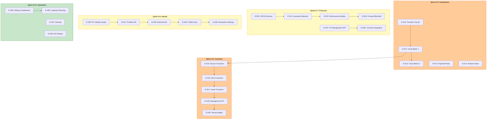
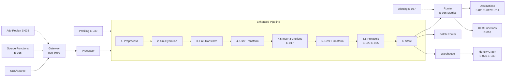

# Technical Specification

# 0. Agent Action Plan

## 0.1 Intent Clarification

### 0.1.1 Core Feature Objective

Based on the prompt, the Blitzy platform understands that the new feature requirement is to **implement five remaining sprint groups across the RudderStack `rudder-server` Go monorepo**, closing critical feature parity gaps against Segment across five dimensions: destination connectors, functions/transformations, protocols enforcement, identity resolution, and operational tooling.

The sprints to implement, in strict sequential order, are:

- **Sprint 3–5: Destination Connector Expansion (E-010 to E-014)** — Prioritize, implement, and validate 40+ cloud destination connectors and additional stream destinations, achieving payload-level parity with Segment's output for all shared connectors. Current parity: ~28%, target: ~50%.
- **Sprint 4–6: Transformation and Functions Framework (E-015 to E-019)** — Build a Segment-compatible Functions runtime supporting Source Functions (custom webhook ingestion via `onRequest`), Destination Functions (per-event typed handlers like `onTrack`, `onIdentify`), Insert Functions (pre-destination transformation hooks), a full CRUD management API, and per-function secrets/environment variable management. Current parity: ~40%, target: ~80%.
- **Sprint 5–7: Protocols and Tracking Plan Enforcement (E-020 to E-025)** — Upgrade tracking plan validation to full JSON Schema draft-07 support, implement anomaly detection for unexpected events/properties, add configurable enforcement modes (Block/Omit/Allow per source per call type), build forward-blocked-events capability, expose a tracking plan management API with versioning, and integrate consent management with Protocols enforcement. Current parity: ~30%, target: ~75%.
- **Sprint 6–8: Identity Resolution and Profiles (E-026 to E-030)** — Design and build a real-time identity graph that resolves identity as events flow through the pipeline (not batch-only during warehouse uploads), implement a Profiles REST API with sub-200ms response times, extend the identity model to support 12+ external identifier types, build profile sync to downstream destinations, and add configurable identity resolution settings (blocked values, limits, priority). Current parity: ~20%, target: ~60%.
- **Sprint 8–10: Operational Tooling and Monitoring (E-036 to E-039)** — Implement per-destination event delivery monitoring with Prometheus metrics and HTTP API, configurable alerting for pipeline health conditions, advanced replay controls (source-level, date-range, destination-level, dry-run), and pipeline performance profiling with capacity planning reports targeting 50,000 events/sec throughput.

Implicit requirements detected:

- The external **Transformer service** (`rudder-transformer` on port 9090) must be extended for Functions runtime capabilities (E-015 through E-017) and enhanced Protocols validation (E-020, E-021), as the `rudder-server` delegates transformation and validation to this service
- **Backend-config schema changes** are required for enforcement modes (E-022), tracking plan management (E-024), and selective sync configuration — all configuration flows through `backend-config/types.go`
- **Database migrations** are needed for the identity graph (E-026), functions management (E-018), and tracking plan storage (E-024) — PostgreSQL is the primary persistence layer
- **Docker infrastructure** must be started before testing, as integration tests depend on PostgreSQL, transformer, and MinIO containers defined in `docker-compose.yml`
- Each sprint must be **fully completed and tested** before proceeding to the next, with all CI failures resolved except those caused by missing repository secrets (AWS ECR credentials)

### 0.1.2 Special Instructions and Constraints

- **Sequential sprint execution**: Complete each sprint fully before starting the next — sprints overlap in their numbering (e.g., Sprint 4–6 overlaps with Sprint 3–5) but must be implemented in the listed order
- **Exhaustive scope coverage**: For every epic, implement ALL items listed in scope — do not skip any variant, endpoint, or sub-case mentioned in the epic description
- **Design-only epics**: For epics marked "Design and prototype," deliver a design document and a minimal proof-of-concept only — do not implement production-grade service code
- **Docker dependency**: If any step requires Docker, start it first — the project's `docker-compose.yml` defines PostgreSQL (port 6432→5432), Transformer (port 9090), MinIO (ports 9000/9001), and etcd (port 2379)
- **Post-implementation testing**: Run all tests after implementation of each sprint using `make test` or `gotestsum` with appropriate flags
- **CI failure resolution**: Fix all CI failures resolvable through code changes; skip failures caused by missing repository secrets (AWS ECR credentials)
- **Backward compatibility**: All changes must maintain backward compatibility with existing pipeline behavior — the Processor's 6-stage pipeline, Router delivery, and warehouse upload state machine must continue functioning for existing destinations
- **Follow existing patterns**: New connector implementations must follow the existing `common.StreamProducer` interface pattern in `services/streammanager/`, and new Router destinations must integrate through the existing `customdestinationmanager` factory

### 0.1.3 Technical Interpretation

These feature requirements translate to the following technical implementation strategy:

- To **expand destination connectors** (E-010 to E-014), we will create new producer packages under `services/streammanager/` following the `common.StreamProducer` interface, register them in `services/streammanager/streammanager.go`'s `NewProducer` switch statement, add their names to `router/customdestinationmanager/customdestinationmanager.go`'s `ObjectStreamDestinations` array, implement payload mapping and authentication per destination API, and create comprehensive payload parity test fixtures comparing RudderStack output against Segment reference payloads
- To **implement the Functions framework** (E-015 to E-019), we will create a new `functions/` top-level package containing the runtime engine with per-event typed handler dispatch, build a Source Functions HTTP endpoint in the Gateway (`gateway/handle_http_functions.go`), implement Insert Functions as a new pipeline stage between user transforms and destination transforms in `processor/pipeline_worker.go`, expose a Functions management REST API via `functions/api/`, and implement per-function encrypted secrets storage
- To **enforce Protocols and tracking plans** (E-020 to E-025), we will extend `processor/trackingplan.go` with full JSON Schema draft-07 validation, replace the binary `propagateValidationErrors` toggle with three-mode enforcement (Block/Omit/Allow), implement anomaly detection in a new `processor/anomalydetection/` package, add a forward-blocked-events mechanism that reroutes blocked events to an alternative source, build a tracking plan management REST API, and integrate consent management (`processor/consent.go`) with Protocols enforcement decisions
- To **build identity resolution** (E-026 to E-030), we will create a new `identity/` top-level service package that implements a real-time identity graph (extending beyond `warehouse/identity/identity.go`'s batch-only model), build a Profiles REST API with Redis-backed caching for sub-200ms responses, extend the identity model to support multiple external identifier types via `context.externalIds` event processing, implement profile sync using change-data-capture on the identity graph, and add configurable resolution settings (blocked values, identifier limits, priority ranking)
- To **deliver operational tooling** (E-036 to E-039), we will extend the existing Prometheus metrics infrastructure with per-destination delivery dashboards, implement configurable alerting rules in a new `services/alerting/` package leveraging existing `services/alert/` and `services/alerta/` patterns, enhance `gateway/handle_http_replay.go` with source-level, date-range, and destination-level filtering plus dry-run mode, and build pipeline performance profiling tools measuring per-stage latencies across Gateway, Processor, Router, and warehouse upload paths

## 0.2 Repository Scope Discovery

### 0.2.1 Comprehensive File Analysis

The RudderStack `rudder-server` repository is a production-grade Go monorepo (`go 1.26.0`, module `github.com/rudderlabs/rudder-server`) with approximately 40 top-level directories. The following analysis maps all files and folders requiring creation or modification across the five sprint groups.

**Existing Modules Requiring Modification:**

| File/Pattern | Current Purpose | Sprint | Modification Required |
|---|---|---|---|
| `services/streammanager/streammanager.go` | Stream producer factory — `NewProducer` switch dispatching to 13 stream destinations | 3–5 | Add `case` branches for new stream destination types |
| `router/customdestinationmanager/customdestinationmanager.go` | Custom destination registry — `ObjectStreamDestinations` array (13 entries), `KVStoreDestinations` (1 entry) | 3–5 | Append new stream destination names to `ObjectStreamDestinations` |
| `services/streammanager/common/*.go` | Shared `StreamProducer` interface and `Opts` type | 3–5 | No changes — interface is sufficient; new connectors implement it |
| `processor/pipeline_worker.go` | 6-stage pipeline: preprocess → srcHydration → preTransform → userTransform → destTransform → store | 4–6 | Insert new Insert Functions stage between userTransform and destTransform channels |
| `processor/processor.go` | Main Processor `Handle` — orchestrates pipeline, backend-config subscription, routing/storage | 4–6, 5–7 | Add Functions runtime integration, enhanced tracking plan enforcement with Block/Omit/Allow modes |
| `processor/trackingplan.go` | Tracking plan validation — `validateEvents()`, `reportViolations()`, `TrackingPlanStatT` metrics | 5–7 | Upgrade to JSON Schema draft-07, add anomaly detection hooks, implement three enforcement modes, forward-blocked-events |
| `processor/consent.go` | Consent-based destination filtering — OneTrust, Ketch, Generic CMP with OR/AND resolution | 5–7 | Integrate consent decisions with Protocols enforcement rules (E-025) |
| `warehouse/identity/identity.go` | Batch identity resolution — `Identity` struct, `applyRule()`, `Resolve()` for warehouse uploads | 6–8 | Refactor as foundation for real-time graph; extend merge-rule model beyond two-property pairs |
| `gateway/handle_http.go` | HTTP endpoint mount and middleware — public endpoints and shared middleware | 4–6, 8–10 | Add Source Functions webhook endpoint, advanced replay filter endpoints |
| `gateway/handle_http_replay.go` | Replay handler — `webReplayHandler()` with `withWarehouseReplayTag` middleware | 8–10 | Add source-level, date-range, destination-level filtering and dry-run mode |
| `gateway/handle_http_auth.go` | Auth middleware — write-key, webhook, source-ID, replay, destination auth | 4–6 | Add Source Functions auth handler |
| `gateway/openapi.yaml` | OpenAPI specification for Gateway HTTP API | 4–6, 5–7, 6–8, 8–10 | Add new endpoint schemas for Functions, Protocols API, Profiles API, and advanced replay |
| `backend-config/types.go` | Configuration schema — `SourceT`, `DestinationT`, `ConfigT`, tracking plan config, settings | 5–7, 6–8 | Add enforcement mode config fields, identity resolution settings schema, functions config |
| `backend-config/backend-config.go` | Runtime configuration provider — workspace config fetching, pubsub publication | 5–7, 6–8 | Extend subscription topics for new config types |
| `docker-compose.yml` | Local multi-service compose — PostgreSQL, Transformer, MinIO, etcd | All | May require additional services (e.g., Redis for identity graph caching) |
| `Makefile` | Build, test, lint targets | All | Potentially add new test targets for Functions, Protocols, Identity suites |
| `main.go` | Server entrypoint — config, logging, signals, memory monitoring, runner lifecycle | 4–6, 6–8 | Wire new services (Functions runtime, Identity service) into startup |
| `runner/runner.go` | App type resolution, warehouse mode, feature flags | 4–6, 6–8 | Register new service components |
| `services/alert/alertmanager.go` | Alert provider selection — PagerDuty, VictorOps | 8–10 | Extend with Slack and email notification channels |
| `services/alerta/alerta.go` | Alerta client with retry/backoff | 8–10 | Reference pattern for new alerting rules engine |
| `archiver/archiver.go` | Event archival with 10-day retention in gzipped JSONL | 8–10 | Integration point for advanced replay (source/date-range filtering) |
| `config/config.yaml` | 200+ tunable pipeline parameters | All | Add new configuration keys for Functions, Protocols enforcement, Identity, alerting thresholds |
| `router/handle.go` | Router Handle — job pickup, batching, throttling, delivery, retry/backoff | 8–10 | Add per-destination delivery metrics collection for monitoring dashboard |
| `router/handle_observability.go` | Metrics aggregation, diagnostics emission | 8–10 | Extend with delivery dashboard metrics (success/failure rates, latency percentiles) |
| `router/throttler/factory.go` | Throttler factory — Redis/in-memory GCRA algorithms | 8–10 | Reference for capacity planning metrics |

**Integration Point Discovery:**

| Integration Point | Location | Sprints Affected | Purpose |
|---|---|---|---|
| Stream destination factory | `services/streammanager/streammanager.go:24-58` | 3–5 | Register new stream producers via `NewProducer` switch |
| Custom destination registry | `router/customdestinationmanager/customdestinationmanager.go:79-81` | 3–5 | Add destination names to `ObjectStreamDestinations`/`KVStoreDestinations` arrays |
| Processor pipeline channels | `processor/pipeline_worker.go:32-37` | 4–6 | Insert Functions channel between stages 4 and 5 |
| Transformer client interfaces | `processor/transformer/clients.go:20-42` | 4–6, 5–7 | Extend with Functions client interface |
| User transformer | `processor/internal/transformer/user_transformer/user_transformer.go:54-67` | 4–6 | Reference for Functions runtime batch/event dispatch |
| Destination transformer | `processor/internal/transformer/destination_transformer/destination_transformer.go:73-82` | 4–6 | Reference for Destination Functions integration |
| Tracking plan validation | `processor/trackingplan.go:69-142` | 5–7 | Replace with enhanced JSON Schema validation + enforcement modes |
| Consent filtering | `processor/consent.go:44-95` | 5–7 | Hook into Protocols enforcement decisions |
| Identity resolution | `warehouse/identity/identity.go:78-206` | 6–8 | Extend `applyRule()` for real-time resolution |
| Gateway replay | `gateway/handle_http_replay.go:19-89` | 8–10 | Extend with filter parameters |
| Backend config types | `backend-config/types.go` | 5–7, 6–8 | Add new config types |
| Services alert system | `services/alert/alertmanager.go` | 8–10 | Extend alerting channels |
| Proto definitions | `proto/warehouse/`, `proto/common/` | 6–8 | Add Profiles API gRPC definitions |

### 0.2.2 New File Requirements

**Sprint 3–5: Destination Connector Expansion**

New source files to create:
- `services/streammanager/azureeventhub/` — Azure Event Hub extended producer (if not covered by existing Kafka variant)
- `services/streammanager/*/` — Additional stream destination packages as identified in E-014
- `router/testdata/destination_payloads/` — Payload parity test fixtures for field-by-field comparison
- `docs/gap-report/payload-parity-results.md` — Payload parity validation results

New test files:
- `services/streammanager/*_test.go` — Unit tests for each new stream producer
- `integration_test/destination_parity/` — Integration test suite for payload comparison across shared connectors

**Sprint 4–6: Functions Framework**

New source files to create:
- `functions/runtime/engine.go` — Functions runtime engine with per-event typed handler dispatch
- `functions/runtime/source_functions.go` — Source Functions `onRequest` handler execution
- `functions/runtime/destination_functions.go` — Destination Functions typed handler execution (`onTrack`, `onIdentify`, etc.)
- `functions/runtime/insert_functions.go` — Insert Functions pre-destination hooks
- `functions/runtime/errors.go` — Typed error classes (`EventNotSupported`, `InvalidEventPayload`, `ValidationError`, `RetryError`, `DropEvent`)
- `functions/api/handler.go` — Functions management REST API (CRUD, versioning, test invocation)
- `functions/api/routes.go` — HTTP route registration for Functions API
- `functions/storage/repository.go` — Functions persistence layer (PostgreSQL-backed)
- `functions/secrets/manager.go` — Per-function encrypted secrets and environment variable storage
- `gateway/handle_http_functions.go` — Source Functions webhook endpoint in Gateway
- `sql/migrations/functions/` — Database migrations for functions tables

New test files:
- `functions/runtime/*_test.go` — Unit tests for each function type
- `functions/api/*_test.go` — API endpoint tests
- `functions/secrets/*_test.go` — Secrets management tests
- `integration_test/functions/` — End-to-end functions integration tests

**Sprint 5–7: Protocols and Tracking Plan Enforcement**

New source files to create:
- `processor/anomalydetection/detector.go` — Anomaly detection engine for unexpected events/properties
- `processor/anomalydetection/tracker.go` — Event/property tracking over configurable time windows
- `processor/enforcement/modes.go` — Three enforcement modes: Block, Omit, Allow
- `processor/enforcement/forwarder.go` — Forward-blocked-events to alternative source
- `protocols/api/handler.go` — Tracking plan management REST API (CRUD, versioning, CSV import/export)
- `protocols/api/routes.go` — HTTP route registration for Protocols API
- `protocols/storage/repository.go` — Tracking plan persistence with version history
- `protocols/schema/validator.go` — JSON Schema draft-07 validation engine
- `sql/migrations/protocols/` — Database migrations for tracking plan tables

New test files:
- `processor/anomalydetection/*_test.go` — Anomaly detection tests
- `processor/enforcement/*_test.go` — Enforcement mode tests
- `protocols/api/*_test.go` — Protocols API tests
- `protocols/schema/*_test.go` — JSON Schema validation tests

**Sprint 6–8: Identity Resolution and Profiles**

New source files to create:
- `identity/graph/graph.go` — Real-time identity graph service
- `identity/graph/resolver.go` — Identity resolution engine (new/single/multi-match strategies)
- `identity/graph/externalids.go` — External ID management (12+ identifier types)
- `identity/profiles/api.go` — Profiles REST API (traits, events, external IDs, metadata)
- `identity/profiles/cache.go` — Redis-backed profile cache for sub-200ms responses
- `identity/sync/syncer.go` — Profile sync to downstream destinations via change-data-capture
- `identity/settings/settings.go` — Configurable resolution rules (blocked values, limits, priority)
- `identity/storage/repository.go` — Identity graph PostgreSQL persistence
- `sql/migrations/identity/` — Database migrations for identity graph tables
- `proto/identity/` — gRPC service definitions for Profiles API

New test files:
- `identity/graph/*_test.go` — Identity graph unit tests
- `identity/profiles/*_test.go` — Profiles API tests
- `identity/sync/*_test.go` — Profile sync tests
- `integration_test/identity/` — End-to-end identity resolution integration tests

**Sprint 8–10: Operational Tooling and Monitoring**

New source files to create:
- `services/monitoring/dashboard.go` — Per-destination delivery metrics aggregation
- `services/monitoring/metrics.go` — Prometheus metric definitions for delivery monitoring
- `services/alerting/engine.go` — Configurable alerting rules engine
- `services/alerting/channels.go` — Notification channels: webhook, email, Slack
- `services/alerting/rules.go` — Alert rule definitions (throughput, error rate, latency, queue depth)
- `services/profiling/profiler.go` — Per-stage pipeline performance profiling
- `services/profiling/capacity.go` — Capacity planning report generator (targeting 50K events/sec)
- `gateway/handle_http_replay_advanced.go` — Advanced replay filter logic (source, date-range, destination, dry-run)

New test files:
- `services/monitoring/*_test.go` — Monitoring dashboard tests
- `services/alerting/*_test.go` — Alerting engine tests
- `services/profiling/*_test.go` — Profiling and capacity planning tests

### 0.2.3 Web Search Research Conducted

The following areas were researched based on existing gap analysis documentation in the repository:

- **Destination connector patterns**: The `services/streammanager/` package already establishes a clear producer pattern (implement `common.StreamProducer` interface with `Produce`, `Close` methods). New connectors follow the same factory registration in `streammanager.go`
- **Functions runtime architecture**: Segment uses AWS Lambda; the RudderStack implementation should extend the existing external Transformer service (port 9090) with per-event handler dispatch, as documented in `docs/gap-report/functions-parity.md`
- **JSON Schema draft-07 validation**: Required for Protocols enhancement (E-020), supporting `required`, regex patterns, nested objects, enum values, and full type enforcement
- **Real-time identity graph**: The gap report (`docs/gap-report/identity-parity.md`) recommends starting with an in-memory graph with PostgreSQL persistence, then optimizing for scale — this is the largest architectural change
- **GCRA-based throttling**: Already implemented in `router/throttler/` — serves as a reference pattern for per-destination monitoring metrics

## 0.3 Dependency Inventory

### 0.3.1 Private and Public Packages

The following table lists all key packages relevant to the five sprint implementations, sourced from `go.mod` and the repository's existing dependency manifests.

| Registry | Package | Version | Purpose |
|---|---|---|---|
| Go Module | `go` | `1.26.0` | Language runtime — explicitly declared in `go.mod` |
| Docker Hub | `postgres:15-alpine` | `15` | Primary database (JobsDB, identity, functions, protocols storage) |
| Docker Hub | `rudderstack/rudder-transformer:latest` | `latest` | External transformation and validation service (port 9090) |
| Docker Hub | `minio/minio` | `latest` | Object storage for archival/replay |
| Docker Hub | `bitnami/etcd:3` | `3` | Cluster coordination (multi-tenant mode) |
| Go Module | `github.com/go-chi/chi/v5` | `v5.2.5` | HTTP router framework for all REST APIs |
| Go Module | `google.golang.org/grpc` | `v1.78.0` | gRPC framework for Profiles API and inter-service communication |
| Go Module | `google.golang.org/protobuf` | `v1.36.11` | Protocol Buffers for gRPC service definitions |
| Go Module | `github.com/segmentio/kafka-go` | `v0.4.50` | Kafka client for Kafka/Azure Event Hub/Confluent Cloud stream destinations |
| Go Module | `github.com/confluentinc/confluent-kafka-go/v2` | `v2.13.0` | Confluent Kafka client for Confluent Cloud integration |
| Go Module | `github.com/apache/pulsar-client-go` | `v0.18.0` | Apache Pulsar client for potential stream destination expansion |
| Go Module | `github.com/redis/go-redis/v9` | `v9.12.1` | Redis client for identity graph caching and profile lookups |
| Go Module | `cloud.google.com/go/bigquery` | `v1.72.0` | BigQuery SDK for BQ Stream destination and warehouse |
| Go Module | `cloud.google.com/go/pubsub/v2` | `v2.3.0` | Google Pub/Sub SDK for stream destination |
| Go Module | `cloud.google.com/go/storage` | `v1.60.0` | GCS for staging file storage |
| Go Module | `github.com/aws/aws-sdk-go-v2` | `v1.41.1` | AWS SDK for Kinesis, Firehose, EventBridge, Lambda, Personalize, S3 |
| Go Module | `github.com/sony/gobreaker` | `v1.0.0` | Circuit breaker for destination delivery protection |
| Go Module | `github.com/tidwall/gjson` | `v1.18.0` | JSON path reading used throughout pipeline processing |
| Go Module | `github.com/tidwall/sjson` | `v1.2.5` | JSON path mutation (used in replay handler for context injection) |
| Go Module | `github.com/onsi/ginkgo/v2` | `v2.24.0` | BDD test framework used across all integration tests |
| Go Module | `github.com/onsi/gomega` | `v1.38.0` | Matcher library for Ginkgo tests |
| Go Module | `github.com/rudderlabs/rudder-go-kit` | `v0.72.3` | Internal kit: config, logger, stats, httputil, and more |
| Go Module | `github.com/rudderlabs/rudder-observability-kit` | `v0.0.6` | Observability labels and helpers |
| Go Module | `github.com/rudderlabs/rudder-schemas` | `v0.9.1` | Schema definitions and validation |
| Go Module | `github.com/rudderlabs/rudder-transformer/go` | `v1.122.0` | Go client for Transformer service integration |
| Go Module | `github.com/rudderlabs/sqlconnect-go` | `v1.20.3` | SQL connectivity for warehouse integrations |
| Go Module | `github.com/rudderlabs/sql-tunnels` | `v0.1.7` | SSH tunneling for warehouse connections |
| Go Module | `github.com/DATA-DOG/go-sqlmock` | `v1.5.2` | SQL mock for database unit tests |
| Go Module | `github.com/rudderlabs/compose-test` | `v0.1.3` | Docker compose test helpers |

### 0.3.2 Dependency Updates

**New Dependencies Potentially Required:**

| Package | Purpose | Sprint | Notes |
|---|---|---|---|
| JSON Schema validation library (e.g., `github.com/santhosh-tekuri/jsonschema/v5`) | Full JSON Schema draft-07 validation for Protocols E-020 | 5–7 | Required for `required`, regex patterns, nested objects, enum values, type enforcement |
| V8 isolate or Deno runtime (e.g., `rogchap.com/v8go`) | JavaScript sandbox for Functions runtime (E-015, E-016, E-017) | 4–6 | Evaluate vs. extending existing Transformer service HTTP protocol |
| Redis cluster configuration extensions | Identity graph caching for sub-200ms Profiles API (E-027) | 6–8 | Existing `redis/go-redis/v9` may suffice; configuration extensions needed |

**Import Updates:**

Files requiring import updates follow these patterns:
- `services/streammanager/**/*.go` — New destination producer packages must import `common` and `backendconfig`
- `functions/**/*.go` — New package imports for Functions runtime, API, storage, secrets
- `protocols/**/*.go` — New package imports for Protocols API, schema validation, storage
- `identity/**/*.go` — New package imports for Identity graph, Profiles API, sync, settings
- `services/monitoring/**/*.go` — New package imports for metrics, alerting, profiling
- `processor/*.go` — Updated imports for new enforcement modes, anomaly detection, Functions integration

**External Reference Updates:**

| File Pattern | Update Required |
|---|---|
| `go.mod` | Add new dependencies for JSON Schema validation, potentially V8 runtime |
| `go.sum` | Auto-updated by `go mod tidy` after dependency additions |
| `docker-compose.yml` | Potentially add Redis service for identity graph caching |
| `config/config.yaml` | Add configuration keys for Functions, Protocols, Identity, Monitoring |
| `gateway/openapi.yaml` | Add endpoint definitions for Functions API, Protocols API, Profiles API, advanced replay |
| `Makefile` | Add test targets for new packages |
| `.github/workflows/tests.yaml` | Update CI test matrix to include new integration test suites |
| `Dockerfile` | Ensure new packages are included in multi-stage build |

## 0.4 Integration Analysis

### 0.4.1 Existing Code Touchpoints

**Direct Modifications Required:**

- **`services/streammanager/streammanager.go`** (lines 24–58): Add new `case` branches to the `NewProducer` switch statement for each new stream destination type identified in E-014. Currently handles 13 destination types; each new stream destination requires a new case that routes to its producer constructor.
- **`router/customdestinationmanager/customdestinationmanager.go`** (line 79): Append new stream destination names to `ObjectStreamDestinations` array. This array drives the `CustomManagerT` routing logic that delegates to `streammanager.NewProducer` for stream-type destinations.
- **`processor/pipeline_worker.go`** (lines 32–37): Add a new `insertfunctions` channel between the `usertransform` and `destinationtransform` channels. The current pipeline flows: preprocess → srcHydration → preTransform → userTransform → destTransform → store. Insert Functions (E-017) require inserting a per-destination transformation stage.
- **`processor/processor.go`** (lines 78–79): Add new constants for `InsertFunctionTransformation` alongside existing `UserTransformation` and `DestTransformation`. Extend the pipeline processing logic to support Functions runtime integration and enhanced enforcement modes.
- **`processor/trackingplan.go`** (lines 26–49, 69–142): Major refactor of `validateEvents()` to support full JSON Schema draft-07 validation, three enforcement modes replacing the binary `propagateValidationErrors` toggle, and forward-blocked-events routing. The `reportViolations()` function must be extended to handle Block/Omit/Allow decisions.
- **`processor/consent.go`** (lines 44–95): Extend `getConsentFilteredDestinations()` to integrate consent decisions with Protocols enforcement. When consent management is enabled alongside a tracking plan, consent-denied events should follow the tracking plan's enforcement mode rather than being silently filtered.
- **`gateway/handle_http.go`**: Mount new endpoints for Source Functions webhook ingestion (`/v1/functions/source`), tracking plan management API, Profiles API, and advanced replay controls.
- **`gateway/handle_http_replay.go`** (lines 19–89): Extend `webReplayHandler()` and `withWarehouseReplayTag()` to accept source-level, date-range, and destination-level filter parameters via query string or request headers. Add dry-run mode support.
- **`backend-config/types.go`**: Add new fields to `DestinationT` and `SourceT` for enforcement mode configuration, identity resolution settings, and Functions binding configuration. Extend `ConfigT` with tracking plan management data and identity resolution settings.
- **`warehouse/identity/identity.go`** (lines 36–60, 78–206): Extend the `Identity` struct to support real-time resolution. Refactor `applyRule()` to work outside the warehouse upload cycle. Extend the merge-rule model beyond the two-property (`merge_property_1/2`) limitation.
- **`main.go`**: Wire new top-level services (Functions runtime, Identity service, Monitoring service) into the server startup lifecycle alongside existing Gateway, Processor, Router, and Warehouse services.
- **`router/handle.go`** (lines 49–100): Add per-destination delivery metrics instrumentation points for the monitoring dashboard. Capture success/failure rates, latency percentiles, throughput, retry counts, and circuit breaker state changes.
- **`router/handle_observability.go`**: Extend observability helpers with new metric names for the delivery monitoring dashboard.

**Dependency Injections:**

- **`runner/runner.go`**: Register new service components (Functions runtime, Identity service, Monitoring/Alerting service) in the runner's component startup sequence. These must be wired before the Processor starts to ensure pipeline hooks are available.
- **`app/app.go` or `app/apphandlers/`**: Inject new service dependencies into the app handler for embedded mode. The Functions runtime and Identity service need access to the same PostgreSQL connection, backend-config subscriptions, and stats infrastructure.
- **`processor/transformer/clients.go`** (lines 36–42): Extend the `Clients` struct to include a `FunctionsClient` interface for communicating with the Functions runtime, alongside existing `UserClient`, `DestinationClient`, `TrackingPlanClient`, and `SrcHydrationClient`.

**Database/Schema Updates:**

- **`sql/migrations/`**: New migration files for:
  - Functions tables: `functions` (id, workspace_id, name, type, code, version, settings, created_at, updated_at), `function_secrets` (id, function_id, key, encrypted_value)
  - Tracking plans tables: `tracking_plans` (id, workspace_id, name, schema, version, enforcement_config, created_at, updated_at), `tracking_plan_versions` (id, tracking_plan_id, version, schema, changelog)
  - Identity graph tables: `identity_graph` (id, workspace_id, segment_id, created_at), `identity_external_ids` (id, graph_id, external_id_type, external_id_value, created_source, created_at, merged_at, merged_from), `identity_traits` (id, graph_id, key, value, updated_at)
  - Alerting tables: `alert_rules` (id, workspace_id, condition, threshold, channels, enabled, created_at)

### 0.4.2 Cross-Sprint Integration Dependencies

The following diagram illustrates the inter-sprint dependency flow:

```mermaid
flowchart TD
    subgraph S35["Sprint 3-5: Destinations"]
        E010["E-010: Prioritize Top-50"]
        E011["E-011: Cloud Batch 1"]
        E012["E-012: Cloud Batch 2"]
        E013["E-013: Payload Parity"]
        E014["E-014: Stream Dests"]
    end

    subgraph S46["Sprint 4-6: Functions"]
        E015["E-015: Source Functions"]
        E016["E-016: Dest Functions"]
        E017["E-017: Insert Functions"]
        E018["E-018: Management API"]
        E019["E-019: Secrets Mgmt"]
    end

    subgraph S57["Sprint 5-7: Protocols"]
        E020["E-020: JSON Schema"]
        E021["E-021: Anomaly Detection"]
        E022["E-022: Enforcement Modes"]
        E023["E-023: Forward Blocked"]
        E024["E-024: TP Management API"]
        E025["E-025: Consent Integration"]
    end

    subgraph S68["Sprint 6-8: Identity"]
        E026["E-026: RT Identity Graph"]
        E027["E-027: Profiles API"]
        E028["E-028: External IDs"]
        E029["E-029: Profile Sync"]
        E030["E-030: Resolution Settings"]
    end

    subgraph S810["Sprint 8-10: Operations"]
        E036["E-036: Delivery Dashboard"]
        E037["E-037: Alerting"]
        E038["E-038: Adv Replay"]
        E039["E-039: Capacity Planning"]
    end

    E010 --> E011
    E011 --> E012
    E011 --> E015
    E015 --> E016
    E016 --> E017
    E017 --> E018
    E018 --> E019
    E020 --> E021
    E021 --> E022
    E022 --> E023
    E024 --> E025
    E026 --> E027
    E027 --> E028
    E028 --> E029
    E029 --> E030
    E036 --> E039

    style S35 fill:#ffcc99,stroke:#e65100,color:#000
    style S46 fill:#ffcc99,stroke:#e65100,color:#000
    style S57 fill:#fff9c4,stroke:#f9a825,color:#000
    style S68 fill:#fff9c4,stroke:#f9a825,color:#000
    style S810 fill:#c8e6c9,stroke:#2e7d32,color:#000
```

### 0.4.3 Pipeline Integration Architecture

The following diagram shows how all five sprints integrate into the existing RudderStack pipeline:

```mermaid
flowchart LR
    SDK["SDK/Source"] --> GW["Gateway\nport 8080"]
    SF["Source Functions\nE-015"] --> GW

    GW --> Proc["Processor"]

    subgraph Pipeline["Enhanced Pipeline"]
        direction LR
        PP["1. Preprocess"] --> SH["2. Src Hydration"]
        SH --> PT["3. Pre-Transform"]
        PT --> UT["4. User Transform"]
        UT --> IF["4.5 Insert Functions\nE-017"]
        IF --> DT["5. Dest Transform"]
        DT --> TP["5.5 Protocols\nE-020-E-025"]
        TP --> ST["6. Store"]
    end

    Proc --> Pipeline
    ST --> RT["Router\nE-036 Metrics"]
    ST --> BRT["Batch Router"]
    ST --> WH["Warehouse"]

    RT --> DEST["Destinations\nE-011/E-012/E-014"]
    RT --> DF["Dest Functions\nE-016"]
    WH --> IDR["Identity Graph\nE-026-E-030"]

    ALERT["Alerting E-037"] -.-> RT
    REPLAY["Adv Replay E-038"] -.-> GW
    PROF["Profiling E-039"] -.-> Pipeline
```

## 0.5 Technical Implementation

### 0.5.1 File-by-File Execution Plan

Every file listed below MUST be created or modified. Files are organized by sprint group and then by execution priority within each group.

**Group 1 — Sprint 3–5: Destination Connector Expansion (E-010 to E-014)**

| Action | File | Purpose |
|---|---|---|
| CREATE | `docs/gap-report/destination-priority-ranking.md` | E-010: Documented top-50 prioritized destination list with coverage analysis |
| CREATE | `services/streammanager/<dest>/manager.go` (per new stream dest) | E-014: New stream destination producer implementing `common.StreamProducer` interface |
| CREATE | `services/streammanager/<dest>/manager_test.go` (per new stream dest) | E-014: Unit tests for each new stream producer (gomock, validation, error mapping) |
| MODIFY | `services/streammanager/streammanager.go` | E-014: Add `case` branches for each new stream destination in `NewProducer` switch |
| MODIFY | `services/streammanager/streammanager_suite_test.go` | E-014: Add factory test assertions for new destination types |
| MODIFY | `router/customdestinationmanager/customdestinationmanager.go` | E-014: Append new destination names to `ObjectStreamDestinations` array |
| CREATE | `integration_test/destination_parity/*_test.go` | E-013: Payload parity integration tests for all 93+ shared connectors |
| CREATE | `router/testdata/destination_payloads/*.json` | E-013: Reference payloads for field-by-field comparison |
| MODIFY | `config/config.yaml` | E-010–E-014: Add configuration keys for new destinations |

**Group 2 — Sprint 4–6: Transformation and Functions Framework (E-015 to E-019)**

| Action | File | Purpose |
|---|---|---|
| CREATE | `functions/runtime/engine.go` | E-015/E-016/E-017: Core Functions runtime engine with handler dispatch |
| CREATE | `functions/runtime/source_functions.go` | E-015: Source Functions `onRequest(request, settings)` handler execution |
| CREATE | `functions/runtime/destination_functions.go` | E-016: Destination Functions typed handlers (`onTrack`, `onIdentify`, `onGroup`, `onPage`, `onScreen`, `onAlias`, `onDelete`, `onBatch`) |
| CREATE | `functions/runtime/insert_functions.go` | E-017: Insert Functions pre-destination transformation hooks |
| CREATE | `functions/runtime/errors.go` | E-015/E-016/E-017: Typed error classes (`EventNotSupported`, `InvalidEventPayload`, `ValidationError`, `RetryError`, `DropEvent`) |
| CREATE | `functions/runtime/*_test.go` | E-015/E-016/E-017: Unit tests for all function types |
| CREATE | `functions/api/handler.go` | E-018: Functions CRUD API handler (create, read, update, delete, list, test invocation) |
| CREATE | `functions/api/routes.go` | E-018: HTTP route registration using chi router |
| CREATE | `functions/api/*_test.go` | E-018: API endpoint tests |
| CREATE | `functions/storage/repository.go` | E-018: PostgreSQL-backed function storage with versioning |
| CREATE | `functions/secrets/manager.go` | E-019: Per-function encrypted settings and secrets storage |
| CREATE | `functions/secrets/*_test.go` | E-019: Secrets management tests |
| CREATE | `gateway/handle_http_functions.go` | E-015: Source Functions webhook endpoint |
| CREATE | `sql/migrations/functions/*.sql` | E-018/E-019: Database migrations for functions and secrets tables |
| MODIFY | `processor/pipeline_worker.go` | E-017: Add Insert Functions channel between user transform and dest transform stages |
| MODIFY | `processor/processor.go` | E-015/E-016/E-017: Integrate Functions runtime into pipeline |
| MODIFY | `processor/transformer/clients.go` | E-015/E-016: Add `FunctionsClient` interface |
| MODIFY | `gateway/handle_http.go` | E-015: Mount Source Functions webhook endpoint |
| MODIFY | `gateway/handle_http_auth.go` | E-015: Add Source Functions auth handler |
| MODIFY | `main.go` | E-015: Wire Functions runtime into server startup |
| MODIFY | `gateway/openapi.yaml` | E-018: Add Functions API endpoint schemas |
| MODIFY | `config/config.yaml` | E-015–E-019: Add Functions configuration keys |

**Group 3 — Sprint 5–7: Protocols and Tracking Plan Enforcement (E-020 to E-025)**

| Action | File | Purpose |
|---|---|---|
| CREATE | `protocols/schema/validator.go` | E-020: JSON Schema draft-07 validation (required, regex, nested objects, enum, types) |
| CREATE | `protocols/schema/common_schema.go` | E-020: Common JSON Schema applied to all events from connected sources |
| CREATE | `protocols/schema/*_test.go` | E-020: Schema validation tests |
| CREATE | `processor/anomalydetection/detector.go` | E-021: Anomaly detection for unexpected events/properties not in tracking plan |
| CREATE | `processor/anomalydetection/tracker.go` | E-021: Event/property tracking with configurable time windows |
| CREATE | `processor/anomalydetection/*_test.go` | E-021: Anomaly detection tests |
| CREATE | `processor/enforcement/modes.go` | E-022: Block Event, Omit Properties, Allow — configurable per source per call type |
| CREATE | `processor/enforcement/forwarder.go` | E-023: Server-to-server forwarding of blocked events to alternative source |
| CREATE | `processor/enforcement/*_test.go` | E-022/E-023: Enforcement mode and forwarding tests |
| CREATE | `protocols/api/handler.go` | E-024: Tracking plan CRUD API with versioning, CSV import/export |
| CREATE | `protocols/api/routes.go` | E-024: HTTP route registration |
| CREATE | `protocols/storage/repository.go` | E-024: Tracking plan persistence with version history |
| CREATE | `protocols/api/*_test.go` | E-024: API tests |
| CREATE | `sql/migrations/protocols/*.sql` | E-024: Migrations for tracking plan and version tables |
| MODIFY | `processor/trackingplan.go` | E-020/E-022: Replace Transformer-delegated validation with local JSON Schema, add enforcement modes |
| MODIFY | `processor/consent.go` | E-025: Connect consent filtering with Protocols enforcement decisions |
| MODIFY | `backend-config/types.go` | E-022/E-024: Add enforcement mode fields, tracking plan config |
| MODIFY | `gateway/handle_http.go` | E-024: Mount Protocols management API endpoints |
| MODIFY | `gateway/openapi.yaml` | E-024: Add Protocols API endpoint schemas |
| MODIFY | `config/config.yaml` | E-020–E-025: Add Protocols configuration keys |

**Group 4 — Sprint 6–8: Identity Resolution and Profiles (E-026 to E-030)**

| Action | File | Purpose |
|---|---|---|
| CREATE | `identity/graph/graph.go` | E-026: Real-time identity graph service with persistent graph store |
| CREATE | `identity/graph/resolver.go` | E-026: Identity resolution engine (new/single/multi-match strategies) |
| CREATE | `identity/graph/externalids.go` | E-028: External ID management (12+ types: user_id, email, anonymous_id, ios.id, android.id, etc.) |
| CREATE | `identity/graph/*_test.go` | E-026/E-028: Graph and resolver tests |
| CREATE | `identity/profiles/api.go` | E-027: Profiles REST API (traits, events, external_ids, metadata) with sub-200ms response |
| CREATE | `identity/profiles/cache.go` | E-027: Redis-backed profile cache |
| CREATE | `identity/profiles/*_test.go` | E-027: Profiles API tests |
| CREATE | `identity/sync/syncer.go` | E-029: Profile sync to downstream destinations via change-data-capture |
| CREATE | `identity/sync/*_test.go` | E-029: Sync tests |
| CREATE | `identity/settings/settings.go` | E-030: Configurable resolution: blocked values (regex/exact), limits (weekly/monthly/annually/ever), priority |
| CREATE | `identity/settings/*_test.go` | E-030: Settings tests |
| CREATE | `identity/storage/repository.go` | E-026: PostgreSQL persistence for identity graph |
| CREATE | `sql/migrations/identity/*.sql` | E-026: Migrations for identity graph tables |
| CREATE | `proto/identity/*.proto` | E-027: gRPC service definitions for Profiles API |
| MODIFY | `warehouse/identity/identity.go` | E-026: Refactor to share resolution logic with real-time graph |
| MODIFY | `processor/processor.go` | E-026: Hook identity resolution into event processing pipeline |
| MODIFY | `backend-config/types.go` | E-030: Add identity resolution settings schema |
| MODIFY | `main.go` | E-026: Wire Identity service into startup |
| MODIFY | `gateway/handle_http.go` | E-027: Mount Profiles API endpoints |
| MODIFY | `gateway/openapi.yaml` | E-027: Add Profiles API schemas |
| MODIFY | `docker-compose.yml` | E-027: Add Redis service for profile caching |
| MODIFY | `config/config.yaml` | E-026–E-030: Add Identity configuration keys |

**Group 5 — Sprint 8–10: Operational Tooling and Monitoring (E-036 to E-039)**

| Action | File | Purpose |
|---|---|---|
| CREATE | `services/monitoring/dashboard.go` | E-036: Per-destination delivery metrics (success/failure, latency p50/p95/p99, throughput, retries, circuit breaker) |
| CREATE | `services/monitoring/metrics.go` | E-036: Prometheus metric definitions and registration |
| CREATE | `services/monitoring/*_test.go` | E-036: Monitoring tests |
| CREATE | `services/alerting/engine.go` | E-037: Alerting rules engine (throughput drop, error spike, delivery failures, warehouse latency, JobsDB queue depth) |
| CREATE | `services/alerting/channels.go` | E-037: Notification channels — webhook, email, Slack |
| CREATE | `services/alerting/rules.go` | E-037: Alert rule definitions and threshold evaluation |
| CREATE | `services/alerting/*_test.go` | E-037: Alerting tests |
| CREATE | `gateway/handle_http_replay_advanced.go` | E-038: Advanced replay filters — source-level, date-range, destination-level, dry-run |
| CREATE | `services/profiling/profiler.go` | E-039: Per-stage pipeline performance profiling (Gateway → Processor stages → Router → Warehouse) |
| CREATE | `services/profiling/capacity.go` | E-039: Capacity planning report generator targeting 50K events/sec |
| CREATE | `services/profiling/*_test.go` | E-039: Profiling and capacity tests |
| MODIFY | `router/handle.go` | E-036: Add delivery metrics instrumentation |
| MODIFY | `router/handle_observability.go` | E-036: Extend with dashboard metric collection |
| MODIFY | `gateway/handle_http_replay.go` | E-038: Integrate advanced filter parameters |
| MODIFY | `gateway/handle_http.go` | E-036/E-038: Mount monitoring API and advanced replay endpoints |
| MODIFY | `services/alert/alertmanager.go` | E-037: Extend alert provider selection with Slack/email |
| MODIFY | `archiver/archiver.go` | E-038: Support source/date-range filtering for advanced replay |
| MODIFY | `config/config.yaml` | E-036–E-039: Add monitoring, alerting, and profiling configuration keys |

### 0.5.2 Implementation Approach per File

- **Establish feature foundations** by creating core packages first: `functions/runtime/`, `protocols/schema/`, `identity/graph/`, `services/monitoring/` — each providing the foundational types and interfaces
- **Integrate with existing systems** by modifying integration points: `processor/pipeline_worker.go` for Insert Functions, `processor/trackingplan.go` for enforcement modes, `gateway/handle_http.go` for new endpoints
- **Follow existing patterns**: All new stream producers follow the `common.StreamProducer` interface pattern; all REST APIs use `chi/v5` routing; all tests use Ginkgo/Gomega or testify/require; all metrics use `rudder-go-kit/stats`
- **Ensure quality** by implementing comprehensive tests alongside each feature: unit tests with gomock for interfaces, integration tests with dockertest for PostgreSQL-dependent features
- **Document thoroughly**: Update `gateway/openapi.yaml` for all new endpoints, update `config/config.yaml` with configuration documentation, create dedicated feature documentation in `docs/`

### 0.5.3 User Interface Design

This implementation is a **backend-only** server-side feature set. No frontend UI components are required. All new capabilities are exposed via:

- **REST APIs**: Functions management API, Protocols management API, Profiles API, monitoring dashboard API, advanced replay API — all served by the Gateway HTTP server on port 8080
- **gRPC APIs**: Profiles API for high-performance inter-service communication
- **Prometheus metrics**: Per-destination delivery metrics, pipeline performance metrics — scraped by external Prometheus instances
- **Configuration**: All features are configurable via `config/config.yaml` and backend-config runtime configuration

## 0.6 Scope Boundaries

### 0.6.1 Exhaustively In Scope

**Sprint 3–5: Destination Connector Expansion (E-010 to E-014)**
- Destination prioritization analysis: `docs/gap-report/destination-priority-ranking.md`
- All new stream destination producers: `services/streammanager/*/manager.go`
- Stream producer factory registration: `services/streammanager/streammanager.go`
- Custom destination manager updates: `router/customdestinationmanager/customdestinationmanager.go`
- Payload parity validation for all ~93 shared connectors: `integration_test/destination_parity/**/*_test.go`
- Payload reference fixtures: `router/testdata/destination_payloads/**/*.json`
- Test suites: `services/streammanager/**/*_test.go`

**Sprint 4–6: Transformation and Functions Framework (E-015 to E-019)**
- Functions runtime engine: `functions/runtime/**/*.go`
- Functions management API: `functions/api/**/*.go`
- Functions storage layer: `functions/storage/**/*.go`
- Functions secrets management: `functions/secrets/**/*.go`
- Source Functions Gateway endpoint: `gateway/handle_http_functions.go`
- Pipeline integration: `processor/pipeline_worker.go`, `processor/processor.go`
- Transformer client extension: `processor/transformer/clients.go`
- Database migrations: `sql/migrations/functions/**/*.sql`
- Gateway auth: `gateway/handle_http_auth.go`
- Gateway routing: `gateway/handle_http.go`
- Server startup wiring: `main.go`
- API documentation: `gateway/openapi.yaml`
- Configuration: `config/config.yaml`
- All associated test files: `functions/**/*_test.go`, `integration_test/functions/**/*_test.go`

**Sprint 5–7: Protocols and Tracking Plan Enforcement (E-020 to E-025)**
- JSON Schema validation: `protocols/schema/**/*.go`
- Anomaly detection: `processor/anomalydetection/**/*.go`
- Enforcement modes: `processor/enforcement/**/*.go`
- Tracking plan management API: `protocols/api/**/*.go`
- Tracking plan storage: `protocols/storage/**/*.go`
- Tracking plan validation refactor: `processor/trackingplan.go`
- Consent integration: `processor/consent.go`
- Backend config types: `backend-config/types.go`
- Database migrations: `sql/migrations/protocols/**/*.sql`
- Gateway routing: `gateway/handle_http.go`
- API documentation: `gateway/openapi.yaml`
- Configuration: `config/config.yaml`
- All associated test files: `protocols/**/*_test.go`, `processor/anomalydetection/**/*_test.go`, `processor/enforcement/**/*_test.go`

**Sprint 6–8: Identity Resolution and Profiles (E-026 to E-030)**
- Identity graph service: `identity/graph/**/*.go`
- Profiles API: `identity/profiles/**/*.go`
- Profile sync: `identity/sync/**/*.go`
- Resolution settings: `identity/settings/**/*.go`
- Identity storage: `identity/storage/**/*.go`
- Proto definitions: `proto/identity/**/*.proto`
- Warehouse identity refactor: `warehouse/identity/identity.go`
- Processor integration: `processor/processor.go`
- Backend config types: `backend-config/types.go`
- Database migrations: `sql/migrations/identity/**/*.sql`
- Docker compose: `docker-compose.yml` (Redis service)
- Server startup wiring: `main.go`
- Gateway routing: `gateway/handle_http.go`
- API documentation: `gateway/openapi.yaml`
- Configuration: `config/config.yaml`
- All associated test files: `identity/**/*_test.go`, `integration_test/identity/**/*_test.go`

**Sprint 8–10: Operational Tooling and Monitoring (E-036 to E-039)**
- Monitoring dashboard: `services/monitoring/**/*.go`
- Alerting engine: `services/alerting/**/*.go`
- Profiling tools: `services/profiling/**/*.go`
- Advanced replay: `gateway/handle_http_replay_advanced.go`, `gateway/handle_http_replay.go`
- Router observability: `router/handle.go`, `router/handle_observability.go`
- Alert system extension: `services/alert/alertmanager.go`
- Archiver integration: `archiver/archiver.go`
- Gateway routing: `gateway/handle_http.go`
- Configuration: `config/config.yaml`
- All associated test files: `services/monitoring/**/*_test.go`, `services/alerting/**/*_test.go`, `services/profiling/**/*_test.go`

**Cross-Cutting:**
- Build configuration: `go.mod`, `go.sum`
- Docker configuration: `Dockerfile`, `docker-compose.yml`
- CI/CD pipelines: `.github/workflows/tests.yaml`
- Build targets: `Makefile`

### 0.6.2 Explicitly Out of Scope

- **Segment Engage / Campaigns** — Audience building, journey orchestration, and campaign management are explicitly deferred to Phase 2 per the sprint roadmap. These features depend on Identity Resolution (Phase 1) and Profiles API (E-027) being completed first.
- **Reverse ETL** — Warehouse-to-destination sync pipelines with incremental change detection are deferred to Phase 2. Depends on warehouse connectors (Sprint 7–9, already completed) and destination connector expansion (Sprint 3–5).
- **Advanced Personalization** — Real-time audience membership for personalization engines is deferred to Phase 2. Depends on Profiles API (E-027) and computed traits.
- **Computed Traits and SQL Traits** — While mentioned in the identity parity analysis, these are not explicitly included in E-026 through E-030. The Profiles API (E-027) provides the foundation, but trait computation engine is Phase 2.
- **Sprint 1–2: Event Spec Parity (E-001 to E-004)** — Already at 100% parity; not in the user's requested sprint list.
- **Sprint 2–3: Source SDK Compatibility (E-005 to E-009)** — Not in the user's requested sprint list.
- **Sprint 7–9: Warehouse Feature Enhancement (E-031 to E-035)** — Marked as COMPLETED in the sprint roadmap with ~95% parity achieved.
- **Device-mode destination support** — Client-side SDK integration framework is an SDK-level concern, not a `rudder-server` concern.
- **Actions-based destination architecture** — The newer Segment pattern with configurable field mappings is identified as a gap (DC-002) but not included in any sprint epic.
- **Destination catalog API** — Programmatic destination management (DC-005) is not in scope.
- **Functions Copilot (AI-assisted)** — AI-powered function generation (FN-011) is Low priority and not included.
- **IP Allowlisting for functions** — NAT gateway for outbound traffic (FN-012) is not included.
- **Performance optimization of existing code** beyond what is required for feature integration.
- **Refactoring of existing unrelated code** that does not touch integration points.

## 0.7 Rules for Feature Addition

### 0.7.1 Sequential Sprint Execution

- Implement sprints in strict order: Sprint 3–5 → Sprint 4–6 → Sprint 5–7 → Sprint 6–8 → Sprint 8–10
- Complete each sprint fully before starting the next — this means all epics within a sprint must pass their success criteria
- Run all tests (`make test` or `gotestsum --format pkgname-and-test-fails -- -p=1 -v -failfast -shuffle=on --timeout=15m`) after completing each sprint
- Fix all CI failures resolvable through code changes; skip failures caused by missing repository secrets (AWS ECR credentials)

### 0.7.2 Exhaustive Scope Coverage

- For every epic, implement ALL items listed in scope — do not skip any variant, endpoint, or sub-case mentioned in the epic description
- E-011 requires implementing 20 highest-priority cloud destination connectors — all 20 must be implemented
- E-012 requires implementing the next 20 priority connectors — all 20 must be implemented
- E-016 requires all 8 typed event handlers: `onTrack`, `onIdentify`, `onGroup`, `onPage`, `onScreen`, `onAlias`, `onDelete`, `onBatch`
- E-020 requires full JSON Schema draft-07 support including ALL specified types: any, array, object, boolean, integer, number, string, null, Date time
- E-028 requires support for ALL 12+ external identifier types listed in the Segment documentation

### 0.7.3 Design-Only Epics

- For epics marked "Design and prototype," deliver a design document and a minimal proof-of-concept only — do not implement production-grade service code
- None of the epics in the five requested sprints are explicitly marked as design-only, but if any implementation reveals a need for design-first approach, document the design decision and provide a minimal PoC

### 0.7.4 Existing Pattern Compliance

- **Stream producers** must implement the `common.StreamProducer` interface from `services/streammanager/common/` and register via the `NewProducer` factory in `services/streammanager/streammanager.go`
- **REST APIs** must use the `go-chi/chi/v5` router framework consistent with Gateway patterns in `gateway/handle_http.go`
- **Configuration** must use `rudder-go-kit/config` reloadable variables following the pattern in `router/config.go`
- **Logging** must use `rudder-go-kit/logger` with scoped child loggers (`logger.NewLogger().Child("package-name")`)
- **Metrics** must use `rudder-go-kit/stats` tagged measurements following patterns in `processor/trackingplan.go`
- **Tests** must use Ginkgo/Gomega for BDD integration tests or testify/require for unit tests, with gomock for interface mocking
- **Database access** must use the existing PostgreSQL middleware pattern from `warehouse/identity/identity.go`
- **Error handling** must follow Go convention with explicit error returns and structured logging via `obskit` labels

### 0.7.5 Docker and Infrastructure

- If any step requires Docker, start it first using `docker compose up -d` for required services (PostgreSQL, Transformer)
- The `docker-compose.yml` defines: PostgreSQL (port 6432→5432), Transformer (port 9090), MinIO (ports 9000/9001, storage profile), etcd (port 2379, multi-tenant profile)
- Integration tests may require `rudderlabs/compose-test` helpers for containerized dependencies

### 0.7.6 Backward Compatibility

- All changes must maintain backward compatibility with the existing pipeline: the Processor's 6-stage pipeline, Router delivery, Batch Router, and Warehouse upload state machine must continue functioning for all currently supported destinations
- New pipeline stages (Insert Functions) must be no-op when no Insert Functions are configured
- Enhanced tracking plan enforcement must default to existing behavior (`propagateValidationErrors` equivalent) when advanced enforcement modes are not configured
- The identity graph service must coexist with the existing warehouse identity resolution without disrupting current warehouse uploads

### 0.7.7 Security Requirements

- Per-function secrets (E-019) must be encrypted at rest using the existing security patterns in the repository
- Functions runtime (E-015, E-016, E-017) must execute user-defined JavaScript in a sandboxed environment preventing access to server internals
- Identity resolution settings (E-030) must enforce blocked values to prevent merge-all scenarios that could corrupt the identity graph
- API endpoints must enforce authentication consistent with existing Gateway auth middleware

## 0.8 References

### 0.8.1 Documentation Files Searched

The following documentation files were read in full to derive the requirements and technical context for this Agent Action Plan:

| File | Summary |
|---|---|
| `docs/gap-report/sprint-roadmap.md` | Master sprint roadmap defining all 39 epics (E-001 to E-039) across 8 sprint groups, with effort estimates, dependencies, success criteria, and parity progression forecasts. Identifies Sprint 7–9 (Warehouse) as COMPLETED. |
| `docs/gap-report/destination-catalog-parity.md` | Comprehensive destination catalog gap analysis: RudderStack covers ~93 of Segment's ~503 active destinations (~23% raw coverage). Documents 13 stream destinations, 9 warehouse connectors, ~70 cloud destinations. Lists P1/P2/P3 missing destinations and payload parity comparison framework. |
| `docs/gap-report/functions-parity.md` | Functions/Transformations parity analysis (~40% parity). Documents the architectural difference between RudderStack's batch-oriented Transformer service and Segment's per-event Lambda-based Functions runtime. Identifies 12 gaps (FN-001 through FN-012) including missing Source Functions, Destination Functions, Insert Functions, and management API. |
| `docs/gap-report/protocols-parity.md` | Protocols/Tracking Plan parity analysis (~30% parity). Documents current tracking plan validation via external Transformer, consent management (85% parity), and 12 gaps (PR-001 through PR-012) including missing anomaly detection, enforcement modes, management API, and forward-blocked-events. |
| `docs/gap-report/identity-parity.md` | Identity Resolution parity analysis (~20% parity — the largest gap area). Documents the fundamental architectural gap between RudderStack's batch-only warehouse identity resolution and Segment Unify's real-time identity graph. Identifies 12 gaps (ID-001 through ID-012) with the real-time identity graph as the critical foundation. |

### 0.8.2 Codebase Files and Folders Searched

The following repository files and folders were inspected to understand the existing architecture, integration points, and coding patterns:

| Path | Type | Purpose of Inspection |
|---|---|---|
| Root (`""`) | Folder | Top-level repository structure — 40+ directories, Go monorepo layout |
| `go.mod` | File | Module path, Go version (1.26.0), direct/indirect dependencies (200+ packages) |
| `main.go` | File | Server entrypoint — startup lifecycle, signal handling |
| `Makefile` | File | Build, test, lint targets — `make test` command structure |
| `docker-compose.yml` | File | Local service stack — PostgreSQL 15, Transformer, MinIO, etcd |
| `config/config.yaml` | File | Pipeline configuration parameters (200+ tunable keys) |
| `services/streammanager/streammanager.go` | File | Stream producer factory — `NewProducer` switch for 13 destinations |
| `services/streammanager/` | Folder | All stream destination producer packages and common interfaces |
| `router/customdestinationmanager/customdestinationmanager.go` | File | Custom destination registry — `ObjectStreamDestinations` (13), `KVStoreDestinations` (1) |
| `router/` | Folder | Routing subsystem — handle, worker, throttler, batch router, transformer proxy |
| `processor/` | Folder | Processor subsystem — 6-stage pipeline, consent, tracking plan, event filter |
| `processor/pipeline_worker.go` | File | Pipeline channels — preprocess, srcHydration, preTransform, userTransform, destTransform, store |
| `processor/trackingplan.go` | File | Tracking plan validation — `TrackingPlanStatT`, `validateEvents()`, `reportViolations()` |
| `processor/consent.go` | File | Consent management — OneTrust, Ketch, Generic CMP with OR/AND resolution |
| `processor/transformer/clients.go` | File | Transformer client interfaces — User, Destination, TrackingPlan, SrcHydration |
| `processor/internal/transformer/` | Folder | Internal transformer implementations — user_transformer, destination_transformer |
| `gateway/` | Folder | HTTP ingestion surface — endpoints, auth, replay, webhook, throttler, validator |
| `gateway/handle_http_replay.go` | File | Replay handler — `webReplayHandler()`, `withWarehouseReplayTag()` middleware |
| `gateway/handle_http.go` | File | Endpoint mount and middleware — public endpoints |
| `gateway/handle_http_auth.go` | File | Auth middleware — write-key, webhook, source-ID, replay, destination auth |
| `gateway/openapi.yaml` | File | OpenAPI specification — current Gateway HTTP API |
| `warehouse/` | Folder | Warehouse subsystem — router, integrations, identity, backfill, replay, health monitor |
| `warehouse/identity/identity.go` | File | Identity resolution — `Identity` struct, `applyRule()`, `Resolve()`, merge rules model |
| `backend-config/types.go` | File | Configuration schema — `SourceT`, `DestinationT`, `ConfigT`, tracking plan config |
| `backend-config/backend-config.go` | File | Runtime config provider — workspace config, pubsub publication |
| `backend-config/replay_types.go` | File | Replay configuration — `ApplyReplaySources` expansion |
| `services/` | Folder | Service layer — 20 packages covering control plane, dedup, diagnostics, OAuth, alerts, etc. |
| `services/alert/alertmanager.go` | File | Alert provider selection — PagerDuty, VictorOps |
| `archiver/archiver.go` | File | Event archival — 10-day retention, gzipped JSONL |
| `admin/admin.go` | File | RPC-over-HTTP admin interface — handler registration pattern |
| `proto/` | Folder | Protobuf definitions — cluster, common auth, event schema, warehouse RPCs |
| `.github/workflows/tests.yaml` | File | CI test workflow configuration |
| `integration_test/` | Folder | End-to-end Docker-backed regression suites |
| `router/throttler/` | Folder | GCRA-based destination throttling — factory, internal algorithms |
| `Dockerfile` | File | Multi-stage container build |

### 0.8.3 Segment Reference Documentation

The following Segment documentation directories (in `refs/segment-docs/`) provide the reference specifications for parity targets:

| Path | Purpose |
|---|---|
| `refs/segment-docs/src/connections/destinations/catalog/` | 648 destination catalog entries — basis for destination gap count |
| `refs/segment-docs/src/_data/catalog/destinations.yml` | 503 active destination metadata with categories and methods |
| `refs/segment-docs/src/connections/functions/` | Functions documentation — Source Functions, Destination Functions, Insert Functions |
| `refs/segment-docs/src/connections/functions/source-functions.md` | Source Functions spec — `onRequest()` handler, event creation API |
| `refs/segment-docs/src/connections/functions/destination-functions.md` | Destination Functions spec — typed handlers, error types, `fetch()` |
| `refs/segment-docs/src/connections/functions/insert-functions.md` | Insert Functions spec — pre-destination hooks, handler list |
| `refs/segment-docs/src/protocols/` | Protocols documentation — tracking plans, enforcement, validation |
| `refs/segment-docs/src/protocols/enforce/schema-configuration.md` | Enforcement modes — Block Event, Omit Properties, Allow |
| `refs/segment-docs/src/protocols/tracking-plan/create.md` | Tracking Plan editor and schema inference |
| `refs/segment-docs/src/unify/` | Unify documentation — identity resolution, profiles, data graph |
| `refs/segment-docs/src/unify/identity-resolution/index.md` | Identity graph resolution flow — flat matching logic |
| `refs/segment-docs/src/unify/identity-resolution/externalids.md` | External ID types — 12+ default identifiers |
| `refs/segment-docs/src/unify/identity-resolution/identity-resolution-settings.md` | Resolution settings — blocked values, limits, priority |
| `refs/segment-docs/src/unify/profile-api.md` | Profiles REST API — traits, events, external_ids endpoints |

### 0.8.4 Tech Spec Sections Referenced

| Section | Content Retrieved |
|---|---|
| `1.4 Technology Stack Summary` | Core technology versions (Go 1.26.0, PostgreSQL 15, chi v5.2.5, gRPC v1.78.0), external service dependencies, bootstrap sequence |

### 0.8.5 User-Provided Attachments

No file attachments were provided for this project. All requirements are derived from the user's prompt text and the in-repository documentation files listed above.

