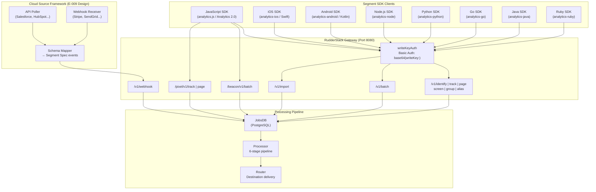

# Technical Specification

# 0. Agent Action Plan

## 0.1 Intent Clarification

### 0.1.1 Core Feature Objective

Based on the prompt, the Blitzy platform understands that the new feature requirement is to **complete Sprint 2–3: Source SDK Compatibility** as defined in the project's sprint roadmap (`docs/gap-report/sprint-roadmap.md`) and informed by the source catalog parity analysis (`docs/gap-report/source-catalog-parity.md`). This sprint encompasses **five epics (E-005 through E-009)** that collectively raise the Source Catalog parity score from ~60% to ~85%.

The specific requirements are:

- **E-005 — Validate Gateway Segment-compatible API surface:** Perform comprehensive integration testing of all `/v1/{type}` endpoints on port 8080 with Segment SDK client libraries. Validate that the Write Key Basic Auth scheme (`Authorization: Basic base64(writeKey:)`) matches Segment's authentication exactly, enabling standard Segment SDKs to connect with endpoint URL substitution only.

- **E-006 — JavaScript web SDK compatibility testing:** Execute end-to-end testing with Segment's `analytics.js` / Analytics 2.0 against the RudderStack Gateway. Validate all 6 Spec calls (`identify`, `track`, `page`, `screen`, `group`, `alias`), the batch endpoint (`/v1/batch`), and beacon tracking (`/beacon/v1/batch`). Document device-mode limitations.

- **E-007 — iOS and Android mobile SDK compatibility testing:** Perform integration testing with `analytics-ios` (Swift) and `analytics-android` (Kotlin) against the Gateway. Validate `identify`, `track`, `screen`, `group`, `alias` calls, context auto-collection fields, and lifecycle events.

- **E-008 — Server-side SDK compatibility testing:** Integration testing with Node.js (`analytics-node`), Python (`analytics-python`), Go (`analytics-go`), Java (`analytics-java`), and Ruby (`analytics-ruby`) SDKs. Validate batch endpoint usage and retry behavior.

- **E-009 — Cloud source ingestion framework design:** Design and prototype the cloud source ingestion framework to address the 140 cloud app source gap (Salesforce, Stripe, HubSpot, Zendesk, etc.). Define the polling/webhook architecture, credential management, and schema mapping layer. Priority: top-20 cloud sources by adoption. **This epic is explicitly design-and-prototype only — no production-grade service code.**

**Implicit requirements surfaced:**

- All testing must exercise the live Gateway HTTP API, requiring Docker-based integration test infrastructure (PostgreSQL, Transformer service, webhook recorder)
- Test fixtures must use actual Segment SDK client library payloads, not hand-crafted HTTP requests, to validate real-world SDK compatibility
- The existing Sprint 1–2 Event Spec Parity work (E-001 through E-004, marked ✅ COMPLETE) is a prerequisite — all 6 event types are already validated at the field level
- The cloud source framework design (E-009) must produce both a design document and a minimal proof-of-concept, but not a production service implementation
- All CI failures resolvable through code changes must be fixed; failures from missing AWS ECR credentials may be skipped

### 0.1.2 Special Instructions and Constraints

- **Implement ALL items in scope:** For every epic, implement ALL items listed — do not skip any variant, endpoint, or sub-case mentioned in the epic description
- **Design-only epics:** E-009 (marked "Design and prototype") must deliver a design document and a minimal proof-of-concept only — no production-grade service code
- **Docker requirement:** If any step requires Docker, start it first
- **Test execution:** Run all tests after implementation
- **CI fix policy:** Fix all CI failures resolvable through code changes; skip failures caused by missing repository secrets (AWS ECR credentials)
- **Backward compatibility:** All changes must maintain backward compatibility with the existing HTTP API surface — no breaking changes to `/v1/*` endpoints
- **jsonrs over encoding/json:** Per the repository's `depguard` linting rule in `.golangci.yml`, all JSON serialization/deserialization must use `jsonrs` from `github.com/rudderlabs/rudder-go-kit`, not `encoding/json`
- **Table-driven test patterns:** All new tests must follow the codebase's established pattern with `t.Run()` subtests using `testify/require` for assertions; integration tests must use `dockertest/v3` for container orchestration

### 0.1.3 Technical Interpretation

These feature requirements translate to the following technical implementation strategy:

- To **validate the Gateway Segment-compatible API surface (E-005)**, we will create a comprehensive integration test suite that programmatically sends requests to all `/v1/{type}` endpoints using Segment SDK-compatible payloads with Write Key Basic Auth, asserting 200 OK responses and field-level preservation through to webhook destinations
- To **test JavaScript web SDK compatibility (E-006)**, we will create test fixtures that replicate the exact payload formats produced by `analytics.js` / Analytics 2.0, including batch, beacon, and pixel endpoints, and validate end-to-end delivery through the Gateway pipeline
- To **test iOS and Android mobile SDK compatibility (E-007)**, we will create test fixtures replicating `analytics-ios` (Swift) and `analytics-android` (Kotlin) payload formats, including mobile-specific context fields (`context.device`, `context.os`, `context.app`, `context.network`, `context.screen`) and lifecycle events (`Application Opened`, `Application Backgrounded`)
- To **test server-side SDK compatibility (E-008)**, we will create test fixtures for Node.js, Python, Go, Java, and Ruby SDK payload formats, focusing on batch endpoint usage, retry semantics, and library metadata in `context.library`
- To **design the cloud source ingestion framework (E-009)**, we will create a design document at `docs/architecture/cloud-source-framework.md` defining the polling/webhook architecture for the top-20 cloud sources, and implement a minimal proof-of-concept package at `services/cloud-sources/` with interface definitions and a sample connector skeleton

## 0.2 Repository Scope Discovery

### 0.2.1 Comprehensive File Analysis

The Sprint 2–3 Source SDK Compatibility scope affects files across the Gateway layer (HTTP ingestion and authentication), the integration test infrastructure, documentation, and a new cloud source service package. The following analysis identifies every existing file requiring modification and every new file requiring creation.

**Existing Gateway Files Requiring Modification or Verification:**

| File Path | Purpose | Sprint Impact |
|-----------|---------|---------------|
| `gateway/handle_http.go` | HTTP handler wiring for all event types — defines `webIdentifyHandler`, `webTrackHandler`, `webPageHandler`, `webScreenHandler`, `webGroupHandler`, `webAliasHandler`, `webBatchHandler` | E-005: Verify all handlers are correctly wired for Segment SDK payload formats |
| `gateway/handle_http_auth.go` | Write Key Basic Auth middleware (`writeKeyAuth`), webhook auth (`webhookAuth`), source ID auth (`sourceIDAuth`) | E-005: Validate Write Key Basic Auth is 100% compatible with Segment's scheme |
| `gateway/handle_http_beacon.go` | Beacon batch handler (`beaconBatchHandler`) with writeKey query param interception | E-006: Validate beacon endpoint accepts Analytics 2.0 `sendBeacon()` payloads |
| `gateway/handle_http_pixel.go` | Pixel track and page handlers with GIF response — `pixelTrackHandler`, `pixelPageHandler`, `pixelInterceptor` | E-006: Validate pixel endpoints accept web SDK image tag requests |
| `gateway/handle_http_import.go` | Historical data import handler (`webImportHandler`) | E-005: Verify import endpoint compatibility |
| `gateway/handle.go` | Core request handler — event processing, userAgent extraction, bot detection, payload batching | E-005, E-007: Verify mobile context fields and lifecycle events pass through |
| `gateway/handle_lifecycle.go` | Route registration via Chi router — all `/v1/*`, `/beacon/v1/*`, `/pixel/v1/*` routes | E-005: Audit complete route registration for SDK endpoint coverage |
| `gateway/handle_webhook.go` | Webhook handler — `webhookHandler()` supporting both v1 and v2 auth chains | E-009: Understand existing webhook source pattern for cloud source design |
| `gateway/openapi.yaml` | OpenAPI 3.0.3 specification for all Gateway endpoints | E-005: Verify specification covers all SDK-required endpoints |
| `gateway/gateway.go` | Constants and sentinel errors | E-005: Verify error responses match Segment API behavior |
| `gateway/types.go` | Request types — `webRequestT`, `RequestHandler` interface | E-005: Verify request types accommodate all SDK payload shapes |
| `gateway/validator/validator.go` | Validator mediator chain — `msgProperties`, `messageId`, `reqType`, `receivedAt`, `requestIP`, `rudderID` | E-005: Verify validators accept all valid Segment SDK payloads |
| `gateway/internal/bot/bot.go` | Bot user-agent detection — `IsBotUserAgent` | E-006, E-007: Verify SDK user-agents are not falsely classified as bots |
| `gateway/response/response.go` | Canonical response strings — `Ok`, `InvalidWriteKey`, `SourceDisabled`, etc. | E-005: Verify response codes and messages match Segment API behavior |
| `gateway/webhook/setup.go` | Webhook pipeline setup | E-009: Reference for cloud source webhook integration |
| `gateway/webhook/webhook.go` | Core webhook request handling | E-009: Reference for inbound webhook processing |
| `gateway/webhook/webhookTransformer.go` | Webhook payload transformation | E-009: Reference for cloud source payload normalization |
| `gateway/types/types.go` | `AuthRequestContext` struct with `SourceCategory`, `WriteKey`, `SourceEnabled` | E-005: Verify auth context supports all SDK authentication patterns |

**Existing Gateway Test Files Requiring Extension:**

| File Path | Purpose | Sprint Impact |
|-----------|---------|---------------|
| `gateway/gateway_test.go` | Comprehensive Gateway unit test suite (96KB) | E-005: Extend with Segment SDK-format payloads |
| `gateway/handle_test.go` | Handle pipeline tests (49KB) | E-005: Add SDK-specific payload preservation tests |
| `gateway/handle_http_auth_test.go` | Auth middleware tests | E-005: Add Segment SDK Basic Auth format tests |
| `gateway/handle_http_beacon_test.go` | Beacon handler tests | E-006: Add Analytics 2.0 beacon payload tests |
| `gateway/handle_http_pixel_test.go` | Pixel handler tests | E-006: Add web SDK pixel tracking tests |
| `gateway/gateway_integration_test.go` | Gateway integration tests | E-005: Extend with multi-SDK integration scenarios |
| `gateway/integration_test.go` | Additional integration tests | E-005: Extend with SDK compatibility scenarios |
| `gateway/validator/validator_test.go` | Validator chain tests | E-005: Verify SDK payloads pass validation |
| `gateway/internal/bot/bot_test.go` | Bot detection tests | E-006, E-007: Verify SDK user-agents not flagged |
| `gateway/webhook/webhook_test.go` | Webhook handler tests | E-009: Reference for cloud source tests |

**Existing Integration Test Files Requiring Modification:**

| File Path | Purpose | Sprint Impact |
|-----------|---------|---------------|
| `integration_test/docker_test/docker_test.go` | Full-stack Docker regression suite | E-005: Extend with multi-SDK payload scenarios |
| `integration_test/docker_test/testdata/workspaceConfigTemplate.json` | Workspace config for Docker tests | E-005: Verify template supports all SDK source types |
| `integration_test/event_spec_parity/event_spec_parity_test.go` | Event Spec Parity integration test from Sprint 1–2 | E-005: Extend with SDK-specific payload variations |

**Backend Configuration Files (Read/Verify):**

| File Path | Purpose | Sprint Impact |
|-----------|---------|---------------|
| `backend-config/types.go` | `SourceT` struct with `WriteKey`, `SourceCategory`, `Enabled`, `SourceDefinition` | E-005: Verify source config supports SDK auth; E-009: Understand cloud source config model |
| `backend-config/backend-config.go` | Backend config fetch and cache | E-009: Reference for cloud source configuration management |
| `config/config.yaml` | Gateway port 8080, 64 workers, 4MB request size | E-005: Document config constraints for SDK compatibility |

**Testhelper Files (Used but Not Modified):**

| File Path | Purpose |
|-----------|---------|
| `testhelper/webhook/recorder.go` | Webhook request recorder for asserting event delivery |
| `testhelper/health/checker.go` | Health check polling utility for integration tests |
| `testhelper/workspaceConfig/` | Workspace configuration test fixtures |

**Segment Reference Corpus (Read-Only Baseline):**

| File Path | Purpose |
|-----------|---------|
| `refs/segment-docs/src/connections/sources/catalog/libraries/website/javascript/` | JavaScript SDK reference |
| `refs/segment-docs/src/connections/sources/catalog/libraries/mobile/ios/` | iOS SDK reference |
| `refs/segment-docs/src/connections/sources/catalog/libraries/mobile/android/` | Android SDK reference |
| `refs/segment-docs/src/connections/sources/catalog/libraries/server/node-js/` | Node.js SDK reference |
| `refs/segment-docs/src/connections/sources/catalog/libraries/server/python/` | Python SDK reference |
| `refs/segment-docs/src/connections/sources/catalog/libraries/server/go/` | Go SDK reference |
| `refs/segment-docs/src/connections/sources/catalog/libraries/server/java/` | Java SDK reference |
| `refs/segment-docs/src/connections/sources/catalog/libraries/server/ruby/` | Ruby SDK reference |
| `refs/segment-docs/src/connections/sources/catalog/cloud-apps/` | 140 cloud app source definitions |

**Integration Point Discovery:**

- **API endpoints connected to this feature:** All `/v1/{type}` endpoints (identify, track, page, screen, group, alias, batch), `/v1/import`, `/beacon/v1/batch`, `/pixel/v1/track`, `/pixel/v1/page`, `/v1/webhook`
- **Authentication middleware:** `writeKeyAuth` (gateway/handle_http_auth.go:24-58), `webhookAuth` (gateway/handle_http_auth.go:64-96), `beaconInterceptor` (gateway/handle_http_beacon.go:22-47)
- **Database models affected:** None directly — the Gateway persists events to JobsDB transparently
- **Service classes requiring verification:** `gateway.Handle` (core request handler), `webhook.WebhookAuth` (webhook auth chain), `validator.Mediator` (payload validation)
- **Middleware/interceptors impacted:** `beaconInterceptor` (writeKey from query params → Basic Auth header), `pixelInterceptor` (query params → JSON payload), `callType` middleware (request type injection), `UncompressMiddleware` (gzip decompression)

### 0.2.2 New File Requirements

**New Source Files to Create:**

| File Path | Purpose | Epic |
|-----------|---------|------|
| `services/cloud-sources/cloud_source.go` | Cloud source framework interface definitions — `CloudSource`, `Poller`, `WebhookReceiver`, `SchemaMapper` interfaces | E-009 |
| `services/cloud-sources/registry.go` | Cloud source connector registry — registration, lookup, and lifecycle management | E-009 |
| `services/cloud-sources/config.go` | Cloud source configuration types — credential storage, polling intervals, webhook URLs | E-009 |
| `services/cloud-sources/poller.go` | Base polling implementation — rate-limited API polling with cursor-based pagination | E-009 |
| `services/cloud-sources/webhook_receiver.go` | Base webhook receiver — inbound webhook validation, payload normalization | E-009 |
| `services/cloud-sources/schema_mapper.go` | Schema mapping layer — transforms third-party API responses to Segment Spec events | E-009 |
| `services/cloud-sources/connectors/stripe/stripe.go` | Stripe connector proof-of-concept — webhook-based event ingestion | E-009 |

**New Test Files to Create:**

| File Path | Purpose | Epic |
|-----------|---------|------|
| `integration_test/sdk_compatibility/sdk_compatibility_test.go` | Full-stack SDK compatibility integration test — validates all SDK payload formats through Gateway → Processor → Router → webhook | E-005, E-006, E-007, E-008 |
| `integration_test/sdk_compatibility/testdata/workspaceConfigTemplate.json` | Workspace configuration template for SDK compatibility tests | E-005 |
| `integration_test/sdk_compatibility/testdata/segment_js_payloads.json` | Canonical `analytics.js` payload fixtures for all call types including batch and beacon | E-006 |
| `integration_test/sdk_compatibility/testdata/segment_ios_payloads.json` | Canonical `analytics-ios` payload fixtures with mobile context fields and lifecycle events | E-007 |
| `integration_test/sdk_compatibility/testdata/segment_android_payloads.json` | Canonical `analytics-android` payload fixtures with mobile context fields and lifecycle events | E-007 |
| `integration_test/sdk_compatibility/testdata/segment_server_payloads.json` | Canonical server-side SDK payload fixtures for Node.js, Python, Go, Java, Ruby | E-008 |
| `gateway/sdk_compatibility_test.go` | Gateway-level SDK payload format validation unit tests | E-005, E-006, E-007, E-008 |
| `gateway/sdk_auth_compat_test.go` | Dedicated Write Key Basic Auth compatibility test suite — validates all Segment SDK auth patterns | E-005 |
| `services/cloud-sources/cloud_source_test.go` | Cloud source framework unit tests — interface compliance, registry, config | E-009 |
| `services/cloud-sources/connectors/stripe/stripe_test.go` | Stripe connector proof-of-concept tests | E-009 |

**New Documentation Files to Create:**

| File Path | Purpose | Epic |
|-----------|---------|------|
| `docs/architecture/cloud-source-framework.md` | Cloud source ingestion framework design document — polling/webhook architecture, credential management, schema mapping, top-20 source analysis | E-009 |
| `docs/guides/sdk-compatibility/segment-sdk-migration.md` | Segment SDK migration guide — per-SDK endpoint swap and Write Key substitution instructions | E-005, E-006, E-007, E-008 |
| `docs/guides/sdk-compatibility/web-sdk-guide.md` | JavaScript/Analytics 2.0 compatibility guide with device-mode limitations | E-006 |
| `docs/guides/sdk-compatibility/mobile-sdk-guide.md` | iOS and Android SDK compatibility guide with lifecycle event support | E-007 |
| `docs/guides/sdk-compatibility/server-sdk-guide.md` | Server-side SDK (Node.js, Python, Go, Java, Ruby) compatibility guide | E-008 |

**New Configuration Files to Create:**

| File Path | Purpose | Epic |
|-----------|---------|------|
| `integration_test/sdk_compatibility/testdata/workspaceConfigTemplate.json` | Workspace configuration for SDK compatibility integration tests | E-005 |

### 0.2.3 Web Search Research Conducted

The following research topics inform the implementation approach:

- Best practices for Segment SDK compatibility testing — validated through the Segment SDK documentation corpus embedded in `refs/segment-docs/src/connections/sources/catalog/libraries/`
- Cloud source ingestion patterns — polling vs. webhook architectures for SaaS API integration (Salesforce, Stripe, HubSpot)
- Segment SDK payload formats — exact JSON structures produced by each SDK platform for all 6 event types
- Security considerations for webhook-based cloud source ingestion — HMAC signature validation, rate limiting, replay protection

## 0.3 Dependency Inventory

### 0.3.1 Private and Public Packages

The following table lists all key packages relevant to the Sprint 2–3 Source SDK Compatibility feature addition, with exact versions drawn from `go.mod`:

| Registry | Package | Version | Purpose |
|----------|---------|---------|---------|
| Go stdlib | `go` | 1.26.0 | Runtime version from `go.mod` line 3 |
| GitHub | `github.com/rudderlabs/rudder-go-kit` | v0.72.3 | Core toolkit — config, logger, stats, httputil, jsonrs, test docker resources |
| GitHub | `github.com/rudderlabs/rudder-observability-kit` | v0.0.6 | Observability instrumentation (obskit labels) |
| GitHub | `github.com/rudderlabs/rudder-schemas` | v0.9.1 | Shared schema definitions (stream.MessageProperties) |
| GitHub | `github.com/rudderlabs/rudder-transformer/go` | v1.122.0 | Transformer Go client library |
| GitHub | `github.com/rudderlabs/analytics-go` | v3.3.3+incompatible | RudderStack analytics Go client |
| GitHub | `github.com/go-chi/chi/v5` | v5.2.5 | HTTP router for Gateway endpoints — all SDK-facing routes |
| GitHub | `github.com/rs/cors` | v1.11.1 | CORS middleware for browser-based SDK (analytics.js) access |
| GitHub | `github.com/tidwall/gjson` | v1.18.0 | Fast JSON path querying for payload field extraction in tests |
| GitHub | `github.com/tidwall/sjson` | v1.2.5 | Fast JSON mutation for test payload construction |
| GitHub | `github.com/grafana/jsonparser` | v0.0.0-20250908162026-5c2524e07b4c | High-performance JSON parser |
| GitHub | `github.com/stretchr/testify` | v1.11.1 | Test assertion library (assert, require) |
| GitHub | `github.com/onsi/ginkgo/v2` | v2.24.0 | BDD test framework |
| GitHub | `github.com/onsi/gomega` | v1.38.0 | BDD matcher library |
| GitHub | `github.com/ory/dockertest/v3` | v3.12.0 | Docker container orchestration for integration tests |
| GitHub | `go.uber.org/mock` | v0.6.0 | Interface mock generation |
| GitHub | `github.com/google/go-cmp` | v0.7.0 | Deep structural comparison for test assertions |
| GitHub | `github.com/google/uuid` | v1.6.0 | UUID generation (messageId, anonymousId) |
| GitHub | `github.com/samber/lo` | v1.52.0 | Go generics utility library (map, filter, chunk) |
| GitHub | `github.com/lib/pq` | v1.11.2 | PostgreSQL driver for JobsDB integration tests |
| GitHub | `github.com/golang-migrate/migrate/v4` | v4.18.3 | Database migration framework |
| GitHub | `github.com/phayes/freeport` | v0.0.0-20220201140144-74d24b5ae9f5 | Dynamic port allocation for test isolation |
| GitHub | `github.com/klauspost/compress` | v1.18.4 | Gzip compression/decompression for Gateway middleware |
| GitHub | `github.com/joho/godotenv` | v1.5.1 | Environment variable loading for test configuration |
| GitHub | `github.com/evanphx/json-patch/v5` | v5.9.11 | JSON patch operations for config diffs |

### 0.3.2 Dependency Updates

**No new external dependencies are required** for Sprint 2–3. All SDK compatibility testing, integration testing, and the cloud source framework proof-of-concept leverage the existing dependency set. The work focuses on:

- Creating test fixtures that replicate Segment SDK payload formats using existing JSON libraries (`gjson`, `sjson`)
- Building integration tests using the established `dockertest/v3` + `testhelper/webhook` + `testhelper/health` pattern
- Designing the cloud source framework using Go standard library interfaces and the existing `gateway/webhook/` package as a reference

**Import Updates (If applicable):**

Files requiring import additions for new test utilities and source files:

- `integration_test/sdk_compatibility/sdk_compatibility_test.go` — New file requiring imports from:
  - `github.com/ory/dockertest/v3`
  - `github.com/rudderlabs/rudder-go-kit/testhelper/docker/resource/postgres`
  - `github.com/rudderlabs/rudder-go-kit/testhelper/docker/resource/transformer`
  - `github.com/rudderlabs/rudder-server/testhelper/health`
  - `github.com/rudderlabs/rudder-server/testhelper/webhook`
  - `github.com/tidwall/gjson`
  - `github.com/stretchr/testify/require`

- `gateway/sdk_compatibility_test.go` — New file requiring imports from:
  - `github.com/stretchr/testify/require`
  - `github.com/tidwall/gjson`
  - `net/http`, `net/http/httptest`, `encoding/base64`

- `services/cloud-sources/cloud_source.go` — New file requiring imports from:
  - `context`, `net/http`, `time`
  - `github.com/rudderlabs/rudder-go-kit/config`
  - `github.com/rudderlabs/rudder-go-kit/logger`

**External Reference Updates:**

| File | Update Type | Description |
|------|-------------|-------------|
| `docs/gap-report/source-catalog-parity.md` | Documentation | Update SDK Compatibility status from gaps to validated |
| `docs/gap-report/sprint-roadmap.md` | Documentation | Mark E-005 through E-009 epics with progress |
| `docs/gap-report/index.md` | Documentation | Update Source Catalog parity from ~60% to ~85% |
| `README.md` | Documentation | Add SDK compatibility section and cloud source framework reference |
| `gateway/openapi.yaml` | Schema | Verify all SDK-required endpoints are fully specified |
| `.github/workflows/tests.yaml` | CI/CD | Add SDK compatibility integration test to CI matrix |

## 0.4 Integration Analysis

### 0.4.1 Existing Code Touchpoints

**Direct Modifications Required:**

- **`gateway/handle_http_auth.go`** (lines 24–58): The `writeKeyAuth` middleware is the central authentication touchpoint for all Segment SDK requests. It extracts the writeKey via `r.BasicAuth()`, validates against the source map via `authRequestContextForWriteKey`, checks `SourceEnabled`, and populates `AuthRequestContext`. Verification needed that the exact `Authorization: Basic base64(writeKey:)` format (username=writeKey, password=empty string) is processed identically to Segment's authentication scheme across all SDK platforms.

- **`gateway/handle_http.go`** (lines 37–82): The handler wiring layer defines all event type handlers — `webIdentifyHandler`, `webTrackHandler`, `webPageHandler`, `webScreenHandler`, `webGroupHandler`, `webAliasHandler`, `webBatchHandler`. Each wraps the `writeKeyAuth` middleware around `webHandler()`. Modification needed to verify each handler processes SDK-specific payload shapes (e.g., batch payloads with mixed event types, beacon payloads without JSON content-type headers).

- **`gateway/handle_lifecycle.go`** (lines 561–650): The `StartWebHandler` function registers all routes on the Chi router. The route map includes `/v1/identify`, `/v1/track`, `/v1/page`, `/v1/screen`, `/v1/group`, `/v1/alias`, `/v1/batch`, `/v1/import`, `/v1/webhook`, `/beacon/v1/batch`, `/pixel/v1/track`, `/pixel/v1/page`. Verification needed that no SDK-required endpoints are missing from registration.

- **`gateway/handle_http_beacon.go`** (lines 13–47): The `beaconInterceptor` reads `writeKey` from query params, sets a Basic Auth header, and delegates to `webBatchHandler`. E-006 requires validation that `navigator.sendBeacon()` payloads from the JavaScript SDK are correctly intercepted, including Content-Type handling for `application/x-www-form-urlencoded` and `text/plain` content types that `sendBeacon` may produce.

- **`gateway/handle_http_pixel.go`** (lines 24–131): The `pixelInterceptor` converts GET requests with query parameters into POST request bodies, always returning a 1x1 transparent GIF. E-006 requires validation that pixel tracking from web SDK image tags correctly maps query params to event fields.

- **`gateway/handle.go`** (lines 85–153): The `webRequestHandler` processes incoming requests — reads body, validates size (4MB limit from config), extracts IP, and dispatches to the appropriate `RequestHandler`. E-007 requires verification that mobile SDK context auto-collection fields (`context.device`, `context.os`, `context.app`, `context.network`, `context.screen`) and lifecycle events pass through without modification.

- **`gateway/gateway_test.go`**: Extend with test cases that use exact payload formats from each Segment SDK platform (JS, iOS, Android, Node.js, Python, Go, Java, Ruby) to validate end-to-end processing.

- **`gateway/handle_test.go`**: Extend with tests for mobile-specific context fields (device info, OS version, app metadata) and server-side SDK library metadata in `context.library`.

- **`gateway/handle_http_auth_test.go`**: Extend with tests validating Write Key Basic Auth for all SDK authentication patterns — header-based auth (SDKs), query param auth (beacon/pixel), and empty password verification.

**Processor Touchpoints (Verification Only):**

- **`processor/processor.go`**: The 6-stage pipeline must preserve all SDK-specific context fields (mobile device info, app metadata, library info) without stripping or modifying them. Verification needed but no modification expected.

- **`processor/integrations/integrations.go`**: The `FilterClientIntegrations` function must correctly handle the `integrations` object from all SDK platforms. Verification only.

**Router Touchpoints (Verification Only):**

- **`router/network.go`**: The `SendPost` method handles payload serialization for destination delivery. Must be verified to correctly serialize all SDK-specific nested context objects.

- **`router/worker.go`**: Job batching and delivery must preserve all SDK context fields through to destination.

**Backend Config Touchpoints (Reference for Cloud Source Design):**

- **`backend-config/types.go`** (lines 107–124): The `SourceT` struct defines source configuration including `WriteKey`, `SourceDefinition`, `Enabled`, and `Config`. E-009 must design the cloud source configuration model as an extension of this existing pattern.

- **`backend-config/backend-config.go`**: The config fetch and cache system. E-009 must integrate cloud source configuration into the existing backend-config subscription model.

### 0.4.2 Dependency Injections

- **`gateway/handle_lifecycle.go`** (line 141–142): The `irh` (Import Request Handler) and `rrh` (Regular Request Handler) are initialized during Gateway setup. E-009 may require a new request handler type for cloud source ingestion if the proof-of-concept routes through the Gateway.

- **`gateway/handle_lifecycle.go`** (line 150): The `suppressUserHandler` is injected via the application features interface. E-009 cloud source framework may need similar feature-gated initialization.

### 0.4.3 Database/Schema Updates

- **No direct database schema changes** are required for Sprint 2–3. The Gateway persists events to JobsDB transparently, and the JobsDB schema accommodates all event payload shapes without modification.

- **E-009 (Cloud Source Framework)**: The design document must address persistent storage requirements for cloud source credentials, polling cursors, and sync state. The proof-of-concept may leverage existing config storage or require a new schema — this is a design decision documented in the architecture document.

### 0.4.4 Integration Architecture

```mermaid
flowchart TD
    subgraph SDKs["Segment SDK Clients"]
        JS["JavaScript SDK<br/>(analytics.js / Analytics 2.0)"]
        IOS["iOS SDK<br/>(analytics-ios / Swift)"]
        AND["Android SDK<br/>(analytics-android / Kotlin)"]
        NODE["Node.js SDK<br/>(analytics-node)"]
        PY["Python SDK<br/>(analytics-python)"]
        GOSK["Go SDK<br/>(analytics-go)"]
        JAVA["Java SDK<br/>(analytics-java)"]
        RUBY["Ruby SDK<br/>(analytics-ruby)"]
    end

    subgraph Gateway["RudderStack Gateway (Port 8080)"]
        AUTH["writeKeyAuth<br/>Basic Auth: base64(writeKey:)"]
        SPEC["/v1/identify | track | page<br/>screen | group | alias"]
        BATCH["/v1/batch"]
        BEACON["/beacon/v1/batch"]
        PIXEL["/pixel/v1/track | page"]
        IMPORT["/v1/import"]
        WEBHOOK["/v1/webhook"]
    end

    subgraph Pipeline["Processing Pipeline"]
        JOBSDB["JobsDB<br/>(PostgreSQL)"]
        PROC["Processor<br/>6-stage pipeline"]
        ROUTER["Router<br/>Destination delivery"]
    end

    subgraph CloudSources["Cloud Source Framework (E-009 Design)"]
        POLLER["API Poller<br/>(Salesforce, HubSpot...)"]
        WHRECV["Webhook Receiver<br/>(Stripe, SendGrid...)"]
        MAPPER["Schema Mapper<br/>→ Segment Spec events"]
    end

    JS --> AUTH
    IOS --> AUTH
    AND --> AUTH
    NODE --> AUTH
    PY --> AUTH
    GOSK --> AUTH
    JAVA --> AUTH
    RUBY --> AUTH

    AUTH --> SPEC
    AUTH --> BATCH
    JS --> BEACON
    JS --> PIXEL
    AUTH --> IMPORT

    POLLER --> MAPPER
    WHRECV --> MAPPER
    MAPPER --> WEBHOOK

    SPEC --> JOBSDB
    BATCH --> JOBSDB
    BEACON --> JOBSDB
    PIXEL --> JOBSDB
    IMPORT --> JOBSDB
    WEBHOOK --> JOBSDB

    JOBSDB --> PROC --> ROUTER
```

## 0.5 Technical Implementation

### 0.5.1 File-by-File Execution Plan

**Group 1 — Gateway API Surface Validation (E-005)**

- **CREATE: `gateway/sdk_compatibility_test.go`** — Comprehensive table-driven test suite that sends all 6 event types to the Gateway using exact Segment SDK payload formats. Each test case validates: (a) correct HTTP 200 response, (b) Write Key Basic Auth acceptance with `Authorization: Basic base64(writeKey:)`, (c) field-level preservation through the Gateway pipeline including `anonymousId`, `userId`, `messageId`, `timestamp`, `sentAt`, `context`, `integrations`, `type`. Tests must cover payload formats from JS, iOS, Android, Node.js, Python, Go, Java, and Ruby SDKs.

- **CREATE: `gateway/sdk_auth_compat_test.go`** — Dedicated test file for Write Key Basic Auth compatibility. Tests must validate: (a) standard Basic Auth header with empty password (all SDKs), (b) writeKey in query params (beacon/pixel), (c) rejection of invalid writeKeys with correct 401 response, (d) rejection of disabled sources with 404 response, (e) case sensitivity handling, (f) special character handling in writeKeys.

- **MODIFY: `gateway/gateway_test.go`** — Extend existing test suite with Segment SDK-specific payload variations. Add test cases for: batch payloads with mixed event types (as produced by server-side SDKs), payloads with `context.library` metadata matching each SDK platform, payloads with SDK-specific `context.channel` values (`client` for web/mobile, `server` for server-side).

- **MODIFY: `gateway/handle_test.go`** — Add test cases for SDK payload processing through the Handle pipeline, focusing on: mobile SDK context auto-collection fields (`context.device`, `context.os`, `context.app`, `context.network`, `context.screen`), server-side SDK batch semantics, and library version metadata preservation.

- **MODIFY: `gateway/handle_http_auth_test.go`** — Extend with comprehensive Write Key Basic Auth format tests covering all Segment SDK authentication patterns. Add tests for: empty password in Basic Auth header, query param writeKey for beacon endpoints, and Combined auth verification across all SDK variants.

- **MODIFY: `gateway/validator/validator_test.go`** — Add test cases confirming that all SDK payload formats pass the validator chain without rejection, including payloads with mobile-specific context fields, server-side batch payloads, and beacon payloads.

- **MODIFY: `gateway/internal/bot/bot_test.go`** — Add test cases verifying that user-agent strings from all Segment SDKs (JavaScript, iOS, Android, Node.js, Python, Go, Java, Ruby) are not falsely flagged as bot traffic.

**Group 2 — JavaScript Web SDK Compatibility (E-006)**

- **MODIFY: `gateway/handle_http_beacon_test.go`** — Extend with Analytics 2.0 `sendBeacon()` payload tests. Validate: (a) `application/x-www-form-urlencoded` content type handling, (b) `text/plain` content type from `sendBeacon`, (c) writeKey extraction from query params, (d) batch payload with mixed event types via beacon, (e) correct delegation to `webBatchHandler`.

- **MODIFY: `gateway/handle_http_pixel_test.go`** — Extend with web SDK pixel tracking tests. Validate: (a) `track` pixel with event name in query param, (b) `page` pixel with optional name param, (c) GIF response regardless of processing result, (d) query param to JSON payload conversion including nested `properties.*` params.

- **MODIFY: `gateway/gateway_test.go`** — Add JavaScript SDK-specific test scenarios: (a) standard `analytics.js` identify/track/page/screen/group/alias payloads with `context.library.name: "analytics.js"` and `context.library.version`, (b) Analytics 2.0 payload format with `_metadata` field, (c) batch endpoint with mixed call types, (d) payloads with `context.page` auto-collected fields (URL, path, referrer, title, search).

**Group 3 — Mobile SDK Compatibility (E-007)**

- **MODIFY: `gateway/handle_test.go`** — Add iOS and Android SDK-specific test scenarios: (a) `analytics-ios` payloads with `context.library.name: "analytics-ios"` and Swift-specific context fields, (b) `analytics-android` payloads with `context.library.name: "analytics-android"` and Kotlin-specific context fields, (c) mobile context auto-collection: `context.device` (id, manufacturer, model, name, type), `context.os` (name, version), `context.app` (name, version, build, namespace), `context.network` (bluetooth, carrier, cellular, wifi), `context.screen` (density, height, width), (d) lifecycle events: `Application Opened`, `Application Backgrounded`, `Application Updated`, `Application Installed`, (e) `screen` call type with category and name properties.

**Group 4 — Server-Side SDK Compatibility (E-008)**

- **MODIFY: `gateway/gateway_test.go`** — Add server-side SDK-specific test scenarios for each platform:
  - Node.js: `context.library.name: "analytics-node"`, batch endpoint with `messageId` auto-generation, `timestamp` ISO 8601 formatting
  - Python: `context.library.name: "analytics-python"`, batch flushing behavior, `sentAt` field
  - Go: `context.library.name: "analytics-go"`, `Enqueue()` method payload format
  - Java: `context.library.name: "analytics-java"`, builder pattern payload format
  - Ruby: `context.library.name: "analytics-ruby"`, batch endpoint with retry logic

- **MODIFY: `gateway/handle_test.go`** — Add server-side SDK batch payload tests: (a) mixed event type batches with all 6 call types, (b) batch payload size limits (verify 4MB config limit), (c) batch with large number of events, (d) server-side SDK retry behavior simulation (duplicate `messageId` handling).

**Group 5 — Full-Stack Integration Testing (E-005, E-006, E-007, E-008)**

- **CREATE: `integration_test/sdk_compatibility/sdk_compatibility_test.go`** — Full-stack integration test using `dockertest/v3` to provision PostgreSQL, Transformer, and webhook services. Test flow: send SDK-specific payloads for all platforms → verify webhook delivery preserves all fields → assert `context.library` metadata is correct per platform. Test scenarios:
  - Gateway API surface validation with all `/v1/{type}` endpoints
  - Write Key Basic Auth from all SDK platforms
  - JavaScript SDK: standard calls, batch, beacon, pixel
  - iOS SDK: identify, track, screen with mobile context
  - Android SDK: identify, track, screen with mobile context
  - Server-side SDKs: batch endpoint with mixed events per platform
  - Lifecycle events: Application Opened, Application Backgrounded
  - Context field preservation: all 18 standard context fields through full pipeline

- **CREATE: `integration_test/sdk_compatibility/testdata/workspaceConfigTemplate.json`** — Workspace configuration template with webhook destination accepting all 6 event types, configured with `supportedMessageTypes: ["identify", "track", "page", "screen", "group", "alias"]`.

- **CREATE: `integration_test/sdk_compatibility/testdata/segment_js_payloads.json`** — Canonical `analytics.js` / Analytics 2.0 payload fixtures for all 6 call types plus batch and beacon formats. Include `context.page`, `context.userAgent`, and `context.library` metadata.

- **CREATE: `integration_test/sdk_compatibility/testdata/segment_ios_payloads.json`** — Canonical iOS SDK payload fixtures with mobile context auto-collection fields, lifecycle events, and `context.library.name: "analytics-ios"`.

- **CREATE: `integration_test/sdk_compatibility/testdata/segment_android_payloads.json`** — Canonical Android SDK payload fixtures with mobile context auto-collection fields, lifecycle events, and `context.library.name: "analytics-android"`.

- **CREATE: `integration_test/sdk_compatibility/testdata/segment_server_payloads.json`** — Canonical server-side SDK payload fixtures for Node.js, Python, Go, Java, and Ruby with platform-specific `context.library` metadata and batch formats.

- **MODIFY: `integration_test/docker_test/docker_test.go`** — Extend the `sendEventsToGateway` function with SDK-specific payload formats to verify backwards compatibility with existing regression tests.

**Group 6 — Cloud Source Framework Design and Proof-of-Concept (E-009)**

- **CREATE: `docs/architecture/cloud-source-framework.md`** — Comprehensive design document defining:
  - Cloud source ingestion architecture (polling + webhook dual-mode)
  - Connector interface definitions (`CloudSource`, `Poller`, `WebhookReceiver`, `SchemaMapper`)
  - Credential management model (encrypted storage, runtime injection)
  - Schema mapping layer (third-party API responses → Segment Spec events)
  - Top-20 cloud source prioritization with architecture recommendations per source
  - Polling cadence and rate limit management
  - Error handling and retry semantics
  - Integration with existing Gateway webhook endpoint

- **CREATE: `services/cloud-sources/cloud_source.go`** — Interface definitions for the cloud source framework:
  - `CloudSource` — top-level interface with `Start`, `Stop`, `Status` methods
  - `Poller` — API polling interface with `Poll`, `SetCursor`, `GetCursor` methods
  - `WebhookReceiver` — webhook ingestion interface with `Validate`, `Transform` methods
  - `SchemaMapper` — event mapping interface with `MapToSegmentSpec` method

- **CREATE: `services/cloud-sources/registry.go`** — Connector registry with `Register`, `Get`, `List` methods for managing cloud source connector plugins.

- **CREATE: `services/cloud-sources/config.go`** — Configuration types for cloud source connectors: `CloudSourceConfig`, `CredentialConfig`, `PollingConfig`, `WebhookConfig`.

- **CREATE: `services/cloud-sources/poller.go`** — Base polling implementation with rate-limited API polling, cursor-based pagination, and configurable polling intervals.

- **CREATE: `services/cloud-sources/webhook_receiver.go`** — Base webhook receiver implementation with HMAC signature validation, payload normalization, and Segment Spec event generation.

- **CREATE: `services/cloud-sources/schema_mapper.go`** — Schema mapping layer that transforms third-party API responses into Segment Spec events (`identify`, `track`, `group`).

- **CREATE: `services/cloud-sources/connectors/stripe/stripe.go`** — Stripe connector proof-of-concept implementing the `WebhookReceiver` interface. Handles Stripe webhook events (e.g., `charge.succeeded`, `customer.created`) and maps them to Segment Spec `track` and `identify` events.

- **CREATE: `services/cloud-sources/cloud_source_test.go`** — Unit tests for framework interfaces, registry, and configuration.

- **CREATE: `services/cloud-sources/connectors/stripe/stripe_test.go`** — Unit tests for the Stripe connector proof-of-concept.

**Group 7 — Documentation and Gap Report Updates (All Epics)**

- **CREATE: `docs/guides/sdk-compatibility/segment-sdk-migration.md`** — Master migration guide with per-SDK instructions for endpoint URL swap and Write Key substitution.

- **CREATE: `docs/guides/sdk-compatibility/web-sdk-guide.md`** — JavaScript/Analytics 2.0 compatibility guide documenting device-mode limitations, beacon and pixel endpoint support, and CORS configuration.

- **CREATE: `docs/guides/sdk-compatibility/mobile-sdk-guide.md`** — iOS and Android SDK compatibility guide documenting lifecycle event support, context auto-collection, and mobile-specific considerations.

- **CREATE: `docs/guides/sdk-compatibility/server-sdk-guide.md`** — Server-side SDK compatibility guide for Node.js, Python, Go, Java, Ruby with batch endpoint usage and retry behavior.

- **MODIFY: `docs/gap-report/source-catalog-parity.md`** — Update SDK Compatibility Matrix to reflect validated compatibility for all tested platforms.

- **MODIFY: `docs/gap-report/sprint-roadmap.md`** — Update Sprint 2–3 section to reflect epic progress and completion status.

- **MODIFY: `docs/gap-report/index.md`** — Update Source Catalog parity from ~60% to ~85%.

- **MODIFY: `README.md`** — Add SDK compatibility section with verified migration paths.

### 0.5.2 Implementation Approach per File

- **Establish SDK compatibility test foundation** by creating comprehensive test suites (`gateway/sdk_compatibility_test.go`, `gateway/sdk_auth_compat_test.go`) that validate each Segment SDK's exact payload format and authentication pattern against the Gateway
- **Validate web SDK endpoints** by extending beacon and pixel handler tests to cover `analytics.js` / Analytics 2.0 specific payload formats, including `sendBeacon()` content type handling
- **Verify mobile SDK context preservation** by testing iOS and Android payload formats through the full pipeline, ensuring mobile-specific context fields (`device`, `os`, `app`, `network`, `screen`) and lifecycle events are preserved
- **Confirm server-side SDK batch compatibility** by testing batch endpoint with each server SDK's specific payload format and library metadata
- **Integrate end-to-end validation** by creating a Docker-based integration test suite that exercises all SDK payload formats through Gateway → Processor → Router → webhook delivery
- **Design the cloud source framework** by producing a design document and minimal proof-of-concept with interface definitions and a Stripe webhook connector example
- **Close documentation gaps** by creating per-SDK migration guides and updating gap reports to reflect validated compatibility

### 0.5.3 User Interface Design

Not applicable. The `rudder-server` repository is a backend data plane with no frontend components. All system interactions occur through programmatic APIs (HTTP REST, gRPC, UNIX socket RPC). The Sprint 2–3 Source SDK Compatibility feature targets the HTTP REST API surface at the Gateway level (port 8080) — validating that Segment SDK clients can connect without code modification beyond endpoint URL and Write Key substitution.

## 0.6 Scope Boundaries

### 0.6.1 Exhaustively In Scope

**Gateway Source Files (Modify/Verify):**
- `gateway/handle_http.go` — Handler wiring verification for all SDK endpoints
- `gateway/handle_http_auth.go` — Write Key Basic Auth compatibility validation
- `gateway/handle_http_beacon.go` — Beacon endpoint for JavaScript SDK `sendBeacon()` payloads
- `gateway/handle_http_pixel.go` — Pixel endpoints for web SDK image tag tracking
- `gateway/handle_http_import.go` — Import endpoint compatibility verification
- `gateway/handle.go` — Core request handler — SDK payload processing and context field preservation
- `gateway/handle_lifecycle.go` — Route registration audit for complete SDK endpoint coverage
- `gateway/handle_webhook.go` — Webhook handler reference for cloud source design
- `gateway/gateway.go` — Constants and error responses
- `gateway/types.go` — Request type definitions
- `gateway/openapi.yaml` — OpenAPI specification verification
- `gateway/regular_handler.go` — Regular request handler
- `gateway/import_handler.go` — Import request handler
- `gateway/validator/**/*.go` — Validator chain verification for SDK payloads
- `gateway/internal/bot/**/*.go` — Bot detection verification for SDK user-agents
- `gateway/response/**/*.go` — Response code and message verification
- `gateway/types/**/*.go` — Context types and auth request context
- `gateway/webhook/**/*.go` — Webhook pipeline reference for cloud source design

**Gateway Test Files (Modify/Create):**
- `gateway/gateway_test.go` — Extend with SDK-specific payload tests
- `gateway/handle_test.go` — Extend with mobile/server SDK context field tests
- `gateway/handle_http_auth_test.go` — Extend with SDK auth pattern tests
- `gateway/handle_http_beacon_test.go` — Extend with Analytics 2.0 beacon tests
- `gateway/handle_http_pixel_test.go` — Extend with web SDK pixel tests
- `gateway/gateway_integration_test.go` — Extend with SDK integration scenarios
- `gateway/integration_test.go` — Extend with SDK compatibility scenarios
- `gateway/validator/validator_test.go` — Extend with SDK payload validation tests
- `gateway/internal/bot/bot_test.go` — Extend with SDK user-agent tests
- `gateway/sdk_compatibility_test.go` — New: comprehensive SDK payload format tests
- `gateway/sdk_auth_compat_test.go` — New: Write Key Basic Auth compatibility tests

**Integration Test Files (Create/Modify):**
- `integration_test/sdk_compatibility/**/*` — New: full-stack SDK compatibility test suite
- `integration_test/docker_test/docker_test.go` — Extend with SDK payload variations

**Cloud Source Framework Files (Create — E-009 Design & PoC):**
- `services/cloud-sources/cloud_source.go` — Interface definitions
- `services/cloud-sources/registry.go` — Connector registry
- `services/cloud-sources/config.go` — Configuration types
- `services/cloud-sources/poller.go` — Base polling implementation
- `services/cloud-sources/webhook_receiver.go` — Base webhook receiver
- `services/cloud-sources/schema_mapper.go` — Schema mapping layer
- `services/cloud-sources/connectors/stripe/stripe.go` — Stripe PoC connector
- `services/cloud-sources/cloud_source_test.go` — Framework unit tests
- `services/cloud-sources/connectors/stripe/stripe_test.go` — Stripe PoC tests

**Documentation Files (Create/Modify):**
- `docs/architecture/cloud-source-framework.md` — Cloud source design document
- `docs/guides/sdk-compatibility/segment-sdk-migration.md` — Master SDK migration guide
- `docs/guides/sdk-compatibility/web-sdk-guide.md` — JavaScript SDK guide
- `docs/guides/sdk-compatibility/mobile-sdk-guide.md` — iOS/Android SDK guide
- `docs/guides/sdk-compatibility/server-sdk-guide.md` — Server-side SDK guide
- `docs/gap-report/source-catalog-parity.md` — Update parity status
- `docs/gap-report/sprint-roadmap.md` — Update Sprint 2–3 epic status
- `docs/gap-report/index.md` — Update executive summary parity
- `README.md` — Add SDK compatibility section

**Configuration Files (Verify):**
- `config/config.yaml` — Gateway configuration verification
- `config/sample.env` — Environment variable reference

**Backend Config Files (Reference for E-009 design):**
- `backend-config/types.go` — Source configuration model
- `backend-config/backend-config.go` — Config fetch and cache system

**Segment Reference Corpus (Read-Only Baseline):**
- `refs/segment-docs/src/connections/sources/catalog/libraries/**/*` — All SDK documentation
- `refs/segment-docs/src/connections/sources/catalog/cloud-apps/**/*` — All 140 cloud source definitions

### 0.6.2 Explicitly Out of Scope

- **Destination Connector Expansion:** Adding or modifying destination connectors is tracked under Sprint 3–5 (E-010 through E-014) and is explicitly out of scope
- **Functions and Transformation Framework:** Adding new transformation capabilities or custom function runtimes is tracked under Sprint 4–6 (E-015 through E-019)
- **Protocols and Tracking Plan Enforcement:** Tracking plan validation enhancements are tracked under Sprint 5–7 (E-020 through E-025)
- **Identity Resolution and Profiles:** Real-time identity graph implementation is tracked under Sprint 6–8 (E-026 through E-030)
- **Warehouse Feature Enhancement:** Selective sync, backfill, and monitoring are tracked under Sprint 7–9 (E-031 through E-035)
- **Operational Tooling:** Monitoring, alerting, and replay controls are tracked under Sprint 8–10 (E-036 through E-039)
- **Production cloud source connectors:** E-009 is design-and-prototype only — production-grade connector implementations for Salesforce, HubSpot, Zendesk, etc. are deferred to Phase 2
- **Device-mode destination support:** Client-side SDK destination forwarding is a native SDK concern, not a server-side Gateway feature
- **RudderStack native SDK modifications:** Modifications to `rudder-sdk-js`, `rudder-sdk-ios`, `rudder-sdk-android` are out of scope — this sprint validates Segment SDK compatibility only
- **Performance optimization:** No performance work beyond what is required for feature correctness; benchmarks must not regress
- **Refactoring of existing code:** No architectural refactoring unrelated to SDK compatibility validation
- **OTT SDK validation (Roku):** Identified as low priority (P2) in the gap report; deferred

## 0.7 Rules for Feature Addition

### 0.7.1 Feature-Specific Rules

- **Segment SDK Documentation as Authoritative Baseline:** All SDK compatibility decisions must reference the Segment documentation corpus in `refs/segment-docs/src/connections/sources/catalog/libraries/`. When ambiguity exists between observed SDK behavior and documented behavior, the documentation takes precedence.

- **Implement ALL Items in Scope:** For every epic (E-005 through E-009), implement ALL items listed in the scope description — do not skip any variant, endpoint, or sub-case mentioned in the epic description. This includes all 6 event types, all SDK platforms, all endpoint variants (standard, batch, beacon, pixel, import), and all authentication patterns.

- **Design-Only for E-009:** E-009 (Cloud source ingestion framework design) is explicitly marked "Design and prototype." Deliver a design document and a minimal proof-of-concept only — do not implement production-grade service code. The proof-of-concept must demonstrate the interface pattern and a single connector (Stripe webhook) as validation.

- **No Breaking Changes to Existing API:** All modifications must maintain backward compatibility with existing RudderStack users. The HTTP API surface (`/v1/identify`, `/v1/track`, `/v1/page`, `/v1/screen`, `/v1/group`, `/v1/alias`, `/v1/batch`, `/beacon/v1/batch`, `/pixel/v1/track`, `/pixel/v1/page`) must continue to accept all currently valid payloads without any behavioral change.

- **Use `jsonrs` Instead of `encoding/json`:** Per the repository's `depguard` linting rule in `.golangci.yml`, all JSON serialization/deserialization in new source files must use the `jsonrs` library from `github.com/rudderlabs/rudder-go-kit`. Using `encoding/json` directly is banned.

- **Table-Driven Test Patterns:** All new tests must follow the codebase's established table-driven test pattern with `t.Run()` subtests for each scenario, using `testify/require` for assertions. Integration tests must use `dockertest/v3` for container orchestration following the pattern established in `integration_test/docker_test/docker_test.go` and `integration_test/event_spec_parity/event_spec_parity_test.go`.

- **Docker Requirement:** If any step requires Docker, start it first. Integration tests must provision containers (PostgreSQL, Transformer, webhook recorder) before executing test scenarios.

- **Test Execution:** Run all tests after implementation. All existing tests must continue to pass — zero regressions.

- **CI Fix Policy:** Fix all CI failures resolvable through code changes. Skip failures caused by missing repository secrets (AWS ECR credentials).

- **OpenAPI Specification Consistency:** Any changes to the OpenAPI spec (`gateway/openapi.yaml`) must pass the `swagger-cli validate` verification step in the CI pipeline.

- **Benchmark Non-Regression:** Existing benchmarks (e.g., `processorBenchmark_test.go`) must not regress due to any changes.

### 0.7.2 Integration Requirements

- **Transformer Service Compatibility:** SDK compatibility testing must account for the external Transformer service (`rudder-transformer` at port 9090). Event delivery through the full pipeline requires the Transformer for destination-specific transformations.

- **Write Key Basic Auth Exactness:** The `Authorization: Basic base64(writeKey:)` format must be processed identically to Segment's scheme. The empty password field after the colon is critical — some SDKs may send `base64(writeKey)` without the trailing colon, and this behavior must be tested and documented.

- **Batch Endpoint Mixed Types:** The `/v1/batch` endpoint must accept a `batch` array containing mixed event types (identify, track, page, screen, group, alias) in a single request, as this is the standard behavior for all server-side SDKs that flush events in batches.

- **Beacon Content-Type Handling:** The JavaScript SDK's `sendBeacon()` may send payloads with `Content-Type: text/plain` or `Content-Type: application/x-www-form-urlencoded` instead of `application/json`. The Gateway must handle these content types correctly.

- **CI Pipeline Integration:** New integration tests must be compatible with the existing CI pipeline structure in `.github/workflows/tests.yaml` and must run within the 30-minute timeout for integration tests.

### 0.7.3 Security Considerations

- **No Sensitive Data in Test Fixtures:** Test payloads must use synthetic data (fake names, emails, IPs, device IDs) and never include real user data, credentials, or API keys.

- **Cloud Source Credential Security (E-009 Design):** The cloud source framework design document must specify encrypted credential storage, runtime-only secret injection, and credential rotation support. The proof-of-concept must not hardcode any credentials.

- **HMAC Webhook Signature Validation (E-009 Design):** The cloud source webhook receiver design must include HMAC signature validation for all webhook-based cloud sources (Stripe, SendGrid, etc.) to prevent webhook spoofing.

- **Authentication Integrity:** Write Key Basic Auth (`gateway/handle_http_auth.go`) must remain identical to Segment's authentication scheme. No changes to the auth flow are permitted — this sprint validates existing behavior, not modifies it.

## 0.8 References

### 0.8.1 Files and Folders Searched

The following files and directories were comprehensively searched across the codebase to derive the conclusions in this Agent Action Plan:

**Root-Level Files:**
- `go.mod` — Go 1.26.0, complete dependency graph with 80+ direct dependencies
- `go.sum` — Checksum closure file
- `Dockerfile` — Multi-stage Go build definition (GO_VERSION=1.26.0, Alpine 3.23)
- `Makefile` — Build system, test commands, tool versions
- `config/config.yaml` — Master runtime configuration (Gateway port 8080, 64 workers, 4MB request size limit)
- `config/sample.env` — Environment variable documentation
- `docker-compose.yml` — Docker Compose with PostgreSQL, Transformer, MinIO, etcd services
- `rudder-docker.yml` — Rudder stack runtime composition
- `README.md` — Project documentation
- `.golangci.yml` — Linter configuration (depguard rules banning `encoding/json`)
- `main.go` — Application entrypoint

**Gateway Directory (Exhaustive):**
- `gateway/handle_http.go` — HTTP handler wiring for all 11+ event type handlers
- `gateway/handle.go` — Core request handler (36KB) — event processing, userAgent extraction, bot detection
- `gateway/handle_http_auth.go` — Authentication middleware (11KB) — writeKeyAuth, webhookAuth, sourceIDAuth, authDestIDForSource, replaySourceIDAuth
- `gateway/handle_http_beacon.go` — Beacon tracking support with writeKey query param interception
- `gateway/handle_http_pixel.go` — Pixel tracking with GIF response, query param to JSON payload conversion
- `gateway/handle_http_import.go` — Historical data import handler
- `gateway/handle_http_replay.go` — Event replay re-ingestion handler
- `gateway/handle_http_retl.go` — Reverse ETL event ingestion handler
- `gateway/handle_lifecycle.go` — Route registration via Chi router, Gateway setup and lifecycle (27KB)
- `gateway/handle_webhook.go` — Webhook handler with v1/v2 auth chain support
- `gateway/handle_observability.go` — Observability helpers
- `gateway/handle_diagnostics.go` — Diagnostic hooks
- `gateway/types.go` — Shared request types: `webRequestT`, `RequestHandler` interface, `userWebRequestWorkerT`
- `gateway/gateway.go` — Constants and sentinel errors
- `gateway/openapi.yaml` — OpenAPI 3.0.3 specification (33KB) — all endpoint definitions and payload schemas
- `gateway/regular_handler.go` — Regular request handler implementation
- `gateway/import_handler.go` — Import request handler implementation
- `gateway/response/response.go` — Canonical response strings (Ok, InvalidWriteKey, SourceDisabled, etc.)
- `gateway/types/types.go` — `AuthRequestContext` struct with SourceCategory, WriteKey, SourceEnabled, SourceDetails
- `gateway/validator/` — Complete validator directory (msgProperties, messageId, reqType, receivedAt, requestIP, rudderID validators)
- `gateway/internal/bot/` — Bot detection (IsBotUserAgent function)
- `gateway/webhook/auth/auth.go` — Webhook authentication middleware (WebhookAuth struct)
- `gateway/webhook/setup.go` — Webhook pipeline setup
- `gateway/webhook/webhook.go` — Webhook request handling
- `gateway/webhook/webhookTransformer.go` — Webhook payload transformation

**Gateway Test Files (All):**
- `gateway/gateway_test.go` (96KB), `gateway/handle_test.go` (49KB), `gateway/gateway_integration_test.go`, `gateway/integration_test.go`, `gateway/gateway_suite_test.go`, `gateway/handle_http_auth_test.go`, `gateway/handle_http_beacon_test.go`, `gateway/handle_http_pixel_test.go`, `gateway/event_spec_parity_test.go`, `gateway/client_hints_test.go`, `gateway/validator/validator_test.go`, `gateway/internal/bot/bot_test.go`, `gateway/webhook/auth/auth_test.go`, `gateway/webhook/webhook_test.go`, `gateway/webhook/webhookTransformer_test.go`

**Backend Configuration:**
- `backend-config/types.go` — `SourceT` struct (ID, WriteKey, Enabled, SourceDefinition, Config, Destinations)
- `backend-config/backend-config.go` — Config fetch and cache mechanism

**Integration Tests:**
- `integration_test/docker_test/docker_test.go` — Full-stack Docker regression suite (32KB)
- `integration_test/docker_test/testdata/workspaceConfigTemplate.json` — Workspace config template
- `integration_test/event_spec_parity/event_spec_parity_test.go` — Sprint 1–2 Event Spec Parity integration test
- `integration_test/event_spec_parity/testdata/` — Test data for Event Spec Parity tests

**Test Helpers:**
- `testhelper/webhook/recorder.go` — Webhook request recorder (`Recorder` struct with `RequestsCount`, `Requests` methods)
- `testhelper/health/checker.go` — Health check polling utility (`WaitUntilReady` function)
- `testhelper/workspaceConfig/` — Workspace configuration test fixtures

**Services Directory:**
- `services/` — 19 service packages (alert, archiver, controlplane, debugger, dedup, diagnostics, fileuploader, geolocation, kvstoremanager, notifier, oauth, rmetrics, rsources, sql-migrator, streammanager, transformer, transientsource, validators)

**Segment Reference Corpus (Read-Only):**
- `refs/segment-docs/src/connections/sources/catalog/libraries/website/` — JavaScript SDK, Cloudflare, Shopify
- `refs/segment-docs/src/connections/sources/catalog/libraries/mobile/` — iOS, Android, React Native, Flutter, Kotlin Android, Unity, Xamarin, AMP
- `refs/segment-docs/src/connections/sources/catalog/libraries/server/` — Node.js, Python, Go, Java, Ruby, PHP, .NET, C#, Kotlin (Server), Clojure, Rust
- `refs/segment-docs/src/connections/sources/catalog/libraries/ott/` — Roku
- `refs/segment-docs/src/connections/sources/catalog/cloud-apps/` — 140 cloud app source directories (Salesforce, Stripe, HubSpot, Zendesk, Intercom, SendGrid, Twilio, Braze, Klaviyo, Iterable, and 130 more)
- `refs/segment-docs/src/connections/spec/` — Segment Event Specification (identify, track, page, screen, group, alias, common fields)

**Documentation Directory:**
- `docs/gap-report/sprint-roadmap.md` — Sprint roadmap (793 lines) — Sprint 2–3 section with E-005 to E-009 epic definitions
- `docs/gap-report/source-catalog-parity.md` — Source Catalog Parity Analysis (723 lines) — SDK compatibility matrix, cloud source gap inventory
- `docs/gap-report/index.md` — Gap report executive summary
- `docs/gap-report/event-spec-parity.md` — Event Spec Parity Analysis (Sprint 1–2 reference)
- `docs/architecture/` — Architecture documentation directory
- `docs/guides/` — Guides documentation directory

**Blitzy Documentation:**
- `blitzy/documentation/Technical Specifications.md` — Technical Specifications (715 lines) — Sprint 1–2 Agent Action Plan reference
- `blitzy/documentation/Project Guide.md` — Project Guide (501 lines) — Sprint 1–2 completion report with test results

**CI/CD:**
- `.github/workflows/` — GitHub Actions workflows (tests, verify, builds)

### 0.8.2 Attachments

No attachments were provided for this project.

### 0.8.3 Referenced Documents

The following documents were explicitly referenced by the user as the basis for this Agent Action Plan:

| Document | Path | Summary |
|----------|------|---------|
| Sprint Roadmap | `docs/gap-report/sprint-roadmap.md` | 793-line epic sequencing roadmap covering 10 sprints across 8 capability dimensions. Sprint 2–3 section defines E-005 (API surface validation), E-006 (JS SDK testing), E-007 (mobile SDK testing), E-008 (server SDK testing), E-009 (cloud source framework design). Estimated 24 engineering days. |
| Source Catalog Parity | `docs/gap-report/source-catalog-parity.md` | 723-line gap analysis assessing SDK compatibility (~90% API-level, ~60% library coverage, ~3% cloud app sources, ~75% ingestion endpoints, ~80% auth scheme). Identifies 140 cloud app source gap as the single largest parity gap. Provides SDK compatibility matrix for 30+ SDK platforms. |
| Technical Specifications | `blitzy/documentation/Technical Specifications.md` | 715-line technical specification from Sprint 1–2 (Event Spec Parity). Provides Agent Action Plan reference for existing implementation patterns, dependency inventory, integration analysis, and file-by-file execution plan. |
| Project Guide | `blitzy/documentation/Project Guide.md` | 501-line project guide from Sprint 1–2. Documents 83.3% completion, 105 hours completed, 133 unit tests passing, Go 1.26.0 environment setup, and verification commands. Provides CI/CD and testing reference. |

### 0.8.4 External References

- **Segment SDK Documentation (Embedded Reference):** `refs/segment-docs/src/connections/sources/catalog/libraries/` — Complete Segment SDK documentation mirror for JavaScript, iOS, Android, Node.js, Python, Go, Java, Ruby, PHP, .NET, and additional platforms
- **Segment Cloud Source Documentation (Embedded Reference):** `refs/segment-docs/src/connections/sources/catalog/cloud-apps/` — Complete Segment cloud app source documentation for 140 integrations
- **Segment HTTP Tracking API:** Referenced in `gateway/openapi.yaml` — the `/v1/{type}` endpoint pattern matches Segment's `api.segment.io/v1/{type}` HTTP API
- **rudder-server v1.68.1:** Current codebase version, Go 1.26.0, Elastic License 2.0

