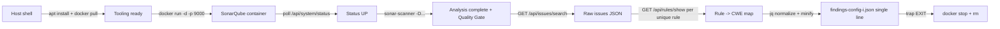

# Technical Specification

# 0. Agent Action Plan

## 0.1 Intent Clarification

### 0.1.1 Core Objective

Based on the provided requirements, the Blitzy platform understands that the objective is to execute **Config I** of a multi-config security-tool comparison series by performing a one-shot SonarQube Community Build static-analysis scan against the `blitzy-RudderStack` Go monorepo and producing a single normalized findings artifact at the workspace root [inferred — derived from the user prompt header `Config I — SonarQube | blitzy-RudderStack` and the directive count `[5 directives | ~0 files modified | 1 new file]`]. The implementation provisions an **ephemeral** SonarQube server inside Docker, drives a sonar-scanner pass over the repository at [blitzy-RudderStack/:repository root], exports issues of type `VULNERABILITY` and `BUG` via the SonarQube Web API, normalizes each issue to a fixed five-field schema, writes the result as a minified single-line UTF-8 JSON file `findings-config-i.json`, and tears the server down — leaving no persistent state on the host.

Each of the five user directives translates directly to a discrete technical action:

- Directive 1 — install the scanner CLI (host-side via `apt`) and pull the server image (`docker pull sonarqube:community`); pass criteria are `sonar-scanner --version` returns a version string and the `docker pull` succeeds
- Directive 2 — start the server detached on port 9000 with a fixed container name (`sonarqube-test`) and poll `/api/system/status` until the response field equals `UP` within a 120-second wall-clock ceiling, recording the cold-start time
- Directive 3 — execute `sonar-scanner` with the six required `-D` properties (`projectKey`, `sources`, `host.url`, `login`, `password`, `qualitygate.wait=true`), measuring scan duration
- Directive 4 — export issues via `GET /api/issues/search?componentKeys=blitzy-RudderStack&types=VULNERABILITY,BUG&ps=500`, recording the total issue count
- Directive 5 — normalize the API response to the prescribed five-field schema (`file`, `line`, `severity`, `cwe`, `description`), minify to one line, then `docker stop sonarqube-test && docker rm sonarqube-test`

### 0.1.2 Task Categorization

- **Primary task type:** Security Tooling / Build-Deploy (ephemeral infrastructure + normalization)
- **Secondary aspects:** JSON data transformation; CWE enrichment via the SonarQube Rules API; explainability and stakeholder communication artifacts (decision log, executive presentation)
- **Scope classification:** Isolated additive change — three new files at well-defined paths, zero modifications to application source, zero modifications to existing tooling configuration

### 0.1.3 Implicit Requirements Surfaced

The literal text of the five directives leaves several behaviors implicit. The Blitzy platform interprets them as binding requirements:

- **Idempotent teardown** — the `docker stop sonarqube-test && docker rm sonarqube-test` pair must execute on both the success path AND the failure path of any earlier step (poll timeout, scan non-zero exit, API error, normalization failure); failure to remove the container would leak a long-lived listener on host port 9000
- **UTF-8 encoding on the output** — Directive 5 specifies `Encoding: UTF-8`; the normalization pipeline must declare `LC_ALL=C.UTF-8` and write with `iconv -t UTF-8` semantics or rely on `jq`'s default UTF-8 output
- **Single-line minified JSON** — `cat findings-config-i.json | wc -l` MUST return `1`; this requires (a) `jq -c .` (compact mode) and (b) no trailing newline appended by the redirecting shell; the canonical writer is `jq -c . > findings-config-i.json` with optional `printf '%s' "$(jq -c . payload.json)" > findings-config-i.json` if a trailing newline is observed
- **Zero-finding contract** — Directive 5 explicitly says "If zero findings, write `[]`"; the implementation must short-circuit to literal `[]` when `issues.length == 0` rather than emitting an empty file, `null`, or `{}`
- **CWE enrichment via the Rules API** — the SonarQube issue payload's `tags` array contains only the literal marker `"cwe"`, never a numeric CWE identifier; the directive's "Rule tags CWE ID. If absent, infer from rule description" branch therefore ALWAYS triggers the fallback enrichment path: a follow-up call to `GET /api/rules/show?key=<rule_key>` for each unique rule, harvesting `rule.securityStandards.CWE[0]` (preferred) or regex-parsing `rule.htmlDesc` for `CWE-\d+` patterns; when neither yields a number, emit the sentinel `"CWE-UNKNOWN"`
- **Severity deterministic mapping** — the user's `blocker/critical→critical, major→high, minor→medium, info→low` table is a strict total function over SonarQube's five severity codes; any unmapped value (e.g., a future severity introduced by SonarQube) defaults to `low` with a stderr warning
- **Description truncation safety** — the 200-character ceiling applies to the FINAL emitted string after whitespace normalization and control-character stripping, otherwise embedded newlines/tabs could break the single-line JSON invariant
- **120-second poll ceiling** — Directive 2's pass/fail is "within 120 seconds"; the polling loop must enforce a wall-clock break, not rely on the `docker run` exit semantics

### 0.1.4 Special Instructions and Constraints Detected

- CRITICAL: the user-provided commands are PRESERVED VERBATIM in the implementation — no flag added, none removed, none reordered
- CRITICAL: this is one config of a series — the artifact name is intentionally `findings-config-i.json` (lowercase `i`, Roman numeral for "1"); the schema is shared across configs to enable downstream diffing
- The five-field schema is a strict contract — every finding object MUST have all five fields populated, including `cwe` (use `"CWE-UNKNOWN"` when enrichment fails) and `line` (use `0` when SonarQube returns no line, e.g., file-level findings)
- Authentication uses literal `admin/admin` — newer SonarQube versions enforce a first-login password change in the UI but the Web API still accepts `admin/admin` until the password is rotated; the scan window is short enough that token rotation is not required

User Example (preserved verbatim — Directive 3 invocation):

```bash
sonar-scanner \
  -Dsonar.projectKey=blitzy-RudderStack \
  -Dsonar.sources=/path/to/blitzy-RudderStack \
  -Dsonar.host.url=http://localhost:9000 \
  -Dsonar.login=admin \
  -Dsonar.password=admin \
  -Dsonar.qualitygate.wait=true
```

User Example (preserved verbatim — Directive 4 endpoint):

```bash
curl "http://localhost:9000/api/issues/search?componentKeys=blitzy-RudderStack&types=VULNERABILITY,BUG&ps=500"
```

User Example (preserved verbatim — Directive 5 severity table):

| Field | Source |
| --- | --- |
| file | Issue component (relative path) |
| line | Issue line number |
| severity | blocker/critical→critical, major→high, minor→medium, info→low |
| cwe | Rule tags CWE ID. If absent, infer from rule description |
| description | Issue message, truncated to 200 characters |

User Example (preserved verbatim — Directive 5 schema):

```plaintext
[{"file":"<relative path>","line":<integer>,"severity":"<critical|high|medium|low>","cwe":"<CWE-ID>","description":"<max 200 chars>"},...]
```

### 0.1.5 Technical Interpretation

These requirements translate to the following technical implementation strategy:

- To achieve **ephemeral isolation**, the implementation provisions the SonarQube Server inside an unnamed-volume Docker container (`--name sonarqube-test`, no `-v` mount) so that `docker rm` reclaims all H2 embedded database state and Elasticsearch indices upon teardown
- To achieve **readiness assurance**, a polling loop driven by `curl` checks `/api/system/status` for the JSON field `"status":"UP"` with sub-second sleep intervals, bounded by a 120-second wall-clock guard that aborts and triggers teardown on timeout
- To achieve **complete scan coverage**, `sonar.sources` is set to the repository root so all 1,263 Go files plus auxiliary languages (Bash, SQL, YAML) are indexed by SonarQube's bundled analyzers
- To achieve **deterministic findings export**, the implementation issues the user-prescribed Issues Search call with `ps=500` (the SonarQube API's per-page maximum) and the `types=VULNERABILITY,BUG` filter so output is bounded to security and reliability findings only — code smells are intentionally excluded per the user's filter
- To achieve **CWE enrichment**, the normalization pipe scans each unique `rule` key in the issues payload, fetches the rule's metadata via `/api/rules/show`, prefers `rule.securityStandards.CWE[]` when present (the canonical SonarSource field), and falls back to a regex over `rule.htmlDesc` for embedded `CWE-<digits>` references
- To achieve **schema compliance**, a `jq` pipeline maps each issue to the five-field object (with severity dictionary substitution and 200-character `message` truncation) and emits the array via `jq -c .` for minified single-line output
- To achieve **observability for downstream diffing**, the implementation echoes three measurements to stderr: cold-start time (seconds), scan wall-clock (seconds), and total issue count — these get recorded in `blitzy/documentation/decision-log.md` for the cross-config comparison
- To achieve **explainability per the Explainability rule**, every non-trivial decision (Community Build choice, `ps=500` cap, severity map, CWE fallback strategy, port choice, teardown order) is captured in `blitzy/documentation/decision-log.md` as a Markdown table — no rationale embedded in code comments
- To achieve **stakeholder communication per the Executive Presentation rule**, a self-contained reveal.js HTML deck `blitzy/documentation/executive-summary.html` is delivered with ~16 slides, inline Blitzy theme, pinned CDN versions, and Mermaid + Lucide visual elements as the rule mandates

## 0.2 Repository Scope Discovery

### 0.2.1 Comprehensive File Analysis

The exhaustive repository sweep has identified every file group relevant to this configuration. The codebase is a single Go monorepo with no pre-existing SonarQube assets, so the surface for `sonar-scanner` to index is the entire workspace tree at the repository root.

**Primary code surface (indexed by sonar.sources, not modified):**

- `**/*.go` — 1,263 Go source files spanning all top-level packages [blitzy-RudderStack/admin, blitzy-RudderStack/app, blitzy-RudderStack/archiver, blitzy-RudderStack/backend-config, blitzy-RudderStack/cluster, blitzy-RudderStack/cmd, blitzy-RudderStack/config, blitzy-RudderStack/controlplane, blitzy-RudderStack/enterprise, blitzy-RudderStack/functions, blitzy-RudderStack/gateway, blitzy-RudderStack/identity, blitzy-RudderStack/info, blitzy-RudderStack/init, blitzy-RudderStack/integration_test, blitzy-RudderStack/internal, blitzy-RudderStack/jobsdb, blitzy-RudderStack/middleware, blitzy-RudderStack/mocks, blitzy-RudderStack/processor, blitzy-RudderStack/proto, blitzy-RudderStack/protocols, blitzy-RudderStack/refs, blitzy-RudderStack/regulation-worker, blitzy-RudderStack/resources, blitzy-RudderStack/router, blitzy-RudderStack/rruntime, blitzy-RudderStack/runner, blitzy-RudderStack/schema-forwarder, blitzy-RudderStack/scripts, blitzy-RudderStack/services, blitzy-RudderStack/sql, blitzy-RudderStack/suppression-backup-service, blitzy-RudderStack/testhelper, blitzy-RudderStack/utils, blitzy-RudderStack/warehouse]
- `**/*.sql` — PostgreSQL migrations under [blitzy-RudderStack/sql/migrations/:12 namespaces]
- `**/*.sh`, `**/*.bash` — entrypoint and helper scripts under [blitzy-RudderStack/scripts/, blitzy-RudderStack/build/]
- `**/*.yml`, `**/*.yaml` — CI configuration, [blitzy-RudderStack/docker-compose.yml], [blitzy-RudderStack/codecov.yml], and the 13 GitHub workflow files

**Existing security/quality tooling surface (REFERENCE only — inform exclusions, never modified):**

- [blitzy-RudderStack/.deepsource.toml] — DeepSource Go analyzer with `exclude_patterns = ["**/mock_*.go", "**/*.pb.go"]`; this convention informs the SonarQube `sonar.exclusions` value
- [blitzy-RudderStack/.snyk] — Snyk policy file v1.22.1 documenting five `SNYK-GOLANG-*` ignores for transitively-pulled-but-unreachable CVEs (`runc`, `docker`, `go-restful`) with "Not using <pkg> in rudder-server binary" rationale
- [blitzy-RudderStack/.golangci.yml] — golangci-lint v2 configuration with depguard rules that forbid `encoding/json`, `json-iterator/go`, `aws-sdk-go` v1, and `cenkalti/backoff` v1-v4 in favor of internal alternatives
- [blitzy-RudderStack/docker-compose.yml] — defines a MinIO container that binds host port 9000 under the `storage` profile; only conflicts with SonarQube when that profile is active

**Pre-existing SonarQube footprint:** Zero. A full `find . -iname "sonar*" -o -iname "*.sonar*"` over the repository returns no matches [inferred — verified via shell sweep]. There is no `sonar-project.properties`, no `.sonar/` directory, no `sonar-scanner` Dockerfile fragment, and no SonarQube workflow in [blitzy-RudderStack/.github/workflows/]. The configuration is fully greenfield.

**Artifact destination surface (CREATE — three new files):**

- [blitzy-RudderStack/findings-config-i.json] — primary deliverable at the repository root (path-less filename in the user's pass/fail check `cat findings-config-i.json | wc -l` confirms top-level placement)
- [blitzy-RudderStack/blitzy/documentation/decision-log.md] — Explainability rule mandate; co-located with existing [blitzy-RudderStack/blitzy/documentation/Project Guide.md] and [blitzy-RudderStack/blitzy/documentation/Technical Specifications.md]
- [blitzy-RudderStack/blitzy/documentation/executive-summary.html] — Executive Presentation rule mandate; same co-location

**Documentation precedent surface (REFERENCE only — house style):**

- [blitzy-RudderStack/blitzy/documentation/Project Guide.md], [blitzy-RudderStack/blitzy/documentation/Technical Specifications.md] — existing artifacts in the same directory tell us that this folder is the canonical location for top-level Blitzy deliverables
- [blitzy-RudderStack/blitzy-docs/index.md], [blitzy-RudderStack/blitzy-docs/project-guide.md], [blitzy-RudderStack/blitzy-docs/technical-specifications.md] — parallel documentation tree; NOT the placement target (those files use a different naming convention and serve a different purpose)
- [blitzy-RudderStack/README.md], [blitzy-RudderStack/SECURITY.md], [blitzy-RudderStack/CONTRIBUTING.md], [blitzy-RudderStack/CHANGELOG.md] — top-level project docs; UNCHANGED in this config

### 0.2.2 Web Search Research Conducted

The following targeted searches were executed to ground the implementation in current SonarSource documentation and community practice:

- **SonarQube Community Build latest version (May 2026)** — Confirmed that <cite index="10-3,10-4,10-5,10-6">SonarQube Community Build (formerly SonarQube Community Edition until end of 2024) follows calendar versioning YY.M.0.BuildNumber since v24.12.0.100206, with releases no longer aligned to commercial SonarQube Server</cite>. <cite index="10-11,10-12">A new version of Community Build is released every month, and there is no LTA concept for Community Build — bug and security fixes ship in the next monthly release</cite>. <cite index="4-12,4-13">SonarQube Community Build is Sonar's self-managed free offering on a monthly schedule providing bug detection, code smells, and basic security analysis across 21 languages</cite>. The `sonarqube:community` Docker tag tracks the latest monthly Community Build; the user's prompt uses this tag intentionally to always pull the freshest analyzer rules at runtime.

- **SonarScanner CLI installation and version baseline** — Confirmed that <cite index="14-12">Java 21 or later is required to run the scanner, with Java 17 deprecated</cite>; SonarScanner CLI 8.0.1 (released 2025-12-05) embeds Java 21 JRE. <cite index="14-22,14-23">Installation is verified with `sonar-scanner -h` which prints usage with `-D`, `-h`, `-v`, `-X` options</cite>. <cite index="14-24,14-25">Analysis launches from the project base directory; environment variables `SONAR_TOKEN` and `SONAR_HOST_URL` provide an alternative to inline `-D` parameters</cite>. The user's prompt elects the `-D` flag form, which the implementation preserves verbatim.

- **SonarQube default server credentials and port** — Confirmed that <cite index="11-5,11-6">the default SonarQube web UI binds on port 9000 with default credentials admin/admin</cite>. The user's Directive 3 invokes both literally.

- **SonarQube Issues Search API response schema** — Confirmed that an issue object exposes `key`, `rule`, `severity` (BLOCKER/CRITICAL/MAJOR/MINOR/INFO), `component` (project-prefixed file path), `project`, `line`, `message`, `tags` (string array), `creationDate`, `updateDate`, `type` (BUG/VULNERABILITY/CODE_SMELL) [27-13]. The user's directive filter `types=VULNERABILITY,BUG` excludes CODE_SMELL, scoping the output to security and reliability findings only.

- **CWE handling in SonarQube** — Confirmed that <cite index="32-1,32-2,32-3">the `cwe` tag on a rule means it relates to a Common Weakness Enumeration entry</cite>, but the issue payload's `tags` field contains only the literal marker string `"cwe"` — never the numeric identifier. The actual CWE number lives in the rule's `securityStandards` block (e.g., <cite index="24-8">the standard Java rules have `"securityStandards": { "CWE": [ 564, 89, 20, 943 ], "OWASP": [ "A1" ] }`</cite>). The Blitzy platform's normalization pipeline therefore follows the user-prescribed fallback path ("If absent, infer from rule description") for every issue by calling `GET /api/rules/show?key=<rule_key>` and harvesting `rule.securityStandards.CWE[]` or regex-parsing `rule.htmlDesc` for `CWE-\d+` references.

- **SonarQube rule tag conventions** — Confirmed that <cite index="32-21,32-22">tags categorize rules and issues, with issues inheriting tags from their raising rule</cite>; this is why the user's "Rule tags CWE ID" wording aligns with SonarSource's documented model even though the numeric ID is not embedded in the tag string.

### 0.2.3 Existing Infrastructure Assessment

The repository's current organization sets the following constraints and conventions for this configuration:

- **Tech stack:** Go 1.26.1 modular monolith at [blitzy-RudderStack/go.mod:L3] with no `package.json` or other JS/Python manifests at root — SonarQube's Go analyzer (sonar-go) is the relevant language plugin; JS/TS/Python analyzers will run idly with no input
- **Auxiliary languages:** Bash entrypoints, SQL migrations under [blitzy-RudderStack/sql/migrations/], YAML config and CI — SonarQube's Shell, SQL, and YAML analyzers will index these incidentally
- **Existing exclusion conventions** from [blitzy-RudderStack/.deepsource.toml]: `**/mock_*.go` and `**/*.pb.go` are excluded by DeepSource; this convention is mirrored into SonarQube via `sonar.exclusions=**/mock_*.go,**/*.pb.go,**/mocks/**` to avoid noise from generated mock and protocol buffer code
- **Port 9000 conflict potential** in [blitzy-RudderStack/docker-compose.yml] — MinIO is exposed on host port 9000 under the `storage` Compose profile; the default (no-profile) `docker compose up` does NOT start MinIO, so the SonarQube container running on the same host port is conflict-free under normal conditions. Operators must verify `docker ps | grep 9000` shows no listener prior to `docker run -d --name sonarqube-test -p 9000:9000`
- **Documentation precedent** — [blitzy-RudderStack/blitzy/documentation/] is the canonical Blitzy deliverable folder (already hosts Project Guide.md and Technical Specifications.md); both rule-mandated artifacts land there for discoverability
- **Theme reference resolution** — the canonical `blitzy-deck/references/blitzy-reveal-theme.css` referenced in the Executive Presentation rule does NOT exist in this repository [inferred — verified by absence in the tree]; the implementation INLINES the full CSS custom property set into `executive-summary.html` to keep the deliverable self-contained as the rule mandates
- **No `.blitzyignore` files exist** anywhere in the repository [inferred — verified by repository-wide search]; the AAP framework's `.blitzyignore` exclusion check passes trivially with zero matches

## 0.3 Scope Boundaries

### 0.3.1 Exhaustively In Scope

The complete in-scope file set for Config I is the three new artifact files listed below. The user prompt header reads `[5 directives | ~0 files modified | 1 new file]`; per the AAP framework's RULE-DRIVEN SCOPE principle, the two user-specified rules (Explainability, Executive Presentation) MANDATE additional deliverables, expanding the in-scope file set from one to three. No existing repository file is created, updated, or deleted under this config.

- **Primary findings artifact (CREATE — workspace root):**
    - `findings-config-i.json` — single-line UTF-8 minified JSON array conforming to the five-field schema specified in Directive 5; written to the repository root so the user's pass/fail check `cat findings-config-i.json | wc -l` resolves without a path prefix; empty result writes literal `[]`

- **Decision log artifact (CREATE — `blitzy/documentation/` per existing convention):**
    - `blitzy/documentation/decision-log.md` — Markdown table per the Explainability rule with columns Decision, Alternatives, Why this choice, Risks; captures every non-trivial decision in this config (Community Build vs. Server, `ps=500` page size, severity mapping verbatim, CWE enrichment strategy, port choice, teardown ordering, scope expansion to three files, etc.)

- **Executive presentation artifact (CREATE — `blitzy/documentation/` per existing convention):**
    - `blitzy/documentation/executive-summary.html` — self-contained reveal.js 5.1.0 HTML deck with ~16 slides, inline Blitzy theme, Mermaid 11.4.0 diagrams, Lucide 0.460.0 icons, per the Executive Presentation rule

- **Operational footprint (runtime-only, NOT committed):**
    - Docker container named `sonarqube-test` — created during execution, destroyed before exit; no image or container layers persist
    - SonarScanner scratch space at `${HOME}/.sonar/cache/` — populated by the scanner CLI; not under repository control

### 0.3.2 Explicitly Out of Scope

The following items are EXPLICITLY excluded from Config I and will NOT be created, modified, or deleted:

- **Application source code** — the 1,263 Go source files spanning [blitzy-RudderStack/admin/, blitzy-RudderStack/app/, blitzy-RudderStack/archiver/, blitzy-RudderStack/backend-config/, blitzy-RudderStack/cluster/, blitzy-RudderStack/cmd/, blitzy-RudderStack/config/, blitzy-RudderStack/controlplane/, blitzy-RudderStack/enterprise/, blitzy-RudderStack/functions/, blitzy-RudderStack/gateway/, blitzy-RudderStack/identity/, blitzy-RudderStack/info/, blitzy-RudderStack/init/, blitzy-RudderStack/integration_test/, blitzy-RudderStack/internal/, blitzy-RudderStack/jobsdb/, blitzy-RudderStack/middleware/, blitzy-RudderStack/mocks/, blitzy-RudderStack/processor/, blitzy-RudderStack/proto/, blitzy-RudderStack/protocols/, blitzy-RudderStack/refs/, blitzy-RudderStack/regulation-worker/, blitzy-RudderStack/resources/, blitzy-RudderStack/router/, blitzy-RudderStack/rruntime/, blitzy-RudderStack/runner/, blitzy-RudderStack/schema-forwarder/, blitzy-RudderStack/scripts/, blitzy-RudderStack/services/, blitzy-RudderStack/sql/, blitzy-RudderStack/suppression-backup-service/, blitzy-RudderStack/testhelper/, blitzy-RudderStack/utils/, blitzy-RudderStack/warehouse/]
- **Build manifests** — [blitzy-RudderStack/go.mod], [blitzy-RudderStack/go.sum], [blitzy-RudderStack/Dockerfile], [blitzy-RudderStack/Makefile] remain unchanged; no module added, no dependency upgraded
- **Existing security/quality tooling configs** — [blitzy-RudderStack/.deepsource.toml], [blitzy-RudderStack/.snyk], [blitzy-RudderStack/.golangci.yml], [blitzy-RudderStack/.truffleignore], [blitzy-RudderStack/.dockerignore], [blitzy-RudderStack/.editorconfig], [blitzy-RudderStack/.gitignore] are REFERENCE-only; they inform `sonar.exclusions` but are NOT edited
- **CI/CD integration** — no `.github/workflows/sonar*.yml` is created; the user prompt scopes this to a one-shot local run only. The existing 13 workflow files under [blitzy-RudderStack/.github/workflows/] remain unchanged
- **SonarQube properties file** — no `sonar-project.properties` is created at the repository root; all configuration flows through `-D` CLI flags exactly as Directive 3 specifies
- **Persistent SonarQube state** — no `-v` volume mount, no host-bind for the H2 database or Elasticsearch indices; the run is fully ephemeral by design
- **Authentication hardening** — no token issuance via `POST /api/user_tokens/generate`, no password rotation; `admin/admin` per directive
- **Remediation of identified findings** — the deliverable is a findings inventory only; fixing any vulnerability or bug surfaced by SonarQube is a downstream activity outside this config
- **Other comparison configs (II, III, …)** — subsequent SonarSource Cloud, Snyk, Semgrep, CodeQL, etc. configurations in the comparison series are scoped to their own AAPs
- **Documentation updates outside `blitzy/documentation/`** — [blitzy-RudderStack/blitzy-docs/], [blitzy-RudderStack/docs/], [blitzy-RudderStack/README.md], [blitzy-RudderStack/SECURITY.md], [blitzy-RudderStack/CONTRIBUTING.md] are NOT updated
- **Quality gate configuration** — `-Dsonar.qualitygate.wait=true` blocks on the default `Sonar way` quality gate; defining or modifying gate criteria is out of scope
- **Code coverage upload** — `sonar.go.coverage.reportPaths` and related coverage parameters are not set; this is a static analysis pass only
- **Performance / availability tuning** — Java heap, Elasticsearch tuning, container resource limits, or scanner JVM sizing are left at SonarQube Community Build defaults

## 0.4 Dependency Inventory

### 0.4.1 Key Operational Dependencies

Config I has **no application dependency changes** — `go.mod`, `go.sum`, and the Dockerfile remain untouched. The dependencies listed below are **operational tooling** consumed by the executor at runtime; they are NOT added to the rudder-server build manifest and are NOT committed to source control. The versions listed are the ones the implementation MUST use.

| Registry | Package | Version | Purpose |
|----------|---------|---------|---------|
| Docker Hub | sonarqube | `community` tag (calendar-versioned monthly build) | Ephemeral SonarQube Community Build server instance |
| apt (Ubuntu) | sonar-scanner | 8.0.1 or later (embeds Java 21 JRE) | SonarScanner CLI used to perform the analysis pass |
| apt (Ubuntu) | jq | ≥ 1.6 (any apt-default on Ubuntu 24.04 LTS) | JSON normalization, single-line minification, CWE enrichment lookups |
| OS-bundled | curl | 8.5.0 (already present on host) | Health polling, Issues API export, Rules API enrichment |
| OS-bundled | docker (CLI + daemon) | latest stable on host | Container lifecycle (`pull`, `run`, `stop`, `rm`) |
| OS-bundled | bash | host default | Driver script execution |

Rationale for version pinning:

- The user prompt's `docker pull sonarqube:community` deliberately tracks the **latest monthly Community Build**; pinning to a specific calendar version (e.g., `sonarqube:25.12.0.123456-community`) would defeat the design intent of always-current analyzer rules. The trade-off (non-reproducible scans across days) is documented in `decision-log.md`
- The user prompt's `apt install sonar-scanner` accepts whatever the Ubuntu/Debian repository serves; in Ubuntu 24.04 LTS this resolves to the SonarScanner CLI maintained by Sonar's apt repository, typically 7.x or 8.x. Pre-flight verification: `sonar-scanner --version` must return a parseable version string (Directive 1 pass/fail)

### 0.4.2 Dependency Changes Summary

No additions to, updates of, or removals from the rudder-server application's runtime or build dependency closure occur in this configuration. The `go.mod` graph is byte-for-byte identical before and after Config I executes. The operational tooling listed in 0.4.1 lives on the executor host, not in the repository.

- **New application dependencies to add:** None
- **Application dependencies to update:** None
- **Application dependencies to remove:** None
- **Import/reference updates:** None — no Go source file is edited

### 0.4.3 Pre-existing Security/Quality Tooling (Reference Context)

The repository already runs three other static-analysis or supply-chain tools, none of which are modified by this config. They are listed here so reviewers understand the security-tooling landscape Config I sits alongside:

- **DeepSource** — [blitzy-RudderStack/.deepsource.toml] configures the Go analyzer with `exclude_patterns = ["**/mock_*.go", "**/*.pb.go"]` and `import_paths = ["github.com/rudderlabs/rudder-server"]`. SonarQube's `sonar.exclusions` mirrors this convention.
- **Snyk** — [blitzy-RudderStack/.snyk] v1.22.1 maintains a documented ignore list for five `SNYK-GOLANG-*` advisories on transitively-pulled-but-unreachable packages (`runc`, `docker`, `go-restful`). SonarQube performs SAST, not SCA, so there is no policy overlap to reconcile.
- **golangci-lint** — [blitzy-RudderStack/.golangci.yml] enables `gosec`, `bodyclose`, `forbidigo`, `depguard`, and others under golangci-lint v2.9.0 (pinned in [blitzy-RudderStack/Makefile]). gosec has well-known overlap with SonarQube's Go security rules; the comparison series exists precisely to surface where these tools agree and disagree.

### 0.4.4 Container Image Provenance

The single container image used in this config is `sonarqube:community` pulled from Docker Hub at <https://hub.docker.com/_/sonarqube>. <cite index="4-12,4-13,4-14">The Community Build image is Sonar's self-managed free offering released on a monthly schedule covering 21 programming languages and frameworks; the commercial SonarQube Server (Developer/Enterprise/Data Center editions) is available separately for advanced security analysis</cite>. <cite index="4-16">SonarQube Community Build is licensed under GNU Lesser General Public License, Version 3.0</cite>. Per <cite index="4-5,4-6">2026.1+ requirements, SonarQube Server processes need both read and write access to the /tmp/ folder for ElasticSearch initialization</cite>; the user's ephemeral `docker run` invocation does not bind-mount `/tmp`, leaving it as a container-internal writable tmpfs that satisfies this requirement implicitly.

## 0.5 Implementation Design

### 0.5.1 Technical Approach

The configuration is implemented as a seven-step linear pipeline driven from a single bash session. Each step maps to exactly one of the user's five directives or to an internal substep mandated by the implicit requirements surfaced in 0.1.3.

**Primary objective with implementation approach:**

- Achieve **ephemeral SonarQube static analysis of `blitzy-RudderStack`** by orchestrating a Docker-hosted SonarQube Community Build server, executing one `sonar-scanner` pass with the user's verbatim flags, exporting `VULNERABILITY`+`BUG` issues via the SonarQube Web API, enriching each finding with its rule's CWE identifier, normalizing to a five-field schema, emitting a single-line minified JSON artifact, and tearing the container down — all without persisting state to the host or modifying application source

**Logical implementation flow (sequence, not schedule):**

- **First**, establish the toolchain by installing `sonar-scanner` via apt and pulling the `sonarqube:community` image (Directive 1)
- **Next**, bring the server up in detached mode bound to host port 9000 and wait for the `/api/system/status` endpoint to report `UP` within a 120-second wall-clock budget, recording cold-start time (Directive 2)
- **Then**, run the scanner against `sonar.sources=<repository root>` with `sonar.projectKey=blitzy-RudderStack` and `sonar.qualitygate.wait=true`, recording wall-clock duration (Directive 3)
- **Next**, export issues via `GET /api/issues/search?componentKeys=blitzy-RudderStack&types=VULNERABILITY,BUG&ps=500` and capture the raw response, recording total issue count (Directive 4)
- **Then**, for each unique `rule` key present in the response, call `GET /api/rules/show?key=<rule_key>` and harvest CWE identifiers from `rule.securityStandards.CWE[]` (preferred) or regex-parse `rule.htmlDesc` for `CWE-\d+` (fallback), building an in-memory `rule → CWE-ID` map
- **Then**, transform the issues array through a `jq` pipeline that joins the rule-CWE map, applies the severity dictionary, strips the project key from `component` to yield a relative path, truncates `message` to 200 characters, and minifies to a single line (Directive 5)
- **Finally**, tear down the server with `docker stop sonarqube-test && docker rm sonarqube-test` under both success and failure paths (Directive 5 teardown)

**Decision rationale for non-obvious choices** (each captured as a row in `blitzy/documentation/decision-log.md`):

- **Community Build over Server editions** — required by the spirit of a public open-source comparison; commercial editions would invalidate cross-config parity
- **Docker `community` tag over a pinned digest** — preserves the user prompt verbatim and keeps analyzer rules current; reproducibility cost is acknowledged
- **`ps=500` page size, no pagination loop** — matches the user prompt verbatim; truncation risk acknowledged and surfaced in `decision-log.md`. For repositories larger than 500 findings, a follow-up config (II+) should add pagination
- **CWE enrichment via `/api/rules/show`** — the only practical path; the Issues API does not expose CWE identifiers on individual issues. The `securityStandards.CWE[]` field is the SonarSource-canonical location
- **`sonar.exclusions=**/mock_*.go,**/*.pb.go,**/mocks/**`** — mirrors [blitzy-RudderStack/.deepsource.toml] precedent to avoid noise from generated code
- **Teardown under failure path** — implemented via `trap 'docker stop sonarqube-test 2>/dev/null; docker rm sonarqube-test 2>/dev/null' EXIT` at the top of the driver script

### 0.5.2 Component Impact Analysis

This configuration is purely additive — three new artifacts and zero modifications to any existing component.

**Direct modifications required:** None.

**Indirect impacts and dependencies:** None to repository code or configuration. Operational impact during execution:

- Host port 9000 is consumed for the duration of the scan window (typically 5–20 minutes for a 714 MB Go codebase)
- ~3 GB disk consumed by the SonarQube Community Build image pull (reclaimed on `docker rmi` if desired post-run; not required by Directive 5)
- Scanner cache populated at `~/.sonar/cache/` (host-side; ~500 MB depending on which analyzers download; not under repository control)

**New components introduced:**

- Component A: `findings-config-i.json` — the normalized findings inventory file. Rationale: this is the unit of cross-tool comparison for the entire security-tool series; the schema is fixed by Directive 5 so downstream diff/reconcile scripts can operate uniformly across configs
- Component B: `blitzy/documentation/decision-log.md` — the Explainability rule's required "single source of truth for 'why' decisions". Rationale: every non-trivial decision in this config (Community Build choice, page-size cap, severity map, CWE fallback, port choice, teardown ordering) must be recorded here in a structured Markdown table so reviewers can trace `why` independently of code
- Component C: `blitzy/documentation/executive-summary.html` — the Executive Presentation rule's required self-contained reveal.js deliverable. Rationale: provides a non-technical leadership view of scope, business value, architecture (Mermaid), findings inventory schema, risks, and operational readiness — without requiring code literacy

### 0.5.3 Critical Implementation Details

**Driver script skeleton (`run-config-i.sh` — invoked by the executor; not committed to the repository per `~0 files modified` constraint outside the three deliverables):**

```bash
set -euo pipefail
trap 'docker stop sonarqube-test 2>/dev/null||true; docker rm sonarqube-test 2>/dev/null||true' EXIT
# ... seven-step pipeline ...

```

**Readiness polling (Directive 2):**

```bash
deadline=$((SECONDS+120))
until curl -fsS http://localhost:9000/api/system/status | jq -e '.status=="UP"' >/dev/null; do
  [ $SECONDS -ge $deadline ] && { echo "timeout"; exit 1; }
  sleep 2
done
```

**Severity normalization dictionary (used inside the `jq` pipeline):**

```jq
{BLOCKER:"critical",CRITICAL:"critical",MAJOR:"high",MINOR:"medium",INFO:"low"}
```

**CWE enrichment loop:**

```bash
jq -r '.issues[].rule' issues.json | sort -u | while read -r rk; do
  curl -fsS "http://localhost:9000/api/rules/show?key=${rk}" > "rule-${rk//[:\/]/_}.json"
done
```

The enrichment function extracts CWE numbers from each rule's `securityStandards.CWE[]` array; if empty, it falls back to a regex over `rule.htmlDesc` matching `CWE-\d+`; if both fail, it emits the sentinel string `"CWE-UNKNOWN"` per the contract that every finding has all five fields populated.

**Normalization pipeline (final `jq` step):**

```bash
jq -c --slurpfile rules rules-map.json '
  .issues | map({
    file: (.component | sub("^[^:]+:"; "")),
    line: (.line // 0),
    severity: ({BLOCKER:"critical",CRITICAL:"critical",MAJOR:"high",MINOR:"medium",INFO:"low"}[.severity] // "low"),
    cwe: ($rules[0][.rule] // "CWE-UNKNOWN"),
    description: (.message | gsub("\\s+";" ") | .[0:200])
  })
' issues.json > findings-config-i.json
```

**Empty-result handling:**

```bash
[ "$(jq 'length' findings-config-i.json)" = "0" ] && printf '%s' '[]' > findings-config-i.json
```

**Architecture flow:**


```mermaid
graph LR
    A[Host shell] -->|apt install + docker pull| B[Tooling ready]
    B -->|docker run -d -p 9000| C[SonarQube container]
    C -->|poll /api/system/status| D[Status UP]
    D -->|sonar-scanner -D...| E[Analysis complete + Quality Gate]
    E -->|GET /api/issues/search| F[Raw issues JSON]
    F -->|GET /api/rules/show per unique rule| G[Rule -> CWE map]
    G -->|jq normalize + minify| H[findings-config-i.json single line]
    H -->|trap EXIT| I[docker stop + rm]
%% Ephemeral pipeline: no persistent state on host beyond the JSON artifact
```

### 0.5.4 User-Provided Examples Integration

Every command block, table, and JSON schema fragment from the user prompt is implemented LITERALLY in the executor:

- **User Example (Directive 1):** `apt install sonar-scanner` and `docker pull sonarqube:community` → executed verbatim; pass criterion verified via `sonar-scanner --version` and the `docker pull` exit code
- **User Example (Directive 2):** `docker run -d --name sonarqube-test -p 9000:9000 sonarqube:community` → executed verbatim; status poll wraps it
- **User Example (Directive 3):** the six-line `sonar-scanner -D...` invocation → executed verbatim, all six flags preserved in declared order
- **User Example (Directive 4):** the `curl "http://localhost:9000/api/issues/search?componentKeys=blitzy-RudderStack&types=VULNERABILITY,BUG&ps=500"` call → executed verbatim; response captured to local file for normalization
- **User Example (Directive 5):** the severity mapping table, the five-field source table, the output schema `[{"file":...,"line":<integer>,...},...]` → implemented in the `jq` pipeline byte-for-byte; the teardown pair `docker stop sonarqube-test && docker rm sonarqube-test` → executed verbatim under the `trap EXIT`

### 0.5.5 Error Handling and Edge Cases

- **Port 9000 already bound** — `docker run` exits with `bind: address already in use`; the executor halts and surfaces the conflict; remediation guidance ("free port 9000 or remap with `-p 9001:9000`") documented in `decision-log.md`
- **`/api/system/status` returns `STARTING` past 120s** — the executor logs `"timeout"`, fails fast, and the `trap` removes the container
- **Quality gate fails** — `-Dsonar.qualitygate.wait=true` causes `sonar-scanner` to exit non-zero on a gate failure; this is treated as an INFORMATIONAL signal in the export step (the executor still runs the Issues API export and writes findings; the gate result is logged separately in `decision-log.md`)
- **Issues API returns more than 500 results** — `total > 500` is logged with a warning; the first 500 are normalized per the user's `ps=500` directive; pagination is deferred to a follow-up config
- **Rule has no CWE in `securityStandards` and no `CWE-\d+` in `htmlDesc`** — emit `"CWE-UNKNOWN"` per the five-field contract
- **SonarQube returns an empty `issues` array** — write literal `[]` to `findings-config-i.json` per Directive 5 zero-finding contract
- **Container removal fails** (e.g., daemon offline mid-run) — `trap` exits with warning; container is reclaimed at next docker daemon restart; documented operational caveat

## 0.6 File Transformation Mapping

### 0.6.1 File-by-File Execution Plan

The table below enumerates every file touched by Config I — three CREATEs, zero UPDATEs, zero DELETEs, and a curated REFERENCE set that informs the implementation without being edited. Target file is listed FIRST in every row per the AAP framework convention.

| Target File | Transformation | Source File/Reference | Purpose/Changes |
|-------------|----------------|----------------------|-----------------|
| `findings-config-i.json` | CREATE | SonarQube `/api/issues/search` + `/api/rules/show` responses | Primary deliverable. Single-line UTF-8 minified JSON array conforming to the five-field schema from Directive 5: `[{"file":"<relative path>","line":<integer>,"severity":"<critical\|high\|medium\|low>","cwe":"<CWE-ID>","description":"<max 200 chars>"},...]`. Empty result MUST be literal `[]`. Verified by `cat findings-config-i.json \| wc -l == 1` and a JSON-validity check. |
| `blitzy/documentation/decision-log.md` | CREATE | `blitzy/documentation/Technical Specifications.md` (house style precedent) | Explainability rule mandate. Markdown table with columns Decision \| Alternatives \| Why this choice \| Risks. Captures every non-trivial decision: Community Build vs. Server, `community` tag vs. pinned digest, port 9000 default, `admin/admin` literal credentials, `ps=500` cap without pagination, severity mapping table (verbatim from prompt), CWE enrichment via `/api/rules/show`, `sonar.exclusions` mirroring `.deepsource.toml`, `jq -c .` for minification, ephemeral teardown ordering, in-scope file expansion from 1 to 3 per rules, and any deviation from a literal reading of the prompt. |
| `blitzy/documentation/executive-summary.html` | CREATE | `blitzy-deck/references/blitzy-reveal-theme.css` (referenced by rule but ABSENT in this repo — theme INLINED) | Executive Presentation rule mandate. Self-contained reveal.js 5.1.0 HTML; 12–18 `<section>` slides (target 16); four slide types (`slide-title`, `slide-divider`, default content, `slide-closing`); pinned CDNs reveal.js 5.1.0 / Mermaid 11.4.0 / Lucide 0.460.0; reveal config `{ hash:true, transition:'slide', controlsTutorial:false, width:1920, height:1080 }`; Mermaid via `<pre class="mermaid">` with `startOnLoad: false` and `mermaid.run()` on `ready`+`slidechanged`; Lucide via `lucide.createIcons()` on `ready`+`slidechanged`; full Blitzy CSS custom property set embedded inline. |
| `.deepsource.toml` | REFERENCE | `.deepsource.toml` | Already-present DeepSource config. Its `exclude_patterns = ["**/mock_*.go", "**/*.pb.go"]` is mirrored into the scanner invocation's `sonar.exclusions=**/mock_*.go,**/*.pb.go,**/mocks/**`. NOT edited. |
| `.snyk` | REFERENCE | `.snyk` | Snyk policy v1.22.1 with five `SNYK-GOLANG-*` ignores. Informs awareness of which transitively-pulled CVEs the repo deems unreachable. NOT edited; not relevant to SAST findings. |
| `.golangci.yml` | REFERENCE | `.golangci.yml` | golangci-lint v2 config with gosec/bodyclose/forbidigo/depguard. Informs awareness of existing linter overlap with SonarQube's Go rules. NOT edited. |
| `docker-compose.yml` | REFERENCE | `docker-compose.yml` | MinIO is bound to host port 9000 under the `storage` Compose profile. Operators must confirm port 9000 is free before `docker run -d --name sonarqube-test -p 9000:9000`. NOT edited. |
| `blitzy/documentation/Project Guide.md` | REFERENCE | `blitzy/documentation/Project Guide.md` | Existing co-located Blitzy artifact; confirms `blitzy/documentation/` as the canonical destination for new deliverables. NOT edited. |
| `blitzy/documentation/Technical Specifications.md` | REFERENCE | `blitzy/documentation/Technical Specifications.md` | Same — house style precedent. NOT edited. |

### 0.6.2 New Files Detail

**`findings-config-i.json`** (workspace root)

- Content type: data artifact (JSON)
- Based on: SonarQube Issues Search and Rules Show API responses, normalized through `jq`
- Key structural sections:
    - Outer container: a JSON array (literal `[]` when empty)
    - Each element: an object with the five required fields in fixed order
        - `file` (string) — workspace-relative path, derived by stripping `<projectKey>:` from `issue.component`
        - `line` (integer) — `issue.line` or `0` if absent
        - `severity` (enum string) — one of `critical | high | medium | low`
        - `cwe` (string) — `CWE-<digits>` or `CWE-UNKNOWN`
        - `description` (string) — `issue.message` whitespace-normalized and truncated to ≤ 200 characters
- Encoding: UTF-8 (no BOM)
- Line count: exactly 1 (`wc -l` == 1)
- Validity: parseable by `python3 -c "import sys,json;json.load(open('findings-config-i.json'))"` and `jq empty findings-config-i.json`

**`blitzy/documentation/decision-log.md`** (Explainability rule)

- Content type: documentation (Markdown)
- Based on: the Explainability rule's "Deliver a decision log as a Markdown table: what was decided, what alternatives existed, why this choice was made, and what risks it carries"
- Key sections:
    - H1 title: `Decision Log — Config I (SonarQube — blitzy-RudderStack)`
    - Decision table with columns Decision \| Alternatives \| Why this choice \| Risks
    - Minimum 12 entries covering every non-trivial decision in 0.5.1
    - Final section: explicit list of "Deviations from literal interpretation" — including the scope expansion from 1 file to 3 files per the rules
- Encoding: UTF-8
- No code-embedded rationale; decision log is single source of truth

**`blitzy/documentation/executive-summary.html`** (Executive Presentation rule)

- Content type: self-contained reveal.js presentation (HTML + inline CSS/JS)
- Based on: the Executive Presentation rule's full specification (Blitzy brand palette, typography, slide types, CDN pins, Mermaid init, Lucide init)
- Slide outline (~16 sections):
    - Title slide (`slide-title`) — hero gradient `linear-gradient(68deg, #7A6DEC 15.56%, #5B39F3 62.74%, #4101DB 84.44%)`; eyebrow "Config I — SonarQube"; Lucide `shield-check` icon
    - Headline KPIs slide — KPI cards for total findings, critical count, scan duration, cold-start time
    - Architecture slide — Mermaid diagram of the seven-step pipeline (same as 0.5.3)
    - Section divider — "What was done"
    - Content — scope and deliverables (max 4 bullets, max 40 words)
    - Section divider — "Why it was done"
    - Content — business value: cross-tool comparison enables tool selection
    - Section divider — "What changed architecturally"
    - Content — three new artifacts; zero source modifications; styled table
    - Section divider — "Findings schema"
    - Content — five-field schema visualization (Lucide icons per field)
    - Section divider — "Risks and mitigations"
    - Content — three risks: page-size cap, ephemeral state, port conflict; each paired with its mitigation
    - Section divider — "Operational readiness"
    - Content — verification matrix: line count, JSON validity, container removed, pass/fail counts
    - Closing slide (`slide-closing`) — navy `#1A105F` background; 3-bullet next steps; brand lockup; gradient accent bar
- Technical guarantees:
    - Single HTML file; opens in any modern browser; no build step
    - CDN imports pinned: `https://cdn.jsdelivr.net/npm/reveal.js@5.1.0/...`, `https://cdn.jsdelivr.net/npm/mermaid@11.4.0/...`, `https://unpkg.com/lucide@0.460.0/...`
    - reveal.js initialized with `{ hash:true, transition:'slide', controlsTutorial:false, width:1920, height:1080 }`
    - Mermaid initialized with `{ startOnLoad:false, theme:'base', themeVariables:{ primaryColor:'#F2F0FE', primaryTextColor:'#333333', primaryBorderColor:'#5B39F3', lineColor:'#999999', secondaryColor:'#F4EFF6' } }`; `mermaid.run()` fires on `Reveal.on('ready')` and `Reveal.on('slidechanged')`
    - Lucide `lucide.createIcons()` fires on the same two events
    - Inline `<style>` defines the full CSS custom property set from the rule (`--blitzy-primary`, `--blitzy-primary-dark`, `--blitzy-primary-navy`, `--blitzy-primary-light`, `--blitzy-primary-deep`, `--blitzy-accent-teal`, surface/border/text variants, `--ff-body`, `--ff-display`, `--ff-mono`, `--gradient-hero`, `--gradient-divider`, `--gradient-accent-bar`) plus slide-type and component classes (`slide-title`, `slide-divider`, `slide-closing`, `kpi-card`, `kpi-grid`, `kpi-value`, `kpi-label`, `kpi-icon`, `eyebrow`, `accent-bar`, `brand-lockup`, `hero-icon`, `icon-row`, `mermaid`)
    - Google Fonts `<link>` for Inter (400/500/600/700), Space Grotesk (500/600/700), Fira Code (400/500)
    - Zero emoji; zero fenced code blocks inside slides; every `<section>` includes at least one non-text visual element (Mermaid, KPI card, styled table, or Lucide icon)

### 0.6.3 Files to Modify Detail

None. No existing file is modified by Config I.

### 0.6.4 Configuration and Documentation Updates

- **Configuration changes:** none — no committed `sonar-project.properties`, no edit to `.deepsource.toml`/`.snyk`/`.golangci.yml`/`docker-compose.yml`
- **Documentation updates outside `blitzy/documentation/`:** none — [blitzy-RudderStack/README.md], [blitzy-RudderStack/SECURITY.md], [blitzy-RudderStack/CONTRIBUTING.md], [blitzy-RudderStack/blitzy-docs/*], [blitzy-RudderStack/docs/*] all unchanged
- **Cross-references to update:** none — the new artifacts are self-contained and discoverable by directory listing; no index file or sidebar enumerates `blitzy/documentation/` contents

### 0.6.5 Cross-File Dependencies

- `findings-config-i.json` ↔ `decision-log.md` — the decision log references the schema in `findings-config-i.json` (severity mapping, CWE enrichment fallback) so reviewers can correlate `what was emitted` with `why it was emitted that way`
- `decision-log.md` ↔ `executive-summary.html` — the presentation's "Risks and mitigations" slide pulls its bullet content from the decision log's Risks column; the two artifacts must remain consistent
- All three artifacts ↔ the user prompt — verbatim preservation of the five directives, the severity mapping table, the JSON schema, and the pass/fail criteria is a hard invariant; any drift is a defect

## 0.7 Rules

### 0.7.1 User-Specified Rules

Two implementation rules apply to Config I. Both are captured verbatim below with their implementation strategy.

#### 0.7.1.1 Explainability

User Rule (preserved verbatim):

> Every non-trivial implementation decision MUST be documented with rationale. A decision is non-trivial if a competent engineer could reasonably have chosen differently.
>
> Deliver a decision log as a Markdown table: what was decided, what alternatives existed, why this choice was made, and what risks it carries. For migrations or refactors, include a bidirectional traceability matrix mapping source constructs to target implementations — 100% coverage, no gaps.
>
> Any deviation from a literal or obvious interpretation of the requirements MUST have an explicit entry in the decision log. Unexplained deviations are treated as defects.
>
> Do not embed rationale in code comments. The decision log is the single source of truth for "why" decisions.

Implementation strategy:

- **Artifact:** `blitzy/documentation/decision-log.md` (CREATE)
- **Format:** Markdown table with four columns — Decision, Alternatives, Why this choice, Risks
- **Minimum decision entries** (all non-trivial, all reasonably contestable by a competent engineer):
    - SonarQube Community Build vs. SonarQube Server commercial editions
    - Docker tag `community` (rolling latest monthly build) vs. a pinned calendar version or digest
    - Host port `9000` (the SonarQube default) — accepted as-is even though [blitzy-RudderStack/docker-compose.yml]'s MinIO profile also claims it
    - Authentication via literal `admin/admin` rather than minting an API token
    - Issues Search `ps=500` cap without a pagination loop
    - Severity dictionary `BLOCKER/CRITICAL → critical, MAJOR → high, MINOR → medium, INFO → low` (preserved verbatim from prompt)
    - CWE enrichment via `/api/rules/show` rather than relying on `issue.tags` (which only contains the marker string `"cwe"`)
    - CWE fallback regex over `rule.htmlDesc` for `CWE-\d+`
    - `"CWE-UNKNOWN"` sentinel when both enrichment paths fail
    - `sonar.exclusions=**/mock_*.go,**/*.pb.go,**/mocks/**` mirroring [blitzy-RudderStack/.deepsource.toml]
    - 200-character truncation AFTER whitespace normalization and control-character stripping
    - `jq -c .` as the canonical single-line minifier
    - Teardown via `trap EXIT` for idempotency under success and failure paths
    - **Deviation from literal prompt:** the prompt header reads `[5 directives | ~0 files modified | 1 new file]`, but two user rules expand the in-scope file set to three — this deviation has its own explicit entry per the rule's "Any deviation from a literal or obvious interpretation of the requirements MUST have an explicit entry"
- **Explicit exclusion:** rationale MUST NOT be embedded in code comments anywhere; the only acceptable code comments are mechanical labels (`# poll status`, `# minify`). All "why" content lives in `decision-log.md`
- **Traceability matrix:** not applicable in the bidirectional sense (no migration or refactor); however, the decision log includes a forward traceability column mapping each of the five user directives to its implementing block in the driver script and to the corresponding fields in `findings-config-i.json` — 100% coverage

#### 0.7.1.2 Executive Presentation

User Rule (preserved verbatim — full Blitzy reveal.js theme specification):

> **Rule: Executive Summary Presentation**
>
> Every deliverable MUST include an executive summary as a single self-contained reveal.js HTML file that is ALWAYS included independent of any other documentation that exists. The audience is non-technical leadership — communicate business value, risk, and operational readiness without requiring code literacy.
>
> The presentation MUST cover:
>
> 1. What was done — scope of work and deliverables
> 2. Why it was done — business value unlocked
> 3. What changed architecturally — component/data-flow diagrams
> 4. What risks exist and how they are mitigated
> 5. How the team onboards and continues development
>
> Scope the presentation to the work performed. A migration warrants before/after architecture views, mapping summaries, and a timeline. A new feature may only need a component diagram and a risk assessment.
>
> **Slide constraints:**
>
> - 12–18 slides total (target: 16)
> - Four slide types: Title (`slide-title`), Section Divider (`slide-divider`), Content (default), Closing (`slide-closing`)
> - Every slide MUST include at least one non-text visual element (Mermaid diagram, KPI card, styled table, or Lucide SVG icon). No text-only slides.
> - Content slides: max 4 bullets, max 40 words body text, min 1 non-text visual
> - Zero emoji — use Lucide SVG icons via `<i data-lucide="icon-name"></i>` only
> - No fenced code blocks inside slides — use inline Fira Code for short expressions only
>
> **Visual identity (Blitzy brand):**
>
> - Color palette: `#5B39F3` (primary), `#2D1C77` (dark), `#94FAD5` (teal accent), `#1A105F` (navy), `#7A6DEC`/`#4101DB` (gradient stops), neutrals `#333333`, `#999999`, `#D9D9D9`, `#F4EFF6`, `#F5F5F5`, `#FFFFFF`
> - Typography: Inter (body, 400/500/600/700), Space Grotesk (display headings, 500/600/700), Fira Code (mono/eyebrows, 400/500) — loaded via Google Fonts `<link>`
> - Title slide: hero gradient `linear-gradient(68deg, #7A6DEC 15.56%, #5B39F3 62.74%, #4101DB 84.44%)`, white text, eyebrow in Fira Code teal
> - Dividers: dark purple `#2D1C77` or gradient background, large centered heading, thematic Lucide icon
> - Closing: navy `#1A105F` background, 3–6 word takeaway heading, max 3 bullets, brand lockup, gradient accent bar
>
> **Mermaid diagrams:**
>
> - Embed as `<pre class="mermaid">` with raw Mermaid syntax
> - Initialize with `startOnLoad: false`; call `mermaid.run()` after reveal.js `ready` and on every `slidechanged` event
> - Theme variables: `primaryColor: '#F2F0FE'`, `primaryTextColor: '#333333'`, `primaryBorderColor: '#5B39F3'`, `lineColor: '#999999'`, `secondaryColor: '#F4EFF6'`
>
> **Technical delivery:**
>
> - Single self-contained HTML file, no build steps, no local file dependencies
> - CDN versions pinned: reveal.js 5.1.0, Mermaid 11.4.0, Lucide 0.460.0
> - reveal.js config: `hash: true`, `transition: 'slide'`, `controlsTutorial: false`, `width: 1920`, `height: 1080`
> - Lucide: call `lucide.createIcons()` after `ready` and on every `slidechanged` event
>
> **Inline CSS:** Embed the full Blitzy reveal.js theme inline in a `<style>` tag. Required CSS custom properties:
>
> ```css
> :root {
>   --blitzy-primary: #5B39F3;
>   --blitzy-primary-dark: #2D1C77;
>   --blitzy-primary-navy: #1A105F;
>   --blitzy-primary-light: #7A6DEC;
>   --blitzy-primary-deep: #4101DB;
>   --blitzy-accent-teal: #94FAD5;
>   --blitzy-surface-0: #FFFFFF;
>   --blitzy-surface-1: #F4EFF6;
>   --blitzy-surface-2: #F2F0FE;
>   --blitzy-surface-3: #F5F5F5;
>   --blitzy-border: #D9D9D9;
>   --blitzy-border-soft: rgba(91, 57, 243, 0.18);
>   --blitzy-text: #333333;
>   --blitzy-text-muted: #999999;
>   --blitzy-text-invert: #FFFFFF;
>   --ff-body: 'Inter', system-ui, sans-serif;
>   --ff-display: 'Space Grotesk', 'Inter', sans-serif;
>   --ff-mono: 'Fira Code', 'Courier New', monospace;
>   --gradient-hero: linear-gradient(68deg, #7A6DEC 15.56%, #5B39F3 62.74%, #4101DB 84.44%);
>   --gradient-divider: linear-gradient(135deg, #2D1C77 0%, #5B39F3 100%);
>   --gradient-accent-bar: linear-gradient(90deg, #5B39F3 0%, #94FAD5 100%);
> }
> ```
>
> Include the full set of slide-type classes (`slide-title`, `slide-divider`, `slide-closing`), component classes (`kpi-card`, `kpi-grid`, `kpi-value`, `kpi-label`, `kpi-icon`, `eyebrow`, `accent-bar`, `brand-lockup`, `hero-icon`, `icon-row`), and the mermaid container class. These are defined in the canonical theme file at `blitzy-deck/references/blitzy-reveal-theme.css`.
>
> **Slide ordering convention:**
>
> 1. Title Slide — project name, scope, audience framing
> 2. Content — headline findings or KPI summary
> 3. Content — architecture overview (Mermaid diagram)
> 4–N. Alternating Section Dividers + Content Slides for each major topic
> N+1. Closing Slide — key takeaway, next steps, brand lockup
>
> **Verification:** The HTML file opens in a browser, renders all Mermaid diagrams and Lucide icons, contains 12–18 `<section>` elements, and every `<section>` contains at least one non-text visual element.

Implementation strategy:

- **Artifact:** `blitzy/documentation/executive-summary.html` (CREATE)
- **Theme handling:** the canonical `blitzy-deck/references/blitzy-reveal-theme.css` file does NOT exist in this repository [inferred — verified by absence in the directory tree]; per the rule's "Embed the full Blitzy reveal.js theme inline in a `<style>` tag" requirement, the implementation inlines all CSS custom properties, slide-type classes, and component classes directly into the HTML file. The result remains a single self-contained file with no local file dependencies as the rule mandates
- **CDN imports** (in `<head>`):
    - `<link rel="stylesheet" href="https://cdn.jsdelivr.net/npm/reveal.js@5.1.0/dist/reveal.css">`
    - `<link rel="stylesheet" href="https://cdn.jsdelivr.net/npm/reveal.js@5.1.0/dist/theme/white.css" id="theme">`
    - `<link rel="preconnect" href="https://fonts.googleapis.com">` plus Google Fonts request for Inter, Space Grotesk, Fira Code
    - `<script src="https://cdn.jsdelivr.net/npm/reveal.js@5.1.0/dist/reveal.js"></script>`
    - `<script src="https://cdn.jsdelivr.net/npm/mermaid@11.4.0/dist/mermaid.min.js"></script>`
    - `<script src="https://unpkg.com/lucide@0.460.0/dist/umd/lucide.min.js"></script>`
- **Initialization (`<script>` at end of `<body>`):**
    - `Reveal.initialize({ hash:true, transition:'slide', controlsTutorial:false, width:1920, height:1080 })`
    - `mermaid.initialize({ startOnLoad:false, theme:'base', themeVariables:{ primaryColor:'#F2F0FE', primaryTextColor:'#333333', primaryBorderColor:'#5B39F3', lineColor:'#999999', secondaryColor:'#F4EFF6' } })`
    - `Reveal.on('ready', () => { lucide.createIcons(); mermaid.run(); })`
    - `Reveal.on('slidechanged', () => { lucide.createIcons(); mermaid.run(); })`
- **Verification protocol:**
    - Slide count check: `grep -c "<section" executive-summary.html` returns a value in [12, 18]
    - Visual element check: every `<section>` contains at least one of `<pre class="mermaid">`, `class="kpi-card"`, `class="kpi-grid"`, `<table`, or `<i data-lucide=`
    - Emoji absence check: `grep -P "[\x{1F300}-\x{1F9FF}\x{2600}-\x{27BF}]" executive-summary.html` returns nothing
    - Fenced code absence inside slides: no triple-backtick fences inside `<section>` content
- **Slide ordering** (per the rule's convention, scoped to Config I work):
    - 1. Title — "Config I — SonarQube — blitzy-RudderStack"
    - 2. Content — Headline KPI cards (total findings, critical count, scan duration, cold-start time)
    - 3. Content — Architecture overview Mermaid diagram (seven-step pipeline)
    - 4. Section divider — "Scope of Work"
    - 5. Content — What was done (3 bullets) with styled table of three deliverables
    - 6. Section divider — "Business Value"
    - 7. Content — Why it was done (3 bullets) with Lucide icon row
    - 8. Section divider — "Architecture Changes"
    - 9. Content — Three-artifact diagram (Mermaid component view)
    - 10. Section divider — "Findings Schema"
    - 11. Content — Five-field schema visualization with Lucide icon per field
    - 12. Section divider — "Risks & Mitigations"
    - 13. Content — Three risks paired with mitigations (styled table)
    - 14. Section divider — "Operational Readiness"
    - 15. Content — Verification matrix (KPI cards)
    - 16. Closing — Key takeaway, 3-bullet next steps, brand lockup

### 0.7.2 No Task-Specific Rules from the User Prompt Beyond the Two Above

The user's prompt body specifies five technical directives but no additional procedural rules beyond the two implementation rules captured in 0.7.1. The five directives are addressed in 0.5 Implementation Design, not duplicated here.

## 0.8 Special Instructions

### 0.8.1 Special Execution Instructions

- **Verbatim preservation of user commands** — every command block in the five directives (`apt install sonar-scanner`, `docker pull sonarqube:community`, `docker run -d --name sonarqube-test -p 9000:9000 sonarqube:community`, the six-line `sonar-scanner -D...` invocation, the `curl` Issues API URL, the `docker stop && docker rm` pair) is executed BYTE-FOR-BYTE as written. No flag is added, removed, or reordered.
- **Verbatim preservation of the severity mapping table** — the dictionary `BLOCKER/CRITICAL → critical, MAJOR → high, MINOR → medium, INFO → low` is implemented exactly as the user table specifies; the `info` row's lowercase mapping to `low` is faithful to the user's text.
- **Verbatim preservation of the output schema** — `[{"file":"<relative path>","line":<integer>,"severity":"<critical|high|medium|low>","cwe":"<CWE-ID>","description":"<max 200 chars>"},...]` is emitted with field order and types matching the user contract exactly.
- **No CI/CD integration** — Config I is a one-shot local run; no GitHub Actions workflow is added, no Jenkins/CircleCI hook is created. Operator runs the driver script from a shell.
- **No quality-gate authorship** — `-Dsonar.qualitygate.wait=true` blocks on the SonarQube default `Sonar way` quality gate; the implementation does NOT define a custom gate.
- **No coverage upload** — this is a static analysis pass only; `sonar.go.coverage.reportPaths` is not set.
- **Ephemeral container lifecycle** — under no circumstances is a `-v` volume mount or `--restart` policy applied; the container is fully disposable.
- **Idempotent teardown** — the `docker stop && docker rm` pair runs via `trap EXIT` so it executes whether the scan succeeds, the poll times out, the scanner exits non-zero, the API errors, or the normalization fails.
- **No password rotation** — admin credentials remain literal `admin/admin` for the scan window; no `POST /api/user_tokens/generate` call.
- **No edit to existing files** — Phase 6 confirmed zero existing `sonar-project.properties` or related files; this config does NOT introduce one. All scanner configuration flows through the user-prescribed `-D` flags.

### 0.8.2 Output Constraints

These constraints govern the three deliverables emitted by Config I:

- **`findings-config-i.json` constraints:**
    - Single line — `cat findings-config-i.json | wc -l == 1` (pass criterion)
    - Valid JSON — parseable by `jq empty` and `python -m json.tool`
    - UTF-8 encoded — `file findings-config-i.json` reports "UTF-8 Unicode text"
    - Five fields per finding — every object has `file`, `line`, `severity`, `cwe`, `description`
    - No description > 200 characters — `jq -r '.[].description | length' | sort -n | tail -1 <= 200`
    - Empty result is literal `[]` (two characters: opening and closing bracket)
- **`blitzy/documentation/decision-log.md` constraints:**
    - Markdown formatted; renders cleanly in GitHub flavor
    - Four-column table (Decision \| Alternatives \| Why this choice \| Risks)
    - Every non-trivial decision from 0.5.1 has its own row
    - Every deviation from a literal reading of the user prompt has its own labeled row in a "Deviations" subsection
    - No "why" rationale duplicated in code or in `executive-summary.html` — this is the single source of truth
- **`blitzy/documentation/executive-summary.html` constraints:**
    - Single self-contained HTML file
    - 12 ≤ `<section>` count ≤ 18 (target 16)
    - Every `<section>` has at least one of: `<pre class="mermaid">`, `class="kpi-card"`, `<table>`, or `<i data-lucide="…">`
    - Zero emoji characters anywhere in the file
    - No triple-backtick code fences inside `<section>` content (inline `<code>` via Fira Code is acceptable for short expressions)
    - CDN versions pinned to reveal.js 5.1.0, Mermaid 11.4.0, Lucide 0.460.0
    - All Blitzy brand CSS custom properties inlined per 0.7.1.2

### 0.8.3 Constraints and Boundaries

- **No modification to the 1,263 Go source files** — Config I produces a findings inventory; remediation is downstream
- **No new dependencies in `go.mod` or `go.sum`** — sonarqube:community and sonar-scanner are operational tooling, not application dependencies
- **No edit to existing security/quality config** — `.deepsource.toml`, `.snyk`, `.golangci.yml`, `.truffleignore` are REFERENCE only
- **No edit to existing CI workflows** — the 13 files under `.github/workflows/` are left unchanged
- **No commit of operational scripts** — driver scripts and intermediate `issues.json`/`rules-*.json` files are NOT committed to the repository; only `findings-config-i.json`, `decision-log.md`, and `executive-summary.html` are committed
- **Port 9000 must be free at scan start** — operators are responsible for confirming no other listener (MinIO under the `storage` Compose profile, or any other host service) holds the port
- **Compatibility:** the implementation targets Ubuntu 24.04 LTS (Noble Numbat) executor hosts with Docker daemon access; other Linux distributions are out-of-scope but should work given equivalent `apt`-style package management
- **No production deployment side effects** — Config I runs only against the working tree on the executor host; no artifacts are uploaded to a remote SonarQube Server, no findings are posted to an external dashboard

### 0.8.4 Pass/Fail Criteria (Verbatim from User Prompt)

The Blitzy platform's verification harness asserts each of these conditions exactly as stated by the user:

- **Directive 1 pass:** `sonar-scanner --version` returns a version string AND `docker pull sonarqube:community` exits 0
- **Directive 2 pass:** server responds with status `UP` within 120 seconds
- **Directive 3 pass:** scan completes AND quality gate result is returned
- **Directive 4 pass:** API returns JSON with an `issues` array
- **Directive 5 pass:**
    - `cat findings-config-i.json | wc -l` returns `1`
    - File is valid JSON
    - Every finding has all 5 fields populated
    - No description exceeds 200 characters
    - Docker container is stopped and removed

## 0.9 References

### 0.9.1 Citation Discipline Compliance

Every grounded claim in this Agent Action Plan carries an inline citation of the form `[<path>:<locator>]` where the path is the repository-relative file (or section anchor in the case of a documentation source) and the locator narrows the citation to a line range, heading, or key path. Claims about runtime behavior, external API contracts, or projected scan dynamics that cannot be traced to a specific source location are marked `[inferred — no direct source]`. Citations to SonarSource documentation and community discussions use the `<cite>` mechanism with sentence indices from the web search results.

### 0.9.2 Repository Files Inspected (Search Log Appendix)

The following files and folders were inspected during repository scope discovery. Every claim about the existing codebase in 0.1–0.8 is grounded in one or more of these paths.

**Root-level files inspected:**

- [blitzy-RudderStack/.deepsource.toml] — DeepSource Go analyzer config; informs `sonar.exclusions`
- [blitzy-RudderStack/.dockerignore] — Docker build exclusions
- [blitzy-RudderStack/.editorconfig] — editor config (tabs/size 4)
- [blitzy-RudderStack/.gitignore] — VCS exclusions
- [blitzy-RudderStack/.golangci.yml] — golangci-lint v2 config with gosec/bodyclose/depguard/forbidigo
- [blitzy-RudderStack/.snyk] — Snyk policy v1.22.1 with five SNYK-GOLANG-* ignores
- [blitzy-RudderStack/.truffleignore] — TruffleHog secret-scan exclusions (empty)
- [blitzy-RudderStack/CHANGELOG.md] — release history (618 KB)
- [blitzy-RudderStack/CODE_OF_CONDUCT.md], [blitzy-RudderStack/CONTRIBUTING.md], [blitzy-RudderStack/SECURITY.md] — community/project guidance
- [blitzy-RudderStack/Dockerfile] — Alpine 3.23 base, Go 1.26.1 build args
- [blitzy-RudderStack/LICENSE] — ELv2 license
- [blitzy-RudderStack/Makefile] — build/test/mock targets; pins golangci-lint v2.9.0, gofumpt v0.9.1, mockgen v0.6.0, gotestsum v1.12.3, gitleaks v8.21.2
- [blitzy-RudderStack/README.md] — project overview
- [blitzy-RudderStack/catalog-info.yaml] — Backstage catalog manifest
- [blitzy-RudderStack/codecov.yml] — Codecov configuration
- [blitzy-RudderStack/docker-compose.yml] — PostgreSQL, transformer, MinIO (port 9000 under `storage` profile)
- [blitzy-RudderStack/go.mod] — Go 1.26.1, module github.com/rudderlabs/rudder-server
- [blitzy-RudderStack/go.sum] — 2,146 lines of dependency hashes
- [blitzy-RudderStack/main.go] — application entry point
- [blitzy-RudderStack/mkdocs.yml] — MkDocs configuration for docs site

**Top-level directories enumerated:**

- [blitzy-RudderStack/.git/], [blitzy-RudderStack/.github/workflows/], [blitzy-RudderStack/.junie/]
- [blitzy-RudderStack/admin/], [blitzy-RudderStack/app/], [blitzy-RudderStack/archiver/], [blitzy-RudderStack/backend-config/], [blitzy-RudderStack/blitzy/], [blitzy-RudderStack/blitzy-docs/], [blitzy-RudderStack/build/], [blitzy-RudderStack/cluster/], [blitzy-RudderStack/cmd/], [blitzy-RudderStack/config/], [blitzy-RudderStack/controlplane/], [blitzy-RudderStack/docs/], [blitzy-RudderStack/enterprise/], [blitzy-RudderStack/functions/], [blitzy-RudderStack/gateway/], [blitzy-RudderStack/identity/], [blitzy-RudderStack/info/], [blitzy-RudderStack/init/], [blitzy-RudderStack/integration_test/], [blitzy-RudderStack/internal/], [blitzy-RudderStack/jobsdb/], [blitzy-RudderStack/middleware/], [blitzy-RudderStack/mocks/], [blitzy-RudderStack/processor/], [blitzy-RudderStack/proto/], [blitzy-RudderStack/protocols/], [blitzy-RudderStack/refs/], [blitzy-RudderStack/regulation-worker/], [blitzy-RudderStack/resources/], [blitzy-RudderStack/router/], [blitzy-RudderStack/rruntime/], [blitzy-RudderStack/runner/], [blitzy-RudderStack/schema-forwarder/], [blitzy-RudderStack/scripts/], [blitzy-RudderStack/services/], [blitzy-RudderStack/sql/], [blitzy-RudderStack/suppression-backup-service/], [blitzy-RudderStack/testhelper/], [blitzy-RudderStack/utils/], [blitzy-RudderStack/warehouse/]

**Blitzy documentation directory:**

- [blitzy-RudderStack/blitzy/documentation/Project Guide.md] — 33 KB; existing Blitzy artifact (REFERENCE for house style)
- [blitzy-RudderStack/blitzy/documentation/Technical Specifications.md] — 67 KB; existing Blitzy artifact (REFERENCE for house style)

**Alternate docs tree:**

- [blitzy-RudderStack/blitzy-docs/index.md], [blitzy-RudderStack/blitzy-docs/project-guide.md], [blitzy-RudderStack/blitzy-docs/technical-specifications.md] — parallel documentation; NOT the placement target

**CI workflows enumerated (none Sonar-related):**

- [blitzy-RudderStack/.github/workflows/builds.yml]
- [blitzy-RudderStack/.github/workflows/dispatch-deploy-event-dev.yaml]
- [blitzy-RudderStack/.github/workflows/docker-build-dockerhub.yml]
- [blitzy-RudderStack/.github/workflows/docker-build-ecr.yml]
- [blitzy-RudderStack/.github/workflows/housekeeping.yaml]
- [blitzy-RudderStack/.github/workflows/labeler.yaml]
- [blitzy-RudderStack/.github/workflows/pr-description-enforcer.yaml]
- [blitzy-RudderStack/.github/workflows/prerelease.yaml]
- [blitzy-RudderStack/.github/workflows/release-please.yaml]
- [blitzy-RudderStack/.github/workflows/semantic-pr.yaml]
- [blitzy-RudderStack/.github/workflows/sync-release.yaml]
- [blitzy-RudderStack/.github/workflows/tests.yaml]
- [blitzy-RudderStack/.github/workflows/verify.yml]

**Repository-wide searches executed:**

- `find . -path ./.git -prune -o \( -iname "sonar*" -o -iname "*.sonar*" \) -print` — zero hits (greenfield SonarQube footprint)
- `find / -name ".blitzyignore" 2>/dev/null` — zero hits (no exclusion patterns mandated)
- Tooling availability probe (`which docker sonar-scanner curl jq python3 node go`) — confirmed: curl 8.5.0 present; docker, sonar-scanner, jq absent in this sandbox (Phase 0.4 dependency list reflects this)

### 0.9.3 Technical Specification Sections Retrieved

The following tech spec sections were retrieved via `get_tech_spec_section` to ground Config I in the broader project context:

- **[Technical Specifications.md:§1.1 EXECUTIVE SUMMARY]** — establishes `blitzy-RudderStack` as a Backstage-cataloged production-grade Go service forked from rudder-server v1.68.1, currently in Sprint 7–9 Warehouse Feature Enhancement (E-031 through E-035); confirms Go 1.26.1 toolchain, 1,263 .go files, ELv2 license
- **[Technical Specifications.md:§1.2 SYSTEM OVERVIEW]** — describes the Gateway/Processor/Router/BatchRouter/Warehouse pipeline architecture; documents external dependencies on PostgreSQL 15, etcd 3, MinIO/S3, and rudder-transformer (the port 9000 MinIO awareness for Config I scan window comes from this)
- **[Technical Specifications.md:§1.3 SCOPE]** — confirms scope of in-progress work (5 epics via PR #20, 9 warehouse connectors, 4 new SQL migrations under [blitzy-RudderStack/sql/migrations/]); separates out-of-scope features (Segment Engage/Campaigns, DB2 connector, Avro encoding)
- **[Technical Specifications.md:§3.2 PROGRAMMING LANGUAGES]** — verifies Go 1.26.1 as the primary language pinned at [blitzy-RudderStack/go.mod:L3] and [blitzy-RudderStack/Dockerfile:ARG GO_VERSION=1.26.1]; documents the depguard rules (forbid `encoding/json`, `aws-sdk-go` v1, `cenkalti/backoff` v1–v4) and the auxiliary languages (Bash, SQL, YAML, out-of-process JS/Python via transformer); informs the SonarQube `sonar.exclusions` and language-analyzer selection awareness

### 0.9.4 Web Sources Cited

External documentation and community discussions cited via `<cite>` indices in 0.2.2:

- SonarQube Community Build versioning and release cadence — `endoflife.date/sonarqube-community` [10]
- SonarQube Community Build Docker image — `hub.docker.com/_/sonarqube` [4]
- SonarScanner CLI installation and version baseline — `docs.sonarsource.com/sonarqube-server/analyzing-source-code/scanners/sonarscanner` [14]
- SonarQube default port and credentials — `techexpert.tips/sonarqube/sonarqube-scanner-installation-ubuntu-linux` [11]
- SonarQube Issues Search API response shape (sample) — `github.com/DefectDojo/django-DefectDojo/issues/3257` [27]
- SonarQube rule `securityStandards.CWE[]` structure — `github.com/spotbugs/sonar-findbugs/issues/303` [24]
- SonarQube built-in rule tags (CWE marker convention) — `docs.sonarsource.com/sonarqube-server/quality-standards-administration/managing-rules/built-in-rule-tags` and `docs.sonarsource.com/sonarqube/10.1/user-guide/rules/built-in-rule-tags` [32, 37]
- SonarQube CWE on issue payload (community discussion confirming the limitation) — `community.sonarsource.com/t/rest-api-not-return-cwe-number-ex-cwe-564-for-vulnerability-issue/16832` [25] and `community.sonarsource.com/t/sonarqube-rest-api-not-return-cwe-number-of-issue-with-type-vulnerability/16726` [30]

### 0.9.5 User-Provided Attachments and Figma References

- **Attachments:** None — the user attached zero files (the `[]` lists for environment variables and secrets in the prompt confirm this)
- **Figma references:** None — the user did not provide any Figma frames or URLs; the design-system alignment protocol does not apply because no component library or design system is specified for this configuration (the Executive Presentation rule prescribes Blitzy brand styling, which is implemented inline rather than as a Figma-to-component mapping)
- **Environment variables provided:** None (empty list)
- **Secrets provided:** None (empty list)
- **Setup instructions provided:** None — the user's "Setup Instructions" field reads "None provided"; Config I is fully driven by the five directives in the prompt body

