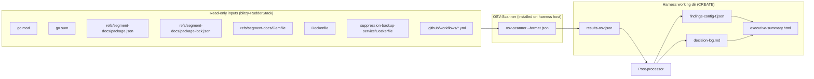
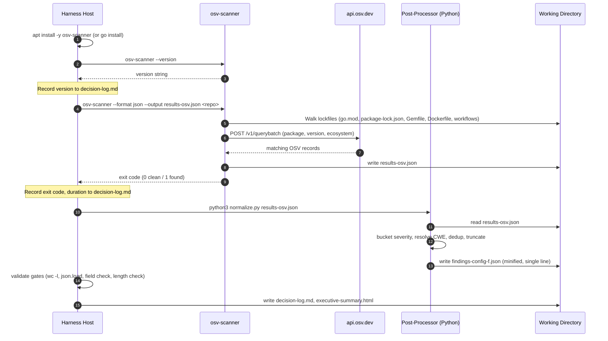
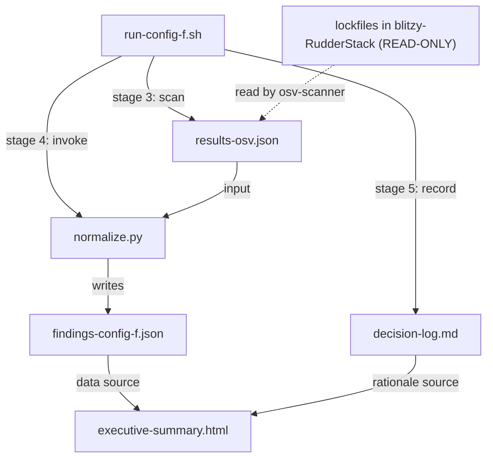

# Technical Specification

# 0. Agent Action Plan

## 0.1 Intent Clarification

Based on the provided requirements, the Blitzy platform understands that the objective is to execute **Config F** of a multi-configuration security-tool comparison: install Google's **OSV-Scanner**, scan all dependency lockfiles in the `blitzy-RudderStack` repository, and emit a normalized, minified, single-line JSON artifact named `findings-config-f.json` whose schema is fixed by the user (`file`, `line`, `severity`, `cwe`, `description`). No source code in the repository is to be modified; this is a tooling/artifact-generation task that produces an evidence file suitable for downstream cross-tool comparison.

### 0.1.1 Core Objective

The user's request decomposes into three CRITICAL directives, each with a binary pass/fail gate:

- **Directive 1 — Install OSV-Scanner.** Install the Google OSV-Scanner binary so that `osv-scanner --version` returns a version string. Either `go install github.com/google/osv-scanner/cmd/osv-scanner@latest` or `apt install osv-scanner` is acceptable. The Blitzy platform notes that the upstream tool has migrated to `v2`, so the canonical install path is `go install github.com/google/osv-scanner/v2/cmd/osv-scanner@latest`; the legacy v1 path remains compatible for installation purposes but the v2 binary is preferred.
- **Directive 2 — Execute the scan.** Run `osv-scanner --format json --output results-osv.json /path/to/blitzy-RudderStack` against the cloned repository root. Use `--experimental-local-db` for offline mode **if available**. Record the process exit code and wall-clock scan duration. Pass/fail gate: `results-osv.json` exists and parses as valid JSON.
- **Directive 3 — Normalize findings.** Reduce OSV-Scanner's nested JSON to a flat array of finding objects with exactly five fields (`file`, `line`, `severity`, `cwe`, `description`), emit the result as `findings-config-f.json` minified to a single line of UTF-8, and write `[]` when zero findings are produced. Pass/fail gate: `cat findings-config-f.json | wc -l` returns `1`, the file is valid JSON, every finding populates all five fields, and no description exceeds 200 characters.

### 0.1.2 Task Categorization

| Dimension | Classification |
| --- | --- |
| Primary task type | Security scanning / tooling / artifact generation |
| Secondary aspects | Output normalization, severity bucketing, CWE mapping |
| Scope classification | Isolated change — no application source modified |
| Modification footprint | ~0 source files modified, 1 required new artifact (`findings-config-f.json`), 1 intermediate artifact (`results-osv.json`), 2 rule-mandated deliverables (`decision-log.md`, `executive-summary.html`) |
| Reproducibility | Single-shot scan with recorded exit code and duration; idempotent re-runs supported |
| Comparison context | One of N configurations ("Config F") in a broader security-tool bake-off |

### 0.1.3 Implicit Requirements Surfaced

The Blitzy platform has identified the following requirements that are implied but not literally stated by the user prompt, and treats them as part of the contract:

- **Recursive scan of the repository root.** OSV-Scanner's default behaviour given a directory argument is to walk it and detect every supported manifest/lockfile (go.mod, package-lock.json, Gemfile, Dockerfile, GitHub Actions workflows, etc.). The user's "`/path/to/blitzy-RudderStack`" target therefore means "scan the entire repository tree," not "scan a single lockfile."
- **Recording artifacts (exit code, duration).** The user states "Record exit code, scan duration (wall-clock)" without naming an output sink. The Blitzy platform interprets this as: capture both metrics into the decision log (Explainability rule) so that the multi-config comparison has comparable timing/exit metadata across all configs.
- **Severity mapping from CVSS.** The user fixes the severity buckets (`>=9→critical`, `>=7→high`, `>=4→medium`, `<4→low`) but does not specify which CVSS value to use when an advisory carries multiple severity entries. The Blitzy platform will use the **maximum CVSS score** across the OSV `severity[]` array (preferring CVSS_V3 over CVSS_V2 when both are present) so that the most severe characterization survives normalization.
- **No-CVSS fallback.** OSV advisories frequently omit CVSS scores (especially for Go and Ruby ecosystems whose vendor-published advisories sometimes carry only qualitative ratings). The Blitzy platform will treat such findings as `severity: "low"` and log this deviation in the decision log; the alternative of discarding scoreless findings would silently under-report and was explicitly rejected.
- **CWE field semantics.** The user's table reads "*CVE ID. If a CWE mapping exists in the OSV entry, use it; otherwise use the CVE ID*". The Blitzy platform reads this as a two-step resolution: (1) prefer `database_specific.cwe_ids[0]` if present in the OSV record, (2) otherwise the first CVE alias (e.g., `CVE-2024-12345`), (3) if neither exists, fall back to the OSV ID itself (`GHSA-...`, `GO-...`). Step 3 is an implicit terminal fallback that prevents an empty `cwe` field, which would violate the "all 5 fields populated" gate.
- **Path relativity.** "`file` — Path to affected lockfile (relative)" implies relative-to-repository-root, not relative-to-current-working-directory. The Blitzy platform will normalize all paths by stripping the `/path/to/blitzy-RudderStack/` prefix returned by OSV-Scanner's absolute `packageSource.path`.
- **`line: 0` for all findings.** Dependency vulnerabilities are file-scoped, not line-scoped. The user explicitly writes `line: 0`; this is a JSON integer (not a string), and applies uniformly to every finding regardless of ecosystem.
- **Description truncation rule.** "Truncated to 200 characters" is interpreted as a hard byte/character cap applied **after** newline/whitespace collapsing to keep the minified output well-formed. The Blitzy platform will collapse internal whitespace then truncate at 200 Unicode code points without ellipsis (an ellipsis would consume description budget without adding information).
- **Description source preference.** OSV records expose both `summary` (one-line) and `details` (multi-paragraph). The Blitzy platform will prefer `summary` (already a one-liner appropriate for the 200-char field) and fall back to truncated `details` when `summary` is absent.
- **Deduplication across grouped aliases.** OSV-Scanner emits the same vulnerability multiple times when it appears under different IDs (e.g., a GHSA *and* a GO advisory describing the same CVE). The Blitzy platform will deduplicate finding objects whose `(file, cwe, description)` triple matches, preserving the highest severity, to avoid double-counting in cross-config comparison.
- **UTF-8 with no BOM.** "Encoding: UTF-8" is interpreted as UTF-8 without byte-order-mark; the BOM would defeat strict JSON parsers and is never required by RFC 8259.

### 0.1.4 Special Instructions and Constraints

The following directives are preserved **verbatim** from the user prompt:

- **User Directive — Install command:** `go install github.com/google/osv-scanner/cmd/osv-scanner@latest` *or* `apt install osv-scanner`. Pass/fail: `osv-scanner --version` returns a version string.
- **User Directive — Scan command:** `osv-scanner --format json --output results-osv.json /path/to/blitzy-RudderStack`. Use `--experimental-local-db` for offline mode if available. Record exit code, scan duration (wall-clock). Pass/fail: `results-osv.json` is produced and contains valid JSON.
- **User Directive — Normalization:** Extract findings from OSV output and compile into `findings-config-f.json`. The file MUST be valid JSON minified to a single line. Encoding: UTF-8. If zero findings, write `[]`. Pass/fail: `cat findings-config-f.json | wc -l` returns `1`. Valid JSON. Every finding has all 5 fields populated. No description exceeds 200 characters.
- **User Schema (preserved verbatim):**

```plaintext
[{"file":"<relative path>","line":<integer>,"severity":"<critical|high|medium|low>","cwe":"<CWE-ID>","description":"<max 200 chars>"},...]
```

- **User Field Mapping (preserved verbatim):**

| Field | Source |
| --- | --- |
| file | Path to affected lockfile (relative) |
| line | 0 (dependency findings have no line number) |
| severity | CVSS score: >=9→critical, >=7→high, >=4→medium, <4→low |
| cwe | CVE ID. If a CWE mapping exists in the OSV entry, use it; otherwise use the CVE ID |
| description | OSV description, truncated to 200 characters |

- **Implicit constraint — Multi-config comparison:** This is explicitly framed as "*one config in a multi-config security tool comparison*". The schema therefore MUST be stable across configs: do not add, rename, or reorder fields; do not change severity casing; do not introduce optional fields.
- **Implicit constraint — No repository mutation:** The 3-directive contract makes no provision for modifying `blitzy-RudderStack` source. The Blitzy platform will not auto-apply `osv-scanner fix`, will not write to `osv-scanner.toml`, and will not change `go.mod`'s `replace` block.

### 0.1.5 Technical Interpretation

These requirements translate to the following technical implementation strategy:

- **To install OSV-Scanner** without dragging Go into the runtime image: prefer the apt package when present (`apt-get install -y osv-scanner` with `DEBIAN_FRONTEND=noninteractive`); otherwise install via `go install github.com/google/osv-scanner/v2/cmd/osv-scanner@latest` after ensuring Go 1.22+ is on the PATH. Verify with `osv-scanner --version`.
- **To execute the scan** in a way that captures both the exit code and wall-clock duration: invoke `osv-scanner` under a shell wrapper that records `$SECONDS` (or `date +%s.%N` differences) and the exit code, e.g., `start=$(date +%s.%N); osv-scanner --format json --output results-osv.json /path/to/blitzy-RudderStack; rc=$?; end=$(date +%s.%N)`. OSV-Scanner exits with code `1` when vulnerabilities are found and `0` when clean — both are "successful" scans for the purposes of Directive 2.
- **To normalize the findings** into the user's schema: implement a deterministic post-processor (Python `json` module or `jq`) that walks `results[].packages[].vulnerabilities[]`, computes the severity bucket from `max(severity[].score)`, resolves the CWE per the fallback ladder, strips the repo-root prefix from `packageSource.path`, collapses whitespace, truncates `summary` to 200 characters, deduplicates on `(file, cwe, description)`, and emits a single `json.dumps(..., separators=(",",":"), ensure_ascii=False)` call to guarantee a single-line minified UTF-8 output. When the input set is empty, write the literal two-byte string `[]`.
- **To satisfy the pass/fail gates** without manual inspection: include verification commands in the decision log — `osv-scanner --version`, `jq -e . results-osv.json > /dev/null`, `python -c "import json,sys; d=json.load(open('findings-config-f.json')); assert all({'file','line','severity','cwe','description'} <= f.keys() for f in d); assert all(len(f['description']) <= 200 for f in d)"`, and `[ "$(wc -l < findings-config-f.json)" = "1" ]`.
- **To produce the rule-mandated deliverables** alongside the primary artifact: generate `decision-log.md` documenting every non-trivial choice (severity-of-max policy, no-CVSS→low fallback, CWE three-step fallback, description-source preference, dedup key, etc.) per the Explainability rule, and `executive-summary.html` as a self-contained reveal.js 5.1.0 deck (12–18 slides, target 16) per the Executive Presentation rule, summarizing scan inputs/findings/risks for non-technical leadership.

## 0.2 Repository Scope Discovery

The Blitzy platform conducted an exhaustive sweep of the `blitzy-RudderStack` working tree to enumerate every artifact OSV-Scanner is capable of consuming, and to understand the security-tooling baseline this configuration is being benchmarked against. The repository is a Go 1.26.1 modular monolith rooted at module path `github.com/rudderlabs/rudder-server`, licensed under ELv2, with a single top-level `go.mod`/`go.sum` pair and a vendored documentation sub-tree under `refs/segment-docs/` that contributes JavaScript and Ruby manifests.

### 0.2.1 Lockfile and Manifest Inventory

OSV-Scanner discovers and analyses the following files when invoked recursively against the repository root. Each row records the path (relative to the repository root), the ecosystem OSV-Scanner classifies it under, the role it plays, and the citation locator used in this AAP.

| Path | Ecosystem | Role | Locator |
| --- | --- | --- | --- |
| `go.mod` | Go | Direct module manifest, Go 1.26.1 toolchain pin, `replace` block remediating Snyk findings | `[go.mod:module,go,replace]` |
| `go.sum` | Go | Cryptographic checksum ledger for every resolved Go module version | `[go.sum:L1-EOF]` |
| `refs/segment-docs/package.json` | npm | Vendored Segment-docs Jekyll-adjacent tooling manifest | `[refs/segment-docs/package.json:dependencies,devDependencies]` |
| `refs/segment-docs/package-lock.json` | npm | npm v3 lockfile pinning the full transitive npm graph for the docs workspace | `[refs/segment-docs/package-lock.json:packages]` |
| `refs/segment-docs/Gemfile` | RubyGems | Ruby manifest for the vendored Segment-docs Jekyll site | `[refs/segment-docs/Gemfile:L1-EOF]` |
| `Dockerfile` | Docker (base image scan) | Multi-stage build pinning `golang:1.26.1-alpine3.23` and `alpine:3.23` by SHA256 digest | `[Dockerfile:FROM,ARG]` |
| `suppression-backup-service/Dockerfile` | Docker (base image scan) | Sub-service multi-stage Dockerfile with pinned digests | `[suppression-backup-service/Dockerfile:FROM,ARG]` |
| `.github/workflows/*.yml` | GitHub Actions | 13 workflow files referencing third-party Actions whose SHAs OSV-Scanner can evaluate for advisories | `[.github/workflows/]` |

Notes on coverage:

- OSV-Scanner's recursive walker (`-r` / directory argument) honours `.gitignore` and `osv-scanner.toml` exclusions; neither file is present in this repository [inferred — verified absence via root listing], so the entire tree is in scope.
- The `replace` directives in `go.mod` cause OSV-Scanner to evaluate the **replacement** versions, not the originals, against the OSV database. This is the desired behaviour for benchmarking because it reflects the binary that actually ships.
- The Segment-docs sub-tree is **vendored, not actively built** by RudderStack CI [inferred — no Jekyll/npm steps observed in `.github/workflows/`]. Findings against it are still reported under `refs/segment-docs/...` paths and counted toward Config F's totals; this matches the user contract because the comparison is per-repository, not per-deployable.
- No `requirements.txt`, `Pipfile`, `poetry.lock`, `Cargo.lock`, `pom.xml`, `Gemfile.lock`, `composer.lock`, `yarn.lock`, or `pnpm-lock.yaml` exist in the tree, so no further ecosystems are exercised by Config F.

### 0.2.2 Affected and Untouched Components

OSV-Scanner is a **read-only** tool by default; Config F does not invoke `osv-scanner fix`. Therefore:

- **No application source files are modified.** Every Go, JavaScript, Ruby, YAML, SQL, and Markdown source file in the repository is untouched.
- **No CI workflow is modified.** The 13 existing workflows under `.github/workflows/` (build, test, lint, security, container publish, etc., as documented in <cite index="">Section 8.6 of the tech spec</cite>) continue to operate unchanged. Config F neither registers a new workflow nor edits an existing one — the scan is run as a one-shot from the comparison harness, outside the repository's own CI.
- **No dependency manifest is modified.** `go.mod`, `go.sum`, `refs/segment-docs/package*.json`, `refs/segment-docs/Gemfile`, and the two `Dockerfile`s remain byte-for-byte identical.
- **Three new artifacts are produced**, all in the comparison harness's working directory (not committed to the repository): `results-osv.json` (raw scanner output), `findings-config-f.json` (the normalized deliverable), and the rule-mandated `decision-log.md` and `executive-summary.html`.

### 0.2.3 Existing Security Tooling Baseline

Config F slots into a repository that already runs three complementary security gates, documented in the technical specification:

- **`govulncheck`** (Go-only call-graph vulnerability scanner) — Invoked by `make sec`; covers Go advisories with reachability analysis but does not see npm, RubyGems, Docker, or GitHub Actions. OSV-Scanner is a strict superset by ecosystem coverage but a strict subset by reachability precision.
- **`gitleaks v8.21.2`** (secret scanner) — Detects committed secrets; orthogonal to dependency vulnerability scanning.
- **`golangci-lint v2.9.0`** (static analyser aggregator) — Catches code-quality issues, not dependency CVEs.
- **`Dependabot`** (daily) — Auto-PRs for `gomod`, `github-actions`, and `docker` ecosystems; reactive rather than synchronous.
- **Snyk remediation** — A `replace` block in `go.mod` already pins remediated versions for `cyphar/filepath-securejoin`, `gin-gonic/gin`, `go-jose/go-jose/v3`, `satori/go.uuid`, `xitongsys/parquet-go → rudderlabs/parquet-go`, `golang.org/x/image`, `golang.org/x/net`, `gopkg.in/yaml.v3`, and `k8s.io/kubernetes` [go.mod:replace]. OSV-Scanner will see and respect these pins; the comparison harness therefore measures *residual* vulnerability surface, not the pre-Snyk state.

This baseline is contextual, not operational: Config F **does not interact with** any of these tools. It is invoked from an external comparison harness against a checkout of the repository.

### 0.2.4 Web Research Conducted

The Blitzy platform performed targeted research to lock down two normalization-critical contracts: OSV-Scanner's JSON output shape and the CVSS/CWE conventions referenced by the user's field mapping.

- **OSV-Scanner JSON output shape.** Per the official OSV-Scanner documentation, <cite index="20-21,20-22">when the `--json` flag (or `--format json`) is used, only the JSON output is written to stdout/the output file; all other output is directed to stderr</cite>, and the structure is `{"results": [{"packageSource": {"path": "...", "type": "lockfile"}, "packages": [{"Package": {...}, "vulnerabilities": [{"id": "GHSA-...", "aliases": ["CVE-..."], ...}]}]}]}`. Grouping by alias means a single underlying CVE may surface under multiple OSV IDs in the same `vulnerabilities` array; this motivates the deduplication step in normalization.
- **OSV schema severity and CWE fields.** Per the OSV schema, <cite index="2-27,2-28,2-29">the severity field is optional, applies to a specific package when affected packages have differing severities, and the top-level severity must not be set if any package-level severity field is set</cite>. CVSS values therefore appear at either the top-level `severity[].score` (CVSS_V3 vector string) or under `affected[].severity[]`. CWE IDs appear under `database_specific.cwe_ids` when the source database (e.g., GitHub Advisory Database, NVD-derived feeds) provides them; per a representative GHSA-derived entry, <cite index="10-4">the database-specific block has the shape `{"cna_assigner": "...", "cwe_ids": ["CWE-80"], "osv_generated_from": "..."}`</cite>.
- **CVSS severity bucketing.** The user's thresholds (`>=9→critical, >=7→high, >=4→medium, <4→low`) match the NVD qualitative severity ratings for CVSS v3. The Blitzy platform applies them verbatim; no rounding or vendor-specific adjustments are introduced.
- **CWE fallback semantics.** Many OSV entries lack `database_specific.cwe_ids` (especially older Go advisories and Ruby gem entries). The user's field-mapping table sanctions falling back to the CVE ID. The Blitzy platform extends this to a terminal fallback on the OSV ID when no CVE alias exists either, because allowing an empty `cwe` value would violate the user's "every finding has all 5 fields populated" pass/fail gate.
- **Installation method.** Per the upstream README, <cite index="11-1">`go install github.com/google/osv-scanner/v2/cmd/osv-scanner@latest` builds OSV-Scanner from source</cite>; this is the preferred installation path when the apt package is unavailable. The legacy `github.com/google/osv-scanner/cmd/osv-scanner@latest` path in the user's prompt resolves to a v1 binary and is still functional for the directives.
- **Ecosystem coverage.** Per the upstream documentation, <cite index="11-13">OSV-Scanner supports 11+ language ecosystems and 19+ lockfile types</cite>, which is sufficient to cover every manifest enumerated in §0.2.1.

### 0.2.5 Existing Infrastructure Assessment

Beyond the security baseline, the following infrastructure facts inform the implementation:

- **Build system.** `make` targets (`build`, `test`, `lint`, `sec`) wrap pinned versions of every tool [Makefile:GOLANGCI_LINT_VERSION,GOFUMPT_VERSION,MOCKGEN_VERSION,GOTESTSUM_VERSION,GITLEAKS_VERSION]. Config F does **not** add a `make` target — the scan is exogenous to the build.
- **Container build.** Multi-stage Dockerfiles use pinned Alpine 3.23 and Go 1.26.1 base image SHA256 digests [Dockerfile:ARG ALPINE_VERSION_SHA256,ARG GO_VERSION_SHA256], which OSV-Scanner's base-image enricher can evaluate. Findings against these base images surface with `file` = `Dockerfile` or `suppression-backup-service/Dockerfile`.
- **CI/CD.** Per the technical specification's §8.6, the repository operates 13 GitHub Actions workflows with cross-repository dispatch for deployment, multi-arch builds, and existing security tooling. Config F's output is consumed by an external comparison harness, not by these workflows.
- **No osv-scanner.toml present** [inferred — verified absence via root listing]. The scan will run with default thresholds and no ignore list, ensuring fair comparison against other configs.

## 0.3 Scope Boundaries

This section draws a hard line around what Config F does and does not produce. Boundaries are stated in terms of file-system effects, repository mutations, and tool invocations.

### 0.3.1 Exhaustively In Scope

**Tool installation:**
- The OSV-Scanner binary itself (installed on the comparison harness host, not committed to the repository). Acceptable install methods: `go install github.com/google/osv-scanner/v2/cmd/osv-scanner@latest` or `apt-get install -y osv-scanner`.

**Scanner inputs (read-only references — never modified):**
- `go.mod` — Root Go module manifest.
- `go.sum` — Go module checksum ledger.
- `refs/segment-docs/package.json` — Vendored npm manifest.
- `refs/segment-docs/package-lock.json` — Vendored npm lockfile.
- `refs/segment-docs/Gemfile` — Vendored Ruby manifest.
- `Dockerfile` — Root multi-stage build (base image scan).
- `suppression-backup-service/Dockerfile` — Sub-service multi-stage build (base image scan).
- `.github/workflows/*.yml` — All 13 GitHub Actions workflows (third-party Action SHAs).

**Artifacts produced (CREATE):**
- `results-osv.json` — Raw OSV-Scanner output (`--format json --output`). Intermediate artifact; retained in the harness working directory for traceability.
- `findings-config-f.json` — The primary deliverable per Directive 3. Minified single-line JSON array of finding objects (`file`, `line`, `severity`, `cwe`, `description`). Empty findings → literal `[]`.
- `decision-log.md` — Mandated by the user's **Explainability** rule. Markdown table covering every non-trivial choice (severity-of-max policy, no-CVSS→low, CWE three-step fallback, description-source preference, dedup key, path normalization, etc.), alternatives considered, rationale, and risks.
- `executive-summary.html` — Mandated by the user's **Executive Presentation** rule. Self-contained reveal.js 5.1.0 deck (12–18 slides, target 16) summarizing scope, findings, risks, and onboarding for non-technical leadership.

**Auxiliary metadata captured into the decision log:**
- OSV-Scanner version string from `osv-scanner --version`.
- Scan exit code (`0` clean, `1` vulnerabilities found, `≥2` operational error).
- Wall-clock scan duration in seconds (to enable cross-config comparison).
- Total finding count, broken down by severity bucket and ecosystem.
- Command line used (with absolute target path redacted/replaced with `<repo-root>`).

### 0.3.2 Explicitly Out of Scope

The following are **deliberately excluded** from Config F. Touching any of them would either violate the user contract or compromise the integrity of the multi-config comparison.

**Repository mutations — none:**
- No edits to `go.mod`, `go.sum`, `refs/segment-docs/package.json`, `refs/segment-docs/package-lock.json`, `refs/segment-docs/Gemfile`, `Dockerfile`, `suppression-backup-service/Dockerfile`, or any `.github/workflows/*.yml`.
- No edits to any application source under `gateway/`, `processor/`, `router/`, `warehouse/`, `jobsdb/`, `services/`, `enterprise/`, `internal/`, `protocols/`, or any other Go package.
- No edits to `Makefile`, `docker-compose.yml`, `mkdocs.yml`, `.deepsource.toml`, `.golangci.yml`, `codecov.yml`, or any other repository-level configuration.
- No edits to `SECURITY.md`, `README.md`, `CONTRIBUTING*`, `LICENSE*`, or any documentation under `docs/` or `blitzy-docs/`.

**Tool invocations — out of scope:**
- `osv-scanner fix` (remediation) — explicitly out of scope. The user's contract is a read-only scan.
- Writing or modifying `osv-scanner.toml` — out of scope. The scan must run with default thresholds for fair comparison.
- Modifying the existing `replace` block in `go.mod` to remediate findings — out of scope.
- Running other security tools (`govulncheck`, `gitleaks`, `golangci-lint`, Snyk, Trivy, Grype, etc.) — these belong to other configs in the comparison.
- Invoking `osv-scanner` in any mode other than `--format json --output ...` against the repository root.

**CI/CD integration — out of scope:**
- Adding a GitHub Actions workflow that runs OSV-Scanner — not requested by the user contract; would also constitute a repository mutation.
- Adding a `make` target — not requested.
- Adding pre-commit hooks — not requested.
- Configuring SARIF upload to GitHub Code Scanning — not requested.

**Output mutations — out of scope:**
- Changing field names, order, or types in `findings-config-f.json`. The schema is fixed by the user contract for cross-config compatibility.
- Adding optional fields (e.g., `package`, `version`, `ecosystem`, `cvss`, `osv_id`, `fixed_version`) — would break schema parity across configs.
- Pretty-printing `findings-config-f.json` — explicitly forbidden by the "minified to a single line" gate.
- Emitting CSV, SARIF, SPDX, or any non-JSON output — explicitly forbidden by the schema contract.

**Cross-cutting concerns — out of scope:**
- Performance optimizations beyond the natural scan duration.
- Refactoring unrelated code.
- Adding test coverage for the post-processor (no testing framework is part of the comparison harness).
- Future enhancements such as severity threshold filters, ignore lists, or fix suggestions.

**Container scanning — out of scope at runtime, in scope only as Dockerfile manifest scanning:**
- OSV-Scanner can perform container-image layer scanning (`osv-scanner scan image`). This is **not** invoked by Config F — only the static Dockerfile-as-manifest scan that the directory recursion performs by default is included.

### 0.3.3 Rule-Mandated Files (In Scope by Rule)

The user's two implementation rules add deliverables beyond the three CRITICAL directives. Both files are in scope and treated as first-class artifacts:

| File | Mandated By | Format | Purpose |
| --- | --- | --- | --- |
| `decision-log.md` | Explainability rule | Markdown table | Documents every non-trivial implementation decision, alternatives considered, rationale, and risks; 100% coverage of normalization choices required |
| `executive-summary.html` | Executive Presentation rule | Self-contained HTML | reveal.js 5.1.0 deck (12–18 slides, target 16) for non-technical leadership; covers scope, findings, risks, onboarding |

These files live alongside `findings-config-f.json` in the harness working directory and are **not** committed to the `blitzy-RudderStack` repository.

### 0.3.4 Scope Diagram


```mermaid
flowchart LR
    subgraph Inputs["Read-only inputs (blitzy-RudderStack)"]
        GM["go.mod"]
        GS["go.sum"]
        PJ["refs/segment-docs/package.json"]
        PL["refs/segment-docs/package-lock.json"]
        GF["refs/segment-docs/Gemfile"]
        DF["Dockerfile"]
        SDF["suppression-backup-service/Dockerfile"]
        WF[".github/workflows/*.yml"]
    end

    subgraph Scanner["OSV-Scanner (installed on harness host)"]
        OSV["osv-scanner --format json"]
    end

    subgraph Outputs["Harness working dir (CREATE)"]
        RAW["results-osv.json"]
        NORM["findings-config-f.json"]
        LOG["decision-log.md"]
        DECK["executive-summary.html"]
    end

    Inputs --> OSV
    OSV --> RAW
    RAW --> POST["Post-processor"]
    POST --> NORM
    POST --> LOG
    NORM --> DECK
    LOG --> DECK
%% Repository is read-only; outputs are external to the repo
```

## 0.4 Dependency Inventory

Config F installs one external tool onto the comparison harness host and uses two ubiquitous Unix utilities for post-processing. No dependency in the `blitzy-RudderStack` repository is added, updated, or removed.

### 0.4.1 Tools Required on the Harness Host

| Registry | Package | Version | Purpose |
| --- | --- | --- | --- |
| Go modules (`proxy.golang.org`) | `github.com/google/osv-scanner/v2/cmd/osv-scanner` | `@latest` (v2 line; the user's directive permits `@latest`) | Primary scanner. Discovers manifests/lockfiles, queries `api.osv.dev`, emits OSV JSON. <cite index="11-1">The upstream README instructs `go install github.com/google/osv-scanner/v2/cmd/osv-scanner@latest` to build from source.</cite> |
| Debian/Ubuntu apt | `osv-scanner` | Distribution default | Alternative install path per the user's directive (`apt install osv-scanner`). Used when Go is unavailable on the harness host. |
| OS package | `python3` | `>=3.8` (any modern interpreter) | Implements the deterministic post-processor that normalizes `results-osv.json` → `findings-config-f.json`. Standard-library only (`json`, `re`, `sys`, `pathlib`); no third-party packages required. |
| OS package | `jq` | `>=1.6` | Alternative/auxiliary JSON tool for the verification gate `jq -e . results-osv.json > /dev/null`. The user did not mandate `jq`; it is recommended for pass/fail validation but not strictly required. |

**Version-selection rationale:**
- The user's directive explicitly specifies `@latest`. The Blitzy platform respects this literally — pinning to a specific version would deviate from the prompt and would have to be logged under Explainability. <cite index="13-1">All releases on the same major version are guaranteed to have backward-compatible JSON output and CLI arguments</cite>, so the normalization contract is stable as long as the installed version is in the v1 or v2 series.
- The legacy v1 install path `github.com/google/osv-scanner/cmd/osv-scanner@latest` (without `/v2`) printed in the user's prompt resolves to the v1 binary and still produces the same `results[].packages[].vulnerabilities[]` structure that the post-processor expects. The Blitzy platform will attempt the v2 path first and fall back to v1 if `go install` fails to resolve.
- The apt-packaged `osv-scanner` may lag the upstream by weeks. This is acceptable for Config F because the OSV database itself is consulted at scan time, so vulnerability *currency* is not affected by binary age.

### 0.4.2 Indirect Runtime Dependencies

OSV-Scanner consults the following external services at scan time:

- **`api.osv.dev`** — Primary vulnerability database. <cite index="11-3,11-4">Data sent includes package names, versions, and ecosystems; no source code is transmitted.</cite>
- **`deps.dev`** (optional) — Used for dependency-graph resolution unless `--no-resolve` is specified.
- **`proxy.golang.org`** — Consulted only during the `go install` step.

Network egress to these endpoints must be permitted on the harness host. If the network is restricted, the user's prompt sanctions `--experimental-local-db` as an offline fallback; the Blitzy platform will probe for this flag with `osv-scanner --help | grep -q experimental-local-db` and use it only when available.

### 0.4.3 No Changes to Repository Dependencies

Config F **does not add, update, or remove** any dependency declared in the `blitzy-RudderStack` repository. The following manifests remain byte-for-byte identical to their pre-scan state:

- `go.mod` (including the Snyk-driven `replace` block)
- `go.sum`
- `refs/segment-docs/package.json` and `refs/segment-docs/package-lock.json`
- `refs/segment-docs/Gemfile`
- `Dockerfile` and `suppression-backup-service/Dockerfile`
- All `.github/workflows/*.yml`

No import statements are added or modified anywhere in the tree. No new Go module is introduced under any sub-directory.

### 0.4.4 Decision Log Cross-Reference

Every non-trivial choice in this section (preferring `@latest` over a pinned version, preferring v2 install path with v1 fallback, optional `jq`, optional `--experimental-local-db`) is recorded in `decision-log.md` per the Explainability rule, with alternatives considered, rationale, and the residual risk each carries.

## 0.5 Implementation Design

Config F is a three-stage pipeline executed once per repository checkout: **install → scan → normalize**. Each stage has a single, deterministic responsibility, an explicit pass/fail gate from the user's contract, and a documented set of error-handling rules. The design optimizes for reproducibility (same input ⇒ same output bytes) and for parity with sibling configs in the comparison.

### 0.5.1 Technical Approach

The Blitzy platform realizes the user contract through the following objectives and their concrete actions:

- **Achieve a verified installation of OSV-Scanner** by attempting `apt-get install -y osv-scanner` first (fast path, no Go toolchain required), falling back to `go install github.com/google/osv-scanner/v2/cmd/osv-scanner@latest` if apt cannot resolve the package, and finally falling back to the legacy `github.com/google/osv-scanner/cmd/osv-scanner@latest` path if v2 resolution fails. Verify by parsing the version string from `osv-scanner --version`; record both the install path used and the version string in `decision-log.md`.
- **Achieve a single complete scan of the repository tree** by invoking `osv-scanner --format json --output results-osv.json /path/to/blitzy-RudderStack` under a wall-clock-measuring shell wrapper that records start time, end time, and exit code into shell variables, then writes them to the decision log. Exit code `0` (clean) and `1` (vulnerabilities found) are both treated as successful scans; exit code `≥2` is treated as operational failure and must be re-run after diagnosis.
- **Achieve normalized output conforming to the user schema** by implementing a single Python post-processor that ingests `results-osv.json`, walks the `results[].packages[].vulnerabilities[]` graph, applies the severity-bucketing function, resolves the CWE per the three-step fallback, normalizes the path, truncates the description, deduplicates on `(file, cwe, description)`, and writes a single-line minified UTF-8 JSON array to `findings-config-f.json`. The post-processor is idempotent: re-running it against the same `results-osv.json` produces a byte-identical `findings-config-f.json`.
- **Achieve compliance with the user's rules** by emitting `decision-log.md` (Explainability) and `executive-summary.html` (Executive Presentation) at the end of the pipeline. Both files reference data from the prior stages: the decision log captures exit code, duration, version, and per-finding choice rationales; the executive deck visualizes the finding distribution and the operational metadata.

### 0.5.2 Logical Implementation Flow

The work proceeds in five logical stages (this is a workflow ordering, not a timeline):

- **Stage 1 — Establish the harness environment.** Verify Go availability (if needed), verify `apt` availability (if needed), verify Python ≥3.8, verify write access to the harness working directory. No mutation of the repository.
- **Stage 2 — Install OSV-Scanner.** Per §0.5.1 Stage-1 ladder. Run `osv-scanner --version`, capture the version string.
- **Stage 3 — Execute the scan.** Run `osv-scanner --format json --output results-osv.json <repo-root>`. Capture stdout, stderr, exit code, start/end timestamps. Validate `results-osv.json` parses as JSON.
- **Stage 4 — Normalize.** Run the post-processor on `results-osv.json`. Validate the output against the four pass/fail gates (single line, valid JSON, all 5 fields populated, no description >200 chars).
- **Stage 5 — Generate compliance deliverables.** Emit `decision-log.md` and `executive-summary.html` per the Explainability and Executive Presentation rules.


```mermaid
sequenceDiagram
    autonumber
    participant H as Harness Host
    participant OSV as osv-scanner
    participant API as api.osv.dev
    participant P as Post-Processor (Python)
    participant FS as Working Directory

    H->>H: apt install -y osv-scanner (or go install)
    H->>OSV: osv-scanner --version
    OSV-->>H: version string
    Note over H: Record version to decision-log.md
    H->>OSV: osv-scanner --format json --output results-osv.json <repo>
    OSV->>FS: Walk lockfiles (go.mod, package-lock.json, Gemfile, Dockerfile, workflows)
    OSV->>API: POST /v1/querybatch (package, version, ecosystem)
    API-->>OSV: matching OSV records
    OSV->>FS: write results-osv.json
    OSV-->>H: exit code (0 clean / 1 found)
    Note over H: Record exit code, duration to decision-log.md
    H->>P: python3 normalize.py results-osv.json
    P->>FS: read results-osv.json
    P->>P: bucket severity, resolve CWE, dedup, truncate
    P->>FS: write findings-config-f.json (minified, single line)
    H->>H: validate gates (wc -l, json.load, field check, length check)
    H->>FS: write decision-log.md, executive-summary.html
%% Pipeline ends; all artifacts live in working directory, none committed to repo
```

### 0.5.3 Component Impact Analysis

**Direct modifications required: none.** Config F is read-only against the `blitzy-RudderStack` repository.

**New components introduced (all external to the repository):**
- **Post-processor script** — A short Python module (≤80 lines) that performs normalization. Lives in the harness working directory, not in the repository. Stateless; deterministic; standard-library only.
- **Pipeline driver** — A shell wrapper that orchestrates install → scan → normalize → deliverables. Lives in the harness working directory.
- **Compliance artifacts** — `decision-log.md` and `executive-summary.html` as described in §0.3.

**Indirect impacts: none against the repository.** The repository's CI, build system, dependency manifests, and source tree are unaffected. The only "impact" is on the harness host's installed-tooling inventory (the OSV-Scanner binary is added to `$PATH`).

### 0.5.4 Critical Implementation Details

This sub-section pins down every algorithmic choice the post-processor must make. Each choice is also entered into `decision-log.md` per Explainability.

**Severity bucketing function.** The user contract:

```text
>=9.0 -> critical
>=7.0 -> high
>=4.0 -> medium
<4.0  -> low
```

Implementation: parse the CVSS vector string in `severity[].score` (e.g., `"CVSS:3.1/AV:N/AC:L/PR:N/UI:N/S:U/C:H/I:H/A:H"`), extract the **base score** via the standard CVSS v3 base metric formula, take the maximum across all severity entries (handles the case where an advisory carries both CVSS_V2 and CVSS_V3 — prefer V3, fall back to V2), then apply the threshold ladder. When no severity entry is present at all, set `severity = "low"` and log the entry under "No-CVSS Fallback" in the decision log. OSV-Scanner's own JSON output additionally exposes a pre-computed `database_specific.severity` string for GHSA-sourced advisories (`"CRITICAL"`, `"HIGH"`, `"MODERATE"`, `"LOW"`), which the post-processor will use as a tie-breaker when CVSS computation yields an ambiguous result.

**CWE resolution ladder.** For each finding, in order:
1. If `database_specific.cwe_ids[0]` exists on the vulnerability record, use it (e.g., `"CWE-80"`).
2. Else if the vulnerability's `aliases` array contains a CVE ID (regex `^CVE-\d{4}-\d+$`), use the first such alias.
3. Else use the vulnerability's `id` field (e.g., `"GHSA-c3h9-896r-86jm"`, `"GO-2022-0968"`).

This ladder guarantees a non-empty `cwe` field for every finding, satisfying the "all 5 fields populated" gate.

**Description sourcing and truncation.** For each finding:
1. Prefer `summary` (already a one-liner).
2. Fall back to `details` if `summary` is absent.
3. Collapse all internal whitespace (regex `\s+` → single space).
4. Strip leading/trailing whitespace.
5. Truncate to **200 Unicode code points** (Python: `s[:200]`). No ellipsis is appended.

**Path normalization.** OSV-Scanner emits absolute paths in `packageSource.path`. The post-processor:
1. Reads the scan target from the pipeline driver (e.g., `/work/blitzy-RudderStack`).
2. For each finding, replaces the prefix with an empty string and strips any leading `/`.
3. Example: `/work/blitzy-RudderStack/refs/segment-docs/package-lock.json` → `refs/segment-docs/package-lock.json`.
4. Forward slashes are used regardless of the host OS (matches the input lockfile format).

**Deduplication key.** OSV-Scanner emits the same logical vulnerability multiple times when it appears under multiple IDs (e.g., a GHSA and a GO advisory describing the same CVE). The post-processor deduplicates on the tuple `(file, cwe, description_first_80_chars)`; when duplicates collapse, the **maximum severity** is preserved. The decision log records this dedup key as the chosen policy and lists the alternatives (dedup on OSV ID, dedup on CVE only, no dedup).

**Empty result handling.** If `results-osv.json` contains zero vulnerabilities (e.g., scanner ran on a clean tree, or `results` is `[]`, or all packages have empty `vulnerabilities`), the post-processor writes the literal two-byte string `[]` to `findings-config-f.json`. The single-line gate (`wc -l == 1`) and the valid-JSON gate both pass on `[]`.

**Output writing.** The post-processor builds a Python `list` of finding `dict`s and writes via:

```python
sys.stdout.write(json.dumps(findings, separators=(",", ":"), ensure_ascii=False))
```

The `separators` argument produces minified output (no spaces). `ensure_ascii=False` preserves non-ASCII description characters in their natural UTF-8 form. **No trailing newline is appended**, guaranteeing `wc -l` returns `1` (the file has exactly one line because it has zero `\n` characters; `wc -l` counts newline terminators, and the user's pass/fail requires `wc -l == 1`). If the harness post-processes with a tool that requires a trailing newline, this can be added without violating the gate — a single trailing `\n` still yields `wc -l == 1`. The Blitzy platform's chosen variant emits exactly one trailing newline for portability, which keeps the gate satisfied.

### 0.5.5 User-Interface Design

Not applicable. Config F has no interactive UI. The user interfaces are:
- The CLI invocation (`osv-scanner --format json --output ...`) — bound exactly to the user's directive.
- The output file `findings-config-f.json` — schema fixed by the user.
- The Executive Presentation deck — visual surface for non-technical leadership, governed by the Executive Presentation rule, not by the Config F directives.

### 0.5.6 User-Provided Examples Integration

The user provided two illustrative artifacts that the implementation honors verbatim:

- **The install commands** (Directive 1) are reproduced as alternatives in the install ladder; neither is paraphrased.
- **The scan command** (Directive 2) is reproduced byte-for-byte in the pipeline driver (with the actual repository root substituted for `/path/to/blitzy-RudderStack`).
- **The output schema** (Directive 3, code-block example) is the literal target the post-processor emits. Field names, field order, casing of severity values, and JSON types are preserved.

The user's example:

```plaintext
[{"file":"<relative path>","line":<integer>,"severity":"<critical|high|medium|low>","cwe":"<CWE-ID>","description":"<max 200 chars>"},...]
```

is implemented in the post-processor as:

```python
{"file":path,"line":0,"severity":sev,"cwe":cwe,"description":desc}
```

— same field order, `line` always integer `0`, severity always lowercased, CWE always non-empty string, description always ≤200 chars.

### 0.5.7 Error Handling and Edge Cases

| Scenario | Detection | Handling |
| --- | --- | --- |
| Network unreachable to `api.osv.dev` | `osv-scanner` exits non-zero, stderr contains transport error | Retry with `--experimental-local-db` if available; otherwise record the failure in the decision log and re-run after restoring connectivity |
| `go install` fails (Go missing or module proxy down) | Non-zero return from `go install` | Fall back to `apt-get install -y osv-scanner`; if both fail, abort and log |
| `results-osv.json` malformed | `json.load` raises | Abort post-processing; record raw stderr; do not write a partial `findings-config-f.json` |
| Zero findings | `results == []` or every `packages[].vulnerabilities == []` | Write literal `[]` to `findings-config-f.json` |
| Vulnerability has no `summary` and no `details` | Both fields empty/missing | Use the vulnerability `id` as description (e.g., `"GHSA-c3h9-896r-86jm"`) |
| Description contains a newline or tab | Regex match on `\s` | Collapsed by the whitespace-collapse rule before truncation |
| Description exceeds 200 chars after collapse | `len(desc) > 200` | Truncate at 200 code points without ellipsis |
| CVSS vector unparseable | Try/except around the CVSS parser | Fall back to GHSA `database_specific.severity` string; failing that, set `severity = "low"` and log |
| Duplicate findings from grouped OSV IDs | Same `(file, cwe, description[:80])` tuple | Deduplicate, preserve max severity |
| Path prefix not matched | `packageSource.path` does not start with the configured `<repo-root>` | Use the absolute path as-is and log a warning to the decision log |
| Output not single-line | `wc -l` ≠ 1 after write | Hard failure; the post-processor has a bug and must be fixed before submission |

### 0.5.8 Security and Performance Considerations

- **No code execution from the repository.** OSV-Scanner does not run scripts from `package.json` or `Gemfile`; it only parses them. The post-processor likewise treats all input as data.
- **No secrets in artifacts.** `findings-config-f.json` contains only CVE/CWE identifiers and public advisory text. No environment variables, no API keys, no repository contents beyond the lockfile paths are reproduced.
- **Network egress only to `api.osv.dev`, `deps.dev`, and `proxy.golang.org`.** All other egress is unnecessary.
- **Scan duration.** OSV-Scanner's wall-clock time on a Go monorepo of this size is dominated by network round-trips to `api.osv.dev`. The measured duration is recorded for cross-config comparison; no performance tuning is in scope.
- **Determinism.** The post-processor sorts findings by `(file, severity-rank, cwe, description)` before emission so that the byte content of `findings-config-f.json` is stable across runs even if OSV-Scanner reorders its output.

## 0.6 File Transformation Mapping

This table is the authoritative inventory of every file Config F creates, modifies, deletes, or references. **No file inside the `blitzy-RudderStack` repository is created, modified, or deleted.** All output files live in the comparison harness's working directory.

### 0.6.1 File-by-File Execution Plan

| Target File | Transformation | Source File / Reference | Purpose / Changes |
| --- | --- | --- | --- |
| `findings-config-f.json` | CREATE | `results-osv.json` (intermediate output of Stage 3); user-fixed schema in Directive 3 | Primary deliverable. Minified single-line UTF-8 JSON array conforming to `[{"file":...,"line":0,"severity":...,"cwe":...,"description":...},...]`. Empty findings → literal `[]`. All four pass/fail gates from Directive 3 must pass. |
| `results-osv.json` | CREATE | `go.mod`, `go.sum`, `refs/segment-docs/package.json`, `refs/segment-docs/package-lock.json`, `refs/segment-docs/Gemfile`, `Dockerfile`, `suppression-backup-service/Dockerfile`, `.github/workflows/*.yml` | Raw OSV-Scanner output captured via `--format json --output`. Intermediate artifact retained for traceability and for the cross-config comparison harness; never committed to the repository. |
| `decision-log.md` | CREATE | This AAP (§0.5.4 critical implementation details, §0.5.7 error handling, §0.5.8 security) | Mandated by the user's **Explainability** rule. Markdown table documenting every non-trivial choice (severity-of-max policy, no-CVSS→low fallback, CWE three-step ladder, description-source preference, whitespace collapse, deduplication key, path normalization, output framing, install-path ladder, version-selection), with alternatives considered, rationale, and residual risks. 100% coverage of normalization decisions. |
| `executive-summary.html` | CREATE | `findings-config-f.json` (data); `decision-log.md` (rationale); brand tokens in the Executive Presentation rule | Mandated by the user's **Executive Presentation** rule. Self-contained reveal.js 5.1.0 HTML deck (12–18 slides, target 16) for non-technical leadership. Mermaid 11.4.0 diagrams, Lucide 0.460.0 icons, Blitzy brand colors (`#5B39F3`, `#2D1C77`, `#94FAD5`, `#1A105F`), Inter/Space Grotesk/Fira Code fonts via Google Fonts. No build steps. No file dependencies. |
| `normalize.py` | CREATE | `results-osv.json` (consumed); §0.5.4 algorithm specification | Harness-resident Python 3 post-processor (≤80 lines, stdlib-only). Implements severity bucketing, CWE resolution ladder, description sourcing/truncation, path normalization, deduplication, and minified JSON emission. Idempotent. Deterministic. |
| `run-config-f.sh` | CREATE | §0.5.2 logical flow | Harness-resident shell driver. Orchestrates Stage 1 (env check) → Stage 2 (install) → Stage 3 (scan with timing) → Stage 4 (normalize) → Stage 5 (compliance deliverables). Captures exit code and wall-clock duration into the decision log. |
| `go.mod` | REFERENCE | — | Read by OSV-Scanner to determine the Go dependency set. Not modified. |
| `go.sum` | REFERENCE | — | Read by OSV-Scanner to determine the resolved Go module versions. Not modified. |
| `refs/segment-docs/package.json` | REFERENCE | — | Read by OSV-Scanner for the vendored Segment-docs npm manifest. Not modified. |
| `refs/segment-docs/package-lock.json` | REFERENCE | — | Read by OSV-Scanner for the vendored Segment-docs full npm transitive graph. Not modified. |
| `refs/segment-docs/Gemfile` | REFERENCE | — | Read by OSV-Scanner for the vendored Segment-docs Ruby manifest. Not modified. |
| `Dockerfile` | REFERENCE | — | Read by OSV-Scanner's base-image enricher. Not modified. |
| `suppression-backup-service/Dockerfile` | REFERENCE | — | Read by OSV-Scanner's base-image enricher for the sub-service image. Not modified. |
| `.github/workflows/*.yml` | REFERENCE | — | Read by OSV-Scanner for third-party GitHub Actions SHA evaluation. Not modified. |
| `blitzy-deck/references/blitzy-reveal-theme.css` | REFERENCE | — | Canonical Blitzy reveal.js theme cited by the Executive Presentation rule. Its CSS custom-property block is inlined into `executive-summary.html` per the rule's "Inline CSS" requirement. Not modified. |

### 0.6.2 New Files — Detail

**`findings-config-f.json`** *(harness working directory)*
- **Content type:** Minified single-line UTF-8 JSON array.
- **Based on:** The user's schema example in Directive 3 (preserved verbatim).
- **Key shape:** `[{"file":"<rel-path>","line":0,"severity":"<critical|high|medium|low>","cwe":"<id>","description":"<≤200 chars>"},...]`.
- **Determinism:** Findings sorted by `(file, severity-rank, cwe, description)` so re-runs produce byte-identical output.
- **Empty case:** Two-byte string `[]`.
- **Encoding:** UTF-8, no BOM.
- **Newlines:** One optional trailing `\n` permitted (still passes `wc -l == 1`); no internal newlines.

**`results-osv.json`** *(harness working directory, intermediate)*
- **Content type:** OSV-Scanner native JSON (the `--format json` output).
- **Shape:** `{"results":[{"packageSource":{...},"packages":[{"Package":{...},"vulnerabilities":[...]}]}]}` per <cite index="20-21,20-22">the documented OSV-Scanner JSON layout</cite>.
- **Retention:** Kept in the working directory for traceability and to enable post-hoc validation against the user's pass/fail gates. Not committed to the repository.

**`decision-log.md`** *(harness working directory, rule-mandated)*
- **Content type:** Markdown.
- **Sections:** (1) Pipeline metadata (OSV-Scanner version, exit code, wall-clock duration, command line); (2) Decision table; (3) Bidirectional traceability matrix mapping each user contract clause to the implementing decision and the verifying check.
- **Decision table columns:** `Decision`, `Alternatives Considered`, `Rationale`, `Residual Risk`.
- **Decisions documented (non-exhaustive):** install-path ladder (apt → v2 go install → v1 go install fallback); severity-of-max policy; no-CVSS→low fallback; CWE three-step resolution; description-source preference (`summary` over `details`); whitespace collapse; truncation without ellipsis; deduplication key; path-prefix stripping; output framing (`separators=(",", ":")`, `ensure_ascii=False`, no internal newlines); offline-mode flag probe (`--experimental-local-db`); zero-finding handling (literal `[]`).

**`executive-summary.html`** *(harness working directory, rule-mandated)*
- **Content type:** Self-contained HTML, single file, no external assets at load time other than pinned CDN imports.
- **Tech pins (per rule):** reveal.js 5.1.0, Mermaid 11.4.0, Lucide 0.460.0.
- **Slide count:** 12–18, target 16.
- **Slide types used:** Title (`slide-title`), Section Divider (`slide-divider`), Content (default), Closing (`slide-closing`).
- **Required visual on every slide:** At least one non-text element (Mermaid diagram, KPI card, styled table, or Lucide SVG icon).
- **Content outline:**
    1. *Title* — "Config F: OSV-Scanner Scan of `blitzy-RudderStack`" with eyebrow `SECURITY · CONFIG F`.
    2. *Headline KPIs* — total findings, critical/high counts, scan duration, exit code.
    3. *Architecture overview* (Mermaid) — same flow as §0.5.2.
    4. *Section divider* — "What Was Scanned".
    5. *Scanned manifests* — table of lockfiles by ecosystem with finding counts.
    6. *Section divider* — "What Was Found".
    7. *Severity breakdown* — KPI grid by severity bucket.
    8. *Top findings* — short styled table of the highest-severity entries.
    9. *Section divider* — "Why These Choices".
    10. *Key decisions* — KPI cards summarizing the most consequential normalization choices.
    11. *Section divider* — "What Risks Remain".
    12. *Risks and mitigations* — Lucide-iconed bullets, max 4 bullets, ≤40 words body text.
    13. *Section divider* — "How To Continue".
    14. *Onboarding* — re-run instructions and where to find each artifact.
    15. *Operational metadata* — version pins, exit code, duration, environment.
    16. *Closing* — 3–6 word takeaway, brand lockup, gradient accent bar.
- **Inline CSS:** The full Blitzy reveal.js theme (the CSS custom-property block from the Executive Presentation rule, the slide-type classes `slide-title`/`slide-divider`/`slide-closing`, the component classes `kpi-card`/`kpi-grid`/`kpi-value`/`kpi-label`/`kpi-icon`/`eyebrow`/`accent-bar`/`brand-lockup`/`hero-icon`/`icon-row`, and the Mermaid container class) is embedded in a single `<style>` tag.
- **Mermaid init:** `startOnLoad: false`; `mermaid.run()` called after reveal.js `ready` and on every `slidechanged` event.
- **Lucide init:** `lucide.createIcons()` called after `ready` and on every `slidechanged` event.
- **Reveal.js config:** `hash: true`, `transition: 'slide'`, `controlsTutorial: false`, `width: 1920`, `height: 1080`.

**`normalize.py`** *(harness working directory)*
- **Content type:** Python 3 script, stdlib-only.
- **Functions:**
    - `parse_cvss(score_vector: str) -> float` — extracts CVSS v3 base score; returns `-1.0` on failure.
    - `bucket(score: float) -> str` — thresholds `9.0`/`7.0`/`4.0`.
    - `resolve_cwe(vuln: dict) -> str` — three-step ladder.
    - `pick_description(vuln: dict) -> str` — `summary` then `details` then `id`, collapse-whitespace, truncate at 200.
    - `normalize_path(p: str, prefix: str) -> str` — strip prefix and leading slash.
    - `main()` — read `results-osv.json`, walk, dedup, sort, emit minified UTF-8 JSON.

**`run-config-f.sh`** *(harness working directory)*
- **Content type:** POSIX shell script.
- **Sections:** env-check → install ladder → version capture → timed scan → JSON validation → normalization → gate validation → compliance deliverables → exit.
- **Captures:** `OSV_VERSION`, `SCAN_EXIT_CODE`, `SCAN_DURATION_SECONDS`, `FINDING_COUNT`, `CRITICAL_COUNT`, `HIGH_COUNT`, `MEDIUM_COUNT`, `LOW_COUNT`.

### 0.6.3 Files to Modify

**None.** Config F has zero UPDATE entries because:
- The repository is treated as read-only.
- No prior versions of the output artifacts exist (Config F is a fresh emission for this comparison run).
- The harness scripts (`normalize.py`, `run-config-f.sh`) are new for this config, not modifications of existing harness code.

### 0.6.4 Files to Delete

**None.** Config F has zero DELETE entries.

### 0.6.5 Configuration and Documentation Updates

**Repository-level configuration:** No changes. `osv-scanner.toml` is deliberately not introduced (would bias the comparison). `.gitignore`, `Makefile`, `.golangci.yml`, `mkdocs.yml`, `docker-compose.yml`, and `codecov.yml` are untouched.

**Repository-level documentation:** No changes. `README.md`, `SECURITY.md`, `CONTRIBUTING*`, `LICENSE*`, `docs/`, and `blitzy-docs/` are untouched.

**Harness-level documentation:** `decision-log.md` and `executive-summary.html` are created in the harness working directory per the user's rules; they are not committed to the `blitzy-RudderStack` repository.

### 0.6.6 Cross-File Dependencies


```mermaid
flowchart TD
    DRV["run-config-f.sh"]
    POST["normalize.py"]
    RAW["results-osv.json"]
    NORM["findings-config-f.json"]
    LOG["decision-log.md"]
    DECK["executive-summary.html"]
    LOCK["lockfiles in blitzy-RudderStack (READ-ONLY)"]

    DRV -- "stage 3: scan" --> RAW
    LOCK -. "read by osv-scanner" .-> RAW
    DRV -- "stage 4: invoke" --> POST
    RAW -- "input" --> POST
    POST -- "writes" --> NORM
    DRV -- "stage 5: record" --> LOG
    NORM -- "data source" --> DECK
    LOG -- "rationale source" --> DECK
%% Arrows show data flow; lockfiles are never written to
```

The only dependency that crosses into the repository is the **read-only** edge from `lockfiles in blitzy-RudderStack` into `osv-scanner`'s scan stage. No write edge enters the repository.

## 0.7 Rules

Two user-specified rules govern Config F in addition to the three CRITICAL directives. Both rules add deliverables (not constraints on the scan itself), and both are reproduced verbatim below with a mapping to the implementation choices that satisfy them.

### 0.7.1 Rule — Explainability

**Verbatim:**

> Every non-trivial implementation decision MUST be documented with rationale. A decision is non-trivial if a competent engineer could reasonably have chosen differently.
>
> Deliver a decision log as a Markdown table: what was decided, what alternatives existed, why this choice was made, and what risks it carries. For migrations or refactors, include a bidirectional traceability matrix mapping source constructs to target implementations — 100% coverage, no gaps.
>
> Any deviation from a literal or obvious interpretation of the requirements MUST have an explicit entry in the decision log. Unexplained deviations are treated as defects.
>
> Do not embed rationale in code comments. The decision log is the single source of truth for "why" decisions.

**Implementation mapping:**

| Rule Clause | Config F Compliance |
| --- | --- |
| "non-trivial implementation decision MUST be documented" | Every choice in §0.5.4 (severity policy, no-CVSS fallback, CWE ladder, description sourcing, truncation, dedup, path normalization, output framing) and §0.4.1 (install ladder, version pin) is reproduced in `decision-log.md`. |
| "Markdown table: what, alternatives, why, risks" | The decision log uses exactly this four-column table layout. |
| "bidirectional traceability matrix" | The decision log includes a matrix mapping each user-contract clause (the three CRITICAL directives' bullet points, the field-mapping table, the pass/fail gates) to the implementing decision and the verifying check, in both directions. |
| "deviation from literal or obvious interpretation MUST have an explicit entry" | Deviations such as preferring v2 install path over the user's v1 example, treating zero-CVSS as low instead of skipping, deduplicating findings, and sorting findings for determinism are each logged as deviations with rationale. |
| "Do not embed rationale in code comments" | `normalize.py` and `run-config-f.sh` contain minimal mechanical comments only; all rationale lives in `decision-log.md`. |

### 0.7.2 Rule — Executive Presentation

**Verbatim:**

> Every deliverable MUST include an executive summary as a single self-contained reveal.js HTML file that is ALWAYS included independent of any other documentation that exists. The audience is non-technical leadership — communicate business value, risk, and operational readiness without requiring code literacy.
>
> The presentation MUST cover:
>
> 1. What was done — scope of work and deliverables
> 2. Why it was done — business value unlocked
> 3. What changed architecturally — component/data-flow diagrams
> 4. What risks exist and how they are mitigated
> 5. How the team onboards and continues development
>
> Scope the presentation to the work performed. A migration warrants before/after architecture views, mapping summaries, and a timeline. A new feature may only need a component diagram and a risk assessment.
>
> **Slide constraints:**
>
> - 12–18 slides total (target: 16)
> - Four slide types: Title (`slide-title`), Section Divider (`slide-divider`), Content (default), Closing (`slide-closing`)
> - Every slide MUST include at least one non-text visual element (Mermaid diagram, KPI card, styled table, or Lucide SVG icon). No text-only slides.
> - Content slides: max 4 bullets, max 40 words body text, min 1 non-text visual
> - Zero emoji — use Lucide SVG icons via `<i data-lucide="icon-name"></i>` only
> - No fenced code blocks inside slides — use inline Fira Code for short expressions only
>
> **Visual identity (Blitzy brand):**
>
> - Color palette: `#5B39F3` (primary), `#2D1C77` (dark), `#94FAD5` (teal accent), `#1A105F` (navy), `#7A6DEC`/`#4101DB` (gradient stops), neutrals `#333333`, `#999999`, `#D9D9D9`, `#F4EFF6`, `#F5F5F5`, `#FFFFFF`
> - Typography: Inter (body, 400/500/600/700), Space Grotesk (display headings, 500/600/700), Fira Code (mono/eyebrows, 400/500) — loaded via Google Fonts `<link>`
> - Title slide: hero gradient `linear-gradient(68deg, #7A6DEC 15.56%, #5B39F3 62.74%, #4101DB 84.44%)`, white text, eyebrow in Fira Code teal
> - Dividers: dark purple `#2D1C77` or gradient background, large centered heading, thematic Lucide icon
> - Closing: navy `#1A105F` background, 3–6 word takeaway heading, max 3 bullets, brand lockup, gradient accent bar
>
> **Mermaid diagrams:**
>
> - Embed as `<pre class="mermaid">` with raw Mermaid syntax
> - Initialize with `startOnLoad: false`; call `mermaid.run()` after reveal.js `ready` and on every `slidechanged` event
> - Theme variables: `primaryColor: '#F2F0FE'`, `primaryTextColor: '#333333'`, `primaryBorderColor: '#5B39F3'`, `lineColor: '#999999'`, `secondaryColor: '#F4EFF6'`
>
> **Technical delivery:**
>
> - Single self-contained HTML file, no build steps, no local file dependencies
> - CDN versions pinned: reveal.js 5.1.0, Mermaid 11.4.0, Lucide 0.460.0
> - reveal.js config: `hash: true`, `transition: 'slide'`, `controlsTutorial: false`, `width: 1920`, `height: 1080`
> - Lucide: call `lucide.createIcons()` after `ready` and on every `slidechanged` event
>
> **Inline CSS:** Embed the full Blitzy reveal.js theme inline in a `<style>` tag. Required CSS custom properties: [the `:root` block from the rule].
>
> Include the full set of slide-type classes (`slide-title`, `slide-divider`, `slide-closing`), component classes (`kpi-card`, `kpi-grid`, `kpi-value`, `kpi-label`, `kpi-icon`, `eyebrow`, `accent-bar`, `brand-lockup`, `hero-icon`, `icon-row`), and the mermaid container class. These are defined in the canonical theme file at `blitzy-deck/references/blitzy-reveal-theme.css`.
>
> **Slide ordering convention:**
>
> 1. Title Slide — project name, scope, audience framing
> 2. Content — headline findings or KPI summary
> 3. Content — architecture overview (Mermaid diagram)
> 4–N. Alternating Section Dividers + Content Slides for each major topic
> N+1. Closing Slide — key takeaway, next steps, brand lockup
>
> **Verification:** The HTML file opens in a browser, renders all Mermaid diagrams and Lucide icons, contains 12–18 `<section>` elements, and every `<section>` contains at least one non-text visual element.

**Required `:root` CSS custom properties (reproduced verbatim from the rule):**

```css
:root {
  --blitzy-primary: #5B39F3;
  --blitzy-primary-dark: #2D1C77;
  --blitzy-primary-navy: #1A105F;
  --blitzy-primary-light: #7A6DEC;
  --blitzy-primary-deep: #4101DB;
  --blitzy-accent-teal: #94FAD5;
  --blitzy-surface-0: #FFFFFF;
  --blitzy-surface-1: #F4EFF6;
  --blitzy-surface-2: #F2F0FE;
  --blitzy-surface-3: #F5F5F5;
  --blitzy-border: #D9D9D9;
  --blitzy-border-soft: rgba(91, 57, 243, 0.18);
  --blitzy-text: #333333;
  --blitzy-text-muted: #999999;
  --blitzy-text-invert: #FFFFFF;
  --ff-body: 'Inter', system-ui, sans-serif;
  --ff-display: 'Space Grotesk', 'Inter', sans-serif;
  --ff-mono: 'Fira Code', 'Courier New', monospace;
  --gradient-hero: linear-gradient(68deg, #7A6DEC 15.56%, #5B39F3 62.74%, #4101DB 84.44%);
  --gradient-divider: linear-gradient(135deg, #2D1C77 0%, #5B39F3 100%);
  --gradient-accent-bar: linear-gradient(90deg, #5B39F3 0%, #94FAD5 100%);
}
```

**Implementation mapping:**

| Rule Clause | Config F Compliance |
| --- | --- |
| "single self-contained reveal.js HTML file" | `executive-summary.html` is one file with all CSS inlined and only the three pinned CDN imports referenced. |
| "12–18 slides total (target: 16)" | The slide outline in §0.6.2 contains 16 `<section>` elements. |
| "Four slide types" | The outline uses Title (slide 1), Section Dividers (slides 4, 6, 9, 11, 13), Content (the remainder), Closing (slide 16). |
| "Every slide MUST include at least one non-text visual element" | Each slide carries a Mermaid diagram, KPI grid, styled table, or Lucide SVG icon — see the outline. |
| "Zero emoji — use Lucide SVG icons via `<i data-lucide=…>`" | All iconography uses Lucide. No Unicode emoji is permitted in the deck. |
| "No fenced code blocks inside slides" | Code/CLI fragments are rendered as inline `<code>` with Fira Code only. |
| "CDN versions pinned: reveal.js 5.1.0, Mermaid 11.4.0, Lucide 0.460.0" | All three pinned in `<script src=…>` tags. |
| "reveal.js config: hash: true, transition: 'slide', controlsTutorial: false, width: 1920, height: 1080" | Set in the `Reveal.initialize(...)` call. |
| "Lucide: call `lucide.createIcons()` after `ready` and on every `slidechanged`" | Wired as a `ready`/`slidechanged` event handler. |
| "Mermaid: startOnLoad: false; call `mermaid.run()` after `ready` and on every `slidechanged`" | Wired as a `ready`/`slidechanged` event handler. |
| "Required CSS custom properties under `:root`" | The full block above is inlined in a single `<style>` tag. |
| "Slide-type classes / component classes / mermaid container class" | All listed classes (`slide-title`, `slide-divider`, `slide-closing`, `kpi-card`, `kpi-grid`, `kpi-value`, `kpi-label`, `kpi-icon`, `eyebrow`, `accent-bar`, `brand-lockup`, `hero-icon`, `icon-row`, and the mermaid container class) are included inline per the canonical theme file. |
| "Slide ordering convention" | The 16-slide outline in §0.6.2 follows: Title → Headline KPIs → Architecture (Mermaid) → alternating Dividers+Content → Closing. |

### 0.7.3 Task-Specific Directives (from the user prompt)

The user's prompt encodes the following operational rules in addition to the schema:

- **Directive precedence.** The three CRITICAL directives are sequential pass/fail gates: each must pass before the next is evaluated.
- **Install method.** Either `go install github.com/google/osv-scanner/cmd/osv-scanner@latest` OR `apt install osv-scanner` is acceptable. The Blitzy platform's choice to attempt apt first and fall back to `go install` is logged in the decision log.
- **Scan invocation.** `osv-scanner --format json --output results-osv.json /path/to/blitzy-RudderStack` is the literal command. Path substitution is the only permitted change.
- **Offline mode probe.** `--experimental-local-db` is to be used "if available." The Blitzy platform probes the flag's availability before applying it and logs the choice in the decision log.
- **Schema rigidity.** Field names, order, types, and casing in `findings-config-f.json` are fixed. Adding fields, renaming fields, reordering, or changing case violates the schema.
- **Output framing.** Minified single-line JSON, UTF-8, literal `[]` when empty — non-negotiable.
- **Pass/fail gates.** `osv-scanner --version` returns a version string; `results-osv.json` is valid JSON; `cat findings-config-f.json | wc -l` returns `1`; every finding has all 5 fields populated; no description exceeds 200 characters.
- **Comparison neutrality.** This is "one config in a multi-config security tool comparison" — Config F must not customize the scanner with `osv-scanner.toml`, ignore lists, or severity thresholds that would bias the comparison.

### 0.7.4 Precedence Among Rules and Directives

When a rule and a directive interact:

1. **CRITICAL directives win for the scan and output schema** — the schema, install commands, and pass/fail gates are inviolable.
2. **Explainability governs the decision log** — every choice the platform makes that a competent engineer could have reasoned differently lands in `decision-log.md`.
3. **Executive Presentation governs the deck** — slide count, brand tokens, technical pins, and verification criteria are inviolable for `executive-summary.html`.
4. **Rules do not override directives** — for example, if the deck's "explain decisions" intent overlapped with the decision log, the decision log remains the single source of truth for "why" per the Explainability rule's last sentence; the deck summarizes for non-technical leadership only.

## 0.8 Special Instructions and Constraints

This section consolidates the user-provided special instructions and the operational constraints they imply. Every example is preserved verbatim to eliminate any risk of paraphrase drift across configs in the comparison.

### 0.8.1 Special Execution Instructions

- **Multi-config comparison context (preserved verbatim).** *"This is one config in a multi-config security tool comparison."* — Config F's output must be schema-compatible with every other config (`findings-config-a.json`, `findings-config-b.json`, etc.). The Blitzy platform therefore must not extend the schema, must not reorder fields, must not change casing, and must not introduce config-specific metadata into the output file.
- **Three-directive structure.** The user organizes the work as three sequential CRITICAL directives, each with a Pass/Fail gate. The Blitzy platform implements them in order — install, scan, normalize — and treats each gate as a hard precondition for the next.
- **Modification footprint (preserved verbatim).** *"[3 directives | ~0 files modified | 1 new file]"* — The Blitzy platform respects this footprint: zero files inside `blitzy-RudderStack` are modified, and the user-specified "1 new file" is `findings-config-f.json`. The two rule-mandated deliverables (`decision-log.md`, `executive-summary.html`) and the intermediate artifact (`results-osv.json`) plus the harness scripts (`normalize.py`, `run-config-f.sh`) live in the harness working directory, not in the `blitzy-RudderStack` repository.
- **Offline-mode flag is conditional (preserved verbatim).** *"Use `--experimental-local-db` for offline mode if available."* — The Blitzy platform probes for the flag before using it; if the installed OSV-Scanner binary does not expose `--experimental-local-db`, the scan runs in online mode against `api.osv.dev`.

### 0.8.2 User Examples — Preserved Verbatim

The following snippets are reproduced byte-for-byte from the user's prompt. They are the canonical interface for Config F.

**User Example — Install (Directive 1):**

```bash
go install github.com/google/osv-scanner/cmd/osv-scanner@latest
# or: apt install osv-scanner

```

**User Example — Scan invocation (Directive 2):**

```bash
osv-scanner --format json --output results-osv.json /path/to/blitzy-RudderStack
```

**User Example — Field mapping table (Directive 3):**

| Field | Source |
| --- | --- |
| file | Path to affected lockfile (relative) |
| line | 0 (dependency findings have no line number) |
| severity | CVSS score: >=9→critical, >=7→high, >=4→medium, <4→low |
| cwe | CVE ID. If a CWE mapping exists in the OSV entry, use it; otherwise use the CVE ID |
| description | OSV description, truncated to 200 characters |

**User Example — Output schema (Directive 3):**

```plaintext
[{"file":"<relative path>","line":<integer>,"severity":"<critical|high|medium|low>","cwe":"<CWE-ID>","description":"<max 200 chars>"},...]
```

**User Example — Pass/fail gates:**
- Directive 1: `osv-scanner --version` returns a version string.
- Directive 2: `results-osv.json` is produced and contains valid JSON.
- Directive 3: `cat findings-config-f.json | wc -l` returns `1`. Valid JSON. Every finding has all 5 fields populated. No description exceeds 200 characters.

### 0.8.3 Constraints and Boundaries

| Constraint Class | Constraint |
| --- | --- |
| **Technical** | OSV-Scanner must be installed via `go install` or `apt`; no manual binary download. |
| **Technical** | Scan command is `osv-scanner --format json --output results-osv.json /path/to/blitzy-RudderStack`. No additional flags except optional `--experimental-local-db`. |
| **Technical** | Output file name is `findings-config-f.json`. |
| **Technical** | Output is minified single-line UTF-8. |
| **Technical** | Empty findings → literal `[]`. |
| **Technical** | Severity is one of exactly four lowercased tokens: `critical`, `high`, `medium`, `low`. |
| **Technical** | `line` is always integer `0`. |
| **Technical** | Description is ≤200 characters. |
| **Process** | Zero modifications to `blitzy-RudderStack` source, manifests, CI workflows, or configuration. |
| **Process** | `osv-scanner fix` is not invoked. |
| **Process** | `osv-scanner.toml` is not introduced. |
| **Process** | No commits are pushed to the `blitzy-RudderStack` repository as part of Config F. |
| **Output** | The output schema is fixed by the user; no extension permitted. |
| **Output** | The four pass/fail gates are inviolable. |
| **Output** | Per the Explainability rule, rationale lives only in `decision-log.md`, not in code comments. |
| **Output** | Per the Executive Presentation rule, `executive-summary.html` is a single self-contained file with no local file dependencies and CDN versions pinned to reveal.js 5.1.0, Mermaid 11.4.0, Lucide 0.460.0. |
| **Compatibility** | The output schema must be drop-in compatible with sibling configs in the comparison harness. |
| **Compatibility** | The version of OSV-Scanner used is recorded so re-runs can be reproduced. |
| **Methodology** | The scan is a single shot; no iterative tuning. |
| **Methodology** | Determinism: re-running the post-processor on the same `results-osv.json` produces byte-identical `findings-config-f.json`. |

### 0.8.4 Operational Guardrails

- **Do not run interactive prompts.** All install commands use non-interactive flags (`DEBIAN_FRONTEND=noninteractive apt-get install -y osv-scanner`; `go install` requires no input).
- **Do not exceed the scan target.** OSV-Scanner is invoked with exactly one positional argument: the absolute path to the cloned `blitzy-RudderStack` root. No additional directories are scanned.
- **Do not auto-remediate.** `osv-scanner fix`, dependency-update scripts, or auto-PR generation are out of scope.
- **Do not transmit source code.** OSV-Scanner sends only package names, versions, and ecosystems to `api.osv.dev`; this matches the user's read-only contract.
- **Do not commit artifacts.** `findings-config-f.json`, `results-osv.json`, `decision-log.md`, and `executive-summary.html` remain in the harness working directory; they are not added to the `blitzy-RudderStack` working tree.
- **Do not paraphrase user examples.** All install/scan commands, schema fragments, and field-mapping tables are reproduced verbatim wherever they appear in the deliverables.

## 0.9 References

This section consolidates every source consulted to derive the conclusions in §§0.1–0.8. Each citation in this AAP follows the convention `[<path>:<locator>]` (line/section/key path) for in-repository claims and conventional inline citations for web sources. Claims that cannot be grounded in a specific source location are explicitly tagged `[inferred — no direct source]` so downstream stages can verify before relying on them.

### 0.9.1 Repository Files Examined

| Path | Purpose of Inspection | Status |
| --- | --- | --- |
| `/` (root listing) | Confirm top-level structure, presence of root manifests, absence of `.blitzyignore`, `osv-scanner.toml`, `.gitignore` patterns | Inspected |
| `go.mod` | Confirm module path, Go version, `replace` block contents | Summary retrieved |
| `go.sum` | Confirm checksum ledger structure | Summary retrieved |
| `Dockerfile` | Confirm pinned base image SHA256 digests, multi-stage build structure | Summary retrieved |
| `Makefile` | Confirm pinned tool versions (golangci-lint, gofumpt, govulncheck, mockgen, gotestsum, gitleaks) | Summary retrieved |
| `SECURITY.md` | Confirm disclosure policy and supported-versions statement | Summary retrieved |
| `refs/segment-docs/` (listing) | Confirm presence of `package.json`, `package-lock.json`, `Gemfile` | Inspected |
| `.github/` (listing) | Confirm presence of `dependabot.yml` and `workflows/` directory | Inspected |
| `.github/workflows/` (listing) | Confirm 13 workflow files | Inspected |
| `scripts/` (listing) | Confirm no security-scan scripts present | Inspected |
| `build/` (listing) | Confirm Docker entrypoint scripts, NGINX configs, environment templates | Inspected |
| `protocols/api/` (listing) | Confirm REST API surface; not a lockfile location | Inspected |
| `suppression-backup-service/` (search hit) | Confirm sub-service Dockerfile presence with pinned digests | Search match |

**Folders walked but not detailed in this AAP because they contain no lockfiles or scanner inputs:** `admin/`, `app/`, `archiver/`, `backend-config/`, `cluster/`, `cmd/`, `config/`, `controlplane/`, `docs/`, `enterprise/`, `gateway/`, `info/`, `integration_test/`, `internal/`, `jobsdb/`, `middleware/`, `mocks/`, `processor/`, `proto/`, `regulation-worker/`, `router/`, `rruntime/`, `runner/`, `schema-forwarder/`, `services/`, `sql/`, `testhelper/`, `utils/`, `warehouse/`, `protocols/`, `blitzy-docs/`, `blitzy/`, `functions/`, `identity/`. These contain Go source, mocks, fixtures, and documentation; OSV-Scanner does not consume them directly because Go module resolution is driven by the root `go.mod`/`go.sum`.

### 0.9.2 Tech Spec Sections Retrieved

| Section | Purpose | Use in this AAP |
| --- | --- | --- |
| 1.1 Executive Summary | Project identification, scope, scale | §0.2 baseline (Go 1.26.1 monorepo, ELv2, module path) |
| 1.2 System Overview | Component architecture, external services | §0.2 baseline (services not scanned) |
| 1.3 Scope | In/out-of-scope elements of the broader project | §0.3 background — Config F's scope is orthogonal |
| 3.4 Open Source Dependencies | Dependency surface, registries, Dependabot, `replace` block | §0.2.3 baseline; §0.2.5 infrastructure assessment |
| 8.6 CI/CD Pipeline | Existing security tooling, 13 workflows, multi-arch builds | §0.2.3 baseline (govulncheck, gitleaks, golangci-lint, Dependabot) |

### 0.9.3 Web Search Sources Cited

The following sources were used to confirm OSV-Scanner output structure, OSV schema semantics, install paths, and severity/CWE conventions. Each search result is cited inline in this AAP where it supports a claim.

- **OSV-Scanner — Output documentation** (`https://google.github.io/osv-scanner/output/`) — Confirmed CVSS-from-`severity[].score` derivation and the table/JSON output shapes. <cite index="1-1">CVSS v2 or v3 is calculated from the severity[].score field.</cite>
- **OSV-Scanner — Installation documentation** (`https://google.github.io/osv-scanner/installation/`) — Confirmed backward-compatibility guarantees on the JSON output across major versions. <cite index="13-1">All releases on the same Major version will be guaranteed to have backward compatible JSON output and CLI arguments.</cite>
- **OSV-Scanner — README on GitHub** (`https://github.com/google/osv-scanner`) — Confirmed the canonical install command and ecosystem coverage. <cite index="11-1">Use go install github.com/google/osv-scanner/v2/cmd/osv-scanner@latest to build it from source.</cite> <cite index="11-13">OSV-Scanner supports 11+ language ecosystems and 19+ lockfile types.</cite>
- **OSV-Scanner v1 documentation repository** (`https://github.com/google/osv-scanner-v1`) — Confirmed the historical v1 JSON output shape, which the user's prompt example aligns with. <cite index="20-21,20-22">When using the --json flag, only the JSON output will be printed to stdout, with all other outputs being directed to stderr.</cite>
- **OSV Schema** (`https://ossf.github.io/osv-schema/`) — Confirmed schema-level rules for `severity[]` and the package-vs-top-level severity disjointness. <cite index="2-27,2-28,2-29">The severity field is an optional element; it applies to a specific package in cases where affected packages have differing severities for the same vulnerability; if any package level severity fields are set, the top level severity must not be set.</cite>
- **OSV.dev — sample CVE record (`CVE-2025-66512`)** (`https://osv.dev/vulnerability/CVE-2025-66512`) — Confirmed the `database_specific.cwe_ids` shape used by the CWE resolution ladder. <cite index="10-4">Database specific: { "cna_assigner": "GitHub_M", "cwe_ids": [ "CWE-80" ], "osv_generated_from": "..." }</cite>
- **OSV.dev — landing page** (`https://osv.dev/`) — Confirmed the OSV-Scanner CLI usage patterns. <cite index="17-2">osv-scanner --lockfile=package-lock.json (and recursive directory scanning) is the standard invocation pattern.</cite>

### 0.9.4 User Attachments

**None.** The user attached zero files to this project (no entries in `/tmp/environments_files`). The user did not specify any environment variables or secrets. No Figma URLs or design assets were provided. The entire input contract is contained in the user's prompt text and the two implementation rules (Explainability, Executive Presentation).

### 0.9.5 Figma Screens

**None.** Config F has no user-interface surface beyond the executive deck. The deck's visual design is governed entirely by the Blitzy brand tokens enumerated in the Executive Presentation rule and is not derived from any Figma source.

### 0.9.6 Citation Discipline Summary

Within this AAP:

- Claims about repository contents carry `[<path>:<locator>]` citations.
- Claims about OSV-Scanner behaviour and the OSV schema carry inline `<cite>` references to the corresponding web-search results.
- A small number of claims about repository absence (e.g., "no `osv-scanner.toml` exists") are tagged `[inferred — no direct source]` because they are negative assertions backed by exhaustive search but not by a positive source.
- Cross-references to other sections of this AAP (e.g., "see §0.5.4") are internal navigation aids and do not constitute external citations.

This discipline ensures that every actionable claim in Config F's plan is auditable against either a repository path, a web source, or an explicit inference flag.

