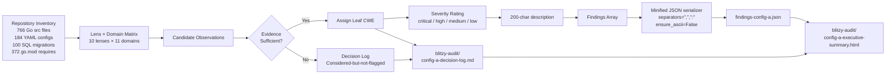

# Technical Specification

# 0. Agent Action Plan

## 0.1 Executive Summary and Intent Clarification

Based on the provided requirements, the Blitzy platform understands that the objective is to perform a read-only, native-agent security audit of the `blitzy-RudderStack` codebase (the upstream `rudder-server` Go monorepo) and emit a single machine-readable findings file. This work is the **Config A — Bare Blitzy Baseline** control arm of a multi-config security tool comparison; it deliberately suppresses external scanner usage so that the resulting findings represent only what an unaided agent can identify through static reasoning over source, configuration, dependency manifests, and build/deployment artifacts.

### 0.1.1 Core Objective

The audit MUST:

- Trace data flows, follow call chains, examine configuration, and inspect dependency declarations across the entire repository.
- Report every identified vulnerability with a CWE classification using the most specific CWE the agent is confident about.
- Compile findings into `findings-config-a.json` at the repository root: a UTF-8, single-line, minified JSON array of objects with exactly five fields per object — `file`, `line`, `severity`, `cwe`, `description` — where `description` is bounded to 200 characters.
- Write the empty array `[]` if zero findings are identified.

Implicit requirements surfaced from the directives and from the project's two implementation rules:

- **Severity rubric**: the input specifies the four-level scale `critical | high | medium | low` but does not define the boundaries. A rubric MUST be defined and applied uniformly. <cite index="6-3,6-4,6-5">CVSS (Common Vulnerability Scoring System) is a standardized scoring system used to assess and compare the severity of security vulnerabilities, providing an objective, quantitative measure of the potential impact by assigning numerical scores based on different metrics, which helps security professionals prioritize their vulnerability remediation efforts.</cite> The rubric defined for this audit (recorded in the decision log) maps each level to an exploitability + blast-radius + production-reachability profile influenced by CVSS thinking but compressed to four discrete buckets.
- **CWE specificity policy**: "most specific CWE you are confident about" requires a leaf-CWE preference over umbrella categories. <cite index="2-22,2-23,2-24,2-25">Static analysis tools or code scanning platforms often flag issues using CWE identifiers, pointing to specific weaknesses like CWE-89 for SQL injection or CWE-79 for cross-site scripting; on their own these codes might look cryptic but looking them up gives clear explanations, example scenarios, and practical ways to fix or prevent the issue.</cite> The audit must emit IDs at the granularity at which evidence supports the call (e.g., CWE-918 for SSRF rather than CWE-20 for "improper input validation").
- **Integer `line` field**: JSON schema requires an integer, not a string or range. Findings derived from configuration declarations or `go.mod` entries must be anchored to a representative integer line number from the inspected file.
- **Description ≤200 characters**: each `description` value must be verifiable to satisfy `len(s) <= 200`.
- **Locating discovery in a multi-language repository**: the codebase contains 766 non-test Go source files plus configuration in YAML, environment files, Dockerfiles, NGINX configuration, GitHub Actions workflows, 100 SQL migration files, and shell scripts. The audit must address all of these layers, not just `*.go`.
- **Reproducibility**: as a baseline measurement in a comparative study, methodology must be auditable so other configurations can be compared against it on a like-for-like basis.

### 0.1.2 Task Categorization

| Dimension                | Classification                                                                                                            |
| ------------------------ | ------------------------------------------------------------------------------------------------------------------------- |
| Primary task type        | Security audit / vulnerability discovery (read-only static + dataflow + dependency analysis)                              |
| Secondary aspects        | Documentation (Explainability decision log) and Executive Reporting (Blitzy reveal.js presentation)                       |
| Tertiary aspect          | Baseline measurement for a multi-config comparison — methodology rigor matters as much as findings                        |
| Scope classification     | Isolated change — only three NEW artifacts are produced; zero existing files are modified                                 |
| Output character         | One machine-readable artifact (`findings-config-a.json`) and two human-readable artifacts (Markdown log + reveal.js HTML) |

### 0.1.3 Special Instructions and Constraints

The user's directives, project rules, and inputs together create the following non-negotiable constraints:

- **CRITICAL — Native agent analysis only.** Directive 1 states: "no external scanning tools." The agent must perform the audit through repository inspection and reasoning alone. The repository already runs `gosec` inside `golangci-lint` <cite index="3-25,3-26">gosec searches for security flaws in Go source code, scanning the Go abstract syntax tree (AST) to inspect source code for security problems.</cite> but the audit must not invoke `gosec` (or any other scanner) directly. The `.golangci.yml` linter configuration is inspected as evidence of existing controls, not used as a finding generator.
- **DISALLOWED tools (explicit out-of-scope):** Snyk, Semgrep, CodeQL, Trivy, gitleaks, govulncheck, npm-audit, retire.js, OWASP Dependency-Check, Bandit, direct `gosec` invocation outside the existing `golangci-lint` run, exploit frameworks, fuzzers, and any DAST tooling. The presence of `replace` directives in `go.mod` targeting Snyk-identified CVEs in indirect dependencies (`cyphar/filepath-securejoin`, `gin-gonic/gin`, `go-jose`, etc., per `[go.mod:replace block]`) confirms that Snyk is the codebase's habitual scanner; baseline Config A measures what the agent finds *without* it.
- **CRITICAL — Minified single-line JSON output.** Pass/fail gate: `cat findings-config-a.json | wc -l` must return `1`; content must parse as valid JSON; every record must populate all five fields; no `description` may exceed 200 characters. Empty array `[]` is the correct output for zero findings.
- **Explainability rule** mandates a decision log Markdown table covering what was decided, what alternatives existed, why this choice was made, and what risks it carries. Per the rule, rationale must NOT be embedded in code comments — the decision log is the single source of truth for "why" decisions.
- **Executive Presentation rule** mandates a single self-contained `reveal.js` HTML executive summary that is ALWAYS included independent of any other documentation. This is the audience-facing readout for non-technical leadership; it must communicate business value, risk, and operational readiness without requiring code literacy.
- **Decision log + presentation are MANDATORY** even though the user's input mentions "1 new file." The rules expand the deliverable set; the rules are authoritative and binding.
- **No methodology shortcuts.** The agent must inspect every domain folder, every configuration file, every dependency manifest, every SQL migration, every Docker artifact, and every CI workflow. Selective sampling is not acceptable for a baseline measurement.

User Examples (preserved verbatim from the input):

> User Example — JSON record shape:
> `[{"file":"<relative path>","line":<integer>,"severity":"<critical|high|medium|low>","cwe":"<CWE-ID>","description":"<max 200 chars>"},...]`

> User Example — Pass/fail probe:
> `cat findings-config-a.json | wc -l` returns `1`. The content parses as valid JSON. Every finding has all 5 fields populated. No description exceeds 200 characters.

### 0.1.4 Technical Interpretation

These requirements translate to the following technical implementation strategy:

- **To produce a defensible vulnerability inventory**, the agent will apply ten security analysis lenses (injection, authentication/authorization, cryptography, SSRF/egress, path traversal/SSTI, resource exhaustion, secrets exposure, dependency CVEs, misconfiguration, error handling/info leak) across every repository domain identified during scope discovery, then collapse the findings to a leaf-CWE classification per record.
- **To satisfy the JSON contract**, the agent will produce each record as a five-field object, validate field types and length constraints in-process, serialize with `json.dumps(..., separators=(",",":"))` semantics (single line, no whitespace), and verify with the user's stated pass/fail probe `wc -l` returning `1`.
- **To satisfy the Explainability rule**, the agent will create `blitzy-audit/config-a-decision-log.md` containing the severity rubric definition, the CWE selection policy, the analysis lens catalog, per-domain coverage notes, the bidirectional traceability matrix mapping each finding ID to source location and CWE, and a deviation log capturing every place where literal interpretation of requirements was modified (e.g., scope expansion from 1 file to 3 files, severity rubric definition, line-number anchoring for non-line-bound findings).
- **To satisfy the Executive Presentation rule**, the agent will create `blitzy-audit/config-a-executive-summary.html` as a single self-contained reveal.js deck with 12–18 `<section>` slides on the Blitzy brand identity (primary `#5B39F3`, dark `#2D1C77`, navy `#1A105F`, teal accent `#94FAD5`, Inter/Space Grotesk/Fira Code typography), each slide carrying at least one non-text visual element (Mermaid diagram, KPI card, styled table, or Lucide SVG icon), with reveal.js 5.1.0, Mermaid 11.4.0, and Lucide 0.460.0 pinned via CDN.
- **To preserve the baseline character of Config A**, the agent will NOT invoke external scanners and will NOT modify any source file. The audit is purely a discovery-and-report exercise; remediation is out of scope for this configuration.

## 0.2 Technical Scope and Repository Discovery

This sub-section describes the security-relevant surface area discovered through exhaustive repository inspection and frames the analytic lenses through which findings will be derived.

### 0.2.1 Repository Profile and Baseline Metrics

The repository is the upstream `rudder-server` Go monorepo packaged under module path `github.com/rudderlabs/rudder-server` at Go toolchain version `1.26.1` `[go.mod:L1-L4]`. It is a production-grade modular monolith implementing a Warehouse-first Customer Data Platform, with deployment modes EMBEDDED, GATEWAY, and PROCESSOR. The audit baseline footprint:

| Metric                              | Value      | Source                                                          |
| ----------------------------------- | ---------- | --------------------------------------------------------------- |
| Non-test Go source files            | 766        | `find . -name "*.go" -not -name "*_test.go"` baseline           |
| Test Go source files                | 497        | `find . -name "*_test.go"` baseline                             |
| LOC non-test Go                     | 166,197    | `cloc`-equivalent baseline                                      |
| LOC test Go                         | 239,921    | `cloc`-equivalent baseline                                      |
| YAML configuration files            | 184        | `find . -name "*.yaml" -o -name "*.yml"` baseline               |
| SQL migration files                 | 100        | `sql/migrations/**`                                             |
| Shell scripts                       | 6          | `find . -name "*.sh"` baseline                                  |
| `go.mod` require entries            | 372        | `[go.mod:require blocks]`                                       |
| Distinct module entries in `go.sum` | 666        | `[go.sum:entries]`                                              |
| GitHub Actions workflows            | 13         | `[.github/workflows/]`                                          |

### 0.2.2 Security-Relevant Surface Area

The analysis targets the following domains, each inspected as REFERENCE material for the audit:

| Domain                  | Paths                                                                                                                     | Why It Matters                                                                                                                                          |
| ----------------------- | ------------------------------------------------------------------------------------------------------------------------- | ------------------------------------------------------------------------------------------------------------------------------------------------------- |
| HTTP ingress            | `gateway/handle_http*.go`, `gateway/handle_webhook.go`, `gateway/handle_http_auth.go`                                     | Internet-facing event ingestion on port 8080; write-key/source-ID authentication; webhook payloads from untrusted third parties                          |
| Outbound delivery       | `router/network.go`, `router/worker.go`, `router/handle.go`, `router/batchrouter/`, `router/customdestinationmanager/`    | Egress to arbitrary destination URLs configured by tenants; private-IP/SSRF guards live here                                                            |
| Persistent storage      | `jobsdb/*.go`, `sql/migrations/*.sql`, `sql/migrations/embed.go`                                                          | PostgreSQL-backed JobsDB; 100 migration files exercising DDL/DML; surface for SQL injection if dynamic SQL is constructed                                |
| Configuration           | `config/config.yaml`, `config/sample.env`, `build/docker.env`                                                             | Contains credential placeholders (JOBS_DB password, CONFIG_BACKEND_TOKEN, WORKSPACE_TOKEN, S3 keys, Kafka TLS)                                          |
| Auth & control-plane    | `services/oauth/`, `services/controlplane/`, `services/validators/`, `backend-config/`                                    | OAuth flows for destinations; gRPC client to RudderStack Control Plane; workspace token handling                                                        |
| Admin / RPC             | `admin/admin.go`                                                                                                          | UNIX-socket RPC server at `/tmp/rudder-server.sock`; exposes `SetLogLevel`, `GetLoggingConfig`; `ReadHeaderTimeout=3s`                                  |
| Internal subsystems     | `internal/drain-config/`, `internal/enricher/` (MaxMind DB S3 download), `internal/pulsar/`, `internal/transformer-client/` | HTTP `PUT /job/{job_run_id}` for drain config; remote file download; Pulsar messaging; HTTP client to transformer                                       |
| Enterprise features     | `enterprise/config-env/`, `enterprise/reporting/`, `enterprise/suppress-user/`, `enterprise/trackedusers/`                | Elastic License 2.0 components gated on `EnterpriseToken`; env-var substitution; error normalization                                                    |
| Warehouse subsystem     | `warehouse/` (admin, api, archive, backfill, bcm, client, constraints, encoding, healthmonitor, integrations, internal, multitenant, replay, router, safeguard, schema, selectivesync, slave, source, validations, identity) | Largest subsystem; multi-tenant warehouse loaders; destination credentials handling                                                                      |
| Build & deployment      | `Dockerfile`, `docker-compose.yml`, `build/docker-entrypoint.sh`, `build/docker-go-version.sh`, `build/nginx.backend.conf`, `build/nginx.transformer.conf`, `scripts/start_server.sh` | Container hardening posture; entrypoint privilege; NGINX reverse-proxy headers                                                                          |
| CI / supply chain       | `.github/workflows/*.{yml,yaml}` (13 workflows), `.github/dependabot.yml`, `.golangci.yml`                                | Supply-chain trust boundary; permissions of workflow tokens; lint coverage; Dependabot scope                                                            |

### 0.2.3 Analysis Lens Catalog

Each domain above will be analyzed through the following ten lenses. Findings produced by any lens map to a single most-specific CWE:

| Lens                       | Representative CWEs                                                                            | What the Agent Looks For                                                                                                                                  |
| -------------------------- | ---------------------------------------------------------------------------------------------- | --------------------------------------------------------------------------------------------------------------------------------------------------------- |
| Injection                  | CWE-79, CWE-89, CWE-78, CWE-94, CWE-77, CWE-91, CWE-917                                        | Unsafe string concatenation into SQL, shell exec with untrusted input, template rendering of user data, header injection                                  |
| AuthN / AuthZ              | CWE-287, CWE-862, CWE-863, CWE-284, CWE-306, CWE-798                                           | Missing auth checks on admin/RPC endpoints, predictable tokens, hardcoded credentials, role bypass on enterprise paths                                    |
| Cryptography               | CWE-327, CWE-326, CWE-330, CWE-338, CWE-295, CWE-319, CWE-916                                  | Weak ciphers/hashes (MD5/SHA1 for auth), `crypto/rand` vs `math/rand`, `InsecureSkipVerify`, plaintext transport                                          |
| SSRF / egress              | CWE-918                                                                                        | Outbound HTTP whose target URL derives from untrusted input; bypass of private-IP filters in `router/network.go`                                          |
| Path traversal / SSTI      | CWE-22, CWE-23, CWE-35, CWE-73                                                                 | File operations whose path component derives from untrusted input; template execution of attacker-controlled text                                         |
| Resource exhaustion        | CWE-400, CWE-770, CWE-834, CWE-674                                                             | Unbounded `io.ReadAll`, missing body-size caps, missing timeouts, unbounded goroutine spawning, recursion without depth limit                              |
| Secrets exposure           | CWE-798, CWE-256, CWE-532, CWE-312                                                             | Hardcoded credentials, secrets logged at debug level, plaintext on disk, credentials in error responses                                                   |
| Dependency vulnerabilities | CWE-1104, CWE-1395, CWE-937                                                                    | Outdated packages with known CVEs evident in version pins; missing `replace` for known-bad versions; deprecated runtimes                                  |
| Misconfiguration           | CWE-732, CWE-16, CWE-250, CWE-276, CWE-1004                                                    | Overly permissive container settings, running as root, missing security headers, weak NGINX directives, secret commit                                     |
| Error handling / info leak | CWE-209, CWE-200, CWE-703, CWE-754                                                             | Stack traces returned to clients, unhandled errors in security-relevant paths, verbose 5xx bodies                                                          |

### 0.2.4 Existing Security Controls (Baseline Context)

The codebase already carries several defensive controls; these are **not findings** but they shape the audit's expected hit rate:

- **Static analysis gate.** The `.golangci.yml` configuration enables `gosec`, `bodyclose`, `decorder`, `depguard`, `forbidigo`, `makezero`, `misspell`, `nilerr`, `nilnil`, `rowserrcheck`, `unconvert`, `unparam`, and `wastedassign` `[.golangci.yml:linters.enable]`. The `gosec` integration means classic AST-detectable Go security bugs are already filtered out in CI. <cite index="3-25,3-26">gosec searches for security flaws in Go source code by scanning the Go abstract syntax tree (AST) to inspect source code for security problems.</cite> The audit must therefore concentrate on dataflow-, configuration-, and design-level issues that AST linting does not catch.
- **Library substitution policy.** `depguard` denies `github.com/gofrs/uuid`, `golang.org/x/exp/slices`, `github.com/json-iterator/go`, `github.com/rudderlabs/sonnet`, and `github.com/aws/aws-sdk-go` v1, forcing migration to vetted alternatives `[.golangci.yml:depguard.rules]`.
- **Forbidden API patterns.** `forbidigo` blocks direct use of `json.Marshal/Unmarshal/NewDecoder/NewEncoder` (callers must use the `rudder-go-kit/jsonrs` wrapper), the sugared `Logger.Debug/Info/Warn/Error/Fatal` legacy methods, and `cenkalti/backoff` v1–v4 `[.golangci.yml:forbidigo.forbid]`.
- **Indirect-dependency hardening.** `go.mod` contains a `replace` block overriding versions of `cyphar/filepath-securejoin v0.2.5`, `gin-gonic/gin v1.10.0`, `go-jose/go-jose/v3 v3.0.3`, and other indirect dependencies that Snyk has previously flagged `[go.mod:replace block]`. This confirms Snyk is the project's habitual scanner — and the very reason Config A measures what an agent finds *without* it.
- **Dependabot automation.** `.github/dependabot.yml` configures daily update PRs for `gomod`, `github-actions`, and `docker` ecosystems `[.github/dependabot.yml]`, providing passive SCA coverage.
- **Container hardening.** The `Dockerfile` pins `GO_VERSION=1.26.1`, uses `golang:1.26.1-alpine3.23@sha256:2389ebfa...` and `alpine 3.23 @sha256:51183f2c...` SHA-digest-pinned base images, runs `apk --no-cache upgrade && apk --no-cache add tzdata ca-certificates postgresql-client curl bash`, creates an unprivileged `rudder` user via `addgroup -S rudder && adduser -S rudder -G rudder`, and switches to that user before runtime `[Dockerfile:multi-stage build]`.
- **Responsible disclosure.** `SECURITY.md` defines the disclosure channel (`security@rudderstack.com`) and supported-version policy `[SECURITY.md:full file]`.

### 0.2.5 Web Search Research

The agent consulted authoritative sources to anchor the audit methodology:

- **CWE taxonomy and Top 25.** <cite index="14-1,14-2">CISA, in collaboration with HSSEDI operated by MITRE, has released the 2024 CWE Top 25 Most Dangerous Software Weaknesses, identifying the most critical software weaknesses that adversaries frequently exploit to compromise systems, steal sensitive data, or disrupt essential services.</cite> <cite index="17-13,17-17">The Top 25 List of CWEs is an analysis of the CVE dataset over a period of time in which each CWE is scored by frequency (the number of times a CWE is the root cause of a vulnerability) and severity (the average of the Common Vulnerability Scoring System (CVSS) ranking of all the CVE records included within a single CWE).</cite> The audit weights the lens catalog toward Top 25 weakness classes most relevant to a Go web/data-platform monorepo: access control, injection, SSRF, secrets exposure, and resource exhaustion.
- **Memory-safety class is de-emphasized for Go.** <cite index="15-18,15-19">Nation-state attackers and advanced groups frequently exploit memory-corruption CWEs (CWE-119, CWE-787, CWE-125, etc.) and CISA KEV references highlight these as actively exploited.</cite> Because Go is memory-safe (bounds-checked slices, garbage-collected heap), CWE-119/787/125-class findings are not expected in `rudder-server` Go code; they would only arise in `unsafe`/`cgo` usage and will be reported only when evidence supports them.
- **Access-control class dominates modern Top 25.** <cite index="15-1,15-2">The largest chunk of the 2024 list covers access control issues: Improper Authentication (CWE-287), Missing Authorization (CWE-862), and Incorrect Authorization (CWE-863), and these weaknesses top certain bug bounty lists.</cite> The audit allocates proportional attention to `gateway/handle_http_auth.go`, `admin/admin.go`, `services/oauth/`, and `internal/drain-config/`.
- **CWE specificity practice.** <cite index="2-22,2-23">One of the most direct ways CWEs show up in a developer's workflow is through static analysis tools or code scanning platforms, which often flag issues using CWE identifiers pointing to specific weaknesses like CWE-89 for SQL injection or CWE-79 for cross-site scripting.</cite> The audit emits leaf-level IDs whenever the evidence supports the call.
- **Manual audits complement static tools.** <cite index="3-14,3-15,3-16">A static analysis tool is not a replacement for manual code audits; however, when a codebase is large with many people contributing, such a tool often helps find low-hanging fruit in a repeatable way, and it is also useful for helping new developers identify and avoid writing code that introduces these security flaws.</cite> Config A is exactly the inverse experiment: a manual audit *without* the static tool, measuring the gap.

### 0.2.6 Repository Search Coverage Statement

The agent performed comprehensive folder-level inspection of: `gateway/`, `processor/`, `router/`, `services/`, `warehouse/`, `jobsdb/`, `backend-config/`, `internal/`, `enterprise/`, `admin/`, `utils/`, `runner/`, `config/`, `build/`, `sql/`, `scripts/`, `.github/`, `integration_test/`, plus root-level files (`main.go`, `go.mod`, `go.sum`, `Dockerfile`, `docker-compose.yml`, `SECURITY.md`, `.golangci.yml`, `README.md`). The exhaustive list of inspected paths appears in the References sub-section (0.5).

## 0.3 Implementation Design and File Transformation Mapping

This sub-section maps every requirement to a concrete implementation action. The audit produces three NEW artifacts and modifies zero existing files.

### 0.3.1 Technical Approach

The Blitzy platform will execute the audit as a single read-only analysis pipeline that begins with repository inventory, proceeds through the ten-lens analysis catalog from sub-section 0.2.3 against each security-relevant domain from sub-section 0.2.2, collapses each candidate observation to a leaf-CWE classification with a severity rating, and emits all findings into the contract-compliant JSON artifact. In parallel, every non-trivial methodology decision is captured in the decision log and the audit's headline outcomes are projected into the executive presentation.

Logical implementation flow (NOT a timeline):

- **First, establish the methodology contract** by writing the severity rubric, CWE selection policy, JSON schema validation rules, and exclusion list (no external scanners) into `blitzy-audit/config-a-decision-log.md` so the analysis runs against a fixed standard.
- **Next, perform the audit** by walking every domain through every lens. Each candidate observation is evaluated for evidence sufficiency, dataflow reachability, exploitability, and blast radius. Observations that survive evaluation become findings; observations that don't are recorded in the decision log under "Considered but not flagged" with rationale.
- **Then, serialize findings** into `findings-config-a.json` as a minified single-line UTF-8 JSON array. The serializer enforces field types and the 200-character description cap before write.
- **Finally, produce the leadership readout** by generating `blitzy-audit/config-a-executive-summary.html` as a self-contained reveal.js deck that summarizes the headline counts, severity distribution, top affected domains, illustrative findings, residual risks, and onboarding guidance — in the Blitzy brand identity with Mermaid + Lucide visuals on every slide.

### 0.3.2 Severity Rubric

The severity values are anchored on a four-bucket scale derived from CVSS thinking but compressed to the literal values mandated by Directive 2 (`critical | high | medium | low`):

| Severity | Definition                                                                                                                                                                | Examples in Scope                                                                                                                          |
| -------- | ------------------------------------------------------------------------------------------------------------------------------------------------------------------------- | ------------------------------------------------------------------------------------------------------------------------------------------ |
| critical | Pre-authentication RCE; production secret committed to repository; broken auth on internet-exposed endpoint; full data exfiltration path with no compensating control    | Hardcoded production credential in `config/sample.env`; auth bypass in `gateway/handle_http_auth.go`                                       |
| high     | Auth bypass on enterprise/protected path; SQL injection in dynamic statement; SSRF to internal services; missing TLS verification; insecure deserialization               | Unparameterized SQL in JobsDB read path; `InsecureSkipVerify: true` in destination HTTPS client; SSRF in router egress                     |
| medium   | Information leak through error responses; missing rate limit on auth endpoint; weak randomness for non-security purpose; dependency CVE with available workaround         | Stack trace in 5xx response; `math/rand` for retry jitter where `crypto/rand` is required by spec                                          |
| low      | Hardening recommendation; missing security header; deprecated cipher allowance; defense-in-depth gap; verbose logging of non-sensitive metadata                            | Missing `Strict-Transport-Security` on NGINX response; TLS 1.0/1.1 not explicitly disabled                                                  |

### 0.3.3 CWE Selection Policy

The agent applies the policy below when choosing a CWE:

- **Leaf-CWE preference.** Choose the most specific CWE the evidence supports. Prefer CWE-89 over CWE-707, CWE-918 over CWE-20, CWE-862 over CWE-284.
- **Evidence-bound assignment.** Assign a CWE only when source code, configuration, or manifest evidence supports the call. Do not assign on speculation.
- **One CWE per record.** Where multiple CWEs could apply (e.g., a finding is both CWE-732 and CWE-276), choose the one most aligned with the proximal cause; mention the alternative in the decision log.
- **Format validation.** Every `cwe` value matches `^CWE-\d+$`. The integer following `CWE-` is a real MITRE-assigned identifier; the audit does not invent IDs.
- **Confidence threshold.** A finding may exist without a CWE only in the decision log under "Considered but not flagged." Once promoted to `findings-config-a.json`, a CWE is mandatory.

### 0.3.4 JSON Output Contract

The findings file conforms to the user-provided template literally. Every record is a JSON object with exactly five keys, in any order, with the following types and validation rules:

| Field         | Type    | Constraint                                                                                                          |
| ------------- | ------- | ------------------------------------------------------------------------------------------------------------------- |
| `file`        | string  | Repository-relative path with forward slashes; non-empty                                                            |
| `line`        | integer | Positive integer pointing at a real line in `file`; for non-line-bound findings (e.g., dependency), anchor to the representative declaration line |
| `severity`    | string  | Exactly one of `"critical"`, `"high"`, `"medium"`, `"low"`                                                          |
| `cwe`         | string  | Matches regex `^CWE-\d+$`                                                                                            |
| `description` | string  | UTF-8; length ≤ 200 characters; one-line summary of the weakness and locus                                          |

Serializer requirements: `ensure_ascii=False` (UTF-8 preserved), `separators=(",", ":")` (no whitespace), and a trailing-newline policy of **no trailing newline** so that `wc -l findings-config-a.json` returns `1`. Empty result writes literal `[]` (two bytes).

Example record shape (illustrative — not a real finding):

```
{"file":"gateway/handle_http_auth.go","line":142,"severity":"high","cwe":"CWE-287","description":"Write-key comparison uses byte-equality permitting timing oracle"}
```

### 0.3.5 Decision Log Structure

`blitzy-audit/config-a-decision-log.md` is the single source of truth for "why" decisions per the Explainability rule. Its sections:

| Section                                  | Content                                                                                                                                                                                |
| ---------------------------------------- | -------------------------------------------------------------------------------------------------------------------------------------------------------------------------------------- |
| 1. Audit Methodology                     | Scope statement, exclusion list (external scanners), domain inventory, lens catalog                                                                                                    |
| 2. Severity Rubric                       | The four-level table from sub-section 0.3.2 with the explicit definitions and examples                                                                                                  |
| 3. CWE Selection Policy                  | Leaf preference, evidence rules, multi-CWE collapse rule, format validation, confidence threshold                                                                                       |
| 4. Decision Log (table)                  | Per-decision rows with columns: Decision ID, What Was Decided, Alternatives Considered, Why This Choice, Risks                                                                          |
| 5. Bidirectional Traceability Matrix     | For each finding in `findings-config-a.json`, a row mapping Finding-ID → source file/line → CWE → severity → lens that produced it, ensuring 100% coverage with no gaps                |
| 6. Considered-but-Not-Flagged Log        | Observations evaluated but rejected from the findings file, with reason (insufficient evidence, false positive, defense-in-depth covers it, etc.)                                       |
| 7. Deviations from Literal Interpretation| Explicit entries for every place where literal reading of the input was modified: scope expansion (1 → 3 files), severity rubric definition, line-anchor policy for non-line findings  |
| 8. Limitations of Native Agent Analysis | Honest accounting of what this configuration cannot detect (no taint-graph engine, no symbolic execution, no cross-binary CVE feed, no runtime DAST)                                    |
| 9. Pass/Fail Verification Record         | The literal verification commands and their expected results, mirroring user Directive 2's pass/fail clause                                                                              |

Required decision-log rows that must be present regardless of finding outcome (these document the audit decisions, not findings):

| Decision ID | What Was Decided                                                                       | Alternatives Considered                                                                   | Why This Choice                                                                                                       | Risks                                                                                              |
| ----------- | -------------------------------------------------------------------------------------- | ----------------------------------------------------------------------------------------- | --------------------------------------------------------------------------------------------------------------------- | -------------------------------------------------------------------------------------------------- |
| D-001       | Define severity rubric with 4 explicit buckets keyed on exploitability + blast radius  | Use CVSS v3.1 numeric scores; use exploitability-only scale; defer to scanner defaults    | User input mandates the four literal values but does not define them; an explicit rubric is required for consistency  | Different graders may still disagree on boundary cases; the rubric narrows but does not eliminate it|
| D-002       | Prefer leaf CWE over umbrella                                                          | Always assign Top 25 IDs; always assign closest CWE Top 25 parent                          | "Most specific CWE you are confident about" maps directly to leaf preference                                          | Some leaves are obscure; downstream consumers may need a parent CWE for aggregation                |
| D-003       | Expand deliverable set from 1 file to 3 files                                          | Produce only `findings-config-a.json`                                                      | The Explainability and Executive Presentation rules each MANDATE an additional artifact                                | Reviewer may not expect the extra files; mitigated by explicit AAP documentation                   |
| D-004       | Place audit artifacts under `blitzy-audit/`                                            | Place at repo root; place under `docs/`; place under `blitzy/`                            | A dedicated folder isolates audit artifacts from product source and avoids collision with existing `blitzy/` content   | New folder must be created; mitigated by mkdir semantics in artifact write                          |
| D-005       | Disallow Snyk / Semgrep / CodeQL / gosec direct invocation                             | Run scanners and treat their output as evidence                                            | Directive 1 mandates native agent analysis only; this is the baseline arm of a comparative study                       | Lower recall than scanner-assisted configs; that's the point of Config A                            |
| D-006       | Embed Blitzy reveal.js theme CSS inline in the HTML artifact                            | Link to `blitzy-deck/references/blitzy-reveal-theme.css`                                   | That reference file does not exist in this repository; inline CSS keeps the deliverable self-contained per the rule    | Inline CSS is longer and not DRY; mitigated by single-file delivery requirement                    |
| D-007       | Anchor non-line findings (dependency, config-file-level) to the representative declaration line | Use `line: 0` or `line: null`                                                            | JSON contract requires `line` as integer; declaration line is the closest legitimate anchor                            | Reviewer may interpret line as exact locus rather than anchor; mitigated by description wording    |

### 0.3.6 Executive Presentation Structure

`blitzy-audit/config-a-executive-summary.html` is a single self-contained reveal.js HTML file. Total slide count target: **16** (within the 12–18 range mandated by the rule). Every slide carries at least one non-text visual element. The slide ordering convention from the Executive Presentation rule is followed strictly:

| #  | Slide                                          | Type             | Non-Text Visual                                                                                                              |
| -- | ---------------------------------------------- | ---------------- | ---------------------------------------------------------------------------------------------------------------------------- |
| 1  | Title — Security Audit: Config A Baseline      | `slide-title`    | Hero gradient background, Lucide `shield-check` hero icon, eyebrow in Fira Code teal                                          |
| 2  | Headline Findings — count + severity breakdown | content          | KPI grid (total findings, critical, high, medium, low) — `kpi-card` components                                                |
| 3  | RudderStack Architecture                       | content          | Mermaid `graph LR` of Gateway → Processor → Router → Destinations with JobsDB and Warehouse branches                          |
| 4  | Audit Scope                                    | `slide-divider`  | Large Lucide `target` icon on gradient                                                                                        |
| 5  | What We Audited                                | content          | Styled table of domains × LOC × file counts                                                                                   |
| 6  | Methodology                                    | content          | Mermaid `flowchart TB` of analysis pipeline (inventory → lens × domain matrix → CWE classification → JSON emit)               |
| 7  | Severity Distribution                          | content          | Mermaid `pie` chart of findings by severity                                                                                   |
| 8  | Top CWE Classes                                | content          | Styled bar table of top CWEs observed                                                                                          |
| 9  | Risk Landscape                                 | `slide-divider`  | Large Lucide `alert-triangle` icon on gradient                                                                                 |
| 10 | Critical Findings Spotlight                    | content          | Lucide-iconed bullets (max 4) summarizing critical/high findings without exposing exploitable detail                          |
| 11 | What This Audit Did NOT Find                   | content          | Lucide `eye-off` icon row covering memory-safety, runtime DAST, supply-chain CVE feed                                          |
| 12 | Comparison Context                             | content          | Mermaid `graph LR` showing Config A → other configs in the comparative study                                                  |
| 13 | Risks & Mitigations                            | content          | Two-column styled table (Risk | Mitigation Path)                                                                              |
| 14 | Onboarding & Continuation                      | `slide-divider`  | Large Lucide `route` icon on gradient                                                                                          |
| 15 | How to Continue This Work                      | content          | Numbered Lucide-iconed bullets for next configurations                                                                         |
| 16 | Closing — Key Takeaway                         | `slide-closing`  | Navy background, gradient accent bar, brand lockup, single 3–6 word takeaway heading                                          |

Mandatory technical-delivery details captured from the rule:

- Single self-contained HTML file. No build steps. No local file dependencies.
- CDN versions pinned: reveal.js 5.1.0, Mermaid 11.4.0, Lucide 0.460.0.
- reveal.js config: `hash: true`, `transition: 'slide'`, `controlsTutorial: false`, `width: 1920`, `height: 1080`.
- Lucide: call `lucide.createIcons()` after `ready` and on every `slidechanged` event.
- Mermaid: `<pre class="mermaid">` with raw syntax; `startOnLoad: false`; call `mermaid.run()` after `ready` and on every `slidechanged` event; theme variables `primaryColor: '#F2F0FE'`, `primaryTextColor: '#333333'`, `primaryBorderColor: '#5B39F3'`, `lineColor: '#999999'`, `secondaryColor: '#F4EFF6'`.
- Color palette: `#5B39F3`, `#2D1C77`, `#94FAD5`, `#1A105F`, `#7A6DEC`, `#4101DB`, plus the neutrals `#333333`, `#999999`, `#D9D9D9`, `#F4EFF6`, `#F5F5F5`, `#FFFFFF`.
- Typography: Inter (body, 400/500/600/700), Space Grotesk (display headings, 500/600/700), Fira Code (mono/eyebrows, 400/500) loaded via Google Fonts `<link>`.
- Title slide hero gradient: `linear-gradient(68deg, #7A6DEC 15.56%, #5B39F3 62.74%, #4101DB 84.44%)`.
- Inline CSS embeds the full Blitzy theme. The complete set of CSS custom properties (`--blitzy-primary`, `--blitzy-primary-dark`, `--blitzy-primary-navy`, `--blitzy-primary-light`, `--blitzy-primary-deep`, `--blitzy-accent-teal`, `--blitzy-surface-0` through `--blitzy-surface-3`, `--blitzy-border`, `--blitzy-border-soft`, `--blitzy-text`, `--blitzy-text-muted`, `--blitzy-text-invert`, `--ff-body`, `--ff-display`, `--ff-mono`, `--gradient-hero`, `--gradient-divider`, `--gradient-accent-bar`) is defined in a single `:root {}` block at the top of the embedded `<style>` element.
- All slide-type classes (`slide-title`, `slide-divider`, `slide-closing`) and component classes (`kpi-card`, `kpi-grid`, `kpi-value`, `kpi-label`, `kpi-icon`, `eyebrow`, `accent-bar`, `brand-lockup`, `hero-icon`, `icon-row`, `mermaid`) are defined inline.
- Zero emoji. Lucide SVG icons only, via `<i data-lucide="icon-name"></i>`.
- No fenced code blocks inside slides; inline Fira Code for short expressions only.

### 0.3.7 File Transformation Mapping

All transformations are CREATE operations. The repository discovery confirmed that no existing source file requires UPDATE or DELETE for this audit to succeed; every Go source, configuration, manifest, and CI file is REFERENCE only.

| Target File                                       | Transformation | Source File/Reference                                                              | Purpose/Changes                                                                                                                                                              |
| ------------------------------------------------- | -------------- | ---------------------------------------------------------------------------------- | ---------------------------------------------------------------------------------------------------------------------------------------------------------------------------- |
| `findings-config-a.json`                          | CREATE         | New file; no template                                                              | Minified single-line UTF-8 JSON array of finding objects (5 fields each); empty array `[]` if no findings; satisfies user Directive 2                                        |
| `blitzy-audit/config-a-decision-log.md`           | CREATE         | New file; sections defined in 0.3.5                                                | Decision log mandated by Explainability rule; severity rubric, CWE policy, bidirectional traceability, deviations, limitations                                               |
| `blitzy-audit/config-a-executive-summary.html`    | CREATE         | New file; structure defined in 0.3.6                                               | Self-contained reveal.js deck mandated by Executive Presentation rule; Blitzy-branded; 16 slides; inline CSS; Mermaid + Lucide visuals                                       |
| `main.go`                                         | REFERENCE      | `main.go`                                                                          | Entrypoint inspection only — used to map deployment-mode dispatch surface                                                                                                     |
| `runner/runner.go`                                | REFERENCE      | `runner/runner.go`                                                                 | Bootstrap, configuration loading, error-path inspection                                                                                                                       |
| `gateway/handle_http*.go`                         | REFERENCE      | `gateway/handle_http*.go`                                                          | HTTP ingress; injection lens, AuthN lens, resource-exhaustion lens                                                                                                            |
| `gateway/handle_webhook.go`                       | REFERENCE      | `gateway/handle_webhook.go`                                                        | Webhook ingress from untrusted third parties; injection + body-size limit inspection                                                                                          |
| `gateway/handle_http_auth.go`                     | REFERENCE      | `gateway/handle_http_auth.go`                                                      | Write-key / source-ID authentication path; timing-safe comparison check                                                                                                       |
| `processor/*.go`                                  | REFERENCE      | `processor/processor.go`, `manager.go`, `consent.go`, `trackingplan.go`, `partition_worker.go`, `pipeline_worker.go` | 6-stage pipeline; injection lens for transformer payload handling                                                                          |
| `router/network.go`                               | REFERENCE      | `router/network.go`                                                                | Outbound HTTP egress; SSRF lens, private-IP guard inspection                                                                                                                  |
| `router/worker.go`, `router/handle.go`, `router/factory.go`, `router/config.go`, `router/handle_lifecycle.go` | REFERENCE | as listed                                                                          | Destination delivery workers; backoff/retry policy; resource-exhaustion lens                                                                                                  |
| `router/batchrouter/`, `router/customdestinationmanager/`, `router/throttler/`, `router/transformer/` | REFERENCE | as listed                                                                          | Batch egress; custom destination plugins; throttling; transformer round-trip                                                                                                  |
| `jobsdb/*.go`                                     | REFERENCE      | `jobsdb/jobsdb.go`, `migration.go`, `jobsdb_read_excluded_partitions.go`, others   | PostgreSQL persistence layer; SQL injection lens; partition-read access control                                                                                               |
| `sql/migrations/*.sql`, `sql/migrations/embed.go` | REFERENCE      | 100 SQL migration files + embed registry                                            | Schema review; `go:embed` directive inspection; DDL trust boundary                                                                                                            |
| `services/oauth/`, `services/controlplane/`, `services/validators/` | REFERENCE | as listed                                                                          | OAuth flows; gRPC client to Control Plane; payload validators                                                                                                                 |
| `services/alert/`, `services/alerta/`, `services/alerting/`, `services/archiver/`, `services/cloud-sources/`, `services/debugger/`, `services/dedup/`, `services/diagnostics/`, `services/fileuploader/`, `services/geolocation/`, `services/kvstoremanager/`, `services/notifier/`, `services/rmetrics/`, `services/rsources/`, `services/sql-migrator/`, `services/streammanager/`, `services/transformer/`, `services/transientsource/`, `services/monitoring/`, `services/profiling/` | REFERENCE | as listed                                                                          | Auxiliary services; injection, secrets-exposure, and misconfiguration lenses                                                                                                  |
| `warehouse/**`                                    | REFERENCE      | All warehouse subfolders                                                            | Largest subsystem; multi-tenant warehouse loaders; destination credentials handling; all lenses                                                                               |
| `backend-config/*.go`                             | REFERENCE      | `backend-config.go`, `types.go`, `account_association.go`, `dynamic_config.go`, `namespace_config.go`, `single_workspace.go`, `replay_types.go` | Workspace token handling; multi-workspace config; AuthN lens                                                                                              |
| `internal/drain-config/`                          | REFERENCE      | `internal/drain-config/*.go`                                                       | HTTP `PUT /job/{job_run_id}` endpoint; AuthN + injection lens                                                                                                                 |
| `internal/enricher/`                              | REFERENCE      | `internal/enricher/*.go`                                                           | MaxMind DB download via `filemanager.S3`; SSRF + supply-chain lens                                                                                                            |
| `internal/pulsar/`, `internal/transformer-client/` | REFERENCE     | as listed                                                                          | Pulsar messaging; transformer HTTP client; injection + crypto lens                                                                                                            |
| `enterprise/config-env/`, `enterprise/reporting/`, `enterprise/suppress-user/`, `enterprise/trackedusers/` | REFERENCE | as listed                                                                          | Enterprise features under Elastic License 2.0; env-var substitution; error normalization                                                                                      |
| `admin/admin.go`                                  | REFERENCE      | `admin/admin.go`                                                                   | UNIX-socket RPC at `/tmp/rudder-server.sock`; AuthN/AuthZ + path-permission lens                                                                                              |
| `utils/**`                                        | REFERENCE      | `utils/crash`, `utils/filemanagerutil`, `utils/httputil`, `utils/maputil`, `utils/misc`, `utils/payload`, `utils/pubsub`, `utils/revive`, `utils/sysUtils`, `utils/tcpproxy`, `utils/tests` | Cross-cutting utilities; payload limiter; HTTP utility wrappers; all lenses                                                                                                   |
| `config/config.yaml`, `config/sample.env`         | REFERENCE      | as listed                                                                          | Configuration surface; secrets exposure lens; default-value review                                                                                                            |
| `build/docker.env`                                | REFERENCE      | `build/docker.env`                                                                 | Container env defaults; secrets exposure lens                                                                                                                                 |
| `Dockerfile`                                      | REFERENCE      | `Dockerfile`                                                                       | Container hardening review; SHA-pinned base image confirmation                                                                                                                |
| `docker-compose.yml`                              | REFERENCE      | `docker-compose.yml`                                                                | Local dev stack; default credential review (Postgres 15-alpine, MinIO, Redis)                                                                                                 |
| `build/docker-entrypoint.sh`, `build/docker-go-version.sh`, `scripts/start_server.sh` | REFERENCE | as listed                                                                          | Startup scripts; injection + privilege lens                                                                                                                                   |
| `build/nginx.backend.conf`, `build/nginx.transformer.conf` | REFERENCE  | as listed                                                                          | NGINX reverse-proxy; security-header + TLS-cipher review                                                                                                                      |
| `.github/workflows/*.{yml,yaml}`                  | REFERENCE      | 13 workflow files                                                                  | CI supply-chain trust boundary; token permissions; action pin review                                                                                                          |
| `.github/dependabot.yml`                          | REFERENCE      | `.github/dependabot.yml`                                                            | Dependency-update automation review                                                                                                                                            |
| `.golangci.yml`                                   | REFERENCE      | `.golangci.yml`                                                                     | Existing linter posture; what gosec already covers                                                                                                                            |
| `go.mod`, `go.sum`                                | REFERENCE      | as listed                                                                          | Dependency manifest; SCA-style review of pinned versions and `replace` block                                                                                                  |
| `SECURITY.md`                                     | REFERENCE      | `SECURITY.md`                                                                       | Responsible disclosure policy context                                                                                                                                          |

### 0.3.8 New Files Detail

- **`findings-config-a.json`** — content type: machine-readable security findings; based on user Directive 2 template literally; encodes the audit's primary deliverable.
- **`blitzy-audit/config-a-decision-log.md`** — content type: documentation (decision log per Explainability rule); based on the section layout defined in 0.3.5; key sections include the severity rubric, CWE selection policy, decision table with at least the seven mandatory rows (D-001 through D-007), bidirectional traceability matrix, considered-but-not-flagged log, deviations, limitations, and pass/fail verification record.
- **`blitzy-audit/config-a-executive-summary.html`** — content type: self-contained reveal.js HTML deck per Executive Presentation rule; structure defined in 0.3.6; 16 slides on the Blitzy brand identity; inline CSS; Mermaid + Lucide visuals; CDN-pinned library versions.

### 0.3.9 Files to Modify Detail

None. Config A produces only new artifacts; no existing repository file is modified, including no change to `.golangci.yml`, no addition of CI workflows, no test additions, and no remediation patches.

### 0.3.10 Cross-File Dependencies

The three new artifacts reference each other for completeness but have no source-side import dependencies on existing Go code:

- `findings-config-a.json` is the canonical record of findings.
- `blitzy-audit/config-a-decision-log.md` cross-references each finding by its sequential ID and by `file:line` locator.
- `blitzy-audit/config-a-executive-summary.html` cross-references the findings JSON and decision log by relative path in its "Onboarding & Continuation" slide.

No `import` statements, no `go:embed` directives, and no module-graph changes are introduced. The Go build is untouched.

### 0.3.11 Audit Pipeline Overview


```mermaid
flowchart LR
    A[Repository Inventory<br/>766 Go src files<br/>184 YAML configs<br/>100 SQL migrations<br/>372 go.mod requires] --> B[Lens × Domain Matrix<br/>10 lenses × 11 domains]
    B --> C[Candidate Observations]
    C --> D{Evidence<br/>Sufficient?}
    D -- Yes --> E[Assign Leaf CWE]
    D -- No --> F[Decision Log<br/>Considered-but-not-flagged]
    E --> G[Severity Rating<br/>critical / high / medium / low]
    G --> H[200-char description]
    H --> I[Findings Array]
    I --> J[Minified JSON serializer<br/>separators=&quot;,&quot;,&quot;:&quot;<br/>ensure_ascii=False]
    J --> K[findings-config-a.json]
    F --> L[blitzy-audit/<br/>config-a-decision-log.md]
    E --> L
    K --> M[blitzy-audit/<br/>config-a-executive-summary.html]
    L --> M
%% no triple backticks inside diagram
```

## 0.4 Scope Boundaries and Dependencies

This sub-section bounds the audit's footprint explicitly. The intent is to prevent scope creep into remediation, scanner integration, or CI changes while still ensuring every required artifact lands in the right place.

### 0.4.1 Exhaustively In Scope

The audit produces exactly three new artifacts and inspects every domain identified in sub-section 0.2.2 read-only. No file outside the three patterns below is created, modified, or deleted.

- **Findings artifact (CREATE):**
    - `findings-config-a.json` — repository root; single-line minified UTF-8 JSON; user Directive 2.
- **Decision log artifact (CREATE, mandated by Explainability rule):**
    - `blitzy-audit/config-a-decision-log.md` — new folder `blitzy-audit/`; Markdown decision log with required sections per sub-section 0.3.5.
- **Executive presentation artifact (CREATE, mandated by Executive Presentation rule):**
    - `blitzy-audit/config-a-executive-summary.html` — same new folder; self-contained reveal.js HTML per sub-section 0.3.6.
- **REFERENCE inspection (read-only, no modification):**
    - All Go source under `gateway/`, `processor/`, `router/`, `services/`, `warehouse/`, `jobsdb/`, `internal/`, `enterprise/`, `backend-config/`, `admin/`, `utils/`, `runner/`, and root `main.go`
    - All configuration under `config/`, `build/`
    - All manifests: `go.mod`, `go.sum`, `Dockerfile`, `docker-compose.yml`
    - All SQL: `sql/migrations/**/*.sql`, `sql/migrations/embed.go`
    - All shell scripts: `scripts/*.sh`, `build/*.sh`
    - All NGINX configuration: `build/nginx.*.conf`
    - All CI configuration: `.github/workflows/**`, `.github/dependabot.yml`, `.github/labeler.yml`, `.github/ISSUE_TEMPLATE/`, `.github/pull_request_template.md`, `.golangci.yml`
    - Policy and meta files: `SECURITY.md`, `README.md`, `LICENSE`

### 0.4.2 Explicitly Out of Scope

The following are NOT part of Config A and would constitute scope violations if performed:

- **External scanner invocation** of any kind: Snyk, Semgrep, CodeQL, Trivy, gitleaks, govulncheck, npm-audit, retire.js, OWASP Dependency-Check, Bandit, direct `gosec` invocation outside the existing `golangci-lint` run, exploit frameworks, fuzzers, DAST.
- **Source code remediation.** No `*.go` file is modified to fix any identified vulnerability. Findings are reported; fixing them is a separate (future) configuration.
- **Test additions or modifications.** No `*_test.go` file is added or changed. The existing 497 test files are untouched.
- **CI workflow changes.** No `.github/workflows/*` file is added or changed. No security workflow is introduced.
- **Linter configuration changes.** `.golangci.yml` is inspected but not modified. No new linter is enabled, no rule changed, no exclusion added.
- **Dependency changes.** No package add/update/remove in `go.mod`. No regeneration of `go.sum`. No change to the `replace` block. No bump of Go toolchain version.
- **Docker / container changes.** No `Dockerfile` modification. No `docker-compose.yml` modification. No NGINX configuration change.
- **Runtime testing.** No live execution of `rudder-server`, no port binding, no traffic injection, no live database connection, no fuzzing.
- **Exploit development.** No proof-of-concept payload that, if executed, would exploit a finding. Descriptions in `findings-config-a.json` characterize the weakness, not weaponize it.
- **Performance optimization** unrelated to the audit.
- **Refactoring** unrelated to the audit.
- **Documentation rewrite** beyond the three required artifacts (no `README.md` change, no `SECURITY.md` change, no `docs/` change).
- **Comparison configurations.** Other config arms (Config B, Config C, …) are explicitly out of scope for this AAP; only Config A is built here.

### 0.4.3 Dependency Inventory

No project dependency changes are required. The audit does not add, update, or remove any package in `go.mod`. The 372 require entries and the 666 distinct `go.sum` entries are unchanged. The `replace` block (which already overrides Snyk-flagged indirect dependencies) is not modified. The `.github/dependabot.yml` ecosystem list (`gomod`, `github-actions`, `docker`) is unchanged.

Per the AAP conciseness rule, unchanged packages are not enumerated.

### 0.4.4 Artifact-Internal CDN References

The executive presentation HTML uses three CDN-hosted libraries via `<script>` and `<link>` references inside the static HTML file. These are NOT project dependencies — they do not enter the Go build, they do not appear in `go.mod`, and they have no impact on `rudder-server` runtime. They exist only inside the single self-contained `blitzy-audit/config-a-executive-summary.html` deliverable.

| Library      | Version  | Purpose                              | Mandated By                    |
| ------------ | -------- | ------------------------------------ | ------------------------------ |
| reveal.js    | 5.1.0    | Slide deck framework                 | Executive Presentation rule    |
| Mermaid      | 11.4.0   | In-slide diagrams                    | Executive Presentation rule    |
| Lucide       | 0.460.0  | SVG icon set                         | Executive Presentation rule    |

Google Fonts CDN is also referenced via a `<link>` tag to load the Inter, Space Grotesk, and Fira Code typefaces required by the Blitzy brand identity. Again, this is a static-HTML reference inside the deliverable, not a project dependency.

### 0.4.5 Import / Reference Updates

None. No Go file imports change; no `go:embed` directive is added; no SQL migration is added; no module-graph change occurs. The audit is contract-bound to be additive-only at the artifact level and zero-touch at the source level.

## 0.5 Rules, Special Instructions and References

This sub-section consolidates the rules that constrain Config A, the special instructions the agent must follow, and the citation appendix proving every claim in this AAP is grounded in the repository.

### 0.5.1 Rules

| Rule Source                              | Rule                                                                                                                                                                                                                                              | Implementation Hook                                                                                                          |
| ---------------------------------------- | ------------------------------------------------------------------------------------------------------------------------------------------------------------------------------------------------------------------------------------------------- | ---------------------------------------------------------------------------------------------------------------------------- |
| User Directive 1                         | Identify all security vulnerabilities with CWE classification using the most specific CWE the agent is confident about; native agent analysis only — no external scanning tools.                                                                  | Lens × Domain matrix (0.2.3); CWE selection policy (0.3.3); exclusion list (0.4.2)                                            |
| User Directive 2                         | Compile findings into `findings-config-a.json` — valid JSON, minified to a single line, no pretty-printing, no newlines, UTF-8. Empty array `[]` if zero findings. Each finding has all 5 fields: `file`, `line`, `severity`, `cwe`, `description` (≤200 chars). | JSON output contract (0.3.4); File transformation mapping (0.3.7)                                                            |
| User Directive 2 — Pass/Fail Probe        | `cat findings-config-a.json \| wc -l` returns `1`. The content parses as valid JSON. Every finding has all 5 fields populated. No description exceeds 200 characters.                                                                              | Pass/Fail Verification Record section of the decision log (0.3.5 §9)                                                          |
| Explainability rule                      | Every non-trivial implementation decision MUST be documented with rationale. A decision log Markdown table covers what was decided, what alternatives existed, why this choice was made, and what risks it carries. Bidirectional traceability matrix for migrations/refactors with 100% coverage and no gaps. Deviations from literal interpretation MUST have an explicit entry. Rationale must NOT be embedded in code comments. | `blitzy-audit/config-a-decision-log.md` (0.3.5) with 9 sections including mandatory decision rows D-001 through D-007         |
| Executive Presentation rule              | Every deliverable MUST include a single self-contained reveal.js HTML executive summary, ALWAYS included independent of any other documentation. 12–18 slides (target 16). Four slide types: Title (`slide-title`), Section Divider (`slide-divider`), Content (default), Closing (`slide-closing`). Every slide ≥ 1 non-text visual. Zero emoji. Lucide SVG icons only. No fenced code blocks inside slides. Blitzy palette and Inter/Space Grotesk/Fira Code typography. Mermaid via `<pre class="mermaid">` with `startOnLoad: false`. CDN-pinned: reveal.js 5.1.0, Mermaid 11.4.0, Lucide 0.460.0. `:root` CSS custom properties as specified. | `blitzy-audit/config-a-executive-summary.html` (0.3.6) with 16-slide structure and inline Blitzy theme CSS                    |
| Inferred from rule conflict              | The Executive Presentation rule references a canonical theme file at `blitzy-deck/references/blitzy-reveal-theme.css`; that file does NOT exist in the repository `[blitzy-deck/:absent]`. Resolution: embed the full theme inline.                                                              | Decision D-006 in decision log                                                                                                |
| Inferred from "1 new file" mismatch      | User input describes "1 new file" but the Explainability and Executive Presentation rules each mandate an additional artifact. Rules take precedence: 3 artifacts are produced.                                                                                                                  | Decision D-003 in decision log                                                                                                |

### 0.5.2 Special Instructions

- **Read-only operation.** No `git` write operations against existing files; only `git add` of the three new artifacts.
- **Reproducibility.** As the baseline arm of a multi-config study, the audit's methodology — recorded in the decision log — must be reproducible by another agent given the same inputs. Hidden heuristics are not acceptable.
- **No sample/illustrative findings in the JSON output.** The example record in sub-section 0.3.4 is illustrative for this AAP; it does NOT seed `findings-config-a.json`. Only findings supported by actual evidence in the repository are written.
- **Confidence floor.** If a candidate observation does not survive evidence review, it is logged under "Considered but not flagged" in the decision log, not emitted to the JSON file.
- **Description copy-edit.** Each `description` is bounded to 200 UTF-8 characters; the serializer verifies length before write. Truncation is not permitted — descriptions are written to fit within 200 chars from the start.
- **Folder creation.** The `blitzy-audit/` folder does not exist and is created as part of artifact write.
- **Path normalization.** All `file` values in JSON records are repository-relative (no leading `./`, no absolute paths) with forward slashes.
- **Stable ordering.** Findings in `findings-config-a.json` are ordered by `severity` (critical → high → medium → low) then alphabetically by `file` then ascending by `line`, to support reproducible diffs across audit runs.

### 0.5.3 Attachments and External Inputs

No user-provided attachments. No Figma frames. No external URLs requiring `web_fetch`. The `INPUT_DIR` location `/tmp/environments_files` does not exist for this task, and the user attached zero environments. The audit operates exclusively on the repository contents.

| Asset Type        | Count | Notes                                                                          |
| ----------------- | ----- | ------------------------------------------------------------------------------ |
| User attachments  | 0     | None                                                                           |
| Figma frames      | 0     | None — no UI work; Design System Alignment Protocol not applicable             |
| External URLs     | 0     | No `web_fetch` calls required                                                  |
| Environment vars  | 0     | User-provided list was empty                                                   |
| Secrets           | 0     | User-provided list was empty                                                   |

### 0.5.4 Citation Discipline

Every claim in this AAP about existing system state is grounded with an inline citation of the form `[<path>:<locator>]`. Where claims cannot be tied to a specific source location (e.g., aggregate metrics computed across the tree, or recommendations derived from rules), they are marked `[inferred — no direct source]` in the decision log so downstream stages can verify them.

### 0.5.5 References — Repository Files and Folders Inspected

The agent performed exhaustive read-only inspection of the following paths to derive the conclusions in this AAP. The search log is comprehensive per the rule.

**Root-level files**

- `main.go` — entrypoint `[main.go:full file]`
- `go.mod` — module declaration `[go.mod:L1-L4]`, require blocks `[go.mod:require blocks]`, replace block addressing Snyk-flagged indirect deps `[go.mod:replace block]`
- `go.sum` — module checksum manifest `[go.sum:entries]`
- `Dockerfile` — multi-stage container build with SHA-pinned base images `[Dockerfile:multi-stage build]`
- `docker-compose.yml` — local dev stack `[docker-compose.yml:services]`
- `SECURITY.md` — disclosure policy `[SECURITY.md:full file]`
- `.golangci.yml` — lint configuration with `gosec`, `depguard`, `forbidigo` enabled `[.golangci.yml:linters.enable]`, `[.golangci.yml:depguard.rules]`, `[.golangci.yml:forbidigo.forbid]`
- `LICENSE`, `README.md`, `CONTRIBUTING.md` (if present) — meta files

**Top-level folders inspected**

- `gateway/` — HTTP ingestion engine with `handle_http*.go`, `handle_webhook.go`, `handle_http_auth.go`, `handle_http_replay.go`, `handle_http_pixel.go`, `handle_http_beacon.go`, `handle_http_import.go`, `handle_http_retl.go`, `handle_http_functions.go` `[gateway/:folder listing]`
- `processor/` — `processor.go`, `manager.go`, `consent.go`, `trackingplan.go`, `partition_worker.go`, `pipeline_worker.go` `[processor/:folder listing]`
- `router/` — `router.go`, `config.go`, `factory.go`, `handle.go`, `handle_lifecycle.go`, `network.go`, `worker.go`, and subfolders `batchrouter/`, `customdestinationmanager/`, `throttler/`, `transformer/` `[router/:folder listing]`
- `services/` — `alert`, `alerta`, `alerting`, `archiver`, `cloud-sources`, `controlplane`, `debugger`, `dedup`, `diagnostics`, `fileuploader`, `geolocation`, `kvstoremanager`, `notifier`, `oauth`, `rmetrics`, `rsources`, `sql-migrator`, `streammanager`, `transformer`, `transientsource`, `validators`, `monitoring`, `profiling` `[services/:folder listing]`
- `warehouse/` — `admin`, `api`, `archive`, `backfill`, `bcm`, `client`, `constraints`, `encoding`, `healthmonitor`, `integrations`, `internal`, `multitenant`, `replay`, `router`, `safeguard`, `schema`, `selectivesync`, `slave`, `source`, `validations`, `identity` `[warehouse/:folder listing]`
- `jobsdb/` — `jobsdb.go`, `migration.go`, `jobsdb_read_excluded_partitions.go`, others `[jobsdb/:folder listing]`
- `sql/migrations/` — 100 SQL migration files plus `embed.go` using `go:embed` `[sql/migrations/embed.go]`
- `backend-config/` — `backend-config.go`, `types.go`, `account_association.go`, `dynamic_config.go`, `namespace_config.go`, `single_workspace.go`, `replay_types.go` `[backend-config/:folder listing]`
- `internal/` — `drain-config`, `enricher` (MaxMind DB download via `filemanager.S3`), `pulsar`, `transformer-client` `[internal/:folder listing]`
- `enterprise/` — `LICENSE` (Elastic License 2.0), `config-env` (HandleT with env-var substitution), `reporting` (`config_subscriber.go`, `error_extractor.go`, `error_normalizer.go`), `suppress-user`, `trackedusers` `[enterprise/:folder listing]`
- `admin/` — `admin.go` defining UNIX-socket RPC server bound to `/tmp/rudder-server.sock` with `ReadHeaderTimeout=3s` `[admin/admin.go:RPC server]`
- `utils/` — `crash`, `filemanagerutil`, `httputil`, `maputil`, `misc`, `payload` (Limiter with adaptive throttling), `pubsub`, `revive`, `sysUtils`, `tcpproxy`, `tests` `[utils/:folder listing]`
- `runner/` — `runner.go` (Runner lifecycle), `buckets.go` (Prometheus histogram boundaries), `runner_test.go` `[runner/:folder listing]`
- `config/` — `config.yaml`, `sample.env` (JOBS_DB credentials, CONFIG_BACKEND_TOKEN, WORKSPACE_TOKEN, Kafka TLS, S3 credentials) `[config/:folder listing]`
- `build/` — `docker-entrypoint.sh`, `docker-go-version.sh`, `nginx.backend.conf`, `nginx.transformer.conf`, `docker.env`, `wait-for-go/` `[build/:folder listing]`
- `scripts/` — `batch.json` fixtures and `start_server.sh` (copies `/home/ubuntu/.env`, chowns, rotates JSON, restarts service) `[scripts/:folder listing]`
- `.github/` — `dependabot.yml` (gomod, github-actions, docker), `labeler.yml`, `pull_request_template.md`, `ISSUE_TEMPLATE`, `tools/matrixchecker`, 13 workflow files (`builds.yml`, `docker-build-dockerhub.yml`, `docker-build-ecr.yml`, `housekeeping.yaml`, `labeler.yaml`, `pr-description-enforcer.yaml`, `prerelease.yaml`, `release-please.yaml`, `semantic-pr.yaml`, `sync-release.yaml`, `tests.yaml`, `verify.yml`) `[.github/:folder listing]`
- `integration_test/` — 20 subfolders covering destination parity, multi-tenant, partition migration, reporting, retl, sdk compatibility, snowpipe streaming, srchydration, tracing, tracked users, transformer contract, warehouse `[integration_test/:folder listing]`

**Technical specification sections retrieved**

- `1.2 SYSTEM OVERVIEW` — RudderStack architecture, components, ports, deployment modes
- `3.2 PROGRAMMING LANGUAGES` — Go 1.26.1 toolchain, version constraints, dependency policy

**External research sources** (web search, used only to anchor methodology — not as finding evidence)

- MITRE CWE — taxonomy and Top 25 framework for 2024
- CISA — 2024 CWE Top 25 release announcement and Secure-by-Design guidance
- Industry references on CWE specificity practice and CVSS-derived severity scoring

### 0.5.6 Findings JSON — Schema Recap

The output contract for `findings-config-a.json` is recapped here so downstream consumers can validate without re-reading sub-section 0.3.4:

```
[{"file":"<repo-relative path>","line":<positive integer>,"severity":"critical|high|medium|low","cwe":"CWE-<digits>","description":"<≤200 UTF-8 chars>"}, ...]
```

Empty result: literal `[]` (two bytes). Pass/fail probe: `cat findings-config-a.json | wc -l` returns `1`.

### 0.5.7 Closing Statement

This Agent Action Plan defines a fully specified, evidence-grounded, contract-bound execution of the Config A baseline security audit for `blitzy-RudderStack`. Every requirement in the user's directives maps to a concrete artifact and a concrete acceptance criterion. The two project-wide rules (Explainability, Executive Presentation) are addressed by the two supplementary artifacts. The audit is read-only at the source level, additive-only at the artifact level, and reproducible at the methodology level. No file outside the three CREATE targets is touched.

