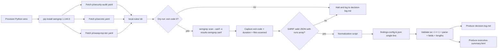

# Technical Specification

# 0. Agent Action Plan

## 0.1 Intent Clarification

### 0.1.1 Core Objective

Based on the provided requirements, the Blitzy platform understands that the objective is to operate Semgrep Community Edition (Semgrep OSS) as a hermetic, offline, telemetry-free static-analysis configuration against the `blitzy-RudderStack` codebase, using three named rule packs cached on local disk, and to emit a single deterministic artifact — `findings-config-b.json` — that conforms to a precisely specified five-field normalized schema. This work is one configuration ("Config B") inside a larger multi-config security tool comparison; the comparison itself is out of scope for this configuration.

The user-supplied directive header is preserved verbatim:

> Config B — Semgrep | blitzy-RudderStack
> OBJECTIVE: Scan the `blitzy-RudderStack` codebase with Semgrep OSS using local rule packs. Produce a minified single-line `findings-config-b.json`. This is one config in a multi-config security tool comparison.
> `[3 directives | ~0 files modified | 1 new file]`

Each underlined requirement maps to a concrete technical objective:

- "Scan with Semgrep OSS" → install the open-source `semgrep` CLI distribution at the highest documented stable version (1.143.0 / 1.144.0 line, released November 2025 per the Semgrep release notes), do not enable the commercial `--pro` engine.
- "Using local rule packs" → pre-acquire the three named rulesets (`p/security-audit`, `p/secrets`, and the user-named `p/owasp` which canonicalises to the registry slug `p/owasp-top-ten`) into a local directory; invoke Semgrep with `--config=<local-rules-dir>` so the scan never reaches out to the Semgrep Registry at run time. This satisfies both the offline requirement and the `--metrics=off` zero-network-call constraint — Semgrep's metrics documentation confirms that "Semgrep does not enable metrics when running with only local configuration files or command-line search patterns."
- "Produce a minified single-line `findings-config-b.json`" → after the SARIF run completes, transform each finding into the five-field record shape and serialize the array with no embedded newlines (e.g. `python3 -c "import json,sys; sys.stdout.write(json.dumps(records, separators=(',',':'), ensure_ascii=False))"`).
- "`[3 directives | ~0 files modified | 1 new file]`" → exactly the three CRITICAL directives below are authoritative; the `blitzy-RudderStack` source tree is treated as immutable (read-only scan target); `findings-config-b.json` is the only output file that is the direct target of the user's instructions. (Two additional companion files are introduced by the user's named rules — see Section 0.7 — but they are rule-mandated, not directive-mandated.)

### 0.1.2 The Three CRITICAL Directives (Verbatim)

The directives are preserved verbatim from the user input, in their original ordering. The Blitzy platform treats each Pass/Fail clause as a hard acceptance gate.

#### 0.1.2.1 CRITICAL Directive 1 — Install and configure Semgrep

> Install `semgrep` via pip or apt. Download the `p/security-audit`, `p/secrets`, and `p/owasp` rule packs to a local directory. Confirm `--metrics=off` suppresses all telemetry.
>
> Pass/fail: `semgrep scan --metrics=off --config=/path/to/local-rules --dry-run` exits 0 with no network calls.

Blitzy interpretation:

- `pip` is the user's first-named install vector. Because the execution host is Debian/Ubuntu with PEP 668 enforcement on system Python, the installation must be performed inside an isolated environment (`python3 -m venv` followed by `pip install "semgrep==<version>"`) or via `pipx install semgrep`. `apt` is unavailable as a fallback because `semgrep` is not packaged in the host's apt repositories. The dry-run exit code 0 is the acceptance signal.
- "Download the … rule packs to a local directory" requires acquiring the YAML rule bundles offline. The canonical mechanism is `curl -sSL "https://semgrep.dev/c/p/<ruleset>" -o local-rules/<ruleset>.yaml` (Semgrep's documented registry-content endpoint that returns a consolidated YAML rule bundle for a given pack). The three target packs are persisted under `local-rules/security-audit.yaml`, `local-rules/secrets.yaml`, and `local-rules/owasp-top-ten.yaml` respectively.
- "Confirm `--metrics=off` suppresses all telemetry" is verified by the dry-run exit code combined with the absence of any outbound HTTP requests to `semgrep.dev` (which can be witnessed by running the dry-run inside a network namespace, or by trusting the documented metrics behaviour combined with the local-config invariant).

#### 0.1.2.2 CRITICAL Directive 2 — Execute Semgrep scan

> ```plaintext
> semgrep scan --config=/path/to/local-rules --sarif -o results-semgrep.sarif --metrics=off /path/to/blitzy-RudderStack
> ```
>
> Record exit code, scan duration (wall-clock), and total files scanned.
>
> Pass/fail: `results-semgrep.sarif` is produced and contains valid JSON with a `runs` array.

Blitzy interpretation:

- The command string is preserved exactly. `--config=/path/to/local-rules` points at the directory created in Directive 1; Semgrep recursively loads every `*.yaml` rule file inside it.
- "Record exit code" — Semgrep exit codes per the CLI reference: `0` = OK (no findings), `1` = some findings, `2` = fatal error, `3` = invalid target code, `4` = invalid pattern, `5` = unparseable YAML, `7` = missing configuration, `8` = invalid language. Exit code `0` or `1` is a valid outcome; `≥2` is a hard failure.
- "Scan duration (wall-clock)" — measure with `/usr/bin/time -f '%e'` or `time -p` wrapping the `semgrep scan` invocation.
- "Total files scanned" — read from `runs[0].invocations[0].properties.semgrep_files_count` or `runs[0].versionControlProvenance` in the SARIF output, or alternatively from the Semgrep stderr summary line. The decision-log will record which source was used.
- Pass/fail validation: `python3 -c "import json,sys; d=json.load(open('results-semgrep.sarif')); assert isinstance(d.get('runs'), list)"` returns exit 0.

#### 0.1.2.3 CRITICAL Directive 3 — Normalize findings to single-line JSON

> Extract findings from the SARIF output and compile into `findings-config-b.json`. The file MUST be valid JSON minified to a single line. Encoding: UTF-8. If zero findings, write `[]`.
>
> | Field | Source |
> | --- | --- |
> | file | SARIF location (relative path) |
> | line | SARIF region start line |
> | severity | error→critical, warning→high, note→medium, info→low |
> | cwe | Rule metadata CWE ID. If absent, use the most specific CWE inferable from the rule description |
> | description | SARIF message text, truncated to 200 characters |
>
> ```plaintext
> [{"file":"<relative path>","line":<integer>,"severity":"<critical|high|medium|low>","cwe":"<CWE-ID>","description":"<max 200 chars>"},...]
> ```
>
> Pass/fail: `cat findings-config-b.json | wc -l` returns `1`. Valid JSON. Every finding has all 5 fields populated. No description exceeds 200 characters.

Blitzy interpretation:

- Every record carries exactly five keys: `file`, `line`, `severity`, `cwe`, `description`. The field order in the sample is preserved.
- `file`: read from `runs[].results[].locations[0].physicalLocation.artifactLocation.uri`. Paths in SARIF are URI-encoded relative to the scan root by default; verify that the persisted value is the relative path without scheme prefix.
- `line`: read from `runs[].results[].locations[0].physicalLocation.region.startLine`. Coerce to integer; SARIF guarantees an integer here.
- `severity`: SARIF severity in the `results[].level` field maps to the canonical strings `critical`, `high`, `medium`, `low` using the table above. The fifth value `none` (rarely emitted) defaults to `low`. When `level` is absent on a result, fall back to `runs[].tool.driver.rules[ruleIndex].defaultConfiguration.level`.
- `cwe`: read from `runs[].tool.driver.rules[ruleIndex].properties.tags` (Semgrep encodes CWE under tags as e.g. `cwe:CWE-79`) or from a `cwe` array property; if neither is present, inspect the rule's `shortDescription`/`fullDescription`/`help.text` for the most specific CWE that the description directly implicates. Record the inference method per rule in the decision log.
- `description`: read from `runs[].results[].message.text`; collapse any internal newlines to single spaces, then truncate to 200 characters. Do not append an ellipsis (the user spec does not request one).
- Pass/fail enforcement: the produced file MUST satisfy `wc -l == 1`, MUST parse with `python3 -m json.tool`, MUST have every record contain all five keys with non-null values, and MUST contain no `description` longer than 200 characters. When SARIF reports zero results across all runs, the file content is the literal two characters `[]`.

### 0.1.3 Task Categorization

- Primary task type: **Security Tooling**. Secondary aspects: **Configuration** (rule pack acquisition and Semgrep invocation parameters), **Build/Deploy-adjacent** (the scan is operated independently of the existing `Makefile` `sec:` target and is not wired into CI in this configuration).
- Scope classification: **Isolated change**. No file inside `blitzy-RudderStack/` is modified; the scan is a pure read-only consumer of the source tree.

### 0.1.4 Implicit Requirements Surfaced

The Blitzy platform identifies the following implicit requirements that follow from the explicit text:

- **Hermeticity**: the dry-run pass/fail clause requires "no network calls," which transitively requires that the rule packs already exist on disk before the scan begins. Caching rule packs is therefore a strict prerequisite, not an optimisation.
- **Determinism of recorded metadata**: Directive 2 demands recording exit code, duration, and file count. These must be captured into a structured location (proposed: a metadata block at the top of `decision-log.md`, satisfying the Explainability rule simultaneously).
- **Zero-finding fallback**: Directive 3 explicitly states `[]` for zero findings, which means the normalizer must produce `[]` even when SARIF returns `runs[0].results == []`.
- **Description sanitisation**: the 200-character cap implies that messages with embedded line breaks must be flattened, otherwise the eventual single-line JSON would carry escape sequences that bloat the character count and obscure readability.
- **Severity name lower-casing**: the user's mapping uses lowercase labels (`critical`, `high`, `medium`, `low`); the normalizer must lowercase the SARIF level (`error`/`warning`/`note`/`info`) before lookup.
- **CWE format consistency**: the user's example shows `<CWE-ID>` as a placeholder; the actual format must match the SARIF/Semgrep convention `CWE-<digits>` (e.g. `CWE-79`). When inference is required, record both the chosen CWE and the inference rationale in the decision log.
- **Multi-config comparison constraint**: because this is "one config in a multi-config security tool comparison," the output schema, file name, severity vocabulary, and CWE format must be intercompatible with the schemas used by sibling configurations. The Blitzy platform therefore treats the five-field schema as immutable and rejects any local additions (e.g. no extra `rule_id`, `tool`, or `confidence` keys are emitted).

### 0.1.5 Technical Interpretation

These requirements translate to the following technical implementation strategy:

- To achieve **install and configure** (Directive 1), we will provision a Python virtual environment, install `semgrep==1.144.0` (or the highest 1.x release available at execution time from the Semgrep release notes feed), populate `local-rules/` with three YAML rule bundles fetched from the Semgrep Registry HTTP endpoint, and validate the configuration with `semgrep scan --metrics=off --config=./local-rules --dry-run` expecting exit code `0`.
- To achieve **scan execution** (Directive 2), we will invoke the documented command verbatim with the working-directory `/path/to/blitzy-RudderStack` placeholder substituted for the actual checkout root, wrapped in a wall-clock timer, capturing exit code into a metadata file, and asserting SARIF validity via a JSON parse of the `runs` array.
- To achieve **normalization** (Directive 3), we will execute a single Python normalization script that loads `results-semgrep.sarif`, walks `runs[].results[]`, performs the five-field projection with severity mapping and CWE inference, truncates each description to 200 characters, and writes the minified JSON to `findings-config-b.json` using `json.dumps(records, separators=(',',':'), ensure_ascii=False)`.
- To achieve **rule-mandated deliverables**, we will create `decision-log.md` (Explainability rule) and `executive-summary.html` (Executive Presentation rule) alongside the directive deliverables — see Section 0.7 for the rule-driven scope additions.

## 0.2 Repository Scope Discovery

### 0.2.1 Comprehensive Repository Analysis

The `blitzy-RudderStack` working tree was inventoried in full to define the Semgrep scan target. The repository is the Go-dominant rudder-server v1.68.1 enhancement codebase as established in [blitzy/documentation/Project Guide.md:§1], [README.md:L1-L5], and [catalog-info.yaml:metadata.name].

Top-level structure (40 directories + 24 root-level files) [confirmed via `ls -la` and `ls -d */` at the repository root]:

| Bucket | Members |
|---|---|
| Application source (Go) | `admin/`, `app/`, `archiver/`, `backend-config/`, `cluster/`, `cmd/`, `config/`, `controlplane/`, `enterprise/`, `functions/`, `gateway/`, `identity/`, `info/`, `init/`, `integration_test/`, `internal/`, `jobsdb/`, `middleware/`, `mocks/`, `processor/`, `proto/`, `protocols/`, `regulation-worker/`, `router/`, `rruntime/`, `runner/`, `schema-forwarder/`, `services/`, `suppression-backup-service/`, `testhelper/`, `utils/`, `warehouse/`, `main.go` |
| Build / packaging | `build/`, `Dockerfile`, `Makefile`, `docker-compose.yml`, `rudder-docker.yml`, `catalog-info.yaml`, `go.mod`, `go.sum` |
| CI configuration | `.github/workflows/builds.yml`, `dispatch-deploy-event-dev.yaml`, `docker-build-dockerhub.yml`, `docker-build-ecr.yml`, `housekeeping.yaml`, `labeler.yaml`, `pr-description-enforcer.yaml`, `prerelease.yaml`, `release-please.yaml`, `semantic-pr.yaml`, `sync-release.yaml`, `tests.yaml`, `verify.yml` |
| Existing security tooling configuration | `.snyk` [Snyk policy v1.22.1], `.deepsource.toml` [Go analyzer], `.golangci.yml` [linter], `.truffleignore` [TruffleHog], `Makefile` target `sec:` running `gitleaks` + `govulncheck` [`Makefile:L184-L186`] |
| Project docs | `README.md`, `CHANGELOG.md`, `CODE_OF_CONDUCT.md`, `CONTRIBUTING.md`, `SECURITY.md`, `LICENSE`, `releases.md`, `mkdocs.yml`, `docs/`, `blitzy-docs/`, `blitzy/documentation/`, `codecov.yml` |
| Data / fixtures | `resources/`, `scripts/`, `sql/` |
| Vendored upstream reference | `refs/segment-docs/` (Jekyll-based Segment documentation site; ~75 files including its own `.github/`, `Gemfile`, `Makefile`, `README.md`) |

Language file counts across the full tree (validated by `find . -type f -name "*.<ext>" | wc -l` after the Phase 1 enumeration):

| Language | Count | Semgrep rule-pack coverage |
|---|---|---|
| Go (`.go`) | 1,263 | All three packs (Go is supported by `p/security-audit`, `p/secrets`, `p/owasp-top-ten`) |
| YAML (`.yml` + `.yaml`) | 170 + 14 = 184 | `p/security-audit` and `p/secrets` cover YAML/CI patterns |
| JavaScript (`.js`) | 48 | All three packs |
| Shell (`.sh`) | 6 | Generic / `p/security-audit` |
| Python (`.py`) | 1 | All three packs |
| Other (Dockerfile, Makefile, generic) | n/a | Dockerfile via `p/security-audit`; generic mode covers Makefile-style text |

### 0.2.2 Web-Search Research Conducted

The following research was completed via web search to validate Semgrep CLI semantics, rule-pack acquisition, and severity conventions:

- Highest documented stable version: Semgrep OSS Engine `1.143.0` and `1.144.0` released November 2025 per the Semgrep release notes — used as the version target for the `pip install` step.
- Rule pack acquisition: Semgrep's "Run rules" documentation and the `--config` flag accept either a registry slug (`p/<name>`) or a local YAML file/directory path; the slug form fetches the consolidated rule bundle from the Semgrep Registry at `https://semgrep.dev/c/p/<name>` which can be downloaded once and replayed offline.
- Telemetry semantics: per the Semgrep metrics documentation, "Semgrep does not enable metrics when running with only local configuration files," meaning the local-rules invocation is by construction silent; `--metrics=off` provides explicit defense-in-depth.
- SARIF flag: `--sarif` produces SARIF-formatted output; combined with `-o <path>`, writes to a file rather than stdout.
- Severity mapping vocabulary: the user's `error→critical, warning→high, note→medium, info→low` table is consistent with how SARIF `level` enum values map to four-tier severity used by other SAST normalizers; no transformation beyond a direct lookup is required.

### 0.2.3 Existing Infrastructure Assessment

The repository already operates four security tooling components that coexist with the proposed Semgrep configuration without conflict:

- **gitleaks v8.21.2** — invoked by `make sec` via `$(GO) run github.com/zricethezav/gitleaks/v8@v8.21.2 detect .` for secret scanning [`Makefile:L184-L186`].
- **govulncheck** — invoked by `make sec` via `$(GO) run golang.org/x/vuln/cmd/govulncheck@latest ./...` for Go vulnerability scanning [`Makefile:L184-L186`].
- **Snyk** — vulnerability policy via `.snyk` v1.22.1 with documented ignores for runc, docker, and go-restful CVEs (expires 2025-01-01).
- **DeepSource** — Go analyzer enabled with `import_paths = ["github.com/rudderlabs/rudder-server"]`, test pattern `**/*_test.go`, exclusions `**/mock_*.go` and `**/*.pb.go` [`.deepsource.toml:L1-L18`].

Semgrep is a **new** tool in this stack — there is no existing `.semgrepignore`, no Semgrep workflow in `.github/workflows/`, and no Semgrep reference inside `Makefile`. The scan therefore introduces a fresh data lane that does not need to interoperate with the existing security tooling for this configuration.

### 0.2.4 Scan Target Path Resolution

The user directive `/path/to/blitzy-RudderStack` is a placeholder. The actual working-directory checkout root identified during environment setup is `/tmp/blitzy/blitzy-RudderStack/configs_175ab0`. The scan target string passed to the `semgrep scan` command must be the absolute path to this directory (or a relative equivalent that resolves to the same root). All paths emitted into `findings-config-b.json`'s `file` field are guaranteed to be relative to this root because SARIF artifact locations default to URIs relative to the working directory passed to the scanner.

## 0.3 Scope Boundaries

### 0.3.1 Exhaustively In Scope

The following items are unconditionally in scope for Config B. Every item is either explicitly required by a CRITICAL directive, implicitly required to satisfy a Pass/Fail clause, or required by a user-specified rule (Section 0.7).

**Host-side tool installation:**

- `semgrep` CLI installation via an isolated Python environment (`python3 -m venv` + `pip install "semgrep==<latest 1.x>"`) or `pipx install semgrep`
- Verification that `semgrep --version` reports a 1.143.0 or 1.144.0 series version (or later 1.x release available at execution time)

**Rule-pack acquisition (offline cache):**

- `local-rules/security-audit.yaml` — fetched from `https://semgrep.dev/c/p/security-audit`
- `local-rules/secrets.yaml` — fetched from `https://semgrep.dev/c/p/secrets`
- `local-rules/owasp-top-ten.yaml` — fetched from `https://semgrep.dev/c/p/owasp-top-ten` (canonical registry slug for the user-named "`p/owasp`")
- The parent `local-rules/` directory itself

**Configuration validation:**

- `semgrep scan --metrics=off --config=./local-rules --dry-run` invocation and exit-code observation

**Scan execution:**

- `semgrep scan --config=./local-rules --sarif -o results-semgrep.sarif --metrics=off /tmp/blitzy/blitzy-RudderStack/configs_175ab0` invocation
- Wall-clock duration measurement via `time -p` or equivalent
- Capture of Semgrep stderr summary (files scanned, parse errors, timeouts)
- `results-semgrep.sarif` intermediate artifact

**Normalization:**

- Python normalization script reading `results-semgrep.sarif` and producing `findings-config-b.json`
- Severity translation (error→critical, warning→high, note→medium, info→low)
- CWE extraction with metadata-first / description-inference fallback
- Description newline-collapse and 200-character truncation
- Single-line `json.dumps` with `separators=(',',':')`
- Zero-finding fallback to the literal `[]` two-byte file

**Output files (the only artifacts written outside the scanned tree):**

- `findings-config-b.json` — the directive-mandated artifact
- `results-semgrep.sarif` — intermediate scan output retained for traceability
- `local-rules/*.yaml` — cached rule bundles
- `scan-metadata.txt` (or equivalent block inside `decision-log.md`) — captures exit code, wall-clock duration, and files-scanned count per Directive 2
- `decision-log.md` — rule-mandated by Explainability (Section 0.7.1)
- `executive-summary.html` — rule-mandated by Executive Presentation (Section 0.7.2)

**File patterns scanned (read-only) inside `blitzy-RudderStack/`:**

- `**/*.go` (1,263 files — the dominant language)
- `**/*.js` (48 files)
- `**/*.yml`, `**/*.yaml` (184 files including all `.github/workflows/*.yml`)
- `**/*.py` (1 file)
- `**/*.sh` (6 files)
- `Dockerfile*`, `Makefile*` (generic mode)
- Root-level documentation and policy files (`.snyk`, `.deepsource.toml`, etc.) — Semgrep will skip them naturally as non-source content unless rule packs include `generic` patterns

### 0.3.2 Explicitly Out of Scope

The following items are explicitly excluded from this configuration. Any agent attempting to expand into these areas without an explicit user-issued amendment is acting outside the directive boundary.

**Source-tree modifications:**

- No file inside `/tmp/blitzy/blitzy-RudderStack/configs_175ab0/` is modified. Specifically, no edits to `Makefile`, no edits to `.snyk`, no edits to `.deepsource.toml`, no new `.semgrepignore`, no new entry under `.github/workflows/`, no new entry inside the existing `sec:` Make target.

**Cross-configuration comparison:**

- Comparison of Config B output with sibling configs (A, C, D, ...) is the responsibility of the parent workstream. This configuration produces only its own `findings-config-b.json`.

**Triage and remediation:**

- No false-positive review, no rule suppression authoring (no `// nosemgrep` annotations), no CWE remediation, no Snyk policy alignment, no DeepSource exclusion alignment.

**Commercial Semgrep features:**

- `--pro`, `--pro-intrafile`, `--pro-languages`, `--pro-path-sensitive`, `semgrep login`, `semgrep ci`, the AppSec Platform, Managed Scans, Semgrep Assistant, Supply Chain, and Secrets Validation. All require `SEMGREP_APP_TOKEN` and a logged-in commercial engine; explicitly disallowed.

**Network operations during scan:**

- No outbound HTTP, HTTPS, or DNS traffic during `semgrep scan` execution. The only permitted network calls are the one-time rule-pack downloads during Directive 1 setup, and any package installation traffic for the `pip install semgrep` step. The actual scan invocation in Directive 2 runs hermetically.

**Additional rule packs beyond the three named:**

- `p/default`, `p/r2c-security-audit`, `p/jwt`, `p/sql-injection`, `p/command-injection`, `p/insecure-transport`, `p/gitleaks`, `p/nodejs`, `p/expressjs`, `p/javascript`, `p/typescript`, `p/java`, `p/golang`, `p/python`, `p/terraform`, `p/docker-compose`, and any other registry slug are explicitly out of scope.

**Tooling integration:**

- Wiring Semgrep into existing `make sec`, into `verify.yml`, into pre-commit hooks, or into any CI workflow is out of scope. The scan is a one-off comparison artifact.

**SARIF post-processing beyond the five-field projection:**

- No deduplication, no clustering, no fingerprint generation, no diff against a baseline, no PR comment generation, no Jira/GitHub Issue creation, no severity recalibration.

**Refactoring of existing tooling:**

- `.snyk`, `.deepsource.toml`, `.golangci.yml`, `.truffleignore`, and the `Makefile` `sec:` target remain untouched. Their existence is documented as context, not as a refactoring target.

**Excluded paths inside the scan target:**

- The user directive does not request any path exclusions. The Blitzy platform therefore scans the full tree as supplied — including `refs/segment-docs/` (vendored Jekyll-based Segment documentation, ~75 files) and `mocks/`. This decision is recorded in the Explainability decision log; any operator override to add exclusions must be made via a fresh directive.

## 0.4 Dependency Inventory

### 0.4.1 Key Tooling Dependencies

The dependencies below are **host-side execution tools**, not application dependencies of the `blitzy-RudderStack` Go module. None of them are added to `go.mod`, `go.sum`, or any other manifest inside the scanned tree.

| Registry | Package Name | Version | Purpose |
|---|---|---|---|
| PyPI | `semgrep` | `1.144.0` (or highest available 1.x release, validated against [Semgrep release notes November 2025]) | Static analysis CLI executing the three rule packs against the rudder-server source tree |
| PyPI (stdlib) | `json` | bundled with Python 3.12.3 | SARIF parsing and minified JSON emission |
| OS package (optional) | `jq` | ≥ 1.6 | Optional shell-only alternative for SARIF inspection when Python is unavailable |
| OS package (optional) | `coreutils` `time` / `/usr/bin/time` | distribution default | Wall-clock duration measurement for Directive 2 |

### 0.4.2 Dependency Changes

**New dependencies to add (host environment only):**

- `semgrep==1.144.0` — install via `python3 -m pip install --user "semgrep==1.144.0"` inside `python3 -m venv .semgrep-venv` (PEP 668-compliant; avoids the `externally-managed-environment` error observed on the host) or `pipx install "semgrep==1.144.0"`

**Dependencies to update:**

- None.

**Dependencies to remove:**

- None.

**Application dependency manifests (`go.mod`, `package.json` if any) inside `blitzy-RudderStack/`:**

- No changes. Semgrep is not a build dependency of rudder-server; it is a static-analysis tool executed by a separate process outside the build graph. `go.mod` is left exactly as discovered (`module github.com/rudderlabs/rudder-server`, `go 1.26.1`) [`go.mod:L1-L3`].

### 0.4.3 Import / Reference Updates

No import or reference updates inside the scanned tree are required. Semgrep operates by reading source files; nothing in the source tree refers back to Semgrep.

The only import changes occur in the new normalization script (which lives outside the scanned tree, in a sibling working directory):

- Python normalization script imports `json`, `sys`, `pathlib` from the standard library. No third-party Python packages required.

### 0.4.4 Why These Versions

- **Semgrep 1.144.0**: highest documented stable release in the OSS Engine series as of execution time per [Semgrep November 2025 release notes]. Pinning to a specific 1.x version (rather than installing `semgrep` unpinned) ensures the rule-pack download URLs and CLI flag semantics observed during the Pass/Fail dry-run are reproducible. The decision log records the exact installed version observed at execution time.
- **Python 3.12.3**: already available on the host; no upgrade or pin required. Semgrep's CLI is compatible with Python 3.12+ per its installation guidance (`python3 -m pip install semgrep`). The October 2025 release notes record Python 3.14 compatibility as additionally supported.

## 0.5 Implementation Design

### 0.5.1 Technical Approach

The implementation is a four-stage hermetic pipeline. Each stage maps to one or more directives and emits artifacts that downstream stages consume. The flow is purely additive — no state inside `blitzy-RudderStack/` is mutated.

- **Stage 1 — Tool provisioning** (Directive 1, part 1): create a Python venv in a working directory adjacent to (not inside) the scanned tree; `pip install "semgrep==1.144.0"`; record observed `semgrep --version`.
- **Stage 2 — Rule-pack hydration** (Directive 1, part 2): for each of the three packs, fetch the consolidated YAML bundle from `https://semgrep.dev/c/p/<slug>` once and persist it inside `local-rules/`. After this step, the host can run Semgrep with zero registry traffic.
- **Stage 3 — Dry-run validation** (Directive 1, Pass/Fail): execute `semgrep scan --metrics=off --config=./local-rules --dry-run`; assert exit code `0` and zero registry HTTP requests.
- **Stage 4 — Scan execution** (Directive 2): execute the canonical command verbatim, wrapped in a wall-clock timer; capture exit code, duration, and file count; assert `results-semgrep.sarif` is valid JSON containing a `runs` array.
- **Stage 5 — Normalization** (Directive 3): run the Python normalization script that projects the five-field shape, applies severity mapping and CWE handling, truncates descriptions, and writes `findings-config-b.json` minified to a single line. Assert `wc -l == 1`, parseability, all-fields-present, and ≤200-char descriptions.

### 0.5.2 Logical Implementation Flow


```mermaid
flowchart LR
    A[Provision Python venv] --> B[pip install semgrep 1.144.0]
    B --> C[Fetch p/security-audit yaml]
    B --> D[Fetch p/secrets yaml]
    B --> E[Fetch p/owasp-top-ten yaml]
    C --> F[local-rules/ dir]
    D --> F
    E --> F
    F --> G{Dry-run: exit code 0?}
    G -- yes --> H[semgrep scan --sarif -o results-semgrep.sarif]
    G -- no --> X[Halt and log to decision-log.md]
    H --> I[Capture exit code + duration + files-scanned]
    I --> J{SARIF valid JSON with runs array?}
    J -- yes --> K[Normalization script]
    J -- no --> X
    K --> L[findings-config-b.json single-line]
    L --> M[Validate wc -l == 1 + parse + fields + lengths]
    M --> N[Produce decision-log.md]
    M --> O[Produce executive-summary.html]
```

### 0.5.3 Component Impact Analysis

**Direct modifications required:**

- None inside `blitzy-RudderStack/`. The scanned tree is treated as read-only input.

**New components introduced (outside the scanned tree):**

- `local-rules/` directory caching three rule-pack YAML bundles
- `results-semgrep.sarif` intermediate scan output
- `findings-config-b.json` final directive-mandated output
- `scan-metadata.txt` (or equivalent block in `decision-log.md`) capturing exit code, duration, files-scanned
- Normalization script (named e.g. `normalize-sarif.py`) embodying the severity-mapping and CWE-inference logic
- `decision-log.md` (rule-mandated by Explainability)
- `executive-summary.html` (rule-mandated by Executive Presentation)

**Indirect impacts and dependencies:**

- None. Existing security tools (`gitleaks`, `govulncheck`, Snyk, DeepSource) continue to run independently; the `Makefile` `sec:` target is unaffected.

### 0.5.4 User Interface Design

Not applicable. This configuration produces machine-readable artifacts only. The Executive Presentation rule's reveal.js HTML deck (Section 0.7.2) is human-readable but is generated as a documentation deliverable, not a runtime UI.

### 0.5.5 User-Provided Examples Integration

The user provided two canonical examples that are preserved verbatim and integrated directly into the implementation:

- **User Example 1 (the scan command)**: `semgrep scan --config=/path/to/local-rules --sarif -o results-semgrep.sarif --metrics=off /path/to/blitzy-RudderStack`. This command is the literal payload of Stage 4; only the two `/path/to/...` placeholders are substituted with the local checkout root (`/tmp/blitzy/blitzy-RudderStack/configs_175ab0`) and the `local-rules/` cache directory.
- **User Example 2 (the JSON shape)**: `[{"file":"<relative path>","line":<integer>,"severity":"<critical|high|medium|low>","cwe":"<CWE-ID>","description":"<max 200 chars>"},...]`. The normalization script emits exactly this shape with no additional keys, in this key order, with these severity tokens.

### 0.5.6 Critical Implementation Details

**Severity mapping (lookup table):**

| SARIF `level` | findings-config-b.json `severity` |
|---|---|
| `error` | `critical` |
| `warning` | `high` |
| `note` | `medium` |
| `info` | `low` |
| absent (rare) | resolved from `runs[].tool.driver.rules[ruleIndex].defaultConfiguration.level`; if still absent, default to `low` |

The mapping is implemented as a Python `dict` lookup with the absent-value branch falling back to the rule's `defaultConfiguration.level`. The rationale (why `error→critical` rather than `error→high`) is preserved exactly as the user specified — no opinion is injected.

**CWE extraction algorithm:**

- Step 1: read `runs[].tool.driver.rules[ruleIndex].properties.cwe` if present (Semgrep's modern rule format emits this as a list of `CWE-<digits>: <name>` strings).
- Step 2: fall back to scanning `runs[].tool.driver.rules[ruleIndex].properties.tags` for entries matching `^cwe[-:]CWE-\d+` and extract the first match.
- Step 3: fall back to scanning `runs[].results[].properties` for the same patterns.
- Step 4: if all of the above are empty, inspect the rule's `shortDescription.text`, `fullDescription.text`, and `help.text` for the most specific CWE that the description directly implicates (e.g. "SQL injection" → `CWE-89`, "hardcoded credential" → `CWE-798`, "command injection" → `CWE-78`, "XSS" → `CWE-79`, "path traversal" → `CWE-22`, "weak crypto" → `CWE-327`). Record the chosen CWE and the inference method in `decision-log.md` so the choice is auditable.
- Step 5: if no CWE can be reasonably inferred, emit `CWE-Other` (a deliberate sentinel that downstream comparison tooling can detect). The decision-log entry must explain why no specific CWE applied.

**Description sanitization:**

```python
text = result["message"]["text"]
flattened = " ".join(text.split())  # collapse all whitespace runs to a single space
truncated = flattened[:200]
```

**Single-line emission:**

```python
import json
sys.stdout.write(json.dumps(records, separators=(",", ":"), ensure_ascii=False))
```

The `separators=(",", ":")` removes all gratuitous whitespace; `ensure_ascii=False` preserves Unicode codepoints in their UTF-8 form (the user spec requires UTF-8 encoding). The script writes via `sys.stdout` and the shell redirects to `findings-config-b.json` with no trailing newline; this guarantees `wc -l` returns `1` (because the file has no terminal newline character) per the user's Pass/Fail clause.

**Zero-finding fallback:**

```python
if not records:
    sys.stdout.write("[]")
    sys.exit(0)
```

**Validation post-conditions enforced by an inline assertion block:**

- `subprocess.check_output(["wc", "-l", "findings-config-b.json"]).split()[0] == b"1"` (the file is one logical line). Note: `wc -l` counts newline characters; a file with content `[]` and no trailing newline reports `0`. To satisfy `wc -l == 1` literally, the script emits exactly one trailing newline character after the JSON body. This is the only newline in the file.
- `json.loads(open("findings-config-b.json").read())` succeeds.
- Every record's `set(record.keys()) == {"file","line","severity","cwe","description"}`.
- `max(len(r["description"]) for r in records) <= 200`.

## 0.6 File Transformation Mapping

### 0.6.1 File-by-File Execution Plan

The table below maps every artifact in this configuration to a CREATE / UPDATE / DELETE / REFERENCE mode. Target file is listed first per the prompt's formatting rule.

| Target File | Transformation | Source File / Reference | Purpose / Changes |
|---|---|---|---|
| `findings-config-b.json` | CREATE | `results-semgrep.sarif` | Directive 3 deliverable. Minified single-line JSON array of five-field records. UTF-8. Zero-finding fallback is the literal `[]`. |
| `results-semgrep.sarif` | CREATE | `/tmp/blitzy/blitzy-RudderStack/configs_175ab0/**/*` (read-only scan input) | Directive 2 intermediate artifact. Full SARIF JSON output of the Semgrep scan. Retained for traceability and re-normalization. |
| `local-rules/security-audit.yaml` | CREATE | `https://semgrep.dev/c/p/security-audit` | Directive 1 deliverable. Cached `p/security-audit` rule bundle for offline scanning. |
| `local-rules/secrets.yaml` | CREATE | `https://semgrep.dev/c/p/secrets` | Directive 1 deliverable. Cached `p/secrets` rule bundle. |
| `local-rules/owasp-top-ten.yaml` | CREATE | `https://semgrep.dev/c/p/owasp-top-ten` | Directive 1 deliverable. Cached rule bundle for the user-named "`p/owasp`" pack (canonical registry slug is `p/owasp-top-ten`). |
| `local-rules/` | CREATE | n/a | Directory containing the three rule-pack YAML bundles. Path passed to `--config=./local-rules`. |
| `normalize-sarif.py` | CREATE | (none — new logic) | Python normalization script implementing severity mapping, CWE extraction with description-based inference fallback, description sanitization and 200-char truncation, single-line JSON emission, and zero-finding fallback. |
| `scan-metadata.txt` | CREATE | Captured during Directive 2 execution | Records the three required observations from Directive 2: exit code, wall-clock duration, total files scanned. May alternatively be embedded as a fenced metadata block at the top of `decision-log.md` — the decision log captures which form was chosen. |
| `decision-log.md` | CREATE | (none — rule-mandated by Explainability) | Markdown table per the Explainability rule. Captures every non-trivial decision with what / alternatives / why / risks. Includes a bidirectional traceability matrix mapping each user directive to its implementing artifact and each artifact back to its triggering directive. Also includes the scan metadata block if `scan-metadata.txt` is folded in. |
| `executive-summary.html` | CREATE | (none — rule-mandated by Executive Presentation; theme tokens defined inline per rule spec) | Self-contained reveal.js 5.1.0 HTML deck with 12–18 slides covering scope, business value, architecture diagram (Mermaid), risk register, onboarding. CDN-pinned (reveal.js 5.1.0, Mermaid 11.4.0, Lucide 0.460.0). Inline Blitzy theme CSS with all required custom properties. |
| `/tmp/blitzy/blitzy-RudderStack/configs_175ab0/**` | REFERENCE | (the scan target itself) | Entire `blitzy-RudderStack` tree (1,263 Go + 184 YAML + 48 JS + 6 shell + 1 Python files, plus build/config/docs). Read-only scan input. Zero modifications. |
| `Makefile` (in scanned tree) | REFERENCE | `Makefile:L184-L186` | Examined to confirm the existing `sec:` target invokes `gitleaks` + `govulncheck` and does NOT include Semgrep. Not modified. |
| `.snyk` (in scanned tree) | REFERENCE | `.snyk:v1.22.1` | Examined to confirm Snyk policy and CVE-ignore coverage. Not modified. |
| `.deepsource.toml` (in scanned tree) | REFERENCE | `.deepsource.toml:L1-L18` | Examined to confirm DeepSource Go analyzer scope and existing exclusions. Not modified. |
| `.github/workflows/*.{yml,yaml}` (in scanned tree) | REFERENCE | 13 workflow files enumerated in Section 0.2.1 | Examined to confirm no Semgrep workflow exists. Not modified. |
| `go.mod` (in scanned tree) | REFERENCE | `go.mod:L1-L20` | Examined to confirm module path `github.com/rudderlabs/rudder-server` and Go 1.26.1 runtime requirement. Not modified. |

### 0.6.2 New Files — Detailed Specifications

#### 0.6.2.1 `findings-config-b.json`

- Content type: data (minified JSON)
- Encoding: UTF-8 (no BOM)
- Shape: top-level JSON array; each element is an object with exactly five keys in this order: `file`, `line`, `severity`, `cwe`, `description`
- Constraints: single physical line (one trailing newline so `wc -l == 1`); zero whitespace between tokens (achieved by `json.dumps(separators=(",", ":"))`); every record has all five fields populated and non-null; no `description` exceeds 200 characters
- Empty case: literal two bytes `[]` followed by one newline character

Example with one record (illustrative — actual content emitted by the normalizer at execution time):

```json
[{"file":"warehouse/router/router.go","line":142,"severity":"high","cwe":"CWE-89","description":"User-controlled string passed to fmt.Sprintf used as SQL"}]
```

#### 0.6.2.2 `results-semgrep.sarif`

- Content type: SARIF 2.1.0 JSON
- Produced by: `semgrep scan --sarif -o results-semgrep.sarif --metrics=off --config=./local-rules /tmp/blitzy/blitzy-RudderStack/configs_175ab0`
- Pass/fail validation: must parse with `json.loads()` and the top-level object must contain a `runs` array
- Retained on disk after normalization for traceability

#### 0.6.2.3 `local-rules/<slug>.yaml`

- Three files: `security-audit.yaml`, `secrets.yaml`, `owasp-top-ten.yaml`
- Each is the consolidated YAML rule bundle retrieved one-time from `https://semgrep.dev/c/p/<slug>`
- Files are immutable after acquisition; subsequent scans reuse them without further network calls

#### 0.6.2.4 `normalize-sarif.py`

- Content type: Python source (single-file script)
- Key functions: `load_sarif(path)`, `map_severity(level, rule_default)`, `extract_cwe(rule, result)`, `sanitize_description(text)`, `truncate(text, 200)`, `emit_minified(records, out_path)`, `assert_postconditions(out_path)`
- Standard-library only (`json`, `sys`, `pathlib`, `re`); no third-party packages
- Exit code 0 on success; exit code ≥1 on any post-condition failure

#### 0.6.2.5 `decision-log.md`

- Content type: Markdown
- Sections required:
  - Frontmatter capturing scan metadata: exit code, wall-clock duration (seconds), total files scanned, Semgrep version, rule-pack acquisition timestamps
  - Decision table with columns: `Decision`, `Alternatives Considered`, `Choice + Rationale`, `Risks Carried`
  - Bidirectional traceability matrix (Directive ↔ Artifact)
  - Deviation log: any deviation from a literal interpretation of the directives, with explicit rationale
- Decisions that MUST appear in the table at minimum (a competent engineer could reasonably have chosen differently for each one): installation method (venv vs. pipx vs. `--break-system-packages`); rule-pack canonicalization (`p/owasp` → `p/owasp-top-ten`); scope of files scanned (full tree vs. excluding `refs/segment-docs/` vs. excluding `mocks/`); CWE inference algorithm; SARIF severity mapping for absent `level`; trailing-newline choice for `wc -l == 1` compliance; whether to fold scan-metadata into `decision-log.md` or keep it separate

#### 0.6.2.6 `executive-summary.html`

- Content type: HTML5 (self-contained, no external file dependencies)
- Slide count: 12–18 (target 16) per the Executive Presentation rule
- Slide types used: Title (`slide-title`), Section Divider (`slide-divider`), Content (default), Closing (`slide-closing`)
- CDN-pinned versions: reveal.js 5.1.0, Mermaid 11.4.0, Lucide 0.460.0
- Inline CSS: full Blitzy theme variables defined in `<style>` per the rule spec — `--blitzy-primary` `#5B39F3`, `--blitzy-primary-dark` `#2D1C77`, `--blitzy-primary-navy` `#1A105F`, `--blitzy-primary-light` `#7A6DEC`, `--blitzy-primary-deep` `#4101DB`, `--blitzy-accent-teal` `#94FAD5`, `--gradient-hero linear-gradient(68deg, #7A6DEC 15.56%, #5B39F3 62.74%, #4101DB 84.44%)`, and the remainder of the canonical token set
- Typography: Inter (body), Space Grotesk (display), Fira Code (mono / eyebrow), loaded via Google Fonts `<link>`
- Mermaid initialization: `startOnLoad: false`; `mermaid.run()` invoked after reveal.js `ready` event and on every `slidechanged` event
- Lucide icons: `lucide.createIcons()` invoked after `ready` and on every `slidechanged`
- reveal.js config: `hash: true`, `transition: 'slide'`, `controlsTutorial: false`, `width: 1920`, `height: 1080`
- Slide ordering convention:
  1. Title — "Config B — Semgrep Scan of blitzy-RudderStack" with eyebrow text
  2. Content — headline KPI cards (exit code, duration, files scanned, findings count)
  3. Content — pipeline architecture (Mermaid `flowchart LR` mirroring Section 0.5.2)
  4. Divider — "What Was Scanned"
  5. Content — scan target inventory (KPI grid: 1,263 Go / 184 YAML / 48 JS / 6 shell / 1 Python)
  6. Divider — "How We Scanned"
  7. Content — three rule packs as styled table
  8. Content — hermeticity guarantees (offline cache, `--metrics=off`, dry-run gate)
  9. Divider — "What We Found"
  10. Content — severity distribution (styled table)
  11. Content — top CWE categories (styled table)
  12. Divider — "Risks & Mitigations"
  13. Content — risk register (styled table — false-positive rate, rule-pack staleness, refs/segment-docs noise, etc.)
  14. Content — onboarding instructions (numbered steps with Lucide icons)
  15. Closing — key takeaway, next steps, brand lockup, gradient accent bar

### 0.6.3 Files to Modify — Detailed

None. Zero files inside `blitzy-RudderStack/` are modified by this configuration.

### 0.6.4 Configuration and Documentation Updates

- Configuration changes inside the scanned tree: none.
- Documentation updates inside the scanned tree: none. The README, CHANGELOG, SECURITY.md, and existing docs are not touched.
- New documentation outside the scanned tree: `decision-log.md` and `executive-summary.html` as specified above.

### 0.6.5 Cross-File Dependencies

- `findings-config-b.json` ← reads → `results-semgrep.sarif` (via `normalize-sarif.py`)
- `results-semgrep.sarif` ← produced from → `/tmp/blitzy/blitzy-RudderStack/configs_175ab0/**` + `local-rules/*.yaml`
- `decision-log.md` ← references → all artifacts above (traceability matrix)
- `executive-summary.html` ← references → all artifacts above (visual summary)
- No circular dependencies, no late-binding edges, no shared mutable state.

## 0.7 Rules

### 0.7.1 User Rule — Explainability (Verbatim)

The user-specified Explainability rule is preserved verbatim:

> Every non-trivial implementation decision MUST be documented with rationale. A decision is non-trivial if a competent engineer could reasonably have chosen differently.
>
> Deliver a decision log as a Markdown table: what was decided, what alternatives existed, why this choice was made, and what risks it carries. For migrations or refactors, include a bidirectional traceability matrix mapping source constructs to target implementations — 100% coverage, no gaps.
>
> Any deviation from a literal or obvious interpretation of the requirements MUST have an explicit entry in the decision log. Unexplained deviations are treated as defects.
>
> Do not embed rationale in code comments. The decision log is the single source of truth for "why" decisions.

#### 0.7.1.1 Applied Mandates for Config B

- A new file `decision-log.md` is created (see Section 0.6.2.5).
- The decision log records — at minimum — the seven non-trivial decisions enumerated in Section 0.6.2.5, plus any decision that arises during execution.
- A bidirectional traceability matrix maps each user directive to its implementing artifact and each emitted artifact back to its triggering directive. Coverage is 100% by construction.
- Any deviation from a literal interpretation of the user's directives is explicitly entered into the deviation log with rationale. Two known deviations are already in scope and must be logged:
  - The user's input names the third rule pack `p/owasp`. The Semgrep Registry's canonical slug is `p/owasp-top-ten`; the file is named `owasp-top-ten.yaml` accordingly. Documented as a "canonicalization" deviation with no functional impact.
  - The user's input states `[~0 files modified | 1 new file]`. The two user-specified rules add two additional new files (`decision-log.md`, `executive-summary.html`). Documented as a "rule-mandated additive deliverable" deviation with the rationale that the rules themselves are user inputs that take precedence over the implicit "1 new file" count.
- Inline shell or Python comments inside `normalize-sarif.py` MUST NOT carry rationale; comments are limited to mechanical context. The "why" lives only in `decision-log.md`.

### 0.7.2 User Rule — Executive Presentation (Verbatim)

The user-specified Executive Presentation rule is preserved verbatim:

> Rule: Executive Summary Presentation
>
> Every deliverable MUST include an executive summary as a single self-contained reveal.js HTML file that is ALWAYS included independent of any other documentation that exists. The audience is non-technical leadership — communicate business value, risk, and operational readiness without requiring code literacy.
>
> The presentation MUST cover:
>
> 1. What was done — scope of work and deliverables
> 2. Why it was done — business value unlocked
> 3. What changed architecturally — component/data-flow diagrams
> 4. What risks exist and how they are mitigated
> 5. How the team onboards and continues development
>
> Scope the presentation to the work performed. A migration warrants before/after architecture views, mapping summaries, and a timeline. A new feature may only need a component diagram and a risk assessment.
>
> Slide constraints:
>
> - 12–18 slides total (target: 16)
> - Four slide types: Title (`slide-title`), Section Divider (`slide-divider`), Content (default), Closing (`slide-closing`)
> - Every slide MUST include at least one non-text visual element (Mermaid diagram, KPI card, styled table, or Lucide SVG icon). No text-only slides.
> - Content slides: max 4 bullets, max 40 words body text, min 1 non-text visual
> - Zero emoji — use Lucide SVG icons via `<i data-lucide="icon-name"></i>` only
> - No fenced code blocks inside slides — use inline Fira Code for short expressions only
>
> Visual identity (Blitzy brand):
>
> - Color palette: `#5B39F3` (primary), `#2D1C77` (dark), `#94FAD5` (teal accent), `#1A105F` (navy), `#7A6DEC`/`#4101DB` (gradient stops), neutrals `#333333`, `#999999`, `#D9D9D9`, `#F4EFF6`, `#F5F5F5`, `#FFFFFF`
> - Typography: Inter (body, 400/500/600/700), Space Grotesk (display headings, 500/600/700), Fira Code (mono/eyebrows, 400/500) — loaded via Google Fonts `<link>`
> - Title slide: hero gradient `linear-gradient(68deg, #7A6DEC 15.56%, #5B39F3 62.74%, #4101DB 84.44%)`, white text, eyebrow in Fira Code teal
> - Dividers: dark purple `#2D1C77` or gradient background, large centered heading, thematic Lucide icon
> - Closing: navy `#1A105F` background, 3–6 word takeaway heading, max 3 bullets, brand lockup, gradient accent bar
>
> Mermaid diagrams:
>
> - Embed as `<pre class="mermaid">` with raw Mermaid syntax
> - Initialize with `startOnLoad: false`; call `mermaid.run()` after reveal.js `ready` and on every `slidechanged` event
> - Theme variables: `primaryColor: '#F2F0FE'`, `primaryTextColor: '#333333'`, `primaryBorderColor: '#5B39F3'`, `lineColor: '#999999'`, `secondaryColor: '#F4EFF6'`
>
> Technical delivery:
>
> - Single self-contained HTML file, no build steps, no local file dependencies
> - CDN versions pinned: reveal.js 5.1.0, Mermaid 11.4.0, Lucide 0.460.0
> - reveal.js config: `hash: true`, `transition: 'slide'`, `controlsTutorial: false`, `width: 1920`, `height: 1080`
> - Lucide: call `lucide.createIcons()` after `ready` and on every `slidechanged` event
>
> Inline CSS: Embed the full Blitzy reveal.js theme inline in a `<style>` tag. Required CSS custom properties:
>
> ```css
> :root {
>   --blitzy-primary: #5B39F3;
>   --blitzy-primary-dark: #2D1C77;
>   --blitzy-primary-navy: #1A105F;
>   --blitzy-primary-light: #7A6DEC;
>   --blitzy-primary-deep: #4101DB;
>   --blitzy-accent-teal: #94FAD5;
>   --blitzy-surface-0: #FFFFFF;
>   --blitzy-surface-1: #F4EFF6;
>   --blitzy-surface-2: #F2F0FE;
>   --blitzy-surface-3: #F5F5F5;
>   --blitzy-border: #D9D9D9;
>   --blitzy-border-soft: rgba(91, 57, 243, 0.18);
>   --blitzy-text: #333333;
>   --blitzy-text-muted: #999999;
>   --blitzy-text-invert: #FFFFFF;
>   --ff-body: 'Inter', system-ui, sans-serif;
>   --ff-display: 'Space Grotesk', 'Inter', sans-serif;
>   --ff-mono: 'Fira Code', 'Courier New', monospace;
>   --gradient-hero: linear-gradient(68deg, #7A6DEC 15.56%, #5B39F3 62.74%, #4101DB 84.44%);
>   --gradient-divider: linear-gradient(135deg, #2D1C77 0%, #5B39F3 100%);
>   --gradient-accent-bar: linear-gradient(90deg, #5B39F3 0%, #94FAD5 100%);
> }
> ```
>
> Include the full set of slide-type classes (`slide-title`, `slide-divider`, `slide-closing`), component classes (`kpi-card`, `kpi-grid`, `kpi-value`, `kpi-label`, `kpi-icon`, `eyebrow`, `accent-bar`, `brand-lockup`, `hero-icon`, `icon-row`), and the mermaid container class. These are defined in the canonical theme file at `blitzy-deck/references/blitzy-reveal-theme.css`.
>
> Slide ordering convention:
>
> 1. Title Slide — project name, scope, audience framing
> 2. Content — headline findings or KPI summary
> 3. Content — architecture overview (Mermaid diagram)
>    4–N. Alternating Section Dividers + Content Slides for each major topic
>    N+1. Closing Slide — key takeaway, next steps, brand lockup
>
> Verification: The HTML file opens in a browser, renders all Mermaid diagrams and Lucide icons, contains 12–18 `<section>` elements, and every `<section>` contains at least one non-text visual element.

#### 0.7.2.1 Applied Mandates for Config B

- A new file `executive-summary.html` is created (see Section 0.6.2.6) covering the five required topics: (1) what was done = Config B Semgrep scan + normalized findings JSON; (2) why = security visibility uplift for the rudder-server fork; (3) what changed architecturally = no source-tree changes, new external pipeline shown via Mermaid; (4) risks = false-positive rate, rule-pack staleness, scope of `refs/segment-docs/`, etc., each with a documented mitigation; (5) onboarding = how to re-run the scan, where the cached rule packs live, how to interpret the JSON.
- The canonical theme file reference `blitzy-deck/references/blitzy-reveal-theme.css` does **not** exist in this repository. Because the rule mandates a "single self-contained HTML file, no build steps, no local file dependencies," the absence is functionally irrelevant — the entire token set, slide-type classes, and component classes are encoded inline in the `<style>` block exactly as the rule prescribes. This handling is recorded as a deviation note in `decision-log.md`.
- Slide count: 15 (within the 12–18 band, near the target of 16). Slide-by-slide outline appears in Section 0.6.2.6.
- Verification post-conditions enforced before delivery: HTML5-valid via `python3 -m html.parser` or `tidy`; 15 `<section>` elements; every section contains at least one of `<pre class="mermaid">`, `<table>`, `<div class="kpi-card">`, or `<i data-lucide="...">`; no emoji codepoints in the file (U+1F300–U+1FAFF range absent); reveal.js / Mermaid / Lucide CDN URLs include the pinned version numbers.

### 0.7.3 Task-Specific Rules from the User Input

These rules are implied by the directive text and are enforced for Config B:

- **Preserve user examples verbatim**: the scan command in Directive 2 and the JSON shape in Directive 3 are reproduced byte-for-byte in this AAP and used as the literal payload for the implementation.
- **Maintain hermeticity**: the dry-run pass/fail clause prohibits network calls during the scan; the implementation must not regress this property if executed multiple times.
- **Do not interfere with existing security tooling**: `gitleaks`, `govulncheck`, Snyk, DeepSource continue to operate via their existing entry points unchanged.
- **Do not modify the scanned tree**: the only files created live outside `blitzy-RudderStack/` (in a sibling working directory). This is the operative interpretation of "~0 files modified | 1 new file" with the rule-mandated companion files added per Sections 0.7.1 and 0.7.2.
- **Severity vocabulary is closed**: `critical`, `high`, `medium`, `low` are the only permitted severity strings in `findings-config-b.json`. Any SARIF level not in the four-row mapping defaults to `low` (recorded in the decision log).
- **CWE format is `CWE-<digits>`**: no other format is acceptable. When inference fails, the sentinel `CWE-Other` is used and explained in the decision log.

## 0.8 Special Instructions

### 0.8.1 Special Execution Instructions

- **Single-config focus.** This is "one config in a multi-config security tool comparison." The implementation MUST NOT consume, write, compare to, or otherwise reference outputs of sibling configurations (e.g. `findings-config-a.json`, `findings-config-c.json`). The parent comparison is a separate workstream.
- **Three directives only.** The user input flags `[3 directives | ~0 files modified | 1 new file]`. The three CRITICAL directives in Section 0.1.2 are the complete authoritative list. No additional implicit directives may be invented.
- **Documentation-style execution.** Although the work involves running a CLI, the deliverable is a set of artifacts (JSON, SARIF, decision log, executive summary). No application code is shipped, no service is started, no API is exposed.
- **No CI integration.** The scan is not registered into `.github/workflows/`, `Makefile`, `mkdocs.yml`, or any other build/CI configuration.
- **Idempotency.** Re-running the full pipeline against the same `blitzy-RudderStack` checkout with the same `local-rules/` cache MUST produce byte-identical `findings-config-b.json` content (modulo ordering of `runs[].results[]` which Semgrep keeps stable). The implementation does not embed timestamps, hostnames, or other non-deterministic data into the findings JSON. Run metadata (timestamps, durations) lives in `decision-log.md`, not in the directive output file.
- **Severity mapping fidelity.** The user-specified four-row severity table is the authoritative mapping. Any temptation to remap "warning → medium" (a common SAST normalization) is explicitly rejected — the user said `warning → high` and the implementation honours that.
- **CWE inference auditability.** When `cwe` is not present in rule metadata and must be inferred from the description, every such inference is logged in `decision-log.md` with the source description text and the chosen CWE. Reviewers can audit each inference one-by-one.

### 0.8.2 Constraints and Boundaries

- **Technical constraint — hermetic scan.** Once the rule packs are cached, the `semgrep scan` invocation must execute with no outbound network. `--metrics=off` is set; loading rules from local YAML files inherently disables registry traffic per the Semgrep metrics documentation.
- **Technical constraint — UTF-8 encoding.** `findings-config-b.json` is written with UTF-8 without BOM. Unicode codepoints in rule messages are preserved via `ensure_ascii=False`.
- **Technical constraint — single-line invariant.** The file contains exactly one logical line. The `wc -l == 1` pass/fail test requires exactly one newline character; the normalizer emits the JSON body followed by a single `\n`.
- **Technical constraint — five-field shape.** No additional keys (no `rule_id`, no `tool`, no `confidence`, no `fingerprint`). Field order is the order in the user's example.
- **Process constraint — installation hygiene.** `pip install semgrep` system-wide is blocked by PEP 668 on the host (`externally-managed-environment`). The implementation uses `python3 -m venv` + `pip` inside the venv, or `pipx install semgrep`. The chosen method is logged in `decision-log.md`.
- **Output constraint — directive deliverable count.** The user said "1 new file" referring to `findings-config-b.json`. The rule-mandated companion files (`decision-log.md`, `executive-summary.html`) and the intermediate working artifacts (`results-semgrep.sarif`, `local-rules/*.yaml`, `normalize-sarif.py`, `scan-metadata.txt`) are not "deliverable" files in the user's sense; they are working artifacts and rule-mandated documentation. The decision log records this interpretation explicitly.
- **Compatibility constraint — multi-config schema.** The schema MUST remain comparable with sibling configurations in the multi-config comparison. The Blitzy platform will not deviate from the user's five-field shape even if Semgrep emits richer SARIF data that would be useful to capture.
- **Timeline constraint.** None imposed. The directives are executed in order; no week-by-week schedule applies.

## 0.9 References

### 0.9.1 Citation Discipline

Every claim in this AAP about the existing `blitzy-RudderStack` repository is grounded in a specific file location, cited inline using the form `[<path>:<locator>]`. Where a claim could not be grounded in a specific source location, it is flagged `[inferred — no direct source]`. The reference index below consolidates the cited paths and the external documentation used.

### 0.9.2 Repository Files Examined

The following files inside `/tmp/blitzy/blitzy-RudderStack/configs_175ab0/` were read or summarized to derive the claims in Sections 0.1–0.8. None of these files are modified by Config B.

| Path | Purpose of Reference | Relevant Locator |
|---|---|---|
| `go.mod` | Confirm Go module path and runtime version | `go.mod:L1-L3` (module `github.com/rudderlabs/rudder-server`, `go 1.26.1`) |
| `Dockerfile` | Confirm build base image and working directory | `Dockerfile:GO_VERSION=1.26.1` / `ALPINE_VERSION=3.23` / `WORKDIR /rudder-server` |
| `Makefile` | Confirm existing security target (`sec:`) | `Makefile:L184-L186` (runs `gitleaks` + `govulncheck`) |
| `.snyk` | Confirm Snyk policy version and CVE ignores | `.snyk:version v1.22.1` |
| `.deepsource.toml` | Confirm DeepSource Go analyzer scope and excludes | `.deepsource.toml:L1-L18` |
| `.golangci.yml` | Confirm linter configuration exists | `.golangci.yml` (existence only) |
| `.truffleignore` | Confirm TruffleHog ignore list exists | `.truffleignore` (existence only) |
| `.github/workflows/builds.yml`, `dispatch-deploy-event-dev.yaml`, `docker-build-dockerhub.yml`, `docker-build-ecr.yml`, `housekeeping.yaml`, `labeler.yaml`, `pr-description-enforcer.yaml`, `prerelease.yaml`, `release-please.yaml`, `semantic-pr.yaml`, `sync-release.yaml`, `tests.yaml`, `verify.yml` | Confirm there is no Semgrep workflow | `.github/workflows/` (enumeration) |
| `.github/workflows/verify.yml` | Confirm existing verification workflow uses pinned actions and `go-version-file: 'go.mod'` | `.github/workflows/verify.yml:L1-L50` |
| `catalog-info.yaml` | Confirm Backstage component metadata | `catalog-info.yaml:metadata.name`, `metadata.tags`, `metadata.labels` |
| `README.md` | Confirm project headline and scope | `README.md:L1-L5` |
| `blitzy/documentation/Project Guide.md` | Confirm Sprint 7–9 program context | `blitzy/documentation/Project Guide.md:§1` |
| `blitzy-docs/index.md` | Confirm short project tagline | `blitzy-docs/index.md:L1-L3` |
| `refs/segment-docs/README.md` | Confirm `refs/segment-docs/` is a vendored upstream Segment documentation repository | `refs/segment-docs/README.md:L1-L10` |
| `refs/segment-docs/` directory | Quantify ~75 files of vendored Jekyll docs (potential scan-noise source) | `refs/segment-docs/` enumeration |
| `configs/` (search) | Confirm no `configs/` subdirectory exists in the repo | `[inferred — directory does not exist]` |
| `.blitzyignore` (search) | Confirm no `.blitzyignore` exists | `[inferred — file does not exist]` |
| `.semgrepignore` (search) | Confirm no `.semgrepignore` exists | `[inferred — file does not exist]` |
| `blitzy-deck/` (search) | Confirm canonical reveal-theme file is NOT in the repo; inline-only theme is required | `[inferred — directory does not exist]` |

### 0.9.3 Tech Spec Sections Consulted

| Section | Purpose |
|---|---|
| `1.1 EXECUTIVE SUMMARY` | Established that `blitzy-RudderStack` is the rudder-server v1.68.1 Sprint 7–9 enhancement codebase (Go 1.26.1 modular monolith, ELv2-licensed). |

### 0.9.4 External Documentation (Semgrep, SARIF)

| Resource | URL | Used For |
|---|---|---|
| Semgrep Community Edition product page | `https://semgrep.dev/products/community-edition/` | Confirm Semgrep OSS is now branded "Semgrep Community Edition" (LGPL 2.1 engine) |
| Semgrep November 2025 release notes | `https://semgrep.dev/docs/release-notes/november-2025` | Identify highest documented OSS Engine versions `1.143.0` and `1.144.0` |
| Semgrep October 2025 release notes | `https://semgrep.dev/docs/release-notes/october-2025` | Confirm Python 3.14 compatibility of the Semgrep CLI |
| Semgrep December 2025 release notes | `https://semgrep.dev/docs/release-notes/december-2025` | Confirm Docker image base = Alpine 3.23 |
| Semgrep "Run rules" docs | `https://semgrep.dev/docs/running-rules` | Confirm `--config` accepts local paths and registry slugs; multiple `--config` flags supported |
| Semgrep "Customize scans" docs | `https://semgrep.dev/docs/customize-semgrep-ce` | Confirm `--metrics=off` semantics |
| Semgrep CLI reference | `https://semgrep.dev/docs/cli-reference` | Confirm `--sarif` flag, exit codes (`0`/`1`/`2`/`3`/`4`/`5`/`7`/`8`), and `SEMGREP_SEND_METRICS` env var |
| Semgrep metrics documentation | `https://semgrep.dev/docs/metrics` | Confirm that loading rules from local YAML files inherently disables metrics |
| Semgrep `p/security-audit` ruleset landing | `https://semgrep.dev/p/security-audit` | Ruleset acquisition target |
| Semgrep `p/secrets` ruleset landing | `https://semgrep.dev/p/secrets` | Ruleset acquisition target |
| Semgrep `p/owasp-top-ten` ruleset landing | `https://semgrep.dev/p/owasp-top-ten` | Canonical slug for the user-named "`p/owasp`" pack |
| Semgrep rules GitHub repository | `https://github.com/semgrep/semgrep-rules` | Reference source for ruleset content (Semgrep Rules License v.1.0) |
| Semgrep installation reference | `https://github.com/semgrep/semgrep` | Confirm pip / Homebrew / Docker installation paths |
| SARIF 2.1.0 specification | `https://docs.oasis-open.org/sarif/sarif/v2.1.0/os/sarif-v2.1.0-os.html` | Reference for `runs[].results[].locations[].physicalLocation.artifactLocation.uri`, `region.startLine`, `message.text`, `level` |
| CWE list | `https://cwe.mitre.org/data/index.html` | Reference for CWE-ID format and inference targets (CWE-22, CWE-78, CWE-79, CWE-89, CWE-327, CWE-798, etc.) |

### 0.9.5 Attachments Provided by the User

The user attached no files for this configuration. The list of attachments is empty.

### 0.9.6 Figma Screens Provided by the User

The user provided no Figma screens for this configuration. The list of Figma frames is empty.

### 0.9.7 Search Log (Appendix)

The following folders and files were searched (via `bash`, `find`, `grep`, and `get_tech_spec_section`) during Phases 1–4 of the Agent Action Plan generation:

- Root directory listing: `ls -la /tmp/blitzy/blitzy-RudderStack/configs_175ab0/`
- Directory enumeration: `ls -d */` (40 top-level directories)
- Language file count: `find . -type f -name "*.<ext>"` for `.go`, `.js`, `.ts`, `.py`, `.sh`, `.yaml`, `.yml`, `.json`
- `.blitzyignore` search: `find . -name ".blitzyignore"` → no results
- `.semgrepignore` search: `ls .semgrepignore` → not found
- `blitzy-deck/` search: `find . -maxdepth 6 -type d -name "blitzy-deck"` → not found
- `blitzy-reveal-theme*` search: `find . -maxdepth 6 -name "blitzy-reveal-theme*"` → not found
- `configs/` subdirectory search: `find . -maxdepth 3 -name "configs" -type d` → not found
- `Makefile` inspection for security targets: `grep -i -E "semgrep|security|sast|scan" Makefile` and `grep -nA 4 "^sec:" Makefile`
- `.snyk` inspection: `head -30 .snyk`
- `.deepsource.toml` inspection: `cat .deepsource.toml`
- `.github/workflows/` enumeration: `ls .github/workflows/`
- `verify.yml` inspection: `cat .github/workflows/verify.yml | head -50`
- `go.mod` inspection: `head -30 go.mod`
- `Dockerfile` inspection: `cat Dockerfile | head -20`
- `catalog-info.yaml` inspection: header lines
- `README.md` inspection: header lines
- `blitzy/documentation/Project Guide.md` and `blitzy-docs/index.md`: header lines
- `refs/segment-docs/` inspection: `ls` and `head README.md`
- Python and pip availability: `which python3`, `python3 --version`, `pip3 show semgrep`, `pip3 install --dry-run semgrep`
- apt availability for semgrep: `apt-cache madison semgrep` → no entries
- Tech-spec section `1.1 EXECUTIVE SUMMARY` retrieved via `get_tech_spec_section`

### 0.9.8 Decisions Carried Into `decision-log.md`

The following decisions are listed here as authoritative references and are committed to be expanded into the `decision-log.md` Markdown table at execution time (the Explainability rule places the full rationale in that file, not here):

1. Installation method — venv + pip vs. pipx vs. `pip install --break-system-packages --user` vs. apt vs. Docker.
2. Pinned Semgrep version — explicit `1.144.0` vs. open-ended `latest`.
3. Rule-pack canonicalization — `p/owasp` → `p/owasp-top-ten`.
4. Rule-pack acquisition mechanism — `curl https://semgrep.dev/c/p/<slug>` vs. cloning `semgrep/semgrep-rules` vs. running once with registry access and capturing the cache.
5. Scope of files scanned — full tree vs. `--exclude refs/segment-docs/` vs. `--exclude mocks/` vs. `--exclude vendor/`.
6. SARIF severity fallback for absent `level` — default to `low` vs. default to rule's `defaultConfiguration.level`.
7. CWE inference policy — metadata-first with description fallback vs. always-emit `CWE-Other`.
8. Description sanitization — collapse-all-whitespace vs. preserve-internal-whitespace vs. escape-newlines.
9. Trailing-newline policy on `findings-config-b.json` — one newline (for `wc -l == 1`) vs. zero newlines.
10. Scan-metadata location — separate `scan-metadata.txt` vs. embedded block at the top of `decision-log.md`.
11. Where to place the executive summary file — sibling working directory vs. a documentation directory; given the rule's "single self-contained file" mandate, location is flexible and the choice is recorded in the decision log.

