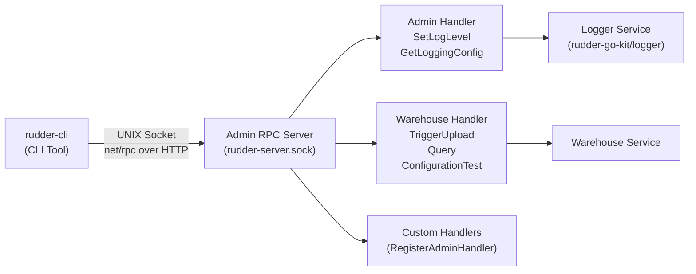

# Admin API Reference

RudderStack exposes two complementary administrative interfaces for runtime server management:

1. **Admin RPC Server** — A UNIX domain socket-based RPC server embedded in the `rudder-server` process that allows runtime administration such as changing log levels, triggering warehouse uploads, and querying warehouses directly.

   Source: `admin/admin.go:1-4`

2. **rudder-cli** — A command-line tool that communicates with the Admin RPC server over the same UNIX socket, providing operator-friendly commands for common administrative tasks.

   Source: `cmd/rudder-cli/main.go:15-19`

> **Socket Path:** The admin server listens on `<RUDDER_TMPDIR>/rudder-server.sock`. When the `RUDDER_TMPDIR` environment variable is not set, it defaults to `/tmp/rudder-server.sock`.
>
> Source: `admin/admin.go:114`, `cmd/rudder-cli/client/client.go:13-16`

> **Protocol:** Communication uses Go's `net/rpc` package over HTTP, served on the UNIX domain socket. The server's `ReadHeaderTimeout` is **3 seconds**.
>
> Source: `admin/admin.go:139-142`

---

## Admin RPC Server

The Admin RPC Server is an in-process HTTP server that listens exclusively on a UNIX domain socket. It provides a registration-based extensibility model that allows any package within `rudder-server` to expose administrative functions over the RPC interface.

### Architecture



### Lifecycle

The Admin RPC Server follows a well-defined lifecycle within the `rudder-server` process:

#### 1. Initialization

`admin.Init()` creates a singleton `rpc.Server` instance and registers the built-in `Admin` handler. This must be called once during server startup before any other packages register their handlers.

Source: `admin/admin.go:66-73`

```go
// admin.Init() creates the singleton RPC server and registers the Admin handler
func Init() {
    pkgLogger = logger.NewLogger().Child("admin")
    instance = &Admin{rpcServer: rpc.NewServer()}
    err := instance.rpcServer.Register(instance)
    // ...
}
```

#### 2. Handler Registration

Other packages register their admin handlers using `admin.RegisterAdminHandler()`. This function delegates to `rpc.Server.RegisterName()`, binding the handler's exported methods under the given service name.

Source: `admin/admin.go:51-54`

```go
admin.RegisterAdminHandler("PackageName", &PackageAdmin{})
```

#### 3. Server Startup

`admin.StartServer(ctx)` resolves the temporary directory path, creates a UNIX socket at `<tmpdir>/rudder-server.sock`, and starts the HTTP RPC server.

Source: `admin/admin.go:109-145`

Key behaviors:

- **Stale socket cleanup:** Any existing socket file at the target path is removed before binding (Source: `admin/admin.go:115-118`)
- **Graceful shutdown:** The server shuts down cleanly when the provided `context.Context` is cancelled (Source: `admin/admin.go:144`)
- **Socket file cleanup on exit:** The socket file is removed via a deferred call when the server shuts down (Source: `admin/admin.go:119-123`)

---

## Built-in Admin Methods

The `Admin` handler is registered automatically during `admin.Init()` and provides two built-in RPC methods for logging management.

### Method Summary

| Method | RPC Name | Arguments | Reply Type | Description |
|--------|----------|-----------|------------|-------------|
| `SetLogLevel` | `Admin.SetLogLevel` | `LogLevel{Module, Level string}` | `string` | Set the logging level for a specific module or server-wide |
| `GetLoggingConfig` | `Admin.GetLoggingConfig` | `struct{}` (empty) | `string` (JSON) | Retrieve the current logging configuration as formatted JSON |

### Admin.SetLogLevel

Dynamically changes the logging verbosity for a specific module or the entire server at runtime, without requiring a restart.

Source: `admin/admin.go:80-92`

**Arguments:**

The `LogLevel` struct contains two fields:

| Field | Type | Required | Description |
|-------|------|----------|-------------|
| `Module` | `string` | Yes | Dot-separated module path (e.g., `"router"`, `"router.GA"`, `"processor"`). Use an empty string `""` for server-wide level. |
| `Level` | `string` | Yes | Target log level. Valid values: `EVENT`, `DEBUG`, `INFO`, `WARN`, `ERROR`, `FATAL` |

Source: `admin/admin.go:75-78`, `cmd/rudder-cli/main.go:96`

**Module Naming Convention:**

Modules use a hierarchical dot-separated naming scheme. Setting the level on a parent module affects all its children:

- `"router"` — Sets the level for the router module and all its children (e.g., `router.GA`, `router.Amplitude`)
- `"router.GA"` — Sets the level only for the Google Analytics sub-module of the router
- `"processor"` — Sets the level for the entire processor module
- `""` (empty string) — Sets the server-wide default logging level

Source: `cmd/rudder-cli/main.go:88-90`

**Return Value:**

On success, returns a confirmation message:

```
Module <name> log level set to <level>
```

Source: `admin/admin.go:89`

**Error Handling:**

- If the module name or log level is invalid, the underlying `logger.SetLogLevel()` returns an error
- Panics within the handler are recovered and returned as formatted error strings: `"internal Rudder server error: <panic value>"`

Source: `admin/admin.go:82-85`

**RPC Call Example (Go):**

```go
var reply string
err := client.Call("Admin.SetLogLevel", admin.LogLevel{
    Module: "router",
    Level:  "DEBUG",
}, &reply)
// reply: "Module router log level set to DEBUG"
```

### Admin.GetLoggingConfig

Retrieves the current runtime logging configuration for all modules as a pretty-printed JSON document. Useful for debugging which modules have custom log levels applied.

Source: `admin/admin.go:94-106`

**Arguments:**

An empty struct — no input parameters are required.

**Return Value:**

A pretty-printed JSON string representing the current logging configuration map. Each key is a module name (or `""` for the root) and each value is the configured log level.

Source: `admin/admin.go:102-104`

**Error Handling:**

- Panics within the handler are recovered and returned as formatted error strings: `"internal Rudder server error: <panic value>"`

Source: `admin/admin.go:96-100`

**RPC Call Example (Go):**

```go
var reply string
var noArgs struct{}
err := client.Call("Admin.GetLoggingConfig", noArgs, &reply)
// reply contains pretty-printed JSON, e.g.:
// {
//   "router": "DEBUG",
//   "processor": "INFO",
//   "warehouse": "WARN"
// }
```

---

## Warehouse Admin Methods

The Warehouse service registers its own handler on the Admin RPC Server, exposing three methods for warehouse operations management. These methods are invoked through `rudder-cli` commands or directly via RPC calls using the `"Warehouse.*"` service prefix.

### Method Summary

| Method | RPC Name | Arguments | Reply Type | Description |
|--------|----------|-----------|------------|-------------|
| `TriggerUpload` | `Warehouse.TriggerUpload` | `bool` | `string` | Trigger immediate warehouse uploads or revert to scheduled mode |
| `Query` | `Warehouse.Query` | `QueryInput` | `QueryResult` | Execute SQL queries against a configured warehouse |
| `ConfigurationTest` | `Warehouse.ConfigurationTest` | `ConfigurationTestInput` | `ConfigurationTestOutput` | Validate warehouse destination connectivity |

### Warehouse.TriggerUpload

Starts warehouse uploads immediately, bypassing the configured sync schedule from the Control Plane. When called with the `off` flag set to `true`, it reverts to the scheduled upload cadence.

Source: `cmd/rudder-cli/main.go:23-37`

**Arguments:**

| Parameter | Type | Description |
|-----------|------|-------------|
| `off` | `bool` | `false` — trigger immediate uploads; `true` — disable explicit triggers and revert to scheduled uploads |

**Return Value:**

A `string` message confirming the action taken.

**RPC Call Example (Go):**

```go
var reply string
// Trigger immediate uploads
err := client.Call("Warehouse.TriggerUpload", false, &reply)
fmt.Println(reply)

// Revert to scheduled uploads
err = client.Call("Warehouse.TriggerUpload", true, &reply)
fmt.Println(reply)
```

### Warehouse.Query

Executes a SQL query against the underlying warehouse for a given destination (and optionally, source). Returns the result as a structured table with column headers and row values.

Source: `cmd/rudder-cli/warehouse/warehouse.go:33-73`

**Arguments — `QueryInput`:**

| Field | Type | Required | Description |
|-------|------|----------|-------------|
| `DestID` | `string` | Yes | Destination ID identifying the target warehouse |
| `SourceID` | `string` | No | Source ID to narrow the query scope |
| `SQLStatement` | `string` | Yes | SQL statement to execute |

Source: `cmd/rudder-cli/warehouse/warehouse.go:18-22`

**Return Value — `QueryResult`:**

| Field | Type | Description |
|-------|------|-------------|
| `Columns` | `[]string` | Column header names in the result set |
| `Values` | `[][]string` | Row data as an array of string arrays |

Source: `cmd/rudder-cli/warehouse/warehouse.go:13-16`

**RPC Call Example (Go):**

```go
reply := warehouse.QueryResult{}
input := warehouse.QueryInput{
    DestID:       "dest_abc123",
    SourceID:     "src_xyz789",
    SQLStatement: "SELECT user_id, event FROM tracks LIMIT 10",
}
err := client.Call("Warehouse.Query", input, &reply)
// reply.Columns: ["user_id", "event"]
// reply.Values:  [["u1", "Login"], ["u2", "Purchase"], ...]
```

### Warehouse.ConfigurationTest

Tests the connectivity and configuration validity for a given warehouse destination. Returns whether the destination's credentials and settings are valid.

Source: `cmd/rudder-cli/warehouse/warehouse.go:75-93`

**Arguments — `ConfigurationTestInput`:**

| Field | Type | Required | Description |
|-------|------|----------|-------------|
| `DestID` | `string` | Yes | Destination ID to test |

Source: `cmd/rudder-cli/warehouse/warehouse.go:24-26`

**Return Value — `ConfigurationTestOutput`:**

| Field | Type | Description |
|-------|------|-------------|
| `Valid` | `bool` | `true` if the warehouse destination configuration is valid |
| `Error` | `string` | Error details if validation failed (empty on success) |

Source: `cmd/rudder-cli/warehouse/warehouse.go:28-31`

**RPC Call Example (Go):**

```go
reply := warehouse.ConfigurationTestOutput{}
input := warehouse.ConfigurationTestInput{
    DestID: "dest_abc123",
}
err := client.Call("Warehouse.ConfigurationTest", input, &reply)
if reply.Valid {
    fmt.Println("destination validated")
} else {
    fmt.Printf("validation failed: %s\n", reply.Error)
}
```

---

## rudder-cli Command Reference (v0.1.1)

`rudder-cli` (current version: **v0.1.1**) is the official command-line interface for administering a running RudderStack server. It connects to the Admin RPC Server over the UNIX domain socket and provides operator-friendly commands for logging management and warehouse operations.

Source: `cmd/rudder-cli/main.go:15-19` (version defined at `cmd/rudder-cli/main.go:18`)

### Tool Metadata

| Property | Value |
|----------|-------|
| Binary name | `rudder` |
| Version | `0.1.1` |
| Description | "A command line interface to your Rudder" |

### Global Flags

These flags apply to all commands and control how `rudder-cli` connects to the server:

| Flag | Alias | Environment Variable | Default | Description |
|------|-------|---------------------|---------|-------------|
| `--server-dir` | `-s` | `config.RudderServerPathKey` | (none) | Server directory path for configuration |
| `--env-file` | `-e` | `config.RudderEnvFilePathKey` | (none) | Path to an environment file for configuration overrides |

Source: `cmd/rudder-cli/main.go:130-143`

> **Important:** The actual UNIX socket path is resolved separately by the RPC client helper using the `RUDDER_TMPDIR` environment variable. When `RUDDER_TMPDIR` is not set, it defaults to `/tmp`, and the socket is located at `<RUDDER_TMPDIR>/rudder-server.sock`.
>
> Source: `cmd/rudder-cli/client/client.go:13-16`

> **Connection Logic:** The CLI reads `RUDDER_TMPDIR` from the environment (defaulting to `/tmp`) and connects to `<RUDDER_TMPDIR>/rudder-server.sock` using `rpc.DialHTTP("unix", ...)`.
>
> Source: `cmd/rudder-cli/client/client.go:12-22`

### Commands

#### trigger-wh-upload

Trigger warehouse uploads immediately, bypassing the configured sync schedule from the Control Plane.

```bash
rudder trigger-wh-upload [--off]
```

| Flag | Alias | Type | Default | Description |
|------|-------|------|---------|-------------|
| `--off` | `-o` | `bool` | `false` | Turn off explicit triggers; revert to Control Plane schedule |

**RPC Method Called:** `Warehouse.TriggerUpload`

Source: `cmd/rudder-cli/main.go:23-37`

**Examples:**

```bash
# Trigger immediate warehouse uploads
rudder trigger-wh-upload

# Revert to scheduled uploads
rudder trigger-wh-upload --off
```

---

#### wh-query

Execute a SQL query against the underlying warehouse for a given destination.

```bash
rudder wh-query --dest <dest_id> [--source <source_id>] --sql <query>
rudder wh-query --dest <dest_id> [--source <source_id>] --file <sql_file>
```

| Flag | Alias | Type | Required | Description |
|------|-------|------|----------|-------------|
| `--dest` | `-d` | `string` | Yes | Destination ID identifying the target warehouse |
| `--source` | `--src` | `string` | No | Source ID to narrow the query scope |
| `--sql` | `-s` | `string` | Conditional | SQL statement to execute (required if `--file` not set) |
| `--file` | `-f` | `string` | Conditional | Path to a SQL file to execute (overrides `--sql`) |

**RPC Method Called:** `Warehouse.Query`

**Output:** Formatted ASCII table with column headers and data rows, rendered via the `tablewriter` library with bold cyan-colored headers.

Source: `cmd/rudder-cli/main.go:38-67`, `cmd/rudder-cli/warehouse/warehouse.go:33-73`

**Examples:**

```bash
# Query with inline SQL
rudder wh-query --dest dest_abc123 --sql "SELECT user_id, event FROM tracks LIMIT 10"

# Query with SQL file
rudder wh-query -d dest_abc123 --src src_xyz789 -f /path/to/query.sql

# Output example:
# +----------+-----------+
# | USER_ID  | EVENT     |
# +----------+-----------+
# | user_001 | Login     |
# | user_002 | Purchase  |
# +----------+-----------+
```

---

#### wh-test

Test the connectivity and configuration validity of a warehouse destination.

```bash
rudder wh-test --dest <dest_id>
```

| Flag | Alias | Type | Required | Description |
|------|-------|------|----------|-------------|
| `--dest` | `-d` | `string` | Yes | Destination ID to validate |

**RPC Method Called:** `Warehouse.ConfigurationTest`

**Output:**

- On success: `Successfully validated destID: <dest_id>`
- On failure: `Failed validation for destID: <dest_id> with err: <error_details>`

Source: `cmd/rudder-cli/main.go:68-82`, `cmd/rudder-cli/warehouse/warehouse.go:75-93`

**Examples:**

```bash
# Test a Snowflake destination
rudder wh-test --dest dest_snowflake_001
# Successfully validated destID: dest_snowflake_001

# Test a misconfigured destination
rudder wh-test -d dest_broken_config
# Failed validation for destID: dest_broken_config with err: connection refused
```

---

#### logging

Dynamically set the log level for a specific module or the entire server at runtime.

```bash
rudder logging --module <module> --level <level>
```

| Flag | Alias | Type | Required | Description |
|------|-------|------|----------|-------------|
| `--module` | `-m` | `string` | Yes | Module path (dot-separated). Use `"root"` for server-wide level. |
| `--level` | `-l` | `string` | Yes | Log level: `EVENT`, `DEBUG`, `INFO`, `WARN`, `ERROR`, `FATAL` |

**RPC Method Called:** `Admin.SetLogLevel`

> **Note:** The special module name `"root"` is normalized to an empty string `""` before the RPC call, which sets the server-wide default logging level.
>
> Source: `cmd/rudder-cli/main.go:102-103`

Source: `cmd/rudder-cli/main.go:83-112`

**Examples:**

```bash
# Set router module to DEBUG level
rudder logging --module router --level DEBUG
# Module router log level set to DEBUG

# Set a specific sub-module
rudder logging -m router.GA -l WARN
# Module router.GA log level set to WARN

# Set server-wide logging level
rudder logging --module root --level INFO
# Module  log level set to INFO
```

---

#### logging-config

Retrieve the current runtime logging configuration for all modules as a JSON document.

```bash
rudder logging-config
```

No flags required.

**RPC Method Called:** `Admin.GetLoggingConfig`

**Output:** Pretty-printed JSON showing the current logging configuration map.

Source: `cmd/rudder-cli/main.go:114-126`

**Example:**

```bash
rudder logging-config
# {
#   "router": "DEBUG",
#   "processor": "INFO",
#   "warehouse": "WARN"
# }
```

---

## Extending the Admin Interface

Any package within `rudder-server` can expose custom administrative functions by registering a handler with the Admin RPC Server. This extensibility model allows modules to add runtime management capabilities without modifying the admin package itself.

Source: `admin/admin.go:6-31`

### Registration Pattern

To register a custom admin handler:

1. **Define an admin struct** in your package (convention: place in `admin.go`)
2. **Register the handler** during package initialization using `admin.RegisterAdminHandler()`
3. **Optionally register a status handler** using `admin.RegisterStatusHandler()` for debug information

Source: `admin/admin.go:8-10`, `admin/admin.go:51-54`

### Implementation Example

```go
// In your package's admin.go file
package mypackage

import "github.com/rudderlabs/rudder-server/admin"

type MyPackageAdmin struct{}

// Register during package initialization
func init() {
    admin.RegisterAdminHandler("MyPackage", &MyPackageAdmin{})
    admin.RegisterStatusHandler("MyPackage", &MyPackageAdmin{})
}

// Status returns debug information for the admin status endpoint.
// Convention: return a map of parameter names to their current values.
func (p *MyPackageAdmin) Status() map[string]interface{} {
    return map[string]interface{}{
        "active-connections": 42,
        "queue-depth":        128,
    }
}

// SomeAdminFunction is a custom RPC method callable via rudder-cli.
// RPC methods MUST follow Go net/rpc conventions:
//   - Method must be exported
//   - Exactly two arguments, both pointer types (or built-in types)
//   - Returns error
func (p *MyPackageAdmin) SomeAdminFunction(arg *string, reply *string) error {
    *reply = "admin function output for: " + *arg
    return nil
}
```

Source: `admin/admin.go:12-30`

### Calling Custom Methods

Once registered, custom methods are callable using the service name prefix:

```go
// From rudder-cli or any RPC client
var reply string
err := client.Call("MyPackage.SomeAdminFunction", &arg, &reply)
```

Source: `admin/admin.go:25`

### Go `net/rpc` Method Requirements

All RPC methods exposed through the Admin interface must follow Go's `net/rpc` conventions:

| Requirement | Details |
|-------------|---------|
| **Visibility** | Method must be exported (capitalized name) |
| **Arguments** | Exactly two arguments: the first is the input (can be pointer or value type), the second is a pointer to the reply |
| **Return type** | Must return `error` |
| **Naming** | Called as `"ServiceName.MethodName"` where `ServiceName` is the string passed to `RegisterAdminHandler()` |

---

## Usage Examples

### Connecting Programmatically (Go)

Connect to the Admin RPC server from a Go application using the standard `net/rpc` package:

```go
package main

import (
    "fmt"
    "log"
    "net/rpc"
    "os"
    "path/filepath"
)

func main() {
    // Resolve socket path (mirrors rudder-cli client logic)
    tmpDir := os.Getenv("RUDDER_TMPDIR")
    if tmpDir == "" {
        tmpDir = "/tmp"
    }
    sockPath := filepath.Join(tmpDir, "rudder-server.sock")

    // Connect to admin UNIX socket
    client, err := rpc.DialHTTP("unix", sockPath)
    if err != nil {
        log.Fatal("connection failed:", err)
    }
    defer client.Close()

    // Example 1: Set log level for the router module
    var reply string
    err = client.Call("Admin.SetLogLevel", struct {
        Module string
        Level  string
    }{"router", "DEBUG"}, &reply)
    if err != nil {
        log.Fatal(err)
    }
    fmt.Println(reply) // "Module router log level set to DEBUG"

    // Example 2: Get current logging configuration
    var configReply string
    var noArgs struct{}
    err = client.Call("Admin.GetLoggingConfig", noArgs, &configReply)
    if err != nil {
        log.Fatal(err)
    }
    fmt.Println(configReply) // Pretty-printed JSON

    // Example 3: Trigger warehouse upload
    var whReply string
    err = client.Call("Warehouse.TriggerUpload", false, &whReply)
    if err != nil {
        log.Fatal(err)
    }
    fmt.Println(whReply)
}
```

Source: `cmd/rudder-cli/client/client.go:12-22`

### Common CLI Workflows

```bash
# 1. Check current logging configuration
rudder logging-config

# 2. Enable DEBUG logging for the router to troubleshoot delivery issues
rudder logging --module router --level DEBUG

# 3. Verify the change took effect
rudder logging-config

# 4. Trigger an immediate warehouse sync
rudder trigger-wh-upload

# 5. Query the warehouse to verify data loaded
rudder wh-query --dest dest_abc123 --sql "SELECT COUNT(*) as total FROM tracks"

# 6. Test a new warehouse destination before enabling it
rudder wh-test --dest dest_new_snowflake

# 7. Reset logging back to INFO when done debugging
rudder logging --module router --level INFO

# 8. Set server-wide logging to ERROR for production
rudder logging --module root --level ERROR
```

### Using with Custom Socket Path

If the RudderStack server is configured with a non-default temporary directory:

```bash
# Set the environment variable
export RUDDER_TMPDIR=/var/run/rudder

# All CLI commands will now use /var/run/rudder/rudder-server.sock
rudder logging-config

# Or use the --server-dir flag
rudder --server-dir /var/run/rudder logging-config
```

---

## Security Considerations

The Admin RPC Server provides **privileged operations** — including log level changes, direct warehouse SQL queries, upload triggers, and configuration tests — over an **unauthenticated** UNIX domain socket. There is no built-in authentication or authorization layer for Admin RPC calls; any process with filesystem access to the socket can invoke any registered method.

> **⚠️ Important:** Access to the UNIX domain socket `/tmp/rudder-server.sock` (or `<RUDDER_TMPDIR>/rudder-server.sock`) should be restricted via filesystem permissions to prevent unauthorized administrative operations.

Source: `admin/admin.go:114-145`

### Recommended Security Practices

| Practice | Implementation | Rationale |
|----------|----------------|-----------|
| **Restrict socket permissions** | `chmod 0600 /tmp/rudder-server.sock` or `chmod 0660` with a dedicated group | Limits socket access to the owning user (or group), preventing unauthorized local processes from invoking admin methods |
| **Use a dedicated service user** | Run `rudder-server` under a dedicated non-root user (e.g., `rudder`) | Ensures the socket is owned by a specific user, providing clear access control boundaries |
| **Custom socket directory** | Set `RUDDER_TMPDIR=/var/run/rudder` with restricted directory permissions (`chmod 0700`) | Moves the socket out of the world-readable `/tmp` directory into a controlled location |
| **Container isolation** | Ensure the socket file is not exposed outside the container via volume mounts | Prevents external access to privileged operations in containerized deployments |
| **Kubernetes Pod Security** | Use `securityContext` with `readOnlyRootFilesystem` where possible, and avoid sharing the socket via `emptyDir` volumes across containers | Limits socket exposure in multi-container pod configurations |

### Risk Assessment

The following Admin RPC methods carry elevated risk if accessed by unauthorized parties:

| Method | Risk | Impact |
|--------|------|--------|
| `Admin.SetLogLevel` | Medium | Could enable verbose logging (`DEBUG`/`EVENT`) causing performance degradation or filling disk space |
| `Warehouse.Query` | **High** | Executes arbitrary SQL against configured warehouses — potential data exfiltration |
| `Warehouse.TriggerUpload` | Medium | Could trigger unscheduled warehouse syncs, impacting warehouse costs and performance |
| `Warehouse.ConfigurationTest` | Low | Could reveal warehouse connectivity details through error messages |

---

## See Also

- [API Overview & Authentication](index.md) — Overview of all RudderStack API surfaces and authentication schemes
- [Warehouse gRPC API](warehouse-grpc-api.md) — Warehouse service gRPC API reference (15 unary RPCs)
- [Configuration Reference](../reference/config-reference.md) — Complete configuration parameter reference for tuning server behavior
- [Warehouse Sync Operations](../guides/operations/warehouse-sync.md) — Operational guide for warehouse sync configuration and monitoring
- [Capacity Planning](../guides/operations/capacity-planning.md) — Pipeline tuning guide for production deployments
