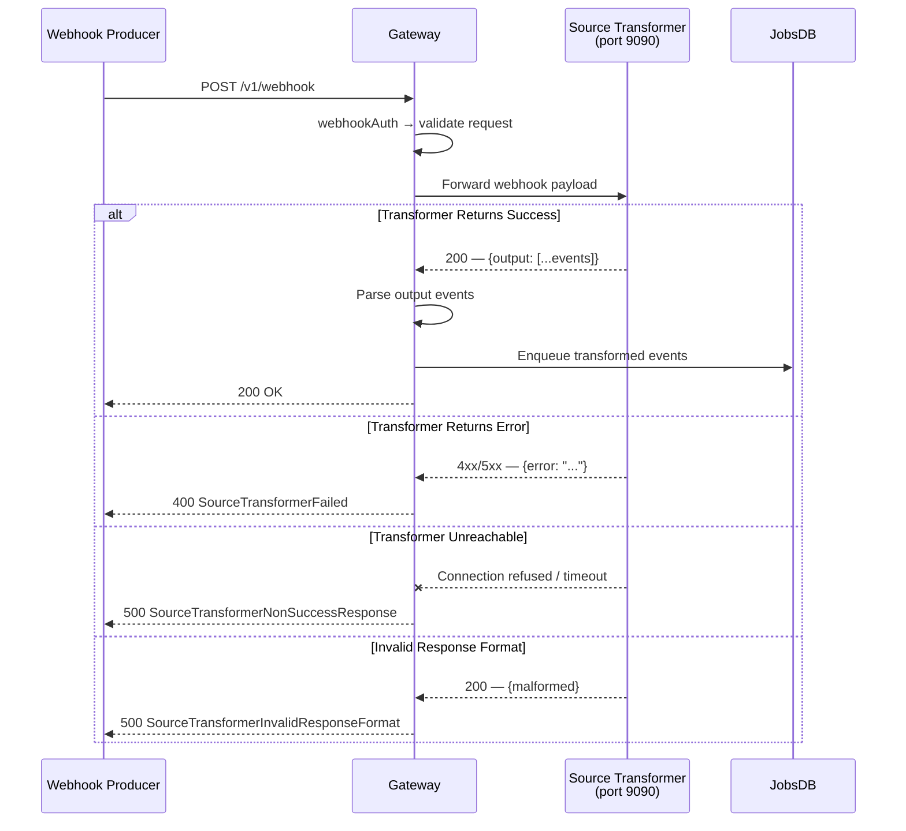

# Error Codes Reference

The RudderStack Gateway returns standardized HTTP responses for every API request. All error responses follow a consistent JSON envelope format, enabling reliable programmatic error handling across all client SDKs and integrations.

**Key Characteristics:**

- All error responses use the JSON envelope format: `{"msg": "<message>"}` — Source: `gateway/response/response.go:152-154` (`MakeResponse` function)
- Successful event ingestion returns a plain-text `"OK"` response with HTTP 200
- The pixel tracking endpoint (`/pixel/v1/*`) returns a transparent 1×1 GIF instead of JSON, ensuring compatibility with image-tag-based tracking — Source: `gateway/response/response.go:82-83`
- When an error constant is not explicitly mapped in the status map, the Gateway defaults to HTTP 500 Internal Server Error — Source: `gateway/response/response.go:145-150` (`GetErrorStatusCode` function)

**Related Documentation:**

- [API Overview & Authentication](index.md) — Authentication schemes and API surface overview
- [Gateway HTTP API Reference](gateway-http-api.md) — Endpoint specifications and request/response formats

---

## HTTP Status Codes

The Gateway uses the following HTTP status codes across all endpoints. Each code maps to one or more specific error conditions documented in the [Error Messages](#error-messages) section below.

Source: `gateway/response/response.go:88-126` (`statusMap`)

| HTTP Code | Status | Trigger Conditions |
|-----------|--------|--------------------|
| **200** | OK | Request successfully received and enqueued for processing |
| **400** | Bad Request | Invalid request format, empty payload, non-identifiable request (missing both `anonymousId` and `userId`), JSON marshal/parse errors, invalid stream message, invalid destination ID, missing destination ID header, source transformer processing failure |
| **401** | Unauthorized | Missing or invalid Write Key, missing or invalid Source ID, invalid replay source |
| **404** | Not Found | Source disabled, destination disabled, invalid webhook source (source not configured as webhook type) |
| **413** | Request Entity Too Large | Request body exceeds the maximum allowed size (configurable via `Gateway.maxReqSizeInKB` in `config/config.yaml`) |
| **429** | Too Many Requests | Per-workspace GCRA-based rate limit exceeded |
| **500** | Internal Server Error | Request body read failure, source transformer response parsing errors, webhook authentication errors; also the default code for unmapped error constants |
| **503** | Service Unavailable | Service temporarily unavailable (e.g., during shutdown or degraded mode) |
| **504** | Gateway Timeout | Request processing exceeded the context deadline or gateway-level timeout |

---

## Error Messages

The following table documents **every** error constant defined in the Gateway response package. Each constant maps to a specific error message string, an HTTP status code (from `statusMap`), and a descriptive category.

Source: `gateway/response/response.go:8-126`

### Complete Error Constant Reference

| Error Constant | Message | HTTP Code | Category |
|----------------|---------|-----------|----------|
| `Ok` | `"ok"` | 200 | Success |
| `RequestBodyNil` | `"request body is nil"` | 400 | Request Validation |
| `InvalidRequestMethod` | `"invalid http request method"` | 400 | Request Validation |
| `TooManyRequests` | `"max requests limit reached"` | 429 | Rate Limiting |
| `NoWriteKeyInBasicAuth` | `"failed to read writekey from header"` | 401 | Authentication |
| `NoWriteKeyInQueryParams` | `"failed to read writekey from query params"` | 401 | Authentication |
| `RequestBodyReadFailed` | `"failed to read body from request"` | 500 | Server Error |
| `RequestBodyTooLarge` | `"request size exceeds max limit"` | 413 | Request Validation |
| `InvalidWriteKey` | `"invalid write key"` | 401 | Authentication |
| `InvalidJSON` | `"invalid json"` | 400 | Request Validation |
| `EmptyBatchPayload` | `"empty batch payload"` | 400 | Request Validation |
| `InvalidWebhookSource` | `"source does not accept webhook events"` | 404 | Webhook |
| `SourceTransformerResponseErrorReadFailed` | `"failed to read error from source transformer response"` | 500 | Source Transformer |
| `SourceDisabled` | `"source is disabled"` | 404 | Configuration |
| `SourceTransformerFailed` | `"internal server error in source transformer"` | 400 | Source Transformer |
| `SourceTransformerFailedToReadOutput` | `"output not found in source transformer response"` | 500 | Source Transformer |
| `SourceTransformerInvalidResponseFormat` | `"invalid format of source transformer response"` | 500 | Source Transformer |
| `SourceTransformerInvalidOutputFormatInResponse` | `"invalid output format in source transformer response"` | 500 | Source Transformer |
| `SourceTransformerInvalidOutputJSON` | `"invalid output json in source transformer response"` | 500 | Source Transformer |
| `SourceTransformerResponseError` | `"error in source transformer response"` | — ¹ | Source Transformer |
| `SourceTransformerNonSuccessResponse` | `"Source Transformer returned non-success statusCode"` | — ¹ | Source Transformer |
| `NonIdentifiableRequest` | `"request neither has anonymousId nor userId"` | 400 | Request Validation |
| `ErrorInMarshal` | `"error while marshalling"` | 400 | Request Validation |
| `ErrorInParseForm` | `"error during parsing form"` | 400 | Request Validation |
| `ErrorInParseMultiform` | `"error during parsing multiform"` | 400 | Request Validation |
| `NotRudderEvent` | `"event is not a valid rudder event"` | 400 | Request Validation |
| `ContextDeadlineExceeded` | `"context deadline exceeded"` ² | 504 | Timeout |
| `GatewayTimeout` | `"gateway timeout"` | 504 | Timeout |
| `ServiceUnavailable` | `"service unavailable"` | 503 | Availability |
| `NoSourceIdInHeader` | `"failed to read source id from header"` | 401 | Authentication |
| `InvalidSourceID` | `"invalid source id"` | 401 | Authentication |
| `InvalidReplaySource` | `"invalid replay source"` | 401 | Authentication |
| `InvalidDestinationID` | `"invalid destination id"` | 400 | Configuration |
| `DestinationDisabled` | `"destination is disabled"` | 404 | Configuration |
| `NoDestinationIDInHeader` | `"failed to read destination id from header"` | 400 | Configuration |
| `ErrAuthenticatingWebhookRequest` | `"error occurred while authenticating the webhook request"` | 500 | Webhook |
| `InvalidStreamMessage` | `"missing required fields stream in message"` | 400 | Request Validation |

> **¹** `SourceTransformerResponseError` and `SourceTransformerNonSuccessResponse` are not mapped in `statusMap`. When these constants are passed to `GetErrorStatusCode`, the function returns HTTP 500 (Internal Server Error) as the default fallback. These constants are used for internal logging and diagnostic purposes rather than direct HTTP responses.
>
> Source: `gateway/response/response.go:145-150`

> **²** `ContextDeadlineExceeded` has the constant value `"context deadline exceeded"`, but its entry in `statusMap` maps to the `GatewayTimeout` message (`"gateway timeout"`). This means the HTTP response body will contain `{"msg": "gateway timeout"}` rather than the raw constant value. This normalization ensures clients receive a consistent timeout message regardless of the underlying cause.
>
> Source: `gateway/response/response.go:122`

---

## Error Categories

### Authentication Errors (401 Unauthorized)

Authentication errors occur when the Gateway cannot verify the identity of the request sender. The Gateway implements five authentication schemes, each with distinct error paths.

Source: `gateway/handle_http_auth.go`

#### Write Key Authentication Errors

These errors occur on public event endpoints (`/v1/identify`, `/v1/track`, `/v1/page`, `/v1/screen`, `/v1/group`, `/v1/alias`, `/v1/batch`).

Source: `gateway/handle_http_auth.go:24-57` (`writeKeyAuth` middleware)

| Error | Message | When It Occurs |
|-------|---------|----------------|
| `NoWriteKeyInBasicAuth` | `"failed to read writekey from header"` | The `Authorization` header is missing, empty, or not valid HTTP Basic Auth format. The Gateway calls `r.BasicAuth()` and fails to extract a username (Write Key). |
| `InvalidWriteKey` | `"invalid write key"` | The extracted Write Key does not match any configured source in the `writeKeysSourceMap`. This map is synchronized from the Control Plane every 5 seconds. |
| `SourceDisabled` | `"source is disabled"` | The Write Key is valid and maps to a known source, but that source is currently disabled in the Control Plane configuration. Returns HTTP 404 (not 401). |

#### Source ID Authentication Errors

These errors occur on internal endpoints (`/internal/v1/batch`, `/internal/v1/extract`).

Source: `gateway/handle_http_auth.go:98-127` (`sourceIDAuth` middleware)

| Error | Message | When It Occurs |
|-------|---------|----------------|
| `NoSourceIdInHeader` | `"failed to read source id from header"` | The `X-Rudder-Source-Id` custom header is missing or empty in the request. |
| `InvalidSourceID` | `"invalid source id"` | The Source ID from the header does not match any source in the `sourceIDSourceMap`. |
| `SourceDisabled` | `"source is disabled"` | The Source ID is valid but the source is currently disabled. Returns HTTP 404. |

#### Replay Source Authentication Errors

These errors occur on the replay endpoint (`/internal/v1/replay`).

Source: `gateway/handle_http_auth.go:180-194` (`replaySourceIDAuth` middleware)

| Error | Message | When It Occurs |
|-------|---------|----------------|
| `InvalidReplaySource` | `"invalid replay source"` | The Source ID passed authentication but the source is not designated as a replay source (`IsReplaySource()` returns `false`). |

> All `sourceIDAuth` errors (above) also apply to the replay endpoint since `replaySourceIDAuth` composes `sourceIDAuth` with an additional replay source check.

#### Webhook Authentication Errors

These errors occur on webhook source endpoints.

Source: `gateway/handle_http_auth.go:64-96` (`webhookAuth` middleware)

| Error | Message | When It Occurs |
|-------|---------|----------------|
| `NoWriteKeyInQueryParams` | `"failed to read writekey from query params"` | Neither a `writeKey` query parameter nor a valid Basic Auth header is present. The Gateway checks the query parameter first, then falls back to Basic Auth. |
| `InvalidWriteKey` | `"invalid write key"` | The Write Key is valid but the source's `SourceCategory` is not `"webhook"`. |
| `InvalidWebhookSource` | `"source does not accept webhook events"` | The source exists but is not configured to receive webhook events. Returns HTTP 404. |

#### Destination Authentication Errors

These errors occur on the Reverse ETL endpoint (`/internal/v1/retl`).

Source: `gateway/handle_http_auth.go:129-178` (`authDestIDForSource` middleware)

| Error | Message | When It Occurs |
|-------|---------|----------------|
| `NoDestinationIDInHeader` | `"failed to read destination id from header"` | The `X-Rudder-Destination-Id` header is missing when `Gateway.requireDestinationIdHeader` is `true`. |
| `InvalidDestinationID` | `"invalid destination id"` | The Destination ID does not belong to any destination configured for the authenticated source. |
| `DestinationDisabled` | `"destination is disabled"` | The destination exists for the source but is currently disabled. Returns HTTP 404. |

---

### Request Validation Errors (400 Bad Request)

Request validation errors indicate that the request reached the Gateway but the payload is malformed, incomplete, or fails structural validation. These errors are returned before any event processing begins.

Source: `gateway/response/response.go:12-85`, `gateway/validator/`

| Error | Message | Common Cause | Example |
|-------|---------|--------------|---------|
| `RequestBodyNil` | `"request body is nil"` | Client sent a request with no body | `curl -X POST http://host:8080/v1/track -u "key:"` (no `-d` flag) |
| `InvalidRequestMethod` | `"invalid http request method"` | Client used GET, PUT, DELETE, etc. instead of POST | `curl -X GET http://host:8080/v1/track` |
| `InvalidJSON` | `"invalid json"` | Request body is not parseable as JSON | `curl -d 'not json' http://host:8080/v1/track -u "key:"` |
| `EmptyBatchPayload` | `"empty batch payload"` | The `batch` array in a `/v1/batch` request is empty | `curl -d '{"batch":[]}' http://host:8080/v1/batch -u "key:"` |
| `NonIdentifiableRequest` | `"request neither has anonymousId nor userId"` | Event payload has neither `userId` nor `anonymousId` | `curl -d '{"event":"test"}' http://host:8080/v1/track -u "key:"` |
| `RequestBodyTooLarge` | `"request size exceeds max limit"` | Request body exceeds `Gateway.maxReqSizeInKB` (default: 4000 KB) | Sending a payload larger than the configured max size |
| `ErrorInMarshal` | `"error while marshalling"` | Internal JSON marshalling error during request processing | Rarely triggered — indicates a malformed internal structure |
| `ErrorInParseForm` | `"error during parsing form"` | Form-encoded request body cannot be parsed | Malformed `application/x-www-form-urlencoded` body |
| `ErrorInParseMultiform` | `"error during parsing multiform"` | Multipart form data cannot be parsed | Malformed `multipart/form-data` body |
| `NotRudderEvent` | `"event is not a valid rudder event"` | The parsed JSON does not conform to the expected RudderStack event structure | Missing required structural fields for the event type |
| `InvalidStreamMessage` | `"missing required fields stream in message"` | A streaming message is missing the required `stream` field | Used with stream-specific message processing |
| `InvalidDestinationID` | `"invalid destination id"` | The Destination ID from the header does not match any destination for the source | Used with `/internal/v1/retl` endpoint |
| `NoDestinationIDInHeader` | `"failed to read destination id from header"` | The `X-Rudder-Destination-Id` header is missing (when required) | Missing header on `/internal/v1/retl` endpoint |

---

### Rate Limiting Errors (429 Too Many Requests)

Rate limiting is enforced on a per-workspace basis using the Generic Cell Rate Algorithm (GCRA). When a workspace exceeds its configured request rate, the Gateway returns HTTP 429.

Source: `gateway/throttler/`

| Error | Message | Description |
|-------|---------|-------------|
| `TooManyRequests` | `"max requests limit reached"` | The workspace has exceeded its configured rate limit. The client should implement exponential backoff and retry. |

**Configuration Parameters:**

| Parameter | Description | Default |
|-----------|-------------|---------|
| `Gateway.throttler.enabled` | Enable/disable rate limiting | `false` |
| `Gateway.throttler.limit` | Maximum requests per window | Configurable per workspace |
| `Gateway.throttler.window` | Rate limiting window duration | Configurable |
| `Gateway.throttler.burst` | Maximum burst size above the rate limit | Configurable |

Source: `config/config.yaml` (Gateway throttler section)

---

### Source Transformer Errors (400/500)

Source transformer errors occur when the Gateway processes events from **webhook sources**. Webhook events are routed through the source transformer service (default port 9090) before being enqueued, and failures at any stage of this pipeline produce specific error codes.

Source: `gateway/webhook/`, `gateway/response/response.go:33-50`

| Error | Message | HTTP Code | Failure Stage |
|-------|---------|-----------|---------------|
| `SourceTransformerFailed` | `"internal server error in source transformer"` | 400 | The transformer service returned an error while processing the webhook event |
| `SourceTransformerResponseErrorReadFailed` | `"failed to read error from source transformer response"` | 500 | The Gateway could not parse the error field from the transformer's response body |
| `SourceTransformerFailedToReadOutput` | `"output not found in source transformer response"` | 500 | The transformer response does not contain the expected `output` field |
| `SourceTransformerInvalidResponseFormat` | `"invalid format of source transformer response"` | 500 | The transformer response body does not match the expected JSON structure |
| `SourceTransformerInvalidOutputFormatInResponse` | `"invalid output format in source transformer response"` | 500 | The `output` field in the transformer response is not in the expected array format |
| `SourceTransformerInvalidOutputJSON` | `"invalid output json in source transformer response"` | 500 | An individual event in the transformer's `output` array is not valid JSON |
| `SourceTransformerResponseError` | `"error in source transformer response"` | 500 ¹ | The transformer reported an error in its response payload |
| `SourceTransformerNonSuccessResponse` | `"Source Transformer returned non-success statusCode"` | 500 ¹ | The transformer service returned a non-2xx HTTP status code |

> **¹** These two constants are not mapped in `statusMap` and use the default 500 fallback from `GetErrorStatusCode`.

**Transformer Pipeline Flow:**



---

### Timeout and Availability Errors (503/504)

Timeout errors indicate that the Gateway could not complete request processing within the allowed time window. Availability errors indicate the service is temporarily unable to accept requests.

| Error | Message | HTTP Code | Description |
|-------|---------|-----------|-------------|
| `ContextDeadlineExceeded` | `"context deadline exceeded"` → response: `"gateway timeout"` | 504 | The Go context deadline was exceeded during request processing. The response message is normalized to `"gateway timeout"` for consistency. |
| `GatewayTimeout` | `"gateway timeout"` | 504 | The Gateway-level timeout was triggered. This is the canonical timeout response. |
| `ServiceUnavailable` | `"service unavailable"` | 503 | The Gateway is temporarily unable to handle requests, typically during shutdown, startup, or degraded mode. |

> **Note:** `ContextDeadlineExceeded` and `GatewayTimeout` produce identical HTTP responses (`504` with message `"gateway timeout"`). The distinction exists at the code level for diagnostic logging — `ContextDeadlineExceeded` indicates a Go context cancellation while `GatewayTimeout` indicates an explicit Gateway-level timeout.
>
> Source: `gateway/response/response.go:122-123`

---

### Configuration Errors (404 Not Found)

Configuration errors occur when the request targets a valid endpoint but the referenced source or destination is disabled or misconfigured.

| Error | Message | HTTP Code | Description |
|-------|---------|-----------|-------------|
| `SourceDisabled` | `"source is disabled"` | 404 | The Write Key or Source ID is valid, but the source has been disabled in the Control Plane. Re-enable the source to resume event ingestion. |
| `DestinationDisabled` | `"destination is disabled"` | 404 | The Destination ID is valid for the source, but the destination has been disabled. Re-enable the destination in the Control Plane. |
| `InvalidWebhookSource` | `"source does not accept webhook events"` | 404 | The source exists but its `SourceCategory` is not `"webhook"`. Only sources configured as webhook type can receive events at webhook endpoints. |

---

### Webhook Errors (500)

Webhook-specific server errors occur during the authentication or processing of webhook events.

| Error | Message | HTTP Code | Description |
|-------|---------|-----------|-------------|
| `ErrAuthenticatingWebhookRequest` | `"error occurred while authenticating the webhook request"` | 500 | An unexpected error occurred during webhook-specific authentication (e.g., custom auth verification for the webhook producer). This is distinct from standard Write Key validation. |

---

### Server Errors (500)

General server errors indicate an internal failure within the Gateway that prevented request processing.

| Error | Message | HTTP Code | Description |
|-------|---------|-----------|-------------|
| `RequestBodyReadFailed` | `"failed to read body from request"` | 500 | An I/O error occurred while reading the request body from the network connection. This typically indicates a client disconnection or network interruption. |

---

## Response Format

The Gateway uses three distinct response formats depending on the endpoint type and request outcome.

### Standard JSON Error Response

All error responses use a JSON envelope with a single `msg` field. The response is generated by the `MakeResponse` function.

Source: `gateway/response/response.go:152-154`

```go
// MakeResponse generates the JSON error envelope
func MakeResponse(msg string) string {
    return fmt.Sprintf(`{"msg": %q}`, msg)
}
```

**Example error responses:**

```json
{"msg": "invalid write key"}
```

```json
{"msg": "request body is nil"}
```

```json
{"msg": "max requests limit reached"}
```

```json
{"msg": "gateway timeout"}
```

### Success Response

Successful event ingestion returns a plain-text `"OK"` string with HTTP 200. This is not wrapped in the JSON envelope.

```
"OK"
```

### Pixel Response

The pixel tracking endpoint (`/pixel/v1/*`) returns a **transparent 1×1 GIF image** (43 bytes) instead of a JSON or text response. This enables tracking via HTML image tags and email open tracking where JavaScript execution is not available.

Source: `gateway/response/response.go:82-83`, `gateway/response/response.go:141-143`

```
Content-Type: image/gif
Content-Length: 43
Body: [43-byte transparent 1×1 GIF89a image]
```

### Status Code Resolution

The Gateway resolves HTTP status codes using the `GetErrorStatusCode` function. If an error constant is not found in `statusMap`, the function defaults to HTTP 500 (Internal Server Error).

Source: `gateway/response/response.go:145-150`

```go
func GetErrorStatusCode(key string) int {
    if status, ok := statusMap[key]; ok {
        return status.code
    }
    return http.StatusInternalServerError
}
```

The `GetStatus` function resolves the display message for an error constant. If the constant is not found in `statusMap`, the raw constant value is returned as-is.

Source: `gateway/response/response.go:134-139`

```go
func GetStatus(key string) string {
    if status, ok := statusMap[key]; ok {
        return status.message
    }
    return key
}
```

---

## Troubleshooting

This section provides step-by-step resolution guidance for the most common Gateway errors.

### Invalid Write Key (401)

**Symptom:** API calls return `{"msg": "invalid write key"}` with HTTP 401.

**Root Cause:** The Write Key used in the `Authorization` header does not match any configured source. This can happen when:
- The Write Key was copied incorrectly (trailing/leading whitespace, partial copy)
- The source was deleted from the Control Plane
- The Write Key belongs to a different environment (e.g., using a production key against a staging Gateway)

**Resolution:**
1. Verify the Write Key in your RudderStack Control Plane dashboard under **Sources → [Your Source] → Write Key**
2. Ensure the `Authorization` header is properly formatted: `Basic <base64("WRITE_KEY:")>` — note the trailing colon after the Write Key
3. Confirm the Gateway is connected to the correct Control Plane and has refreshed its configuration (5-second polling interval)
4. Check Gateway logs for `invalidWriteKey` stat emissions to confirm the rejection

```bash
# Verify your Write Key works
curl -v -X POST http://localhost:8080/v1/track \
  -u "YOUR_WRITE_KEY:" \
  -H "Content-Type: application/json" \
  -d '{"userId":"test","event":"Test"}'
```

---

### Source Disabled (404)

**Symptom:** API calls return `{"msg": "source is disabled"}` with HTTP 404.

**Root Cause:** The Write Key or Source ID is valid and recognized, but the source has been explicitly disabled in the Control Plane.

**Resolution:**
1. Log in to the RudderStack Control Plane
2. Navigate to **Sources** and locate the source by name or ID
3. Toggle the source to **Enabled**
4. Wait up to 5 seconds for the Gateway to pick up the configuration change (Backend Config polling interval)

---

### Rate Limiting (429)

**Symptom:** API calls return `{"msg": "max requests limit reached"}` with HTTP 429.

**Root Cause:** The workspace has exceeded its configured request rate limit. The Gateway uses GCRA (Generic Cell Rate Algorithm) for per-workspace throttling.

**Resolution:**
1. Implement exponential backoff with jitter in your client:
   ```javascript
   // Recommended retry strategy
   const backoff = Math.min(1000 * Math.pow(2, retryCount), 30000);
   const jitter = backoff * (0.5 + Math.random() * 0.5);
   await new Promise(resolve => setTimeout(resolve, jitter));
   ```
2. Review your event volume — consider batching events using the `/v1/batch` endpoint to reduce the number of HTTP requests
3. If the rate limit is too restrictive, adjust the Gateway throttler configuration:
   ```yaml
   # config/config.yaml
   Gateway:
     throttler:
       enabled: true
       limit: 1000        # requests per window
       window: "1s"        # window duration
       burst: 100          # burst allowance
   ```
4. For sustained high-volume workloads, consider splitting traffic across multiple Gateway instances behind a load balancer

---

### Request Too Large (413)

**Symptom:** API calls return `{"msg": "request size exceeds max limit"}` with HTTP 413.

**Root Cause:** The request body exceeds the Gateway's maximum allowed size. The default limit is 4000 KB (approximately 4 MB).

**Resolution:**
1. Reduce the payload size by:
   - Sending fewer events per batch (if using `/v1/batch`)
   - Removing unnecessary properties from event payloads
   - Compressing large trait/property objects
2. If larger payloads are required, increase the max request size:
   ```yaml
   # config/config.yaml
   Gateway:
     maxReqSizeInKB: 8000   # Increase to 8 MB
   ```
3. For very large data loads, consider using the `/v1/import` endpoint which may have separate size limits

---

### Source Transformer Failures (400/500)

**Symptom:** Webhook events return `{"msg": "internal server error in source transformer"}` or other source transformer error messages.

**Root Cause:** The source transformer service (default port 9090) failed to process the webhook event. Common causes include:
- The transformer service is not running or unreachable
- The webhook payload format is not supported by the configured source type
- The transformer encountered an internal error during event transformation

**Resolution:**
1. Verify the transformer service is running and accessible:
   ```bash
   # Check transformer health
   curl -s http://localhost:9090/health
   
   # Check if the transformer container is running (Docker)
   docker ps | grep transformer
   ```
2. Check transformer service logs for detailed error information:
   ```bash
   docker logs rudder-transformer 2>&1 | tail -50
   ```
3. Verify the webhook source configuration matches the expected payload format from the webhook producer
4. If `SourceTransformerInvalidResponseFormat` or `SourceTransformerInvalidOutputJSON` errors persist, the transformer may need to be updated to handle the webhook payload format

---

### Timeout Errors (504)

**Symptom:** API calls return `{"msg": "gateway timeout"}` with HTTP 504.

**Root Cause:** The Gateway could not complete request processing within the allowed time. This can be caused by:
- Database (JobsDB) write latency — the persistent job queue is under heavy load
- High event volume causing backpressure in the processing pipeline
- Network latency to dependent services (transformer, Control Plane)
- Insufficient Gateway resources (CPU, memory)

**Resolution:**
1. Check the Gateway's resource utilization (CPU, memory, disk I/O):
   ```bash
   # Check Gateway process stats
   top -p $(pgrep rudder-server)
   ```
2. Monitor the JobsDB (PostgreSQL) performance:
   ```bash
   # Check active connections and query performance
   psql -U rudder -d jobsdb -c "SELECT * FROM pg_stat_activity WHERE state = 'active';"
   ```
3. Review Gateway configuration for tuning opportunities:
   ```yaml
   # config/config.yaml
   Gateway:
     webPort: 8080
     maxDBWriterProcess: 64        # Increase for higher throughput
     CustomVal: GW                 # Gateway job type identifier
     maxBatchSize: 32              # Batch size for DB writes
   ```
4. For sustained timeout issues, consider deploying the Gateway in `GATEWAY` mode (separate from Processor) and scaling horizontally

---

### Non-Identifiable Request (400)

**Symptom:** API calls return `{"msg": "request neither has anonymousId nor userId"}` with HTTP 400.

**Root Cause:** The event payload does not include either a `userId` or an `anonymousId` field. The RudderStack event spec (compatible with Segment Spec) requires at least one of these identifiers on every event.

**Resolution:**
1. Ensure every event includes at least one identifier:
   ```json
   {
     "userId": "user123",
     "event": "Product Viewed",
     "properties": { "product_id": "P001" }
   }
   ```
   Or for anonymous users:
   ```json
   {
     "anonymousId": "anon-uuid-here",
     "event": "Page Viewed",
     "properties": { "url": "/home" }
   }
   ```
2. If using an SDK, verify the SDK is properly initialized — most SDKs auto-generate an `anonymousId` for unidentified users
3. Check your event payload construction for typos in field names (e.g., `userid` vs `userId`, `anonymous_id` vs `anonymousId`)

---

### Service Unavailable (503)

**Symptom:** API calls return `{"msg": "service unavailable"}` with HTTP 503.

**Root Cause:** The Gateway is temporarily unable to process requests. This typically occurs during:
- Server startup (before configuration has been loaded)
- Graceful shutdown (draining in-flight requests)
- Degraded mode (when critical dependencies are unavailable)

**Resolution:**
1. Wait for the service to become available — this is usually a transient condition
2. Implement retry logic with backoff in your client
3. If the error persists, check the Gateway logs for the underlying cause:
   ```bash
   # Check Gateway startup/shutdown logs
   docker logs rudder-server 2>&1 | grep -i "unavailable\|shutdown\|startup"
   ```
4. Verify that the Gateway's dependencies (PostgreSQL, Backend Config) are healthy and accessible

---

## See Also

- [API Overview & Authentication](index.md) — Full guide to all five authentication schemes, API surface overview, and authentication flow diagrams
- [Gateway HTTP API Reference](gateway-http-api.md) — Complete endpoint specifications with request/response schemas and curl examples
- [Configuration Reference](../reference/config-reference.md) — All Gateway configuration parameters including rate limiting, timeouts, and request size limits
