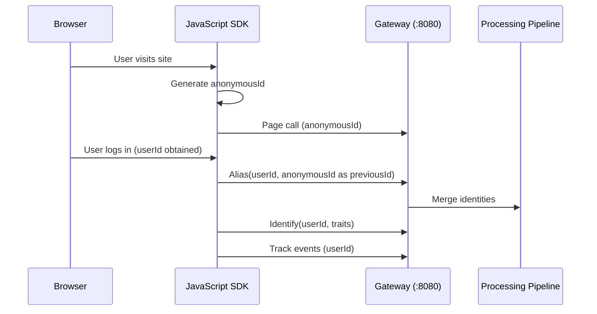

# Alias

The **Alias** method is an advanced method used to merge two unassociated user identities, effectively connecting two sets of user data into a single profile. It explicitly changes the ID of a tracked user and should only be used when required for downstream destination compatibility.

Unlike other event types, the Alias call requires **both** a `userId` (the new canonical identity) and a `previousId` (the existing legacy or anonymous identity). After an Alias call, all future events attributed to either identity resolve to the same user profile.

> **Source references:**
>
> - `gateway/openapi.yaml:318-375` — OpenAPI 3.0.3 endpoint definition for `POST /v1/alias`
> - `gateway/handle_http.go:57-59` — `webAliasHandler` wires `callType("alias", writeKeyAuth(webHandler()))`
> - `refs/segment-docs/src/connections/spec/alias.md` — Segment's canonical Alias specification

> **Segment Compatibility:** RudderStack's Alias call follows the same semantics as the Segment Alias spec. Any payload that works with Segment's Alias endpoint will work identically with RudderStack — no field-level modifications are required.

> **⚠️ Alias is an advanced method.** The Alias method allows you to explicitly change the ID of a tracked user. This should only be done when downstream destination compatibility requires an explicit identity merge. Most identity resolution workflows do not require Alias — see the [Identity Resolution Guide](../../guides/identity/identity-resolution.md) for best practices.

> **Alias and Identity Resolution:** Alias calls merge user profiles in the identity graph. Once merged, all historical events attributed to `previousId` become visible under `userId`. This operation is **permanent** — there is no "un-alias" operation. For advanced identity resolution beyond Alias, refer to the [Identity Resolution Guide](../../guides/identity/identity-resolution.md).

For shared fields present across all event types (`anonymousId`, `context`, `integrations`, `messageId`, `timestamp`, etc.), see [Common Fields](common-fields.md).

---

## HTTP API

### Endpoint Details

| Property | Value |
|----------|-------|
| **Method** | `POST` |
| **Path** | `/v1/alias` |
| **Port** | `8080` (Gateway default) |
| **Authentication** | Basic Auth with WriteKey (`writeKeyAuth`) |
| **Content-Type** | `application/json` |

**Authentication:** The Write Key is sent as the username in an HTTP Basic Authentication header with the password left empty. This is identical to Segment's authentication scheme.

```
Authorization: Basic <base64(YOUR_WRITE_KEY:)>
```

Source: `gateway/openapi.yaml:374-375` — security scheme `writeKeyAuth`

For the full authentication guide covering all 5 authentication schemes, see [API Overview & Authentication](../index.md).

### Response Codes

| HTTP Code | Status | Description | Example Response |
|-----------|--------|-------------|-----------------|
| `200` | OK | Request successfully processed | `"OK"` |
| `400` | Bad Request | Invalid request format or payload | `"Invalid request"` |
| `401` | Unauthorized | Missing or invalid WriteKey | `"Invalid Authorization Header"` |
| `404` | Not Found | Source does not accept webhook events or source is disabled | `"Source does not accept webhook events"` |
| `413` | Request Entity Too Large | Request size exceeds the maximum configured limit | `"Request size too large"` |
| `429` | Too Many Requests | Rate limit exceeded — retry after backoff | `"Too many requests"` |

Source: `gateway/openapi.yaml:330-375`

---

## Fields

The Alias call uses the following fields. For common fields shared across all event types (such as `context`, `integrations`, `messageId`, `timestamp`, `sentAt`, `receivedAt`, `version`), see [Common Fields](common-fields.md).

### Alias-Specific Fields

| Field | Type | Required | Description |
|-------|------|----------|-------------|
| `type` | String | **Yes** | Must be `"alias"`. Identifies this as an Alias event. |
| `userId` | String | **Yes** | The new canonical identifier — the identity you want the user to be known as going forward. This is the identity that `previousId` will be merged into. |
| `previousId` | String | **Yes** | The existing legacy or anonymous identifier that already has event history. This identity will be merged into `userId`. It may be an Anonymous ID generated by the SDK or a User ID from a prior Identify call. |
| `context` | Object | Optional | Dictionary of extra information providing context about the event (IP address, user agent, library info, etc.). See [Common Fields — Context](common-fields.md#context). |
| `timestamp` | String (ISO 8601) | Optional | The timestamp of the message. If not provided, the server sets `receivedAt` as the canonical time. See [Common Fields — Timestamps](common-fields.md#timestamps). |
| `integrations` | Object | Optional | Dictionary controlling which destinations receive this event. The special `"All"` key acts as a default. See [Common Fields — Integrations](common-fields.md#integrations). |
| `messageId` | String | Optional | Unique identifier for this message. Auto-generated by SDKs in UUID format if not provided. Used for deduplication. |
| `anonymousId` | String | Optional | The anonymous identifier of the user. Typically auto-populated by the SDK. |
| `channel` | String | Optional | Where the request originated: `"browser"`, `"server"`, or `"mobile"`. Automatically set by SDKs. |

Source: `gateway/openapi.yaml:868-899` — `AliasPayload` schema definition

> **Important:** Unlike other event types, Alias requires **both** `userId` **and** `previousId`. The `userId` is the new identity to merge into, and `previousId` is the old identity being merged. Requests missing either field may produce unexpected behavior in downstream destinations.

---

## Syntax

The Alias call follows the method signature below:

```javascript
analytics.alias(userId, [previousId], [options], [callback]);
```

### SDK Method Parameters

| Parameter | Required | Type | Description |
|-----------|----------|------|-------------|
| `userId` | **Yes** | String | The new canonical user identifier that the user will be known as going forward. |
| `previousId` | Optional | String | The existing legacy identifier to merge. If omitted in the JavaScript SDK, the user's current `anonymousId` is automatically passed as `previousId`. |
| `options` | Optional | Object | An integrations dictionary for [enabling or disabling specific destinations](common-fields.md#integrations) for this call. |
| `callback` | Optional | Function | A function that is executed after a timeout of 300 ms, giving the browser time to make outbound requests first. |

### Auto-Population of `previousId`

When using the **JavaScript SDK**, calling `analytics.alias("507f191e81")` without an explicit `previousId` automatically supplies the user's current `anonymousId` as `previousId`. This is the most common usage pattern — it links the anonymous browsing session to a known user identity after login or registration.

Source: `refs/segment-docs/src/connections/spec/alias.md:48-52`

### Client-Side vs. Server-Side Alias

> **Important:** If you are instrumenting a **website**, the Anonymous ID is generated client-side in the browser, so Alias calls **must originate from the client-side**. If you are using a **server-side session ID** as the Anonymous ID, then Alias should be called from the **server-side**.

This distinction is critical because the Anonymous ID must be accessible to the code making the Alias call. Browser-generated anonymous IDs are stored in the browser's local storage and are not available server-side without explicit passing.

Source: `refs/segment-docs/src/connections/spec/alias.md:54`

---

## Examples

### Minimal Alias Payload

The simplest Alias call merges a known email identity into a database ID:

```json
{
  "type": "alias",
  "previousId": "jen@email.com",
  "userId": "507f191e81"
}
```

This payload tells the system: "The user previously known as `jen@email.com` should now be identified as `507f191e81`. Merge their event histories."

### curl Example

```bash
curl -X POST http://localhost:8080/v1/alias \
  -u "YOUR_WRITE_KEY:" \
  -H "Content-Type: application/json" \
  -d '{
    "userId": "507f191e81",
    "previousId": "39239-239239-239239-23923"
  }'
```

> **Note:** The `-u "YOUR_WRITE_KEY:"` flag sends the Write Key as the HTTP Basic Auth username with an empty password (note the trailing colon). Replace `YOUR_WRITE_KEY` with your actual source Write Key. The Gateway listens on port **8080** by default.

### JavaScript SDK Examples

```javascript
// Most common usage: auto-passes current anonymousId as previousId
// After a user logs in, merge their anonymous session with their known identity
analytics.alias("507f191e81");

// Explicit previousId: merge a known legacy identity into a new canonical identity
analytics.alias("507f191e81", "previous-anonymous-id");

// With options: control which destinations receive the Alias event
analytics.alias("507f191e81", "previous-anonymous-id", {
  integrations: {
    "All": true,
    "Mixpanel": false
  }
});

// With callback: execute logic after the Alias request is dispatched
analytics.alias("507f191e81", "previous-anonymous-id", {}, function() {
  console.log("Alias call dispatched");
});
```

### Server-Side Example (Node.js)

```javascript
analytics.alias({
  userId: "507f191e81",
  previousId: "39239-239239-239239-23923"
});
```

### Full Alias Call Payload

A complete Alias call payload including all common fields:

```json
{
  "anonymousId": "507f191e810c19729de860ea",
  "channel": "browser",
  "context": {
    "ip": "8.8.8.8",
    "userAgent": "Mozilla/5.0 (Macintosh; Intel Mac OS X 10_9_5) AppleWebKit/537.36 (KHTML, like Gecko) Chrome/40.0.2214.115 Safari/537.36"
  },
  "integrations": {
    "All": true,
    "Mixpanel": false,
    "Salesforce": false
  },
  "messageId": "022bb90c-bbac-11e4-8dfc-aa07a5b093db",
  "previousId": "39239-239239-239239-23923",
  "receivedAt": "2015-02-23T22:28:55.387Z",
  "sentAt": "2015-02-23T22:28:55.111Z",
  "timestamp": "2015-02-23T22:28:55.111Z",
  "type": "alias",
  "userId": "507f191e81",
  "version": "1.1"
}
```

Source: `refs/segment-docs/src/connections/spec/alias.md:62-84`

### Common Alias Workflow

The typical Alias workflow for a web application follows this sequence:

1. **Anonymous browsing:** User visits the site and is assigned an `anonymousId` by the JavaScript SDK.
2. **User registers or logs in:** Your application obtains a permanent `userId` from your database.
3. **Call Alias:** `analytics.alias("db-user-id-507f191e81")` — this merges the anonymous session into the known user profile.
4. **Call Identify:** `analytics.identify("db-user-id-507f191e81", { name: "Jen", email: "jen@email.com" })` — this attaches traits to the now-merged profile.
5. **Continue tracking:** All subsequent Track, Page, and other calls are attributed to the merged identity.



---

## Segment Behavioral Parity

RudderStack's Alias call maintains **full behavioral parity** with the Segment Alias specification. The following table documents field-by-field parity validation as required by the Segment compatibility commitment.

| Field / Behavior | Segment Behavior | RudderStack Behavior | Parity Status |
|------------------|-----------------|---------------------|---------------|
| `userId` | New canonical identity to merge into | New canonical identity to merge into | ✅ Full Parity |
| `previousId` | Legacy identity to be merged | Legacy identity to be merged | ✅ Full Parity |
| Auto `previousId` | JavaScript SDK auto-passes current `anonymousId` when `previousId` is omitted | JavaScript SDK auto-passes current `anonymousId` when `previousId` is omitted | ✅ Full Parity |
| Client-side requirement | Required when browser generates `anonymousId` | Required when browser generates `anonymousId` | ✅ Full Parity |
| Identity merge | Merges two user profiles permanently | Merges two user profiles permanently | ✅ Full Parity |
| Payload structure | `type`, `userId`, `previousId`, `context`, `timestamp`, `integrations`, `messageId` | Identical field set and types | ✅ Full Parity |
| Authentication | HTTP Basic Auth with Write Key | HTTP Basic Auth with Write Key (`writeKeyAuth`) | ✅ Full Parity |
| Response codes | 200/400/401/404/413/429 | 200/400/401/404/413/429 | ✅ Full Parity |
| Destination compatibility | Works with destinations that support identity merging (e.g., Kissmetrics, Mixpanel, Vero) | Works with all compatible destinations | ✅ Full Parity |
| Callback timeout | 300 ms timeout for network requests | 300 ms timeout for network requests | ✅ Full Parity |

> **Note:** Some destinations may not support the Alias call. Alias is primarily required by tools that use their own internal identity systems and need explicit merge signals (historically Kissmetrics, Mixpanel, and Vero). Check destination-specific documentation for Alias support details. See the [Destination Catalog](../../guides/destinations/index.md) for per-destination compatibility.

Source: `refs/segment-docs/src/connections/spec/alias.md`, `gateway/openapi.yaml:318-375`, `gateway/openapi.yaml:868-899`

---

## Identity Graph Implications

The Alias call has significant and **permanent** effects on the identity graph. Understanding these implications is critical before implementing Alias in your tracking plan.

### How Alias Affects the Identity Graph

1. **Profile Merging:** After an Alias call, both `previousId` and `userId` resolve to the **same user profile**. The two identities become permanently linked in the identity graph.

2. **Historical Event Attribution:** All historical events previously attributed to `previousId` become visible under `userId`. This means analytics tools and warehouses will show a unified event history for the merged profile.

3. **Permanent Operation:** There is **no "un-alias" operation**. Once two identities are merged, they cannot be separated. Exercise caution when implementing Alias — incorrect merges can permanently corrupt user profiles.

4. **Warehouse-Level Identity Resolution:** In warehouse destinations, the Alias call triggers identity merge operations through the identity resolution pipeline. The `warehouse/identity/` module handles merge-rule resolution to maintain consistent user profiles across warehouse tables.

Source: `warehouse/identity/` — identity resolution pipeline for warehouse-level identity merging

### When to Use Alias

| Scenario | Use Alias? | Explanation |
|----------|-----------|-------------|
| User registers (anonymous → known) | **Yes** | Merge anonymous browsing session with the new user profile |
| User logs in on a new device | **No** | Use Identify — the `userId` already exists |
| Merging two known user accounts | **Yes** | When your application merges duplicate accounts |
| Correcting a misidentified user | **Caution** | Only if the incorrect identity has been sent to downstream destinations |
| Linking email to database ID | **Yes** | When transitioning from email-based to database ID-based identity |

### Best Practices

- **Call Alias before Identify** when merging an anonymous session into a known user. The sequence should be: `alias()` → `identify()` → `track()`.
- **Never Alias in a loop** — ensure Alias is called only once per identity merge event (e.g., on registration or login, not on every page load).
- **Verify destination support** — not all destinations handle Alias calls. Sending Alias to unsupported destinations has no effect but wastes pipeline resources.
- **Use Identify for most identity workflows** — Alias is only needed when downstream destinations require an explicit merge signal. Most modern destinations handle identity resolution through Identify calls alone.

For comprehensive identity resolution documentation, including cross-touchpoint unification and merge strategies, see the [Identity Resolution Guide](../../guides/identity/identity-resolution.md).

---

## See Also

### Event Spec Reference

- [Common Fields](common-fields.md) — Shared event fields reference (context, integrations, timestamps)
- [Identify](identify.md) — Identify call specification (user traits and identity)
- [Track](track.md) — Track call specification (user actions and events)
- [Page](page.md) — Page call specification (web page views)
- [Screen](screen.md) — Screen call specification (mobile screen views)
- [Group](group.md) — Group call specification (organizational association)

### API Reference

- [Gateway HTTP API](../gateway-http-api.md) — Full HTTP API reference for all Gateway endpoints
- [API Overview & Authentication](../index.md) — Authentication guide covering all 5 auth schemes
- [Error Codes](../error-codes.md) — Complete error response code reference

### Related Guides

- [Identity Resolution Guide](../../guides/identity/identity-resolution.md) — Cross-touchpoint identity unification and merge strategies
- [Segment Migration Guide](../../guides/migration/segment-migration.md) — Step-by-step Segment-to-RudderStack migration
- [Destination Catalog](../../guides/destinations/index.md) — Per-destination Alias support and compatibility
