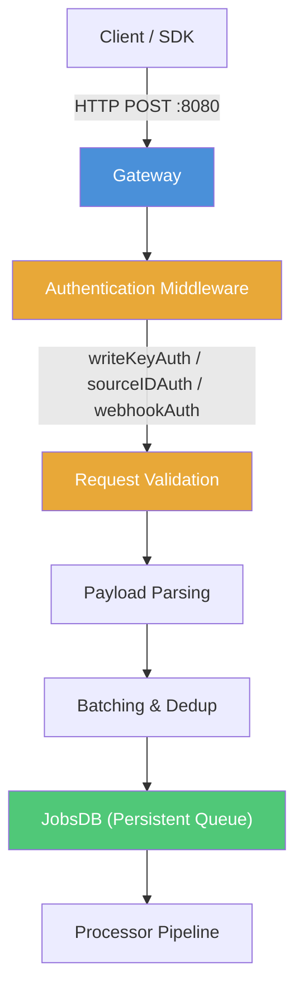

# Gateway HTTP API Reference

The RudderStack Gateway is the HTTP ingestion endpoint that receives all event data from client SDKs, server-side libraries, and third-party webhooks. It exposes a **Segment-compatible HTTP API** on port **8080** that accepts event payloads, authenticates requests, validates message structure, batches events, and enqueues them into the persistent job queue for downstream processing.

> **OpenAPI Specification:** Version 3.0.3 — Title: "RudderStack HTTP API"
> License: Elastic License 2.0 — Contact: support@rudderstack.com
>
> Source: `gateway/openapi.yaml:1-13`

**Related Documentation:**

- [API Overview & Authentication](index.md) — Full authentication guide with all 5 auth schemes
- [Event Spec: Common Fields](event-spec/common-fields.md) — Shared event fields reference
- [Error Codes Reference](error-codes.md) — Complete error message catalog

---

## Gateway Request Flow

Every HTTP request to the Gateway passes through a standardized pipeline of authentication, validation, batching, and enqueuing before events reach the Processor.



Source: `gateway/handle_http.go:83-136`

---

## Authentication

The Gateway enforces authentication at the middleware layer before any request processing begins. Two security schemes are defined in the OpenAPI specification:

| Scheme | Type | Description | Used By |
|--------|------|-------------|---------|
| `writeKeyAuth` | HTTP Basic Auth | Write Key as username, empty password | All public `/v1/*` endpoints |
| `sourceIDAuth` | HTTP Basic Auth | Source ID for internal endpoints | `/internal/v1/*` endpoints |

Source: `gateway/openapi.yaml:678-686`

**Quick Authentication Examples:**

```bash
# WriteKey Auth — Base64-encode "YOUR_WRITE_KEY:" (note the trailing colon)
curl -X POST http://localhost:8080/v1/track \
  -u "YOUR_WRITE_KEY:" \
  -H "Content-Type: application/json" \
  -d '{"userId":"user123","event":"Test"}'

# Source ID Auth — pass source ID via custom header
curl -X POST http://localhost:8080/internal/v1/batch \
  -H "X-Rudder-Source-Id: YOUR_SOURCE_ID" \
  -H "Content-Type: application/json" \
  -d '{"batch":[...]}'
```

> For the full authentication guide covering all 5 authentication schemes (WriteKey, Source ID, Webhook, Replay Source, Source+Destination ID), see [API Overview & Authentication](index.md).

---

## Event API Endpoints

The six core event API endpoints implement the **Segment Spec** and accept identical payloads to their Segment counterparts. Each endpoint uses `writeKeyAuth` (HTTP Basic Auth with Write Key).

### POST /v1/identify

The identify call lets you associate a visiting user to their actions and record any associated traits.

> Source: `gateway/openapi.yaml:15-74`

**Authentication:** `writeKeyAuth` (HTTP Basic Auth)

**Request Body:** `IdentifyPayload`

| Field | Type | Required | Description |
|-------|------|----------|-------------|
| `userId` | string | No* | Unique identifier for a particular user in your database |
| `anonymousId` | string | No* | Sets the user ID for cases where there is no unique identifier for the user |
| `context` | object | No | Dictionary of information that provides context about a message |
| `context.traits` | object | No | User traits (email, name, plan, etc.) passed within the context object |
| `timestamp` | string (date-time) | No | The timestamp of the message's arrival |

*At least one of `userId` or `anonymousId` is required.

> **Segment Compatibility Note:** The Segment Spec documents a top-level `traits` field for identify calls. In the RudderStack OpenAPI specification, traits are defined under `context.traits`. Segment SDKs sending top-level `traits` will have them processed correctly — see the [Identify Event Spec](event-spec/identify.md) for the full Segment parity analysis.

Source: `gateway/openapi.yaml:688-721`

**Response Codes:**

| Code | Description | Example |
|------|-------------|---------|
| 200 | Request accepted | `"OK"` |
| 400 | Invalid request | `"Invalid request"` |
| 401 | Auth failure | `"Invalid Authorization Header"` |
| 404 | Source not found / disabled | `"Source does not accept webhook events"` |
| 413 | Request body too large | `"Request size too large"` |
| 429 | Rate limited | `"Too many requests"` |

**curl Example:**

```bash
curl -X POST https://your-rudderstack-host:8080/v1/identify \
  -H "Authorization: Basic $(echo -n 'YOUR_WRITE_KEY:' | base64)" \
  -H "Content-Type: application/json" \
  -d '{
    "userId": "user123",
    "traits": {
      "email": "user@example.com",
      "name": "John Doe",
      "plan": "enterprise"
    },
    "context": {
      "ip": "8.8.8.8",
      "library": {
        "name": "http"
      }
    },
    "timestamp": "2024-01-15T12:00:00Z"
  }'
```

**JavaScript SDK Example:**

```javascript
rudderanalytics.identify("user123", {
  email: "user@example.com",
  name: "John Doe",
  plan: "enterprise"
});
```

> **Detailed Spec:** See [Identify Event Spec](event-spec/identify.md) for the complete identify call specification with Segment parity notes.

---

### POST /v1/track

The track call lets you track user actions along with any properties associated with them.

> Source: `gateway/openapi.yaml:75-134`

**Authentication:** `writeKeyAuth` (HTTP Basic Auth)

**Request Body:** `TrackPayload`

| Field | Type | Required | Description |
|-------|------|----------|-------------|
| `userId` | string | No* | Unique identifier for a particular user in your database |
| `anonymousId` | string | No* | Sets the user ID for cases where there is no unique identifier for the user |
| `event` | string | Yes | Name of the event being performed by the user |
| `properties` | object | No | Dictionary of the properties associated with a particular event |
| `context` | object | No | Dictionary of information that provides context about a message |
| `timestamp` | string (date-time) | No | The timestamp of the message's arrival |

*At least one of `userId` or `anonymousId` is required.

Source: `gateway/openapi.yaml:722-755`

**Response Codes:**

| Code | Description | Example |
|------|-------------|---------|
| 200 | Request accepted | `"OK"` |
| 400 | Invalid request | `"Invalid request"` |
| 401 | Auth failure | `"Invalid Authorization Header"` |
| 404 | Source not found / disabled | `"Source does not accept webhook events"` |
| 413 | Request body too large | `"Request size too large"` |
| 429 | Rate limited | `"Too many requests"` |

**curl Example:**

```bash
curl -X POST https://your-rudderstack-host:8080/v1/track \
  -H "Authorization: Basic $(echo -n 'YOUR_WRITE_KEY:' | base64)" \
  -H "Content-Type: application/json" \
  -d '{
    "userId": "user123",
    "event": "Product Viewed",
    "properties": {
      "product_id": "P001",
      "name": "Running Shoes",
      "price": 99.99,
      "category": "Footwear"
    },
    "context": {
      "ip": "8.8.8.8"
    },
    "timestamp": "2024-01-15T12:05:00Z"
  }'
```

**JavaScript SDK Example:**

```javascript
rudderanalytics.track("Product Viewed", {
  product_id: "P001",
  name: "Running Shoes",
  price: 99.99,
  category: "Footwear"
});
```

> **Detailed Spec:** See [Track Event Spec](event-spec/track.md) for the complete track call specification with semantic event definitions.

---

### POST /v1/page

The page call lets you record your website's page views with any additional relevant information about the viewed page.

> Source: `gateway/openapi.yaml:135-194`

**Authentication:** `writeKeyAuth` (HTTP Basic Auth)

**Request Body:** `PagePayload`

| Field | Type | Required | Description |
|-------|------|----------|-------------|
| `userId` | string | No* | Unique identifier for a particular user in your database |
| `anonymousId` | string | No* | Sets the user ID for cases where there is no unique identifier for the user |
| `name` | string | No | Name of the page being viewed |
| `properties` | object | No | Dictionary of the properties associated with a particular event |
| `context` | object | No | Dictionary of information that provides context about a message |
| `timestamp` | string (date-time) | No | The timestamp of the message's arrival |

*At least one of `userId` or `anonymousId` is required.

Source: `gateway/openapi.yaml:756-789`

**Response Codes:**

| Code | Description | Example |
|------|-------------|---------|
| 200 | Request accepted | `"OK"` |
| 400 | Invalid request | `"Invalid request"` |
| 401 | Auth failure | `"Invalid Authorization Header"` |
| 404 | Source not found / disabled | `"Source does not accept webhook events"` |
| 413 | Request body too large | `"Request size too large"` |
| 429 | Rate limited | `"Too many requests"` |

**curl Example:**

```bash
curl -X POST https://your-rudderstack-host:8080/v1/page \
  -H "Authorization: Basic $(echo -n 'YOUR_WRITE_KEY:' | base64)" \
  -H "Content-Type: application/json" \
  -d '{
    "userId": "user123",
    "name": "Product Page",
    "properties": {
      "url": "https://example.com/products/shoes",
      "referrer": "https://google.com",
      "title": "Running Shoes - Example Store"
    },
    "timestamp": "2024-01-15T12:10:00Z"
  }'
```

**JavaScript SDK Example:**

```javascript
rudderanalytics.page("Product Page", {
  url: "https://example.com/products/shoes",
  referrer: "https://google.com",
  title: "Running Shoes - Example Store"
});
```

> **Detailed Spec:** See [Page Event Spec](event-spec/page.md) for the complete page call specification.

---

### POST /v1/screen

The screen call is the mobile equivalent of the page call. It lets you record whenever your user views their mobile screen with any additional relevant information about the screen.

> Source: `gateway/openapi.yaml:195-255`

**Authentication:** `writeKeyAuth` (HTTP Basic Auth)

**Request Body:** `ScreenPayload`

| Field | Type | Required | Description |
|-------|------|----------|-------------|
| `userId` | string | No* | Unique identifier for a particular user in your database |
| `anonymousId` | string | No* | Sets the user ID for cases where there is no unique identifier for the user |
| `name` | string | No | Name of the screen being viewed |
| `properties` | object | No | Dictionary of the properties associated with the screen being viewed |
| `context` | object | No | Dictionary of information that provides context about a message |
| `timestamp` | string (date-time) | No | The timestamp of the message's arrival |

*At least one of `userId` or `anonymousId` is required.

Source: `gateway/openapi.yaml:790-825`

**Response Codes:**

| Code | Description | Example |
|------|-------------|---------|
| 200 | Request accepted | `"OK"` |
| 400 | Invalid request | `"Invalid request"` |
| 401 | Auth failure | `"Invalid Authorization Header"` |
| 404 | Source not found / disabled | `"Source does not accept webhook events"` |
| 413 | Request body too large | `"Request size too large"` |
| 429 | Rate limited | `"Too many requests"` |

**curl Example:**

```bash
curl -X POST https://your-rudderstack-host:8080/v1/screen \
  -H "Authorization: Basic $(echo -n 'YOUR_WRITE_KEY:' | base64)" \
  -H "Content-Type: application/json" \
  -d '{
    "userId": "user123",
    "name": "Product Detail",
    "properties": {
      "product_id": "P001",
      "product_name": "Running Shoes"
    },
    "timestamp": "2024-01-15T12:15:00Z"
  }'
```

**Mobile SDK Example (iOS — Swift):**

```swift
RSClient.sharedInstance()?.screen("Product Detail", properties: [
    "product_id": "P001",
    "product_name": "Running Shoes"
])
```

> **Detailed Spec:** See [Screen Event Spec](event-spec/screen.md) for the complete screen call specification.

---

### POST /v1/group

The group call lets you link an identified user with a group such as a company, organization, or an account. It also lets you record any custom traits associated with that group, like the name of the company, the number of employees, etc.

> Source: `gateway/openapi.yaml:256-317`

**Authentication:** `writeKeyAuth` (HTTP Basic Auth)

**Request Body:** `GroupPayload`

| Field | Type | Required | Description |
|-------|------|----------|-------------|
| `userId` | string | No* | Unique identifier for a particular user in your database |
| `anonymousId` | string | No* | Sets the user ID for cases where there is no unique identifier for the user |
| `groupId` | string | Yes | Unique identifier of the group, as present in your database |
| `traits` | object | No | Dictionary of the traits associated with the group, such as name or email |
| `context` | object | No | Dictionary of information that provides context about a message |
| `timestamp` | string (date-time) | No | The timestamp of the message's arrival |

*At least one of `userId` or `anonymousId` is required.

Source: `gateway/openapi.yaml:826-867`

**Response Codes:**

| Code | Description | Example |
|------|-------------|---------|
| 200 | Request accepted | `"OK"` |
| 400 | Invalid request | `"Invalid request"` |
| 401 | Auth failure | `"Invalid Authorization Header"` |
| 404 | Source not found / disabled | `"Source does not accept webhook events"` |
| 413 | Request body too large | `"Request size too large"` |
| 429 | Rate limited | `"Too many requests"` |

**curl Example:**

```bash
curl -X POST https://your-rudderstack-host:8080/v1/group \
  -H "Authorization: Basic $(echo -n 'YOUR_WRITE_KEY:' | base64)" \
  -H "Content-Type: application/json" \
  -d '{
    "userId": "user123",
    "groupId": "group456",
    "traits": {
      "name": "Acme Corp",
      "industry": "Technology",
      "employees": 250,
      "plan": "enterprise"
    },
    "timestamp": "2024-01-15T12:20:00Z"
  }'
```

**JavaScript SDK Example:**

```javascript
rudderanalytics.group("group456", {
  name: "Acme Corp",
  industry: "Technology",
  employees: 250,
  plan: "enterprise"
});
```

> **Detailed Spec:** See [Group Event Spec](event-spec/group.md) for the complete group call specification.

---

### POST /v1/alias

The alias call lets you merge different identities of a known user.

> Source: `gateway/openapi.yaml:318-375`

**Authentication:** `writeKeyAuth` (HTTP Basic Auth)

**Request Body:** `AliasPayload`

| Field | Type | Required | Description |
|-------|------|----------|-------------|
| `userId` | string | Yes | The new unique identifier for the user (the identity to merge into) |
| `previousId` | string | Yes | The previous unique identifier of the user (the identity to merge from) |
| `context` | object | No | Dictionary of information that provides context about a message |
| `timestamp` | string (date-time) | No | The timestamp of the message's arrival |

Source: `gateway/openapi.yaml:868-899`

**Response Codes:**

| Code | Description | Example |
|------|-------------|---------|
| 200 | Request accepted | `"OK"` |
| 400 | Invalid request | `"Invalid request"` |
| 401 | Auth failure | `"Invalid Authorization Header"` |
| 404 | Source not found / disabled | `"Source does not accept webhook events"` |
| 413 | Request body too large | `"Request size too large"` |
| 429 | Rate limited | `"Too many requests"` |

**curl Example:**

```bash
curl -X POST https://your-rudderstack-host:8080/v1/alias \
  -H "Authorization: Basic $(echo -n 'YOUR_WRITE_KEY:' | base64)" \
  -H "Content-Type: application/json" \
  -d '{
    "userId": "user123",
    "previousId": "anonymous-xyz-789",
    "context": {
      "ip": "8.8.8.8"
    },
    "timestamp": "2024-01-15T12:25:00Z"
  }'
```

**JavaScript SDK Example:**

```javascript
rudderanalytics.alias("user123", "anonymous-xyz-789");
```

> **Detailed Spec:** See [Alias Event Spec](event-spec/alias.md) for the complete alias call specification.

---

## Batch Endpoint

### POST /v1/batch

The batch call enables you to send a batch of events (identify, track, page, group, screen, alias) in a single request. This is the most efficient way to send multiple events and is the primary method used by all RudderStack SDKs.

> Source: `gateway/openapi.yaml:376-435`

**Authentication:** `writeKeyAuth` (HTTP Basic Auth)

**Request Body:** `BatchPayload`

| Field | Type | Required | Description |
|-------|------|----------|-------------|
| `batch` | array | **Yes** | Array of event objects. Each event must include a `type` field specifying the event type (`identify`, `track`, `page`, `screen`, `group`, or `alias`) |

> **Important:** The `batch` field is required. Sending a request without it will result in a `400 Bad Request` error.
>
> Source: `gateway/openapi.yaml:938-939`

Each object in the `batch` array follows the same schema as the corresponding individual endpoint (e.g., a track event in a batch has the same fields as `POST /v1/track`), with the addition of a required `type` field.

Source: `gateway/openapi.yaml:900-939`

**Response Codes:**

| Code | Description | Example |
|------|-------------|---------|
| 200 | Request accepted | `"OK"` |
| 400 | Invalid request / empty batch | `"Invalid request"` |
| 401 | Auth failure | `"Invalid Authorization Header"` |
| 404 | Source not found / disabled | `"Source does not accept webhook events"` |
| 413 | Request body too large | `"Request size too large"` |
| 429 | Rate limited | `"Too many requests"` |

**curl Example (Mixed Event Types):**

```bash
curl -X POST https://your-rudderstack-host:8080/v1/batch \
  -H "Authorization: Basic $(echo -n 'YOUR_WRITE_KEY:' | base64)" \
  -H "Content-Type: application/json" \
  -d '{
    "batch": [
      {
        "type": "identify",
        "userId": "user123",
        "traits": {
          "email": "user@example.com",
          "name": "John Doe"
        }
      },
      {
        "type": "track",
        "userId": "user123",
        "event": "Product Viewed",
        "properties": {
          "product_id": "P001",
          "price": 99.99
        }
      },
      {
        "type": "page",
        "userId": "user123",
        "name": "Product Page",
        "properties": {
          "url": "https://example.com/products/P001"
        }
      },
      {
        "type": "group",
        "userId": "user123",
        "groupId": "group456",
        "traits": {
          "name": "Acme Corp"
        }
      }
    ]
  }'
```

**JavaScript SDK Example:**

```javascript
// The JavaScript SDK automatically batches events.
// Configure batch size and flush interval:
rudderanalytics.load("YOUR_WRITE_KEY", "https://your-rudderstack-host:8080", {
  queueOptions: {
    maxItems: 10,        // Events per batch
    flushInterval: 1000  // Flush interval in ms
  }
});
```

---

## Import Endpoint

### POST /v1/import

The import endpoint is designed for server-side bulk event ingestion. It uses the same authentication as public event endpoints but processes events through a dedicated import request handler optimized for high-volume historical data imports.

> Source: `gateway/handle_http_import.go:1-10`

**Authentication:** `writeKeyAuth` (HTTP Basic Auth)

**Request Body:** Same as the [Batch endpoint](#post-v1batch) — an array of event objects in a `batch` field.

**Handler Details:** The import handler uses a separate `ImportRequestHandler` (`irh`) for processing, which is optimized for bulk ingestion workloads.

Source: `gateway/handle_http_import.go:7-9`

**curl Example:**

```bash
curl -X POST https://your-rudderstack-host:8080/v1/import \
  -H "Authorization: Basic $(echo -n 'YOUR_WRITE_KEY:' | base64)" \
  -H "Content-Type: application/json" \
  -d '{
    "batch": [
      {
        "type": "track",
        "userId": "user001",
        "event": "Order Completed",
        "properties": {"revenue": 150.00},
        "timestamp": "2023-12-01T10:00:00Z"
      },
      {
        "type": "track",
        "userId": "user002",
        "event": "Order Completed",
        "properties": {"revenue": 250.00},
        "timestamp": "2023-12-01T11:00:00Z"
      }
    ]
  }'
```

---

## Internal API Endpoints

Internal API endpoints are used by RudderStack's internal services (reverse ETL, replay, cloud extract) for programmatic event ingestion. These endpoints use different authentication schemes than public endpoints.

> **Note:** Internal endpoints are tagged as "Internal API" in the OpenAPI spec and are not intended for direct client SDK usage.

### POST /internal/v1/extract

Handles cloud extract (source) requests. Cloud extract sources use this endpoint to ingest data pulled from external APIs (e.g., Salesforce, HubSpot, Google Analytics).

> Source: `gateway/openapi.yaml:436-487`

**Authentication:** `writeKeyAuth` (HTTP Basic Auth)

Source: `gateway/openapi.yaml:486-487`

**Handler:** `gateway/handle_http.go:23-25` — `webExtractHandler`

**Response Codes:**

| Code | Description | Example |
|------|-------------|---------|
| 200 | Request accepted | `"OK"` |
| 400 | Invalid request | `"Invalid request"` |
| 401 | Auth failure | `"Invalid Authorization Header"` |
| 404 | Source not found / disabled | `"Source does not accept webhook events"` |
| 413 | Request body too large | `"Request size too large"` |
| 429 | Rate limited | `"Too many requests"` |

**curl Example:**

```bash
curl -X POST https://your-rudderstack-host:8080/internal/v1/extract \
  -H "Authorization: Basic $(echo -n 'YOUR_WRITE_KEY:' | base64)" \
  -H "Content-Type: application/json" \
  -d '{
    "batch": [
      {
        "type": "track",
        "userId": "ext-user-001",
        "event": "Lead Created",
        "properties": {
          "source": "salesforce",
          "lead_id": "00Q5e000001abc"
        }
      }
    ]
  }'
```

---

### POST /internal/v1/retl

Handles reverse ETL (rETL) requests. Reverse ETL sources use this endpoint to push warehouse query results back into downstream destinations.

> Source: `gateway/openapi.yaml:488-539`

**Authentication:** `sourceDestIDAuth` — Source ID + Destination ID via custom headers

Source: `gateway/openapi.yaml:538-539`, `gateway/handle_http_retl.go:6-8`

**Required Headers:**

| Header | Required | Description |
|--------|----------|-------------|
| `X-Rudder-Source-Id` | Yes | Source identifier |
| `X-Rudder-Destination-Id` | Conditional | Destination identifier (required if `Gateway.requireDestinationIdHeader` is true) |
| `X-Rudder-Job-Run-Id` | No | Job run identifier for tracking |
| `X-Rudder-Task-Run-Id` | No | Task run identifier for tracking |

Source: `gateway/handle_http_auth.go:196-201`, `gateway/handle_http_auth.go:129-178`, `gateway/handle_http_auth.go:204-206`

**Handler Details:** The retl handler composes `sourceIDAuth` and `authDestIDForSource` middlewares to validate both the source and destination identifiers. The destination must belong to the authenticated source and must be enabled.

**Response Codes:**

| Code | Description | Example |
|------|-------------|---------|
| 200 | Request accepted | `"OK"` |
| 400 | Invalid request / invalid destination | `"Invalid request"` |
| 401 | Auth failure | `"Invalid Authorization Header"` |
| 404 | Source/destination disabled | `"Source does not accept webhook events"` |
| 413 | Request body too large | `"Request size too large"` |
| 429 | Rate limited | `"Too many requests"` |

**curl Example:**

```bash
curl -X POST https://your-rudderstack-host:8080/internal/v1/retl \
  -H "X-Rudder-Source-Id: YOUR_SOURCE_ID" \
  -H "X-Rudder-Destination-Id: YOUR_DESTINATION_ID" \
  -H "X-Rudder-Job-Run-Id: job-run-abc123" \
  -H "X-Rudder-Task-Run-Id: task-run-def456" \
  -H "Content-Type: application/json" \
  -d '{
    "batch": [
      {
        "type": "track",
        "userId": "retl-user-001",
        "event": "Audience Synced",
        "properties": {
          "segment_name": "High Value Users"
        }
      }
    ]
  }'
```

---

### POST /internal/v1/audiencelist

Handles audience list requests for audience-based destination syncing.

> Source: `gateway/openapi.yaml:540-591`

**Authentication:** `writeKeyAuth` (HTTP Basic Auth)

Source: `gateway/openapi.yaml:590-591`

**Handler:** `gateway/handle_http.go:18-20` — `webAudienceListHandler`

**Response Codes:**

| Code | Description | Example |
|------|-------------|---------|
| 200 | Request accepted | `"OK"` |
| 400 | Invalid request | `"Invalid request"` |
| 401 | Auth failure | `"Invalid Authorization Header"` |
| 404 | Source not found / disabled | `"Source does not accept webhook events"` |
| 413 | Request body too large | `"Request size too large"` |
| 429 | Rate limited | `"Too many requests"` |

**curl Example:**

```bash
curl -X POST https://your-rudderstack-host:8080/internal/v1/audiencelist \
  -H "Authorization: Basic $(echo -n 'YOUR_WRITE_KEY:' | base64)" \
  -H "Content-Type: application/json" \
  -d '{
    "batch": [
      {
        "type": "audiencelist",
        "userId": "user123",
        "properties": {
          "listId": "audience-list-789",
          "action": "add"
        }
      }
    ]
  }'
```

---

### POST /internal/v1/replay

Handles replay requests for re-ingesting archived events. The replay endpoint validates that the source is a designated replay source before accepting events.

> Source: `gateway/openapi.yaml:592-643`

**Authentication:** `replaySourceIDAuth` — Source ID auth with additional replay source validation

Source: `gateway/openapi.yaml:642-643`, `gateway/handle_http_replay.go:6-8`

**Required Headers:**

| Header | Required | Description |
|--------|----------|-------------|
| `X-Rudder-Source-Id` | Yes | Source identifier — must be a replay source |

**Handler Details:** The replay handler uses `replaySourceIDAuth` middleware, which composes `sourceIDAuth` with an additional check that verifies the source is marked as a replay source (`s.IsReplaySource()`). If the source is not a replay source, the request is rejected with `InvalidReplaySource`.

Source: `gateway/handle_http_auth.go:180-194`

**Response Codes:**

| Code | Description | Example |
|------|-------------|---------|
| 200 | Request accepted | `"OK"` |
| 400 | Invalid request | `"Invalid request"` |
| 401 | Auth failure / invalid replay source | `"Invalid Authorization Header"` |
| 404 | Source not found / disabled | `"Source does not accept webhook events"` |
| 413 | Request body too large | `"Request size too large"` |
| 429 | Rate limited | `"Too many requests"` |

**curl Example:**

```bash
curl -X POST https://your-rudderstack-host:8080/internal/v1/replay \
  -H "X-Rudder-Source-Id: YOUR_REPLAY_SOURCE_ID" \
  -H "Content-Type: application/json" \
  -d '{
    "batch": [
      {
        "type": "track",
        "userId": "user123",
        "event": "Order Completed",
        "properties": {"orderId": "ORD-001"},
        "timestamp": "2023-11-15T10:00:00Z"
      }
    ]
  }'
```

---

### POST /internal/v1/batch

Handles internal batch requests from RudderStack internal services.

> Source: `gateway/openapi.yaml:644-674`

**Authentication:** `sourceIDAuth` (Source ID via `X-Rudder-Source-Id` header)

Source: `gateway/openapi.yaml:673-674`

**Handler:** `gateway/handle_http.go:32-34` — `internalBatchHandler`

**Required Headers:**

| Header | Required | Description |
|--------|----------|-------------|
| `X-Rudder-Source-Id` | Yes | Source identifier |

**Response Codes:**

| Code | Description | Example |
|------|-------------|---------|
| 200 | Request accepted | `"OK"` |
| 400 | Invalid request | `"Invalid request"` |
| 401 | Auth failure | `"Invalid Authorization Header"` |

**curl Example:**

```bash
curl -X POST https://your-rudderstack-host:8080/internal/v1/batch \
  -H "X-Rudder-Source-Id: YOUR_SOURCE_ID" \
  -H "Content-Type: application/json" \
  -d '{
    "batch": [
      {
        "type": "track",
        "userId": "internal-user-001",
        "event": "Sync Completed",
        "properties": {
          "records_synced": 1500
        }
      }
    ]
  }'
```

---

## Beacon and Pixel Endpoints

Beacon and pixel endpoints provide specialized ingestion paths for browser-based tracking scenarios where standard HTTP POST requests are not practical. These endpoints are **not listed in the OpenAPI specification** but are implemented directly in the handler code.

### POST /beacon/v1/{type}

The beacon endpoint supports the browser `navigator.sendBeacon()` API, which allows sending analytics data during page unload events (e.g., when the user navigates away from a page). The WriteKey is passed as a **query parameter** instead of an Authorization header, since the Beacon API has limited header support.

> Source: `gateway/handle_http_beacon.go:1-47`

**Authentication:** `writeKeyAuth` via query parameter `?writeKey=<WRITE_KEY>`

**Supported Event Types:** `identify`, `track`, `page`, `screen`, `group`, `alias`, `batch`

**How It Works:**
1. The beacon interceptor reads the `writeKey` from query parameters
2. It sets the `writeKey` as the Basic Auth header on the request
3. The request is forwarded to the standard web handler for processing

Source: `gateway/handle_http_beacon.go:19-46`

**Request Content-Type:** `text/plain` (Beacon API sends data as plain text)

**curl Example:**

```bash
curl -X POST "https://your-rudderstack-host:8080/beacon/v1/track?writeKey=YOUR_WRITE_KEY" \
  -H "Content-Type: text/plain" \
  -d '{"userId":"user123","event":"Page Unload","properties":{"time_on_page":45}}'
```

**JavaScript (Browser Beacon API):**

```javascript
// Automatically used by the RudderStack JavaScript SDK during page unload
const data = JSON.stringify({
  userId: "user123",
  event: "Page Unload",
  properties: { time_on_page: 45 }
});

navigator.sendBeacon(
  "https://your-rudderstack-host:8080/beacon/v1/track?writeKey=YOUR_WRITE_KEY",
  data
);
```

> **Note:** If the `writeKey` query parameter is missing, the Gateway returns HTTP `401` with `"failed to read writekey from query params"`.

---

### GET /pixel/v1/{type}

The pixel tracking endpoint enables image-based event tracking — commonly used for email open tracking where JavaScript execution is not possible. All event data is passed as **query parameters**, and the response is always a transparent **1×1 GIF image** regardless of whether the event was successfully processed.

> Source: `gateway/handle_http_pixel.go:1-158`

**Authentication:** `writeKeyAuth` via query parameter `?writeKey=<WRITE_KEY>`

**Supported Event Types:** `page`, `track`

**How It Works:**
1. The pixel interceptor reads the `writeKey` and event data from query parameters
2. It constructs a JSON payload from the query parameters with default fields (`channel: "web"`, `integrations: {"All": true}`)
3. It sets `originalTimestamp` and `sentAt` to the current server time
4. The request is internally rewritten to a POST and passed to the standard handler
5. Regardless of the processing result, a transparent 1×1 GIF is returned to the client

Source: `gateway/handle_http_pixel.go:36-89`, `gateway/handle_http_pixel.go:92-130`

**Response:** Always returns a transparent 1×1 GIF image with `Content-Type: image/gif`

**HTML Example (Email Open Tracking):**

```html
<!-- Track email opens with a pixel -->

```

**HTML Example (Page View Tracking):**

```html
<!-- Track page views with a pixel -->

```

> **Note:** The pixel endpoint always returns the GIF image even if authentication fails or the event cannot be processed. This prevents broken image icons in emails.

---

## Webhook Endpoints

Webhook endpoints allow external services to push event data directly into RudderStack. Unlike standard event endpoints, webhook sources are configured per-source in the control plane and use a flexible authentication scheme that accepts the WriteKey via either HTTP Basic Auth or a query parameter.

> Source: `gateway/handle_http_auth.go:64-96`

**Authentication:** `webhookAuth` — WriteKey via Basic Auth header **OR** `?writeKey=` query parameter

**WriteKey Resolution Order:**
1. First checks for `writeKey` in the URL query parameters
2. Falls back to HTTP Basic Auth header

Source: `gateway/handle_http_auth.go:74-78`

**Validation:** The source must have `sourceCategory == "webhook"`. If the write key corresponds to a source that is not a webhook source, the request is rejected.

Source: `gateway/handle_http_auth.go:85`

**Processing:** Webhook payloads are passed through the source transformer service for normalization into the standard RudderStack event format before being enqueued.

**curl Example (Query Parameter Auth):**

```bash
curl -X POST "https://your-rudderstack-host:8080/v1/webhook?writeKey=YOUR_WEBHOOK_WRITE_KEY" \
  -H "Content-Type: application/json" \
  -d '{
    "event_type": "order.created",
    "data": {
      "order_id": "ORD-001",
      "amount": 150.00,
      "customer_email": "customer@example.com"
    }
  }'
```

**curl Example (Basic Auth):**

```bash
curl -X POST https://your-rudderstack-host:8080/v1/webhook \
  -u "YOUR_WEBHOOK_WRITE_KEY:" \
  -H "Content-Type: application/json" \
  -d '{
    "event_type": "order.created",
    "data": {
      "order_id": "ORD-001",
      "amount": 150.00
    }
  }'
```

---

## Utility Endpoints

The Gateway exposes several utility endpoints for health checking, version information, and interactive API documentation.

### GET /version

Returns the current server version string.

```bash
curl http://localhost:8080/version
```

**Response:**
```
1.68.1
```

---

### GET /health

Health check endpoint used by load balancers, container orchestrators (Kubernetes liveness probes), and monitoring systems to verify the Gateway is running and accepting connections.

```bash
curl http://localhost:8080/health
```

**Response:**
```
OK
```

---

### GET /docs

Serves the interactive OpenAPI documentation UI. This provides a Swagger/Redoc-style interface for exploring the Gateway HTTP API directly in a web browser.

> Source: `gateway/openapi/index.html`

```bash
# Open in browser
open http://localhost:8080/docs
```

---

### GET /robots.txt

Prevents search engine crawlers from indexing Gateway endpoints.

Source: `gateway/handle_http.go:72-74`

**Response:**
```
User-agent: *
Disallow: /
```

---

## Request Schemas

All request payload schemas are defined in the OpenAPI specification components section. Below is the comprehensive reference for each schema.

> Source: `gateway/openapi.yaml:687-939`

### IdentifyPayload

| Field | Type | Required | Description |
|-------|------|----------|-------------|
| `userId` | string | No* | Unique identifier for a particular user in your database |
| `anonymousId` | string | No* | Sets the user ID for cases where there is no unique identifier for the user |
| `context` | object | No | Dictionary of information providing context about the message |
| `context.traits` | object | No | User traits passed in the context |
| `context.ip` | string | No | IP address of the user |
| `context.library` | object | No | Information about the sending library |
| `context.library.name` | string | No | Name of the library |
| `timestamp` | string (date-time) | No | The timestamp of the message's arrival |

*At least one of `userId` or `anonymousId` is required.

Source: `gateway/openapi.yaml:688-721`

```json
{
  "userId": "user123",
  "anonymousId": "anon-456",
  "context": {
    "traits": {
      "email": "user@example.com"
    },
    "ip": "8.8.8.8",
    "library": {
      "name": "analytics-node"
    }
  },
  "timestamp": "2024-01-15T12:00:00Z"
}
```

---

### TrackPayload

| Field | Type | Required | Description |
|-------|------|----------|-------------|
| `userId` | string | No* | Unique identifier for a particular user in your database |
| `anonymousId` | string | No* | Sets the user ID for cases where there is no unique identifier for the user |
| `event` | string | Yes | Name of the event being performed by the user |
| `properties` | object | No | Dictionary of the properties associated with a particular event |
| `context` | object | No | Dictionary of information providing context about the message |
| `context.ip` | string | No | IP address of the user |
| `context.library` | object | No | Information about the sending library |
| `timestamp` | string (date-time) | No | The timestamp of the message's arrival |

*At least one of `userId` or `anonymousId` is required.

Source: `gateway/openapi.yaml:722-755`

```json
{
  "userId": "user123",
  "event": "Product Viewed",
  "properties": {
    "product_id": "P001",
    "name": "Running Shoes",
    "price": 99.99
  },
  "context": {
    "ip": "8.8.8.8",
    "library": {
      "name": "analytics-node"
    }
  },
  "timestamp": "2024-01-15T12:05:00Z"
}
```

---

### PagePayload

| Field | Type | Required | Description |
|-------|------|----------|-------------|
| `userId` | string | No* | Unique identifier for a particular user in your database |
| `anonymousId` | string | No* | Sets the user ID for cases where there is no unique identifier for the user |
| `name` | string | No | Name of the page being viewed |
| `properties` | object | No | Dictionary of the properties associated with the page |
| `context` | object | No | Dictionary of information providing context about the message |
| `context.ip` | string | No | IP address of the user |
| `context.library` | object | No | Information about the sending library |
| `timestamp` | string (date-time) | No | The timestamp of the message's arrival |

*At least one of `userId` or `anonymousId` is required.

Source: `gateway/openapi.yaml:756-789`

```json
{
  "userId": "user123",
  "name": "Product Page",
  "properties": {
    "url": "https://example.com/products/shoes",
    "referrer": "https://google.com",
    "title": "Running Shoes - Example Store"
  },
  "timestamp": "2024-01-15T12:10:00Z"
}
```

---

### ScreenPayload

| Field | Type | Required | Description |
|-------|------|----------|-------------|
| `userId` | string | No* | Unique identifier for a particular user in your database |
| `anonymousId` | string | No* | Sets the user ID for cases where there is no unique identifier for the user |
| `name` | string | No | Name of the screen being viewed |
| `properties` | object | No | Dictionary of the properties associated with the screen |
| `context` | object | No | Dictionary of information providing context about the message |
| `context.ip` | string | No | IP address of the user |
| `context.library` | object | No | Information about the sending library |
| `timestamp` | string (date-time) | No | The timestamp of the message's arrival |

*At least one of `userId` or `anonymousId` is required.

Source: `gateway/openapi.yaml:790-825`

```json
{
  "userId": "user123",
  "name": "Product Detail",
  "properties": {
    "product_id": "P001",
    "product_name": "Running Shoes"
  },
  "timestamp": "2024-01-15T12:15:00Z"
}
```

---

### GroupPayload

| Field | Type | Required | Description |
|-------|------|----------|-------------|
| `userId` | string | No* | Unique identifier for a particular user in your database |
| `anonymousId` | string | No* | Sets the user ID for cases where there is no unique identifier for the user |
| `groupId` | string | Yes | Unique identifier of the group, as present in your database |
| `traits` | object | No | Dictionary of the traits associated with the group, such as name or email |
| `context` | object | No | Dictionary of information providing context about the message |
| `context.traits` | object | No | Context-level traits |
| `context.ip` | string | No | IP address of the user |
| `context.library` | object | No | Information about the sending library |
| `timestamp` | string (date-time) | No | The timestamp of the message's arrival |

*At least one of `userId` or `anonymousId` is required.

Source: `gateway/openapi.yaml:826-867`

```json
{
  "userId": "user123",
  "groupId": "group456",
  "traits": {
    "name": "Acme Corp",
    "industry": "Technology",
    "employees": 250
  },
  "timestamp": "2024-01-15T12:20:00Z"
}
```

---

### AliasPayload

| Field | Type | Required | Description |
|-------|------|----------|-------------|
| `userId` | string | Yes | The new unique identifier for the user |
| `previousId` | string | Yes | The previous unique identifier of the user |
| `context` | object | No | Dictionary of information providing context about the message |
| `context.traits` | object | No | Context-level traits |
| `context.ip` | string | No | IP address of the user |
| `context.library` | object | No | Information about the sending library |
| `timestamp` | string (date-time) | No | The timestamp of the message's arrival |

Source: `gateway/openapi.yaml:868-899`

```json
{
  "userId": "user123",
  "previousId": "anonymous-xyz-789",
  "context": {
    "ip": "8.8.8.8"
  },
  "timestamp": "2024-01-15T12:25:00Z"
}
```

---

### BatchPayload

| Field | Type | Required | Description |
|-------|------|----------|-------------|
| `batch` | array | **Yes** | Array of event objects. Each object must include a `type` field |

Each element in the `batch` array is a union of all event payload types with the following common fields:

| Field | Type | Required | Description |
|-------|------|----------|-------------|
| `type` | string | **Yes** | Event type: `identify`, `track`, `page`, `screen`, `group`, or `alias` |
| `userId` | string | No* | User identifier |
| `anonymousId` | string | No* | Anonymous identifier |
| `context` | object | No | Context information |
| `timestamp` | string | No | Event timestamp |

*At least one of `userId` or `anonymousId` is required per event.

Source: `gateway/openapi.yaml:900-939`

```json
{
  "batch": [
    {
      "type": "identify",
      "userId": "user123",
      "context": {
        "traits": { "email": "user@example.com" }
      }
    },
    {
      "type": "track",
      "userId": "user123",
      "event": "Product Viewed",
      "properties": { "product_id": "P001" }
    }
  ]
}
```

---

## Response Codes

All Gateway endpoints return standard HTTP status codes. Successful event ingestion returns `"OK"` as a plain text response. Error responses are returned as plain text strings describing the error.

| Code | Status | Description | Example Response |
|------|--------|-------------|-----------------|
| 200 | OK | Request successfully accepted and enqueued | `"OK"` |
| 400 | Bad Request | Invalid request body, empty batch, non-identifiable request, invalid JSON, or invalid stream message | `"Invalid request"` |
| 401 | Unauthorized | Missing or invalid write key, missing source ID, invalid source ID, or invalid replay source | `"Invalid Authorization Header"` |
| 404 | Not Found | Source is disabled, destination is disabled, or source does not accept webhook events | `"Source does not accept webhook events"` |
| 413 | Request Entity Too Large | Request body exceeds the configured maximum size limit | `"Request size too large"` |
| 429 | Too Many Requests | Per-workspace rate limit exceeded | `"Too many requests"` |
| 500 | Internal Server Error | Source transformer failure, body read failure, or internal processing error | — |
| 503 | Service Unavailable | Gateway service temporarily unavailable | — |
| 504 | Gateway Timeout | Request processing exceeded the configured timeout | — |

> For the complete error message catalog with all error constants and troubleshooting guidance, see [Error Codes Reference](error-codes.md).

---

## Rate Limiting

The Gateway implements **per-workspace rate limiting** using a throttler to protect the system from overload and ensure fair resource sharing across workspaces.

> Source: `gateway/throttler/`

### How Rate Limiting Works

1. Each incoming request is associated with a workspace via the authenticated source
2. The throttler checks the workspace's current request rate against configured limits
3. If the rate limit is exceeded, the request is rejected with HTTP `429 Too Many Requests`
4. The response body contains the message `"max requests limit reached"`

### Rate Limiting Configuration

Rate limiting behavior is controlled through the following configuration parameters in `config/config.yaml`:

| Parameter | Type | Default | Description |
|-----------|------|---------|-------------|
| `Gateway.throttler.enabled` | bool | `false` | Enable/disable per-workspace rate limiting |
| `Gateway.throttler.limit` | int | — | Maximum number of requests per window per workspace |
| `Gateway.throttler.timeWindow` | duration | — | Time window for rate limiting (e.g., `1s`, `1m`) |
| `Gateway.maxReqSizeInKB` | int | `4000` | Maximum allowed request body size in KB |

### Handling Rate Limit Responses

When your application receives a `429` response, implement exponential backoff with jitter:

```javascript
async function sendEvent(event, retries = 3) {
  for (let attempt = 0; attempt < retries; attempt++) {
    const response = await fetch("https://your-host:8080/v1/track", {
      method: "POST",
      headers: {
        "Authorization": "Basic " + btoa("YOUR_WRITE_KEY:"),
        "Content-Type": "application/json"
      },
      body: JSON.stringify(event)
    });

    if (response.status === 429) {
      const delay = Math.pow(2, attempt) * 1000 + Math.random() * 1000;
      await new Promise(resolve => setTimeout(resolve, delay));
      continue;
    }

    return response;
  }
  throw new Error("Max retries exceeded");
}
```

---

## Endpoint Summary

The following table provides a complete reference of every Gateway HTTP endpoint with its method, path, authentication scheme, and handler.

| Method | Path | Auth Scheme | Handler | Description |
|--------|------|------------|---------|-------------|
| POST | `/v1/identify` | writeKeyAuth | `webIdentifyHandler` | Identify a user |
| POST | `/v1/track` | writeKeyAuth | `webTrackHandler` | Track a user action |
| POST | `/v1/page` | writeKeyAuth | `webPageHandler` | Record a page view |
| POST | `/v1/screen` | writeKeyAuth | `webScreenHandler` | Record a screen view |
| POST | `/v1/group` | writeKeyAuth | `webGroupHandler` | Associate user with group |
| POST | `/v1/alias` | writeKeyAuth | `webAliasHandler` | Merge user identities |
| POST | `/v1/batch` | writeKeyAuth | `webBatchHandler` | Send batched events |
| POST | `/v1/import` | writeKeyAuth | `webImportHandler` | Bulk import events |
| POST | `/v1/merge` | writeKeyAuth | `webMergeHandler` | Merge user profiles |
| POST | `/internal/v1/extract` | writeKeyAuth | `webExtractHandler` | Cloud extract ingestion |
| POST | `/internal/v1/retl` | sourceDestIDAuth | `webRetlHandler` | Reverse ETL ingestion |
| POST | `/internal/v1/audiencelist` | writeKeyAuth | `webAudienceListHandler` | Audience list sync |
| POST | `/internal/v1/replay` | replaySourceIDAuth | `webReplayHandler` | Event replay ingestion |
| POST | `/internal/v1/batch` | sourceIDAuth | `internalBatchHandler` | Internal batch ingestion |
| POST | `/beacon/v1/{type}` | writeKeyAuth (query) | `beaconBatchHandler` | Beacon API support |
| GET | `/pixel/v1/track` | writeKeyAuth (query) | `pixelTrackHandler` | Pixel tracking (track) |
| GET | `/pixel/v1/page` | writeKeyAuth (query) | `pixelPageHandler` | Pixel tracking (page) |
| POST | Webhook path | webhookAuth | `webhookHandler` | Webhook ingestion |
| GET | `/version` | None | — | Server version |
| GET | `/health` | None | — | Health check |
| GET | `/docs` | None | — | OpenAPI docs UI |
| GET | `/robots.txt` | None | `robotsHandler` | Crawler prevention |

Source: `gateway/handle_http.go:17-74`, `gateway/handle_http_beacon.go:13-16`, `gateway/handle_http_pixel.go:24-31`, `gateway/handle_http_import.go:6-10`, `gateway/handle_http_replay.go:6-8`, `gateway/handle_http_retl.go:6-8`

---

## See Also

- [API Overview & Authentication](index.md) — Full authentication guide with all 5 auth schemes, flow diagrams, and per-endpoint auth matrix
- [Event Spec: Common Fields](event-spec/common-fields.md) — Shared event fields reference including context, integrations, and timestamps
- [Identify Event Spec](event-spec/identify.md) — Detailed identify call specification
- [Track Event Spec](event-spec/track.md) — Detailed track call specification with semantic events
- [Page Event Spec](event-spec/page.md) — Detailed page call specification
- [Screen Event Spec](event-spec/screen.md) — Detailed screen call specification
- [Group Event Spec](event-spec/group.md) — Detailed group call specification
- [Alias Event Spec](event-spec/alias.md) — Detailed alias call specification
- [Error Codes Reference](error-codes.md) — Complete error message catalog with troubleshooting
- [Warehouse gRPC API](warehouse-grpc-api.md) — Warehouse management API on port 8082
