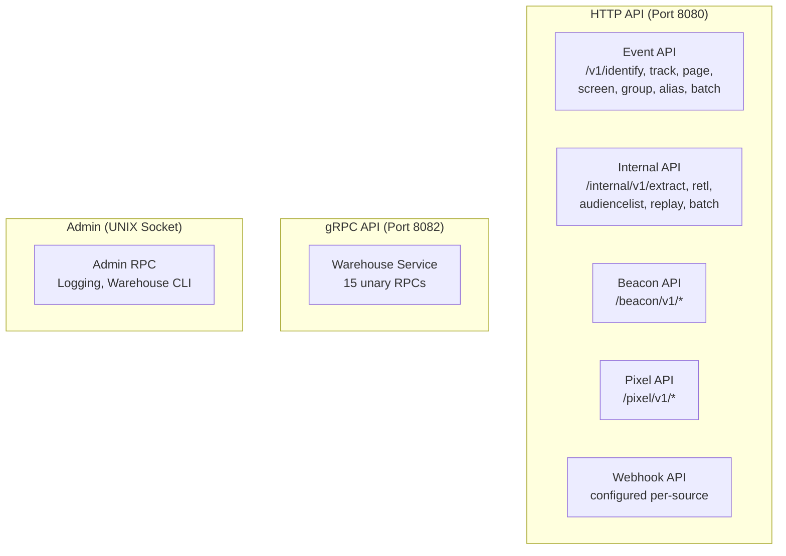
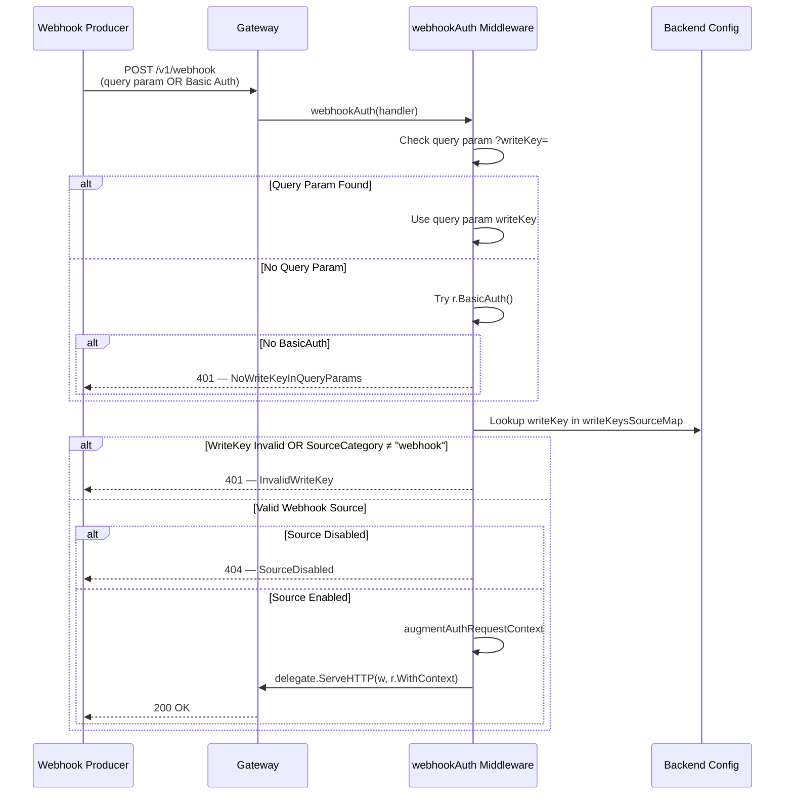
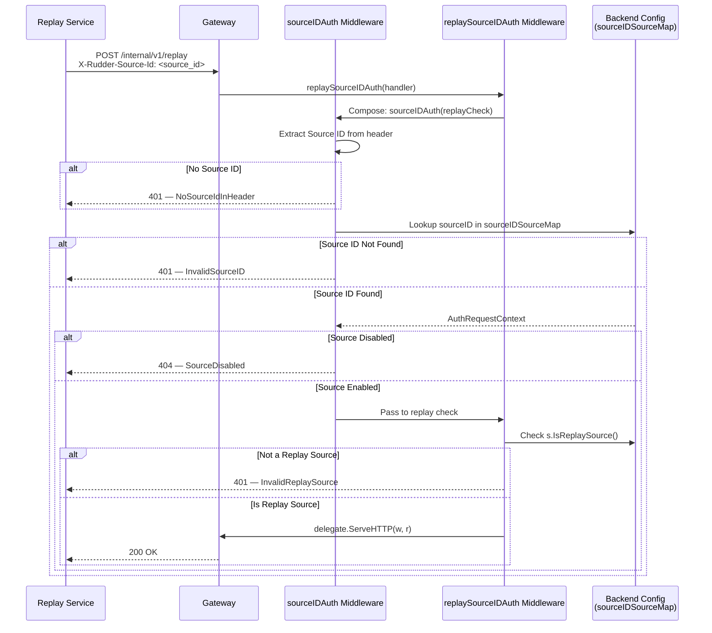
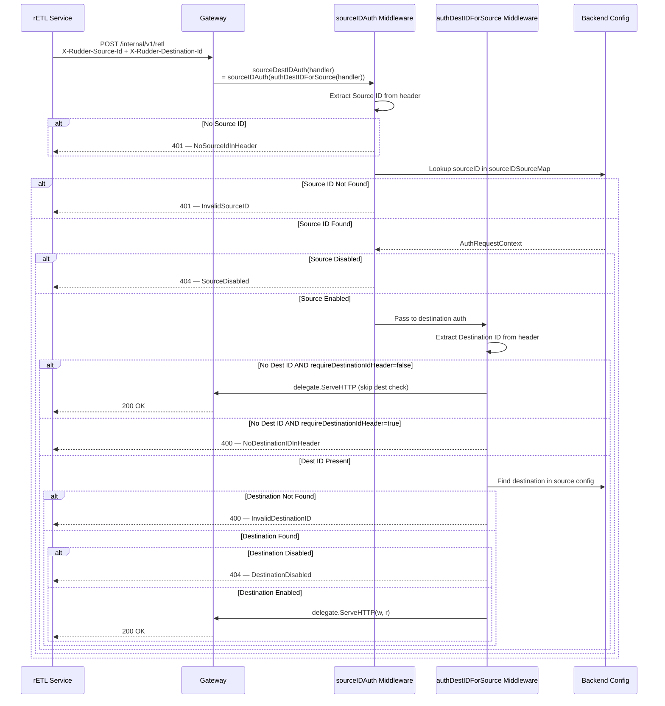

# API Reference

RudderStack provides a **Segment-compatible HTTP API** for event ingestion, a **gRPC API** for warehouse management, and an **Admin RPC interface** for runtime server operations. Together, these three API surfaces expose the full capabilities of the RudderStack Customer Data Platform.

The HTTP API is fully compatible with the [Segment Spec](https://segment.com/docs/connections/spec/) and supports all six core event types: **identify**, **track**, **page**, **screen**, **group**, and **alias**. Any existing Segment SDK or client library can point at a RudderStack Gateway endpoint with zero code changes beyond the host and write key configuration.

> **OpenAPI Specification:** Version 3.0.3 — available in the repository at `gateway/openapi.yaml` and served interactively at the `/docs` endpoint on any running Gateway instance.
>
> Source: `gateway/openapi.yaml:1-3`

**API Ports and Interfaces:**

| Interface | Protocol | Default Port / Path | Description |
|-----------|----------|-------------------|-------------|
| HTTP Gateway | HTTP/1.1, HTTP/2 | `:8080` | Event ingestion, webhooks, beacon, pixel |
| Warehouse Service | gRPC (HTTP/2) | `:8082` | Warehouse upload management, schema sync |
| Admin RPC | `net/rpc` over UNIX socket | `/tmp/rudder-server.sock` | Runtime administration, logging, warehouse CLI |

### High-Level API Surface



---

## API Surface

The following table provides a high-level map of every API reference document. Use it as a navigation hub to jump to the detailed documentation for each API surface.

### Core API References

| API | Protocol | Port / Endpoint | Documentation |
|-----|----------|----------------|---------------|
| Event Spec | HTTP | `:8080/v1/*` | [Event Spec Reference](event-spec/common-fields.md) |
| Gateway HTTP API | HTTP | `:8080` | [Gateway HTTP API](gateway-http-api.md) |
| Warehouse API | gRPC | `:8082` | [Warehouse gRPC API](warehouse-grpc-api.md) |
| Admin API | RPC / UNIX | `rudder-server.sock` | [Admin API](admin-api.md) |
| Error Codes | — | — | [Error Codes](error-codes.md) |

### Event Spec Reference

The RudderStack Event Spec is wire-compatible with the Segment Spec. Each event type has its own detailed reference page covering payload schema, required and optional fields, examples, and Segment parity notes.

| Event Type | Endpoint | Documentation |
|-----------|----------|---------------|
| Common Fields | — | [Common Fields](event-spec/common-fields.md) |
| Identify | `POST /v1/identify` | [Identify](event-spec/identify.md) |
| Track | `POST /v1/track` | [Track](event-spec/track.md) |
| Page | `POST /v1/page` | [Page](event-spec/page.md) |
| Screen | `POST /v1/screen` | [Screen](event-spec/screen.md) |
| Group | `POST /v1/group` | [Group](event-spec/group.md) |
| Alias | `POST /v1/alias` | [Alias](event-spec/alias.md) |

> **Segment Compatibility:** All six event types accept the same payload structure as Segment. Existing Segment SDKs (JavaScript, iOS, Android, Node.js, Python, Go, Ruby, Java) can send events to RudderStack by changing only the `dataPlaneUrl` configuration to point at your RudderStack Gateway.

---

## Authentication

RudderStack's Gateway implements **five authentication schemes**, each tailored to a specific category of API consumers. All authentication is enforced at the middleware layer before request processing begins.

Source: `gateway/handle_http_auth.go`

> For a comprehensive view of the security architecture including encryption, SSRF protection, and OAuth flows, see [Security Architecture](../architecture/security.md).

### Authentication Scheme Overview

| # | Scheme | Method | Used By | Primary Header / Parameter |
|---|--------|--------|---------|---------------------------|
| 1 | [WriteKey Auth](#1-basic-auth-with-writekey-primary) | HTTP Basic Auth | All public `/v1/*` endpoints | `Authorization: Basic <base64(writeKey:)>` |
| 2 | [Source ID Auth](#2-source-id-auth-internal) | Custom Header | Internal batch, retl, replay | `X-Rudder-Source-Id` |
| 3 | [Webhook Auth](#3-webhook-auth) | Basic Auth or Query Param | Webhook source endpoints | `Authorization` header or `?writeKey=` |
| 4 | [Replay Source Auth](#4-replay-source-auth) | Source ID + Replay Check | `/internal/v1/replay` | `X-Rudder-Source-Id` (must be replay source) |
| 5 | [Source + Destination ID Auth](#5-source--destination-id-auth) | Dual Custom Headers | `/internal/v1/retl` | `X-Rudder-Source-Id` + `X-Rudder-Destination-Id` |

---

### 1. Basic Auth with WriteKey (Primary)

> Source: `gateway/handle_http_auth.go:24-57` — `writeKeyAuth` middleware

This is the **primary authentication method** used by all public-facing event endpoints. It is identical to how Segment authenticates API calls — the source **Write Key** is sent as the username in an HTTP Basic Authentication header, with the password left empty.

**Method:** HTTP Basic Authentication
**Username:** Your source Write Key
**Password:** Empty string (`""`)
**Header Format:** `Authorization: Basic <base64(writeKey:)>`

**How It Works:**

1. The Gateway extracts the Write Key from the `Authorization` header using Go's `r.BasicAuth()` (Source: `gateway/handle_http_auth.go:33`)
2. The Write Key is looked up in the `writeKeysSourceMap`, a live map synchronized from the Control Plane configuration every 5 seconds (Source: `gateway/handle_http_auth.go:38`, `gateway/handle_http_auth.go:220-227`)
3. If found, an `AuthRequestContext` is populated with: `SourceEnabled`, `SourceID`, `WriteKey`, `WorkspaceID`, `SourceName`, `SourceCategory`, `SourceDefName`, `ReplaySource` (Source: `gateway/handle_http_auth.go:230-240`)
4. The middleware verifies the source is enabled before passing the request to the handler (Source: `gateway/handle_http_auth.go:51`)

**Error Responses:**

| Error | HTTP Code | Condition |
|-------|-----------|-----------|
| `NoWriteKeyInBasicAuth` | 401 | `Authorization` header missing or malformed |
| `InvalidWriteKey` | 401 | Write Key not found in any configured source |
| `SourceDisabled` | 404 | Write Key valid but the source is disabled |

**Examples:**

```bash
# Using curl's built-in Basic Auth shorthand (-u flag)
# The trailing colon after the write key indicates an empty password
curl -X POST https://your-host:8080/v1/track \
  -u "YOUR_WRITE_KEY:" \
  -H "Content-Type: application/json" \
  -d '{"userId":"user123","event":"Test Event","properties":{"plan":"pro"}}'
```

```bash
# Equivalent request with an explicit Authorization header
curl -X POST https://your-host:8080/v1/track \
  -H "Authorization: Basic $(echo -n 'YOUR_WRITE_KEY:' | base64)" \
  -H "Content-Type: application/json" \
  -d '{"userId":"user123","event":"Test Event","properties":{"plan":"pro"}}'
```

```javascript
// JavaScript SDK initialization (Segment-compatible)
rudderanalytics.load("YOUR_WRITE_KEY", "https://your-host:8080");
```

---

### 2. Source ID Auth (Internal)

> Source: `gateway/handle_http_auth.go:98-127` — `sourceIDAuth` middleware

Used by internal services and server-side integrations that identify themselves by their **Source ID** rather than a Write Key. The Source ID is passed in a custom HTTP header.

**Method:** Custom Header
**Header:** `X-Rudder-Source-Id: <source_id>`

**How It Works:**

1. The Source ID is extracted from the `X-Rudder-Source-Id` request header (Source: `gateway/handle_http_auth.go:110`)
2. It is validated against `sourceIDSourceMap` — a map of all configured source IDs (Source: `gateway/handle_http_auth.go:115`, `gateway/handle_http_auth.go:210-217`)
3. If valid, the same `AuthRequestContext` as Write Key auth is populated
4. The source must be enabled (Source: `gateway/handle_http_auth.go:120`)

**Error Responses:**

| Error | HTTP Code | Condition |
|-------|-----------|-----------|
| `NoSourceIdInHeader` | 401 | `X-Rudder-Source-Id` header missing or empty |
| `InvalidSourceID` | 401 | Source ID not found in configuration |
| `SourceDisabled` | 404 | Source ID valid but the source is disabled |

**Example:**

```bash
# Internal batch request using Source ID auth
curl -X POST https://your-host:8080/internal/v1/batch \
  -H "X-Rudder-Source-Id: YOUR_SOURCE_ID" \
  -H "Content-Type: application/json" \
  -d '{"batch":[{"type":"track","userId":"user1","event":"Login"}]}'
```

---

### 3. Webhook Auth

> Source: `gateway/handle_http_auth.go:64-96` — `webhookAuth` middleware

Webhook sources accept events from third-party services that push data to RudderStack. The Write Key can be provided via **either** a query parameter or Basic Auth header, providing flexibility for webhook producers that may not support custom authentication headers.

**Method:** Write Key via Basic Auth header **OR** `writeKey` query parameter
**Additional Validation:** The source must be configured with `SourceCategory == "webhook"` (Source: `gateway/handle_http_auth.go:85`)

**WriteKey Resolution Order:**

1. **Query parameter** `writeKey` is checked first (Source: `gateway/handle_http_auth.go:75`)
2. **Basic Auth header** is checked as fallback (Source: `gateway/handle_http_auth.go:78`)

If neither provides a Write Key, or if the resolved Write Key does not correspond to a webhook-type source, the request is rejected.

**Error Responses:**

| Error | HTTP Code | Condition |
|-------|-----------|-----------|
| `NoWriteKeyInQueryParams` | 401 | No Write Key found in query params or Basic Auth |
| `InvalidWriteKey` | 401 | Write Key invalid or source is not webhook type |
| `SourceDisabled` | 404 | Write Key valid but the source is disabled |

**Examples:**

```bash
# Webhook authentication via query parameter
curl -X POST "https://your-host:8080/v1/webhook?writeKey=YOUR_WRITE_KEY" \
  -H "Content-Type: application/json" \
  -d '{"event":"Webhook Event","data":{"key":"value"}}'
```

```bash
# Webhook authentication via Basic Auth header
curl -X POST https://your-host:8080/v1/webhook \
  -u "YOUR_WRITE_KEY:" \
  -H "Content-Type: application/json" \
  -d '{"event":"Webhook Event","data":{"key":"value"}}'
```

---

### 4. Replay Source Auth

> Source: `gateway/handle_http_auth.go:180-194` — `replaySourceIDAuth` middleware

A specialized authentication scheme for the **event replay** endpoint. It composes `sourceIDAuth` with an additional check that the authenticated source is designated as a replay source.

**Method:** Source ID auth + replay source validation
**Composes:** `sourceIDAuth` → replay source check
**Additional Validation:** `s.IsReplaySource()` must return `true` (Source: `gateway/handle_http_auth.go:187`)

**Error Responses:**

| Error | HTTP Code | Condition |
|-------|-----------|-----------|
| `NoSourceIdInHeader` | 401 | `X-Rudder-Source-Id` header missing |
| `InvalidSourceID` | 401 | Source ID not found in configuration |
| `SourceDisabled` | 404 | Source ID valid but the source is disabled |
| `InvalidReplaySource` | 401 | Source is valid but not a replay source |

**Example:**

```bash
# Replay request — source must be configured as a replay source
curl -X POST https://your-host:8080/internal/v1/replay \
  -H "X-Rudder-Source-Id: YOUR_REPLAY_SOURCE_ID" \
  -H "Content-Type: application/json" \
  -d '{"batch":[{"type":"track","userId":"user1","event":"Replayed Event"}]}'
```

---

### 5. Source + Destination ID Auth

> Source: `gateway/handle_http_auth.go:129-178` (`authDestIDForSource` middleware) and `gateway/handle_http_auth.go:196-201` (`sourceDestIDAuth`)

Used by the **Reverse ETL (rETL)** endpoint, this scheme requires both a Source ID and a Destination ID. The middleware first authenticates the source (via `sourceIDAuth`), then validates the destination belongs to and is enabled for that source.

**Method:** Dual custom headers
**Headers:** `X-Rudder-Source-Id` + `X-Rudder-Destination-Id`
**Composition:** `sourceIDAuth` → `authDestIDForSource`

**How It Works:**

1. Source is authenticated via `sourceIDAuth` (Source: `gateway/handle_http_auth.go:199-200`)
2. Destination ID is extracted from `X-Rudder-Destination-Id` header (Source: `gateway/handle_http_auth.go:154`)
3. The destination is validated to belong to the authenticated source's configuration (Source: `gateway/handle_http_auth.go:164-166`)
4. The destination must be enabled (Source: `gateway/handle_http_auth.go:171`)
5. **Configurable behavior:** If `Gateway.requireDestinationIdHeader` is `false` (default), the Destination ID header is optional — the request proceeds without destination validation (Source: `gateway/handle_http_auth.go:157`)

**Additional Context Headers:**

| Header | Description | Source |
|--------|-------------|--------|
| `X-Rudder-Job-Run-Id` | Associates the request with a specific job run | `gateway/handle_http_auth.go:205` |
| `X-Rudder-Task-Run-Id` | Associates the request with a specific task run | `gateway/handle_http_auth.go:206` |

These headers are extracted by `augmentAuthRequestContext` (Source: `gateway/handle_http_auth.go:203-207`) and attached to the `AuthRequestContext` for downstream processing.

**Error Responses:**

| Error | HTTP Code | Condition |
|-------|-----------|-----------|
| All `sourceIDAuth` errors | 401/404 | Source authentication failures |
| `NoDestinationIDInHeader` | 400 | `X-Rudder-Destination-Id` missing (when required) |
| `InvalidDestinationID` | 400 | Destination ID not found for the authenticated source |
| `DestinationDisabled` | 404 | Destination exists but is disabled |

**Example:**

```bash
# Reverse ETL request with Source + Destination ID auth
curl -X POST https://your-host:8080/internal/v1/retl \
  -H "X-Rudder-Source-Id: YOUR_SOURCE_ID" \
  -H "X-Rudder-Destination-Id: YOUR_DESTINATION_ID" \
  -H "X-Rudder-Job-Run-Id: job-run-abc123" \
  -H "X-Rudder-Task-Run-Id: task-run-def456" \
  -H "Content-Type: application/json" \
  -d '{"batch":[{"type":"identify","userId":"user1","traits":{"email":"user@example.com"}}]}'
```

---

## Authentication Flows

The following sequence diagrams illustrate the authentication flow for each major scheme, showing the decision points and error paths.

### WriteKey Auth Flow

```mermaid
sequenceDiagram
    participant C as Client / SDK
    participant GW as Gateway
    participant Auth as writeKeyAuth Middleware
    participant Cfg as Backend Config<br/>(writeKeysSourceMap)

    C->>GW: POST /v1/track<br/>Authorization: Basic &lt;base64(writeKey:)&gt;
    GW->>Auth: writeKeyAuth(handler)
    Auth->>Auth: Extract WriteKey via r.BasicAuth()
    alt No WriteKey in Header
        Auth-->>C: 401 — NoWriteKeyInBasicAuth
    end
    Auth->>Cfg: Lookup writeKey in writeKeysSourceMap
    alt WriteKey Not Found
        Auth->>Auth: Record invalidWriteKey stat
        Auth-->>C: 401 — InvalidWriteKey
    else WriteKey Found
        Cfg-->>Auth: AuthRequestContext (SourceID, WorkspaceID, ...)
        alt Source Disabled
            Auth-->>C: 404 — SourceDisabled
        else Source Enabled
            Auth->>Auth: augmentAuthRequestContext (Job/Task Run IDs)
            Auth->>GW: delegate.ServeHTTP(w, r.WithContext)
            GW-->>C: 200 OK
        end
    end
```

### Source ID Auth Flow

```mermaid
sequenceDiagram
    participant C as Internal Service
    participant GW as Gateway
    participant Auth as sourceIDAuth Middleware
    participant Cfg as Backend Config<br/>(sourceIDSourceMap)

    C->>GW: POST /internal/v1/batch<br/>X-Rudder-Source-Id: &lt;source_id&gt;
    GW->>Auth: sourceIDAuth(handler)
    Auth->>Auth: Extract Source ID from header
    alt No Source ID
        Auth-->>C: 401 — NoSourceIdInHeader
    end
    Auth->>Cfg: Lookup sourceID in sourceIDSourceMap
    alt Source ID Not Found
        Auth-->>C: 401 — InvalidSourceID
    else Source ID Found
        Cfg-->>Auth: AuthRequestContext
        alt Source Disabled
            Auth-->>C: 404 — SourceDisabled
        else Source Enabled
            Auth->>Auth: augmentAuthRequestContext
            Auth->>GW: delegate.ServeHTTP(w, r.WithContext)
            GW-->>C: 200 OK
        end
    end
```

### Webhook Auth Flow



### Replay Source Auth Flow



### Source + Destination ID Auth Flow



---

## Endpoint Authentication Matrix

The following table maps every Gateway endpoint to its required authentication scheme and headers.

| Endpoint | Auth Scheme | Required Headers / Parameters | Notes |
|----------|-------------|------------------------------|-------|
| `POST /v1/identify` | writeKeyAuth | `Authorization: Basic` | Standard event endpoint |
| `POST /v1/track` | writeKeyAuth | `Authorization: Basic` | Standard event endpoint |
| `POST /v1/page` | writeKeyAuth | `Authorization: Basic` | Standard event endpoint |
| `POST /v1/screen` | writeKeyAuth | `Authorization: Basic` | Standard event endpoint |
| `POST /v1/group` | writeKeyAuth | `Authorization: Basic` | Standard event endpoint |
| `POST /v1/alias` | writeKeyAuth | `Authorization: Basic` | Standard event endpoint |
| `POST /v1/batch` | writeKeyAuth | `Authorization: Basic` | Batch of mixed event types |
| `POST /internal/v1/extract` | writeKeyAuth | `Authorization: Basic` | Cloud source extraction |
| `POST /internal/v1/retl` | sourceDestIDAuth | `X-Rudder-Source-Id`, `X-Rudder-Destination-Id` | Dest ID optional if `Gateway.requireDestinationIdHeader` is `false` |
| `POST /internal/v1/audiencelist` | writeKeyAuth | `Authorization: Basic` | Audience list management |
| `POST /internal/v1/replay` | replaySourceIDAuth | `X-Rudder-Source-Id` | Source must be a replay source |
| `POST /internal/v1/batch` | sourceIDAuth | `X-Rudder-Source-Id` | Internal batch ingestion |
| `POST /beacon/v1/*` | writeKeyAuth (query) | `?writeKey=<key>` | Browser `navigator.sendBeacon()` support |
| `GET /pixel/v1/*` | writeKeyAuth (query) | `?writeKey=<key>` | Returns transparent 1×1 GIF |
| Webhook endpoints | webhookAuth | `Authorization: Basic` **OR** `?writeKey=<key>` | Source must have `SourceCategory == "webhook"` |

> **Source:** Endpoint-to-auth mapping derived from `gateway/openapi.yaml` security definitions and `gateway/handle_http_auth.go` middleware wiring.

---

## Common Headers

The following table documents all custom HTTP headers recognized by the RudderStack Gateway.

| Header | Direction | Type | Description | Used By |
|--------|-----------|------|-------------|---------|
| `Authorization` | Request | Standard | HTTP Basic Auth with Write Key as username, empty password | All public `/v1/*` event endpoints, webhooks |
| `X-Rudder-Source-Id` | Request | Custom | Source identifier for internal and replay endpoints | `/internal/v1/batch`, `/internal/v1/retl`, `/internal/v1/replay` |
| `X-Rudder-Destination-Id` | Request | Custom | Destination identifier for reverse ETL | `/internal/v1/retl` |
| `X-Rudder-Job-Run-Id` | Request | Custom | Job run identifier — propagated into the auth context for lineage tracking | `/internal/v1/retl`, `/internal/v1/extract` |
| `X-Rudder-Task-Run-Id` | Request | Custom | Task run identifier — propagated into the auth context for lineage tracking | `/internal/v1/retl`, `/internal/v1/extract` |
| `Content-Type` | Request | Standard | Must be `application/json` for JSON payloads; `text/plain` for beacon | All endpoints |

> Source: `gateway/handle_http_auth.go:203-207` — `augmentAuthRequestContext` extracts `X-Rudder-Job-Run-Id` and `X-Rudder-Task-Run-Id` from every authenticated request.

---

## Quick Start

Get started sending events to RudderStack in under two minutes.

### Step 1: Obtain Your Write Key

Retrieve your source **Write Key** from the RudderStack dashboard (or your Control Plane configuration). Each source has a unique Write Key that identifies where events originate.

### Step 2: Send Your First Event

```bash
curl -X POST http://localhost:8080/v1/track \
  -u "YOUR_WRITE_KEY:" \
  -H "Content-Type: application/json" \
  -d '{
    "userId": "user123",
    "event": "Product Viewed",
    "properties": {
      "product_id": "P001",
      "name": "Running Shoes",
      "price": 99.99,
      "currency": "USD"
    },
    "context": {
      "library": {
        "name": "curl"
      }
    }
  }'
```

### Step 3: Verify the Response

A successful request returns HTTP `200` with the body:

```
"OK"
```

If you receive an error, consult the [Error Codes Reference](error-codes.md) for troubleshooting guidance.

### Step 4: Explore Further

- Send an `identify` call to associate traits with a user — see [Identify](event-spec/identify.md)
- Use the `/v1/batch` endpoint to send multiple events in one request — see [Gateway HTTP API](gateway-http-api.md)
- Set up your warehouse destination — see [Warehouse gRPC API](warehouse-grpc-api.md)
- Read the full getting-started tutorial — see [First Events Guide](../guides/getting-started/first-events.md)

---

## See Also

- [Gateway HTTP API Reference](gateway-http-api.md) — Full endpoint documentation for all HTTP API endpoints
- [Event Spec: Common Fields](event-spec/common-fields.md) — Shared event fields across all event types
- [Warehouse gRPC API](warehouse-grpc-api.md) — Warehouse management API with 15 unary RPCs
- [Admin API](admin-api.md) — Admin operations via UNIX socket and `rudder-cli`
- [Error Codes](error-codes.md) — Complete error response reference with troubleshooting
- [Getting Started: First Events](../guides/getting-started/first-events.md) — Step-by-step tutorial for sending your first events
- [Getting Started: Configuration](../guides/getting-started/configuration.md) — Configuration reference for `config.yaml` and environment variables
