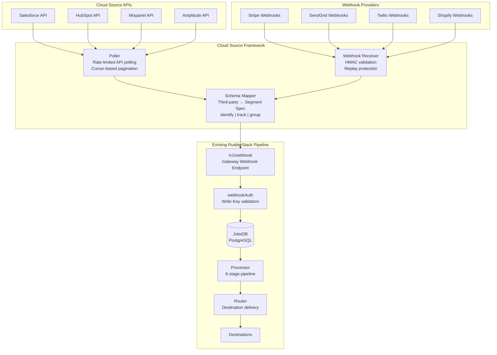
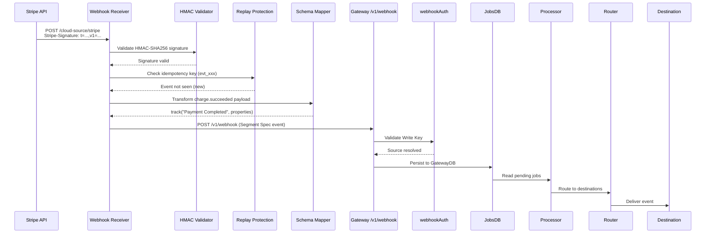
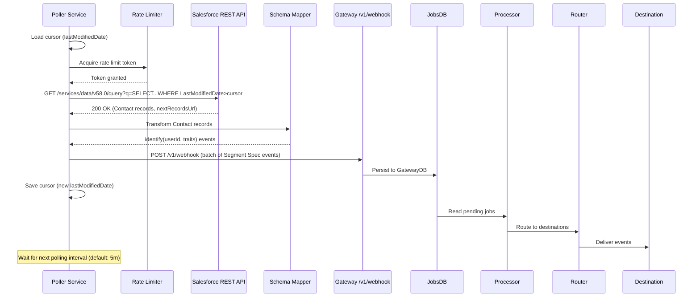
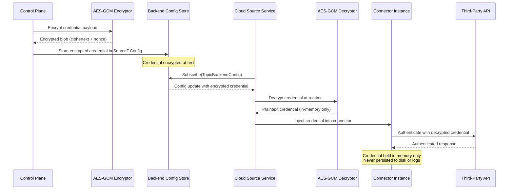
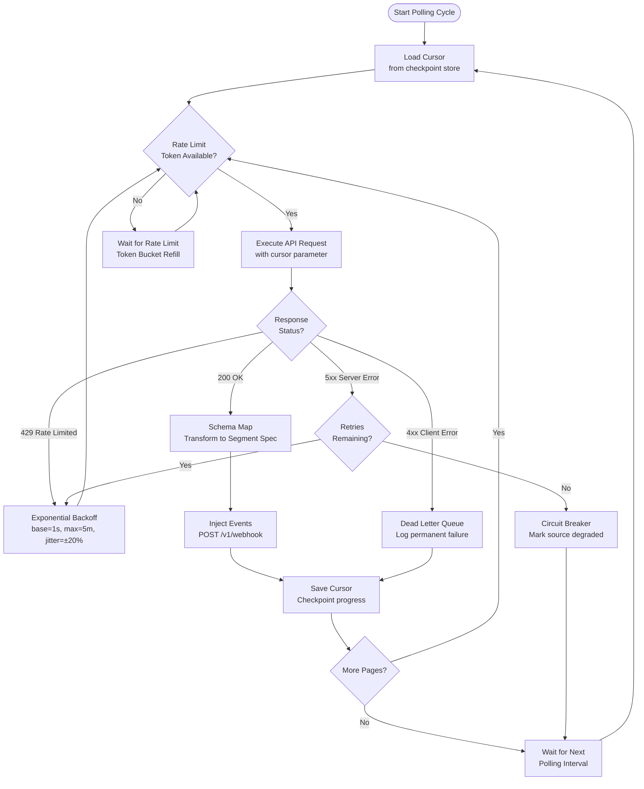
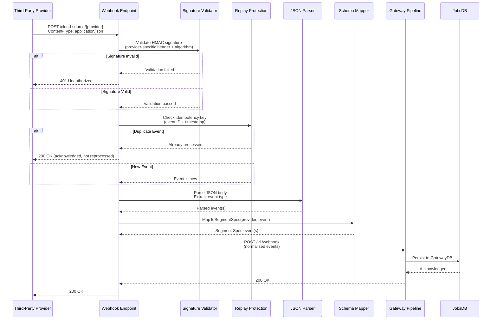
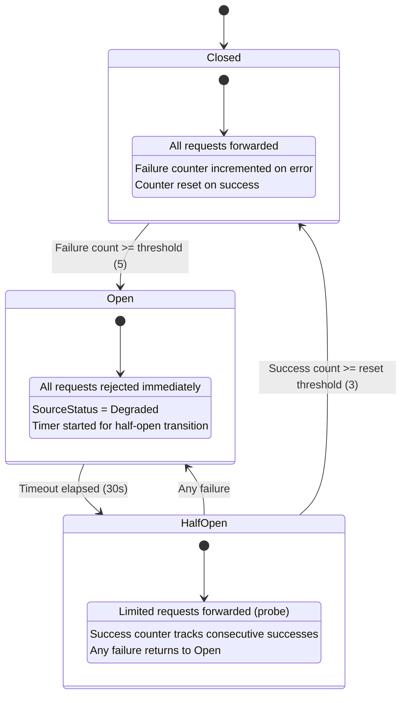
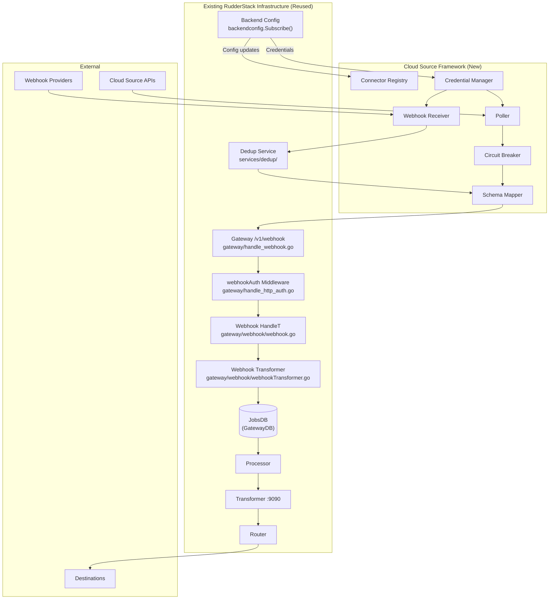

# Cloud Source Ingestion Framework

RudderStack's Gateway provides a Segment-compatible HTTP API surface for SDK-pushed and webhook-pushed events, but lacks built-in support for the **140 cloud app sources** available in Segment's Source Catalog — platforms like Salesforce, Stripe, HubSpot, Zendesk, and 136 others that require server-side polling or inbound webhook reception. This document defines the architecture for the **Cloud Source Ingestion Framework**, a dual-mode (polling + webhook) system that bridges this gap by ingesting data from third-party cloud APIs and normalizing it into Segment Spec events for delivery through the existing RudderStack pipeline.

> **Document Type:** Architecture Design — Cloud Source Ingestion Framework
> **RudderStack Version:** `rudder-server` v1.68.1 (Go 1.26.0, Elastic License 2.0)
> **Epic:** E-009 — Cloud Source Ingestion Framework Design
> **Status:** Design Complete — Proof-of-Concept Implemented
>
> **⚠️ Scope Notice:** This document describes a **design-and-prototype** deliverable. The framework defines interface abstractions, architecture patterns, and a proof-of-concept Stripe webhook connector. It does **not** constitute production-grade service code. Production connector implementations for individual cloud sources are deferred to Phase 2.

> **Prerequisite reading:**
> - [Architecture Overview](./overview.md) — high-level system components and deployment modes
> - [End-to-End Data Flow](./data-flow.md) — pipeline stages reference (Gateway → Processor → Router)
> - [Security Architecture](./security.md) — AES-GCM encryption and SSRF protection patterns
>
> **Related:**
> - [Source Catalog Parity Analysis](../gap-report/source-catalog-parity.md) — gap inventory identifying the 140 cloud source gap
> - [Sprint Roadmap](../gap-report/sprint-roadmap.md) — E-009 epic definition and timeline

---

## Executive Summary

The [Source Catalog Parity Analysis](../gap-report/source-catalog-parity.md) identified **cloud app sources** as the single largest parity gap between RudderStack and Segment, with a parity score of approximately **3%**. Segment's Source Catalog includes 140 cloud app source integrations — SaaS platforms such as Salesforce, Stripe, HubSpot, Zendesk, Intercom, SendGrid, Twilio, and Braze — that automatically ingest customer data into the event pipeline. RudderStack's current architecture supports only SDK-pushed events and manually-configured webhook sources, leaving organizations unable to consolidate cloud app data without external orchestration tooling.

The Cloud Source Ingestion Framework addresses this gap through a **dual-mode architecture** that supports both **API polling** and **webhook reception**. Polling-mode connectors execute rate-limited, cursor-based pagination against cloud source REST APIs (suitable for sources like Salesforce and HubSpot that offer rich query APIs). Webhook-mode connectors receive inbound event notifications with HMAC signature validation (suitable for sources like Stripe and SendGrid that push real-time event data). Both ingestion modes converge through a unified **Schema Mapper** that transforms third-party API responses into Segment Spec events (`identify`, `track`, `group`).

The framework provides four core abstractions: a **CloudSource** lifecycle interface, a **Poller** interface for API-driven ingestion, a **WebhookReceiver** interface for inbound webhook processing, and a **SchemaMapper** interface for payload normalization. A plugin-based **Connector Registry** enables new cloud source connectors to self-register via Go `init()` functions, following the same extensibility pattern used by the existing `services/streammanager/` stream destination plugins. Configuration integrates with the existing `backend-config` subscription model, and credentials are protected with AES-GCM encryption consistent with the patterns documented in the [Security Architecture](./security.md).

All cloud source events converge into the existing RudderStack pipeline through the Gateway's `/v1/webhook` endpoint, reusing the proven authentication middleware, webhook handler (`gateway/handle_webhook.go`), transformer pipeline (`gateway/webhook/webhookTransformer.go`), and JobsDB persistence layer. This ensures cloud source events receive the same durability guarantees, deduplication, transformation, and destination delivery as SDK-originated events — without requiring changes to the core processing pipeline.

A proof-of-concept **Stripe webhook connector** validates the architecture by implementing HMAC-SHA256 signature verification, event type mapping (e.g., `charge.succeeded` → `track("Payment Completed")`), and Segment Spec event generation. The proof-of-concept implementation is located at `services/cloud-sources/`, with the Stripe connector at `services/cloud-sources/connectors/stripe/stripe.go`.

---

## Architecture Overview

The Cloud Source Ingestion Framework operates as a sidecar service alongside the existing RudderStack Gateway. It introduces two parallel ingestion paths that converge at a shared Schema Mapping layer before injecting normalized events into the Gateway pipeline.

**Polling mode** is designed for cloud sources that expose rich REST or GraphQL APIs but do not offer real-time webhooks (or where webhook coverage is incomplete). The Poller executes rate-limited API requests at configurable intervals, using cursor-based pagination for incremental data synchronization. Each polling cycle fetches new or updated records since the last checkpoint, transforms them via the Schema Mapper, and injects the resulting Segment Spec events into the Gateway. Typical polling sources include Salesforce (SOQL queries), HubSpot (list/contact APIs), Mixpanel (export API), and Amplitude (export API).

**Webhook mode** is designed for cloud sources that push real-time event notifications via HTTP webhooks. The Webhook Receiver validates inbound requests using provider-specific HMAC signature verification (e.g., Stripe's `Stripe-Signature` header), parses the webhook payload, applies replay protection, and transforms the events via the Schema Mapper. Typical webhook sources include Stripe (payment events), SendGrid (email events), Twilio (communication events), and Shopify (e-commerce events).

Both modes converge through the **Schema Mapper**, which transforms provider-specific API responses into Segment Spec events — `identify` for user/contact entities, `track` for action/activity events, and `group` for organization/account events. Normalized events are then injected into the existing Gateway pipeline via the `/v1/webhook` endpoint, leveraging the proven webhook handler infrastructure defined in `gateway/handle_webhook.go` and `gateway/webhook/webhook.go`.



**Source:** `gateway/handle_webhook.go` (webhook handler wiring), `gateway/webhook/webhook.go` (`WebhookRequestHandler` interface)

### Webhook-Mode Sequence: Stripe Example

The following sequence diagram traces a Stripe `charge.succeeded` webhook event through the complete pipeline — from Stripe's webhook delivery through HMAC validation, schema mapping, Gateway injection, and eventual destination delivery.



### Polling-Mode Sequence: Salesforce Example

The following sequence diagram traces a Salesforce polling cycle — the Poller queries the Salesforce REST API for updated Contact records, transforms each record into a Segment `identify` event, and injects it into the Gateway pipeline.



---

## Interface Definitions

The framework defines four core interfaces that encapsulate the Cloud Source lifecycle, data ingestion, and event normalization responsibilities. These interfaces follow the established patterns in the existing Gateway webhook infrastructure — specifically the `WebhookRequestHandler` interface in `gateway/webhook/webhook.go` and the `sourceTransformAdapter` interface in `gateway/webhook/webhookTransformer.go`.

> **Note:** The interface signatures below are presented in Go syntax for documentation purposes only. They represent the design contract — the proof-of-concept implementation is at `services/cloud-sources/`.

### CloudSource Interface

The base lifecycle interface for all cloud source connectors. Every connector (whether polling-based or webhook-based) must implement `CloudSource` to participate in the framework's lifecycle management.

```go
// SourceStatus represents the operational state of a cloud source connector.
type SourceStatus string

const (
    StatusRunning  SourceStatus = "running"
    StatusStopped  SourceStatus = "stopped"
    StatusError    SourceStatus = "error"
    StatusDegraded SourceStatus = "degraded"
)

// CloudSource is the base lifecycle interface for all cloud source connectors.
// It provides start/stop lifecycle management and health status reporting.
type CloudSource interface {
    // Start initializes the connector and begins data ingestion.
    // For pollers, this starts the polling loop. For webhook receivers, this
    // registers the webhook endpoint. The context controls cancellation.
    Start(ctx context.Context) error

    // Stop gracefully shuts down the connector, flushing any pending events
    // and releasing resources. The context provides a deadline for shutdown.
    Stop(ctx context.Context) error

    // Status returns the current operational state of the connector.
    // Used by health checks and monitoring systems.
    Status() SourceStatus
}
```

### Poller Interface

The polling-mode ingestion interface. Extends `CloudSource` with cursor-based pagination methods for incremental data synchronization from cloud APIs.

```go
// Event represents a raw cloud source event before schema mapping.
type Event struct {
    SourceType string
    EventType  string
    Payload    []byte
    Timestamp  time.Time
    ID         string
}

// Poller extends CloudSource with API polling capabilities.
// Implementations execute rate-limited queries against cloud source APIs
// and return raw events for schema mapping.
type Poller interface {
    CloudSource

    // Poll executes a single polling cycle against the cloud source API.
    // Returns a batch of raw events and any error encountered.
    // The implementation is responsible for rate limiting and pagination
    // within a single cycle.
    Poll(ctx context.Context) ([]Event, error)

    // SetCursor sets the pagination cursor for incremental sync.
    // Called after a successful polling cycle to checkpoint progress.
    SetCursor(cursor string)

    // GetCursor returns the current pagination cursor.
    // Used to resume polling after restart or failure.
    GetCursor() string
}
```

### WebhookReceiver Interface

The webhook-mode ingestion interface. Extends `CloudSource` with inbound webhook validation and transformation methods.

```go
// WebhookReceiver extends CloudSource with inbound webhook capabilities.
// Implementations validate webhook signatures, apply replay protection,
// and transform provider-specific payloads into raw events.
type WebhookReceiver interface {
    CloudSource

    // Validate verifies the authenticity of an inbound webhook request.
    // Checks HMAC signature, IP allowlist, timestamp freshness, and
    // replay protection. Returns an error if validation fails.
    Validate(r *http.Request) error

    // Transform parses the validated webhook request body and converts
    // it into one or more raw events for schema mapping. A single webhook
    // delivery may produce multiple events (e.g., a Stripe batch webhook).
    Transform(r *http.Request) ([]Event, error)
}
```

### SchemaMapper Interface

The event normalization interface. Transforms raw cloud source events into Segment Spec events.

```go
// SegmentEvent represents a normalized Segment Spec event ready for
// injection into the Gateway pipeline.
type SegmentEvent struct {
    Type               string                 // "identify", "track", or "group"
    UserID             string                 // userId for the event
    AnonymousID        string                 // anonymousId (if no userId)
    Event              string                 // Event name (track only)
    Properties         map[string]interface{} // Event properties (track only)
    Traits             map[string]interface{} // User traits (identify/group)
    GroupID            string                 // groupId (group only)
    Context            map[string]interface{} // Context metadata
    Timestamp          time.Time              // Original event timestamp
    MessageID          string                 // Unique message identifier
    OriginalTimestamp  time.Time              // Timestamp from the source API
}

// SchemaMapper transforms raw cloud source events into Segment Spec events.
// Each cloud source connector provides a SchemaMapper implementation that
// understands the provider-specific payload format.
type SchemaMapper interface {
    // MapToSegmentSpec transforms a raw cloud source event into one or more
    // Segment Spec events. The source parameter identifies the cloud source
    // (e.g., "stripe", "salesforce") for mapping rule selection.
    MapToSegmentSpec(source string, event interface{}) ([]SegmentEvent, error)
}
```

### Existing Gateway Pattern References

The interface design draws from established patterns in the Gateway webhook infrastructure:

- **`gateway/webhook/webhook.go`** — The `WebhookRequestHandler` interface defines `RequestHandler(w http.ResponseWriter, r *http.Request)`, `Register(name string)`, and `Shutdown() error`. The Cloud Source `CloudSource` interface mirrors this lifecycle pattern with `Start`/`Stop`/`Status`.
- **`gateway/webhook/webhookTransformer.go`** — The `sourceTransformAdapter` interface defines `getTransformerEvent`, `getTransformerURL`, and `getAdapterVersion` with v1/v2 adapter implementations. The Cloud Source `SchemaMapper` follows a similar adapter pattern where each connector provides its own mapping logic.
- **`gateway/handle_webhook.go`** — The `webhookHandler()` function demonstrates the handler wiring pattern with v1/v2 auth chain selection. Cloud source connectors follow this pattern for selecting the appropriate authentication and transformation chain.

### Interface Hierarchy

```mermaid
classDiagram
    class CloudSource {
        <<interface>>
        +Start(ctx context.Context) error
        +Stop(ctx context.Context) error
        +Status() SourceStatus
    }

    class Poller {
        <<interface>>
        +Poll(ctx context.Context) ([]Event, error)
        +SetCursor(cursor string)
        +GetCursor() string
    }

    class WebhookReceiver {
        <<interface>>
        +Validate(r *http.Request) error
        +Transform(r *http.Request) ([]Event, error)
    }

    class SchemaMapper {
        <<interface>>
        +MapToSegmentSpec(source string, event interface{}) ([]SegmentEvent, error)
    }

    class ConnectorFactory {
        <<function type>>
        +func(config CloudSourceConfig) (CloudSource, error)
    }

    class ConnectorInfo {
        +Name string
        +Type string
        +Version string
        +Description string
    }

    CloudSource <|-- Poller : extends
    CloudSource <|-- WebhookReceiver : extends
    ConnectorFactory ..> CloudSource : creates
    ConnectorFactory ..> ConnectorInfo : describes
```

---

## Connector Registry

The Connector Registry is a centralized catalog of all available cloud source connector types. It follows a **plugin-based architecture** where each connector self-registers via a Go `init()` function, mirroring the pattern used by the `services/streammanager/` stream destination plugins.

### Registry API

```go
// ConnectorFactory is a function type that creates CloudSource instances
// from a configuration object. Each connector type registers a factory.
type ConnectorFactory func(config CloudSourceConfig) (CloudSource, error)

// ConnectorInfo describes a registered connector type.
type ConnectorInfo struct {
    Name        string // Unique connector identifier (e.g., "stripe", "salesforce")
    Type        string // "poll", "webhook", or "both"
    Version     string // Connector version (e.g., "1.0.0")
    Description string // Human-readable description
}

// Registry methods:

// Register registers a new connector type with the given name and factory.
// Called from connector init() functions during program startup.
Register(name string, factory ConnectorFactory)

// Get retrieves a registered connector factory by name.
// Returns an error if the connector name is not registered.
Get(name string) (ConnectorFactory, error)

// List returns information about all registered connectors.
List() []ConnectorInfo
```

### Plugin Registration Pattern

New connectors self-register during program initialization using Go's `init()` mechanism. This allows connectors to be added or removed by including or excluding their package imports, without modifying the registry code.

```go
// Example: Stripe connector registration (services/cloud-sources/connectors/stripe/stripe.go)
func init() {
    registry.Register("stripe", ConnectorInfo{
        Name:        "stripe",
        Type:        "webhook",
        Version:     "1.0.0",
        Description: "Stripe payment event ingestion via webhooks",
    }, NewStripeConnector)
}
```

This pattern ensures that the registry is populated before any cloud source service initialization occurs, and new connectors can be contributed independently.

**Implementation reference:** `services/cloud-sources/registry.go`

---

## Configuration Model

The configuration model defines the data structures that parameterize cloud source connectors. Configuration is delivered through the existing **backend-config** subscription mechanism, allowing dynamic updates without service restarts.

### CloudSourceConfig (Top-level)

| Field | Type | Description |
|-------|------|-------------|
| `SourceType` | `string` | Cloud source identifier (e.g., `"stripe"`, `"salesforce"`) |
| `Enabled` | `bool` | Whether the connector is active |
| `ConnectorName` | `string` | Registered connector name in the Registry |
| `PollingConfig` | `*PollingConfig` | Polling configuration — `nil` for webhook-only sources |
| `WebhookConfig` | `*WebhookConfig` | Webhook configuration — `nil` for polling-only sources |
| `CredentialConfig` | `CredentialConfig` | Authentication credentials (encrypted) |

### PollingConfig

| Field | Type | Default | Description |
|-------|------|---------|-------------|
| `Interval` | `time.Duration` | `5m` | Polling interval between cycles |
| `RateLimitPerSecond` | `int` | `10` | Maximum API requests per second |
| `PageSize` | `int` | `100` | Records per page for paginated APIs |
| `MaxRetries` | `int` | `3` | Retry count for failed poll cycles |
| `BackoffMultiplier` | `float64` | `2.0` | Exponential backoff multiplier for retries |

### WebhookConfig

| Field | Type | Default | Description |
|-------|------|---------|-------------|
| `EndpointPath` | `string` | — | Webhook URL path (e.g., `/cloud-source/stripe`) |
| `HMACSecret` | `string` | — | HMAC validation secret (encrypted at rest) |
| `HMACAlgorithm` | `string` | `"sha256"` | Hash algorithm: `"sha256"`, `"sha512"`, `"sha1"` |
| `AllowedIPs` | `[]string` | `[]` | Optional IP allowlist for webhook sources |
| `ReplayProtection` | `bool` | `true` | Enable idempotency key deduplication |

### CredentialConfig

| Field | Type | Description |
|-------|------|-------------|
| `Type` | `string` | Credential type: `"oauth2"`, `"api_key"`, `"basic_auth"` |
| `EncryptedPayload` | `[]byte` | AES-GCM encrypted credential blob |
| `RotationPolicy` | `string` | Rotation strategy: `"manual"`, `"auto_refresh"` |

### Integration with Existing Backend Config

The configuration model integrates with the existing `SourceT` structure defined in `backend-config/types.go`:

- **`SourceT.Config`** (`json.RawMessage`): The `Config` field on `SourceT` carries source-specific configuration as a raw JSON blob. Cloud source configuration (`CloudSourceConfig`) is serialized into this field, allowing the framework to deserialize it when the source type is recognized as a cloud source.
- **`SourceT.SourceDefinition.Category`**: The `SourceDefinitionT.Category` field (e.g., `"cloud"`, `"web"`, `"android"`) identifies the source category. Cloud sources use `Category: "cloud"` to distinguish them from SDK-based sources.
- **`SourceT.SourceDefinition.Type`**: The `SourceDefinitionT.Type` field further classifies the source (e.g., `"cloud"`, `"web"`, `"flutter"`, `"android"`, `"ios"`). Cloud app sources use `Type: "cloud"`.
- **`SourceT.SourceDefinition.Options`**: The `SourceDefinitionOptions` struct can be extended to carry cloud source-specific options (e.g., `Hydration.Enabled` for incremental sync).
- **`SourceT.WriteKey`**: Each cloud source is assigned a unique WriteKey, which is used to authenticate events injected into the Gateway via the `/v1/webhook` endpoint. This reuses the existing `webhookAuth` middleware in `gateway/handle_http_auth.go`.

Dynamic configuration updates are received via the existing `backendconfig.Subscribe(TopicBackendConfig)` mechanism in `backend-config/backend-config.go`, ensuring cloud source connectors react to configuration changes (enable/disable, credential rotation, polling interval adjustment) without requiring restarts.

---

## Credential Management

Credential security is paramount for cloud source connectors, which require stored API keys, OAuth tokens, or webhook secrets to authenticate with third-party services. The credential management model follows the security patterns established in the [Security Architecture](./security.md).

### Security Model

- **Encrypted storage**: All credentials are encrypted at rest using **AES-GCM** (Galois/Counter Mode), consistent with the encryption pattern used for backend configuration data. The encryption key is managed by the Control Plane and never stored alongside the encrypted payload.
- **Runtime-only injection**: Credentials are decrypted only at the point of use — when a connector needs to authenticate with a third-party API. Decrypted credentials are never written to disk, logged, or included in error messages.
- **Credential rotation**: The framework supports credential rotation without connector restart. When the Control Plane updates credentials in the backend config, the connector receives the update via the `TopicBackendConfig` subscription and hot-swaps the decrypted credential.
- **Per-connector isolation**: Each connector instance has its own credential scope. Credentials for one connector cannot be accessed by another, even within the same process.
- **Audit logging**: All credential decryption events are logged with structured metadata (connector name, source ID, timestamp) for security audit trails. The actual credential values are never included in logs.

### Credential Lifecycle



### Credential Types

| Credential Type | Cloud Sources | Auth Flow | Rotation Strategy |
|----------------|---------------|-----------|-------------------|
| **OAuth 2.0** | Salesforce, HubSpot, Google Ads | Authorization Code → Access Token + Refresh Token. Token refresh is automatic when the access token expires. | `auto_refresh` — automatic token renewal via refresh token |
| **API Key** | Stripe, SendGrid, Klaviyo, Customer.io | Static API key injected as a Bearer token or custom header. | `manual` — key regeneration via provider dashboard |
| **Basic Auth** | Legacy REST APIs, JIRA, Confluence | Username + password encoded as `Authorization: Basic base64(user:pass)`. | `manual` — password rotation via provider settings |
| **HMAC Secret** | Stripe (webhooks), SendGrid (webhooks) | Shared secret for webhook signature verification. Not used for outbound authentication. | `manual` — secret rotation via provider webhook settings |

---

## Schema Mapping Layer

The Schema Mapping Layer is responsible for transforming third-party cloud source API responses into normalized **Segment Spec events**. This is the critical translation layer that bridges provider-specific data models to the universal event vocabulary understood by the RudderStack pipeline.

### Transformation Pipeline

The schema mapping process follows a three-stage pipeline:

1. **Input**: Raw JSON objects from third-party APIs (webhook payloads or API responses)
2. **Processing**: Type classification, field extraction, property normalization, and context enrichment
3. **Output**: Segment Spec events (`identify`, `track`, `group`) ready for Gateway injection

### Type Mapping Rules

| Cloud Source Entity | Segment Event Type | Mapping Logic | Example |
|--------------------|--------------------|---------------|---------|
| User/Contact created or updated | `identify` | Extract user identity fields → `userId` + `traits` | Stripe `customer.created` → `identify(userId: "cus_xxx", traits: {email, name, created})` |
| Action/Activity event | `track` | Extract event name + properties → `event` + `properties` | Stripe `charge.succeeded` → `track("Payment Completed", {amount, currency, customer})` |
| Organization/Account event | `group` | Extract group identity fields → `groupId` + `traits` | Salesforce Account updated → `group(groupId: "001xxx", traits: {name, industry, revenue})` |

### Field Normalization

All mapped events include standardized metadata fields:

| Segment Field | Mapping Source | Description |
|---------------|---------------|-------------|
| `context.library.name` | Connector identifier | Set to the connector name, e.g., `"rudderstack-cloud-stripe"` |
| `context.library.version` | Connector version | Set to the connector version, e.g., `"1.0.0"` |
| `context.channel` | Static value | Always `"cloud"` for cloud source events |
| `originalTimestamp` | Third-party event timestamp | Mapped from the provider's event creation timestamp |
| `receivedAt` | System clock | Set when the event is received by the Cloud Source Service |
| `messageId` | UUID generation | Unique identifier generated per event for deduplication |
| `type` | Mapping rule | One of `"identify"`, `"track"`, or `"group"` |

### Concrete Example: Stripe `charge.succeeded`

**Input** — Simplified Stripe webhook payload:

```json
{
  "id": "evt_1234567890",
  "type": "charge.succeeded",
  "created": 1700000000,
  "data": {
    "object": {
      "id": "ch_abc123",
      "amount": 4999,
      "currency": "usd",
      "customer": "cus_xyz789",
      "payment_method": "pm_card_visa",
      "status": "succeeded",
      "receipt_email": "jane@example.com"
    }
  }
}
```

**Output** — Segment Spec `track` event:

```json
{
  "type": "track",
  "event": "Payment Completed",
  "userId": "cus_xyz789",
  "messageId": "f47ac10b-58cc-4372-a567-0e02b2c3d479",
  "originalTimestamp": "2023-11-14T22:13:20Z",
  "receivedAt": "2023-11-14T22:13:21Z",
  "properties": {
    "charge_id": "ch_abc123",
    "amount": 49.99,
    "currency": "usd",
    "payment_method": "pm_card_visa",
    "status": "succeeded",
    "receipt_email": "jane@example.com"
  },
  "context": {
    "library": {
      "name": "rudderstack-cloud-stripe",
      "version": "1.0.0"
    },
    "channel": "cloud"
  }
}
```

The transformation follows the adapter pattern established in `gateway/webhook/webhookTransformer.go`, where the `sourceTransformAdapter` interface provides version-specific transformation logic (v1 and v2 adapters). Cloud source connectors implement a similar adapter pattern through the `SchemaMapper` interface.

---

## Top-20 Cloud Source Prioritization

The following table prioritizes the top 20 cloud app sources by enterprise adoption, aligned with the gap inventory in the [Source Catalog Parity Analysis](../gap-report/source-catalog-parity.md). The prioritization balances adoption demand, API complexity, and architectural suitability.

| Rank | Source Name | Category | Ingestion Mode | API Complexity | Priority | Architecture Recommendation |
|------|-------------|----------|----------------|----------------|----------|-----------------------------|
| 1 | **Salesforce** | CRM | Poll | High | **P0** | SOQL-based polling with Change Data Capture; complex object model requires multi-entity sync with relationship resolution |
| 2 | **Stripe** | Payments | Webhook | Low | **P0** | Webhook-first with HMAC-SHA256 validation; well-structured event types map cleanly to Segment Spec |
| 3 | **HubSpot** | Marketing / CRM | Both | Medium | **P0** | Webhook for real-time events + polling for historical sync; OAuth 2.0 auth with automatic token refresh |
| 4 | **Zendesk** | Support | Both | Medium | **P1** | Webhook for ticket events + polling for user/organization sync; API rate limits require careful throttling |
| 5 | **Intercom** | Messaging | Both | Medium | **P1** | Webhook for conversation events + polling for user attributes; webhook uses HMAC-SHA1 |
| 6 | **SendGrid** | Email | Webhook | Low | **P1** | Event Webhook for email delivery/engagement events; ECDSA signature validation |
| 7 | **Twilio** | Communications | Webhook | Low | **P1** | Status callback webhooks for SMS/voice events; Basic Auth or signature validation |
| 8 | **Braze** | Engagement | Webhook | Medium | **P1** | Currents webhook for user engagement events; HMAC-SHA256 validation |
| 9 | **Klaviyo** | Email Marketing | Webhook | Low | **P1** | Webhook for email/SMS engagement events; API key validation |
| 10 | **Iterable** | Marketing | Webhook | Medium | **P1** | System webhooks for campaign events; shared secret validation |
| 11 | **Shopify** | E-commerce | Webhook | Medium | **P1** | Webhook for order/customer/product events; HMAC-SHA256 validation |
| 12 | **Mailchimp** | Email | Webhook | Low | **P2** | Webhook for subscriber events; secret key validation |
| 13 | **Mixpanel** | Analytics | Poll | Medium | **P2** | Export API polling for raw event data; API secret auth |
| 14 | **Amplitude** | Analytics | Poll | Medium | **P2** | Export API polling for raw event data; API key + secret auth |
| 15 | **Customer.io** | Messaging | Webhook | Low | **P2** | Reporting webhooks for email/push events; HMAC-SHA256 validation |
| 16 | **ActiveCampaign** | CRM | Webhook | Low | **P2** | Webhook for contact/deal events; URL-based validation |
| 17 | **Freshdesk** | Support | Both | Medium | **P2** | Webhook for ticket events + polling for contact sync; API key auth |
| 18 | **Chargebee** | Billing | Webhook | Low | **P2** | Webhook for subscription/invoice events; Basic Auth validation |
| 19 | **Recurly** | Billing | Webhook | Low | **P2** | Webhook for subscription events; HTTP Basic Auth |
| 20 | **Drift** | Live Chat | Webhook | Low | **P2** | Webhook for conversation events; OAuth 2.0 verification token |

**Architecture recommendation:** Prefer **webhook-mode** connectors where the cloud source provides real-time webhooks, as they offer lower latency, reduced API quota consumption, and simpler implementation. Use **polling-mode** connectors only for sources that lack webhook support or where webhook coverage is incomplete (e.g., Salesforce where Change Data Capture does not cover all object types). Sources offering both modes should implement webhook-mode for real-time events and polling-mode for historical backfill and gap recovery.

---

## Polling Architecture

Polling-mode connectors execute scheduled API requests against cloud source REST APIs to discover new or updated records. The polling architecture is designed for reliability, efficiency, and resilience against API rate limits and transient failures.

### Core Design Principles

- **Rate-limited polling**: Each connector enforces a configurable rate limit (requests per second) to comply with third-party API quotas. The rate limiter uses a token bucket algorithm with burst capacity.
- **Cursor-based pagination**: Incremental sync is achieved by maintaining a cursor (typically a timestamp, offset, or opaque token) that tracks the last successfully synced position. Each polling cycle fetches only records created or modified after the cursor.
- **Backoff strategy**: When API rate limits are hit (HTTP 429) or transient errors occur, the poller applies exponential backoff with jitter: base interval 1s, maximum 5m, multiplier 2.0, jitter ±20%.
- **Checkpoint persistence**: The cursor position is persisted after each successful polling cycle (either in the backend config store or a dedicated persistence layer). This enables resume-after-failure without data loss or duplication.
- **Concurrent worker pool**: Multiple polling workers can execute in parallel for high-volume sources, with configurable concurrency per source to balance throughput against API rate limits.

### Polling Loop



### Polling Configuration Parameters

| Parameter | Type | Default | Description |
|-----------|------|---------|-------------|
| `Interval` | `time.Duration` | `5m` | Time between polling cycles |
| `RateLimitPerSecond` | `int` | `10` | API calls per second (token bucket) |
| `PageSize` | `int` | `100` | Records per API page request |
| `MaxRetries` | `int` | `3` | Retry attempts per failed request |
| `BackoffMultiplier` | `float64` | `2.0` | Exponential backoff multiplier |
| `BackoffBase` | `time.Duration` | `1s` | Base interval for backoff |
| `BackoffMax` | `time.Duration` | `5m` | Maximum backoff interval |
| `BackoffJitter` | `float64` | `0.2` | Jitter factor (±20%) |
| `ConcurrentWorkers` | `int` | `1` | Number of parallel polling workers |
| `CheckpointStore` | `string` | `"backendconfig"` | Cursor persistence backend |

---

## Webhook Architecture

Webhook-mode connectors receive real-time event notifications from cloud sources via inbound HTTP webhooks. The architecture emphasizes security (signature validation), reliability (replay protection), and seamless integration with the existing Gateway webhook infrastructure.

### Webhook Processing Pipeline

Inbound webhooks are processed through a five-stage pipeline:

1. **Receive**: Accept the HTTP POST request at the cloud source webhook endpoint
2. **Validate**: Verify the webhook signature using provider-specific HMAC algorithm and shared secret
3. **Replay Protection**: Check the event ID against a deduplication store (with configurable TTL) and verify timestamp freshness (reject events older than the configured threshold, default 5 minutes)
4. **Transform**: Parse the JSON payload, extract the event type, and convert to raw `Event` objects
5. **Schema Map**: Transform raw events to Segment Spec events and inject into the Gateway pipeline

### Webhook Processing Sequence



### Integration with Existing Gateway Webhook Handler

The cloud source webhook architecture integrates with the existing Gateway webhook infrastructure rather than replacing it:

- The existing `webhookHandler()` in `gateway/handle_webhook.go` supports v1 and v2 auth chains, selecting based on `gw.conf.webhookV2HandlerEnabled`. Cloud source webhooks route through the same endpoint with `SourceCategory: "cloud-source"` in the `SourceDefinitionT`.
- The existing `gateway/webhook/webhook.go` `HandleT.RequestHandler` method processes webhook requests through source-type-specific queues (`requestQ map[string]chan *webhookT`). Cloud source webhook events are enqueued into the same processing pipeline.
- The existing `gateway/webhook/webhookTransformer.go` v1/v2 adapter pattern is referenced for the Schema Mapper design. Cloud source connectors implement an analogous transformation layer.

### HMAC Signature Formats by Provider

| Provider | Signature Header | Algorithm | Format | Validation Approach |
|----------|-----------------|-----------|--------|---------------------|
| **Stripe** | `Stripe-Signature` | HMAC-SHA256 | `t=timestamp,v1=signature` | Compute `HMAC-SHA256(timestamp.payload, secret)`, compare to `v1` value |
| **SendGrid** | `X-Twilio-Email-Event-Webhook-Signature` | ECDSA | Base64-encoded | Verify ECDSA signature against SendGrid's public key |
| **HubSpot** | `X-HubSpot-Signature-v3` | HMAC-SHA256 | Base64-encoded | Compute `HMAC-SHA256(method+url+body+timestamp, secret)` |
| **Intercom** | `X-Hub-Signature` | HMAC-SHA1 | `sha1=signature` | Compute `HMAC-SHA1(body, secret)`, compare hex digest |
| **Braze** | `X-Braze-Webhook-Signature` | HMAC-SHA256 | Hex-encoded | Compute `HMAC-SHA256(body, secret)`, compare hex digest |
| **Shopify** | `X-Shopify-Hmac-SHA256` | HMAC-SHA256 | Base64-encoded | Compute `HMAC-SHA256(body, secret)`, compare Base64 |
| **Twilio** | `X-Twilio-Signature` | HMAC-SHA1 | Base64-encoded | Compute `HMAC-SHA1(url+sorted_params, auth_token)` |

---

## Error Handling and Retry Semantics

The framework implements a layered error handling strategy with automatic retry for transient failures, circuit breaking for degraded APIs, and dead letter queuing for permanently failed events.

### Error Classification

| Error Category | HTTP Status Codes | Examples | Handling Strategy |
|---------------|-------------------|----------|-------------------|
| **Transient** | 429, 500, 502, 503, 504 | Rate limit exceeded, server overload, network timeout | Retry with exponential backoff |
| **Permanent** | 400, 401, 403, 404, 422 | Invalid request, authentication failure, resource not found | Route to Dead Letter Queue — no retry |
| **Network** | — (connection-level) | DNS resolution failure, connection refused, TLS handshake error | Retry with exponential backoff (same as transient) |

### Retry Semantics

- **Exponential backoff**: Base interval 1s, maximum 5m, multiplier 2.0
- **Jitter**: ±20% random variation to prevent thundering herd
- **Maximum retries**: Configurable per connector (default: 3)
- **Dead Letter Queue (DLQ)**: Events that exhaust all retries are persisted to a DLQ table for manual inspection and replay

### Circuit Breaker Pattern

The framework uses a circuit breaker to protect against cascading failures when a cloud source API is degraded. The circuit breaker monitors consecutive failure counts and transitions between three states.



### Circuit Breaker Configuration

| Parameter | Default | Description |
|-----------|---------|-------------|
| `FailureThreshold` | `5` | Consecutive failures to trigger Open state |
| `HalfOpenTimeout` | `30s` | Duration before transitioning from Open to Half-Open |
| `ResetThreshold` | `3` | Consecutive successes in Half-Open to return to Closed |
| `HealthReportInterval` | `10s` | Interval for emitting health status metrics |

### Health Status Reporting

Each connector reports its `SourceStatus` through the `CloudSource.Status()` method:

| Status | Meaning | Circuit Breaker State |
|--------|---------|----------------------|
| `Running` | Connector is operating normally | Closed |
| `Stopped` | Connector has been gracefully stopped | N/A |
| `Error` | Connector encountered an unrecoverable error | Open (permanently) |
| `Degraded` | Connector is experiencing transient failures | Open or Half-Open |

---

## Security Considerations

Cloud source connectors interact with third-party APIs and receive inbound webhooks, introducing security surface area that must be carefully managed. The following controls are aligned with the patterns documented in the [Security Architecture](./security.md).

### Webhook Signature Validation

Every inbound webhook request is validated using the provider-specific signature mechanism (as detailed in the [Webhook Architecture](#webhook-architecture) section). Signature validation is mandatory — webhooks without valid signatures are rejected with HTTP 401. This prevents webhook spoofing and unauthorized event injection.

### Credential Encryption at Rest

All stored credentials (API keys, OAuth tokens, HMAC secrets) are encrypted using **AES-GCM** (Advanced Encryption Standard — Galois/Counter Mode), consistent with the encryption pattern used for backend configuration data. The AES-GCM implementation provides both confidentiality and integrity protection. Encryption keys are managed by the Control Plane and are never collocated with the encrypted data.

### Network-Level Isolation

For production deployments, the Cloud Source Service should run in an isolated network segment with the following controls:

- **Outbound**: Allow HTTPS (port 443) to third-party API domains only (egress allowlist)
- **Inbound**: Allow HTTPS from third-party webhook IP ranges only (ingress allowlist per provider)
- **Internal**: Allow communication to the Gateway webhook endpoint only (internal network segmentation)

### Replay Protection

Webhook replay attacks are mitigated through two mechanisms:

1. **Idempotency key tracking**: Each webhook event ID (e.g., Stripe's `evt_xxx`) is stored in a deduplication store with a configurable TTL (default: 24 hours). Duplicate events are acknowledged (HTTP 200) but not reprocessed, leveraging the existing deduplication mechanism in `services/dedup/`.
2. **Timestamp validation**: Webhook events with a creation timestamp older than a configurable threshold (default: 5 minutes) are rejected, preventing replay of stale events.

### SSRF Protection

Polling-mode connectors make outbound HTTP requests to third-party APIs, which introduces Server-Side Request Forgery (SSRF) risk if the target URL is user-configurable. The framework reuses the SSRF protection patterns from the existing Router network layer (referenced in `security.md`):

- Block requests to private IP ranges (RFC 1918: `10.0.0.0/8`, `172.16.0.0/12`, `192.168.0.0/16`)
- Block requests to loopback addresses (`127.0.0.0/8`, `::1`)
- Block requests to link-local addresses (`169.254.0.0/16`)
- Validate resolved IP addresses after DNS resolution (prevent DNS rebinding)

### Audit Logging

All security-relevant operations are logged with structured metadata for audit compliance:

- Credential decryption events (connector name, source ID, timestamp — never the credential value)
- Webhook signature validation results (success/failure, provider, event ID)
- Circuit breaker state transitions (connector name, old state, new state, trigger reason)
- Authentication failures (invalid WriteKey, disabled source, failed HMAC)

### Test Fixture Security

All test fixtures (in `services/cloud-sources/cloud_source_test.go` and `services/cloud-sources/connectors/stripe/stripe_test.go`) use **synthetic data only** — fake names, emails, amounts, and event IDs. No real user data, credentials, or API keys are included in test fixtures.

---

## Integration with Existing Systems

The Cloud Source Framework is designed to maximize reuse of existing RudderStack infrastructure rather than building parallel systems. The following integration points ensure cloud source events receive the same durability, transformation, and delivery guarantees as SDK-originated events.

### Integration Points

1. **Gateway Webhook Endpoint Reuse**: Cloud source events are injected into the existing `/v1/webhook` endpoint, reusing the proven handler in `gateway/handle_webhook.go`. The `webhookHandler()` function supports v1 and v2 auth chains, and cloud source events authenticate using the source's assigned WriteKey through the existing `webhookAuth` middleware in `gateway/handle_http_auth.go`. The source is identified by its `SourceCategory: "cloud-source"` in the `SourceDefinitionT`.

2. **Backend Config Subscription**: Cloud source connector configuration is delivered through the existing `backendconfig.Subscribe(TopicBackendConfig)` mechanism in `backend-config/backend-config.go`. When configuration changes (source enabled/disabled, credentials rotated, polling interval adjusted), the Cloud Source Service receives the update and applies it to the relevant connector without requiring a service restart.

3. **JobsDB Persistence**: Events injected through the `/v1/webhook` endpoint are persisted to the existing GatewayDB (PostgreSQL-backed JobsDB), providing durable at-least-once delivery semantics. Cloud source events flow through the same persistence layer as SDK events, inheriting all durability guarantees documented in [End-to-End Data Flow](./data-flow.md) Stage 1.

4. **Transformer Service**: Cloud source events are processed by the existing Transformer service (port 9090) for destination-specific transformations. The Transformer applies user transformations, destination transformations, and payload formatting, as documented in [End-to-End Data Flow](./data-flow.md) Stage 2.

5. **Deduplication**: Webhook replay protection leverages the existing deduplication mechanism in `services/dedup/`. Event IDs from cloud source webhooks are checked against the dedup store before processing, preventing duplicate event delivery.

### System Integration Diagram



---

## Proof-of-Concept: Stripe Webhook Connector

The Stripe webhook connector serves as the proof-of-concept implementation that validates the Cloud Source Ingestion Framework architecture. Stripe is an ideal PoC candidate due to its well-documented webhook API, straightforward HMAC-SHA256 signature validation, and clean event type taxonomy.

### Implementation Details

- **Location**: `services/cloud-sources/connectors/stripe/stripe.go`
- **Interface**: Implements the `WebhookReceiver` interface
- **Tests**: `services/cloud-sources/connectors/stripe/stripe_test.go`
- **Authentication**: HMAC-SHA256 signature verification using the `Stripe-Signature` header

### Stripe Signature Validation

Stripe webhooks include a `Stripe-Signature` header with the format `t=timestamp,v1=signature`. The validation process:

1. Parse the `t` (timestamp) and `v1` (signature) components from the header
2. Construct the signed payload: `{timestamp}.{request_body}`
3. Compute `HMAC-SHA256(signed_payload, webhook_signing_secret)`
4. Compare the computed signature against the `v1` value (constant-time comparison)
5. Verify the timestamp is within the tolerance window (default: 5 minutes)

### Event Type Mapping

| Stripe Event Type | Segment Event | Event Name | Key Properties |
|-------------------|---------------|------------|----------------|
| `charge.succeeded` | `track` | `"Payment Completed"` | `amount`, `currency`, `customer`, `payment_method`, `status` |
| `charge.failed` | `track` | `"Payment Failed"` | `amount`, `currency`, `failure_code`, `failure_message` |
| `customer.created` | `identify` | — | `email`, `name`, `created`, `metadata` (as traits) |
| `customer.updated` | `identify` | — | Updated traits: `email`, `name`, `phone`, `address` |
| `invoice.paid` | `track` | `"Invoice Paid"` | `amount_paid`, `currency`, `subscription_id`, `invoice_id` |
| `subscription.created` | `track` | `"Subscription Created"` | `plan_id`, `plan_name`, `status`, `interval`, `amount` |

### Connector Context Metadata

All events generated by the Stripe connector include the following context fields:

```json
{
  "context": {
    "library": {
      "name": "rudderstack-cloud-stripe",
      "version": "1.0.0"
    },
    "channel": "cloud",
    "integration": {
      "name": "Stripe",
      "version": "2023-10-16"
    }
  }
}
```

### What the PoC Validates

1. **Interface compliance**: The Stripe connector correctly implements the `WebhookReceiver` interface with `Start`, `Stop`, `Status`, `Validate`, and `Transform` methods
2. **HMAC signature validation**: Webhook signature verification correctly validates authentic Stripe webhooks and rejects tampered payloads
3. **Schema mapping**: Stripe event types are correctly mapped to Segment Spec events with proper field extraction and normalization
4. **Gateway integration**: Generated Segment Spec events can be injected into the Gateway pipeline via the `/v1/webhook` endpoint
5. **Error handling**: Invalid signatures, malformed payloads, and unknown event types are handled gracefully with appropriate error responses

---

## Cross-References

The following documents provide additional context and detail for the systems referenced in this design:

- [Source Catalog Parity Analysis](../gap-report/source-catalog-parity.md) — Gap inventory identifying the 140 cloud app source gap and parity scores across all source dimensions
- [Sprint Roadmap](../gap-report/sprint-roadmap.md) — E-009 epic definition, timeline (8 engineering days), and success criteria within the Sprint 2–3 Source SDK Compatibility sprint
- [Security Architecture](./security.md) — AES-GCM encryption patterns for credential storage, SSRF protection for outbound requests, and authentication middleware details
- [End-to-End Data Flow](./data-flow.md) — Complete pipeline integration points: Stage 1 (Gateway ingestion and JobsDB persistence), Stage 2 (Processor and Transformer), and Stage 3+ (Router and destination delivery)
- [Architecture Overview](./overview.md) — System component topology showing Gateway, Processor, Router, and service relationships
- [Warehouse State Machine](./warehouse-state-machine.md) — Warehouse upload lifecycle for cloud source events that are routed to warehouse destinations
- [Pipeline Stages](./pipeline-stages.md) — Detailed six-stage Processor pipeline that cloud source events traverse after Gateway ingestion
