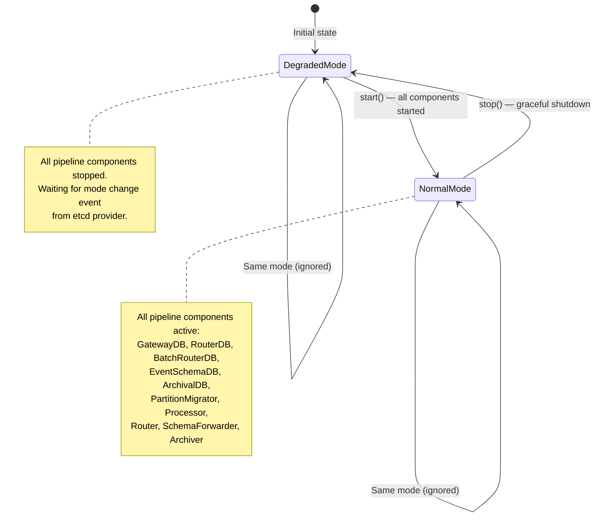
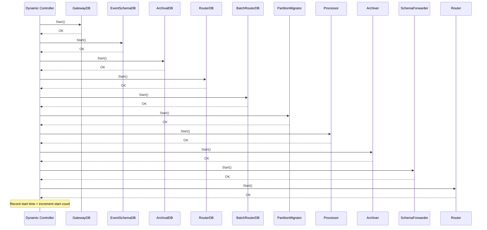
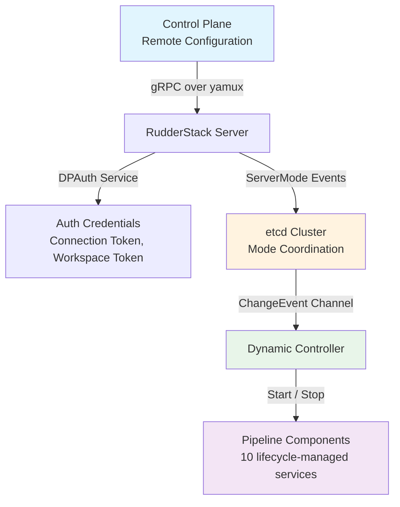
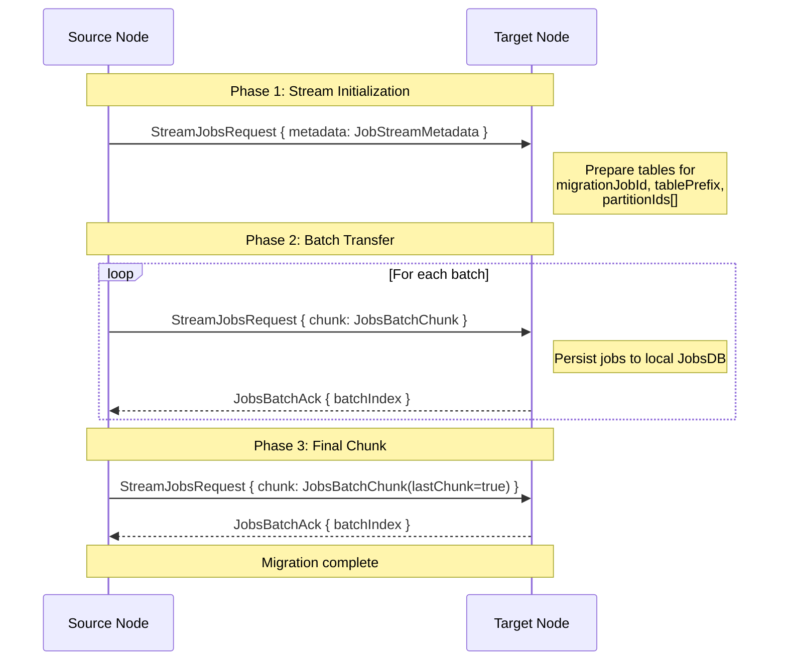

# Cluster Management

RudderStack uses **etcd-based cluster coordination** for multi-node deployments, managing server mode transitions between `NormalMode` and `DegradedMode`, and supporting partition migration for data redistribution during scaling operations. The cluster coordination layer is implemented by the `Dynamic` controller in the `app/cluster` package, which receives mode change events from an etcd-backed provider and orchestrates the startup and shutdown of all pipeline components in a deterministic order.

In a multi-tenant or horizontally scaled deployment, the Dynamic controller ensures that each server node transitions cleanly between operational states — starting all pipeline components when entering `NormalMode` and gracefully stopping them when entering `DegradedMode`. For gateway-only deployments, the controller bypasses mode transitions entirely, as the Gateway operates independently of the cluster coordination layer.

**Source:** `app/cluster/dynamic.go:1-14` (package definition and imports)

**Prerequisites:**

- [Architecture Overview](./overview.md) — high-level system component topology
- [Deployment Topologies](./deployment-topologies.md) — EMBEDDED, GATEWAY, and PROCESSOR deployment modes

**See also:**

- [Glossary](../reference/glossary.md) — unified terminology reference

---

## Cluster Modes

The RudderStack server operates in one of two mutually exclusive cluster modes at any given time. Mode transitions are driven by events received from an etcd-backed `ChangeEventProvider` and processed by the `Dynamic` controller.



### Mode Descriptions

| Mode | Description | Pipeline State |
|------|-------------|----------------|
| `DegradedMode` | Default initial state. All pipeline components are stopped. The server is waiting for a mode change event from the etcd provider. | Inactive — no event processing |
| `NormalMode` | Fully operational state. All 10 lifecycle components are started and processing events through the pipeline. | Active — full event pipeline running |

### Default Behavior

- **Initial mode:** The server always starts in `DegradedMode`. This is set explicitly in the `init()` method: `d.currentMode = servermode.DegradedMode`.
- **Gateway-only components:** When `GatewayComponent` is `true`, the controller sets `currentMode` to `NormalMode` immediately during the `Run` loop, bypassing the etcd-driven transition. Gateway nodes do not participate in cluster mode coordination.
- **Empty channel fallback:** If the server mode channel from the provider contains no events at startup, the controller defaults to starting in `NormalMode` by calling `handleModeChange(servermode.NormalMode)`.

**Source:** `app/cluster/dynamic.go:62-73` (`init` method — sets `DegradedMode`, initializes logger and stats)

---

## Dynamic Cluster Controller

The `Dynamic` struct is the central cluster coordination controller. It receives mode change events from an etcd-backed provider and orchestrates the lifecycle of all pipeline components.

### Struct Definition

```go
type Dynamic struct {
    Provider ChangeEventProvider   // Streams ServerMode change events from etcd

    GatewayComponent bool          // Flag for gateway-only deployments

    // Lifecycle-managed components (implement Start/Stop)
    GatewayDB         lifecycle
    RouterDB          lifecycle
    BatchRouterDB     lifecycle
    EventSchemaDB     lifecycle
    ArchivalDB        lifecycle
    PartitionMigrator lifecycle
    Processor         lifecycle
    Router            lifecycle
    SchemaForwarder   lifecycle
    Archiver          lifecycle

    currentMode servermode.Mode    // Current cluster mode (NormalMode or DegradedMode)

    // Telemetry measurements
    serverStartTimeStat  stats.Measurement
    serverStopTimeStat   stats.Measurement
    serverStartCountStat stats.Measurement
    serverStopCountStat  stats.Measurement

    logger logger.Logger
    once   sync.Once              // Ensures init() runs exactly once
}
```

**Source:** `app/cluster/dynamic.go:32-60` (struct definition)

### Lifecycle Components

All 10 pipeline components implement the `lifecycle` interface, which provides a uniform `Start`/`Stop` contract:

```go
type lifecycle interface {
    Start() error
    Stop()
}
```

| Component | Package | Purpose |
|-----------|---------|---------|
| `GatewayDB` | `jobsdb` | Persistent job queue for gateway ingestion events |
| `EventSchemaDB` | `jobsdb` | Persistent job queue for event schema forwarding |
| `ArchivalDB` | `jobsdb` | Persistent job queue for event archival |
| `RouterDB` | `jobsdb` | Persistent job queue for real-time destination routing |
| `BatchRouterDB` | `jobsdb` | Persistent job queue for batch destination routing |
| `PartitionMigrator` | `cluster/migrator` | Handles partition data redistribution during scaling |
| `Processor` | `processor` | Central 6-stage event processing pipeline |
| `Router` | `router` | Real-time destination delivery with throttling and retry |
| `SchemaForwarder` | `schema-forwarder` | Forwards event schemas to schema catalog service |
| `Archiver` | `archiver` | Archives processed events to object storage |

**Source:** `app/cluster/dynamic.go:27-30` (`lifecycle` interface definition)
**Source:** `app/cluster/dynamic.go:37-49` (component field declarations)

### ChangeEventProvider Interface

The `ChangeEventProvider` interface abstracts the source of cluster mode change events. In production, this is backed by an etcd client that watches for mode change keys.

```go
type ChangeEventProvider interface {
    // ServerMode returns a channel that streams mode change events.
    // Each event carries the target mode and an Ack method for confirmation.
    ServerMode(ctx context.Context) <-chan servermode.ChangeEvent

    // EtcdClient returns an etcd client if supported by the provider.
    // Returns an error if the provider does not support direct etcd access.
    EtcdClient() (etcdclient.Client, error)
}
```

| Method | Return Type | Purpose |
|--------|-------------|---------|
| `ServerMode(ctx)` | `<-chan servermode.ChangeEvent` | Streams mode change events from etcd; each event includes the target `Mode()` and an `Ack(ctx)` method |
| `EtcdClient()` | `(etcdclient.Client, error)` | Optional direct etcd client access for partition migration and other cluster operations |

**Source:** `app/cluster/dynamic.go:21-25` (`ChangeEventProvider` interface)

---

## Run Loop

The `Run(ctx)` method is the main execution loop of the Dynamic controller. It initializes the controller lazily, subscribes to mode change events, and processes them until the context is cancelled.

### Execution Flow

1. **Lazy initialization:** `once.Do(d.init)` ensures that the logger and telemetry stats are initialized exactly once, regardless of how many times `Run` is called.
2. **Context derivation:** A cancelable child context is derived from the parent context for provider subscription lifetime management.
3. **Provider subscription:** The controller subscribes to the `Provider.ServerMode(ctx)` channel to receive mode change events.
4. **Gateway bypass:** If `GatewayComponent` is `true`, `currentMode` is immediately set to `NormalMode`, and mode change events from the channel are logged but ignored.
5. **Empty channel default:** If the provider channel is empty at startup (buffered channel with `len == 0`), the controller defaults to `NormalMode` by invoking `handleModeChange(servermode.NormalMode)`.
6. **Event loop:** The controller enters an infinite `select` loop:
   - **Mode change event received:** Logs old and new modes → skips if gateway component → calls `handleModeChange(req.Mode())` → acknowledges via `req.Ack(ctx)` → propagates any errors.
   - **Context cancelled:** If currently in `NormalMode`, calls `stop()` to gracefully shut down all components before returning `nil`.

### Error Handling

- If the received `ChangeEvent` carries an error (`req.Err() != nil`), the error is returned immediately, terminating the run loop.
- If `handleModeChange` fails, the error is logged and returned, terminating the run loop.
- If `req.Ack(ctx)` fails, the error is wrapped with `"ack mode change"` context and returned.
- On context cancellation, the controller returns `nil` after stopping (graceful shutdown is not an error).

**Source:** `app/cluster/dynamic.go:75-123` (`Run` method)

---

## Mode Transitions

Mode transitions are handled by three tightly coordinated methods: `handleModeChange`, `start`, and `stop`. These methods ensure that pipeline components are started and stopped in a deterministic order with proper error propagation and telemetry.

### handleModeChange

The `handleModeChange(newMode)` method validates and executes mode transitions:

```
Gateway component? → Skip (no transitions for gateways)
Invalid mode?      → Return error
Same mode?         → Log and skip (no-op)
Normal → Degraded  → Call stop()
Degraded → Normal  → Call start()
Other transitions  → Return error (unsupported)
```

| Current Mode | New Mode | Action | Result |
|---|---|---|---|
| Any | (gateway) | No-op | Gateway components never transition |
| Any | Invalid | Error | Returns `"unsupported mode: <mode>"` |
| `NormalMode` | `NormalMode` | No-op | Logged and ignored |
| `DegradedMode` | `DegradedMode` | No-op | Logged and ignored |
| `NormalMode` | `DegradedMode` | `stop()` | All components stopped in reverse order |
| `DegradedMode` | `NormalMode` | `start()` | All components started in sequence |
| `NormalMode` | Other | Error | Returns `"unsupported transition from NormalMode to <mode>"` |
| `DegradedMode` | Other | Error | Returns `"unsupported transition from DegradedMode to <mode>"` |

After a successful transition, `currentMode` is updated to the new mode.

**Source:** `app/cluster/dynamic.go:199-241` (`handleModeChange` method)

### Component Start Sequence

The `start()` method starts all 10 lifecycle components **sequentially** in a specific order. Each component must start successfully before the next one begins. If any component fails to start, the error is wrapped with the component name and returned immediately — no subsequent components are started.



**Start order (1 → 10):**

| # | Component | Error Wrapper |
|---|-----------|---------------|
| 1 | `GatewayDB` | `"gateway db start"` |
| 2 | `EventSchemaDB` | `"event schemas db start"` |
| 3 | `ArchivalDB` | `"archival db start"` |
| 4 | `RouterDB` | `"router db start"` |
| 5 | `BatchRouterDB` | `"batch router db start"` |
| 6 | `PartitionMigrator` | `"partition migrator start"` |
| 7 | `Processor` | `"processor start"` |
| 8 | `Archiver` | `"archiver start"` |
| 9 | `SchemaForwarder` | `"jobs forwarder start"` |
| 10 | `Router` | `"router start"` |

The start order ensures that database handles are available before processing components, and processing components are ready before routing components.

**Source:** `app/cluster/dynamic.go:125-163` (`start` method)

### Component Stop Sequence

The `stop()` method shuts down all components in **reverse order** of the start sequence. Each `Stop()` call is synchronous — the controller waits for each component to fully stop before proceeding to the next. Unlike `start()`, `Stop()` does not return errors; it is designed for graceful, best-effort shutdown.

**Stop order (10 → 1):**

| # | Component | Log Message |
|---|-----------|-------------|
| 1 | `Router` | `"Router stopped"` |
| 2 | `SchemaForwarder` | `"JobsForwarder stopped"` |
| 3 | `Archiver` | `"Archiver stopped"` |
| 4 | `Processor` | `"Processor stopped"` |
| 5 | `PartitionMigrator` | `"PartitionMigrator stopped"` |
| 6 | `BatchRouterDB` | `"BatchRouterDB stopped"` |
| 7 | `RouterDB` | `"RouterDB stopped"` |
| 8 | `EventSchemaDB` | `"EventSchemasDB stopped"` |
| 9 | `ArchivalDB` | `"ArchivalDB stopped"` |
| 10 | `GatewayDB` | `"GatewayDB stopped"` |

The reverse stop order ensures that consumers stop before producers — the Router stops before the Processor, and the Processor stops before the database handles.

**Source:** `app/cluster/dynamic.go:166-197` (`stop` method)

---

## Control Plane Integration

The Control Plane provides **gRPC-based remote configuration distribution** to RudderStack server nodes. It uses [yamux](https://github.com/hashicorp/yamux) for connection multiplexing with optional TLS encryption, and registers the `DPAuth` gRPC service for credential distribution.

### Architecture



### ConnHandler

The `ConnHandler` struct manages a single gRPC connection over a yamux-multiplexed transport:

```go
type ConnHandler struct {
    GRPCServer *grpc.Server      // gRPC server instance
    YamuxSess  *yamux.Session    // yamux multiplexed session
    logger     LoggerI           // Structured logger
}
```

| Method | Behavior |
|--------|----------|
| `ServeOnConnection()` | Feeds the yamux session to `GRPCServer.Serve()`, blocking until the session ends or an error occurs |
| `Close()` | Calls `GRPCServer.GracefulStop()` to drain in-flight RPCs, then closes the yamux session |

**Source:** `controlplane/controlplane.go:14-18` (`ConnHandler` struct)
**Source:** `controlplane/controlplane.go:52-59` (`ServeOnConnection` method)
**Source:** `controlplane/controlplane.go:61-69` (`Close` method)

### Connection Establishment

The `establishConnection` method (called by `ConnectionManager`) creates a new Control Plane connection:

1. **Network dial:** Opens a TCP socket to the Control Plane URL. Uses `tls.Dial` if `UseTLS` is enabled; otherwise uses plain `net.Dial`.
2. **yamux multiplexing:** Wraps the raw connection in a `yamux.Server` session using `yamux.DefaultConfig()`. This enables multiple logical streams over a single TCP connection.
3. **gRPC server creation:** Creates a new `grpc.Server` with configured server options.
4. **DPAuth registration:** Registers the `authService` (which implements `DPAuthServiceServer`) on the gRPC server using `proto.RegisterDPAuthServiceServer`.
5. **ConnHandler assembly:** Returns a `ConnHandler` packaging the gRPC server, yamux session, and logger.

**Source:** `controlplane/controlplane.go:20-50` (`establishConnection` method)

### DPAuth Service (Credential Distribution)

The `authService` implements the `DPAuthServiceServer` gRPC interface, providing two RPC methods for credential distribution:

```go
type AuthInfo struct {
    Service         string            // Service identifier
    ConnectionToken string            // Authentication token
    InstanceID      string            // Server instance identifier
    TokenType       string            // Token type (WORKSPACE_TOKEN or NAMESPACE)
    Labels          map[string]string // Additional metadata labels
}
```

| RPC Method | Request | Response | Purpose |
|------------|---------|----------|---------|
| `GetConnectionToken` | `GetConnectionTokenRequest` | `GetConnectionTokenResponse` (oneof: success or error) | Distributes the connection token, service name, instance ID, token type, and labels |
| `GetWorkspaceToken` | `GetWorkspaceTokenRequest` | `GetWorkspaceTokenResponse` | Distributes the workspace token, service name, and instance ID |

**Error handling:** If `ConnectionToken` is empty, `GetConnectionToken` returns an `ErrorResponse` with the message `"connection token is empty"` rather than a gRPC error, allowing the client to distinguish between configuration issues and transport failures.

**Source:** `controlplane/auth.go:9-15` (`AuthInfo` struct)
**Source:** `controlplane/auth.go:22-51` (`GetConnectionToken` and `GetWorkspaceToken` implementations)

### ConnectionManager

The `ConnectionManager` orchestrates the lifecycle of Control Plane connections with automatic reconnection:

```go
type ConnectionManager struct {
    AuthInfo        AuthInfo              // Credentials for DPAuth service
    RegisterService func(*grpc.Server)    // Callback to register additional gRPC services
    RetryInterval   time.Duration         // Reconnection interval (default: 1 second)
    UseTLS          bool                  // Enable TLS for connections
    Logger          LoggerI               // Structured logger
    Options         []grpc.ServerOption   // gRPC server options
}
```

| Method | Behavior |
|--------|----------|
| `Apply(url, active)` | Activates or deactivates the connection. When activated, spawns `maintainConnection` goroutine. When deactivated, closes the current connection. |
| `maintainConnection()` | Reconnection loop: repeatedly calls `connect()` → `ServeOnConnection()` with retry intervals. Continues until `active` is set to `false`. |
| `connect()` | Establishes a new connection via `establishConnection()`, registers additional services, and stores the `ConnHandler`. |
| `closeConnection()` | Calls `ConnHandler.Close()` and resets the handler to `nil`. |

The default retry interval is **1 second** (`defaultRetryInterval`). If `RetryInterval` is set to `0`, the default is used.

**Source:** `controlplane/manager.go:11-22` (`ConnectionManager` struct)
**Source:** `controlplane/manager.go:35-53` (`Apply` method)
**Source:** `controlplane/manager.go:68-80` (`maintainConnection` method)

### Deployment Type Resolution

The connection token used by the Control Plane is resolved based on the deployment type, which is orthogonal to the cluster mode:

| Deployment Type | Constant | Token Source | Multi-Workspace |
|----------------|----------|-------------|-----------------|
| `DEDICATED` | `DedicatedType` | `WORKSPACE_TOKEN` environment variable | No |
| `MULTITENANT` | `MultiTenantType` | `WORKSPACE_NAMESPACE` or `HOSTED_SERVICE_SECRET` | Yes |

The deployment type defaults to `DEDICATED` if `DEPLOYMENT_TYPE` is not set.

**Source:** `utils/types/deployment/deployment.go:14-17` (type constants)
**Source:** `utils/types/deployment/deployment.go:48-75` (`GetConnectionToken` function)

---

## Partition Migration Protocol

When scaling from a single-node deployment to a multi-node cluster (or rebalancing partitions across nodes), RudderStack uses the **Partition Migration Protocol** to transfer job data between nodes. The protocol is defined using Protocol Buffers (proto3) and operates as a bidirectional streaming gRPC service.

### Service Definition

```protobuf
service PartitionMigration {
    // Bidirectional streaming RPC for migrating jobs in batches
    rpc StreamJobs(stream StreamJobsRequest) returns (stream JobsBatchAck) {}
}
```

The `StreamJobs` RPC enables a source node to stream job data to a target node in batches, with the target node acknowledging each batch after successful persistence.

**Source:** `proto/cluster/cluster.proto:8-11` (service definition)

### Message Types

| Message | Fields | Purpose |
|---------|--------|---------|
| `StreamJobsRequest` | `oneof payload`: `metadata` or `chunk` | Envelope for stream content — carries either initialization metadata or a batch of jobs |
| `JobStreamMetadata` | `migrationJobId` (string), `tablePrefix` (string), `partitionIds[]` (repeated string) | Stream initialization — identifies the migration job, target table prefix, and partition IDs being migrated |
| `JobsBatchChunk` | `batchIndex` (int64), `lastChunk` (bool), `jobs[]` (repeated Job) | Batch payload delivery — carries a numbered batch of jobs with a flag indicating the final chunk |
| `JobsBatchAck` | `batchIndex` (int64) | Persistence acknowledgment — confirms that the batch at the given index has been persisted |
| `Job` | `uuid`, `jobID`, `userId`, `createdAt`, `expireAt`, `customVal`, `eventCount`, `eventPayload`, `parameters`, `workspaceId`, `partitionId` | Individual job record — represents a single JobsDB entry with all fields required for reconstruction |

### Job Message Fields

| Field | Type | Description |
|-------|------|-------------|
| `uuid` | `bytes` | Unique identifier for the job |
| `jobID` | `int64` | Sequential job ID within the partition |
| `userId` | `string` | User identifier for partition affinity |
| `createdAt` | `google.protobuf.Timestamp` | Job creation timestamp |
| `expireAt` | `google.protobuf.Timestamp` | Job expiration timestamp |
| `customVal` | `string` | Custom value used for job classification (e.g., destination type) |
| `eventCount` | `int64` | Number of events contained in the job payload |
| `eventPayload` | `bytes` | Serialized event payload (JSON) |
| `parameters` | `bytes` | Serialized job parameters (JSON) |
| `workspaceId` | `string` | Workspace identifier for multi-tenant isolation |
| `partitionId` | `string` | Partition identifier for routing affinity |

**Source:** `proto/cluster/cluster.proto:14-53` (complete message definitions)

### Protocol Flow

The partition migration protocol follows a three-phase flow:



1. **Initialization (metadata):** The source node sends a `JobStreamMetadata` message identifying the migration job, table prefix, and partition IDs being migrated. The target node prepares the necessary tables and state.
2. **Batch transfer (chunks):** The source node streams `JobsBatchChunk` messages, each containing a numbered batch of `Job` records. The target node persists each batch to its local JobsDB and responds with a `JobsBatchAck` confirming the batch index.
3. **Completion (lastChunk):** The final `JobsBatchChunk` has `lastChunk = true`, signaling that all data for the migration has been sent. After the target acknowledges this batch, the migration is complete.

**Source:** `proto/cluster/cluster.proto` (complete protocol definition)

---

## Telemetry and Observability

The Dynamic controller emits four telemetry measurements to track cluster mode transitions. All measurements are tagged with `controlled_by=ETCD` and `controller_type=Dynamic` for filtering in monitoring dashboards.

### Stats Measurements

| Metric Name | Type | Description |
|-------------|------|-------------|
| `cluster.server_start_time` | `TimerType` | Duration of the `start()` method — measures how long it takes to start all 10 lifecycle components |
| `cluster.server_stop_time` | `TimerType` | Duration of the `stop()` method — measures how long it takes to stop all 10 lifecycle components |
| `cluster.server_start_count` | `CountType` | Incremented each time `start()` completes successfully |
| `cluster.server_stop_count` | `CountType` | Incremented each time `stop()` completes |

### Stat Tags

All four measurements share the same tag set:

```go
tag := stats.Tags{
    "controlled_by":   "ETCD",
    "controller_type": "Dynamic",
}
```

These tags enable filtering cluster-related metrics from other system metrics in monitoring tools (e.g., Prometheus, Datadog, StatsD).

### Timing Instrumentation

- **Start timing:** Recorded via `serverStartTimeStat.SendTiming(time.Since(start))` at the end of `start()`, measuring the total time from the first component start to the last.
- **Stop timing:** Recorded via `serverStopTimeStat.Since(start)` at the end of `stop()`, measuring the total graceful shutdown duration.
- **Count instrumentation:** `serverStartCountStat.Increment()` and `serverStopCountStat.Increment()` are called after their respective timing measurements.

**Source:** `app/cluster/dynamic.go:62-73` (stat initialization in `init` method)
**Source:** `app/cluster/dynamic.go:130,161-162` (start timing and count)
**Source:** `app/cluster/dynamic.go:172,195-196` (stop timing and count)

---

## Configuration Reference

The following configuration parameters and environment variables are relevant to cluster management:

| Parameter / Environment Variable | Default | Description |
|---|---|---|
| `DEPLOYMENT_TYPE` | `DEDICATED` | Deployment type: `DEDICATED` (single-tenant) or `MULTITENANT` |
| `WORKSPACE_TOKEN` | — | Authentication token for dedicated deployments |
| `WORKSPACE_NAMESPACE` | — | Namespace identifier for multi-tenant deployments |
| `HOSTED_SERVICE_SECRET` | — | Fallback secret for multi-tenant deployments without namespace |
| etcd endpoint (docker-compose) | `etcd:2379` | etcd cluster endpoint for mode coordination |

**Source:** `utils/types/deployment/deployment.go:14-25` (deployment type constants and token types)
**Source:** `docker-compose.yml` (etcd service definition on port 2379)

---

## Related Documentation

- [Architecture Overview](./overview.md) — high-level system component topology and inter-service communication
- [Deployment Topologies](./deployment-topologies.md) — EMBEDDED, GATEWAY, and PROCESSOR deployment modes
- [Security Architecture](./security.md) — authentication, encryption, and DPAuth service details
- [Pipeline Stages](./pipeline-stages.md) — six-stage Processor pipeline architecture
- [Warehouse State Machine](./warehouse-state-machine.md) — 7-state warehouse upload lifecycle
- [Capacity Planning](../guides/operations/capacity-planning.md) — throughput tuning and scaling recommendations
