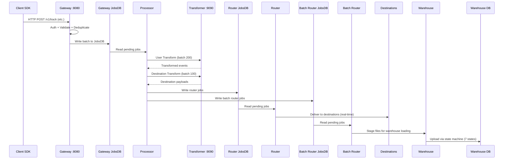
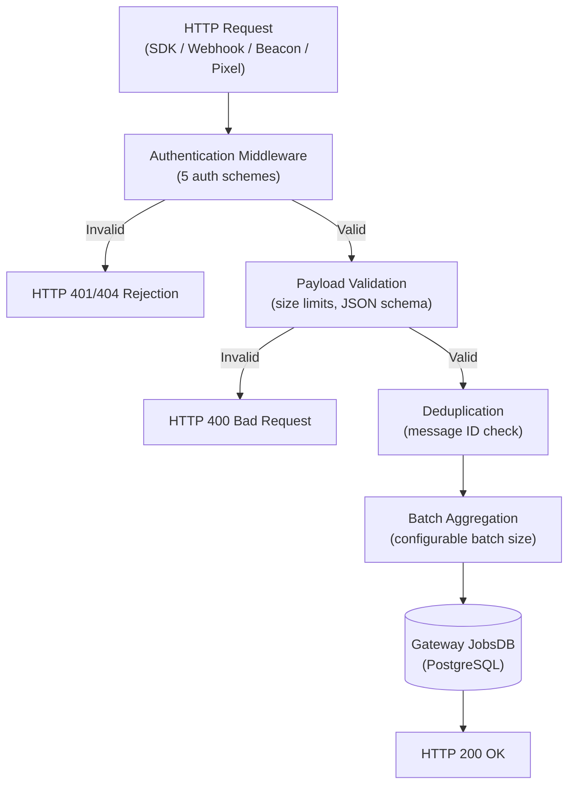
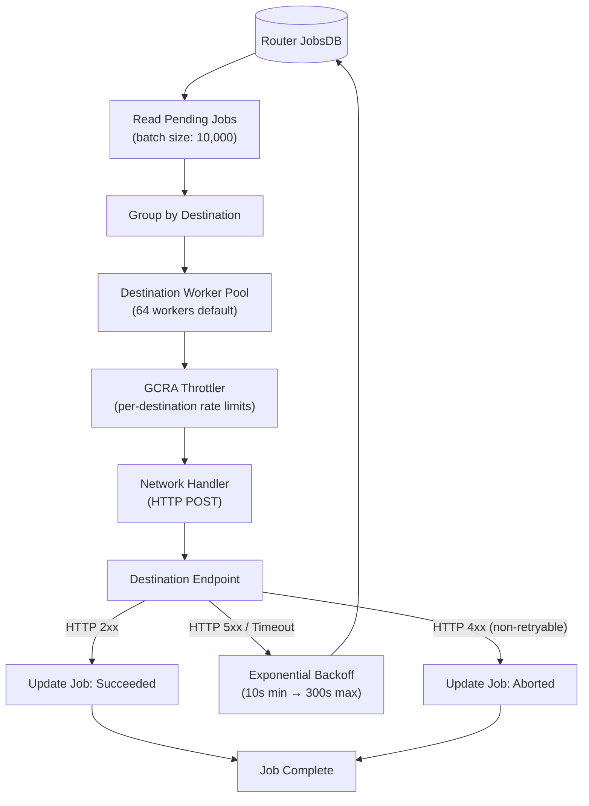
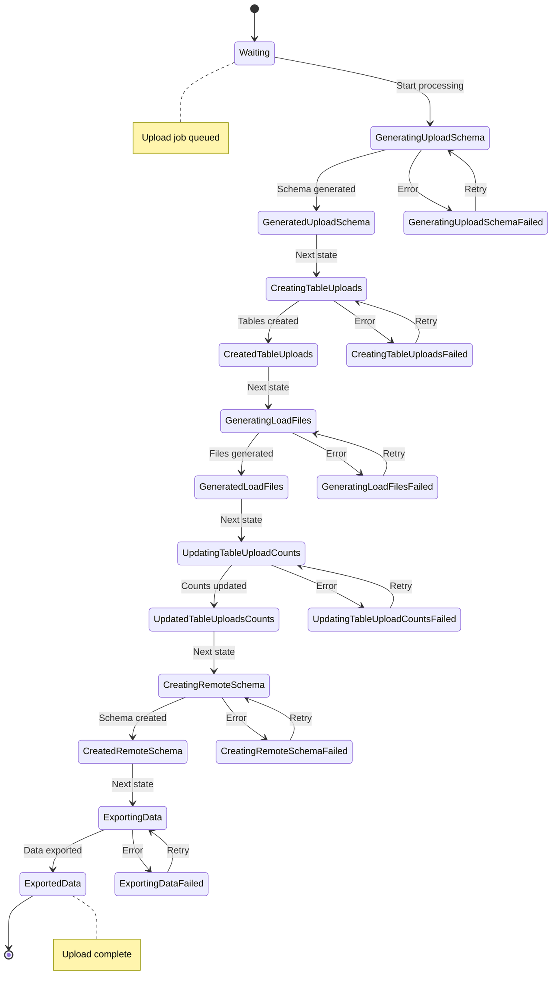
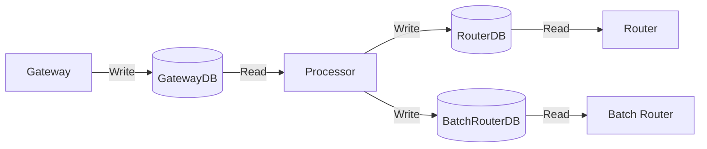

# End-to-End Data Flow

This document traces the complete lifecycle of an event through the RudderStack pipeline — from initial SDK ingestion at the Gateway through processing, transformation, real-time routing to destinations, batch routing, and finally warehouse loading. The pipeline is designed as a durable, at-least-once delivery system backed by PostgreSQL-based persistent job queues (JobsDB).

**Prerequisites:**
- [Architecture Overview](./overview.md) — high-level system components and deployment modes

**Detailed References:**
- [Pipeline Stages](./pipeline-stages.md) — in-depth six-stage Processor pipeline documentation
- [Warehouse State Machine](./warehouse-state-machine.md) — full 7-state upload lifecycle documentation
- [Configuration Reference](../reference/config-reference.md) — all 200+ tunable parameters
- [Glossary](../reference/glossary.md) — unified terminology for RudderStack and Segment concepts

---

## Event Lifecycle Overview

The following sequence diagram shows the complete end-to-end flow of an event from client SDK submission through warehouse loading. Each arrow represents a **durable handoff** via JobsDB — PostgreSQL-backed persistent queues that guarantee at-least-once delivery even across process restarts.



**Key architectural principles:**

| Principle | Implementation |
|---|---|
| **Durability** | Every inter-stage handoff persists to PostgreSQL via JobsDB before acknowledgment |
| **At-least-once delivery** | Jobs are marked `executing` during processing and retried on failure |
| **Ordering guarantees** | Events are partitioned by UserID hash (MurmurHash) to maintain per-user ordering |
| **Horizontal scalability** | Pipeline stages can be split across GATEWAY and PROCESSOR deployment modes |
| **Backpressure** | Each stage uses bounded channels and configurable batch sizes to regulate throughput |

**Source:** `runner/runner.go` (lifecycle orchestration), `jobsdb/jobsdb.go` (persistent queue implementation)

---

## Stage 1: Gateway Ingestion

The Gateway is the HTTP ingestion layer that accepts event data from client SDKs and webhook sources. It listens on port **8080** (configurable via `Gateway.webPort`) and provides a Segment-compatible API surface.

### Endpoint Surface

The Gateway exposes the following HTTP endpoints for event ingestion:

| Endpoint | Method | Auth Scheme | Description |
|---|---|---|---|
| `/v1/identify` | POST | `writeKeyAuth` | Associate a user with their traits |
| `/v1/track` | POST | `writeKeyAuth` | Record a user action with properties |
| `/v1/page` | POST | `writeKeyAuth` | Record a web page view |
| `/v1/screen` | POST | `writeKeyAuth` | Record a mobile screen view |
| `/v1/group` | POST | `writeKeyAuth` | Associate a user with a group |
| `/v1/alias` | POST | `writeKeyAuth` | Merge two user identities |
| `/v1/batch` | POST | `writeKeyAuth` | Send multiple events in a single request |
| `/v1/import` | POST | `sourceIDAuth` | Bulk import events by source ID |
| `/v1/replay` | POST | `replaySourceIDAuth` | Re-ingest archived events |
| `/v1/retl` | POST | `sourceDestIDAuth` | Reverse ETL event ingestion |
| `/beacon/v1/*` | POST | `writeKeyAuth` | Browser beacon (sendBeacon) tracking |
| `/pixel/v1/*` | GET | `writeKeyAuth` | Pixel-based (image) tracking |
| Webhook endpoints | POST | `webhookAuth` | Third-party webhook ingestion |

**Source:** `gateway/openapi.yaml` (OpenAPI 3.0.3 specification), `gateway/handle_http.go:18-69` (handler registrations)

### Authentication Schemes

The Gateway implements five authentication middleware functions, each validating credentials and enriching the request context with source metadata:

| Auth Scheme | Header / Parameter | Validated Against | Use Case |
|---|---|---|---|
| `writeKeyAuth` | `Authorization: Basic <writeKey>:` | WriteKey → Source mapping | Standard SDK calls |
| `webhookAuth` | `Authorization: Basic` or `?writeKey=` query param | WriteKey for webhook sources | Third-party webhooks |
| `sourceIDAuth` | `X-Rudder-Source-Id` header | Source ID → Source mapping | Import / internal calls |
| `replaySourceIDAuth` | `X-Rudder-Source-Id` header | Source ID (replay-enabled) | Event replay |
| `sourceDestIDAuth` | `X-Rudder-Source-Id` + `X-Rudder-Destination-Id` | Source–Destination pairing | Reverse ETL |

Each middleware rejects invalid or disabled sources with appropriate HTTP error responses (401 Unauthorized, 404 Not Found).

**Source:** `gateway/handle_http_auth.go:24-57` (writeKeyAuth), `gateway/handle_http_auth.go:64-96` (webhookAuth), `gateway/handle_http_auth.go:101-127` (sourceIDAuth)

### Gateway Internals

The following flowchart illustrates the internal processing pipeline within the Gateway for each incoming HTTP request:



### Worker Pool Model

The Gateway uses a configurable **worker pool architecture** for high-throughput concurrent processing:

| Parameter | Default | Description |
|---|---|---|
| `Gateway.maxUserWebRequestWorkerProcess` | `64` | Number of concurrent web request workers handling incoming HTTP requests |
| `Gateway.maxDBWriterProcess` | `256` | Number of concurrent DB writer goroutines batching events to JobsDB |
| `Gateway.maxUserRequestBatchSize` | `128` | Maximum events aggregated per request batch |
| `Gateway.maxDBBatchSize` | `128` | Maximum events written per DB batch operation |
| `Gateway.userWebRequestBatchTimeout` | `15ms` | Timeout before flushing a partial request batch |
| `Gateway.dbBatchWriteTimeout` | `5ms` | Timeout before flushing a partial DB write batch |
| `Gateway.maxReqSizeInKB` | `4000` | Maximum request payload size (≈4 MB) |

Web request workers aggregate incoming events and hand them off to DB writers, which persist events to GatewayDB using PostgreSQL `COPY IN` bulk inserts for optimal write throughput.

**Source:** `gateway/handle_http.go:83-136` (webRequestHandler flow), `config/config.yaml:19-31` (Gateway configuration)

See also: [API Reference](../api-reference/index.md) for full endpoint specifications, [Security Architecture](./security.md) for authentication details.

---

## Stage 2: Event Processing

The Processor reads unprocessed jobs from GatewayDB and runs them through a **six-stage pipelined processing model**. Each stage operates as an independent goroutine connected by buffered Go channels, enabling concurrent execution while maintaining per-user event ordering.

### Six-Stage Pipeline

The Processor implements the following stages (detailed in [Pipeline Stages](./pipeline-stages.md)):

| Stage | Channel | Description |
|---|---|---|
| **1. Preprocess** | `preprocess` | Deserialize gateway batches, enrich events with metadata, track deduplication keys, emit per-source metrics |
| **2. Source Hydration** | `srcHydration` | Enrich events via the external Transformer service (source-level enrichment) |
| **3. Pre-Transform** | `preTransform` | Persist event schemas to the event schema service, write archival jobs, execute tracking plan validation, apply consent filtering (OneTrust/Ketch/Generic) |
| **4. User Transform** | `usertransform` | Execute custom JavaScript/Python user transformations via the Transformer service (**batch size: 200**) |
| **5. Destination Transform** | `destinationtransform` | Shape event payloads per-destination via the Transformer service (**batch size: 100**) |
| **6. Store** | `store` | Write router jobs to RouterDB and batch router jobs to BatchRouterDB; merge sub-jobs for efficiency |

**Source:** `processor/pipeline_worker.go:19-46` (channel initialization and pipeline worker creation), `processor/pipeline_worker.go:76-230` (goroutine start for all 6 stages)

### Partition-Based Processing

Events are distributed across pipeline workers using a **UserID-based hash partitioning** strategy to guarantee per-user ordering:

```
pipeline_index = MurmurHash(UserID) % pipelinesPerPartition
```

The partition worker:
1. Reads a batch of jobs from GatewayDB (up to `Processor.maxLoopProcessEvents`, default: `10000`)
2. Marks jobs as `executing` in the database
3. Groups jobs by their MurmurHash-derived pipeline index
4. Sends each group to its assigned pipeline worker's `preprocess` channel

This ensures all events for the same user flow through the same pipeline in order, while events for different users are processed concurrently across multiple pipelines.

**Source:** `processor/partition_worker.go:51-104` (Work method with MurmurHash distribution), `processor/partition_worker.go:80-82` (MurmurHash partitioning logic)

### Transformer Service Integration

The Processor delegates transformation work to an external **Transformer** microservice running on port **9090** (`Processor.transformerURL`). The Transformer handles:

- **Source-level enrichment** (Stage 2: Source Hydration)
- **Custom user transformations** in JavaScript or Python (Stage 4: User Transform, batch size 200)
- **Destination-specific payload shaping** (Stage 5: Destination Transform, batch size 100)

Communication with the Transformer is via HTTP, with configurable connection pooling (`Processor.maxHTTPConnections`: 100, `Processor.maxHTTPIdleConnections`: 50).

**Source:** `processor/processor.go:85-89` (Handle struct with transformerClients), `config/config.yaml:184-199` (Processor configuration)

### Output Routing

After processing, the Store stage writes jobs to two separate JobsDB instances:

- **RouterDB** — for real-time, event-by-event delivery to streaming and cloud destinations
- **BatchRouterDB** — for bulk delivery to warehouse destinations and batch-oriented integrations

The routing decision is based on destination type: streaming/cloud destinations go to RouterDB, while warehouse and batch destinations go to BatchRouterDB.

**Source:** `processor/processor.go:107-111` (gatewayDB, routerDB, batchRouterDB references)

---

## Stage 3: Real-Time Routing

The Router reads jobs from RouterDB and delivers events to destinations in real-time. Each destination type gets its own Router instance with a dedicated worker pool, throttler, and configuration.

### Router Architecture



### Key Capabilities

| Capability | Implementation | Configuration |
|---|---|---|
| **Per-destination worker pools** | Each destination type runs `noOfWorkers` concurrent worker goroutines | `Router.noOfWorkers`: `64` (default) |
| **GCRA-based throttling** | Generic Cell Rate Algorithm throttler with per-destination rate limits | `Router.throttler.algorithm`: `gcra` |
| **Event ordering** | Per-user ordering guaranteed via `eventorder.Barrier` with UserID + DestinationID key | `Router.guaranteeUserEventOrder`: `true` |
| **Adaptive retry** | Exponential backoff with configurable min/max bounds and retry time window | `Router.minRetryBackoff`: `10s`, `Router.maxRetryBackoff`: `300s`, `Router.retryTimeWindow`: `180m` |
| **Adaptive batching** | Dynamic batch size calculation based on destination requirements | `Router.noOfJobsToBatchInAWorker`: `20`, `Router.jobsBatchTimeout`: `5s` |

### Delivery Flow

The Router follows this delivery flow for each destination:

1. **Pickup**: Read pending jobs from RouterDB with configurable batch size (`Router.jobQueryBatchSize`: 10,000). Jobs are distributed to workers using dynamic priority based on partition scoring.

2. **Event Ordering Barrier**: If `guaranteeUserEventOrder` is enabled (default: `true`), the barrier ensures that a user's events are delivered in order. If a previous job for the same user+destination failed, subsequent jobs enter a `Waiting` state until the failure is resolved.

3. **Worker Processing**: Each worker receives jobs and either:
   - Processes them immediately (single-event delivery), or
   - Batches them for router transformation (when `enableBatching` or `TransformAt == "router"`)

4. **Network Delivery**: The `NetHandle.SendPost()` method constructs HTTP requests from transformed payloads, supporting REST, multipart, and custom formats. Private IP blocking (SSRF protection) is enforced when `blockPrivateIPs` is enabled.

5. **Response Handling**:
   - **Success** (2xx): Job marked as `Succeeded`
   - **Retryable failure** (5xx, timeouts): Job re-queued with exponential backoff
   - **Non-retryable failure** (4xx): Job marked as `Aborted`
   - **Drain**: Jobs can be drained (aborted with reason) for cleanup

6. **Status Update**: Job statuses are batched and written back to RouterDB (`Router.updateStatusBatchSize`: 1,000).

**Source:** `router/handle.go:49-138` (Handle struct with configuration), `router/handle.go:152-200` (pickup with limiter and barrier sync), `router/worker.go:39-61` (worker struct), `router/worker.go:75-200` (acceptWorkerJob with ordering logic), `router/network.go:50-53` (NetHandle interface), `router/network.go:75-100` (SendPost implementation)

---

## Stage 4: Batch Routing

The Batch Router handles **bulk delivery** for warehouse destinations and batch-oriented integrations. Unlike the real-time Router which delivers events individually or in small batches, the Batch Router aggregates events over a configurable upload frequency and generates staging files.

### Batch Routing Flow

1. **Job Accumulation**: The Batch Router reads pending jobs from BatchRouterDB using a larger query batch size (`BatchRouter.jobQueryBatchSize`: 100,000) and accumulates them over the upload frequency window (`BatchRouter.uploadFreq`: 30s).

2. **Staging File Generation**: Events are encoded into staging files in the appropriate format for each destination:
   - **Parquet** — columnar format for warehouse destinations requiring efficient analytics queries
   - **JSON** — line-delimited JSON for general-purpose batch destinations
   - **CSV** — comma-separated format for destinations requiring tabular data

3. **Async Destination Management**: For destinations with long-running upload operations, the Batch Router delegates to the **Async Destination Manager**, which handles:
   - Polling for upload completion status
   - Retry logic for transient failures
   - Progress tracking across upload stages

4. **Warehouse Handoff**: For warehouse destinations, staging files are uploaded to object storage (MinIO/S3/GCS/Azure Blob) and metadata is registered with the Warehouse service for loading.

| Parameter | Default | Description |
|---|---|---|
| `BatchRouter.jobQueryBatchSize` | `100000` | Maximum jobs read per batch query |
| `BatchRouter.uploadFreq` | `30s` | Staging file upload frequency |
| `BatchRouter.noOfWorkers` | `8` | Concurrent batch router workers |
| `BatchRouter.maxFailedCountForJob` | `128` | Max retry attempts before aborting |
| `BatchRouter.retryTimeWindow` | `180m` | Window for retrying failed jobs |

**Source:** `config/config.yaml:138-144` (Batch Router configuration)

See also: [Async Destination Manager](../../router/batchrouter/asyncdestinationmanager/README.md) for detailed architecture of the async batch processing system.

---

## Stage 5: Warehouse Loading

The Warehouse service processes staging files through a **7-state upload state machine** per upload job. The service listens on port **8082** (`Warehouse.webPort`) and supports both gRPC and HTTP APIs.

### Upload State Machine

Each warehouse upload progresses through the following states:



**State summary:**

| # | State | Description |
|---|---|---|
| 1 | **Waiting** | Upload job created and queued for processing |
| 2 | **Generate Upload Schema** | Merge staging file schemas into a unified upload schema |
| 3 | **Create Table Uploads** | Create per-table upload tracking records |
| 4 | **Generate Load Files** | Transform staging files into warehouse-specific load files |
| 5 | **Update Table Upload Counts** | Update row counts per table for monitoring |
| 6 | **Create Remote Schema** | Execute DDL statements (CREATE TABLE, ALTER TABLE) on the warehouse |
| 7 | **Export Data** | Load data into warehouse tables using connector-specific bulk loading |

Each state has `in_progress`, `failed`, and `completed` sub-states. Failed states are retried with exponential backoff (`Warehouse.minUploadBackoff`: 60s, `Warehouse.maxUploadBackoff`: 1800s). After exceeding retry limits (`Warehouse.minRetryAttempts`: 3), the upload is marked as `Aborted`.

**Source:** `warehouse/router/state.go:1-103` (state machine definition with transitions), `warehouse/app.go:51-92` (App struct and warehouse service configuration)

### Supported Warehouse Connectors

The Warehouse service supports **9 warehouse connectors**, each implementing connector-specific DDL generation, bulk loading strategies, and schema evolution:

| Connector | Module | Default Parallel Loads | Loading Strategy |
|---|---|---|---|
| Snowflake | `warehouse/integrations/snowflake/` | 3 | COPY INTO from staged files; Snowpipe Streaming |
| BigQuery | `warehouse/integrations/bigquery/` | 20 | Load jobs from GCS; parallel table loading |
| Redshift | `warehouse/integrations/redshift/` | 3 | COPY from S3 manifests; IAM or password auth |
| ClickHouse | `warehouse/integrations/clickhouse/` | 3 | Bulk INSERT with MergeTree engine |
| Databricks (Delta Lake) | `warehouse/integrations/deltalake/` | — | MERGE or APPEND strategy (`deltalake.loadTableStrategy`: MERGE) |
| PostgreSQL | `warehouse/integrations/postgres/` | 3 | COPY from staging files |
| MSSQL | `warehouse/integrations/mssql/` | 3 | Bulk CopyIn ingestion |
| Azure Synapse | `warehouse/integrations/azure-synapse/` | 3 | COPY INTO from Azure Blob |
| Datalake | `warehouse/integrations/datalake/` | — | Parquet export to S3/GCS/Azure |

**Source:** `config/config.yaml:145-183` (Warehouse and per-connector configuration)

See also: [Warehouse State Machine](./warehouse-state-machine.md) for detailed state documentation, [Warehouse Connector Guides](../warehouse/overview.md) for per-connector setup and configuration.

---

## Supporting Flows

In addition to the primary event pipeline, several supporting subsystems operate alongside the main data flow.

### Configuration Polling

The **Backend Config** service maintains a live representation of workspace configuration (sources, destinations, connections, credentials) by polling the Control Plane API:

- **Polling interval**: Every **5 seconds** (`BackendConfig.pollInterval`: 5s)
- **Distribution**: Configuration updates are broadcast to all pipeline components via an internal **pub/sub** mechanism
- **Resilience**: An **AES-GCM encrypted cache** (backed by PostgreSQL when `BackendConfig.dbCacheEnabled` is true) provides fallback configuration when the Control Plane is unreachable
- **Modes**: Supports single-workspace and namespace (multi-tenant) modes

All pipeline components (Gateway, Processor, Router, Batch Router, Warehouse) subscribe to configuration updates and dynamically adjust their behavior without requiring restarts.

**Source:** `backend-config/backend-config.go:34-54` (configuration variables including pollInterval), `backend-config/backend-config.go:74-94` (BackendConfig interface and implementation)

### Deduplication

The Gateway performs **message-level deduplication** to prevent duplicate events from entering the pipeline:

- **Backends**: BadgerDB (embedded, default) or KeyDB (distributed, Redis-compatible)
- **Strategy**: Message IDs are checked against a time-windowed dedup store
- **TTL**: Configurable dedup window (`Dedup.dedupWindow`: 3600s / 1 hour)
- **Mirror mode**: Allows running both backends simultaneously for migration validation
- **Memory optimization**: Enabled by default (`Dedup.memOptimized`: true)

**Source:** `config/config.yaml:204-207` (Deduplication configuration)

### User Suppression

The **User Suppression** enterprise feature prevents events from suppressed users from progressing through the pipeline:

- Checked during Gateway request processing when `Gateway.enableSuppressUserFeature` is enabled (default: `true`)
- Suppression lists are synced from the Control Plane and cached locally
- Suppressed events are dropped before reaching the Processor, reducing unnecessary processing load

**Source:** `config/config.yaml:29` (enableSuppressUserFeature), `runner/runner.go:74` (enableSuppressUserFeature initialization)

### Event Archival

The **Archiver** writes processed events to object storage for long-term retention and replay capabilities:

- **Storage backends**: MinIO (local development), Amazon S3, Google Cloud Storage, Azure Blob Storage
- **Format**: Gzipped JSONL (one JSON event per line, gzip-compressed)
- **Organization**: Partition-aware archival organized by `source/date/hour` directory structure
- **Retention**: Configurable archival retention period (`JobsDB.archivalTimeInDays`: 10 days)
- **Upload frequency**: Controlled by per-worker upload frequency settings

The Archiver operates as a background worker per source, fetching completed jobs from JobsDB and uploading them to the configured object storage provider.

**Source:** `archiver/worker.go:28-53` (worker struct and configuration), `archiver/worker.go:55-129` (Work method — fetch, upload, mark status), `config/config.yaml:77-88` (JobsDB backup configuration)

### Schema Forwarding

Event schemas are forwarded to the **Event Schema service** (backed by Apache Pulsar) for event catalog management:

- Schemas are extracted during the Processor's Pre-Transform stage (Stage 3)
- Schema data is written to a dedicated `eventSchemaDB` JobsDB instance
- The Event Schema workers consume schema jobs and publish to the configured Pulsar topic
- This enables centralized schema tracking, anomaly detection, and documentation generation

**Source:** `processor/processor.go:110` (eventSchemaDB reference), `config/config.yaml:41-44` (EventSchemas configuration)

---

## JobsDB: Persistent Job Queue

JobsDB is the **PostgreSQL-backed persistent queue** that provides durability guarantees between all pipeline stages. It is the critical infrastructure component that enables RudderStack's at-least-once delivery semantics.

### Architecture



The pipeline uses **three main JobsDB instances**, each backed by separate PostgreSQL table sets:

| Instance | Writer | Reader | Purpose |
|---|---|---|---|
| **GatewayDB** | Gateway | Processor | Holds ingested events pending processing |
| **RouterDB** | Processor | Router | Holds processed events pending real-time delivery |
| **BatchRouterDB** | Processor | Batch Router | Holds processed events pending batch/warehouse delivery |

### Key Features

| Feature | Description |
|---|---|
| **Partitioned datasets** | Jobs are stored in incrementally numbered table pairs (`jobs_N`, `job_status_N`). New datasets are created as tables grow beyond `JobsDB.maxDSSize` (100,000 jobs). Old datasets are migrated and deleted, avoiding costly UPDATE/DELETE operations. |
| **Priority pools** | Job query supports priority-based retrieval, enabling critical events to be processed before lower-priority ones |
| **Pending events registry** | Tracks pending event counts per partition for efficient monitoring and backpressure signaling |
| **COPY IN bulk inserts** | Uses PostgreSQL's `COPY` protocol for high-throughput batch writes, significantly faster than individual `INSERT` statements |
| **Memory-cached reads** | Keeps recent datasets in memory cache to serve reads without disk I/O for most active data |
| **Dataset migration** | When `jobDoneMigrateThres` (80%) of jobs in a dataset are processed, remaining jobs migrate to a new intermediate dataset and the old one is deleted |

### Configuration

| Parameter | Default | Description |
|---|---|---|
| `JobsDB.maxDSSize` | `100000` | Maximum jobs per dataset before creating a new one |
| `JobsDB.maxTableSizeInMB` | `300` | Maximum table size before triggering new dataset |
| `JobsDB.jobDoneMigrateThres` | `0.8` | Fraction of completed jobs triggering dataset migration |
| `JobsDB.migrateDSLoopSleepDuration` | `30s` | Sleep between migration checks |
| `JobsDB.archivalTimeInDays` | `10` | Days before archived data is eligible for cleanup |
| `JobsDB.gw.maxOpenConnections` | `64` | PostgreSQL connection pool size for GatewayDB |

**Source:** `jobsdb/jobsdb.go:1-16` (architecture documentation comment explaining dataset structure), `jobsdb/jobsdb.go:79-105` (GetQueryParams struct with query limits), `config/config.yaml:64-91` (JobsDB configuration)

---

## Configuration Parameters

The following table summarizes the key configuration parameters that affect data flow throughput and behavior across all pipeline stages. For the complete 200+ parameter reference, see [Configuration Reference](../reference/config-reference.md).

### Ingestion (Gateway)

| Parameter | Default | Description |
|---|---|---|
| `Gateway.webPort` | `8080` | HTTP listen port for event ingestion |
| `Gateway.maxUserWebRequestWorkerProcess` | `64` | Concurrent web request handler workers |
| `Gateway.maxDBWriterProcess` | `256` | Concurrent database writer goroutines |
| `Gateway.maxUserRequestBatchSize` | `128` | Max events per request aggregation batch |
| `Gateway.maxDBBatchSize` | `128` | Max events per DB write batch |
| `Gateway.maxReqSizeInKB` | `4000` | Maximum request payload size (KB) |
| `Gateway.enableRateLimit` | `false` | Enable rate limiting at ingestion |

### Processing (Processor)

| Parameter | Default | Description |
|---|---|---|
| `Processor.maxLoopProcessEvents` | `10000` | Max events read from GatewayDB per loop iteration |
| `Processor.userTransformBatchSize` | `200` | Batch size for user transformations |
| `Processor.transformBatchSize` | `100` | Batch size for destination transformations |
| `Processor.loopSleep` | `10ms` | Sleep between processing loops |
| `Processor.maxLoopSleep` | `5000ms` | Max sleep when no events to process |
| `Processor.storeTimeout` | `5m` | Timeout for store stage operations |
| `Processor.maxHTTPConnections` | `100` | Max HTTP connections to Transformer service |

### Routing (Router)

| Parameter | Default | Description |
|---|---|---|
| `Router.noOfWorkers` | `64` | Workers per destination type |
| `Router.jobQueryBatchSize` | `10000` | Jobs read per RouterDB query |
| `Router.guaranteeUserEventOrder` | `true` | Enable per-user event ordering |
| `Router.minRetryBackoff` | `10s` | Minimum retry backoff interval |
| `Router.maxRetryBackoff` | `300s` | Maximum retry backoff interval |
| `Router.retryTimeWindow` | `180m` | Total window for retrying failed jobs |
| `Router.throttler.algorithm` | `gcra` | Throttling algorithm (GCRA) |

### Batch Routing

| Parameter | Default | Description |
|---|---|---|
| `BatchRouter.uploadFreq` | `30s` | Staging file upload frequency |
| `BatchRouter.noOfWorkers` | `8` | Concurrent batch router workers |
| `BatchRouter.jobQueryBatchSize` | `100000` | Jobs read per BatchRouterDB query |
| `BatchRouter.maxFailedCountForJob` | `128` | Max retries before aborting |

### Warehouse Loading

| Parameter | Default | Description |
|---|---|---|
| `Warehouse.mode` | `embedded` | Operating mode (embedded / master / slave / off) |
| `Warehouse.webPort` | `8082` | HTTP/gRPC API port |
| `Warehouse.uploadFreq` | `1800s` | Upload frequency (30 minutes) |
| `Warehouse.noOfWorkers` | `8` | Concurrent warehouse upload workers |
| `Warehouse.noOfSlaveWorkerRoutines` | `4` | Distributed slave worker routines |
| `Warehouse.minRetryAttempts` | `3` | Minimum retry attempts before abort |
| `Warehouse.minUploadBackoff` | `60s` | Minimum upload retry backoff |
| `Warehouse.maxUploadBackoff` | `1800s` | Maximum upload retry backoff |
| `Warehouse.stagingFilesBatchSize` | `960` | Staging files processed per batch |

**Source:** `config/config.yaml:1-250` (complete configuration file)

---

## Summary

The RudderStack event pipeline implements a **five-stage durable processing architecture** with PostgreSQL-backed job queues providing at-least-once delivery guarantees:

1. **Gateway** — Ingests events via HTTP (port 8080), authenticates, validates, deduplicates, and writes to GatewayDB
2. **Processor** — Reads from GatewayDB, executes a 6-stage pipeline (preprocess → source hydration → pre-transform → user transform → destination transform → store), and writes to RouterDB and BatchRouterDB
3. **Router** — Delivers events to streaming and cloud destinations in real-time with per-user ordering, GCRA throttling, and exponential backoff retry
4. **Batch Router** — Generates staging files and delivers to warehouse and batch destinations on a configurable frequency
5. **Warehouse** — Loads data through a 7-state upload state machine supporting 9 warehouse connectors

Supporting flows — configuration polling, deduplication, user suppression, event archival, and schema forwarding — operate alongside the main pipeline to provide resilience, governance, and operational capabilities.

For performance tuning guidance targeting **50,000 events/second** throughput, see [Capacity Planning](../guides/operations/capacity-planning.md).
