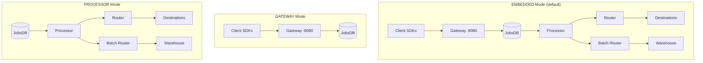
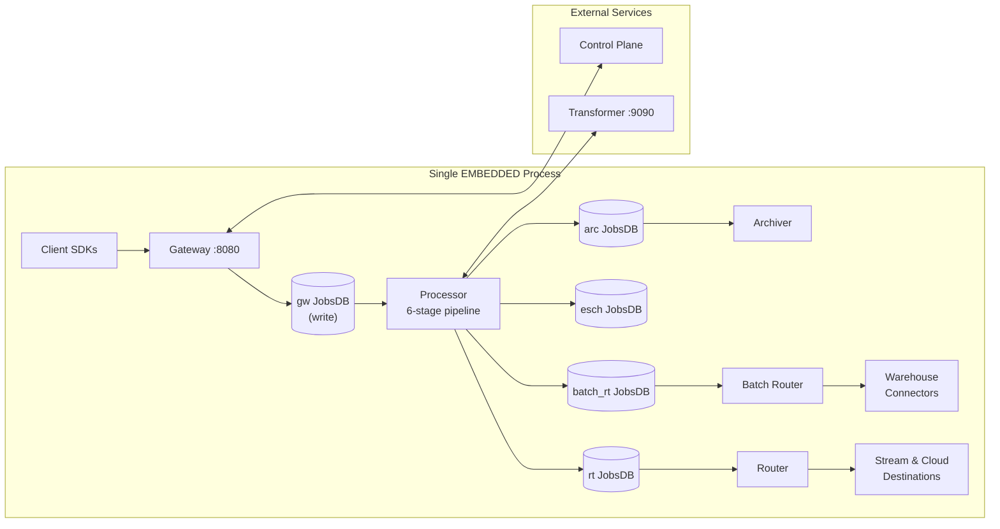
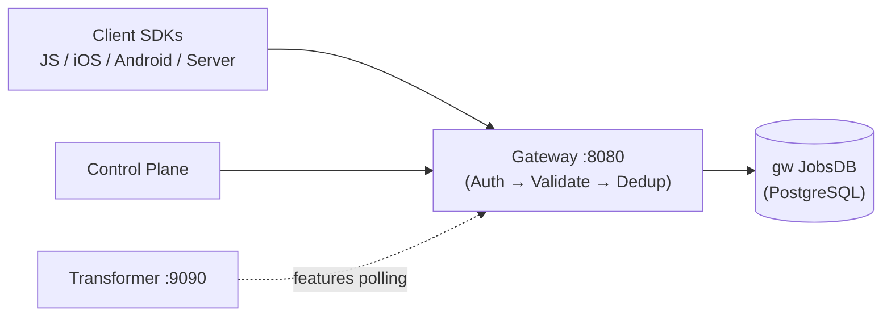
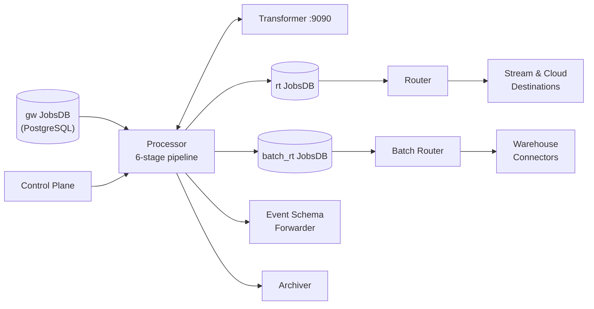
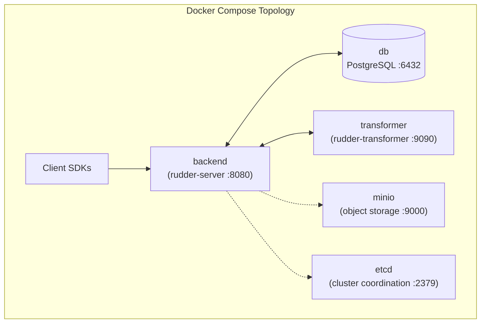
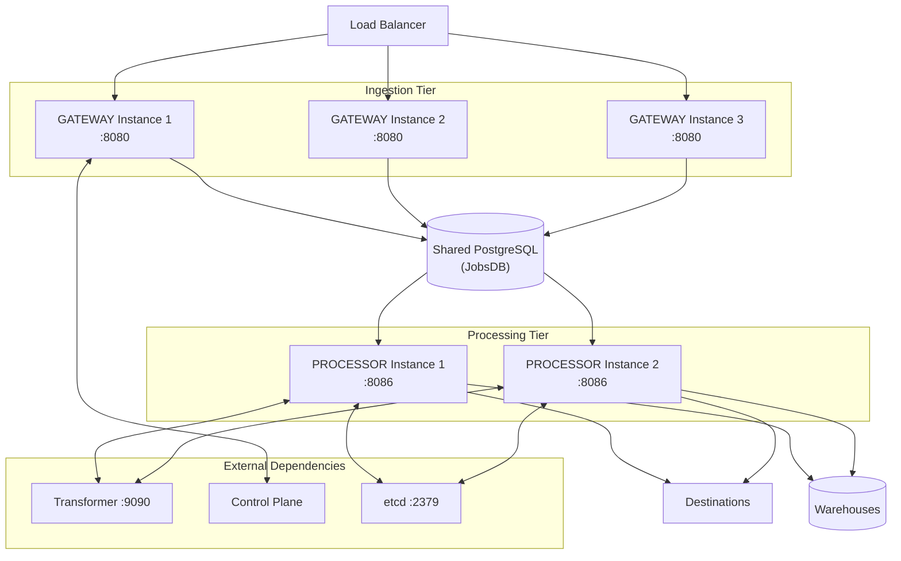

# Deployment Topologies

RudderStack supports three deployment modes that allow the system to run as a single monolithic binary or split into separate components for horizontal scaling. The deployment mode is determined by the `APP_TYPE` environment variable (or the `APP_TYPE` configuration key), which defaults to `EMBEDDED` when not explicitly set.

The three modes are defined as constants in the application entry point:

```go
const (
    GATEWAY   = "GATEWAY"
    PROCESSOR = "PROCESSOR"
    EMBEDDED  = "EMBEDDED"
)
```

**Source:** `app/app.go:25-29` (GATEWAY, PROCESSOR, EMBEDDED constants)
**Source:** `runner/runner.go:68-77` (APP_TYPE read from config via `config.GetString("APP_TYPE", app.EMBEDDED)`, defaults to EMBEDDED)

**Prerequisites:**

- [Architecture Overview](./overview.md) — high-level system component topology

**See also:**

- [Cluster Management](./cluster-management.md) — etcd-based cluster coordination and mode transitions
- [Configuration Reference](../reference/config-reference.md) — full parameter reference
- [Glossary](../reference/glossary.md) — unified terminology reference

---

## Deployment Modes Overview

RudderStack's pipeline consists of five core components: **Gateway**, **Processor**, **Router**, **Batch Router**, and **Warehouse**. The deployment mode determines which of these components are active in a given process instance.



In **EMBEDDED** mode, all five pipeline components run within a single process. This is the simplest deployment and suitable for most workloads up to moderate throughput.

**GATEWAY** and **PROCESSOR** modes split the pipeline into two independent tiers for horizontal scaling. The **JobsDB** (PostgreSQL-backed persistent job queue) serves as the durable handoff point between the two tiers:

- **GATEWAY** instances accept HTTP events, validate payloads, deduplicate, and write jobs to JobsDB.
- **PROCESSOR** instances read from JobsDB, run the six-stage processing pipeline, route events to destinations, and load data into warehouses.

This split enables independent horizontal scaling of the ingestion tier (GATEWAY) and the processing/routing tier (PROCESSOR) under high-throughput workloads targeting 50,000+ events/second.

**Source:** `app/apphandlers/setup.go:33-45` (GetAppHandler factory dispatches by APP_TYPE)

---

## EMBEDDED Mode

**EMBEDDED** is the default deployment mode. A single process runs all pipeline stages: Gateway, Processor, Router, Batch Router, and optionally the Warehouse service. This mode is selected when `APP_TYPE` is set to `"EMBEDDED"` or is not set at all.

**Source:** `runner/runner.go:70` (`appType: strings.ToUpper(config.GetString("APP_TYPE", app.EMBEDDED))`)

### Architecture



### Implementation

The EMBEDDED mode is implemented by the `embeddedApp` struct in `app/apphandlers/embeddedAppHandler.go`. It is the most comprehensive handler, wiring together all components that exist in the GATEWAY and PROCESSOR modes combined.

**Setup phase** (`embeddedApp.Setup()`):

1. Loads reloadable dataset (DS) limits for all JobsDB instances (`gw`, `rt`, `batch_rt`, `esch`, `arc`).
2. Runs `rudderCoreDBValidator()` to validate the database environment.
3. Runs `rudderCoreNodeSetup()` to initialize node migrations.

**Source:** `app/apphandlers/embeddedAppHandler.go:64-78`

**StartRudderCore phase** (`embeddedApp.StartRudderCore()`):

The embedded handler orchestrates the full lifecycle of all pipeline components:

1. **Deployment type resolution** — Resolves `DEPLOYMENT_TYPE` via `deployment.GetFromEnv()` (defaults to `DEDICATED`).
2. **Enterprise features** — Sets up tracked user reporters, reporting database syncers, and debugger handles (source, destination, transformation).
3. **Transient sources and file uploaders** — Initializes transient source tracking and file upload providers.
4. **Rsources service** — Creates the resource sources service for the resolved deployment type with shared DB setup enabled.
5. **Transformer features** — Polls the Transformer service at `DEST_TRANSFORM_URL` (default `http://localhost:9090`) every 10 seconds.
6. **Database connection pools** — Creates optional pooled connections for JobsDB (`DB.embedded.Pool.enabled`, default `true`, max 80 open connections) and priority pool (`DB.embedded.PriorityPool.enabled`, default `false`).
7. **JobsDB handles** — Creates five separate JobsDB handles:
   - `gw` (write-only for Gateway, read-only for Processor)
   - `rt` (read-write for Router)
   - `batch_rt` (read-write for Batch Router)
   - `esch` (read-write for Event Schema)
   - `arc` (read-write for Archiver, with 24-hour job max age)
8. **Schema forwarder** — Configures Pulsar-based or aborting schema forwarder based on `EventSchemas2.enabled`.
9. **Cluster coordination** — Resolves mode provider (Static for DEDICATED, ETCD-based for MULTITENANT) and sets up partition migration.
10. **Pipeline enrichers** — Configures geo-enrichment (`GeoEnrichment.enabled`) and bot enrichment (`BotEnrichment.enabled`, default `true`).
11. **Processor** — Creates the Processor instance with all JobsDB handles, reporting, debuggers, enrichers, and adaptive payload limiter.
12. **Router and Batch Router** — Creates Router and Batch Router factories with throttling, back-off, and transient source support.
13. **Gateway** — Sets up the Gateway with rate limiter, drain config, and stream message validation, then starts the web handler.
14. **Dynamic cluster controller** — Launches `cluster.Dynamic.Run()` to manage NormalMode/DegradedMode transitions.

**Source:** `app/apphandlers/embeddedAppHandler.go:80-442`

### Warehouse Mode

Within EMBEDDED mode, the Warehouse service has its own sub-mode controlled by the `Warehouse.mode` configuration parameter:

| Warehouse Mode | Description |
|---|---|
| `embedded` | Warehouse runs within the same process (default) |
| `off` | Warehouse is disabled entirely |
| `embedded_master` | Warehouse runs as the master node in a master/slave topology |
| `master` | Standalone warehouse master — server components do not start |
| `slave` | Standalone warehouse slave — server components do not start |
| `embedded_master_slave_noop` | Warehouse master/slave with no-op slave for testing |

The `canStartServer()` method in the Runner determines whether the core server (Gateway/Processor/Router) should start based on the warehouse mode — it returns `true` only for `embedded`, `off`, or `embedded_master` modes. The `canStartWarehouse()` method returns `true` when `APP_TYPE` is not `GATEWAY` and warehouse mode is not `off`.

**Source:** `runner/runner.go:73` (`warehouseMode: config.GetString("Warehouse.mode", "embedded")`)
**Source:** `runner/runner.go:335-343` (`canStartServer` and `canStartWarehouse` methods)

### Configuration Parameters

| Parameter | Default | Type | Description |
|---|---|---|---|
| `APP_TYPE` | `EMBEDDED` | `string` | Deployment mode selector |
| `Warehouse.mode` | `embedded` | `string` | Warehouse service sub-mode within the embedded deployment |
| `GracefulShutdownTimeout` | `15s` | `duration` | Maximum time to wait for graceful shutdown before force-terminating |
| `DB.embedded.Pool.enabled` | `true` | `bool` | Enable shared database connection pool |
| `DB.embedded.Pool.maxOpenConnections` | `80` | `int` | Maximum open database connections in pool |
| `DB.embedded.Pool.maxIdleConnections` | `10` | `int` | Maximum idle connections in pool |
| `DB.embedded.PriorityPool.enabled` | `false` | `bool` | Enable priority connection pool (required for partition migration) |
| `EventSchemas2.enabled` | `false` | `bool` | Enable Pulsar-based event schema forwarding |
| `GeoEnrichment.enabled` | `false` | `bool` | Enable geolocation pipeline enricher |
| `BotEnrichment.enabled` | `true` | `bool` | Enable bot detection pipeline enricher |

**Source:** `app/apphandlers/embeddedAppHandler.go:64-69` (DS limit config keys)
**Source:** `app/apphandlers/embeddedAppHandler.go:150-175` (pool configuration)

---

## GATEWAY Mode

**GATEWAY** mode runs only the HTTP ingestion Gateway. It accepts events from client SDKs, validates payloads, deduplicates messages, and writes jobs to the shared JobsDB (PostgreSQL). It does **not** start the Processor, Router, Batch Router, or Warehouse.

This mode is designed for horizontal scaling of the ingestion layer when event volume exceeds the capacity of a single EMBEDDED instance.

### Architecture



In GATEWAY mode, the Gateway writes events to the `gw` JobsDB partition. One or more PROCESSOR instances read from this same JobsDB to process and route the events.

### Implementation

The GATEWAY mode is implemented by the `gatewayApp` struct in `app/apphandlers/gatewayAppHandler.go`. It is significantly simpler than the EMBEDDED handler, as it only wires up the Gateway component.

**Setup phase** (`gatewayApp.Setup()`):

1. Runs `rudderCoreDBValidator()` to validate the database environment.
2. Runs `rudderCoreNodeSetup()` to initialize node migrations.
3. Does **not** load DS limits (they are managed by PROCESSOR instances).

**Source:** `app/apphandlers/gatewayAppHandler.go:40-49`

**StartRudderCore phase** (`gatewayApp.StartRudderCore()`):

1. **Deployment type resolution** — Resolves `DEPLOYMENT_TYPE` via `deployment.GetFromEnv()`.
2. **Source debugger** — Creates source debugger handle for event inspection.
3. **Database connection pool** — Creates optional pooled connections (`DB.gateway.Pool.enabled`, default `true`, max 20 open connections).
4. **JobsDB handle** — Creates a single write-only `gw` JobsDB handle (`jobsdb.NewForWrite`).
5. **Mode provider** — Resolves the cluster mode provider (Static for DEDICATED, ETCD for MULTITENANT).
6. **Partition migration** — Sets up gateway-specific partition migration via `setupGatewayPartitionMigrator()`.
7. **Dynamic cluster controller** — Launches `cluster.Dynamic` with `GatewayComponent: true` (bypasses mode transitions — Gateway always runs in NormalMode).
8. **Rate limiter** — Creates GCRA-based rate limiter for request throttling.
9. **Rsources service** — Creates rsources service with shared DB setup disabled (`shouldSetupSharedDB: false`).
10. **Transformer features** — Polls transformer features for feature flag resolution.
11. **Drain config** — Sets up drain configuration manager for event draining.
12. **Gateway setup** — Wires the Gateway with all dependencies and starts the web handler.

**Source:** `app/apphandlers/gatewayAppHandler.go:51-176`

### Key Differences from EMBEDDED

| Aspect | EMBEDDED | GATEWAY |
|---|---|---|
| Components active | Gateway + Processor + Router + Batch Router + Warehouse | Gateway only |
| JobsDB handles | 5 (gw write, gw read, rt, batch_rt, esch, arc) | 1 (gw write-only) |
| DB pool max connections | 80 | 20 |
| Cluster mode transitions | Full NormalMode/DegradedMode | Bypassed — always NormalMode |
| Warehouse support | Yes (configurable via `Warehouse.mode`) | No |
| Rsources shared DB setup | Yes | No |

### Configuration Parameters

| Parameter | Default | Type | Description |
|---|---|---|---|
| `APP_TYPE` | `EMBEDDED` | `string` | Set to `GATEWAY` for this mode |
| `DB.gateway.Pool.enabled` | `true` | `bool` | Enable database connection pool |
| `DB.gateway.Pool.maxOpenConnections` | `20` | `int` | Maximum open database connections |
| `DB.gateway.Pool.maxIdleConnections` | `5` | `int` | Maximum idle connections |
| `Gateway.jobsDB.skipMaintenanceError` | `true` | `bool` | Skip maintenance errors on gateway JobsDB |
| `Gateway.enableSuppressUserFeature` | `true` | `bool` | Enable user suppression feature |

**Source:** `app/apphandlers/gatewayAppHandler.go:74-86` (pool configuration)

---

## PROCESSOR Mode

**PROCESSOR** mode runs the Processor, Router, Batch Router, and Warehouse — everything except the Gateway. It reads events from the `gw` JobsDB (written by GATEWAY instances), processes them through the six-stage pipeline, routes them to destinations, and loads data into warehouses.

This mode is designed for horizontal scaling of the processing and routing layer, allowing multiple PROCESSOR instances to consume from the shared JobsDB.

### Architecture



The PROCESSOR mode also starts a lightweight health HTTP server on port `8086` (configurable via `Processor.webPort`) to expose `/health` and `/` liveness endpoints for Kubernetes health checks.

### Implementation

The PROCESSOR mode is implemented by the `processorApp` struct in `app/apphandlers/processorAppHandler.go`. It mirrors the processing-related setup from the EMBEDDED handler but excludes the Gateway component.

**Setup phase** (`processorApp.Setup()`):

1. Loads HTTP server configuration for the health endpoint (read timeout, write timeout, idle timeout, web port, max header bytes).
2. Loads reloadable DS limits for all JobsDB instances (`gw`, `rt`, `batch_rt`, `esch`, `arc`).
3. Runs `rudderCoreDBValidator()` and `rudderCoreNodeSetup()`.

**Source:** `app/apphandlers/processorAppHandler.go:67-87`

**StartRudderCore phase** (`processorApp.StartRudderCore()`):

1. **Deployment type resolution** — Resolves `DEPLOYMENT_TYPE` via `deployment.GetFromEnv()`.
2. **Enterprise features** — Sets up tracked user reporters, reporting database syncers.
3. **Debugger handles** — Creates transformation and destination debugger handles (no source debugger — that belongs to Gateway).
4. **Transient sources and file uploaders** — Initializes transient source tracking and file upload providers.
5. **Rsources service** — Creates rsources service with shared DB setup enabled (`shouldSetupSharedDB: true`).
6. **Transformer features** — Polls the Transformer service at `DEST_TRANSFORM_URL`.
7. **Database connection pools** — Creates optional pooled connections (`DB.processor.Pool.enabled`, default `true`, max 80 open connections) and priority pool (`DB.processor.PriorityPool.enabled`, default `false`).
8. **JobsDB handles** — Creates five JobsDB handles:
   - `gw` (read-only — reads events written by GATEWAY instances)
   - `rt` (read-write for Router)
   - `batch_rt` (read-write for Batch Router)
   - `esch` (read-write for Event Schema)
   - `arc` (read-write for Archiver, with configurable job retention via `archival.jobRetention`, default 24 hours)
9. **Schema forwarder** — Configures Pulsar-based or aborting schema forwarder.
10. **Cluster coordination** — Resolves mode provider and sets up processor-specific partition migration.
11. **Pipeline enrichers** — Configures geo-enrichment and bot enrichment.
12. **Drain config** — Sets up drain configuration manager with both drain and cleanup routines.
13. **Processor** — Creates the Processor instance with all dependencies.
14. **Router and Batch Router** — Creates Router and Batch Router factories via `routerManager.New()`.
15. **Dynamic cluster controller** — Launches `cluster.Dynamic` with `GatewayComponent: false` and all pipeline components wired.
16. **Health server** — Starts a lightweight HTTP health server on `Processor.webPort`.
17. **Rsources cleanup** — Runs cleanup and monitoring loops for resource sources.

**Source:** `app/apphandlers/processorAppHandler.go:89-396`

### Key Differences from EMBEDDED

| Aspect | EMBEDDED | PROCESSOR |
|---|---|---|
| Components active | All (Gateway + Processor + Router + Batch Router + Warehouse) | Processor + Router + Batch Router + Warehouse |
| Gateway web handler | Yes (:8080) | No — health endpoint only (:8086) |
| `gw` JobsDB access | Write (for Gateway) + Read (for Processor) | Read-only |
| Source debugger | Yes | No (belongs to Gateway) |
| Drain config routines | Yes (via Gateway setup) | Yes (dedicated routines for drain + cleanup) |
| Health endpoint port | 8080 (shared with Gateway) | 8086 (dedicated health server) |

### Configuration Parameters

| Parameter | Default | Type | Description |
|---|---|---|---|
| `APP_TYPE` | `EMBEDDED` | `string` | Set to `PROCESSOR` for this mode |
| `Processor.webPort` | `8086` | `int` | Port for the PROCESSOR health HTTP server |
| `DB.processor.Pool.enabled` | `true` | `bool` | Enable database connection pool |
| `DB.processor.Pool.maxOpenConnections` | `80` | `int` | Maximum open database connections |
| `DB.processor.Pool.maxIdleConnections` | `10` | `int` | Maximum idle connections |
| `DB.processor.PriorityPool.enabled` | `false` | `bool` | Enable priority pool (required for partition migration) |
| `archival.jobRetention` | `24h` | `duration` | Maximum age for archival jobs |
| `ReadTimeout` | `0s` | `duration` | HTTP read timeout for health server |
| `WriteTimeout` | `10s` | `duration` | HTTP write timeout for health server |
| `IdleTimeout` | `720s` | `duration` | HTTP idle timeout for health server |
| `MaxHeaderBytes` | `524288` | `int` | Maximum header bytes for health server |

**Source:** `app/apphandlers/processorAppHandler.go:67-87` (setup configuration)

---

## Deployment Type (Dedicated vs Multi-Tenant)

Orthogonal to the `APP_TYPE` deployment mode, the `DEPLOYMENT_TYPE` environment variable determines whether RudderStack operates in **single-tenant (Dedicated)** or **multi-tenant** mode. This affects authentication, cluster coordination, and resource isolation.

The deployment type is read from environment configuration via `deployment.GetFromEnv()` and defaults to `DEDICATED` when not set.

```go
const (
    DedicatedType   Type = "DEDICATED"
    MultiTenantType Type = "MULTITENANT"
)

const defaultClusterType = DedicatedType
```

**Source:** `utils/types/deployment/deployment.go:14-17` (type constants)
**Source:** `utils/types/deployment/deployment.go:25` (defaultClusterType)
**Source:** `utils/types/deployment/deployment.go:29-39` (GetFromEnv function)

### Connection Token Resolution

The `GetConnectionToken()` function resolves the correct authentication token based on the deployment type, determining how the server authenticates with the Control Plane:

| Deployment Type | Token Source | Token Type | Multi-Workspace |
|---|---|---|---|
| `DEDICATED` | `config.GetWorkspaceToken()` (reads `WORKSPACE_TOKEN`) | `WORKSPACE_TOKEN` | No |
| `MULTITENANT` | `WORKSPACE_NAMESPACE` env var (if set), otherwise `HOSTED_SERVICE_SECRET` env var | `NAMESPACE` | Yes |

For `MULTITENANT` deployments:
- If `WORKSPACE_NAMESPACE` is set, it is used as the connection token.
- If `WORKSPACE_NAMESPACE` is not set, `HOSTED_SERVICE_SECRET` must be set — otherwise the function returns an error.

**Source:** `utils/types/deployment/deployment.go:48-75` (GetConnectionToken function)

### Impact on Cluster Coordination

The deployment type directly influences the cluster coordination strategy, as resolved in `resolveModeProvider()`:

| Deployment Type | Mode Provider | Coordination |
|---|---|---|
| `DEDICATED` | Static provider | No external coordination — mode is determined by `enableProcessor` and `enableRouter` config flags |
| `MULTITENANT` | ETCD Dynamic provider | etcd-based cluster coordination with NormalMode/DegradedMode transitions |

When `forceStaticMode` is set to `true`, the Static provider is used regardless of deployment type.

**Source:** `app/apphandlers/setup.go:86-117` (resolveModeProvider function)

For detailed information on cluster mode transitions, see [Cluster Management](./cluster-management.md).

---

## AppHandler Factory

The `apphandlers.GetAppHandler()` factory function is the central dispatch point that returns the correct handler implementation based on the `APP_TYPE` value. It is called during the Runner initialization phase.

```go
func GetAppHandler(application app.App, appType string, versionHandler func(w http.ResponseWriter, r *http.Request)) (AppHandler, error) {
    switch appType {
    case app.GATEWAY:
        return &gatewayApp{...}, nil
    case app.PROCESSOR:
        return &processorApp{...}, nil
    case app.EMBEDDED:
        return &embeddedApp{...}, nil
    default:
        return nil, fmt.Errorf("unsupported app type %s", appType)
    }
}
```

All handlers implement the `AppHandler` interface:

```go
type AppHandler interface {
    Setup() error
    StartRudderCore(context.Context, func(), *app.Options) error
}
```

The factory returns an error for any unrecognized `APP_TYPE` value, ensuring fail-fast behavior for misconfigured deployments.

**Source:** `app/apphandlers/setup.go:33-45` (GetAppHandler factory)
**Source:** `app/apphandlers/setup.go:26-31` (AppHandler interface)

---

## Partition Migration

When transitioning from a single EMBEDDED deployment to a split GATEWAY + PROCESSOR topology, or when scaling the number of PROCESSOR instances, **partition migration** handles the redistribution of data across JobsDB partitions. This is an advanced feature used primarily in multi-tenant and horizontally scaled deployments.

Partition migration is controlled by the `PartitionMigration.enabled` configuration flag (default `false`). When disabled, a no-op migrator is used.

**Source:** `app/apphandlers/setup_partitionmigration.go:24-27` (PartitionMigrator interface)

### PartitionMigrator Interface

```go
type PartitionMigrator interface {
    Start() error
    Stop()
}
```

### Processor Partition Migration

When running in PROCESSOR or EMBEDDED mode, the `setupProcessorPartitionMigrator()` function creates partition buffers for the `gw`, `rt`, and `batch_rt` JobsDB handles, an etcd client for coordination, and source/target migrators for data redistribution.

The setup process:

1. **Partition count** — Reads `JobsDB.partitionCount` (must be > 0 when migration is enabled).
2. **Partition buffers** — Creates `gw_buf`, `rt_buf`, and `batch_rt_buf` JobsDB buffer handles that intercept reads/writes during migration.
3. **etcd client** — Connects to the etcd cluster for coordination.
4. **Source migrator** — Builds a source-node migrator that reads from local JobsDB handles and sends data to target nodes via gRPC.
5. **Target migrator** — Builds a target-node migrator that receives data from other nodes and writes to local buffered JobsDB handles.
6. **Processor partition migrator** — Combines source and target migrators into a single `ProcessorPartitionMigrator`.

**Source:** `app/apphandlers/setup_partitionmigration.go:39-266`

### Gateway Partition Migration

When running in GATEWAY mode, the `setupGatewayPartitionMigrator()` function creates a simpler setup with only a write-side partition buffer for the `gw` JobsDB:

1. **Partition buffer** — Creates a `gw_buf` write-only buffer that intercepts Gateway writes.
2. **etcd client** — Connects to the etcd cluster for partition assignment coordination.
3. **Gateway partition migrator** — Monitors partition assignments and refreshes the buffer's partition configuration.

**Source:** `app/apphandlers/setup_partitionmigration.go:268-329`

### Partition Migration Configuration

| Parameter | Default | Type | Description |
|---|---|---|---|
| `PartitionMigration.enabled` | `false` | `bool` | Enable partition migration |
| `JobsDB.partitionCount` | `0` | `int` | Number of JobsDB partitions (must be > 0 when migration enabled) |
| `PartitionMigration.bufferFlushBatchSize` | `20000` | `int` | Maximum batch size for flushing buffered jobs |
| `PartitionMigration.bufferFlushPayloadSize` | `500MB` | `int64` | Maximum payload size for buffer flush |
| `PartitionMigration.bufferFlushMoveTimeout` | `30m` | `duration` | Timeout for flushing buffered jobs |
| `PartitionMigration.bufferWatchdogInterval` | `5m` | `duration` | Interval for buffer watchdog health checks |
| `PROCESSOR_INDEX` | `-1` | `int` | Node index for processor partition migration |
| `GATEWAY_INDEX` | `-1` | `int` | Node index for gateway partition migration |
| `INSTANCE_ID` | `""` | `string` | Node instance identifier |
| `PROCESSOR_NODE_HOST_PATTERN` | `""` | `string` | URL pattern for gRPC communication between processor nodes (must contain `{index}` placeholder) |
| `PartitionMigration.Grpc.Server.Port` | `8088` | `int` | gRPC server port for partition migration |

**Source:** `app/apphandlers/setup_partitionmigration.go:48-221` (configuration parameters)

---

## Docker Compose Reference Deployment

The repository includes a `docker-compose.yml` file defining a 5-service reference deployment topology for local development and testing. This configuration runs in EMBEDDED mode by default.



### Service Definitions

| Service | Image | Ports | Profile | Purpose |
|---|---|---|---|---|
| `db` | `postgres:15-alpine` | `6432:5432` | default | PostgreSQL database for JobsDB persistent job queue storage. Configured with 128MB shared memory (`shm_size`). |
| `backend` | Local build (`./Dockerfile`) | `8080:8080` | default | RudderStack server (rudder-server). Depends on `db` and `transformer`. Uses `wait-for` to ensure database is ready. |
| `transformer` | `rudderstack/rudder-transformer:latest` | `9090:9090` | default | Event transformation service. Handles user transforms (batch size 200) and destination transforms (batch size 100). |
| `minio` | `minio/minio` | `9000:9000`, `9001:9001` | `storage` | MinIO object storage for event archival. Only started when the `storage` profile is activated. |
| `etcd` | `docker.io/bitnami/etcd:3` | `2379:2379` | `multi-tenant` | etcd cluster coordination. Only started when the `multi-tenant` profile is activated for MULTITENANT deployments. |

**Source:** `docker-compose.yml`

### Environment Configuration

The Docker Compose setup uses a shared environment file (`build/docker.env`) for both the `db` and `backend` services. Key environment variables:

- `JOBS_DB_HOST=db` — Points the backend service to the PostgreSQL container.
- MinIO uses `MINIO_ROOT_USER=root` and `MINIO_ROOT_PASSWORD=password` for local development.
- etcd is configured with `ALLOW_NONE_AUTHENTICATION=yes` for local development.

### Running with Profiles

```bash
# Default services (db + backend + transformer)
docker compose up

# With MinIO object storage for archival
docker compose --profile storage up

# With etcd for multi-tenant deployment
docker compose --profile multi-tenant up

# With all services
docker compose --profile storage --profile multi-tenant up
```

---

## Scaling Recommendations

### When to Split from EMBEDDED to GATEWAY + PROCESSOR

Consider splitting into GATEWAY and PROCESSOR modes when:

1. **Event ingestion rate exceeds single-node capacity** — If the Gateway becomes a bottleneck at the ingestion layer, scale horizontally by running multiple GATEWAY instances writing to the shared JobsDB.
2. **Processing backlog accumulates** — If the Processor cannot keep up with the rate of events written to the `gw` JobsDB, scale horizontally by running multiple PROCESSOR instances reading from the same database.
3. **Independent scaling requirements** — When ingestion and processing workloads have different resource profiles (CPU, memory, I/O), splitting allows each tier to be tuned and scaled independently.
4. **High availability requirements** — Separating Gateway from Processor provides fault isolation — a Processor crash does not affect event ingestion, and events remain safely queued in JobsDB.

### Recommended Topologies

| Throughput Target | Recommended Topology | Description |
|---|---|---|
| < 10,000 events/sec | Single EMBEDDED | Default deployment — all components in one process |
| 10,000–30,000 events/sec | EMBEDDED with tuned pools | Increase DB pool sizes, worker counts, and batch sizes |
| 30,000–50,000 events/sec | 2–3 GATEWAY + 2–3 PROCESSOR | Split mode with horizontal scaling of both tiers |
| > 50,000 events/sec | N GATEWAY + M PROCESSOR + Partition Migration | Full horizontal scaling with etcd-coordinated partition migration |

### Split-Mode Deployment Diagram



For detailed capacity planning guidance, including worker pool sizing, batch size tuning, and throughput benchmarks, see [Capacity Planning](../guides/operations/capacity-planning.md).

For cluster coordination details in split-mode deployments, see [Cluster Management](./cluster-management.md).
