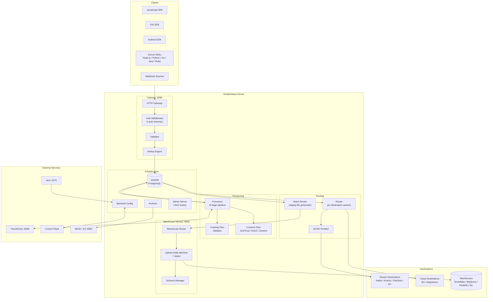
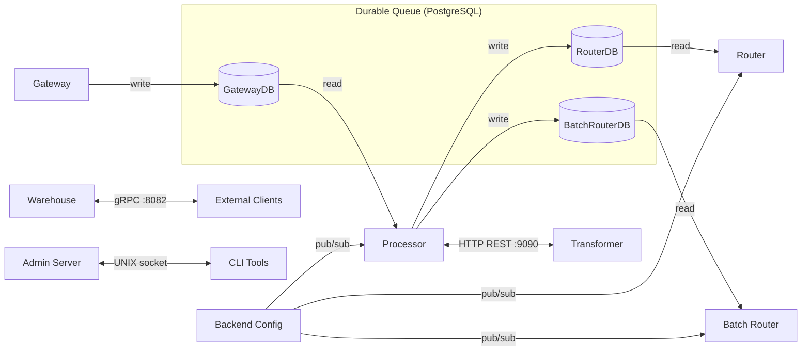
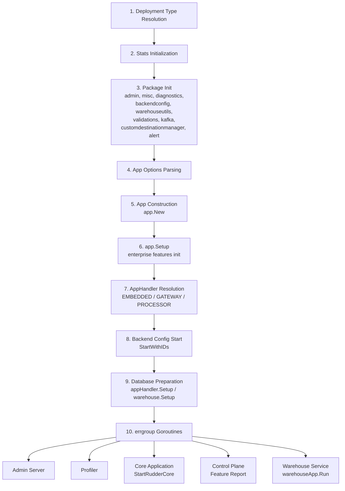

# System Architecture Overview

RudderStack is a **warehouse-first Customer Data Platform (CDP)** built as a modular monolith in Go 1.26.0. The system achieves Segment API compatibility while processing events through a durable, at-least-once delivery pipeline backed by PostgreSQL-based persistent job queues. The platform supports 90+ destination integrations and 9 warehouse connectors.

> Based on `rudder-server` v1.68.1, licensed under Elastic License 2.0.

**Source:** `README.md` (project overview)

## Modular Monolith Classification

RudderStack is classified as a **modular monolith** — while deployed as a single binary by default (**EMBEDDED** mode), the system can be split into separate **GATEWAY** and **PROCESSOR** components for horizontal scaling. The three deployment modes are defined as constants in the application entry point:

| Mode | Constant | Description |
|------|----------|-------------|
| `EMBEDDED` | Default | Single binary running all pipeline stages: Gateway, Processor, Router, Batch Router, and Warehouse |
| `GATEWAY` | Split mode | Ingestion-only node running the HTTP Gateway; writes to GatewayDB |
| `PROCESSOR` | Split mode | Processing-only node running Processor, Router, Batch Router, and Warehouse; reads from GatewayDB |

This split enables independent horizontal scaling of ingestion and processing tiers under high-throughput workloads.

**Source:** `app/app.go:25-29` (GATEWAY, PROCESSOR, EMBEDDED constants)

---

## System Component Topology

The following diagram illustrates the complete system topology, showing all major components, their relationships, and communication paths.



**Key Ports:**
- **Gateway:** `:8080` — HTTP event ingestion API
- **Transformer:** `:9090` — JavaScript/Python transformation execution
- **Warehouse API:** `:8082` — gRPC and HTTP warehouse management
- **PostgreSQL:** `:5432` — Persistent job queue storage
- **etcd:** `:2379` — Cluster coordination (multi-tenant)
- **MinIO/S3:** `:9000` — Object storage for event archival

**Source:** `docker-compose.yml` (service topology)

---

## Core Pipeline Components

The RudderStack data pipeline consists of five core components that process events sequentially from ingestion through delivery. All inter-stage handoffs are durable, mediated by the PostgreSQL-backed JobsDB.

### Gateway

**Purpose:** HTTP ingestion layer accepting Segment-compatible API calls.

**Port:** `:8080`

The Gateway is the entry point for all event data. It accepts HTTP requests from client SDKs and webhooks, authenticates them using one of five supported authentication schemes, validates payloads against the event specification, deduplicates events, and batch-writes them into the GatewayDB (JobsDB) for downstream processing.

**Key Capabilities:**
- Authentication via 5 schemes (Write Key Basic Auth, OAuth, token-based, and others)
- Payload validation against the Segment-compatible event spec
- Deduplication engine (BadgerDB/KeyDB-backed)
- Batch writing to JobsDB with configurable web workers and DB writer pools
- Rate limiting and throttling

**HTTP Endpoints:**

| Endpoint | Method | Purpose |
|----------|--------|---------|
| `/v1/identify` | POST | Identify user traits |
| `/v1/track` | POST | Track user events |
| `/v1/page` | POST | Track page views |
| `/v1/screen` | POST | Track screen views (mobile) |
| `/v1/group` | POST | Associate user with group |
| `/v1/alias` | POST | Merge user identities |
| `/v1/batch` | POST | Batch multiple events |
| `/v1/import` | POST | Bulk historical import |
| `/v1/replay` | POST | Replay archived events |
| `/v1/retl` | POST | Reverse ETL events |
| `/beacon/v1/*` | POST | Beacon tracking (analytics.js) |
| `/pixel/v1/*` | GET | Pixel tracking (server-side) |
| Webhook endpoints | POST | Source-specific webhook ingestion |

**Handler Implementations:**
- `gateway/handle_http.go` — Core request handlers (identify, track, page, screen, group, alias, batch, merge)
- `gateway/handle_http_auth.go` — Authentication middleware
- `gateway/handle_http_import.go` — Bulk import handler
- `gateway/handle_http_replay.go` — Replay handler
- `gateway/handle_http_retl.go` — Reverse ETL handler
- `gateway/handle_http_beacon.go` — Beacon tracking handler
- `gateway/handle_http_pixel.go` — Pixel tracking handler

**See also:** [Data Flow](./data-flow.md) · [Security](./security.md)

**Source:** `gateway/handle_http.go:17-69` (handler registrations)

---

### Processor

**Purpose:** Central event processing engine running the 6-stage pipeline.

The Processor reads batches of events from the GatewayDB and processes them through a six-stage pipeline orchestrated via buffered Go channels. Each stage runs as a dedicated goroutine within a partition-scoped worker, enabling concurrent processing of independent event partitions.

**Six Pipeline Stages:**

| Stage | Channel | Description |
|-------|---------|-------------|
| 1. Preprocess | `preprocess` | Job extraction, event parsing, and preprocessing delay enforcement |
| 2. Source Hydration | `srcHydration` | Event enrichment via the Transformer service |
| 3. Pre-Transform | `preTransform` | Archival, event schema forwarding, and tracking plan validation |
| 4. User Transform | `usertransform` | Custom JavaScript/Python transformations (batch size: 200) |
| 5. Destination Transform | `destinationtransform` | Destination-specific payload shaping (batch size: 100) |
| 6. Store | `store` | Transformed events written to RouterDB and BatchRouterDB |

**Key Capabilities:**
- Partition-scoped workers with buffered channel orchestration
- Event enrichment and source hydration via external Transformer service (port 9090)
- Tracking plan validation (`processor/trackingplan.go`)
- Consent filtering with OneTrust, Ketch, and Generic CMP support (`processor/consent.go`)
- Event filtering and drop rules (`processor/eventfilter/`)
- Configurable batch sizes: user transform 200, destination transform 100

**See also:** [Pipeline Stages](./pipeline-stages.md) (detailed stage documentation)

**Source:** `processor/processor.go` (Handle definition, stage orchestration)
**Source:** `processor/pipeline_worker.go:18-46` (pipeline worker initialization, channel setup)
**Source:** `processor/pipeline_worker.go:76-240` (6-stage goroutine chain)

---

### Router

**Purpose:** Real-time event delivery to stream and cloud destinations.

The Router reads processed events from the RouterDB and delivers them to configured destinations in real time. Each destination type gets its own set of workers, enabling per-destination concurrency control, throttling, and ordering guarantees.

**Key Capabilities:**
- Per-destination worker pools with configurable concurrency
- **GCRA (Generic Cell Rate Algorithm) throttling** for rate-limited destinations
- **Per-user event ordering** to guarantee delivery sequence when `guaranteeUserEventOrder` is enabled
- Adaptive retry with exponential backoff and configurable retry windows
- OAuth v2 integration with circuit breaker for failing credentials
- Destination-specific payload transformation via the Transformer service

**Architecture:**
- `Handle` struct manages the complete lifecycle for a single destination type
- `Factory` pattern creates new `Handle` instances per destination
- Event ordering managed via `router/internal/eventorder/` module
- Throttling via `router/throttler/` using GCRA algorithm

**See also:** [Data Flow](./data-flow.md)

**Source:** `router/handle.go:48-100` (Handle struct, configuration fields)
**Source:** `router/factory.go:19-54` (Factory pattern, Handle initialization)

---

### Batch Router

**Purpose:** Bulk event delivery for warehouse and batch-oriented destinations.

The Batch Router reads events from the BatchRouterDB and generates staging files for bulk delivery to warehouse and batch-oriented destinations. It supports both synchronous and asynchronous destination management patterns.

**Key Capabilities:**
- Staging file generation in configurable formats (JSON, CSV, Parquet)
- Asynchronous destination management for long-running bulk operations
- Upload polling and status tracking
- Integration with the Warehouse Service for warehouse-bound events

The async destination manager subsystem provides a pluggable framework for onboarding new batch-oriented destinations. It handles file upload, polling for completion, and error handling with retry semantics.

**See also:** `router/batchrouter/asyncdestinationmanager/README.md` (comprehensive onboarding guide)

**Source:** `router/batchrouter/` (batch routing subsystem)

---

### Warehouse Service

**Purpose:** Warehouse loading orchestrator with a 7-state upload state machine.

**Port:** `:8082` (gRPC and HTTP APIs)

The Warehouse Service is a comprehensive loading orchestrator that manages the entire lifecycle of loading event data into data warehouses. It runs a 7-state upload state machine for each warehouse destination, handling schema evolution, parallel loading, identity resolution, and encoding format management.

**Key Capabilities:**
- **7-state upload state machine** managing the complete upload lifecycle
- **Schema evolution** — automatic detection and application of schema changes
- **Parallel loading** — concurrent table loading within a single upload
- **9 warehouse connectors:** Snowflake, BigQuery, Redshift, ClickHouse, Databricks (Delta Lake), PostgreSQL, MSSQL, Azure Synapse, and S3/GCS/Azure Datalake
- **Identity resolution** — cross-touchpoint user identity unification
- **Encoding formats** — Parquet, JSON, CSV via configurable encoding factory
- **Master/Slave mode** — distributed processing for high-throughput deployments

**22+ Sub-packages:**

| Package | Purpose |
|---------|---------|
| `warehouse/router/` | Upload state machine and orchestration |
| `warehouse/schema/` | Schema management and evolution |
| `warehouse/integrations/` | 9 warehouse connector implementations |
| `warehouse/encoding/` | Parquet, JSON, CSV encoding |
| `warehouse/identity/` | Identity resolution and merge rules |
| `warehouse/slave/` | Distributed worker processing |
| `warehouse/api/` | gRPC and HTTP API endpoints |
| `warehouse/archive/` | Warehouse-specific archival |
| `warehouse/bcm/` | Backend config manager for warehouse |
| `warehouse/constraints/` | Table and column constraints |
| `warehouse/multitenant/` | Multi-tenant management |
| `warehouse/source/` | Source event management |
| `warehouse/utils/` | Shared warehouse utilities |

**See also:** [Warehouse State Machine](./warehouse-state-machine.md)

**Source:** `warehouse/app.go:51-92` (App struct, 22+ sub-package imports)

---

## Infrastructure Components

Four infrastructure components provide the foundational services that support the core pipeline.

### JobsDB

**Purpose:** PostgreSQL-backed persistent job queue providing durable handoff between pipeline stages.

JobsDB is the central durability mechanism in RudderStack. Every event passes through JobsDB at each pipeline stage, ensuring crash-safe, at-least-once delivery semantics. The system uses append-only writes and table-level deletes to avoid costly UPDATE and DELETE operations.

**Instances:**

| Instance | Read By | Written By |
|----------|---------|------------|
| `gw` (GatewayDB) | Processor | Gateway |
| `rt` (RouterDB) | Router | Processor |
| `batch_rt` (BatchRouterDB) | Batch Router | Processor |
| `esch` (EventSchemaDB) | Event Schema service | Processor |
| `arc` (ArchivalDB) | Archiver | Processor |

**Key Capabilities:**
- **Partitioned datasets** — jobs stored in `jobs_%d` / `job_status_%d` table pairs
- **Priority pools** — separate connection pools for priority operations (e.g., partition migration)
- **COPY IN bulk inserts** — high-throughput PostgreSQL bulk ingestion
- **Pending events registry** — tracking outstanding events per workspace/source/destination
- **In-memory caching** — distinct values cache and dataset range tracking for fast reads

**Source:** `jobsdb/jobsdb.go:1-16` (architecture documentation)
**Source:** `app/apphandlers/embeddedAppHandler.go:183-196` (GatewayDB instance creation)

---

### Backend Config

**Purpose:** Dynamic workspace configuration service polling the Control Plane.

Backend Config manages the runtime configuration for all workspaces, sources, and destinations. It polls the Control Plane API every 5 seconds (configurable via `pollInterval`) to receive updated configuration, then distributes changes to all pipeline components via a pub/sub mechanism.

**Key Capabilities:**
- **5-second polling interval** — configurable periodic configuration refresh
- **AES-GCM encrypted caching** — configuration cached to disk with encryption for resilience against Control Plane outages
- **Pub/sub distribution** — components subscribe to configuration topics and receive updates asynchronously
- **Modes:** Single-workspace (standard) and Namespace (multi-tenant) configurations

**Source:** `backend-config/backend-config.go:34-54` (configuration variables, polling setup)
**Source:** `backend-config/backend-config.go:74-80` (BackendConfig interface definition)

---

### Control Plane

**Purpose:** gRPC-based remote configuration distribution.

The Control Plane provides the centralized configuration management service. The `rudder-server` connects to the Control Plane to receive workspace configuration, destination credentials, tracking plans, and feature flags.

**Key Capabilities:**
- **yamux multiplexing** with optional TLS for connection pooling
- **DPAuth service** for credential distribution to data plane nodes
- **Feature reporting** — server sends component feature capabilities to the Control Plane

**See also:** [Cluster Management](./cluster-management.md)

**Source:** `controlplane/` (control plane client implementation)
**Source:** `runner/runner.go:229-241` (Control Plane feature reporting)

---

### Archiver

**Purpose:** Event archival to object storage (MinIO/S3/GCS).

The Archiver reads processed events from the ArchivalDB and uploads them to object storage for long-term retention and replay capability. Events are organized by source, date, and hour for efficient retrieval.

**Key Capabilities:**
- **Partition-aware archival** — events grouped by workspace for storage isolation
- **Gzipped JSONL format** — compressed JSON Lines for storage efficiency
- **10-day retention** — configurable retention window
- **Organization:** `source/date/hour` directory structure
- **Upload frequency** — configurable upload interval to balance latency and efficiency

**Source:** `archiver/worker.go:28-53` (worker struct, configuration fields)

---

## Supporting Services

RudderStack includes 19 shared service packages under the `services/` directory, providing cross-cutting capabilities to the core pipeline components.

| Package | Purpose |
|---------|---------|
| **streammanager** | Stream destination producer management — Kafka, Kinesis, Pub/Sub, Azure Event Hub, Firehose, EventBridge, Confluent Cloud, and more |
| **dedup** | Event deduplication with BadgerDB and KeyDB backends, including mirror mode for validation |
| **oauth** | OAuth v2 credential management with token caching, refresh, circuit breaker, and Control Plane integration |
| **transformer** | Transformer service client with feature polling, retry, and HTTP client tuning |
| **fileuploader** | File upload to S3, GCS, and Azure Blob Storage with backend-config-driven provider selection |
| **geolocation** | IP-based geographic enrichment using MaxMind databases |
| **debugger** | Live event debugging with uploader/cache pipeline for source, destination, and transformation debuggers |
| **diagnostics** | Telemetry and analytics client for instrumentation and error tracking |
| **kvstoremanager** | Provider-agnostic key-value store management with Redis backend, JSON merge, and TLS/cluster support |
| **notifier** | PostgreSQL-backed notification queue with publish/subscribe, maintenance, and migrations |
| **alert** | Alert factory with PagerDuty and VictorOps implementations |
| **alerta** | Alerta alert manager client with retries and tagging |
| **archiver** | Table-level SQL archival with templated queries, pagination, gzip normalization, and uploads |
| **rmetrics** | Pending events registry for JobsDB metrics with gauge management |
| **rsources** | Source management service for tracking source-level job status |
| **sql-migrator** | Database schema migration management |
| **controlplane** | Control Plane HTTP client with retries, identity-based auth, and admin operations |
| **transientsource** | Transient source ID sampling with atomic map swaps and backend-config subscriptions |
| **validators** | Environment validation including PostgreSQL compatibility/version checks and migration initialization |

**Source:** `services/` (19 service packages)

---

## Enterprise Features

RudderStack includes four enterprise sub-modules that are activated when an `EnterpriseToken` is provided at startup. Without the token, NOOP implementations are used, ensuring the open-source version runs without enterprise dependencies.

| Feature | Package | Description |
|---------|---------|-------------|
| **Reporting** | `enterprise/reporting/` | Telemetry pipeline with error extraction, grouping, normalization, Parquet export, event sampling, and PostgreSQL-backed aggregation |
| **Suppress User** | `enterprise/suppress-user/` | Per-user event suppression with Badger or memory-backed repository, syncer, and handler |
| **Tracked Users** | `enterprise/trackedusers/` | HyperLogLog-based unique user counting with PostgreSQL-driven aggregation and reporting |
| **Config Env** | `enterprise/config-env/` | Environment variable substitution in workspace configuration — replaces placeholder strings with `os.Getenv` values |

**Activation logic:**

```go
// From app/app.go:55-59
if a.options.EnterpriseToken == "" {
    a.log.Infon("Open source version of rudder-server")
} else {
    a.log.Infon("Enterprise version of rudder-server")
}
```

When the enterprise token is empty, each feature factory returns a NOOP implementation that passes through data unchanged.

**Source:** `app/app.go:55-59` (enterprise token check)
**Source:** `app/app.go:77-96` (enterprise feature initialization — SuppressUser, Reporting, ConfigEnv, TrackedUsers)

---

## External Dependencies

RudderStack requires the following external services for full operation. The default `docker-compose.yml` provisions all required services.

| Service | Port | Image | Purpose |
|---------|------|-------|---------|
| **PostgreSQL** | `5432` | `postgres:15-alpine` | Persistent job queue storage (JobsDB) — all pipeline state |
| **Transformer** | `9090` | `rudderstack/rudder-transformer:latest` | JavaScript/Python transformation execution engine |
| **etcd** | `2379` | `bitnami/etcd:3` | Cluster coordination for multi-tenant deployments |
| **MinIO/S3** | `9000` | `minio/minio` | Object storage for event archival and replay |
| **Control Plane** | varies | Hosted service | Remote workspace configuration, credentials, and feature flags |

> **Note:** etcd and MinIO are activated via Docker Compose profiles (`multi-tenant` and `storage` respectively) and are not required for single-tenant development deployments.

**Source:** `docker-compose.yml:1-54` (service definitions, ports, images)

---

## Inter-Service Communication

RudderStack components communicate through five distinct patterns, each optimized for its specific reliability and performance requirements.

| Pattern | Protocol | Components | Purpose |
|---------|----------|------------|---------|
| **Durable Queue** | PostgreSQL (JobsDB) | Gateway → Processor → Router / Batch Router | Crash-safe inter-stage handoff with at-least-once delivery |
| **HTTP REST** | HTTP/1.1 | Processor ↔ Transformer (`:9090`) | Synchronous transformation execution with configurable timeouts |
| **gRPC** | HTTP/2 | Warehouse API (`:8082`), Control Plane, Partition Migration | High-performance RPC for warehouse operations and cluster coordination |
| **Pub/Sub** | In-process | Backend Config → all components | Asynchronous configuration distribution via topic subscription |
| **UNIX Socket** | RPC | Admin Server → CLI tools | Local-only administrative operations (status, configuration, debugging) |



**Source:** `runner/runner.go:200-253` (errgroup goroutine setup)
**Source:** `app/apphandlers/embeddedAppHandler.go:80-196` (embedded mode component wiring)

---

## Scalability Design

RudderStack is designed to sustain a pipeline throughput target of **50,000 events/second** with ordering guarantees.

### Horizontal Scaling

The GATEWAY/PROCESSOR deployment split enables independent horizontal scaling:

- **GATEWAY nodes** — Scale ingestion capacity by adding more Gateway instances behind a load balancer. Each Gateway writes to a shared PostgreSQL database.
- **PROCESSOR nodes** — Scale processing capacity by adding more Processor instances. Each reads from the shared GatewayDB and writes to shared RouterDB/BatchRouterDB.

**See also:** [Deployment Topologies](./deployment-topologies.md)

### Worker Pool Architecture

Each pipeline stage uses configurable worker pools:

| Stage | Worker Configuration | Key Config Parameter |
|-------|---------------------|---------------------|
| Gateway | Web workers + DB writer pools | `Gateway.maxWebWorkers`, `Gateway.maxDBWriterProcess` |
| Processor | Partition-scoped pipeline workers | `Processor.maxLoopProcessEvents`, `Processor.pipelineBufferedItems` |
| Router | Per-destination worker pools | `Router.noOfWorkers`, `Router.noOfJobsPerChannel` |
| Batch Router | Per-destination batch workers | `BatchRouter.noOfWorkers` |
| Warehouse | Parallel upload workers | `Warehouse.maxConcurrentUploadJobs` |

**See also:** [Capacity Planning](../guides/operations/capacity-planning.md)

**Source:** `runner/runner.go:68-77` (New constructor, warehouse mode, shutdown timeout)
**Source:** `router/handle.go:68-76` (router worker configuration)

---

## Resilience Patterns

RudderStack implements multiple resilience patterns to ensure reliable event delivery under adverse conditions.

### Durable Queues

All inter-stage handoffs pass through JobsDB (PostgreSQL), providing crash-safe persistence. If any pipeline component crashes or restarts, unprocessed events remain in the database and are picked up on recovery. The append-only design with table-level deletes avoids costly row-level UPDATE and DELETE operations.

**Source:** `jobsdb/jobsdb.go:1-16` (architecture rationale — append-only, table-delete design)

### Encrypted Config Cache

Backend Config caches the latest workspace configuration to disk using AES-GCM encryption. If the Control Plane becomes unavailable, the server falls back to the encrypted cache, enabling continued operation with the last-known-good configuration.

**Source:** `backend-config/internal/cache/` (encrypted cache implementation)

### Retry with Backoff

All destination delivery paths implement configurable retry with exponential backoff. The Router supports per-destination retry windows, maximum retry attempts, and adaptive backoff strategies. Failed deliveries are re-queued in JobsDB with updated status for retry.

**Source:** `router/handle.go` (retry configuration, backoff logic)

### Circuit Breaker

The OAuth v2 module implements a circuit breaker pattern for destinations with failing credentials. When token refresh failures exceed a threshold, the circuit opens and prevents further requests to the failing destination, allowing the system to recover gracefully.

**Source:** `services/oauth/v2/` (circuit breaker for OAuth destinations)

### Graceful Shutdown

The Runner implements graceful shutdown with a configurable timeout (default: 15 seconds). On shutdown signal, the system:
1. Cancels the root context
2. Waits for errgroup goroutines to complete
3. Stops Backend Config
4. Stops the application (CPU/memory profiling cleanup)
5. Syncs logger buffers
6. Stops stats collection

If the graceful shutdown timeout is exceeded, goroutine dumps are logged for debugging and the process exits.

**Source:** `runner/runner.go:75` (graceful shutdown timeout: 15s default)
**Source:** `runner/runner.go:267-298` (shutdown sequence implementation)

---

## Lifecycle Orchestration

The `runner/runner.go` file contains the central lifecycle orchestrator (`Runner`) that manages the complete startup and shutdown sequence for all RudderStack components.

### Startup Sequence



**Detailed Startup Steps:**

1. **Deployment type resolution** — Reads `DEPLOYMENT_TYPE` environment variable to determine single-tenant vs. multi-tenant mode.
2. **Stats initialization** — Configures histogram buckets (separate defaults for warehouse vs. server), starts the stats collection service.
3. **Package initialization** (`runAllInit`) — Initializes global state for: `admin`, `misc`, `diagnostics`, `backendconfig`, `warehouseutils`, `validations`, `kafka`, `customdestinationmanager`, `alert`.
4. **App options parsing** — Reads command-line arguments (version flag, CPU profiling, memory profiling, clear DB flag, enterprise token).
5. **App construction** — Creates the application instance via `app.New(options)`.
6. **app.Setup** — Initializes enterprise features (Reporting, SuppressUser, ConfigEnv, TrackedUsers) based on the enterprise token.
7. **AppHandler resolution** — Creates the appropriate handler for the configured app type (EMBEDDED, GATEWAY, or PROCESSOR).
8. **Backend Config start** — Begins polling the Control Plane for workspace configuration.
9. **Database preparation** — Runs schema migrations and initializes JobsDB instances (sequential to avoid dirty migration state).
10. **errgroup goroutines** — Launches concurrent goroutines for: admin server, profiler, core application (Gateway/Processor/Router), Control Plane feature reporting, and warehouse service.

**Source:** `runner/runner.go:80-253` (Run method — complete startup sequence)
**Source:** `runner/runner.go:301-311` (runAllInit — package initialization)
**Source:** `runner/runner.go:68-77` (New constructor — configuration defaults)

### Shutdown Sequence

1. **Context cancellation** — Root context is cancelled (OS signal or terminal error)
2. **errgroup completion** — All goroutines complete or timeout
3. **Backend Config stop** — Configuration polling halted
4. **app.Stop** — Application cleanup (CPU/memory profile output)
5. **Logger sync** — Flush all buffered log entries
6. **Stats stop** — Halt metrics collection

If the graceful shutdown timeout (default 15s, configurable via `GracefulShutdownTimeout`) is exceeded, a goroutine dump is written to stdout and the process force-exits with code 1.

**Source:** `runner/runner.go:255-298` (shutdown implementation)

---

## Related Architecture Documents

| Document | Description |
|----------|-------------|
| [Data Flow](./data-flow.md) | End-to-end event pipeline with sequence diagrams |
| [Deployment Topologies](./deployment-topologies.md) | EMBEDDED, GATEWAY, PROCESSOR deployment mode configurations |
| [Pipeline Stages](./pipeline-stages.md) | Six-stage Processor pipeline architecture with channel orchestration |
| [Warehouse State Machine](./warehouse-state-machine.md) | 7-state upload lifecycle state machine with transition diagrams |
| [Cluster Management](./cluster-management.md) | etcd-based cluster state management with NormalMode/DegradedMode |
| [Security](./security.md) | Auth, encryption, SSRF protection, and OAuth architecture |

**See also:** [Glossary](../reference/glossary.md) for unified terminology reference.
