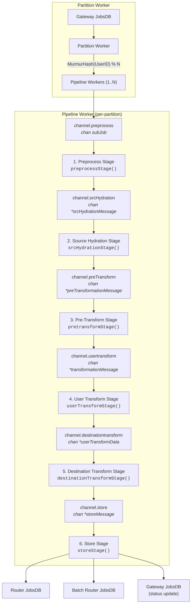
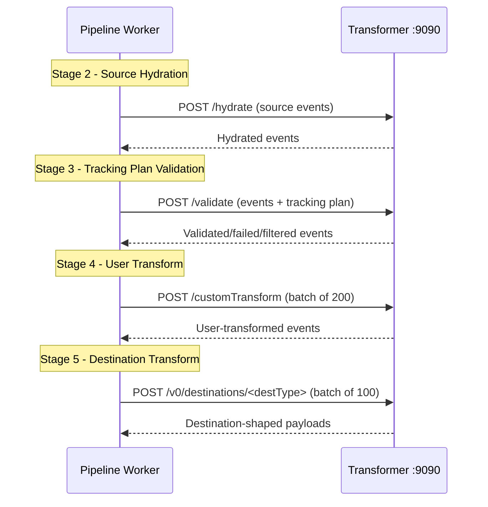

# Processor Pipeline Architecture

The Processor is the central event processing engine of RudderStack, implementing a **six-stage pipeline** that transforms raw gateway events into destination-ready payloads. Each stage runs as an independent goroutine within a pipeline worker, connected to adjacent stages by buffered Go channels. This architecture enables concurrent processing across stages while maintaining per-user event ordering through MurmurHash-based partitioning.

The pipeline processes events in **partition-scoped workers**, where each partition can host one or more pipeline workers. A single `partitionWorker` fetches jobs from the Gateway JobsDB, groups them by UserID hash, and dispatches sub-jobs to the appropriate `pipelineWorker`. Each pipeline worker then runs the six stages as concurrent goroutines connected by buffered channels.

**Source:** `processor/pipeline_worker.go:1-73` (pipeline worker struct and constructor), `processor/partition_worker.go:1-49` (partition worker struct)

**Prerequisites:**
- [Architecture Overview](./overview.md) — high-level system components and deployment modes
- [End-to-End Data Flow](./data-flow.md) — full event lifecycle from SDK to warehouse

**Related References:**
- [Configuration Reference](../reference/config-reference.md) — all 200+ tunable parameters including Processor settings
- [Glossary](../reference/glossary.md) — unified terminology for RudderStack and Segment concepts

---

## Pipeline Overview

The six pipeline stages execute sequentially for each event batch, with each stage performing a distinct transformation or persistence operation:


Each stage corresponds to a dedicated goroutine within the pipeline worker, and stages communicate exclusively through typed, buffered Go channels. This design decouples processing rates between stages — a slow transformation stage does not block upstream deserialization, and a slow database write does not block downstream transformations (up to the buffer capacity).

**Source:** `processor/pipeline_worker.go:76-230` (start method launching all 6 goroutines)

### Channel Orchestration

The following diagram shows the complete architecture from job fetching through all six pipeline stages, including the channel types connecting each stage:



Each pipeline worker instantiates six buffered channels in its constructor. The buffer size for stages 1–5 is controlled by the `Processor.pipelineBufferedItems` configuration parameter (default: `0`, meaning synchronous hand-off). The store channel uses a larger buffer calculated as:

```go
storeBufferSize = (pipelineBufferedItems + 1) * (maxEventsToProcess / subJobSize + 1)
```

This formula accounts for sub-job splitting — a single batch of gateway jobs may be split into multiple sub-jobs that each flow through the pipeline independently and are merged back at the store stage.

**Source:** `processor/pipeline_worker.go:19-46` (constructor with channel creation and buffer sizing)

### Context Cancellation and Channel Closure

A dedicated goroutine watches the pipeline worker's lifecycle context. When the context is cancelled (during shutdown), it closes the `preprocess` channel. Each subsequent goroutine defers closing its downstream channel upon return, creating a cascading closure that drains all in-flight work:

```
context.cancel() → close(preprocess) → close(srcHydration) → close(preTransform) →
  close(usertransform) → close(destinationtransform) → close(store)
```

**Source:** `processor/pipeline_worker.go:77-83` (context cancellation goroutine)

---

## Partition Worker Architecture

The `partitionWorker` sits above the pipeline workers and manages the lifecycle of fetching gateway jobs and distributing them across one or more pipeline workers for a given partition. Each partition corresponds to an isolation boundary (e.g., workspace, source, or global — depending on the configured isolation mode).

### Job Distribution Flow

The `Work()` method implements the following sequence on each iteration:

1. **Fetch pending jobs** — Query the Gateway JobsDB for unprocessed jobs in this partition via `getJobsStage()`
2. **Mark as executing** — Update job statuses to `executing` in the Gateway JobsDB via `markExecuting()`, preventing other workers from picking up the same jobs
3. **Hash and group by UserID** — Compute `MurmurHash(job.UserID) % pipelinesPerPartition` for each job and group jobs by their target pipeline index using `lo.GroupBy`
4. **Split into sub-jobs** — Each pipeline's job list is split into chunks of `subJobSize` via `jobSplitter()`
5. **Dispatch to preprocess channels** — Send each sub-job to the corresponding pipeline worker's `channel.preprocess` channel

```go
// Per-user affinity: jobs from the same UserID always route to the same pipeline worker
jobsByPipeline := lo.GroupBy(jobs.Jobs, func(job *jobsdb.JobT) int {
    return int(misc.GetMurmurHash(job.UserID) % uint64(pipelinesPerPartition))
})
```

This guarantees **per-user event ordering** — all events for a given UserID are processed by the same pipeline worker in the order they were received, regardless of how many pipeline workers are running.

**Source:** `processor/partition_worker.go:53-105` (Work method with MurmurHash distribution)

### Rate Limiting

After dispatching all jobs, if the work iteration completed faster than `readLoopSleep`, the partition worker sleeps for the remaining duration. This prevents tight-loop CPU consumption when job volume is low:

```go
if elapsed := time.Since(start); elapsed < readLoopSleep.Load() {
    misc.SleepCtx(context.Background(), readLoopSleep.Load()-elapsed)
}
```

If `LimitsReached` is `true` (the query returned a full batch), the sleep is skipped entirely to maintain throughput under load.

**Source:** `processor/partition_worker.go:91-102` (rate limiting logic)

### Legacy Path

When pipelining is disabled (`Processor.enablePipelining = false`), the partition worker falls back to the legacy `handlePendingGatewayJobs()` method, which processes all stages synchronously in a single goroutine without channel-based concurrency.

**Source:** `processor/partition_worker.go:54-57` (pipelining check)

### Configuration Parameters

The following configuration parameters control partition worker and pipeline worker behavior:

| Parameter | Config Key | Default | Description |
|-----------|-----------|---------|-------------|
| Enable Pipelining | `Processor.enablePipelining` | `true` | Enables the six-stage concurrent pipeline; when `false`, falls back to synchronous processing |
| Pipelines Per Partition | `Processor.pipelinesPerPartition` | `1` | Number of pipeline workers per partition; increasing allows parallel processing of different users within the same partition |
| Pipeline Buffered Items | `Processor.pipelineBufferedItems` | `0` | Buffer size for inter-stage channels (stages 1–5); `0` means synchronous hand-off between stages |
| Max Events To Process | `Processor.maxLoopProcessEvents` | `10000` | Maximum number of gateway jobs fetched per iteration (reduced to `2000` in low-memory environments) |
| Sub-Job Size | `Processor.subJobSize` | `2000` | Maximum number of jobs per sub-job chunk; large batches are split into sub-jobs of this size (reduced to `400` in low-memory environments) |
| Read Loop Sleep | `Processor.readLoopSleep` | `1000ms` | Minimum time between partition work iterations; prevents tight-loop polling when job volume is low |
| Max Loop Sleep | `Processor.maxLoopSleep` | `10000ms` | Maximum sleep duration between iterations when no work is available |

**Source:** `processor/processor.go:737-757` (configuration loading with defaults), `config/config.yaml:184-192` (YAML defaults)

---

## Stage 1: Preprocess

The preprocess stage is the entry point of the pipeline, responsible for deserializing raw gateway job batches into individual events and performing initial enrichment, deduplication tracking, and metrics computation.

### Responsibilities

1. **Batch deserialization** — Unmarshal the JSON `EventPayload` of each `jobsdb.JobT` into individual `SingularEventT` entries
2. **Event enrichment** — Apply pipeline enrichers (e.g., GeoIP enrichment) to each event
3. **Dedup key extraction** — Collect message IDs for deduplication tracking if `Dedup.enableDedup` is enabled
4. **Bot detection stats** — Compute per-source bot management metrics for reporting
5. **Event blocking stats** — Track events blocked by workspace or source-level policies
6. **Destination filter counting** — Count events per source-destination pair after applying event filtering rules
7. **Event schema job creation** — Generate event schema jobs for the Event Schema service (if enabled via `EventSchemas2.enabled`)
8. **Archival job creation** — Generate archival jobs for the Archiver service (if enabled via `archival.Enabled`)

### Input and Output

- **Input:** `subJob` — a chunk of gateway jobs with associated context and rsources stats collector
- **Output:** `*srcHydrationMessage` — contains grouped transformer events by source ID, event schema jobs, archival jobs, status lists, dedup keys, report metrics, and connection detail maps

### Error Handling

- If the error is `types.ErrProcessorStopping`, the goroutine skips the current batch (graceful shutdown in progress)
- All other errors are logged and cause a **panic**, triggering process restart — this is by design, as corrupted event state is unrecoverable

```go
for jobs := range w.channel.preprocess {
    val, err := w.handle.preprocessStage(w.partition, jobs, partitionProcessingDelay.Load())
    if errors.Is(err, types.ErrProcessorStopping) {
        continue
    }
    if err != nil {
        w.logger.Errorn("Error preprocessing jobs", obskit.Error(err))
        panic(err)
    }
    w.channel.srcHydration <- val
}
```

**Source:** `processor/pipeline_worker.go:91-113` (preprocess goroutine), `processor/processor.go:1660-1730` (preprocessStage implementation)

---

## Stage 2: Source Hydration

The source hydration stage enriches events by calling the external Transformer service to hydrate source context. This stage is only active for sources that support hydration (e.g., cloud sources that require additional API calls to fetch complete event data).

### Responsibilities

1. **Source-level hydration** — For each source ID in the grouped events, check if the source definition supports hydration via `source.IsSourceHydrationSupported()`
2. **Transformer API call** — Send a `SrcHydrationRequest` to the Transformer service's hydration endpoint, which may enrich the event payload with additional fields from external APIs
3. **Event update** — Replace the original event message with the hydrated version returned by the Transformer
4. **Event schema update** — Update event schema jobs with the hydrated payload if applicable
5. **Hydration failure reporting** — Generate reporting metrics for events where hydration failed

### Input and Output

- **Input:** `*srcHydrationMessage` — grouped events by source ID from the preprocess stage
- **Output:** `*preTransformationMessage` — enriched events with hydration status tracking (`srcHydrationEnabledMap`)

### Error Handling

Follows the same pattern as the preprocess stage: `ErrProcessorStopping` is ignored; all other errors cause a panic. For individual source hydration failures, the stage generates `hydrationFailedReports` metrics but continues processing other sources.

**Source:** `processor/pipeline_worker.go:116-136` (src hydration goroutine), `processor/src_hydration_stage.go:53-180` (srcHydrationStage implementation)

---

## Stage 3: Pre-Transform

The pre-transform stage handles persistence of event schema and archival jobs, accumulates reporting metrics, validates events against tracking plans, filters events by consent policies, and organizes events per source/destination pair for downstream transformation.

### Responsibilities

1. **Persist event schema jobs** — Write event schema jobs to the EventSchema JobsDB with retry logic (if Event Schemas are enabled)
2. **Persist archival jobs** — Write archival jobs to the Archival JobsDB with retry logic (if archival is enabled and `Processor.archiveInPreProcess` is `false`, archival and event schema writes execute concurrently via `errgroup`)
3. **Reporting metrics accumulation** — Compute and aggregate PU (Processing Unit) reported metrics for bot management, event blocking, gateway, destination filtering, enricher, and source hydration stages
4. **Tracking plan validation** — Validate events against configured tracking plans via the Transformer service's tracking plan validation endpoint. Events with a `TrackingPlanID` are validated; violations are annotated in the event context. See [Governance: Tracking Plans](../guides/governance/tracking-plans.md) for configuration details.
5. **Consent filtering** — Filter destination lists based on user consent data (OneTrust, Ketch, or Generic CMP). The consent module supports both `or` (user must consent to at least one category) and `and` (user must consent to all categories) resolution strategies. See [Governance: Consent Management](../guides/governance/consent-management.md) for details.
6. **Event filtering** — Apply destination-level event type and event name filters
7. **Per-destination event grouping** — Organize validated and filtered events into `srcAndDestKey`-indexed groups for the user transform stage
8. **Unique message ID tracking** — Collect unique message IDs per source-destination pair for dedup statistics

### Input and Output

- **Input:** `*preTransformationMessage` — hydrated events with source/destination mapping, event schema jobs, archival jobs
- **Output:** `*transformationMessage` — validated and filtered events grouped by source-destination key, ready for user transformation

### Tracking Plan Integration

The tracking plan validator (`processor/trackingplan.go`) sends events to the Transformer service's tracking plan validation endpoint. The response classifies events as:
- **Validated (pass)** — events proceed to transformation
- **Failed** — events are marked with validation errors in the event context (if `propagateValidationErrors` is enabled in the tracking plan config)
- **Filtered** — events are dropped based on tracking plan rules

Violation details (tracking plan ID, version, and validation errors) are injected into the event's `context` object for downstream consumption.

**Source:** `processor/pipeline_worker.go:138-158` (pre-transform goroutine), `processor/processor.go:2129-2300` (pretransformStage implementation), `processor/trackingplan.go:66-142` (validateEvents method), `processor/consent.go:44-95` (getConsentFilteredDestinations method)

---

## Stage 4: User Transform

The user transform stage executes custom JavaScript or Python transformations defined by the user for specific source-destination connections. Transformations are executed by the external **Transformer service** running on port 9090.

### Responsibilities

1. **Batch transformation** — Send events to the Transformer service in batches of **200** (configured via `Processor.userTransformBatchSize`)
2. **Per-destination parallelism** — Each source-destination key's event list is transformed in a separate goroutine, allowing parallel transformation across different destinations
3. **Mirroring support** — When enabled (`Processor.userTransformationMirroringSanitySampling > 0`), a sampling percentage of transformation requests are mirrored for sanity comparison
4. **Response filtering** — Filter transformation outputs through `ConvertToFilteredTransformerResponse` to handle success, failure, and filtered events
5. **Reporting metrics** — Generate transformation stage metrics tagged with `USER_TRANSFORMATION`, tracking input count, output success/failure/filtered counts, and transformation duration

### Input and Output

- **Input:** `*transformationMessage` — events grouped by source-destination key, with status lists, dedup keys, and report metrics
- **Output:** `*userTransformData` — transformed events per source-destination key, accumulated report metrics, and tracing data

### Transformer Service Interaction

The Transformer service is an external Node.js microservice defined in `docker-compose.yml`:

```yaml
transformer:
  image: "rudderstack/rudder-transformer:latest"
  ports:
    - "9090:9090"
```

User transformations are functions defined by the user in JavaScript or Python. The Processor sends event batches to the Transformer's user transformation endpoint, and the Transformer executes the custom code and returns transformed payloads.

**Source:** `processor/pipeline_worker.go:160-173` (user transform goroutine), `processor/processor.go:2424-2510` (userTransformStage implementation), `docker-compose.yml` (Transformer service at port 9090)

---

## Stage 5: Destination Transform

The destination transform stage applies destination-specific payload transformations that shape events into the format required by each downstream destination. These transformations are built-in (not user-defined) and are executed by the Transformer service.

### Responsibilities

1. **Batch transformation** — Send events to the Transformer service in batches of **100** (configured via `Processor.transformBatchSize`)
2. **Per-destination parallelism** — Each user-transform output is processed in a separate goroutine for parallel destination transformation
3. **Job marshaling** — Marshal transformer outputs into `jobsdb.JobT` entries with populated `ParametersT` fields (source ID, destination ID, message ID, event name, event type, workspace ID, trace parent, connection ID, etc.)
4. **Destination classification** — Tag each output job as either a **router** destination (real-time delivery) or a **batch** destination (batch/warehouse delivery) for downstream routing
5. **Error aggregation** — Collect transformation errors per destination ID into `procErrorJobsByDestID`
6. **Reporting metrics** — Generate transformation stage metrics tagged with `DEST_TRANSFORMATION`

### Input and Output

- **Input:** `*userTransformData` — user-transformed events per source-destination key
- **Output:** `*storeMessage` — contains router jobs (`destJobs`), batch router jobs (`batchDestJobs`), dropped jobs, error jobs, status lists, dedup keys, report metrics, and rsources stats

### Router vs. Batch Destination Classification

Events are classified based on whether their destination definition name appears in `misc.BatchDestinations()`:
- **Router destinations** — Written to the Router JobsDB for real-time, per-event delivery
- **Batch destinations** — Written to the Batch Router JobsDB for bulk file-based delivery (includes warehouse destinations and object storage destinations)

**Source:** `processor/pipeline_worker.go:175-188` (destination transform goroutine), `processor/processor.go:2512-2650` (destinationTransformStage implementation)

---

## Stage 6: Store

The store stage is the final pipeline stage, responsible for persisting processed jobs to the Router and Batch Router JobsDBs, updating gateway job statuses, and performing post-processing operations. This stage also handles **sub-job merging** — reassembling results from multiple sub-job fragments back into a single batch before writing.

### Sub-Job Merging Logic

When a batch of gateway jobs is split into multiple sub-jobs (chunks of `subJobSize`), each sub-job flows through the entire pipeline independently. At the store stage, sub-jobs are reassembled:

1. **First sub-job, no more fragments** — Store directly without merging (fast path)
2. **First sub-job, more fragments coming** — Initialize a `mergedJob` accumulator
3. **Subsequent sub-jobs** — Merge into the accumulator via `mergedJob.merge(subJob)` which appends status lists, dest jobs, batch dest jobs, dropped jobs, error jobs, report metrics, dedup keys, tracked users reports, and sums total event counts
4. **Last sub-job (`hasMore = false`)** — Store the fully merged result and reset for the next batch

```go
var mergedJob *storeMessage
firstSubJob := true

for subJob := range w.channel.store {
    if firstSubJob && !subJob.hasMore {
        w.handle.storeStage(w.partition, w.index, subJob)
        continue
    }
    if firstSubJob {
        mergedJob = &storeMessage{ /* initialize accumulator */ }
        firstSubJob = false
    }
    mergedJob.merge(subJob)
    if !subJob.hasMore {
        w.handle.storeStage(w.partition, w.index, mergedJob)
        firstSubJob = true
    }
}
```

**Source:** `processor/pipeline_worker.go:190-230` (store goroutine with sub-job merging logic)

### Store Operations

The `storeStage()` method performs the following operations within database transactions:

1. **Lock destination partitions** — Acquire partition locks for router destination IDs (using `storePlocker`) to prevent concurrent writes to the same destination, which could cause out-of-order event delivery. Locks use `destID-pipelineIndex` as the key.
2. **Write batch router jobs** — Store batch destination jobs to the Batch Router JobsDB within a `StoreSafeTx` transaction, with retry logic (`RetryWithNotify`)
3. **Write router jobs** — Store real-time destination jobs to the Router JobsDB within a `StoreSafeTx` transaction, with retry logic and ordered locking to prevent deadlocks
4. **Update gateway job statuses** — Mark gateway jobs as processed in a single `UpdateSafeTx` transaction
5. **Report metrics** — Persist reporting metrics if reporting is enabled
6. **Report tracked users** — Publish tracked user reports via the `trackedUsersReporter`
7. **Publish rsources stats** — Publish source-level statistics via `rsourcesStats.Publish()`
8. **Save dropped jobs** — Persist jobs that were dropped during processing (e.g., filtered by consent or tracking plan)
9. **Dedup commit** — If deduplication is enabled, commit dedup keys to the dedup backend (BadgerDB or KeyDB)
10. **Record error delivery status** — Log delivery status for jobs that encountered processing errors

### Concurrent Store Mode

When `Processor.enableConcurrentStore` is `true`, router and batch router writes execute concurrently within a single gateway status update transaction. When disabled (default), writes execute sequentially with a concurrency limit of 1. The concurrent mode acquires destination partition locks earlier to prevent deadlocks from connection pool exhaustion.

**Source:** `processor/processor.go:2654-2880` (storeStage implementation with transaction management)

---

## Transformer Service Integration

The external **Transformer service** is a critical dependency of the Processor pipeline, handling all JavaScript/Python code execution for source hydration, user transformations, destination transformations, and tracking plan validation.

### Service Configuration

| Property | Value |
|----------|-------|
| Image | `rudderstack/rudder-transformer:latest` |
| Port | `9090` (configurable via `Processor.transformerURL`) |
| Protocol | HTTP |
| Role | Executes user-defined and built-in transformations |

**Source:** `docker-compose.yml` (Transformer service definition)

### Interaction Pattern



### Batch Sizing

| Transform Type | Batch Size | Config Key |
|---------------|-----------|-----------|
| User Transform | **200** | `Processor.userTransformBatchSize` |
| Destination Transform | **100** | `Processor.transformBatchSize` |

User transforms use a larger batch size because custom transformation code typically has higher per-invocation overhead (runtime initialization), making larger batches more efficient. Destination transforms use a smaller batch size because built-in transformations are generally faster and the payload size per event tends to be larger after user transformation.

**Source:** `config/config.yaml:191-192` (transformBatchSize: 100, userTransformBatchSize: 200)

---

## Graceful Shutdown

The pipeline implements a cascading shutdown protocol that ensures all in-flight events are either processed or safely drained.

### Pipeline Worker Shutdown

`pipelineWorker.Stop()` executes two operations:

1. **Cancel lifecycle context** — `w.lifecycle.cancel()` cancels the background context, triggering the context-watching goroutine to close the `preprocess` channel
2. **Wait for completion** — `w.lifecycle.wg.Wait()` blocks until all six stage goroutines and the context-watching goroutine have returned

Each goroutine defers closing its downstream channel when it exits. This creates a cascading closure:

```
cancel() → close(preprocess) → preprocess goroutine exits → close(srcHydration) →
  srcHydration goroutine exits → close(preTransform) → preTransform goroutine exits →
  close(usertransform) → userTransform goroutine exits → close(destinationtransform) →
  destinationTransform goroutine exits → close(store) → store goroutine exits
```

Any events already in the channel buffers are processed before the goroutine exits (Go channels drain remaining items on `range` iteration even after close).

**Source:** `processor/pipeline_worker.go:232-236` (Stop method)

### Partition Worker Shutdown

`partitionWorker.Stop()` stops all pipeline workers concurrently:

```go
func (w *partitionWorker) Stop() {
    var wg sync.WaitGroup
    for _, pipeline := range w.pipelines {
        wg.Add(1)
        go func(p *pipelineWorker) {
            defer wg.Done()
            p.Stop()
        }(pipeline)
    }
    wg.Wait()
}
```

All pipeline workers within the partition are stopped in parallel via individual goroutines tracked by a `sync.WaitGroup`. The method blocks until every pipeline worker has fully drained and exited.

**Source:** `processor/partition_worker.go:113-123` (Stop method with concurrent pipeline shutdown)

---

## Instrumentation and Observability

Every inter-stage channel send is instrumented with distributed tracing spans, enabling visibility into pipeline backpressure and per-stage latency.

### Tracing Spans

Each time a stage sends a message to the next stage's channel, it records a trace span measuring the **channel wait time** — the time between creating the message and the downstream channel accepting it. High channel wait times indicate backpressure from slower downstream stages.

| Stage Transition | Span Name | Measurement |
|-----------------|-----------|-------------|
| Preprocess → Source Hydration | `start.srcHydration.wait` | Time waiting for the `srcHydration` channel to accept |
| Source Hydration → Pre-Transform | `start.preTransformCh.wait` | Time waiting for the `preTransform` channel to accept |
| Pre-Transform → User Transform | `start.userTransformCh.wait` | Time waiting for the `usertransform` channel to accept |
| User Transform → Destination Transform | `start.destinationTransformCh.wait` | Time waiting for the `destinationtransform` channel to accept |
| Destination Transform → Store | `start.storeCh.wait` | Time waiting for the `store` channel to accept |
| Partition Worker → Preprocess | `Work.preprocessCh.wait` | Time waiting for the `preprocess` channel to accept dispatched sub-jobs |

All spans are tagged with `{"partition": "<partition_id>"}` for per-partition filtering in monitoring dashboards.

**Source:** `processor/pipeline_worker.go:109-111, 132-134, 154-156, 169-171, 184-186` (RecordSpan calls at each stage transition)

### Stage-Level Metrics

Each stage records a count metric when it processes a batch:

| Metric Name | Stage | Description |
|-------------|-------|-------------|
| `statPreprocessStageCount` | Preprocess | Number of jobs processed in preprocess |
| `statSrcHydrationStageCount` | Source Hydration | Number of jobs processed in source hydration |
| `statPretransformStageCount` | Pre-Transform | Number of events processed in pre-transform |
| `statUtransformStageCount` | User Transform | Number of status entries in user transform |
| `statDtransformStageCount` | Destination Transform | Number of status entries in destination transform |
| `statStoreStageCount` | Store | Number of status entries persisted |

These metrics, combined with the tracing spans, provide full observability into pipeline throughput, per-stage latency, and backpressure patterns.

**Source:** `processor/processor.go:211-217` (stage count metric definitions)

---

## Complete Pipeline Data Types

The following table summarizes the Go types flowing through each channel, connecting the stages:

| Channel | Go Type | Key Fields |
|---------|---------|-----------|
| `preprocess` | `subJob` | Gateway jobs, context, rsources stats, hasMore flag |
| `srcHydration` | `*srcHydrationMessage` | Grouped events by source ID, event schema jobs, archival jobs, status list, dedup keys |
| `preTransform` | `*preTransformationMessage` | Hydrated events, source hydration enabled map, connection details, report metrics |
| `usertransform` | `*transformationMessage` | Validated/filtered events grouped by src-dest key, unique message IDs, pipeline steps |
| `destinationtransform` | `*userTransformData` | User-transformed outputs per src-dest key, traces, tracked users reports |
| `store` | `*storeMessage` | Router jobs, batch router jobs, dropped jobs, error jobs, dedup keys, report metrics, hasMore flag |

**Source:** `processor/pipeline_worker.go:65-72` (channel type definitions), `processor/processor.go:2600-2650` (storeMessage struct)
