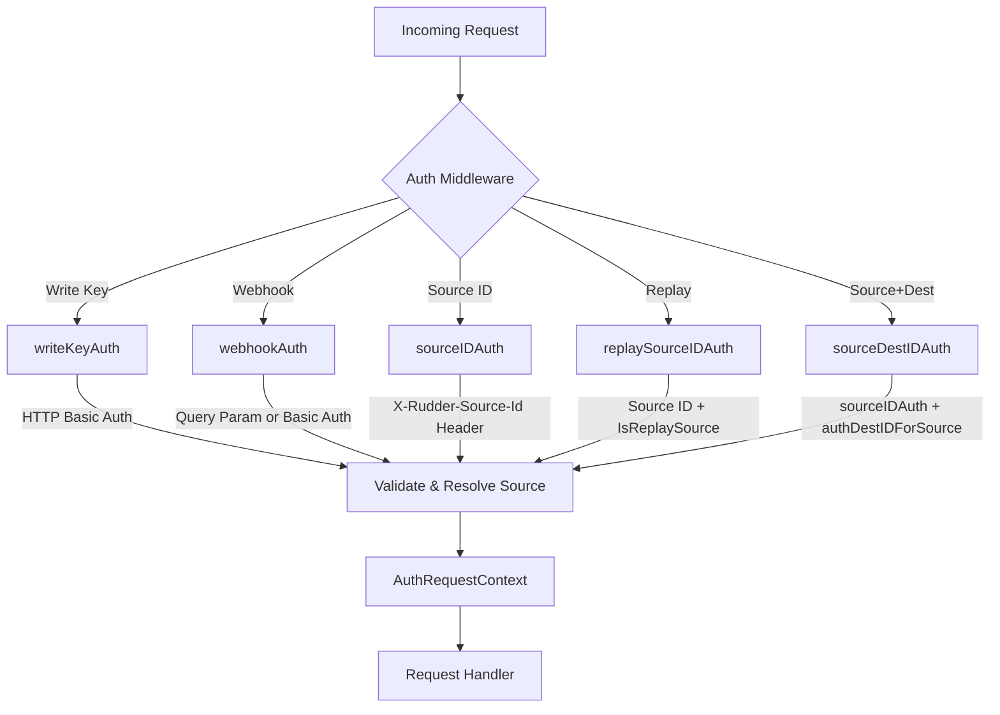
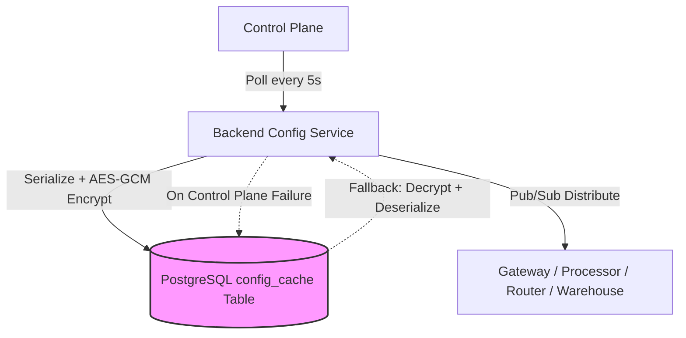
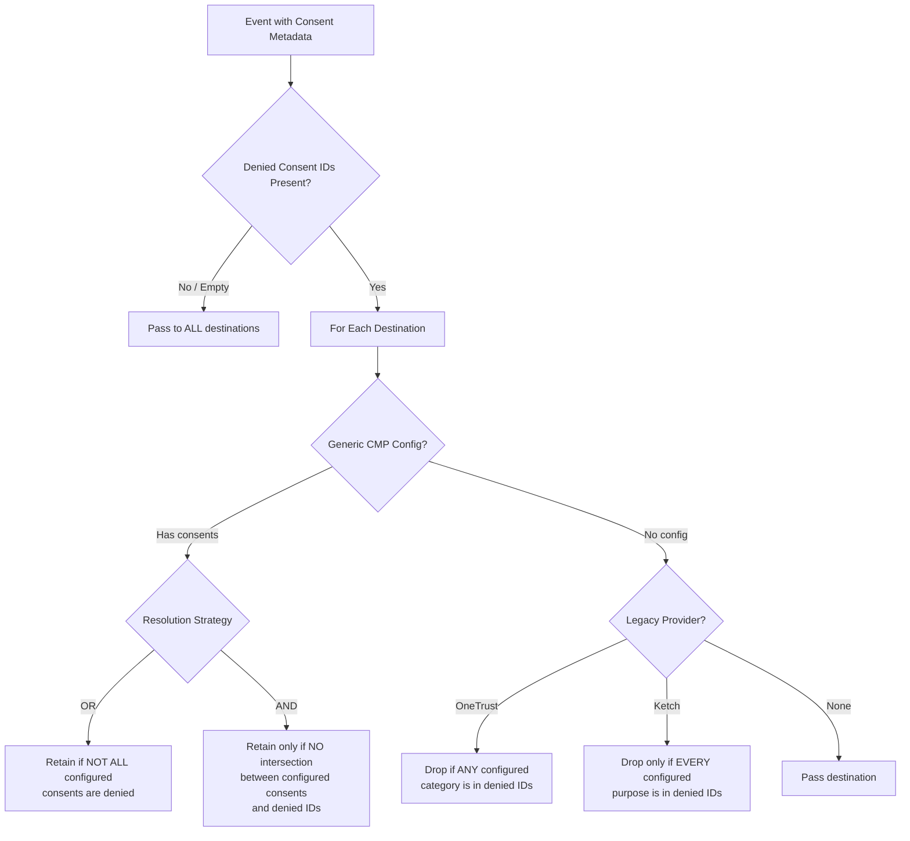

# Security Architecture

RudderStack implements **defense-in-depth security** across multiple layers of the event pipeline. Authentication is enforced at the Gateway for all inbound traffic, configuration data is protected at rest with AES-GCM encryption, outbound destination requests are shielded from SSRF attacks, consent-based filtering governs which destinations receive events, and OAuth v2 manages credential lifecycle for third-party integrations. This document details each security layer, its implementation, and configuration surface.

> **Prerequisite reading:** [Architecture Overview](./overview.md) for the overall system component topology.
>
> **Related:** [API Reference — Authentication](../api-reference/index.md) for endpoint-level authentication details.
>
> **Terminology:** See the [Glossary](../reference/glossary.md) for term definitions used throughout this document.

---

## Authentication Architecture

All inbound requests to the RudderStack Gateway (port 8080) are authenticated through one of five middleware schemes before reaching any request handler. Each scheme resolves an `AuthRequestContext` that carries source identity, workspace binding, and telemetry metadata throughout the request lifecycle.



**Source:** `gateway/handle_http_auth.go`

The middleware selection is determined by the endpoint being accessed. Standard event ingestion endpoints (`/v1/track`, `/v1/identify`, `/v1/page`, `/v1/screen`, `/v1/group`, `/v1/alias`, `/v1/batch`) use Write Key Auth. Webhook endpoints use Webhook Auth. Import and rETL endpoints use Source ID Auth or Source+Destination Auth. Replay endpoints use Replay Source Auth.

---

## Authentication Schemes

### Write Key Auth (`writeKeyAuth`)

The primary authentication scheme for standard event ingestion. Clients supply the source **WriteKey** as the username in an HTTP Basic Authentication header (the password field is ignored).

**Flow:**

1. Extract the WriteKey from the `Authorization: Basic <base64>` header via `r.BasicAuth()`.
2. If the header is missing or the WriteKey is empty, reject with `response.NoWriteKeyInBasicAuth`.
3. Look up the WriteKey in `gw.writeKeysSourceMap` under a read lock (`gw.configSubscriberLock.RLock()`) via `authRequestContextForWriteKey`.
4. If no matching source is found, emit an `invalidWriteKey` stat and reject with `response.InvalidWriteKey`.
5. If the resolved source is disabled (`arctx.SourceEnabled == false`), reject with `response.SourceDisabled`.
6. Augment the context with telemetry headers (`X-Rudder-Job-Run-Id`, `X-Rudder-Task-Run-Id`).
7. Inject the `AuthRequestContext` into `r.Context()` under the key `gwtypes.CtxParamAuthRequestContext`.
8. Delegate to the downstream handler.

On any failure, the deferred cleanup calls `handleHttpError` (HTTP error response + structured logging) and `handleFailureStats` (metrics emission).

**Source:** `gateway/handle_http_auth.go:24-58` (`writeKeyAuth` function)

---

### Webhook Auth (`webhookAuth`)

Authenticates inbound webhook requests. Accepts the WriteKey via **two mechanisms** (in priority order):

1. **Query parameter:** `?writeKey=<key>` on the request URL.
2. **HTTP Basic Auth:** Same as Write Key Auth (fallback).

After resolving the source, an additional constraint is enforced: the source's `SourceCategory` must equal `"webhook"`. If the resolved source is not a webhook source, the request is rejected with `response.InvalidWriteKey`.

**Source:** `gateway/handle_http_auth.go:64-96` (`webhookAuth` function)

---

### Source ID Auth (`sourceIDAuth`)

Used for server-to-server communication where the source is identified by its unique Source ID rather than a WriteKey.

**Flow:**

1. Read the `X-Rudder-Source-Id` header from the request.
2. If the header is missing, reject with `response.NoSourceIdInHeader`.
3. Look up the Source ID in `gw.sourceIDSourceMap` under a read lock via `authRequestContextForSourceID`.
4. If no matching source is found, reject with `response.InvalidSourceID`.
5. If the resolved source is disabled, reject with `response.SourceDisabled`.
6. Augment context and delegate to handler.

**Source:** `gateway/handle_http_auth.go:101-127` (`sourceIDAuth` function)

---

### Replay Source Auth (`replaySourceIDAuth`)

Wraps `sourceIDAuth` with an additional verification step that ensures the resolved source is marked as a **replay source**. This middleware is used exclusively on the `/v1/replay` endpoint.

**Flow:**

1. Delegate to `sourceIDAuth` for standard Source ID validation.
2. After successful source resolution, extract the `AuthRequestContext` from the request context.
3. Look up the source in `gw.sourceIDSourceMap` and verify `s.IsReplaySource()` returns `true`.
4. If the source is not a replay source, reject with `response.InvalidReplaySource` and emit replay-specific failure stats.
5. Otherwise, delegate to the downstream handler.

**Source:** `gateway/handle_http_auth.go:183-194` (`replaySourceIDAuth` function)

---

### Source+Destination Auth (`sourceDestIDAuth`)

Composes `sourceIDAuth` with `authDestIDForSource` to authenticate both the source and a specific destination in a single request. Used for rETL (reverse ETL) and targeted routing endpoints.

**Flow:**

1. `sourceIDAuth` runs first, authenticating the source via `X-Rudder-Source-Id`.
2. `authDestIDForSource` then reads the `X-Rudder-Destination-Id` header.
3. If the header is missing and `Gateway.requireDestinationIdHeader` is `true` (configurable, defaults to `false`), reject with `response.NoDestinationIDInHeader`.
4. Locate the destination in the source's `Destinations` slice using `lo.Find`.
5. If the destination is not found for this source, reject with `response.InvalidDestinationID`.
6. If the destination is disabled, reject with `response.DestinationDisabled`.
7. Set `arctx.DestinationID` and delegate to the downstream handler.

**Source:** `gateway/handle_http_auth.go:129-178, 199-201` (`authDestIDForSource`, `sourceDestIDAuth` functions)

---

### Authentication Schemes Summary

| Scheme | Credential Source | Use Case | Middleware Function |
|--------|------------------|----------|---------------------|
| Write Key Auth | HTTP Basic Auth (WriteKey as username) | Standard event ingestion (`/v1/track`, `/v1/identify`, etc.) | `writeKeyAuth` |
| Webhook Auth | Query param `writeKey` or HTTP Basic Auth | Webhook source ingestion | `webhookAuth` |
| Source ID Auth | `X-Rudder-Source-Id` header | Server-to-server, import, rETL | `sourceIDAuth` |
| Replay Source Auth | Source ID + `IsReplaySource` flag | Event replay via `/v1/replay` | `replaySourceIDAuth` |
| Source+Dest Auth | `X-Rudder-Source-Id` + `X-Rudder-Destination-Id` | Targeted routing (rETL) | `sourceDestIDAuth` |

---

## AuthRequestContext

Every successful authentication produces an `AuthRequestContext` struct that is injected into the HTTP request context and propagated through the entire request lifecycle.

### Construction via `sourceToRequestContext`

The `sourceToRequestContext` function maps a `backendconfig.SourceT` (from the backend configuration) into a `gwtypes.AuthRequestContext`. The following fields are populated:

| Field | Source | Description |
|-------|--------|-------------|
| `SourceEnabled` | `s.Enabled` | Whether the source is currently active |
| `SourceID` | `s.ID` | Unique source identifier |
| `WriteKey` | `s.WriteKey` | Source authentication key |
| `WorkspaceID` | `s.WorkspaceID` | Tenant workspace binding |
| `SourceName` | `s.Name` | Human-readable source name |
| `SourceCategory` | `s.SourceDefinition.Category` | Source type category (defaults to `eventStreamSourceCategory` if empty) |
| `SourceDefName` | `s.SourceDefinition.Name` | Source definition name |
| `ReplaySource` | `s.IsReplaySource()` | Whether this is a replay source |
| `Source` | `s` (full struct) | Complete source configuration including destinations |
| `SourceDetails.*` | Various `s.*` fields | Nested detail block with definition ID, type, original ID, config, and WriteKey |

**Source:** `gateway/handle_http_auth.go:230-257` (`sourceToRequestContext` function)

### Telemetry Augmentation via `augmentAuthRequestContext`

After source resolution, `augmentAuthRequestContext` copies two optional headers into the context for telemetry correlation:

- **`X-Rudder-Job-Run-Id`** → `arctx.SourceJobRunID` — Correlates events with a specific job execution.
- **`X-Rudder-Task-Run-Id`** → `arctx.SourceTaskRunID` — Correlates events with a specific task within a job.

These headers are typically set by batch ingestion systems (e.g., rETL pipelines) to enable end-to-end tracing.

**Source:** `gateway/handle_http_auth.go:204-207` (`augmentAuthRequestContext` function)

---

## Encrypted Configuration Cache

Backend configuration (workspace settings, source/destination definitions, connection configs) is dynamically managed through a polling mechanism with encrypted at-rest caching for resilience.



### Polling and Distribution

The Backend Config service polls the Control Plane at a configurable interval (default: **5 seconds**) defined by:

| Parameter | Default | Description |
|-----------|---------|-------------|
| `BackendConfig.pollInterval` | `5s` | Polling interval for configuration updates from Control Plane |
| `BackendConfig.pollIntervalInS` | `5` | Alternative integer-seconds configuration key |

On each successful poll, the updated configuration is distributed to all subscribed components (Gateway, Processor, Router, Warehouse) via an internal pub/sub mechanism.

**Source:** `backend-config/backend-config.go:99` (`config.GetReloadableDurationVar(5, time.Second, ...)`)

### AES-GCM Encrypted Cache

Configuration is persisted to a PostgreSQL `config_cache` table with AES-256-GCM authenticated encryption. This ensures:

- **Confidentiality:** Configuration data (including WriteKeys, destination credentials, workspace settings) cannot be read from the database without the encryption key.
- **Integrity:** GCM's authentication tag prevents undetected tampering.
- **Resilience:** If the Control Plane becomes unreachable, the server falls back to reading the encrypted cache and decrypting it with the stored 32-byte secret.

**Encryption Process (`set` method):**

1. Marshal the configuration to JSON.
2. Create an AES-256 cipher using the 32-byte secret key.
3. Wrap the cipher in GCM mode (`cipher.NewGCM`).
4. Generate a cryptographically random nonce (`crypto/rand`).
5. Seal the plaintext with GCM, prepending the nonce to the ciphertext.
6. Upsert the encrypted blob into `config_cache` keyed by workspace/namespace identifier.

**Decryption Process (`Get` method):**

1. Read the encrypted blob from `config_cache` by key.
2. Extract the nonce (first `gcm.NonceSize()` bytes) from the blob.
3. Decrypt and authenticate the ciphertext using `gcm.Open`.
4. Return the plaintext JSON configuration.

**Cache Management:**

- On startup, stale entries for other keys are purged via `clear()` (`DELETE FROM config_cache WHERE key != $1`).
- Database migrations are managed via `services/sql-migrator` with the `config_cache_migrations` table.

**Source:** `backend-config/internal/cache/cache.go:40-201` (full cache implementation including `Start`, `set`, `Get`, `encryptAES`, `decryptAES`, `newGCM`)

---

## SSRF Protection

Server-Side Request Forgery (SSRF) protection prevents destination connectors from being exploited to reach internal network resources. The Router's network layer inspects all outbound TCP connections against a configurable set of blocked CIDR ranges.

### Implementation

The `netHandle.Setup` method in the Router configures SSRF protection by wrapping the HTTP transport's `DialContext` function:

1. **Load configuration:** Read `Router.blockPrivateIPs` (boolean, per-destination-type configurable) and the CIDR blocklist.
2. **Parse CIDR ranges:** Load private IP ranges from `privateIPRanges` config (CSV format) via `netutil.NewCidrRanges`. Defaults to standard RFC 1918/RFC 6598 private ranges.
3. **Intercept connections:** The custom `dialContext` function:
   - Splits the address into host and port.
   - Performs DNS resolution via `net.LookupIP`.
   - Checks each resolved IP against `blockPrivateIPsCIDRs.Contains(ip)`.
   - If a match is found and `blockPrivateIPs` is `true`, returns `ErrDenyPrivateIP`.
4. **Error handling:** `ErrDenyPrivateIP` is caught by `SendPost` and translated to a `403: access to private IPs is blocked` response.

**Source:** `router/network.go:34-37` (`ErrDenyPrivateIP` definition), `router/network.go:298-376` (`Setup` method)

### HTTP/2 Control

The `forceHTTP1` configuration option disables HTTP/2 for outbound requests to destinations that do not support it correctly:

- Sets `ForceAttemptHTTP2 = false` on the transport.
- Configures `TLSClientConfig.NextProtos = ["http/1.1"]` to restrict ALPN negotiation.
- Useful for destinations with known HTTP/2 compatibility issues.

**Source:** `router/network.go:347-361`

### Connection Pool Tuning

Idle connection pool sizes are tuned per destination type to balance resource usage and performance:

- `MaxIdleConns` — Derived from `Router.<destType>.httpMaxIdleConns` or `Router.<destType>.noOfWorkers` (default: 64).
- `MaxIdleConnsPerHost` — Derived from `Router.<destType>.httpMaxIdleConnsPerHost` or `Router.<destType>.noOfWorkers` (default: 64).

**Source:** `router/network.go:363-364`

### Egress Disable (Dry-Run)

The `disableEgress` flag on the network handle causes all outbound requests to return `200: outgoing disabled` without making any network contact. This is used for testing and dry-run validation of routing configurations.

**Source:** `router/network.go:76-81`

### SSRF Configuration Reference

| Parameter | Type | Default | Description |
|-----------|------|---------|-------------|
| `Router.blockPrivateIPs` | `bool` | `false` | Enable SSRF protection against private IP ranges (per-destination-type) |
| `privateIPRanges` | `string` (CSV) | RFC 1918/6598 ranges | Comma-separated CIDR ranges to block (e.g., `10.0.0.0/8,172.16.0.0/12,192.168.0.0/16`) |
| `Router.forceHTTP1` | `bool` | `false` | Force HTTP/1.1 connections, disabling HTTP/2 ALPN (per-destination-type) |
| `Router.Network.IncludeInstanceIdInHeader` | `bool` | `false` | Include `X-Rudder-Instance-Id` header in outbound requests |
| `Router.Network.disableEgress` | `bool` | `false` | Disable all outbound network calls (dry-run mode) |
| `Router.<destType>.httpMaxIdleConns` | `int` | `64` | Maximum idle connections in the pool |
| `Router.<destType>.httpMaxIdleConnsPerHost` | `int` | `64` | Maximum idle connections per destination host |

---

## OAuth v2 Integration

RudderStack supports **OAuth v2** for managing destination credentials that require token-based authentication (e.g., Google Ads, Facebook Conversions API). The OAuth module transparently handles token acquisition, caching, refresh, and error recovery without requiring user intervention after initial authorization.

### Architecture

The OAuth v2 implementation lives in `services/oauth/v2/` and consists of the following components:

| Component | File | Responsibility |
|-----------|------|----------------|
| `OAuthHttpClient` | `v2/http/client.go` | Wraps a standard `*http.Client` with `OAuthTransport` for transparent OAuth handling |
| `OAuthTransport` | `v2/http/transport.go` | `http.RoundTripper` interceptor — fetches tokens pre-request, handles refresh post-response |
| `OAuthHandler` | `v2/oauth_handler.go` | Token fetch/refresh orchestration with in-memory caching, partition locking, and metrics |
| `Connector` | `v2/controlplane/cp_connector.go` | Control Plane client for token fetch/refresh API calls with basic auth and timeout handling |
| `DestinationInfo` | `v2/destination_info.go` | Determines OAuth applicability per flow and extracts the appropriate account ID |
| Context helpers | `v2/context/context.go` | Embeds/retrieves `DestinationInfo` and token secrets on `context.Context` |
| Cache | `v2/cache.go` | In-memory token cache interface with TTL support |
| Extensions | `v2/extensions/augmenter.go` | Augments outbound requests with provider-specific auth material from retrieved secrets |

### Request Lifecycle

1. The caller constructs an `*http.Request` and attaches `DestinationInfo` to the context.
2. `OAuthTransport` inspects whether the destination is OAuth-enabled for the given flow (delivery, deletion, etc.).
3. **Non-OAuth destinations:** The request passes through unchanged.
4. **OAuth destinations:**
   - **Pre-roundtrip:** `OAuthHandler.FetchToken` returns an access token (from cache or via Control Plane API). The request is augmented via `extensions.Augmenter` with provider-specific auth headers/parameters.
   - **Roundtrip:** The underlying transport executes the HTTP request.
   - **Post-roundtrip:** The response is parsed for `REFRESH_TOKEN` or `AUTH_STATUS_INACTIVE` categories. If refresh is needed, `OAuthHandler.RefreshToken` is called, and the outcome is communicated via a structured interceptor payload.

### Control Plane Token API

Token operations communicate with the Control Plane backend:

```
POST {ConfigBEURL}/destination/workspaces/{workspaceId}/accounts/{accountId}/token
```

- **Fetch:** Returns a `secret` JSON object containing the access token and `expirationDate`.
- **Refresh:** Request body includes `{ hasExpired: true, expiredSecret: <previous_secret> }`. The Control Plane re-issues tokens from the OAuth provider.

### Configuration

| Parameter | Default | Description |
|-----------|---------|-------------|
| `HttpClient.oauth.timeout` | `30s` | Control Plane connector timeout for token operations |
| `ConfigBEURL` | From `backendconfig.GetConfigBackendURL()` | Control Plane base URL |
| Expiration skew | `1m` (via `WithRefreshBeforeExpiry`) | Duration before expiry to proactively refresh tokens |

### Observability

The module emits timers and counters for Control Plane requests, total roundtrip latency, pre/post roundtrip phases, and outcome categories. Labels include flow type, destination ID/type, workspace, and HTTP status codes.

**Source:** `services/oauth/README.md` (comprehensive module documentation), `services/oauth/v2/oauth_handler.go`, `services/oauth/v2/http/transport.go`

---

## Consent Filtering

The Processor enforces **consent-based destination filtering** before routing events to downstream destinations. This ensures compliance with user privacy preferences as communicated through Consent Management Platforms (CMPs).

### Consent Metadata

Consent information is extracted from the event payload at `event.context.consentManagement`:

```json
{
  "context": {
    "consentManagement": {
      "deniedConsentIds": ["category_1", "category_3"],
      "provider": "oneTrust",
      "resolutionStrategy": "or"
    }
  }
}
```

The `ConsentManagementInfo` struct captures:

| Field | Type | Description |
|-------|------|-------------|
| `deniedConsentIds` | `[]string` | Consent categories/purposes the user has denied |
| `provider` | `string` | CMP provider name (`oneTrust`, `ketch`, `custom`, or empty) |
| `resolutionStrategy` | `string` | Resolution logic (`or`, `and`) — used by Generic CMP |

If `deniedConsentIds` is empty or absent, **no filtering is applied** and all destinations receive the event.

**Source:** `processor/consent.go:16-21` (`ConsentManagementInfo` struct), `processor/consent.go:209-230` (`getConsentManagementInfo` function)

### Filtering Decision Tree



**Source:** `processor/consent.go:44-95` (`getConsentFilteredDestinations` function)

### Provider Semantics

#### Generic CMP (Recommended)

The Generic Consent Management framework supports any CMP provider through a configurable resolution strategy. Configuration is stored per source-destination pair in the destination's `consentManagement` config array.

- **`or` resolution (default for most providers):** The destination is **retained** if **not all** of its configured consents appear in the denied list. In other words, the user must deny every single configured consent to block the destination.
  ```go
  return !lo.Every(deniedConsentIDs, configuredConsents)
  ```

- **`and` resolution:** The destination is **retained** only if there is **zero intersection** between configured consents and denied IDs. Any single denied consent that matches a configured consent will block the destination.
  ```go
  return len(lo.Intersect(configuredConsents, deniedConsentIDs)) == 0
  ```

- **`custom` provider:** When `provider == "custom"`, the resolution strategy is read from the destination config (`cmpData.ResolutionStrategy`) rather than the event payload.

**Source:** `processor/consent.go:57-76` (Generic CMP filtering logic)

#### OneTrust (Legacy)

Category-based filtering using `oneTrustCookieCategories` from the destination configuration:

- If the destination has configured OneTrust cookie categories, the destination is **dropped if ANY** configured category appears in the denied consent IDs.
- Uses intersection check: `len(lo.Intersect(oneTrustCategories, deniedConsentIDs)) == 0`.
- Applied when the provider is empty (`""`) or `"oneTrust"`.

**Source:** `processor/consent.go:79-84` (OneTrust filtering), `processor/consent.go:97-101` (`getOneTrustConsentData`)

#### Ketch (Legacy)

Purpose-based filtering using `ketchConsentPurposes` from the destination configuration:

- If the destination has configured Ketch consent purposes, the destination is **dropped only when EVERY** configured purpose appears in the denied consent IDs.
- Uses "every" check: `!lo.Every(deniedConsentIDs, ketchPurposes)`.
- Applied when the provider is empty (`""`) or `"ketch"`.

**Source:** `processor/consent.go:86-91` (Ketch filtering), `processor/consent.go:103-107` (`getKetchConsentData`)

### Thread Safety

All consent configuration lookups (`getOneTrustConsentData`, `getKetchConsentData`, `getGCMData`) acquire a read lock on `proc.config.configSubscriberLock` to ensure thread-safe access to the consent configuration maps. These maps are updated when the Backend Config service distributes new configuration.

**Source:** `processor/consent.go:97-125`

> **See also:** [Consent Management Guide](../guides/governance/consent-management.md) for operational configuration details and provider setup instructions.

---

## Control Plane Authentication (DPAuth)

The **DPAuth gRPC service** distributes authentication credentials from the Control Plane to data plane components. It runs as a gRPC server within the `controlplane` package, registered during connection establishment.

### Service Registration

When the `ConnectionManager` establishes a connection to the Control Plane:

1. A TCP connection is opened (with optional TLS) to the configured Control Plane URL.
2. A [yamux](https://github.com/hashicorp/yamux) multiplexed session is created over the connection.
3. A gRPC server is initialized and the `authService` is registered via `proto.RegisterDPAuthServiceServer`.
4. The gRPC server begins serving on the yamux session.

**Source:** `controlplane/controlplane.go:20-53` (`establishConnection` function)

### Service Interface

The `authService` implements the `DPAuthServiceServer` protobuf interface with two RPCs:

| RPC Method | Request | Response | Description |
|------------|---------|----------|-------------|
| `GetConnectionToken` | `GetConnectionTokenRequest` | `GetConnectionTokenResponse` | Returns connection token, service name, instance ID, token type, and labels. Returns an error response if the token is empty. |
| `GetWorkspaceToken` | `GetWorkspaceTokenRequest` | `GetWorkspaceTokenResponse` | Returns workspace token, service name, and instance ID. |

### AuthInfo Structure

The `AuthInfo` struct carries the credential material:

| Field | Type | Description |
|-------|------|-------------|
| `Service` | `string` | Service identifier |
| `ConnectionToken` | `string` | Authentication token for Control Plane communication |
| `InstanceID` | `string` | Unique instance identifier |
| `TokenType` | `string` | Token classification |
| `Labels` | `map[string]string` | Key-value metadata labels |

**Source:** `controlplane/auth.go:1-52` (complete `authService` implementation, `AuthInfo` struct, `GetConnectionToken`, `GetWorkspaceToken` methods)

---

## Security Error Handling

Authentication failures are handled consistently across all middleware through two dedicated functions.

### `handleHttpError`

Translates error message strings into HTTP responses with structured logging:

1. Maps the error message to an HTTP status code via `response.GetErrorStatusCode`.
2. Generates a response body via `response.GetStatus`.
3. Logs the failure with structured fields:
   - `ip` — Client IP address (via `kithttputil.GetRequestIP`)
   - `path` — Request URL path
   - `status` — HTTP status code
   - `body` — Response body text
4. Writes the HTTP error response.

**Source:** `gateway/handle_http_auth.go:259-270` (`handleHttpError` function)

### `handleFailureStats`

Converts authentication errors into `gwstats.SourceStat` instances for observability dashboards. The stat fields are populated based on the error type:

| Error Message | Stat Identifiers |
|---------------|------------------|
| `NoWriteKeyInBasicAuth`, `NoWriteKeyInQueryParams` | Source: `"noWriteKey"`, SourceID: `"noWriteKey"`, WriteKey: `"noWriteKey"` |
| `InvalidWriteKey` | Source: `"noWriteKey"`, SourceID: `"noWriteKey"`, WriteKey: `"noWriteKey"` |
| `InvalidSourceID` | Source: `"InvalidSourceId"`, SourceID: `"InvalidSourceId"` |
| `NoSourceIdInHeader` | Source: `"noSourceIDInHeader"`, SourceID: `"noSourceIDInHeader"` |
| `SourceDisabled`, `NoDestinationIDInHeader`, `InvalidDestinationID`, `DestinationDisabled` | Populated from `arctx` (actual source data): SourceID, WriteKey, WorkspaceID, SourceType, SourceDefName |

After populating the stat, `stat.RequestFailed(status)` is called and the stat is emitted via `stat.Report(gw.stats)`.

**Source:** `gateway/handle_http_auth.go:272-318` (`handleFailureStats` function)

---

## Security Configuration Quick Reference

A consolidated reference of all security-related configuration parameters documented in this guide.

### Gateway Authentication

| Parameter | Type | Default | Description |
|-----------|------|---------|-------------|
| `Gateway.requireDestinationIdHeader` | `bool` | `false` | Require `X-Rudder-Destination-Id` header for source+destination auth |

### Backend Config Cache

| Parameter | Type | Default | Description |
|-----------|------|---------|-------------|
| `BackendConfig.pollInterval` | `duration` | `5s` | Control Plane polling interval |
| `BackendConfig.pollIntervalInS` | `int` | `5` | Alternative integer-seconds polling interval |

### SSRF and Network

| Parameter | Type | Default | Description |
|-----------|------|---------|-------------|
| `Router.blockPrivateIPs` | `bool` | `false` | Enable SSRF protection (per-destination-type) |
| `privateIPRanges` | `string` | RFC 1918/6598 | CSV of CIDR ranges to block |
| `Router.forceHTTP1` | `bool` | `false` | Force HTTP/1.1 (per-destination-type) |
| `Router.Network.IncludeInstanceIdInHeader` | `bool` | `false` | Include instance ID in outbound headers |
| `Router.Network.disableEgress` | `bool` | `false` | Disable outbound calls (dry-run) |

### OAuth v2

| Parameter | Type | Default | Description |
|-----------|------|---------|-------------|
| `HttpClient.oauth.timeout` | `duration` | `30s` | Control Plane token API timeout |
| Expiration skew (`WithRefreshBeforeExpiry`) | `duration` | `1m` | Token proactive refresh window |

---

## Related Documentation

- [Architecture Overview](./overview.md) — System component topology and deployment modes
- [API Reference — Authentication](../api-reference/index.md) — Endpoint-level authentication details
- [Consent Management Guide](../guides/governance/consent-management.md) — Operational consent configuration
- [Glossary](../reference/glossary.md) — Unified terminology reference
