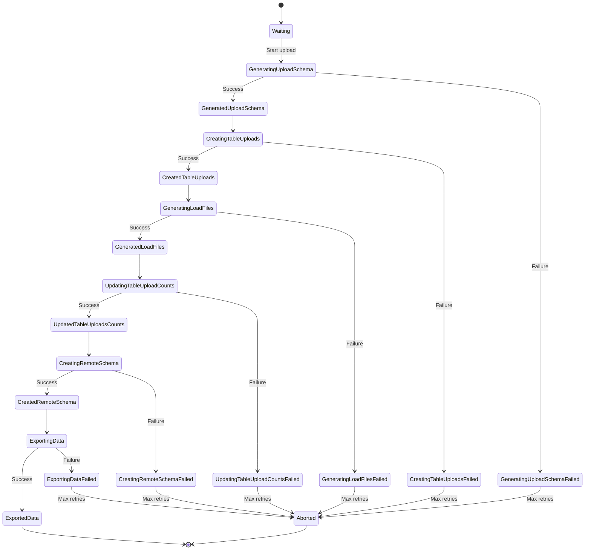
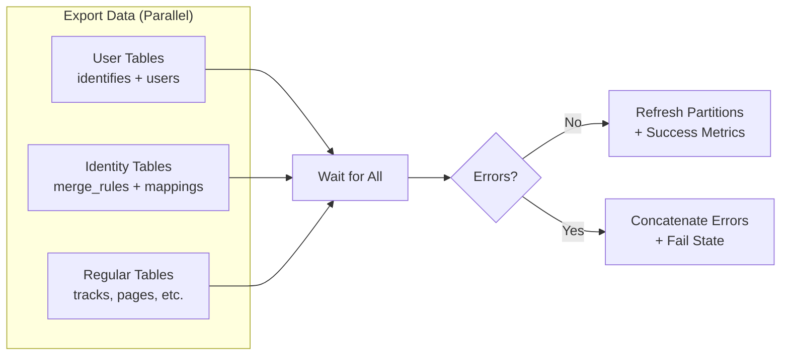
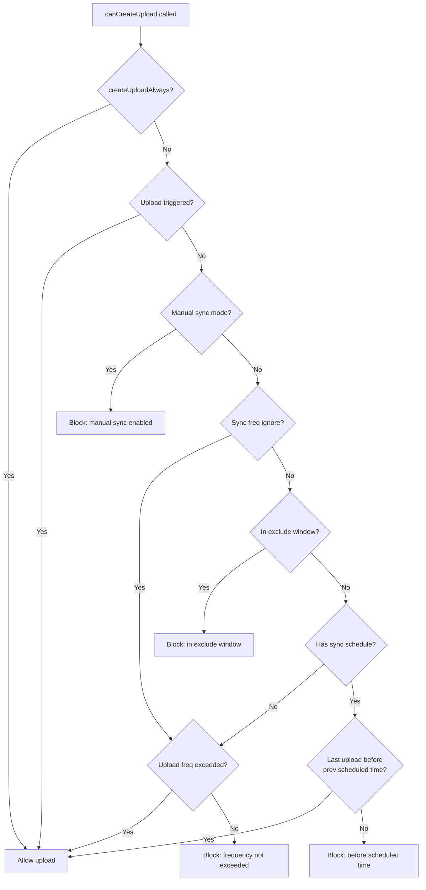
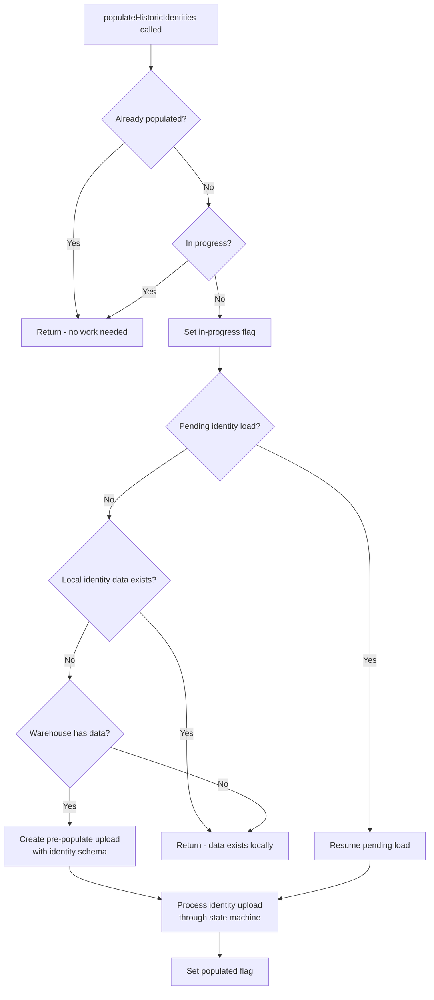

# Warehouse Upload State Machine

The warehouse upload lifecycle is managed by a **7-state state machine** that drives every upload from initial waiting through data export. Each warehouse upload progresses through a deterministic sequence of states, with failure handling and abort capabilities at each stage. The state graph is defined as a linked list of `state` structs, each carrying in-progress, failed, and completed labels along with a pointer to the next state.

**Prerequisites:**
- [Architecture Overview](./overview.md) — high-level system components and deployment modes
- [Data Flow](./data-flow.md) — end-to-end event pipeline from ingestion to warehouse loading

**Related Documentation:**
- [Warehouse Service Overview](../warehouse/overview.md) — warehouse service architecture and operational modes
- [Glossary](../reference/glossary.md) — unified terminology for RudderStack and Segment concepts

> **Implementation note:** State definitions are centralized in `warehouse/router/state.go` using constants from the `warehouse/internal/model` package. The `state` struct contains four fields: `inProgress` (transitional label during execution), `failed` (label applied on failure), `completed` (the canonical state name from the model package), and `nextState` (pointer to the next `state` struct in the chain, or `nil` for terminal states).

**Source:** `warehouse/router/state.go:1-17`

---

## State Machine Overview

The following state diagram shows all 7 upload states, the `Aborted` terminal state, and every possible transition. Each state has an in-progress phase (entered when work begins), a success outcome (advancing to the next state), and a failure outcome (which may be retried or ultimately abort the upload after maximum retries are exhausted).



**Transition semantics:** When a state completes successfully, the upload advances to the next state via `nextState` pointer traversal. When a state fails, the upload is marked with the corresponding `failed` label and may be retried (returning to the same state's in-progress phase). If retries are exhausted within the configured retry time window, the upload transitions to `Aborted`.

**Source:** `warehouse/router/state.go:19-82` (init function with state graph definition)

---

## State Definitions

The following table enumerates every state in the upload lifecycle. The **Completed State** column shows the canonical model constant name. The **In-Progress Label** and **Failed Label** columns show the string values stored in the database during transitional phases. The **Next State** column shows the target state upon successful completion.

| # | Completed State | In-Progress Label | Failed Label | Next State |
|---|----------------|-------------------|--------------|------------|
| 1 | `Waiting` | — | — | `GeneratedUploadSchema` |
| 2 | `GeneratedUploadSchema` | `generating_upload_schema` | `generating_upload_schema_failed` | `CreatedTableUploads` |
| 3 | `CreatedTableUploads` | `creating_table_uploads` | `creating_table_uploads_failed` | `GeneratedLoadFiles` |
| 4 | `GeneratedLoadFiles` | `generating_load_files` | `generating_load_files_failed` | `UpdatedTableUploadsCounts` |
| 5 | `UpdatedTableUploadsCounts` | `updating_table_uploads_counts` | `updating_table_uploads_counts_failed` | `CreatedRemoteSchema` |
| 6 | `CreatedRemoteSchema` | `creating_remote_schema` | `creating_remote_schema_failed` | `ExportedData` |
| 7 | `ExportedData` | `exporting_data` | `exporting_data_failed` | — (terminal) |
| — | `Aborted` | — | — | — (terminal) |

> **Note:** All completed-state constants (`Waiting`, `GeneratedUploadSchema`, `CreatedTableUploads`, etc.) are defined in the `warehouse/internal/model` package and referenced via `model.Waiting`, `model.GeneratedUploadSchema`, etc. The in-progress and failed labels are raw string literals defined inline in the `state` struct initializers.

**Source:** `warehouse/router/state.go:22-82`

---

## State 1: Waiting

**Purpose:** Initial state for all new uploads. Every upload begins in the `Waiting` state and remains there until the scheduling system determines it is time to start processing.

**Behavior:**
- The `Waiting` state has no in-progress or failed labels — it is a pure "ready" state.
- Transition out of `Waiting` is governed entirely by the upload scheduling logic (see [Upload Scheduling](#upload-scheduling) below).
- When the scheduler determines an upload should proceed, the upload transitions to the `GeneratedUploadSchema` state via the `generateUploadSchema` handler.

**State definition:**

```go
waitingState := &state{
    completed: model.Waiting,
}
stateTransitions[model.Waiting] = waitingState
```

The `waitingState` has no `inProgress` or `failed` fields set, meaning it cannot fail — it simply waits for the scheduler to pick it up.

**Source:** `warehouse/router/state.go:22-25`
**Source:** `warehouse/router/scheduling.go` (scheduling guards)

---

## State 2: Generate Upload Schema

**Purpose:** Merges all staging file schemas into a single consolidated upload schema and persists it to the uploads repository.

**Behavior:**
1. Calls `ConsolidateStagingFilesSchema` on the schema handler to merge column-level schemas from all staging files associated with this upload.
2. Marshals the merged schema to JSON and records its byte size as a telemetry observation (`consolidatedSchemaSize` histogram).
3. Persists the consolidated schema to the uploads repository via an `Update` call with the `UploadFieldSchema` key.
4. Sets `job.upload.UploadSchema` in memory for use by subsequent states.

**Error handling:** If schema consolidation or persistence fails, the upload is marked `generating_upload_schema_failed` and eligible for retry.

**Implementation:** `state_generate_upload_schema.go` — the `generateUploadSchema()` method on `UploadJob`.

```go
func (job *UploadJob) generateUploadSchema() error {
    uploadSchema, err := job.schemaHandle.ConsolidateStagingFilesSchema(
        job.ctx, job.stagingFiles,
    )
    if err != nil {
        return fmt.Errorf("consolidate staging files schema: %w", err)
    }
    // ... marshal, observe size, persist to repo
    job.upload.UploadSchema = uploadSchema
    return nil
}
```

**Source:** `warehouse/router/state_generate_upload_schema.go:11-37`

---

## State 3: Create Table Uploads

**Purpose:** Builds the per-table upload tracking records. For each table in the upload schema, a table upload entry is created. If the upload contains identity merge rules for an identity-enabled warehouse, the identity mappings table is automatically added.

**Behavior:**
1. Iterates over all tables in `job.upload.UploadSchema`.
2. For identity-enabled warehouse types (e.g., Snowflake, BigQuery), if the schema includes `rudder_identity_merge_rules`, the `rudder_identity_mappings` table is automatically appended — even if it was not in the original upload schema.
3. Inserts all table names into the `table_uploads` repository in a single batch via `tableUploadsRepo.Insert`.

**Identity table augmentation logic:**

```go
if slices.Contains(whutils.IdentityEnabledWarehouses, destType) &&
    t == whutils.ToProviderCase(destType, whutils.IdentityMergeRulesTable) {
    if _, ok := schemaForUpload[whutils.ToProviderCase(destType, whutils.IdentityMappingsTable)]; !ok {
        tables = append(tables, whutils.ToProviderCase(destType, whutils.IdentityMappingsTable))
    }
}
```

**Error handling:** Insert failures mark the upload `creating_table_uploads_failed`.

**Source:** `warehouse/router/state_create_table_uploads.go:9-27`
**See also:** [Identity Table Loading](#identity-table-loading) for historic identity pre-population.

---

## State 4: Generate Load Files

**Purpose:** Orchestrates load file creation from staging files, validates row counts, and records telemetry for load file generation time.

**Behavior:**
1. **Create load files:** Delegates to `job.loadfile.CreateLoadFiles()` which produces warehouse-formatted load files (Parquet, JSON, or CSV depending on the encoding configuration) from the staging files.
2. **Persist load file IDs:** Stores the `startLoadFileID` and `endLoadFileID` range in both the in-memory upload model and the uploads repository. Validates that `startLoadFileID <= endLoadFileID`.
3. **Row count validation:** Compares total events in staging files against total exported events in load files (excluding discards table). Logs mismatches and emits a `staging_load_file_events_count_mismatch` gauge metric. Row count mismatches are logged as errors but do **not** fail the state.
4. **Telemetry:** Records `load_file_generation_time` timer statistic.

**Key validation:**

```go
if (rowsInStagingFiles != rowsInLoadFiles) || rowsInStagingFiles == 0 || rowsInLoadFiles == 0 {
    job.logger.Errorn("Rows count mismatch between staging and load files")
    job.stats.stagingLoadFileEventsCountMismatch.Gauge(rowsInStagingFiles - rowsInLoadFiles)
}
```

**Error handling:** Failures in load file creation or ID persistence mark the upload `generating_load_files_failed`.

**Source:** `warehouse/router/state_generate_load_files.go:14-29` (main flow)
**Source:** `warehouse/router/state_generate_load_files.go:49-63` (row count validation)

---

## State 5: Update Table Upload Counts

**Purpose:** Propagates total event counts from staging files into each table upload record. This is executed as a single database transaction to ensure atomicity.

**Behavior:**
1. Opens a database transaction via `tableUploadsRepo.WithTx`.
2. For each table in the upload schema, calls `PopulateTotalEventsWithTx` to compute and store the total event count for that table's upload record.
3. On commit, all table upload counts are consistently updated.

**Implementation:**

```go
func (job *UploadJob) updateTableUploadsCounts() error {
    return job.tableUploadsRepo.WithTx(job.ctx, func(tx *sqlquerywrapper.Tx) error {
        for tableName := range job.upload.UploadSchema {
            if err := job.tableUploadsRepo.PopulateTotalEventsWithTx(
                job.ctx, tx, job.upload.ID, tableName,
            ); err != nil {
                return fmt.Errorf("populate total events for table: %s, %w", tableName, err)
            }
        }
        return nil
    })
}
```

**Error handling:** Transaction failures mark the upload `updating_table_uploads_counts_failed`. The transactional wrapper ensures partial updates are rolled back.

**Source:** `warehouse/router/state_update_table_uploads.go:9-23`

---

## State 6: Create Remote Schema

**Purpose:** Ensures the target warehouse has the required schema (database/dataset/namespace) created before data export begins. Schema creation is conditional — it only runs when the schema handle reports that the current schema is empty.

**Behavior:**
1. Calls `job.schemaHandle.IsSchemaEmpty()` to check whether the warehouse schema already exists.
2. If the schema is empty, delegates to `whManager.CreateSchema()` to create it in the target warehouse (e.g., `CREATE SCHEMA` for Snowflake/Redshift, dataset creation for BigQuery).
3. If the schema already exists, this state is a no-op and immediately succeeds.

**Implementation:**

```go
func (job *UploadJob) createRemoteSchema(whManager manager.Manager) error {
    if job.schemaHandle.IsSchemaEmpty(job.ctx) {
        if err := whManager.CreateSchema(job.ctx); err != nil {
            return fmt.Errorf("creating schema: %w", err)
        }
    }
    return nil
}
```

**Error handling:** Schema creation failures mark the upload `creating_remote_schema_failed`. This is particularly important for warehouses that require specific IAM permissions or network access to create schemas.

**Source:** `warehouse/router/state_create_schema.go:9-16`

---

## State 7: Export Data

**Purpose:** The final active state. Drives the actual data export pipeline, loading data into the target warehouse across three parallel goroutines: user tables, identity tables, and regular (event) tables.

**Behavior:**

### Parallel Export Pipelines

The export phase launches **three concurrent goroutines** using `rruntime.GoForWarehouse`:

1. **User Tables Pipeline** — Loads `identifies` and `users` tables. Skips if both tables have already succeeded in the current upload. Handles schema updates per-table before loading.
2. **Identity Tables Pipeline** — Loads `identity_merge_rules` and `identity_mappings` tables. Skips if both tables have already succeeded. Executes identity resolution merge-rule processing.
3. **Regular Tables Pipeline** — Loads all remaining event tables (e.g., `tracks`, `pages`, `screens`, custom event tables). Excludes user and identity tables from this pipeline to avoid duplicate loading.



### Table Skipping Logic

Before loading each table, the export checks two skip conditions:
- **Previously failed tables:** If a table failed to load in an earlier upload for the same destination/namespace, it can be skipped (configurable via `Warehouse.skipPreviouslyFailedTables`).
- **Currently succeeded tables:** Tables already successfully exported in the current upload are skipped to enable idempotent retries.

### Schema Diff and Table Updates

For each table being exported, the pipeline:
1. Computes the schema diff between the upload schema and the current warehouse schema via `schemaHandle.TableSchemaDiff`.
2. If a diff exists, either creates the table (if new) or adds/alters columns to match the upload schema.
3. Updates the warehouse schema repository to reflect the new state.

### Post-Export Operations

After all three pipelines complete:
- **Partition refresh:** Calls `RefreshPartitions` with the load file ID range for warehouses that support partition management (e.g., BigQuery).
- **Success metrics:** On zero errors, `generateUploadSuccessMetrics()` records `upload_success`, `total_rows_synced`, and `event_delivery_time` statistics.

**Error handling:** Errors from all three pipelines are collected via a mutex-protected slice and concatenated using `misc.ConcatErrors`. Any error marks the upload `exporting_data_failed`.

**Source:** `warehouse/router/state_export_data.go:31-121`

---

## Abort State

**Purpose:** Terminal failure state reached when an upload exhausts its maximum retry attempts within the configured retry time window.

**Behavior:**
- `abortState.nextState = nil` — no further state transitions are possible from `Aborted`.
- The abort state has no `inProgress` or `failed` labels — it is a terminal sink.
- Once an upload reaches `Aborted`, it requires manual intervention (e.g., trigger a new upload via the admin API or `rudder-cli`).

**State definition:**

```go
abortState := &state{
    completed: model.Aborted,
}
stateTransitions[model.Aborted] = abortState
// ...
abortState.nextState = nil
```

**Retry configuration parameters:**

| Parameter | Default | Description |
|-----------|---------|-------------|
| `Warehouse.retryTimeWindow` / `Warehouse.retryTimeWindowInMins` | `180` minutes | Maximum duration for retry attempts before aborting |
| `Warehouse.minRetryAttempts` | `3` | Minimum number of retry attempts before considering abort |
| `Warehouse.minUploadBackoff` / `Warehouse.minUploadBackoffInS` | `60` seconds | Minimum backoff duration between retries |
| `Warehouse.maxUploadBackoff` / `Warehouse.maxUploadBackoffInS` | `1800` seconds (30 min) | Maximum backoff duration between retries |

**Source:** `warehouse/router/state.go:69-72`
**Source:** `warehouse/router/upload.go:209-217` (retry configuration)

---

## State Navigation Helpers

Two helper functions provide programmatic access to the state graph for the upload processing loop:

### `inProgressState(currentState string) string`

Returns the in-progress label for a given completed-state key. Panics if the state is not found in the `stateTransitions` map.

**Usage:** Called when an upload begins processing a state — the upload's status is set to the in-progress label to indicate work is underway.

```go
func inProgressState(currentState string) string {
    uploadState, ok := stateTransitions[currentState]
    if !ok {
        panic(fmt.Errorf("invalid state: %s", currentState))
    }
    return uploadState.inProgress
}
```

**Example:** `inProgressState("GeneratedUploadSchema")` returns `"generating_upload_schema"`.

### `nextState(currentState string) *state`

Returns the next state in the transition chain. Handles two lookup strategies:

1. **Completed-state key lookup:** If `currentState` matches a key in `stateTransitions` (e.g., `"Waiting"`, `"GeneratedUploadSchema"`), returns `stateTransitions[currentState].nextState`. This advances the upload to the next stage.
2. **Transitional label lookup:** If `currentState` matches any state's `inProgress` or `failed` label (e.g., `"generating_upload_schema"`, `"generating_upload_schema_failed"`), returns the **owning `state` struct** itself. This enables retry behavior — a failed state returns to its own in-progress phase.
3. **Fallback:** Returns `nil` if no match is found, indicating an invalid or unrecognized state.

```go
func nextState(currentState string) *state {
    if _, ok := stateTransitions[currentState]; ok {
        return stateTransitions[currentState].nextState
    }
    for _, uploadState := range stateTransitions {
        if currentState == uploadState.inProgress || currentState == uploadState.failed {
            return uploadState
        }
    }
    return nil
}
```

**Retry semantics:** When an upload is in `"exporting_data_failed"`, calling `nextState("exporting_data_failed")` returns the `exportDataState` struct — causing the upload to retry from the `"exporting_data"` in-progress phase rather than advancing. Terminal states (`ExportedData`, `Aborted`) return `nil` via `nextState` since their `nextState` pointer is `nil`.

**Source:** `warehouse/router/state.go:84-103`

---

## Error Classification

The warehouse router includes a deterministic error classification system that maps runtime errors to standardized `JobErrorType` values. This classification drives retry behavior, alerting, and telemetry grouping.

**Architecture:**

The `ErrorHandler` struct wraps an `errorMapper` interface (implemented by warehouse integration managers) that provides a list of `model.JobError` entries. Each entry contains:
- A compiled regular expression (`Format`) for matching against error strings.
- A `JobErrorType` classification (e.g., permission errors, resource not found, network errors).

**Matching algorithm:**

```go
func (e *ErrorHandler) MatchUploadJobErrorType(err error) model.JobErrorType {
    if e.Mapper == nil || err == nil {
        return model.UncategorizedError
    }
    errString := err.Error()
    for _, em := range e.Mapper.ErrorMappings() {
        if em.Format.MatchString(errString) {
            return em.Type
        }
    }
    return model.UncategorizedError
}
```

**Fallback behavior:**
- If the warehouse manager (`Mapper`) is `nil` → returns `UncategorizedError`.
- If the error is `nil` → returns `UncategorizedError`.
- If no regex matches → returns `UncategorizedError`.
- First matching regex wins — mappings are evaluated in order.

**Integration:** Each warehouse connector (Snowflake, BigQuery, Redshift, etc.) defines its own `ErrorMappings()` list containing connector-specific error patterns. For example, a Snowflake connector might map `"insufficient privileges"` to a permissions error type, while BigQuery might map `"exceeded rate limits"` to a throttling error type.

**Source:** `warehouse/router/errors.go:1-31`

---

## Upload Scheduling

The upload scheduling system controls when uploads transition from the `Waiting` state to active processing. Scheduling is managed by the `canCreateUpload` method on the `Router` struct, which evaluates multiple guard conditions in priority order.

### Scheduling Decision Flow



### Guard Conditions (evaluated in order)

| Priority | Guard | Outcome if True | Description |
|----------|-------|-----------------|-------------|
| 1 | `createUploadAlways` | **Allow** | Force flag settable via `rudder-cli` — bypasses all other guards |
| 2 | Trigger store check | **Allow** | Upload was explicitly triggered (e.g., via API) for this warehouse identifier |
| 3 | Manual sync mode | **Block** | `ManualSyncSetting` destination config is enabled — automatic uploads are blocked |
| 4 | Sync frequency ignore | **Allow/Block** | When `warehouseSyncFreqIgnore` is true, checks only upload frequency; blocks if not exceeded |
| 5 | Exclude window check | **Block** | Current UTC time falls within the configured exclude window (`ExcludeWindowSetting`) |
| 6 | Scheduled frequency check | **Allow/Block** | Compares last upload creation time against previous scheduled slot; allows if no upload started in current window |

### Exclude Window Logic

The exclude window supports three time relationship patterns between start time, current time, and end time:

1. **Same-day window** (e.g., 05:09 → 09:07, current 06:19): Standard range check.
2. **Overnight window, current before midnight** (e.g., 22:09 → 09:07, current 23:19): Window wraps past midnight; current time is after start, before next day's end.
3. **Overnight window, current after midnight** (e.g., 22:09 → 09:07, current 06:19): Window wraps past midnight; current time is before end, after previous day's start.

### Scheduled Time Calculation

The `prevScheduledTime` function computes the most recent scheduled sync slot based on:
- **Sync frequency** (in minutes) — e.g., `180` for every 3 hours.
- **Sync start time** (time of day) — e.g., `13:00`.
- All possible start times are computed for the day, then the closest previous time to `now` is selected.

**Example:** With a 3-hour frequency starting at 13:00, scheduled times are: `01:00, 04:00, 07:00, 10:00, 13:00, 16:00, 19:00, 22:00`. At 18:00, the previous scheduled time is 16:00.

**Source:** `warehouse/router/scheduling.go:28-80` (canCreateUpload)
**Source:** `warehouse/router/scheduling.go:82-117` (exclude window logic)
**Source:** `warehouse/router/scheduling.go:122-196` (scheduled time calculation)

---

## Identity Table Loading

The warehouse router includes a specialized subsystem for pre-populating historic identity data when a new destination is configured. This ensures that identity merge rules and identity mappings are available in the warehouse from the first upload.

### Overview

The `identities.go` module orchestrates historic identity loading for identity-enabled warehouse destinations (e.g., Snowflake, BigQuery). The process is triggered during warehouse routing and is guarded by concurrency controls to prevent duplicate work.

### Concurrency Guards

Two package-level maps (protected by read-write mutexes) track identity population status:

| Map | Purpose |
|-----|---------|
| `populatingHistoricIdentitiesProgressMap` | Tracks which warehouse namespaces currently have identity population **in progress** |
| `populatedHistoricIdentitiesMap` | Tracks which warehouse namespaces have **completed** identity population |

Both maps are keyed by `namespace:<namespace>:destination:<destinationID>` — ensuring uniqueness per warehouse namespace and destination combination.

### Identity Population Flow



### Identity Tables Schema

When pre-populating identities, the system creates an upload with a schema containing two tables:

**`rudder_identity_merge_rules`:**

| Column | Type |
|--------|------|
| `merge_property_1_type` | `VARCHAR(64) NOT NULL` |
| `merge_property_1_value` | `TEXT NOT NULL` |
| `merge_property_2_type` | `VARCHAR(64)` |
| `merge_property_2_value` | `TEXT` |
| `created_at` | `TIMESTAMP NOT NULL DEFAULT NOW()` |

**`rudder_identity_mappings`:**

| Column | Type |
|--------|------|
| `merge_property_type` | `VARCHAR(64) NOT NULL` |
| `merge_property_value` | `TEXT NOT NULL` |
| `rudder_id` | `VARCHAR(64) NOT NULL` |
| `updated_at` | `TIMESTAMP NOT NULL DEFAULT NOW()` |

Both tables include indexes for efficient merge-rule lookups and rudder-ID resolution.

### Destination Type Convention

Pre-populate identity uploads use a special destination type suffix: `<destType>_IDENTITY_PRE_LOAD` (e.g., `SNOWFLAKE_IDENTITY_PRE_LOAD`). This distinguishes identity pre-population uploads from regular warehouse uploads in the uploads table.

**Source:** `warehouse/router/identities.go:27-37` (concurrency maps and init)
**Source:** `warehouse/router/identities.go:79-138` (pending load query)
**Source:** `warehouse/router/identities.go:177-276` (identity table setup with DDL)
**Source:** `warehouse/router/identities.go:278-351` (pre-populate upload initialization)
**Source:** `warehouse/router/identities.go:360-420` (population orchestration flow)

---

## Configuration Parameters

The following configuration parameters control the upload state machine behavior, retry semantics, and scheduling:

### Retry and Backoff Configuration

| Parameter | Default | Type | Description |
|-----------|---------|------|-------------|
| `Warehouse.retryTimeWindow` | `180` min | Duration | Maximum time window for retrying a failed upload before aborting |
| `Warehouse.minRetryAttempts` | `3` | Integer | Minimum retry attempts before considering abort |
| `Warehouse.minUploadBackoff` | `60` sec | Duration | Minimum backoff between upload retry attempts |
| `Warehouse.maxUploadBackoff` | `1800` sec | Duration | Maximum backoff between upload retry attempts (30 minutes) |

### Upload Job Configuration

| Parameter | Default | Type | Description |
|-----------|---------|------|-------------|
| `Warehouse.refreshPartitionBatchSize` | `100` | Integer | Batch size for partition refresh operations |
| `Warehouse.disableAlter` | `false` | Boolean | When `true`, skips ALTER TABLE operations during schema updates |
| `Warehouse.skipPreviouslyFailedTables` | `false` | Boolean | When `true`, does not skip tables that failed in previous uploads |
| `Warehouse.longRunningUploadStatThreshold` | `120` min | Duration | Threshold for flagging uploads as long-running |
| `Warehouse.<destType>.columnsBatchSize` | `100` | Integer | Batch size for column addition operations (per destination type) |
| `Reporting.enabled` | `true` | Boolean | Enables reporting for upload telemetry |

### Scheduling Configuration

| Parameter | Default | Type | Description |
|-----------|---------|------|-------------|
| `SyncFrequency` (destination config) | — | String | Sync frequency in minutes (e.g., `"180"` for 3-hour intervals) |
| `SyncStartAt` (destination config) | — | String | Time of day for first sync slot (e.g., `"13:00"`) |
| `ExcludeWindow` (destination config) | — | Map | Start/end time defining a daily exclude window |
| `ManualSync` (destination config) | `false` | Boolean | When enabled, blocks automatic uploads |

**Source:** `warehouse/router/upload.go:208-218` (retry and backoff defaults)
**Source:** `warehouse/router/scheduling.go:16-21` (scheduling error sentinels)

---

## Cross-References

- **Warehouse connector guides** — Each connector may define custom error mappings via the `ErrorMappings()` interface:
  - [Snowflake](../warehouse/snowflake.md)
  - [BigQuery](../warehouse/bigquery.md)
  - [Redshift](../warehouse/redshift.md)
  - [ClickHouse](../warehouse/clickhouse.md)
  - [Databricks](../warehouse/databricks.md)
  - [PostgreSQL](../warehouse/postgres.md)
  - [SQL Server](../warehouse/mssql.md)
  - [Azure Synapse](../warehouse/azure-synapse.md)
  - [Datalake (S3/GCS/Azure)](../warehouse/datalake.md)
- **Schema evolution** — [Schema Evolution Reference](../warehouse/schema-evolution.md) for details on how schema diffs are computed and applied during State 6 and State 7
- **Encoding formats** — [Encoding Formats Reference](../warehouse/encoding-formats.md) for details on Parquet, JSON, and CSV load file formats produced in State 4
- **Capacity planning** — [Capacity Planning Guide](../guides/operations/capacity-planning.md) for tuning worker counts, backoff, and retry windows
- **Warehouse sync operations** — [Warehouse Sync Guide](../guides/operations/warehouse-sync.md) for monitoring and troubleshooting upload lifecycles
