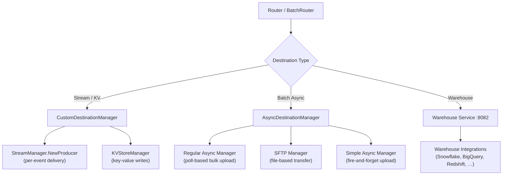

# Destination Connector Onboarding Guide

This guide covers how to add new destination connectors to RudderStack's event delivery pipeline. RudderStack supports three primary destination connector patterns: **real-time stream/KV destinations** (via `CustomDestinationManager`), **async batch destinations** (via `AsyncDestinationManager`), and **warehouse destinations** (via the Warehouse service). Each pattern offers a distinct set of interfaces, lifecycle hooks, and registration mechanisms tailored to the delivery semantics of the target system.

This document walks through the architecture, interfaces, implementation patterns, factory registration, testing strategies, and operational best practices for each connector type. It is intended for senior engineers contributing new integrations to the `rudder-server` codebase.

> **Prerequisite:** Ensure your local development environment is configured per the [Development Setup](./development.md) guide before proceeding.

**Source:** `router/batchrouter/asyncdestinationmanager/README.md`, `router/customdestinationmanager/customdestinationmanager.go`, `services/streammanager/streammanager.go`

---

## Table of Contents

- [Connector Architecture Overview](#connector-architecture-overview)
- [Connector Type Decision Matrix](#connector-type-decision-matrix)
- [Stream Destination Onboarding](#stream-destination-onboarding)
- [KV Store Destination Onboarding](#kv-store-destination-onboarding)
- [Async Batch Destination Onboarding](#async-batch-destination-onboarding)
- [Registration and Factory Wiring](#registration-and-factory-wiring)
- [Testing Patterns](#testing-patterns)
- [Configuration](#configuration)
- [Best Practices](#best-practices)
- [Troubleshooting](#troubleshooting)
- [Reference Implementations](#reference-implementations)
- [Related Documentation](#related-documentation)

---

## Connector Architecture Overview

RudderStack routes events to downstream destinations through three delivery paths, each managed by a dedicated subsystem. The Router selects the delivery path based on the destination type registered in the backend configuration.



### Connector Categories

RudderStack destination connectors fall into three categories, each with its own interface contract and lifecycle model:

#### 1. Stream Destinations

Real-time, per-event delivery via a producer/consumer pattern. Managed by `CustomDestinationManager` with the `StreamProducer` interface. The Router creates a long-lived producer instance per destination ID and reuses it across events. Connection lifecycle (creation, config change, circuit breaking) is handled automatically by the `CustomDestinationManager`.

**Currently registered stream destinations:** Kafka, Kinesis, Azure Event Hub, Firehose, EventBridge, Google Pub/Sub, Confluent Cloud, Personalize, Google Sheets, BigQuery Stream (`BQSTREAM`), Lambda, Google Cloud Function, Wunderkind.

**Source:** `services/streammanager/streammanager.go:24-58`, `router/customdestinationmanager/customdestinationmanager.go:26-27,79`

#### 2. KV Store Destinations

Key-value store writes managed by `CustomDestinationManager` with the `KVStoreManager` interface. Events are dispatched as `HSet`, `HMSet`, or JSON payloads depending on the event shape. Currently supports **Redis**.

**Source:** `router/customdestinationmanager/customdestinationmanager.go:28,80`

#### 3. Async Batch Destinations

Bulk uploads with polling-based status tracking. Managed by `AsyncDestinationManager`, which extends the `AsyncUploadAndTransformManager` interface with `Poll` and `GetUploadStats` methods. The BatchRouter accumulates events into temporary files (NDJSON), then hands off to the async manager for transformation, upload, polling, and stats collection.

Three sub-patterns exist within async batch destinations:

| Sub-Pattern | Wrapper | Use Case |
|-------------|---------|----------|
| **Regular Async** | Direct `AsyncDestinationManager` impl | Complex destinations requiring polling and per-job status (Marketo, Bing Ads, Eloqua, Yandex Metrica, Klaviyo, Lytics, Snowpipe Streaming, Salesforce Bulk Upload) |
| **SFTP** | `SimpleAsyncDestinationManager` | File-based destinations using SFTP protocol |
| **Simple Async** | `SimpleAsyncDestinationManager` | Basic upload with immediate success/failure (fire-and-forget) |

**Source:** `router/batchrouter/asyncdestinationmanager/manager.go:24-76`, `router/batchrouter/asyncdestinationmanager/README.md:77-98`

---

## Connector Type Decision Matrix

Use the following matrix to determine the correct connector type for your destination:

| Criteria | Stream | KV Store | Async Batch |
|----------|--------|----------|-------------|
| **Delivery pattern** | Real-time, per-event | Real-time, key-value writes | Bulk upload, polled completion |
| **Latency requirement** | Low (< 1s) | Low (< 1s) | Tolerant (seconds to minutes) |
| **File generation needed** | No | No | Yes (CSV, JSON, NDJSON) |
| **Polling for completion status** | No | No | Yes (Regular Async) / No (Simple Async) |
| **OAuth commonly required** | Sometimes | No | Often |
| **Batching** | Single event per `Produce` call | Single event per write | Batch file per `Upload` call |
| **Connection lifecycle** | Managed by `CustomDestinationManager` with circuit breaker | Managed by `CustomDestinationManager` | Managed by `BatchRouter` |
| **Primary interface** | `common.StreamProducer` | `kvstoremanager.KVStoreManager` | `common.AsyncDestinationManager` |
| **Registration location** | `services/streammanager/streammanager.go` | `router/customdestinationmanager/customdestinationmanager.go` | `router/batchrouter/asyncdestinationmanager/manager.go` |

**Decision flow:**

1. Does the destination accept individual events in real-time via a streaming API or message queue? → **Stream Destination**
2. Does the destination store data as key-value pairs (e.g., Redis, Memcached)? → **KV Store Destination**
3. Does the destination require bulk file uploads, batch API calls, or asynchronous import jobs? → **Async Batch Destination**
4. Does the destination load data into a warehouse table via staging files? → **Warehouse Destination** (see [Warehouse Destinations Guide](../guides/destinations/warehouse-destinations.md))

---

## Stream Destination Onboarding

### Interface Contract

Stream destinations implement the `StreamProducer` interface defined in `services/streammanager/common/common.go`:

```go
// StreamProducer is the interface that all stream destination producers must implement.
type StreamProducer interface {
    io.Closer
    // Produce sends a single event to the destination.
    // Returns: (statusCode int, statusMessage string, responseBody string)
    Produce(jsonData json.RawMessage, destConfig any) (int, string, string)
}

// Opts carries configuration options passed to NewProducer.
type Opts struct {
    Timeout time.Duration
}
```

**Source:** `services/streammanager/common/common.go:15-27`

**Return value semantics for `Produce`:**

| Status Code | Meaning | Router Behavior |
|-------------|---------|-----------------|
| `200` | Success | Mark job as succeeded |
| `400` | Non-retryable client error | Mark job as aborted |
| `429` | Throttled / rate-limited | Retry with backoff |
| `500` | Retryable server error | Retry with backoff |

### Step-by-Step Onboarding

#### Step 1: Create Destination Package

Create a new package under `services/streammanager/`:

```
services/streammanager/
└── yourdestination/
    ├── yourdestination.go       # Producer implementation + NewProducer constructor
    ├── yourdestination_test.go  # Unit tests
    └── logger.go                # Package logger (optional)
```

#### Step 2: Implement the `StreamProducer` Interface

```go
package yourdestination

import (
    "encoding/json"
    "fmt"
    "net/http"

    "github.com/rudderlabs/rudder-go-kit/logger"
    backendconfig "github.com/rudderlabs/rudder-server/backend-config"
    "github.com/rudderlabs/rudder-server/services/streammanager/common"
)

// DestinationConfig holds destination-specific configuration parsed from backend config.
type DestinationConfig struct {
    APIKey  string `json:"apiKey"`
    BaseURL string `json:"baseUrl"`
    Region  string `json:"region"`
}

// YourDestinationProducer implements common.StreamProducer for YourDestination.
type YourDestinationProducer struct {
    client YourSDKClient
    logger logger.Logger
    config DestinationConfig
}

// NewProducer creates a new StreamProducer for the destination.
// Called once per destination ID by CustomDestinationManager.
func NewProducer(
    destination *backendconfig.DestinationT,
    opts common.Opts,
) (common.StreamProducer, error) {
    // 1. Parse destination config
    configJSON, err := json.Marshal(destination.Config)
    if err != nil {
        return nil, fmt.Errorf("marshalling destination config: %w", err)
    }
    var config DestinationConfig
    if err := json.Unmarshal(configJSON, &config); err != nil {
        return nil, fmt.Errorf("unmarshalling destination config: %w", err)
    }

    // 2. Initialize SDK client with timeout from opts
    client, err := NewYourSDKClient(config, opts.Timeout)
    if err != nil {
        return nil, fmt.Errorf("creating SDK client: %w", err)
    }

    // 3. Return producer instance
    return &YourDestinationProducer{
        client: client,
        logger: logger.NewLogger().Child("streammanager").Child("yourdestination"),
        config: config,
    }, nil
}

// Produce sends a single event to the destination.
func (p *YourDestinationProducer) Produce(
    jsonData json.RawMessage,
    destConfig any,
) (int, string, string) {
    // 1. Parse event payload
    var event map[string]any
    if err := json.Unmarshal(jsonData, &event); err != nil {
        return http.StatusBadRequest, "Failure", fmt.Sprintf("invalid payload: %v", err)
    }

    // 2. Send to destination API/SDK
    resp, err := p.client.Send(event)
    if err != nil {
        // Map error to appropriate status code
        return http.StatusInternalServerError, "Failure", fmt.Sprintf("send failed: %v", err)
    }

    // 3. Return success
    return http.StatusOK, "Success", resp.Body
}

// Close releases resources held by the producer (connections, goroutines, etc.).
func (p *YourDestinationProducer) Close() error {
    return p.client.Close()
}
```

#### Step 3: Register in the StreamManager Factory

Add a new case to the `NewProducer` switch statement in `services/streammanager/streammanager.go`:

```go
case "YOUR_DESTINATION_NAME":
    return yourdestination.NewProducer(destination, opts)
```

The switch key must match `destination.DestinationDefinition.Name` exactly as registered in the RudderStack backend configuration.

**Source:** `services/streammanager/streammanager.go:28-57`

#### Step 4: Register the Destination Type in CustomDestinationManager

Add your destination name to the `ObjectStreamDestinations` slice in `router/customdestinationmanager/customdestinationmanager.go` inside the `loadConfig()` function:

```go
func loadConfig() {
    ObjectStreamDestinations = []string{
        "KINESIS", "KAFKA", "AZURE_EVENT_HUB", "FIREHOSE", "EVENTBRIDGE",
        "GOOGLEPUBSUB", "CONFLUENT_CLOUD", "PERSONALIZE", "GOOGLESHEETS",
        "BQSTREAM", "LAMBDA", "GOOGLE_CLOUD_FUNCTION", "WUNDERKIND",
        "YOUR_DESTINATION_NAME", // Add here
    }
    // ...
}
```

**Source:** `router/customdestinationmanager/customdestinationmanager.go:78-83`

### Error Handling for AWS-Based Destinations

For destinations built on AWS SDKs (Kinesis, Firehose, EventBridge, Lambda, Personalize), use the `ParseAWSError` helper from the `common` package to correctly map AWS SDK errors to HTTP status codes:

```go
func ParseAWSError(err error) (statusCode int, respStatus, responseMessage string)
```

This function inspects the error chain for `smithy.APIError` (client vs. server fault) and `smithy.OperationError` (throttling, expired requests), returning appropriate status codes:

- `smithy.FaultClient` → `400` (non-retryable)
- `smithy.FaultServer` → `500` (retryable)
- `ThrottlingException` → `429` (rate-limited, retryable)
- `RequestExpired` → `500` (retryable)

**Source:** `services/streammanager/common/common.go:52-73`

---

## KV Store Destination Onboarding

KV store destinations are managed by `CustomDestinationManager` with `managerType = KV`. They implement the `KVStoreManager` interface from `services/kvstoremanager/`.

### Interface Contract

```go
// KVStoreManager is the interface for key-value store destinations.
type KVStoreManager interface {
    io.Closer
    HSet(hash, key, value string) error
    HMSet(key string, fields map[string]interface{}) error
    StatusCode(err error) int
    ShouldSendDataAsJSON(config map[string]any) bool
    SendDataAsJSON(jsonData json.RawMessage, config map[string]any) (interface{}, error)
}
```

**Source:** `router/customdestinationmanager/customdestinationmanager.go:125-158`

### Event Dispatch Logic

The `CustomDestinationManager` dispatches events to KV stores using the following priority logic:

1. If `ShouldSendDataAsJSON(config)` returns `true` → call `SendDataAsJSON`
2. If the event is HSET-compatible (`kvstoremanager.IsHSETCompatibleEvent`) → extract hash, key, value and call `HSet`
3. Otherwise → extract key and fields and call `HMSet`

### Onboarding Steps

1. **Create your KV store package** under `services/kvstoremanager/` implementing the `KVStoreManager` interface.
2. **Register the destination** by adding your destination name to the `KVStoreDestinations` slice in `router/customdestinationmanager/customdestinationmanager.go` `loadConfig()`:
   ```go
   KVStoreDestinations = []string{"REDIS", "YOUR_KV_DESTINATION"}
   ```
3. **Wire the factory** — update `kvstoremanager.New()` to handle your destination type.

**Source:** `router/customdestinationmanager/customdestinationmanager.go:80,106-112`

---

## Async Batch Destination Onboarding

### Interface Contract

Async batch destinations implement one of two interface levels:

**Full `AsyncDestinationManager`** — for destinations requiring polling and detailed upload statistics:

```go
type AsyncDestinationManager interface {
    AsyncUploadAndTransformManager
    Poll(pollInput AsyncPoll) PollStatusResponse
    GetUploadStats(UploadStatsInput GetUploadStatsInput) GetUploadStatsResponse
}

type AsyncUploadAndTransformManager interface {
    Upload(asyncDestStruct *AsyncDestinationStruct) AsyncUploadOutput
    Transform(job *jobsdb.JobT) (string, error)
}
```

**Source:** `router/batchrouter/asyncdestinationmanager/README.md:52-66`

**Method responsibilities:**

| Method | Purpose | Invoked By |
|--------|---------|------------|
| `Transform(job)` | Convert a single job payload into the format expected by the destination | BatchRouter (per-job, during file accumulation) |
| `Upload(asyncDestStruct)` | Perform the bulk data upload; return `AsyncUploadOutput` categorizing jobs as importing, failed, or aborted | BatchRouter (per-batch) |
| `Poll(pollInput)` | Check the status of an ongoing asynchronous import using the import ID | BatchRouter (periodic polling) |
| `GetUploadStats(input)` | Retrieve detailed per-job upload statistics after polling completes | BatchRouter (after poll success) |

### Integration Sub-Types

Choose the sub-type that matches your destination's delivery model:

| Sub-Type | Interface Required | When to Use |
|----------|-------------------|-------------|
| **Regular Async** | Full `AsyncDestinationManager` | Destination provides an async import API with status polling (e.g., Marketo, Salesforce Bulk) |
| **SFTP** | `AsyncUploadAndTransformManager` (wrapped by `SimpleAsyncDestinationManager`) | Destination consumes files via SFTP |
| **Simple Async** | `AsyncUploadAndTransformManager` (wrapped by `SimpleAsyncDestinationManager`) | Destination accepts uploads with immediate success/failure (no polling) |

**Source:** `router/batchrouter/asyncdestinationmanager/README.md:77-98`

### Step-by-Step Onboarding

#### Step 1: Determine Integration Sub-Type

- **Complex async** — Requires `Poll` and `GetUploadStats` implementation (implement full `AsyncDestinationManager`)
- **Simple async / SFTP** — Implement only `Upload` and `Transform`, wrap with `SimpleAsyncDestinationManager`

#### Step 2: Create Integration Directory

Create a new directory under `router/batchrouter/asyncdestinationmanager/`:

```
router/batchrouter/asyncdestinationmanager/
└── your-destination/
    ├── manager.go               # NewManager constructor + manager struct
    ├── types.go                 # Config structs, response types
    ├── your-destination.go      # Core Upload/Poll/GetUploadStats logic
    ├── utils.go                 # Helper functions (optional)
    ├── testdata/                # Test fixture files (JSON payloads, expected outputs)
    └── your-destination_test.go # Unit tests with gomock
```

#### Step 3: Implement the Manager

##### Pattern A: Full AsyncDestinationManager (Regular Async)

```go
package yourdestination

import (
    "fmt"
    "net/http"

    "github.com/rudderlabs/rudder-go-kit/logger"
    "github.com/rudderlabs/rudder-go-kit/stats"
    backendconfig "github.com/rudderlabs/rudder-server/backend-config"
    "github.com/rudderlabs/rudder-server/jobsdb"
    "github.com/rudderlabs/rudder-server/router/batchrouter/asyncdestinationmanager/common"
)

type YourDestinationManager struct {
    logger       logger.Logger
    statsFactory stats.Stats
    config       DestinationConfig
    apiService   APIService // Interface for testability
}

func NewManager(
    logger logger.Logger,
    statsFactory stats.Stats,
    destination *backendconfig.DestinationT,
) (common.AsyncDestinationManager, error) {
    config, err := parseDestinationConfig(destination)
    if err != nil {
        return nil, fmt.Errorf("parsing destination config: %w", err)
    }
    apiService := NewAPIService(config)
    return &YourDestinationManager{
        logger:       logger.Child("yourdestination"),
        statsFactory: statsFactory,
        config:       config,
        apiService:   apiService,
    }, nil
}

// Transform converts a single job payload to the destination format.
func (m *YourDestinationManager) Transform(job *jobsdb.JobT) (string, error) {
    return common.GetMarshalledData(string(job.EventPayload), job.JobID)
}

// Upload handles the bulk data upload to the destination.
func (m *YourDestinationManager) Upload(
    asyncDestStruct *common.AsyncDestinationStruct,
) common.AsyncUploadOutput {
    destinationID := asyncDestStruct.Destination.ID

    // Read and parse the accumulated file
    data, err := processUploadFile(asyncDestStruct.FileName)
    if err != nil {
        return common.AsyncUploadOutput{
            FailedJobIDs:  append(asyncDestStruct.FailedJobIDs, asyncDestStruct.ImportingJobIDs...),
            FailedReason:  fmt.Sprintf("file processing failed: %v", err),
            FailedCount:   len(asyncDestStruct.FailedJobIDs) + len(asyncDestStruct.ImportingJobIDs),
            DestinationID: destinationID,
        }
    }

    // Call destination's bulk import API
    importID, err := m.apiService.BulkImport(data)
    if err != nil {
        return common.AsyncUploadOutput{
            FailedJobIDs:  append(asyncDestStruct.FailedJobIDs, asyncDestStruct.ImportingJobIDs...),
            FailedReason:  fmt.Sprintf("upload failed: %v", err),
            FailedCount:   len(asyncDestStruct.FailedJobIDs) + len(asyncDestStruct.ImportingJobIDs),
            DestinationID: destinationID,
        }
    }

    // Success — jobs are now in "importing" state awaiting polling
    return common.AsyncUploadOutput{
        ImportingJobIDs:     asyncDestStruct.ImportingJobIDs,
        ImportingParameters: getImportingParameters(importID),
        ImportingCount:      len(asyncDestStruct.ImportingJobIDs),
        DestinationID:       destinationID,
    }
}

// Poll checks the status of an ongoing asynchronous import.
func (m *YourDestinationManager) Poll(
    pollInput common.AsyncPoll,
) common.PollStatusResponse {
    status, err := m.apiService.GetImportStatus(pollInput.ImportId)
    if err != nil {
        return common.PollStatusResponse{
            StatusCode: http.StatusInternalServerError,
            Error:      err.Error(),
        }
    }
    switch status.State {
    case "completed":
        return common.PollStatusResponse{
            StatusCode: http.StatusOK,
            Complete:   true,
        }
    case "failed":
        return common.PollStatusResponse{
            StatusCode: http.StatusOK,
            HasFailed:  true,
            Error:      status.ErrorMessage,
        }
    default:
        return common.PollStatusResponse{
            StatusCode: http.StatusOK,
            InProgress: true,
        }
    }
}

// GetUploadStats returns detailed per-job statistics after polling completes.
func (m *YourDestinationManager) GetUploadStats(
    input common.GetUploadStatsInput,
) common.GetUploadStatsResponse {
    // Retrieve results from the destination API
    results, err := m.apiService.GetImportResults(input.ImportingList)
    if err != nil {
        return common.GetUploadStatsResponse{
            StatusCode: http.StatusInternalServerError,
            Error:      err.Error(),
        }
    }
    // Categorize each job as succeeded, failed, or aborted
    return common.GetUploadStatsResponse{
        StatusCode: http.StatusOK,
        Metadata: common.EventStatMeta{
            FailedKeys:    results.FailedKeys,
            SucceededKeys: results.SucceededKeys,
            FailedReasons: results.FailedReasons,
        },
    }
}
```

**Source:** `router/batchrouter/asyncdestinationmanager/README.md:161-355`

##### Pattern B: Simple Async / SFTP (Using `SimpleAsyncDestinationManager` Wrapper)

For destinations that do not require polling or detailed stats, implement only `AsyncUploadAndTransformManager` and wrap with `SimpleAsyncDestinationManager`. The wrapper provides no-op `Poll` and `GetUploadStats` implementations.

```go
package yourdestination

import (
    "github.com/rudderlabs/rudder-go-kit/logger"
    "github.com/rudderlabs/rudder-go-kit/stats"
    backendconfig "github.com/rudderlabs/rudder-server/backend-config"
    "github.com/rudderlabs/rudder-server/jobsdb"
    "github.com/rudderlabs/rudder-server/router/batchrouter/asyncdestinationmanager/common"
)

type simpleManager struct {
    logger       logger.Logger
    statsFactory stats.Stats
    config       DestinationConfig
}

func (m *simpleManager) Transform(job *jobsdb.JobT) (string, error) {
    return common.GetMarshalledData(string(job.EventPayload), job.JobID)
}

func (m *simpleManager) Upload(
    asyncDestStruct *common.AsyncDestinationStruct,
) common.AsyncUploadOutput {
    destinationID := asyncDestStruct.Destination.ID

    // Perform upload (e.g., file transfer, single API call)
    err := performUpload(asyncDestStruct.FileName, m.config)
    if err != nil {
        return common.AsyncUploadOutput{
            FailedJobIDs:  append(asyncDestStruct.FailedJobIDs, asyncDestStruct.ImportingJobIDs...),
            FailedReason:  fmt.Sprintf("upload failed: %v", err),
            FailedCount:   len(asyncDestStruct.FailedJobIDs) + len(asyncDestStruct.ImportingJobIDs),
            DestinationID: destinationID,
        }
    }

    return common.AsyncUploadOutput{
        DestinationID:   destinationID,
        SucceededJobIDs: asyncDestStruct.ImportingJobIDs,
        SuccessResponse: "Upload completed successfully",
    }
}

// NewManager wraps the simple uploader with SimpleAsyncDestinationManager.
func NewManager(
    logger logger.Logger,
    statsFactory stats.Stats,
    destination *backendconfig.DestinationT,
) (common.AsyncDestinationManager, error) {
    config, err := parseDestinationConfig(destination)
    if err != nil {
        return nil, fmt.Errorf("parsing destination config: %w", err)
    }
    uploader := &simpleManager{
        logger:       logger.Child("yourdestination"),
        statsFactory: statsFactory,
        config:       config,
    }
    return common.SimpleAsyncDestinationManager{
        UploaderAndTransformer: uploader,
    }, nil
}
```

This pattern is used by the SFTP connector:

**Source:** `router/batchrouter/asyncdestinationmanager/sftp/manager.go:130-136`

#### Step 4: Register in the Manager Factory

Add your destination to the appropriate factory function in `router/batchrouter/asyncdestinationmanager/manager.go`:

**For Regular Async destinations** — add a case to `newRegularManager`:

```go
func newRegularManager(
    conf *config.Config,
    logger logger.Logger,
    statsFactory stats.Stats,
    destination *backendconfig.DestinationT,
    backendConfig backendconfig.BackendConfig,
) (common.AsyncDestinationManager, error) {
    switch destination.DestinationDefinition.Name {
    // ... existing cases ...
    case "YOUR_DESTINATION_NAME":
        return yourdestination.NewManager(conf, logger, statsFactory, destination, backendConfig)
    }
    return nil, errors.New("invalid destination type")
}
```

**For SFTP destinations** — add a case to `newSFTPManager`:

```go
func newSFTPManager(
    logger logger.Logger,
    statsFactory stats.Stats,
    destination *backendconfig.DestinationT,
) (common.AsyncDestinationManager, error) {
    switch destination.DestinationDefinition.Name {
    case "SFTP":
        return sftp.NewManager(logger, statsFactory, destination)
    case "YOUR_SFTP_DESTINATION":
        return yourdestination.NewManager(logger, statsFactory, destination)
    }
    return nil, errors.New("invalid destination type")
}
```

You must also register your destination name in the appropriate helper function (`common.IsAsyncRegularDestination` or `common.IsSFTPDestination`) so the top-level `NewManager` can route to the correct sub-factory.

**Source:** `router/batchrouter/asyncdestinationmanager/manager.go:24-76`

### Error Handling and Output Patterns

The `AsyncUploadOutput` struct is the primary mechanism for communicating job-level results back to the BatchRouter. Every job in a batch must be categorized into exactly one of these buckets:

```go
// Failure output — all jobs failed
return common.AsyncUploadOutput{
    FailedJobIDs:  append(asyncDestStruct.FailedJobIDs, asyncDestStruct.ImportingJobIDs...),
    FailedReason:  fmt.Sprintf("Upload failed: %v", err),
    FailedCount:   len(asyncDestStruct.FailedJobIDs) + len(asyncDestStruct.ImportingJobIDs),
    DestinationID: asyncDestStruct.Destination.ID,
}

// Success output — jobs are importing (awaiting poll)
return common.AsyncUploadOutput{
    ImportingJobIDs:     asyncDestStruct.ImportingJobIDs,
    ImportingParameters: getImportingParameters(importID),
    ImportingCount:      len(asyncDestStruct.ImportingJobIDs),
    DestinationID:       asyncDestStruct.Destination.ID,
}

// Immediate success — jobs are fully completed (for Simple Async)
return common.AsyncUploadOutput{
    DestinationID:   asyncDestStruct.Destination.ID,
    SucceededJobIDs: asyncDestStruct.ImportingJobIDs,
    SuccessResponse: "Upload completed",
}
```

**Source:** `router/batchrouter/asyncdestinationmanager/README.md:300-322`

### Configuration Parsing Pattern

Use `jsonrs` (from `rudder-go-kit`) for consistent JSON serialization across the codebase:

```go
func parseDestinationConfig(destination *backendconfig.DestinationT) (DestinationConfig, error) {
    var config DestinationConfig
    jsonConfig, err := jsonrs.Marshal(destination.Config)
    if err != nil {
        return config, fmt.Errorf("error marshalling destination config: %v", err)
    }
    err = jsonrs.Unmarshal(jsonConfig, &config)
    if err != nil {
        return config, fmt.Errorf("error unmarshalling destination config: %v", err)
    }
    return config, nil
}
```

**Source:** `router/batchrouter/asyncdestinationmanager/README.md:260-274`

---

## Registration and Factory Wiring

This section consolidates the registration points for all connector types in a single reference.

### Registration Summary

| Connector Type | Registration File | Registration Function | Key Identifier |
|---------------|-------------------|----------------------|----------------|
| Stream | `services/streammanager/streammanager.go` | `NewProducer` (switch on `DestinationDefinition.Name`) | `"YOUR_DEST"` |
| Stream (type list) | `router/customdestinationmanager/customdestinationmanager.go` | `loadConfig()` → `ObjectStreamDestinations` slice | `"YOUR_DEST"` |
| KV Store | `router/customdestinationmanager/customdestinationmanager.go` | `loadConfig()` → `KVStoreDestinations` slice | `"YOUR_DEST"` |
| Async Regular | `router/batchrouter/asyncdestinationmanager/manager.go` | `newRegularManager` (switch) | `"YOUR_DEST"` |
| Async SFTP | `router/batchrouter/asyncdestinationmanager/manager.go` | `newSFTPManager` (switch) | `"YOUR_DEST"` |
| Async (type list) | `router/batchrouter/asyncdestinationmanager/common/` | `IsAsyncRegularDestination` or `IsSFTPDestination` | `"YOUR_DEST"` |

**Critical:** The switch case key (e.g., `"KAFKA"`, `"MARKETO_BULK_UPLOAD"`) must match `destination.DestinationDefinition.Name` exactly as registered in the RudderStack backend configuration (Control Plane). Mismatches will cause the destination to fail with "invalid destination type" or "no provider configured" errors at runtime.

---

## Testing Patterns

### Required Test Coverage

Every new destination connector must include tests covering the following scenarios:

| Test Scenario | What to Verify |
|--------------|----------------|
| **Constructor validation** | `NewProducer` / `NewManager` handles `nil` destination, missing config keys, and invalid config values gracefully |
| **Happy path** | Successful event delivery / upload with expected output structure and status codes |
| **Error handling** | API failures, authentication errors, network timeouts return correct error codes and messages |
| **Throttling** | Rate-limit responses (HTTP 429 or equivalent) are correctly surfaced to the Router for retry |
| **Resource cleanup** | `Close()` properly releases connections, goroutines, and temporary files |
| **Config change** | Producer/manager handles destination config updates (for stream destinations, `CustomDestinationManager` handles this via circuit breaker) |

### Stream Destination Test Pattern (gomock)

```go
package yourdestination

import (
    "encoding/json"
    "testing"

    "github.com/stretchr/testify/require"
    "go.uber.org/mock/gomock"
)

func TestYourDestination_Produce_Success(t *testing.T) {
    ctrl := gomock.NewController(t)
    mockClient := NewMockYourSDKClient(ctrl)

    mockClient.EXPECT().
        Send(gomock.Any()).
        Return(&Response{Status: "ok", Body: `{"id":"123"}`}, nil)

    producer := &YourDestinationProducer{
        client: mockClient,
        logger: logger.NOP,
        config: DestinationConfig{APIKey: "test-key"},
    }

    jsonData := json.RawMessage(`{"event":"test","userId":"user-1"}`)
    code, status, _ := producer.Produce(jsonData, nil)

    require.Equal(t, 200, code)
    require.Equal(t, "Success", status)
}

func TestYourDestination_Produce_ServerError(t *testing.T) {
    ctrl := gomock.NewController(t)
    mockClient := NewMockYourSDKClient(ctrl)

    mockClient.EXPECT().
        Send(gomock.Any()).
        Return(nil, fmt.Errorf("connection refused"))

    producer := &YourDestinationProducer{
        client: mockClient,
        logger: logger.NOP,
        config: DestinationConfig{APIKey: "test-key"},
    }

    jsonData := json.RawMessage(`{"event":"test","userId":"user-1"}`)
    code, _, _ := producer.Produce(jsonData, nil)

    require.Equal(t, 500, code)
}
```

### Async Destination Test Pattern (Table-Driven)

```go
package yourdestination

import (
    "testing"

    "github.com/stretchr/testify/require"
    "go.uber.org/mock/gomock"

    "github.com/rudderlabs/rudder-server/router/batchrouter/asyncdestinationmanager/common"
)

func TestYourDestination_Upload(t *testing.T) {
    testCases := []struct {
        name           string
        setupMock      func(*MockAPIService)
        asyncDestStruct *common.AsyncDestinationStruct
        expectedOutput common.AsyncUploadOutput
    }{
        {
            name: "successful upload",
            setupMock: func(mock *MockAPIService) {
                mock.EXPECT().BulkImport(gomock.Any()).Return("import-123", nil)
            },
            asyncDestStruct: &common.AsyncDestinationStruct{
                ImportingJobIDs: []int64{1, 2, 3},
                Destination:     backendconfig.DestinationT{ID: "dest-1"},
            },
            expectedOutput: common.AsyncUploadOutput{
                ImportingJobIDs: []int64{1, 2, 3},
                ImportingCount:  3,
                DestinationID:   "dest-1",
            },
        },
        {
            name: "upload failure",
            setupMock: func(mock *MockAPIService) {
                mock.EXPECT().BulkImport(gomock.Any()).Return("", fmt.Errorf("API error"))
            },
            asyncDestStruct: &common.AsyncDestinationStruct{
                ImportingJobIDs: []int64{1, 2},
                FailedJobIDs:    []int64{},
                Destination:     backendconfig.DestinationT{ID: "dest-1"},
            },
            expectedOutput: common.AsyncUploadOutput{
                FailedJobIDs:  []int64{1, 2},
                FailedCount:   2,
                DestinationID: "dest-1",
            },
        },
    }

    for _, tc := range testCases {
        t.Run(tc.name, func(t *testing.T) {
            t.Parallel()

            ctrl := gomock.NewController(t)
            mockAPI := NewMockAPIService(ctrl)
            tc.setupMock(mockAPI)

            manager := &YourDestinationManager{
                apiService: mockAPI,
                logger:     logger.NOP,
            }

            result := manager.Upload(tc.asyncDestStruct)
            require.Equal(t, tc.expectedOutput.DestinationID, result.DestinationID)
            require.Equal(t, tc.expectedOutput.ImportingCount, result.ImportingCount)
        })
    }
}
```

**Source:** `router/batchrouter/asyncdestinationmanager/README.md:229-406`

### Testing Best Practices

1. **Use `require` for assertions** — `require.NoError(t, err)` fails immediately on error, preventing cascading failures in tests.
2. **Table-driven tests** — Use `[]struct{ ... }` for multiple scenarios to keep tests readable and extensible.
3. **Parallel execution** — Add `t.Parallel()` where tests are independent to speed up the test suite.
4. **Proper cleanup** — Use `t.Cleanup()` for resource cleanup instead of `defer` to ensure cleanup runs even on `t.Fatal`.
5. **Mock external services** — Use `gomock` with `//go:generate mockgen` directives to generate mock interfaces for API clients.
6. **Test fixtures** — Place JSON fixture files in `testdata/` and load them with `os.ReadFile("testdata/valid_payload.json")`.

For comprehensive testing guidelines, see the [Testing Guidelines](./testing.md) guide.

---

## Configuration

### Destination-Specific Configuration

Async batch destinations use the shared configuration utility for destination-specific settings with global fallback:

```go
// Get destination-specific value, falling back to global default
fileSizeLimit := common.GetBatchRouterConfigInt64("MaxUploadLimit", destName, 32*bytesize.MB)
retryCount := common.GetBatchRouterConfigInt64("maxRetries", destName, 3)
```

**Source:** `router/batchrouter/asyncdestinationmanager/README.md:409-428`

### Environment Variable Pattern

Destination-specific configuration follows the hierarchical key pattern:

```
BatchRouter.<DESTINATION_NAME>.<configKey>
```

**Examples:**

| Environment Variable | Description | Default |
|---------------------|-------------|---------|
| `BatchRouter.MARKETO_BULK_UPLOAD.maxRetries` | Max retry count for Marketo uploads | `3` |
| `BatchRouter.ELOQUA.MaxUploadLimit` | Max upload file size for Eloqua | `32 MB` |
| `BatchRouter.YOUR_DESTINATION_NAME.maxRetries` | Max retry count for your destination | `3` |

### Stream Destination Configuration

Stream destinations receive configuration via `common.Opts` at producer creation time. The primary configurable is the `Timeout` field, which is set by the `CustomDestinationManager` from the router's global timeout configuration.

```go
producer, err = streammanager.NewProducer(&destination, common.Opts{
    Timeout: customManager.timeout,
})
```

**Source:** `router/customdestinationmanager/customdestinationmanager.go:96-98`

---

## Best Practices

The following practices are expected for all production-grade destination connectors:

### 1. Error Handling
Provide detailed error messages with context. Always include the destination ID, the operation that failed, and the underlying error. Map errors to appropriate HTTP status codes (400 for client errors, 429 for throttling, 500 for retryable server errors).

### 2. Structured Logging
Use the hierarchical logger pattern with child loggers to enable per-destination log filtering:
```go
logger := logger.NewLogger().Child("router").Child("yourdestination")
```

### 3. Metrics and Instrumentation
Emit relevant stats for monitoring and debugging via `stats.Stats`. Common metrics include upload time, payload size, success/failure counts, and throttle events:
```go
uploadTimeStat := statsFactory.NewTaggedStat("async_upload_time", stats.TimerType, stats.Tags{
    "module":   "batch_router",
    "destType": destType,
})
```

**Source:** `router/batchrouter/asyncdestinationmanager/sftp/manager.go:79-83`

### 4. Resource Cleanup
Always clean up temporary files and connections. Use `defer` for synchronous cleanup and `t.Cleanup()` in tests:
```go
defer func() { _ = os.Remove(tempFilePath) }()
```

### 5. Configuration Consistency
Use common configuration utilities (`GetBatchRouterConfigInt64`, etc.) for destination-specific settings to maintain a consistent pattern with global fallback behavior.

### 6. Circuit Breakers
For stream destinations, the `CustomDestinationManager` automatically wraps producer creation in a `gobreaker` circuit breaker. The circuit breaker trips on repeated connection failures and enters a half-open state after the configured timeout, preventing cascading failures.

**Source:** `router/customdestinationmanager/customdestinationmanager.go:89,248-250`

### 7. JSON Serialization
Use `jsonrs` (from `rudder-go-kit`) for all JSON marshalling and unmarshalling instead of `encoding/json` to ensure consistent behavior across the codebase.

### 8. Timeout Handling
Respect `common.Opts.Timeout` for all external API calls in stream destinations. For async destinations, implement appropriate context-based timeouts on HTTP clients to prevent hanging uploads.

**Source:** `router/batchrouter/asyncdestinationmanager/README.md:448-456`

---

## Troubleshooting

### Common Issues

| Issue | Cause | Resolution |
|-------|-------|------------|
| **Destination not registered** | Switch case in factory function does not match `DestinationDefinition.Name` | Verify the string matches exactly (case-sensitive). Check the backend config for the canonical destination name. |
| **"no provider configured" error** | Destination name missing from `ObjectStreamDestinations` or `KVStoreDestinations` slice | Add the destination name to the appropriate slice in `loadConfig()`. |
| **Config parsing errors** | Config struct fields do not match the JSON keys in the backend configuration | Verify struct field JSON tags match the backend config schema. Use `jsonrs.Marshal` → `jsonrs.Unmarshal` round-trip pattern. |
| **File handling issues (async)** | Temporary files not cleaned up, causing disk space exhaustion | Always use `defer os.Remove(filePath)` or `t.Cleanup()` for temporary files. |
| **Authentication failures** | API key not passed correctly, OAuth token expired | Check `destination.Config` for credential fields. For OAuth destinations, integrate with the OAuth service (`services/oauth/`). |
| **Polling timeouts (async)** | Import job stalls on the destination side | Implement timeout logic in `Poll`; return `HasFailed: true` after max poll attempts. |
| **Circuit breaker open (stream)** | Repeated connection failures triggered the circuit breaker | Check destination service health. The breaker auto-recovers after the configured timeout. Review logs for `[CDM] Config changed` messages. |

### Debugging Tips

1. **Enable debug logging** — Set the log level to `DEBUG` for detailed operation logs. Filter by your destination's child logger name.
2. **Check file contents** — For async destinations, inspect the temporary NDJSON file passed to `Upload` to verify payload format.
3. **Monitor metrics** — Use the emitted `stats` metrics (`async_upload_time`, `success_job_count`, `payload_size`) to track upload success/failure rates.
4. **Test with small batches** — Configure `BatchRouter.YOUR_DESTINATION_NAME.maxBatchSize` to a small value during development for faster iteration.
5. **Inspect circuit breaker state** — For stream destinations, check `CustomDestinationManager` logs for breaker state transitions.

**Source:** `router/batchrouter/asyncdestinationmanager/README.md:459-474`

---

## Reference Implementations

Study the following existing implementations as templates for your new connector:

| Connector Type | Reference Implementation | Key Patterns to Learn |
|---------------|------------------------|-----------------------|
| **Stream (AWS)** | `services/streammanager/kinesis/` | AWS SDK v2 integration, `ParseAWSError` usage, credential handling |
| **Stream (GCP)** | `services/streammanager/googlepubsub/` | Google Cloud SDK, PEM credential parsing, topic management |
| **Stream (multi-variant)** | `services/streammanager/kafka/` | Multiple variants from single package (Kafka, Azure Event Hub, Confluent Cloud) |
| **Stream (simple)** | `services/streammanager/lambda/` | Minimal stream producer: invoke function, return result |
| **Async (complex)** | `router/batchrouter/asyncdestinationmanager/marketo-bulk-upload/` | Full async lifecycle: CSV generation, polling, per-job stats |
| **Async (simple/SFTP)** | `router/batchrouter/asyncdestinationmanager/sftp/` | `SimpleAsyncDestinationManager` wrapper, file handling, SSH config |
| **Async (API service pattern)** | `router/batchrouter/asyncdestinationmanager/klaviyobulkupload/` | Separated API service layer for testability |
| **Async (OAuth)** | `router/batchrouter/asyncdestinationmanager/salesforce-bulk-upload/` | OAuth-backed API calls, `backendConfig` integration |
| **KV Store** | Redis via `services/kvstoremanager/` | `HSet`/`HMSet` operations, JSON merge strategies |

**Source:** `router/batchrouter/asyncdestinationmanager/README.md:429-445`

---

## Related Documentation

- [Development Setup](./development.md) — Local development environment prerequisites and build workflow
- [Testing Guidelines](./testing.md) — Comprehensive testing infrastructure and test patterns
- [Architecture Overview](../architecture/overview.md) — System component relationships and deployment topologies
- [Destination Catalog](../guides/destinations/index.md) — Full catalog of supported destination integrations
- [Stream Destinations Guide](../guides/destinations/stream-destinations.md) — User-facing stream destination configuration guides
- [AsyncDestinationManager README](../../router/batchrouter/asyncdestinationmanager/README.md) — In-repo reference for async batch destination internals
