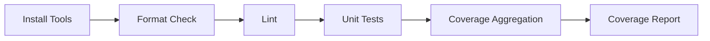

# Testing Guidelines

Comprehensive guide to RudderStack's testing infrastructure, covering unit tests, integration tests, helper utilities, mocking patterns, and CI/CD configuration. RudderStack uses Go's standard `testing` package along with testify, gomock, Ginkgo/Gomega, dockertest, and custom test helpers to ensure production-grade reliability across the entire event pipeline.

> This guide targets `rudder-server` v1.68.1 with Go 1.26.0 runtime.

**Source:** `Makefile`, `testhelper/`, `integration_test/`, `CONTRIBUTING.md`

---

## Table of Contents

- [Test Categories](#test-categories)
- [Running Tests](#running-tests)
- [Unit Test Patterns](#unit-test-patterns)
- [Integration Test Setup](#integration-test-setup)
- [Test Helper Utilities](#test-helper-utilities)
- [Mocking Patterns](#mocking-patterns)
- [Test Data Management](#test-data-management)
- [CI/CD Test Pipeline](#cicd-test-pipeline)
- [Best Practices](#best-practices)
- [Related Documentation](#related-documentation)

---

## Test Categories

RudderStack organizes tests into three primary categories, each targeting a different scope of validation.

### Unit Tests

Located alongside source code as `*_test.go` files, unit tests validate individual functions and methods in isolation. They use **gomock** for dependency injection and **testify** for assertions.

- **Location:** Co-located with source files (e.g., `processor/processor_test.go`, `router/handle_test.go`)
- **Scope:** Single function or method behavior
- **Dependencies:** Mocked via gomock interfaces
- **Runner:** `make test` with gotestsum
- **Timeout:** 15 minutes (default)

### Integration Tests

Located in the `integration_test/` directory, integration tests validate full pipeline flows with real Docker containers. They use **dockertest** (`github.com/ory/dockertest/v3`) for container orchestration, spinning up PostgreSQL, Kafka, Redis, MinIO, Transformer, and etcd instances.

- **Location:** `integration_test/` directory
- **Scope:** End-to-end pipeline validation with real services
- **Dependencies:** Docker containers managed by dockertest
- **Runner:** Standard `go test` with extended timeouts
- **Timeout:** 30 minutes (warehouse tests)

### Warehouse Integration Tests

Located within `warehouse/integrations/*/` test packages and associated `testdata/` directories, these tests validate warehouse connector behavior against real database instances (Snowflake, BigQuery, Redshift, ClickHouse, etc.).

- **Location:** `warehouse/integrations/*/` test files
- **Scope:** Warehouse-specific connector behavior
- **Runner:** `make test-warehouse package=<path>`
- **Pattern:** `TestIntegration` (matched via `-run` flag)

### Integration Test Suites

The following table summarizes all integration test suites available in the `integration_test/` directory:

| Suite | Directory | Description |
|-------|-----------|-------------|
| Backend Config Unavailability | `integration_test/backendconfigunavailability/` | Tests gateway buffering when transformer metadata is unavailable |
| Docker Test (Main Flow) | `integration_test/docker_test/` | Full regression suite validating gateway, webhooks, warehouses, Redis, Kafka |
| Multi-Tenant | `integration_test/multi_tenant_test/` | Multi-tenant deployment with etcd mode toggles |
| Partition Migration | `integration_test/partitionmigration/` | Embedded and gateway/processor partition migration with ordering validation |
| PyTransformer Contract | `integration_test/pytransformer_contract/` | Compatibility between legacy and new transformer pipelines |
| Reporting (Dropped Events) | `integration_test/reporting_dropped_events/` | Reporting bookkeeping for dropped and filtered events |
| Reporting (Error Index) | `integration_test/reporting_error_index/` | Reporting bookkeeping for error indices with MinIO Parquet verification |
| RETL | `integration_test/retl_test/` | Reverse ETL harness with webhook destinations |
| Snowpipe Streaming | `integration_test/snowpipestreaming/` | Snowflake Snowpipe Streaming validation with schema evolution |
| Source Hydration | `integration_test/srchydration/` | Source hydration pipeline tests |
| Tracing | `integration_test/tracing/` | Distributed tracing validation |
| Tracked Users Reporting | `integration_test/trackedusersreporting/` | HyperLogLog tracked users reporting |
| Transformer Contract | `integration_test/transformer_contract/` | Transformer contract verification |
| Warehouse | `integration_test/warehouse/` | Warehouse integration test suite |

**Source:** `integration_test/` directory structure

---

## Running Tests

RudderStack's test execution is driven through `Makefile` targets that handle tool installation, test running, and coverage aggregation.

### Makefile Test Targets

#### `make test` — Run All Unit Tests

Runs the full unit test suite using gotestsum for readable output. The target first installs required tools, then runs tests, and finally consolidates coverage profiles.

**Pipeline:** `install-tools` → `test-run` → `test-teardown`

**Test runner command:**
```
gotestsum --format pkgname-and-test-fails --
```

**Default options:**
```
-p=1 -v -failfast -shuffle=on -coverprofile=profile.out -covermode=atomic -coverpkg=./... -vet=all --timeout=15m
```

**Environment variable overrides:**

| Variable | Effect |
|----------|--------|
| `debug=1` or `RUNNER_DEBUG=1` | Falls back to plain `go test` instead of gotestsum |
| `RACE_ENABLED=true` | Enables the Go race detector (`-race` flag) |
| `package=<path>` | Tests only the specified package (e.g., `package=processor`) |
| `exclude=<regex>` | Excludes packages matching the regex (e.g., `exclude=integration_test`) |

**Source:** `Makefile:25-49`

#### `make test-warehouse` — Run Warehouse Integration Tests

Runs warehouse-specific integration tests matching the `TestIntegration` pattern with higher parallelism and extended timeout.

**Options:**
```
-v -p 8 -timeout 30m -count 1 -run 'TestIntegration' -coverprofile=profile.out -covermode=atomic -coverpkg=./...
```

**Requires:** `package=<path>` parameter to specify the warehouse connector package.

**Source:** `Makefile:52-61`

#### `make test-with-coverage` — Run Tests with HTML Coverage Report

Runs all tests via `make test`, then generates an HTML coverage report via `go tool cover`.

**Source:** `Makefile:75-78`

#### `make test-teardown` — Consolidate Coverage Profiles

Merges all `*profile.out` files into a single `coverage.txt` file. If tests passed (indicated by the `_testok` sentinel file), profiles are consolidated; otherwise, all profile artifacts are cleaned up and the target exits with an error.

**Source:** `Makefile:63-73`

#### `make mocks` — Regenerate Mock Files

Regenerates all mock files by running `go generate ./...`. Requires `mockgen` to be installed (handled by `install-tools`).

**Source:** `Makefile:22-23`

#### `make lint` — Run Linters

Runs the full linting suite: `gofumpt` formatting, `goimports` ordering, `golangci-lint` analysis, `actionlint` for GitHub Actions, and security checks.

**Source:** `Makefile:107-111`

#### `make fmt` — Format Go Source Files

Formats all Go files using `gofumpt` (strict mode with `-extra` flag) and `goimports` (local import grouping for `github.com/rudderlabs`). Also runs `go fix` and validates Docker Go version consistency.

**Source:** `Makefile:113-119`

### Common Test Commands

```bash
# Run all unit tests
make test

# Run tests for a specific package
make test package=processor

# Run tests excluding integration tests
make test exclude=integration_test

# Run with race detector enabled
RACE_ENABLED=true make test

# Run with debug output (plain go test)
make test debug=1

# Run warehouse integration tests for Snowflake
make test-warehouse package=warehouse/integrations/snowflake

# Generate HTML coverage report
make test-with-coverage

# Regenerate all mock files
make mocks

# Run linters
make lint

# Format all Go files
make fmt
```

---

## Unit Test Patterns

### Standard Go Test Conventions

RudderStack follows standard Go testing conventions:

- **Co-location:** Test files are placed alongside source files (e.g., `processor/processor_test.go` tests `processor/processor.go`).
- **Subtests:** Use `t.Run()` for grouping related test scenarios under a single test function.
- **Parallel execution:** Use `t.Parallel()` where tests do not share mutable state.
- **Helper functions:** Mark helper functions with `t.Helper()` so failure stack traces point to the calling test, not the helper.
- **Cleanup:** Use `t.Cleanup()` for deterministic resource teardown, guaranteed to run even on test failure.
- **Environment injection:** Use `t.Setenv()` for setting environment variables scoped to the test lifecycle.

### Table-Driven Tests

The **table-driven test pattern** is the primary pattern used throughout the codebase. It enables concise, comprehensive coverage of multiple input/output scenarios:

```go
func TestFeature(t *testing.T) {
    testCases := []struct {
        name     string
        input    InputType
        expected OutputType
        wantErr  bool
    }{
        {
            name:     "valid input",
            input:    validInput,
            expected: expectedOutput,
            wantErr:  false,
        },
        {
            name:     "invalid input returns error",
            input:    invalidInput,
            wantErr:  true,
        },
    }
    for _, tc := range testCases {
        t.Run(tc.name, func(t *testing.T) {
            t.Parallel()
            result, err := Feature(tc.input)
            if tc.wantErr {
                require.Error(t, err)
                return
            }
            require.NoError(t, err)
            require.Equal(t, tc.expected, result)
        })
    }
}
```

### Assertion Patterns

RudderStack exclusively uses `require` (not `assert`) from the testify library for immediate test failure on assertion violation. This prevents cascading errors from obscuring the root cause.

**Common assertion functions:**

| Function | Purpose |
|----------|---------|
| `require.NoError(t, err)` | Assert no error occurred |
| `require.Error(t, err)` | Assert an error occurred |
| `require.Equal(t, expected, actual)` | Assert deep equality |
| `require.True(t, condition)` | Assert boolean condition |
| `require.Eventually(t, func() bool, timeout, interval)` | Assert condition with async polling |
| `require.GreaterOrEqual(t, a, b)` | Assert numeric comparison |
| `require.Contains(t, str, substr)` | Assert string/slice containment |

**Why `require` over `assert`:** The `require` package calls `t.FailNow()` on failure, which immediately stops the current test function. This prevents downstream assertions from executing with invalid state, making test failures clearer and more actionable.

**Source:** testify `require` package usage throughout codebase

---

## Integration Test Setup

### Docker Container Orchestration

Integration tests spin up real services using the **dockertest** library (`github.com/ory/dockertest/v3`). This provides isolated, reproducible test environments that closely match production infrastructure.

**Common containers used in integration tests:**

| Service | Docker Image | Purpose |
|---------|-------------|---------|
| PostgreSQL | `postgres:15-alpine` | JobsDB persistent job queue storage |
| Kafka | Confluent Platform images | Stream destination integration testing |
| Redis | `redis/redis-stack` | Redis destination with JSON module support |
| MinIO | MinIO images | S3-compatible object storage for archival/staging |
| Transformer | `rudderstack/rudder-transformer` | External transformation service |
| etcd | etcd v3 images | Multi-tenant cluster coordination |

**Source:** `integration_test/docker_test/docker_test.go:27-48`, `integration_test/multi_tenant_test/multi_tenant_test.go:20-38`

### Standard Integration Test Pattern

The following pattern illustrates the standard setup for integration tests:

```go
func TestIntegration(t *testing.T) {
    // 1. Create Docker pool
    pool, err := dockertest.NewPool("")
    require.NoError(t, err)

    // 2. Start PostgreSQL container
    pgResource := pool.RunWithOptions(&dockertest.RunOptions{
        Repository: "postgres",
        Tag:        "15-alpine",
        Env: []string{
            "POSTGRES_USER=rudder",
            "POSTGRES_PASSWORD=password",
            "POSTGRES_DB=jobsdb",
        },
    })
    t.Cleanup(func() { pool.Purge(pgResource) })

    // 3. Wait for service readiness
    ctx := context.Background()
    health.WaitUntilReady(
        ctx, t,
        fmt.Sprintf("http://localhost:%s/health", port),
        30*time.Second,   // atMost
        time.Second,      // interval
        "TestIntegration", // caller
    )

    // 4. Configure and start RudderStack server
    // 5. Send test events via HTTP
    // 6. Assert results via webhook recorder, database queries, etc.
}
```

**Source:** `testhelper/health/checker.go:12-38`, `integration_test/docker_test/docker_test.go:80-100`

### Environment Variable Injection

Integration tests configure the RudderStack server instance by injecting environment variables before launch. Variables are set via `t.Setenv()` (scoped to the test lifecycle) or passed directly to the server binary.

**Common environment variables used in integration tests:**

| Variable | Purpose | Example |
|----------|---------|---------|
| `JOBS_DB_HOST` | PostgreSQL host for JobsDB | `localhost` |
| `JOBS_DB_PORT` | PostgreSQL port | `5432` |
| `DEST_TRANSFORM_URL` | Transformer service URL | `http://localhost:9090` |
| `CONFIG_PATH` | Path to workspace config file | `/tmp/workspaceConfig.json` |
| `WORKSPACE_TOKEN` | Workspace authentication token | `test-token` |
| `DEPLOYMENT_TYPE` | Deployment mode | `MULTITENANT` |
| `GOCOVERDIR` | Coverage data output directory | `/tmp/cover` |

**Source:** `config/sample.env`, `testhelper/rudderserver/rudderserver.go:30-43`

### Binary-Based Integration Tests

For multi-process integration tests (e.g., multi-tenant), the test harness compiles a coverage-instrumented binary and launches it as a separate process:

```go
func TestMultiTenant(t *testing.T) {
    // Build coverage-instrumented binary
    rsBinaryPath := filepath.Join(t.TempDir(), "rudder-server-binary")
    rudderserver.BuildRudderServerBinary(t, "../../main.go", rsBinaryPath)

    // Launch binary with custom config as a separate process
    var g errgroup.Group
    rudderserver.StartRudderServer(t, ctx, &g, "server-1", rsBinaryPath,
        map[string]string{
            "JOBS_DB_HOST": pgHost,
            "JOBS_DB_PORT": pgPort,
        },
    )

    // Wait for readiness, send events, assert results...
}
```

The `StartRudderServer` helper sends `SIGTERM` on context cancellation (not `SIGKILL`) to allow proper coverage data collection via `GOCOVERDIR`.

**Source:** `testhelper/rudderserver/rudderserver.go:17-75`, `integration_test/multi_tenant_test/multi_tenant_test.go:40-47`

---

## Test Helper Utilities

The `testhelper/` directory provides a comprehensive set of reusable test utilities. Each package serves a targeted need for test fixture construction, service orchestration, and assertion support.

### Package Overview

| Package | Location | Purpose |
|---------|----------|---------|
| `clone` | `testhelper/clone.go` | Generic deep clone via JSON round-trip (`jsonrs.Marshal`/`Unmarshal`) for safe fixture mutation |
| `template` | `testhelper/template.go` | `FillTemplateAndReturn` renders Go `html/template` files into `bytes.Buffer` for test fixtures |
| `backendconfigtest` | `testhelper/backendconfigtest/` | Fluent builders for `ConfigT`, `DestinationT`, `SourceT` fixtures and `StaticLibrary` for deterministic backend config serving |
| `clustertest` | `testhelper/clustertest/` | `RoutingProxy` (httptest-based partition-aware reverse proxy) and `MigrationExecutor` (etcd-backed migration lifecycle orchestrator) |
| `destination` | `testhelper/destination/` | `Logger`/`Cleaner` interfaces, `NOPLogger`, and `MINIOFromResource` builder for S3/MinIO destination fixtures |
| `health` | `testhelper/health/` | `WaitUntilReady` and `IsReady` HTTP polling helpers with context/timeout support |
| `log` | `testhelper/log/` | Ginkgo-integrated logger (`GinkgoLogger`) forwarding all log levels to `ginkgo.GinkgoT()` |
| `rudderserver` | `testhelper/rudderserver/` | `BuildRudderServerBinary` (go build with `-cover`) and `StartRudderServer` (binary launch with `GOCOVERDIR`, `SIGTERM` handling) |
| `transformertest` | `testhelper/transformertest/` | Fluent `Builder` for mocking transformer HTTP endpoints (`/customTransform`, `/v0/destinations/*`, `/v0/validate`, `/routerTransform`, `/batch`, `/features`) |
| `webhook` | `testhelper/webhook/` | `Recorder` for capturing HTTP webhook deliveries in integration tests |
| `workspaceConfig` | `testhelper/workspaceConfig/` | `CreateTempFile` renders workspace config templates to temporary files with automatic cleanup |

**Source:** `testhelper/` directory structure

### Usage Examples

#### `clone.Clone` — Safe Fixture Mutation

Deep-clone any serializable value via JSON round-trip to prevent cross-test contamination:

```go
import "github.com/rudderlabs/rudder-server/testhelper"

func TestWithClonedFixture(t *testing.T) {
    original := backendconfig.ConfigT{WorkspaceID: "ws-1"}

    // Clone creates an independent copy via jsonrs marshal/unmarshal
    cloned := testhelper.Clone(t, original)
    cloned.WorkspaceID = "ws-2" // safe: does not affect original

    require.NotEqual(t, original.WorkspaceID, cloned.WorkspaceID)
}
```

**Source:** `testhelper/clone.go:11-21`

#### `health.WaitUntilReady` — Service Readiness Polling

Poll an HTTP endpoint until it returns `200 OK`, with configurable timeout and interval:

```go
import "github.com/rudderlabs/rudder-server/testhelper/health"

// Wait up to 30 seconds, polling every 1 second
health.WaitUntilReady(
    ctx, t,
    "http://localhost:8080/health",
    30*time.Second,      // atMost — maximum wait duration
    time.Second,         // interval — polling frequency
    "TestMyIntegration", // caller — identifier for error messages
)
```

The function calls `t.Fatalf()` if the endpoint does not become ready within the `atMost` duration.

**Source:** `testhelper/health/checker.go:12-38`

#### `backendconfigtest` — Fluent Config Builders

Build deterministic backend configuration fixtures using the fluent builder pattern:

```go
import "github.com/rudderlabs/rudder-server/testhelper/backendconfigtest"

// Build a destination
dest := backendconfigtest.NewDestinationBuilder("WEBHOOK").
    WithID("dest-1").
    WithConfigOption("webhookUrl", webhookURL).
    WithConfigOption("webhookMethod", "POST").
    WithDefinitionConfigOption("supportedMessageTypes", []string{"identify", "track"}).
    Build()

// Build a workspace config with the destination
config := backendconfigtest.NewConfigBuilder().
    WithWorkspaceID("workspace-1").
    WithSource(backendconfigtest.NewSourceBuilder().
        WithDestination(*dest).
        Build()).
    Build()
```

**Source:** `testhelper/backendconfigtest/config_builder.go:11-19`, `testhelper/backendconfigtest/destination_builder.go:10-25`

#### `backendconfigtest.StaticLibrary` — Deterministic Config Serving

Serve static backend configuration in tests without requiring a real control plane:

```go
import "github.com/rudderlabs/rudder-server/testhelper/backendconfigtest"

// Create a StaticLibrary implementing backendconfig.BackendConfig
lib := backendconfigtest.NewStaticLibrary(map[string]backendconfig.ConfigT{
    "workspace-1": *config,
})

// Use in tests — Get() returns configs synchronously
configs, err := lib.Get(ctx)
require.NoError(t, err)

// Subscribe() emits a single config event then waits for context cancellation
ch := lib.Subscribe(ctx, backendconfig.TopicProcessConfig)
event := <-ch
```

**Source:** `testhelper/backendconfigtest/library.go:13-53`

#### `backendconfigtest.ServerBuilder` — HTTP Config Server

Build an httptest.Server that serves backend configuration via HTTP, suitable for tests that need a real HTTP endpoint:

```go
import "github.com/rudderlabs/rudder-server/testhelper/backendconfigtest"

// Single-workspace mode
server := backendconfigtest.NewBuilder().
    WithWorkspaceConfig(*config).
    Build()
defer server.Close()
// Serves at: server.URL + "/workspaceConfig"

// Namespace (multi-tenant) mode
server := backendconfigtest.NewBuilder().
    WithNamespace("my-namespace", *config1, *config2).
    Build()
defer server.Close()
// Serves at: server.URL + "/data-plane/v1/namespaces/my-namespace/config"
```

**Source:** `testhelper/backendconfigtest/server_builder.go:15-63`

#### `transformertest.Builder` — Mock Transformer Server

Build an httptest.Server mimicking the external Transformer service, with configurable handlers for each endpoint:

```go
import "github.com/rudderlabs/rudder-server/testhelper/transformertest"

// Build transformer with default mirroring behavior (passthrough)
transformer := transformertest.NewBuilder().Build()
defer transformer.Close()

// Build transformer with custom destination transform handler
transformer := transformertest.NewBuilder().
    WithDestTransformHandler("WEBHOOK", func(events []types.TransformerEvent) types.Response {
        // Custom transformation logic for WEBHOOK destination
        return types.Response{
            Events: transformedEvents,
        }
    }).
    WithUserTransformHandler(func(events []types.TransformerEvent) types.Response {
        // Custom user transformation logic
        return types.Response{Events: events}
    }).
    WithTrackingPlanHandler(func(events []types.TransformerEvent) types.Response {
        // Custom tracking plan validation logic
        return types.Response{Events: events}
    }).
    Build()
defer transformer.Close()

// transformer.URL provides the base URL for DEST_TRANSFORM_URL config
```

Default handlers use `MirroringTransformerHandler` which passes events through unchanged. The builder registers handlers for:
- `/customTransform` — User/custom transformations
- `/v0/destinations/<destType>` — Destination-specific transformations
- `/v0/validate` — Tracking plan validation
- `/routerTransform` — Router transformations
- `/batch` — Router batch transformations
- `/features` — Feature flag endpoint

**Source:** `testhelper/transformertest/builder.go:18-176`

#### `webhook.Recorder` — Webhook Delivery Capture

Capture and inspect HTTP webhook deliveries in integration tests:

```go
import "github.com/rudderlabs/rudder-server/testhelper/webhook"

// Create a webhook recorder
recorder := webhook.NewRecorder()
defer recorder.Close()

// Use recorder.Server.URL as the webhook destination URL
// After sending events through the pipeline:

// Check delivery count
require.Eventually(t, func() bool {
    return recorder.RequestsCount() >= expectedCount
}, 30*time.Second, time.Second)

// Inspect captured requests
requests := recorder.Requests()
for _, req := range requests {
    body, _ := io.ReadAll(req.Body)
    // Assert payload contents
}
```

**Source:** `testhelper/webhook/recorder.go:13-57`

#### `workspaceConfig.CreateTempFile` — Template-Based Config Files

Render workspace configuration templates to temporary files with automatic cleanup:

```go
import "github.com/rudderlabs/rudder-server/testhelper/workspaceConfig"

// Render a workspace config template with dynamic values
configPath := workspaceConfig.CreateTempFile(t, "testdata/workspaceConfigTemplate.json",
    map[string]any{
        "webhookURL":  webhookRecorder.Server.URL,
        "writeKey":    "test-write-key",
        "workspaceID": "test-workspace-id",
    },
)
// configPath points to a temp file that is auto-cleaned on test completion
// Use as: t.Setenv("CONFIG_PATH", configPath)
```

**Source:** `testhelper/workspaceConfig/workspaceConfig.go:11-28`

#### `template.FillTemplateAndReturn` — In-Memory Template Rendering

Render Go `html/template` files into an in-memory buffer for test fixtures:

```go
import "github.com/rudderlabs/rudder-server/testhelper"

buf := testhelper.FillTemplateAndReturn(t, "testdata/eventTemplate.json",
    map[string]string{
        "userID":    "user-123",
        "eventName": "Product Viewed",
    },
)
// buf.Bytes() contains the rendered template content
```

**Source:** `testhelper/template.go:11-19`

---

## Mocking Patterns

### Mock Generation with mockgen

RudderStack uses **uber/mock** (`go.uber.org/mock/mockgen@v0.6.0`) for generating interface mocks. Mock generation is driven by `go:generate` directives embedded in source files.

**Regenerate all mocks:**
```bash
make mocks
# Equivalent to: go generate ./...
```

The `make install-tools` target installs mockgen automatically.

**Source:** `Makefile:13` (mockgen version), `Makefile:22-23` (mocks target)

### Mock Usage Pattern with gomock

```go
import (
    "testing"
    "go.uber.org/mock/gomock"
    "github.com/stretchr/testify/require"
)

func TestWithMock(t *testing.T) {
    ctrl := gomock.NewController(t)

    // Create mock instance
    mockProducer := mock_streammanager.NewMockStreamProducer(ctrl)

    // Set expectations — define expected calls and return values
    mockProducer.EXPECT().
        Produce(gomock.Any(), gomock.Any()).
        Return(200, "OK", "").
        Times(1)

    // Exercise the code under test
    result, status, _ := mockProducer.Produce(jsonData, config)

    // Verify results
    require.Equal(t, 200, result)
    require.Equal(t, "OK", status)
    // gomock.Controller automatically verifies expectations on test cleanup
}
```

**Key gomock matchers:**

| Matcher | Purpose |
|---------|---------|
| `gomock.Any()` | Matches any value |
| `gomock.Eq(value)` | Matches exact value |
| `gomock.Nil()` | Matches nil |
| `gomock.Not(matcher)` | Negates a matcher |
| `gomock.InOrder(calls...)` | Enforces call ordering |

**Source:** `services/streammanager/common/common.go:1` (go:generate directive)

### Ginkgo/Gomega Test Framework

Certain test suites use the **Ginkgo/Gomega** BDD-style testing framework, particularly for complex component integration tests.

**Bootstrap pattern:**
```go
import (
    . "github.com/onsi/ginkgo/v2"
    . "github.com/onsi/gomega"
    "testing"
)

func TestSuite(t *testing.T) {
    RegisterFailHandler(Fail)
    RunSpecs(t, "CustomDestinationManager Suite")
}
```

Gomega matchers are imported dot-style for a DSL-like assertion syntax:
```go
Expect(result).To(Equal(expected))
Expect(err).ToNot(HaveOccurred())
Expect(items).To(HaveLen(3))
```

The `testhelper/log/` package provides `GinkgoLogger`, a logger adapter that forwards all log output through `ginkgo.GinkgoT()` for proper Ginkgo integration.

**Source:** `router/customdestinationmanager/customdestinationmanager_suite_test.go`, `testhelper/log/log.go:1-54`

### Dockertest for External Service Testing

For integration tests involving databases, message queues, and other infrastructure services, RudderStack uses **real Docker containers** instead of mocks. This ensures tests validate actual protocol-level behavior.

**Common container configurations:**

```go
// PostgreSQL — matching production image
pgResource := pool.RunWithOptions(&dockertest.RunOptions{
    Repository: "postgres",
    Tag:        "15-alpine",
    Env: []string{
        "POSTGRES_USER=rudder",
        "POSTGRES_PASSWORD=password",
        "POSTGRES_DB=jobsdb",
    },
})

// Redis — with JSON module support for RedisJSON destinations
redisResource := pool.RunWithOptions(&dockertest.RunOptions{
    Repository: "redis/redis-stack",
    Tag:        "latest",
})
```

**Source:** `integration_test/docker_test/docker_test.go:27-48`, `router/customdestinationmanager/customdestinationmanager_test.go`

---

## Test Data Management

### Testdata Directory Conventions

Go's standard `testdata/` directory convention is used throughout the codebase. The `go test` tool ignores `testdata/` directories when scanning for packages, making them ideal for storing test fixtures.

**Common patterns:**
- Each test suite can have a `testdata/` subdirectory containing fixtures
- Workspace configuration templates live in `integration_test/*/testdata/`
- Template files use Go's `text/template` or `html/template` syntax with `{{.VariableName}}` placeholders
- Expected output files for comparison-based assertions

### JSON Fixture Patterns

Integration tests frequently use JSON templates for workspace configuration and event payloads:

**Workspace configuration template** (`testdata/workspaceConfigTemplate.json`):
```json
{
    "enableMetrics": false,
    "workspaceId": "{{.workspaceID}}",
    "sources": [
        {
            "config": {},
            "id": "source-1",
            "writeKey": "{{.writeKey}}",
            "enabled": true,
            "destinations": [
                {
                    "config": {
                        "webhookUrl": "{{.webhookURL}}",
                        "webhookMethod": "POST"
                    },
                    "id": "dest-1",
                    "name": "webhook-dest",
                    "enabled": true,
                    "isProcessorEnabled": true
                }
            ]
        }
    ]
}
```

These templates are rendered at test time using `workspaceConfig.CreateTempFile()` or `testhelper.FillTemplateAndReturn()`.

### StaticLibrary Pattern for Deterministic Configs

For tests that need to control backend configuration without HTTP servers or templates, use `StaticLibrary`:

```go
import (
    backendconfig "github.com/rudderlabs/rudder-server/backend-config"
    "github.com/rudderlabs/rudder-server/testhelper/backendconfigtest"
)

// Build a complete backend config fixture
dest := backendconfigtest.NewDestinationBuilder("WEBHOOK").
    WithConfigOption("webhookUrl", "http://test.endpoint/webhook").
    Build()

config := backendconfigtest.NewConfigBuilder().
    WithWorkspaceID("test-workspace").
    WithSource(backendconfigtest.NewSourceBuilder().
        WithDestination(*dest).
        Build()).
    Build()

// Wrap in StaticLibrary for deterministic config serving
lib := backendconfigtest.NewStaticLibrary(map[string]backendconfig.ConfigT{
    "test-workspace": *config,
})

// lib implements backendconfig.BackendConfig interface
// lib.Get(ctx) returns the static config map
// lib.Subscribe(ctx, topic) emits a single config event
```

**Source:** `testhelper/backendconfigtest/library.go:11-53`

---

## CI/CD Test Pipeline

### Pipeline Flow

The CI/CD test pipeline executes the following stages in order:



| Stage | Makefile Target | Description |
|-------|----------------|-------------|
| 1. Install Tools | `make install-tools` | Installs mockgen, protoc-gen-go, protoc-gen-go-grpc, gotestsum |
| 2. Format Check | `make fmt` | Runs gofumpt, goimports, go fix, Docker version check |
| 3. Lint | `make lint` | Runs golangci-lint, actionlint, gitleaks, govulncheck |
| 4. Unit Tests | `make test` | Runs all unit tests with gotestsum and coverage profiling |
| 5. Coverage Aggregation | `make test-teardown` | Consolidates `*profile.out` files into `coverage.txt` |
| 6. Coverage Report | `make coverage` | Generates `coverage.html` from `coverage.txt` |

**Source:** `Makefile` targets

### Tool Versions

All development and CI tool versions are pinned in the `Makefile` for reproducibility:

| Tool | Version | Package | Purpose |
|------|---------|---------|---------|
| gotestsum | v1.12.3 | `gotest.tools/gotestsum` | Test runner with formatted output |
| golangci-lint | v2.9.0 | `github.com/golangci/golangci-lint/v2/cmd/golangci-lint` | Go linter aggregator |
| mockgen | v0.6.0 | `go.uber.org/mock/mockgen` | Mock code generator |
| gofumpt | v0.9.1 | `mvdan.cc/gofumpt` | Strict Go formatter |
| gitleaks | v8.21.2 | `github.com/zricethezav/gitleaks/v8` | Secret scanning |
| govulncheck | latest | `golang.org/x/vuln/cmd/govulncheck` | Vulnerability scanning |
| protoc-gen-go | v1.33.0 | `google.golang.org/protobuf/cmd/protoc-gen-go` | Protobuf Go code generator |
| protoc-gen-go-grpc | v1.3.0 | `google.golang.org/grpc/cmd/protoc-gen-go-grpc` | gRPC Go code generator |

**Source:** `Makefile:9-18`

### Security Checks

The `make sec` target runs security scanning as part of the lint pipeline:

```bash
# Secret scanning — detects hardcoded credentials
go run github.com/zricethezav/gitleaks/v8@v8.21.2 detect .

# Vulnerability scanning — checks Go dependencies for known CVEs
go run golang.org/x/vuln/cmd/govulncheck@latest ./...
```

**Source:** `Makefile:138-141`

---

## Best Practices

Follow these guidelines when writing tests for RudderStack:

### 1. Use `require` Over `assert`

Always use `require` from testify for assertions. It calls `t.FailNow()` on failure, immediately stopping the test and preventing cascading errors from obscuring the root cause.

```go
// Correct — immediate failure
require.NoError(t, err)
require.Equal(t, expected, actual)

// Avoid — continues execution after failure
assert.NoError(t, err)    // test continues even on failure
assert.Equal(t, expected, actual) // may produce confusing secondary errors
```

### 2. Table-Driven Tests

Use table-driven tests as the standard pattern for testing multiple scenarios. This makes it easy to add new test cases and ensures consistent validation across all inputs.

### 3. Parallel Execution

Use `t.Parallel()` for tests that do not share mutable state. This improves test suite execution time and helps detect race conditions.

```go
t.Run("independent test case", func(t *testing.T) {
    t.Parallel()
    // Test logic that doesn't share state with other parallel tests
})
```

### 4. Proper Cleanup

Use `t.Cleanup()` for deterministic resource teardown. Cleanup functions run in LIFO order (last registered, first executed) and are guaranteed to run even if the test fails or panics.

```go
resource := createExpensiveResource()
t.Cleanup(func() {
    resource.Close() // Always runs, even on test failure
})
```

### 5. Helper Functions

Mark helper functions with `t.Helper()` so that failure stack traces point to the calling test, not the helper function itself.

```go
func assertEventDelivered(t *testing.T, recorder *webhook.Recorder, expectedCount int) {
    t.Helper() // Stack trace will show the caller, not this line
    require.Eventually(t, func() bool {
        return recorder.RequestsCount() >= expectedCount
    }, 30*time.Second, time.Second)
}
```

### 6. Mock External Services

- Use **gomock** for injecting mock implementations of Go interfaces in unit tests.
- Use **dockertest** for spinning up real infrastructure services (databases, message queues) in integration tests.
- Use **httptest** (via `transformertest.Builder`, `backendconfigtest.ServerBuilder`) for mocking HTTP services.

### 7. Coverage Targets

Generate and review coverage reports to identify untested code paths:

```bash
make test-with-coverage
open coverage.html
```

Use `-coverprofile` and `-coverpkg=./...` flags (included by default in `make test`) to measure coverage across all packages, not just the package under test.

### 8. Timeout Management

- **Unit tests:** 15-minute default timeout (`--timeout=15m`)
- **Warehouse integration tests:** 30-minute timeout (`-timeout 30m`)
- Use `context.WithTimeout()` or `require.Eventually()` for tests that wait for asynchronous operations.

### 9. Shuffle Execution

Tests run with `-shuffle=on` by default to ensure test independence. This randomizes test execution order within each package, catching hidden dependencies between tests.

### 10. Race Detection

Enable the Go race detector for concurrent code validation:

```bash
RACE_ENABLED=true make test
```

The race detector instruments memory accesses at compile time and reports any unsynchronized concurrent access during test execution. Run periodically during development to catch data races early.

---

## Related Documentation

- [Development Setup](./development.md) — Setting up the development environment, Docker Compose services, and build system
- [Destination Onboarding](./destination-onboarding.md) — Destination-specific testing patterns and onboarding guide
- [Architecture Overview](../architecture/overview.md) — Understanding component relationships for targeted testing
- [API Reference](../api-reference/index.md) — Gateway endpoint specifications for API-level testing
