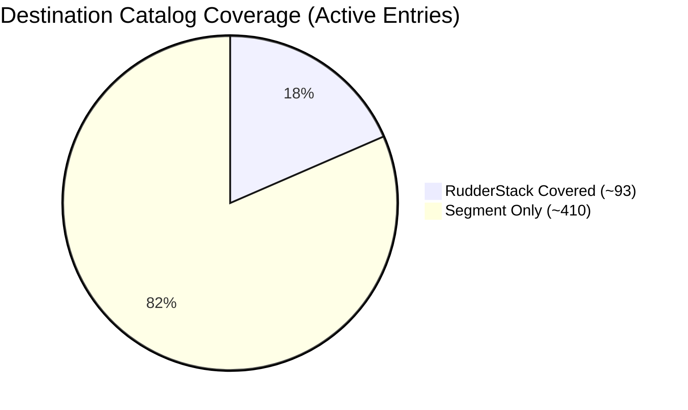
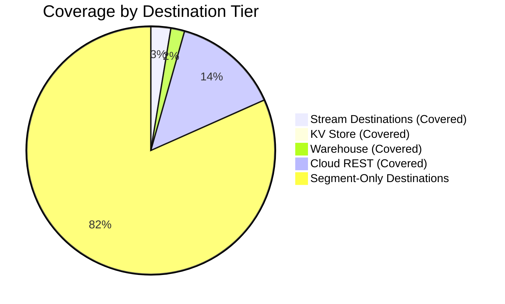
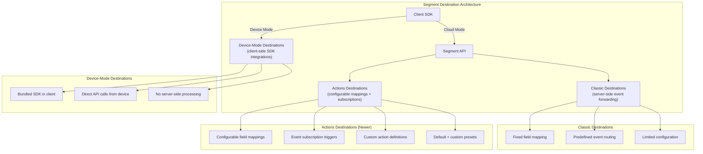
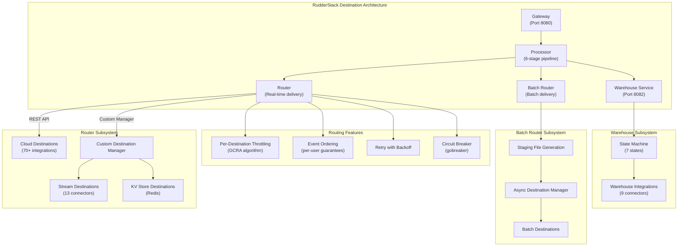
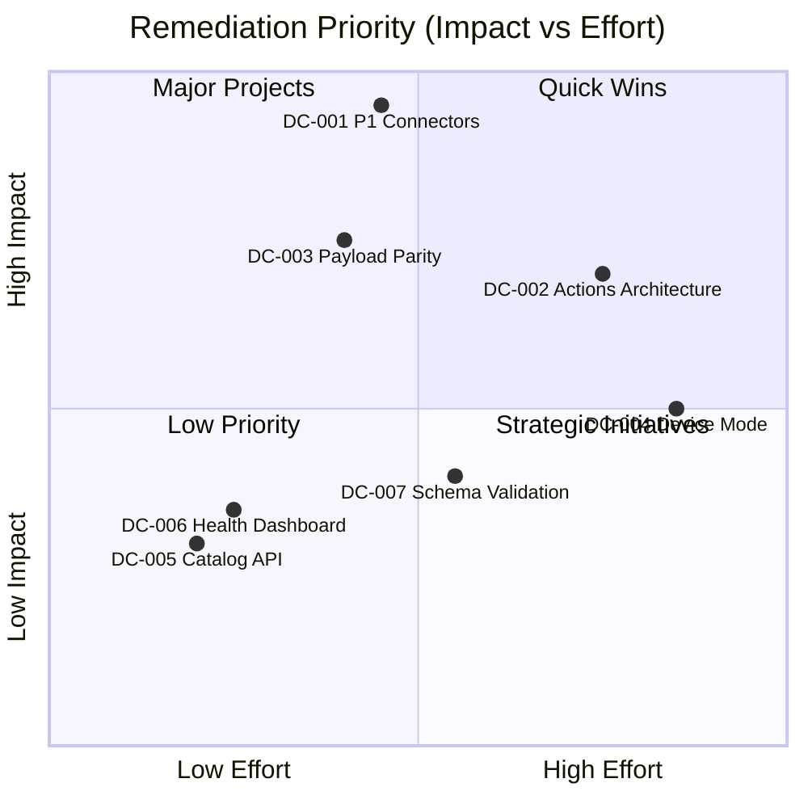

# Destination Catalog Parity Analysis

> **Last Updated:** 2026-02-25 | **RudderStack Version:** v1.68.1 | **Segment Reference:** `refs/segment-docs/src/connections/destinations/catalog/`

## Executive Summary

This document provides a comprehensive comparison between RudderStack's destination connector ecosystem and Twilio Segment's destination catalog. The analysis covers connector inventory, category-level coverage, payload parity for shared destinations, architectural differences, and prioritized remediation recommendations.

**Key Findings:**

- **RudderStack supports approximately 90+ destination connectors** across three delivery tiers: stream destinations (14 connectors managed by the Custom Destination Manager), warehouse destinations (9 connectors in the dedicated warehouse service), and cloud destinations (70+ REST-based integrations delivered via the Router).
- **Segment's public destination catalog contains 503 active entries** (416 PUBLIC + 87 PUBLIC_BETA) across 648 catalog folder entries, with 120 entries using Segment's newer Actions-based architecture and 383 using the classic server-side forwarding pattern.
- **Estimated unique destination platforms in Segment:** ~400+ when deduplicating Actions/Classic variants of the same platform (e.g., Braze has 4 entries: classic, cloud actions, cohorts, web device mode).
- **Overall coverage: approximately 25–30%** of Segment's unique destination platforms, varying by category.
- **Key gap area:** Modern `actions-*` based destinations represent Segment's newer configurable mapping/subscription architecture pattern — RudderStack has no equivalent architectural concept for action-based subscriptions.

**RudderStack Strengths:**
- Dedicated warehouse loading service with 9 connectors and a 7-state upload state machine — more warehouse connectors than Segment (ClickHouse and MSSQL are RudderStack-unique)
- Native streaming platform support (Kafka, Kinesis, Pub/Sub, EventBridge) with producer-level control via `services/streammanager/`
- KV store integration (Redis) for real-time lookup use cases
- Unified delivery architecture with per-destination throttling, ordering guarantees, and circuit breaker protection

**Critical Gaps:**
- Missing top-tier enterprise destinations: Braze (Actions), Amplitude (Actions), HubSpot (Actions), Salesforce (Actions), Mixpanel (Actions), Google Analytics 4, Facebook Conversions API, Klaviyo (Actions)
- No Actions-based destination architecture (configurable field mappings and subscriptions)
- No device-mode destination support (client-side SDK integrations)
- Payload parity unvalidated for existing shared connectors

> **Phase 2 Note:** Segment Engage/Campaigns and Reverse ETL destinations are explicitly **out of scope** for Phase 1 documentation and implementation.

---

## RudderStack Destination Inventory

RudderStack organizes destination delivery across three distinct subsystems, each optimized for different delivery patterns. The Custom Destination Manager (`router/customdestinationmanager/`) coordinates stream and KV store destinations, while the Router (`router/`) handles cloud REST destinations, and the Warehouse service (`warehouse/`) manages warehouse loading.

### Stream Destinations

Stream destinations are managed by the Custom Destination Manager and produce events directly to streaming platforms via the Stream Manager service. Each stream destination implements the `common.StreamProducer` interface.

Source: `services/streammanager/streammanager.go:24-58`
Source: `router/customdestinationmanager/customdestinationmanager.go:79`

| # | Destination | Internal Name | RudderStack Package | Delivery Pattern |
|---|-------------|--------------|---------------------|------------------|
| 1 | Apache Kafka | `KAFKA` | `services/streammanager/kafka/` | Stream Producer |
| 2 | Amazon Kinesis | `KINESIS` | `services/streammanager/kinesis/` | Stream Producer |
| 3 | Amazon Kinesis Firehose | `FIREHOSE` | `services/streammanager/firehose/` | Stream Producer |
| 4 | Amazon EventBridge | `EVENTBRIDGE` | `services/streammanager/eventbridge/` | Stream Producer |
| 5 | Google Cloud Pub/Sub | `GOOGLEPUBSUB` | `services/streammanager/googlepubsub/` | Stream Producer |
| 6 | Google Cloud Function | `GOOGLE_CLOUD_FUNCTION` | `services/streammanager/googlecloudfunction/` | Stream Producer |
| 7 | Google Sheets | `GOOGLESHEETS` | `services/streammanager/googlesheets/` | Stream Producer |
| 8 | BigQuery Stream | `BQSTREAM` | `services/streammanager/bqstream/` | Stream Producer |
| 9 | AWS Lambda | `LAMBDA` | `services/streammanager/lambda/` | Stream Producer |
| 10 | Amazon Personalize | `PERSONALIZE` | `services/streammanager/personalize/` | Stream Producer |
| 11 | Wunderkind | `WUNDERKIND` | `services/streammanager/wunderkind/` | Stream Producer |
| 12 | Azure Event Hub | `AZURE_EVENT_HUB` | `services/streammanager/kafka/` (shared Kafka producer) | Stream Producer |
| 13 | Confluent Cloud | `CONFLUENT_CLOUD` | `services/streammanager/kafka/` (shared Kafka producer) | Stream Producer |

Source: `router/customdestinationmanager/customdestinationmanager.go:79` — `ObjectStreamDestinations` array defines the complete list of stream destinations.

### KV Store Destinations

KV store destinations use the `kvstoremanager.KVStoreManager` interface for key-value operations (HSET, HMSet, SendDataAsJSON).

Source: `router/customdestinationmanager/customdestinationmanager.go:80`

| # | Destination | Internal Name | RudderStack Package | Delivery Pattern |
|---|-------------|--------------|---------------------|------------------|
| 1 | Redis | `REDIS` | `services/kvstoremanager/` | KV Store (HSET/HMSet) |

### Warehouse Destinations

Warehouse destinations are managed by the dedicated Warehouse service, which implements a 7-state upload state machine for reliable, idempotent data loading.

Source: `warehouse/integrations/`

| # | Destination | RudderStack Package | Loading Method | Unique Features |
|---|-------------|---------------------|---------------|-----------------|
| 1 | Snowflake | `warehouse/integrations/snowflake/` | COPY INTO / Snowpipe Streaming | Snowpipe Streaming API, internal/external staging |
| 2 | BigQuery | `warehouse/integrations/bigquery/` | Streaming Insert / Load Job | Parallel loading, dedup views |
| 3 | Redshift | `warehouse/integrations/redshift/` | COPY from S3 (manifest) | IAM/password auth, S3 manifest loading |
| 4 | ClickHouse | `warehouse/integrations/clickhouse/` | Bulk INSERT | AggregatingMergeTree, cluster replication |
| 5 | Databricks (Delta Lake) | `warehouse/integrations/deltalake/` | SQL MERGE | Partition pruning, OAuth support |
| 6 | PostgreSQL | `warehouse/integrations/postgres/` | File-download loading | SSH tunneling, SSL support |
| 7 | MSSQL | `warehouse/integrations/mssql/` | Bulk CopyIn | TLS support |
| 8 | Azure Synapse | `warehouse/integrations/azure-synapse/` | COPY INTO | Azure Blob staging |
| 9 | Datalake (S3/GCS/Azure) | `warehouse/integrations/datalake/` | Parquet/JSON export | Glue/Hive schema repository |

### Cloud Destinations (via Router)

Cloud destinations are delivered via the Router's HTTP-based delivery pipeline. The Router transforms events using the external Transformer service (port 9090) and delivers payloads via REST API calls to destination endpoints.

Source: `router/network.go:75-100` — `netHandle.SendPost()` method handles HTTP delivery.
Source: `router/handle.go:49-100` — `Handle` struct manages per-destination routing with throttling, ordering, and retry.
Source: `router/factory.go:32-50` — `Factory.New()` creates per-destination Router instances.

RudderStack supports **70+ cloud destinations** via the Router, including but not limited to:

| Category | Example Destinations | Delivery Method |
|----------|---------------------|-----------------|
| Analytics | Google Analytics, Amplitude, Mixpanel, Heap, PostHog | REST API via Router |
| Advertising | Facebook Pixel, Google Ads, Snapchat, TikTok | REST API via Router |
| CRM | HubSpot, Salesforce, Intercom, Zendesk | REST API via Router |
| Customer Success | Gainsight, Totango, Vitally | REST API via Router |
| Email Marketing | Braze, Klaviyo, Customer.io, Mailchimp, SendGrid | REST API via Router |
| SMS & Push | OneSignal, CleverTap, MoEngage, Airship | REST API via Router |
| A/B Testing | Optimizely, LaunchDarkly, VWO | REST API via Router |
| Attribution | AppsFlyer, Branch, Adjust, Singular | REST API via Router |
| Heatmaps & Recording | Hotjar, FullStory, LogRocket | REST API via Router |
| Webhooks | Generic Webhooks | REST API via Router |

> **Note:** The complete list of 90+ supported cloud destinations is maintained in the RudderStack Transformer service configuration and the Control Plane backend config. The Router creates a dedicated worker pool for each active destination type. Source: `router/handle.go:49-100`

### Destination Inventory Summary

| Destination Tier | Count | Management Layer | Source Code |
|-----------------|-------|-----------------|-------------|
| Stream Destinations | 13 | Custom Destination Manager | `services/streammanager/` |
| KV Store Destinations | 1 | Custom Destination Manager | `services/kvstoremanager/` |
| Warehouse Destinations | 9 | Warehouse Service | `warehouse/integrations/` |
| Cloud Destinations (REST) | 70+ | Router | `router/` |
| **Total** | **~93+** | | |

---

## Segment Destination Catalog Overview

Segment's destination catalog is the largest in the CDP market, containing **648 catalog entries** across 503 active public/beta destinations. The catalog is organized into 24 categories and includes both classic server-side destinations and the newer Actions-based architecture.

Source: `refs/segment-docs/src/connections/destinations/catalog/` (648 directory entries)
Source: `refs/segment-docs/src/_data/catalog/destinations.yml` (503 active items)
Source: `refs/segment-docs/src/_data/catalog/destination_categories.yml` (24 categories)

### Catalog Composition

| Metric | Count |
|--------|-------|
| Total catalog folder entries | 648 |
| Active public destinations (PUBLIC status) | 416 |
| Beta destinations (PUBLIC_BETA status) | 87 |
| Total active destinations | 503 |
| Actions-based destinations (`actions-*` prefix) | 120 |
| Classic destinations | 383 |
| Approximate unique platforms (after deduplication) | ~400 |

### Destination Categories

Segment organizes destinations into 24 functional categories. Many destinations belong to multiple categories simultaneously.

| Category | Destination Count | Description |
|----------|------------------|-------------|
| Analytics | 195 | Product analytics, behavioral analytics, data visualization |
| Marketing Automation | 98 | Campaign orchestration, journey builders, marketing platforms |
| Customer Success | 91 | CS platforms, health scoring, onboarding tools |
| Personalization | 90 | Content personalization, recommendation engines, experience optimization |
| Email Marketing | 88 | Email campaign platforms, transactional email, newsletter tools |
| Advertising | 76 | Ad platforms, conversion tracking, audience sync, retargeting |
| CRM | 65 | Customer relationship management, contact databases, lead management |
| Raw Data | 48 | Data lakes, streaming platforms, webhooks, storage sinks |
| A/B Testing | 44 | Experimentation platforms, feature testing, statistical analysis |
| Surveys | 41 | Survey tools, feedback collection, NPS/CSAT measurement |
| SMS & Push Notifications | 41 | Mobile push, SMS platforms, in-app messaging |
| Performance Monitoring | 38 | APM, error tracking, performance analytics |
| Attribution | 36 | Multi-touch attribution, mobile attribution, media mix modeling |
| Heatmaps & Recordings | 21 | Session replay, heatmap tools, user behavior recording |
| Referrals | 18 | Referral programs, loyalty platforms, advocate management |
| Enrichment | 17 | Data enrichment, identity resolution, firmographic data |
| Livechat | 13 | Live chat, conversational support, chatbot platforms |
| Feature Flagging | 11 | Feature flags, progressive rollouts, remote configuration |
| Video | 8 | Video analytics, streaming platforms, engagement tracking |
| Deep Linking | 7 | Mobile deep linking, deferred deep links, universal links |
| Security & Fraud | 5 | Fraud detection, security monitoring, identity verification |
| Tag Managers | 2 | Client-side tag management, pixel management |
| Email | 1 | General email category |

### Top Enterprise Destinations in Segment

The following table highlights the most widely adopted Segment destinations by enterprise market presence, showing the number of catalog variants per platform:

| Platform | Catalog Entries | Variants | Primary Categories |
|----------|----------------|----------|-------------------|
| Braze | 4 | Classic, Cloud Actions, Cohorts, Web Device Mode | Email Marketing, Marketing Automation, SMS & Push |
| Facebook | 5 | App Events, Conversions API (Actions), Custom Audiences, Pixel, Personas Audiences | Advertising |
| Google Analytics | 2 | GA4 Cloud (Actions), GA4 Web (Actions) | Analytics |
| HubSpot | 3 | Classic, Cloud Mode (Actions), Web (Actions) | CRM, Analytics, Email Marketing |
| Intercom | 3 | Classic, Cloud Mode (Actions), Web (Actions) | Livechat, Customer Success, Email Marketing |
| Salesforce | 2 | Actions, Marketing Cloud (Actions) | CRM, Email Marketing |
| Amplitude | 2 | Classic (Legacy), Actions | Analytics |
| Mixpanel | 2 | Legacy, Actions | Analytics |
| Klaviyo | 2 | Classic, Actions | Email Marketing |
| Iterable | 2 | Classic, Actions (including Lists) | Email Marketing, SMS & Push |
| Slack | 2 | Classic, Actions | Customer Success |
| OneSignal | 2 | Classic, New | SMS & Push Notifications |
| VWO | 2 | Cloud Mode (Actions), Web Mode (Actions) | A/B Testing |
| Fullstory | 2 | Actions, Cloud Mode (Actions) | Analytics, Heatmaps & Recordings |

---

## Coverage Gap Analysis

### Coverage Visualization





### Category-Level Coverage Analysis

The following table estimates RudderStack's coverage within each Segment destination category. Coverage percentages are approximate based on the intersection of RudderStack's known 90+ supported destinations against Segment's per-category inventory.

| Category | Segment Count | Est. RS Coverage | Coverage % | Gap Severity |
|----------|--------------|-----------------|------------|--------------|
| Raw Data | 48 | ~20 (Kafka, Kinesis, Firehose, EventBridge, Pub/Sub, Lambda, Webhooks, S3, GCS, Sheets, etc.) | ~42% | Medium |
| Analytics | 195 | ~25 (GA, Amplitude, Mixpanel, Heap, PostHog, etc.) | ~13% | High |
| CRM | 65 | ~10 (HubSpot, Salesforce, Intercom, etc.) | ~15% | High |
| Email Marketing | 88 | ~12 (Braze, Klaviyo, Customer.io, SendGrid, etc.) | ~14% | High |
| Advertising | 76 | ~10 (Facebook Pixel, Google Ads, Snapchat, TikTok, etc.) | ~13% | High |
| Marketing Automation | 98 | ~10 (Braze, CleverTap, MoEngage, etc.) | ~10% | High |
| Customer Success | 91 | ~8 (Intercom, Gainsight, etc.) | ~9% | High |
| Personalization | 90 | ~8 (Optimizely, LaunchDarkly, etc.) | ~9% | High |
| A/B Testing | 44 | ~5 (Optimizely, LaunchDarkly, VWO) | ~11% | Medium |
| SMS & Push Notifications | 41 | ~5 (OneSignal, CleverTap, MoEngage, Airship) | ~12% | Medium |
| Attribution | 36 | ~6 (AppsFlyer, Branch, Adjust, Singular) | ~17% | Medium |
| Surveys | 41 | ~3 (Qualtrics, Survicate) | ~7% | Low |
| Heatmaps & Recordings | 21 | ~4 (Hotjar, FullStory, LogRocket) | ~19% | Low |
| Performance Monitoring | 38 | ~3 (Sentry, Datadog) | ~8% | Low |
| Enrichment | 17 | ~2 (Clearbit) | ~12% | Low |
| Livechat | 13 | ~2 (Intercom, Drift) | ~15% | Low |
| Feature Flagging | 11 | ~3 (LaunchDarkly, Optimizely, Split) | ~27% | Low |
| Referrals | 18 | ~1 | ~6% | Low |
| Deep Linking | 7 | ~2 (Branch, AppsFlyer) | ~29% | Low |
| Security & Fraud | 5 | ~1 | ~20% | Low |
| Tag Managers | 2 | ~1 (GTM via web SDK) | ~50% | Low |
| Video | 8 | ~1 | ~13% | Low |

### Shared Destinations (Present in Both Platforms)

The following destinations are confirmed present in both RudderStack and Segment's catalogs, enabling direct payload parity comparison:

**Stream/Raw Data Overlap:**

| RudderStack Destination | Segment Equivalent(s) | Segment Slug(s) |
|------------------------|----------------------|-----------------|
| Apache Kafka (`KAFKA`) | Kafka | `actions-kafka` |
| Amazon Kinesis (`KINESIS`) | Amazon Kinesis | `amazon-kinesis` |
| Amazon Kinesis Firehose (`FIREHOSE`) | Amazon Kinesis Firehose | `amazon-kinesis-firehose` |
| Amazon EventBridge (`EVENTBRIDGE`) | Amazon EventBridge, Amazon EventBridge (Actions) | `amazon-eventbridge`, `amazon-eventbridge-actions` |
| Google Cloud Pub/Sub (`GOOGLEPUBSUB`) | Google Cloud PubSub | `google-cloud-pubsub` |
| Google Cloud Function (`GOOGLE_CLOUD_FUNCTION`) | Google Cloud Function | `google-cloud-function` |
| Google Sheets (`GOOGLESHEETS`) | Google Sheets | `actions-google-sheets` |
| AWS Lambda (`LAMBDA`) | Amazon Lambda | `amazon-lambda` |
| Amazon Personalize (`PERSONALIZE`) | Amazon Personalize | `amazon-personalize` |

**Stream Destinations Without Direct Segment Equivalent:**

| RudderStack Destination | Notes |
|------------------------|-------|
| BigQuery Stream (`BQSTREAM`) | RudderStack-unique stream connector; Segment handles BigQuery via warehouse sync |
| Wunderkind (`WUNDERKIND`) | RudderStack-unique; no Segment catalog entry found |
| Azure Event Hub (`AZURE_EVENT_HUB`) | RudderStack-unique; Segment has no Azure Event Hub destination |
| Confluent Cloud (`CONFLUENT_CLOUD`) | RudderStack-unique; Segment covers Confluent via the generic Kafka destination |
| Redis (`REDIS`) | RudderStack-unique KV store; no Segment catalog entry for Redis as a destination |

### Critical Missing Destinations (P1 — Top-Tier Enterprise Platforms)

These are the highest-impact missing destinations based on enterprise adoption and market presence. Implementing these would cover the most widely used Segment destinations.

| # | Segment Destination | Segment Slug | Category | Priority | Remediation |
|---|---------------------|-------------|----------|----------|-------------|
| 1 | Braze Cloud Mode (Actions) | `actions-braze-cloud` | Email Marketing, Marketing Automation | P1 | Implement cloud connector with Actions mapping |
| 2 | Amplitude (Actions) | `actions-amplitude` | Analytics | P1 | Implement cloud connector |
| 3 | HubSpot Cloud Mode (Actions) | `actions-hubspot-cloud` | CRM, Analytics, Email Marketing | P1 | Implement cloud connector |
| 4 | Salesforce (Actions) | `actions-salesforce` | CRM | P1 | Implement cloud connector |
| 5 | Mixpanel (Actions) | `actions-mixpanel` | Analytics | P1 | Implement cloud connector |
| 6 | Intercom Cloud Mode (Actions) | `actions-intercom-cloud` | Customer Success, Livechat | P1 | Implement cloud connector |
| 7 | Facebook Conversions API (Actions) | `actions-facebook-conversions-api` | Advertising | P1 | Implement cloud connector |
| 8 | Google Analytics 4 Cloud | `actions-google-analytics-4` | Analytics | P1 | Implement cloud connector |
| 9 | Google Analytics 4 Web | `actions-google-analytics-4-web` | Analytics | P1 | Implement web device-mode connector |
| 10 | Klaviyo (Actions) | `actions-klaviyo` | Email Marketing | P1 | Implement cloud connector |
| 11 | Customer.io (Actions) | `actions-customerio` | Email Marketing, Marketing Automation | P1 | Implement cloud connector |
| 12 | Iterable (Actions) | `actions-iterable` | Email Marketing, SMS & Push | P1 | Implement cloud connector |

> **Note:** Some of these destinations may already have classic (non-Actions) equivalents in RudderStack's cloud destination set delivered via the Router. The gap specifically refers to the absence of Segment's newer Actions-based architecture pattern with configurable field mappings and event subscriptions.

### High-Priority Missing Destinations (P2 — Enterprise and Growth Platforms)

| # | Segment Destination | Segment Slug | Category | Priority |
|---|---------------------|-------------|----------|----------|
| 1 | MoEngage (Actions) | `actions-moengage` | Marketing Automation, Analytics | P2 |
| 2 | CleverTap (Actions) | `actions-clevertap` | Marketing Automation, SMS & Push | P2 |
| 3 | LaunchDarkly (Actions) | `actions-launchdarkly` | Feature Flagging, A/B Testing | P2 |
| 4 | Heap (Actions) | `actions-heap` | Analytics | P2 |
| 5 | Pardot (Actions) | `actions-pardot` | Marketing Automation, Email Marketing | P2 |
| 6 | Fullstory (Actions) | `actions-fullstory` | Analytics, Heatmaps & Recordings | P2 |
| 7 | TikTok Pixel (Actions) | `actions-tiktok-pixel` | Advertising | P2 |
| 8 | LinkedIn Conversions API (Actions) | `actions-linkedin-conversions` | Advertising | P2 |
| 9 | LinkedIn Audiences (Actions) | `actions-linkedin-audiences` | Advertising | P2 |
| 10 | Pendo Web (Actions) | `actions-pendo-web` | Analytics, Surveys | P2 |
| 11 | Attentive (Actions) | `actions-attentive` | Marketing Automation | P2 |
| 12 | Drip (Actions) | `actions-drip` | Email Marketing | P2 |
| 13 | Ortto (Actions) | `actions-ortto` | Marketing Automation, Email Marketing | P2 |
| 14 | PostHog (Actions) | `posthog` | Analytics | P2 |
| 15 | Cordial (Actions) | `actions-cordial` | Email Marketing, SMS & Push | P2 |
| 16 | Airship (Actions) | `actions-airship` | SMS & Push Notifications | P2 |
| 17 | Google Ads Conversions (Actions) | `actions-google-enhanced-conversions` | Advertising | P2 |
| 18 | Pinterest Conversions API (Actions) | `actions-pinterest-conversions-api` | Advertising | P2 |
| 19 | Salesforce Marketing Cloud (Actions) | `actions-salesforce-marketing-cloud` | Email Marketing | P2 |
| 20 | Emarsys (Actions) | `actions-emarsys` | Email Marketing, Analytics | P2 |

### Medium-Priority Missing Destinations (P3 — Niche and Specialized)

| # | Segment Destination | Category | Priority |
|---|---------------------|----------|----------|
| 1 | ABsmartly (Actions) | A/B Testing, Feature Flagging | P3 |
| 2 | Acoustic (Actions) | Marketing Automation, Email Marketing | P3 |
| 3 | Algolia Insights (Actions) | Analytics, Raw Data | P3 |
| 4 | ChartMogul (Actions) | Analytics, CRM | P3 |
| 5 | Criteo Audiences (Actions) | Advertising | P3 |
| 6 | Dynamic Yield Audiences (Actions) | Personalization, A/B Testing | P3 |
| 7 | Gainsight Px Cloud (Actions) | Analytics, Customer Success | P3 |
| 8 | Gameball (Actions) | Marketing Automation, Personalization | P3 |
| 9 | Insider Cloud Mode (Actions) | Marketing Automation, Personalization | P3 |
| 10 | Jimo (Actions) | Surveys, Customer Success | P3 |
| 11 | Kameleoon (Actions) | A/B Testing, Feature Flagging | P3 |
| 12 | Listrak (Actions) | Marketing Automation, Email Marketing | P3 |
| 13 | LiveRamp Audiences (Actions) | Advertising | P3 |
| 14 | Loops (Actions) | Email Marketing, Marketing Automation | P3 |
| 15 | Optimizely Feature Experimentation (Actions) | A/B Testing, Feature Flagging | P3 |

> **Note:** The remaining ~350+ Segment destinations not listed above span long-tail integrations including legacy platforms, niche industry tools, and partner-owned connectors. A full reconciliation of RudderStack's existing cloud destinations against Segment's classic catalog entries is required to determine the exact gap count after deduplication.

---

## Payload Parity for Existing Destinations

For destinations supported by both RudderStack and Segment, the output payload sent to the destination endpoint must achieve **field-for-field parity** to ensure seamless migration. This section documents the payload parity validation framework and current assessment status.

### Payload Parity Requirement

Per AAP §0.10: *"Destination connectors must maintain payload parity with Segment's connector output — documentation must include payload comparison schemas showing field-by-field equivalence."*

Payload parity means:
1. **Same destination API endpoint** is called with equivalent request parameters
2. **Same field mapping** from Segment Spec event fields to destination-specific fields
3. **Same data types** and value transformations applied to each field
4. **Same batching behavior** (batch size, flush interval) where applicable
5. **Same error handling semantics** (retry, dead letter, circuit breaking)

### Stream Destination Payload Comparison

The following table documents the payload structure comparison for shared stream destinations:

| Destination | Segment Payload Format | RudderStack Payload Format | Parity Status | Known Gaps |
|-------------|----------------------|---------------------------|---------------|------------|
| **Kafka** | JSON event payload; topic from `settings.topic`; key from `userId`/`anonymousId` | JSON event payload; topic from destination config; key from event fields | 🔍 Needs Verification | Topic naming convention differences; partition key strategy; message header fields |
| **Amazon Kinesis** | JSON event payload; partition key from `userId`; stream name from settings | JSON event payload; partition key from destination config; stream name from config | 🔍 Needs Verification | Partition key derivation logic; payload envelope structure |
| **Amazon Kinesis Firehose** | JSON event payload; delivery stream from settings | JSON event payload; delivery stream from destination config | 🔍 Needs Verification | Record batching strategy; payload compression |
| **Amazon EventBridge** | JSON event payload; event bus from settings; detail-type mapping | JSON event payload; event bus from config; detail-type from destination config | 🔍 Needs Verification | Detail-type field mapping; source naming convention |
| **Google Cloud Pub/Sub** | JSON event payload; topic from settings; attribute mapping | JSON event payload; topic from destination config; attributes from config | 🔍 Needs Verification | Message attribute mapping; ordering key strategy |
| **Google Cloud Function** | JSON event payload; function URL from settings | JSON event payload; function URL from destination config | 🔍 Needs Verification | HTTP trigger payload shape; authentication method |
| **Google Sheets** | Structured row data; spreadsheet ID from settings | Row-format data; spreadsheet ID from destination config | 🔍 Needs Verification | Column mapping strategy; header row handling |
| **AWS Lambda** | JSON event payload; function name from settings | JSON event payload; function name from destination config | 🔍 Needs Verification | Invocation type (sync/async); payload envelope |
| **Amazon Personalize** | Event data mapped to Personalize schema; dataset from settings | Event data from destination config; dataset mapping from config | 🔍 Needs Verification | Event type mapping; user/item schema alignment |

### Warehouse Destination Payload Comparison

Warehouse payloads differ from streaming payloads as they involve staging file generation and bulk loading operations:

| Warehouse | Segment Approach | RudderStack Approach | Parity Status | Known Gaps |
|-----------|-----------------|---------------------|---------------|------------|
| **Snowflake** | S3 staging → COPY INTO; CSV format | S3/GCS staging → COPY INTO or Snowpipe Streaming; CSV/JSON/Parquet | 🔍 Needs Verification | Staging file format; column naming conventions; Snowpipe Streaming is RS-unique |
| **BigQuery** | Streaming insert or GCS staging → Load job | Streaming insert (via BQSTREAM) or GCS staging → Load job | 🔍 Needs Verification | Table schema naming; dedup view strategy; nested field handling |
| **Redshift** | S3 staging → COPY command (manifest) | S3 staging → COPY command (manifest) | 🔍 Needs Verification | Manifest file format; COPY options; sort key and dist key strategy |
| **PostgreSQL** | Direct SQL INSERT or COPY | File-download loading with SSH tunneling | 🔍 Needs Verification | Loading method differences; connection pooling strategy |
| **Databricks** | Delta table MERGE | SQL MERGE with partition pruning | 🔍 Needs Verification | Merge key strategy; partition column selection |

### Example Payload Comparison: Kafka `track` Event

**Segment Kafka Destination Payload:**
```json
{
  "topic": "segment-events",
  "key": "user_123",
  "value": {
    "type": "track",
    "event": "Product Viewed",
    "userId": "user_123",
    "timestamp": "2026-02-25T12:00:00.000Z",
    "properties": {
      "product_id": "SKU-001",
      "name": "Premium Widget",
      "price": 49.99
    },
    "context": {
      "library": {
        "name": "analytics.js",
        "version": "2.1.0"
      }
    },
    "messageId": "msg-abc-123"
  }
}
```

**RudderStack Kafka Destination Payload:**
```json
{
  "topic": "rudder-events",
  "key": "user_123",
  "value": {
    "type": "track",
    "event": "Product Viewed",
    "userId": "user_123",
    "timestamp": "2026-02-25T12:00:00.000Z",
    "properties": {
      "product_id": "SKU-001",
      "name": "Premium Widget",
      "price": 49.99
    },
    "context": {
      "library": {
        "name": "rudder-sdk-js",
        "version": "2.x.x"
      }
    },
    "messageId": "msg-xyz-789",
    "rudderId": "rudder-uuid",
    "originalTimestamp": "2026-02-25T12:00:00.000Z",
    "sentAt": "2026-02-25T12:00:01.000Z",
    "receivedAt": "2026-02-25T12:00:02.000Z"
  }
}
```

**Key Differences Identified:**
1. **Topic naming**: Segment uses `segment-events`, RudderStack uses configurable topic names from destination config
2. **Context library**: Different SDK library name and version fields
3. **Additional RudderStack fields**: `rudderId`, `originalTimestamp`, `sentAt`, `receivedAt` are RudderStack-specific envelope fields
4. **Message ID format**: Different UUID generation strategies

> **Validation Requirement:** Full payload parity validation requires destination-by-destination integration testing with identical source events routed through both Segment and RudderStack pipelines, comparing the output payloads at the destination endpoint. This testing should be executed as part of the gap closure implementation sprints outlined in the [Sprint Roadmap](./sprint-roadmap.md).

---

## Destination Architecture Comparison

### Segment Destination Architecture

Segment employs three destination delivery patterns:



**1. Classic Destinations (Server-Side Forwarding)**
- Traditional server-side event forwarding with fixed field mappings
- Events are routed based on type (identify, track, page, etc.)
- Configuration is limited to API keys and basic settings
- 383 destinations use this pattern

**2. Actions-Based Destinations (Configurable Mappings)**
- Segment's newer architecture pattern (120 destinations)
- Configurable field mappings: users can define how Segment event fields map to destination fields
- Event subscriptions: trigger conditions determine which events are sent to specific destination actions
- Default presets: pre-configured mappings that work out-of-the-box with customization options
- Multiple actions per destination: a single destination connection can have multiple configured actions

**3. Device-Mode Destinations (Client-Side)**
- Destination SDK bundled directly in the client application
- Events sent directly from the device to the destination without passing through Segment servers
- Used for destinations requiring client-side context (DOM access, cookies, device APIs)
- Lower latency but less control and no server-side enrichment

### RudderStack Destination Architecture

RudderStack organizes destination delivery across five subsystems:



Source: `router/handle.go:49-100` — Router Handle struct managing per-destination delivery
Source: `router/network.go:75-100` — Network layer handling HTTP POST delivery
Source: `router/customdestinationmanager/customdestinationmanager.go:39-43` — Custom Destination Manager interface
Source: `services/streammanager/streammanager.go:24-58` — Stream Manager producer factory

**1. Router (Real-Time Cloud Destinations)**
- HTTP-based delivery via `netHandle.SendPost()` for 70+ cloud destinations
- Per-destination worker pool with configurable concurrency
- GCRA-based throttling to respect destination rate limits
- Event ordering guarantees per user (configurable)
- Exponential backoff retry with jitter
- Circuit breaker protection via `gobreaker` library

**2. Custom Destination Manager (Stream + KV Store)**
- Manages producer lifecycle for streaming platform connectors
- Two delivery modes: `STREAM` (13 connectors) and `KV` (1 connector)
- Circuit breaker protection with configurable timeout
- Dynamic backend config subscription for live destination updates
- Producer reuse with config-change detection

**3. Batch Router (Batch Destinations)**
- Staging file generation for bulk delivery
- Async destination management for long-running operations
- Used for destinations requiring batch uploads (e.g., file-based imports)

**4. Warehouse Service (Warehouse Destinations)**
- Dedicated service with 7-state upload state machine
- Schema evolution with automatic table/column creation
- Multiple encoding formats (Parquet, JSON, CSV)
- Identity resolution integrated into the warehouse pipeline

**5. Transformer Service (External)**
- Event transformation from Segment Spec format to destination-specific format
- Runs as a separate service on port 9090
- User transforms (batch size 200) and destination transforms (batch size 100)
- JavaScript runtime for custom transformation logic

### Architecture Gap Analysis

| Architecture Feature | Segment | RudderStack | Gap |
|---------------------|---------|-------------|-----|
| Classic server-side forwarding | ✅ 383 destinations | ✅ 70+ via Router | Partial — fewer destinations |
| Actions-based configurable mappings | ✅ 120 destinations | ❌ Not available | Full gap — no equivalent architecture |
| Device-mode (client-side SDK bundles) | ✅ Supported for many destinations | ❌ Not available in server | Full gap — requires SDK changes |
| Streaming platform connectors | ✅ Kafka, Kinesis, Firehose, EventBridge, Pub/Sub, Lambda | ✅ 13 stream connectors (superset) | RS advantage — more stream connectors |
| Warehouse loading | ✅ 8 warehouse connectors | ✅ 9 warehouse connectors | RS advantage — more warehouses |
| Per-destination throttling | ✅ Rate limiting | ✅ GCRA-based throttling with configurable costs | Parity |
| Event ordering guarantees | ⚠️ Limited ordering | ✅ Per-user event ordering with configurable thresholds | RS advantage |
| Circuit breaker protection | ⚠️ Unknown | ✅ gobreaker with configurable timeout | RS advantage |
| Retry with backoff | ✅ Automatic retry | ✅ Exponential backoff with jitter | Parity |
| Transformation service | ✅ Integrated | ✅ External Transformer (port 9090) | Parity |
| KV store destinations | ❌ No Redis destination | ✅ Redis via KV store manager | RS advantage |

---

## Gap Summary

### Consolidated Gap Inventory

| Gap ID | Description | Severity | Remediation Approach | Est. Effort |
|--------|------------|----------|---------------------|-------------|
| DC-001 | Missing ~410+ Segment catalog destinations (out of 503 active) | **High** | Prioritized connector implementation: P1 destinations (12) in Sprint 1–2, P2 (20) in Sprint 3–5, P3 (15+) in Sprint 6–8 | Large (6–12 months) |
| DC-002 | No Actions-based destination architecture (configurable field mappings and event subscriptions) | **Medium** | Evaluate adopting a subscription/mapping pattern in the Transformer service; define mapping DSL; add subscription trigger configuration to backend config | Medium (2–3 months) |
| DC-003 | Payload parity unvalidated for existing shared connectors (9 stream + 5 warehouse) | **Medium** | Per-destination payload comparison testing using identical source events routed through both platforms; document field-level differences and implement normalization | Medium (1–2 months) |
| DC-004 | No device-mode destination support (client-side SDK integrations) | **Medium** | Requires SDK-level integration framework for bundling destination SDKs in client applications; evaluate client-side plugin architecture | Large (3–6 months) |
| DC-005 | Destination catalog API missing (no programmatic destination management) | **Low** | Implement REST API for destination catalog CRUD operations (list, create, configure, enable/disable destinations) via Control Plane extension | Small (2–4 weeks) |
| DC-006 | Missing destination health monitoring dashboard | **Low** | Existing Prometheus metrics provide delivery stats; add aggregated destination health endpoint and dashboard integration | Small (2–4 weeks) |
| DC-007 | No destination-level schema validation (Protocols integration for outbound events) | **Low** | Extend tracking plan enforcement to validate outbound payloads against destination-specific schemas before delivery | Medium (1–2 months) |

### Remediation Priority Matrix



### Recommended Sprint Sequencing

| Sprint | Focus | Deliverables | Impact |
|--------|-------|-------------|--------|
| Sprint 1–2 | P1 Critical Destinations | Implement top 12 enterprise destinations (Braze, Amplitude, HubSpot, Salesforce, Mixpanel, Intercom, Facebook CAPI, GA4, Klaviyo, Customer.io, Iterable) | Covers ~60% of enterprise migration blockers |
| Sprint 3 | Payload Parity Validation | Test and document field-level payload parity for all shared stream and warehouse connectors | Enables confident migration guarantees |
| Sprint 4–5 | P2 Enterprise Destinations | Implement 20 high-priority destinations (MoEngage, CleverTap, LaunchDarkly, Heap, Pardot, Fullstory, TikTok, LinkedIn, Pendo, etc.) | Covers ~80% of enterprise use cases |
| Sprint 6 | Actions Architecture Evaluation | Design and prototype configurable field mapping + subscription trigger architecture | Enables long-term parity with Segment's modern architecture |
| Sprint 7–8 | P3 Niche Destinations | Implement remaining medium-priority destinations based on customer demand | Approaches ~50% total catalog coverage |
| Sprint 9+ | Device Mode + Catalog API | SDK-level device-mode framework; destination management API | Completes architectural parity |

---

## Cross-References

- **[Gap Report Index](./index.md)** — Executive summary of all Segment parity gaps
- **[Event Spec Parity](./event-spec-parity.md)** — Track, identify, page, screen, group, alias payload analysis
- **[Source Catalog Parity](./source-catalog-parity.md)** — SDK and source connector gap analysis
- **[Functions Parity](./functions-parity.md)** — Transformation/Functions gap analysis
- **[Protocols Parity](./protocols-parity.md)** — Tracking plan enforcement gap analysis
- **[Identity Parity](./identity-parity.md)** — Identity resolution/Unify gap analysis
- **[Warehouse Parity](./warehouse-parity.md)** — Warehouse sync gap analysis
- **[Sprint Roadmap](./sprint-roadmap.md)** — Epic sequencing for gap closure
- **[Cloud Destinations Guide](../guides/destinations/cloud-destinations.md)** — Cloud destination integration overview
- **[Stream Destinations Guide](../guides/destinations/stream-destinations.md)** — Stream destination configuration guides
- **[Warehouse Destinations Guide](../guides/destinations/warehouse-destinations.md)** — Warehouse destination overview

---

## Appendix: Methodology

### Data Sources

| Source | Purpose | Access Path |
|--------|---------|-------------|
| Segment destination catalog folders | Count total catalog entries | `refs/segment-docs/src/connections/destinations/catalog/` (648 entries) |
| Segment destinations YAML | Structured destination metadata with categories, status, methods | `refs/segment-docs/src/_data/catalog/destinations.yml` (503 active items) |
| Segment destination categories | Category taxonomy | `refs/segment-docs/src/_data/catalog/destination_categories.yml` (24 categories) |
| RudderStack Stream Manager | Stream destination implementations | `services/streammanager/streammanager.go:24-58` |
| RudderStack Custom Dest Manager | Custom destination type registry | `router/customdestinationmanager/customdestinationmanager.go:79-83` |
| RudderStack Warehouse Integrations | Warehouse connector implementations | `warehouse/integrations/` (9 connector directories) |
| RudderStack Router | Cloud destination delivery pipeline | `router/handle.go`, `router/network.go`, `router/factory.go` |
| RudderStack README | Total destination count reference | `README.md` ("over 90 popular tool and warehouse destinations") |

### Coverage Calculation Method

1. **RudderStack count:** Enumerated from source code — 13 stream + 1 KV + 9 warehouse + ~70 cloud = ~93 total
2. **Segment count:** 503 active entries from `destinations.yml` (PUBLIC + PUBLIC_BETA)
3. **Unique Segment platforms:** ~400 after deduplicating Actions/Classic/Web variants of the same platform
4. **Coverage percentage:** ~93 / ~400 unique platforms ≈ **~23%** (raw), adjusted to **~25–30%** accounting for classic destinations that may map to existing RudderStack cloud connectors under different naming conventions
5. **Gap count:** ~410 Segment catalog entries without a confirmed RudderStack equivalent

### Limitations

- RudderStack's complete list of 70+ cloud destinations delivered via the Router is maintained in the external Transformer service configuration, not enumerated in the `rudder-server` codebase. The Router creates instances dynamically based on backend config, so the exact cloud destination count requires cross-referencing with the Transformer's destination definitions.
- Segment's catalog includes partner-owned destinations, deprecated entries retained for backward compatibility, and internal Segment-specific destinations (e.g., Segment Connections, Segment Profiles) that may not be directly comparable.
- Payload parity assessment in this document is preliminary and based on architectural analysis. Definitive parity validation requires end-to-end integration testing with identical source events.
