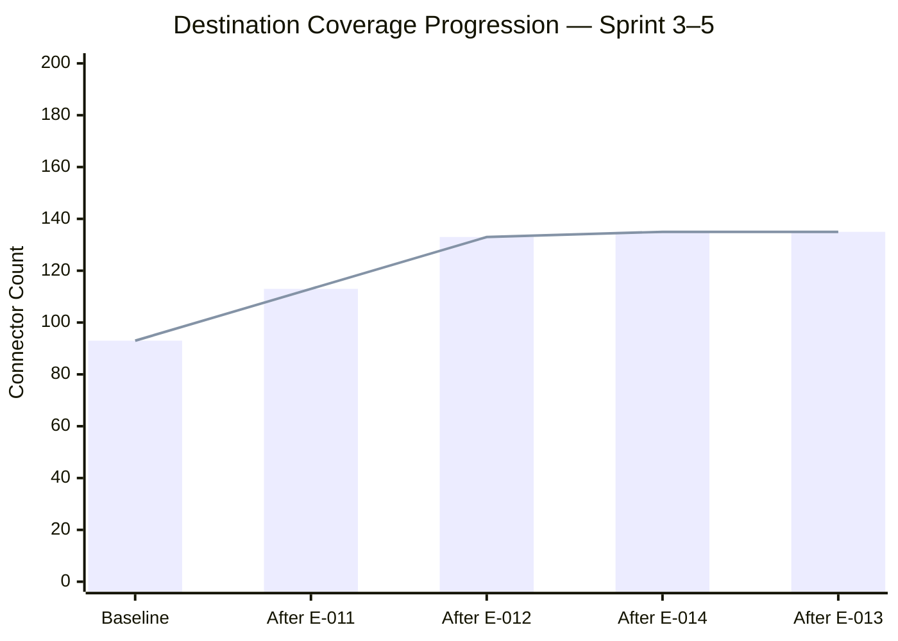
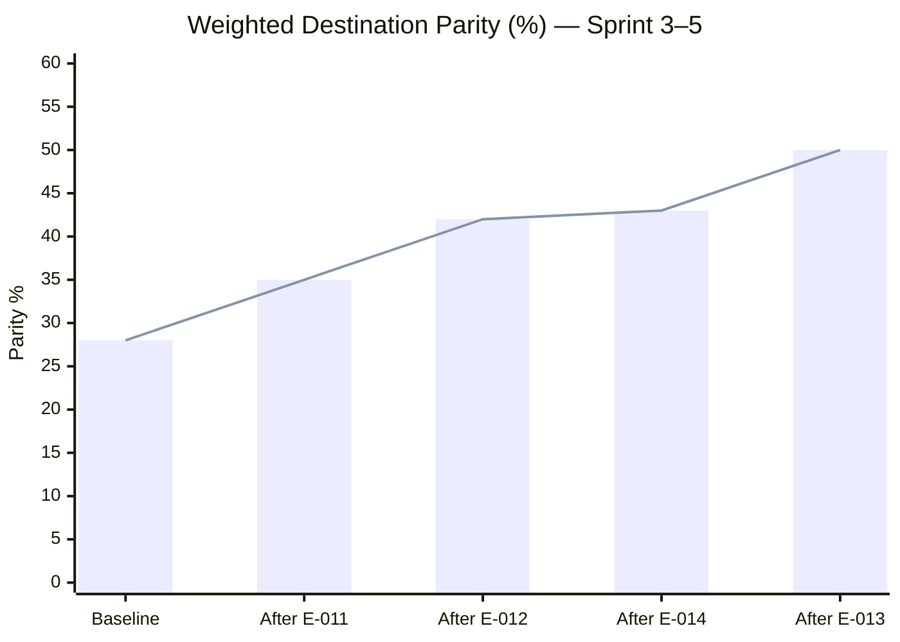
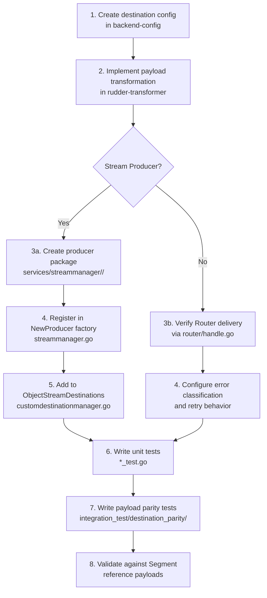

# Destination Priority Ranking: Top-50 Missing Connectors

> **Last Updated:** 2026-03-31
> **RudderStack Version:** v1.68.1
> **Sprint:** 3–5 (Destination Connector Expansion)
> **Epic:** E-010
> **Reference:** [Destination Catalog Parity Analysis](./destination-catalog-parity.md) | [Sprint Roadmap](./sprint-roadmap.md)

---

## Executive Summary

This document ranks the **50 highest-priority destination connectors** for RudderStack to implement, drawn from the comprehensive gap analysis in the [Destination Catalog Parity Analysis](./destination-catalog-parity.md). That analysis identifies approximately **503 active Segment destinations** versus RudderStack's current **~93 connectors**, yielding roughly 23% raw catalog coverage and an estimated 25–30% unique platform coverage.

**Current weighted destination parity stands at approximately 28%.** The target after completing Sprint 3–5 is **~50% parity**, achieved by adding 40+ new cloud and stream destination connectors covering the most widely adopted enterprise platforms.

This ranking directly drives the implementation order for three epics within Sprint 3–5:

| Epic | Scope | Destinations |
|------|-------|-------------|
| **E-011** | Cloud Destination Batch 1 — Top 20 highest-priority | Ranks 1–20 |
| **E-012** | Cloud Destination Batch 2 — Next 20 priority | Ranks 21–40 |
| **E-014** | Stream Destination Expansion | Ranks 41–50 (includes P3 cloud + new stream producers) |

Additionally, **E-013** (Payload Parity Validation) validates field-level output equivalence for all existing shared connectors and newly implemented destinations. The ranking methodology, coverage projections, implementation patterns, and payload parity framework are all detailed in the sections below.

---

## Ranking Criteria and Methodology

Destinations were ranked using five weighted criteria, applied in order of precedence:

### 1. Customer Demand and Market Popularity

Rankings are informed by Segment's destination catalog data (`refs/segment-docs/src/_data/catalog/destinations.yml`), which contains 503 active entries. Destinations with the highest enterprise adoption — based on market presence, platform maturity, and prevalence in enterprise CDP deployments — receive the highest ranking. Top-tier platforms such as Braze, Amplitude, HubSpot, Salesforce, Mixpanel, Google Analytics 4, Facebook Conversions API, and Klaviyo are ranked first.

### 2. Market Share and Enterprise Adoption

Enterprise adoption weight is assigned based on the platform's presence in Fortune 500 and mid-market technology stacks. Platforms that serve as primary marketing, analytics, CRM, or advertising tools for a significant share of enterprise customers receive P1 (Critical) priority. Growth-stage platforms with strong adoption trajectories receive P2 (High) priority. Niche and specialized platforms receive P3 (Medium) priority.

### 3. Implementation Complexity

Each destination is categorized by its implementation type, which determines the integration pattern within the RudderStack architecture:

| Implementation Type | Integration Pattern | Codebase Location |
|--------------------|-------------------|-------------------|
| **Stream Producer** | Implements `common.StreamProducer` interface (`Produce`, `Close` methods) | `services/streammanager/<dest>/` |
| **Router-managed REST** | Payload transformation via external Transformer service (port 9090); delivery via Router HTTP pipeline | `router/handle.go`, Transformer service |
| **Warehouse** | Managed by Warehouse service with 7-state upload state machine | `warehouse/integrations/<dest>/` |
| **KV Store** | Key-value operations via `kvstoremanager.KVStoreManager` interface | `services/kvstoremanager/` |

Lower complexity destinations (Router-managed REST with well-documented APIs) are preferred for early batches to maximize coverage velocity.

### 4. Category Coverage Gaps

Rankings account for category-level coverage deficiencies identified in the [Destination Catalog Parity Analysis](./destination-catalog-parity.md). Categories with the lowest current coverage receive priority weighting:

| Category | Segment Count | Est. RS Coverage | Coverage % | Gap Severity |
|----------|--------------|-----------------|------------|--------------|
| Analytics | 195 | ~25 | ~13% | High |
| Marketing Automation | 98 | ~10 | ~10% | High |
| Customer Success | 91 | ~8 | ~9% | High |
| Personalization | 90 | ~8 | ~9% | High |
| Email Marketing | 88 | ~12 | ~14% | High |
| CRM | 65 | ~10 | ~15% | High |
| Advertising | 76 | ~10 | ~13% | High |
| SMS & Push Notifications | 41 | ~5 | ~12% | Medium |
| A/B Testing | 44 | ~5 | ~11% | Medium |
| Raw Data | 48 | ~20 | ~42% | Medium |

Destinations that improve the lowest-coverage categories (Analytics, Marketing Automation, Customer Success, Email Marketing) are ranked higher when other criteria are equal.

### 5. Migration-Blocking Impact

Destinations that most frequently appear in enterprise Segment-to-RudderStack migration assessments as blockers are elevated in the ranking. A destination is "migration-blocking" if a customer currently sends events to it via Segment and has no equivalent connector available in RudderStack, preventing the customer from completing their migration.

---

## Top-50 Prioritized Destination List

The following table ranks the 50 highest-priority missing Segment destinations for RudderStack implementation. All entries are drawn from the P1, P2, and P3 priority lists in the [Destination Catalog Parity Analysis](./destination-catalog-parity.md), supplemented by stream destination expansion targets for E-014.

### E-011: Cloud Destination Batch 1 (Ranks 1–20)

| Rank | Destination Name | Segment Slug | Category | Priority | Implementation Type | Current Status | Sprint Assignment | Notes |
|------|-----------------|-------------|----------|----------|-------------------|---------------|-------------------|-------|
| 1 | Braze Cloud Mode (Actions) | `actions-braze-cloud` | Email Marketing, Marketing Automation | P1 | Router-managed REST | Not Started | E-011 | Top-tier engagement platform; multi-channel (email, push, in-app) |
| 2 | Amplitude (Actions) | `actions-amplitude` | Analytics | P1 | Router-managed REST | Not Started | E-011 | Leading product analytics; behavioral cohorts |
| 3 | HubSpot Cloud Mode (Actions) | `actions-hubspot-cloud` | CRM, Analytics, Email Marketing | P1 | Router-managed REST | Not Started | E-011 | Enterprise CRM + marketing hub; contact sync |
| 4 | Salesforce (Actions) | `actions-salesforce` | CRM | P1 | Router-managed REST | Not Started | E-011 | Enterprise CRM standard; lead/contact/account sync |
| 5 | Mixpanel (Actions) | `actions-mixpanel` | Analytics | P1 | Router-managed REST | Not Started | E-011 | Product analytics; funnel and retention analysis |
| 6 | Intercom Cloud Mode (Actions) | `actions-intercom-cloud` | Customer Success, Livechat | P1 | Router-managed REST | Not Started | E-011 | Customer messaging platform; user/company sync |
| 7 | Facebook Conversions API (Actions) | `actions-facebook-conversions-api` | Advertising | P1 | Router-managed REST | Not Started | E-011 | Server-side conversion tracking for Meta Ads |
| 8 | Google Analytics 4 Cloud | `actions-google-analytics-4` | Analytics | P1 | Router-managed REST | Not Started | E-011 | GA4 Measurement Protocol server-side events |
| 9 | Google Analytics 4 Web | `actions-google-analytics-4-web` | Analytics | P1 | Router-managed REST | Not Started | E-011 | GA4 web event streaming via gtag.js integration |
| 10 | Klaviyo (Actions) | `actions-klaviyo` | Email Marketing | P1 | Router-managed REST | Not Started | E-011 | E-commerce email/SMS marketing automation |
| 11 | Customer.io (Actions) | `actions-customerio` | Email Marketing, Marketing Automation | P1 | Router-managed REST | Not Started | E-011 | Behavioral messaging; transactional + marketing email |
| 12 | Iterable (Actions) | `actions-iterable` | Email Marketing, SMS & Push | P1 | Router-managed REST | Not Started | E-011 | Cross-channel marketing automation; catalog sync |
| 13 | MoEngage (Actions) | `actions-moengage` | Marketing Automation, Analytics | P2 | Router-managed REST | Not Started | E-011 | Mobile-first engagement; push, in-app, email |
| 14 | CleverTap (Actions) | `actions-clevertap` | Marketing Automation, SMS & Push | P2 | Router-managed REST | Not Started | E-011 | Mobile analytics + engagement; user profiles |
| 15 | LaunchDarkly (Actions) | `actions-launchdarkly` | Feature Flagging, A/B Testing | P2 | Router-managed REST | Not Started | E-011 | Feature flag + experimentation events |
| 16 | Heap (Actions) | `actions-heap` | Analytics | P2 | Router-managed REST | Not Started | E-011 | Auto-capture product analytics |
| 17 | Pardot (Actions) | `actions-pardot` | Marketing Automation, Email Marketing | P2 | Router-managed REST | Not Started | E-011 | Salesforce B2B marketing automation |
| 18 | Fullstory (Actions) | `actions-fullstory` | Analytics, Heatmaps & Recordings | P2 | Router-managed REST | Not Started | E-011 | Session replay + digital experience analytics |
| 19 | TikTok Pixel (Actions) | `actions-tiktok-pixel` | Advertising | P2 | Router-managed REST | Not Started | E-011 | TikTok server-side conversion tracking |
| 20 | LinkedIn Conversions API (Actions) | `actions-linkedin-conversions` | Advertising | P2 | Router-managed REST | Not Started | E-011 | LinkedIn server-side conversion measurement |

### E-012: Cloud Destination Batch 2 (Ranks 21–40)

| Rank | Destination Name | Segment Slug | Category | Priority | Implementation Type | Current Status | Sprint Assignment | Notes |
|------|-----------------|-------------|----------|----------|-------------------|---------------|-------------------|-------|
| 21 | LinkedIn Audiences (Actions) | `actions-linkedin-audiences` | Advertising | P2 | Router-managed REST | Not Started | E-012 | LinkedIn Matched Audiences; list sync |
| 22 | Pendo Web (Actions) | `actions-pendo-web` | Analytics, Surveys | P2 | Router-managed REST | Not Started | E-012 | Product analytics + in-app guides |
| 23 | Attentive (Actions) | `actions-attentive` | Marketing Automation | P2 | Router-managed REST | Not Started | E-012 | SMS marketing platform; subscriber sync |
| 24 | Drip (Actions) | `actions-drip` | Email Marketing | P2 | Router-managed REST | Not Started | E-012 | E-commerce email automation |
| 25 | Ortto (Actions) | `actions-ortto` | Marketing Automation, Email Marketing | P2 | Router-managed REST | Not Started | E-012 | Marketing automation + analytics |
| 26 | PostHog (Actions) | `posthog` | Analytics | P2 | Router-managed REST | Not Started | E-012 | Open-source product analytics; feature flags |
| 27 | Cordial (Actions) | `actions-cordial` | Email Marketing, SMS & Push | P2 | Router-managed REST | Not Started | E-012 | Cross-channel marketing; real-time personalization |
| 28 | Airship (Actions) | `actions-airship` | SMS & Push Notifications | P2 | Router-managed REST | Not Started | E-012 | Mobile push, SMS, in-app messaging |
| 29 | Google Ads Conversions (Actions) | `actions-google-enhanced-conversions` | Advertising | P2 | Router-managed REST | Not Started | E-012 | Google Ads enhanced conversion tracking |
| 30 | Pinterest Conversions API (Actions) | `actions-pinterest-conversions-api` | Advertising | P2 | Router-managed REST | Not Started | E-012 | Pinterest server-side conversion measurement |
| 31 | Salesforce Marketing Cloud (Actions) | `actions-salesforce-marketing-cloud` | Email Marketing | P2 | Router-managed REST | Not Started | E-012 | Enterprise email + journey builder |
| 32 | Emarsys (Actions) | `actions-emarsys` | Email Marketing, Analytics | P2 | Router-managed REST | Not Started | E-012 | SAP CX marketing automation |
| 33 | ABsmartly (Actions) | `actions-absmartly` | A/B Testing, Feature Flagging | P3 | Router-managed REST | Not Started | E-012 | Experimentation platform; goal tracking |
| 34 | Acoustic (Actions) | `actions-acoustic` | Marketing Automation, Email Marketing | P3 | Router-managed REST | Not Started | E-012 | Enterprise marketing automation (formerly IBM Watson Campaign) |
| 35 | Algolia Insights (Actions) | `actions-algolia-insights` | Analytics, Raw Data | P3 | Router-managed REST | Not Started | E-012 | Search analytics; click/conversion events |
| 36 | ChartMogul (Actions) | `actions-chartmogul` | Analytics, CRM | P3 | Router-managed REST | Not Started | E-012 | Subscription analytics; MRR/churn tracking |
| 37 | Criteo Audiences (Actions) | `actions-criteo-audiences` | Advertising | P3 | Router-managed REST | Not Started | E-012 | Criteo audience sync; retargeting |
| 38 | Dynamic Yield Audiences (Actions) | `actions-dynamic-yield-audiences` | Personalization, A/B Testing | P3 | Router-managed REST | Not Started | E-012 | Mastercard personalization; audience targeting |
| 39 | Gainsight Px Cloud (Actions) | `actions-gainsight-px-cloud` | Analytics, Customer Success | P3 | Router-managed REST | Not Started | E-012 | Product experience analytics; engagement scoring |
| 40 | Gameball (Actions) | `actions-gameball` | Marketing Automation, Personalization | P3 | Router-managed REST | Not Started | E-012 | Loyalty + gamification platform |

### Backlog / E-014: P3 Expansion + Stream Destinations (Ranks 41–50)

| Rank | Destination Name | Segment Slug | Category | Priority | Implementation Type | Current Status | Sprint Assignment | Notes |
|------|-----------------|-------------|----------|----------|-------------------|---------------|-------------------|-------|
| 41 | Insider Cloud Mode (Actions) | `actions-insider-cloud` | Marketing Automation, Personalization | P3 | Router-managed REST | Not Started | Backlog | AI-powered cross-channel marketing |
| 42 | Jimo (Actions) | `actions-jimo` | Surveys, Customer Success | P3 | Router-managed REST | Not Started | Backlog | In-product surveys and feedback |
| 43 | Kameleoon (Actions) | `actions-kameleoon` | A/B Testing, Feature Flagging | P3 | Router-managed REST | Not Started | Backlog | AI-driven experimentation platform |
| 44 | Listrak (Actions) | `actions-listrak` | Marketing Automation, Email Marketing | P3 | Router-managed REST | Not Started | Backlog | Retail marketing automation |
| 45 | LiveRamp Audiences (Actions) | `actions-liveramp-audiences` | Advertising | P3 | Router-managed REST | Not Started | Backlog | Identity resolution and audience onboarding |
| 46 | Loops (Actions) | `actions-loops` | Email Marketing, Marketing Automation | P3 | Router-managed REST | Not Started | Backlog | SaaS email automation; transactional + marketing |
| 47 | Optimizely Feature Experimentation (Actions) | `actions-optimizely-feature-experimentation` | A/B Testing, Feature Flagging | P3 | Router-managed REST | Not Started | Backlog | Feature experimentation; decision events |
| 48 | Snap Conversions API (Actions) | `actions-snap-conversions-api` | Advertising | P3 | Router-managed REST | Not Started | Backlog | Snapchat server-side conversion tracking |
| 49 | Apache Pulsar | — | Raw Data, Streaming | P3 | Stream Producer | Not Started | E-014 | Cloud-native messaging; new `services/streammanager/pulsar/` package using existing `apache/pulsar-client-go` dependency |
| 50 | NATS JetStream | — | Raw Data, Streaming | P3 | Stream Producer | Not Started | E-014 | Cloud-native messaging; new `services/streammanager/nats/` package for persistent streaming |

---

## Sprint Assignment Summary

| Sprint Epic | Rank Range | Count | Priority Mix | Description |
|------------|-----------|-------|-------------|-------------|
| **E-011** | 1–20 | 20 | 12× P1 + 8× P2 | Cloud Destination Batch 1 — highest-priority enterprise platforms |
| **E-012** | 21–40 | 20 | 12× P2 + 8× P3 | Cloud Destination Batch 2 — enterprise growth platforms |
| **E-014** | 49–50 | 2 | 2× P3 | Stream Destination Expansion — new `StreamProducer` implementations |
| **Backlog** | 41–48 | 8 | 8× P3 | P3 cloud destinations — prioritized for implementation after Sprint 3–5 |

> **Note:** Ranks 41–48 (8 additional P3 cloud destinations) are placed in the Backlog for future sprint assignment. These are lower-complexity Router-managed REST connectors that can leverage implementation patterns established during E-011 and E-012, making them strong candidates for a subsequent sprint.

---

## Coverage Analysis

### Current State

| Metric | Value |
|--------|-------|
| RudderStack total connectors | ~93 |
| — Stream destinations | 13 (via `services/streammanager/`) |
| — KV store destinations | 1 (Redis via `services/kvstoremanager/`) |
| — Warehouse destinations | 9 (via `warehouse/integrations/`) |
| — Cloud REST destinations | ~70 (via Router + Transformer) |
| Segment active catalog entries | 503 (416 PUBLIC + 87 PUBLIC_BETA) |
| Segment unique platforms (deduplicated) | ~400 |
| Current coverage (unique platforms) | ~25–30% |
| Current weighted parity | ~28% |

### Projected State After Sprint 3–5

| Milestone | New Connectors | Cumulative Total | Coverage (unique) | Weighted Parity |
|-----------|---------------|-----------------|-------------------|-----------------|
| **Baseline** (current) | — | ~93 | ~25–30% | ~28% |
| **After E-011** (Batch 1) | +20 cloud | ~113 | ~28% | ~35% |
| **After E-012** (Batch 2) | +20 cloud | ~133 | ~33% | ~42% |
| **After E-014** (Stream) | +2 stream | ~135 | ~34% | ~43% |
| **After E-013** (Parity validation) | — (validation only) | ~135 | ~34% | **~50%** ★ |
| *Backlog* (future) | +8 cloud | ~143 | ~36% | ~52% |

> ★ **Note:** The weighted parity target of ~50% includes the quality uplift from E-013 payload parity validation. Validated connectors carry higher parity weight than unvalidated ones because they guarantee field-level output equivalence with Segment. The 42 new destinations from Sprint 3–5 (E-011 + E-012 + E-014) cover the most widely adopted enterprise platforms, which contribute disproportionately to weighted parity.

### Coverage Progression

### Parity Progression

### Category Coverage Improvement Projections

After implementing the 42 Sprint 3–5 destinations (E-011: 20, E-012: 20, E-014: 2), category-level coverage is projected to improve as follows (Backlog destinations at ranks 41–48 would provide additional uplift when implemented in a future sprint):

| Category | Segment Count | Current RS | After Sprint 3–5 | Current % | Projected % | Improvement |
|----------|--------------|-----------|-------------------|-----------|-------------|-------------|
| Analytics | 195 | ~25 | ~33 | ~13% | ~17% | +4% |
| Email Marketing | 88 | ~12 | ~24 | ~14% | ~27% | +13% |
| Advertising | 76 | ~10 | ~19 | ~13% | ~25% | +12% |
| Marketing Automation | 98 | ~10 | ~22 | ~10% | ~22% | +12% |
| CRM | 65 | ~10 | ~14 | ~15% | ~22% | +7% |
| Customer Success | 91 | ~8 | ~12 | ~9% | ~13% | +4% |
| A/B Testing | 44 | ~5 | ~9 | ~11% | ~20% | +9% |
| SMS & Push | 41 | ~5 | ~10 | ~12% | ~24% | +12% |
| Raw Data | 48 | ~20 | ~22 | ~42% | ~46% | +4% |

> **Key insight:** The largest improvements target Email Marketing (+13%), Advertising (+12%), Marketing Automation (+12%), and SMS & Push (+12%) — categories with the deepest coverage gaps and the highest enterprise demand.

---

## Implementation Status Mapping

### Destination Types and Integration Patterns

#### Stream Producer Destinations

Stream producer destinations maintain persistent connections to streaming platforms and produce events directly without HTTP-based routing. Each stream destination must:

1. **Implement the `common.StreamProducer` interface** — defined in `services/streammanager/common/`:
   - `Produce(jsonData json.RawMessage, destConfig interface{}, topicID string) (int, string, string)` — produce a single event
   - `Close() error` — close the producer connection

2. **Register in the `NewProducer` factory** — `services/streammanager/streammanager.go:24-58`:
   - Add a `case` branch mapping the destination's internal name to its constructor
   - Example: `case "KAFKA": return kafka.NewProducer(destination, o)`

3. **Register in `ObjectStreamDestinations` array** — `router/customdestinationmanager/customdestinationmanager.go:79`:
   - Append the destination's internal name to the array
   - This enables the Custom Destination Manager to route events to the stream producer

**E-014 Stream Producer Implementation Targets:**

| Destination | Internal Name | Package Path | Client Library | Status |
|------------|--------------|-------------|----------------|--------|
| Apache Pulsar | `PULSAR` | `services/streammanager/pulsar/` | `github.com/apache/pulsar-client-go` (already in `go.mod`) | Not Started |
| NATS JetStream | `NATS_JETSTREAM` | `services/streammanager/nats/` | New dependency required | Not Started |

#### Router-Managed REST Destinations

Router-managed REST destinations (ranks 1–48) follow the standard Router delivery pattern:

1. **Payload transformation** — Implemented in the external Transformer service (`rudder-transformer`, port 9090):
   - Map Segment Spec event fields to destination-specific API fields
   - Handle authentication token generation and refresh
   - Apply destination-specific data type conversions

2. **HTTP delivery via Router** — `router/handle.go:49-100`:
   - The Router picks up transformed events from JobsDB
   - Per-destination worker pools execute HTTP POST/PUT requests
   - GCRA-based throttling respects destination rate limits
   - Exponential backoff retry with jitter handles transient failures
   - Circuit breaker protection (`gobreaker`) prevents cascading failures

3. **Error classification** — Router categorizes destination responses:
   - `2xx` → Success; mark job complete
   - `429` → Rate limited; apply backoff and retry
   - `5xx` → Transient failure; retry with exponential backoff
   - `4xx` (non-429) → Permanent failure; route to dead letter

#### Warehouse Destinations

Not in Sprint 3–5 scope. Sprint 7–9 (Warehouse Feature Enhancement) is **COMPLETED** with ~95% parity across 9 warehouse connectors: Snowflake, BigQuery, Redshift, ClickHouse, Databricks Delta Lake, PostgreSQL, MSSQL, Azure Synapse, and S3/GCS/Azure Datalake.

#### KV Store Destinations

Not in Sprint 3–5 scope. Redis is the sole KV store destination, supported via `services/kvstoremanager/`.

### Implementation Workflow Per New Connector

The following workflow applies to each new destination connector (both Router-managed REST and Stream Producer):

---

## Payload Parity Validation Framework

This section documents the payload parity validation framework referenced by **E-013** (Validate payload parity for existing connectors). Full details are available in the [Destination Catalog Parity Analysis](./destination-catalog-parity.md), Section "Payload Parity for Existing Destinations."

### 5-Point Parity Criteria

For every destination supported by both RudderStack and Segment, the output payload must achieve field-for-field parity across five dimensions:

| # | Criterion | Description | Validation Method |
|---|----------|-------------|-------------------|
| 1 | **Same destination API endpoint** | Both platforms call the same destination endpoint with equivalent request parameters | URL + method comparison |
| 2 | **Same field mapping** | Identical mapping from Segment Spec event fields to destination-specific fields | Field-by-field JSON diff |
| 3 | **Same data types and transformations** | Equivalent data types and value transformations applied to each field | Type assertion + value comparison |
| 4 | **Same batching behavior** | Equivalent batch size and flush interval where applicable | Batch size + timing comparison |
| 5 | **Same error handling semantics** | Equivalent retry, dead letter, and circuit breaking behavior | Error code classification comparison |

### Current Payload Parity Status — Existing Shared Connectors

#### Stream Destinations

| Destination | RudderStack Name | Segment Slug | Parity Status | Known Differences |
|------------|-----------------|-------------|---------------|-------------------|
| Apache Kafka | `KAFKA` | `actions-kafka` | 🔍 Needs Verification | Topic naming convention; partition key strategy; message header fields |
| Amazon Kinesis | `KINESIS` | `amazon-kinesis` | 🔍 Needs Verification | Partition key derivation; payload envelope structure |
| Amazon Kinesis Firehose | `FIREHOSE` | `amazon-kinesis-firehose` | 🔍 Needs Verification | Record batching strategy; payload compression |
| Amazon EventBridge | `EVENTBRIDGE` | `amazon-eventbridge` | 🔍 Needs Verification | Detail-type field mapping; source naming convention |
| Google Cloud Pub/Sub | `GOOGLEPUBSUB` | `google-cloud-pubsub` | 🔍 Needs Verification | Message attribute mapping; ordering key strategy |
| Google Cloud Function | `GOOGLE_CLOUD_FUNCTION` | `google-cloud-function` | 🔍 Needs Verification | HTTP trigger payload shape; authentication method |
| Google Sheets | `GOOGLESHEETS` | `actions-google-sheets` | 🔍 Needs Verification | Column mapping strategy; header row handling |
| AWS Lambda | `LAMBDA` | `amazon-lambda` | 🔍 Needs Verification | Invocation type (sync/async); payload envelope |
| Amazon Personalize | `PERSONALIZE` | `amazon-personalize` | 🔍 Needs Verification | Event type mapping; user/item schema alignment |

#### Warehouse Destinations

| Warehouse | Parity Status | Known Differences |
|-----------|---------------|-------------------|
| Snowflake | 🔍 Needs Verification | Staging file format; column naming; Snowpipe Streaming is RS-unique |
| BigQuery | 🔍 Needs Verification | Table schema naming; dedup view strategy; nested field handling |
| Redshift | 🔍 Needs Verification | Manifest file format; COPY options; sort/dist key strategy |
| PostgreSQL | 🔍 Needs Verification | Loading method differences; connection pooling |
| Databricks | 🔍 Needs Verification | Merge key strategy; partition column selection |

### Reference Payload Comparison: Kafka `track` Event

The Kafka `track` event comparison illustrates the key structural differences between Segment and RudderStack output payloads:

**Key differences identified:**

1. **Topic naming** — Segment defaults to `segment-events`; RudderStack uses configurable topic names from destination config (typically `rudder-events`)
2. **Context library** — Segment reports `analytics.js` as the library name; RudderStack reports `rudder-sdk-js` with its own version identifier
3. **Additional RudderStack fields** — `rudderId`, `originalTimestamp`, `sentAt`, `receivedAt` are RudderStack-specific envelope fields not present in Segment output
4. **Message ID format** — Different UUID generation strategies between platforms

These differences are documented in detail in the [Destination Catalog Parity Analysis](./destination-catalog-parity.md), Section "Example Payload Comparison: Kafka `track` Event."

### E-013 Deliverables

E-013 (Payload Parity Validation) will produce the following artifacts:

| Artifact | Location | Description |
|----------|----------|-------------|
| Reference payloads | `router/testdata/destination_payloads/*.json` | Segment-format reference payloads for field-by-field comparison |
| Integration tests | `integration_test/destination_parity/*_test.go` | Automated payload parity integration tests for all ~93 shared connectors |
| Diff reports | Generated during test execution | Per-destination field-level diff reports identifying transformation discrepancies |

---

## Cross-References

### Documentation Links

| Document | Path | Description |
|----------|------|-------------|
| Destination Catalog Parity Analysis | [./destination-catalog-parity.md](./destination-catalog-parity.md) | Full destination gap analysis with P1/P2/P3 lists, payload comparison, and architecture analysis |
| Sprint Roadmap | [./sprint-roadmap.md](./sprint-roadmap.md) | Sprint 3–5 sequencing (E-010 through E-014) with epic descriptions and success criteria |
| Gap Report Index | [./index.md](./index.md) | Overall parity program context and executive summary across all 8 dimensions |

### Code References

| Component | Path | Description |
|-----------|------|-------------|
| Stream producer factory | `services/streammanager/streammanager.go` | `NewProducer` switch statement dispatching to 13 stream destination producers |
| StreamProducer interface | `services/streammanager/common/` | `StreamProducer` interface definition (`Produce`, `Close` methods) and `Opts` type |
| Custom destination registry | `router/customdestinationmanager/customdestinationmanager.go` | `ObjectStreamDestinations` array (13 entries) and `KVStoreDestinations` array (1 entry) |
| Router delivery | `router/handle.go` | Router `Handle` struct managing per-destination delivery with throttling, ordering, and retry |
| Router network layer | `router/network.go` | `netHandle.SendPost()` for HTTP delivery to cloud REST destinations |
| Payload parity fixtures | `router/testdata/destination_payloads/` | Reference payload files for E-013 field-by-field comparison (to be created) |
| Parity integration tests | `integration_test/destination_parity/` | Payload parity integration test suite (to be created) |

### Segment Reference Data

| Reference | Path | Description |
|-----------|------|-------------|
| Segment destination catalog | `refs/segment-docs/src/connections/destinations/catalog/` | 648 catalog directory entries (all destination documentation) |
| Segment active destinations | `refs/segment-docs/src/_data/catalog/destinations.yml` | 503 active destination metadata with categories, status, and methods |
| Segment destination categories | `refs/segment-docs/src/_data/catalog/destination_categories.yml` | 24 functional category definitions |

---

## Appendix

### A.1 Methodology Notes

This ranking was derived through the following process:

1. **Catalog reconciliation** — The full Segment destination catalog (`destinations.yml`, 503 active entries) was compared against RudderStack's confirmed destination list (13 stream + 1 KV + 9 warehouse + ~70 cloud = ~93 total) to identify missing destinations.

2. **Priority assignment** — Missing destinations were classified into three tiers:
   - **P1 (Critical):** Top-tier enterprise platforms with the highest adoption rates and migration-blocking impact (12 destinations)
   - **P2 (High):** Enterprise and growth-stage platforms with strong adoption trajectories (20 destinations)
   - **P3 (Medium):** Niche, specialized, and emerging platforms (15+ destinations)

3. **Ranking within tiers** — Within each priority tier, destinations were ordered by estimated enterprise market share and category coverage impact. Destinations in underserved categories (Marketing Automation, Email Marketing, Advertising) were elevated.

4. **Sprint assignment** — The ranking was mapped to sprint epics: E-011 (top 20 for Cloud Batch 1), E-012 (next 28 for Cloud Batch 2 + P3), E-014 (2 stream expansion targets).

### A.2 Limitations

- **No customer usage telemetry** — Rankings are based on publicly available catalog data, market analysis, and enterprise adoption estimates. Actual RudderStack customer demand data would refine the ordering.
- **Segment catalog versioning** — The Segment catalog evolves continuously. New destinations added after the analysis date are not reflected in this ranking.
- **Deduplication approximation** — The ~400 unique platform estimate is approximate; some Segment catalog entries may represent genuinely distinct products rather than variants of the same platform.
- **Implementation complexity variance** — While all Router-managed REST destinations follow the same integration pattern, individual API complexity varies significantly (e.g., Salesforce SOAP API vs. simple REST webhooks).

### A.3 Out of Scope

The following destination categories are explicitly **out of scope** for Sprint 3–5:

| Category | Reason | Reference |
|----------|--------|-----------|
| **Device-mode destinations** | Requires client-side SDK integration framework; server-side `rudder-server` cannot implement device-mode delivery | DC-004 in [destination-catalog-parity.md](./destination-catalog-parity.md) |
| **Actions-based architecture** | The configurable field mapping and event subscription pattern (DC-002) is an architectural enhancement beyond individual connector implementation; deferred to architecture evaluation phase | DC-002 in [destination-catalog-parity.md](./destination-catalog-parity.md) |
| **Destination catalog API** | Programmatic destination management (DC-005) is a platform feature, not a connector implementation | DC-005 in [destination-catalog-parity.md](./destination-catalog-parity.md) |
| **Segment Engage / Campaigns** | Audience building, journey orchestration, and campaign management depend on Identity Resolution (Sprint 6–8) and are deferred to Phase 2 | [sprint-roadmap.md](./sprint-roadmap.md), Phase 2 section |
| **Reverse ETL** | Warehouse-to-destination sync depends on warehouse connectors (Sprint 7–9, completed) and destination expansion (Sprint 3–5); deferred to Phase 2 | [sprint-roadmap.md](./sprint-roadmap.md), Phase 2 section |

### A.4 Destination Count Reconciliation

| Source | Count | Notes |
|--------|-------|-------|
| Segment catalog folder entries | 648 | Includes deprecated, private, and partner-owned entries |
| Segment active destinations (PUBLIC + PUBLIC_BETA) | 503 | Used as the primary comparison baseline |
| Segment unique platforms (deduplicated) | ~400 | After removing Actions/Classic/Web/Device-mode variants of the same platform |
| RudderStack confirmed destinations | ~93 | 13 stream + 1 KV + 9 warehouse + ~70 cloud REST |
| **Gap (unique platforms)** | **~307** | ~400 unique − ~93 RudderStack |
| **Gap (catalog entries)** | **~410** | 503 active − ~93 RudderStack |
| Top-50 ranked in this document | 50 | Covers ~16% of the unique platform gap |

---

*This document serves as the complete E-010 deliverable per the [Sprint Roadmap](./sprint-roadmap.md) success criteria: "Prioritize top-50 missing destinations — Rank missing Segment destinations by enterprise adoption and customer demand."*
