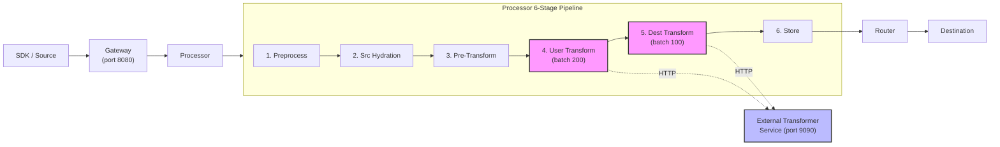
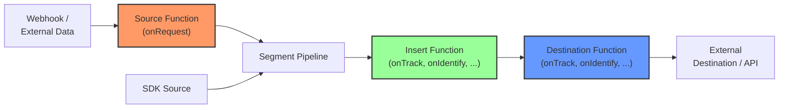
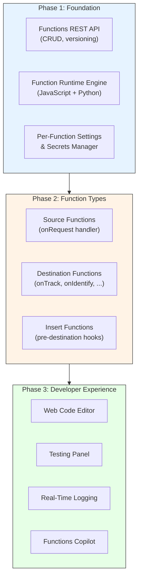

# Transformation/Functions Parity Analysis

> **Gap Report Dimension:** Functions & Transformations
> **Overall Parity:** ~40%
> **Gap Severity:** High
> **Last Updated:** Based on `rudder-server` v1.68.1 (Go 1.26.0)

## Executive Summary

RudderStack provides a powerful **transformation framework** built around an external Transformer service (port 9090) that supports both JavaScript and Python custom transformations. Events are processed in two pipeline stages — **user transforms** (batch size 200) and **destination transforms** (batch size 100) — within the Processor's six-stage pipeline.

Segment, by contrast, offers **Functions** — a self-contained, workspace-level function runtime powered by AWS Lambda that enables users to create custom sources, destinations, and pre-destination transformation hooks with just a few lines of JavaScript and no additional infrastructure.

**Overall parity is estimated at approximately 40%.** RudderStack has robust transformation capabilities but lacks the self-contained Functions model that Segment provides. The key gaps are:

- **No Source Functions** — RudderStack cannot receive and transform external webhook data via user-defined logic at the source level
- **No Insert Functions** — No per-destination, pre-delivery transformation hooks with event-specific typed handlers
- **No workspace-level Function management API** — No CRUD operations, versioning, or real-time logging for custom functions
- **No per-event typed handlers** — RudderStack processes transforms in batches, not per-event with handlers like `onTrack()` and `onIdentify()`

**RudderStack advantages** include Python runtime support (Segment is JavaScript-only) and efficient batch processing (200/100 event batches), which Segment does not natively provide.

**Key source citations:**
- `Source: processor/pipeline_worker.go:1-236` — 6-stage pipeline with user and destination transform channels
- `Source: processor/usertransformer/usertransformer.go:1-19` — User Transformer re-export
- `Source: processor/transformer/clients.go:1-89` — Transformer client interfaces (UserClient, DestinationClient, TrackingPlanClient, SrcHydrationClient)
- `Source: processor/internal/transformer/user_transformer/user_transformer.go:67` — User transform batch size (200)
- `Source: processor/internal/transformer/destination_transformer/destination_transformer.go:82` — Destination transform batch size (100)
- `Source: refs/segment-docs/src/connections/functions/index.md` — Segment Functions overview
- `Source: refs/segment-docs/src/connections/functions/source-functions.md` — Source Functions spec
- `Source: refs/segment-docs/src/connections/functions/destination-functions.md` — Destination Functions spec
- `Source: refs/segment-docs/src/connections/functions/insert-functions.md` — Insert Functions spec

---

## Architecture Comparison

### RudderStack Transformation Architecture

RudderStack's transformation framework is built as **pipeline stages within the Processor**, delegating transformation logic to an **external Transformer service** (default: `http://localhost:9090`). The Transformer is a separate containerized service (`rudderstack/rudder-transformer:latest`) that handles both user-defined custom transforms and destination-specific payload shaping.

**Key characteristics:**
- **Centralized service**: All transformations route through a single Transformer service
- **Batch-oriented**: User transforms process 200 events/batch; destination transforms process 100 events/batch
- **Dual language support**: JavaScript and Python runtimes via `USER_TRANSFORM_URL` and `PYTHON_TRANSFORM_URL` configuration
- **Pipeline integration**: Transforms are stages 4 and 5 of the 6-stage Processor pipeline, connected via Go channels
- **Source:** `processor/pipeline_worker.go:32-37` (channel initialization for user transform and destination transform stages)
- **Source:** `processor/internal/transformer/user_transformer/user_transformer.go:54-55` (`userTransformationURL` defaults to `http://localhost:9090`)

### Segment Functions Architecture

Segment Functions is a **distributed, Lambda-based function runtime** where functions are standalone workspace-scoped components that operate alongside (not within) the core event pipeline. Functions are powered by AWS Lambda on the backend and provide three distinct function types.

**Key characteristics:**
- **Distributed execution**: Each function runs as an independent AWS Lambda invocation
- **Event-oriented**: Functions process events individually with typed handlers (`onTrack()`, `onIdentify()`, etc.)
- **Three function types**: Source Functions (custom ingestion), Destination Functions (custom delivery), Insert Functions (pre-destination hooks)
- **Workspace-scoped**: Functions are managed per-workspace with CRUD API, versioning, and real-time logging
- **JavaScript-only**: ES6+ JavaScript runtime; no Python support
- **Source:** `refs/segment-docs/src/connections/functions/index.md:5` — Functions overview and capabilities

### Key Architectural Differences

| Dimension | RudderStack Transforms | Segment Functions |
|-----------|----------------------|-------------------|
| **Execution model** | Centralized external service (port 9090) | Distributed AWS Lambda invocations |
| **Processing mode** | Batch-oriented (200/100 events) | Event-oriented (per-event handlers) |
| **Pipeline integration** | Pipeline stages within Processor | Standalone components alongside pipeline |
| **Language support** | JavaScript + Python | JavaScript only |
| **Function types** | User transforms + Destination transforms | Source Functions + Destination Functions + Insert Functions |
| **Management** | Configuration-based | Full CRUD API with UI editor |
| **Scoping** | Service-level | Workspace-scoped |
| **Infrastructure** | Self-hosted Transformer service | Managed (AWS Lambda, no infrastructure needed) |

---

## Feature Comparison Matrix

The following matrix provides a comprehensive feature-by-feature comparison between Segment Functions and RudderStack's transformation framework.

| Feature | Segment Functions | RudderStack Transforms | Parity | Gap Severity |
|---------|------------------|----------------------|--------|--------------|
| **Source Functions** (custom source via webhook) | ✅ Full — `onRequest()` handler receives HTTP webhooks, creates events/objects | ❌ Not available — no custom source function runtime | 0% | **High** |
| **Destination Functions** (custom destination) | ✅ Full — event-specific handlers (`onTrack`, `onIdentify`, `onGroup`, `onPage`, `onScreen`, `onAlias`, `onDelete`, `onBatch`) | ⚠️ Partial — destination transforms shape payloads for existing connectors; no standalone custom destination runtime | 30% | **High** |
| **Insert Functions** (pre-destination transform) | ✅ Full — transform data before reaching downstream destinations with typed event handlers | ⚠️ Partial — user transforms modify events pre-routing but operate in batch mode without typed event handlers | 40% | **Medium** |
| **JavaScript runtime** | ✅ Full — ES6+ via AWS Lambda with `fetch()` polyfill | ✅ Supported — via external Transformer service | 80% | Low |
| **Python runtime** | ❌ Not available | ✅ Supported — Python transforms via `PYTHON_TRANSFORM_URL` | N/A (RS advantage) | None |
| **Environment variables/secrets** | ✅ Full — per-function settings and secrets, scoped to handler | ⚠️ Limited — config-level environment variables only, no per-function secrets | 30% | **Medium** |
| **Function management API** | ✅ Full — CRUD API for creating, updating, deleting, and listing functions via UI and API | ❌ Not available — no programmatic function management | 0% | **High** |
| **Function versioning** | ✅ Full — version history with ability to save and deploy independently | ❌ Not available | 0% | **Medium** |
| **Function logging** | ✅ Full — real-time `console.log()` output in test panel and production logs | ⚠️ Limited — Transformer service logs only (not per-function granularity) | 20% | **Medium** |
| **Per-event typed handlers** (`onTrack`, `onIdentify`, etc.) | ✅ Full — separate handler invocation per event type | ❌ Not available — batch-based processing without event-type routing | 0% | **Medium** |
| **External API requests from functions** | ✅ Full — HTTP `fetch()` within Lambda (node-fetch polyfill) | ⚠️ Limited — depends on Transformer service capabilities | 30% | **Medium** |
| **Error handling types** | ✅ Full — `EventNotSupported`, `InvalidEventPayload`, `ValidationError`, `RetryError`, `DropEvent` | ⚠️ Limited — generic transform error handling without typed error semantics | 20% | **Medium** |
| **Usage limits and monitoring** | ✅ Full — usage stats, billing, invocation counts | ❌ Not available — no per-function usage monitoring | 0% | Low |
| **Functions Copilot (AI-assisted)** | ✅ Full — AI-powered function generation | ❌ Not available | 0% | Low |
| **IP Allowlisting for functions** | ✅ Full — NAT gateway for outbound traffic (Business Tier) | ❌ Not available | 0% | Low |
| **Batch processing** | ⚠️ Partial — `onBatch` handler available for destination functions | ✅ Full — native batch processing (200/100 batch sizes) | N/A (RS advantage) | None |
| **Batching configuration** (max batch size, flush interval) | ✅ Configurable via function settings | ✅ Configurable via `Processor.UserTransformer.batchSize` / `Processor.DestinationTransformer.batchSize` | Full | None |

**Source:** `processor/internal/transformer/user_transformer/user_transformer.go:67` — `batchSize = conf.GetReloadableIntVar(200, ...)`
**Source:** `processor/internal/transformer/destination_transformer/destination_transformer.go:82` — `batchSize = conf.GetReloadableIntVar(100, ...)`
**Source:** `refs/segment-docs/src/connections/functions/destination-functions.md:44-52` — event-specific handlers list
**Source:** `refs/segment-docs/src/connections/functions/insert-functions.md:68-78` — insert function handlers list

---

## Source Functions Gap

### Segment Source Functions

Segment Source Functions enable users to **receive external data from webhooks** and create Segment events and objects using custom JavaScript logic — without setting up or maintaining any infrastructure.

**Core capabilities:**
- **Handler:** `onRequest(request, settings)` — receives an HTTPS request object and returns Segment events
- **Request processing:** Access to `request.json()`, `request.headers`, `request.url` for full HTTP request parsing
- **Event creation:** Can call `Segment.identify()`, `Segment.track()`, `Segment.group()`, `Segment.page()`, `Segment.screen()`, `Segment.alias()`, and `Segment.set()` (Object API) to create events
- **External API calls:** Full `fetch()` support for annotating or enriching incoming data
- **Settings and secrets:** Per-function configuration values scoped to the `onRequest()` handler
- **Workspace-scoped:** Functions are private to the workspace; other workspaces cannot view or use them

**Primary use cases:**
1. Ingest data into the pipeline from a source that is unavailable in the connector catalog
2. Transform or reject data before it is received by the pipeline
3. Enrich incoming data using external APIs before event creation

**Source:** `refs/segment-docs/src/connections/functions/source-functions.md:10-12` — Source function capabilities
**Source:** `refs/segment-docs/src/connections/functions/source-functions.md:35-42` — `onRequest()` handler definition and arguments

### RudderStack Equivalent

RudderStack's Gateway provides **webhook endpoints** that can receive external HTTP data, but there is **no custom transformation logic** at the source level. The Gateway accepts events conforming to the Segment Spec HTTP API format (`/v1/track`, `/v1/identify`, etc.) and passes them directly to the Processor pipeline.

**Current capabilities:**
- Webhook-based ingestion via Gateway HTTP endpoints (port 8080)
- All incoming data must already conform to the expected event payload format
- No user-defined `onRequest()` logic or custom event creation from arbitrary webhook payloads
- No programmatic source function management (no CRUD API for source functions)

**Workaround:** Users can deploy a separate webhook-to-event translation service in front of the Gateway, but this requires additional infrastructure management — negating the self-contained benefit that Segment Functions provides.

### Gap Assessment

| Aspect | Status | Detail |
|--------|--------|--------|
| Custom webhook reception | ⚠️ Partial | Gateway accepts webhooks but no custom transform logic |
| Event creation from arbitrary data | ❌ Missing | No `Segment.track()` / `Segment.identify()` equivalents in source functions |
| External API enrichment at source | ❌ Missing | No `fetch()` in source function context |
| Source function management API | ❌ Missing | No CRUD operations for source functions |

**Gap Severity: High** — Blocks adoption for customers relying on custom source ingestion from services not in the connector catalog.

---

## Destination Functions Gap

### Segment Destination Functions

Segment Destination Functions allow users to **transform events and send them to any external tool or API** with custom JavaScript logic, using event-specific handler functions.

**Core capabilities:**
- **Event-specific handlers:** `onIdentify()`, `onTrack()`, `onPage()`, `onScreen()`, `onGroup()`, `onAlias()`, `onDelete()`, `onBatch()`
- **Handler arguments:** Each handler receives `(event, settings)` where `event` is the typed Segment event object
- **External API delivery:** Full `fetch()` support (node-fetch polyfill) for sending data to external services
- **Error handling:** Typed error classes — `EventNotSupported`, `InvalidEventPayload`, `ValidationError`, `RetryError`, `DropEvent`
- **Batching:** Optional `onBatch(events, settings)` handler for efficient batch delivery
- **Variable scoping:** Settings must be scoped to handler functions, not declared globally (AWS Lambda execution model)
- **Testing:** Built-in test panel with sample events from workspace sources

**Primary use cases:**
1. Send data from the pipeline to a service unavailable in the destination catalog
2. Transform data before sending it to an external service
3. Enrich outgoing data using external APIs

**Source:** `refs/segment-docs/src/connections/functions/destination-functions.md:9` — Destination function capabilities
**Source:** `refs/segment-docs/src/connections/functions/destination-functions.md:44-52` — Handler list (onIdentify, onTrack, onPage, onScreen, onGroup, onAlias, onDelete, onBatch)
**Source:** `refs/segment-docs/src/connections/functions/destination-functions.md:62-74` — Example `onTrack` handler with `fetch()`

### RudderStack Equivalent

RudderStack provides **destination transforms** that shape payloads for specific destination connectors. These transforms are executed via the external Transformer service in the fifth stage of the Processor pipeline.

**Current capabilities:**
- **Destination transforms** shape event payloads for each configured destination connector
- **User transforms** can modify events before routing (fourth pipeline stage, batch size 200)
- Both transform types communicate with the external Transformer service via HTTP
- Transforms operate on **batches of events** (100 events/batch for destination transforms)
- No standalone custom destination function runtime — transforms are tied to existing connector definitions
- No event-specific typed handlers (`onTrack`, `onIdentify`, etc.) — all events in a batch are processed uniformly

**Source:** `processor/transformer/clients.go:20-22` — `DestinationClient` interface: `Transform(ctx, events) Response`
**Source:** `processor/transformer/clients.go:24-26` — `UserClient` interface: `Transform(ctx, events) Response`
**Source:** `processor/transformer/clients.go:36-42` — `Clients` struct aggregating user, destination, trackingplan, and srcHydration clients
**Source:** `processor/pipeline_worker.go:175-188` — Destination transform goroutine receiving from `destinationtransform` channel

### Gap Assessment

| Aspect | Status | Detail |
|--------|--------|--------|
| Custom destination delivery logic | ⚠️ Partial | Destination transforms shape payloads, but no standalone custom dest function runtime |
| Event-specific handlers (`onTrack`, etc.) | ❌ Missing | Batch processing model; no per-event type routing |
| External API `fetch()` from functions | ⚠️ Partial | Transformer service capabilities, not user-controlled `fetch()` |
| Typed error handling (`RetryError`, `DropEvent`) | ❌ Missing | No equivalent error type semantics in user-defined transforms |
| Built-in testing panel | ❌ Missing | No in-platform function testing UI |
| `onBatch` handler | ⚠️ Partial | RudderStack natively batches, but no user-defined batch handler |

**Gap Severity: High** — Limits ability to support custom destination integrations without writing and deploying new connector code in the `rudder-transformer` service.

---

## Insert Functions Gap

### Segment Insert Functions

Segment Destination Insert Functions enable users to **enrich, transform, or filter data before it reaches downstream destinations** — acting as a pre-destination hook that intercepts events after they leave the source pipeline but before they are delivered to a specific destination.

**Core capabilities:**
- **Event-specific handlers:** `onIdentify()`, `onTrack()`, `onPage()`, `onScreen()`, `onGroup()`, `onAlias()`, `onDelete()`, `onBatch()`
- **Return event to continue:** Handlers must `return event` to forward the (potentially modified) event to the downstream destination
- **Drop events:** Throw `DropEvent` error to prevent delivery to the destination
- **Error types:** `EventNotSupported`, `InvalidEventPayload`, `ValidationError`, `RetryError`, `DropEvent`
- **Per-destination scoping:** Each insert function is connected to a specific destination
- **Data compliance:** Supports PII masking, encryption/decryption, tokenization before delivery
- **Single event return:** Unlike Source/Destination Functions, Insert Functions return exactly one event per invocation

**Primary use cases:**
1. Implement custom logic and enrich data with third-party sources before delivery
2. Transform outgoing data with advanced filtration and computation
3. Ensure data compliance by performing tokenization, encryption, or decryption
4. Customize filtration for destinations with nested if-else statements, regex, and custom business rules

**Source:** `refs/segment-docs/src/connections/functions/insert-functions.md:6-13` — Insert function capabilities
**Source:** `refs/segment-docs/src/connections/functions/insert-functions.md:68-78` — Handler list and specification
**Source:** `refs/segment-docs/src/connections/functions/insert-functions.md:120-180` — Error types (EventNotSupported, InvalidEventPayload, ValidationError, RetryError, DropEvent)

### RudderStack Equivalent

RudderStack's **user transforms** (pipeline stage 4) provide the closest equivalent to Insert Functions. User transforms execute before destination-specific routing and can modify, enrich, or filter events.

**Current capabilities:**
- User transforms process events in **batches of 200** via the external Transformer service
- Transforms can modify event payloads, add properties, or filter events
- Custom JavaScript and Python transformation code supported
- Transforms apply globally to all events in the pipeline, not scoped to a specific destination
- No per-event typed handlers (`onTrack`, `onIdentify`, etc.)
- No typed error semantics for dropping or retrying individual events

**Source:** `processor/pipeline_worker.go:160-173` — User transformation goroutine processing events from `usertransform` channel
**Source:** `processor/internal/transformer/user_transformer/user_transformer.go:67` — User transform batch size: `conf.GetReloadableIntVar(200, 1, "Processor.UserTransformer.batchSize", "Processor.userTransformBatchSize")`

### Gap Assessment

| Aspect | Status | Detail |
|--------|--------|--------|
| Pre-destination transformation | ⚠️ Partial | User transforms modify events pre-routing but are not per-destination scoped |
| Event-specific handlers | ❌ Missing | Batch-based processing without typed event routing |
| Per-destination scoping | ❌ Missing | User transforms apply globally, not per-destination |
| Event drop/filter semantics | ⚠️ Partial | Transforms can filter, but no typed `DropEvent` error |
| PII masking / encryption | ⚠️ Partial | Can be implemented in user transforms, but no built-in support |
| Return-event-to-continue model | ❌ Missing | Batch model; no per-event return semantics |

**Gap Severity: Medium** — User transforms partially cover this use case, but the lack of per-destination scoping and typed event handlers limits the developer experience and use case coverage compared to Segment Insert Functions.

---

## Developer Experience Comparison

A critical differentiator beyond raw feature parity is the **developer experience** for creating, testing, and managing transformation logic.

| Developer Experience Feature | Segment Functions | RudderStack Transforms |
|------------------------------|------------------|----------------------|
| **In-browser code editor** | ✅ Full IDE-like editor with syntax highlighting | ❌ Not available (code deployed to Transformer service) |
| **Built-in testing** | ✅ Test tab with sample events and real-time output | ❌ Not available (requires external testing) |
| **Template library** | ✅ Pre-built function templates and open-source library | ❌ No template catalog |
| **Real-time logs** | ✅ `console.log()` output visible in UI | ⚠️ Limited (Transformer service logs) |
| **Settings management** | ✅ Per-function settings with UI configuration | ❌ Config-level only |
| **Version control** | ✅ Built-in version history with save/deploy separation | ❌ Not available |
| **Function catalog** | ✅ Functions tab in Connections Catalog | ❌ No function discovery UI |
| **Functions Copilot** | ✅ AI-assisted function generation | ❌ Not available |

**Source:** `refs/segment-docs/src/connections/functions/index.md:55-59` — Functions Copilot description
**Source:** `refs/segment-docs/src/connections/functions/source-functions.md:22-32` — Code editor and testing UI

---

## RudderStack Advantages

While the overall parity assessment favors Segment in the Functions category, RudderStack's transformation framework has several notable advantages:

### 1. Python Runtime Support

RudderStack supports **Python transforms** in addition to JavaScript, which Segment does not offer. This is significant for data engineering teams that prefer Python for data manipulation tasks.

- **Configuration:** `PYTHON_TRANSFORM_URL` — separate Python transformation service endpoint
- **Version control:** Configurable per-version Python transform enablement via `PYTHON_TRANSFORM_VERSION_IDS`
- **Source:** `processor/internal/transformer/user_transformer/user_transformer.go:55-62` — Python URL configuration

### 2. Native Batch Processing

RudderStack's batch-oriented transform model provides **higher throughput** for high-volume pipelines:

- **User transforms:** 200 events per batch (configurable via `Processor.UserTransformer.batchSize`)
- **Destination transforms:** 100 events per batch (configurable via `Processor.DestinationTransformer.batchSize`)
- Segment Functions process events individually by default; `onBatch` is optional and not universally supported

### 3. Self-Hosted Transformer Service

RudderStack's external Transformer service (`rudderstack/rudder-transformer:latest`) runs in the customer's own infrastructure, providing:

- **Data residency:** All transformation logic executes within the customer's environment
- **Custom extensions:** The Transformer service can be extended with custom destination-specific transformation modules
- **No vendor lock-in:** The Transformer is open-source and can be modified or replaced
- **Source:** `docker-compose.yml` — Transformer service definition on port 9090

### 4. Configurable Retry and Timeout Behavior

RudderStack provides extensive configuration for transformation resilience:

- **Max retries:** `Processor.UserTransformer.maxRetry` (default: 30)
- **Retry backoff:** `Processor.UserTransformer.maxRetryBackoffInterval` (default: 30s)
- **Timeout:** `HttpClient.procTransformer.timeout` (default: 600s)
- **Fail-on-error toggle:** `Processor.UserTransformer.failOnError` (default: false)
- **Source:** `processor/internal/transformer/user_transformer/user_transformer.go:64-68` — Retry and timeout configuration

---

## Gap Summary

The following table consolidates all identified gaps with severity ratings, remediation recommendations, and estimated implementation effort.

| Gap ID | Description | Severity | Remediation | Est. Effort |
|--------|------------|----------|-------------|-------------|
| **FN-001** | No Source Functions runtime — cannot receive webhooks and create events via custom logic | **High** | Implement a Lambda-compatible source function execution engine with `onRequest()` handler support, event creation API (`Segment.track()`, `Segment.identify()`, etc.), and external `fetch()` capability | Large |
| **FN-002** | No Destination Functions runtime — cannot define custom destination delivery logic | **High** | Implement per-event destination function execution with typed handlers (`onTrack`, `onIdentify`, `onGroup`, `onPage`, `onScreen`, `onAlias`, `onDelete`, `onBatch`) | Large |
| **FN-003** | No Insert Functions — no per-destination, pre-delivery transformation hooks | **Medium** | Extend user transform pipeline with per-destination scoped insert hooks supporting typed event handlers and event return semantics | Medium |
| **FN-004** | No Function management API (CRUD) — no programmatic function lifecycle management | **High** | Implement Functions REST API for creating, reading, updating, deleting, and listing functions with workspace scoping | Medium |
| **FN-005** | No per-event typed handlers (`onTrack`, `onIdentify`, etc.) — batch-only processing | **Medium** | Add event-type routing within the function execution runtime to dispatch events to type-specific handlers | Medium |
| **FN-006** | Limited environment variable/secret management — config-level only, not per-function | **Medium** | Implement per-function settings and secrets management with scoped access at the handler level | Small |
| **FN-007** | No function versioning — no version history or rollback capability | **Medium** | Add version history tracking with save/deploy separation and rollback support | Small |
| **FN-008** | No function real-time logging — no per-function `console.log()` visibility | **Medium** | Expose per-function log streams via API, aggregating Transformer service logs by function ID | Small |
| **FN-009** | No typed error handling semantics — no `RetryError`, `DropEvent`, etc. | **Medium** | Implement typed error classes within the function runtime for explicit event disposition control | Small |
| **FN-010** | No in-browser function editor or testing UI | Low | Implement web-based code editor with testing panel and sample event selection | Medium |
| **FN-011** | No Functions Copilot (AI-assisted function generation) | Low | Evaluate AI integration for function scaffolding and generation | Small |
| **FN-012** | No IP Allowlisting for function outbound traffic | Low | Implement NAT gateway for function egress traffic control | Medium |

### Priority Summary

| Priority | Gap Count | Key Items |
|----------|-----------|-----------|
| **High** | 3 gaps (FN-001, FN-002, FN-004) | Source Functions, Destination Functions, Management API |
| **Medium** | 6 gaps (FN-003, FN-005, FN-006, FN-007, FN-008, FN-009) | Insert Functions, typed handlers, secrets, versioning, logging, errors |
| **Low** | 3 gaps (FN-010, FN-011, FN-012) | Editor UI, Copilot, IP Allowlisting |

---

## Remediation Architecture Recommendation

To close the Functions parity gap, we recommend the following implementation approach:

**Implementation dependencies:**
1. **Functions REST API** (FN-004) must be built first as the management layer for all function types
2. **Function Runtime Engine** extends the existing Transformer service with per-event handler dispatch
3. **Source Functions** (FN-001) and **Destination Functions** (FN-002) can be implemented in parallel once the runtime is available
4. **Insert Functions** (FN-003) extend the existing user transform pipeline with per-destination scoping

---

## Cross-References

- [Gap Report Index](./index.md) — Executive summary of all Segment parity gaps
- [Sprint Roadmap](./sprint-roadmap.md) — Epic sequencing for gap closure (Sprints 4-6: Transformation/Functions)
- [Transformation Architecture Overview](../guides/transformations/overview.md) — Detailed guide on RudderStack's transformation system
- [User Transforms Guide](../guides/transformations/user-transforms.md) — JavaScript/Python custom transformation developer guide
- [Destination Transforms Guide](../guides/transformations/destination-transforms.md) — Destination-specific payload transformation reference
- [Functions Guide](../guides/transformations/functions.md) — Segment Functions equivalent documentation with gap analysis

---

## Appendix: Source Code Reference Summary

| Component | File Path | Key Lines | Description |
|-----------|-----------|-----------|-------------|
| Pipeline Worker | `processor/pipeline_worker.go` | 19-46, 76-229 | 6-stage pipeline with user transform (stage 4) and destination transform (stage 5) channels |
| User Transformer Client | `processor/usertransformer/usertransformer.go` | 1-19 | Re-exports internal `user_transformer` package as public `Client` type |
| Transformer Clients | `processor/transformer/clients.go` | 20-50 | Interfaces: `DestinationClient`, `UserClient`, `TrackingPlanClient`, `SrcHydrationClient`, `TransformerClients` |
| User Transformer Impl | `processor/internal/transformer/user_transformer/user_transformer.go` | 47-67 | Client constructor with URL config, Python support, batch size (200), retry settings |
| Dest Transformer Impl | `processor/internal/transformer/destination_transformer/destination_transformer.go` | 73-82 | Client constructor with URL config, batch size (100), retry settings |
| Processor Handle | `processor/processor.go` | 78-79, 169 | Constants `UserTransformation` and `DestTransformation`, `transformerURL` config |
