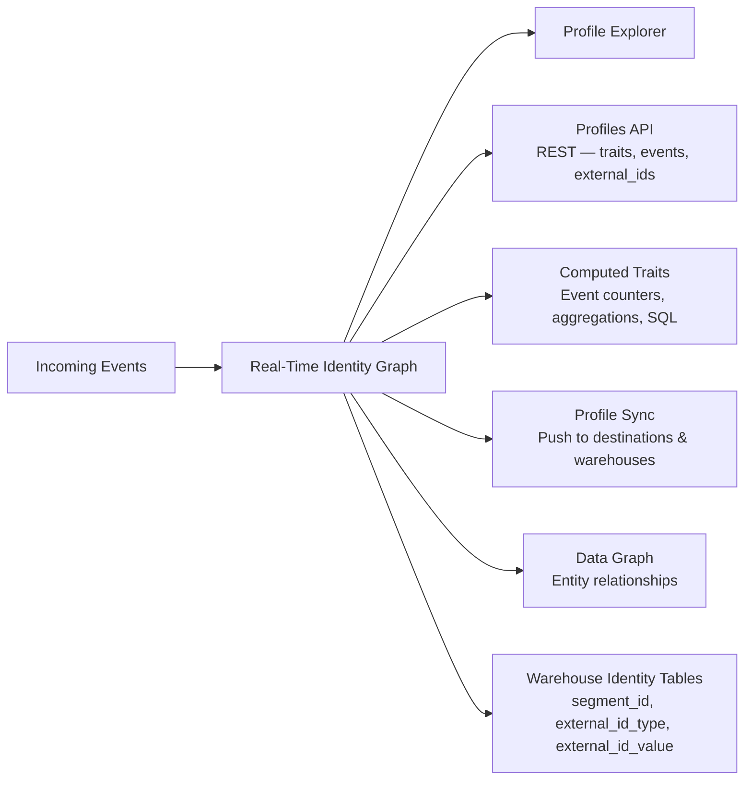
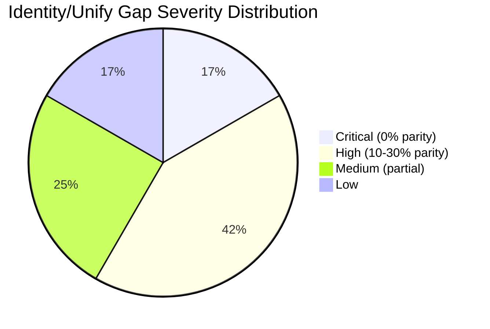
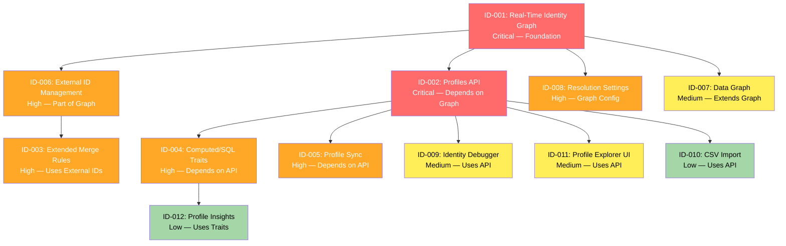

# Identity Resolution / Unify Parity Analysis

> **Gap Severity: Critical (~20% parity)**
> This is the largest identified gap between RudderStack and Twilio Segment.

## Executive Summary

RudderStack's identity resolution capability is limited to **warehouse-only merge-rule resolution**, implemented in `warehouse/identity/identity.go`. The resolution process runs exclusively during warehouse upload cycles using a two-property merge-rule model stored in PostgreSQL tables within the warehouse schema. Identity is resolved in batch — there is no real-time identity graph, no programmatic API for querying resolved profiles, and no computed trait infrastructure.

Segment Unify, by contrast, provides a **comprehensive real-time identity resolution platform** encompassing a persistent identity graph, the Profiles API (REST), computed and SQL traits, profile sync to downstream destinations, a data graph for entity relationships, external ID management across 12+ default identifier types, and configurable resolution settings with merge protection, priority, and limit controls.

The architectural gap is fundamental: RudderStack resolves identity **only during warehouse loads** (batch), while Segment resolves identity **in real-time as events arrive**. This gap affects every downstream capability that depends on unified profiles — personalization, audience building, profile-level analytics, and cross-device attribution.

**Key findings:**

| Metric | Value |
|--------|-------|
| Overall parity | ~20% |
| Critical gaps (0% parity) | 8 features |
| High-severity gaps | 5 features |
| RudderStack-unique capabilities | None identified |
| Estimated remediation effort | Very Large (multiple sprints) |

**Source:** `warehouse/identity/identity.go:1-632`, `refs/segment-docs/src/unify/`

---

## Architecture Comparison

The fundamental architectural difference between RudderStack and Segment in identity resolution is the resolution timing and scope. RudderStack performs identity resolution as a stage within the warehouse upload state machine, while Segment maintains a real-time identity graph that resolves identity as events flow through the pipeline.

### RudderStack Identity Resolution (Warehouse-Only)


**Resolution flow:** `Source: warehouse/identity/identity.go:600-616`

The `Resolve()` method orchestrates the entire process within a single PostgreSQL transaction:

1. Download merge rule load files for the current upload (`line 606-613`)
2. Call `processMergeRules()` which begins a transaction (`line 513-514`)
3. `addRules()` stages new merge rules into a temp table, deduplicates against existing rules, and inserts distinct new rules (`line 208-397`)
4. For each new rule, `applyRule()` queries the two merge properties and either creates a new `rudder_id` or unifies existing ones (`line 78-206`)
5. Upload resulting merge rules and mappings files to object storage (`line 568-588`)
6. Commit the transaction (`line 590-596`)

### Segment Unify (Real-Time)



**Resolution flow:** `Source: refs/segment-docs/src/unify/identity-resolution/index.md`

Segment's Identity Graph processes events in real-time using flat matching logic:

1. When a new event arrives, Segment looks for profiles matching any identifiers on the event
2. **No match** → Create a new profile with a persistent `segment_id`
3. **Single match** → Map traits, identifiers, and events to the existing profile
4. **Multiple matches** → Attempt to merge profiles per Identity Resolution rules (blocked values, limits, priority)

### Key Architectural Differences

| Dimension | RudderStack | Segment Unify |
|-----------|------------|---------------|
| **Resolution timing** | Batch (warehouse upload cycle) | Real-time (as events arrive) |
| **Resolution scope** | Per-warehouse schema | Workspace-scoped (cross-destination) |
| **API access** | Warehouse SQL queries only | Profiles API (REST, <200ms response) |
| **Resolution model** | Two-property merge rules (`merge_property_1` ↔ `merge_property_2`) | Full identity graph with multiple external IDs, priority, limits |
| **Storage** | PostgreSQL tables per warehouse | Persistent identity graph database |
| **Identifier types** | `merge_property_type` / `merge_property_value` pairs | 12+ default external ID types + custom identifiers |
| **Identity persistence** | `rudder_id` (UUID, generated per merge) | `segment_id` (persistent, globally unique) |
| **Merge protection** | None — rules applied sequentially | Blocked values, identifier limits, priority-based conflict resolution |
| **Downstream consumption** | Warehouse queries | Profiles API, Profile Sync, Computed Traits, Audiences |

`Source: warehouse/identity/identity.go:36-79` (RudderStack), `Source: refs/segment-docs/src/unify/identity-resolution/identity-resolution-settings.md` (Segment)

---

## Feature Comparison Matrix

The following table provides a comprehensive feature-by-feature comparison between Segment Unify and RudderStack's identity resolution capabilities.

| Feature | Segment Unify | RudderStack | Parity | Gap Severity |
|---------|--------------|-------------|--------|--------------|
| Real-time identity graph | ✅ Full — cross-touchpoint, cross-device, real-time merging with persistent `segment_id` | ❌ Not available — resolution only during warehouse uploads | 0% | **Critical** |
| Profiles API | ✅ Full REST API — traits, events, external_ids, metadata; <200ms response; paginated | ❌ Not available — no programmatic profile access | 0% | **Critical** |
| Warehouse identity resolution | ✅ Identity tables in warehouse (`users_identities` with `segment_id`, `external_id_type`, `external_id_value`, `merged_at`) | ✅ Merge rules + mappings tables (`identity_merge_rules`, `identity_mappings` with `rudder_id`) | 60% | Medium |
| Merge rules | ✅ Configurable — custom rules, merge protection, blocked values, per-identifier limits, priority ranking | ⚠️ Two-property merge rules — fixed `merge_property_1` ↔ `merge_property_2` logic, no configurable protection | 30% | **High** |
| External ID management | ✅ Full — 12+ default types (`user_id`, `email`, `anonymous_id`, `ios.id`, `android.id`, etc.) + custom identifiers via `context.externalIds` | ❌ Not available — limited to `merge_property_type` / `merge_property_value` pairs | 0% | **High** |
| Computed traits | ✅ Full — event counters, aggregations (sum/avg/min/max), most frequent, first/last, unique list; configurable windows | ❌ Not available | 0% | **High** |
| SQL traits | ✅ Full — custom SQL queries against warehouse data imported back into Segment profiles; 25 columns, 25M row limit | ❌ Not available | 0% | **High** |
| Profile sync to destinations | ✅ Full — sync resolved profiles to warehouse and downstream destinations continuously | ❌ Not available | 0% | **High** |
| Data graph | ✅ Entity relationships between profiles and accounts; linked users/accounts queries | ❌ Not available | 0% | Medium |
| Identity resolution settings | ✅ Merge protection (blocked values regex/exact match), per-identifier limits (weekly/monthly/annually/ever), priority ranking | ❌ Limited — fixed merge rule logic, no configurable protection | 10% | **High** |
| Profile explorer | ✅ Full UI — event history, traits, identities, audiences for each profile | ❌ Not available | 0% | Medium |
| CSV upload for identity | ✅ Bulk profile import with validation | ❌ Not available | 0% | Low |
| Identity debugger | ✅ Visual identity resolution debugger — inspect merge reasons, external IDs on events | ❌ Not available | 0% | Medium |
| Event filtering per profile | ✅ Space-level FQL event filtering rules | ❌ Not available at profile level | 0% | Low |
| Profile insights | ✅ Profile-level analytics — violations, errors, audit logs | ❌ Not available | 0% | Low |
| Predictions | ✅ ML-based trait predictions (LTV, churn, purchase likelihood) | ❌ Not available | 0% | Low |
| Audiences (overlaps with Engage) | ✅ Full audience building from traits and events | ❌ Not available — **Phase 2 scope** | 0% | Phase 2 |
| Profiles Sync to warehouse | ✅ Continuous sync of identity-resolved profiles to connected warehouses | ❌ Not available (warehouse has own identity tables, but no upstream sync) | 0% | Medium |

`Source: warehouse/identity/identity.go:36-79` (RudderStack merge rule model)
`Source: refs/segment-docs/src/unify/index.md` (Segment Unify capabilities overview)

---

## Current RudderStack Identity Implementation

### Overview

RudderStack's identity resolution is implemented in the `warehouse/identity/` package. It runs as a stage within the warehouse upload state machine — specifically during the identity merge phase of an upload. There is no standalone identity service, no real-time resolution, and no API for querying resolved identities.

`Source: warehouse/identity/identity.go:1-632`

### Core Components

#### `WarehouseManager` Interface

```go
type WarehouseManager interface {
    DownloadIdentityRules(context.Context, *misc.GZipWriter) error
}
```

The `WarehouseManager` interface abstracts the warehouse-specific operation of downloading existing identity rules from the warehouse. Each warehouse connector implements this interface to provide its identity rule download logic.

`Source: warehouse/identity/identity.go:36-38`

#### `Identity` Struct

```go
type Identity struct {
    warehouse        model.Warehouse
    db               *sqlmiddleware.DB
    uploader         warehouseutils.Uploader
    uploadID         int64
    warehouseManager WarehouseManager
    downloader       downloader.Downloader
    encodingFactory  *encoding.Factory
}
```

The `Identity` struct holds all dependencies required for identity resolution:

- `warehouse` — the target warehouse model (type, credentials, namespace)
- `db` — PostgreSQL database connection (local staging database, not the warehouse itself)
- `uploader` — handles file upload to object storage
- `uploadID` — the current warehouse upload identifier
- `warehouseManager` — warehouse-specific identity rule download
- `downloader` — load file downloader for merge rule files
- `encodingFactory` — creates event loaders for Parquet/JSON/CSV encoding

`Source: warehouse/identity/identity.go:40-48`

### Table Schema

RudderStack creates two tables per warehouse schema for identity resolution:

**`identity_merge_rules` Table:**

| Column | Type | Description |
|--------|------|-------------|
| `id` | `SERIAL` | Auto-incremented rule identifier |
| `merge_property_1_type` | `TEXT` | Type of the first merge property (e.g., `user_id`, `email`) |
| `merge_property_1_value` | `TEXT` | Value of the first merge property |
| `merge_property_2_type` | `TEXT` | Type of the second merge property (nullable) |
| `merge_property_2_value` | `TEXT` | Value of the second merge property (nullable) |

**`identity_mappings` Table:**

| Column | Type | Description |
|--------|------|-------------|
| `merge_property_type` | `TEXT` | Type of the identity property |
| `merge_property_value` | `TEXT` | Value of the identity property |
| `rudder_id` | `TEXT` | Unified identity UUID |
| `updated_at` | `TIMESTAMP` | Last update timestamp |

`Source: warehouse/identity/identity.go:62-75` (table name generation), `Source: warehouse/identity/identity.go:78-206` (column usage in `applyRule`)

### Resolution Algorithm: `applyRule()`

The `applyRule()` function is the core of RudderStack's identity resolution. For each new merge rule, it:

1. **Fetches the rule properties** — reads `merge_property_1_type/value` and `merge_property_2_type/value` from the merge rules table (`line 79-85`)
2. **Queries existing mappings** — looks up all `rudder_id` values in the mappings table that match either property (`line 87-101`)
3. **Applies one of three resolution strategies:**
   - **No existing `rudder_id`** → Generates a new UUID via `misc.FastUUID()` and inserts both properties with the new ID (`line 109-136`)
   - **One existing `rudder_id`** → Reuses the existing ID and inserts any new property mappings (`line 114-116`)
   - **Multiple existing `rudder_id`s** → Unifies all properties under the first `rudder_id`, updates all existing mappings, and inserts new ones (`line 137-195`)
4. **Writes results** to a gzip-compressed load file for upload to the warehouse (`line 196-203`)

`Source: warehouse/identity/identity.go:78-206`

### Public API: `Resolve()` and `ResolveHistoricIdentities()`

```go
// Resolve does the below things in a single pg txn
// 1. Fetch all new merge rules added in the upload
// 2. Append to local identity merge rules table
// 3. Apply each merge rule and update local identity mapping table
// 4. Upload the diff of each table to load files for both tables
func (idr *Identity) Resolve(ctx context.Context) (err error)
```

- `Resolve()` — processes merge rules from the current upload's load files (`line 600-616`)
- `ResolveHistoricIdentities()` — downloads and processes all historical identity rules from the warehouse (`line 618-631`)

`Source: warehouse/identity/identity.go:600-631`

### Limitations

| Limitation | Description |
|-----------|-------------|
| **Batch-only resolution** | Identity is resolved only during warehouse uploads — there is no real-time resolution as events flow through the pipeline |
| **Two-property merge model** | Each rule can only link two properties (merge_property_1 ↔ merge_property_2); no support for multi-property or graph-based resolution |
| **No merge protection** | No blocked values, no identifier limits, no priority ranking — all rules are applied sequentially |
| **No API access** | Resolved identities are only queryable via direct warehouse SQL; no REST or gRPC API for profiles |
| **Warehouse-scoped** | Identity resolution is per-warehouse — no cross-warehouse or workspace-level identity graph |
| **No trait management** | No computed traits, SQL traits, or profile enrichment capabilities |
| **No profile sync** | Resolved identities exist only in the warehouse; no mechanism to push resolved profiles to other destinations |

---

## Segment Unify Capabilities

This section details Segment Unify's full capability set, drawn from the Segment documentation reference at `refs/segment-docs/src/unify/`.

### Identity Resolution and Identity Graph

Segment's Identity Graph merges the complete history of each customer into a single profile in real-time, across web, mobile, server, and third-party touch-points. The graph supports cookie IDs, device IDs, emails, and custom external IDs with anonymous identity stitching.

**Key highlights:**

- **All channels supported** — stitches web, mobile, server, and third-party interactions
- **Anonymous identity stitching** — merges child sessions into parent sessions
- **User-account relationships** — generates graph of relationships between users and accounts (B2B)
- **Real-time performance** — reliable real-time data stream merges with minimal latency
- **Persistent ID** — multiple external IDs map to one persistent `segment_id`

**Flat matching logic** when a new event arrives:

1. **No match** → Create new profile with persistent `segment_id`
2. **Single match** → Add traits, identifiers, and events to existing profile
3. **Multiple matches** → Attempt merge per Identity Resolution rules

`Source: refs/segment-docs/src/unify/identity-resolution/index.md`

### External ID Management

Segment automatically promotes 12+ default identifier types from event payloads to external IDs:

| External ID Type | Message Location |
|------------------|-----------------|
| `user_id` | `userId` |
| `email` | `traits.email`, `context.traits.email`, `properties.email` |
| `anonymous_id` | `anonymousId` |
| `android.id` | `context.device.id` (when `context.device.type = 'android'`) |
| `android.idfa` | `context.device.advertisingId` (when Android + adTrackingEnabled) |
| `android.push_token` | `context.device.token` (when Android) |
| `ios.id` | `context.device.id` (when `context.device.type = 'ios'`) |
| `ios.idfa` | `context.device.advertisingId` (when iOS + adTrackingEnabled) |
| `ios.push_token` | `context.device.token` (when iOS) |
| `ga_client_id` | `context.integrations['Google Analytics'].clientId` |
| `cross_domain_id` | `cross_domain_id` (when XID enabled) |
| `braze_id` | `context.Braze.braze_id` (when Braze connected) |

Custom external IDs can be added via the `context.externalIds` array with required fields: `id`, `type`, `collection`, `encoding`.

`Source: refs/segment-docs/src/unify/identity-resolution/externalids.md`

### Identity Resolution Settings

Segment provides three configurable resolution rules:

1. **Blocked Values** — Proactively block values from being used as identifiers (regex and exact match). Default suggestions: zeroes/dashes pattern, `-1`, `null`, `anonymous`.
2. **Limits** — Maximum number of values allowed per identifier type per profile within a time window (e.g., `user_id: 1 ever`, `anonymous_id: 5 weekly`, `email: 5 annually`).
3. **Priority** — Ranking of identifier types for conflict resolution. Default: `user_id` (1) > `email` (2) > all others alphabetically (3+). When a merge would exceed an identifier's limit, the lower-priority identifier on the event is demoted.

`Source: refs/segment-docs/src/unify/identity-resolution/identity-resolution-settings.md`

### Profiles API

Segment's Profile API provides a REST interface for programmatic access to resolved profiles:

**Base endpoint:** `https://profiles.segment.com/v1/spaces/<space_id>/collections/users/profiles/<external_id>/`

**Available sub-resources:**

| Resource | Endpoint | Description |
|----------|----------|-------------|
| Traits | `/traits` | User traits (up to 200 per request) |
| Events | `/events` | User event history |
| External IDs | `/external_ids` | All identifiers for a profile |
| Metadata | `/metadata` | `created_at`, `updated_at`, and more |
| Links | `/links` (on accounts) | Linked users/accounts (up to 20) |

**Characteristics:**

- **Sub-200ms response times** for trait lookups
- **Real-time data** — queries streaming data on the profile
- **Any external ID** — supports `user_id`, advertising IDs, `anonymous_id`, and custom external IDs
- **Authentication** — HTTP Basic Auth with access token, server-side only
- **Rate limit** — 100 requests/sec per space (configurable)
- **Pagination** — cursor-based with `next` and `limit` parameters

`Source: refs/segment-docs/src/unify/profile-api.md`

### Identity Warehouse Tables

Segment's Identity Warehouse exports all identifiers to a warehouse table (`users_identities`) with the following schema:

| Column | Description |
|--------|-------------|
| `segment_id` | Persistent profile identifier |
| `external_id_type` | Type of external ID (email, user_id, etc.) |
| `external_id_value` | Value of the external ID |
| `created_source` | Source key that sent the message |
| `created_at` | When the mapping was created |
| `merged_at` | Timestamp of profile merge |
| `merged_from` | Previous `segment_id` before merge |
| `synced_at` | When data was synced to the identities source |

`Source: refs/segment-docs/src/unify/identity-resolution/identity-warehouse.md`

### Computed and SQL Traits

Segment Unify supports automated trait computation:

**Computed Traits** — drag-and-drop interface for per-user or per-account calculations:

- **Event Counter** — count of events over a time window (e.g., `orders_last_30_days`)
- **Aggregation** — sum, average, min, max of numeric event properties (e.g., `total_revenue_90_days`)
- **Most Frequent** — most common value for an event property (e.g., `preferred_category`)
- **First / Last** — first or last value of an event property (e.g., `first_purchase_date`)
- **Unique List / Unique List Count** — distinct values or count of distinct values
- **Predictions** — ML-based (LTV, churn, purchase likelihood)

**SQL Traits** — custom SQL queries against warehouse data:

- Supported warehouses: Redshift, Postgres, Snowflake, Azure SQL, BigQuery
- Limits: 25 columns, 25M rows, 16KB payload per trait
- Scheduling: twice daily default, optional hourly

`Source: refs/segment-docs/src/unify/Traits/computed-traits.md`, `Source: refs/segment-docs/src/unify/Traits/sql-traits.md`

### Profile Sync

Profiles Sync connects identity-resolved customer profiles to a data warehouse of your choice, enabling:

- Identity graph monitoring and merge analysis
- Attribution analysis across anonymous and identified sessions
- Golden profile creation (join Segment profile data with existing warehouse data)
- Machine learning on profile traits over time

`Source: refs/segment-docs/src/unify/profiles-sync/overview.md`

### Data Graph

Segment's Data Graph provides entity relationship modeling:

- Relationships between profiles (users) and accounts (groups)
- Linked Events for cross-entity event correlation
- Warehouse-specific setup guides (BigQuery, Databricks, Redshift, Snowflake)

`Source: refs/segment-docs/src/unify/data-graph/` (directory)

> **Note:** Audiences are part of Segment Engage and are **explicitly out of scope for Phase 1** per AAP §0.10. They are deferred to Phase 2.

---

## Gap Summary and Remediation

### Consolidated Gap Inventory

| Gap ID | Description | Severity | Remediation | Est. Effort |
|--------|------------|----------|-------------|-------------|
| **ID-001** | No real-time identity graph — resolution only during warehouse uploads | **Critical** | Implement a persistent identity graph service that resolves identity in real-time as events flow through the pipeline. Requires new service with graph database or indexed identity store, event-driven merge logic, and persistent `segment_id` equivalent. | Very Large |
| **ID-002** | No Profiles API — no programmatic access to resolved profiles | **Critical** | Implement a REST API service providing access to unified profiles, traits, events, and external IDs. Must support sub-200ms response, cursor-based pagination, and authentication via access tokens. | Large |
| **ID-003** | Limited merge rules — two-property only, no configurable protection | **High** | Extend the merge rule model to support: (a) configurable matching strategies beyond two-property pairs, (b) blocked values with regex/exact match, (c) per-identifier limits with time windows, (d) priority-based conflict resolution. | Medium |
| **ID-004** | No computed traits or SQL traits | **High** | Implement a trait computation engine supporting event-based aggregations (counters, sum, avg, min, max, most frequent, first/last, unique list) and SQL-based trait import from warehouse data. | Large |
| **ID-005** | No profile sync to destinations | **High** | Implement a profile sync pipeline that continuously pushes resolved profiles to downstream destinations and warehouses. Requires change-data-capture on the identity graph. | Large |
| **ID-006** | No external ID management — no multi-identifier support | **High** | Extend the identity model to support multiple external identifier types per profile (user_id, email, device IDs, custom IDs) with automatic promotion from event payloads. | Medium |
| **ID-007** | No data graph — no entity relationships | **Medium** | Implement an entity relationship model supporting user-to-account linkage, linked events, and relationship queries. | Large |
| **ID-008** | No identity resolution settings — no merge protection, limits, or priority | **High** | Add configurable resolution policies: blocked values (regex/exact), per-identifier limits with time windows (weekly/monthly/annually/ever), and priority ranking for conflict resolution. | Medium |
| **ID-009** | No identity debugger | **Medium** | Implement a visual or API-based identity resolution debugging tool that shows merge reasons, external ID promotion, and resolution decisions per event. | Medium |
| **ID-010** | No CSV bulk profile import | **Low** | Implement a bulk import capability accepting CSV files with identity data, validation, and profile creation/update. | Small |
| **ID-011** | No profile explorer UI | **Medium** | Implement a UI for viewing unified profiles with event history, traits, identities, and audiences. | Medium |
| **ID-012** | No profile insights or analytics | **Low** | Implement profile-level analytics including merge statistics, violations, and audit logs. | Small |

### Gap Severity Distribution



### Remediation Priority

The identity resolution gaps should be addressed in the following order based on dependency chains and impact:



> **This is the largest gap area in the entire Segment parity assessment**, requiring the most implementation effort. The real-time identity graph (ID-001) is the foundation — all other identity-related capabilities depend on it.

### Phase 2 Reminder

The following Segment Unify capabilities overlap with **Segment Engage** and are **explicitly deferred to Phase 2** per AAP §0.10:

- **Audiences** — building audiences from traits and events for campaign targeting
- **Journeys** — multi-step customer journey orchestration
- **Engage Campaigns** — personalized messaging campaigns
- **Reverse ETL** — warehouse-to-destination sync pipelines

---

## Cross-References

| Document | Link | Relevance |
|----------|------|-----------|
| Gap Report Index | [./index.md](./index.md) | Executive summary and feature parity matrix |
| Sprint Roadmap | [./sprint-roadmap.md](./sprint-roadmap.md) | Epic sequencing for identity resolution implementation (Sprint 6-8) |
| Identity Resolution Guide | [../guides/identity/identity-resolution.md](../guides/identity/identity-resolution.md) | User-facing guide for current identity resolution capabilities |
| Profiles Guide | [../guides/identity/profiles.md](../guides/identity/profiles.md) | User profiles and traits management guide |
| Warehouse State Machine | [../architecture/warehouse-state-machine.md](../architecture/warehouse-state-machine.md) | Warehouse upload lifecycle including identity merge stage |
| Warehouse Parity | [./warehouse-parity.md](./warehouse-parity.md) | Related warehouse sync gap analysis |

---

## Appendix: RudderStack vs Segment Identity Table Schema Comparison

### RudderStack Identity Tables

**`identity_merge_rules`** (per warehouse namespace):

| Column | Type | Notes |
|--------|------|-------|
| `id` | `SERIAL PRIMARY KEY` | Auto-incremented |
| `merge_property_1_type` | `TEXT` | e.g., `user_id` |
| `merge_property_1_value` | `TEXT` | e.g., `user_123` |
| `merge_property_2_type` | `TEXT NULL` | e.g., `anonymous_id` |
| `merge_property_2_value` | `TEXT NULL` | e.g., `anon_456` |

**`identity_mappings`** (per warehouse namespace):

| Column | Type | Notes |
|--------|------|-------|
| `merge_property_type` | `TEXT` | Identifier type |
| `merge_property_value` | `TEXT` | Identifier value |
| `rudder_id` | `TEXT` | Unified identity UUID |
| `updated_at` | `TIMESTAMP` | Last update time |

**Unique constraint:** `(merge_property_type, merge_property_value)` per warehouse

`Source: warehouse/identity/identity.go:62-75, 128, 196`

### Segment Identity Warehouse Table

**`users_identities`** (per Engage space):

| Column | Type | Notes |
|--------|------|-------|
| `segment_id` | `TEXT` | Persistent, globally unique profile ID |
| `external_id_type` | `TEXT` | e.g., `email`, `user_id`, `anonymous_id`, `ios.id` |
| `external_id_value` | `TEXT` | The identifier value |
| `created_source` | `TEXT` | Source key that sent the message |
| `created_at` | `TIMESTAMP` | When the mapping was created |
| `merged_at` | `TIMESTAMP` | When this profile was merged |
| `merged_from` | `TEXT` | Previous `segment_id` before merge |
| `synced_at` | `TIMESTAMP` | When data was synced |

`Source: refs/segment-docs/src/unify/identity-resolution/identity-warehouse.md`

### Key Schema Differences

| Aspect | RudderStack | Segment |
|--------|------------|---------|
| **Identity key** | `rudder_id` (UUID, regenerated on multi-merge) | `segment_id` (persistent, globally unique) |
| **Identifier model** | Pairs (`merge_property_1` ↔ `merge_property_2`) | Flat list (`external_id_type` + `external_id_value`) |
| **Merge tracking** | None — previous identities overwritten | `merged_from` + `merged_at` preserves merge history |
| **Source attribution** | Not tracked | `created_source` records which source sent each identifier |
| **Sync metadata** | `updated_at` only | `created_at`, `merged_at`, `synced_at` for full lifecycle |
| **Multi-identifier** | Max 2 per rule (one pair) | Unlimited external IDs per profile |
