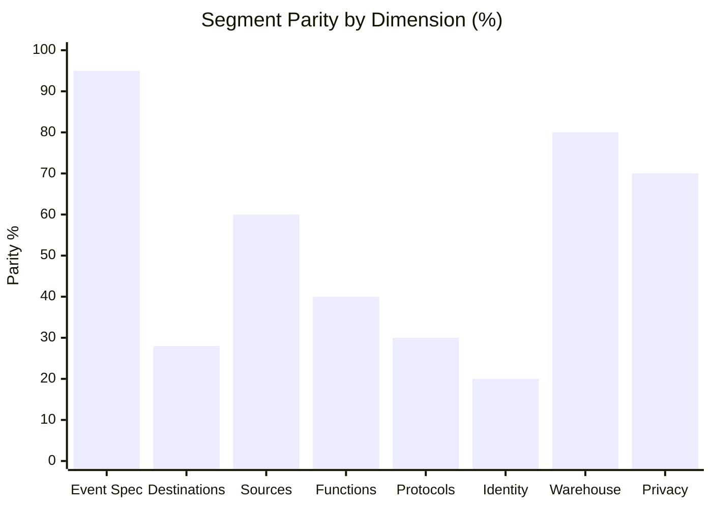
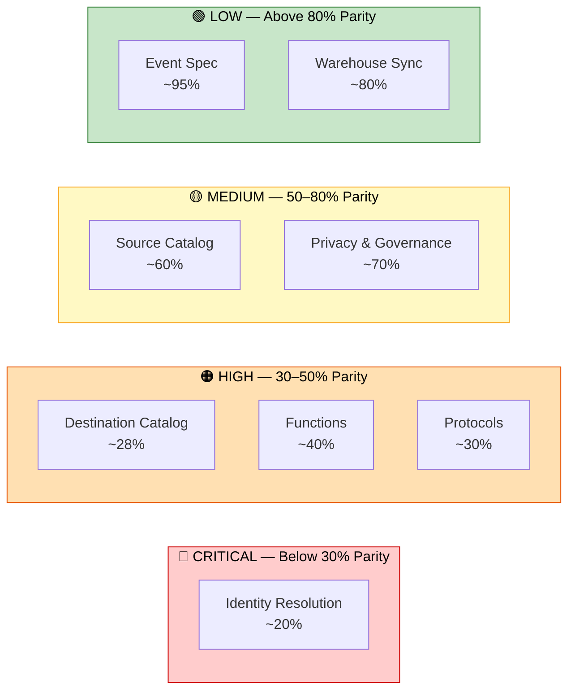
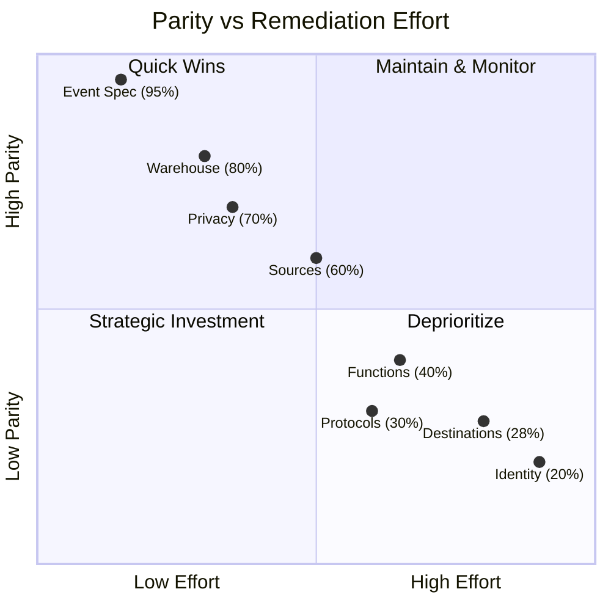

# Segment Parity Gap Report

> **Document Type:** Executive Summary — Segment-RudderStack Feature Parity Gap Analysis
> **RudderStack Version:** `rudder-server` v1.68.1 (Go 1.26.0, Elastic License 2.0)
> **Segment Reference:** Segment documentation mirror at `refs/segment-docs/` (as of analysis date)
> **Overall Assessment:** ~53% weighted average parity across 8 capability dimensions
> **Classification:** Initial-Run Deliverable — self-contained, actionable for autonomous implementation

---

## Table of Contents

- [Executive Summary](#executive-summary)
- [Feature Parity Matrix](#feature-parity-matrix)
- [Parity Visualization](#parity-visualization)
- [Critical Gaps Requiring Immediate Action](#critical-gaps-requiring-immediate-action)
- [Partial Implementations](#partial-implementations)
- [Detailed Gap Analysis by Dimension](#detailed-gap-analysis-by-dimension)
- [Out of Scope — Phase 2](#out-of-scope--phase-2)
- [Methodology](#methodology)
- [Related Documentation](#related-documentation)

---

## Executive Summary

This report provides a comprehensive feature-by-feature parity analysis between **RudderStack** (`rudder-server` v1.68.1) and **Twilio Segment**, a widely adopted Customer Data Platform. The analysis spans eight capability dimensions — Event Spec, Destination Catalog, Source Catalog, Functions, Protocols, Identity Resolution, Warehouse Sync, and Privacy & Governance — using the Segment documentation mirror (`refs/segment-docs/`) as the authoritative reference for Segment's feature set and the `rudder-server` source code as the authoritative reference for RudderStack's capabilities.

RudderStack provides a **strong core data pipeline** with a durable, PostgreSQL-backed job queue (`jobsdb/`), a six-stage Processor pipeline (`processor/pipeline_worker.go`), per-destination Router with throttling and ordering guarantees (`router/`), and a warehouse-first architecture with nine connectors and a seven-state upload state machine (`warehouse/router/`). The Gateway service exposes a Segment-compatible HTTP API on port 8080 (`gateway/openapi.yaml`) implementing all six core Segment Spec event types — `identify`, `track`, `page`, `screen`, `group`, and `alias` — with matching URL paths, Write Key Basic Auth, and compatible payload schemas.

However, **significant gaps exist** in four critical dimensions: Identity Resolution (Unify), Destination Catalog breadth, Functions runtime, and Protocols enforcement. RudderStack's identity resolution is limited to warehouse-only merge-rule processing (`warehouse/identity/identity.go`) with no real-time identity graph or Profiles API. The destination catalog covers approximately 90 connectors versus Segment's 500+ active catalog entries. There is no self-contained Functions runtime equivalent to Segment's Source/Destination/Insert Functions. Tracking plan enforcement delegates to an external Transformer service with basic violation propagation but lacks anomaly detection, configurable enforcement modes, and workspace-level management APIs.

**Key strengths** where RudderStack meets or exceeds Segment include warehouse sync (nine connectors including ClickHouse and MSSQL not available in Segment, Snowpipe Streaming support, Parquet encoding), consent management (three CMP providers with OR/AND resolution semantics), and the core event specification API surface (approximately 95% field-level parity across all six event types).

This gap report is structured as an **initial-run deliverable** — each section is self-contained with specific source citations, quantified parity assessments, and links to detailed per-dimension analysis documents that provide remediation recommendations for autonomous implementation.

Source: `README.md:66-84` | Source: `gateway/openapi.yaml:1-435`

---

## Feature Parity Matrix

The following table summarizes parity across all eight analysis dimensions. Parity levels are estimates based on functional coverage comparison, not code completeness. Each dimension links to a detailed analysis document with feature-level breakdown and remediation recommendations.

| Dimension | Segment Capability | RudderStack Status | Parity | Severity |
|-----------|-------------------|-------------------|--------|----------|
| **Event Spec** (6 core events) | Full Spec: `track`, `identify`, `page`, `screen`, `group`, `alias` with common fields, context, integrations | All 6 types supported via Gateway API (`/v1/{type}`), batch endpoint (`/v1/batch`), Write Key Basic Auth | **~95%** | 🟢 Low |
| **Destination Catalog** | 503 active catalog entries (416 PUBLIC + 87 PUBLIC_BETA), Actions-based architecture | ~90 connectors: 14 stream (`services/streammanager/`), 9 warehouse, ~70 cloud REST | **~25–30%** | 🟠 High |
| **Source SDK Catalog** | JS, iOS, Android, server-side SDKs + 140 cloud app sources (Salesforce, Stripe, HubSpot, etc.) | Gateway API surface compatible with Segment SDKs; no built-in cloud app source ingestion | **~60%** | 🟡 Medium |
| **Functions** | Source Functions, Destination Functions, Insert Functions — self-contained JS runtime (AWS Lambda) | User transforms (batch 200) + destination transforms (batch 100) via external Transformer (port 9090); no Functions runtime | **~40%** | 🟠 High |
| **Protocols / Tracking Plans** | JSON Schema validation, anomaly detection, block/allow/sample enforcement, violation alerting, schema inference | Basic tracking plan validation via Transformer; `propagateValidationErrors` toggle; no anomaly detection | **~30%** | 🟠 High |
| **Identity Resolution (Unify)** | Real-time identity graph, Profiles API (REST), computed/SQL traits, profile sync, data graph, 12+ ID types | Warehouse-only merge-rule resolution in `warehouse/identity/`; no real-time graph, no Profiles API | **~20%** | 🔴 Critical |
| **Warehouse Sync** | Snowflake, BigQuery, Redshift, Postgres, Databricks + selective sync, health monitoring | 9 connectors (incl. ClickHouse, MSSQL — RudderStack-unique), 7-state upload state machine, Parquet encoding | **~80%** | 🟢 Low |
| **Privacy & Governance** | GDPR compliance, consent management, user suppression, data controls | Consent filtering (OneTrust, Ketch, Generic) with OR/AND resolution; `regulation-worker` for GDPR deletion | **~70%** | 🟡 Medium |

> **Note:** Parity levels are estimates derived from feature comparison against Segment documentation. Detailed field-level and feature-level analysis is available in each linked dimension report. Parity percentages weight the breadth and depth of functional coverage, not lines of code.

Source: `gateway/openapi.yaml:14-435` | Source: `router/customdestinationmanager/customdestinationmanager.go:79` | Source: `services/streammanager/streammanager.go:24-58` | Source: `processor/consent.go:44-95` | Source: `warehouse/identity/identity.go:36-60`

---

## Parity Visualization

### Parity by Dimension

### Gap Severity Heat Map

### Priority Quadrant

The following diagram maps each dimension by parity level and estimated remediation effort, identifying dimensions that should be prioritized for implementation:

---

## Critical Gaps Requiring Immediate Action

The following five gaps represent the highest-priority areas where RudderStack diverges most significantly from Segment's feature set. Each gap is quantified, cited to source code, and linked to its detailed analysis document.

### 1. Identity Resolution / Unify — Gap: ~80%

**Current state:** RudderStack's identity resolution is limited to warehouse-only merge-rule processing. The `Identity` struct in `warehouse/identity/identity.go` implements a two-property merge-rule model (`merge_property_1_type/value`, `merge_property_2_type/value`) that resolves identity by mapping merge rules to `rudder_id` values during warehouse upload cycles. Resolution is batch-only — it runs as a stage within the warehouse upload state machine and writes results to PostgreSQL tables within the warehouse schema.

**Segment capability:** Segment Unify provides a comprehensive real-time identity resolution platform with a persistent identity graph, Profiles API (REST), computed and SQL traits, profile sync to downstream destinations, a data graph for entity relationships, external ID management across 12+ default identifier types, and configurable resolution settings with merge protection and priority controls.

**Gaps:**
- No real-time identity graph (batch-only during warehouse uploads)
- No Profiles API for programmatic profile access
- No computed or SQL traits infrastructure
- No profile sync to destinations
- No data graph for entity relationships
- No configurable identity resolution settings (merge protection, priority, limits)

**Impact:** Every downstream capability depending on unified profiles — personalization, audience building, profile-level analytics, and cross-device attribution — is affected.

Source: `warehouse/identity/identity.go:36-100` | Ref: [Identity Parity Analysis](./identity-parity.md)

### 2. Destination Catalog Breadth — Gap: ~70%

**Current state:** RudderStack supports approximately 90 destination connectors organized across three delivery tiers: 14 stream destinations via the Custom Destination Manager (`router/customdestinationmanager/customdestinationmanager.go:79` — KINESIS, KAFKA, AZURE_EVENT_HUB, FIREHOSE, EVENTBRIDGE, GOOGLEPUBSUB, CONFLUENT_CLOUD, PERSONALIZE, GOOGLESHEETS, BQSTREAM, LAMBDA, GOOGLE_CLOUD_FUNCTION, WUNDERKIND, REDIS), 9 warehouse connectors in the dedicated warehouse service, and approximately 70 cloud REST destinations delivered via the Router.

**Segment capability:** Segment's destination catalog contains 503 active entries (416 PUBLIC + 87 PUBLIC_BETA) with 120 entries using the newer Actions-based architecture for configurable field mappings and event subscriptions.

**Gaps:**
- Missing top-tier enterprise destinations (Braze Actions, Amplitude Actions, HubSpot Actions, Salesforce Actions, Mixpanel Actions, Google Analytics 4, Facebook Conversions API, Klaviyo Actions)
- No Actions-based destination architecture (configurable field mappings and subscriptions)
- No device-mode destination support (client-side SDK integrations)
- Payload parity unvalidated for existing shared connectors

Source: `router/customdestinationmanager/customdestinationmanager.go:79` | Source: `services/streammanager/streammanager.go:24-58` | Ref: [Destination Catalog Parity Analysis](./destination-catalog-parity.md)

### 3. Functions Runtime — Gap: ~60%

**Current state:** RudderStack provides a transformation framework through an external Transformer service (port 9090) that supports JavaScript and Python custom transformations. Events are processed in two pipeline stages — user transforms (batch size 200) and destination transforms (batch size 100) — within the Processor's six-stage pipeline. The `usertransformer` package (`processor/usertransformer/usertransformer.go`) re-exports the internal user transformer client.

**Segment capability:** Segment Functions is a self-contained, workspace-level function runtime powered by AWS Lambda that enables users to create custom Source Functions (receive and transform external webhooks), Destination Functions (custom delivery logic), and Insert Functions (pre-destination transformation hooks) — all manageable via API with versioning, environment variables, and real-time logging.

**Gaps:**
- No Source Functions (cannot receive/transform external webhooks via user-defined logic at source level)
- No Insert Functions (no per-destination, pre-delivery transformation hooks)
- No workspace-level Function management API (no CRUD, versioning, or real-time logging)
- No per-event typed handlers (batch processing only, not per-event with `onTrack()`, `onIdentify()`)

**RudderStack advantage:** Python runtime support (Segment is JavaScript-only) and efficient batch processing (200/100 event batches).

Source: `processor/usertransformer/usertransformer.go:1-19` | Ref: [Functions Parity Analysis](./functions-parity.md)

### 4. Protocols / Tracking Plan Enforcement — Gap: ~70%

**Current state:** RudderStack implements tracking plan validation via the external Transformer service. The `validateEvents` function in `processor/trackingplan.go` sends events to the Transformer's tracking plan validation endpoint, receives validation results, and enhances events with violation errors in the `context` object (including `trackingPlanId`, `trackingPlanVersion`, and `violationErrors`). A `propagateValidationErrors` configuration toggle controls whether violations are attached to event context.

**Segment capability:** Segment Protocols is a comprehensive data governance suite encompassing tracking plan management (workspace-level CRUD API), JSON Schema-based validation, anomaly detection for unexpected events and properties, configurable enforcement modes (block/allow/sample), violation alerting (email, Slack), blocked events forwarding to alternative destinations, schema inference from live events, and Protocols Transformations (rule-based event transforms).

**Gaps:**
- No anomaly detection for unexpected events or properties
- Limited enforcement modes — only `propagateValidationErrors` toggle (no block/allow/sample)
- No tracking plan management API (workspace-level CRUD)
- No forward-blocked-events capability
- No tracking plan versioning or schema inference from live events
- No violation alerting (email, Slack)

Source: `processor/trackingplan.go:26-49,66-96` | Ref: [Protocols Parity Analysis](./protocols-parity.md)

### 5. Source Catalog / Cloud Sources — Gap: ~40%

**Current state:** RudderStack's Gateway provides a Segment-compatible HTTP API surface (port 8080) that accepts standard SDK payloads. The Write Key Basic Auth scheme is directly compatible with Segment's authentication model, enabling standard Segment SDKs (JavaScript, iOS, Android, server-side) to connect with minimal configuration changes — typically an endpoint URL swap and Write Key substitution.

**Segment capability:** Segment provides native SDK libraries for all major platforms plus 140 cloud app sources (Salesforce, Stripe, HubSpot, Zendesk, etc.) that pull data from third-party SaaS APIs into the Segment pipeline without any SDK instrumentation.

**Gaps:**
- 140 cloud app sources have no built-in equivalent (Gateway accepts only SDK-pushed and webhook-pushed events)
- Device-mode SDK forwarding not natively supported in server-side Gateway
- Per-SDK testing and documentation gaps exist

Source: `gateway/openapi.yaml:1-435` | Ref: [Source Catalog Parity Analysis](./source-catalog-parity.md)

---

## Partial Implementations

The following features have existing implementations that achieve meaningful parity with Segment but contain specific gaps that limit full equivalence.

### Event Spec — ~95% Parity

All six core Segment Spec event types (`identify`, `track`, `page`, `screen`, `group`, `alias`) are fully supported via the Gateway HTTP API with matching URL paths (`/v1/{type}`), Write Key Basic Auth, and compatible payload schemas. The batch endpoint (`/v1/batch`) accepts mixed event types in a single request. RudderStack extends the Segment API surface with additional endpoints: `/v1/import` (bulk import), `/internal/v1/replay` (event replay), `/internal/v1/retl` (reverse ETL), `/beacon/v1/*` (beacon tracking), and `/pixel/v1/*` (pixel tracking).

**Remaining gaps:** Minor differences in structured Client Hints (`context.userAgentData`) pass-through verification, semantic event category routing enforcement, and reserved trait validation.

Source: `gateway/openapi.yaml:14-435` | Ref: [Event Spec Parity Analysis](./event-spec-parity.md)

### Warehouse Sync — ~80% Parity

RudderStack supports nine warehouse connectors (Snowflake, BigQuery, Redshift, ClickHouse, Databricks Delta Lake, PostgreSQL, MSSQL, Azure Synapse, S3/GCS/Azure Datalake) compared to Segment's eight — ClickHouse and MSSQL are RudderStack-unique. The seven-state upload state machine provides fine-grained lifecycle control. Snowpipe Streaming integration enables low-latency Snowflake ingestion. Multiple encoding formats (Parquet, JSON, CSV) offer staging file flexibility.

**Remaining gaps:** No per-table or per-column selective sync, limited sync health monitoring dashboard, config-based scheduling only (no UI-driven frequency adjustment), partial archiver-warehouse replay integration, no DB2 connector.

Source: `warehouse/identity/identity.go:36-60` | Ref: [Warehouse Parity Analysis](./warehouse-parity.md)

### Privacy & Governance — ~70% Parity

Consent management supports three CMP providers — OneTrust (legacy), Ketch, and Generic — with configurable resolution semantics. The `getConsentFilteredDestinations` function in `processor/consent.go` implements OR resolution (user must consent to at least one configured consent) and AND resolution (user must consent to all configured consents). The `regulation-worker` handles GDPR data deletion across API, batch, and KV store destinations.

**Remaining gaps:** No consent preference center, limited consent audit logging, no data classification or sensitivity labeling, no consent-based event sampling.

Source: `processor/consent.go:44-95` | Ref: [Protocols Parity Analysis](./protocols-parity.md)

### Source SDK Compatibility — ~60% Parity

The Gateway's Segment-compatible API surface on port 8080 accepts payloads from standard Segment SDKs. The five authentication schemes support Write Key Basic Auth (matching Segment's scheme), enabling existing Segment SDK integrations to redirect to RudderStack with only an endpoint URL change and Write Key substitution.

**Remaining gaps:** No dedicated RudderStack SDK libraries for all platforms (relies on API compatibility with Segment SDKs), no cloud app source ingestion (140 Segment cloud sources), no device-mode destination forwarding support.

Source: `gateway/openapi.yaml:1-13` | Ref: [Source Catalog Parity Analysis](./source-catalog-parity.md)

---

## Detailed Gap Analysis by Dimension

Each of the following documents provides a deep-dive analysis of a specific parity dimension, including feature-level comparison tables, payload schema comparisons (where applicable), source code citations, and prioritized remediation recommendations.

| # | Document | Parity | Description |
|---|----------|--------|-------------|
| 1 | [Event Spec Parity](./event-spec-parity.md) | ~95% | Field-level comparison for all 6 core Segment Spec events (`track`, `identify`, `page`, `screen`, `group`, `alias`), common fields, context object, and batch endpoint |
| 2 | [Destination Catalog Parity](./destination-catalog-parity.md) | ~28% | Full connector inventory comparison, category-level coverage analysis, Actions architecture gap, and payload parity assessment |
| 3 | [Source Catalog Parity](./source-catalog-parity.md) | ~60% | SDK compatibility matrix, cloud app source gap inventory, ingestion endpoint parity, and authentication scheme comparison |
| 4 | [Functions Parity](./functions-parity.md) | ~40% | Transformation framework versus Segment Functions comparison, Source/Destination/Insert Functions gap analysis, and runtime architecture differences |
| 5 | [Protocols Parity](./protocols-parity.md) | ~30% | Tracking plan enforcement feature comparison, consent management analysis, anomaly detection gap, and governance capability assessment |
| 6 | [Identity Parity](./identity-parity.md) | ~20% | Identity resolution architecture comparison, Profiles API gap, traits infrastructure analysis, and real-time vs. batch resolution assessment |
| 7 | [Warehouse Parity](./warehouse-parity.md) | ~80% | Warehouse connector comparison, upload state machine analysis, encoding format assessment, and sync feature gap inventory |
| 8 | [Sprint Roadmap](./sprint-roadmap.md) | — | Epic sequencing for autonomous gap closure, priority ordering by business impact, effort estimation, and dependency mapping |

---

## Out of Scope — Phase 2

The following Segment product areas are **explicitly excluded** from Phase 1 analysis and implementation per project requirements. They are documented here for completeness and will be addressed in subsequent phases.

### Segment Engage / Campaigns

Segment Engage encompasses audience building (real-time audience computation from traits and events), journey orchestration (multi-step, trigger-based user journeys), and campaign management (email, push, SMS, in-app messaging). These capabilities depend on the Identity Resolution (Unify) infrastructure that is itself a Phase 1 gap — Engage will be addressed after foundational identity capabilities are implemented.

### Reverse ETL

Reverse ETL enables warehouse-to-destination sync pipelines — querying data from warehouses and syncing computed results (audiences, traits, model scores) back to operational tools. The RudderStack codebase contains an `/internal/v1/retl` endpoint in the Gateway (`gateway/openapi.yaml:488-535`), suggesting early infrastructure exists. Full Reverse ETL documentation and implementation will be addressed in Phase 2.

### Advanced Personalization

Real-time audience membership, in-app content personalization, and recommendation engine integrations depend on Engage and Unify and are deferred to Phase 2.

> **Note:** These exclusions are per explicit project requirements. The [Sprint Roadmap](./sprint-roadmap.md) sequences Phase 1 gap closure to establish the foundations required for Phase 2 features.

---

## Methodology

### Analysis Approach

This gap analysis follows a **systematic feature-by-feature comparison methodology** across eight capability dimensions:

1. **Feature catalog extraction** — The complete Segment feature set was derived from the Segment documentation mirror at `refs/segment-docs/`, covering Connections (spec, sources, destinations, functions), Protocols (tracking plans, enforcement), Unify (identity resolution, profiles, traits), and Privacy.

2. **RudderStack capability assessment** — RudderStack capabilities were assessed through direct source code analysis of `rudder-server` v1.68.1, examining handler implementations, configuration parameters, interface definitions, and integration test coverage.

3. **Parity quantification** — Parity levels for each dimension were estimated based on the ratio of functionally equivalent features to the total Segment feature set for that dimension. Parity reflects functional coverage breadth and depth, not code completeness or performance equivalence.

4. **Independent dimension analysis** — Each dimension was analyzed independently with cross-references maintained between related dimensions (e.g., Identity Resolution impacts Functions, Protocols, and Warehouse capabilities).

5. **Severity classification** — Gap severity is classified on a four-tier scale:
   - 🟢 **Low** (>80% parity) — Minor gaps, production-usable as-is
   - 🟡 **Medium** (50–80% parity) — Functional but with notable feature gaps
   - 🟠 **High** (30–50% parity) — Significant gaps limiting adoption scenarios
   - 🔴 **Critical** (<30% parity) — Fundamental capability missing, blocking key use cases

### Key Source Material

**Segment documentation (reference baseline):**
- `refs/segment-docs/src/connections/spec/` — Segment Spec definitions (identify, track, page, screen, group, alias, common fields)
- `refs/segment-docs/src/connections/destinations/catalog/` — Segment destination catalog (503 active entries)
- `refs/segment-docs/src/connections/sources/catalog/` — Segment source catalog (SDKs + 140 cloud sources)
- `refs/segment-docs/src/connections/functions/` — Segment Functions documentation (source, destination, insert)
- `refs/segment-docs/src/protocols/` — Segment Protocols and Tracking Plans documentation
- `refs/segment-docs/src/unify/` — Segment Unify and Identity Resolution documentation

**RudderStack source code (assessment baseline):**
- `gateway/` — HTTP ingestion gateway (OpenAPI spec, handlers, auth, validation, throttling)
- `processor/` — Event processing pipeline (6-stage pipeline, consent, tracking plans, transforms)
- `router/` — Real-time destination routing (throttling, ordering, retry, custom destination manager)
- `warehouse/` — Warehouse loading service (9 connectors, state machine, identity, encoding)
- `services/` — Shared service packages (stream manager, dedup, OAuth, transformer)
- `config/config.yaml` — Master configuration (200+ tunable parameters)
- `gateway/openapi.yaml` — OpenAPI 3.0.3 specification for the Gateway HTTP API

### Limitations

- Parity assessments are based on documented Segment features and may not capture undocumented behaviors
- Performance parity (throughput, latency) is not assessed in this report — see [Capacity Planning](../guides/operations/capacity-planning.md) for performance documentation
- Segment's Actions-based destination architecture internals are not fully documented in the public reference, limiting precise gap quantification
- Cloud app source capabilities require API-level analysis that is beyond source code review

---

## Related Documentation

- [Architecture Overview](../architecture/overview.md) — High-level system architecture with component diagrams
- [API Reference](../api-reference/index.md) — Gateway HTTP API reference and authentication guide
- [Configuration Reference](../reference/config-reference.md) — Complete configuration parameter reference (200+ parameters)
- [Migration Guide](../guides/migration/segment-migration.md) — Step-by-step Segment-to-RudderStack migration guide
- [Capacity Planning](../guides/operations/capacity-planning.md) — Pipeline tuning for 50k events/sec throughput target
- [Documentation Home](../README.md) — Documentation landing page and navigation

---

*This gap report was generated through systematic analysis of `rudder-server` v1.68.1 source code compared against the Segment documentation reference at `refs/segment-docs/`. All source citations reference specific file paths and line ranges within the repository. For questions or updates, refer to the individual dimension reports linked above.*
