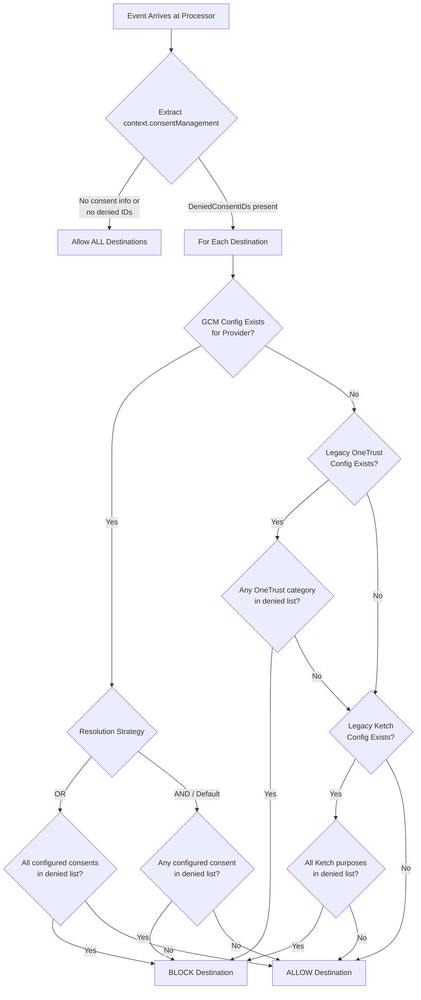
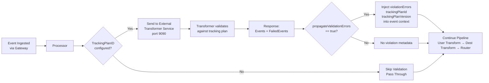
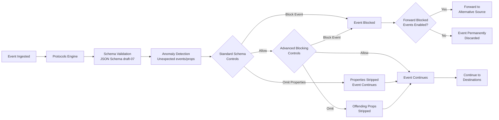
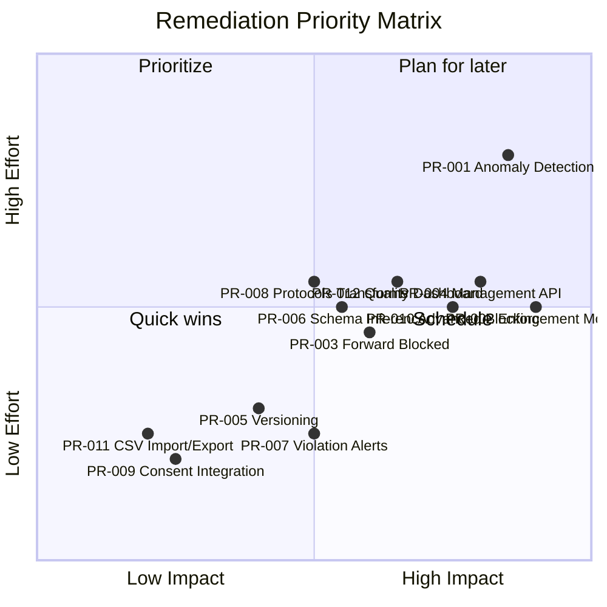

# Protocols / Tracking Plan Parity Analysis

> **Gap Severity: High (~30% parity)**
> RudderStack implements basic tracking plan validation via an external Transformer service with violation reporting embedded in event context. Segment Protocols is a comprehensive data governance suite encompassing tracking plan management, JSON Schema–based validation, anomaly detection, configurable enforcement modes (block/allow/sample), violation alerting, and forwarding of blocked events to alternative destinations.

## Executive Summary

This document provides a feature-by-feature gap analysis comparing **RudderStack's tracking plan validation and consent management** capabilities against **Segment Protocols**, Segment's premium data governance add-on available to Business Tier customers.

**Key findings:**

| Area | Parity | Assessment |
|------|--------|------------|
| Tracking plan validation | ~30% | Basic validation delegated to external Transformer; no anomaly detection, limited enforcement modes |
| Consent management | ~85% | Strong — 3 CMP providers (OneTrust, Ketch, Generic) with OR/AND resolution semantics |
| Event governance | ~20% | Event filtering exists; no sampling, schema evolution detection, quality dashboards, or violation notifications |
| Overall Protocols parity | ~30% | Core validation exists but advanced governance features are absent |

**Key gaps:**

- No anomaly detection for unexpected events or properties
- Limited enforcement modes — only a `propagateValidationErrors` toggle (no block/allow/sample)
- No tracking plan management API (workspace-level CRUD)
- No forward-blocked-events capability
- No tracking plan versioning or schema inference from live events
- No violation alerting (email, Slack)
- No Protocols Transformations (rule-based event transforms from tracking plan rules)

**Key RudderStack strength:**

- Consent management with three Consent Management Platform (CMP) providers — OneTrust, Ketch, and Generic — supporting both OR and AND resolution strategies for consent-based destination filtering.

**Scope note:** Segment Engage/Campaigns and Reverse ETL are explicitly out of scope for Phase 1 per project requirements.

---

## Table of Contents

- [Tracking Plan Feature Comparison](#tracking-plan-feature-comparison)
- [Consent Management Comparison](#consent-management-comparison)
- [Enforcement Architecture](#enforcement-architecture)
- [Gateway-Level Validation](#gateway-level-validation)
- [Event Governance Comparison](#event-governance-comparison)
- [Gap Summary and Remediation](#gap-summary-and-remediation)
- [Related Documentation](#related-documentation)

---

## Tracking Plan Feature Comparison

This section compares Segment Protocols tracking plan capabilities against RudderStack's current implementation.

### Segment Protocols Overview

Segment Protocols is a premium add-on that automates and scales data quality best practices. It provides workspace-scoped tracking plan management with JSON Schema–based validation, configurable enforcement decisions per source, and a management UI and API for CRUD operations on tracking plans.

Key Segment Protocols capabilities (Source: `refs/segment-docs/src/protocols/index.md`, `refs/segment-docs/src/protocols/tracking-plan/create.md`):

- **Tracking Plan Editor**: Spreadsheet-style UI for defining events, properties, traits, and filters with type validation (any, array, object, boolean, integer, number, string, null, Date time)
- **Event Validation**: Validates Track, Identify, Page, and Group calls against the tracking plan definition
- **JSON Schema Support**: Full JSON Schema (draft-07) for advanced validation including required properties, regex patterns, and nested objects
- **Common JSON Schema**: Cross-event schema definition applied to every event from connected sources
- **Schema Inference**: Import events from the last 24 hours, 7 days, or 30 days to bootstrap tracking plans
- **Enforcement Modes**: Configurable per-source decisions — Block Event, Omit Properties, Allow
- **Forward Blocked Events**: Redirect blocked events to an alternative source to avoid permanent data loss
- **Labels and Filtering**: Key-value labels for event organization; filter by keyword or label
- **Upload/Download**: CSV import/export for tracking plan management (up to 100,000 rows, 2,000 rules, 15 MB)

### RudderStack Tracking Plan Implementation

RudderStack implements tracking plan validation in the Processor stage via delegation to an external Transformer service. The implementation is contained primarily in two files:

- `processor/trackingplan.go` — Core validation orchestration (Source: `processor/trackingplan.go:1-168`)
- `processor/consent.go` — Consent-based destination filtering (Source: `processor/consent.go:1-231`)

Key components:

1. **`TrackingPlanStatT` struct** — Tracks validation metrics: `numEvents`, `numValidationSuccessEvents`, `numValidationFailedEvents`, `numValidationFilteredEvents`, `tpValidationTime` (Source: `processor/trackingplan.go:16-22`)

2. **`validateEvents()` function** — Core validation entry point. If a `TrackingPlanID` exists for the event's write key (from backend-config), the function sends events to the external Transformer service for validation. If no TrackingPlanID is configured, events pass through unvalidated. (Source: `processor/trackingplan.go:69-142`)

3. **`reportViolations()` function** — Injects `violationErrors`, `trackingPlanId`, and `trackingPlanVersion` into the event's `context` object. Gated by the `propagateValidationErrors` toggle in `MergedTpConfig`. (Source: `processor/trackingplan.go:26-49`)

4. **`enhanceWithViolation()` function** — Iterates over `response.Events` and `response.FailedEvents`, calling `reportViolations()` for each to embed violation metadata. (Source: `processor/trackingplan.go:54-64`)

5. **Validation metrics** — Tagged stats emitted to the metrics system: `proc_num_tp_input_events`, `proc_num_tp_output_success_events`, `proc_num_tp_output_failed_events`, `proc_num_tp_output_filtered_events`, `proc_tp_validation` (Source: `processor/trackingplan.go:145-168`)

### Feature Comparison Matrix

| Feature | Segment Protocols | RudderStack Implementation | Parity | Gap Severity |
|---------|------------------|---------------------------|--------|--------------|
| Tracking plan creation and management | ✅ Full UI + API with spreadsheet editor, CSV import/export | ⚠️ Config-based via backend-config (no dedicated UI or API) | 20% | High |
| Event validation (Track, Identify, Page, Group) | ✅ Full JSON Schema–based validation per event type | ⚠️ Delegated to external Transformer service; depends on Transformer implementation | 50% | Medium |
| Property type validation | ✅ JSON Schema draft-07 (any, array, object, boolean, integer, number, string, null, Date time) | ⚠️ Transformer-based; schema support depends on Transformer version | 40% | Medium |
| Required property enforcement | ✅ Full — `required` array in JSON Schema | ⚠️ Transformer-based; not configurable from RudderStack directly | 40% | Medium |
| Regex / permitted value validation | ✅ Full — string regex patterns, enum values, pipe-delimited permitted values | ⚠️ Transformer-based; support depends on Transformer implementation | 30% | Medium |
| Common JSON Schema (cross-event rules) | ✅ Full — single schema applied to all events from connected sources | ❌ Not available | 0% | Medium |
| Anomaly detection (unexpected events/properties) | ✅ Automatic — flags events and properties not in the tracking plan | ❌ Not available | 0% | High |
| Enforcement modes (block/allow/sample) | ✅ Full — Block Event, Omit Properties, Allow; configurable per-source per-call-type | ⚠️ Limited — `propagateValidationErrors` toggle only; events continue through pipeline regardless | 20% | High |
| Forward blocked events to alternative destination | ✅ Full — server-to-server forwarding to a separate source | ❌ Not available | 0% | Medium |
| Violation reporting | ✅ Full — dedicated UI dashboard, violation summaries, per-source per-event drill-down | ⚠️ In event `context` only — `violationErrors`, `trackingPlanId`, `trackingPlanVersion` injected into payload | 30% | Medium |
| Tracking plan versioning | ✅ Full version history with changelog and audit trail | ❌ Not available — `trackingPlanVersion` is passed but not managed | 0% | Medium |
| Schema inference from live events | ✅ Import events from last 24h/7d/30d to bootstrap tracking plan | ❌ Not available | 0% | Medium |
| Workspace-level management API | ✅ Full REST API for tracking plan CRUD operations | ❌ Not available | 0% | High |
| Library-level settings | ✅ Per-library (source) tracking plan configuration | ❌ Not available | 0% | Low |
| Protocols Transformations (rule-based transforms) | ✅ Transform events based on tracking plan rules | ❌ Not available | 0% | Medium |
| Labels and event filtering in tracking plan | ✅ Key-value labels, keyword/label filtering, persistent link sharing | ❌ Not available | 0% | Low |
| CSV upload/download of tracking plans | ✅ Full — up to 100,000 rows, 2,000 rules, 15 MB | ❌ Not available | 0% | Low |
| Advanced blocking controls (Standard + Common JSON) | ✅ Two-layer blocking: Standard Schema Controls then Advanced Blocking Controls | ❌ Not available — no blocking capability | 0% | High |

> **Source citations:**
> - RudderStack implementation: `Source: processor/trackingplan.go:16-168`
> - Segment Protocols reference: `Source: refs/segment-docs/src/protocols/index.md`, `Source: refs/segment-docs/src/protocols/tracking-plan/create.md`, `Source: refs/segment-docs/src/protocols/enforce/schema-configuration.md`

---

## Consent Management Comparison

Consent management is one of RudderStack's strongest governance capabilities, providing near-full parity with Segment's consent-based destination filtering.

### RudderStack Consent Management Architecture

RudderStack implements consent-based destination filtering in `processor/consent.go`. The system extracts consent information from the event's `context.consentManagement` object and filters destinations based on configured consent categories.

**Key data structures** (Source: `processor/consent.go:16-36`):

```go
// ConsentManagementInfo — extracted from event context
type ConsentManagementInfo struct {
    DeniedConsentIDs   []string `json:"deniedConsentIds"`
    AllowedConsentIDs  any      `json:"allowedConsentIds"`
    Provider           string   `json:"provider"`
    ResolutionStrategy string   `json:"resolutionStrategy"`
}

// GenericConsentManagementProviderData — per-provider config
type GenericConsentManagementProviderData struct {
    ResolutionStrategy string
    Consents           []string
}
```

**Resolution strategies** (Source: `processor/consent.go:67-75`):

- **OR strategy** (`"or"`): The user must consent to at least one of the configured consents. If all configured consents are in the denied list, the destination is blocked.
- **AND strategy** (`"and"`, default): The user must consent to all configured consents. If any configured consent is in the denied list, the destination is blocked.

**Provider support:**

| Provider | Implementation | Resolution |
|----------|---------------|------------|
| OneTrust | Legacy consent via `oneTrustCookieCategories` in destination config; AND semantics | Source: `processor/consent.go:79-84` |
| Ketch | Legacy consent via `ketchConsentPurposes` in destination config; OR semantics | Source: `processor/consent.go:86-91` |
| Generic (custom) | Generic Consent Management (GCM) via `consentManagement` config array per destination; resolution strategy from destination config | Source: `processor/consent.go:58-76` |

### Consent Filtering Decision Flow



> **Source:** `processor/consent.go:44-95`

### Feature Comparison Matrix

| Feature | Segment | RudderStack | Parity | Notes |
|---------|---------|-------------|--------|-------|
| Consent-based destination filtering | ✅ Supported | ✅ Supported | Full | `getConsentFilteredDestinations()` filters per-destination based on consent IDs (Source: `processor/consent.go:44-95`) |
| OneTrust integration | ✅ Supported | ✅ Supported | Full | Legacy provider via `oneTrustCookieCategories` destination config (Source: `processor/consent.go:79-84`, `processor/consent.go:127-145`) |
| Ketch integration | ✅ Supported | ✅ Supported | Full | Legacy provider via `ketchConsentPurposes` destination config (Source: `processor/consent.go:86-91`, `processor/consent.go:147-165`) |
| Generic CMP support | ✅ Supported | ✅ Supported | Full | Generic Consent Management via `consentManagement` config (Source: `processor/consent.go:58-76`, `processor/consent.go:167-207`) |
| Resolution strategies (OR / AND) | ✅ Supported | ✅ Supported | Full | OR: any denied blocks; AND: all denied required to block (Source: `processor/consent.go:67-75`) |
| Custom provider with custom resolution | ✅ Supported | ✅ Supported | Full | For `"custom"` provider, resolution strategy is read from destination config (Source: `processor/consent.go:63-65`) |
| Consent Preference Updated event | ✅ Auto-generated — Segment automatically adds a "Segment Consent Preference Updated" event to all tracking plans | ❌ Not implemented | 0% | Segment auto-adds this event for Consent Management users (Source: `refs/segment-docs/src/protocols/tracking-plan/create.md:21-23`) |
| Consent categories in tracking plans | ✅ Auto-added to tracking plans when consent categories are created | ❌ Not integrated — consent and tracking plans are independent systems | 0% | Medium gap — consent categories are not linked to tracking plan definitions |

---

## Enforcement Architecture

This section compares the enforcement pipeline architectures of both platforms. The most significant architectural difference is that RudderStack delegates validation to an external service and continues processing events regardless of validation outcome, whereas Segment provides inline enforcement with configurable blocking behavior.

### RudderStack Enforcement Pipeline



**Key characteristics:**

- Validation is **externally delegated** to the Transformer service (port 9090) — not performed inline in the Processor (Source: `processor/trackingplan.go:95`)
- Events **always continue through the pipeline** — the `propagateValidationErrors` toggle only controls whether violation metadata is embedded in the event context (Source: `processor/trackingplan.go:27-29`)
- **Safety check**: If the count of `response.Events + response.FailedEvents` does not match the original `eventList` count, the original events pass through unmodified (Source: `processor/trackingplan.go:101-104`)
- Metrics are emitted for monitoring: input events, success, failed, filtered, and validation time (Source: `processor/trackingplan.go:88-89`, `processor/trackingplan.go:122-124`)
- TrackingPlanID and TrackingPlanVersion are sourced from event metadata, which originates from backend-config (Source: `processor/trackingplan.go:80-81`)

### Segment Enforcement Pipeline



**Key characteristics** (Source: `refs/segment-docs/src/protocols/enforce/schema-configuration.md`):

- Validation is **inline** within the Segment pipeline — no external service dependency
- **Two-layer enforcement**: Standard Schema Controls evaluate first, then Advanced Blocking Controls (Common JSON Schema)
- **Configurable per call type**: Separate settings for Track calls (unplanned events, unplanned properties, JSON schema violations) and Identify calls (unplanned traits, JSON schema violations)
- **Blocked events can be forwarded** to an alternative source to avoid permanent data loss (Source: `refs/segment-docs/src/protocols/enforce/forward-blocked-events.md`)
- **Device-mode limitations**: Unplanned property blocking and JSON schema violation blocking only work for cloud-mode destinations

### Architectural Comparison Summary

| Aspect | RudderStack | Segment |
|--------|-------------|---------|
| Validation engine | External Transformer service (port 9090) | Inline Protocols Engine |
| Validation timing | During Processor stage | At ingestion / pre-routing |
| Enforcement decision | None — events always continue; violations in context only | Configurable per-source: Block, Omit, Allow |
| Blocked event handling | Not applicable — events are never blocked | Forward to alternative source or permanently discard |
| Schema standard | Depends on Transformer implementation | JSON Schema draft-07 |
| Enforcement layers | Single layer (Transformer validation) | Two layers (Standard + Advanced/Common JSON) |
| Per-call-type config | No — uniform for all event types | Yes — separate settings for Track, Identify, Group |
| Device-mode support | Not applicable (server-side only) | Limited — blocking only for cloud-mode |
| External service dependency | Yes — requires Transformer service | No — self-contained |

---

## Gateway-Level Validation

In addition to the Processor-level tracking plan validation, RudderStack performs structural validation at the Gateway layer using a mediator pattern.

### Validator Mediator

The Gateway uses a `Mediator` that chains six payload validators, each checking a specific aspect of the incoming request (Source: `gateway/validator/validator.go:16-51`):

| Validator | Purpose |
|-----------|---------|
| `msgPropertiesValidator` | Validates message properties against a configured validation function |
| `messageIDValidator` | Ensures a valid `messageId` is present |
| `reqTypeValidator` | Validates the request type (identify, track, page, screen, group, alias) |
| `receivedAtValidator` | Ensures `receivedAt` timestamp is correctly set |
| `requestIPValidator` | Validates the request IP address |
| `rudderIDValidator` | Validates the RudderStack internal ID |

**Important distinction:** This Gateway-level validation is **structural** (ensuring events have required fields and valid format). It is separate from the **semantic** tracking plan validation performed by the Transformer during the Processor stage. Segment's Protocols enforcement combines both structural and semantic validation in a unified pipeline.

---

## Event Governance Comparison

Beyond tracking plan validation and consent management, both platforms offer broader event governance capabilities.

| Governance Feature | Segment | RudderStack | Parity | Notes |
|-------------------|---------|-------------|--------|-------|
| Event filtering | ✅ Via Protocols enforcement (block unplanned events) | ✅ Via `processor/eventfilter/` — configurable event drop and filter rules | Partial | RudderStack has basic event filtering but not through Protocols |
| Event sampling | ✅ Via enforcement modes — sample a percentage of events | ❌ Not available | 0% | No sampling capability in the pipeline |
| Schema evolution detection | ✅ Automatic — flags new events and properties not in the tracking plan | ❌ Not available | 0% | No automatic detection of schema drift |
| Data quality dashboards | ✅ Full UI — violations summary, per-source per-event drill-down, trends | ❌ Not available — metrics only via tagged stats system | 0% | RudderStack emits `proc_num_tp_*` metrics but has no dashboard (Source: `processor/trackingplan.go:155-158`) |
| Violation notifications | ✅ Email and Slack alerting for tracking plan violations | ❌ Not available | 0% | No alerting integration for validation failures |
| Source Schema export | ✅ CSV export of source schema for auditing | ❌ Not available | 0% | No schema export capability |
| Tracking plan audit trail | ✅ Full audit trail with changelog showing who made changes | ❌ Not available | 0% | No change tracking for tracking plan configurations |
| Per-event labels and organization | ✅ Key-value labels for Track and Page events | ❌ Not available | 0% | No labeling or organizational metadata for events |
| Event archival and blocking status | ✅ Archive events; archived events remain blocked when disconnecting tracking plan | ❌ Not applicable — events are never blocked | 0% | RudderStack's archiver (`archiver/`) serves a different purpose (replay, not governance) |

### Validation Metrics Emitted by RudderStack

While RudderStack lacks governance dashboards, it does emit the following tagged metrics that could serve as a foundation for monitoring (Source: `processor/trackingplan.go:145-168`):

| Metric Name | Type | Tags | Purpose |
|-------------|------|------|---------|
| `proc_num_tp_input_events` | Counter | destination, destType, source, workspaceId, trackingPlanId, trackingPlanVersion | Total events entering validation |
| `proc_num_tp_output_success_events` | Counter | (same tags) | Events passing validation |
| `proc_num_tp_output_failed_events` | Counter | (same tags) | Events failing validation |
| `proc_num_tp_output_filtered_events` | Counter | (same tags) | Events filtered out during validation |
| `proc_tp_validation` | Timer | (same tags) | Validation processing duration |

---

## Gap Summary and Remediation

### Consolidated Gap Table

| Gap ID | Description | Severity | Remediation | Est. Effort |
|--------|------------|----------|-------------|-------------|
| PR-001 | No anomaly detection for unexpected events or properties | High | Implement statistical anomaly detection engine that flags events and properties not present in the tracking plan | Large |
| PR-002 | Limited enforcement modes — no block/allow/sample decisions | High | Add configurable enforcement decisions per-source per-call-type (Block Event, Omit Properties, Allow) matching Segment's Standard Schema Controls | Medium |
| PR-003 | No forward-blocked-events capability | Medium | Implement server-to-server forwarding of blocked events to an alternative source, preventing permanent data loss | Medium |
| PR-004 | No tracking plan management API (workspace-level CRUD) | High | Implement REST API for tracking plan creation, update, deletion, and connection to sources | Medium |
| PR-005 | No tracking plan versioning or changelog | Medium | Add version history, diff comparison, and audit trail for tracking plan changes | Small |
| PR-006 | No schema inference from live events | Medium | Implement event schema sampling that imports observed events from configurable time windows (24h/7d/30d) to bootstrap tracking plans | Medium |
| PR-007 | No violation alerting (email or Slack) | Medium | Integrate alerting with the existing stats and notification framework to send alerts on validation failures | Small |
| PR-008 | No Protocols Transformations (rule-based event transforms) | Medium | Extend the tracking plan engine with transformation rules that can modify events based on tracking plan definitions | Medium |
| PR-009 | No consent category integration with tracking plans | Low | Link consent categories to tracking plan event definitions so that the "Segment Consent Preference Updated" event is auto-added | Small |
| PR-010 | No Advanced Blocking Controls (Common JSON Schema layer) | High | Implement a two-layer enforcement pipeline with Standard Schema Controls and Advanced Blocking Controls | Medium |
| PR-011 | No CSV upload/download for tracking plans | Low | Implement CSV-based import/export for tracking plan management (up to 100,000 rows, 2,000 rules) | Small |
| PR-012 | No data quality dashboard or violation visualization | Medium | Build monitoring dashboard using the existing `proc_num_tp_*` metrics as a foundation | Medium |

### Remediation Priority



### Recommended Implementation Order

1. **Sprint 5**: PR-002 (Enforcement Modes) + PR-010 (Advanced Blocking Controls) — These provide the foundation for all subsequent governance features
2. **Sprint 6**: PR-004 (Management API) + PR-005 (Versioning) — Enable programmatic tracking plan management
3. **Sprint 6**: PR-001 (Anomaly Detection) — Requires enforcement foundation from Sprint 5
4. **Sprint 7**: PR-003 (Forward Blocked Events) + PR-007 (Violation Alerting) — Operational safety net for enforcement
5. **Sprint 7**: PR-006 (Schema Inference) + PR-008 (Protocols Transformations) — Advanced features
6. **Sprint 8**: PR-012 (Quality Dashboard) + PR-009 (Consent Integration) + PR-011 (CSV Import/Export) — Enhancement features

See [Sprint Roadmap](./sprint-roadmap.md) for full sequencing across all gap dimensions.

---

## Related Documentation

- [Gap Report Index](./index.md) — Executive summary of all Segment parity gaps
- [Sprint Roadmap](./sprint-roadmap.md) — Epic sequencing for autonomous gap closure implementation
- [Functions Parity](./functions-parity.md) — Transformation framework comparison (closely related to Protocols Transformations)
- [Identity Parity](./identity-parity.md) — Identity resolution comparison
- [Governance: Tracking Plans](../guides/governance/tracking-plans.md) — Tracking plan configuration and enforcement guide
- [Governance: Consent Management](../guides/governance/consent-management.md) — Consent filtering configuration guide
- [Governance: Event Filtering](../guides/governance/event-filtering.md) — Event drop and filter rules reference
- [Governance: Protocols Enforcement](../guides/governance/protocols-enforcement.md) — Schema validation and enforcement guide
- [Architecture: Pipeline Stages](../architecture/pipeline-stages.md) — Six-stage Processor pipeline including validation stage
