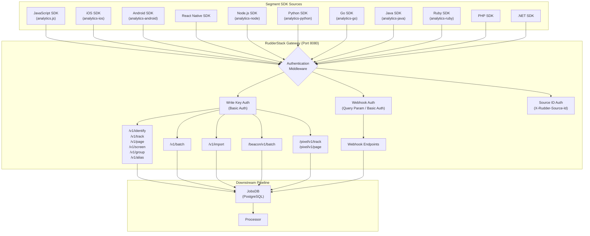
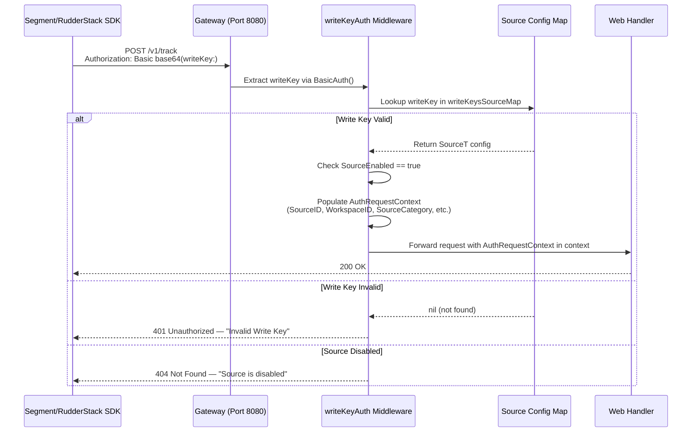
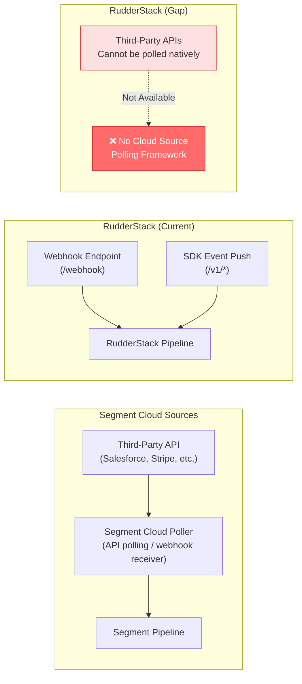
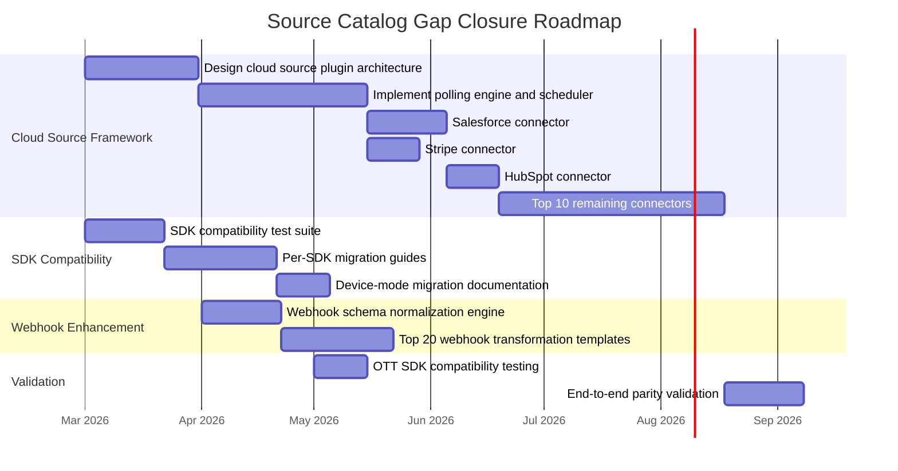

# Source Catalog Parity Analysis

> **Document Status:** Gap Analysis — Initial Run Deliverable
> **Last Updated:** 2026-02-25
> **Scope:** SDK compatibility, cloud source gap inventory, ingestion endpoint parity
> **Audience:** Senior Engineers, Data Engineering Teams, Platform Architects

## Executive Summary

RudderStack's Gateway provides a **Segment-compatible HTTP API surface** on port 8080, implementing the full six-call Segment Spec (`identify`, `track`, `page`, `screen`, `group`, `alias`) plus batch, import, replay, and webhook ingestion endpoints. The Gateway's Write Key Basic Auth scheme is directly compatible with Segment's authentication model, enabling standard Segment SDKs (JavaScript, iOS, Android, and all server-side SDKs) to connect to RudderStack with **minimal configuration changes** — typically an endpoint URL swap and Write Key substitution.

**Overall Source Parity Assessment:**

| Dimension | Parity Score | Assessment |
|-----------|-------------|------------|
| Event Stream SDK Compatibility (API-level) | **~90%** | High — all 6 Segment Spec calls supported with matching payloads |
| SDK Library Coverage | **~60%** | Medium — API surface compatible, but per-SDK testing/documentation gaps exist |
| Cloud App Sources | **~3%** | Critical — Segment has 140 cloud app sources; RudderStack has webhook-based partial coverage only |
| Ingestion Endpoint Diversity | **~75%** | Good — additional beacon, pixel, import, replay, and webhook endpoints beyond Segment's core |
| Authentication Scheme Parity | **~80%** | Good — Write Key auth fully compatible; additional source ID auth for internal use |

**Key Findings:**

- **Strength:** Write Key Basic Auth is fully Segment-compatible — SDKs require only an endpoint URL change to point at RudderStack Gateway
- **Strength:** All six Segment Spec event types are supported at the HTTP API level with matching payload schemas
- **Strength:** Additional ingestion modes (beacon, pixel, import, replay, webhook) extend beyond Segment's standard SDK surface
- **Critical Gap:** 140 cloud app sources (Salesforce, Stripe, HubSpot, Zendesk, etc.) have no built-in equivalent in `rudder-server` — the Gateway accepts only SDK-pushed and webhook-pushed events
- **Gap:** Device-mode SDK forwarding (client-side destination delivery) is not natively supported in the server-side Gateway

> Source: `gateway/openapi.yaml:1-940`, `gateway/handle_http.go:1-153`, `gateway/handle_http_auth.go:1-250`

---

## Table of Contents

- [Source Architecture Overview](#source-architecture-overview)
- [SDK Compatibility Matrix](#sdk-compatibility-matrix)
- [Authentication Scheme Comparison](#authentication-scheme-comparison)
- [API Endpoint Parity](#api-endpoint-parity)
- [Cloud Source Gap Analysis](#cloud-source-gap-analysis)
- [Additional Ingestion Capabilities](#additional-ingestion-capabilities)
- [Device-Mode vs Cloud-Mode Comparison](#device-mode-vs-cloud-mode-comparison)
- [Gap Summary and Remediation](#gap-summary-and-remediation)
- [Cross-References](#cross-references)

---

## Source Architecture Overview

The RudderStack Gateway is the unified ingestion layer for all event data. It accepts events via HTTP on port 8080, authenticates the source using one of several authentication middleware chains, validates the payload, and persists events to the JobsDB for downstream processing.



> Source: `gateway/handle_http.go:17-69`, `gateway/handle_http_auth.go:24-201`

### Source Ingestion Flow

1. **SDK sends HTTP POST** to the appropriate RudderStack Gateway endpoint (e.g., `POST https://<gateway>:8080/v1/track`)
2. **Authentication middleware** validates the request — Write Key via Basic Auth for SDK endpoints, query param or Basic Auth for webhooks, `X-Rudder-Source-Id` header for internal endpoints
3. **Payload validation** — Gateway validates JSON structure, enforces size limits (413 if exceeded), and applies rate limiting (429 if exceeded)
4. **Event persistence** — Valid events are written to the JobsDB for durable processing
5. **Response** — Gateway returns `200 OK` for successful ingestion, or appropriate error codes (400, 401, 404, 413, 429)

> Source: `gateway/openapi.yaml:14-435` (endpoint definitions with response codes)

---

## SDK Compatibility Matrix

RudderStack's Gateway implements a **Segment-compatible HTTP API**, meaning standard Segment SDKs can connect to RudderStack by changing the endpoint URL and providing a RudderStack Write Key. The following matrix assesses compatibility for each Segment SDK platform.

> **Note:** RudderStack also provides its own native SDKs (e.g., `rudder-sdk-js`, `rudder-sdk-ios`, `rudder-sdk-android`). This analysis focuses specifically on **Segment SDK compatibility** with the RudderStack Gateway API surface.

### Web SDKs

| SDK | Segment Version | RudderStack API Compatibility | Gap Severity | Migration Effort | Notes |
|-----|----------------|-------------------------------|-------------|-----------------|-------|
| JavaScript (analytics.js / Analytics 2.0) | Full web SDK with device-mode | ✅ Cloud-mode API-compatible | **Low** | Endpoint URL swap | All 6 Spec calls supported; device-mode destinations not supported server-side |
| Cloudflare Workers | Source integration | ⚠️ Partial — HTTP API compatible | **Low** | Endpoint URL swap | Uses HTTP API directly; no special handling needed |
| Shopify (Littledata) | Partner integration | ⚠️ Partial — webhook-based | **Medium** | Webhook endpoint config | Requires webhook source configuration in RudderStack |

### Mobile SDKs

| SDK | Segment Version | RudderStack API Compatibility | Gap Severity | Migration Effort | Notes |
|-----|----------------|-------------------------------|-------------|-----------------|-------|
| iOS (Analytics-Swift / analytics-ios) | Full mobile SDK | ✅ Cloud-mode API-compatible | **Low** | Endpoint URL swap | Supports identify, track, screen, group, alias |
| Android (Analytics-Kotlin / analytics-android) | Full mobile SDK | ✅ Cloud-mode API-compatible | **Low** | Endpoint URL swap | Supports identify, track, screen, group, alias |
| React Native | Hybrid SDK (JS bridge) | ✅ Cloud-mode API-compatible | **Low** | Endpoint URL swap | Via JS/mobile SDK layer |
| Flutter | Beta SDK | ✅ Cloud-mode API-compatible | **Low** | Endpoint URL swap | Beta SDK using HTTP API |
| Kotlin Android | Modern SDK | ✅ Cloud-mode API-compatible | **Low** | Endpoint URL swap | Uses same HTTP API surface |
| Unity (C#) | Game engine SDK | ✅ Cloud-mode API-compatible | **Low** | Endpoint URL swap | HTTP API compatible |
| Xamarin | Cross-platform SDK | ✅ Cloud-mode API-compatible | **Low** | Endpoint URL swap | Uses .NET HTTP client |
| AMP | Accelerated Mobile Pages | ⚠️ Partial — pixel endpoint compatible | **Medium** | Pixel endpoint config | `/pixel/v1/track` and `/pixel/v1/page` available |

### Server-Side SDKs

| SDK | Segment Version | RudderStack API Compatibility | Gap Severity | Migration Effort | Notes |
|-----|----------------|-------------------------------|-------------|-----------------|-------|
| Node.js (analytics-node) | Full server SDK | ✅ API-compatible | **Low** | Endpoint + Write Key swap | Batch endpoint supported |
| Python (analytics-python) | Full server SDK | ✅ API-compatible | **Low** | Endpoint + Write Key swap | All Spec calls supported |
| Go (analytics-go) | Full server SDK | ✅ API-compatible | **Low** | Endpoint + Write Key swap | All Spec calls supported |
| Java (analytics-java) | Full server SDK | ✅ API-compatible | **Low** | Endpoint + Write Key swap | All Spec calls supported |
| Ruby (analytics-ruby) | Full server SDK | ✅ API-compatible | **Low** | Endpoint + Write Key swap | All Spec calls supported |
| PHP (analytics-php) | Full server SDK | ✅ API-compatible | **Low** | Endpoint + Write Key swap | All Spec calls supported |
| .NET (Analytics.NET) | Full server SDK | ✅ API-compatible | **Low** | Endpoint + Write Key swap | All Spec calls supported |
| C# | Server SDK | ✅ API-compatible | **Low** | Endpoint + Write Key swap | All Spec calls supported |
| Kotlin (Server) | Server SDK | ✅ API-compatible | **Low** | Endpoint + Write Key swap | All Spec calls supported |
| Clojure | Community SDK | ✅ API-compatible | **Low** | Endpoint + Write Key swap | Uses HTTP API directly |
| Rust | Community SDK | ✅ API-compatible | **Low** | Endpoint + Write Key swap | Uses HTTP API directly |

### OTT (Over-the-Top) SDKs

| SDK | Segment Version | RudderStack API Compatibility | Gap Severity | Migration Effort | Notes |
|-----|----------------|-------------------------------|-------------|-----------------|-------|
| Roku | Alpha / community-supported | 🔍 Unvalidated | **Medium** | Requires testing | Uses HTTP API; compatibility likely but untested |

### Protocol-Level APIs

| Protocol | Segment Support | RudderStack Support | Gap Severity | Notes |
|----------|----------------|--------------------|--------------|----|
| HTTP Tracking API | Full REST API | ✅ Full parity | **None** | `/v1/*` endpoints match Segment HTTP API |
| Pixel Tracking API | Pixel-based tracking | ✅ Supported | **None** | `/pixel/v1/track`, `/pixel/v1/page` endpoints |
| Object API | Cloud source object sync | ❌ Not supported | **High** | Requires cloud source framework |
| Object Bulk API | Bulk object ingestion | ❌ Not supported | **High** | Requires cloud source framework |

> Source: `gateway/openapi.yaml:14-435` (all public endpoint definitions), `gateway/handle_http.go:37-69` (handler registrations), `refs/segment-docs/src/connections/sources/catalog/libraries/` (SDK catalog structure)

---

## Authentication Scheme Comparison

RudderStack's Gateway implements multiple authentication middleware chains, each serving different ingestion patterns. The following comparison maps these against Segment's authentication model.

### Authentication Schemes

| Auth Scheme | Segment Implementation | RudderStack Implementation | Parity | Source |
|------------|----------------------|---------------------------|--------|--------|
| **Write Key (Basic Auth)** | Base64-encoded `writeKey:` as Basic Auth (username=writeKey, password=empty) | ✅ Identical — `r.BasicAuth()` extracts writeKey, validates against source map | **Full** | `gateway/handle_http_auth.go:24-58` |
| **Webhook Auth (Query Param)** | Write Key as query parameter for webhook sources | ✅ Supported — `writeKey` query param or Basic Auth header, must match `webhook` source category | **Full** | `gateway/handle_http_auth.go:64-96` |
| **Source ID Auth (Header)** | Not directly exposed — internal | ✅ RudderStack-specific — `X-Rudder-Source-Id` header for internal/rETL endpoints | **N/A (Extension)** | `gateway/handle_http_auth.go:101-127` |
| **Destination ID Auth (Header)** | Not directly exposed — internal | ✅ RudderStack-specific — `X-Rudder-Destination-Id` header for rETL/internal endpoints | **N/A (Extension)** | `gateway/handle_http_auth.go:135-178` |
| **Replay Source Auth** | Not applicable | ✅ RudderStack-specific — validates sourceID is a replay source | **N/A (Extension)** | `gateway/handle_http_auth.go:183-194` |
| **Anonymous (No Auth)** | Some pixel/beacon endpoints | ⚠️ Partial — pixel and beacon endpoints still require writeKey in query params | **Partial** | `gateway/handle_http_pixel.go:47-57`, `gateway/handle_http_beacon.go:22-24` |

### Write Key Authentication Flow



> Source: `gateway/handle_http_auth.go:24-58` (writeKeyAuth implementation), `gateway/handle_http_auth.go:220-250` (authRequestContextForWriteKey and sourceToRequestContext)

### OpenAPI Security Scheme Definitions

The RudderStack OpenAPI specification defines two security schemes:

| Scheme Name | Type | Description | Applied To |
|------------|------|-------------|-----------|
| `writeKeyAuth` | HTTP Basic | Write Key Basic Authentication | `/v1/identify`, `/v1/track`, `/v1/page`, `/v1/screen`, `/v1/group`, `/v1/alias`, `/v1/batch` |
| `sourceIDAuth` | HTTP Basic | Source ID Basic Authentication | `/internal/v1/retl`, `/internal/v1/replay`, `/internal/v1/batch` |

> Source: `gateway/openapi.yaml:678-686` (securitySchemes definition)

---

## API Endpoint Parity

The following table maps RudderStack Gateway endpoints against the equivalent Segment HTTP Tracking API endpoints.

### Core Spec Endpoints

| Endpoint | HTTP Method | Segment Equivalent | RudderStack Handler | Auth Scheme | Parity |
|----------|------------|-------------------|--------------------|----|--------|
| `/v1/identify` | POST | `POST https://api.segment.io/v1/identify` | `webIdentifyHandler()` | writeKeyAuth | ✅ Full |
| `/v1/track` | POST | `POST https://api.segment.io/v1/track` | `webTrackHandler()` | writeKeyAuth | ✅ Full |
| `/v1/page` | POST | `POST https://api.segment.io/v1/page` | `webPageHandler()` | writeKeyAuth | ✅ Full |
| `/v1/screen` | POST | `POST https://api.segment.io/v1/screen` | `webScreenHandler()` | writeKeyAuth | ✅ Full |
| `/v1/group` | POST | `POST https://api.segment.io/v1/group` | `webGroupHandler()` | writeKeyAuth | ✅ Full |
| `/v1/alias` | POST | `POST https://api.segment.io/v1/alias` | `webAliasHandler()` | writeKeyAuth | ✅ Full |
| `/v1/batch` | POST | `POST https://api.segment.io/v1/batch` | `webBatchHandler()` | writeKeyAuth | ✅ Full |

> Source: `gateway/handle_http.go:37-69` (handler function registrations), `gateway/openapi.yaml:14-435` (endpoint specifications)

### Extended Ingestion Endpoints

| Endpoint | HTTP Method | Purpose | RudderStack Handler | Auth Scheme | Segment Equivalent |
|----------|------------|---------|--------------------|----|-------------------|
| `/v1/import` | POST | Historical data import | `webImportHandler()` | writeKeyAuth | `POST https://api.segment.io/v1/import` (deprecated) |
| `/v1/merge` | POST | Identity merge | `webMergeHandler()` | writeKeyAuth | No direct equivalent |
| `/beacon/v1/batch` | POST | Beacon tracking (browser sendBeacon API) | `beaconBatchHandler()` | writeKey in query param | No direct equivalent |
| `/pixel/v1/track` | GET | Pixel-based track (image response) | `pixelTrackHandler()` | writeKey in query param | Pixel Tracking API (limited) |
| `/pixel/v1/page` | GET | Pixel-based page view (image response) | `pixelPageHandler()` | writeKey in query param | Pixel Tracking API (limited) |
| `/internal/v1/retl` | POST | Reverse ETL ingestion | N/A | sourceIDAuth | Reverse ETL (Phase 2 scope) |
| `/internal/v1/replay` | POST | Event replay ingestion | N/A | sourceIDAuth | No direct equivalent |
| `/internal/v1/extract` | POST | Data extraction | `webExtractHandler()` | writeKeyAuth | No direct equivalent |
| `/internal/v1/audiencelist` | POST | Audience list ingestion | `webAudienceListHandler()` | writeKeyAuth | Engage (out of scope) |
| Webhook endpoints | POST | Custom webhook source ingestion | `webhookAuth()` chain | webhookAuth | Webhook sources (partial) |

> Source: `gateway/handle_http.go:17-69`, `gateway/handle_http_beacon.go:13-47`, `gateway/handle_http_pixel.go:24-31`, `gateway/handle_http_import.go:6-10`

---

## Cloud Source Gap Analysis

Segment provides **140 cloud app sources** that poll third-party APIs (Salesforce, Stripe, HubSpot, etc.) and ingest data into the Segment pipeline. RudderStack's `rudder-server` **does not include a built-in cloud source framework** — the Gateway accepts only SDK-pushed events and webhook-pushed events.

This represents the **single largest gap** in source catalog parity.

> Source: `refs/segment-docs/src/connections/sources/catalog/cloud-apps/` (140 directories confirmed)

### Cloud Source Architecture Comparison



### Top 30 Segment Cloud Sources — Gap Inventory

The following table lists the top 30 Segment cloud app sources by category and market significance, with RudderStack status assessment.

| # | Cloud Source | Category | Segment Status | RudderStack Status | Gap Severity | Webhook Workaround |
|---|-------------|----------|---------------|-------------------|-------------|-------------------|
| 1 | **Salesforce** | CRM | ✅ Full cloud source (object sync) | ❌ Not supported | **Critical** | Partial — Salesforce outbound messages |
| 2 | **Stripe** | Payments | ✅ Full cloud source (event stream) | ❌ Not supported | **Critical** | ✅ Stripe webhooks can be routed via webhook endpoint |
| 3 | **HubSpot** | CRM / Marketing | ✅ Full cloud source | ❌ Not supported | **Critical** | Partial — HubSpot webhook workflows |
| 4 | **Zendesk** | Helpdesk | ✅ Full cloud source (object sync) | ❌ Not supported | **High** | Partial — Zendesk webhooks |
| 5 | **Intercom** | Customer Success | ✅ Full cloud source | ❌ Not supported | **High** | ✅ Intercom webhooks available |
| 6 | **SendGrid** | Email Marketing | ✅ Full cloud source | ❌ Not supported | **High** | ✅ SendGrid Event Webhook |
| 7 | **Twilio** | Communications | ✅ Full cloud source | ❌ Not supported | **High** | ✅ Twilio webhooks available |
| 8 | **Braze** | Marketing Automation | ✅ Full cloud source | ❌ Not supported | **High** | ✅ Braze Currents webhooks |
| 9 | **Klaviyo** | Email Marketing | ✅ Full cloud source | ❌ Not supported | **High** | ✅ Klaviyo webhooks available |
| 10 | **Iterable** | Marketing Automation | ✅ Full cloud source | ❌ Not supported | **High** | Partial — Iterable webhooks |
| 11 | **Customer.io** | Email Marketing | ✅ Full cloud source | ❌ Not supported | **Medium** | ✅ Customer.io webhooks |
| 12 | **ActiveCampaign** | CRM / Marketing | ✅ Full cloud source | ❌ Not supported | **Medium** | ✅ ActiveCampaign webhooks |
| 13 | **Mailchimp** | Email Marketing | ✅ Full cloud source | ❌ Not supported | **Medium** | ✅ Mailchimp webhooks |
| 14 | **Facebook Ads** | Advertising | ✅ Full cloud source | ❌ Not supported | **High** | ❌ No webhook; requires API polling |
| 15 | **Google Ads** | Advertising | ✅ Full cloud source | ❌ Not supported | **High** | ❌ No webhook; requires API polling |
| 16 | **Marketo** | Marketing Automation | ✅ Full cloud source | ❌ Not supported | **High** | Partial — Marketo webhooks |
| 17 | **Pendo** | Product Analytics | ✅ Full cloud source | ❌ Not supported | **Medium** | ✅ Pendo webhooks |
| 18 | **Salesforce Marketing Cloud** | Marketing Automation | ✅ Full cloud source | ❌ Not supported | **High** | Partial — SFMC journey webhooks |
| 19 | **Looker** | Analytics | ✅ Full cloud source | ❌ Not supported | **Medium** | ❌ No webhook; requires API polling |
| 20 | **Delighted** | Surveys | ✅ Full cloud source | ❌ Not supported | **Low** | ✅ Delighted webhooks |
| 21 | **Drip** | Email Marketing | ✅ Full cloud source | ❌ Not supported | **Low** | ✅ Drip webhooks |
| 22 | **Leanplum** | Marketing Automation | ✅ Full cloud source | ❌ Not supported | **Medium** | Partial — Leanplum webhooks |
| 23 | **LaunchDarkly** | Feature Flagging | ✅ Full cloud source | ❌ Not supported | **Medium** | ✅ LaunchDarkly webhooks |
| 24 | **MoEngage** | Marketing Automation | ✅ Full cloud source | ❌ Not supported | **Medium** | Partial — MoEngage webhooks |
| 25 | **Aircall** | Helpdesk | ✅ Full cloud source | ❌ Not supported | **Low** | ✅ Aircall webhooks |
| 26 | **Insider** | Personalization | ✅ Full cloud source | ❌ Not supported | **Medium** | Partial — Insider webhooks |
| 27 | **Shopify (Fueled)** | E-commerce | ✅ Full cloud source | ❌ Not supported | **Medium** | ✅ Shopify webhooks |
| 28 | **OneSignal** | Push Notifications | ✅ Full cloud source | ❌ Not supported | **Low** | ✅ OneSignal webhooks |
| 29 | **Blueshift** | Marketing Automation | ✅ Full cloud source | ❌ Not supported | **Low** | Partial — Blueshift webhooks |
| 30 | **Mandrill** | Email Marketing | ✅ Full cloud source | ❌ Not supported | **Low** | ✅ Mandrill webhooks |

> Source: `refs/segment-docs/src/connections/sources/catalog/cloud-apps/` (140 cloud app source directories)

### Cloud Source Coverage by Category

| Category | Segment Sources | RudderStack Equivalent | Gap |
|----------|----------------|----------------------|-----|
| CRM | Salesforce, HubSpot, HubSpot Workflows, HubSpot X | ❌ None | **Critical** |
| Email Marketing | SendGrid, Mailchimp, Mandrill, Drip, Customer.io, Mailjet, Mailmodo, Klaviyo, Encharge, Listrak | ❌ None (webhook workaround for some) | **High** |
| Payments | Stripe, Rise AI, Authvia, Paytronix | ❌ None (webhook workaround for Stripe) | **High** |
| Marketing Automation | Braze, Iterable, ActiveCampaign, Marketo, Salesforce Marketing Cloud, Leanplum, MoEngage, Blueshift, Autopilot, Selligent | ❌ None | **High** |
| Advertising | Facebook Ads, Facebook Lead Ads, Google Ads | ❌ None (no webhook alternative) | **High** |
| Analytics | Looker, Amplitude Cohorts, Mixpanel Cohorts, Youbora, Moesif | ❌ None | **Medium** |
| Helpdesk | Zendesk, Aircall, Gladly, Freshchat | ❌ None (webhook workaround for some) | **Medium** |
| Customer Success | Intercom, Wootric/InMoment | ❌ None (webhook workaround for Intercom) | **Medium** |
| Feature Flagging | LaunchDarkly, ConfigCat, Statsig | ❌ None (webhook workaround for some) | **Medium** |
| Surveys | Delighted, SurveySparrow, Qualtrics, Refiner, Zigpoll, Ratehighly | ❌ None (webhook workaround for some) | **Low** |
| Personalization | Insider, CommandBar, Navattic, UserGuiding, Candu | ❌ None | **Low** |
| Livechat | Chatlio, Freshchat | ❌ None | **Low** |
| SMS & Push | OneSignal, Pushwoosh, Regal | ❌ None (webhook workaround for some) | **Low** |
| E-commerce | Shopify (Fueled, Littledata), WordPress/WooCommerce, Elastic Path, Elastic Path CX Studio | ❌ None (webhook workaround for Shopify) | **Medium** |
| A/B Testing | Statsig (also feature flagging) | ❌ None | **Low** |
| Attribution | Foursquare Movement, Unlocking Attribution | ❌ None | **Low** |
| Data Sources | Amazon S3, BigQuery, Databricks, PostgreSQL, Redshift, Snowflake, Stitch, Skyvia | ❌ None (requires cloud source polling) | **Medium** |

### Webhook Workaround Assessment

RudderStack's **webhook source endpoint** provides partial cloud source coverage for third-party services that support outbound webhooks. However, this approach has significant limitations:

| Aspect | Segment Cloud Source | RudderStack Webhook Workaround |
|--------|---------------------|-------------------------------|
| **Data Completeness** | Full API polling — all objects and events | Webhook-dependent — only events the third-party chooses to send |
| **Historical Backfill** | ✅ Supported — polling can retrieve historical data | ❌ Not supported — webhooks are real-time only |
| **Schema Control** | ✅ Segment normalizes to standard schema | ⚠️ Raw webhook payload — requires transformation |
| **Setup Complexity** | Low — configure in Segment UI | Medium — configure webhook URL in third-party, set up RudderStack webhook source |
| **Reliability** | ✅ Segment manages retries and polling cadence | ⚠️ Depends on third-party webhook reliability |
| **Coverage** | 140 integrations | ~60% of 140 integrations offer webhooks |

> Source: `gateway/handle_http_auth.go:60-96` (webhookAuth implementation — validates `SourceCategory == "webhook"`)

---

## Additional Ingestion Capabilities

RudderStack provides several ingestion endpoints that extend beyond Segment's standard SDK/HTTP API surface. These represent areas where RudderStack offers **additional capability**.

### Beacon Tracking (`/beacon/v1/*`)

The beacon endpoint supports the browser `navigator.sendBeacon()` API for reliable event delivery during page unload. The Write Key is passed as a query parameter instead of a Basic Auth header, since the Beacon API does not support custom headers.

**Implementation:** The `beaconInterceptor` reads the `writeKey` from query params, sets it as a Basic Auth header internally, and forwards the request to the standard `webBatchHandler()`.

```bash
# Example: Beacon batch request
curl -X POST "https://gateway:8080/beacon/v1/batch?writeKey=YOUR_WRITE_KEY" \
  -H "Content-Type: application/json" \
  -d '{"batch":[{"type":"track","event":"Page Unload","userId":"user123"}]}'
```

> Source: `gateway/handle_http_beacon.go:13-47`

### Pixel Tracking (`/pixel/v1/*`)

Pixel endpoints enable tracking via image tags (1x1 transparent GIF response), useful for email open tracking, ad impressions, and environments where JavaScript execution is not available. All event properties are passed as query parameters.

**Supported pixel endpoints:**
- `/pixel/v1/track` — Pixel-based event tracking (event name required in `event` query param)
- `/pixel/v1/page` — Pixel-based page view tracking (optional `name` query param)

**Implementation:** The `pixelInterceptor` always returns a GIF image response regardless of processing success or failure, converts query params to a JSON payload, and forwards to the standard web handlers.

```html
<!-- Example: Pixel track in email -->


<!-- Example: Pixel page view -->

```

> Source: `gateway/handle_http_pixel.go:24-131` (pixelPageHandler, pixelTrackHandler, pixelInterceptor, preparePixelPayload)

### Historical Data Import (`/v1/import`)

The import endpoint accepts historical event data with the same payload format as standard Spec calls. It uses a separate request handler (`irh` — import request handler) for potential different processing logic (e.g., different batch sizing, dedup behavior).

```bash
# Example: Historical import
curl -X POST "https://gateway:8080/v1/import" \
  -u "YOUR_WRITE_KEY:" \
  -H "Content-Type: application/json" \
  -d '{"userId":"user123","type":"track","event":"Order Completed","timestamp":"2025-01-15T10:30:00Z","properties":{"revenue":49.99}}'
```

> Source: `gateway/handle_http_import.go:6-10`

### Event Replay (`/internal/v1/replay`)

The replay endpoint enables re-ingestion of archived events. It uses `sourceIDAuth` (not writeKeyAuth) and validates that the source is a designated replay source.

> Source: `gateway/handle_http_auth.go:183-194` (replaySourceIDAuth — validates `s.IsReplaySource()`)

### Reverse ETL Ingestion (`/internal/v1/retl`)

The rETL endpoint accepts reverse ETL data, authenticated via `sourceIDAuth` with an additional optional `X-Rudder-Destination-Id` header for destination-specific routing.

> **Note:** Segment Reverse ETL is out of scope for Phase 1 per user requirements.

> Source: `gateway/openapi.yaml:488-539` (rETL endpoint specification)

---

## Device-Mode vs Cloud-Mode Comparison

A significant architectural distinction between Segment and RudderStack's server-side Gateway is the handling of **device-mode** versus **cloud-mode** destinations.

| Aspect | Segment | RudderStack Gateway |
|--------|---------|-------------------|
| **Cloud Mode** | Events sent to Segment servers, then forwarded to destinations | ✅ Fully supported — events sent to Gateway, processed, routed to destinations |
| **Device Mode** | SDK loads destination SDKs client-side, sends events directly | ⚠️ Not handled by `rudder-server` — requires client-side SDK configuration |
| **Hybrid Mode** | Some destinations support both modes | ⚠️ Cloud-mode only at the server level; device-mode via RudderStack native SDKs |

**Impact on SDK Compatibility:** Segment SDKs configured for cloud-mode operation are fully compatible with RudderStack Gateway. Device-mode destinations (e.g., Google Analytics client-side, Facebook Pixel client-side) require the RudderStack native SDKs (`rudder-sdk-js`) which support device-mode destination plugins, or equivalent client-side configuration.

---

## Gap Summary and Remediation

### Consolidated Gap Inventory

| Gap ID | Description | Severity | Impact | Remediation | Priority | Effort |
|--------|------------|----------|--------|-------------|----------|--------|
| **SC-001** | 140 cloud app sources missing — no cloud source polling framework | **Critical** | Cannot ingest data from Salesforce, Stripe, HubSpot, and 137 other SaaS platforms without external tooling | Implement cloud source polling framework with connector plugin architecture; prioritize top 10 sources (Salesforce, Stripe, HubSpot, Zendesk, Intercom, SendGrid, Twilio, Braze, Klaviyo, Facebook Ads) | **P0** | **XL** (new subsystem) |
| **SC-002** | SDK documentation and testing gaps for Segment SDK compatibility | **Medium** | Developers lack verified migration paths for each SDK platform | Create per-SDK compatibility and migration test suites; publish verified migration guides for JS, iOS, Android, Node.js, Python, Go, Java, Ruby | **P1** | **M** |
| **SC-003** | OTT SDK compatibility unvalidated (Roku) | **Low** | Roku/tvOS developers cannot confirm RudderStack compatibility | Validate Roku SDK compatibility with RudderStack Gateway; document findings | **P2** | **S** |
| **SC-004** | Device-mode destination support not available at server level | **Medium** | SDKs using device-mode destinations cannot migrate without switching to RudderStack native SDKs or reconfiguring for cloud-mode | Document device-mode vs cloud-mode migration guidance; ensure RudderStack native SDKs support equivalent device-mode destinations | **P1** | **L** |
| **SC-005** | SDK-level auto-instrumentation not available | **Low** | Segment SDKs with auto-track (e.g., analytics.js automatic page tracking) lose this when pointing at RudderStack | Implement auto-track compatibility at the Gateway or document SDK-level configuration for equivalent behavior | **P2** | **M** |
| **SC-006** | Object API / Object Bulk API not supported | **High** | Cloud sources that use object-sync patterns (Salesforce, Zendesk) have no ingestion path | Implement Object API endpoints as part of cloud source framework (SC-001) | **P0** | **L** (part of SC-001) |
| **SC-007** | Webhook source lacks schema normalization | **Medium** | Webhook-based workarounds for cloud sources deliver raw payloads without standard schema mapping | Implement webhook-to-Segment-Spec transformation templates for top webhook-capable sources | **P1** | **M** |
| **SC-008** | No cloud source historical backfill capability | **High** | New RudderStack deployments cannot backfill historical data from cloud sources | Implement historical backfill as part of cloud source framework (SC-001) | **P0** | **L** (part of SC-001) |

### Remediation Roadmap



### Priority Matrix

| Priority | Gap IDs | Description | Timeline |
|----------|---------|-------------|----------|
| **P0 — Critical** | SC-001, SC-006, SC-008 | Cloud source framework, Object API, historical backfill | Sprint 1–4 |
| **P1 — High** | SC-002, SC-004, SC-007 | SDK documentation, device-mode guidance, webhook normalization | Sprint 2–5 |
| **P2 — Medium** | SC-003, SC-005 | OTT validation, auto-instrumentation | Sprint 5–6 |

---

## Cross-References

| Document | Relationship |
|----------|-------------|
| [Gap Report Index](./index.md) | Parent document — executive summary of all parity gaps |
| [Event Spec Parity](./event-spec-parity.md) | Related — details per-event-type payload parity for the 6 Spec calls |
| [Destination Catalog Parity](./destination-catalog-parity.md) | Related — destination-side gap analysis (complements source-side analysis) |
| [Functions Parity](./functions-parity.md) | Related — transformation and Functions gap analysis |
| [Sprint Roadmap](./sprint-roadmap.md) | Related — implementation sequencing for gap closure |
| [API Reference — Gateway HTTP API](../api-reference/gateway-http-api.md) | Reference — full endpoint documentation |
| [API Reference — Authentication](../api-reference/index.md) | Reference — authentication scheme details |
| [Source SDK Guides — JavaScript](../guides/sources/javascript-sdk.md) | Guide — JavaScript SDK integration with RudderStack |
| [Source SDK Guides — iOS](../guides/sources/ios-sdk.md) | Guide — iOS SDK integration with RudderStack |
| [Source SDK Guides — Android](../guides/sources/android-sdk.md) | Guide — Android SDK integration with RudderStack |
| [Source SDK Guides — Server-Side](../guides/sources/server-side-sdks.md) | Guide — Server-side SDK integration with RudderStack |
| [Migration Guide — Segment Migration](../guides/migration/segment-migration.md) | Guide — step-by-step Segment-to-RudderStack migration |
| [Migration Guide — SDK Swap](../guides/migration/sdk-swap-guide.md) | Guide — SDK replacement walkthrough |
| [Architecture — Data Flow](../architecture/data-flow.md) | Architecture — end-to-end event pipeline context |

---

## Appendix: Full Cloud Source Catalog (140 Sources)

The following is the complete list of Segment cloud app sources as enumerated from the Segment documentation reference. All 140 sources represent gaps in `rudder-server` native support.

<details>
<summary>Click to expand full Segment cloud source catalog (140 entries)</summary>

| # | Source Name | Category | Webhook Available |
|---|-----------|----------|-----------------|
| 1 | Actions LiveLike Cloud | Custom | Unknown |
| 2 | Actions Qualtrics | Surveys | Yes |
| 3 | ActiveCampaign | CRM / Marketing | Yes |
| 4 | AddShoppers Suppression | E-commerce | Unknown |
| 5 | Aircall | Helpdesk | Yes |
| 6 | Airship | Push Notifications | Yes |
| 7 | AlloyFlow | Custom | Unknown |
| 8 | Amazon S3 | Data Source | N/A (file-based) |
| 9 | Amplitude Cohorts | Analytics | No |
| 10 | Analytics.js (internal) | Website | N/A |
| 11 | Antavo | Loyalty | Yes |
| 12 | Appy Pie Connect | Automation | Yes |
| 13 | Attacker (hidden) | Custom | Unknown |
| 14 | Authvia | Payments | Unknown |
| 15 | Autopilot | Marketing Automation | Yes |
| 16 | Azure | Cloud | Unknown |
| 17 | Beamer | Product Updates | Yes |
| 18 | Bento (hidden) | Custom | Unknown |
| 19 | BigQuery | Data Source | N/A (query-based) |
| 20 | Blip | Communications | Unknown |
| 21 | Bluedot | Location | Yes |
| 22 | Blueshift | Marketing Automation | Yes |
| 23 | Boda | Custom | Unknown |
| 24 | Braze | Marketing Automation | Yes |
| 25 | Candu | Personalization | Unknown |
| 26 | CDP Resolution Enrichment | Enrichment | Unknown |
| 27 | Chatlio | Livechat | Yes |
| 28 | CleverTap | Marketing Automation | Yes |
| 29 | CleverTapX | Marketing Automation | Unknown |
| 30 | CommandBar | Personalization | Unknown |
| 31 | ConfigCat | Feature Flagging | Yes |
| 32 | Customer Data Cloud | CRM | Unknown |
| 33 | Customer.io | Email Marketing | Yes |
| 34 | Databricks | Data Source | N/A (query-based) |
| 35 | Delighted | Surveys | Yes |
| 36 | Drip | Email Marketing | Yes |
| 37 | Dub | Analytics | Unknown |
| 38 | Elastic Path | E-commerce | Unknown |
| 39 | Elastic Path CX Studio | E-commerce | Unknown |
| 40 | Encharge | Email Marketing | Yes |
| 41 | Engage Events | Internal | N/A |
| 42 | Facebook Ads | Advertising | No |
| 43 | Facebook Lead Ads | Advertising | Yes |
| 44 | Factual Engine | Location | Unknown |
| 45 | Formsort | Surveys | Yes |
| 46 | Foursquare Movement | Attribution | Unknown |
| 47 | Freshchat | Livechat | Yes |
| 48 | Freshchat Source | Livechat | Yes |
| 49 | Friendbuy | Referrals | Yes |
| 50 | Friendbuy Legacy | Referrals | Yes |
| 51 | Gladly | Helpdesk | Yes |
| 52 | Google Ads | Advertising | No |
| 53 | Gwen Webhooks | Custom | Yes |
| 54 | Herow | Location | Unknown |
| 55 | HTTP Server | Custom | Yes (HTTP API) |
| 56 | HubSpot | CRM / Marketing | Yes |
| 57 | HubSpot Workflows | CRM / Marketing | Yes |
| 58 | HubSpot X | CRM / Marketing | Unknown |
| 59 | IBM Watson Assistant | Virtual Assistant | Unknown |
| 60 | Inflection | Custom | Unknown |
| 61 | InMoment (Wootric) | Surveys | Yes |
| 62 | Insider | Personalization | Yes |
| 63 | Intercom | Customer Success | Yes |
| 64 | Iterable | Marketing Automation | Yes |
| 65 | Jebbit | Personalization | Unknown |
| 66 | Journy.io | Analytics | Unknown |
| 67 | Klaviyo | Email Marketing | Yes |
| 68 | Klenty | CRM | Unknown |
| 69 | LaunchDarkly | Feature Flagging | Yes |
| 70 | Leanplum | Marketing Automation | Yes |
| 71 | Listrak | Email Marketing | Yes |
| 72 | LiveLike | Custom | Unknown |
| 73 | LiveLike Source | Custom | Unknown |
| 74 | Looker | Analytics | No |
| 75 | Mailchimp | Email Marketing | Yes |
| 76 | Mailjet | Email Marketing | Yes |
| 77 | Mailmodo | Email Marketing | Yes |
| 78 | Mandrill | Email Marketing | Yes |
| 79 | Marketo | Marketing Automation | Yes |
| 80 | Mixpanel Cohorts Source | Analytics | No |
| 81 | MoEngage Source | Marketing Automation | Yes |
| 82 | Moesif API Analytics | Analytics | Unknown |
| 83 | Name (internal/hidden) | Custom | N/A |
| 84 | Navattic | Personalization | Unknown |
| 85 | Nudgespot | Livechat | Unknown |
| 86 | One Creation | Custom | Unknown |
| 87 | OneSignal | Push Notifications | Yes |
| 88 | OneTrust | Privacy | Yes |
| 89 | Paytronix | Payments | Unknown |
| 90 | Pendo | Product Analytics | Yes |
| 91 | Pinwheel (hidden) | Custom | Unknown |
| 92 | POC Test (hidden) | Internal | N/A |
| 93 | PostgreSQL | Data Source | N/A (query-based) |
| 94 | Project (hidden) | Internal | N/A |
| 95 | ProveSource | Social Proof | Unknown |
| 96 | Pushwoosh Source | Push Notifications | Yes |
| 97 | Qualtrics | Surveys | Yes |
| 98 | Quin AI | Analytics | Unknown |
| 99 | Radar | Location | Yes |
| 100 | RateHighly | Surveys | Unknown |
| 101 | Redshift | Data Source | N/A (query-based) |
| 102 | Refiner | Surveys | Yes |
| 103 | Regal | SMS / Communications | Unknown |
| 104 | Regal.io | SMS / Communications | Unknown |
| 105 | Rehook | Custom | Unknown |
| 106 | Rise AI | Payments | Unknown |
| 107 | Salesforce | CRM | Partial |
| 108 | Salesforce Marketing Cloud | Marketing Automation | Yes |
| 109 | Selligent | Marketing Automation | Unknown |
| 110 | Selligent Marketing Cloud | Marketing Automation | Unknown |
| 111 | SendGrid | Email Marketing | Yes |
| 112 | SendGrid Marketing Campaigns | Email Marketing | Yes |
| 113 | Shopify (Fueled) | E-commerce | Yes |
| 114 | Shopify (Littledata) | E-commerce | Yes |
| 115 | Skyvia | Data Integration | Unknown |
| 116 | Snowflake | Data Source | N/A (query-based) |
| 117 | Statsig | Feature Flagging / A/B Testing | Yes |
| 118 | Stitch | Data Integration | Unknown |
| 119 | Stripe | Payments | Yes |
| 120 | SurveySparrow | Surveys | Yes |
| 121 | Synap | LMS | Unknown |
| 122 | Transcend | Privacy | Unknown |
| 123 | Twilio | Communications | Yes |
| 124 | Twilio Event Streams | Communications | Yes |
| 125 | Twilio Event Streams (Beta) | Communications | Yes |
| 126 | Unlocking Attribution | Attribution | Unknown |
| 127 | Unlocking Simulation | Custom | Unknown |
| 128 | Unstack | CMS | Unknown |
| 129 | Upollo | Analytics | Unknown |
| 130 | UserGuiding | Personalization | Unknown |
| 131 | Vero | Email Marketing | Yes |
| 132 | Voucherify | Loyalty | Yes |
| 133 | White Label Loyalty | Loyalty | Unknown |
| 134 | Wootric | Surveys | Yes |
| 135 | WordPress / WooCommerce | E-commerce | Yes |
| 136 | WorkRamp | LMS | Unknown |
| 137 | Yotpo | Reviews / E-commerce | Yes |
| 138 | Youbora | Analytics | Unknown |
| 139 | Zendesk | Helpdesk | Yes |
| 140 | Zigpoll | Surveys | Unknown |

</details>

> Source: `refs/segment-docs/src/connections/sources/catalog/cloud-apps/` (complete directory listing, 140 entries)

---

*This document is part of the [Segment Parity Gap Report](./index.md). For implementation prioritization, see the [Sprint Roadmap](./sprint-roadmap.md).*
