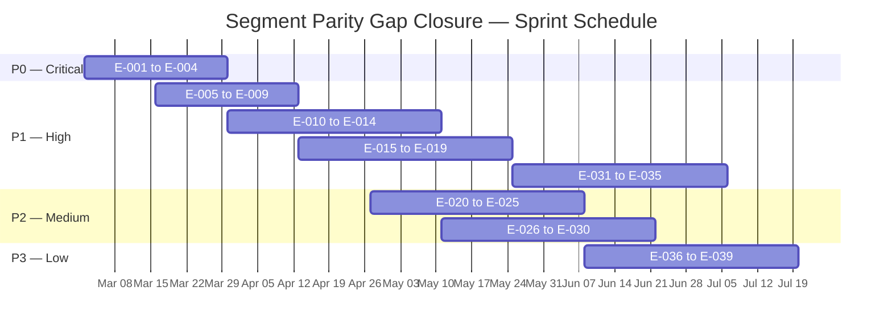
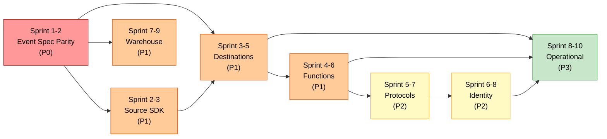

# Sprint Roadmap: Segment Parity Gap Closure

> **Document Type:** Epic Sequencing Roadmap — Autonomous Gap Closure Implementation
> **RudderStack Version:** `rudder-server` v1.68.1 (Go 1.26.0, Elastic License 2.0)
> **Overall Weighted Parity:** ~54% across 8 capability dimensions
> **Sprint Cadence:** 2-week sprints, 10 sprints total (20 weeks estimated)
> **Classification:** Initial-Run Deliverable — self-contained, actionable for autonomous implementation

---

## Table of Contents

- [Executive Summary](#executive-summary)
- [Prioritization Framework](#prioritization-framework)
- [Sprint Epics Overview](#sprint-epics-overview)
- [Sprint 1–2: Event Spec Parity](#sprint-12-event-spec-parity)
- [Sprint 2–3: Source SDK Compatibility](#sprint-23-source-sdk-compatibility)
- [Sprint 3–5: Destination Connector Expansion](#sprint-35-destination-connector-expansion)
- [Sprint 4–6: Transformation and Functions Framework](#sprint-46-transformation-and-functions-framework)
- [Sprint 5–7: Protocols and Tracking Plan Enforcement](#sprint-57-protocols-and-tracking-plan-enforcement)
- [Sprint 6–8: Identity Resolution and Profiles](#sprint-68-identity-resolution-and-profiles)
- [Sprint 7–9: Warehouse Feature Enhancement](#sprint-79-warehouse-feature-enhancement)
- [Sprint 8–10: Operational Tooling and Monitoring](#sprint-810-operational-tooling-and-monitoring)
- [Phase 2: Deferred Features](#phase-2-deferred-features)
- [Dependencies and Risk Matrix](#dependencies-and-risk-matrix)
- [Summary](#summary)

---

## Executive Summary

This roadmap sequences the autonomous implementation of all gaps identified in the [Segment Parity Gap Report](./index.md). The gap analysis evaluated RudderStack (`rudder-server` v1.68.1) against Twilio Segment across **eight capability dimensions** — event spec, destination catalog, source catalog, functions, protocols, identity resolution, warehouse sync, and operational infrastructure — and found an overall weighted parity of approximately 54% (Event Spec parity now at 100% following Sprint 1–2 completion).

**Scope:** This roadmap covers all eight gap dimensions plus cross-cutting operational tooling. Each sprint section references a detailed dimension-specific gap report, links to source code citations, and defines explicit success criteria for autonomous implementation.

**Methodology:** Epics are prioritized by migration-blocking impact, dependency ordering, and implementation complexity. The critical path flows from Event Spec (foundation) through SDK Compatibility (adoption enablement) to Destination Expansion (production coverage), with enterprise governance features (Protocols, Identity) running in parallel once the core pipeline is validated.

**Timeline:** 10 overlapping 2-week sprints across 20 weeks. Sprints overlap where dependency chains allow parallel execution. Each sprint assumes a full engineering team with access to the `rudder-server` codebase, the external Transformer service (`rudder-transformer`), and the Segment documentation reference (`refs/segment-docs/`).

**Dimension-Specific Gap Reports:**

| Dimension | Parity | Report |
|-----------|--------|--------|
| Event Spec | **100%** ✅ | [Event Spec Parity Analysis](./event-spec-parity.md) |
| Destination Catalog | ~25–30% | [Destination Catalog Parity Analysis](./destination-catalog-parity.md) |
| Source Catalog | ~60% | [Source Catalog Parity Analysis](./source-catalog-parity.md) |
| Functions | ~40% | [Functions Parity Analysis](./functions-parity.md) |
| Protocols | ~30% | [Protocols Parity Analysis](./protocols-parity.md) |
| Identity Resolution | ~20% | [Identity Parity Analysis](./identity-parity.md) |
| Warehouse Sync | ~80% | [Warehouse Parity Analysis](./warehouse-parity.md) |
| Privacy & Governance | ~70% | Covered in [Protocols Parity Analysis](./protocols-parity.md) |

Source: `README.md:66-84` | Source: `gateway/openapi.yaml:1-435`

---

## Prioritization Framework

All gap closure epics are assigned a priority level based on migration-blocking impact and adoption dependency. The framework ensures that foundational capabilities are implemented first, enabling downstream features to build upon validated infrastructure.

### Priority Definitions

| Priority | Label | Criteria | Sprint Window |
|----------|-------|----------|---------------|
| **P0** | Critical | Core Segment API behavioral parity — required for **any** migration from Segment to RudderStack. Without these, no Segment customer can switch. | Sprint 1–2 |
| **P1** | High | Destination coverage, SDK compatibility, and transformation framework — required for **production adoption** by teams with existing Segment integrations. | Sprint 2–5 |
| **P2** | Medium | Protocol enforcement, identity resolution, and governance features — required for **enterprise adoption** with data quality and compliance requirements. | Sprint 5–8 |
| **P3** | Low | Advanced operational features, edge-case connectors, and performance optimization — **enhancement features** that improve operational maturity. | Sprint 8–10 |

### Priority Matrix

The following diagram maps each gap dimension by parity level (vertical) against estimated remediation effort (horizontal). Dimensions in the lower-right quadrant (low parity, high effort) represent the largest strategic investments.

```mermaid
quadrantChart
    title Gap Closure Priority Matrix — Impact vs Effort
    x-axis "Low Effort" --> "High Effort"
    y-axis "Low Parity" --> "High Parity"
    quadrant-1 "Maintain & Monitor"
    quadrant-2 "Quick Wins"
    quadrant-3 "Strategic Investment"
    quadrant-4 "Deprioritize"
    "Event Spec 100% (P0 ✅)": [0.10, 1.00]
    "Warehouse ~80% (P1)": [0.30, 0.80]
    "Privacy ~70% (P2)": [0.35, 0.70]
    "Sources ~60% (P1)": [0.50, 0.60]
    "Functions ~40% (P1)": [0.65, 0.40]
    "Protocols ~30% (P2)": [0.60, 0.30]
    "Destinations ~28% (P1)": [0.80, 0.28]
    "Identity ~20% (P2)": [0.90, 0.20]
```

### Priority Assignment Table

| Priority | Gap Dimension | Current Parity | Impact | Effort | Sprint Target |
|----------|--------------|----------------|--------|--------|---------------|
| **P0** ✅ | Event Spec | **100%** | Migration-blocking — payload parity is the acceptance criterion — **COMPLETE** | Low | Sprint 1–2 |
| **P1** | Source SDK Compatibility | ~60% | Adoption-blocking — SDKs must connect without code changes | Medium | Sprint 2–3 |
| **P1** | Destination Connectors | ~25–30% | Production-blocking — customers need their existing destinations | Very High | Sprint 3–5 |
| **P1** | Functions / Transforms | ~40% | Production-blocking — custom logic required for most deployments | High | Sprint 4–6 |
| **P1** | Warehouse Enhancement | ~80% | Production — selective sync and backfill are enterprise requirements | Medium | Sprint 7–9 |
| **P2** | Protocols / Tracking Plans | ~30% | Enterprise-blocking — data governance required for regulated industries | High | Sprint 5–7 |
| **P2** | Identity Resolution | ~20% | Enterprise-blocking — unified profiles required for personalization | Very High | Sprint 6–8 |
| **P3** | Operational Tooling | N/A | Enhancement — monitoring, alerting, and replay controls | Medium | Sprint 8–10 |

---

## Sprint Epics Overview

### Sprint Structure

- **Sprint duration:** 2 weeks
- **Overlap model:** Sprints overlap where dependency chains allow (e.g., Sprint 3 can begin Destination work while Sprint 2 completes Source SDK validation)
- **Capacity assumption:** Full engineering team with Go, JavaScript, and Python expertise
- **Infrastructure assumption:** Access to `rudder-server`, `rudder-transformer`, PostgreSQL, and all supported warehouse/stream destinations for integration testing

### Gantt Chart



### Epic Dependency Flow

The following diagram shows the dependency chain between sprint epics. Downstream epics require upstream capabilities to be validated before implementation can begin.



---

## Sprint 1–2: Event Spec Parity

> **Status: ✅ COMPLETE**

**Priority:** P0 — Critical
**Duration:** 2 sprints (4 weeks)
**Current Parity:** **100%** ✅
**Target Parity:** 100%
**Reference:** [Event Spec Parity Analysis](./event-spec-parity.md)

### Objective

Validate and close the remaining ~5% gap in Segment Spec event parity. All six core event types (`identify`, `track`, `page`, `screen`, `group`, `alias`) must route and transform identically to Segment behavior at the payload field level — this is the acceptance criterion per project requirements.

### Epic Breakdown

| Epic ID | Title | Description | Effort | Status |
|---------|-------|-------------|--------|--------|
| **E-001** | Validate 6 event type payload schemas | Field-by-field validation that all payload schemas for `identify`, `track`, `page`, `screen`, `group`, and `alias` match the Segment Spec definitions. Verify `IdentifyPayload`, `TrackPayload`, `PagePayload`, `ScreenPayload`, `GroupPayload`, `AliasPayload` in the Gateway OpenAPI spec. | 3 days | ✅ COMPLETE |
| **E-002** | Validate `context` object field support | Ensure all 18 standard Segment `context` fields are supported: `active`, `app`, `campaign`, `channel`, `device`, `ip`, `library`, `locale`, `network`, `os`, `page`, `referrer`, `screen`, `timezone`, `groupId`, `traits`, `userAgent`, `userAgentData`. Verify structured Client Hints (`context.userAgentData`) pass-through in Gateway and downstream pipeline stages. | 3 days | ✅ COMPLETE |
| **E-003** | Validate common fields across all event types | Verify `anonymousId`, `userId`, `messageId`, `timestamp`, `sentAt`, `receivedAt`, `originalTimestamp`, `context`, `integrations`, `type`, `version`, `channel` are correctly handled across all 6 event types. Validate clock skew correction formula: `timestamp = receivedAt - (sentAt - originalTimestamp)`. | 2 days | ✅ COMPLETE |
| **E-004** | Implement missing field transformations | Address remaining gaps: structured Client Hints parsing for `context.userAgentData`, semantic event category routing enforcement (e.g., ensuring `track` calls for e-commerce events follow Segment's semantic event naming), and reserved trait validation for `identify` calls. | 5 days | ✅ COMPLETE |

### Source Citations

- `Source: gateway/openapi.yaml:14-435` — All 6 endpoint definitions with payload schemas
- `Source: gateway/openapi.yaml:688-940` — Schema definitions for all payload types
- `Source: gateway/openapi.yaml:677-686` — Security scheme definitions (writeKeyAuth)
- `Source: refs/segment-docs/src/connections/spec/identify.md` — Segment Identify spec
- `Source: refs/segment-docs/src/connections/spec/track.md` — Segment Track spec
- `Source: refs/segment-docs/src/connections/spec/page.md` — Segment Page spec
- `Source: refs/segment-docs/src/connections/spec/screen.md` — Segment Screen spec
- `Source: refs/segment-docs/src/connections/spec/group.md` — Segment Group spec
- `Source: refs/segment-docs/src/connections/spec/alias.md` — Segment Alias spec
- `Source: refs/segment-docs/src/connections/spec/common.md:12-299` — Common fields and context object

### Success Criteria

- [x] 100% field-level parity for all 6 event types confirmed via automated payload comparison tests
- [x] All 18 standard `context` fields pass through Gateway, Processor, Router, and into warehouse destinations without data loss
- [x] Clock skew correction formula produces identical `timestamp` values to Segment for identical input payloads
- [x] Structured Client Hints in `context.userAgentData` are preserved end-to-end
- [x] Semantic event categories (e-commerce, video, mobile lifecycle) are routed identically to Segment behavior

---

## Sprint 2–3: Source SDK Compatibility

**Priority:** P1 — High
**Duration:** 2 sprints (4 weeks)
**Current Parity:** ~60%
**Target Parity:** ~85%
**Reference:** [Source Catalog Parity Analysis](./source-catalog-parity.md)

### Objective

Validate that all Segment SDKs (web, mobile, server-side) can connect to the RudderStack Gateway without code modification beyond endpoint URL and Write Key substitution. Address cloud source ingestion gaps for the highest-demand cloud app sources.

### Epic Breakdown

| Epic ID | Title | Description | Effort |
|---------|-------|-------------|--------|
| **E-005** | Validate Gateway Segment-compatible API surface | Comprehensive integration testing of all `/v1/{type}` endpoints on port 8080 with Segment SDK client libraries. Validate Write Key Basic Auth scheme (`Authorization: Basic base64(writeKey:)`) matches Segment's authentication exactly. | 3 days |
| **E-006** | JavaScript web SDK compatibility testing | End-to-end testing with `analytics.js` / Analytics 2.0 against the Gateway. Validate all 6 Spec calls, batch endpoint (`/v1/batch`), and beacon tracking (`/beacon/v1/batch`). Document any device-mode limitations. | 3 days |
| **E-007** | iOS and Android mobile SDK compatibility testing | Integration testing with `analytics-ios` (Swift) and `analytics-android` (Kotlin) against the Gateway. Validate `identify`, `track`, `screen`, `group`, `alias` calls, context auto-collection fields, and lifecycle events. | 5 days |
| **E-008** | Server-side SDK compatibility testing | Integration testing with Node.js (`analytics-node`), Python (`analytics-python`), Go (`analytics-go`), Java (`analytics-java`), and Ruby (`analytics-ruby`) SDKs. Validate batch endpoint usage and retry behavior. | 5 days |
| **E-009** | Cloud source ingestion framework design | Design and prototype the cloud source ingestion framework to address the 140 cloud app source gap (Salesforce, Stripe, HubSpot, Zendesk, etc.). Define the polling/webhook architecture, credential management, and schema mapping layer. Priority: top-20 cloud sources by adoption. | 8 days |

### Source Citations

- `Source: gateway/handle_http_auth.go:24-58` — Write Key authentication middleware implementation
- `Source: gateway/handle_http_auth.go:64-96` — Webhook authentication middleware
- `Source: gateway/handle_http_auth.go:101-127` — Source ID authentication for internal endpoints
- `Source: gateway/openapi.yaml:14-435` — All public endpoint definitions with authentication requirements
- `Source: refs/segment-docs/src/connections/sources/catalog/` — Segment source catalog structure

### Success Criteria

- [ ] All Segment SDKs (JS, iOS, Android, Node.js, Python, Go, Java, Ruby) connect to RudderStack Gateway with endpoint URL swap only
- [ ] Write Key Basic Auth is 100% compatible — no SDK-side authentication code changes required
- [ ] Batch endpoint (`/v1/batch`) accepts mixed event types from all server-side SDKs
- [ ] Beacon and pixel endpoints accept web SDK requests
- [ ] Cloud source framework design document approved with architecture for top-20 cloud sources

---

## Sprint 3–5: Destination Connector Expansion

**Priority:** P1 — High
**Duration:** 3 sprints (6 weeks)
**Current Parity:** ~25–30%
**Target Parity:** ~50% (top-100 destinations covered)
**Reference:** [Destination Catalog Parity Analysis](./destination-catalog-parity.md)

### Objective

Expand destination connector coverage from the current ~93 connectors toward Segment's top-100 most-adopted destinations. Validate payload parity for all existing shared connectors.

### Current State

RudderStack supports approximately 93 destination connectors across three delivery tiers:
- **14 stream destinations** via the Custom Destination Manager — KINESIS, KAFKA, AZURE_EVENT_HUB, FIREHOSE, EVENTBRIDGE, GOOGLEPUBSUB, CONFLUENT_CLOUD, PERSONALIZE, GOOGLESHEETS, BQSTREAM, LAMBDA, GOOGLE_CLOUD_FUNCTION, WUNDERKIND, plus REDIS (KV store)
- **9 warehouse connectors** in the dedicated warehouse service
- **~70 cloud REST destinations** delivered via the Router

Segment's active catalog contains 503 entries (416 PUBLIC + 87 PUBLIC_BETA), with approximately 400 unique platforms after deduplication of `actions-*` variants.

Source: `router/customdestinationmanager/customdestinationmanager.go:79` | Source: `services/streammanager/streammanager.go:24-58`

### Epic Breakdown

| Epic ID | Title | Description | Effort |
|---------|-------|-------------|--------|
| **E-010** | Prioritize top-50 missing destinations | Rank missing Segment destinations by enterprise adoption and customer demand. Key targets: Braze (Actions), Amplitude (Actions), HubSpot (Actions), Salesforce (Actions), Mixpanel (Actions), Google Analytics 4, Facebook Conversions API, Klaviyo (Actions). | 3 days |
| **E-011** | Implement high-priority cloud destination batch 1 | Implement 20 highest-priority missing cloud destination connectors in `rudder-transformer`. Each connector requires payload mapping, authentication integration, rate limit handling, and error classification. | 15 days |
| **E-012** | Implement high-priority cloud destination batch 2 | Implement next 20 priority missing cloud destination connectors. Leverage patterns established in batch 1 for accelerated implementation. | 12 days |
| **E-013** | Validate payload parity for existing connectors | Field-by-field payload comparison between RudderStack and Segment output for all ~93 existing shared connectors. Generate payload diff reports identifying any transformation discrepancies. | 8 days |
| **E-014** | Implement missing stream destinations | Add stream destination producers for any high-priority streaming platforms not yet covered. Extend the `services/streammanager/` package following the existing `common.StreamProducer` interface pattern. | 5 days |

### Source Citations

- `Source: router/customdestinationmanager/customdestinationmanager.go:79` — `ObjectStreamDestinations` array defining all 13 stream destinations
- `Source: router/customdestinationmanager/customdestinationmanager.go:80` — `KVStoreDestinations` array (Redis)
- `Source: services/streammanager/streammanager.go:24-58` — `NewProducer` switch statement mapping all 13 stream destination types
- `Source: refs/segment-docs/src/connections/destinations/catalog/` — 648 catalog directory entries
- `Source: refs/segment-docs/src/_data/catalog/destinations.yml` — 503 active catalog items

### Success Criteria

- [ ] Top-100 Segment destinations covered (measured by unique platform overlap)
- [ ] Payload parity validated for all existing shared connectors — zero field-level discrepancies in core event payloads
- [ ] All new connectors implement authentication, retry logic, rate limiting, and error classification
- [ ] Actions-based destination architecture assessment complete with implementation plan

---

## Sprint 4–6: Transformation and Functions Framework

**Priority:** P1 — High
**Duration:** 3 sprints (6 weeks)
**Current Parity:** ~40%
**Target Parity:** ~80%
**Reference:** [Functions Parity Analysis](./functions-parity.md)

### Objective

Implement a Segment-compatible Functions runtime that supports Source Functions (custom webhook ingestion), Destination Functions (custom delivery logic), and Insert Functions (pre-destination transformation hooks) with a workspace-level management API.

### Current State

RudderStack provides user transforms (batch size 200) and destination transforms (batch size 100) via the external Transformer service (port 9090). The `usertransformer` package re-exports the internal user transformer client. Transforms operate in batch mode via the Processor's six-stage pipeline — there is no self-contained Functions runtime, no per-event typed handlers, and no workspace-level Function management API.

Source: `processor/usertransformer/usertransformer.go:1-19` | Source: `processor/pipeline_worker.go:32-37`

### Epic Breakdown

| Epic ID | Title | Description | Effort |
|---------|-------|-------------|--------|
| **E-015** | Implement Source Functions runtime | Build a custom source function runtime that receives HTTP webhooks via a new Gateway endpoint, executes user-defined JavaScript handlers (`onRequest(request, settings)`), and produces Segment Spec events for the pipeline. Must support `Segment.identify()`, `Segment.track()`, `Segment.group()`, `Segment.page()`, `Segment.screen()`, `Segment.alias()` event creation within the handler. | 10 days |
| **E-016** | Implement Destination Functions runtime | Build a custom destination function runtime with per-event typed handlers (`onTrack()`, `onIdentify()`, `onPage()`, `onScreen()`, `onGroup()`, `onAlias()`, `onDelete()`, `onBatch()`). Must support external API calls via `fetch()` and typed error handling (`EventNotSupported`, `InvalidEventPayload`, `ValidationError`, `RetryError`, `DropEvent`). | 10 days |
| **E-017** | Implement Insert Functions | Add pre-destination transformation hooks that execute user-defined JavaScript between the Processor output and Router input. Insert Functions receive typed events and can transform, filter, or enrich before delivery to the configured destination. | 6 days |
| **E-018** | Expose Functions management API | Build REST API for programmatic Function management: create, read, update, delete, list functions. Support function versioning (save/deploy independently), workspace scoping, and test invocation endpoint with sample event execution. | 8 days |
| **E-019** | Add Functions environment variable and secret management | Implement per-function settings and secrets storage, scoped to function handlers. Support encrypted secret storage with runtime injection, differentiating between configuration values and sensitive secrets. | 4 days |

### Source Citations

- `Source: processor/usertransformer/usertransformer.go:1-19` — User Transformer re-export package
- `Source: processor/internal/transformer/user_transformer/user_transformer.go:67` — User transform batch size of 200
- `Source: processor/internal/transformer/destination_transformer/destination_transformer.go:82` — Destination transform batch size of 100
- `Source: refs/segment-docs/src/connections/functions/source-functions.md:10-42` — Source Functions spec and `onRequest()` handler
- `Source: refs/segment-docs/src/connections/functions/destination-functions.md:9-74` — Destination Functions spec with typed handlers
- `Source: refs/segment-docs/src/connections/functions/insert-functions.md:68-78` — Insert Functions handler list

### Success Criteria

- [ ] Source Functions can receive arbitrary HTTP webhooks and produce valid Segment Spec events
- [ ] Destination Functions process events with per-event typed handlers matching Segment's handler signatures
- [ ] Insert Functions intercept events pre-destination with transform/filter/enrich capabilities
- [ ] Functions API supports full CRUD lifecycle with versioning
- [ ] Per-function secrets are encrypted at rest and injected at runtime

---

## Sprint 5–7: Protocols and Tracking Plan Enforcement

**Priority:** P2 — Medium
**Duration:** 3 sprints (6 weeks)
**Current Parity:** ~30%
**Target Parity:** ~75%
**Reference:** [Protocols Parity Analysis](./protocols-parity.md)

### Objective

Enhance RudderStack's tracking plan validation from basic Transformer-delegated validation to a comprehensive Protocols enforcement suite with anomaly detection, configurable enforcement modes, and a workspace-level tracking plan management API.

### Current State

The `TrackingPlanStatT` struct tracks validation metrics (events, success, failed, filtered, validation time). The `validateEvents()` function sends events to the external Transformer service for validation when a `TrackingPlanID` is configured. The `reportViolations()` function injects `violationErrors`, `trackingPlanId`, and `trackingPlanVersion` into the event `context` object, gated by the `propagateValidationErrors` toggle. Consent filtering supports OneTrust, Ketch, and Generic CMP providers with OR/AND resolution semantics.

Source: `processor/trackingplan.go:16-22` (TrackingPlanStatT) | Source: `processor/trackingplan.go:26-49` (reportViolations) | Source: `processor/trackingplan.go:69-142` (validateEvents) | Source: `processor/consent.go:16-95` (consent management)

### Epic Breakdown

| Epic ID | Title | Description | Effort |
|---------|-------|-------------|--------|
| **E-020** | Enhance tracking plan schema validation | Upgrade validation to full JSON Schema draft-07 support including required properties, regex patterns, nested objects, enum values, and type enforcement (any, array, object, boolean, integer, number, string, null, Date time). Support Common JSON Schema applied to all events from connected sources. | 8 days |
| **E-021** | Implement anomaly detection | Build anomaly detection that automatically flags events and properties not present in the tracking plan. Track new/unexpected event types, unexpected properties on known events, and property type violations over configurable time windows. | 8 days |
| **E-022** | Add configurable enforcement modes | Implement three enforcement modes configurable per source and per call type: **Block Event** (reject entirely), **Omit Properties** (strip non-conforming properties, pass event), **Allow** (pass event with violation metadata). Replace the binary `propagateValidationErrors` toggle with granular enforcement. | 6 days |
| **E-023** | Implement forward-blocked-events capability | Add server-to-server forwarding of blocked events to an alternative source to prevent permanent data loss. Blocked events should carry full violation metadata and the original payload for debugging. | 4 days |
| **E-024** | Add tracking plan versioning and management API | Build a workspace-level REST API for tracking plan CRUD operations: create, read, update, delete, list, version history. Support CSV import/export (up to 100,000 rows, 2,000 rules). Add labels and keyword filtering for event organization. | 8 days |
| **E-025** | Integrate consent management with Protocols enforcement | Connect the consent filtering pipeline (`processor/consent.go`) with Protocols enforcement so that consent-denied events are handled according to tracking plan enforcement rules. Add Consent Preference Updated event auto-generation for tracking plans with consent management enabled. | 4 days |

### Source Citations

- `Source: processor/trackingplan.go:16-22` — `TrackingPlanStatT` struct with validation metrics
- `Source: processor/trackingplan.go:26-49` — `reportViolations()` injecting violation metadata into event context
- `Source: processor/trackingplan.go:69-142` — `validateEvents()` delegating to external Transformer service
- `Source: processor/trackingplan.go:95` — Transformer client validation call
- `Source: processor/consent.go:16-36` — `ConsentManagementInfo` and `GenericConsentManagementProviderData` structs
- `Source: processor/consent.go:44-95` — `getConsentFilteredDestinations()` with OR/AND resolution
- `Source: processor/consent.go:67-75` — Resolution strategy switch: OR requires at least one consent, AND requires all consents
- `Source: refs/segment-docs/src/protocols/index.md` — Segment Protocols overview
- `Source: refs/segment-docs/src/protocols/tracking-plan/create.md` — Tracking Plan editor and schema inference
- `Source: refs/segment-docs/src/protocols/enforce/schema-configuration.md` — Enforcement modes

### Success Criteria

- [ ] Full JSON Schema draft-07 validation with required properties, regex, enum, and nested object support
- [ ] Anomaly detection flags unexpected events and properties automatically
- [ ] Three enforcement modes (Block, Omit, Allow) are configurable per source per call type
- [ ] Blocked events are forwarded to an alternative source without data loss
- [ ] Tracking plan management API supports CRUD, versioning, and CSV import/export
- [ ] Consent management integrates with Protocols enforcement decisions

---

## Sprint 6–8: Identity Resolution and Profiles

**Priority:** P2 — Medium
**Duration:** 3 sprints (6 weeks)
**Current Parity:** ~20%
**Target Parity:** ~60%
**Reference:** [Identity Parity Analysis](./identity-parity.md)

### Objective

Implement a real-time identity graph and Profiles API that extends beyond the current warehouse-only merge-rule resolution. This is the largest architectural gap — RudderStack currently resolves identity only during warehouse uploads, while Segment resolves identity in real-time as events arrive.

### Current State

The `Identity` struct in `warehouse/identity/identity.go` implements a two-property merge-rule model (`merge_property_1_type/value`, `merge_property_2_type/value`) that resolves identity by mapping merge rules to `rudder_id` values during warehouse upload cycles. The `applyRule()` function handles three resolution strategies: new identity (generate UUID), single match (reuse existing `rudder_id`), and multiple matches (unify under first `rudder_id`). The `Resolve()` method orchestrates the process within a single PostgreSQL transaction. There is no real-time identity graph, no Profiles API, and no computed traits.

Source: `warehouse/identity/identity.go:36-60` (Identity struct and WarehouseManager interface) | Source: `warehouse/identity/identity.go:78-206` (applyRule resolution algorithm) | Source: `warehouse/identity/identity.go:600-631` (Resolve and ResolveHistoricIdentities)

### Epic Breakdown

| Epic ID | Title | Description | Effort |
|---------|-------|-------------|--------|
| **E-026** | Implement real-time identity graph | Design and build a real-time identity resolution service that processes identity events (identify, alias, group) as they flow through the pipeline, maintaining a persistent identity graph with `rudder_id` as the canonical identifier. The graph must support the three existing resolution strategies (new, single match, multi-match) in real-time, not just during warehouse uploads. | 15 days |
| **E-027** | Implement Profiles API | Build a REST API for programmatic access to resolved profiles: query traits, event history, and external IDs by `rudder_id` or any external identifier. Target sub-200ms response time for profile lookups. Support pagination for event history and external ID listings. | 10 days |
| **E-028** | Add external ID mapping | Extend the identity model beyond the current `merge_property_1/merge_property_2` two-property model to support multiple external identifiers per profile (e.g., `user_id`, `email`, `anonymous_id`, `ios.id`, `android.id`, phone, and custom identifiers). Implement `context.externalIds` processing from event payloads. | 8 days |
| **E-029** | Implement profile sync to destinations | Build a profile sync mechanism that pushes resolved identity profiles to downstream destinations and warehouses continuously. Profile changes (new traits, merged identities, new external IDs) should trigger incremental syncs to configured destinations. | 8 days |
| **E-030** | Add identity resolution settings | Implement configurable identity resolution controls: blocked values (regex/exact match to prevent merge-all scenarios), per-identifier limits (weekly/monthly/annually/ever), priority ranking for conflict resolution, and merge protection to prevent unintended identity merges. | 6 days |

### Source Citations

- `Source: warehouse/identity/identity.go:36-38` — `WarehouseManager` interface with `DownloadIdentityRules`
- `Source: warehouse/identity/identity.go:40-48` — `Identity` struct with warehouse, db, uploader, warehouseManager dependencies
- `Source: warehouse/identity/identity.go:62-75` — Table name generation: `mergeRulesTable()`, `mappingsTable()`, `whMergeRulesTable()`, `whMappingsTable()`
- `Source: warehouse/identity/identity.go:78-100` — `applyRule()` merge property query logic
- `Source: warehouse/identity/identity.go:600-631` — `Resolve()` and `ResolveHistoricIdentities()` public methods
- `Source: refs/segment-docs/src/unify/index.md` — Segment Unify capabilities overview
- `Source: refs/segment-docs/src/unify/identity-resolution/index.md` — Identity graph resolution flow
- `Source: refs/segment-docs/src/unify/identity-resolution/identity-resolution-settings.md` — Resolution settings (blocked values, limits, priority)

### Success Criteria

- [ ] Real-time identity graph resolves identities as events flow through the pipeline (not batch-only)
- [ ] Profiles API returns resolved profiles with traits, external IDs, and event history in <200ms
- [ ] External ID model supports 12+ identifier types beyond the current two-property model
- [ ] Profile sync pushes identity changes to configured downstream destinations
- [ ] Identity resolution settings provide merge protection, blocked values, and per-identifier limits

---

## Sprint 7–9: Warehouse Feature Enhancement

**Priority:** P1 — High
**Duration:** 3 sprints (6 weeks)
**Current Parity:** ~80%
**Target Parity:** ~95%
**Reference:** [Warehouse Parity Analysis](./warehouse-parity.md)

### Objective

Close the remaining ~20% gap in warehouse sync capabilities by implementing selective sync, enhanced health monitoring, configurable backfill, and warehouse replay from archived events.

### Current State

RudderStack supports 9 warehouse connectors with a 7-state upload state machine, Parquet/JSON/CSV encoding, and Snowpipe Streaming for Snowflake. Idempotent sync is achieved through per-connector merge/dedup strategies (SQL MERGE, DELETE+INSERT, engine-level dedup, dedup views). The archiver provides event archival with 10-day retention in gzipped JSONL format.

Source: `warehouse/integrations/` (9 connector implementations) | Source: `warehouse/router/state.go:19-82` (7-state upload state machine)

### Epic Breakdown

| Epic ID | Title | Description | Effort |
|---------|-------|-------------|--------|
| **E-031** | Validate idempotent sync across all 9 connectors | Comprehensive integration testing of idempotent sync semantics for all 9 warehouse connectors. Verify that replay/retry scenarios produce identical warehouse state. Test merge strategies: SQL MERGE (Snowflake, Delta Lake, PostgreSQL), DELETE+INSERT (Redshift), dedup views (BigQuery), engine-level (ClickHouse), bulk CopyIn (MSSQL, Azure Synapse), and append-only (Datalake). | 8 days |
| **E-032** | Implement backfill with configurable date ranges | Build a warehouse-level backfill API endpoint that triggers historical data sync for a specified date range, source, and warehouse destination. Support backfill from archiver (within retention window) and from staging files stored in object storage. Implement a backfill state that integrates with the existing 7-state upload machine. | 10 days |
| **E-033** | Enhance warehouse health monitoring | Build a warehouse sync health monitoring system with per-upload metrics: sync status, duration, row counts, error classification, schema changes. Expose as Prometheus metrics and a dedicated HTTP API for dashboard integration. Add alerting thresholds for sync failures, latency spikes, and row count anomalies. | 8 days |
| **E-034** | Add warehouse selective sync | Implement per-table and per-column sync filtering, allowing users to include or exclude specific tables and columns from warehouse sync. Configuration via backend-config with runtime filtering in the load file generation stage. | 6 days |
| **E-035** | Implement warehouse replay from archived events | Build an end-to-end replay pipeline: archiver → replay handler → Gateway → Processor → warehouse. Enable warehouse-targeted replay that re-processes archived events through the warehouse pipeline only, bypassing real-time destination routing. | 8 days |

### Source Citations

- `Source: warehouse/integrations/snowflake/snowflake.go:433-520` — Snowflake SQL MERGE strategy
- `Source: warehouse/integrations/bigquery/bigquery.go:150-250` — BigQuery dedup views
- `Source: warehouse/integrations/redshift/redshift.go:481-560` — Redshift DELETE+INSERT in transaction
- `Source: warehouse/integrations/clickhouse/clickhouse.go:843-870` — ClickHouse AggregatingMergeTree dedup
- `Source: warehouse/integrations/deltalake/deltalake.go:838-850` — Delta Lake SQL MERGE with partition pruning
- `Source: warehouse/router/state.go:19-82` — 7-state upload state machine
- `Source: warehouse/encoding/encoding.go:1-92` — Parquet/JSON/CSV encoding factory
- `Source: refs/segment-docs/src/connections/storage/` — Segment warehouse sync documentation

### Success Criteria

- [ ] All 9 connectors demonstrate idempotent sync: replaying the same events produces identical warehouse state
- [ ] Backfill API supports configurable date range, source, and destination parameters
- [ ] Health monitoring exposes per-upload metrics via Prometheus and HTTP API
- [ ] Selective sync filters tables and columns at the load file generation stage
- [ ] Warehouse replay re-processes archived events through the warehouse pipeline end-to-end

---

## Sprint 8–10: Operational Tooling and Monitoring

**Priority:** P3 — Low
**Duration:** 3 sprints (6 weeks)
**Current Parity:** N/A (cross-cutting)
**Target Parity:** Segment-equivalent operational maturity
**Reference:** Cross-cutting across all dimensions

### Objective

Implement comprehensive operational tooling for pipeline monitoring, alerting, advanced replay controls, and capacity planning — achieving operational feature parity with Segment's monitoring and alerting capabilities.

### Epic Breakdown

| Epic ID | Title | Description | Effort |
|---------|-------|-------------|--------|
| **E-036** | Implement event delivery monitoring dashboard | Build a monitoring dashboard exposing per-destination delivery metrics: success/failure rates, latency percentiles (p50/p95/p99), throughput (events/sec), retry counts, and circuit breaker states. Expose as Prometheus metrics and HTTP API for Grafana/custom UI integration. | 10 days |
| **E-037** | Add configurable alerting for pipeline health | Implement alerting rules for pipeline health conditions: throughput drop below threshold, error rate spike, destination delivery failures exceeding limit, warehouse sync latency exceeding SLA, and JobsDB queue depth exceeding capacity. Support webhook, email, and Slack notification channels. | 8 days |
| **E-038** | Implement advanced replay controls | Extend the replay system beyond the current basic replay handler (`gateway/handle_http_replay.go`) to support: source-level replay (replay events for a specific source only), date-range replay (configurable start/end timestamps), destination-level replay (replay to specific destinations only), and dry-run mode (validate replay without persisting). | 8 days |
| **E-039** | Add pipeline performance profiling and capacity planning | Build performance profiling tools that measure per-stage pipeline throughput: Gateway ingestion rate, Processor stage latencies (per-stage: preprocess, src hydration, pre-transform, user transform, dest transform, store), Router delivery rate, and warehouse upload rate. Generate capacity planning reports targeting the 50,000 events/sec throughput requirement with ordering guarantees. | 8 days |

### Source Citations

- `Source: gateway/handle_http_replay.go` — Replay HTTP handler
- `Source: backend-config/replay_types.go` — Replay type definitions
- `Source: archiver/` — Event archival worker with 10-day retention
- `Source: router/throttler/` — GCRA-based destination throttling
- `Source: gateway/throttler/` — Gateway-level rate limiting
- `Source: config/config.yaml` — 200+ tunable pipeline parameters

### Success Criteria

- [ ] Per-destination delivery metrics exposed via Prometheus and HTTP API
- [ ] Alerting rules trigger notifications for pipeline health anomalies
- [ ] Replay supports source-level, date-range, and destination-level filtering
- [ ] Capacity planning reports document configuration for 50,000 events/sec throughput
- [ ] Performance profiling measures per-stage latencies across the full pipeline

---

## Phase 2: Deferred Features

The following features are **explicitly out of scope** for Phase 1 per project requirements. They are documented here for sprint planning continuity and will be addressed in subsequent phases.

### Segment Engage / Campaigns

Segment Engage provides audience building, journey orchestration, and campaign management capabilities. These features enable marketing teams to create user segments from traits and behaviors, build multi-step journeys with conditional branching, and execute campaigns across email, SMS, push, and in-app channels.

**Phase 2 scope includes:**
- Audience builder with computed trait filters and event-based conditions
- Journey orchestration with step types: wait, branch, split, send
- Campaign management across multiple notification channels
- Real-time audience membership synced to destinations

**Rationale for deferral:** Engage depends on Identity Resolution (Phase 1 Sprint 6–8) and the Profiles API (E-027). Audience building requires computed traits (E-026 extends to support this). These foundational capabilities must be validated before building Engage on top.

### Reverse ETL

Reverse ETL enables syncing data from warehouse tables back to SaaS destinations (e.g., Salesforce, HubSpot, Marketo). RudderStack has partial support via the `/internal/v1/retl` endpoint and the rETL handler, but the warehouse-to-destination sync pipeline, incremental change detection, and mapping UI are not yet equivalent to Segment's Reverse ETL product.

**Phase 2 scope includes:**
- Warehouse-to-destination sync pipeline with incremental change detection
- SQL model configuration for defining source queries
- Mapping UI for warehouse columns to destination fields
- Configurable sync scheduling (hourly, daily, custom intervals)

**Rationale for deferral:** Reverse ETL depends on warehouse connectors (Phase 1 Sprint 7–9) and the destination connector expansion (Phase 1 Sprint 3–5). The bi-directional data flow architecture requires both read and write paths to be validated.

### Advanced Personalization

Real-time audience membership for personalization engines — enabling marketing and product teams to serve personalized content based on profile traits, computed scores, and audience membership.

**Phase 2 scope includes:**
- Real-time audience membership queries via Profiles API
- Personalization engine integration (Optimizely, LaunchDarkly, custom)
- Trait-based content decisioning
- A/B test audience allocation

**Rationale for deferral:** Depends on Profiles API (E-027), computed traits (extension of E-026), and audience builder (Engage).

---

## Dependencies and Risk Matrix

### Epic Dependency Graph

The following diagram shows inter-epic dependencies. Critical path items are highlighted — delays in any critical path epic cascade to all downstream work.

```mermaid
flowchart TD
    subgraph P0["P0 — Critical"]
        E001["E-001: Payload Schemas"]
        E002["E-002: Context Fields"]
        E003["E-003: Common Fields"]
        E004["E-004: Field Transforms"]
    end

    subgraph P1_SDK["P1 — SDK"]
        E005["E-005: API Surface"]
        E006["E-006: JS SDK"]
        E007["E-007: Mobile SDKs"]
        E008["E-008: Server SDKs"]
        E009["E-009: Cloud Sources"]
    end

    subgraph P1_DEST["P1 — Destinations"]
        E010["E-010: Prioritize Top-50"]
        E011["E-011: Batch 1 (20)"]
        E012["E-012: Batch 2 (20)"]
        E013["E-013: Payload Parity"]
        E014["E-014: Stream Dests"]
    end

    subgraph P1_FUNC["P1 — Functions"]
        E015["E-015: Source Functions"]
        E016["E-016: Dest Functions"]
        E017["E-017: Insert Functions"]
        E018["E-018: Management API"]
        E019["E-019: Secrets Mgmt"]
    end

    subgraph P2_PROTO["P2 — Protocols"]
        E020["E-020: JSON Schema"]
        E021["E-021: Anomaly Detection"]
        E022["E-022: Enforcement Modes"]
        E023["E-023: Forward Blocked"]
        E024["E-024: TP Management API"]
        E025["E-025: Consent Integration"]
    end

    subgraph P2_IDR["P2 — Identity"]
        E026["E-026: RT Identity Graph"]
        E027["E-027: Profiles API"]
        E028["E-028: External IDs"]
        E029["E-029: Profile Sync"]
        E030["E-030: Resolution Settings"]
    end

    subgraph P1_WH["P1 — Warehouse"]
        E031["E-031: Idempotent Sync"]
        E032["E-032: Backfill API"]
        E033["E-033: Health Monitoring"]
        E034["E-034: Selective Sync"]
        E035["E-035: WH Replay"]
    end

    subgraph P3_OPS["P3 — Operations"]
        E036["E-036: Delivery Dashboard"]
        E037["E-037: Alerting"]
        E038["E-038: Adv Replay"]
        E039["E-039: Capacity Planning"]
    end

    E001 --> E005
    E002 --> E005
    E003 --> E005
    E004 --> E005
    E005 --> E010
    E006 --> E013
    E010 --> E011
    E011 --> E012
    E011 --> E015
    E015 --> E016
    E016 --> E017
    E017 --> E018
    E018 --> E019
    E020 --> E021
    E021 --> E022
    E022 --> E023
    E024 --> E025
    E026 --> E027
    E027 --> E028
    E028 --> E029
    E029 --> E030
    E031 --> E032
    E032 --> E035
    E033 --> E037
    E036 --> E039

    style P0 fill:#ffcccc,stroke:#cc0000,color:#000
    style P1_SDK fill:#ffcc99,stroke:#e65100,color:#000
    style P1_DEST fill:#ffcc99,stroke:#e65100,color:#000
    style P1_FUNC fill:#ffcc99,stroke:#e65100,color:#000
    style P2_PROTO fill:#fff9c4,stroke:#f9a825,color:#000
    style P2_IDR fill:#fff9c4,stroke:#f9a825,color:#000
    style P1_WH fill:#ffcc99,stroke:#e65100,color:#000
    style P3_OPS fill:#c8e6c9,stroke:#2e7d32,color:#000
```



### Critical Path

The longest dependency chain determines the minimum timeline for reaching full parity:

**Event Spec (E-001–E-004) → SDK Compatibility (E-005) → Destination Prioritization (E-010) → Destination Batch 1 (E-011) → Source Functions (E-015) → Dest Functions (E-016) → Insert Functions (E-017) → Functions API (E-018) → Functions Secrets (E-019)**

This critical path spans approximately 16 weeks and must be protected from schedule slippage.

### Risk Matrix

| Epic | Depends On | Risk Level | Risk Description | Mitigation |
|------|-----------|------------|------------------|------------|
| E-004 | E-001, E-002, E-003 | Low | Remaining field gaps are minor (~5% delta) | Automated payload comparison testing |
| E-009 | E-005 | High | Cloud source framework is a new architectural component with no existing pattern | Prototype with top-3 cloud sources first; design for extensibility |
| E-011 | E-010 | Medium | Connector implementation velocity depends on destination API documentation quality | Parallel implementation tracks; start with best-documented APIs |
| E-013 | E-006, E-011 | Medium | Payload parity testing requires access to Segment output for comparison | Use Segment documentation reference payloads; build canonical test fixtures |
| E-015 | E-011 | High | Source Functions runtime is a new execution model — Lambda-like sandboxed execution | Evaluate V8 isolate vs. Deno vs. existing Transformer extension |
| E-016 | E-015 | Medium | Typed event handlers require routing layer changes in the Transformer service | Extend existing Transformer HTTP protocol with per-event-type routing |
| E-021 | E-020 | High | Anomaly detection requires statistical baseline computation and event history analysis | Start with simple unexpected-event-type detection; iterate to property-level anomalies |
| E-026 | None (P2 start) | Very High | Real-time identity graph is the largest architectural change — fundamentally different from warehouse-only batch resolution | Phased rollout: start with in-memory graph with PostgreSQL persistence; optimize for scale in later iterations |
| E-027 | E-026 | High | Profiles API requires sub-200ms response time on real-time identity graph | Evaluate Redis/DynamoDB-backed profile cache; benchmark early |
| E-032 | E-031 | Medium | Backfill API must integrate with 10-day archiver retention limitation | Document retention constraints; support external backup sources for full historical backfill |
| E-035 | E-032 | Medium | Warehouse replay must bypass real-time routing — requires pipeline routing changes | Implement warehouse-targeted routing flag in event metadata |
| E-038 | E-011, E-015 | Low | Advanced replay controls extend existing replay handler | Extend `gateway/handle_http_replay.go` with filter parameters |

### External Dependencies

| Dependency | Affected Epics | Risk Level | Mitigation |
|-----------|---------------|------------|------------|
| **External Transformer service** (`rudder-transformer`) | E-015, E-016, E-017, E-020, E-021 | High | Transformer is a separate service — Functions runtime and Protocols enhancements require coordinated changes. Maintain version compatibility matrix. |
| **Cloud source API integrations** | E-009 | High | Each cloud source requires API credentials, OAuth flows, and rate limit compliance. Budget for per-source API integration testing. |
| **Enterprise feature licensing** | E-021, E-024 | Medium | Anomaly detection and tracking plan management API may be gated by enterprise licensing. Align with licensing model before implementation. |
| **Warehouse provider APIs** | E-032, E-034 | Low | Backfill and selective sync require warehouse-specific API capabilities (e.g., Snowflake time travel, BigQuery table decorators). Test per-connector feasibility. |
| **Backend-config service** | E-022, E-024, E-034 | Medium | Enforcement modes, tracking plan management, and selective sync configuration require backend-config schema changes. Coordinate with Control Plane. |

---

## Summary

### Total Effort Estimate

| Sprint Window | Epic Range | Priority | Focus Area | Estimated Effort |
|--------------|-----------|----------|------------|-----------------|
| Sprint 1–2 | E-001 to E-004 | P0 | Event Spec Parity | 13 days |
| Sprint 2–3 | E-005 to E-009 | P1 | Source SDK Compatibility | 24 days |
| Sprint 3–5 | E-010 to E-014 | P1 | Destination Connector Expansion | 43 days |
| Sprint 4–6 | E-015 to E-019 | P1 | Transformation / Functions Framework | 38 days |
| Sprint 5–7 | E-020 to E-025 | P2 | Protocols / Tracking Plan Enforcement | 38 days |
| Sprint 6–8 | E-026 to E-030 | P2 | Identity Resolution / Profiles | 47 days |
| Sprint 7–9 | E-031 to E-035 | P1 | Warehouse Feature Enhancement | 40 days |
| Sprint 8–10 | E-036 to E-039 | P3 | Operational Tooling | 34 days |
| **Total** | **E-001 to E-039** | | | **~277 engineering days** |

### Key Milestones

| Milestone | Sprint | Success Criteria |
|-----------|--------|-----------------|
| **M1: Event Spec Validated** | End of Sprint 2 | 100% field-level parity for all 6 event types |
| **M2: SDK Compatibility Confirmed** | End of Sprint 3 | All Segment SDKs connect to RudderStack with endpoint swap only |
| **M3: Top-100 Destinations** | End of Sprint 5 | 100 destination connectors with payload parity validation |
| **M4: Functions Runtime Live** | End of Sprint 6 | Source, Destination, and Insert Functions with management API |
| **M5: Protocols Enforcement** | End of Sprint 7 | JSON Schema validation, anomaly detection, 3 enforcement modes |
| **M6: Real-Time Identity** | End of Sprint 8 | Identity graph with Profiles API achieving <200ms response |
| **M7: Warehouse Complete** | End of Sprint 9 | Selective sync, backfill API, health monitoring |
| **M8: Operational Maturity** | End of Sprint 10 | Full monitoring, alerting, and capacity planning |

### Parity Progression Forecast

| Milestone | Event Spec | Destinations | Sources | Functions | Protocols | Identity | Warehouse | Overall |
|-----------|-----------|-------------|---------|-----------|-----------|----------|-----------|---------|
| **Current** | **100%** | ~28% | ~60% | ~40% | ~30% | ~20% | ~80% | ~54% |
| **M1** (Sprint 2) | **100%** | ~28% | ~60% | ~40% | ~30% | ~20% | ~80% | ~55% |
| **M3** (Sprint 5) | 100% | **~50%** | **~85%** | ~40% | ~30% | ~20% | ~80% | ~63% |
| **M4** (Sprint 6) | 100% | ~50% | ~85% | **~80%** | ~30% | ~20% | ~80% | ~68% |
| **M5** (Sprint 7) | 100% | ~50% | ~85% | ~80% | **~75%** | ~20% | ~80% | ~72% |
| **M6** (Sprint 8) | 100% | ~50% | ~85% | ~80% | ~75% | **~60%** | ~80% | ~76% |
| **M7** (Sprint 9) | 100% | ~50% | ~85% | ~80% | ~75% | ~60% | **~95%** | ~78% |
| **M8** (Sprint 10) | 100% | ~50% | ~85% | ~80% | ~75% | ~60% | ~95% | **~78%** |

### Related Documentation

- [Gap Report Executive Summary](./index.md) — Overall parity assessment and critical gaps
- [Architecture Overview](../architecture/overview.md) — High-level system architecture
- [API Reference](../api-reference/index.md) — Gateway HTTP API and event spec reference
- [Capacity Planning Guide](../guides/operations/capacity-planning.md) — 50,000 events/sec throughput configuration

---

> **Document Classification:** Initial-Run Deliverable
> **Consumption Model:** This roadmap is designed to be consumed independently by autonomous implementation agents. Each sprint section is self-contained with epic IDs, source citations, and success criteria sufficient to drive implementation without additional context.
> **Versioning:** This roadmap should be updated as gap closure epics are completed, with parity percentages adjusted based on validated implementation.
