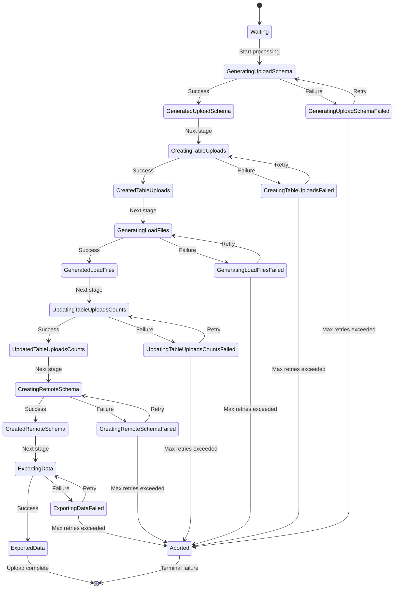
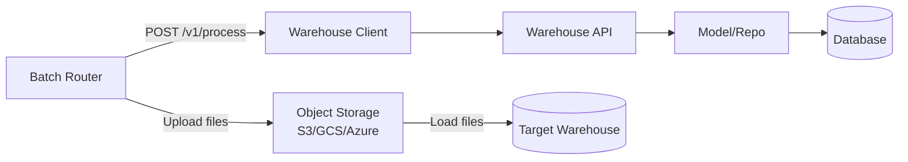
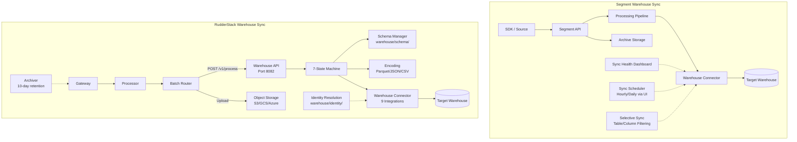

# Warehouse Sync Parity Analysis

> **Last Updated:** 2026-02-25 | **RudderStack Version:** v1.68.1 | **Segment Reference:** `refs/segment-docs/src/connections/storage/`

## Executive Summary

Warehouse sync is one of RudderStack's strongest capability areas, achieving approximately **80% feature parity** with Segment's warehouse offering. RudderStack supports **9 warehouse connectors** compared to Segment's catalog of 8, and offers a robust **7-state upload state machine** that provides fine-grained lifecycle control over the sync process.

**Key Strengths:**
- **Broader connector coverage** — RudderStack supports ClickHouse and MSSQL, which are not available in Segment's catalog
- **Multiple encoding formats** — Parquet, JSON, and CSV support via `warehouse/encoding/` gives data teams flexibility in staging file formats (Segment primarily uses CSV/JSON)
- **Snowpipe Streaming** — Native Snowpipe Streaming API integration for low-latency Snowflake ingestion, not available in Segment
- **Integrated identity resolution** — Identity merge rules are resolved directly within the warehouse pipeline (`warehouse/identity/`), whereas Segment handles identity resolution through the separate Unify product
- **Comprehensive state machine** — 7-state upload lifecycle with clear transition tracking and failure recovery, more granular than Segment's sync lifecycle

**Key Gaps:**
- **Selective sync** — No per-table or per-column sync filtering (Segment Business plan feature)
- **Sync health monitoring** — No dedicated sync health dashboard with detailed error reporting UI
- **Sync scheduling flexibility** — Config-based scheduling only, no UI-driven frequency adjustment
- **Warehouse replay integration** — Partial integration between archiver and warehouse backfill
- **DB2 connector** — Available in Segment's catalog but not supported by RudderStack

**RudderStack-Unique Advantages:**
- ClickHouse connector with MergeTree engine family support
- MSSQL connector with bulk CopyIn ingestion
- Snowpipe Streaming for near-real-time Snowflake loading
- Parquet encoding for optimized data lake performance
- Warehouse-integrated identity resolution pipeline

> **Phase 2 Note:** Reverse ETL (warehouse → destination sync) is explicitly **out of scope** for Phase 1 documentation and implementation. Reverse ETL capabilities will be addressed in Phase 2.

---

## Warehouse Connector Coverage

The following table compares warehouse connector availability between Segment and RudderStack. Connector implementations are located under `warehouse/integrations/` in the RudderStack codebase.

| Warehouse | Segment | RudderStack | Parity | Notes |
|-----------|---------|-------------|--------|-------|
| Snowflake | ✅ Supported | ✅ Supported (+ Snowpipe Streaming) | **Full+** | RS has Snowpipe Streaming advantage. Source: `warehouse/integrations/snowflake/snowflake.go:1-203` |
| BigQuery | ✅ Supported | ✅ Supported | **Full** | Parallel loading, streaming insert, dedup views. Source: `warehouse/integrations/bigquery/bigquery.go:1-250` |
| Redshift | ✅ Supported | ✅ Supported | **Full** | IAM/password auth, S3 manifest loading, dedup window. Source: `warehouse/integrations/redshift/redshift.go:1-193` |
| PostgreSQL | ✅ Supported | ✅ Supported | **Full** | SSH tunneling, SSL support, file-download loading. Source: `warehouse/integrations/postgres/postgres.go:1-150` |
| Databricks (Delta Lake) | ✅ Supported | ✅ Supported | **Full** | SQL MERGE with partition pruning, OAuth support. Source: `warehouse/integrations/deltalake/deltalake.go:1-162` |
| Azure SQL DW / Synapse | ✅ Supported | ✅ Supported | **Full** | Bulk CopyIn ingestion, TLS/SSL. Source: `warehouse/integrations/azure-synapse/azure-synapse.go:1-138` |
| Data Lakes (S3/GCS/Azure) | ✅ Supported | ✅ Supported | **Full** | Parquet exports, Glue/Hive schema repository. Source: `warehouse/integrations/datalake/datalake.go:1-147` |
| ClickHouse | ❌ Not in Segment catalog | ✅ Supported | **RS-unique** | AggregatingMergeTree engine, cluster replication. Source: `warehouse/integrations/clickhouse/clickhouse.go:1-250` |
| MSSQL | ❌ Not in Segment catalog | ✅ Supported | **RS-unique** | Bulk CopyIn ingestion, TLS support. Source: `warehouse/integrations/mssql/mssql.go:1-143` |
| DB2 | ✅ Supported | ❌ Not supported | **0%** | Low priority — limited demand signal |
| Google Cloud Storage (standalone) | ✅ Supported | ⚠️ Via Datalake connector | **Partial** | RudderStack covers GCS through the unified Datalake connector rather than a standalone GCS destination |

**Coverage Summary:**
- **Connectors with full parity:** 7 of 8 Segment warehouses (87.5%)
- **RudderStack-unique connectors:** 2 (ClickHouse, MSSQL)
- **Missing Segment connectors:** 1 (DB2)
- **Total RudderStack connectors:** 9

---

## Sync Feature Comparison

The following matrix compares warehouse sync features between Segment and RudderStack across all functional dimensions.

| Feature | Segment Status | RudderStack Status | Parity | Gap Severity |
|---------|---------------|-------------------|--------|--------------|
| Automatic schema evolution | ✅ Full — auto-creates tables and columns | ✅ Full — cached schema with TTL, auto-discovery from warehouse | **Full** | None |
| Idempotent sync | ✅ Supported | ✅ Supported — 7-state upload state machine ensures exactly-once processing | **Full** | None |
| Backfill support | ✅ Supported — syncs historical data on connect | ⚠️ Partial — via event replay from archiver (10-day retention) | **60%** | Medium |
| Encoding formats | ✅ CSV/JSON | ✅ Parquet, JSON, CSV | **Full+** | RS advantage |
| Upload state machine | ✅ Basic sync lifecycle | ✅ 7-state machine with in-progress/failed/completed sub-states | **Full+** | RS advantage |
| Selective sync (table level) | ✅ Supported (Business plan) | ❌ Not available | **0%** | Medium |
| Selective sync (column level) | ✅ Supported (Business plan) | ❌ Not available | **0%** | Medium |
| Sync scheduling | ✅ Configurable (hourly to daily via UI) | ⚠️ Config-based scheduling via `config.yaml` | **60%** | Low |
| Sync health monitoring | ✅ Full dashboard — status, duration, row counts, error notices | ⚠️ Prometheus metrics-based monitoring only | **40%** | Medium |
| Sync history | ✅ Detailed per-source sync history with results breakdown | ⚠️ Upload status tracked in database, no dedicated UI | **40%** | Medium |
| Error reporting and retry | ✅ Detailed error reports with per-collection breakdown | ✅ State machine retry with error classification per connector | **80%** | Low |
| Identity resolution | ⚠️ Via Unify (separate product, additional cost) | ✅ Integrated directly in warehouse pipeline | **RS advantage** | None |
| Snowpipe Streaming | ❌ Not available | ✅ Supported — channel-based streaming with polling | **RS advantage** | None |
| Staging file management | ✅ Managed internally | ✅ Full pipeline — Batch Router → Warehouse Client → API → DB | **Full** | None |
| Merge strategies (append/dedup) | ✅ Supported per warehouse | ✅ Supported — per-connector merge strategies with configurable behavior | **Full** | None |
| Parallel loading | ✅ Supported | ✅ Supported — configurable worker counts per warehouse type | **Full** | None |
| Warehouse replay | ✅ Via Segment replay | ⚠️ Via archiver — gzipped JSONL with 10-day retention | **40%** | Medium |
| Tunneling/SSH support | ✅ Supported | ✅ Supported via `warehouse/integrations/tunnelling/` | **Full** | None |
| Nested object handling | ✅ Flatten objects, stringify arrays | ✅ Same behavior — flatten objects, stringify arrays | **Full** | None |

Source: `warehouse/router/state.go:1-103`, `warehouse/encoding/encoding.go:1-92`, `warehouse/schema/schema.go:1-250`

---

## Idempotency and Backfill Analysis

> **AAP §0.10 Compliance:** Warehouse sync idempotency and backfill support are documented as non-negotiable requirements. This section provides the mandatory specification of merge strategies, staging file handling, and failure recovery procedures.

### Idempotency Guarantees

RudderStack's warehouse sync achieves idempotency through the combination of a **7-state upload state machine** and **per-connector merge/dedup strategies**:

1. **Upload State Machine** — Each upload batch progresses through 7 well-defined states. If a failure occurs at any state, the upload can be retried from the failed state without reprocessing earlier stages. The state machine prevents duplicate processing by tracking exactly which stage each upload has completed.

   Source: `warehouse/router/state.go:19-82`

2. **Staging File Atomic Generation** — Staging files are generated once by the Batch Router and stored in object storage (S3/GCS/Azure Blob). The warehouse service is notified via `POST /v1/process` and processes each staging file exactly once. The staging file flow follows a clear pipeline: `[Batch Router] → [Warehouse Client] → [Warehouse API] → [Model/Repo] → [Database]`.

   Source: `warehouse/.cursor/docs/staging-file-flow.md:1-10`

3. **Dedup at Warehouse Level** — Each connector implements dedup logic appropriate to its database engine:
   - **Merge-based connectors** (Snowflake, Delta Lake, PostgreSQL) use SQL `MERGE INTO` statements that handle insert-or-update atomically
   - **Delete-then-insert connectors** (Redshift) use transactional `DELETE` + `INSERT` within a single database transaction
   - **View-based dedup** (BigQuery) creates deduplication views over raw tables
   - **Engine-based dedup** (ClickHouse) uses `AggregatingMergeTree` engine with `SimpleAggregateFunction(anyLast, ...)` to automatically merge duplicate records

4. **State Persistence** — Upload state is persisted in PostgreSQL (via JobsDB), ensuring that restarts or crashes do not lose progress. On recovery, the upload resumes from the last completed state.

### Merge Strategies Per Connector

Each warehouse connector implements one or more merge strategies based on the capabilities of the underlying database. The merge behavior is controlled by the `allowMerge` configuration parameter and the `ShouldMerge()` method on each connector.

| Connector | Merge Strategy | Dedup Mechanism | Configuration | Source |
|-----------|---------------|-----------------|---------------|--------|
| **Snowflake** | SQL `MERGE INTO` with staging table | Partition key dedup with `ROW_NUMBER()` window function; merge window support for time-bounded dedup | `Warehouse.snowflake.allowMerge` (default: `true`), merge window via `Warehouse.snowflake.mergeWindow.<destID>.duration` | `warehouse/integrations/snowflake/snowflake.go:433-520` |
| **BigQuery** | Append with deduplication views | `CREATE OR REPLACE VIEW` with `ROW_NUMBER()` partitioned by primary key; custom time partitioning | `Warehouse.bigquery.customPartitionsEnabled`, `Warehouse.bigquery.setUsersLoadPartitionFirstEventFilter` | `warehouse/integrations/bigquery/bigquery.go:150-250` |
| **Redshift** | `DELETE` + `INSERT` in transaction | Transactional delete matching rows from staging table, then insert all staging rows; dedup window support | `Warehouse.redshift.allowMerge` (default: `true`), `Warehouse.redshift.dedupWindow`, `Warehouse.redshift.dedupWindowInHours` (default: `720h`) | `warehouse/integrations/redshift/redshift.go:481-560` |
| **ClickHouse** | Direct file load with engine-level dedup | `AggregatingMergeTree` engine for users table with `SimpleAggregateFunction(anyLast, ...)` columns; background merge by ClickHouse engine | `Warehouse.clickhouse.loadTableFailureRetries` (default: `3`) | `warehouse/integrations/clickhouse/clickhouse.go:843-870` |
| **Delta Lake** | SQL `MERGE INTO` with partition pruning | Standard SQL MERGE with primary key matching; partition pruning for performance | `Warehouse.deltalake.allowMerge` (default: `true`), `Warehouse.deltalake.enablePartitionPruning` (default: `true`) | `warehouse/integrations/deltalake/deltalake.go:838-850` |
| **PostgreSQL** | SQL MERGE / dedup | Merge with partition key dedup; configurable skip-dedup per destination | `Warehouse.postgres.allowMerge` (default: `true`), `Warehouse.postgres.skipDedupDestinationIDs` | `warehouse/integrations/postgres/postgres.go:106-150` |
| **MSSQL** | Bulk CopyIn with staging | File download and bulk insert via `mssql.CopyIn`; no native MERGE | `Warehouse.mssql.enableDeleteByJobs` (default: `false`) | `warehouse/integrations/mssql/mssql.go:83-143` |
| **Azure Synapse** | Bulk CopyIn with staging | File download and bulk insert; similar to MSSQL approach | `Warehouse.azure_synapse.numWorkersDownloadLoadFiles` (default: `1`) | `warehouse/integrations/azure-synapse/azure-synapse.go:86-138` |
| **Datalake** | Append-only (no merge) | No dedup — data lake tables are append-only; schema managed via Glue/Hive catalog | N/A — merge not applicable for data lake destinations | `warehouse/integrations/datalake/datalake.go:83-101` |

### Backfill Capabilities

**Current Capabilities:**

| Capability | Status | Description |
|-----------|--------|-------------|
| Event replay from archiver | ✅ Available | Archived events stored in gzipped JSONL format with source/date/hour organization. Replay handler at `gateway/handle_http_replay.go` supports re-ingestion |
| Archiver retention | ⚠️ Limited | 10-day retention period for archived events |
| Warehouse re-sync | ⚠️ Partial | Uploads can be retried from any failed state via the state machine |
| Full historical backfill | ❌ Not available | No dedicated backfill API with configurable date ranges |

**Identified Gaps:**

1. **No direct backfill API** — Segment allows users to trigger a historical data sync when connecting a new warehouse. RudderStack requires manual event replay through the archiver, which is limited to the 10-day retention window.

2. **No warehouse-level backfill endpoint** — There is no API endpoint to trigger a backfill for a specific date range directly at the warehouse service level, without routing through the full event replay pipeline.

3. **Retention limitation** — The archiver's 10-day retention means events older than 10 days cannot be replayed to a warehouse without external backup mechanisms.

### Failure Recovery

The 7-state upload state machine provides robust failure recovery:

- **Per-state retry** — Each state transition tracks `in_progress`, `failed`, and `completed` sub-states. A failed upload retries from the exact state where it failed, not from the beginning.
- **Abort handling** — Uploads that exceed retry limits are moved to the `aborted` terminal state, preventing infinite retry loops.
- **Error classification** — Each connector defines error type mappings (Permission, ResourceNotFound, InsufficientResource, ColumnCount, ConcurrentQueries) enabling intelligent retry decisions.

Source: `warehouse/router/state.go:9-15`, `warehouse/internal/model/upload.go:13-23`

---

## Upload State Machine

The warehouse upload state machine manages the complete lifecycle of a data upload from staging files to warehouse tables. It is defined in `warehouse/router/state.go` and uses state constants from `warehouse/internal/model/upload.go`.

### State Diagram



### State Descriptions

| # | State | Constant | Description |
|---|-------|----------|-------------|
| 1 | **Waiting** | `waiting` | Initial state. Upload is queued and waiting for processing to begin. |
| 2 | **Generated Upload Schema** | `generated_upload_schema` | Schema has been computed by consolidating staging file schemas with the existing warehouse schema. Determines which tables and columns need to be created or updated. |
| 3 | **Created Table Uploads** | `created_table_uploads` | Individual table upload records have been created in the database for each table that needs to be loaded. |
| 4 | **Generated Load Files** | `generated_load_files` | Load files have been generated from staging files in the appropriate format (Parquet, JSON, or CSV) for the target warehouse. |
| 5 | **Updated Table Uploads Counts** | `updated_table_uploads_counts` | Row counts for each table upload have been computed and persisted. |
| 6 | **Created Remote Schema** | `created_remote_schema` | The remote warehouse schema has been created or updated to match the upload schema. This includes creating new tables and adding new columns. |
| 7 | **Exported Data** | `exported_data` | Data has been successfully exported to the warehouse. This is the terminal success state. |
| — | **Aborted** | `aborted` | Terminal failure state. The upload has exceeded maximum retry attempts and will not be retried. |

Source: `warehouse/router/state.go:19-82`, `warehouse/internal/model/upload.go:13-23`

### State Transition Rules

Each state has three sub-states tracked by the `state` struct:

```go
type state struct {
    inProgress string  // e.g., "generating_upload_schema"
    failed     string  // e.g., "generating_upload_schema_failed"
    completed  string  // e.g., "generated_upload_schema"
    nextState  *state  // pointer to next state in chain
}
```

- Transitions are strictly **linear**: each state can only advance to the next state in the chain
- **Failed states** can retry to the same state's `inProgress` sub-state
- The `nextState` pointer forms a linked list: `Waiting → GeneratedUploadSchema → CreatedTableUploads → GeneratedLoadFiles → UpdatedTableUploadsCounts → CreatedRemoteSchema → ExportedData`
- `ExportedData` and `Aborted` have `nextState = nil` (terminal)

Source: `warehouse/router/state.go:74-81`

### Comparison with Segment's Sync Lifecycle

| Aspect | Segment | RudderStack |
|--------|---------|-------------|
| State granularity | 3 states: Success, Partial, Failure | 7 states + 3 sub-states per state (in_progress, failed, completed) |
| Failure recovery | Full re-sync from beginning | Resume from exact failed state |
| State visibility | Sync History dashboard | Database-persisted state, Prometheus metrics |
| Retry semantics | Automatic next-sync retry | Per-state retry with configurable limits |
| Abort mechanism | Implicit (errors reported) | Explicit `aborted` terminal state |

Source: `refs/segment-docs/src/connections/storage/warehouses/warehouse-syncs.md:32-42`

---

## Staging File Formats

RudderStack supports three encoding formats for staging and load files, providing flexibility based on the target warehouse's optimal ingestion format. The encoding implementation is centralized in `warehouse/encoding/encoding.go`.

### Format Comparison

| Format | Segment | RudderStack | Supported Warehouses | Notes |
|--------|---------|-------------|---------------------|-------|
| CSV | ✅ Primary format | ✅ Supported (default) | Snowflake, Redshift, ClickHouse, MSSQL, Azure Synapse, PostgreSQL | Default format via `misc.CreateGZ()` |
| JSON | ✅ Supported | ✅ Supported | BigQuery (primary reader), all warehouses (write) | BigQuery uses JSON reader by default |
| Parquet | ❌ Not primary | ✅ Supported | Datalake (S3/GCS/Azure), Delta Lake | **RudderStack advantage** — columnar format optimized for analytics workloads |
| Avro | ✅ Some connectors | ❌ Not supported | — | Low priority gap |

### Encoding Architecture

The encoding system uses a Factory pattern with three interfaces:

| Interface | Purpose | Implementations |
|-----------|---------|----------------|
| `LoadFileWriter` | Writes events to load files | GZ-compressed CSV writer, Parquet writer |
| `EventLoader` | Serializes individual events into load file format | CSV loader, JSON loader, Parquet loader |
| `EventReader` | Reads events back from load files | CSV reader, JSON reader |

**Key Configuration Parameters:**

| Parameter | Default | Description |
|-----------|---------|-------------|
| `Warehouse.maxStagingFileReadBufferCapacityInK` | `10240` | Maximum staging file read buffer capacity in KB |
| `Warehouse.parquetParallelWriters` | `8` | Number of parallel Parquet writer goroutines |
| `Warehouse.disableParquetColumnIndex` | `true` | Whether to disable Parquet column indexing |

Source: `warehouse/encoding/encoding.go:21-92`

### Staging File Pipeline

The staging file flow follows a well-defined data pipeline across warehouse system components:



**Pipeline stages:**
1. **Batch Router** — Generates staging files and uploads to object storage; notifies warehouse service
2. **Warehouse Client** — Converts staging files to HTTP payload format for inter-service communication
3. **Warehouse API** — Receives HTTP requests and maps to internal data models
4. **Model/Repo** — Persists staging file metadata (JSON serialization in metadata column)
5. **Load File Generation** — Transforms staging files into warehouse-specific load files (Parquet/JSON/CSV)
6. **Export** — Loads data into target warehouse using connector-specific ingestion methods

Source: `warehouse/.cursor/docs/staging-file-flow.md:1-30`

---

## Schema Management

RudderStack implements automatic schema evolution through the `warehouse/schema/` package, providing capabilities comparable to Segment's automatic schema management.

### Schema Features Comparison

| Feature | Segment | RudderStack | Notes |
|---------|---------|-------------|-------|
| Auto-create tables | ✅ | ✅ | Tables created during `CreatedRemoteSchema` state |
| Auto-add columns | ✅ | ✅ | New columns detected via `TableSchemaDiff()` |
| Schema caching | ✅ Implicit | ✅ Explicit — TTL-based cache (default 720 minutes) | `Warehouse.schemaTTLInMinutes` config |
| Nested object flattening | ✅ Flatten objects, stringify arrays | ✅ Same behavior | Consistent with Segment schema approach |
| Snake_case conversion | ✅ Via `go-snakecase` | ✅ Via provider-specific case conversion | `whutils.ToProviderCase()` |
| Column type inference | ✅ Automatic | ✅ Automatic — per-warehouse type mapping | Each connector defines `dataTypesMap` and `dataTypesMapToRudder` |
| Deprecated column handling | ❌ Not documented | ✅ Regex-based deprecated column detection and removal | Pattern: `*-deprecated-<UUID>` |
| ID resolution schema enhancement | ❌ Via Unify (separate) | ✅ Integrated — `identity_merge_rules` and `identity_mappings` tables | Enabled via `Warehouse.enableIDResolution` |
| Schema consolidation | ✅ Implicit | ✅ Explicit — consolidates staging file schemas with warehouse schema | `ConsolidateStagingFilesSchema()` with pagination |
| Outdated schema detection | ❌ Not documented | ✅ `IsSchemaOutdated()` compares cached vs warehouse schema | Triggers re-fetch if changed |

### Schema Handler Interface

The `Handler` interface in `warehouse/schema/schema.go` exposes the following operations:

| Method | Description |
|--------|-------------|
| `IsSchemaEmpty()` | Check if schema exists for the namespace |
| `GetTableSchema()` | Retrieve schema for a specific table |
| `UpdateSchema()` | Update full schema definition |
| `UpdateTableSchema()` | Update schema for a single table |
| `GetColumnsCount()` | Get column count for a table |
| `ConsolidateStagingFilesSchema()` | Merge staging file schemas with warehouse schema |
| `TableSchemaDiff()` | Compute added/modified columns between schemas |
| `IsSchemaOutdated()` | Check if cached schema differs from warehouse |

Source: `warehouse/schema/schema.go:51-69`

---

## Gap Summary

The following table summarizes all identified gaps between RudderStack and Segment warehouse sync capabilities, with remediation recommendations and estimated effort.

| Gap ID | Description | Severity | Current State | Remediation | Est. Effort |
|--------|------------|----------|---------------|-------------|-------------|
| **WH-001** | No selective sync (table level) | **Medium** | Segment Business plan feature allows disabling specific tables from warehouse sync. RudderStack has no equivalent. | Implement per-table sync configuration in warehouse settings, with API and UI support for enabling/disabling individual tables. | Medium |
| **WH-002** | No selective sync (column level) | **Medium** | Segment Business plan feature allows disabling specific columns. RudderStack has no equivalent. | Extend selective sync to support per-column filtering, integrated with schema management. | Medium |
| **WH-003** | Limited backfill without full replay | **Medium** | Backfill requires event replay from archiver with 10-day retention limit. No direct backfill API with date range parameters. | Implement a dedicated backfill API endpoint on the warehouse service (port 8082) supporting configurable date ranges, independent of the archiver retention window. | Medium |
| **WH-004** | Sync health monitoring limited to metrics | **Medium** | Segment provides a full Sync History dashboard with status (Success/Partial/Failure), duration, row counts, and error notices per collection. RudderStack tracks upload state in database with Prometheus metrics but has no dedicated health UI. | Implement warehouse sync health dashboard with per-source sync history, status tracking, error reporting, and row count visibility. | Medium |
| **WH-005** | No sync scheduling UI/API | **Low** | Segment supports configurable sync frequency (hourly to daily) via UI settings. RudderStack uses `config.yaml` parameters for sync timing. | Expose sync scheduling configuration via HTTP/gRPC API on the warehouse service, enabling dynamic frequency adjustment without config redeployment. | Small |
| **WH-006** | DB2 connector missing | **Low** | Segment supports DB2 as a warehouse destination. RudderStack does not have a DB2 connector. | Implement DB2 warehouse connector following the standard `warehouse/integrations/` pattern if customer demand warrants. | Medium |
| **WH-007** | Warehouse replay integration incomplete | **Medium** | Replay depends on the archiver with 10-day retention. No deep integration between warehouse service and replay for targeted warehouse-only backfill. | Implement direct warehouse replay integration that can trigger warehouse re-loads from archived data without full pipeline re-ingestion. | Medium |
| **WH-008** | No Avro encoding support | **Low** | Segment supports Avro encoding for some connectors. RudderStack supports Parquet, JSON, and CSV but not Avro. | Add Avro encoding support to `warehouse/encoding/` following the existing Factory pattern with `EventLoader` and `LoadFileWriter` interfaces. | Small |

### Gap Severity Distribution

| Severity | Count | Percentage |
|----------|-------|------------|
| Medium | 6 | 75% |
| Low | 2 | 25% |
| Critical | 0 | 0% |

### Remediation Priority

**Phase 1 (Immediate — High Impact):**
1. **WH-001 + WH-002** — Selective sync (table + column level) — addresses the most visible Segment feature gap
2. **WH-003** — Direct backfill API — critical for migration scenarios and data recovery

**Phase 2 (Short-term — Operational Excellence):**
3. **WH-004** — Sync health monitoring dashboard — important for production operations
4. **WH-007** — Warehouse replay integration — enhances data recovery capabilities

**Phase 3 (Long-term — Completeness):**
5. **WH-005** — Sync scheduling API — quality-of-life improvement
6. **WH-006** — DB2 connector — demand-driven implementation
7. **WH-008** — Avro encoding — low-priority format support

> **Note:** Reverse ETL (warehouse → destination sync) is explicitly **Phase 2 scope** and is not included in this gap analysis. See [Sprint Roadmap](./sprint-roadmap.md) for Phase 2 planning.

---

## Warehouse Sync Pipeline Comparison

The following diagram illustrates the high-level architectural differences between Segment's and RudderStack's warehouse sync pipelines.



---

## Cross-References

- **[Gap Report Index](./index.md)** — Executive summary and overall Segment parity assessment
- **[Sprint Roadmap](./sprint-roadmap.md)** — Epic sequencing for autonomous gap closure implementation
- **[Identity Parity](./identity-parity.md)** — Identity resolution / Unify gap analysis (related to warehouse identity integration)
- **[Warehouse Overview](../warehouse/overview.md)** — Detailed warehouse service architecture documentation
- **[Schema Evolution](../warehouse/schema-evolution.md)** — Automatic schema management reference
- **[Encoding Formats](../warehouse/encoding-formats.md)** — Parquet, JSON, CSV encoding format reference
- **[Snowflake Connector](../warehouse/snowflake.md)** — Snowflake connector setup and configuration guide
- **[BigQuery Connector](../warehouse/bigquery.md)** — BigQuery connector setup and configuration guide
- **[Redshift Connector](../warehouse/redshift.md)** — Redshift connector setup and configuration guide
- **[Capacity Planning](../guides/operations/capacity-planning.md)** — Pipeline throughput tuning including warehouse worker configuration

---

## Source Citations

| Section | Primary Sources |
|---------|----------------|
| Connector Coverage | `warehouse/integrations/snowflake/snowflake.go`, `warehouse/integrations/bigquery/bigquery.go`, `warehouse/integrations/redshift/redshift.go`, `warehouse/integrations/clickhouse/clickhouse.go`, `warehouse/integrations/deltalake/deltalake.go`, `warehouse/integrations/postgres/postgres.go`, `warehouse/integrations/mssql/mssql.go`, `warehouse/integrations/azure-synapse/azure-synapse.go`, `warehouse/integrations/datalake/datalake.go` |
| Upload State Machine | `warehouse/router/state.go:1-103`, `warehouse/internal/model/upload.go:13-23` |
| Encoding Formats | `warehouse/encoding/encoding.go:1-92` |
| Schema Management | `warehouse/schema/schema.go:1-250` |
| Snowpipe Streaming | `warehouse/.cursor/docs/snowpipe-streaming.md` |
| Staging File Flow | `warehouse/.cursor/docs/staging-file-flow.md` |
| Segment Warehouse Reference | `refs/segment-docs/src/connections/storage/warehouses/index.md`, `refs/segment-docs/src/connections/storage/warehouses/warehouse-syncs.md`, `refs/segment-docs/src/connections/storage/warehouses/schema.md` |
