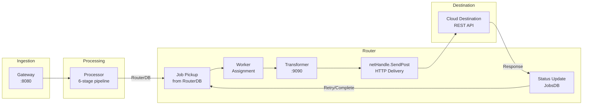
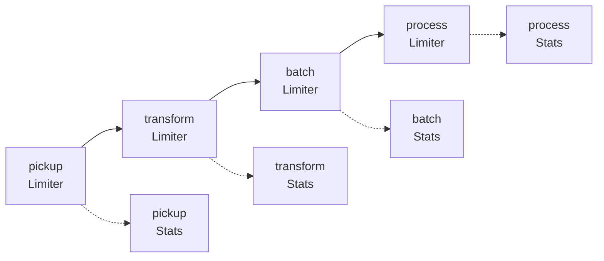

# Cloud Destinations

Cloud destinations are the **largest destination category** in RudderStack, covering **90+ integrations** delivered via REST/HTTP to analytics platforms, advertising networks, CRMs, marketing tools, and other SaaS services. Every event destined for a cloud destination flows through the Router's HTTP network layer for real-time delivery.

Cloud destinations are the **default destination type** — any destination that is NOT a stream destination (managed by `CustomDestinationManager` / `services/streammanager/`) and NOT a warehouse destination (managed by the dedicated Warehouse service) is classified as a cloud destination. This document details the routing architecture, delivery mechanism, configuration surface, and observability metrics for cloud destination delivery.

> **Key distinction from other destination types:**
>
> - **[Stream Destinations](./stream-destinations.md)** use dedicated producer clients via `services/streammanager/` for message queues and event buses (e.g., Kafka, Kinesis, Pub/Sub).
> - **[Warehouse Destinations](./warehouse-destinations.md)** use the batch-oriented Warehouse service (port 8082) for data warehouse loading (e.g., Snowflake, BigQuery, Redshift).
> - **Cloud destinations** use the Router's HTTP network handler (`netHandle.SendPost`) for RESTful delivery to cloud APIs.

> Source: `router/network.go:73-75`

**Prerequisites:**
- [Architecture Overview](../../architecture/overview.md) — high-level system components and deployment modes
- [End-to-End Data Flow](../../architecture/data-flow.md) — complete event lifecycle through the pipeline

**Related:**
- [Destination Catalog](./index.md) — full destination catalog with all categories
- [Destination Catalog Parity](../../gap-report/destination-catalog-parity.md) — Segment parity gap analysis
- [Glossary](../../reference/glossary.md) — unified terminology for RudderStack and Segment concepts

---

## Cloud Destination Routing Flow

The following diagram illustrates the end-to-end routing flow for cloud destinations, from job pickup through HTTP delivery:



The Router operates a **per-destination worker pool** that picks up pending jobs from the Router JobsDB, transforms event payloads via the external Transformer service (port 9090), and delivers the resulting HTTP requests to the destination's REST API. Delivery status is written back to JobsDB to drive retries or mark completion.

> Source: `router/handle.go:49-138` (Handle struct and lifecycle)

---

## Routing Architecture

### Router Handle

The `Handle` struct is the central orchestrator for per-destination routing. One `Handle` instance is created per active destination type (e.g., `"GA4"`, `"AMPLITUDE"`, `"BRAZE"`), managing a dedicated worker pool, transformation pipeline, and delivery mechanism for that destination.

> Source: `router/handle.go:49-138`

**Key fields and their roles:**

| Field | Type | Purpose |
|-------|------|---------|
| `destType` | `string` | Destination type identifier (e.g., `"GA4"`, `"AMPLITUDE"`, `"BRAZE"`) |
| `netHandle` | `NetHandle` | Network handler for HTTP delivery to cloud destination APIs |
| `customDestinationManager` | `DestinationManager` | For stream/KV destinations only — **not used** for cloud destinations |
| `transformer` | `Transformer` | External Transformer service integration (port 9090) |
| `jobsDB` | `JobsDB` | PostgreSQL-backed persistent job queue for event storage |
| `throttlerFactory` | `throttler.Factory` | GCRA-based per-destination rate limiting |
| `guaranteeUserEventOrder` | `bool` | Enables strict per-user event ordering enforcement |
| `enableBatching` | `bool` | Enables Router-level batching for transformation |
| `noOfWorkers` | `int` | Worker pool size for parallel delivery |
| `throttlingCosts` | `atomic.Pointer[EventTypeThrottlingCost]` | Per-event-type throttling cost configuration |
| `barrier` | `*eventorder.Barrier` | Event ordering barrier for user-level delivery guarantees |
| `isolationStrategy` | `isolation.Strategy` | Workspace/destination isolation partitioning strategy |
| `backendConfig` | `BackendConfig` | Dynamic destination configuration (5-second polling) |
| `adaptiveLimit` | `func(int64) int64` | Dynamic batch size adjustment function |

> Source: `router/handle.go:49-138`

**Router lifecycle:**

1. **Setup()** — Initialize the Handle with destination definition, configuration, and dependencies
2. **activePartitions()** — Enumerate active partitions based on the isolation strategy
3. **pickup()** — Pick up pending jobs from RouterDB for each partition
4. **transform** — Send events to the Transformer service for destination-specific payload shaping
5. **deliver** — Execute HTTP delivery via `netHandle.SendPost`
6. **status update** — Write delivery result back to JobsDB (success, retry, or abort)

> Source: `router/handle.go:140-150` (activePartitions), `router/handle.go:152-250` (pickup)

### Router Factory

The `Factory` struct creates `Handle` instances for each active destination. When a new destination is detected in the Backend Config, the Factory instantiates a Handle and calls `Setup()` with the destination definition and all required dependencies.

> Source: `router/factory.go:19-30`

**Factory dependencies:**

| Dependency | Type | Purpose |
|------------|------|---------|
| `BackendConfig` | `backendconfig.BackendConfig` | Dynamic destination configuration with 5-second polling |
| `RouterDB` | `jobsdb.JobsDB` | Persistent event queue for the Router |
| `ThrottlerFactory` | `throttler.Factory` | GCRA-based rate limiting for destination API calls |
| `TransformerFeaturesService` | `FeaturesService` | Transformer service capability detection |
| `Debugger` | `DestinationDebugger` | Destination event debugging and inspection |
| `AdaptiveLimit` | `func(int64) int64` | Dynamic batch size adjustment based on workload |
| `Reporting` | `reporter` | Pipeline utilization metrics reporting |
| `TransientSources` | `transientsource.Service` | Transient source lifecycle management |
| `RsourcesService` | `rsources.JobService` | Resource source job tracking |

The factory method `Factory.New(destination)` creates a new `Handle` and invokes `Setup()` with the destination's `DestinationDefinition`, passing all dependencies:

```go
func (f *Factory) New(destination *backendconfig.DestinationT) *Handle {
    r := &Handle{
        Reporting:     f.Reporting,
        adaptiveLimit: f.AdaptiveLimit,
    }
    r.Setup(
        destination.DestinationDefinition,
        f.Logger, config.Default, f.BackendConfig,
        f.RouterDB, f.TransientSources, f.RsourcesService,
        f.TransformerFeaturesService, f.Debugger,
        f.ThrottlerFactory,
    )
    return r
}
```

> Source: `router/factory.go:32-50`

### Network Handler

The `netHandle` struct manages HTTP delivery to cloud destination APIs. It wraps a configurable HTTP client with security controls, compression support, and content validation.

> Source: `router/network.go:39-48`

**`netHandle` struct fields:**

| Field | Type | Purpose |
|-------|------|---------|
| `disableEgress` | `bool` | Disables outbound HTTP calls (for testing/development) |
| `httpClient` | `HTTPClientI` | Configurable HTTP client with timeout and connection pooling |
| `blockPrivateIPs` | `bool` | Blocks requests to private IP ranges for SSRF protection |
| `blockPrivateIPsCIDRs` | `netutil.CIDRs` | Private IP CIDR ranges to block |
| `destType` | `string` | Destination type for logging and metrics |
| `instanceID` | `string` | Instance identifier for `X-Rudder-Instance-Id` header |

**Key network handler features:**

- **HTTP Client Configuration**: Configurable timeout and connection pooling with `MaxIdleConns` and `MaxIdleConnsPerHost` tuned per destination type.
  > Source: `router/network.go:363-364`

- **Egress Control**: The `disableEgress` flag returns a synthetic `200` response without making outbound calls — used for testing and development environments.
  > Source: `router/network.go:76-81`

- **Private IP Blocking (SSRF Protection)**: When `blockPrivateIPs` is enabled, the network handler performs DNS resolution before establishing connections and rejects any resolved IP that falls within configured private CIDR ranges. This prevents Server-Side Request Forgery (SSRF) attacks through destination URLs.
  > Source: `router/network.go:301-343`
  > See also: [Security Architecture](../../architecture/security.md)

- **HTTP/1.1 Fallback**: The `forceHTTP1` configuration forces HTTP/1.1 connections by disabling HTTP/2 negotiation via TLS ALPN — useful for destinations that do not support HTTP/2.
  > Source: `router/network.go:347-361`

- **User-Agent Header**: All outbound requests include `User-Agent: RudderLabs`. When `Router.Network.IncludeInstanceIdInHeader` is enabled, an additional `X-Rudder-Instance-Id` header is sent.
  > Source: `router/network.go:122-126`

- **Content Type Validation**: Response content types are validated against a regex pattern (`text/*`, `application/json`, `application/xml`). Non-human-readable response bodies are redacted for safety.
  > Source: `router/network.go:35, 274-279`

---

## SendPost — HTTP Delivery Method

The `SendPost` method is the core delivery function for cloud destinations. It accepts a `PostParametersT` struct produced by the Transformer service and executes the corresponding HTTP request.

> Source: `router/network.go:73-295`

### Request Parameters

The `PostParametersT` struct encapsulates all information needed for an HTTP request to a cloud destination:

| Field | Type | Description |
|-------|------|-------------|
| `Type` | `string` | Request type: `"REST"` for standard HTTP, or other for multipart |
| `URL` | `string` | Destination API endpoint URL |
| `RequestMethod` | `string` | HTTP method: `GET`, `POST`, `PUT`, `PATCH`, `DELETE` |
| `Body` | `map[string]any` | Request body keyed by format (`"JSON"`, `"JSON_ARRAY"`, `"XML"`, `"FORM"`, `"GZIP"`) |
| `QueryParams` | `map[string]any` | URL query parameters |
| `Headers` | `map[string]any` | HTTP request headers |
| `Files` | `map[string]any` | File attachments for multipart requests |

> Source: `router/network.go:84-97`

### Supported Body Formats

The `SendPost` method supports five body encoding formats, selected by the Transformer's output:

| Format | Content Type | Description |
|--------|-------------|-------------|
| `JSON` | `application/json` | Standard JSON object serialization |
| `JSON_ARRAY` | `application/json` | JSON array batch payload (via `batch` key) |
| `XML` | `application/xml` | XML payload string (via `payload` key) |
| `FORM` | `application/x-www-form-urlencoded` | URL-encoded form data |
| `GZIP` | Gzip-compressed payload | Compressed payload with `Content-Encoding: gzip` header |

> Source: `router/network.go:128-197`

### Error Handling

The `SendPost` method maps HTTP errors to appropriate status codes for retry decisions:

| Condition | Status Code | Behavior |
|-----------|-------------|----------|
| Egress disabled | `200` | Synthetic success response |
| Invalid body format | `500` | Permanent failure — no retry |
| Request construction error | `400` | Permanent failure — no retry |
| Private IP blocked (SSRF) | `403` | Permanent failure — no retry |
| Connection/timeout error | `504` | Transient failure — eligible for retry |
| Destination response | Passthrough | Status code from destination API |

> Source: `router/network.go:76-295`

---

## Transformer Integration

Cloud destinations require **payload transformation** before delivery. The RudderStack event format (conforming to the Segment Spec) must be converted to each destination's specific API payload format. This transformation is performed by the external **Transformer service** running on port 9090.

### Transformation Flow

1. The Router batches pending events for a destination
2. Events are sent to the Transformer service for destination-specific transformation
3. The Transformer returns `PostParametersT` structs — one per event (or per batch, if the destination supports batching)
4. The Router's `netHandle.SendPost` executes the HTTP requests

The Router supports **batched transformation** where multiple events are transformed together in a single Transformer call, improving throughput for high-volume destinations.

> Source: `router/handle.go:88-89` (transformer and enableBatching fields)

### Transformer Output

For each event, the Transformer produces a complete HTTP request specification:

```json
{
  "type": "REST",
  "method": "POST",
  "endpoint": "https://api.amplitude.com/2/httpapi",
  "headers": {
    "Content-Type": "application/json",
    "Accept": "*/*"
  },
  "params": {},
  "body": {
    "JSON": {
      "api_key": "YOUR_API_KEY",
      "events": [
        {
          "user_id": "user-123",
          "event_type": "Product Viewed",
          "event_properties": {
            "product_id": "SKU-001",
            "name": "Premium Widget"
          }
        }
      ]
    }
  }
}
```

The Router-side code is **destination-agnostic** — it does not contain any destination-specific logic. All payload shaping, field mapping, and API-specific formatting is handled by the Transformer service.

---

## Throttling and Rate Limiting

Cloud destinations are protected by **per-destination throttling** using the GCRA (Generic Cell Rate Algorithm) to prevent overwhelming destination APIs with excessive request volumes.

### Throttler Architecture

The `ThrottlerFactory` creates a throttler instance for each active destination. Throttling is applied at the pickup stage — when the Router picks up jobs from JobsDB, it checks the throttler to determine if delivery should proceed or be delayed.

> Source: `router/factory.go:10` (ThrottlerFactory dependency), `router/handle.go:52` (throttlerFactory field)

### Hierarchical Configuration

Throttling parameters follow the Router's hierarchical configuration pattern:

```
Router.<DEST_TYPE>.<key>  →  overrides  →  Router.<key>
```

For example, `Router.GA4.noOfWorkers` overrides the default `Router.noOfWorkers`. This pattern applies to all Router configuration parameters, allowing fine-grained per-destination tuning.

> Source: `router/config.go:7-30`

### Per-Event-Type Throttling Costs

The `throttlingCosts` field allows assigning different throttling costs to different event types. For example, a `track` event might consume 1 unit of rate limit capacity while an `identify` event consumes 2 units — reflecting the relative API cost at the destination.

> Source: `router/handle.go:97`

### Throttling Observability

Two dedicated metrics track throttling behavior:

| Metric | Type | Description |
|--------|------|-------------|
| `throttlingErrorStat` | Counter | Number of events that encountered throttling errors |
| `throttledStat` | Counter | Number of events that were throttled (delayed) |

> Source: `router/handle.go:109-110`

---

## Event Ordering

RudderStack supports **user-level event ordering guarantees** for cloud destinations. When enabled, the Router ensures that events for the same user are delivered in the exact order they were received, even across concurrent worker threads.

### Ordering Mechanism

The `guaranteeUserEventOrder` flag activates strict per-user ordering for a destination type. When enabled, the Router uses an `eventorder.Barrier` to block concurrent delivery of events for the same user — ensuring sequential processing.

> Source: `router/handle.go:64` (guaranteeUserEventOrder field)
> Source: `router/handle.go:117` (barrier field)

**How the barrier works:**

1. Before delivering an event, the Router checks if the barrier has an in-flight event for the same user
2. If an in-flight event exists, the new event is held until the previous delivery completes
3. The `Sync()` method on the barrier ensures all pending ordering constraints are resolved before the next pickup cycle

> Source: `router/handle.go:168-170` (barrier Sync in pickup)

### Per-Workspace and Per-Destination Overrides

Event ordering can be disabled at the workspace or destination level using callback functions:

| Override | Field | Purpose |
|----------|-------|---------|
| Workspace-level disable | `eventOrderingDisabledForWorkspace` | Disables ordering for all destinations in a workspace |
| Destination-level disable | `eventOrderingDisabledForDestination` | Disables ordering for a specific destination instance |

> Source: `router/handle.go:119-120`

These overrides allow selectively relaxing ordering constraints for destinations where strict ordering is not required, improving throughput.

---

## Cloud Destination Categories

Cloud destinations span **12 categories** covering the breadth of the modern data stack. The Router itself is **destination-agnostic** — it does not contain destination-specific logic. The specific set of supported cloud destinations is defined by:

1. **Backend Config** — workspace setup determines which destinations are active
2. **Transformer Service** — contains destination-specific transformation logic for each connector

> The Router code does not enumerate cloud destinations directly. Destination types are dynamically registered via Backend Config and transformed by the Transformer service.

### Category Overview

| Category | Representative Destinations | Typical Use Case |
|----------|---------------------------|------------------|
| **Analytics** | Google Analytics 4, Amplitude, Mixpanel, Heap, Keen.io, PostHog | Product analytics, behavioral tracking, funnel analysis |
| **Advertising** | Facebook Ads, Google Ads, TikTok Ads, Snap Ads, Pinterest Ads, LinkedIn Ads | Audience syncing, conversion tracking, campaign attribution |
| **CRM** | Salesforce, HubSpot, Intercom, Zendesk, Freshdesk, Pipedrive | Contact management, lead scoring, customer profiles |
| **Customer Success** | Gainsight, Totango, ChurnZero | Health scoring, onboarding tracking, retention analytics |
| **Email & Marketing** | Mailchimp, SendGrid, Braze, Customer.io, Iterable, ActiveCampaign, Klaviyo | Email campaigns, lifecycle marketing, in-app messaging |
| **Enrichment** | Clearbit, FullStory | Data enrichment, session replay, visitor intelligence |
| **Product Analytics** | Pendo, LaunchDarkly, Optimizely, PostHog | Feature flagging, product usage analytics, experimentation |
| **Attribution** | AppsFlyer, Adjust, Branch, Singular, Kochava | Mobile attribution, deep linking, campaign measurement |
| **Data Platforms** | Segment (proxy), mParticle | Cross-CDP forwarding, data platform interoperability |
| **Push Notifications** | OneSignal, Firebase Cloud Messaging | Push messaging, mobile engagement |
| **Tag Managers** | Google Tag Manager, Tealium | Client-side tag orchestration |
| **Webhooks** | Generic webhook endpoints | Custom HTTP integrations, internal service forwarding |

### Destination-Agnostic Routing

A critical architectural feature is that the Router treats all cloud destinations identically. The routing pipeline (pickup → transform → deliver → status) is the same regardless of whether the destination is Google Analytics 4 or a generic webhook. All destination-specific behavior is encapsulated in the Transformer service.

This means:
- **Adding a new cloud destination** requires only a new Transformer module — no Router code changes
- **Configuration changes** flow through Backend Config without service restarts
- **Throttling, ordering, and retry** policies are applied uniformly, with per-destination overrides via configuration

---

## Configuration Reference

All Router configuration parameters follow the hierarchical pattern where destination-specific values override global defaults:

```
Router.<DEST_TYPE>.<key>  overrides  Router.<key>
```

For example: `Router.GA4.noOfWorkers` overrides `Router.noOfWorkers`.

> Source: `router/config.go:28-29`

### Core Configuration Parameters

| Parameter | Type | Default | Description |
|-----------|------|---------|-------------|
| `Router.noOfWorkers` | `int` | `64` | Default worker pool size for all destinations |
| `Router.<DEST_TYPE>.noOfWorkers` | `int` | (inherits) | Per-destination worker count override |
| `Router.<DEST_TYPE>.httpMaxIdleConns` | `int` | `64` | Maximum total idle HTTP connections in the pool |
| `Router.<DEST_TYPE>.httpMaxIdleConnsPerHost` | `int` | `64` | Maximum idle HTTP connections per destination host |
| `Router.<DEST_TYPE>.guaranteeUserEventOrder` | `bool` | `false` | Enables strict per-user event ordering |
| `Router.<DEST_TYPE>.enableBatching` | `bool` | `false` | Enables Router-level batching for transformation |
| `Router.<DEST_TYPE>.blockPrivateIPs` | `bool` | `false` | Blocks outbound requests to private IP ranges (SSRF protection) |
| `Router.<DEST_TYPE>.forceHTTP1` | `bool` | `false` | Forces HTTP/1.1 connections (disables HTTP/2) |
| `Router.Network.IncludeInstanceIdInHeader` | `bool` | `false` | Sends `X-Rudder-Instance-Id` header with outbound requests |
| `Router.jobIterator.maxQueries` | `int` | `50` | Maximum JobsDB queries per pickup cycle |
| `Router.jobIterator.discardedPercentageTolerance` | `int` | `10` | Tolerance for discarded jobs in pickup iteration |

> Source: `router/config.go:7-30`, `router/network.go:297-376`, `router/handle.go:175-182`

### Configuration Examples

**High-throughput Google Analytics 4 destination:**
```yaml
Router:
  GA4:
    noOfWorkers: 128
    httpMaxIdleConnsPerHost: 128
    enableBatching: true
    guaranteeUserEventOrder: false
```

**Strict ordering for Salesforce CRM:**
```yaml
Router:
  SALESFORCE:
    noOfWorkers: 32
    guaranteeUserEventOrder: true
    enableBatching: false
```

---

## Limiter Architecture

The Router implements a **four-stage concurrency limiter** that controls parallelism at each phase of the delivery pipeline. Each stage has an independent limiter with dynamic priority scoring based on partition-level performance metrics.

> Source: `router/handle.go:122-133`

### Limiter Stages



| Stage | Limiter | Purpose |
|-------|---------|---------|
| **Pickup** | `limiter.pickup` | Controls concurrent job pickup operations from RouterDB |
| **Transform** | `limiter.transform` | Controls concurrent transformation requests to the Transformer service |
| **Batch** | `limiter.batch` | Controls concurrent batch assembly for batched destinations |
| **Process** | `limiter.process` | Controls concurrent HTTP delivery processing via `netHandle.SendPost` |

Each limiter stage maintains associated **partition stats** (`partition.Stats`) that track:
- Time spent in each stage per partition
- Number of jobs processed per partition
- Number of discarded jobs per partition

These stats drive **dynamic priority scoring** — partitions with higher throughput or lower discard rates receive higher pickup priority in subsequent cycles.

> Source: `router/handle.go:122-133` (limiter struct definition), `router/handle.go:156-165` (limiter usage in pickup)

---

## Observability

The Router exposes comprehensive metrics for monitoring cloud destination delivery performance. All metrics are tagged with `destType` for per-destination granularity.

### Key Metrics

| Metric | Type | Description |
|--------|------|-------------|
| `batchSizeHistogramStat` | Histogram | Distribution of batch sizes sent to the Transformer |
| `batchInputCountStat` | Counter | Total number of events submitted for batching |
| `batchOutputCountStat` | Counter | Total number of events produced after batching |
| `batchInputOutputDiffCountStat` | Counter | Difference between batch input and output counts (events filtered/merged) |
| `routerTransformInputCountStat` | Counter | Number of events sent to the Transformer for destination transformation |
| `routerTransformOutputCountStat` | Counter | Number of transformed payloads received from the Transformer |
| `routerResponseTransformStat` | Timer | Time spent processing Transformer response transformation |
| `processRequestsHistogramStat` | Histogram | End-to-end request processing latency (pickup to status update) |
| `processRequestsCountStat` | Counter | Total number of requests processed |
| `processJobsHistogramStat` | Histogram | Distribution of jobs processed per cycle |
| `processJobsCountStat` | Counter | Total number of jobs processed |
| `throttlingErrorStat` | Counter | Events that encountered throttling errors at the destination |
| `throttledStat` | Counter | Events that were throttled (delayed) by the GCRA limiter |

> Source: `router/handle.go:98-110`

### Partition Metrics

| Metric | Type | Description |
|--------|------|-------------|
| `rt_active_partitions` | Gauge | Number of active partitions for this destination type |
| `rt_active_partitions_time` | Timer | Time taken to enumerate active partitions |

> Source: `router/handle.go:143-148`

### Monitoring Recommendations

- **Delivery success rate**: Compare `processRequestsCountStat` against `throttlingErrorStat` and destination 4xx/5xx responses
- **Transformation throughput**: Monitor `routerTransformInputCountStat` vs `routerTransformOutputCountStat` for transformation bottlenecks
- **Batch efficiency**: Use `batchSizeHistogramStat` to verify batching is achieving target batch sizes
- **Queue depth**: Monitor `rt_active_partitions` to detect partition growth indicating delivery lag
- **Throttling pressure**: Rising `throttledStat` indicates the destination API rate limit is being approached

---

## Destination Configuration Pattern

Cloud destination configurations are delivered to the Router via the **Backend Config** service, which polls the control plane every 5 seconds for workspace configuration updates. Each destination instance is represented as a JSON object containing the destination definition, connector-specific settings, and source bindings.

### Configuration Structure

```json
{
  "ID": "2DkCpUr0xfiGBPJxIwqyqfyHdq4",
  "Name": "My Google Analytics 4",
  "DestinationDefinition": {
    "Name": "GA4",
    "DisplayName": "Google Analytics 4",
    "Config": {}
  },
  "Config": {
    "measurementId": "G-XXXXXXXXXX",
    "firebaseAppId": "",
    "apiSecret": "YOUR_API_SECRET",
    "typesOfClient": "gtag",
    "blacklistedEvents": [],
    "whitelistedEvents": [],
    "oneTrustCookieCategories": []
  },
  "Enabled": true,
  "IsProcessorEnabled": true,
  "Sources": [
    {
      "ID": "source-id",
      "Name": "JavaScript SDK",
      "WriteKey": "WRITE_KEY"
    }
  ]
}
```

**Key configuration fields:**

| Field | Description |
|-------|-------------|
| `ID` | Unique destination instance identifier |
| `Name` | Human-readable destination name |
| `DestinationDefinition.Name` | Destination type string used for routing (e.g., `"GA4"`) |
| `Config` | Destination-specific configuration fields (API keys, measurement IDs, etc.) |
| `Enabled` | Whether the destination is active |
| `IsProcessorEnabled` | Whether Processor-level transformation is enabled |
| `Sources` | List of source bindings that feed events to this destination |

The **Transformer service** interprets destination-specific `Config` fields during payload transformation. The Router itself does not inspect these fields — it passes them through to the Transformer and executes the resulting HTTP request specification.

---

## Cloud vs. Stream vs. Warehouse Comparison

| Aspect | Cloud Destinations | Stream Destinations | Warehouse Destinations |
|--------|-------------------|--------------------|-----------------------|
| **Count** | 90+ | 13 | 9 |
| **Delivery Mode** | Real-time HTTP (REST) | Real-time producer | Batch staging + load |
| **Latency** | Milliseconds | Milliseconds | Minutes to hours |
| **Handler** | `netHandle.SendPost` | `CustomDestinationManager` | Warehouse Service |
| **Pipeline Path** | Router → Transformer → HTTP | Router → CDM → Producer | Batch Router → Staging → WH |
| **Transformation** | Transformer service (port 9090) | Minimal (JSON passthrough) | Schema-based mapping |
| **Throttling** | GCRA per-destination | Destination-specific | Upload state machine |
| **Ordering** | Optional per-user barrier | Partition-based | Upload ID sequencing |
| **Retry** | JobsDB-backed with backoff | Circuit breaker + reconnect | State machine retry |
| **Port** | N/A (outbound HTTP) | N/A (outbound) | 8082 (Warehouse service) |

> Source: `router/network.go:73-295` (cloud), `router/customdestinationmanager/customdestinationmanager.go:25-27` (stream/KV), `warehouse/app.go` (warehouse)

---

## Cross-References

- **[End-to-End Data Flow](../../architecture/data-flow.md)** — Complete event lifecycle from SDK ingestion through warehouse loading
- **[Security Architecture](../../architecture/security.md)** — SSRF protection, TLS configuration, and private IP blocking
- **[Stream Destinations](./stream-destinations.md)** — Producer-based delivery for Kafka, Kinesis, Pub/Sub, and other streaming platforms
- **[Warehouse Destinations](./warehouse-destinations.md)** — Batch loading into Snowflake, BigQuery, Redshift, and other warehouses
- **[Destination Catalog](./index.md)** — Full destination catalog overview with all categories
- **[Destination Catalog Parity](../../gap-report/destination-catalog-parity.md)** — Segment destination coverage gap analysis
- **[Capacity Planning](../operations/capacity-planning.md)** — Pipeline tuning for 50k events/sec throughput targets
- **[Transformation Overview](../transformations/overview.md)** — Transformer service architecture and custom transformation development
