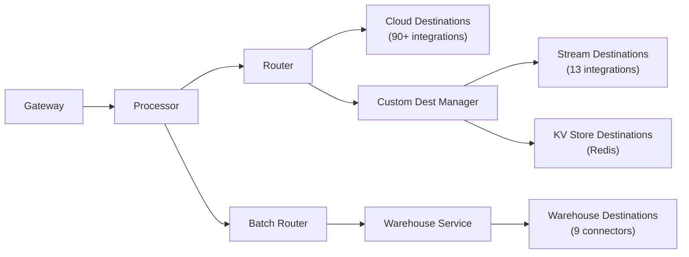
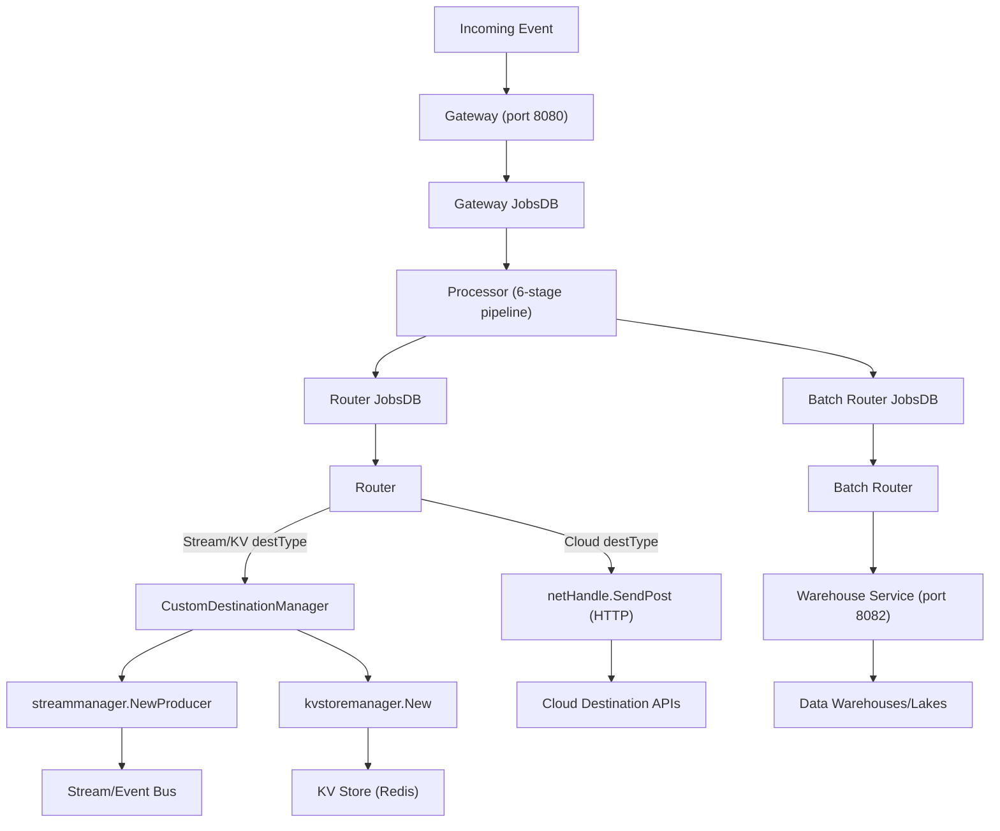

# Destination Catalog

RudderStack supports **90+ destination connectors** that deliver event data from your sources to downstream platforms. Destinations are organized into four categories based on their delivery mechanism and routing path:

- **Cloud Destinations** (90+ integrations) — Real-time HTTP delivery via the Router to analytics, advertising, CRM, marketing, and other SaaS platforms. Cloud destinations use the `netHandle.SendPost` HTTP mechanism for RESTful payload delivery.
- **Stream Destinations** (13 integrations) — Real-time producer-based delivery to message queues, event buses, and streaming platforms via the `CustomDestinationManager` and `services/streammanager/` package.
- **Warehouse Destinations** (9 connectors) — Batch-oriented loading into data warehouses and data lakes via the dedicated Warehouse service operating on port 8082.
- **KV Store Destinations** (1 integration — Redis) — Key-value store delivery for real-time lookup use cases via the `kvstoremanager` package.

> **Source:** `router/customdestinationmanager/customdestinationmanager.go:25-27` — destination type constants `STREAM = "stream"` and `KV = "kv"`

## Destination Routing Overview

The following diagram illustrates how events flow from the Gateway through the Processor and are dispatched to each destination category via distinct routing paths:



> **Source:** `router/customdestinationmanager/customdestinationmanager.go:79-81` — `ObjectStreamDestinations`, `KVStoreDestinations`, and combined `Destinations` lists

---

## Destination Category Guides

| Category | Count | Delivery Mode | Guide |
|----------|-------|---------------|-------|
| **Cloud Destinations** | 90+ | Real-time HTTP (REST) | [Cloud Destinations →](./cloud-destinations.md) |
| **Stream Destinations** | 13 | Real-time producer | [Stream Destinations →](./stream-destinations.md) |
| **Warehouse Destinations** | 9 | Batch staging + load | [Warehouse Destinations →](./warehouse-destinations.md) |

- **[Cloud Destinations](./cloud-destinations.md)** — 90+ REST/HTTP integrations including analytics (GA4, Amplitude, Mixpanel), advertising (Facebook Ads, Google Ads), CRM (Salesforce, HubSpot), marketing (Braze, Customer.io), and more. Cloud destinations are delivered through the Router's HTTP network layer.

- **[Stream Destinations](./stream-destinations.md)** — 13 stream producer integrations including Apache Kafka, Amazon Kinesis, Google Pub/Sub, Amazon EventBridge, Amazon Firehose, Azure Event Hub, Confluent Cloud, and more. Each stream destination implements the `StreamProducer` interface via a dedicated producer package.

- **[Warehouse Destinations](./warehouse-destinations.md)** — 9 data warehouse connectors including Snowflake, BigQuery, Redshift, ClickHouse, Databricks, PostgreSQL, MSSQL, Azure Synapse, and Datalake (S3/GCS/Azure). Warehouse destinations use a 7-state upload state machine with schema evolution and idempotent loading.

---

## Stream Destination Catalog

All 13 stream destinations are registered in `ObjectStreamDestinations` and dispatched through the `streammanager.NewProducer` factory. Each producer manages its own connection lifecycle with circuit breaker protection.

| Destination | Type | Auth Method | Producer Package |
|---|---|---|---|
| Apache Kafka | Stream | SASL/SSL/SSH | `services/streammanager/kafka/` |
| Amazon Kinesis | Stream | AWS IAM | `services/streammanager/kinesis/` |
| Google Pub/Sub | Stream | GCP Service Account | `services/streammanager/googlepubsub/` |
| Amazon EventBridge | Stream | AWS IAM | `services/streammanager/eventbridge/` |
| Amazon Firehose | Stream | AWS IAM | `services/streammanager/firehose/` |
| Azure Event Hub | Stream | Kafka SASL | `services/streammanager/kafka/` |
| Confluent Cloud | Stream | Kafka SASL | `services/streammanager/kafka/` |
| BigQuery Stream | Stream | GCP Service Account | `services/streammanager/bqstream/` |
| AWS Lambda | Stream | AWS IAM | `services/streammanager/lambda/` |
| Google Cloud Function | Stream | GCP Service Account | `services/streammanager/googlecloudfunction/` |
| Google Sheets | Stream | Google OAuth | `services/streammanager/googlesheets/` |
| Amazon Personalize | Stream | AWS IAM | `services/streammanager/personalize/` |
| Wunderkind | Stream | API Key | `services/streammanager/wunderkind/` |

> **Source:** `services/streammanager/streammanager.go:24-57` — `NewProducer` factory switch mapping each destination name to its producer constructor

> **Note:** Azure Event Hub and Confluent Cloud share the Kafka producer implementation via specialized constructors (`kafka.NewProducerForAzureEventHubs` and `kafka.NewProducerForConfluentCloud`).

For detailed per-destination configuration, authentication patterns, and error handling, see [Stream Destinations →](./stream-destinations.md).

---

## KV Store Destination

Redis is the single KV store destination, dispatched via the `kvstoremanager` package rather than the stream manager.

| Destination | Type | Auth Method | Package |
|---|---|---|---|
| Redis | KV Store | Password/ACL | `services/kvstoremanager/` |

> **Source:** `router/customdestinationmanager/customdestinationmanager.go:80` — `KVStoreDestinations = []string{"REDIS"}`

---

## Warehouse Destination Catalog

All 9 warehouse connectors implement the `Manager` interface defined in `warehouse/integrations/manager/manager.go` and are loaded through the `newManager` factory function. Each connector handles its own schema management, staging file consumption, and data loading strategy.

| Warehouse | Identifier | Loading Strategy | Encoding | Detailed Guide |
|---|---|---|---|---|
| Snowflake | `SNOWFLAKE` | Snowpipe Streaming / COPY INTO | Parquet | [Guide](../../warehouse/snowflake.md) |
| BigQuery | `BQ` | BigQuery Load API | JSON | [Guide](../../warehouse/bigquery.md) |
| Redshift | `RS` | S3 manifest COPY | CSV | [Guide](../../warehouse/redshift.md) |
| ClickHouse | `CLICKHOUSE` | INSERT (MergeTree) | Parquet | [Guide](../../warehouse/clickhouse.md) |
| Databricks | `DELTALAKE` | COPY/INSERT/MERGE | Parquet | [Guide](../../warehouse/databricks.md) |
| PostgreSQL | `POSTGRES` | pq.CopyIn streaming | CSV | [Guide](../../warehouse/postgres.md) |
| SQL Server | `MSSQL` | Bulk CopyIn | CSV | [Guide](../../warehouse/mssql.md) |
| Azure Synapse | `AZURE_SYNAPSE` | COPY INTO from blob | CSV | [Guide](../../warehouse/azure-synapse.md) |
| Datalake | `S3_DATALAKE` / `GCS_DATALAKE` / `AZURE_DATALAKE` | Parquet file export | Parquet | [Guide](../../warehouse/datalake.md) |

> **Source:** `warehouse/integrations/manager/manager.go:71-91` — `newManager` factory mapping `destType` to connector implementations

> **Note:** Snowflake additionally supports the `SnowpipeStreaming` variant for real-time ingestion via the Snowpipe Streaming API.

For a detailed comparison of warehouse delivery versus cloud/stream delivery, see [Warehouse Destinations →](./warehouse-destinations.md).

---

## Cloud Destination Categories

Cloud destinations represent the largest destination category, covering 90+ integrations delivered via REST/HTTP through the Router's `netHandle.SendPost` mechanism. The exact list of cloud destinations is defined dynamically by the Backend Config workspace setup and the external Transformer service — the Router itself is destination-agnostic for cloud destinations.

Cloud destinations span the following major categories:

- **Analytics** — Google Analytics 4, Amplitude, Mixpanel, Heap, Keen.io, PostHog
- **Advertising** — Facebook Ads, Google Ads, TikTok Ads, Snap Ads, Pinterest Ads, LinkedIn Ads
- **CRM** — Salesforce, HubSpot, Intercom, Zendesk, Freshdesk, Pipedrive
- **Customer Success** — Gainsight, Totango, ChurnZero
- **Email & Marketing** — Mailchimp, SendGrid, Braze, Customer.io, Iterable, ActiveCampaign, Klaviyo
- **Enrichment** — Clearbit, FullStory, Heap
- **Product Analytics** — Pendo, LaunchDarkly, Optimizely, PostHog
- **Attribution** — AppsFlyer, Adjust, Branch, Singular, Kochava
- **Push Notifications** — OneSignal, Firebase Cloud Messaging
- **Tag Managers** — Google Tag Manager, Tealium
- **Webhooks** — Generic webhook endpoints for custom integrations

> **Note:** Cloud destinations are not enumerated in the Router code directly — they are defined by the Transformer service's destination definitions and the Backend Config workspace setup. Any destination that is NOT a stream destination (managed by `CustomDestinationManager`) and NOT a warehouse destination (managed by the Warehouse service) is routed as a cloud destination.

[Cloud Destinations →](./cloud-destinations.md)

---

## Routing Architecture

The following diagram shows the detailed event routing path from ingestion to each destination type, illustrating the distinct pipelines and handoff mechanisms:



### Key Architecture Points

1. **Processor Routing Decision** — The Processor determines which destination type each event maps to based on Backend Config. Cloud and stream/KV destinations are written to the **Router JobsDB**, while warehouse destinations are written to the **Batch Router JobsDB**.

2. **Router Dispatch** — The Router reads from the Router JobsDB and dispatches events based on destination type:
   - **Cloud destinations** → `netHandle.SendPost` for HTTP delivery to destination APIs
   - **Stream/KV destinations** → `CustomDestinationManager.SendData` which delegates to `streammanager.NewProducer` (stream) or `kvstoremanager.New` (KV)

3. **Batch Router to Warehouse** — The Batch Router reads from the Batch Router JobsDB and feeds the Warehouse service, which manages staging files, schema evolution, and the 7-state upload state machine for all warehouse-type destinations.

4. **Router Handle** — Each destination type gets its own `Handle` instance (defined in `router/handle.go`) with dedicated worker pools, throttling, event ordering barriers, and adaptive batch sizing.

> **Source:** `router/handle.go:49-138` — Router `Handle` struct with `netHandle`, `customDestinationManager`, `destType`, and worker pool configuration
>
> **Source:** `router/customdestinationmanager/customdestinationmanager.go:25-27` — `STREAM` and `KV` type constants
>
> **Source:** `warehouse/app.go:51-92` — Warehouse `App` struct orchestrating all warehouse operations

---

## Segment Destination Catalog Parity

RudderStack and Segment differ significantly in destination catalog breadth:

| Metric | RudderStack | Segment |
|--------|-------------|---------|
| Total destination connectors | ~90+ (cloud) + 13 (stream) + 9 (warehouse) + 1 (KV) | 648+ catalog entries |
| Active public connectors | ~110+ | 503 active (416 PUBLIC + 87 PUBLIC_BETA) |
| Warehouse connectors | 9 | 7 (RudderStack has more: ClickHouse, MSSQL are unique) |
| Stream connectors | 13 (native producer-level) | N/A (handled as cloud integrations) |
| Actions-based architecture | Not supported | 120+ destinations |

**Key Observations:**
- Actual active connector parity is higher than raw numbers suggest, as Segment's catalog includes deprecated, beta, and duplicate (Classic + Actions) entries for the same platform.
- RudderStack has a **stronger warehouse offering** with 9 dedicated connectors and a 7-state upload state machine — more warehouse connectors than Segment (ClickHouse and MSSQL are RudderStack-unique).
- RudderStack has **native streaming platform support** (Kafka, Kinesis, Pub/Sub, EventBridge) with producer-level control, whereas Segment routes these as standard cloud integrations.

> **Phase 1 Exclusion:** Segment Engage/Campaigns destinations and Reverse ETL destinations are explicitly **out of scope** for Phase 1 documentation and implementation.

For a comprehensive feature-by-feature gap analysis, see [Destination Catalog Parity →](../../gap-report/destination-catalog-parity.md).

---

## Configuration Overview

All destination configurations are managed dynamically through the Backend Config service, which polls the Control Plane every 5 seconds for workspace configuration updates.

### Cloud Destinations
Cloud destinations are configured via Backend Config with destination-specific settings (API keys, endpoints, field mappings). The external Transformer service (port 9090) interprets these settings to shape outbound payloads.

### Stream Destinations
Stream destinations are configured via Backend Config with producer-specific settings including topic names, connection strings, credentials, and protocol options. Each producer manages its own connection pool with circuit breaker protection.

### Warehouse Destinations
Warehouse destinations are configured via Backend Config with warehouse connection details (host, port, database, credentials), sync schedule, table prefix, and namespace. The Warehouse service manages staging, schema evolution, and loading independently.

### Router Configuration Hierarchy

The Router supports a hierarchical configuration model where destination-specific settings override global defaults:

```
Router.<DEST_TYPE>.<key>  →  overrides  →  Router.<key>
```

For example, `Router.GA4.noOfWorkers` overrides the global `Router.noOfWorkers` default.

> **Source:** `router/config.go:7-30` — `getRouterConfigKeys` returns `["Router." + destType + "." + key, "Router." + key]` for hierarchical lookup

For the complete configuration parameter reference, see [Configuration Reference →](../../reference/config-reference.md).

---

## Cross-References

### Architecture
- [System Architecture](../../architecture/overview.md) — High-level system components and deployment modes
- [End-to-End Data Flow](../../architecture/data-flow.md) — Complete event lifecycle from ingestion to delivery

### Gap Analysis
- [Destination Catalog Parity](../../gap-report/destination-catalog-parity.md) — Full Segment vs. RudderStack destination comparison

### Destination Guides
- [Cloud Destinations](./cloud-destinations.md) — 90+ REST/HTTP integrations
- [Stream Destinations](./stream-destinations.md) — 13 stream producer integrations
- [Warehouse Destinations](./warehouse-destinations.md) — 9 warehouse connectors

### Related Documentation
- [Warehouse Service Architecture](../../warehouse/overview.md) — Warehouse loading pipeline and state machine
- [Transformations](../transformations/overview.md) — Payload transformation before destination delivery
- [Capacity Planning](../operations/capacity-planning.md) — Throughput tuning for 50k events/sec target
- [Configuration Reference](../../reference/config-reference.md) — All 200+ tunable parameters
