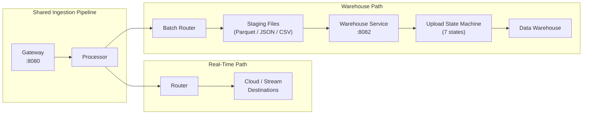

# Warehouse Destinations

Warehouse destinations are a distinct class of destinations within the RudderStack pipeline that load event data into **data warehouses and data lakes** via the dedicated Warehouse service. Unlike cloud destinations (real-time HTTP delivery) and stream destinations (real-time producer delivery), warehouse destinations use a **batch-oriented pipeline** with staging files, automatic schema management, identity resolution, and idempotent loading semantics.

The Warehouse service operates on **port 8082** and is orchestrated by the `App` struct in the warehouse package. It runs as part of the RudderStack server process in embedded mode, or as independent master/slave nodes for distributed deployments. The service manages 9 warehouse connectors through a unified `Manager` interface, handling the complete lifecycle from staging file ingestion through schema evolution and data export.

> Source: `warehouse/app.go:51-92`

**Key architectural difference:** Events destined for warehouse destinations flow through a separate pipeline path compared to cloud and stream destinations:

- **Cloud/Stream path:** Gateway → Processor → Router → Destination (real-time)
- **Warehouse path:** Gateway → Processor → Batch Router → Staging Files → Warehouse Service → Upload State Machine → Data Warehouse

The following diagram illustrates the warehouse destination data flow, highlighting where it diverges from the real-time routing pipeline:



> Source: `warehouse/app.go:346-468` — the `Run()` method orchestrates master/slave modes, gRPC/HTTP API servers, destination routers, and archive services.

**Related Documentation:**

[Destination Catalog](./index.md) | [Warehouse Service Architecture](../../warehouse/overview.md) | [End-to-End Data Flow](../../architecture/data-flow.md)

---

## Supported Warehouse Connectors

RudderStack supports **9 warehouse connectors**, each implementing the `Manager` interface defined in the warehouse integrations package. The following table provides a quick-reference comparison of all supported connectors with their identifiers, loading strategies, encoding formats, authentication methods, and distinguishing features.

| Warehouse | Identifier | Loading Strategy | Encoding Format | Auth Method | Key Feature |
|-----------|-----------|------------------|-----------------|-------------|-------------|
| **Snowflake** | `SNOWFLAKE` / `SNOWPIPE_STREAMING` | Snowpipe Streaming / COPY INTO stage | CSV (COPY) / Parquet (Streaming) | Account/username/password, Key-pair | Snowpipe Streaming real-time loading |
| **BigQuery** | `BQ` | BigQuery Load API | JSON | GCP Service Account JSON | Partitioned table loading, dedup views |
| **Redshift** | `RS` | S3 manifest COPY | CSV | IAM role / password | S3 → COPY with manifest files |
| **ClickHouse** | `CLICKHOUSE` | INSERT with MergeTree engines | CSV | Username/password | MergeTree engine family, cluster support |
| **Databricks (Delta Lake)** | `DELTALAKE` | COPY INTO / INSERT INTO / MERGE INTO | Parquet | Personal access token / OAuth | Delta Lake append/merge strategies |
| **PostgreSQL** | `POSTGRES` | pq.CopyIn streaming | CSV | Username/password, SSL | pq.CopyIn bulk streaming, SSH tunnelling |
| **SQL Server (MSSQL)** | `MSSQL` | Bulk CopyIn | CSV | Username/password | SQL Bulk Copy with type-aware truncation |
| **Azure Synapse** | `AZURE_SYNAPSE` | Bulk CopyIn (TDS protocol) | CSV | Username/password, Azure storage creds | UCS-2 string handling for international chars |
| **Datalake (S3/GCS/Azure)** | `S3_DATALAKE` / `GCS_DATALAKE` / `AZURE_DATALAKE` | Parquet file export | Parquet | AWS IAM / GCS credentials / Azure creds | Direct file export to object storage |

> Source: `warehouse/integrations/manager/manager.go:71-93` — the `newManager()` factory function maps destination type constants to connector implementations.

Each warehouse connector is instantiated via the `New()` factory function in the manager package, which accepts the destination type string and returns a `Manager` implementation. The factory dispatches to the appropriate connector package based on warehouse type constants defined in `warehouse/utils/`.

> Source: `warehouse/integrations/manager/manager.go:62-93`

---

## Warehouse Manager Interface

All 9 warehouse connectors implement the `Manager` interface, which defines a unified contract for schema management, data loading, identity resolution, lifecycle management, testing, and error handling. This interface enables the warehouse upload state machine to operate generically across all connector types.

```go
type Manager interface {
    Setup(ctx context.Context, warehouse model.Warehouse, uploader warehouseutils.Uploader) error
    FetchSchema(ctx context.Context) (model.Schema, error)
    CreateSchema(ctx context.Context) (err error)
    CreateTable(ctx context.Context, tableName string, columnMap model.TableSchema) (err error)
    AddColumns(ctx context.Context, tableName string, columnsInfo []warehouseutils.ColumnInfo) (err error)
    AlterColumn(ctx context.Context, tableName, columnName, columnType string) (model.AlterTableResponse, error)
    LoadTable(ctx context.Context, tableName string) (*types.LoadTableStats, error)
    LoadUserTables(ctx context.Context) map[string]error
    LoadIdentityMergeRulesTable(ctx context.Context) error
    LoadIdentityMappingsTable(ctx context.Context) error
    Cleanup(ctx context.Context)
    IsEmpty(ctx context.Context, warehouse model.Warehouse) (bool, error)
    DownloadIdentityRules(ctx context.Context, gzWriter *misc.GZipWriter) error
    Connect(ctx context.Context, warehouse model.Warehouse) (client.Client, error)
    SetConnectionTimeout(timeout time.Duration)
    ErrorMappings() []model.JobError

    TestConnection(ctx context.Context, warehouse model.Warehouse) error
    TestFetchSchema(ctx context.Context) error
    TestLoadTable(ctx context.Context, location, stagingTableName string, payloadMap map[string]any, loadFileFormat string) error
}
```

> Source: `warehouse/integrations/manager/manager.go:29-50`

### Method Categories

The interface methods are organized into six functional categories:

| Category | Methods | Purpose |
|----------|---------|---------|
| **Schema Management** | `FetchSchema`, `CreateSchema`, `CreateTable`, `AddColumns`, `AlterColumn` | Inspect and evolve the warehouse schema — create schemas, tables, add columns, and alter column types for schema evolution |
| **Data Loading** | `LoadTable`, `LoadUserTables` | Load event data from staging/load files into warehouse tables; `LoadUserTables` handles the special identifies→users merge flow |
| **Identity Resolution** | `LoadIdentityMergeRulesTable`, `LoadIdentityMappingsTable`, `DownloadIdentityRules` | Load and export identity merge rules and resolved identity mappings for cross-touchpoint user unification |
| **Lifecycle** | `Setup`, `Cleanup`, `Connect`, `SetConnectionTimeout` | Initialize connector state, establish connections, configure timeouts, and release resources |
| **Testing** | `TestConnection`, `TestFetchSchema`, `TestLoadTable` | Validate connectivity, schema access, and data loading capability during destination setup |
| **Error Handling** | `ErrorMappings` | Return connector-specific error pattern mappings for classifying failures (permission, resource, column size, etc.) |

### WarehouseOperations Extended Interface

The `WarehouseOperations` interface extends `Manager` with data governance operations for table deletion and row-level cleanup:

```go
type WarehouseDelete interface {
    DropTable(ctx context.Context, tableName string) (err error)
    DeleteBy(ctx context.Context, tableName []string, params warehouseutils.DeleteByParams) error
}

type WarehouseOperations interface {
    Manager
    WarehouseDelete
}
```

> Source: `warehouse/integrations/manager/manager.go:52-60`

The `WarehouseOperations` interface is used by the regulation worker for GDPR data deletion and by the warehouse service for source-aware cleanup operations. Not all connectors fully implement `WarehouseDelete` — the Datalake connector returns a not-implemented error for both `DropTable` and `DeleteBy`.

---

## Upload State Machine Overview

Every warehouse upload progresses through a **7-state lifecycle** managed by the upload state machine. Each state represents a distinct phase of the upload process, with failure handling and abort capabilities at each stage.

| State | Description |
|-------|-------------|
| **1. Waiting** | Upload queued, waiting to be picked up by a warehouse router |
| **2. GeneratedUploadSchema** | Schema generated by consolidating staging file schemas |
| **3. CreatedTableUploads** | Per-table upload records created for tracking individual table loads |
| **4. GeneratedLoadFiles** | Load files generated in the appropriate encoding format (Parquet/JSON/CSV) |
| **5. UpdatedTableUploadsCounts** | Table upload event counts finalized for progress tracking |
| **6. CreatedRemoteSchema** | Remote warehouse schema created or updated (DDL executed at the warehouse) |
| **7. ExportedData** | Data successfully loaded into the warehouse — upload complete |

An **Aborted** terminal state handles unrecoverable failures after maximum retries are exhausted.

The state machine ensures deterministic progression with retry semantics at each stage — if a stage fails, it can be retried without advancing to the next state. This design guarantees that partial uploads are never committed and that the entire upload can be safely re-attempted.

For the complete state machine documentation including transition diagrams, retry policies, and failure handling, see:

> [Upload State Machine](../../architecture/warehouse-state-machine.md)

---

## Encoding Formats

The warehouse encoding subsystem produces staging-ready load files in three formats, with each connector using the format best suited to its native loading mechanism:

| Format | Connectors | Characteristics |
|--------|-----------|-----------------|
| **Parquet** | Datalake (S3/GCS/Azure), Databricks (Delta Lake) | Columnar format with embedded schema, optimized for analytical queries and data lake storage |
| **JSON** | BigQuery | Newline-delimited JSON with nested/repeated field support, required by BigQuery's Load API |
| **CSV** | Redshift, PostgreSQL, MSSQL, Azure Synapse, Snowflake (COPY mode), ClickHouse | Gzip-compressed delimiter-separated values, widely supported by traditional RDBMS bulk loaders |

The encoding factory (`warehouse/encoding/`) provides format-agnostic writer, loader, and reader interfaces, enabling the warehouse pipeline to produce and consume staging files without coupling to a specific serialization format.

> Source: `warehouse/encoding/encoding.go`

For complete encoding format documentation including factory architecture, writer interfaces, and format-specific details, see:

> [Encoding Formats Reference](../../warehouse/encoding-formats.md)

---

## Schema Evolution

Warehouse destinations provide **automatic schema management** that evolves warehouse table schemas to accommodate new event properties without manual DDL intervention:

- **Column auto-discovery** — New properties appearing in events are automatically detected during staging file schema consolidation and added as new columns to the corresponding warehouse tables via `AddColumns`.
- **Type widening** — When an existing column receives data of a wider compatible type (e.g., `int` → `float`, `string` type expansion), the schema system applies type coercion via `AlterColumn` to widen the column definition.
- **Schema caching** — Warehouse schemas are cached with a configurable TTL to minimize remote schema fetches. The cache is refreshed when schema staleness is detected via `IsSchemaOutdated`.
- **Provider-specific casing** — Column and table names follow provider conventions: UPPERCASE for Snowflake, lowercase for all other connectors.

Schema evolution is a warehouse-exclusive capability — cloud and stream destinations rely on the destination platform to manage its own schema.

For the complete schema evolution reference including the Handler interface, diff algorithms, and consolidation logic, see:

> [Schema Evolution](../../warehouse/schema-evolution.md)

---

## Identity Resolution Integration

Warehouse destinations uniquely support **identity resolution** — a capability not available in cloud or stream destinations. The warehouse pipeline includes dedicated methods for loading and exporting identity data:

| Method | Purpose |
|--------|---------|
| `LoadIdentityMergeRulesTable` | Loads identity merge rules from event data into a dedicated `RUDDER_IDENTITY_MERGE_RULES` table, capturing user identity relationships (e.g., anonymous ID → user ID) |
| `LoadIdentityMappingsTable` | Loads resolved identity mappings into a `RUDDER_IDENTITY_MAPPINGS` table, providing the computed identity graph |
| `DownloadIdentityRules` | Exports identity rules as gzip-compressed data for downstream processing and cross-system identity resolution |

> Source: `warehouse/integrations/manager/manager.go:38-42`

Identity resolution enables cross-touchpoint user unification directly within the warehouse, allowing data teams to query a unified user profile across web, mobile, and server-side touchpoints. The identity pipeline operates alongside the standard event loading pipeline during the `ExportedData` state of the upload state machine.

For detailed identity resolution documentation, see:

> [Identity Resolution](../identity/identity-resolution.md)

---

## Idempotency and Backfill

Warehouse sync is designed to be **idempotent** — a critical requirement for production data pipelines. Every warehouse upload can be safely retried or replayed without creating duplicate records.

### Merge Strategies

Each warehouse connector supports one or both of the following loading strategies:

| Strategy | Behavior | Use Case |
|----------|----------|----------|
| **Append** | Events are appended directly to the target table | Event/track tables where every row is unique by `(message_id, received_at)` |
| **Merge / Dedup** | A staging table is loaded first, then duplicates are removed via delete-and-insert or `MERGE INTO` before committing to the target table | User/identifies/discards tables where rows must be deduplicated by primary key |

### Exactly-Once Semantics

Idempotent loading is achieved through several mechanisms:

- **Upload ID tracking** — Each upload is assigned a unique ID that tracks its progress through the state machine. Re-processing the same upload ID produces identical results.
- **Staging table isolation** — Data is first loaded into temporary staging tables, validated, and then atomically committed to target tables. Failed uploads leave no partial data in target tables.
- **Primary key deduplication** — For merge-eligible tables (users, identifies, discards), the connector applies primary key-based deduplication using `ROW_NUMBER()` partitioning or `MERGE INTO` statements.
- **State machine recovery** — The 7-state upload machine can resume from any previously completed state, ensuring that interrupted uploads continue from where they left off rather than restarting from scratch.

### Backfill Support

Historical data can be replayed through the warehouse pipeline at any time:

- The upload state machine handles backfill uploads identically to regular uploads — no special backfill mode is required.
- The archiver preserves event data in object storage with source/date/hour partitioning, enabling selective replay of historical time windows.
- Backfill operations are inherently idempotent due to the merge/dedup loading strategy, ensuring that replayed events do not create duplicates.

> **AAP Mandate:** Warehouse sync must be idempotent and support backfill — merge strategies, dedup logic, and staging file formats are documented per warehouse connector in the [per-connector guides](#per-connector-guides) below.

---

## Per-Connector Guides

Each warehouse connector has a dedicated detailed guide covering prerequisites, setup, configuration parameters, data type mappings, loading strategy, schema management, identity resolution, error handling, and troubleshooting. Click through to the connector-specific documentation for comprehensive configuration and operational guidance.

| Connector | Loading Mechanism | Detailed Guide |
|-----------|------------------|----------------|
| **Snowflake** | Snowpipe Streaming API and COPY INTO with CSV staging files | [Snowflake Connector Guide](../../warehouse/snowflake.md) |
| **BigQuery** | BigQuery Load API with JSON staging files from GCS | [BigQuery Connector Guide](../../warehouse/bigquery.md) |
| **Redshift** | S3 manifest-based COPY commands with CSV staging files | [Redshift Connector Guide](../../warehouse/redshift.md) |
| **ClickHouse** | INSERT with MergeTree engine families and CSV staging files | [ClickHouse Connector Guide](../../warehouse/clickhouse.md) |
| **Databricks (Delta Lake)** | COPY INTO / INSERT INTO / MERGE INTO with Parquet staging files | [Databricks Delta Lake Guide](../../warehouse/databricks.md) |
| **PostgreSQL** | pq.CopyIn bulk streaming protocol with CSV staging files | [PostgreSQL Connector Guide](../../warehouse/postgres.md) |
| **SQL Server (MSSQL)** | SQL Bulk Copy (mssql.CopyIn) with CSV staging files | [SQL Server (MSSQL) Guide](../../warehouse/mssql.md) |
| **Azure Synapse** | Bulk CopyIn via TDS protocol with CSV staging files | [Azure Synapse Connector Guide](../../warehouse/azure-synapse.md) |
| **Datalake (S3/GCS/Azure)** | Direct Parquet file export to object storage with Glue/Local schema repository | [Datalake (S3/GCS/Azure) Guide](../../warehouse/datalake.md) |

---

## Warehouse vs. Cloud vs. Stream Destinations

The following comparison table highlights the fundamental differences between the three destination categories to help you determine which delivery mode is appropriate for your use case:

| Aspect | Cloud Destinations | Stream Destinations | Warehouse Destinations |
|--------|-------------------|--------------------|-----------------------|
| **Delivery Mode** | Real-time HTTP (REST) | Real-time producer | Batch staging + load |
| **Latency** | Milliseconds | Milliseconds | Minutes to hours |
| **Pipeline Path** | Router → Transformer → HTTP | Router → CustomDestManager → Producer | Batch Router → Staging → Warehouse Service |
| **Schema Management** | None (destination-defined) | None (destination-defined) | Automatic schema evolution |
| **Identity Resolution** | No | No | Yes (merge rules + mappings) |
| **Idempotency** | Destination-dependent | Destination-dependent | Built-in (staging + merge) |
| **Encoding Format** | JSON (destination-specific) | JSON / Avro (destination-specific) | Parquet / JSON / CSV (connector-specific) |
| **Backfill Support** | Via event replay | Via event replay | Native (upload state machine) |
| **Service Port** | N/A (outbound HTTP) | N/A (outbound) | 8082 (Warehouse service) |
| **Count** | 90+ integrations | 13 integrations | 9 connectors |

**When to use warehouse destinations:**
- You need event data available for SQL-based analytics and BI tools
- You require automatic schema evolution as your event taxonomy grows
- You need cross-touchpoint identity resolution within your data warehouse
- You require idempotent, backfill-capable data loading semantics
- Your analytics workflow depends on structured, queryable event history

**When to use cloud or stream destinations instead:**
- You need real-time event delivery (sub-second latency)
- The destination is a SaaS platform with its own ingestion API
- You need event-driven architectures with message queue consumers
- Schema management is handled by the destination platform

---

## Cross-References

| Resource | Description | Link |
|----------|-------------|------|
| Warehouse Service Architecture | Comprehensive warehouse service architecture, operational modes, and component topology | [Warehouse Overview](../../warehouse/overview.md) |
| End-to-End Data Flow | Complete event lifecycle from SDK ingestion through warehouse loading | [Data Flow](../../architecture/data-flow.md) |
| Upload State Machine | Full 7-state upload lifecycle with transition diagrams and retry policies | [Upload State Machine](../../architecture/warehouse-state-machine.md) |
| Warehouse Sync Operations | Sync configuration, monitoring, and troubleshooting guide | [Warehouse Sync](../operations/warehouse-sync.md) |
| Destination Catalog | Overview of all destination categories (cloud, stream, warehouse, KV) | [Destination Catalog](./index.md) |
| Warehouse Parity | Segment-RudderStack warehouse sync gap analysis | [Warehouse Parity](../../gap-report/warehouse-parity.md) |
| Encoding Formats | Parquet, JSON, CSV encoding format reference | [Encoding Formats](../../warehouse/encoding-formats.md) |
| Schema Evolution | Automatic schema management and evolution reference | [Schema Evolution](../../warehouse/schema-evolution.md) |
| Identity Resolution | Cross-touchpoint identity unification guide | [Identity Resolution](../identity/identity-resolution.md) |
