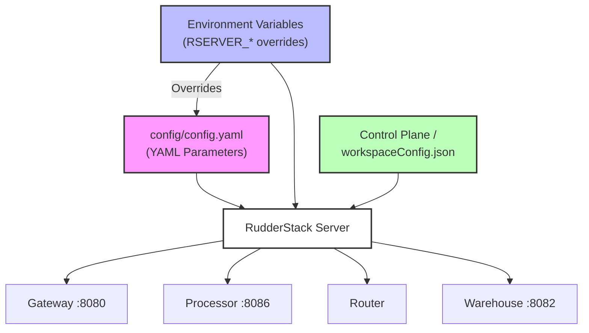

# Configuration

RudderStack is configured through two primary mechanisms — a YAML configuration file (`config/config.yaml`) and environment variables. This guide covers the essential parameters needed to get RudderStack operational. For the complete configuration reference with all 200+ parameters, see the [Configuration Reference](../../reference/config-reference.md).

> **Prerequisite:** Complete the [Installation](./installation.md) guide before configuring RudderStack.

---

## Table of Contents

- [Configuration Files](#configuration-files)
- [Configuration Precedence](#configuration-precedence)
- [Configuration Architecture](#configuration-architecture)
- [Global Settings](#global-settings)
- [HTTP Server Settings](#http-server-settings)
- [Gateway Configuration](#gateway-configuration)
  - [Gateway Webhook Settings](#gateway-webhook-settings)
- [Rate Limiting](#rate-limiting)
- [Database Configuration](#database-configuration)
  - [JobsDB Tuning Parameters](#jobsdb-tuning-parameters)
- [Essential Environment Variables](#essential-environment-variables)
  - [Warehouse Environment Variables](#warehouse-environment-variables)
- [Router Configuration](#router-configuration)
  - [Batch Router Configuration](#batch-router-configuration)
- [Warehouse Configuration](#warehouse-configuration)
  - [Per-Warehouse Parallel Load Settings](#per-warehouse-parallel-load-settings)
- [Processor Configuration](#processor-configuration)
- [Logging and Diagnostics](#logging-and-diagnostics)
  - [Logger Configuration](#logger-configuration)
  - [Diagnostics Configuration](#diagnostics-configuration)
- [Backup Storage Configuration](#backup-storage-configuration)
- [Docker Compose Configuration](#docker-compose-configuration)
- [Next Steps](#next-steps)

---

## Configuration Files

RudderStack uses two primary configuration files:

| File | Purpose | Location |
|------|---------|----------|
| `config/config.yaml` | Master configuration file containing all runtime parameters for Gateway, Processor, Router, Warehouse, JobsDB, and supporting subsystems | Repository root |
| `config/sample.env` | Environment variable template for database connections, service URLs, authentication, and backup storage | Repository root |
| `build/docker.env` | Docker-specific environment overrides (used by `docker-compose.yml`) | `build/` directory |

The YAML configuration file contains approximately 250 parameters organized by subsystem. The environment file provides connection strings and credentials that vary between deployment environments.

> Source: `config/config.yaml` (251 lines), `config/sample.env` (103 lines), `build/docker.env` (97 lines)

---

## Configuration Precedence

RudderStack loads configuration from multiple sources with the following precedence order (highest to lowest):

1. **Environment variables** — Override all other configuration sources
2. **YAML configuration file** (`config/config.yaml`) — Default runtime parameters
3. **Control Plane / workspace config** — Dynamic configuration polled from the RudderStack Control Plane (or loaded from a local `workspaceConfig.json` file)

Environment variable names follow the pattern `RSERVER_<SECTION>_<PARAMETER>` where camelCase parameter names are expanded to UPPER_SNAKE_CASE. For example:

| YAML Parameter | Environment Variable Override |
|---|---|
| `Gateway.webPort` | `RSERVER_GATEWAY_WEB_PORT` |
| `Router.noOfWorkers` | `RSERVER_ROUTER_NO_OF_WORKERS` |
| `Warehouse.mode` | `RSERVER_WAREHOUSE_MODE` |
| `Processor.transformBatchSize` | `RSERVER_PROCESSOR_TRANSFORM_BATCH_SIZE` |

The config file path itself is set via the `CONFIG_PATH` environment variable (default: `./config/config.yaml`).

> Source: `config/sample.env:1` (`CONFIG_PATH=./config/config.yaml`)

---

## Configuration Architecture

The following diagram illustrates how configuration sources flow into the RudderStack server and its components:



**Key ports to remember:**
- **Gateway:** `:8080` — SDK event ingestion endpoint
- **Processor:** `:8086` — Processor metrics endpoint
- **Warehouse:** `:8082` — Warehouse service HTTP/gRPC endpoint
- **Transformer:** `:9090` — External Transformer service (separate container/process)

---

## Global Settings

Root-level parameters that control system-wide behavior and component enablement. These are the top-level keys in `config/config.yaml`.

| Parameter | Default | Type | Description |
|-----------|---------|------|-------------|
| `maxProcess` | `12` | int | Maximum number of concurrent processing goroutines (GOMAXPROCS). Controls CPU parallelism for the Go runtime. |
| `enableProcessor` | `true` | bool | Enable the event Processor component. Set to `false` in GATEWAY-only deployment mode. |
| `enableRouter` | `true` | bool | Enable the Router component for destination delivery. Set to `false` in GATEWAY-only deployment mode. |
| `enableStats` | `true` | bool | Enable metrics collection subsystem for stats export. |
| `statsTagsFormat` | `influxdb` | string | Stats tags format for metric labels (`influxdb`). |

> Source: `config/config.yaml:1-5`

---

## HTTP Server Settings

Global HTTP client and server configuration affecting all RudderStack endpoints. These parameters control timeout behavior and connection limits for both inbound and outbound HTTP traffic.

| Parameter | Default | Type | Description |
|-----------|---------|------|-------------|
| `Http.ReadTimeout` | `0s` | duration | HTTP read timeout for the entire request including body. `0s` means no timeout. |
| `Http.ReadHeaderTimeout` | `0s` | duration | HTTP header read timeout. `0s` means no timeout. |
| `Http.WriteTimeout` | `10s` | duration | HTTP write timeout for response writes. |
| `Http.IdleTimeout` | `720s` | duration | Keep-alive idle connection timeout (12 minutes). |
| `Http.MaxHeaderBytes` | `524288` | int | Maximum HTTP request header size in bytes (512 KB). |
| `HttpClient.timeout` | `30s` | duration | Global timeout for all outbound HTTP client requests (e.g., to Transformer service, destination APIs). |

> Source: `config/config.yaml:6-13`

---

## Gateway Configuration

The Gateway is the HTTP ingestion endpoint — the **first component your SDKs and applications connect to**. It listens on port `8080` by default and handles event validation, authentication, batching, and persistence to the JobsDB.

| Parameter | Default | Type | Description |
|-----------|---------|------|-------------|
| `Gateway.webPort` | `8080` | int | **HTTP port for the Gateway** — this is the port your SDKs send events to. |
| `Gateway.maxUserWebRequestWorkerProcess` | `64` | int | Number of web request worker goroutines handling incoming HTTP requests. |
| `Gateway.maxDBWriterProcess` | `256` | int | Number of database writer goroutines persisting events to JobsDB. |
| `Gateway.CustomVal` | `GW` | string | Custom value identifier for Gateway jobs in the JobsDB. |
| `Gateway.maxUserRequestBatchSize` | `128` | int | Maximum number of events per user request batch. |
| `Gateway.maxDBBatchSize` | `128` | int | Maximum number of events per database write batch. |
| `Gateway.userWebRequestBatchTimeout` | `15ms` | duration | Timeout for batching user web requests before flushing. |
| `Gateway.dbBatchWriteTimeout` | `5ms` | duration | Timeout for batching database writes before flushing. |
| `Gateway.maxReqSizeInKB` | `4000` | int | Maximum request payload size in KB (4 MB). Requests exceeding this are rejected. |
| `Gateway.enableRateLimit` | `false` | bool | Enable per-workspace rate limiting at the Gateway. See [Rate Limiting](#rate-limiting). |
| `Gateway.enableSuppressUserFeature` | `true` | bool | Enable user suppression — suppressed users' events are dropped at ingestion. |
| `Gateway.allowPartialWriteWithErrors` | `true` | bool | Allow partial batch writes when some events in a batch fail validation. |
| `Gateway.allowReqsWithoutUserIDAndAnonymousID` | `false` | bool | When `false`, events without `userId` or `anonymousId` are rejected. |

> Source: `config/config.yaml:18-31` (Gateway section)

### Gateway Webhook Settings

Configuration for the Gateway's webhook ingestion subsystem. Webhooks allow third-party services to push events into RudderStack.

| Parameter | Default | Type | Description |
|-----------|---------|------|-------------|
| `Gateway.webhook.batchTimeout` | `20ms` | duration | Timeout for batching webhook events before processing. |
| `Gateway.webhook.maxBatchSize` | `32` | int | Maximum number of events per webhook batch. |
| `Gateway.webhook.maxTransformerProcess` | `64` | int | Number of worker goroutines for webhook transformation. |
| `Gateway.webhook.maxRetry` | `5` | int | Maximum number of retry attempts for failed webhook processing. |
| `Gateway.webhook.maxRetryTime` | `10s` | duration | Maximum total time window for webhook retry attempts. |

> Source: `config/config.yaml:32-40` (Gateway.webhook section)

---

## Rate Limiting

Global API rate limiting applied at the Gateway ingestion layer. Rate limiting controls the maximum event acceptance rate per workspace within a configurable time window.

> **Note:** Rate limiting is only enforced when `Gateway.enableRateLimit` is set to `true` (default: `false`). When disabled, no rate limits are applied to incoming events.

| Parameter | Default | Type | Description |
|-----------|---------|------|-------------|
| `RateLimit.eventLimit` | `1000` | int | Maximum number of events accepted per workspace within the rate limit window. |
| `RateLimit.rateLimitWindow` | `60m` | duration | Duration of the rate limit time window (60 minutes). |
| `RateLimit.noOfBucketsInWindow` | `12` | int | Number of buckets dividing the time window for granular rate tracking (5-minute buckets at default settings). |

> Source: `config/config.yaml:14-17` (RateLimit section)

---

## Database Configuration

RudderStack requires a **PostgreSQL** database (called JobsDB) for persistent event storage and processing state management. The database connection is configured exclusively through environment variables.

| Variable | Default | Description |
|----------|---------|-------------|
| `JOBS_DB_HOST` | `localhost` | PostgreSQL host address. |
| `JOBS_DB_PORT` | `5432` | PostgreSQL port number. |
| `JOBS_DB_USER` | `rudder` | Database username for authentication. |
| `JOBS_DB_PASSWORD` | `rudder` | Database password for authentication. Use a strong password in production. |
| `JOBS_DB_DB_NAME` | `jobsdb` | PostgreSQL database name. |
| `JOBS_DB_SSL_MODE` | `disable` | SSL connection mode (`disable`, `require`, `verify-ca`, `verify-full`). Use `verify-full` in production. |

> Source: `config/sample.env:2-7` (database connection variables)

### JobsDB Tuning Parameters

The JobsDB uses partitioned PostgreSQL tables for high-throughput event storage. These parameters control partition sizes, archival, and backup behavior.

| Parameter | Default | Type | Description |
|-----------|---------|------|-------------|
| `JobsDB.maxDSSize` | `100000` | int | Maximum number of rows per dataset partition before a new partition is created. |
| `JobsDB.maxTableSizeInMB` | `300` | int | Maximum table size in MB before triggering dataset migration. |
| `JobsDB.archivalTimeInDays` | `10` | int | Number of days to retain data before archival to object storage. |
| `JobsDB.backup.enabled` | `true` | bool | Enable JobsDB backup to object storage. Requires backup storage configuration. |
| `JobsDB.jobDoneMigrateThres` | `0.8` | float | Fraction of completed jobs that triggers dataset migration (80%). |
| `JobsDB.migrateDSLoopSleepDuration` | `30s` | duration | Sleep duration between dataset migration cycles. |
| `JobsDB.backupCheckSleepDuration` | `5s` | duration | Sleep duration between backup check cycles. |
| `JobsDB.backupRowsBatchSize` | `1000` | int | Number of rows per backup batch. |

> Source: `config/config.yaml:64-88` (JobsDB section)

---

## Essential Environment Variables

The following environment variables are the most important for getting RudderStack running. Set these in your environment file (`config/sample.env` or `build/docker.env`) or export them directly.

| Variable | Default | Required | Description |
|----------|---------|----------|-------------|
| `CONFIG_PATH` | `./config/config.yaml` | No | Path to the YAML configuration file. |
| `WORKSPACE_TOKEN` | *(none)* | **Yes** | Workspace authentication token for Control Plane. Obtain from the RudderStack dashboard under **Settings > Workspace Token**. |
| `CONFIG_BACKEND_URL` | `https://api.rudderstack.com` | No | Control Plane API URL. The server polls this endpoint every 5 seconds for workspace configuration. |
| `DEST_TRANSFORM_URL` | `http://localhost:9090` | Yes | URL of the external Transformer service. Required for event transformations. |
| `GO_ENV` | `production` | No | Runtime environment (`production` or `development`). |
| `LOG_LEVEL` | `INFO` | No | Logging verbosity (`DEBUG`, `INFO`, `WARN`, `ERROR`). |
| `INSTANCE_ID` | `1` | No | Server instance identifier for multi-instance deployments and metrics tagging. |

> Source: `config/sample.env:1-19` (essential environment variables)

### Warehouse Environment Variables

If you are using warehouse destinations (Snowflake, BigQuery, Redshift, etc.), configure the warehouse database connection separately. In single-node deployments, this can point to the same PostgreSQL instance as the primary JobsDB.

| Variable | Default | Description |
|----------|---------|-------------|
| `WAREHOUSE_JOBS_DB_HOST` | `localhost` | Warehouse database host address. |
| `WAREHOUSE_JOBS_DB_PORT` | `5432` | Warehouse database port number. |
| `WAREHOUSE_JOBS_DB_USER` | `rudder` | Warehouse database username. |
| `WAREHOUSE_JOBS_DB_PASSWORD` | `rudder` | Warehouse database password. |
| `WAREHOUSE_JOBS_DB_DB_NAME` | `jobsdb` | Warehouse database name. |
| `WAREHOUSE_JOBS_DB_SSL_MODE` | `disable` | Warehouse database SSL mode. |
| `WAREHOUSE_URL` | `http://localhost:8082` | Warehouse service HTTP/gRPC API endpoint URL. |

> Source: `config/sample.env:83-90` (warehouse database configuration)

---

## Router Configuration

The Router delivers events to real-time destinations (cloud APIs, streaming platforms) with per-user ordering guarantees, retry logic, and adaptive throttling.

| Parameter | Default | Type | Description |
|-----------|---------|------|-------------|
| `Router.noOfWorkers` | `64` | int | Number of Router worker goroutines processing destination delivery concurrently. |
| `Router.guaranteeUserEventOrder` | `true` | bool | Guarantee per-user event ordering. When `true`, events for the same user are delivered in sequence. |
| `Router.retryTimeWindow` | `180m` | duration | Maximum retry window (3 hours). Events that fail delivery beyond this window are aborted. |
| `Router.minRetryBackoff` | `10s` | duration | Minimum backoff duration between retry attempts. |
| `Router.maxRetryBackoff` | `300s` | duration | Maximum backoff duration between retry attempts (5 minutes). |
| `Router.maxFailedCountForJob` | `3` | int | Maximum number of delivery failures before a job is aborted. |
| `Router.throttler.algorithm` | `gcra` | string | Rate limiting algorithm for per-destination throttling. GCRA (Generic Cell Rate Algorithm) provides smooth rate limiting. |

> Source: `config/config.yaml:93-122` (Router section)

### Batch Router Configuration

The Batch Router handles bulk delivery to destinations that accept file-based or batch uploads (warehouses, object storage, batch APIs).

| Parameter | Default | Type | Description |
|-----------|---------|------|-------------|
| `BatchRouter.noOfWorkers` | `8` | int | Number of Batch Router worker goroutines. |
| `BatchRouter.uploadFreq` | `30s` | duration | Frequency of batch upload cycles. Events are accumulated and uploaded at this interval. |
| `BatchRouter.maxFailedCountForJob` | `128` | int | Maximum delivery failures before abort. Set high to accommodate long-running batch syncs. |
| `BatchRouter.retryTimeWindow` | `180m` | duration | Maximum retry window for batch jobs (3 hours). |

> Source: `config/config.yaml:138-144` (BatchRouter section)

---

## Warehouse Configuration

The Warehouse service manages data loading into data warehouses (Snowflake, BigQuery, Redshift, etc.). It runs as an embedded service by default or can be deployed separately in master/slave mode for horizontal scaling.

| Parameter | Default | Type | Description |
|-----------|---------|------|-------------|
| `Warehouse.mode` | `embedded` | string | Deployment mode: `embedded` (runs within the server), `master` (coordinates uploads), `slave` (executes uploads), `off` (disabled). |
| `Warehouse.webPort` | `8082` | int | HTTP/gRPC port for the Warehouse service API. |
| `Warehouse.uploadFreq` | `1800s` | duration | Upload cycle frequency (30 minutes). Controls how often the warehouse upload scheduler runs. |
| `Warehouse.noOfWorkers` | `8` | int | Number of upload worker goroutines handling warehouse load jobs. |
| `Warehouse.noOfSlaveWorkerRoutines` | `4` | int | Number of slave worker routines (used in master/slave mode). |
| `Warehouse.minRetryAttempts` | `3` | int | Minimum number of retry attempts for failed warehouse uploads. |
| `Warehouse.enableIDResolution` | `false` | bool | Enable identity resolution in the warehouse. When enabled, identity merge rules are applied during data loading. |

> Source: `config/config.yaml:145-183` (Warehouse section)

### Per-Warehouse Parallel Load Settings

Each warehouse connector has a configurable maximum number of parallel table loads. Higher values increase throughput but consume more resources at the destination.

| Warehouse | Parameter | `maxParallelLoads` | Notes |
|-----------|-----------|-------------------|-------|
| Redshift | `Warehouse.redshift.maxParallelLoads` | `3` | — |
| Snowflake | `Warehouse.snowflake.maxParallelLoads` | `3` | — |
| BigQuery | `Warehouse.bigquery.maxParallelLoads` | `20` | Higher default due to BigQuery's partition-based loading model. |
| PostgreSQL | `Warehouse.postgres.maxParallelLoads` | `3` | Also supports `enableSQLStatementExecutionPlan: false`. |
| MSSQL | `Warehouse.mssql.maxParallelLoads` | `3` | — |
| Azure Synapse | `Warehouse.azure_synapse.maxParallelLoads` | `3` | — |
| ClickHouse | `Warehouse.clickhouse.maxParallelLoads` | `3` | Additional settings: `blockSize: 1000`, `poolSize: 10`. |
| Delta Lake | `Warehouse.deltalake.loadTableStrategy` | N/A | Uses `MERGE` strategy instead of parallel loads. |

> Source: `config/config.yaml:162-183` (Warehouse per-connector settings)

---

## Processor Configuration

The Processor runs the six-stage event processing pipeline — transforming, enriching, and routing events from the Gateway to destinations. It communicates with the external Transformer service for JavaScript/Python transformations.

| Parameter | Default | Type | Description |
|-----------|---------|------|-------------|
| `Processor.webPort` | `8086` | int | Processor metrics HTTP port. |
| `Processor.loopSleep` | `10ms` | duration | Sleep duration between processing loop iterations. Lower values reduce latency. |
| `Processor.maxLoopProcessEvents` | `10000` | int | Maximum number of events processed per loop iteration. |
| `Processor.transformBatchSize` | `100` | int | Batch size for destination transformation requests sent to the Transformer service. |
| `Processor.userTransformBatchSize` | `200` | int | Batch size for user transformation (custom JavaScript/Python) requests. |
| `Processor.maxHTTPConnections` | `100` | int | Maximum outbound HTTP connections to the Transformer service. |

> Source: `config/config.yaml:184-203` (Processor section)

---

## Logging and Diagnostics

### Logger Configuration

RudderStack's logging subsystem supports console and file output with configurable format and verbosity.

| Parameter | Default | Type | Description |
|-----------|---------|------|-------------|
| `Logger.enableConsole` | `true` | bool | Enable logging to stdout. |
| `Logger.enableFile` | `false` | bool | Enable logging to a file. |
| `Logger.consoleJsonFormat` | `false` | bool | Output console logs in JSON format. Recommended for production with log aggregation. |
| `Logger.logFileLocation` | `/tmp/rudder_log.log` | string | File path for log file output (when `enableFile` is `true`). |
| `Logger.logFileSize` | `100` | int | Maximum log file size in MB before rotation. |
| `Logger.enableTimestamp` | `true` | bool | Include timestamps in log entries. |
| `Logger.enableStackTrace` | `false` | bool | Include stack traces in error log entries. Enable for debugging. |

> Source: `config/config.yaml:217-226` (Logger section)

### Diagnostics Configuration

Diagnostics controls the telemetry and metrics collection for monitoring RudderStack's health and performance.

| Parameter | Default | Type | Description |
|-----------|---------|------|-------------|
| `Diagnostics.enableDiagnostics` | `true` | bool | Master toggle for the diagnostics subsystem. |
| `Diagnostics.enableServerStartMetric` | `true` | bool | Emit server start metrics. |
| `Diagnostics.enableGatewayMetric` | `true` | bool | Emit Gateway throughput and latency metrics. |
| `Diagnostics.enableRouterMetric` | `true` | bool | Emit Router delivery and retry metrics. |
| `Diagnostics.enableBatchRouterMetric` | `true` | bool | Emit Batch Router upload and failure metrics. |
| `Diagnostics.enableDestinationFailuresMetric` | `true` | bool | Emit per-destination failure metrics. |

> Source: `config/config.yaml:227-239` (Diagnostics section)

---

## Backup Storage Configuration

RudderStack supports backing up JobsDB data to external object storage for disaster recovery and archival. Configure the backup storage provider through environment variables.

> **Note:** Backup storage is only used when `JobsDB.backup.enabled` is `true` (default). See [JobsDB Tuning Parameters](#jobsdb-tuning-parameters).

### AWS S3

```bash
JOBS_BACKUP_STORAGE_PROVIDER=S3
JOBS_BACKUP_BUCKET=<your_s3_bucket>
JOBS_BACKUP_PREFIX=<prefix>
AWS_ACCESS_KEY_ID=<your_access_key>
AWS_SECRET_ACCESS_KEY=<your_secret_key>
```

### Azure Blob Storage

```bash
JOBS_BACKUP_STORAGE_PROVIDER=AZURE_BLOB
JOBS_BACKUP_BUCKET=<your_azure_container>
JOBS_BACKUP_PREFIX=<prefix>
AZURE_STORAGE_ACCOUNT=<your_storage_account>
AZURE_STORAGE_ACCESS_KEY=<your_access_key>
```

### Google Cloud Storage

```bash
JOBS_BACKUP_STORAGE_PROVIDER=GCS
JOBS_BACKUP_BUCKET=<your_gcs_bucket>
JOBS_BACKUP_PREFIX=<prefix>
GOOGLE_APPLICATION_CREDENTIALS=/path/to/credentials.json
```

### MinIO

```bash
JOBS_BACKUP_STORAGE_PROVIDER=MINIO
JOBS_BACKUP_BUCKET=<your_minio_bucket>
JOBS_BACKUP_PREFIX=<prefix>
MINIO_ENDPOINT=localhost:9000
MINIO_ACCESS_KEY_ID=<your_access_key>
MINIO_SECRET_ACCESS_KEY=<your_secret_key>
```

### DigitalOcean Spaces

```bash
JOBS_BACKUP_STORAGE_PROVIDER=DIGITAL_OCEAN_SPACES
JOBS_BACKUP_BUCKET=<your_spaces_bucket>
JOBS_BACKUP_PREFIX=<prefix>
DO_SPACES_ENDPOINT=<your_endpoint>
DO_SPACES_ACCESS_KEY_ID=<your_access_key>
DO_SPACES_SECRET_ACCESS_KEY=<your_secret_key>
```

> Source: `config/sample.env:40-81` (storage provider configurations)

---

## Docker Compose Configuration

When running RudderStack via `docker-compose.yml`, environment variables are loaded from `build/docker.env`. This file contains Docker-specific overrides that differ from the standalone `config/sample.env`.

### Key Docker Overrides

| Variable | Docker Value | Standalone Value | Reason |
|----------|-------------|-----------------|--------|
| `JOBS_DB_HOST` | `db` | `localhost` | Points to the Docker Compose PostgreSQL service name. |
| `JOBS_DB_PASSWORD` | `password` | `rudder` | Matches the `POSTGRES_PASSWORD` set on the `db` service. |
| `DEST_TRANSFORM_URL` | `http://d-transformer:9090` | `http://localhost:9090` | Points to the Docker Compose Transformer service name. |
| `CONFIG_PATH` | `/app/config/config.yaml` | `./config/config.yaml` | Container filesystem path. |
| `INSTANCE_ID` | `local_dev` | `1` | Identifies the Docker development instance. |
| `STATSD_SERVER_URL` | `grafana:8125` | *(not set)* | Points to the Docker Compose Grafana service for metrics. |

> Source: `build/docker.env:1-25` (Docker environment overrides)

### Mounting a Workspace Config File

For air-gapped or offline deployments, you can load workspace configuration from a local JSON file instead of polling the Control Plane API. Uncomment the volume mount in `docker-compose.yml`:

```yaml
# In docker-compose.yml under the backend service, uncomment:
volumes:
  - /absolute/path/to/workspaceConfig.json:/etc/rudderstack/workspaceConfig.json
```

Then enable file-based configuration loading:

```bash
# In build/docker.env, uncomment:
RSERVER_BACKEND_CONFIG_CONFIG_FROM_FILE=true
RSERVER_BACKEND_CONFIG_CONFIG_JSONPATH=/etc/rudderstack/workspaceConfig.json
```

> Source: `docker-compose.yml:25-27` (workspace config volume mount), `build/docker.env:31-33` (file-based config variables)

---

## Next Steps

Now that RudderStack is configured, continue with these guides:

- **[Send Your First Events](./first-events.md)** — Tutorial for sending events via `curl` and the `devtool` CLI
- **[Configuration Reference](../../reference/config-reference.md)** — Complete reference for all 200+ YAML parameters
- **[Environment Variable Reference](../../reference/env-var-reference.md)** — Full environment variable documentation with descriptions and defaults
- **[Capacity Planning](../operations/capacity-planning.md)** — Tuning guide for achieving 50,000 events/sec throughput
- **[Architecture Overview](../../architecture/overview.md)** — Understand how Gateway, Processor, Router, and Warehouse components interact

---

*This document covers essential configuration for getting started. For advanced tuning, per-destination throttling, cluster deployment configuration, and complete parameter descriptions, refer to the [Configuration Reference](../../reference/config-reference.md).*
