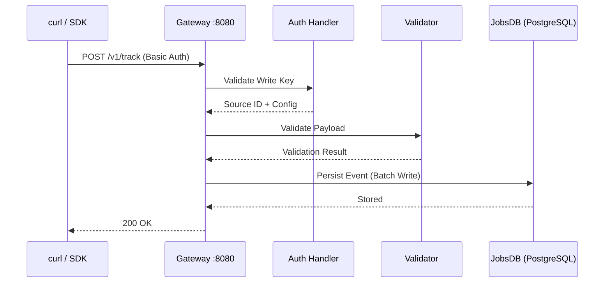

# Sending Your First Events

This tutorial walks you through sending your first events to RudderStack using the Gateway HTTP API (port 8080). By the end, you will have sent all six core event types — **identify**, **track**, **page**, **screen**, **group**, and **alias** — plus a multi-event **batch** request. You will also learn how to use the `devtool` CLI for automated event testing, webhook simulation, and etcd management.

> **Prerequisite:** This guide assumes you have RudderStack running and configured. If not, complete the [Installation](./installation.md) and [Configuration](./configuration.md) guides first.

---

## Table of Contents

- [Prerequisites](#prerequisites)
- [Key Information](#key-information)
- [Authentication](#authentication)
- [Identify](#identify)
- [Track](#track)
- [Page](#page)
- [Screen](#screen)
- [Group](#group)
- [Alias](#alias)
- [Batch Endpoint](#batch-endpoint)
- [Using the devtool CLI](#using-the-devtool-cli)
  - [Sending Events](#sending-events)
  - [Simulating a Webhook Destination](#simulating-a-webhook-destination)
  - [etcd Management](#etcd-management)
- [Verifying Event Delivery](#verifying-event-delivery)
- [Event Ingestion Flow](#event-ingestion-flow)
- [Next Steps](#next-steps)

---

## Prerequisites

Before sending events, ensure the following are in place:

| Requirement | Details |
|-------------|---------|
| **RudderStack installed and running** | Complete the [Installation Guide](./installation.md) |
| **Configuration verified** | Complete the [Configuration Guide](./configuration.md) |
| **Valid Write Key** | Obtain a Write Key from your workspace configuration or Control Plane |
| **`curl` installed** | Command-line HTTP client (pre-installed on most systems) |
| **(Optional) `devtool` CLI** | Bundled in the Docker image for automated event testing |

---

## Key Information

> **Quick Reference**
>
> | Parameter | Value | Source |
> |-----------|-------|--------|
> | Gateway HTTP port | `8080` | `config/config.yaml:19` (`Gateway.webPort`) |
> | Authentication | HTTP Basic Auth — Write Key as username, empty password | `gateway/openapi.yaml:679-682` |
> | Content-Type | `application/json` | All event endpoints |
> | Max request size | 4 MB (4000 KB) | `config/config.yaml:27` (`Gateway.maxReqSizeInKB`) |
> | User ID requirement | At least one of `userId` or `anonymousId` required | `config/config.yaml:31` (`Gateway.allowReqsWithoutUserIDAndAnonymousID: false`) |

---

## Authentication

All event API endpoints use **HTTP Basic Authentication**. The Write Key is the username and the password is left empty.

**Using the curl `-u` flag (recommended):**

```bash
# The trailing colon after the Write Key indicates an empty password
curl -u "YOUR_WRITE_KEY:" http://localhost:8080/v1/track ...
```

**Using an explicit Authorization header:**

```bash
curl -H "Authorization: Basic $(echo -n 'YOUR_WRITE_KEY:' | base64)" http://localhost:8080/v1/track ...
```

> Source: `gateway/openapi.yaml:679-682` (`writeKeyAuth` security scheme — HTTP Basic Authentication)

### Response Codes

The Gateway returns the following HTTP status codes for event API requests. For the complete error reference, see the [Error Codes Reference](../../api-reference/error-codes.md).

| Code | Status | Meaning |
|------|--------|---------|
| **200** | OK | Event accepted — response body is `"OK"` |
| **400** | Bad Request | Invalid request payload (malformed JSON, missing required fields) |
| **401** | Unauthorized | Invalid or missing Write Key in the Authorization header |
| **404** | Not Found | Source not found, source disabled, or source does not accept events |
| **413** | Request Entity Too Large | Request body exceeds 4 MB (`Gateway.maxReqSizeInKB: 4000`) |
| **429** | Too Many Requests | Rate limit exceeded — wait and retry |

> Source: `gateway/openapi.yaml:30-72` (identify endpoint response definitions — same codes apply to all event endpoints)

---

## Identify

The **identify** call lets you associate a visiting user with their actions and record any associated traits such as email, name, or plan.

**Endpoint:** `POST /v1/identify`

```bash
curl -X POST http://localhost:8080/v1/identify \
  -u "YOUR_WRITE_KEY:" \
  -H "Content-Type: application/json" \
  -d '{
    "userId": "user-123",
    "anonymousId": "anon-456",
    "context": {
      "traits": {
        "email": "user@example.com",
        "name": "Jane Doe",
        "plan": "premium"
      },
      "ip": "192.168.1.1",
      "library": {
        "name": "http"
      }
    },
    "timestamp": "2024-01-15T10:30:00Z"
  }'
```

**Expected response:** `200 OK` with body `OK`

### Identify Payload Fields

| Field | Type | Required | Description |
|-------|------|----------|-------------|
| `userId` | string | Yes* | Unique identifier for the user in your database |
| `anonymousId` | string | Yes* | Anonymous identifier for cases where there is no unique user ID |
| `context` | object | No | Dictionary of contextual metadata about the message |
| `context.traits` | object | No | User traits — email, name, plan, or any custom key-value pairs |
| `context.ip` | string | No | IP address of the user |
| `context.library` | object | No | Library metadata (name of the sending library) |
| `timestamp` | string (ISO 8601) | No | Timestamp of the event. If omitted, the server assigns one on receipt |

\* At least one of `userId` or `anonymousId` is required. This behavior is controlled by `Gateway.allowReqsWithoutUserIDAndAnonymousID` (default: `false`).

> Source: `gateway/openapi.yaml:15-74` (identify endpoint), `gateway/openapi.yaml:688-721` (`IdentifyPayload` schema)
>
> For the complete identify specification, see [Identify Event Spec](../../api-reference/event-spec/identify.md).

---

## Track

The **track** call lets you record user actions along with any properties associated with them. The `event` field is the key differentiator — it specifies the name of the action being tracked.

**Endpoint:** `POST /v1/track`

```bash
curl -X POST http://localhost:8080/v1/track \
  -u "YOUR_WRITE_KEY:" \
  -H "Content-Type: application/json" \
  -d '{
    "userId": "user-123",
    "event": "Product Viewed",
    "properties": {
      "product_id": "SKU-001",
      "name": "Premium Widget",
      "category": "Widgets",
      "price": 49.99,
      "currency": "USD"
    },
    "context": {
      "ip": "192.168.1.1",
      "library": {
        "name": "http"
      }
    },
    "timestamp": "2024-01-15T10:35:00Z"
  }'
```

**Expected response:** `200 OK` with body `OK`

### Track Payload Fields

| Field | Type | Required | Description |
|-------|------|----------|-------------|
| `userId` | string | Yes* | Unique identifier for the user |
| `anonymousId` | string | Yes* | Anonymous identifier (required if `userId` absent) |
| `event` | string | **Yes** | Name of the event being performed by the user |
| `properties` | object | No | Dictionary of properties associated with the event |
| `context` | object | No | Dictionary of contextual metadata |
| `timestamp` | string (ISO 8601) | No | Timestamp of the event |

\* At least one of `userId` or `anonymousId` is required.

> Source: `gateway/openapi.yaml:75-134` (track endpoint), `gateway/openapi.yaml:722-755` (`TrackPayload` schema)
>
> For the complete track specification, see [Track Event Spec](../../api-reference/event-spec/track.md).

---

## Page

The **page** call lets you record page views on your website with additional information about the viewed page. The `name` field identifies which page was viewed.

**Endpoint:** `POST /v1/page`

```bash
curl -X POST http://localhost:8080/v1/page \
  -u "YOUR_WRITE_KEY:" \
  -H "Content-Type: application/json" \
  -d '{
    "userId": "user-123",
    "name": "Pricing",
    "properties": {
      "url": "https://example.com/pricing",
      "referrer": "https://example.com/home",
      "title": "Pricing | Example"
    },
    "context": {
      "library": {
        "name": "http"
      }
    },
    "timestamp": "2024-01-15T10:40:00Z"
  }'
```

**Expected response:** `200 OK` with body `OK`

### Page Payload Fields

| Field | Type | Required | Description |
|-------|------|----------|-------------|
| `userId` | string | Yes* | Unique identifier for the user |
| `anonymousId` | string | Yes* | Anonymous identifier (required if `userId` absent) |
| `name` | string | No | Name of the page being viewed |
| `properties` | object | No | Page properties — `url`, `referrer`, `title`, or any custom key-value pairs |
| `context` | object | No | Dictionary of contextual metadata |
| `timestamp` | string (ISO 8601) | No | Timestamp of the event |

\* At least one of `userId` or `anonymousId` is required.

> Source: `gateway/openapi.yaml:135-194` (page endpoint), `gateway/openapi.yaml:756-789` (`PagePayload` schema)
>
> For the complete page specification, see [Page Event Spec](../../api-reference/event-spec/page.md).

---

## Screen

The **screen** call is the mobile equivalent of the page call. It records when a user views a mobile screen with any additional relevant information about the screen.

**Endpoint:** `POST /v1/screen`

```bash
curl -X POST http://localhost:8080/v1/screen \
  -u "YOUR_WRITE_KEY:" \
  -H "Content-Type: application/json" \
  -d '{
    "userId": "user-123",
    "name": "Dashboard",
    "properties": {
      "feed_length": 25,
      "tab": "Overview"
    },
    "context": {
      "library": {
        "name": "com.rudderstack.android.sdk.core"
      }
    },
    "timestamp": "2024-01-15T10:45:00Z"
  }'
```

**Expected response:** `200 OK` with body `OK`

### Screen Payload Fields

| Field | Type | Required | Description |
|-------|------|----------|-------------|
| `userId` | string | Yes* | Unique identifier for the user |
| `anonymousId` | string | Yes* | Anonymous identifier (required if `userId` absent) |
| `name` | string | No | Name of the screen being viewed |
| `properties` | object | No | Screen properties — any custom key-value pairs describing the screen |
| `context` | object | No | Dictionary of contextual metadata |
| `timestamp` | string (ISO 8601) | No | Timestamp of the event |

\* At least one of `userId` or `anonymousId` is required.

> Source: `gateway/openapi.yaml:195-255` (screen endpoint), `gateway/openapi.yaml:790-825` (`ScreenPayload` schema)
>
> For the complete screen specification, see [Screen Event Spec](../../api-reference/event-spec/screen.md).

---

## Group

The **group** call links an identified user with a group — such as a company, organization, or account — and records any custom traits associated with that group. The `groupId` and top-level `traits` fields are specific to the group call.

**Endpoint:** `POST /v1/group`

```bash
curl -X POST http://localhost:8080/v1/group \
  -u "YOUR_WRITE_KEY:" \
  -H "Content-Type: application/json" \
  -d '{
    "userId": "user-123",
    "groupId": "company-456",
    "traits": {
      "name": "Acme Corp",
      "industry": "Technology",
      "employees": 250,
      "plan": "enterprise"
    },
    "context": {
      "library": {
        "name": "http"
      }
    },
    "timestamp": "2024-01-15T10:50:00Z"
  }'
```

**Expected response:** `200 OK` with body `OK`

### Group Payload Fields

| Field | Type | Required | Description |
|-------|------|----------|-------------|
| `userId` | string | Yes* | Unique identifier for the user |
| `anonymousId` | string | Yes* | Anonymous identifier (required if `userId` absent) |
| `groupId` | string | **Yes** | Unique identifier of the group in your database |
| `traits` | object | No | Group traits — name, industry, employees, plan, or any custom key-value pairs |
| `context` | object | No | Dictionary of contextual metadata |
| `timestamp` | string (ISO 8601) | No | Timestamp of the event |

\* At least one of `userId` or `anonymousId` is required.

> Source: `gateway/openapi.yaml:256-317` (group endpoint), `gateway/openapi.yaml:826-867` (`GroupPayload` schema)
>
> For the complete group specification, see [Group Event Spec](../../api-reference/event-spec/group.md).

---

## Alias

The **alias** call lets you merge different identities of a known user. Use it to connect an anonymous user's actions with their identified profile after login. The `previousId` field specifies the old identity to merge into the current `userId`.

**Endpoint:** `POST /v1/alias`

```bash
curl -X POST http://localhost:8080/v1/alias \
  -u "YOUR_WRITE_KEY:" \
  -H "Content-Type: application/json" \
  -d '{
    "userId": "user-123",
    "previousId": "anon-456",
    "context": {
      "library": {
        "name": "http"
      }
    },
    "timestamp": "2024-01-15T10:55:00Z"
  }'
```

**Expected response:** `200 OK` with body `OK`

### Alias Payload Fields

| Field | Type | Required | Description |
|-------|------|----------|-------------|
| `userId` | string | **Yes** | The new unique identifier for the user |
| `previousId` | string | **Yes** | The previous unique identifier to merge into `userId` |
| `context` | object | No | Dictionary of contextual metadata |
| `timestamp` | string (ISO 8601) | No | Timestamp of the event |

> Source: `gateway/openapi.yaml:318-375` (alias endpoint), `gateway/openapi.yaml:868-899` (`AliasPayload` schema)
>
> For the complete alias specification, see [Alias Event Spec](../../api-reference/event-spec/alias.md).

---

## Batch Endpoint

The **batch** call enables you to send multiple events (identify, track, page, screen, group, alias) in a single request. This is the **recommended approach** for high-throughput event ingestion, as it reduces HTTP overhead and improves throughput.

**Endpoint:** `POST /v1/batch`

```bash
curl -X POST http://localhost:8080/v1/batch \
  -u "YOUR_WRITE_KEY:" \
  -H "Content-Type: application/json" \
  -d '{
    "batch": [
      {
        "type": "identify",
        "userId": "user-123",
        "context": {
          "traits": {
            "email": "user@example.com",
            "name": "Jane Doe"
          }
        }
      },
      {
        "type": "track",
        "userId": "user-123",
        "event": "Product Viewed",
        "properties": {
          "product_id": "SKU-001",
          "name": "Premium Widget",
          "price": 49.99
        }
      },
      {
        "type": "page",
        "userId": "user-123",
        "name": "Checkout",
        "properties": {
          "url": "https://example.com/checkout"
        }
      }
    ]
  }'
```

**Expected response:** `200 OK` with body `OK`

### Batch Payload Structure

| Field | Type | Required | Description |
|-------|------|----------|-------------|
| `batch` | array | **Yes** | Array of event objects to process |
| `batch[].type` | string | **Yes** | Event type — must be one of: `identify`, `track`, `page`, `screen`, `group`, `alias` |

Each element in the `batch` array follows the same schema as its corresponding individual endpoint. The `type` field determines which schema applies to each element.

> **Note:** The total request size for a batch call must not exceed 4 MB. Plan your batch sizes accordingly.

> Source: `gateway/openapi.yaml:376-435` (batch endpoint), `gateway/openapi.yaml:900-939` (`BatchPayload` schema)
>
> For the complete Gateway HTTP API reference, see [Gateway HTTP API](../../api-reference/gateway-http-api.md).

---

## Using the devtool CLI

The `devtool` CLI provides commands for sending events, managing etcd, and simulating webhook destinations. It is bundled in the Docker image and can also be built from source at `cmd/devtool/`.

> Source: `cmd/devtool/README.md:1-19` (devtool overview), `cmd/devtool/main.go:14-32` (CLI application setup)

### Sending Events

The `event send` command sends a templated batch event to `/v1/batch` with an auto-generated `anonymousId` (UUID v4) and `timestamp` (RFC 3339 format). It uses HTTP Basic Auth with the Write Key and sends a "Demo Track" event simulating an Android SDK client.

```bash
# Send a single batch event to the local server
./devtool event send --write-key YOUR_WRITE_KEY --endpoint http://localhost:8080

# Send 10 events
./devtool event send --write-key YOUR_WRITE_KEY --endpoint http://localhost:8080 --count 10

# Using short flags
./devtool event send -w YOUR_WRITE_KEY -e http://localhost:8080 -c 5
```

#### Event Send Flags

| Flag | Short | Default | Description |
|------|-------|---------|-------------|
| `--endpoint` | `-e` | `http://localhost:8080` | HTTP endpoint for rudder-server |
| `--write-key` | `-w` | *(required)* | Source Write Key |
| `--count` | `-c` | `1` | Number of events to send |

The embedded payload template is a `track` event with the event name `"Demo Track"`, channel `"android-sdk"`, and context simulating an Android device. The template auto-generates a unique `anonymousId` (UUID) and populates `originalTimestamp` and `sentAt` with the current time.

> Source: `cmd/devtool/commands/event.go:25-59` (event send command definition and flags), `cmd/devtool/commands/event.go:62-112` (`EventSend` implementation — sends POST to `/v1/batch` with Basic Auth), `cmd/devtool/commands/payloads/batch.json` (embedded payload template)

### Simulating a Webhook Destination

The `webhook run` command starts a lightweight HTTP server that simulates a destination webhook. It accepts POST requests, responds with `200 OK`, parses the `SentAt` timestamp from the request payload, and logs event latency (`time.Since(sentAt)`). This is useful for testing destination delivery and measuring end-to-end pipeline latency.

```bash
# Start a webhook destination simulator on default port 8083
./devtool webhook run

# Start on a custom port with verbose logging
./devtool webhook run --port 9090 --verbose
```

#### Webhook Run Flags

| Flag | Short | Default | Description |
|------|-------|---------|-------------|
| `--port` | | `8083` | Port to listen on |
| `--verbose` | `-v` | `false` | Print detailed output |

**Typical workflow:**

1. Start the webhook simulator: `./devtool webhook run`
2. Configure a webhook destination in your RudderStack workspace pointing to `http://localhost:8083`
3. Send events using curl or the `event send` command
4. Observe latency logs in the webhook server output

> Source: `cmd/devtool/commands/webhook.go:20-47` (webhook run command and flags), `cmd/devtool/commands/webhook.go:49-65` (`WebhookRun` server setup — `http.Server` with 10s write timeout), `cmd/devtool/commands/webhook.go:90-102` (`ServeHTTP` handler — reads body, computes latency from `SentAt`, returns 200 OK)

### etcd Management

The `etcd` commands are used for multi-tenant deployments. etcd is required when running RudderStack in cluster mode and enables dynamic mode switching between normal and degraded operation.

```bash
# Switch server to normal mode
./devtool etcd mode normal

# Switch server to degraded mode
./devtool etcd mode degraded

# Switch mode without waiting for acknowledgement
./devtool etcd mode normal --no-wait

# List all etcd keys and values
./devtool etcd list
```

#### etcd Mode Command

The `mode` command writes a mode change request to the key `/<releaseName>/SERVER/<instanceId>/MODE` in etcd and waits for the server to acknowledge the change (unless `--no-wait` is specified).

| Flag | Default | Description |
|------|---------|-------------|
| `--no-wait` | `false` | Do not wait for the mode change to be acknowledged |

**Arguments:** `[normal|degraded]` — the target server mode.

#### etcd List Command

The `list` command retrieves all keys and values from etcd and displays them in a formatted table. Useful for debugging cluster state and verifying mode configuration.

**Configuration:** By default, the devtool connects to etcd at `127.0.0.1:2379`. Override this with the `ETCD_HOSTS` environment variable (comma-separated list of endpoints).

> Source: `cmd/devtool/commands/etcd.go:23-49` (etcd command definition with mode and list subcommands), `cmd/devtool/commands/etcd.go:51-98` (`Mode` implementation — writes to etcd key, optionally waits for ack), `cmd/devtool/commands/etcd.go:100-137` (`List` implementation — fetches all keys, renders table)

---

## Verifying Event Delivery

After sending events, use the following methods to verify they were received and are flowing through the pipeline.

### 1. Check Gateway Response

A `200 OK` response with body `"OK"` confirms that the Gateway accepted the event and persisted it to the JobsDB queue. This does **not** confirm delivery to destinations — only that the event entered the pipeline.

```bash
# Expected successful response
HTTP/1.1 200 OK
OK
```

### 2. Health Check Endpoint

Verify that the Gateway is running and accepting requests:

```bash
curl http://localhost:8080/health
```

A healthy Gateway responds with `200 OK`.

### 3. Use the Webhook Simulator

For end-to-end verification including destination delivery:

1. Start the webhook simulator: `./devtool webhook run --verbose`
2. Configure a webhook destination pointing to `http://localhost:8083`
3. Send a test event and observe it arriving at the webhook server
4. Check the logged latency to measure pipeline transit time

### 4. Check Gateway Logs

Look for event processing log entries in the RudderStack server output:

```bash
# If running with Docker Compose
docker compose logs backend | grep -i "event"
```

### Troubleshooting

| Symptom | Likely Cause | Resolution |
|---------|-------------|------------|
| **401 Unauthorized** | Invalid or missing Write Key | Verify the Write Key matches your workspace configuration |
| **400 Bad Request** | Malformed JSON or missing required fields | Validate your JSON payload (use `jq . <<< 'your_payload'` to check) |
| **413 Request Entity Too Large** | Payload exceeds 4 MB | Reduce your payload size or split into multiple requests |
| **429 Too Many Requests** | Rate limit exceeded | Default: 1000 events per 60-minute window with 12 buckets. Wait and retry with exponential backoff |
| **404 Not Found** | Source not configured, disabled, or wrong source type | Verify the source exists, is enabled, and matches the expected source category |
| **Connection refused** | RudderStack not running on port 8080 | Verify the server is started: `curl http://localhost:8080/health` |
| **Empty response** | Server still initializing | Wait for the server to complete startup (check logs for "Gateway started" message) |

> Source: `config/config.yaml:14-17` (RateLimit section — `eventLimit: 1000`, `rateLimitWindow: 60m`, `noOfBucketsInWindow: 12`)

---

## Event Ingestion Flow

The following diagram illustrates the complete lifecycle of an event from the client to persistent storage when you send a request to any of the event API endpoints:



**Pipeline stages after ingestion:**

1. **Gateway** — Accepts the HTTP request, authenticates the Write Key, validates the payload, and persists the event to the Gateway JobsDB.
2. **Processor** — Reads events from the Gateway JobsDB, applies transformations (user transforms, destination transforms), consent filtering, and tracking plan validation, then writes to the Router JobsDB.
3. **Router** — Reads events from the Router JobsDB and delivers them to configured destinations in real-time with retry, throttling, and ordering guarantees.
4. **Warehouse** — For warehouse destinations, the Batch Router generates staging files that the Warehouse service loads into your data warehouse.

For the full pipeline architecture, see the [Architecture Overview](../../architecture/overview.md).

---

## Next Steps

Now that you have successfully sent your first events, explore these resources to deepen your integration:

- **[API Reference](../../api-reference/index.md)** — Complete HTTP API documentation with all endpoints, authentication schemes, and request/response formats
- **[Event Spec — Common Fields](../../api-reference/event-spec/common-fields.md)** — Shared fields across all event types including `messageId`, `integrations`, and `sentAt`
- **[Architecture Overview](../../architecture/overview.md)** — Understand the full event pipeline from ingestion through processing to warehouse loading
- **[Source SDK Guides](../sources/javascript-sdk.md)** — Integrate with JavaScript, iOS, Android, or server-side SDKs instead of raw HTTP calls
- **[Destination Guides](../destinations/index.md)** — Configure where your events are routed and delivered
- **[Gateway HTTP API](../../api-reference/gateway-http-api.md)** — Full reference for all Gateway endpoints including import, replay, beacon, pixel, and webhook
- **[Error Codes Reference](../../api-reference/error-codes.md)** — Complete HTTP response code and error message reference
- **[Configuration Reference](../../reference/config-reference.md)** — All 200+ configuration parameters for fine-tuning your deployment
