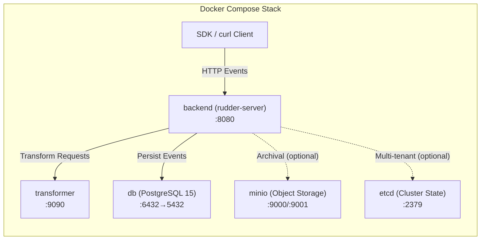

# Installation

This guide covers the complete installation process for RudderStack `rudder-server` v1.68.1. RudderStack can be deployed using **Docker Compose** (recommended for evaluation and development), **Kubernetes with Helm charts** (recommended for production), or **built from source** for local development.

> **Important:** If you are planning to use RudderStack in production, we STRONGLY recommend using our Kubernetes Helm charts. We update our Docker images with bug fixes much more frequently than our GitHub repo.
>
> *Source: `README.md:98`*

---

## Table of Contents

- [Prerequisites](#prerequisites)
- [Architecture Overview](#architecture-overview)
- [Docker Compose Installation](#docker-compose-installation)
- [Docker Image Build Details](#docker-image-build-details)
- [Kubernetes Installation](#kubernetes-installation)
- [Developer Machine Setup](#developer-machine-setup)
- [Port Reference](#port-reference)
- [Deployment Modes](#deployment-modes)
- [Troubleshooting](#troubleshooting)
- [Next Steps](#next-steps)

---

## Prerequisites

Before installing RudderStack, ensure the following are available on your system:

| Prerequisite | Required For | Version / Details |
|-------------|-------------|-------------------|
| **Docker** and **Docker Compose** | Docker installation | Docker Compose file format v3.7+ |
| **Go** | Developer machine setup | 1.26.0 |
| **PostgreSQL** | All methods (provided via Docker or external) | 15 |
| **RudderStack Workspace Token** | All methods | Obtain from [RudderStack Cloud](https://app.rudderstack.com/signup?type=freetrial) or use a local workspace config file |
| **RAM** | All methods | At least 4 GB recommended for the full stack |
| **Make** | Developer machine setup | Any recent version |
| **Git** | All methods | Any recent version |

---

## Architecture Overview

RudderStack's Docker Compose deployment runs five services that form the complete data pipeline. The diagram below shows the service topology and communication paths:



**Core services** (`db`, `backend`, `transformer`) start by default. **Optional services** (`minio`, `etcd`) are activated via Docker Compose profiles:

- **`storage` profile** — Enables MinIO object storage for event archival.
- **`multi-tenant` profile** — Enables etcd for multi-tenant cluster state management.

*Source: `docker-compose.yml:1-54`*

---

## Docker Compose Installation

Docker Compose is the simplest way to run the full RudderStack stack for evaluation, development, and testing.

### Service Architecture

The Docker Compose configuration defines five services:

| Service | Image | Port Mapping | Purpose |
|---------|-------|-------------|---------|
| `db` | `postgres:15-alpine` | `6432:5432` | PostgreSQL database for JobsDB event storage |
| `backend` | Built from `./Dockerfile` | `8080:8080` | RudderStack server (Gateway + Processor + Router + Warehouse) |
| `transformer` | `rudderstack/rudder-transformer:latest` | `9090:9090` | External Transformer service for event transformations |
| `minio` | `minio/minio` | `9000:9000`, `9001:9001` | Object storage for archival (optional, profile: `storage`) |
| `etcd` | `docker.io/bitnami/etcd:3` | `2379:2379` | Cluster state management (optional, profile: `multi-tenant`) |

*Source: `docker-compose.yml:1-54` (full Docker Compose configuration)*

### Step 1: Clone the Repository

```bash
git clone https://github.com/rudderlabs/rudder-server.git
cd rudder-server
```

### Step 2: Configure Your Workspace Token

Edit `build/docker.env` and set the `WORKSPACE_TOKEN` variable:

```bash
# In build/docker.env, replace the placeholder:
WORKSPACE_TOKEN=your_workspace_token_here
```

You can obtain a workspace token by signing up for [RudderStack Cloud Free](https://app.rudderstack.com/signup?type=freetrial).

**Alternative: File-based workspace configuration**

For air-gapped or self-hosted control plane setups, mount a workspace configuration file by uncommenting the volume mount in `docker-compose.yml`:

```yaml
# Uncomment in docker-compose.yml (lines 25-27):
volumes:
  - /path/to/workspaceConfig.json:/etc/rudderstack/workspaceConfig.json
```

When using file-based configuration, also set the following in `build/docker.env`:

```bash
RSERVER_BACKEND_CONFIG_CONFIG_FROM_FILE=true
RSERVER_BACKEND_CONFIG_CONFIG_JSONPATH=/etc/rudderstack/workspaceConfig.json
```

*Source: `docker-compose.yml:25-27` (volume mount comment), `build/docker.env:17` (WORKSPACE_TOKEN placeholder)*

### Step 3: Start the Services

```bash
# Start core services (db, backend, transformer)
docker compose up -d

# Start with MinIO object storage (for archival)
docker compose --profile storage up -d

# Start with etcd (for multi-tenant mode)
docker compose --profile multi-tenant up -d

# Start all services
docker compose --profile storage --profile multi-tenant up -d
```

The `backend` service will wait for the `db` service to become available before starting, using the built-in `wait-for` utility.

*Source: `docker-compose.yml:18` (entrypoint wait-for command)*

### Step 4: Verify the Installation

```bash
# Check all services are running
docker compose ps

# Verify Gateway is accepting connections
curl http://localhost:8080/health

# Check Gateway logs
docker compose logs backend
```

- **Expected health check response:** HTTP `200 OK`
- **Gateway ready indicator:** Look for `"Gateway started"` in backend logs
- **Startup time:** The backend service typically takes 15–30 seconds to initialize after the database is ready

### Docker Environment Variable Defaults

The following environment variables are pre-configured in `build/docker.env` for Docker Compose deployments:

| Variable | Docker Default | Description |
|----------|---------------|-------------|
| `POSTGRES_USER` | `rudder` | PostgreSQL superuser name |
| `POSTGRES_PASSWORD` | `password` | PostgreSQL superuser password |
| `POSTGRES_DB` | `jobsdb` | Default database name |
| `JOBS_DB_HOST` | `db` | Docker service name for PostgreSQL |
| `JOBS_DB_USER` | `rudder` | Database username for RudderStack |
| `JOBS_DB_PORT` | `5432` | Database port (internal container port) |
| `JOBS_DB_DB_NAME` | `jobsdb` | Database name |
| `JOBS_DB_PASSWORD` | `password` | Database password |
| `JOBS_DB_SSL_MODE` | `disable` | SSL mode for database connections |
| `DEST_TRANSFORM_URL` | `http://d-transformer:9090` | Transformer service URL |
| `CONFIG_BACKEND_URL` | `https://api.rudderstack.com` | RudderStack control plane URL |
| `CONFIG_PATH` | `/app/config/config.yaml` | Config file path inside the container |
| `GO_ENV` | `production` | Runtime environment |
| `LOG_LEVEL` | `INFO` | Logging verbosity (`DEBUG`, `INFO`, `WARN`, `ERROR`) |
| `INSTANCE_ID` | `local_dev` | Instance identifier for metrics and logging |
| `WORKSPACE_TOKEN` | `<your_token_here>` | Workspace authentication token (**must be set**) |

*Source: `build/docker.env:1-23` (Docker environment defaults)*

---

## Docker Image Build Details

The RudderStack Docker image uses a **multi-stage build** to produce a minimal, statically-linked binary.

### Builder Stage

| Property | Value |
|----------|-------|
| **Base Image** | `golang:1.26.0-alpine3.23` |
| **Installed Packages** | `make`, `tzdata`, `ca-certificates` |
| **Build Artifacts** | `rudder-server` binary (via `make build`), `devtool` CLI, `rudder-cli` admin tool, `wait-for-go`, `regulation-worker` |
| **CGO** | Disabled (`CGO_ENABLED=0`) for fully static binary |

*Source: `Dockerfile:5-6` (GO_VERSION=1.26.0, ALPINE_VERSION=3.23), `Dockerfile:29-34` (build commands)*

### Runtime Stage

| Property | Value |
|----------|-------|
| **Base Image** | `alpine:3.23` |
| **Installed Packages** | `tzdata`, `ca-certificates`, `postgresql-client`, `curl`, `bash` |
| **Included Binaries** | `rudder-server`, `wait-for-go`, `regulation-worker`, `devtool`, `rudder-cli` |
| **Included Scripts** | `/docker-entrypoint.sh`, `/wait-for`, `/scripts/generate-event`, `/scripts/batch.json` |
| **Entrypoint** | `/docker-entrypoint.sh` → `/rudder-server` |

*Source: `Dockerfile:36-53` (runtime stage)*

### Build Arguments

The Dockerfile accepts the following build arguments for customization:

| Argument | Default | Description |
|----------|---------|-------------|
| `GO_VERSION` | `1.26.0` | Go compiler version |
| `ALPINE_VERSION` | `3.23` | Alpine Linux version |
| `VERSION` | *(from CI)* | Release version tag embedded in binary |
| `REVISION` | *(from CI)* | Build revision identifier |
| `COMMIT_HASH` | *(from CI)* | Git commit SHA embedded in binary |
| `ENTERPRISE_TOKEN` | *(optional)* | Enterprise feature activation token |
| `RACE_ENABLED` | `false` | Enable Go race detector (testing only) |
| `CGO_ENABLED` | `0` | Disable CGO for static binary compilation |

*Source: `Dockerfile:5-16` (build ARGs)*

To build the image manually with custom arguments:

```bash
docker build \
  --build-arg VERSION=1.68.1 \
  --build-arg COMMIT_HASH=$(git rev-parse HEAD) \
  -t rudder-server:custom .
```

---

## Kubernetes Installation

Kubernetes deployment is recommended for production environments. RudderStack provides official Helm charts that deploy and manage the full stack including PostgreSQL, Transformer, and the RudderStack server.

### Step 1: Add the Helm Repository

```bash
# Add RudderStack Helm repository
helm repo add rudderstack https://helm.rudderstack.com
helm repo update
```

### Step 2: Install the Chart

```bash
# Install with default configuration
helm install rudder rudderstack/rudderstack \
  --set rudderWorkspaceToken="YOUR_WORKSPACE_TOKEN"

# Install with custom values file
helm install rudder rudderstack/rudderstack -f values.yaml

# Install in a specific namespace
helm install rudder rudderstack/rudderstack \
  --namespace rudderstack \
  --create-namespace \
  --set rudderWorkspaceToken="YOUR_WORKSPACE_TOKEN"
```

### Step 3: Verify the Deployment

```bash
# Check pods are running
kubectl get pods -l app=rudderstack

# Check services
kubectl get svc -l app=rudderstack

# Port-forward to test locally
kubectl port-forward svc/rudder-rudderstack 8080:8080

# Verify Gateway health
curl http://localhost:8080/health
```

### Key Helm Values

| Value | Default | Description |
|-------|---------|-------------|
| `rudderWorkspaceToken` | *(required)* | Workspace authentication token |
| `postgresql.enabled` | `true` | Deploy bundled PostgreSQL instance |
| `postgresql.postgresqlDatabase` | `jobsdb` | Database name |
| `transformer.enabled` | `true` | Deploy Transformer service sidecar |
| `transformer.image.tag` | `latest` | Transformer image tag |
| `backend.replicaCount` | `1` | Number of RudderStack server replicas |
| `backend.resources.requests.memory` | `2Gi` | Memory request for backend pods |

For detailed Kubernetes deployment options, including high-availability configurations, custom storage classes, and ingress setup, see the [RudderStack Kubernetes documentation](https://www.rudderstack.com/docs/rudderstack-open-source/installing-and-setting-up-rudderstack/kubernetes/).

*Source: `README.md:95` (Kubernetes installation link)*

---

## Developer Machine Setup

Building from source is recommended for contributors and developers who need to modify or debug RudderStack internals.

### Prerequisites

Verify the following tools are installed:

```bash
# Go 1.26.0
go version
# Expected: go version go1.26.0 linux/amd64 (or your OS/arch)

# Make
make --version

# PostgreSQL client
psql --version

# Git
git --version
```

### Step 1: Clone and Build

```bash
# Clone the repository
git clone https://github.com/rudderlabs/rudder-server.git
cd rudder-server

# Download Go dependencies
go mod download

# Build the server and supporting tools
make build
```

The `make build` target produces:
- `./rudder-server` — Main server binary
- `./build/wait-for-go/wait-for-go` — TCP port wait utility
- `./build/regulation-worker` — GDPR regulation worker binary

*Source: `Makefile:80-87` (build target)*

To also build the developer tools:

```bash
# Build developer CLI tool (etcd management, event sending, webhooks)
go build -o devtool ./cmd/devtool/

# Build admin CLI tool (runtime administration)
go build -o rudder-cli ./cmd/rudder-cli/
```

*Source: `Dockerfile:33-34` (devtool and rudder-cli build commands)*

### Step 2: Set Up PostgreSQL

RudderStack requires a PostgreSQL 15 database for its persistent job queue (JobsDB).

```bash
# Create the database (if PostgreSQL is running locally)
createdb jobsdb

# Or using psql directly
psql -c "CREATE DATABASE jobsdb;"

# Create a dedicated user (optional but recommended)
psql -c "CREATE USER rudder WITH PASSWORD 'rudder';"
psql -c "GRANT ALL PRIVILEGES ON DATABASE jobsdb TO rudder;"
```

### Step 3: Configure Environment

```bash
# Copy sample environment file
cp config/sample.env .env

# Edit .env with your settings (key variables shown below)
```

The essential environment variables for local development:

| Variable | Local Default | Description |
|----------|--------------|-------------|
| `CONFIG_PATH` | `./config/config.yaml` | Path to configuration file |
| `JOBS_DB_HOST` | `localhost` | PostgreSQL host |
| `JOBS_DB_USER` | `rudder` | PostgreSQL username |
| `JOBS_DB_PASSWORD` | `rudder` | PostgreSQL password |
| `JOBS_DB_PORT` | `5432` | PostgreSQL port |
| `JOBS_DB_DB_NAME` | `jobsdb` | Database name |
| `JOBS_DB_SSL_MODE` | `disable` | SSL mode |
| `DEST_TRANSFORM_URL` | `http://localhost:9090` | Transformer service URL |
| `WORKSPACE_TOKEN` | `<your_token_here>` | Workspace token (**must be set**) |
| `GO_ENV` | `production` | Runtime environment |
| `LOG_LEVEL` | `INFO` | Log verbosity |

*Source: `config/sample.env:1-19` (essential environment variables)*

### Step 4: Start the Transformer Service

The Transformer service is an external dependency required for event transformations. Run it as a Docker container:

```bash
# Start the Transformer service (required)
docker run -d --name rudder-transformer -p 9090:9090 \
  rudderstack/rudder-transformer:latest
```

Verify the Transformer is running:

```bash
curl http://localhost:9090/health
```

### Step 5: Start the Server

```bash
# Start RudderStack server
./rudder-server

# Or using go run (for development iteration)
go run main.go
```

*Source: `Makefile:89-90` (run target)*

### Step 6: Verify the Installation

```bash
# Verify Gateway is running
curl http://localhost:8080/health

# Send a test identify event
curl -X POST http://localhost:8080/v1/identify \
  -H "Content-Type: application/json" \
  -u "YOUR_WRITE_KEY:" \
  -d '{
    "userId": "test-user-1",
    "traits": {
      "email": "test@example.com",
      "name": "Test User"
    }
  }'
```

A successful event submission returns HTTP `200 OK`.

---

## Port Reference

The following ports are used by RudderStack services. Ensure these ports are available or configure alternatives via `config/config.yaml`.

| Service | Port | Protocol | Description |
|---------|------|----------|-------------|
| Gateway | `8080` | HTTP | Event ingestion API (identify, track, page, screen, group, alias, batch) |
| Processor | `8086` | HTTP | Processor metrics and health endpoint |
| Warehouse | `8082` | HTTP/gRPC | Warehouse service API and gRPC management interface |
| Transformer | `9090` | HTTP | External Transformer service for event transformations |
| PostgreSQL | `5432` (`6432` mapped in Docker) | TCP | JobsDB persistent event storage |
| MinIO | `9000` / `9001` | HTTP | Object storage API / MinIO web console |
| etcd | `2379` | HTTP/gRPC | Cluster state management and coordination |

*Source: `config/config.yaml:19` (Gateway.webPort: 8080), `config/config.yaml:147` (Warehouse.webPort: 8082), `config/config.yaml:185` (Processor.webPort: 8086), `docker-compose.yml:9` (db: 6432→5432), `docker-compose.yml:20` (backend: 8080), `docker-compose.yml:30` (transformer: 9090), `docker-compose.yml:37-38` (minio: 9000/9001), `docker-compose.yml:53` (etcd: 2379)*

---

## Deployment Modes

RudderStack supports three deployment modes, allowing you to run the full stack in a single process or split ingestion and processing across separate nodes for horizontal scaling.

| Mode | Description | Use Case |
|------|-------------|----------|
| **EMBEDDED** | All components run in one process: Gateway, Processor, Router, Batch Router, and Warehouse | Development, evaluation, small deployments |
| **GATEWAY** | Only the Gateway component runs; writes events to GatewayDB for downstream processing | Horizontal scaling of the ingestion tier |
| **PROCESSOR** | Only the Processor, Router, Batch Router, and Warehouse components run; reads events from GatewayDB | Horizontal scaling of the processing tier |

The Docker Compose configuration runs in **EMBEDDED** mode by default (all-in-one). For split-mode deployments, set the `DEPLOYMENT_TYPE` environment variable:

```bash
# Gateway-only instance
DEPLOYMENT_TYPE=GATEWAY ./rudder-server

# Processor-only instance
DEPLOYMENT_TYPE=PROCESSOR ./rudder-server
```

For detailed deployment architecture, scaling strategies, and production topology diagrams, see [Deployment Topologies](../../architecture/deployment-topologies.md).

---

## Troubleshooting

### Backend service fails to start

**Symptom:** `backend` container exits immediately or shows connection errors.

**Common causes and solutions:**

1. **Database not ready:** The `backend` service uses `wait-for` to wait for PostgreSQL. If the database takes longer than expected, check:
   ```bash
   docker compose logs db
   ```

2. **Invalid workspace token:** Verify your `WORKSPACE_TOKEN` in `build/docker.env` is correct. An invalid token causes the backend to fail during configuration loading.

3. **Port conflict:** Ensure port `8080` is not in use by another service:
   ```bash
   lsof -i :8080
   ```

### Transformer connection errors

**Symptom:** Events are accepted but not processed; logs show transformer connection failures.

**Solution:** Verify the Transformer service is running and accessible:

```bash
# Check Transformer health
curl http://localhost:9090/health

# In Docker Compose, check the transformer container
docker compose logs transformer
```

Ensure `DEST_TRANSFORM_URL` matches your Transformer service address:
- Docker Compose: `http://d-transformer:9090`
- Local development: `http://localhost:9090`

### Database connection failures

**Symptom:** Logs show `connection refused` or `authentication failed` for PostgreSQL.

**Solution:** Verify database connectivity and credentials:

```bash
# Test database connection
psql -h localhost -p 6432 -U rudder -d jobsdb -c "SELECT 1;"

# For Docker Compose, use the mapped port (6432)
# For local development, use the standard port (5432)
```

Ensure `JOBS_DB_*` environment variables match your PostgreSQL configuration.

### Health check returns non-200

**Symptom:** `curl http://localhost:8080/health` returns an error or no response.

**Solution:**
1. Wait 15–30 seconds after starting — the Gateway initializes asynchronously.
2. Check backend logs for startup errors:
   ```bash
   docker compose logs backend --tail 50
   ```
3. Verify the container is running:
   ```bash
   docker compose ps
   ```

---

## Next Steps

Once RudderStack is installed and the health check returns successfully, continue with:

- **[Configuration Guide](./configuration.md)** — Configure RudderStack for your environment, including all 200+ tunable parameters
- **[Send Your First Events](./first-events.md)** — Start sending events via curl and the `devtool` CLI
- **[Architecture Overview](../../architecture/overview.md)** — Understand the system components and data flow pipeline
- **[API Reference](../../api-reference/index.md)** — Complete HTTP API, gRPC API, and Admin API documentation
- **[Migration from Segment](../migration/segment-migration.md)** — Step-by-step guide to migrate from Twilio Segment to RudderStack
