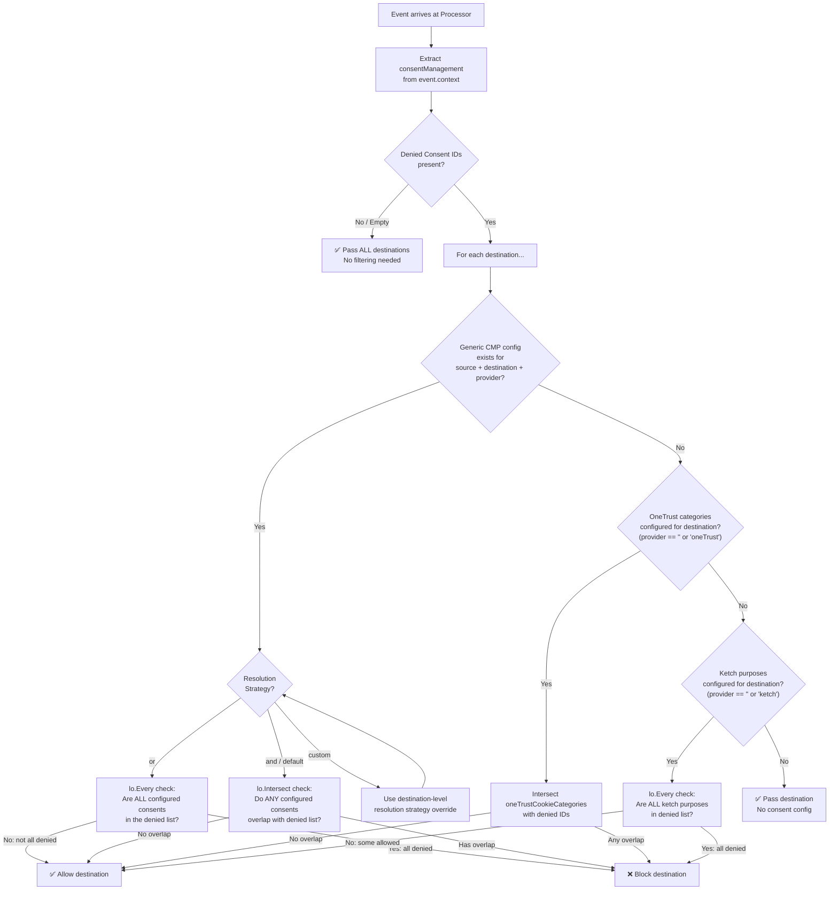
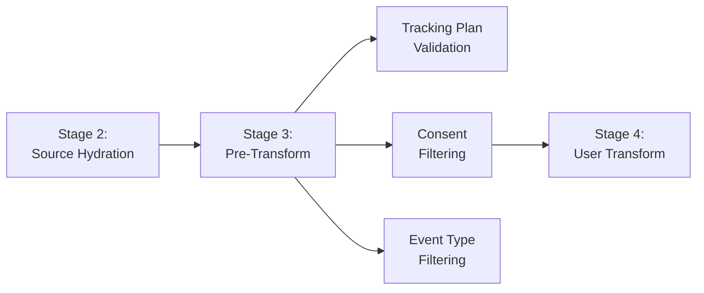

# Consent Management

RudderStack implements a **three-tier consent management system** that filters destination delivery based on user consent preferences embedded in each event. When a Consent Management Platform (CMP) collects user consent choices on the client side, those choices are forwarded to RudderStack via the `event.context.consentManagement` object. The Processor evaluates these consent signals against per-destination consent configuration and determines which destinations are eligible to receive each event.

The system supports three consent management providers, evaluated in strict priority order:

1. **Generic Consent Management (GCM)** — The modern, preferred approach. Supports multiple named providers per destination with configurable resolution strategies (`or` / `and`). Configuration is scoped per source–destination–provider triple.
2. **Legacy OneTrust** — Cookie-category-based consent filtering. Intersects configured cookie categories with denied consent IDs; any overlap blocks the destination. Configuration is scoped per destination.
3. **Legacy Ketch** — Purpose-based consent filtering. Blocks a destination only when **all** configured purposes appear in the denied consent list. Configuration is scoped per destination.

Consent filtering occurs during the **Pre-Transform stage** (Stage 3) of the [six-stage Processor pipeline](../../architecture/pipeline-stages.md). It runs after source hydration and alongside tracking plan validation, but before user transformation. The `getConsentFilteredDestinations()` function returns a filtered list of destinations for each event — only destinations that pass consent filtering proceed to transformation and delivery.

Two resolution strategies control how consent signals are evaluated:

| Strategy | Behavior | Blocking Condition |
|----------|----------|--------------------|
| **`or`** | User must consent to **at least one** configured consent | Destination blocked only if **ALL** configured consents are in the denied list |
| **`and`** (default) | User must consent to **all** configured consents | Destination blocked if **ANY** configured consent overlaps with the denied list |

**Source:** `processor/consent.go:38-95` (`getConsentFilteredDestinations` function and comments)

**Prerequisites:**
- [Architecture: Pipeline Stages](../../architecture/pipeline-stages.md) — Understand the six-stage Processor pipeline and where consent filtering occurs
- [Architecture: Security](../../architecture/security.md) — Security architecture including consent-based filtering layer

---

## Table of Contents

- [Consent Filtering Decision Tree](#consent-filtering-decision-tree)
- [Event Consent Payload](#event-consent-payload)
- [Generic Consent Management (GCM)](#generic-consent-management-gcm)
  - [Resolution Strategies](#resolution-strategies)
  - [Custom Provider Override](#custom-provider-override)
- [Legacy OneTrust Integration](#legacy-onetrust-integration)
- [Legacy Ketch Integration](#legacy-ketch-integration)
- [Configuration Reference](#configuration-reference)
- [Pipeline Integration](#pipeline-integration)
- [Thread Safety and Performance](#thread-safety-and-performance)
- [Examples](#examples)
- [Related Documentation](#related-documentation)

---

## Consent Filtering Decision Tree

The following diagram illustrates the complete consent filtering logic executed for every event that carries denied consent IDs. The three-tier priority is: GCM is checked first, then OneTrust, then Ketch. If no consent configuration exists for a destination, the destination passes through without filtering.



### Decision Tree Step-by-Step

1. **Extract consent info** — The Processor reads `event.context.consentManagement` and deserializes it into a `ConsentManagementInfo` struct containing `deniedConsentIds`, `provider`, and `resolutionStrategy`. Empty consent ID strings are filtered out automatically.

2. **Short-circuit on no denied IDs** — If `deniedConsentIds` is empty or absent, **all destinations pass** without any filtering. This is the fast path for events where the user has not denied any consent categories.

3. **Per-destination evaluation** — For each enabled destination, the system evaluates consent in priority order:

   - **GCM check** — Look up `genericConsentManagementMap[sourceID][destinationID][provider]`. If a matching GCM entry exists with configured consents, apply the resolution strategy (`or` or `and`) and return the result immediately.

   - **OneTrust check** — If no GCM config matched, and the provider is empty (`""`) or `"oneTrust"`, check for `oneTrustCookieCategories` on the destination. If configured, intersect with denied IDs — any overlap blocks the destination.

   - **Ketch check** — If no OneTrust config matched, and the provider is empty (`""`) or `"ketch"`, check for `ketchConsentPurposes` on the destination. If configured, block only when ALL purposes are in the denied list.

   - **Default pass** — If none of the above matched, the destination passes (no consent filtering applied).

**Source:** `processor/consent.go:44-95` (`getConsentFilteredDestinations` function)

---

## Event Consent Payload

User consent preferences are transmitted as part of the event's `context` object under the `consentManagement` key. This object is typically populated by the client-side SDK after collecting consent choices from the CMP.

### Payload Structure

```json
{
  "context": {
    "consentManagement": {
      "deniedConsentIds": ["consent_category_1", "consent_category_3"],
      "allowedConsentIds": ["consent_category_2", "consent_category_4"],
      "provider": "oneTrust",
      "resolutionStrategy": "or"
    }
  }
}
```

### ConsentManagementInfo Fields

| Field | JSON Key | Go Type | Description |
|-------|----------|---------|-------------|
| `DeniedConsentIDs` | `deniedConsentIds` | `[]string` | Consent IDs or categories the user has explicitly denied. This is the primary field used for filtering. |
| `AllowedConsentIDs` | `allowedConsentIds` | `any` | Consent IDs the user has explicitly allowed. Reserved for future use; not currently evaluated during filtering. |
| `Provider` | `provider` | `string` | Name of the consent provider (e.g., `"oneTrust"`, `"ketch"`, or a custom provider name). An empty string triggers fallback to legacy provider checks. |
| `ResolutionStrategy` | `resolutionStrategy` | `string` | How to resolve consent: `"or"` or `"and"`. Used by GCM; ignored by legacy providers. |

**Notes:**
- Empty strings within `deniedConsentIds` are automatically filtered out during extraction via `lo.FilterMap`.
- The `allowedConsentIds` field accepts any type (`any` in Go) and is included for forward compatibility but is **not evaluated** in the current filtering logic.
- If `consentManagement` is absent from the event context, the `ConsentManagementInfo` struct defaults to zero values (empty denied list, empty provider), resulting in no filtering.

**Source:** `processor/consent.go:16-21` (`ConsentManagementInfo` struct), `processor/consent.go:209-230` (`getConsentManagementInfo` function)

---

## Generic Consent Management (GCM)

GCM is the modern, preferred consent management approach. It supports **multiple named providers** per destination, each with an independent resolution strategy and consent list. GCM configuration is scoped at the source–destination–provider level, providing fine-grained control over consent filtering behavior.

### Configuration Hierarchy

GCM data is stored in a three-level nested map:

```
genericConsentManagementMap[SourceID][DestinationID][ConsentProviderKey]
    → GenericConsentManagementProviderData {
        ResolutionStrategy string
        Consents           []string
    }
```

Each entry represents a single provider's consent configuration for a specific source–destination pair. The map is populated from the `consentManagement` field in the destination configuration, which is delivered via backend-config.

The destination configuration payload for GCM follows this JSON structure:

```json
{
  "consentManagement": [
    {
      "provider": "oneTrust",
      "resolutionStrategy": "or",
      "consents": [
        { "consent": "C0001" },
        { "consent": "C0002" }
      ]
    },
    {
      "provider": "ketch",
      "resolutionStrategy": "and",
      "consents": [
        { "consent": "analytics" },
        { "consent": "marketing" }
      ]
    }
  ]
}
```

**Source:** `processor/consent.go:23-26` (`GenericConsentManagementProviderData` struct), `processor/consent.go:32-36` (`GenericConsentManagementProviderConfig` struct), `processor/consent.go:167-207` (`getGenericConsentManagementData` function)

### Resolution Strategies

GCM supports two resolution strategies that determine how configured consents are evaluated against the user's denied consent list.

#### OR Strategy (`resolutionStrategy: "or"`)

The OR strategy requires that the user has consented to **at least one** of the configured consent categories. It uses `lo.Every(deniedConsentIDs, configuredConsents)` to check whether ALL configured consents appear in the denied list.

**Logic:**
```go
return !lo.Every(consentManagementInfo.DeniedConsentIDs, cmpData.Consents)
```

- `lo.Every(collection, subset)` returns `true` if every element of `subset` is contained in `collection`.
- If ALL configured consents are present in the denied list → `lo.Every` returns `true` → negated to `false` → **destination BLOCKED**.
- If at least one configured consent is NOT in the denied list → `lo.Every` returns `false` → negated to `true` → **destination ALLOWED**.

| Configured Consents | Denied IDs | All Denied? | Result |
|---------------------|------------|-------------|--------|
| `["analytics", "marketing"]` | `["marketing"]` | No (`analytics` not denied) | ✅ ALLOWED |
| `["analytics", "marketing"]` | `["marketing", "analytics"]` | Yes (both denied) | ❌ BLOCKED |
| `["analytics"]` | `["marketing"]` | No (`analytics` not denied) | ✅ ALLOWED |

**Source:** `processor/consent.go:68-70` (OR branch with inline comment: "The user must consent to at least one of the configured consents in the destination")

#### AND Strategy (`resolutionStrategy: "and"` or default)

The AND strategy requires that the user has consented to **all** of the configured consent categories. It uses `lo.Intersect(configuredConsents, deniedConsentIDs)` to detect any overlap between configured consents and the denied list.

**Logic:**
```go
return len(lo.Intersect(cmpData.Consents, consentManagementInfo.DeniedConsentIDs)) == 0
```

- `lo.Intersect` returns elements common to both slices.
- If ANY configured consent appears in the denied list → intersection is non-empty → **destination BLOCKED**.
- If NO configured consents appear in the denied list → intersection is empty → **destination ALLOWED**.

| Configured Consents | Denied IDs | Any Overlap? | Result |
|---------------------|------------|--------------|--------|
| `["analytics", "marketing"]` | `["marketing"]` | Yes (`marketing`) | ❌ BLOCKED |
| `["analytics", "marketing"]` | `["personalization"]` | No | ✅ ALLOWED |
| `["analytics"]` | `["marketing", "personalization"]` | No | ✅ ALLOWED |

The AND strategy is the **default** — if `resolutionStrategy` is not `"or"`, the AND logic is applied.

**Source:** `processor/consent.go:72-74` (AND/default branch with inline comment: "The user must consent to all of the configured consents in the destination")

### Custom Provider Override

When the event's `provider` field is set to `"custom"`, the resolution strategy is **not** read from the event payload. Instead, it is read from the destination's GCM configuration entry for the `"custom"` provider key. This allows per-destination override of the resolution strategy independent of what the client SDK sends.

```go
if consentManagementInfo.Provider == "custom" {
    finalResolutionStrategy = cmpData.ResolutionStrategy
}
```

This mechanism enables server-side control over resolution behavior when the CMP sends a generic `"custom"` provider identifier.

**Source:** `processor/consent.go:62-65` (custom provider handling)

---

## Legacy OneTrust Integration

OneTrust is supported as a **legacy** consent provider using a simpler configuration model scoped per destination (not per source–destination pair). OneTrust consent filtering uses the same logic as the GCM AND strategy: any overlap between configured categories and denied IDs blocks the destination.

### Activation Conditions

The OneTrust path is evaluated only when:
1. No GCM configuration matched for the current source–destination–provider triple, **AND**
2. The event's `provider` field is empty (`""`) or equals `"oneTrust"`.

### Filtering Logic

```go
if oneTrustCategories := proc.getOneTrustConsentData(dest.ID); len(oneTrustCategories) > 0 {
    return len(lo.Intersect(oneTrustCategories, consentManagementInfo.DeniedConsentIDs)) == 0
}
```

- Reads `oneTrustCookieCategories` from the destination configuration via `getOneTrustConsentCategories()`.
- Each category is extracted from the `oneTrustCookieCategory` field within each array element of the config.
- Intersects the configured categories with the denied consent IDs from the event.
- If **ANY** configured category appears in the denied list → destination is **BLOCKED**.
- If **NO** overlap exists → destination is **ALLOWED**.

**Behavioral characteristic:** OneTrust uses **strict blocking** — a single denied category is sufficient to block the destination.

### Configuration

OneTrust categories are stored in the destination's configuration object:

```json
{
  "oneTrustCookieCategories": [
    { "oneTrustCookieCategory": "C0001" },
    { "oneTrustCookieCategory": "C0002" },
    { "oneTrustCookieCategory": "C0003" }
  ]
}
```

The categories are parsed by `getOneTrustConsentCategories()`, which extracts the `oneTrustCookieCategory` string from each map entry and filters out empty values.

**Source:** `processor/consent.go:79-84` (OneTrust handling in `getConsentFilteredDestinations`), `processor/consent.go:97-101` (`getOneTrustConsentData`), `processor/consent.go:127-145` (`getOneTrustConsentCategories`)

---

## Legacy Ketch Integration

Ketch is supported as a **legacy** consent provider with a purpose-based filtering model. Unlike OneTrust, Ketch uses **lenient blocking** — a destination is blocked only when **all** configured purposes appear in the denied consent list.

### Activation Conditions

The Ketch path is evaluated only when:
1. No GCM configuration matched for the current source–destination–provider triple, **AND**
2. No OneTrust configuration matched (or the OneTrust path was not applicable), **AND**
3. The event's `provider` field is empty (`""`) or equals `"ketch"`.

### Filtering Logic

```go
if ketchPurposes := proc.getKetchConsentData(dest.ID); len(ketchPurposes) > 0 {
    return !lo.Every(consentManagementInfo.DeniedConsentIDs, ketchPurposes)
}
```

- Reads `ketchConsentPurposes` from the destination configuration via `getKetchConsentCategories()`.
- Each purpose is extracted from the `purpose` field within each array element of the config.
- Uses `lo.Every` to check if ALL configured purposes are present in the denied consent ID list.
- If **ALL** configured purposes are in the denied list → `lo.Every` returns `true` → negated to `false` → destination is **BLOCKED**.
- If at least one configured purpose is **NOT** in the denied list → `lo.Every` returns `false` → negated to `true` → destination is **ALLOWED**.

**Behavioral characteristic:** Ketch uses **lenient blocking** — the destination is blocked only when every single configured purpose has been denied by the user.

### Configuration

Ketch purposes are stored in the destination's configuration object:

```json
{
  "ketchConsentPurposes": [
    { "purpose": "analytics" },
    { "purpose": "marketing" },
    { "purpose": "personalization" }
  ]
}
```

The purposes are parsed by `getKetchConsentCategories()`, which extracts the `purpose` string from each map entry and filters out empty values.

**Source:** `processor/consent.go:86-91` (Ketch handling in `getConsentFilteredDestinations`), `processor/consent.go:103-107` (`getKetchConsentData`), `processor/consent.go:147-165` (`getKetchConsentCategories`)

### Key Behavioral Difference: OneTrust vs. Ketch

| Aspect | OneTrust (Strict) | Ketch (Lenient) |
|--------|-------------------|-----------------|
| **Blocking trigger** | ANY configured category denied | ALL configured purposes denied |
| **Algorithm** | `lo.Intersect` — overlap detection | `lo.Every` — full subset check |
| **Effect** | Single denied category blocks delivery | Must deny every purpose to block |
| **Use case** | Conservative consent enforcement | Permissive consent enforcement |

**Example illustrating the difference:**

Given configured consent items `["purpose_A", "purpose_B"]` and denied IDs `["purpose_A"]`:

- **OneTrust** → `Intersect(["purpose_A", "purpose_B"], ["purpose_A"])` = `["purpose_A"]` (non-empty) → **❌ BLOCKED**
- **Ketch** → `Every(["purpose_A"], ["purpose_A", "purpose_B"])` = `false` (`purpose_B` not denied) → **✅ ALLOWED**

---

## Configuration Reference

All consent management configuration is managed through the **Control Plane** and delivered to the Processor via the backend-config subscription. Configuration is rebuilt atomically on each backend-config update cycle.

### Destination Configuration Parameters

| Parameter | Location | Type | Scope | Description |
|-----------|----------|------|-------|-------------|
| `consentManagement` | Destination Config | `object[]` | Per source–destination pair (GCM) | Array of provider configurations, each containing a `provider` name, `resolutionStrategy`, and `consents` list. |
| `consentManagement[].provider` | Destination Config | `string` | Per provider entry | Provider key name (e.g., `"oneTrust"`, `"ketch"`, or any custom name). Must be non-empty. |
| `consentManagement[].resolutionStrategy` | Destination Config | `string` | Per provider entry | Resolution strategy for this provider: `"or"` or `"and"`. |
| `consentManagement[].consents` | Destination Config | `object[]` | Per provider entry | Array of consent objects, each containing a `consent` string field. Empty consent strings are filtered out. |
| `oneTrustCookieCategories` | Destination Config | `object[]` | Per destination (legacy) | Array of OneTrust cookie category objects, each containing an `oneTrustCookieCategory` string field. |
| `ketchConsentPurposes` | Destination Config | `object[]` | Per destination (legacy) | Array of Ketch purpose objects, each containing a `purpose` string field. |

### Internal Configuration Maps

The Processor maintains three thread-safe configuration maps, populated during backend-config subscription:

| Map | Go Type | Key Structure | Description |
|-----|---------|---------------|-------------|
| `genericConsentManagementMap` | `SourceConsentMap` | `[SourceID][DestinationID][ConsentProviderKey]` | Three-level nested map for GCM lookups. Each leaf contains `GenericConsentManagementProviderData`. |
| `oneTrustConsentCategoriesMap` | `map[string][]string` | `[DestinationID]` | Flat map from destination ID to extracted OneTrust category strings. |
| `ketchConsentCategoriesMap` | `map[string][]string` | `[DestinationID]` | Flat map from destination ID to extracted Ketch purpose strings. |

All three maps are protected by `configSubscriberLock` (`sync.RWMutex`). Map reads use `RLock()`; map rebuilds during config updates use `Lock()`.

**Source:** `processor/processor.go:160-163` (map field declarations), `processor/processor.go:773-831` (backend-config subscription handler rebuilding all three maps)

---

## Pipeline Integration

Consent filtering is integrated into the Processor's **Pre-Transform stage** (Stage 3 of the six-stage pipeline). The following diagram shows where consent filtering fits relative to other pre-transform operations:



### Execution Context

Within the Pre-Transform stage, consent filtering is applied **per event, per destination type**:

1. The Processor retrieves the list of enabled destination types for the event's source.
2. Client-side integrations filtering (`FilterClientIntegrations`) narrows the destination types based on the event's `integrations` object.
3. For each remaining destination type, the Processor fetches enabled destinations and passes them through `getConsentFilteredDestinations()`.
4. The returned (filtered) list of destinations determines which `TransformerEvent` entries are created for the next pipeline stage.

```go
enabledDestinationsList := proc.getConsentFilteredDestinations(
    singularEvent,
    sourceId,
    lo.Filter(proc.getEnabledDestinations(sourceId, destType), ...),
)
```

Only destinations present in the filtered list receive the event for user transformation (Stage 4) and subsequent processing.

**Distinction from other Pre-Transform operations:**
- **Tracking plan validation** checks event schema compliance against tracking plan definitions (operates on event structure).
- **Consent filtering** checks user consent preferences against destination consent configuration (operates on destination eligibility).
- **Event type filtering** checks whether the destination supports the event's message type (operates on destination capability).

**Source:** `processor/processor.go:2264-2274` (consent filtering invocation in main processing loop), `processor/processor.go:3817-3830` (consent filtering in event validation path)

---

## Thread Safety and Performance

### Thread Safety Mechanisms

All consent configuration maps are protected by a read-write mutex (`configSubscriberLock`):

- **Read path** — `getOneTrustConsentData()`, `getKetchConsentData()`, and `getGCMData()` acquire `RLock()` before reading their respective maps, and release the lock via `defer RUnlock()`. Multiple concurrent goroutines can read simultaneously.

- **Write path** — The `backendConfigSubscriber` goroutine rebuilds all three consent maps atomically in local variables, then acquires `Lock()` to swap the maps in a single critical section. This ensures readers never observe a partially-updated state.

```go
// Read path (concurrent-safe)
func (proc *Handle) getGCMData(sourceID, destinationID, provider string) GenericConsentManagementProviderData {
    proc.config.configSubscriberLock.RLock()
    defer proc.config.configSubscriberLock.RUnlock()
    // ... map lookups ...
}
```

**Source:** `processor/consent.go:97-125` (all three data access functions with `RLock` / `RUnlock`), `processor/processor.go:827-831` (atomic map swap under `Lock`)

### Performance Characteristics

| Aspect | Detail |
|--------|--------|
| **Computation model** | Pure in-memory operation — map lookups plus set operations |
| **External calls** | None required; all configuration is pre-loaded from backend-config |
| **Set operations** | `lo.Every` and `lo.Intersect` from the `samber/lo` library provide efficient slice-based set operations |
| **Allocation** | Minimal — consent info is deserialized once per event; map lookups return existing slices by reference |
| **Latency impact** | Negligible per-event overhead; dominated by map lookup time (O(1) for each map level) |
| **Scaling** | Linear with the number of destinations per event; each destination requires one map lookup chain |

---

## Examples

The following examples demonstrate consent filtering behavior across different providers and strategies.

### Example 1: GCM with OR Strategy — Partial Denial (ALLOWED)

**Scenario:** User has denied `"marketing"` but not `"analytics"`.

| Component | Value |
|-----------|-------|
| Event `deniedConsentIds` | `["marketing"]` |
| Event `provider` | `"oneTrust"` |
| Event `resolutionStrategy` | `"or"` |
| Destination GCM consents | `["marketing", "analytics"]` |
| Destination GCM strategy | `"or"` |

**Evaluation:**
- GCM config found → apply OR strategy.
- `lo.Every(["marketing"], ["marketing", "analytics"])` → Is `["marketing", "analytics"]` a subset of `["marketing"]`? **No** (`"analytics"` is not in denied list).
- `!false` = `true` → **✅ Destination ALLOWED** (user still consents to `"analytics"`).

### Example 2: GCM with OR Strategy — Full Denial (BLOCKED)

**Scenario:** User has denied both `"marketing"` and `"analytics"`.

| Component | Value |
|-----------|-------|
| Event `deniedConsentIds` | `["marketing", "analytics"]` |
| Destination GCM consents | `["marketing", "analytics"]` |
| Destination GCM strategy | `"or"` |

**Evaluation:**
- `lo.Every(["marketing", "analytics"], ["marketing", "analytics"])` → Is subset fully contained? **Yes**.
- `!true` = `false` → **❌ Destination BLOCKED** (all configured consents are denied).

### Example 3: GCM with AND Strategy — Partial Denial (BLOCKED)

**Scenario:** User has denied `"marketing"` but not `"analytics"`.

| Component | Value |
|-----------|-------|
| Event `deniedConsentIds` | `["marketing"]` |
| Destination GCM consents | `["marketing", "analytics"]` |
| Destination GCM strategy | `"and"` |

**Evaluation:**
- GCM config found → apply AND strategy.
- `lo.Intersect(["marketing", "analytics"], ["marketing"])` → `["marketing"]` (non-empty).
- `len(["marketing"]) == 0` → `false` → **❌ Destination BLOCKED** (overlap exists with `"marketing"`).

### Example 4: OneTrust — Category Overlap (BLOCKED)

**Scenario:** User has denied OneTrust cookie category `"C0003"`.

| Component | Value |
|-----------|-------|
| Event `deniedConsentIds` | `["C0003"]` |
| Event `provider` | `"oneTrust"` |
| Destination `oneTrustCookieCategories` | `["C0001", "C0003"]` |
| Destination GCM config | Not configured |

**Evaluation:**
- No GCM config → fall through to OneTrust.
- `lo.Intersect(["C0001", "C0003"], ["C0003"])` → `["C0003"]` (non-empty).
- `len(["C0003"]) == 0` → `false` → **❌ Destination BLOCKED** (`C0003` overlaps).

### Example 5: Ketch — Partial Purpose Denial (ALLOWED)

**Scenario:** User has denied `"purpose_1"` but not `"purpose_2"`.

| Component | Value |
|-----------|-------|
| Event `deniedConsentIds` | `["purpose_1"]` |
| Event `provider` | `"ketch"` |
| Destination `ketchConsentPurposes` | `["purpose_1", "purpose_2"]` |
| Destination GCM config | Not configured |
| Destination OneTrust config | Not configured |

**Evaluation:**
- No GCM config → no OneTrust config → fall through to Ketch.
- `lo.Every(["purpose_1"], ["purpose_1", "purpose_2"])` → Is `["purpose_1", "purpose_2"]` a subset of `["purpose_1"]`? **No** (`"purpose_2"` not denied).
- `!false` = `true` → **✅ Destination ALLOWED** (not all purposes are denied).

### Example 6: No Denied Consents (ALL ALLOWED)

**Scenario:** Event carries an empty denied consent list.

| Component | Value |
|-----------|-------|
| Event `deniedConsentIds` | `[]` (empty) |

**Evaluation:**
- `len(deniedConsentIds) == 0` → short-circuit → **✅ ALL destinations ALLOWED** (no filtering performed).

### Example 7: No Consent Configuration (PASS THROUGH)

**Scenario:** Destination has no consent configuration of any type.

| Component | Value |
|-----------|-------|
| Event `deniedConsentIds` | `["marketing"]` |
| Destination GCM config | Not configured |
| Destination OneTrust config | Not configured |
| Destination Ketch config | Not configured |

**Evaluation:**
- No GCM config → no OneTrust config → no Ketch config → default `return true`.
- **✅ Destination ALLOWED** (no consent rules to enforce).

---

## Related Documentation

- [Tracking Plans](./tracking-plans.md) — Tracking plan configuration and enforcement (also in Pre-Transform stage)
- [Event Filtering](./event-filtering.md) — Message type and event name filtering rules
- [Protocols Enforcement](./protocols-enforcement.md) — Full schema validation pipeline
- [Architecture: Pipeline Stages](../../architecture/pipeline-stages.md) — Six-stage Processor pipeline architecture
- [Architecture: Security](../../architecture/security.md) — Security architecture including consent-based filtering layer
- [Protocols Parity Report](../../gap-report/protocols-parity.md) — Consent management comparison with Segment Protocols
