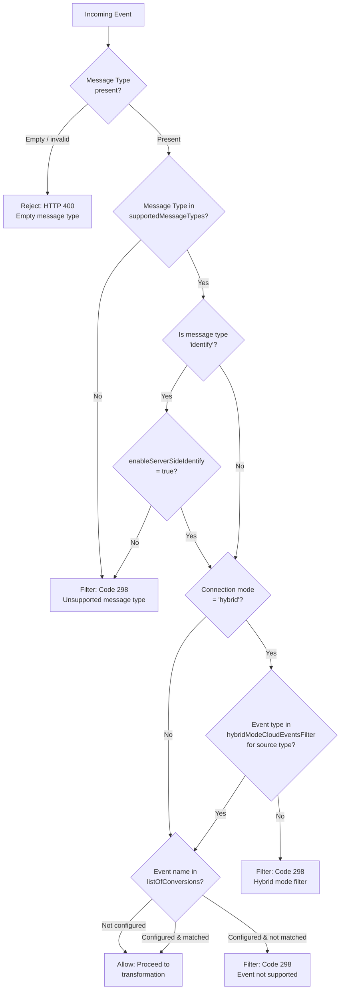
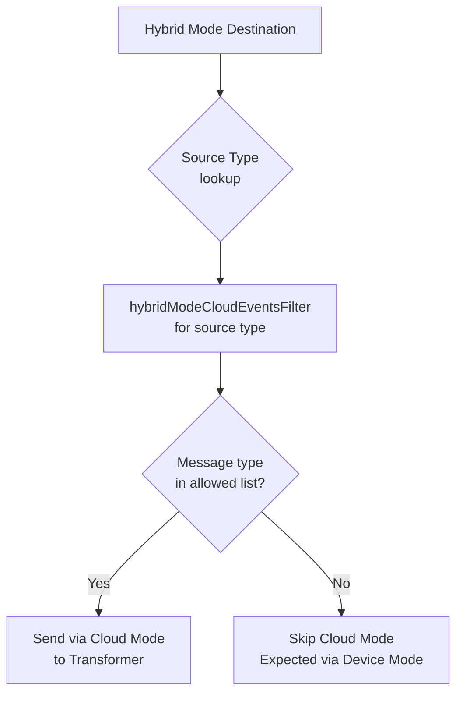
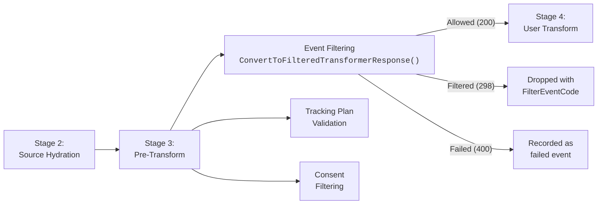

# Event Filtering and Drop Rules

RudderStack's event filtering framework controls which events reach destination transformations based on message type, event name, and connection mode. Event filtering is a pre-transformation step in the Processor pipeline that evaluates each event against destination-specific rules before it is sent to the external Transformer service for payload shaping.

The framework applies three filtering dimensions, evaluated in sequence:

1. **Message Type Filtering** — Determines whether the event's message type (e.g., `track`, `identify`, `page`) is supported by the destination. Unsupported types are dropped.
2. **Event Name Filtering** — For supported message types, determines whether the specific event name (e.g., `Order Completed`, `Credit Card Added`) is in the destination's allowed conversions list.
3. **Hybrid Mode Cloud Event Filtering** — For destinations operating in hybrid connection mode, determines which event types should be processed server-side (cloud mode) versus client-side (device mode).

Filtered events receive a `FilterEventCode` (HTTP status `298`) response and do not proceed to transformation. Invalid events with empty or malformed message types receive an HTTP `400` error response. Events that pass all filters continue to user transformation (Stage 4) and destination transformation (Stage 5) in the pipeline.

**Source:** `processor/eventfilter/eventfilter.go:1-295` (complete event filtering implementation)

**Prerequisites:**
- [Architecture: Pipeline Stages](../../architecture/pipeline-stages.md) — Understand the six-stage Processor pipeline and where event filtering occurs (Stage 3: Pre-Transform)

---

## Table of Contents

- [Event Filtering Decision Tree](#event-filtering-decision-tree)
- [Message Type Filtering](#message-type-filtering)
  - [Supported Message Types](#supported-message-types)
  - [Server-Side Identify Control](#server-side-identify-control)
- [Event Name Filtering](#event-name-filtering)
  - [Conversion Event List](#conversion-event-list)
  - [Type Conversion Utility](#type-conversion-utility)
- [Hybrid Mode Cloud Event Filtering](#hybrid-mode-cloud-event-filtering)
  - [Hybrid Mode Concept](#hybrid-mode-concept)
  - [Cloud Events Filter Logic](#cloud-events-filter-logic)
- [Main Filtering Entry Point](#main-filtering-entry-point)
- [Filter Response Codes](#filter-response-codes)
- [Configuration Reference](#configuration-reference)
- [Integration with Processing Pipeline](#integration-with-processing-pipeline)
- [Examples](#examples)
  - [Example 1: Destination Supporting Only Track and Page](#example-1-destination-supporting-only-track-and-page)
  - [Example 2: Server-Side Identify Disabled](#example-2-server-side-identify-disabled)
  - [Example 3: Hybrid Mode with Selective Cloud Events](#example-3-hybrid-mode-with-selective-cloud-events)
- [Related Documentation](#related-documentation)

---

## Event Filtering Decision Tree

The following diagram shows the complete event filtering logic executed by the `AllowEventToDestTransformation` function and the subsequent event name filtering applied in the Processor. Each decision node corresponds to a specific function or code block in `processor/eventfilter/eventfilter.go`.



**Decision point reference:**

| Decision | Function / Code | Source |
|----------|----------------|--------|
| Message type present? | `getMessageType()` extracts `type` field from event via `misc.MapLookup` | `processor/eventfilter/eventfilter.go:103-115` |
| Message type supported? | `slices.Contains(supportedMsgTypes, messageType)` check | `processor/eventfilter/eventfilter.go:138` |
| Identify disabled? | `identifyDisabled()` checks `enableServerSideIdentify` bool | `processor/eventfilter/eventfilter.go:46-53` |
| Connection mode hybrid? | `misc.MapLookup(destination.Config, "connectionMode")` comparison | `processor/eventfilter/eventfilter.go:216-227` |
| Cloud events filter match? | `FilterEventsForHybridMode()` checks `hybridModeCloudEventsFilter.[srcType].messageType` | `processor/eventfilter/eventfilter.go:205-269` |
| Event name match? | `slices.Contains(supportedEvents.values, messageEvent)` in Processor | `processor/processor.go:3555-3589` |

---

## Message Type Filtering

Message type filtering is the first and most fundamental filter. It determines whether the destination is capable of processing the event's message type (e.g., `track`, `identify`, `page`, `screen`, `group`, `alias`).

### Supported Message Types

The `GetSupportedMessageTypes` function reads the `supportedMessageTypes` array from the destination's definition configuration and returns the list of message types the destination can process. This list is defined per destination type (e.g., Google Analytics 4 may support `track`, `page`, and `group` but not `alias`).

**Source:** `processor/eventfilter/eventfilter.go:24-44`

The function performs the following steps:

1. Reads `destination.DestinationDefinition.Config["supportedMessageTypes"]` from the destination definition.
2. Converts the `[]interface{}` (JSON-decoded array) to `[]string` via `misc.ConvertInterfaceToStringArray`.
3. Iterates over each supported type and checks for special-case filtering (currently only `identify` has special handling).
4. Returns the filtered list and a boolean indicating whether the configuration was found.

If the `supportedMessageTypes` key is absent from the destination definition, the function returns `nil, false`, and message type filtering is skipped entirely — all message types are allowed through.

**Validation behavior within `AllowEventToDestTransformation`:**

| Condition | Result | Status Code |
|-----------|--------|-------------|
| Message type is empty or type assertion fails | Event rejected | `400` |
| Message type not in `supportedMessageTypes` list | Event filtered | `298` (`FilterEventCode`) |
| Message type is in list (and passes identify check) | Proceed to next filter | — |

**Source:** `processor/eventfilter/eventfilter.go:126-151`

### Server-Side Identify Control

The `identify` message type receives special handling through the `identifyDisabled` function. Even if `identify` is listed in `supportedMessageTypes`, it can be excluded at runtime based on the destination's instance-level configuration.

**Source:** `processor/eventfilter/eventfilter.go:46-53`

The function checks the `enableServerSideIdentify` boolean in the destination config (`destination.Config`):

- If `enableServerSideIdentify` is explicitly set to `false` → `identify` events are **removed** from the supported types list, and any incoming `identify` event is filtered with code `298`.
- If `enableServerSideIdentify` is `true` → `identify` events are allowed through normally.
- If `enableServerSideIdentify` is absent or not a boolean → `identify` events are **allowed** (the function returns `false` for "disabled", meaning identify is not disabled).

This mechanism allows operators to disable server-side identity resolution on a per-destination basis while keeping other event types active. It is useful when identity resolution is handled client-side or by a separate system.

---

## Event Name Filtering

Event name filtering provides fine-grained control beyond message type. While message type filtering determines whether a destination can process `track` events at all, event name filtering determines which *specific* track events (by event name) are accepted.

### Conversion Event List

The `GetSupportedMessageEvents` function reads the `listOfConversions` array from the destination's instance configuration and extracts the list of event names the destination is configured to process.

**Source:** `processor/eventfilter/eventfilter.go:57-85`

The `listOfConversions` configuration is structured as an array of objects, each containing a `conversions` string field:

```json
{
  "listOfConversions": [
    { "conversions": "Order Completed" },
    { "conversions": "Credit Card Added" },
    { "conversions": "Product Viewed" }
  ]
}
```

The function performs the following steps:

1. Reads `destination.Config["listOfConversions"]` from the destination config.
2. Iterates over each entry, extracting the `conversions` string from each `map[string]interface{}` element.
3. Validates that all entries were successfully parsed — if any entry fails type assertion, the function returns `nil, false` (indicating unreliable config, so filtering is skipped).
4. Returns the list of event names and a boolean indicating success.

When `GetSupportedMessageEvents` returns a valid list, the Processor checks whether the incoming event's `event` field matches any entry in the list. If the event name is not found, the event is filtered with status code `298` and the error message `"Event not supported"`.

**Source:** `processor/processor.go:3555-3589` (event name filtering in `ConvertToFilteredTransformerResponse`)

If `listOfConversions` is not configured for a destination, event name filtering is skipped and all event names are allowed.

### Type Conversion Utility

The `ConvertToArrayOfType[T]` generic function handles safe type conversion from `interface{}` values to typed slices. It is used internally by `FilterEventsForHybridMode` to convert configuration values read from JSON-decoded maps.

**Source:** `processor/eventfilter/eventfilter.go:278-294`

The function supports the `EventPropsTypes` type constraint, which currently includes `~string` (any type whose underlying type is `string`).

**Source:** `processor/eventfilter/eventfilter.go:271-273`

Behavior:

| Input Type | Output | Notes |
|-----------|--------|-------|
| `[]T` (e.g., `[]string`) | Returns the input directly | Native typed arrays pass through |
| `[]interface{}` with all elements of type `T` | Returns `[]T` with converted elements | Common case for JSON-decoded arrays |
| `[]interface{}` with mixed types | Returns empty `[]T{}` | Fails fast on first type assertion failure |
| Any other type | Returns empty `[]T{}` | Unsupported input type |

---

## Hybrid Mode Cloud Event Filtering

Hybrid mode cloud event filtering is the most granular filter layer. It applies only to destinations operating in hybrid connection mode and determines which event types should be processed server-side (cloud mode) versus expected to arrive client-side (device mode).

### Hybrid Mode Concept

RudderStack destinations can operate in three connection modes:

| Mode | Description | Server-Side Processing |
|------|-------------|----------------------|
| **cloud** | All events are sent server-side through the RudderStack pipeline | All events processed |
| **device** | All events are sent client-side directly from the SDK to the destination | No server-side processing |
| **hybrid** | Some events are sent server-side, others client-side | Only cloud-filtered events processed |

In hybrid mode, the destination SDK handles certain event types directly on the client (device mode), while other event types are routed through the RudderStack server pipeline (cloud mode). The `hybridModeCloudEventsFilter` configuration specifies, per source type, which message types should be forwarded server-side.



### Cloud Events Filter Logic

The `FilterEventsForHybridMode` function evaluates whether an event should be processed server-side based on the destination's connection mode and the hybrid mode cloud events filter configuration.

**Source:** `processor/eventfilter/eventfilter.go:205-269`

The function executes the following decision chain:

1. **Source type check** — If `srcType` is empty, return the default behavior (`IsProcessorEnabled && isSupportedMsgType`).
2. **Connection mode check** — Read `connectionMode` from `destination.Config`. If absent or not `"hybrid"`, return the default behavior.
3. **Filter configuration lookup** — Read `hybridModeCloudEventsFilter.[srcType]` from `destination.DestinationDefinition.Config`. If absent or empty, return the default behavior.
4. **Message type evaluation** — For the `messageType` event property, read the allowed message types array via `ConvertToArrayOfType[string]()` and check if the incoming event's message type is in the allowed list. The result is `AND`-ed with the default behavior.

The configuration structure within the destination definition is:

```json
{
  "hybridModeCloudEventsFilter": {
    "web": {
      "messageType": ["track", "page"]
    },
    "android": {
      "messageType": ["track", "identify", "screen"]
    }
  }
}
```

**Default behavior fallback:** When any lookup step fails (missing configuration, wrong types, empty values), the function falls back to `evaluatedDefaultBehaviour`, which is computed as `destination.IsProcessorEnabled && isSupportedMsgType`. This ensures that events are not incorrectly filtered when hybrid mode configuration is incomplete.

**Source:** `processor/eventfilter/eventfilter.go:209-214` (empty source type fallback), `processor/eventfilter/eventfilter.go:216-227` (connection mode check), `processor/eventfilter/eventfilter.go:229-241` (filter config lookup), `processor/eventfilter/eventfilter.go:245-266` (message type evaluation)

---

## Main Filtering Entry Point

The `AllowEventToDestTransformation` function is the primary entry point called by the Processor to determine if an event should proceed to destination transformation. It orchestrates the message type validation and hybrid mode filtering chain.

**Source:** `processor/eventfilter/eventfilter.go:126-178`

**Function signature:**

```go
func AllowEventToDestTransformation(
    transformerEvent *types.TransformerEvent,
    supportedMsgTypes []string,
) (bool, *types.TransformerResponse)
```

**Parameters:**

| Parameter | Type | Description |
|-----------|------|-------------|
| `transformerEvent` | `*types.TransformerEvent` | The event to evaluate, containing the message payload, destination config, and metadata |
| `supportedMsgTypes` | `[]string` | Pre-computed list of supported message types from `GetSupportedMessageTypes` |

**Return values:**

| Value | Type | Description |
|-------|------|-------------|
| `allow` | `bool` | `true` if the event should proceed to transformation, `false` if filtered |
| `response` | `*types.TransformerResponse` | Non-nil when `allow` is `false` — contains the filter status code and error message. `nil` when event is allowed. |

**Execution sequence:**

1. Extract the message type from the event via `getMessageType()`, which reads the `type` field from the event payload.
2. Trim whitespace and convert to lowercase for case-insensitive matching.
3. If message type is empty → return `false` with HTTP `400` and error `"Invalid message type. Type assertion failed"`.
4. Check if message type is in `supportedMsgTypes` via `slices.Contains`.
5. If not supported → return `false` with `FilterEventCode` (`298`) and error `"Message type not supported"`.
6. Call `FilterEventsForHybridMode` with the destination config, source definition type, message type, and default behavior.
7. If hybrid mode filter rejects → return `false` with `FilterEventCode` (`298`) and error `"Filtering event based on hybridModeFilter"`.
8. If all checks pass → return `true` with `nil` response.

The Processor calls this function within `ConvertToFilteredTransformerResponse` (at `processor/processor.go:3543`), which iterates over all events destined for a specific destination and applies the filter to each event individually.

---

## Filter Response Codes

The event filtering framework uses the following HTTP-style status codes to communicate filter decisions back to the Processor:

| Code | Constant | Meaning | Action |
|------|----------|---------|--------|
| `200` | — | Event allowed | Proceed to user transformation (Stage 4) |
| `298` | `FilterEventCode` | Event filtered | Event dropped; recorded in reporting metrics as filtered |
| `400` | — | Invalid event | Event dropped; recorded in reporting metrics as failed |

**Source:** `utils/types/types.go:13` (`FilterEventCode = 298`)

The `FilterEventCode` constant (`298`) is a custom status code defined in the `utils/types` package. It is distinct from standard HTTP status codes and is used exclusively within the internal pipeline to signal that an event was intentionally filtered (not an error condition). Filtered events:

- Do **not** proceed to the external Transformer service, saving transformation compute resources.
- Are recorded in reporting metrics under the `EVENT_FILTER` processing unit (PU) with a "filtered" classification.
- Are included in `nonSuccessMetrics.filteredJobs` for downstream accounting.
- Are **not** retried — filtering is a terminal state for the event-destination pair.

**Source:** `processor/processor.go:81` (`EventFilter = "EVENT_FILTER"` constant), `processor/processor.go:3248-3254` (event filter stat recording)

Other related status codes in the pipeline:

| Code | Constant | Purpose |
|------|----------|---------|
| `299` | `SuppressEventCode` | User suppression (enterprise feature) |
| `410` | `DrainEventCode` | Cancelled job run drain |

**Source:** `utils/types/types.go:13-16`

---

## Configuration Reference

The following configuration parameters control event filtering behavior. These parameters are managed through the RudderStack Control Plane and delivered to the Processor via the backend-config service. They are **not** typically set in local `config.yaml` files.

| Parameter | Location | Type | Description |
|-----------|----------|------|-------------|
| `supportedMessageTypes` | Destination Definition Config | `string[]` | List of message types the destination accepts (e.g., `["track", "identify", "page", "screen", "group", "alias"]`). Defined per destination type in the destination definition. |
| `enableServerSideIdentify` | Destination Instance Config | `bool` | Controls whether `identify` events are processed server-side. When `false`, `identify` events are filtered out even if listed in `supportedMessageTypes`. Default: `true` (identify allowed) when the key is absent. |
| `listOfConversions` | Destination Instance Config | `object[]` | List of specific event names/conversions the destination is configured to process. Each entry has a `conversions` string field. When configured, only events with matching names are allowed. |
| `connectionMode` | Destination Instance Config | `string` | Connection mode for the destination: `"cloud"`, `"device"`, or `"hybrid"`. Hybrid mode activates the cloud events filter. |
| `hybridModeCloudEventsFilter` | Destination Definition Config | `object` | Per-source-type filter specifying which message types to process in cloud mode when the destination connection mode is `"hybrid"`. Keyed by source type (e.g., `"web"`, `"android"`), each containing a `messageType` array. |

**Configuration hierarchy:**

- **Destination Definition Config** (`destination.DestinationDefinition.Config`) — Set globally per destination type. Defines the *capabilities* of the destination (which message types it supports, which source types have hybrid mode filters). These are managed by RudderStack and not typically modified by users.
- **Destination Instance Config** (`destination.Config`) — Set per destination instance by the user through the Control Plane. Defines the *user's choices* for that specific destination (whether to enable server-side identify, which events to process, which connection mode to use).

**Source:** `processor/eventfilter/eventfilter.go:26` (supportedMessageTypes lookup), `processor/eventfilter/eventfilter.go:47` (enableServerSideIdentify lookup), `processor/eventfilter/eventfilter.go:66` (listOfConversions lookup), `processor/eventfilter/eventfilter.go:216` (connectionMode lookup), `processor/eventfilter/eventfilter.go:229` (hybridModeCloudEventsFilter lookup)

---

## Integration with Processing Pipeline

Event filtering occurs during the **Pre-Transform stage** (Stage 3) of the six-stage Processor pipeline, after source hydration (Stage 2) and before user transformation (Stage 4). The filter determines whether each event should be sent for destination transformation or dropped before reaching the external Transformer service.



**Key integration points:**

1. **Invocation context** — Event filtering is called within `ConvertToFilteredTransformerResponse` at `processor/processor.go:3501`. This function is called once per destination per event batch, evaluating every event in the batch against that destination's filter configuration.

2. **Caching** — The Processor caches `supportedMessageTypes` and `supportedMessageEvents` per destination ID within each batch to avoid redundant configuration lookups:
   ```go
   supportedMessageTypesCache := make(map[string]*cacheValue)
   supportedMessageEventsCache := make(map[string]*cacheValue)
   ```
   **Source:** `processor/processor.go:3514-3515`

3. **Filter ordering** — Within `ConvertToFilteredTransformerResponse`, the following checks are applied in order:
   - Drain check (cancelled job run IDs)
   - Message type filtering via `eventfilter.AllowEventToDestTransformation`
   - Event name filtering via `eventfilter.GetSupportedMessageEvents` + `slices.Contains`

4. **Metrics and reporting** — Filtered events are tracked under the `EVENT_FILTER` processing unit:
   - `numEvents` — Total events entering the filter
   - `numOutputSuccessEvents` — Events that passed the filter
   - `numOutputFailedEvents` — Events that failed (HTTP 400)
   - `numOutputFilteredEvents` — Events that were filtered (HTTP 298)

   **Source:** `processor/processor.go:3248-3254` (event filter stat recording)

5. **Distinction from other Pre-Transform filters** — Event filtering, tracking plan validation, and consent filtering all occur in Stage 3 but serve different purposes:

   | Filter | Purpose | Scope | Blocks Events? |
   |--------|---------|-------|----------------|
   | **Event Filtering** | Message type / event name / hybrid mode matching | Per event–destination pair | Yes — filtered events are dropped |
   | **Tracking Plan Validation** | Schema compliance checking | Per event–source pair | No — violations are annotated, events continue |
   | **Consent Filtering** | User consent preference enforcement | Per event–destination pair | Yes — non-consented destinations are excluded |

---

## Examples

### Example 1: Destination Supporting Only Track and Page

A destination is configured to support only `track` and `page` message types. All other event types (`identify`, `screen`, `group`, `alias`) will be filtered out with code `298`.

**Destination definition config:**
```json
{
  "supportedMessageTypes": ["track", "page"]
}
```

**Behavior:**

| Incoming Event Type | Result | Status Code | Reason |
|---------------------|--------|-------------|--------|
| `track` | Allowed | `200` | Message type is in supported list |
| `page` | Allowed | `200` | Message type is in supported list |
| `identify` | Filtered | `298` | `"Message type not supported"` |
| `screen` | Filtered | `298` | `"Message type not supported"` |
| `group` | Filtered | `298` | `"Message type not supported"` |
| `alias` | Filtered | `298` | `"Message type not supported"` |

### Example 2: Server-Side Identify Disabled

A destination lists `identify` in its supported message types, but the user has disabled server-side identify processing in the destination instance config. Identify events will be filtered even though the destination type supports them.

**Destination definition config:**
```json
{
  "supportedMessageTypes": ["track", "identify", "page"]
}
```

**Destination instance config:**
```json
{
  "enableServerSideIdentify": false
}
```

**Behavior:**

| Incoming Event Type | Result | Status Code | Reason |
|---------------------|--------|-------------|--------|
| `track` | Allowed | `200` | Message type is supported |
| `page` | Allowed | `200` | Message type is supported |
| `identify` | Filtered | `298` | `"Message type not supported"` — identify removed from supported list by `identifyDisabled()` |

When `GetSupportedMessageTypes` is called, it iterates over `["track", "identify", "page"]` and checks `identifyDisabled()` for the `identify` entry. Since `enableServerSideIdentify` is `false`, `identify` is skipped, and the returned supported types are `["track", "page"]`. The subsequent `AllowEventToDestTransformation` call then rejects `identify` events as unsupported.

### Example 3: Hybrid Mode with Selective Cloud Events

A destination operates in hybrid mode for web sources. Only `track` events from web sources should be processed server-side; `page` and `group` events are expected to arrive via the client-side device mode SDK.

**Destination definition config:**
```json
{
  "supportedMessageTypes": ["track", "page", "group"],
  "hybridModeCloudEventsFilter": {
    "web": {
      "messageType": ["track"]
    }
  }
}
```

**Destination instance config:**
```json
{
  "connectionMode": "hybrid"
}
```

**Behavior for web source type:**

| Incoming Event Type | Result | Status Code | Reason |
|---------------------|--------|-------------|--------|
| `track` | Allowed | `200` | In `supportedMessageTypes` AND in `hybridModeCloudEventsFilter.web.messageType` |
| `page` | Filtered | `298` | In `supportedMessageTypes` but NOT in hybrid cloud filter — `"Filtering event based on hybridModeFilter"` |
| `group` | Filtered | `298` | In `supportedMessageTypes` but NOT in hybrid cloud filter — `"Filtering event based on hybridModeFilter"` |
| `identify` | Filtered | `298` | Not in `supportedMessageTypes` — `"Message type not supported"` |

For a non-web source type (e.g., `android`) that does not have a `hybridModeCloudEventsFilter` entry, the filter falls back to the default behavior (`IsProcessorEnabled && isSupportedMsgType`), which allows all supported message types through when the processor is enabled.

---

## Related Documentation

- [Tracking Plans](./tracking-plans.md) — Tracking plan configuration and schema enforcement in the Pre-Transform stage
- [Consent Management](./consent-management.md) — Consent-based destination filtering in the Pre-Transform stage
- [Protocols Enforcement](./protocols-enforcement.md) — Full schema validation pipeline combining tracking plans and consent
- [Architecture: Pipeline Stages](../../architecture/pipeline-stages.md) — Six-stage Processor pipeline architecture with channel orchestration diagrams
- [Destination Catalog](../destinations/index.md) — Destination catalog with supported message types per destination
- [Configuration Reference](../../reference/config-reference.md) — Complete configuration parameter reference including Processor settings
- [Glossary](../../reference/glossary.md) — Unified terminology for RudderStack and Segment concepts
