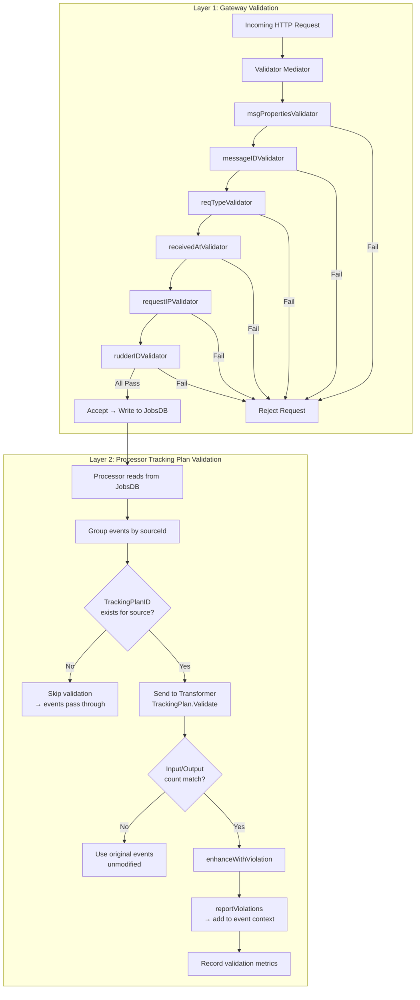
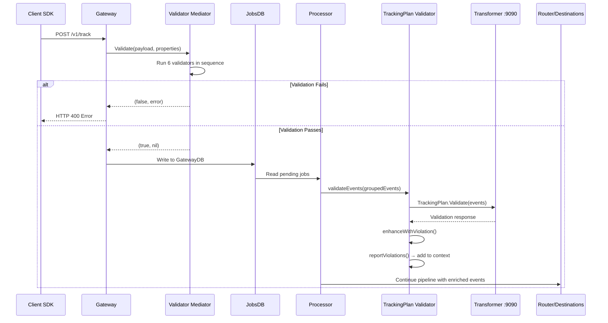

# Schema Validation and Protocols Enforcement

RudderStack implements a **two-layer validation architecture** that ensures data quality at both the structural and semantic levels:

1. **Layer 1 — Gateway Payload Validation:** Structural checks on every incoming HTTP request, enforced by a six-validator Mediator chain that verifies required fields (`messageId`, `type`, `receivedAt`, `request_ip`, `rudderId`) and stream properties before events are accepted into the pipeline.

2. **Layer 2 — Processor Tracking Plan Validation:** Semantic event schema enforcement during the Processor's Pre-Transform stage, delegating JSON Schema validation to the external Transformer service (port 9090) and annotating violation metadata into the event's `context` object.

Together, these layers form the **Protocols enforcement pipeline** — Gateway validation guarantees that only structurally valid payloads enter the system, while tracking plan validation ensures that events conform to the defined schemas for each source.

**How this compares to Segment Protocols:** Segment Protocols is a premium Business Tier add-on that provides a comprehensive data governance suite including anomaly detection, configurable enforcement modes (block, allow, sample), the ability to forward blocked events to alternative destinations, and a dedicated violation management UI. RudderStack's current implementation provides basic structural validation at the Gateway layer and annotation-based semantic validation at the Processor layer — events are never blocked by default, and violation information is embedded in the event context for downstream consumption. For a detailed gap analysis, see the [Protocols Parity Report](../../gap-report/protocols-parity.md).

**Prerequisites:**
- [Architecture: Pipeline Stages](../../architecture/pipeline-stages.md) — Understand the six-stage Processor pipeline and where tracking plan validation occurs (Stage 3: Pre-Transform)
- [Tracking Plans Guide](./tracking-plans.md) — Tracking plan configuration, assignment, and lifecycle

---

## Table of Contents

- [Enforcement Pipeline Architecture](#enforcement-pipeline-architecture)
- [Layer 1: Gateway Payload Validation](#layer-1-gateway-payload-validation)
  - [Validator Chain](#validator-chain)
  - [Validation Behavior](#validation-behavior)
- [Layer 2: Processor Tracking Plan Validation](#layer-2-processor-tracking-plan-validation)
  - [Validation Flow](#validation-flow)
  - [Violation Reporting](#violation-reporting)
  - [Validation Metrics](#validation-metrics)
- [Configuration Reference](#configuration-reference)
- [Comparison with Segment Protocols](#comparison-with-segment-protocols)
- [Enforcement Pipeline Sequence](#enforcement-pipeline-sequence)
- [Best Practices](#best-practices)
- [Troubleshooting](#troubleshooting)
- [Related Documentation](#related-documentation)

---

## Enforcement Pipeline Architecture

The following diagram illustrates both validation layers and how they work together in the event processing pipeline. Layer 1 (Gateway) acts as a structural gatekeeper, while Layer 2 (Processor) applies semantic schema validation against configured tracking plans.



**Key distinction:** Gateway validation is **structural** — it answers "does the payload contain the required fields to be a valid event?" Processor validation is **semantic** — it answers "does the event conform to the tracking plan schema defined for this source?"

Source: `gateway/validator/validator.go:22-34` (Mediator creation with 6 validators), `processor/trackingplan.go:69-142` (`validateEvents` function)

---

## Layer 1: Gateway Payload Validation

The Gateway employs the **Mediator pattern** to orchestrate payload validation. The `Mediator` struct holds an ordered slice of validators that are executed sequentially with **short-circuit behavior** — the first validator to fail stops the chain, and the request is rejected immediately without running subsequent validators.

The Mediator is constructed by `NewValidateMediator()`, which accepts a `logger.Logger` instance and a custom validation function for stream `MessageProperties`. It initializes six validators in a fixed execution order.

Source: `gateway/validator/validator.go:15-34`

### Validator Chain

Each validator implements the `payloadValidator` interface, which defines two methods:

```go
type payloadValidator interface {
    Validate(payload []byte, properties *stream.MessageProperties) (bool, error)
    ValidatorName() string
}
```

The six validators execute in the following order:

| Order | Validator | Field Checked | Validation Rule | Source |
|-------|-----------|---------------|-----------------|--------|
| 1 | `msgPropertiesValidator` | Stream `MessageProperties` | Executes a custom validation function passed at Mediator construction time. The function signature is `func(*stream.MessageProperties) error`. | `gateway/validator/msg_properties_validator.go:7-26` |
| 2 | `messageIDValidator` | `messageId` | Must be a non-empty string: `gjson.GetBytes(payload, "messageId").String() != ""` | `gateway/validator/msg_id_validator.go:9-21` |
| 3 | `reqTypeValidator` | `type` | Must exist in the payload (`gjson.GetBytes(payload, "type").Exists()`), **unless** the request type is in the allow-list: `"batch"`, `"replay"`, `"retl"`, `"import"`. Requests with these types bypass the payload `type` field check entirely. | `gateway/validator/req_type_validator.go:9-29` |
| 4 | `receivedAtValidator` | `receivedAt` | Must exist in the payload: `gjson.GetBytes(payload, "receivedAt").Exists()` | `gateway/validator/received_at_validator.go:9-21` |
| 5 | `requestIPValidator` | `request_ip` | Must exist in the payload: `gjson.GetBytes(payload, "request_ip").Exists()` | `gateway/validator/request_ip_validator.go:9-21` |
| 6 | `rudderIDValidator` | `rudderId` | Must exist in the payload: `gjson.GetBytes(payload, "rudderId").Exists()` | `gateway/validator/rudder_id_validator.go:9-21` |

**Implementation notes:**

- All field-checking validators (orders 2–6) use the [`gjson`](https://github.com/tidwall/gjson) library for efficient byte-level JSON field extraction without deserializing the full payload. This avoids the overhead of `json.Unmarshal` on high-throughput ingestion paths.

- The `reqTypeValidator` (order 3) includes a special allow-list mechanism. When the request type from `properties.RequestType` is `"batch"`, `"replay"`, `"retl"`, or `"import"`, the validator returns `true` without checking the payload's `type` field. This permits batch and internal request types that may not include per-event `type` fields in the outer payload structure.

- The `msgPropertiesValidator` (order 1) is unique in that it does not inspect the JSON payload bytes. Instead, it calls a custom validation function against the stream `MessageProperties` struct, enabling Gateway-specific business logic (e.g., write key validation, source status checks) to be injected at construction time.

Source: `gateway/validator/validator.go:9-13` (`payloadValidator` interface definition)

### Validation Behavior

Gateway validation operates with the following characteristics:

- **Synchronous execution:** Validation runs inline in the HTTP request handler path. Every incoming request must pass all six validators before the event is written to the Gateway JobsDB. There is no asynchronous or deferred validation at this layer.

- **Short-circuit on failure:** When any validator returns `(false, err)` or `(false, nil)`, the Mediator immediately stops the chain and returns the failure result. The remaining validators are not executed.

- **Structured error logging:** On any validation failure, the Mediator logs a structured error message using `obskit.Error` labels, including the validator name (`validator.ValidatorName()`) and stream properties fields (via `properties.LoggerFields()`). This enables operators to identify which validator rejected a request and correlate failures with specific sources or clients.

- **Extensibility:** The `payloadValidator` interface enables extending the validator chain. New validators can be added to the Mediator's `validators` slice to enforce additional structural constraints without modifying existing validators. The interface's two-method contract (`Validate` + `ValidatorName`) ensures consistent logging and error handling for any new validator.

- **Request-level scope:** Gateway validation operates on the entire request payload, not on individual events within a batch. For batch requests (`/v1/batch`), the outer payload structure is validated, and the `reqTypeValidator` bypasses the individual event `type` check.

Source: `gateway/validator/validator.go:37-51` (`Validate` method with short-circuit and logging)

---

## Layer 2: Processor Tracking Plan Validation

After events pass Gateway validation and are written to the Gateway JobsDB, the Processor reads them during the **Pre-Transform stage** (Stage 3 of the [six-stage pipeline](../../architecture/pipeline-stages.md)) and applies semantic schema validation against configured tracking plans. This validation is delegated to the external **Transformer service** (default port 9090), which performs the actual JSON Schema evaluation.

Source: `processor/trackingplan.go:66-69`

### Validation Flow

Layer 2 validation is implemented by the `validateEvents()` function in the Processor. At a high level, events are grouped by `sourceID`, checked for a configured `TrackingPlanID`, sent to the Transformer service for JSON Schema validation, and annotated with violation metadata before continuing through the pipeline. A fail-open safety mechanism ensures events are never lost even if the Transformer service returns unexpected results.

The complete eight-step validation workflow — including event grouping, Transformer service integration, safety checks, violation enhancement via `enhanceWithViolation()`, propagation control via `propagateValidationErrors`, and metrics emission — is documented in detail in the [Tracking Plans Guide — Validation Process](./tracking-plans.md#validation-process).

Source: `processor/trackingplan.go:69-142` (`validateEvents` function)

### Violation Reporting

When validation detects violations, the `reportViolations()` function injects `trackingPlanId`, `trackingPlanVersion`, and `violationErrors` into the event's `context` object. Propagation can be suppressed by setting `propagateValidationErrors` to `"false"` in the tracking plan's `MergedTpConfig`. Violation metadata flows through all remaining pipeline stages and is available to downstream destinations for data quality analytics.

For the complete violation enhancement process, context field reference, propagation control truth table, and context handling details, see the [Tracking Plans Guide — Violation Handling](./tracking-plans.md#violation-handling).

Source: `processor/trackingplan.go:26-49` (`reportViolations` function), `processor/trackingplan.go:54-64` (`enhanceWithViolation` function)

### Validation Metrics

The Processor emits five counters and timers per validation batch via the `TrackingPlanStatT` struct: `proc_num_tp_input_events`, `proc_num_tp_output_success_events`, `proc_num_tp_output_failed_events`, `proc_num_tp_output_filtered_events`, and `proc_tp_validation` (timer). All metrics are tagged with `destination`, `destType`, `source`, `workspaceId`, `trackingPlanId`, and `trackingPlanVersion` for fine-grained monitoring. Validation results are also reported to the `TRACKINGPLAN_VALIDATOR` processing unit in the enterprise reporting service.

For the complete metric definitions, tag reference, and monitoring recommendations, see the [Tracking Plans Guide — Statistics and Monitoring](./tracking-plans.md#statistics-and-monitoring).

Source: `processor/trackingplan.go:16-22` (`TrackingPlanStatT` struct), `processor/trackingplan.go:145-168` (`newValidationStat` function)

---

## Configuration Reference

Tracking plan validation is configured through the **Control Plane / backend-config system**, not through local configuration files. The following parameters control validation behavior:

| Parameter | Default | Type | Range | Description |
|-----------|---------|------|-------|-------------|
| `trackingPlanId` | `""` (none) | string | Any non-empty string | Tracking plan identifier assigned per source write key (via Source Config / event metadata). When empty, validation is skipped entirely for this source. |
| `trackingPlanVersion` | `0` (none) | integer | ≥ 0 | Version number of the tracking plan being enforced (via Source Config / event metadata). Included in violation annotations and metric tags for audit and debugging. |
| `MergedTpConfig` | `{}` | object | Valid JSON object | Merged tracking plan configuration object (via Source Config / event metadata) containing validation settings. |
| `propagateValidationErrors` | `""` (enabled) | string | `"false"` to suppress; any other value to enable | Controls whether violation errors are injected into the event context (key within `MergedTpConfig`). Set to `"false"` to suppress violation errors from the event payload. Any other value (including empty/absent) enables propagation. |

> **Note:** Tracking plan configuration is managed through the Control Plane and delivered to the RudderStack server via the backend-config subscription. The Processor polls backend-config at regular intervals (default: every 5 seconds) and reads tracking plan metadata from each event's metadata at runtime. There are no local `config.yaml` parameters for tracking plan assignment. For the complete parameter reference with detailed behavioral documentation, see the [Tracking Plans Guide — Configuration](./tracking-plans.md#configuration).

Source: `processor/trackingplan.go:27-29` (`propagateValidationErrors` check), `processor/trackingplan.go:80-81` (`trackingPlanID` and `trackingPlanVersion` extraction)

---

## Comparison with Segment Protocols

The following table compares RudderStack's current Protocols enforcement capabilities against Segment Protocols. Segment Protocols is a premium Business Tier add-on; RudderStack's validation is included in the open-source core.

| Feature | Segment Protocols | RudderStack | Gap Status |
|---------|------------------|-------------|------------|
| Schema validation | Full JSON Schema–based validation (draft-07) with required properties, regex patterns, nested objects | Via external Transformer service — depends on Transformer implementation for JSON Schema support | Partial |
| Anomaly detection | Automatic detection of unexpected events and properties not defined in the tracking plan | Not available | Gap |
| Enforcement modes | Block Event, Omit Properties, Allow — configurable per-source per-call-type (Track, Identify, Group) | Fail-open only — violations are reported via event context annotations, events always continue through the pipeline | Gap |
| Forward blocked events | Route blocked events to an alternative source/destination to avoid permanent data loss | Not available — no blocking capability exists | Gap |
| Violation reporting | Dedicated UI dashboard with violation summaries, per-source per-event drill-down, sample payloads; `Violation Generated` track events forwarded to analytics | Violation errors embedded in event `context` only (`violationErrors`, `trackingPlanId`, `trackingPlanVersion`); no dedicated UI | Partial |
| Tracking plan versioning | Full version history with changelog, comparison, and audit trail | Version tracked in metric tags and event context (`trackingPlanVersion`) but no history management or UI | Partial |
| Schema inference | Import events from last 24 hours, 7 days, or 30 days to automatically bootstrap tracking plans | Not available | Gap |
| Standard vs Advanced controls | Two-layer blocking: Standard Schema Controls (block/omit unplanned events/properties) then Advanced Blocking Controls (Common JSON Schema violations) | Single validation layer via Transformer with annotation-only output | Partial |
| Gateway-level structural validation | Not applicable — handled within the Protocols engine | 6-validator Mediator chain enforcing structural payload requirements before events enter the pipeline | RudderStack unique |
| Tracking plan management API | Full REST API for tracking plan CRUD operations, CSV import/export (up to 100,000 rows) | Config-based via backend-config; no dedicated API | Gap |
| Violation alerting | Email and Slack notifications for violations; `analytics.track()` calls for programmatic alerting | Not available — monitoring only via emitted stats metrics | Gap |
| Consent Preference Updated event | Auto-generated and added to all tracking plans for Consent Management users | Not available — consent and tracking plans are independent systems | Gap |

> **For detailed gap analysis:** See [Protocols Parity Report](../../gap-report/protocols-parity.md) for a comprehensive feature-by-feature comparison with remediation recommendations and gap severity ratings.

> **Pricing context:** Segment Protocols is a premium add-on available only to Business Tier customers. RudderStack's Gateway validation (Layer 1) and tracking plan validation (Layer 2) are both included in the open-source core at no additional cost.

Source: `refs/segment-docs/src/protocols/index.md` (Protocols overview and pricing), `refs/segment-docs/src/protocols/enforce/schema-configuration.md` (enforcement modes and blocking controls), `refs/segment-docs/src/protocols/enforce/forward-blocked-events.md` (blocked event forwarding), `refs/segment-docs/src/protocols/validate/forward-violations.md` (violation forwarding as track events), `refs/segment-docs/src/protocols/validate/review-violations.md` (violation review UI)

---

## Enforcement Pipeline Sequence

The following sequence diagram shows the complete end-to-end enforcement flow, from SDK event submission through Gateway validation, Processor tracking plan validation, and delivery to downstream destinations.



**Flow description:**

1. A client SDK submits an event (e.g., `POST /v1/track`) to the Gateway on port 8080.
2. The Gateway passes the payload and stream properties to the Validator Mediator.
3. The Mediator runs all 6 validators in sequence. If any validator fails, the Gateway returns an HTTP error response to the SDK immediately — the event never enters the pipeline.
4. If all validators pass, the Gateway writes the event to the Gateway JobsDB.
5. The Processor reads pending jobs from the Gateway JobsDB during its processing cycle.
6. The Processor's `validateEvents()` function groups events by sourceId and checks for configured tracking plans.
7. For sources with tracking plans, events are sent to the Transformer service (port 9090) for JSON Schema validation.
8. The Transformer returns a validation response classifying each event as success, failed, or filtered.
9. `enhanceWithViolation()` and `reportViolations()` inject violation metadata into the event context.
10. Events continue through the pipeline (User Transform → Destination Transform → Store → Router) with violation annotations available to all downstream destinations.

---

## Best Practices

The following recommendations help maximize the effectiveness of the two-layer validation architecture:

1. **Always configure tracking plans per-source to enable semantic validation.** Without a `TrackingPlanID` assigned to a source, Layer 2 validation is completely bypassed. Assign tracking plans to all production sources through the Control Plane to ensure schema governance is active.

2. **Use `propagateValidationErrors` strategically.** Set `propagateValidationErrors` to `"true"` (or leave it unset) during development and testing to surface violation details in event payloads for debugging. Consider setting it to `"false"` in production environments where violation metadata in event payloads is not desired by downstream destinations — validation statistics are still collected regardless of this setting.

3. **Monitor `numValidationFailedEvents` to detect schema drift.** Set up alerts on the `proc_num_tp_output_failed_events` metric to detect when events are violating tracking plan schemas. A sudden increase in failed validations often indicates a source SDK update that introduced schema changes not reflected in the tracking plan.

4. **Understand the two layers serve different purposes.** Gateway validators (Layer 1) provide baseline structural integrity — they ensure every event has the minimum required fields to be processed. Tracking plans (Layer 2) provide schema-level governance — they enforce business rules about which events, properties, and types are expected. Both layers are complementary and should both be active in production.

5. **Verify Transformer service health.** Layer 2 validation depends entirely on the external Transformer service. If the Transformer is down or unreachable, the safety check (input/output count mismatch) causes all events to pass through unvalidated. Monitor Transformer service health alongside validation metrics.

6. **Use validation metrics for data quality dashboards.** Combine `proc_num_tp_input_events`, `proc_num_tp_output_success_events`, `proc_num_tp_output_failed_events`, and `proc_num_tp_output_filtered_events` metrics with their `trackingPlanId` and `source` tags to build per-source data quality dashboards in your monitoring system (e.g., Grafana with Prometheus).

---

## Troubleshooting

### Events passing through without any validation

**Symptom:** Events are delivered to destinations without any violation metadata in the context, and no validation metrics are being emitted.

**Root cause:** No `TrackingPlanID` is configured for the source.

**Resolution:** Verify that a tracking plan is assigned to the source in the Control Plane. Check the backend-config payload for the source's write key — the `TrackingPlanID` field should contain a non-empty value. If the field is empty, assign a tracking plan through the Control Plane UI.

### Validation always succeeding (no violations detected)

**Symptom:** `numValidationFailedEvents` is always zero, even for events that should violate the tracking plan.

**Root cause:** The Transformer service may not be running, may be unreachable, or the tracking plan definition in the Transformer may not contain the expected schema rules.

**Resolution:**
1. Verify the Transformer service is running and reachable on port 9090: `curl -s http://localhost:9090/health`
2. Check Transformer logs for validation errors or configuration issues
3. Verify the tracking plan definition contains the expected event schemas and property rules

### Input/output count mismatch warnings in logs

**Symptom:** Processor logs contain warnings about input/output count mismatches, and events are passing through with their original payloads unmodified.

**Root cause:** The Transformer service returned a different number of events than were submitted for validation. This triggers the fail-open safety mechanism.

**Resolution:**
1. Check the Transformer service version — version mismatches between the Processor and Transformer can cause count discrepancies
2. Review Transformer service logs for errors during validation processing
3. Verify that the Transformer is not timing out on large event batches
4. The fail-open behavior is by design — events are never lost due to validation failures, but they may lack violation annotations

### Violation errors not appearing in event context

**Symptom:** Validation metrics show failed events, but the `violationErrors` field is not present in the event's context when it reaches destinations.

**Root cause:** The `propagateValidationErrors` setting is set to `"false"` in the tracking plan's `MergedTpConfig`.

**Resolution:** Check the tracking plan configuration in the Control Plane. If violation errors should be visible to downstream destinations, ensure `propagateValidationErrors` is not set to `"false"`. Note that metrics are still collected regardless of this setting — only the event context annotation is affected.

### Gateway rejecting valid events

**Symptom:** Events that appear structurally valid are being rejected by the Gateway with validation errors.

**Resolution:**
1. Check which validator is failing by examining the structured log output — the `validator` field in the log entry identifies the specific validator
2. Verify the payload contains all required fields: `messageId` (non-empty string), `type` (unless request type is batch/replay/retl/import), `receivedAt`, `request_ip`, `rudderId`
3. For batch requests, verify that the outer payload structure is correct — individual events within a batch may not need the `type` field at the outer level

---

## Related Documentation

- [Tracking Plans Guide](./tracking-plans.md) — Tracking plan configuration, assignment, and lifecycle management
- [Consent Management](./consent-management.md) — Consent-based destination filtering with OneTrust, Ketch, and Generic CMP providers
- [Event Filtering](./event-filtering.md) — Event drop and filter rules configuration
- [Architecture: Pipeline Stages](../../architecture/pipeline-stages.md) — Six-stage Processor pipeline detail, including the Pre-Transform stage where tracking plan validation occurs
- [API Reference](../../api-reference/index.md) — Gateway API endpoints and authentication schemes
- [Protocols Parity Report](../../gap-report/protocols-parity.md) — Detailed Segment Protocols gap analysis with feature comparison matrix and remediation recommendations
