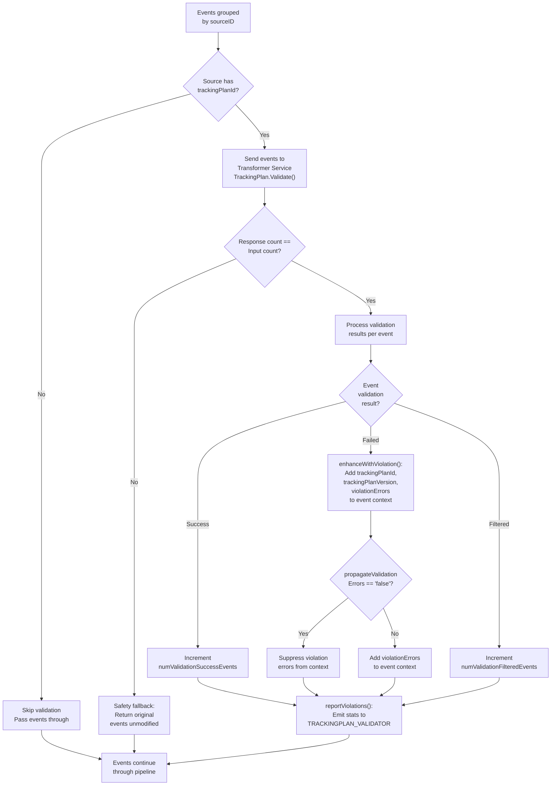

# Tracking Plans

Tracking plans define the expected schema for events flowing through your RudderStack data pipeline. By specifying which events, properties, and data types are permitted, tracking plans enable data governance teams to detect schema violations early and maintain data quality across all connected sources and destinations.

RudderStack validates events against tracking plans during the **Processor stage** of the [six-stage pipeline](../../architecture/pipeline-stages.md), delegating the actual JSON Schema validation to the external **Transformer service**. When events violate tracking plan rules, violation metadata is annotated into the event's `context` object and reported to the monitoring service — events continue through the pipeline by default and are **not blocked**.

Key characteristics of RudderStack's tracking plan implementation:

- **Per-source assignment** — Each source can have at most one active tracking plan, configured via the Control Plane and delivered through backend-config.
- **External validation** — The Transformer service (default port 9090) performs JSON Schema validation; the Processor orchestrates the workflow.
- **Annotation-first approach** — Violations are embedded in event context (`violationErrors`, `trackingPlanId`, `trackingPlanVersion`) rather than blocking delivery.
- **Configurable propagation** — The `propagateValidationErrors` flag controls whether violation details appear in event context.
- **Comprehensive metrics** — Validation statistics are emitted per source, destination, workspace, and tracking plan for monitoring and alerting.

**Prerequisites:**
- [Architecture: Pipeline Stages](../../architecture/pipeline-stages.md) — Understand the six-stage Processor pipeline and where tracking plan validation occurs (Stage 3: Pre-Transform)
- [API Reference](../../api-reference/index.md) — API overview and authentication schemes

---

## Table of Contents

- [Tracking Plan Validation Architecture](#tracking-plan-validation-architecture)
- [Configuration](#configuration)
- [Validation Process](#validation-process)
- [Violation Handling](#violation-handling)
- [Statistics and Monitoring](#statistics-and-monitoring)
- [Comparison with Segment Protocols](#comparison-with-segment-protocols)
- [Best Practices](#best-practices)
- [Troubleshooting](#troubleshooting)
- [Related Documentation](#related-documentation)

---

## Tracking Plan Validation Architecture

The following diagram illustrates the complete tracking plan validation flow within the Processor's Pre-Transform stage. Events are grouped by source, validated against the configured tracking plan via the Transformer service, and annotated with violation metadata before continuing through the pipeline.



### Validation Flow Step-by-Step

1. **Event grouping** — Events arriving at the Pre-Transform stage are grouped by `sourceID`. Each source group is processed independently.

2. **Tracking plan check** — For each source group, the Processor reads the `TrackingPlanID` from the first event's metadata (originating from backend-config). If no tracking plan is configured (`trackingPlanID == ""`), all events for that source pass through without validation.

3. **Transformer service call** — Events for sources with a configured tracking plan are sent to the external Transformer service via `TrackingPlan().Validate()`. The Transformer performs JSON Schema validation against the tracking plan definition.

4. **Safety check** — If the combined count of `response.Events` and `response.FailedEvents` does not match the original input event count, the Processor discards the transformer response and returns the original events unmodified. This defensive mechanism prevents data loss due to Transformer service errors.

5. **Result processing** — Each event in the response is classified as:
   - **Success** — Event passed validation; increments `numValidationSuccessEvents`
   - **Failed** — Event violated the tracking plan; violation metadata is enhanced into the event context
   - **Filtered** — Event was filtered out by tracking plan rules; increments `numValidationFilteredEvents`

6. **Violation enhancement** — For failed events, `enhanceWithViolation()` injects `trackingPlanId`, `trackingPlanVersion`, and `violationErrors` into the event's `context` object.

7. **Propagation control** — If `propagateValidationErrors` is set to `"false"` in the tracking plan's `MergedTpConfig`, violation errors are suppressed from the event context (but statistics are still collected).

8. **Metrics and reporting** — Validation statistics and reporting metrics are emitted to the `TRACKINGPLAN_VALIDATOR` processing unit for the reporting service.

9. **Pipeline continuation** — All events (validated, failed, or filtered) continue through the remaining pipeline stages (User Transform → Destination Transform → Store).

> **Note:** Validation is performed per-sourceID group. Events from different sources are validated independently against their respective tracking plans.

> **Note:** The Transformer service handles the actual JSON Schema validation logic. The Processor orchestrates the validation workflow, handles safety checks, and manages metrics — it does not implement schema validation directly.

Source: `processor/trackingplan.go:69-142` (`validateEvents` function)

---

## Configuration

Tracking plans are assigned per-source through the Control Plane backend-config. The configuration is delivered as part of the source definition in the workspace configuration payload, which the Processor polls at regular intervals (default: every 5 seconds).

### How Tracking Plans Are Assigned

1. **Control Plane configuration** — Tracking plans are created and managed in the Control Plane. Each tracking plan defines the expected event schemas using JSON Schema rules.
2. **Source binding** — A tracking plan is assigned to a source through the Control Plane UI or API. Each source can have at most one active tracking plan.
3. **Backend-config delivery** — The assignment is delivered to the RudderStack server through the backend-config subscription. The Processor reads the tracking plan metadata from each event's metadata at runtime.
4. **Version management** — Each tracking plan has a version number (`trackingPlanVersion`) that increments when the plan is updated. The version is included in validation metrics and violation annotations.

### Configuration Parameters

| Parameter | Default | Type | Range | Description |
|-----------|---------|------|-------|-------------|
| `trackingPlanId` | `""` (none) | string | Any non-empty string | Unique identifier for the tracking plan assigned to this source (via Source Config / event metadata). When empty, validation is skipped entirely for this source. |
| `trackingPlanVersion` | `0` (none) | integer | ≥ 0 | Version number of the tracking plan (via Source Config / event metadata). Included in violation annotations and metric tags for audit and debugging. |
| `MergedTpConfig` | `{}` | object | Valid JSON object | Merged tracking plan configuration object (via Source Config / event metadata) containing validation rules, settings, and the `propagateValidationErrors` flag. |
| `propagateValidationErrors` | `""` (enabled) | string | `"false"` to suppress; any other value to enable | Controls whether violation errors are injected into the event context (key within `MergedTpConfig`). Set to `"false"` to suppress violation errors from the event payload. Any other value (including empty/absent) enables propagation. |

Source: `processor/trackingplan.go:26-49` (`reportViolations` function — `propagateValidationErrors` check), `processor/trackingplan.go:80-81` (`trackingPlanID` and `trackingPlanVersion` extraction from metadata)

### Example Configuration Flow

```
Control Plane → backend-config → Source metadata → Event metadata
                                                     ├── TrackingPlanID: "tp_abc123"
                                                     ├── TrackingPlanVersion: 3
                                                     └── MergedTpConfig:
                                                           └── propagateValidationErrors: "true"
```

When the Processor encounters an event whose metadata includes a non-empty `TrackingPlanID`, it initiates the validation flow described in the [architecture section](#tracking-plan-validation-architecture) above.

---

## Validation Process

This section details each stage of the tracking plan validation process, covering event grouping, Transformer service integration, and safety mechanisms.

### Event Grouping

Events reaching the Pre-Transform stage are organized into groups by `sourceID`:

- **Grouped processing** — The `validateEvents()` function iterates over `groupedEventsBySourceId`, a map keyed by source ID containing arrays of transformer events.
- **Per-source tracking plans** — The tracking plan ID is read from the first event in each source group (`eventList[0].Metadata.TrackingPlanID`). All events in a source group share the same tracking plan configuration.
- **Skip condition** — If `trackingPlanID == ""`, the entire event group is passed through to the next stage without validation. This is the common case for sources without tracking plan enforcement.

Source: `processor/trackingplan.go:77-87` (source iteration and skip logic)

### Transformer Service Integration

The Transformer service is the external component that performs the actual JSON Schema validation:

| Aspect | Detail |
|--------|--------|
| **Service** | RudderStack Transformer (external service) |
| **Default Port** | `9090` |
| **Client Call** | `proc.transformerClients.TrackingPlan().Validate(context.TODO(), eventList)` |
| **Input** | Array of `types.TransformerEvent` for a single source group |
| **Output** | `types.Response` containing `Events` (validated) and `FailedEvents` (violations) |
| **Validation Engine** | JSON Schema rules defined in the tracking plan |

The Transformer service receives the full event payload along with tracking plan metadata and returns a response that classifies each event as validated (success), failed (violation), or filtered (dropped by tracking plan rules).

Source: `processor/trackingplan.go:94-96` (Transformer service call and timing)

### Safety Checks

The Processor implements a defensive safety check to prevent data loss from unexpected Transformer behavior:

```
if (len(response.Events) + len(response.FailedEvents)) != len(eventList) {
    // Mismatch detected — return original events unmodified
    validatedEventsBySourceId[sourceId] = append(validatedEventsBySourceId[sourceId], eventList...)
    continue
}
```

**When this triggers:**
- The Transformer service returns a different number of events than were submitted
- This can occur during Transformer service errors, version mismatches, or partial processing failures

**Behavior:**
- All original events for the affected source group are returned unmodified (as if no tracking plan was configured)
- No validation statistics are emitted for the affected batch
- Processing continues normally for other source groups

This design principle ensures that **tracking plan validation is never a data loss vector** — even if the Transformer service malfunctions, events continue through the pipeline.

Source: `processor/trackingplan.go:98-104` (count mismatch safety check)

---

## Violation Handling

When the Transformer service identifies events that violate the tracking plan schema, the Processor enriches those events with violation metadata before passing them downstream.

### Violation Enhancement Process

The `enhanceWithViolation()` function iterates over both `response.Events` and `response.FailedEvents`, calling `reportViolations()` for each event to inject violation metadata into the event's `context` object:

```go
// enhanceWithViolation iterates over validated and failed events
func enhanceWithViolation(response types.Response, trackingPlanID string, trackingPlanVersion int) {
    for i := range response.Events {
        reportViolations(&response.Events[i], trackingPlanID, trackingPlanVersion)
    }
    for i := range response.FailedEvents {
        reportViolations(&response.FailedEvents[i], trackingPlanID, trackingPlanVersion)
    }
}
```

Three fields are injected into the event's `context` object:

| Field | Type | Description |
|-------|------|-------------|
| `trackingPlanId` | string | The tracking plan ID that was applied during validation |
| `trackingPlanVersion` | integer | The version of the tracking plan that was used |
| `violationErrors` | array | Array of violation error objects describing each schema violation |

If the event's `context` object does not exist, a new context map is created. If the context exists but cannot be cast to `map[string]any`, the enhancement is skipped (defensive handling for malformed event structures).

Source: `processor/trackingplan.go:54-64` (`enhanceWithViolation` function), `processor/trackingplan.go:26-49` (`reportViolations` function)

### Violation Propagation Control

The `propagateValidationErrors` flag in the event's `MergedTpConfig` controls whether violation details are included in the event context:

| `propagateValidationErrors` Value | Behavior |
|-----------------------------------|----------|
| `"false"` (exact string) | Violation errors are **suppressed** — `reportViolations()` returns immediately without modifying the event context |
| `""` (empty / absent) | Violation errors are **propagated** — `trackingPlanId`, `trackingPlanVersion`, and `violationErrors` are added to event context |
| Any other value (e.g., `"true"`) | Violation errors are **propagated** — same behavior as empty/absent |

**Use cases for suppression:**
- **Production environments** — Suppress violation metadata from reaching downstream destinations while still collecting validation statistics for monitoring
- **Gradual rollout** — Enable tracking plan validation for statistics collection before exposing violation data to destination systems
- **Noise reduction** — Prevent known violation patterns from cluttering event payloads during tracking plan iteration

Source: `processor/trackingplan.go:27-29` (`propagateValidationErrors` flag check)

### Violation Reporting

After violation enhancement, the Processor emits reporting metrics through the `TRACKINGPLAN_VALIDATOR` processing unit:

- **Reporting metrics** — Success metrics, failed metrics, and filtered metrics are generated using `getTransformerEvents()` and `getNonSuccessfulMetrics()` and appended to the validation report.
- **Reporting service** — When reporting is enabled (`proc.isReportingEnabled()`), all metrics are forwarded to the enterprise reporting service for dashboards and alerting.
- **Pipeline step tracking** — The `sourcePipelineSteps` map is updated with `trackingPlanValidation = true` for each validated source, enabling the reporting service to distinguish validated flows from unvalidated ones.

Source: `processor/trackingplan.go:106-134` (violation reporting and metrics emission)

---

## Statistics and Monitoring

The Processor emits detailed metrics for every tracking plan validation cycle, enabling real-time monitoring of schema compliance across your data pipeline.

### Validation Metrics

The `TrackingPlanStatT` struct tracks the following counters and timers:

| Metric Name | Stat Key | Type | Description |
|-------------|----------|------|-------------|
| `numEvents` | `proc_num_tp_input_events` | Counter | Total number of events submitted for tracking plan validation |
| `numValidationSuccessEvents` | `proc_num_tp_output_success_events` | Counter | Events that passed tracking plan validation successfully |
| `numValidationFailedEvents` | `proc_num_tp_output_failed_events` | Counter | Events that failed validation (violations detected) |
| `numValidationFilteredEvents` | `proc_num_tp_output_filtered_events` | Counter | Events filtered out by tracking plan rules |
| `tpValidationTime` | `proc_tp_validation` | Timer | Duration of the Transformer service validation call |

Source: `processor/trackingplan.go:16-22` (`TrackingPlanStatT` struct), `processor/trackingplan.go:155-167` (stat key definitions in `newValidationStat`)

### Metric Tags

All tracking plan metrics are tagged with the following dimensions, enabling fine-grained filtering and aggregation in your monitoring system:

| Tag Key | Source Field | Description |
|---------|-------------|-------------|
| `destination` | `metadata.DestinationID` | Destination identifier |
| `destType` | `metadata.DestinationType` | Destination type (e.g., `GA4`, `AMPLITUDE`) |
| `source` | `metadata.SourceID` | Source identifier |
| `workspaceId` | `metadata.WorkspaceID` | Workspace identifier |
| `trackingPlanId` | `metadata.TrackingPlanID` | Tracking plan identifier |
| `trackingPlanVersion` | `metadata.TrackingPlanVersion` | Tracking plan version (string representation of integer) |

Source: `processor/trackingplan.go:145-153` (`newValidationStat` function with tag definitions)

### Monitoring Recommendations

Use the emitted metrics to build monitoring dashboards and alerts:

- **Violation rate** — Alert when `proc_num_tp_output_failed_events / proc_num_tp_input_events` exceeds a threshold (e.g., 10%) to detect schema drift
- **Validation latency** — Monitor `proc_tp_validation` timer to detect Transformer service performance degradation
- **Filtered event rate** — Track `proc_num_tp_output_filtered_events` to understand how many events are being dropped by tracking plan rules
- **Per-source breakdown** — Use the `source` and `trackingPlanId` tags to identify which sources and plans have the highest violation rates

---

## Comparison with Segment Protocols

Segment Protocols is a premium add-on (Business Tier) that provides a comprehensive data governance suite. The following table compares RudderStack's tracking plan implementation against Segment Protocols features.

### Feature Comparison Matrix

| Feature | RudderStack | Segment Protocols | Parity Status |
|---------|------------|-------------------|---------------|
| **Tracking Plan Definition** | Control Plane backend-config (no dedicated editor) | Spreadsheet-like UI editor, CSV import/export, JSON Schema editor | Gap — RudderStack lacks a dedicated tracking plan editor UI |
| **Event Validation** | Delegated to external Transformer service; JSON Schema validation | Inline JSON Schema (draft-07) validation with Standard + Advanced controls | Partial parity — validation exists but with single enforcement level |
| **Violation Reporting** | `TRACKINGPLAN_VALIDATOR` metrics; `violationErrors` embedded in event context | Dedicated UI dashboard with per-event violation drill-down; `analytics.track()` forwarding with `Violation Generated` event | Different approach — RudderStack uses metrics and context annotation |
| **Violation Forwarding** | Events annotated with `violationErrors` in context — downstream systems can inspect | Forward violations as `analytics.track()` calls to a separate Source with full violation payload | Different mechanism — RudderStack embeds in event, Segment forwards separately |
| **Event Blocking** | Not default — annotation-only; events always continue through pipeline | Configurable Standard enforcement: Block Event, Omit Properties, Allow (per source, per call type) | Gap — RudderStack does not support blocking events based on tracking plan violations |
| **Schema Enforcement Levels** | Single level (Transformer-based JSON Schema validation) | Two levels: Standard Schema Controls (run first) → Advanced Blocking Controls / Common JSON Schema (run second) | Gap — no multi-level enforcement |
| **Common JSON Schema** | Not available | Cross-event JSON Schema applied to all events from a connected source | Gap |
| **Tracking Plan Libraries** | Not available | Reusable event and property libraries with import/sync to multiple tracking plans | Gap |
| **Anomaly Detection** | Not available | Automatic detection of unexpected events and properties not in the tracking plan | Gap |
| **Schema Inference** | Not available | Import events from last 24h/7d/30d to bootstrap tracking plan definitions | Gap |
| **CSV Upload / Download** | Not available | Full CSV import/export (up to 100,000 rows, 2,000 rules, 15 MB) | Gap |
| **Labels and Filtering** | Not available | Key-value labels for event organization; keyword and label-based filtering | Gap |
| **Tracking Plan Versioning** | `trackingPlanVersion` passed in metadata but not managed | Full version history with changelog and audit trail | Gap — version is tracked but no version management |
| **Management API** | Not available (config-driven only) | Full REST API for tracking plan CRUD operations | Gap |
| **Forward Blocked Events** | Not applicable (no blocking) | Redirect blocked events to an alternative Source to prevent permanent data loss | Gap |
| **Pricing** | Included in all tiers | Business Tier premium add-on | RudderStack advantage |

> **Note:** Segment's blocking feature operates in **cloud-mode only** — blocked events are not prevented from reaching device-mode destinations. Blocked events can optionally be forwarded to an HTTP Tracking API Source for debugging.

> **Note:** Segment's Standard Schema Controls (block/omit unplanned events and properties) execute **before** Advanced Blocking Controls (Common JSON Schema). This two-layer approach provides granular control over enforcement behavior.

> **Note:** For a comprehensive gap analysis with remediation recommendations, see [Protocols Parity Report](../../gap-report/protocols-parity.md).

Source references: `refs/segment-docs/src/protocols/index.md` (Protocols overview), `refs/segment-docs/src/protocols/tracking-plan/create.md` (tracking plan creation), `refs/segment-docs/src/protocols/enforce/schema-configuration.md` (enforcement configuration), `refs/segment-docs/src/protocols/validate/forward-violations.md` (violation forwarding)

---

## Best Practices

The following recommendations are based on the tracking plan validation architecture and production deployment patterns:

1. **Start with annotation mode** — Keep `propagateValidationErrors` enabled (default) when first deploying a tracking plan. Observe violation patterns in your monitoring dashboards before considering enforcement changes. This allows you to measure schema compliance without impacting downstream data delivery.

2. **Monitor validation metrics continuously** — Set up alerts on the `proc_num_tp_output_failed_events` metric to detect schema drift early. A sudden spike in violations may indicate a new SDK version sending unexpected properties, or a misconfigured tracking plan.

3. **Version tracking plans deliberately** — Use `trackingPlanVersion` to manage schema evolution. When updating a tracking plan, increment the version and monitor metrics filtered by the new version to detect regressions before they propagate.

4. **Align tracking plans with business events** — Structure your tracking plan schemas around business-meaningful event groups (e.g., checkout events, signup events, engagement events). This makes violations easier to triage and ownership clearer across teams.

5. **Review violations regularly** — Use the reporting service data and `TRACKINGPLAN_VALIDATOR` metrics to identify common violation patterns. Address the highest-frequency violations first to maximize data quality improvement.

6. **Test tracking plans before deployment** — Validate new tracking plan versions against sample events using the Transformer service's validation endpoint before assigning the plan to production sources. This prevents unexpected filtering or false-positive violations.

7. **Use per-source granularity** — Assign different tracking plans to different sources as needed. A mobile app source may have different schema requirements than a web source, even if both feed the same destinations.

8. **Monitor Transformer service health** — Since validation depends on the external Transformer service (port 9090), include Transformer health checks in your monitoring. The safety fallback mechanism protects against Transformer failures, but prolonged outages mean events pass through unvalidated.

---

## Troubleshooting

### Common Issues

| Issue | Cause | Resolution |
|-------|-------|------------|
| No validation occurring for any events | Source has no `trackingPlanId` configured in backend-config | Assign a tracking plan to the source in the Control Plane and verify the backend-config poll delivers the update |
| Violations detected but not appearing in event context | `propagateValidationErrors` set to `"false"` in `MergedTpConfig` | Change the value to `"true"` or remove the setting entirely. Validation statistics are still collected regardless. |
| All events returned unmodified despite expected violations | Transformer service response count does not match input count (safety fallback triggered) | Check Transformer service health on port 9090. Verify the Transformer version supports tracking plan validation. Review Transformer logs for errors. |
| Validation metrics not appearing in monitoring | Stat tags not populated — missing source, workspace, or tracking plan identifiers | Verify that `SourceID`, `WorkspaceID`, `TrackingPlanID`, and `TrackingPlanVersion` are populated in event metadata via backend-config |
| High `proc_tp_validation` latency | Transformer service under load or network latency between Processor and Transformer | Scale the Transformer service horizontally; check network connectivity; monitor Transformer resource utilization |
| `numValidationFilteredEvents` unexpectedly high | Tracking plan rules are filtering events that should pass validation | Review the tracking plan JSON Schema rules in the Control Plane; verify event payloads match the expected schema |
| Events blocked from reaching destinations | Events classified as `FailedEvents` by Transformer and not forwarded to `validatedEventsBySourceId` | This is expected behavior for events that fail validation — only `response.Events` (successful validations) continue to downstream transformation. Review and update tracking plan rules if events should pass. |

### Diagnostic Steps

1. **Verify tracking plan assignment** — Confirm the source has a `trackingPlanId` in its backend-config by checking the Processor debug logs for tracking plan metadata.

2. **Check Transformer connectivity** — Ensure the Transformer service is running and accessible:
   ```bash
   curl -s http://localhost:9090/health
   ```

3. **Review validation stats** — Query the metrics system for tracking plan counters:
   ```
   proc_num_tp_input_events{source="YOUR_SOURCE_ID"}
   proc_num_tp_output_success_events{source="YOUR_SOURCE_ID"}
   proc_num_tp_output_failed_events{source="YOUR_SOURCE_ID"}
   proc_num_tp_output_filtered_events{source="YOUR_SOURCE_ID"}
   ```

4. **Inspect event context** — Examine downstream events for violation metadata in the `context` object:
   ```json
   {
     "context": {
       "trackingPlanId": "tp_abc123",
       "trackingPlanVersion": 3,
       "violationErrors": [
         {
           "type": "Required",
           "field": "properties.email",
           "description": "properties.email is required"
         }
       ]
     }
   }
   ```

---

## Related Documentation

- [Protocols Enforcement](./protocols-enforcement.md) — Full two-layer validation architecture combining tracking plans with gateway-level schema validation
- [Consent Management](./consent-management.md) — Consent-based destination filtering using OneTrust, Ketch, and Generic CMP providers
- [Event Filtering](./event-filtering.md) — Message type and event name filtering rules for destination-level event control
- [Architecture: Pipeline Stages](../../architecture/pipeline-stages.md) — Six-stage Processor pipeline architecture showing where tracking plan validation occurs (Stage 3: Pre-Transform)
- [Protocols Parity Report](../../gap-report/protocols-parity.md) — Comprehensive Segment Protocols parity analysis with gap severity ratings and remediation recommendations
- [API Reference](../../api-reference/index.md) — API overview, authentication schemes, and event specification
